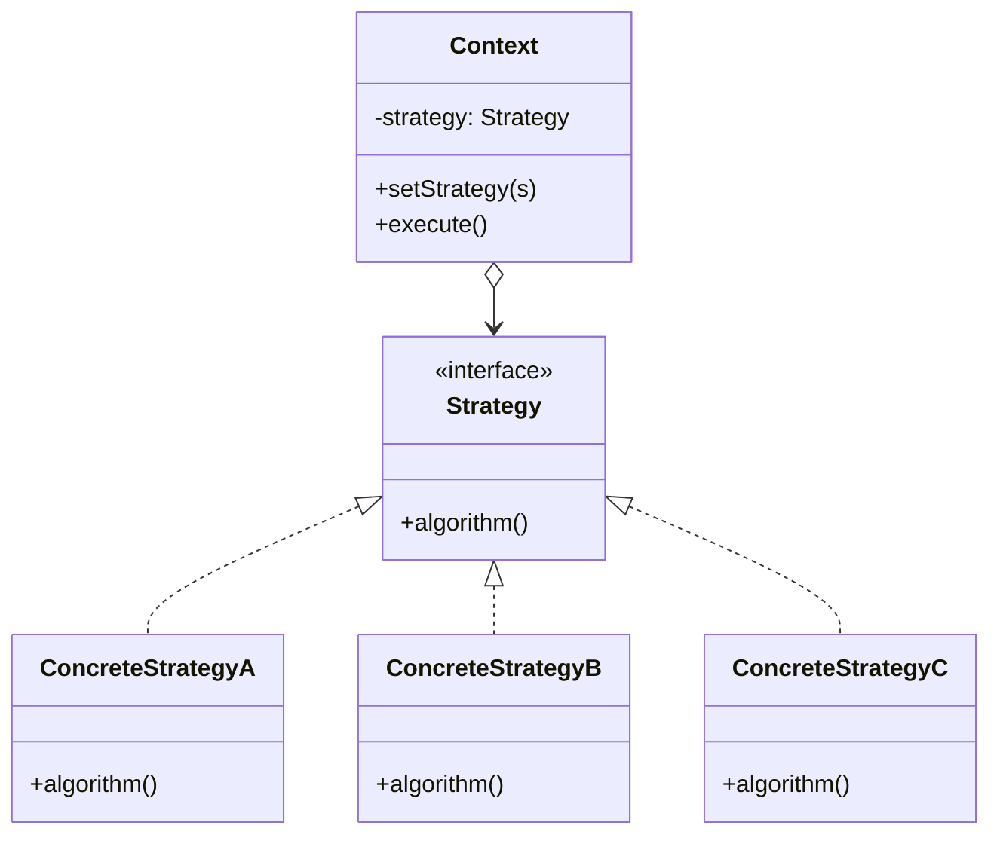
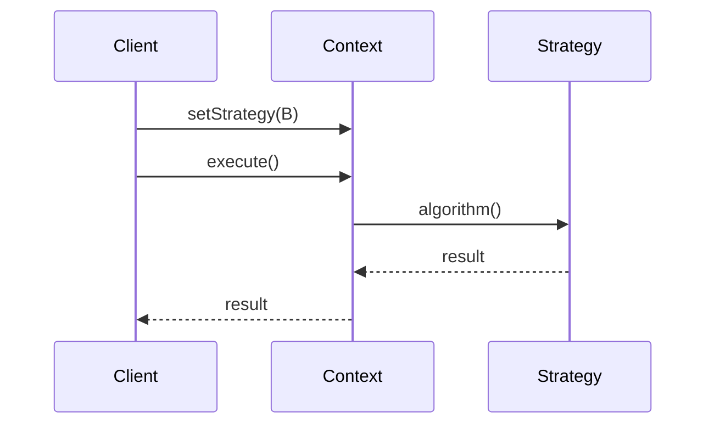

# Strategy — Junior Level

> **Source:** [refactoring.guru/design-patterns/strategy](https://refactoring.guru/design-patterns/strategy)
> **Category:** [Behavioral](../README.md) — *"Concerned with algorithms and the assignment of responsibilities between objects."*

---

## Table of Contents

1. [Introduction](#introduction)
2. [Prerequisites](#prerequisites)
3. [Glossary](#glossary)
4. [Core Concepts](#core-concepts)
5. [Real-World Analogies](#real-world-analogies)
6. [Mental Models](#mental-models)
7. [Pros & Cons](#pros--cons)
8. [Use Cases](#use-cases)
9. [Code Examples](#code-examples)
10. [Coding Patterns](#coding-patterns)
11. [Clean Code](#clean-code)
12. [Best Practices](#best-practices)
13. [Edge Cases & Pitfalls](#edge-cases--pitfalls)
14. [Common Mistakes](#common-mistakes)
15. [Tricky Points](#tricky-points)
16. [Test Yourself](#test-yourself)
17. [Tricky Questions](#tricky-questions)
18. [Cheat Sheet](#cheat-sheet)
19. [Summary](#summary)
20. [What You Can Build](#what-you-can-build)
21. [Further Reading](#further-reading)
22. [Related Topics](#related-topics)
23. [Diagrams & Visual Aids](#diagrams--visual-aids)

---

## Introduction

> Focus: **What is it?** and **How to use it?**

**Strategy** is a behavioral design pattern that defines a **family of interchangeable algorithms**, encapsulates each one in a separate class, and lets the caller pick which to use **at runtime**.

Imagine a navigation app. The user can ask for the *fastest* route, the *shortest* route, the *most fuel-efficient* route, or the *most scenic* route. All four answer the same question — "how do I get from A to B?" — but compute it differently. Putting all four into a giant `if/else` inside the route planner makes the planner a mess: each branch has its own data structures, its own performance characteristics, its own bugs. Strategy says: pull each algorithm out into its own class, give them all the same interface, and let the planner hold a *reference* to whichever one it needs.

In one sentence: *"Same problem, swappable algorithm."*

Strategy is the textbook way to apply *composition over inheritance*. Instead of subclassing the planner once per algorithm, you compose it with a strategy object. Instead of `switch (algorithm)` inside one giant method, you have polymorphism do the dispatch.

---

## Prerequisites

What you should know before reading this:

- **Required:** Basic OOP — interfaces, classes, polymorphism.
- **Required:** Composition. The context object holds a reference to a strategy.
- **Helpful:** Some experience with first-class functions / lambdas — modern Strategy in many languages reduces to "pass a function".
- **Helpful:** A taste of *why* `if/else` chains rot over time — Strategy's main benefit.

---

## Glossary

| Term | Definition |
|------|-----------|
| **Strategy** | The interface (or function type) that all interchangeable algorithms implement. |
| **Concrete Strategy** | A specific implementation of the algorithm. |
| **Context** | The object that holds a reference to a Strategy and delegates the work to it. |
| **Client** | The code that picks a Concrete Strategy and gives it to the Context. |
| **Family of algorithms** | A set of strategies that solve the same problem differently. |
| **Composition over inheritance** | Use object references (composition) instead of subclassing (inheritance) to vary behavior. |

---

## Core Concepts

### 1. A Single Interface for All Strategies

Every concrete strategy implements the **same interface** (or matches the same function signature). The Context never depends on a specific class — only on the abstract type.

```java
interface RouteStrategy {
    Route build(Point a, Point b);
}
```

`FastestRoute`, `ShortestRoute`, `ScenicRoute` all implement `RouteStrategy`. To the Context, they look identical.

### 2. Context Holds a Strategy

The Context owns a reference to one strategy at a time. It delegates the actual work to that strategy.

```java
class Navigator {
    private RouteStrategy strategy;
    public Navigator(RouteStrategy s) { this.strategy = s; }
    public Route route(Point a, Point b) { return strategy.build(a, b); }
}
```

The Context doesn't know — or care — *how* the algorithm works. It just calls `build`.

### 3. Strategy Is Picked by the Client

The client (or some configuration / DI container) picks the concrete strategy and passes it in. This is where the actual decision happens.

```java
Navigator nav = new Navigator(new FastestRoute());
nav.route(home, work);
nav = new Navigator(new ScenicRoute());   // swap at runtime
```

### 4. Composition over Inheritance

A naïve OOP design says "subclass `Navigator` to get different routing." Strategy says no — use composition. Add or remove algorithms without touching `Navigator`.

The Open/Closed Principle: open for extension (new strategies), closed for modification (no edits to Context).

---

## Real-World Analogies

| Concept | Analogy |
|---------|--------|
| **Strategy** | "How do I get to work today?" — drive, train, bike, walk. Same goal, different algorithm. You pick. |
| **Concrete Strategy** | The specific route plan once you've chosen — bike route along the river. |
| **Context** | You. You're the agent that *executes* the chosen plan. |
| **Family** | All the routing options your phone offers in the menu. |

The classical refactoring.guru analogy is **payment methods**: cash, credit card, PayPal, crypto. Same goal — pay $X for an order — but each transports the money differently. The shop (Context) doesn't care; it just calls `pay(amount)`.

Another analogy is **sorting**: bubble sort, merge sort, quicksort, radix sort. All return a sorted list. The library exposes one `sort()` function that lets you swap algorithms via a flag or comparator.

---

## Mental Models

**The intuition:** Picture a wall socket. Different appliances plug in — fan, lamp, charger — and the socket gives them all 220 V. The socket is the Context. Each appliance is a Strategy. The interface is "fits this socket."

**Why this model helps:** It makes the *interchangeability* explicit. The socket doesn't ask what each appliance does internally; it just provides power and gets out of the way.

**Visualization:**

```
┌─────────────────────┐
│      Context        │
│  ┌──────────────┐   │
│  │  Strategy*   │───┼──> ConcreteStrategyA
│  └──────────────┘   │       (algorithm A)
│        ↑            │
│   delegates to      │───> ConcreteStrategyB
└─────────────────────┘       (algorithm B)
                          ─> ConcreteStrategyC
                              (algorithm C)
```

The Context holds *one* strategy at a time but is *capable* of holding any. Swap by reassignment.

---

## Pros & Cons

| Pros | Cons |
|------|------|
| Eliminates `if/else` chains over algorithm choice | A class per strategy = more classes |
| Open/Closed: add algorithms without modifying the Context | Caller must know the strategies exist (to pick one) |
| Each algorithm is testable in isolation | Communication overhead if Context and Strategy share lots of state |
| Composition over inheritance — flexible | For trivial algorithms, the abstraction is overkill |
| Algorithms swappable at runtime | Each strategy may need similar "boilerplate" parameters |

### When to use:
- You have several variants of *the same algorithm* (sort by price / name / distance)
- The variant is picked at runtime — by the user, config, or A/B test
- A `switch (variant)` inside a method is growing
- You want to test each variant in isolation
- You expect to add more variants later

### When NOT to use:
- There's only one algorithm and no plan to add another — premature abstraction
- The "variants" share so little code that they're really different problems
- The choice is fixed at compile time and never changes — a function pointer or simple `if` suffices

---

## Use Cases

Real-world places where Strategy is commonly applied:

- **Sorting** — `Arrays.sort(arr, comparator)`, Python's `sorted(..., key=...)`. Comparator is the Strategy.
- **Compression** — `gzip`, `zstd`, `brotli`. The compressor is the Context; algorithm is the Strategy.
- **Payment processing** — Stripe, PayPal, Crypto, Bank transfer. Same `pay(amount)` interface.
- **Authentication** — JWT, OAuth2, Basic Auth, API key. Same "verify identity" outcome.
- **Pricing / discount** — student discount, holiday discount, bulk discount.
- **Routing in GPS apps** — fastest, shortest, scenic, fuel-efficient.
- **ML model selection** — RandomForest, XGBoost, Linear — all behind a `predict(x)` interface.
- **Validation** — strict, lenient, custom rules; same `validate(input)` shape.
- **Logging formatters** — JSON, plain text, structured, syslog.

---

## Code Examples

### Go

A sorting Context with three strategies.

```go
package main

import "fmt"

// Strategy.
type Sorter interface {
	Sort([]int) []int
}

// ConcreteStrategy A.
type BubbleSort struct{}

func (BubbleSort) Sort(a []int) []int {
	out := append([]int(nil), a...)
	for i := 0; i < len(out); i++ {
		for j := 0; j < len(out)-1-i; j++ {
			if out[j] > out[j+1] {
				out[j], out[j+1] = out[j+1], out[j]
			}
		}
	}
	return out
}

// ConcreteStrategy B (delegating to standard quicksort).
type QuickSort struct{}

func (QuickSort) Sort(a []int) []int {
	out := append([]int(nil), a...)
	quick(out, 0, len(out)-1)
	return out
}

func quick(a []int, lo, hi int) {
	if lo >= hi {
		return
	}
	pivot := a[(lo+hi)/2]
	i, j := lo, hi
	for i <= j {
		for a[i] < pivot { i++ }
		for a[j] > pivot { j-- }
		if i <= j {
			a[i], a[j] = a[j], a[i]
			i++; j--
		}
	}
	quick(a, lo, j)
	quick(a, i, hi)
}

// Context.
type Sorter4 struct{ strategy Sorter }

func (s *Sorter4) SetStrategy(st Sorter) { s.strategy = st }
func (s *Sorter4) Run(a []int) []int     { return s.strategy.Sort(a) }

func main() {
	c := &Sorter4{}
	data := []int{5, 2, 8, 1, 9, 3}
	c.SetStrategy(BubbleSort{})
	fmt.Println(c.Run(data))   // [1 2 3 5 8 9]
	c.SetStrategy(QuickSort{})
	fmt.Println(c.Run(data))   // [1 2 3 5 8 9]
}
```

**What it does:** A single `Sorter4` Context delegates sorting to whichever strategy you set.

**How to run:** `go run main.go`

---

### Java

A payment Context with three strategies.

```java
public interface PaymentStrategy {
    void pay(int cents);
}

public final class CreditCard implements PaymentStrategy {
    private final String number;
    public CreditCard(String n) { this.number = n; }
    public void pay(int cents) {
        System.out.printf("charged %d c to card %s%n", cents, mask(number));
    }
    private static String mask(String n) { return "****" + n.substring(n.length()-4); }
}

public final class PayPal implements PaymentStrategy {
    private final String email;
    public PayPal(String e) { this.email = e; }
    public void pay(int cents) {
        System.out.printf("charged %d c to PayPal %s%n", cents, email);
    }
}

public final class Crypto implements PaymentStrategy {
    private final String wallet;
    public Crypto(String w) { this.wallet = w; }
    public void pay(int cents) {
        System.out.printf("transferred %d c worth of BTC to %s%n", cents, wallet);
    }
}

public final class Checkout {
    private PaymentStrategy strategy;
    public Checkout(PaymentStrategy s) { this.strategy = s; }
    public void setStrategy(PaymentStrategy s) { this.strategy = s; }
    public void completeOrder(int cents) {
        // ... validate cart ...
        strategy.pay(cents);
        // ... mark order paid ...
    }
}

public class Demo {
    public static void main(String[] args) {
        Checkout c = new Checkout(new CreditCard("4242424242424242"));
        c.completeOrder(1500);

        c.setStrategy(new PayPal("alice@example.com"));
        c.completeOrder(2500);

        c.setStrategy(new Crypto("bc1q..."));
        c.completeOrder(9999);
    }
}
```

**What it does:** `Checkout` doesn't know about cards, PayPal or crypto — only `PaymentStrategy`.

**How to run:** `javac *.java && java Demo`

---

### Python

A duck-typed Strategy — no formal interface, just call the function.

```python
from typing import Callable

# Strategy = a function (input) -> price.
DiscountStrategy = Callable[[float], float]

# Concrete strategies.
def no_discount(price: float) -> float:
    return price

def student_discount(price: float) -> float:
    return price * 0.85

def black_friday(price: float) -> float:
    return price * 0.50


class Cart:
    """Context."""
    def __init__(self, discount: DiscountStrategy = no_discount):
        self._items: list[float] = []
        self._discount = discount

    def add(self, price: float) -> None:
        self._items.append(price)

    def set_discount(self, d: DiscountStrategy) -> None:
        self._discount = d

    def total(self) -> float:
        subtotal = sum(self._items)
        return self._discount(subtotal)


if __name__ == "__main__":
    cart = Cart()
    cart.add(100); cart.add(50); cart.add(20)
    print(cart.total())                  # 170.0
    cart.set_discount(student_discount)
    print(round(cart.total(), 2))        # 144.5
    cart.set_discount(black_friday)
    print(cart.total())                  # 85.0
```

**What it does:** Strategy is just a function. Python's first-class functions remove the need for a class hierarchy.

**How to run:** `python3 main.py`

---

## Coding Patterns

### Pattern 1: Function-as-Strategy

**Intent:** When the algorithm is small (one function), skip the class. Pass a function or lambda.

```python
sorted(items, key=lambda x: x.price)        # Strategy = key function
filter(lambda x: x.active, items)            # Strategy = predicate
```

```java
Collections.sort(list, (a, b) -> a.price() - b.price());
list.stream().filter(x -> x.active()).collect(toList());
```

**When:** The algorithm is one expression. No state to carry between calls.

---

### Pattern 2: Class-as-Strategy

**Intent:** When the algorithm needs configuration, state, or multiple methods, model it as a class.

```java
public final class TaxStrategy {
    private final double rate;
    public TaxStrategy(double r) { this.rate = r; }
    public double apply(double total) { return total * (1 + rate); }
}
```

**When:** The strategy holds parameters, has lifecycle, or does multi-step work.

---

### Pattern 3: Map of Strategies

**Intent:** Pick a strategy by name (string, enum) — common when the choice comes from config or a request.

```python
strategies = {
    "fastest": fastest_route,
    "shortest": shortest_route,
    "scenic": scenic_route,
}

def route(start, end, mode):
    return strategies[mode](start, end)
```

**When:** Strategies are picked dynamically at runtime, often by user input.

---

### Pattern 4: Default Strategy

**Intent:** Provide a sensible default; let callers override.

```java
public Navigator() { this(new FastestRoute()); }
public Navigator(RouteStrategy s) { this.strategy = s; }
```

**When:** Most callers want one specific algorithm; advanced callers replace it.

---

## Clean Code

- **Name strategies by *what* they do, not *how*.** `FastestRoute` not `DijkstraRoute`. The "how" can change; the "what" is the contract.
- **Keep the Strategy interface small.** A 1-method interface is ideal. Larger interfaces force every strategy to implement methods it may not need.
- **Don't pass mutable shared state into a Strategy.** Either pass values, or scope state per call.
- **Return values, don't mutate inputs.** Strategies that mutate caller state are confusing to test.
- **One algorithm per class.** Strategies that do two things are overgrown.

---

## Best Practices

- **Prefer functions to classes when the algorithm is a one-liner.** Modern languages support this idiomatically.
- **Decouple Context from concrete strategies.** Inject by interface, not by class.
- **Document the contract.** What does the Strategy assume? What can it return? What can throw?
- **Test the Context with a stub Strategy.** That decouples Context tests from algorithm tests.
- **Test each Strategy in isolation.** Don't always go through the Context.

---

## Edge Cases & Pitfalls

- **Strategy that needs Context-private state.** If a Strategy needs internal Context fields, the abstraction leaks. Either pass them as parameters or rethink the design.
- **Stateful strategies.** A Strategy that holds caller-specific state can't be safely shared between multiple Contexts. Either make it instance-scoped or stateless.
- **Strategy that mutates inputs.** Document explicitly. Most callers expect pure functions.
- **Default that hides surprises.** A default Strategy that's slow or insecure surprises users. Defaults should be the safe / common choice.
- **Strategies with different signatures.** If two strategies need different parameters, you've broken the interface. Use a single shared parameter object.

---

## Common Mistakes

1. **One-strategy "Strategy".** No second algorithm — just inline the code.
2. **Strategy that takes the Context as a parameter.** Inverts the relationship; smell.
3. **Strategy that depends on another Strategy's internals.** Strategies shouldn't know about each other.
4. **Inheritance instead of composition.** Subclassing `Navigator` to vary the algorithm — the very thing Strategy avoids.
5. **Hardcoded `if/else` to pick a strategy.** A map or factory beats a chain of `if`s.
6. **Strategies with side effects mistaken for pure functions.** Always document.

---

## Tricky Points

- **Strategy vs State** — both delegate to a separate object. *Strategy* is picked by the caller; *State* changes itself based on context. (See [Behavioral patterns](../README.md#critical-contrasts).)
- **Strategy vs Template Method** — both vary an algorithm. *Strategy* uses composition (delegate object); *Template Method* uses inheritance (override hooks).
- **Strategy vs Command** — both encapsulate "do X". *Command* is a *whole action* with `execute()`; *Strategy* is one *step* of an algorithm.
- **Lambda Strategy** — in modern languages, `Strategy` often degenerates to a function. That's not a different pattern — it's the same pattern, less ceremony.
- **Static vs dynamic Strategy** — picking a Strategy *at construction* (static) vs *each call* (dynamic) has very different testability and locking implications.

---

## Test Yourself

1. Why does Strategy implement the same interface as other strategies?
2. What's the difference between Strategy and Template Method?
3. When would a *function* be a better Strategy than a *class*?
4. What does *composition over inheritance* mean in the context of Strategy?
5. Give 5 real-world places Strategy is used.
6. Why is "one algorithm per class" a good rule?

---

## Tricky Questions

- **Q: If you have only one algorithm today, but you "might" add more next year, should you use Strategy now?**
  A: Usually no. Add abstraction when the *second* algorithm appears. Premature Strategy is wasted complexity.
- **Q: What's wrong with `Sorter.sort(arr, "quick")` (passing a string)?**
  A: You've turned a polymorphic dispatch into a runtime dispatch with magic strings — error-prone, no compile-time check, and easy to misspell. Use enums or polymorphic objects.
- **Q: Why does `Comparator` qualify as a Strategy?**
  A: It defines an algorithm (compare two items), is interchangeable, and is passed into a Context (`sort`, `TreeMap`, etc.) at runtime.
- **Q: Can two strategies share code?**
  A: Yes — extract a helper class, keep them separate strategies. Don't make one inherit from the other; that breaks the substitutability principle.

---

## Cheat Sheet

| Concept | One-liner |
|---|---|
| Intent | Encapsulate interchangeable algorithms behind one interface |
| Mechanism | Composition: Context holds a Strategy, delegates work |
| Hot loop | `context.execute()` → `strategy.method()` |
| Sibling | State (object decides), Template Method (inheritance) |
| Modern form | A function/lambda matching the Strategy signature |
| Smell to fix | A `switch` over an algorithm-choice variable |

---

## Summary

Strategy is the cleanest way to say "I have several ways to do this, pick one." It separates *what* the algorithm does (interface) from *how* (concrete class), and from *which one* (the client's pick). The result is decoupled, testable, and open to extension.

Three things to remember:
1. **One interface, many implementations.**
2. **Context holds a reference; it doesn't pick.** The client (or DI / config) picks.
3. **Function or class.** In modern languages, a function is a fine Strategy when the algorithm is small.

If you're tempted to add `if (mode == "X") doX(); else if (mode == "Y") doY()` to a method, Strategy is asking to be born.

---

## What You Can Build

- A pricing engine with student / employee / black-friday discount strategies
- A compression utility with `gzip` / `zstd` / `brotli` interchangeable
- A logger with `JsonFormat` / `PlainText` / `Syslog` formatters
- An auth middleware with `Jwt` / `OAuth2` / `BasicAuth` strategies
- A CLI sort tool that lets the user pick the algorithm

---

## Further Reading

- *Design Patterns: Elements of Reusable Object-Oriented Software* (GoF) — original Strategy chapter
- *Effective Java*, Item 22 — function-objects and Strategy
- [refactoring.guru — Strategy](https://refactoring.guru/design-patterns/strategy)
- *Head First Design Patterns*, Chapter 1 — Strategy is the introductory pattern

---

## Related Topics

- [State](../07-state/junior.md) — sibling pattern, different decision-maker
- [Template Method](../09-template-method/junior.md) — inheritance-based variation
- [Command](../02-command/junior.md) — encapsulates an action, not an algorithm step
- [Decorator](../../02-structural/04-decorator/junior.md) — adds behavior; doesn't replace it
- SOLID — OCP & DIP — Strategy applies both directly

---

## Diagrams & Visual Aids

### Class diagram



### Sequence: setting and using a strategy



### Decision flow

```
                ┌──────────────────────┐
                │ Need to vary algo?   │
                └──────────┬───────────┘
                           │ yes
                           ▼
                ┌──────────────────────┐
                │ More than one variant│
                │ (now or near-future)?│
                └──────────┬───────────┘
                           │ yes
                           ▼
                ┌──────────────────────┐
                │ Variants share an    │
                │ interface naturally? │
                └──────────┬───────────┘
                           │ yes
                           ▼
                  ──> Use Strategy
```

[← Back to Behavioral Patterns](../README.md) · [Middle →](middle.md)
