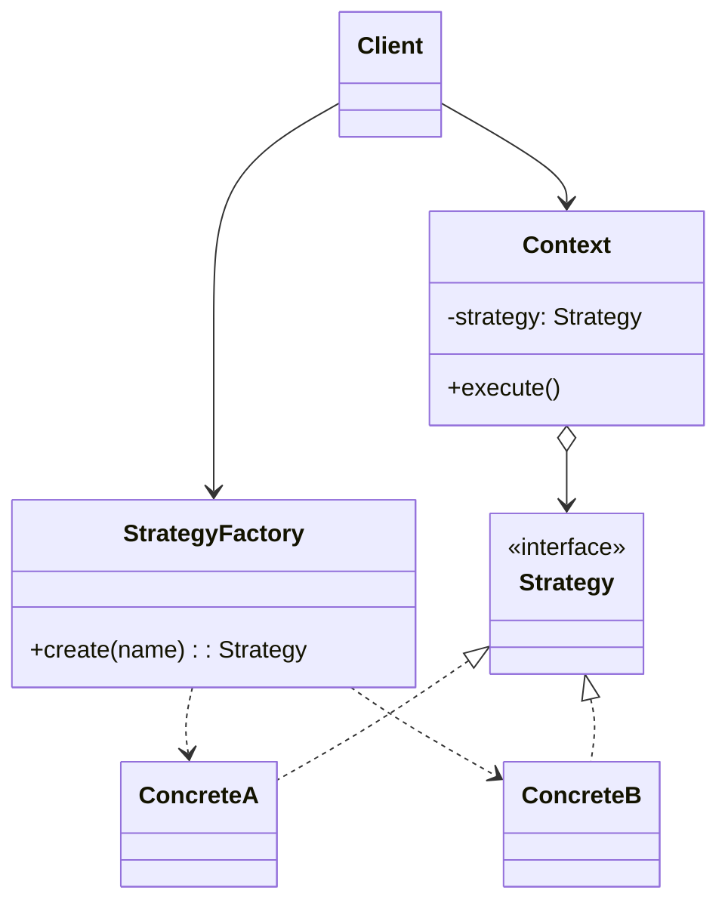
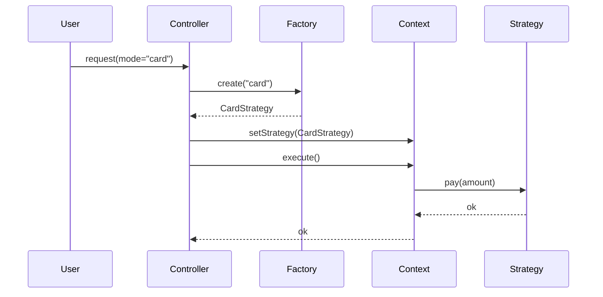

# Strategy — Middle Level

> **Source:** [refactoring.guru/design-patterns/strategy](https://refactoring.guru/design-patterns/strategy)
> **Prerequisite:** [Junior](junior.md)

---

## Table of Contents

1. [Introduction](#introduction)
2. [When to Use Strategy](#when-to-use-strategy)
3. [When NOT to Use Strategy](#when-not-to-use-strategy)
4. [Real-World Cases](#real-world-cases)
5. [Code Examples — Production-Grade](#code-examples--production-grade)
6. [Strategy via Functions vs Classes](#strategy-via-functions-vs-classes)
7. [Strategy + Factory + Registry](#strategy--factory--registry)
8. [Trade-offs](#trade-offs)
9. [Alternatives Comparison](#alternatives-comparison)
10. [Refactoring to Strategy](#refactoring-to-strategy)
11. [Pros & Cons (Deeper)](#pros--cons-deeper)
12. [Edge Cases](#edge-cases)
13. [Tricky Points](#tricky-points)
14. [Best Practices](#best-practices)
15. [Tasks (Practice)](#tasks-practice)
16. [Summary](#summary)
17. [Related Topics](#related-topics)
18. [Diagrams](#diagrams)

---

## Introduction

> Focus: **When to use it?** and **Why?**

You already know Strategy is "swap the algorithm at runtime." At the middle level the harder questions are:

- **Function or class?** Modern languages let you skip the interface entirely.
- **How do I select a strategy?** Hardcoded `new`, factory, registry, DI?
- **Where does the choice live — caller or Context?**
- **How do I share state between Context and Strategy without leaking?**

This document focuses on **decisions and patterns** that turn textbook Strategy into something that survives a year of production.

---

## When to Use Strategy

Use Strategy when **all** of these are true:

1. **You have (or will have) more than one algorithm variant.** Otherwise it's premature.
2. **The variants are interchangeable behind a stable interface.** If signatures differ, the abstraction breaks.
3. **The choice is dynamic** — runtime config, user input, A/B test, feature flag, request context.
4. **The Context shouldn't depend on algorithm internals.** Composition keeps it clean.
5. **You want each algorithm independently testable.** No mocking the Context.

If even one is missing, look elsewhere first.

### Triggers

- "I have three pricing rules and we just added a fourth." → Strategy.
- "Tomorrow we'll add radix sort to our sorter." → Strategy.
- "A/B testing two recommendation algorithms." → Strategy.
- "The compression mode should come from config." → Strategy.
- "The user picks from a dropdown." → Strategy + map/registry.

---

## When NOT to Use Strategy

- **One algorithm, no plans for more.** Premature abstraction.
- **The "variants" share less than 30% of their interface or contract.** They're really different problems.
- **The choice is fixed at compile time and never changes.** A `static final` reference or a function pointer suffices.
- **The Strategy needs deep access to Context internals.** That's a smell — Strategy should be cohesive, not coupled.
- **The "switch" is over data, not algorithms.** Use polymorphism on the data type instead.

### Smell: god-strategy

Your `OrderProcessingStrategy` has 12 methods: `validate`, `priceItems`, `applyDiscount`, `chargeCard`, `notifyUser`, `updateInventory`... That's not a Strategy — that's an entire pipeline. Split. Use **multiple** strategies (one per step) or restructure with Chain of Responsibility / pipeline pattern.

---

## Real-World Cases

### Case 1 — `Comparator` in Java collections

```java
List<Order> orders = ...;
orders.sort(Comparator.comparing(Order::price));
orders.sort(Comparator.comparing(Order::createdAt).reversed());
```

`Comparator` is a Strategy. `sort` is the Context. The sort algorithm itself (TimSort) doesn't change; the *comparison* algorithm does.

### Case 2 — Spring's `PasswordEncoder`

```java
public interface PasswordEncoder {
    String encode(CharSequence rawPassword);
    boolean matches(CharSequence rawPassword, String encodedPassword);
}
```

Implementations: `BCryptPasswordEncoder`, `Argon2PasswordEncoder`, `Pbkdf2PasswordEncoder`, `NoOpPasswordEncoder` (test only). Spring Security is the Context; you wire one in via `@Bean`.

### Case 3 — Kafka's `Partitioner`

The producer needs to pick which partition a message goes to. Kafka's `Partitioner` interface lets you swap algorithms: round-robin, hash-based, sticky, custom (e.g., by user ID). Same shape, different distribution.

### Case 4 — TLS cipher suite negotiation

Server and client agree on a cipher suite. Each suite is a strategy: AES-GCM, ChaCha20, etc. The TLS protocol is the Context; the suite is the swappable algorithm.

### Case 5 — Stripe's payment methods

```js
stripe.paymentMethods.create({ type: 'card', card: ... });
stripe.paymentMethods.create({ type: 'sepa_debit', sepa_debit: ... });
```

Each `type` selects a different concrete strategy on the server. Same outcome (collect money); different mechanism.

### Case 6 — GraphQL execution strategies

`graphql-java` has `ExecutionStrategy`: serial, async, batched. The engine is the Context; the strategy decides *how* fields are resolved.

### Case 7 — Caffeine cache eviction policies

`Caffeine.newBuilder().maximumSize(...)` uses Window TinyLFU; `expireAfterWrite(...)` uses TTL eviction. Different eviction strategies plug into the same cache shell.

---

## Code Examples — Production-Grade

### Example A — Functional Strategy with type alias (TypeScript)

```typescript
type DiscountStrategy = (subtotal: number) => number;

const noDiscount: DiscountStrategy = s => s;
const studentDiscount: DiscountStrategy = s => s * 0.85;
const blackFriday: DiscountStrategy = s => s * 0.5;

function checkout(items: number[], strategy: DiscountStrategy = noDiscount) {
    const subtotal = items.reduce((a, b) => a + b, 0);
    return strategy(subtotal);
}

console.log(checkout([100, 50, 20]));                  // 170
console.log(checkout([100, 50, 20], studentDiscount)); // 144.5
console.log(checkout([100, 50, 20], blackFriday));     // 85
```

**Why functional:** the algorithm is pure and one-line. A class hierarchy would be ceremony.

---

### Example B — Class-based Strategy with shared params (Java)

```java
public interface PricingStrategy {
    Money price(Cart cart);
}

public final class StandardPricing implements PricingStrategy {
    public Money price(Cart cart) {
        return Money.of(cart.items().stream().mapToInt(Item::cents).sum());
    }
}

public final class StudentPricing implements PricingStrategy {
    public Money price(Cart cart) {
        return new StandardPricing().price(cart).discount(0.15);
    }
}

public final class HolidayPricing implements PricingStrategy {
    private final double off;
    public HolidayPricing(double off) { this.off = off; }
    public Money price(Cart cart) {
        return new StandardPricing().price(cart).discount(off);
    }
}
```

**Why class:** `HolidayPricing` carries config (`off`) — a function alone wouldn't capture it cleanly without closure capture.

---

### Example C — Strategy registry (Python)

```python
from typing import Callable, Dict

PaymentStrategy = Callable[[float], None]

class PaymentRegistry:
    def __init__(self) -> None:
        self._strategies: Dict[str, PaymentStrategy] = {}

    def register(self, name: str) -> Callable[[PaymentStrategy], PaymentStrategy]:
        def decorator(fn: PaymentStrategy) -> PaymentStrategy:
            self._strategies[name] = fn
            return fn
        return decorator

    def get(self, name: str) -> PaymentStrategy:
        try:
            return self._strategies[name]
        except KeyError:
            raise ValueError(f"unknown strategy: {name}")


registry = PaymentRegistry()

@registry.register("card")
def pay_card(amount: float) -> None:
    print(f"charged {amount} to card")

@registry.register("paypal")
def pay_paypal(amount: float) -> None:
    print(f"charged {amount} to paypal")


def checkout(amount: float, method: str) -> None:
    registry.get(method)(amount)


if __name__ == "__main__":
    checkout(99.99, "card")
    checkout(150.0, "paypal")
```

**Why this matters:** the choice (`method`) comes from request data. A registry decouples the wiring from the call site.

---

## Strategy via Functions vs Classes

| Choice | When |
|---|---|
| **Function / lambda** | Algorithm is one expression; no state; standard library style (`sort(..., key=)`, `filter`) |
| **Class** | Algorithm carries config, has state, multi-method, or you want named types in stack traces |

### Pitfall: closure capture

```python
discounts = []
for rate in [0.1, 0.2, 0.3]:
    discounts.append(lambda x: x * (1 - rate))   # all three capture the SAME `rate`
```

After the loop, all three lambdas use `rate=0.3`. Use default args to bind: `lambda x, r=rate: x * (1 - r)`. Same hazard in JavaScript with `var` (use `let`).

---

## Strategy + Factory + Registry

The choice of strategy often comes from a string. A factory or registry shields the call site from concrete classes.

```java
public final class StrategyFactory {
    private final Map<String, Supplier<PricingStrategy>> map = Map.of(
        "standard", StandardPricing::new,
        "student",  StudentPricing::new,
        "holiday",  () -> new HolidayPricing(0.20)
    );

    public PricingStrategy create(String name) {
        Supplier<PricingStrategy> s = map.get(name);
        if (s == null) throw new IllegalArgumentException("unknown: " + name);
        return s.get();
    }
}
```

Now `Checkout` takes a `String name` from config and asks the factory. No `new` of concrete strategies in business code.

---

## Trade-offs

| Trade-off | Cost | Benefit |
|---|---|---|
| One class per strategy | More files | Each algorithm testable in isolation |
| Interface boundary | Indirection | Caller sees stable contract |
| Runtime selection | Lookup overhead (tiny) | Behavior changes without rebuild |
| Composition over inheritance | More objects | Avoids deep hierarchies |
| State outside Strategy | Caller must thread params | Strategy stays stateless / shareable |

---

## Alternatives Comparison

| Pattern | Use when |
|---|---|
| **Strategy** | Many interchangeable algorithms picked at runtime |
| **State** | Object's behavior changes based on its own state, not caller's choice |
| **Template Method** | Algorithm has a fixed skeleton; subclasses fill in steps |
| **Command** | Encapsulate a *whole* action with `execute()` (often plus `undo()`) |
| **Chain of Responsibility** | Multiple handlers might process; pass along until handled |
| **Polymorphism on data** | Variation is in *what kind of object* you have, not *what algorithm to apply* |
| **Function pointer / `if`** | Variation is trivial and binary |

---

## Refactoring to Strategy

### Symptom
A method full of `if/else` (or `switch`) over an algorithm choice variable.

```java
public Money price(Cart cart, String mode) {
    if (mode.equals("standard")) {
        return /* ... */;
    } else if (mode.equals("student")) {
        return /* ... */;
    } else if (mode.equals("holiday")) {
        return /* ... */;
    }
    throw new IllegalArgumentException();
}
```

### Steps
1. **Extract** the body of each branch into a method or a class.
2. **Define** a strategy interface with one method.
3. **Wrap** each extracted body in a class implementing the interface.
4. **Inject** the strategy into the calling class instead of the mode string.
5. **Move** the `if/else` into a factory or registry — that's where the string-to-class mapping lives.

### After

```java
public Money price(Cart cart) { return strategy.price(cart); }
```

The mapping `string → strategy` lives once, in the factory. The business code doesn't branch.

---

## Pros & Cons (Deeper)

| Pros | Cons |
|---|---|
| **Composition**: swap algorithms without touching Context | More classes / files |
| **OCP**: add an algorithm without modifying Context | Caller knows about the family of strategies |
| **Testability**: each strategy is a unit | Risk of "1-strategy Strategy" — premature abstraction |
| **Flexibility**: swap at runtime via config / DI | Indirection makes stack traces longer |
| **Readability**: replaces tangled `if/else` chains | Naming becomes important — bad names hide intent |

---

## Edge Cases

### 1. Strategy that needs Context internals

```java
class Cart {
    private List<Item> items;
    private DiscountStrategy strategy;
    public Money total() { return strategy.compute(items); }
}
```

If `compute(items)` needs more than `items` — say, the cart's user — you have two choices:
- **Pass everything explicitly.** `compute(items, user)`. Verbose but clean.
- **Pass a context object.** `compute(new PricingContext(items, user))`. Scales better.

Don't have the strategy reach back into `Cart` for fields. That couples the strategy to one Context.

### 2. Strategies that need to share state

If two strategies share state, that state belongs in the Context, not in the strategies. Strategies should be replaceable; shared state breaks that.

### 3. Strategy that holds resources

A Strategy that opens DB connections, files, or sockets is harder to swap. Either:
- Keep the resource in the Context, pass it to the Strategy each call.
- Or scope the Strategy's lifetime explicitly with a `close()` method.

### 4. Async / coroutine strategies

If the algorithm is async, decide once: every Strategy in the family must be async, or none. Mixing makes the Context's life miserable.

```kotlin
interface PaymentStrategy {
    suspend fun pay(amount: Long): PaymentResult
}
```

### 5. Default Strategy that mutates state

A "do nothing" default that accidentally mutates global state is a debugging nightmare. Defaults should be pure.

---

## Tricky Points

### Selecting a strategy: where does the choice live?

| Where | Pros | Cons |
|---|---|---|
| Inside Context (e.g., `if mode == "x"`) | Convenient | Context now knows all strategies — defeats purpose |
| Caller picks and passes | Clean | Caller must know the family |
| Factory / registry | Decouples both | One more layer |
| DI container (Spring, etc.) | Wiring is config-driven | Magic; harder to trace |

The "right" answer depends on how dynamic the choice is. Static config: DI. User input: factory + map. A/B test: feature flag service.

### Strategy across language boundaries

If your Strategy crosses a network or a process boundary, you've moved into RPC territory. The Strategy interface becomes a protocol; concrete implementations are *services*. Different category — but the *pattern* still applies.

### Strategy with mutually exclusive parameters

If `FastestRoute` needs `maxSpeed` and `ScenicRoute` needs `viewpoints`, the unified interface gets bloated:

```java
interface RouteStrategy { Route build(Point a, Point b, RouteOptions opts); }
```

`RouteOptions` accumulates union of all needs. Better:
- Constructor params on the strategy: `new FastestRoute(maxSpeed)` and `new ScenicRoute(viewpoints)` — the algorithm's config lives with the algorithm.

---

## Best Practices

- **Document the contract.** Pre-conditions, post-conditions, exceptions — uniform across strategies.
- **Make strategies stateless** when you can. Easier to share, safer concurrently.
- **Name by what, not how.** `FastestRoute` not `DijkstraRoute`. Survives refactoring.
- **Don't share strategies if they're stateful.** One per use; or make them stateless.
- **Test each strategy in isolation.** Plus one Context test with a stub.
- **Provide a sensible default.** Most callers shouldn't have to choose.
- **Wire the choice in one place.** Factory / DI / registry — pick one.

---

## Tasks (Practice)

1. **Compression CLI.** A program that compresses a file. Add `gzip` and `zstd` strategies. Selection by `--algorithm` flag.
2. **Discount engine.** Cart + 4 discount strategies. Pick by user role string.
3. **A/B test.** Two recommender strategies; pick at random per request. Log which one ran.
4. **Sort tool.** A CLI that takes a file and `--algo bubble|quick|merge` and sorts.
5. **Refactor.** Take a file with `if (mode == "x")` chains and convert to Strategy with a registry.

(Solutions in [tasks.md](tasks.md).)

---

## Summary

At the middle level, Strategy is not just "make an interface." It's a set of decisions:

- **Function or class?** Function for one-liners; class for stateful or configured algorithms.
- **How do I pick?** Factory, registry, or DI — but not `if/else` in Context.
- **What does the Strategy know?** Only its inputs and contract. Nothing about Context internals.
- **Stateless or stateful?** Default to stateless.

The real win isn't fewer lines; it's **contract clarity**. Every strategy is a small, named, replaceable piece of behavior.

---

## Related Topics

- [State](../07-state/middle.md) — sibling pattern
- [Template Method](../09-template-method/middle.md) — inheritance-based variation
- [Command](../02-command/middle.md) — actions as objects
- [Factory Method / Abstract Factory](../../01-creational/) — creating strategies cleanly
- [Dependency Injection](../../../coding-principles/di.md) — wiring strategies into Contexts

---

## Diagrams

### Strategy with Factory



### Sequence: dynamic selection



[← Junior](junior.md) · [Senior →](senior.md)
