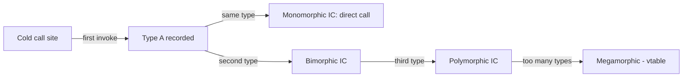
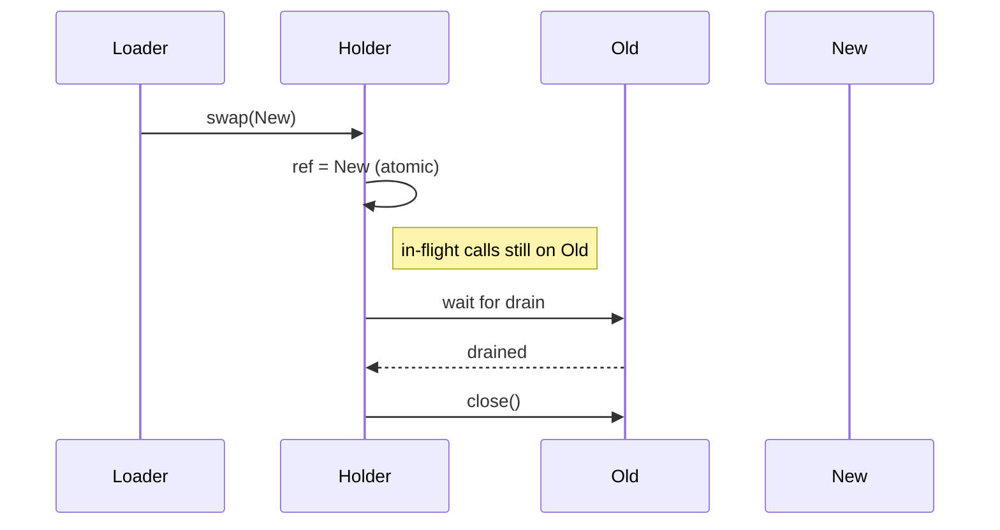

# Strategy — Professional Level

> **Source:** [refactoring.guru/design-patterns/strategy](https://refactoring.guru/design-patterns/strategy)
> **Prerequisite:** [Senior](senior.md)

---

## Table of Contents

1. [Introduction](#introduction)
2. [JIT and Inline Caches](#jit-and-inline-caches)
3. [Megamorphic Call Sites](#megamorphic-call-sites)
4. [Lambda Performance vs Class](#lambda-performance-vs-class)
5. [Closure Allocation](#closure-allocation)
6. [Strategy in Hot Paths — Branch-free Alternatives](#strategy-in-hot-paths--branch-free-alternatives)
7. [Thread-safe Hot Swaps](#thread-safe-hot-swaps)
8. [Memory & Cache Locality](#memory--cache-locality)
9. [Microbenchmark Anatomy](#microbenchmark-anatomy)
10. [Cross-Language Comparison](#cross-language-comparison)
11. [Strategy in Async/Reactive Pipelines](#strategy-in-asyncreactive-pipelines)
12. [Diagrams](#diagrams)
13. [Related Topics](#related-topics)

---

## Introduction

A Strategy at the professional level is examined for what the runtime makes of it: how the JIT inlines monomorphic call sites, how it falls back to vtable dispatch on megamorphic ones, how lambdas allocate (or don't), and where the inevitable performance cliffs are.

For high-throughput services — payment routing, request dispatch, encoders in tight loops — the Strategy machinery itself can be measurable. This document quantifies it.

---

## JIT and Inline Caches

### Monomorphic call site

```java
final PaymentStrategy s = new StripeStrategy();
for (Order o : orders) {
    s.pay(o);   // s.getClass() is always StripeStrategy here
}
```

The HotSpot JIT records the type seen at this call site. After warmup (usually ~10K invocations), it sees one type → builds a *monomorphic inline cache*. Result: the call is dispatched as a direct call. If the method body is small, it's inlined entirely.

After C2 compiles, this loop is identical in cost to:

```java
for (Order o : orders) { stripe_pay_inlined(o); }
```

### Bimorphic call site

```java
PaymentStrategy s = pickByOrder(o);   // returns Stripe or Adyen
s.pay(o);
```

Two types observed → bimorphic inline cache. Cost: a single type check + direct call. Still very fast (~1 ns).

### Polymorphic / megamorphic

3+ types → falls back to vtable lookup. Cost: ~2-3 ns per call. The body cannot be inlined into the caller. Branch prediction can still help, but you've lost the JIT's ability to fuse the strategy into the surrounding code.

---

## Megamorphic Call Sites

When 10+ strategies funnel through one site (e.g., `dispatcher.handle(req)` for many handler types), the JIT gives up on inlining. Symptoms:

- CPU profile shows time *inside* virtual dispatch.
- Adding a new strategy slightly slows the entire path.

**Mitigations:**

### 1. Split call sites

```java
// Bad: one site, megamorphic
strategies.forEach(s -> s.handle(req));

// Better: separate call sites if you can identify groups
fastStrategies.forEach(s -> s.handle(req));
slowStrategies.forEach(s -> s.handle(req));
```

Each site sees fewer types → re-monomorphic.

### 2. Type-specialized dispatch

```java
switch (req.kind()) {
    case CARD:    cardStrategy.pay(req); break;
    case CRYPTO:  cryptoStrategy.pay(req); break;
    case BANK:    bankStrategy.pay(req); break;
}
```

Each branch is monomorphic. JIT inlines per branch. Faster than virtual dispatch — but couples the dispatcher to the family.

### 3. Code generation

For ML pipelines or query engines, generate a specialized dispatcher per query / model. Apache Drill, Spark Catalyst, and ART (Android Runtime) do this — runtime code gen avoids vtable cost entirely.

### Numbers (rough, per JVM, JDK 21, x86)

| Site type | ns/call | Inlinable |
|---|---|---|
| Direct call | 0.3 | Yes |
| Monomorphic Strategy | 0.3 | Yes |
| Bimorphic | 0.6 | Yes |
| Polymorphic (3-7) | 1-2 | Sometimes |
| Megamorphic (8+) | 2-4 | No |

For business code: irrelevant. For 10-million-ops loops: matters.

---

## Lambda Performance vs Class

### Java 8+ lambdas

A `Function<T, R>` lambda is desugared into an `invokedynamic`-backed instance. The first call constructs an anonymous class via the LambdaMetafactory. Subsequent calls reuse the cached instance.

```java
Function<Order, Money> price = order -> Money.of(order.cents());
```

Cost after warmup: identical to a hand-written class. The JIT inlines through the lambda just as it would through a class.

### Closure capture

```java
double rate = config.discountRate();
Function<Money, Money> discount = m -> m.times(1 - rate);   // captures rate
```

Each invocation of the *outer* method allocates a new lambda instance. If you're in a hot loop creating closures, you're allocating.

```java
// Bad — allocates per call
list.forEach(item -> price(item, rate));

// Better — hoist
Function<Item, Money> priceWithRate = item -> price(item, rate);
list.forEach(priceWithRate);
```

### Non-capturing lambdas

A non-capturing lambda is *singleton-ish*: the LambdaMetafactory returns the same instance each time. No allocation pressure.

```java
list.sort((a, b) -> a.price() - b.price());   // captures nothing → cached
```

### Other languages

- **Kotlin** — `inline fun` + lambda compiles to no allocation at all; the lambda body is inlined into the caller.
- **C#** — closures over locals box those locals onto the heap. Hot paths should avoid capture.
- **C++ lambdas** — stack-allocated by default; `std::function` boxes (allocates).
- **Go** — closures allocate on the heap via escape analysis.
- **Python** — closures are objects; per-call dispatch is dict-lookup-based, ~50× slower than C-equivalent.

---

## Closure Allocation

```python
def make_strategies():
    return [lambda x, r=rate: x * r for rate in [0.1, 0.2, 0.3]]
```

Three lambda objects, each capturing `r`. In Python: ~3 small objects, negligible. In Java/Kotlin in a hot loop: measurable. Profile before optimizing.

---

## Strategy in Hot Paths — Branch-free Alternatives

If profiling shows the Strategy dispatch *itself* is the bottleneck (rare but real in interpreters, packet processing, game engines):

### 1. Function table indexed by enum

```c
typedef int (*op_t)(int);
static op_t ops[] = { op_add, op_sub, op_mul };
ops[op](x);
```

One indirect call. No vtable. No instance.

### 2. SIMD / vectorized strategies

For data-parallel work, the "strategy" is a kernel that runs over arrays. Branchless dispatch across N items via SIMD instead of per-item dispatch.

### 3. Code-generated dispatchers

Apache Arrow / DuckDB generate per-query code with the operators inlined. The "strategies" are picked at compile time of the query, not at execution.

### Trade-offs

These give up Strategy's polymorphic flexibility for raw speed. Use only when profiling demands it.

---

## Thread-safe Hot Swaps

```java
class StrategyHolder {
    private volatile Strategy current = new DefaultStrategy();

    public void swap(Strategy s) { current = s; }
    public Result run(Input i)   { return current.run(i); }
}
```

`volatile` gives sequential-consistent reads/writes for the reference. Readers always see a fully-published strategy.

### Memory ordering caveats

```java
// Strategy with config:
class ConfiguredStrategy implements Strategy {
    final Config cfg;
    ConfiguredStrategy(Config c) { this.cfg = c; }
}
```

Because `cfg` is `final`, the JMM guarantees that any thread observing the strategy reference also observes a fully-initialized `cfg`. **Without `final`**, you'd need either `volatile` on every field or careful synchronization.

### CAS-based atomic swap

```java
class StrategyHolder {
    private final AtomicReference<Strategy> ref = new AtomicReference<>(new DefaultStrategy());
    public boolean trySwap(Strategy expected, Strategy newOne) {
        return ref.compareAndSet(expected, newOne);
    }
}
```

Useful when only one of N writers should win — e.g., during a deploy where multiple sources try to set the strategy.

### Strategy lifecycle

If swapping a strategy means closing the old one (e.g., it holds a connection pool), don't just swap — drain. Pattern:

1. Atomically swap reference.
2. Wait for in-flight calls to drain (counter or `Phaser`).
3. Close the old instance.

---

## Memory & Cache Locality

A Strategy adds one indirection: `context → strategy → method body`. In CPU-cache terms:

- **Strategy reference** — usually hot in L1.
- **Strategy object** — usually hot in L1/L2 if it's a singleton.
- **Method body** — depends on how often this strategy runs.

**The penalty is real but tiny** for any code where the strategy is reused. For one-shot strategies (allocate, call once, discard), allocation cost dominates dispatch.

For ultra-hot paths, *struct-of-arrays* (data-oriented design) often beats Strategy: store all data flat, pick the algorithm once, iterate. ECS games engines do this.

---

## Microbenchmark Anatomy

### A correct JMH benchmark

```java
@State(Scope.Benchmark)
public class StrategyBench {
    Strategy mono = new ConcreteA();
    Strategy[] poly = { new ConcreteA(), new ConcreteB(), new ConcreteC() };
    int i;

    @Benchmark
    public int monomorphic() {
        return mono.run(42);
    }

    @Benchmark
    public int megamorphic() {
        return poly[(i++) % poly.length].run(42);
    }
}
```

Run with warmup. Compare. The difference is the dispatch cost — usually small.

### Pitfalls

- **Constant folding** — if the benchmark always uses the same input, the JIT can fold the entire call. Use `Blackhole.consume()` or vary inputs.
- **Dead code elimination** — return values that aren't used get optimized away.
- **Insufficient warmup** — early measurements include interpreter cost.

For real measurements, JMH (Java), benchstat (Go), Criterion (Rust), pytest-benchmark (Python).

---

## Cross-Language Comparison

| Language | Strategy Dispatch | Inlining | Hot-swap |
|---|---|---|---|
| **Java/JVM** | vtable / invokedynamic | Yes (warmup-based) | `volatile` ref |
| **Kotlin** | vtable; `inline` removes it | Yes (compile-time for inline) | `@Volatile` ref |
| **C#** | vtable / interface dispatch | Yes (tiered JIT) | `volatile` field |
| **Go** | itable lookup (interface) | Limited (compiler-driven) | `atomic.Value` |
| **Rust** | `dyn Trait` is a vtable; static dispatch with generics inlines | Yes (with monomorphization) | `ArcSwap` |
| **C++** | virtual = vtable; templates = static dispatch | Static is inlined | Atomic shared_ptr |
| **Python** | dict lookup (everything is dynamic) | None (interpreter) | Just reassign attribute |
| **JavaScript** | hidden classes + IC; megamorphic site degenerates | Yes (V8 TurboFan) | Just reassign |

In **statically dispatched** languages (Rust generics, C++ templates), Strategy compiles to zero overhead — the algorithm is monomorphized into the caller. The trade-off: code bloat (one specialization per type).

In **dynamically dispatched** languages, Strategy is just normal method calls; runtime does the bookkeeping.

In **interpreted** languages (Python, Ruby), every call is dynamic anyway; Strategy is essentially free in *relative* terms but expensive in absolute terms — choose carefully in hot loops.

---

## Strategy in Async/Reactive Pipelines

```kotlin
interface PaymentStrategy {
    suspend fun pay(amount: Money, ctx: PaymentContext): PaymentResult
}
```

Async strategies introduce more concerns:

- **Backpressure** — a slow strategy stalls a stream; pick concurrent strategies carefully.
- **Cancellation** — does the strategy honor cancellation? Stuck I/O calls don't.
- **Errors** — async errors propagate differently. Ensure each strategy normalizes failures into the contract.

### Reactive (Project Reactor)

```java
public interface ReactiveStrategy {
    Mono<Result> run(Input input);
}
```

A reactive Strategy returns a `Mono` / `Flux`. The Context can:
- `flatMap` to chain.
- `switchMap` to swap mid-flight (advanced; usually not what you want).
- Apply timeouts, retries via `Mono` operators on the strategy's output.

### Pitfall: blocking inside an async Strategy

If a strategy does blocking I/O on the main reactor thread, it stalls everything. Wrap with `subscribeOn(Schedulers.boundedElastic())` or refactor to true async.

---

## Diagrams

### Inline cache evolution



### Hot-swap with drain



---

## Related Topics

- [Template Method](../09-template-method/professional.md) — performance trade-offs vs Strategy
- [Visitor](../10-visitor/professional.md) — double dispatch costs
- Polymorphism vs branching
- JIT & inline caching
- Async patterns

[← Senior](senior.md) · [Interview →](interview.md)
