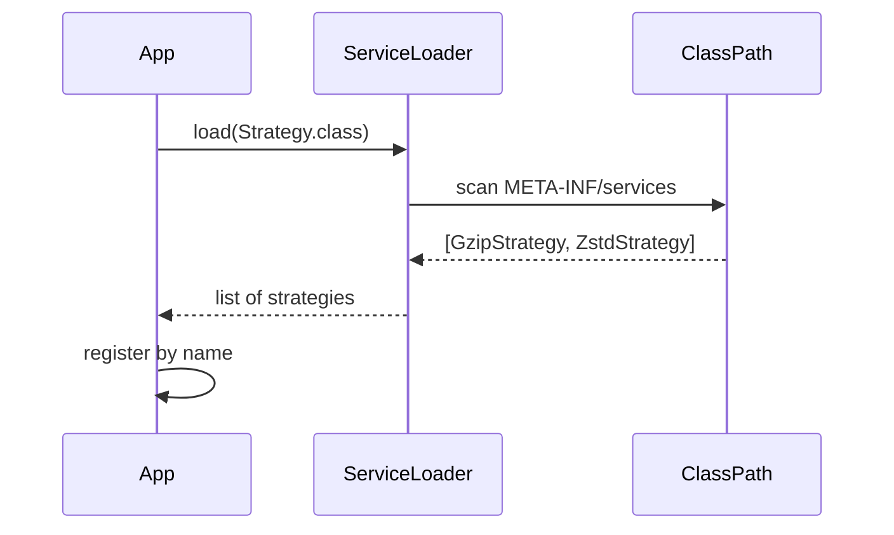
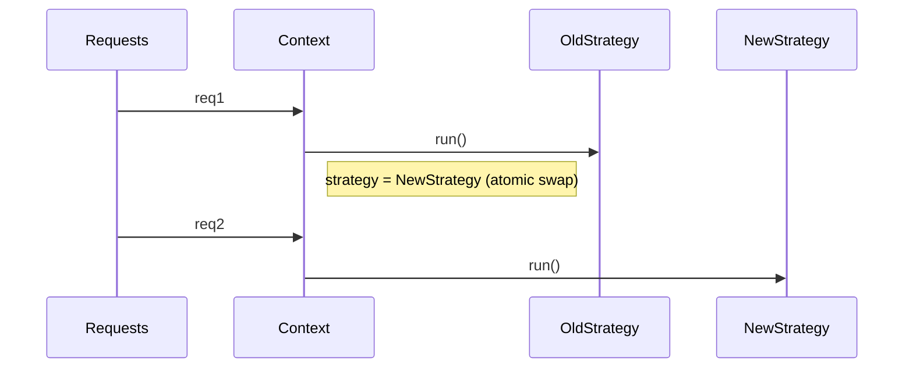

# Strategy — Senior Level

> **Source:** [refactoring.guru/design-patterns/strategy](https://refactoring.guru/design-patterns/strategy)
> **Prerequisite:** [Middle](middle.md)

---

## Table of Contents

1. [Introduction](#introduction)
2. [Strategy at Architectural Scale](#strategy-at-architectural-scale)
3. [Performance Considerations](#performance-considerations)
4. [Concurrency & Thread Safety](#concurrency--thread-safety)
5. [Testability Strategies](#testability-strategies)
6. [When Strategy Becomes a Problem](#when-strategy-becomes-a-problem)
7. [Code Examples — Advanced](#code-examples--advanced)
8. [Real-World Architectures](#real-world-architectures)
9. [Pros & Cons at Scale](#pros--cons-at-scale)
10. [Trade-off Analysis Matrix](#trade-off-analysis-matrix)
11. [Migration Patterns](#migration-patterns)
12. [Diagrams](#diagrams)
13. [Related Topics](#related-topics)

---

## Introduction

> Focus: **At scale, what breaks? What earns its keep?**

In toy code Strategy is "swap a comparator." In production it is "every payment goes through one of seven processors selected by region, currency, fraud-score and feature flag" or "every request goes through a chain of authentication strategies each one tried in order." The senior question isn't "do I write Strategy?" — it's **"what's the right granularity, and what's the operational cost of the chosen mechanism?"**

At scale Strategy intersects with:

- **Plugin architectures** — strategies discovered at runtime via SPI / DI / classpath scanning.
- **Feature flags / experimentation** — strategies selected per-request from a flag service.
- **Distributed configuration** — strategy choice driven by Consul, etcd, or remote config.
- **Multi-tenant systems** — strategy-per-tenant; thousands of strategies live simultaneously.
- **Hot-reload** — strategies swapped without restart; concurrency hazards multiply.

These are Strategy at architectural scale; the fundamentals apply but the operational concerns dominate.

---

## Strategy at Architectural Scale

### 1. Plugin systems — Java SPI

`META-INF/services/com.example.Strategy` lists implementations on the classpath. `ServiceLoader.load(Strategy.class)` discovers them. JDBC drivers, logging providers, and Kafka serializers all use this.

The interface is the Strategy contract; the JAR is the unit of deployment. Adding a strategy = dropping a JAR.

### 2. Spring's strategy autowiring

```java
@Autowired
private List<PaymentStrategy> strategies;
```

Spring injects every bean implementing `PaymentStrategy`. The Context picks one (often by an `@Qualifier` or by `supports(method)`). Scales to dozens of strategies without code changes.

### 3. Feature-flag-driven strategies

```java
PaymentStrategy strategy = flags.getOrDefault("payment.processor", "stripe").equals("adyen")
    ? adyenStrategy
    : stripeStrategy;
```

The flag service is the choice machinery. Flipping the flag flips the strategy globally — within seconds. Combined with rollout %, you get safe canary deploys.

### 4. Per-tenant strategy

In a multi-tenant SaaS, each tenant might have its own pricing rules, quota policies, or auth method. Strategies are looked up by `tenantId` from a registry that survives the request.

```java
PricingStrategy strategy = pricingByTenant.get(tenantId);
```

The registry is hot data; it's updated as tenants change plans.

### 5. Service mesh & traffic routing

Envoy / Istio routing rules are *strategies* applied to traffic: weighted, canary, retry, fault injection. The data plane is the Context; the rules are the Strategy. Strategy at network scale.

### 6. ML model selection

Online recommender systems hold dozens of models — Strategy per model. Per-request routing picks one (often by user segment for A/B testing). Models are reloaded periodically; Strategy lifecycle becomes a dedicated subsystem.

---

## Performance Considerations

### Static dispatch (call site monomorphic)

```java
final PaymentStrategy strategy = ...;
strategy.pay(amount);   // JIT can inline if the call site sees one type
```

If the JVM observes the same concrete strategy at this call site for many calls, the JIT inlines. Cost: zero. Same as direct method call.

### Polymorphic dispatch (megamorphic)

If 10 concrete strategies pass through the same call site, the inline cache misses; the JVM falls back to vtable dispatch. Cost: ~1-3 ns per call. Negligible unless the call is in a tight loop.

```java
for (Order o : orders) {
    strategyByOrder(o).price(o);   // megamorphic if many strategies
}
```

When this matters, you have two choices:
- **Bimorphic split** — partition orders by strategy type first; loop per partition.
- **Lookup table** — for known small N strategies, an array indexed by enum is faster than HashMap.

### Allocation overhead

Each new strategy instance is a tiny object. If you new-up strategies per request:

```java
new HolidayPricing(0.20).price(cart);   // allocation per call
```

You're churning allocations. For stateless strategies, hold a singleton (even a `static final`). For configured strategies, cache by config key.

### Indirection cost in hot paths

Strategy adds one level of indirection over an inlined direct call. In trading systems, kernel-bypass network paths, or game render loops, that level matters. For 99% of business code, it doesn't.

---

## Concurrency & Thread Safety

### Stateless strategies are free

A pure-function strategy can be shared across threads with zero synchronization. This is the default and what you should aim for.

### Stateful strategies — make them immutable

If a strategy carries config, freeze it at construction. Don't expose mutators.

```java
public final class HolidayPricing implements PricingStrategy {
    private final double off;
    public HolidayPricing(double off) { this.off = off; }
    public Money price(Cart c) { /* ... */ }
}
```

Immutable + final fields = thread-safe by construction (final fields publish safely under JMM).

### Mutable strategies — confine to one thread

If the strategy must mutate (e.g., a counter), confine it. One strategy instance per thread, or per request. Don't share.

### Hot-swapping strategies under load

```java
class Context {
    private volatile Strategy strategy;
    public void setStrategy(Strategy s) { this.strategy = s; }
    public Result execute() { return strategy.run(); }
}
```

`volatile` gives you atomic visibility. Reads always see a consistent reference. But: if `execute()` calls multiple strategy methods, the strategy could change mid-call. Either:
- Document that strategy swaps occur between operations only.
- Snapshot once: `Strategy local = strategy; local.run1(); local.run2();`.

### CompareAndSet for atomic swaps

```java
class Context {
    private final AtomicReference<Strategy> strategy;
    public boolean trySwap(Strategy expected, Strategy newOne) {
        return strategy.compareAndSet(expected, newOne);
    }
}
```

Useful when only one swap should happen at a time.

---

## Testability Strategies

### Test each strategy independently

Strategies are usually pure or near-pure — easy to unit test.

```java
@Test void holidayDiscountIs20Percent() {
    Cart c = Cart.of(Item.of(100));
    assertEquals(80, new HolidayPricing(0.20).price(c).cents());
}
```

### Test the Context with a fake strategy

```java
@Test void contextDelegatesToStrategy() {
    PricingStrategy fake = cart -> Money.of(42);
    Checkout co = new Checkout(fake);
    assertEquals(42, co.total(emptyCart()).cents());
}
```

The Context test doesn't depend on real strategies. You're testing the *delegation*, not the algorithms.

### Property tests for the family

If all strategies should obey an invariant ("price never negative"), express it as a property test against every strategy.

```java
@Property
void priceIsNonNegative(@ForAll PricingStrategy s, @ForAll Cart c) {
    assertTrue(s.price(c).cents() >= 0);
}
```

This catches strategies that break the family contract.

---

## When Strategy Becomes a Problem

### 1. The interface keeps growing

Initial: `Strategy.execute()`. After a year: `execute()`, `validate()`, `prepare()`, `cleanup()`, `metrics()`. Each new method forces every strategy to update — defeating the open/closed point.

**Fix:** keep the interface minimal. Add capabilities through composition (extra strategies, observers) instead of methods.

### 2. Strategies share too much

Five strategies each have 90% of the same code. You're wasting copies.

**Fix:** Template Method (extract the shared scaffolding into a base class with hooks for the differences). Or extract a helper used by all strategies.

### 3. Strategies need different parameters

`FastestRoute(maxSpeed)`, `ScenicRoute(viewpoints)`, `PublicTransitRoute(modes)`. The Context call site can't simply pass the right thing.

**Fix:** Push the parameter into the strategy at construction, not at call. Now they all expose `build(a, b)` — the inputs they need at call time are uniform.

### 4. The choice logic itself becomes complex

```java
PaymentStrategy s;
if (region.equals("EU") && currency.equals("EUR") && !fraud) s = new SepaStrategy();
else if (region.equals("US") && card) s = new VisaStrategy();
else if (...)
```

Now the *picker* is the spaghetti.

**Fix:** Promote the picker to a first-class subsystem. Rules engine, decision table, or feature-flag-driven config. Decouple "which" from "how".

### 5. Strategies hold connections

A strategy that owns a DB pool or HTTP client can't be swapped without lifecycle care.

**Fix:** keep the resource in a shared pool / Context; pass it in or hold it via DI scope.

---

## Code Examples — Advanced

### A — Strategy + plugin discovery (Java SPI)

```java
public interface CompressionStrategy {
    String name();
    byte[] compress(byte[] data);
    byte[] decompress(byte[] data);
}

// META-INF/services/com.example.CompressionStrategy
// com.example.GzipStrategy
// com.example.ZstdStrategy

public final class CompressorService {
    private final Map<String, CompressionStrategy> byName = new HashMap<>();

    public CompressorService() {
        for (CompressionStrategy s : ServiceLoader.load(CompressionStrategy.class)) {
            byName.put(s.name(), s);
        }
    }

    public byte[] compress(String algo, byte[] data) {
        CompressionStrategy s = byName.get(algo);
        if (s == null) throw new IllegalArgumentException("unknown algo: " + algo);
        return s.compress(data);
    }
}
```

A new compression algorithm = a new JAR on the classpath. No code changes.

---

### B — Strategy via DI + qualifier (Spring)

```java
public interface PaymentStrategy {
    PaymentResult pay(Money amount, PaymentContext ctx);
}

@Component @Qualifier("stripe")
public class StripeStrategy implements PaymentStrategy { /* ... */ }

@Component @Qualifier("adyen")
public class AdyenStrategy implements PaymentStrategy { /* ... */ }

@Component
public class Checkout {
    private final Map<String, PaymentStrategy> byName;

    @Autowired
    public Checkout(Map<String, PaymentStrategy> byName) {
        this.byName = byName;   // Spring injects all qualified beans
    }

    public PaymentResult charge(String provider, Money amount, PaymentContext ctx) {
        return byName.get(provider).pay(amount, ctx);
    }
}
```

`provider` comes from request body or feature flag. Adding `klarnaStrategy` is one new bean.

---

### C — Hot-swap with atomic reference (Go)

```go
package main

import (
    "fmt"
    "sync/atomic"
)

type Strategy interface{ Run(int) int }

type Square struct{}
func (Square) Run(x int) int { return x * x }

type Cube struct{}
func (Cube) Run(x int) int { return x * x * x }

type Context struct{ strategy atomic.Value }

func (c *Context) SetStrategy(s Strategy) { c.strategy.Store(s) }
func (c *Context) Run(x int) int          { return c.strategy.Load().(Strategy).Run(x) }

func main() {
    c := &Context{}
    c.SetStrategy(Square{})
    fmt.Println(c.Run(4))   // 16
    c.SetStrategy(Cube{})
    fmt.Println(c.Run(4))   // 64
}
```

`atomic.Value` ensures readers always see a fully-published strategy. No races.

---

### D — Strategy + per-tenant cache

```java
public final class TenantPricing {
    private final Map<TenantId, PricingStrategy> byTenant = new ConcurrentHashMap<>();
    private final Function<TenantId, PricingStrategy> loader;

    public TenantPricing(Function<TenantId, PricingStrategy> loader) {
        this.loader = loader;
    }

    public Money price(TenantId t, Cart cart) {
        return byTenant.computeIfAbsent(t, loader).price(cart);
    }

    public void invalidate(TenantId t) { byTenant.remove(t); }
}
```

Each tenant has its own strategy instance, lazily loaded and cached. Invalidation removes it. Scales to thousands of tenants.

---

## Real-World Architectures

### Stripe Radar — fraud detection

Stripe selects fraud-detection strategies per merchant. Different rule sets, ML models, and thresholds. Strategy chosen at request time based on merchant profile + traffic type.

### Netflix — encoder selection

Different videos / devices / bitrates use different encoder strategies (H.264, HEVC, AV1). The encoding service is the Context; the strategy depends on input + target.

### Kubernetes — scheduler plugins

The kube-scheduler is configurable via Strategy-shaped plugin points: `Filter`, `Score`, `Bind`. Each plugin is a strategy; the scheduler is the Context. New plugins = new behaviors without modifying the scheduler.

### AWS Lambda — runtime selection

Lambda picks an *invocation strategy* per function: cold start, warm, provisioned-concurrency, container reuse. Same `invoke()` interface; very different mechanics.

---

## Pros & Cons at Scale

| At scale: pros | At scale: cons |
|---|---|
| Plugin point: extend by adding code, not modifying | Versioning the interface across JARs / services is hard |
| Per-tenant / per-region behavior cleanly | Strategy registry can become a god-object |
| A/B testing trivial — swap strategies via flags | Hot-swap concurrency hazards multiply |
| Offload changes to config / DI, not code deploys | Operational discovery: "which strategy ran?" needs explicit logging |
| Fits well with feature flags + rollouts | Stale strategy instances after redeploys can cause subtle bugs |

---

## Trade-off Analysis Matrix

| Dimension | Function-based | Class-based | Plugin-based |
|---|---|---|---|
| **Discoverability** | Hard (functions are not registered) | Medium (manual registration) | Easy (SPI / DI scan) |
| **Hot-swap** | Need a holder | `volatile`/atomic ref | Live class loading |
| **Per-call overhead** | Lowest | Low | Low |
| **Allocation** | Closure capture cost | Object cost | Loaded once |
| **Test isolation** | Easy | Easy | Medium (need DI test wiring) |
| **Type-safety on selection** | Compile-time | Compile-time | Often string keys |
| **Versioning** | Easy | Medium | Hard (deployed separately) |

---

## Migration Patterns

### Adding a new strategy without breaking callers

1. Add the new concrete class.
2. Register it (factory / DI).
3. Optional: ramp it via a flag.
4. No interface change → callers unaffected.

### Changing the Strategy interface

This is the hard one — every concrete strategy must adapt.

**Pattern: dual interfaces during migration.**
- Add `StrategyV2` with the new method.
- Provide a default in `StrategyV2` that adapts from old.
- Migrate concrete classes one at a time.
- Once all moved, remove `Strategy` v1.

### Removing a strategy

1. Confirm no production traffic routes to it (logs, metrics).
2. Remove from registry.
3. Wait one release.
4. Delete code.

---

## Diagrams

### Plugin discovery



### Hot-swap under load



---

## Related Topics

- [State](../07-state/senior.md) — sibling pattern at scale
- [Template Method](../09-template-method/senior.md) — for extracting shared scaffolding
- [Chain of Responsibility](../01-chain-of-responsibility/senior.md) — when "pick one" becomes "try several in order"
- SOLID — OCP & DIP — Strategy is the canonical OCP application
- Plugin architecture

[← Middle](middle.md) · [Professional →](professional.md)
