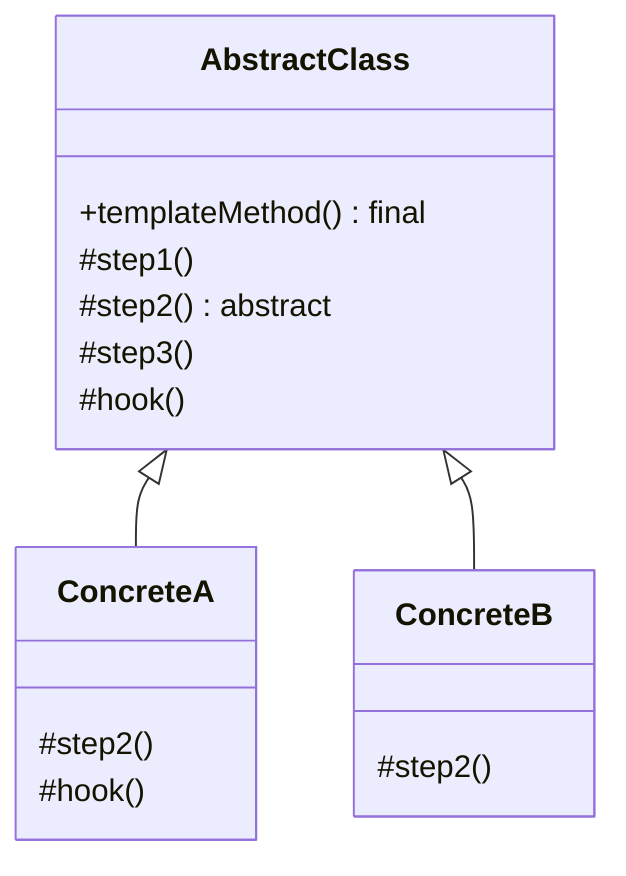
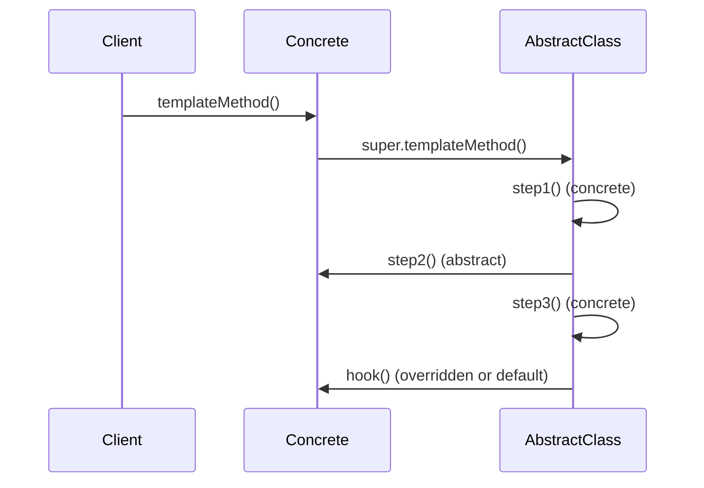

# Template Method — Junior Level

> **Source:** [refactoring.guru/design-patterns/template-method](https://refactoring.guru/design-patterns/template-method)
> **Category:** [Behavioral](../README.md) — *"Concerned with algorithms and the assignment of responsibilities between objects."*

---

## Table of Contents

1. [Introduction](#introduction)
2. [Prerequisites](#prerequisites)
3. [Glossary](#glossary)
4. [Core Concepts](#core-concepts)
5. [Real-World Analogies](#real-world-analogies)
6. [Mental Models](#mental-models)
7. [Pros & Cons](#pros--cons)
8. [Use Cases](#use-cases)
9. [Code Examples](#code-examples)
10. [Coding Patterns](#coding-patterns)
11. [Clean Code](#clean-code)
12. [Best Practices](#best-practices)
13. [Edge Cases & Pitfalls](#edge-cases--pitfalls)
14. [Common Mistakes](#common-mistakes)
15. [Tricky Points](#tricky-points)
16. [Test Yourself](#test-yourself)
17. [Tricky Questions](#tricky-questions)
18. [Cheat Sheet](#cheat-sheet)
19. [Summary](#summary)
20. [What You Can Build](#what-you-can-build)
21. [Further Reading](#further-reading)
22. [Related Topics](#related-topics)
23. [Diagrams & Visual Aids](#diagrams--visual-aids)

---

## Introduction

> Focus: **What is it?** and **How to use it?**

**Template Method** is a behavioral design pattern that defines the **skeleton of an algorithm** in a base class and lets subclasses **override specific steps** without changing the algorithm's overall structure.

Imagine a coffee-making routine: boil water, brew, pour into cup, add condiments. Tea follows the same structure but brews differently and adds different condiments. The skeleton is identical; only the variable steps change. Template Method captures the skeleton in a base class, marks the variable steps as `abstract` or `protected`, and lets subclasses fill them in.

In one sentence: *"Lock the algorithm; let subclasses fill in the blanks."*

Template Method is the canonical use of inheritance for code reuse. It's widespread in frameworks: Spring's `JdbcTemplate`, Java's `InputStream`, JUnit's `TestCase` — all use it to provide a fixed lifecycle while letting users customize specific steps.

---

## Prerequisites

What you should know before reading this:

- **Required:** Basic OOP — classes, inheritance, abstract methods.
- **Required:** Polymorphism — calling overridden methods through a base reference.
- **Helpful:** Understanding of `final`, `abstract`, `protected` keywords.
- **Helpful:** A taste of *why* duplicating algorithm structure is a smell — Template Method removes it.

---

## Glossary

| Term | Definition |
|------|-----------|
| **Template Method** | The base-class method defining the algorithm's skeleton. Often `final`. |
| **Abstract Step** | A method the subclass MUST implement. Pure abstract. |
| **Hook** | An optional method with a default implementation; subclasses may override. |
| **Concrete Step** | A method already implemented in the base class. Subclasses can't (or shouldn't) override. |
| **Algorithm Skeleton** | The fixed sequence of steps defined by the Template Method. |
| **Inversion of control (IoC)** | The base class calls into the subclass, not the other way around — Hollywood Principle ("Don't call us, we'll call you"). |

---

## Core Concepts

### 1. Skeleton in the Base Class

A method in the base class defines the order of steps:

```java
abstract class Beverage {
    public final void make() {
        boilWater();
        brew();
        pourIntoCup();
        addCondiments();
    }
}
```

`make()` is the Template Method. Its order is fixed.

### 2. Steps Are Methods (Some Overridable)

Each step is a method:
- `boilWater()` — concrete (same for all beverages).
- `brew()` — abstract (each beverage brews differently).
- `pourIntoCup()` — concrete.
- `addCondiments()` — abstract or hook (default: nothing).

### 3. Subclasses Fill in the Variable Steps

```java
class Tea extends Beverage {
    protected void brew() { System.out.println("steeping tea"); }
    protected void addCondiments() { System.out.println("adding lemon"); }
}

class Coffee extends Beverage {
    protected void brew() { System.out.println("dripping coffee"); }
    protected void addCondiments() { System.out.println("adding milk"); }
}
```

`make()` works on both — same algorithm, different steps.

### 4. Inversion of Control

The base class calls into the subclass, not vice versa. The subclass doesn't drive; it provides pieces. The framework drives.

```
make()  ──> boilWater() (base)
        ──> brew() (subclass)
        ──> pourIntoCup() (base)
        ──> addCondiments() (subclass)
```

### 5. Distinct from Strategy

**Template Method** uses **inheritance** — subclasses override hooks. Variation per *subclass*, not per call.
**Strategy** uses **composition** — different strategy objects. Variation at *runtime* per call.

Strategy is more flexible (can swap algorithms per instance); Template Method is more rigid but lighter (no extra objects).

---

## Real-World Analogies

| Concept | Analogy |
|---------|--------|
| **Template Method** | A recipe with fixed steps: prep, cook, plate, serve. |
| **Abstract Step** | "Prepare the protein" — varies by dish (chicken, fish, tofu). |
| **Hook** | "Optional garnish" — default: none; chefs may add herbs. |
| **Concrete Step** | "Wash hands" — same for every dish. |

The classical refactoring.guru analogy is a **building plan**: foundation → walls → roof → finishing. The plan is fixed; specific materials (concrete vs wood vs steel) are chosen by builders. Different houses, same plan.

Another good one is **HTTP request handling**: parse → authenticate → authorize → handle → respond. The framework provides parse / respond; you implement handle. Same lifecycle, different endpoints.

---

## Mental Models

**The intuition:** Picture a sandwich machine. The machine handles bread placement, slicing, wrapping. You drop in fillings. The machine is the Template Method; the fillings are the abstract steps.

**Why this model helps:** It makes the *control flow* clear. The machine drives; you provide the variable parts.

**Visualization:**

```
   AbstractClass.algorithm():
     ┌─ step1() — concrete (defined here)
     ├─ step2() — abstract (subclass fills)
     ├─ step3() — hook (optional override)
     └─ step4() — concrete

   ConcreteClass extends AbstractClass:
     overrides step2()
     optionally overrides step3()
```

The Template Method is the spine; subclasses provide muscles.

---

## Pros & Cons

| Pros | Cons |
|------|------|
| Eliminates duplicated algorithm structure | Inheritance-based — rigid hierarchy |
| Subclasses focus on what differs | Liskov substitution easy to break |
| Open/Closed: new variants without changing the skeleton | Hard to compose multiple variations |
| Maps cleanly to framework hooks | Subclass behavior obscured (where does it fit?) |
| Hollywood Principle — framework drives | Refactoring base affects all subclasses |

### When to use:
- Multiple variants of an algorithm differ in specific steps but share structure
- A framework defines a lifecycle with customizable steps
- You want subclasses to focus on *what differs*, not the boilerplate
- The algorithm has clear before / during / after phases

### When NOT to use:
- The algorithm has only one variant (no point in the abstraction)
- Variations are picked at runtime per call — Strategy fits better
- Composition would suffice (multiple small objects vs one big inheritance hierarchy)
- The base class would have too many `protected abstract` methods

---

## Use Cases

Real-world places where Template Method is commonly applied:

- **Spring's `JdbcTemplate`** — `query()` template handles connection / statement / cleanup; user provides the row mapper.
- **Java's `InputStream` / `OutputStream`** — `read()` / `write()` defined; subclasses provide low-level byte handling.
- **JUnit's `TestCase`** — `runTest()` calls `setUp()`, `runTest()`, `tearDown()`.
- **Servlet's `service()` method** — calls `doGet`, `doPost`, etc.
- **Web framework request handling** — Spring's `DispatcherServlet`, Express middleware order.
- **Game engines' update loops** — `update()`, `render()`, `physics()` per frame.
- **Build tools** — Maven/Gradle lifecycle (compile, test, package).
- **Algorithms with fixed phases** — sorting (`merge`, `partition`), parsers (`tokenize`, `parse`, `evaluate`).

---

## Code Examples

### Go

Go doesn't have classical inheritance, but you can simulate Template Method via embedding + interfaces.

```go
package main

import "fmt"

type Beverage interface {
	Brew()
	AddCondiments()
}

type baseMaker struct {
	beverage Beverage
}

func (b *baseMaker) Make() {
	b.boilWater()
	b.beverage.Brew()
	b.pourIntoCup()
	b.beverage.AddCondiments()
}

func (b *baseMaker) boilWater()    { fmt.Println("boiling water") }
func (b *baseMaker) pourIntoCup()  { fmt.Println("pouring into cup") }

// Concrete: Tea.
type Tea struct{}

func (Tea) Brew()          { fmt.Println("steeping tea") }
func (Tea) AddCondiments() { fmt.Println("adding lemon") }

// Concrete: Coffee.
type Coffee struct{}

func (Coffee) Brew()          { fmt.Println("dripping coffee") }
func (Coffee) AddCondiments() { fmt.Println("adding milk") }

func main() {
	tea := &baseMaker{beverage: Tea{}}
	tea.Make()

	fmt.Println("---")

	coffee := &baseMaker{beverage: Coffee{}}
	coffee.Make()
}
```

**What it does:** `Make()` is the template; concrete beverages implement variable steps.

**How to run:** `go run main.go`

In Go, the pattern is implemented via composition + interfaces — not inheritance. Same effect.

---

### Java

Classical Template Method with inheritance.

```java
public abstract class Beverage {
    public final void make() {   // template: final to prevent override
        boilWater();
        brew();
        pourIntoCup();
        addCondiments();
    }

    private void boilWater()  { System.out.println("boiling water"); }
    private void pourIntoCup(){ System.out.println("pouring into cup"); }

    protected abstract void brew();
    protected abstract void addCondiments();
}

public final class Tea extends Beverage {
    protected void brew()          { System.out.println("steeping tea"); }
    protected void addCondiments() { System.out.println("adding lemon"); }
}

public final class Coffee extends Beverage {
    protected void brew()          { System.out.println("dripping coffee"); }
    protected void addCondiments() { System.out.println("adding milk"); }
}

class Demo {
    public static void main(String[] args) {
        new Tea().make();
        System.out.println("---");
        new Coffee().make();
    }
}
```

**What it does:** `make()` is `final` (can't be overridden). Subclasses fill in `brew` and `addCondiments`.

**How to run:** `javac *.java && java Demo`

---

### Python

```python
from abc import ABC, abstractmethod


class Beverage(ABC):
    def make(self) -> None:
        self._boil_water()
        self._brew()
        self._pour_into_cup()
        self._add_condiments()

    def _boil_water(self) -> None: print("boiling water")
    def _pour_into_cup(self) -> None: print("pouring into cup")

    @abstractmethod
    def _brew(self) -> None: ...

    def _add_condiments(self) -> None:
        """Hook: default no-op; subclasses may override."""
        pass


class Tea(Beverage):
    def _brew(self) -> None: print("steeping tea")
    def _add_condiments(self) -> None: print("adding lemon")


class Coffee(Beverage):
    def _brew(self) -> None: print("dripping coffee")
    def _add_condiments(self) -> None: print("adding milk")


class WaterCup(Beverage):
    """No condiments needed."""
    def _brew(self) -> None: print("just water")
    # _add_condiments uses default no-op hook


if __name__ == "__main__":
    Tea().make()
    print("---")
    Coffee().make()
    print("---")
    WaterCup().make()
```

**What it does:** `_add_condiments` is a hook (default no-op). `WaterCup` doesn't need to override it.

**How to run:** `python3 main.py`

---

## Coding Patterns

### Pattern 1: Pure Template Method

**Intent:** Fixed skeleton; abstract steps required.

```java
public final void process() {
    fetch();
    transform();
    save();
}
```

**When:** All variants must implement the variable steps. No optionality.

---

### Pattern 2: Template with Hooks

**Intent:** Some steps are optional; subclasses override only when needed.

```java
public final void process() {
    fetch();
    if (shouldTransform()) transform();   // hook
    save();
}

protected boolean shouldTransform() { return true; }   // default
```

**When:** Variations may opt-in to certain steps.

---

### Pattern 3: Skeleton with Pre/Post Hooks

**Intent:** Allow before / after customization without changing the main step.

```java
public final void process() {
    beforeProcess();
    doProcess();
    afterProcess();
}

protected void beforeProcess() {}   // hook
protected void afterProcess() {}    // hook
```

**When:** Add cross-cutting concerns (logging, metrics) per subclass.

---

### Pattern 4: Final Template, Protected Abstract Steps

**Intent:** Lock the order; force subclasses to implement only the variable parts.

```java
public final void make() { ... }   // final: can't override
protected abstract void brew();    // must implement
private void boilWater() { ... }   // private: subclass can't see
```

**Pros:** Clear contract; clear intent.
**When:** Strict frameworks where the lifecycle must be preserved.

---

## Clean Code

- **Mark the Template Method `final`** so subclasses can't change the algorithm structure.
- **Mark internal steps `protected` or `private`.** Public steps invite misuse.
- **Name hooks clearly.** `beforeSave()`, `afterValidate()` — intent obvious.
- **Document the lifecycle.** Subclasses need to know the order.
- **Keep abstract steps small and focused.** One responsibility per step.

---

## Best Practices

- **Prefer composition (Strategy) when** variations are independent.
- **Use Template Method** when variations share lifecycle but differ in steps.
- **Document hook semantics.** "Override this to ..."; "must NOT call super" or "must call super."
- **Test subclasses** with the actual base class, not stubs.
- **Don't make all steps overridable.** Lock down what shouldn't change.

---

## Edge Cases & Pitfalls

- **Subclass calls `super()` incorrectly** — breaks the template.
- **Subclass overrides a step that calls itself recursively** through the template — infinite loop.
- **Hook with side effects in default implementation.** Subclass that doesn't call super loses the side effect.
- **Abstract step expecting non-null return.** Subclass returns null; NPE in template.
- **Liskov substitution violations.** Subclass overrides a step in a way the base didn't expect (throws unexpected exception, returns out-of-range value).
- **Parallel Template Methods.** Two algorithms in one base class invite confusion.

---

## Common Mistakes

1. **Public Template Method without `final`.** Subclass overrides the algorithm; defeats the pattern.
2. **Public abstract steps.** Callers can invoke steps out of order.
3. **Steps with side effects subclasses don't expect.** Surprises in production.
4. **Too many hooks.** Pattern dissolves into config-by-override.
5. **Abstract step with default no-op named "abstract."** Confusing — default should be a hook, abstract is required.
6. **Subclass overrides a step but breaks the contract.** Liskov violation.
7. **Template depending on subclass calling `super`.** Easy to forget; brittle.

---

## Tricky Points

### Template Method vs Strategy

Both define algorithms with variable parts. **Template Method** uses inheritance; variation per *subclass*. **Strategy** uses composition; variation per *instance / call*. Strategy is more flexible; Template Method is lighter (no extra objects).

If you find yourself with `if (mode == "x") { template behavior } else { ... }`, Strategy fits. If you find inheritance hierarchy with shared lifecycle, Template Method.

### `final` on the Template

Mark the Template Method `final` (Java). This prevents subclasses from accidentally overriding the algorithm. The skeleton is fixed; only steps vary.

### Hook vs abstract

- **Abstract**: subclass MUST implement. No default.
- **Hook**: optional override. Default behavior in base class.

Use hooks for opt-in customization; abstract for required steps.

### Liskov substitution

A subclass shouldn't break expectations of the base. If the base says "step1 must not throw," subclasses better not throw. Template Method is fragile here — subclass writers must understand the contract.

### Inheritance-only

In languages without inheritance (Go, Rust): use composition + interfaces. The "template" is a function or method that accepts a struct/interface implementing the steps.

---

## Test Yourself

1. What problem does Template Method solve?
2. Why mark the Template Method `final`?
3. What's the difference between an abstract step and a hook?
4. What's the Hollywood Principle?
5. Give 5 real-world examples of Template Method.
6. How is Template Method different from Strategy?

---

## Tricky Questions

- **Q: If I add a new step to the Template, do all subclasses need to update?**
  A: Only if it's abstract. Adding a hook with a default doesn't break existing subclasses. Adding an abstract step does — old subclasses now don't compile.
- **Q: Can the Template Method itself be overridden?**
  A: Technically yes (without `final`). But that defeats the pattern — the whole point is the fixed skeleton.
- **Q: Why is Template Method coupled to inheritance?**
  A: It uses overriding to vary steps. In languages without inheritance, simulate via composition (interface + delegation).
- **Q: When does Template Method become a god class?**
  A: When the base class has 20 abstract methods. Subclasses are forced to implement everything; reuse breaks down. Refactor: split into smaller templates or use Strategy.

---

## Cheat Sheet

| Concept | One-liner |
|---|---|
| Intent | Define algorithm skeleton; subclasses fill steps |
| Roles | AbstractClass (skeleton), Concrete subclass (steps) |
| Hot loop | `template_method() → step1() → step2() → ...` |
| Sibling | Strategy (composition), Factory Method |
| Modern form | Higher-order function with callbacks |
| Smell to fix | Two classes with same structure, different details |

---

## Summary

Template Method captures an algorithm's structure in a base class and lets subclasses fill in the variable parts. The base class drives (Hollywood Principle); subclasses provide pieces. Eliminates duplication of algorithm structure across variants.

Three things to remember:
1. **Skeleton in the base class. Variable steps in subclasses.**
2. **Mark Template Method `final`. Lock the order.**
3. **Inheritance-based.** For composition, use Strategy.

If you find yourself copy-pasting the same lifecycle with minor variations, Template Method is asking to be born.

---

## What You Can Build

- A web request handler with parse → auth → handle → respond
- A document parser with tokenize → parse → validate → emit
- A test runner with setUp → test → tearDown
- A game loop with update → render → physics
- An ETL job with extract → transform → load
- A build tool with compile → test → package

---

## Further Reading

- *Design Patterns: Elements of Reusable Object-Oriented Software* (GoF) — original chapter
- *Effective Java*, Item 19 — design and document for inheritance
- [refactoring.guru — Template Method](https://refactoring.guru/design-patterns/template-method)
- *Patterns of Enterprise Application Architecture* (Fowler) — Layer Supertype, Service Layer

---

## Related Topics

- [Strategy](../08-strategy/junior.md) — composition-based variation
- [Factory Method](../../01-creational/02-factory-method/junior.md) — Template often calls Factory Method
- [Hollywood Principle](../../../coding-principles/inversion-of-control.md)
- [Liskov substitution](../../../coding-principles/solid.md)
- [Frameworks vs libraries](../../../coding-principles/frameworks.md)

---

## Diagrams & Visual Aids

### Class diagram



### Sequence



[← Back to Behavioral Patterns](../README.md) · [Middle →](middle.md)
