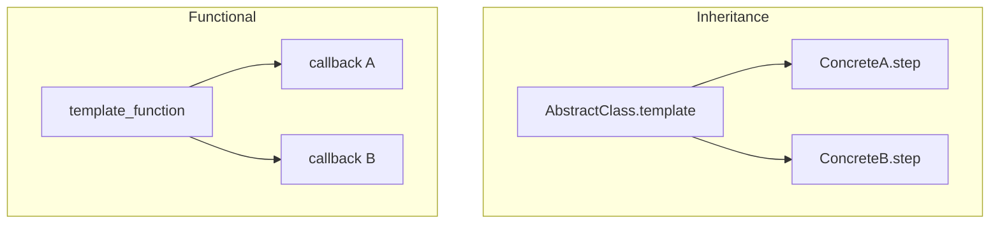
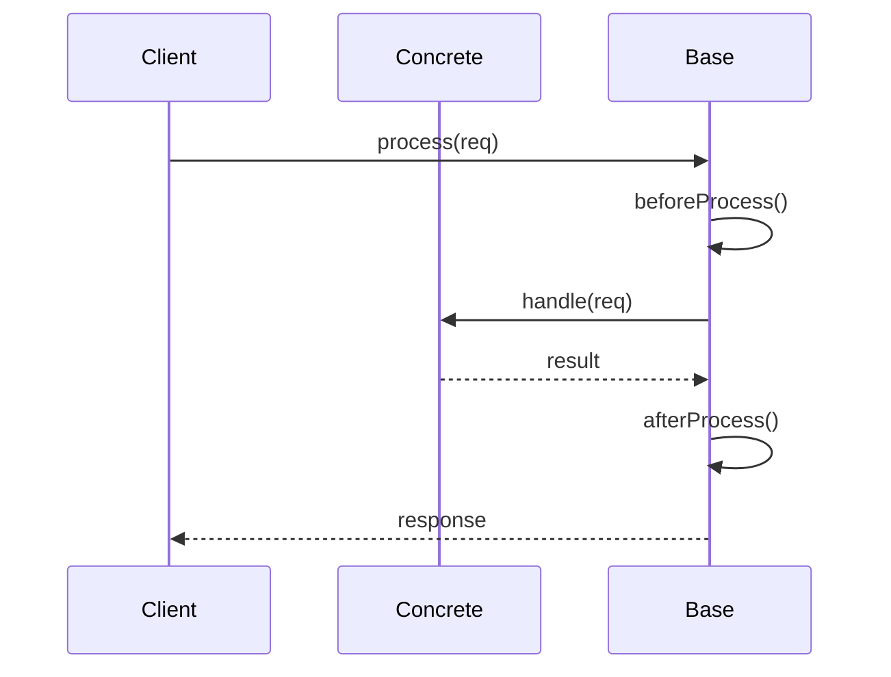

# Template Method — Middle Level

> **Source:** [refactoring.guru/design-patterns/template-method](https://refactoring.guru/design-patterns/template-method)
> **Prerequisite:** [Junior](junior.md)

---

## Table of Contents

1. [Introduction](#introduction)
2. [When to Use Template Method](#when-to-use-template-method)
3. [When NOT to Use Template Method](#when-not-to-use-template-method)
4. [Real-World Cases](#real-world-cases)
5. [Code Examples — Production-Grade](#code-examples--production-grade)
6. [Hooks — When and How](#hooks--when-and-how)
7. [Template Method vs Strategy revisited](#template-method-vs-strategy-revisited)
8. [Trade-offs](#trade-offs)
9. [Alternatives Comparison](#alternatives-comparison)
10. [Refactoring to Template Method](#refactoring-to-template-method)
11. [Pros & Cons (Deeper)](#pros--cons-deeper)
12. [Edge Cases](#edge-cases)
13. [Tricky Points](#tricky-points)
14. [Best Practices](#best-practices)
15. [Tasks (Practice)](#tasks-practice)
16. [Summary](#summary)
17. [Related Topics](#related-topics)
18. [Diagrams](#diagrams)

---

## Introduction

> Focus: **When to use it?** and **Why?**

You already know Template Method is "skeleton in base class, steps in subclasses." At the middle level the harder questions are:

- **Inheritance or composition?** Strategy is the alternative.
- **How many hooks before it becomes config-by-override?**
- **What's the contract between base and subclass?**
- **Higher-order functions instead of subclasses?** Modern alternative.
- **How to test the base class without instantiating subclasses?**

This document focuses on **decisions and patterns** that turn textbook Template Method into something that survives a year of production.

---

## When to Use Template Method

Use Template Method when **all** of these are true:

1. **Multiple variants share an algorithm structure** but differ in specific steps.
2. **The structure is unlikely to change.** Inheritance hierarchies are rigid.
3. **The variants form a natural is-a relationship.** Subclasses ARE specialized base classes.
4. **You want subclasses to focus only on what differs.**
5. **You're building or extending a framework.** Template Method is the framework's primary inheritance pattern.

If most are missing, look elsewhere first.

### Triggers

- "Three variants of the same workflow with different middle steps." → Template Method.
- "Test framework lifecycle: setUp → test → tearDown." → Template Method.
- "Document parser with tokenize → parse → validate → emit." → Template Method.
- "Web request handler with auth → handle → log." → Template Method (or middleware chain).
- "ETL with extract → transform → load." → Template Method.

---

## When NOT to Use Template Method

- **One variant only.** No need for the abstraction.
- **Variations independent across multiple dimensions.** Multiple inheritance impossible; Strategy fits better.
- **Hot path with allocation pressure.** Strategy with singletons may be cheaper.
- **Functional language idioms apply.** Higher-order function with callbacks beats inheritance.
- **Subclasses would have to override almost every step.** No reuse benefit — split into separate classes.

### Smell: god-base-class

Your `BaseProcessor` has 20 abstract methods and 8 hooks. Subclasses must implement most; little is reusable. Refactor: extract a Strategy or Visitor; or split into smaller, more focused base classes.

---

## Real-World Cases

### Case 1 — Spring's `JdbcTemplate`

```java
List<User> users = jdbc.query(
    "SELECT * FROM users",
    (rs, rowNum) -> new User(rs.getString("id"), rs.getString("name"))
);
```

Internally, `query` is a Template Method:

```java
public <T> List<T> query(String sql, RowMapper<T> mapper) {
    Connection conn = getConnection();
    try {
        PreparedStatement ps = prepareStatement(conn, sql);
        ResultSet rs = executeQuery(ps);
        List<T> results = mapResults(rs, mapper);   // delegate to mapper
        return results;
    } finally {
        closeAll(...);
    }
}
```

The lifecycle (open / execute / close) is fixed; the mapping varies. Spring uses callbacks (functional Template Method) instead of inheritance — modern flavor.

### Case 2 — Java's `InputStream`

```java
public abstract class InputStream {
    public int read(byte[] b) throws IOException {
        return read(b, 0, b.length);   // template: defined here
    }

    public int read(byte[] b, int off, int len) throws IOException {
        // template: read byte-by-byte
        for (int i = 0; i < len; i++) {
            int c = read();   // abstract single-byte read
            if (c == -1) return i;
            b[off + i] = (byte) c;
        }
        return len;
    }

    public abstract int read() throws IOException;   // subclass implements
}
```

Subclasses (`FileInputStream`, `ByteArrayInputStream`) implement `read()`; the multi-byte versions are inherited.

### Case 3 — JUnit's `TestCase`

```java
public abstract class TestCase {
    public void runBare() {
        setUp();
        try {
            runTest();
        } finally {
            tearDown();
        }
    }

    protected void setUp() {}    // hook
    protected void tearDown() {} // hook
    protected abstract void runTest();
}
```

The lifecycle is fixed; tests provide setUp / tearDown / runTest.

### Case 4 — Servlet `HttpServlet.service()`

```java
protected void service(HttpServletRequest req, HttpServletResponse resp) {
    String method = req.getMethod();
    if (method.equals("GET")) doGet(req, resp);
    else if (method.equals("POST")) doPost(req, resp);
    // ...
}

protected void doGet(...) { /* default: 405 */ }
protected void doPost(...) { /* default: 405 */ }
```

Servlets override `doGet` / `doPost` — hooks. The dispatch is the template.

### Case 5 — Web framework lifecycle

Spring's `DispatcherServlet`, Express middleware, Rails action lifecycle — all variations of Template Method. Framework drives; user code fills in.

### Case 6 — Build tool lifecycles

Maven: validate → compile → test → package → install → deploy. Goals run in fixed order; plugins customize specific phases.

### Case 7 — Game engine update loop

```cpp
class Entity {
public:
    void tick() {
        if (!active) return;
        update();
        render();
    }
    virtual void update() = 0;
    virtual void render() = 0;
};
```

Engine calls `tick()`; entities customize update / render.

---

## Code Examples — Production-Grade

### Example A — Functional Template Method (Java callback style)

```java
public final class TransactionTemplate {
    private final TransactionManager tm;

    public <T> T execute(Function<Transaction, T> work) {
        Transaction tx = tm.begin();
        try {
            T result = work.apply(tx);
            tm.commit(tx);
            return result;
        } catch (Exception e) {
            tm.rollback(tx);
            throw e;
        }
    }
}

// Usage:
String result = template.execute(tx -> {
    tx.execute("UPDATE users SET name = ?", "alice");
    return "done";
});
```

The template (begin → work → commit/rollback) is fixed. The "work" is passed as a function. No inheritance needed.

This is the **modern Template Method**: functional, lighter, more flexible.

---

### Example B — Inheritance-based with hooks (Java)

```java
public abstract class HttpRequestProcessor {
    public final Response process(Request req) {
        Response resp = new Response();
        try {
            beforeProcess(req);
            authenticate(req);
            authorize(req);
            Object result = handle(req);
            resp.setBody(result);
        } catch (UnauthorizedException e) {
            resp.setStatus(401);
        } catch (Exception e) {
            resp.setStatus(500);
            onError(e, resp);
        } finally {
            afterProcess(req, resp);
        }
        return resp;
    }

    // Required.
    protected abstract Object handle(Request req);

    // Hooks with defaults.
    protected void beforeProcess(Request req) {}
    protected void authenticate(Request req) { /* default: pass */ }
    protected void authorize(Request req) { /* default: pass */ }
    protected void onError(Exception e, Response resp) { e.printStackTrace(); }
    protected void afterProcess(Request req, Response resp) {}
}

public final class CreateUserHandler extends HttpRequestProcessor {
    protected Object handle(Request req) {
        // create user logic
        return /* user data */;
    }

    protected void authenticate(Request req) {
        if (!req.hasValidToken()) throw new UnauthorizedException();
    }
}
```

Required step: `handle`. Optional hooks: `authenticate`, `authorize`, `onError`. Subclasses override what they need.

---

### Example C — Python with abstract base class

```python
from abc import ABC, abstractmethod


class DataPipeline(ABC):
    """Template: extract → transform → load."""

    def run(self, source: str) -> None:
        data = self.extract(source)
        cleaned = self.clean(data)
        transformed = self.transform(cleaned)
        self.load(transformed)
        self.after_load()

    @abstractmethod
    def extract(self, source: str) -> list: ...

    def clean(self, data: list) -> list:
        """Hook: default is identity. Subclasses may filter / dedupe."""
        return data

    @abstractmethod
    def transform(self, data: list) -> list: ...

    @abstractmethod
    def load(self, data: list) -> None: ...

    def after_load(self) -> None:
        """Hook: default no-op. Subclasses may notify, etc."""
        pass


class CsvToDb(DataPipeline):
    def extract(self, source: str) -> list:
        with open(source) as f: return f.readlines()

    def clean(self, data: list) -> list:
        return [line.strip() for line in data if line.strip()]

    def transform(self, data: list) -> list:
        return [line.split(",") for line in data]

    def load(self, data: list) -> None:
        for row in data: print(f"INSERT {row}")


CsvToDb().run("/tmp/data.csv")
```

Required steps (extract, transform, load) plus optional hooks (clean, after_load).

---

### Example D — Higher-order function (functional Template Method)

```python
from typing import Callable


def with_retry(operation: Callable, max_attempts: int = 3) -> any:
    """Template: try → on failure, retry."""
    attempts = 0
    while attempts < max_attempts:
        try:
            return operation()
        except Exception as e:
            attempts += 1
            if attempts >= max_attempts: raise
            print(f"retry {attempts} after {e}")


def with_logging(name: str, operation: Callable) -> any:
    """Template: log start → operation → log end."""
    print(f"[{name}] starting")
    try:
        result = operation()
        print(f"[{name}] done")
        return result
    except Exception as e:
        print(f"[{name}] failed: {e}")
        raise
```

These are Template Methods without inheritance: fixed structure, callback for the variable part. Compose:

```python
result = with_logging("user-fetch", lambda: with_retry(lambda: fetch_user("u1")))
```

---

## Hooks — When and How

### Default no-op hook

```java
protected void beforeProcess(Request req) {}
```

Subclasses opt-in by overriding. Most common. Safe default.

### Default behavior hook

```java
protected void clean(List<String> data) {
    data.removeIf(String::isBlank);
}
```

Subclasses get useful default; can override for special cases. Risk: subclass overrides without calling `super`, losing the default.

### Boolean hook

```java
protected boolean shouldRetry(Exception e) { return true; }
```

Subclasses customize policy via boolean. Lightweight.

### Hook that subclass MUST call super

```java
protected void onSetup() {
    // base setup
}

// Subclass:
protected void onSetup() {
    super.onSetup();   // required
    // subclass-specific setup
}
```

Brittle. Subclass author must remember `super`. Document loudly or design out.

### Hook overuse

If you have 15 hooks, the "Template Method" is pure config. Refactor: use Strategy or break into smaller templates.

---

## Template Method vs Strategy revisited

| Aspect | Template Method | Strategy |
|---|---|---|
| **Mechanism** | Inheritance | Composition |
| **Variation** | Per subclass | Per instance / call |
| **Lifecycle** | Fixed in base class | Caller picks |
| **Coupling** | Subclass tied to base | Loose (via interface) |
| **Testing** | Need concrete subclass | Mock the strategy |
| **Multiple variations** | Multiple inheritance limit | Multiple strategy fields |

**Rule of thumb:**
- Lifecycle shared, steps vary → Template Method.
- Algorithm varies, no shared lifecycle → Strategy.
- Both at runtime, picked per call → Strategy.

**Modern functional style** often blends them: a function that takes callbacks is "Template Method via composition" — both at once.

---

## Trade-offs

| Trade-off | Cost | Benefit |
|---|---|---|
| Inheritance hierarchy | Rigid, single-parent | Encapsulates lifecycle cleanly |
| Hooks for optionality | Subclasses know contract | Fine-grained customization |
| Final template | Subclasses can't change order | Algorithm integrity |
| Higher-order function alternative | Different idiom | More flexible, less coupling |
| Multiple template methods in one class | Code organization | Risk of mixing concerns |

---

## Alternatives Comparison

| Pattern | Use when |
|---|---|
| **Template Method** | Shared lifecycle, vary specific steps via inheritance |
| **Strategy** | Vary algorithm at runtime via composition |
| **Higher-order function** | Pass callbacks; functional style |
| **Decorator** | Wrap behavior; chain wrappers |
| **Chain of Responsibility** | Linear pipeline of handlers |
| **Middleware** | Web framework variant of Chain of Responsibility |
| **Plugin / Extension Point** | Open lifecycle for arbitrary additions |

---

## Refactoring to Template Method

### Symptom
Two or three classes with very similar method structure.

```java
class CsvImporter {
    public void run(String path) {
        log("starting");
        var raw = read(path);
        var cleaned = clean(raw);
        var rows = parseCsv(cleaned);
        save(rows);
        log("done");
    }
}

class JsonImporter {
    public void run(String path) {
        log("starting");
        var raw = read(path);
        var cleaned = clean(raw);
        var rows = parseJson(cleaned);
        save(rows);
        log("done");
    }
}
```

The structure is identical; only `parse*` differs.

### Steps
1. Extract a base class `Importer` with `run` containing the shared structure.
2. Make `parseFile(String content)` abstract.
3. Subclasses implement `parseFile` only.
4. Mark `run` final.

### After

```java
abstract class Importer {
    public final void run(String path) {
        log("starting");
        var raw = read(path);
        var cleaned = clean(raw);
        var rows = parseFile(cleaned);
        save(rows);
        log("done");
    }

    protected abstract List<Row> parseFile(String content);
}

class CsvImporter extends Importer {
    protected List<Row> parseFile(String content) { /* parse CSV */ }
}

class JsonImporter extends Importer {
    protected List<Row> parseFile(String content) { /* parse JSON */ }
}
```

Duplication eliminated.

---

## Pros & Cons (Deeper)

| Pros | Cons |
|---|---|
| Eliminates structural duplication | Inheritance hierarchy locks in design |
| Clear contract base ↔ subclass | Hard to mix variations across multiple dimensions |
| Open/Closed for new variants | Hooks proliferate over time |
| Hollywood Principle (framework drives) | Subclass behavior obscured (where does it kick in?) |
| Maps to test frameworks, web frameworks | Refactoring base affects all subclasses |

---

## Edge Cases

### 1. Subclass forgets to call super

A subclass overrides a hook that should call `super.onInit()` first. They forget. Base initialization skipped.

**Mitigation:** make hooks final, with internal calls to abstract subhooks.

```java
protected final void onInit() {
    baseInit();
    customInit();   // abstract; subclass implements
}

protected abstract void customInit();
```

### 2. Subclass overrides a "concrete" step

If you didn't make a step `final`, subclasses might override it — breaking the algorithm.

**Mitigation:** mark steps you don't want overridden as `final` or `private`.

### 3. Reentrant template

The template calls a step; the step calls back into the template. Stack overflow or strange recursion.

**Mitigation:** state guard, or design out the cycle.

### 4. Asynchronous template

Template Method assumes synchronous execution. For async, every step returns `CompletableFuture` / `Promise` — explicit.

```java
public CompletableFuture<Response> processAsync(Request req) {
    return authenticate(req)
        .thenCompose(this::authorize)
        .thenCompose(this::handle)
        .thenApply(this::wrap);
}
```

Async Template Method via Future composition.

### 5. Multiple templates in one class

A class has `process()` and `processBatch()`, both with their own skeletons. Confusing — favor composition or split.

---

## Tricky Points

### Liskov substitution

Subclasses must respect the base contract. If `step1` doesn't throw in the base, subclasses better not throw — or document the throwable. Subtle bugs come from "wider" subclass behavior.

### Generic types

Template Method with generics:

```java
abstract class Pipeline<I, O> {
    public final O run(I input) {
        return convert(extract(input));
    }
    protected abstract Intermediate extract(I input);
    protected abstract O convert(Intermediate i);
}
```

Generic `I`, `O`, with intermediate types. Useful for typed pipelines.

### Inheritance in Go / Rust

Go has no class inheritance. Use composition + interfaces; the "template" is a function or method that accepts a behavior interface. Rust similarly favors traits + generic bounds.

### Functional alternative

```javascript
const pipeline = (input, steps) => steps.reduce((acc, step) => step(acc), input);

const result = pipeline(rawData, [extract, transform, load]);
```

Higher-order function takes a list of steps. Equivalent to Template Method without classes.

---

## Best Practices

- **Mark Template Method `final`.** Lock the structure.
- **Distinguish abstract steps from hooks.** Required vs optional.
- **Document the contract.** Pre/post conditions per step.
- **Test the base class** with a minimal concrete subclass.
- **Don't proliferate hooks.** If you have many, consider Strategy.
- **Prefer functional Template Method** when language supports it (lambdas, closures).
- **Mind Liskov.** Subclass changes shouldn't surprise users of base.

---

## Tasks (Practice)

1. **Beverage maker.** Template: boil → brew → pour → condiments.
2. **HTTP request processor.** Template: parse → auth → handle → respond.
3. **Data pipeline.** Template: extract → transform → load.
4. **Test framework.** Template: setUp → test → tearDown.
5. **Build tool.** Template: validate → compile → test → package.
6. **Functional alternative.** Same algorithm, but a function with callbacks.

(Solutions in [tasks.md](tasks.md).)

---

## Summary

At the middle level, Template Method is not just "skeleton in base class." It's:

- **Inheritance-based** — fits where shared lifecycle is the goal.
- **Hooks for optionality** — but watch for proliferation.
- **Functional alternative** — higher-order functions for modern style.
- **Liskov-mindful** — subclass contracts matter.
- **Fragile to refactor** — base changes ripple to all subclasses.

The win is structural reuse without duplication. The cost is hierarchy rigidity.

---

## Related Topics

- [Strategy](../08-strategy/middle.md) — composition alternative
- [Factory Method](../../01-creational/02-factory-method/middle.md) — Template often calls Factory Method
- [Decorator](../../02-structural/04-decorator/middle.md) — for stacking behavior
- [Higher-order functions](../../../coding-principles/hof.md)
- [Hollywood Principle](../../../coding-principles/inversion-of-control.md)

---

## Diagrams

### Inheritance vs functional Template Method



### Process lifecycle



[← Junior](junior.md) · [Senior →](senior.md)
