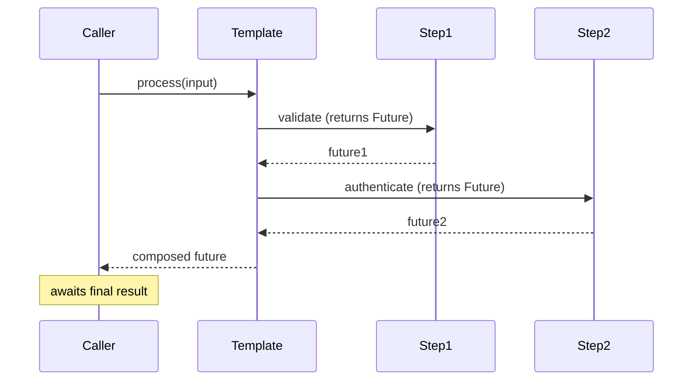

# Template Method — Professional Level

> **Source:** [refactoring.guru/design-patterns/template-method](https://refactoring.guru/design-patterns/template-method)
> **Prerequisite:** [Senior](senior.md)

---

## Table of Contents

1. [Introduction](#introduction)
2. [JIT Inlining of Template Methods](#jit-inlining-of-template-methods)
3. [Megamorphic Hook Call Sites](#megamorphic-hook-call-sites)
4. [Functional Template Method Overhead](#functional-template-method-overhead)
5. [Async Template Method Internals](#async-template-method-internals)
6. [Default Methods (Java 8+)](#default-methods-java-8)
7. [Sealed Class Hierarchies](#sealed-class-hierarchies)
8. [Cross-Language Comparison](#cross-language-comparison)
9. [Microbenchmark Anatomy](#microbenchmark-anatomy)
10. [Diagrams](#diagrams)
11. [Related Topics](#related-topics)

---

## Introduction

A Template Method at the professional level is examined for what the runtime makes of it: how JIT inlines polymorphic hook calls, where megamorphic dispatch costs appear, how callback-based templates compare to inheritance, and what the cost of async / await composition is.

For high-throughput systems — request handlers, ETL pipelines, game engines — the Template Method's structure determines performance profile.

---

## JIT Inlining of Template Methods

### Monomorphic call site

```java
abstract class Base {
    public final void run() {
        beforeStep();   // call site sees only Concrete's beforeStep
        mainStep();
    }
    protected abstract void mainStep();
    protected void beforeStep() {}
}
```

If the JVM observes the same concrete subclass at this call site for many calls, the JIT inlines `mainStep()` into `run()`. After warmup, the template is as fast as a hand-written method.

### Bimorphic / polymorphic

If the call site sees 2-3 subclasses, bimorphic IC. Still ~1ns per call.

### Megamorphic (8+ subclasses)

Vtable dispatch. ~2-3ns. JIT can't inline. For tight loops with many subclass types, visible.

### Final modifier

```java
public final void run() { ... }
protected void beforeStep() { /* default */ }
```

`final` on the template signals to the JIT that this method won't be overridden. Helps inlining and optimization.

For default hooks, `final` prevents subclass override but defeats the pattern. Use `final` only on the template itself.

### Allocation considerations

If the Template Method allocates new objects per call (e.g., `new ArrayList<>()` for results), GC pressure scales with throughput. Reuse where possible; pool when justified.

---

## Megamorphic Hook Call Sites

A Template Method called by many subclass types creates a megamorphic call site for each hook.

```java
public final void process(Request req) {
    Response resp = handle(req);   // megamorphic if many handler subclasses
}
```

Cost: ~3ns per call instead of ~0ns inlined. For request handling at 100K req/s, ~300µs CPU per second.

### Mitigations

1. **Type-specialized batches.** Group requests by handler type; loop monomorphically per type.
2. **Code generation.** Generate per-handler templates at build time. Compiler inlines.
3. **Functional callbacks instead.** Each call site sees one lambda type; can be monomorphic (with care).

For typical business code: invisible. For tight inner loops: profile.

---

## Functional Template Method Overhead

Lambdas (Java) or function references (others) have small overheads:

| Aspect | Inheritance Template | Lambda Template |
|---|---|---|
| **Per-call dispatch** | Vtable | Indirect through invokedynamic |
| **Allocation per call** | None | Capturing lambda allocates |
| **Inlining** | If monomorphic | If lambda is captured-once |
| **Ergonomics** | Class hierarchy | Inline / closure |

### Lambda allocation

```java
public List<User> findUsers(String role) {
    return jdbc.query("SELECT * FROM users WHERE role = ?",
        ps -> ps.setString(1, role),    // captures `role`; allocates
        userRowMapper                   // non-capturing; cached
    );
}
```

The first lambda captures `role` → allocates per call. The second is non-capturing → JVM caches a single instance.

### Reuse non-capturing lambdas

```java
private static final RowMapper<User> USER_MAPPER = rs -> new User(rs.getString("id"), rs.getString("name"));

public List<User> findUsers() {
    return jdbc.query("SELECT * FROM users", USER_MAPPER);
}
```

No allocation per call. Faster.

---

## Async Template Method Internals

### `CompletableFuture` chain

```java
public CompletableFuture<Response> process(Request req) {
    return validate(req)
        .thenCompose(this::authenticate)
        .thenCompose(this::handle)
        .thenApply(this::wrap);
}
```

Each `thenCompose` allocates a new future. For 4-step chains: 4 future allocations. ~ns each; under heavy load, GC pressure.

### Coroutines

```kotlin
suspend fun process(req: Request): Response {
    val a = validate(req)
    val b = authenticate(a)
    val c = handle(b)
    return wrap(c)
}
```

Each `suspend` may not allocate (continuation reuse). Faster than Future chain in optimal cases.

### Pitfalls

- **Blocking inside async template.** Synchronous I/O on async thread; thread starvation.
- **Cancellation propagation.** If outer scope cancels, inner futures must observe.
- **Error handling.** `exceptionally` / `recover` must be in the chain.

---

## Default Methods (Java 8+)

```java
public interface Pipeline {
    default Result run(Input input) {
        Input cleaned = clean(input);
        Output output = transform(cleaned);
        return wrap(output);
    }

    Output transform(Input input);   // abstract
    default Input clean(Input input) { return input; }
    default Result wrap(Output output) { return new Result(output); }
}
```

Default methods on interface = Template Method without abstract base class. Multiple interfaces with default methods can compose.

### Pros

- No inheritance lock-in (subclass can implement multiple interfaces).
- Lighter than abstract class.
- Composable.

### Cons

- Diamond problem if two interfaces have same default method (compile-time error; explicit override needed).
- Stateful templates need fields → still need abstract class.

For stateless or callback-based templates, interface defaults work. For lifecycle with state, abstract class.

---

## Sealed Class Hierarchies

Java 17+ sealed classes lock down inheritance:

```java
public sealed abstract class Beverage permits Tea, Coffee, Water {
    public final void make() { ... }
    protected abstract void brew();
}
```

### Benefits

- Compile-time exhaustiveness for switches over subclasses.
- Compiler / JIT know the closed set.
- Refactoring safe — adding a new Beverage requires updating `permits`.

### Trade-off

- All subclasses listed in one place. For libraries: deliberate choice.

For Template Method with bounded subclass set: sealed is the right call.

---

## Cross-Language Comparison

| Language | Primary Template Method Form | Notes |
|---|---|---|
| **Java** | abstract class + final method | Mature; supports default methods |
| **C#** | abstract / virtual methods | Pattern matching enriches |
| **Kotlin** | abstract class + open/closed methods | `open` controls overrideability |
| **Python** | abc.ABC + @abstractmethod | Convention-based |
| **Go** | Embedding + interfaces | Composition simulates |
| **Rust** | Trait with default methods | Closest to Java's interface defaults |
| **TypeScript** | abstract class + abstract methods | Similar to Java |
| **JavaScript** | Class with method overrides | Less rigid; convention-based |

### Functional alternative

In all languages: pass callbacks to a function. The "template" is the function; hooks are parameters. Lighter than inheritance.

```javascript
function process(req, { auth, handle, wrap }) {
    auth(req);
    const result = handle(req);
    return wrap(result);
}

process(req, {
    auth: defaultAuth,
    handle: customHandler,
    wrap: jsonWrapper
});
```

---

## Microbenchmark Anatomy

### Inheritance template dispatch

```java
@Benchmark public Response inherited(Bench bench) {
    return bench.handler.process(bench.req);
}
```

Numbers (typical):
- Monomorphic: ~5-10ns per call (handler body)
- Bimorphic: ~10-20ns
- Polymorphic (5 subclasses): ~20-30ns
- Megamorphic (10+): ~30-50ns

For business logic (handler does ~µs of work): negligible.

### Functional template

```java
@Benchmark public Response functional(Bench bench) {
    return template.process(bench.req, bench.handler::handle);
}
```

If `bench.handler::handle` is captured once: cached lambda; same as inheritance.
If recreated per call: allocates ~16 bytes; negligible unless 100M+ calls/s.

### Async template

`CompletableFuture` chain: ~50-100ns of overhead per `thenCompose` (allocation + scheduling). For request-rate workloads: invisible. For tight loops: matters.

### JMH pitfalls

- Constant inputs → JIT folds.
- Tiny benchmarks → overhead-dominated.
- Use `Blackhole.consume`.

---

## Diagrams

### Inline cache for template hook


### Async template flow



---

## Related Topics

- JIT inlining
- Sealed types
- Default methods
- Async patterns
- Lambda performance

[← Senior](senior.md) · [Interview →](interview.md)
