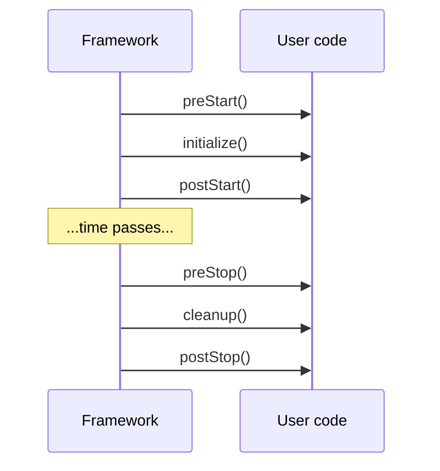
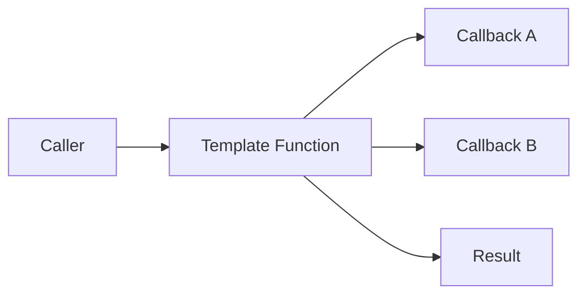

# Template Method — Senior Level

> **Source:** [refactoring.guru/design-patterns/template-method](https://refactoring.guru/design-patterns/template-method)
> **Prerequisite:** [Middle](middle.md)

---

## Table of Contents

1. [Introduction](#introduction)
2. [Template Method at Architectural Scale](#template-method-at-architectural-scale)
3. [Framework Hooks vs Plugin Points](#framework-hooks-vs-plugin-points)
4. [Pipeline Patterns](#pipeline-patterns)
5. [Async Template Method](#async-template-method)
6. [When Template Method Becomes a Problem](#when-template-method-becomes-a-problem)
7. [Code Examples — Advanced](#code-examples--advanced)
8. [Real-World Architectures](#real-world-architectures)
9. [Pros & Cons at Scale](#pros--cons-at-scale)
10. [Trade-off Analysis Matrix](#trade-off-analysis-matrix)
11. [Migration Patterns](#migration-patterns)
12. [Diagrams](#diagrams)
13. [Related Topics](#related-topics)

---

## Introduction

> Focus: **At scale, what breaks? What earns its keep?**

In toy code Template Method is "abstract base + concrete subclass." In production it is "every HTTP handler in our framework extends `BaseHandler` with 12 hook points," "Spring's `JdbcTemplate` powers thousands of repository methods," "every Lambda function follows the same setup → handle → cleanup template enforced by the runtime." The senior question isn't "do I write Template Method?" — it's **"how do I balance lifecycle enforcement with extensibility, evolve hook contracts safely, and avoid hierarchy explosion?"**

At scale Template Method intersects with:

- **Frameworks** — Spring, Rails, Express, Django all use it.
- **Lifecycle hooks** — React's lifecycle methods, Vue components, Android's `Activity`.
- **Pipelines** — middleware chains, ETL, build tools.
- **Async lifecycles** — message handlers, Lambda runtimes.
- **Plugin systems** — extension points expressed as Template Method hooks.

These are Template Method at architectural scale. The fundamentals apply but ergonomics dominate.

---

## Template Method at Architectural Scale

### 1. Spring's `JdbcTemplate` and `RestTemplate`

```java
RestTemplate rt = new RestTemplate();
User u = rt.getForObject("/users/1", User.class);
```

`getForObject` is a Template Method: build URI → execute request → handle response → deserialize. Internally:

```java
public <T> T getForObject(String url, Class<T> responseType) {
    RequestCallback requestCallback = ...;
    HttpMessageConverterExtractor<T> extractor = ...;
    return execute(url, HttpMethod.GET, requestCallback, extractor);
}
```

`execute` is the real template. Customize via interceptors, message converters, error handlers. Production-grade Template Method.

### 2. Servlet `HttpServlet.service()`

```java
public abstract class HttpServlet extends GenericServlet {
    protected void service(HttpServletRequest req, HttpServletResponse resp) {
        String method = req.getMethod();
        if (method.equals("GET")) doGet(req, resp);
        else if (method.equals("POST")) doPost(req, resp);
        // ... HEAD, PUT, DELETE, OPTIONS, TRACE
    }

    protected void doGet(...) { resp.sendError(SC_METHOD_NOT_ALLOWED); }
    // similar for others
}
```

Each HTTP method is a hook with a "405 Method Not Allowed" default. Subclasses override what they handle.

### 3. React component lifecycle (legacy class components)

```javascript
class MyComponent extends React.Component {
    componentDidMount() { /* hook */ }
    componentDidUpdate(prevProps) { /* hook */ }
    componentWillUnmount() { /* hook */ }
    render() { /* required */ }
}
```

React's reconciler is the Template Method. Components fill in lifecycle hooks. Modern React (hooks API) uses functional alternative — composition over inheritance.

### 4. AWS Lambda handler

```python
def lambda_handler(event, context):
    # template: AWS runtime sets up env → calls your function → cleans up
    return your_logic(event)
```

The runtime IS the Template Method. Your function is the hook. AWS, Cloudflare Workers, Vercel functions all use this shape.

### 5. Camel routes / EIP

Apache Camel routes follow lifecycle: route start → component init → message exchange → cleanup. Components extend base classes; lifecycle is fixed.

### 6. Build tools (Maven, Gradle)

Maven's lifecycle: `validate → compile → test → package → install → deploy`. Plugins bind to phases. The lifecycle is the Template; phases are hooks.

---

## Framework Hooks vs Plugin Points

### Hooks (Template Method-style)

Methods on a base class, overridden by subclasses. Tight: subclass knows the framework's lifecycle intimately.

```java
public abstract class Filter {
    protected abstract Response doFilter(Request req);
    protected void onError(Exception e, Response resp) {}
}
```

### Plugin points (extension API)

Loose: plugins register at well-defined points; framework calls them.

```java
public interface RequestPreprocessor {
    Request preprocess(Request req);
}

public final class FrameworkConfig {
    public void register(RequestPreprocessor p) { preprocessors.add(p); }
}
```

Multiple plugins can stack. Loose coupling. No inheritance hierarchy.

### Trade-offs

| | Hooks | Plugin points |
|---|---|---|
| **Coupling** | Tight (inheritance) | Loose (composition) |
| **Multiplicity** | One subclass | Many plugins |
| **Discoverability** | Subclass methods | Registration list |
| **Testability** | Need test subclass | Mock the plugin |

Modern frameworks favor plugin points + Template Method internally. Best of both worlds.

---

## Pipeline Patterns

### Linear pipeline

```python
def pipeline(input):
    a = step1(input)
    b = step2(a)
    c = step3(b)
    return c
```

A function-style Template Method. Steps fixed; can be parameterized via callbacks.

### Middleware pipeline (Express style)

```javascript
app.use((req, res, next) => { log(req); next(); });
app.use(authMiddleware);
app.use(handler);
```

Each middleware is a hook in a chain. The "template" is `req → middleware* → handler → response`. More flexible than inheritance.

### Configurable pipeline

```python
class Pipeline:
    def __init__(self, steps: list[Callable]) -> None:
        self.steps = steps

    def run(self, input):
        x = input
        for s in self.steps:
            x = s(x)
        return x

p = Pipeline([extract, clean, transform, load])
p.run("data.csv")
```

Template Method without inheritance. Steps are values.

### Async pipeline

```javascript
async function pipeline(input) {
    const a = await step1(input);
    const b = await step2(a);
    return await step3(b);
}
```

Each step async; awaits compose. Works for I/O-bound pipelines.

---

## Async Template Method

For I/O-bound work, the Template Method must be async.

### Future composition (Java)

```java
public CompletableFuture<Response> processAsync(Request req) {
    return CompletableFuture.supplyAsync(() -> req)
        .thenCompose(this::authenticate)
        .thenCompose(this::authorize)
        .thenCompose(this::handle)
        .thenApply(this::wrap)
        .exceptionally(this::handleError);
}

protected abstract CompletableFuture<Response> handle(Request req);
```

Each step returns a Future; `thenCompose` chains them. Errors flow through `exceptionally`.

### Coroutines (Kotlin)

```kotlin
abstract class AsyncProcessor {
    suspend fun process(req: Request): Response {
        beforeProcess(req)
        val result = handle(req)
        afterProcess(req, result)
        return result
    }

    abstract suspend fun handle(req: Request): Response
    open suspend fun beforeProcess(req: Request) {}
    open suspend fun afterProcess(req: Request, resp: Response) {}
}
```

Suspend functions are async. Same template; non-blocking.

### Async/await (Python, JS)

```python
class Pipeline:
    async def run(self, input):
        x = await self.extract(input)
        x = await self.transform(x)
        await self.load(x)

    @abstractmethod
    async def extract(self, input): ...
```

### Pitfalls

- **Mixing sync and async.** Subclass overrides with sync; framework awaits — confusion or deadlock.
- **Cancellation.** Async templates need to handle cancellation (e.g., timeout) gracefully.
- **Backpressure.** If the template processes many items, must respect downstream demand.

---

## When Template Method Becomes a Problem

### 1. Hierarchy explosion

```
BaseProcessor
├── HttpProcessor
│   ├── RestProcessor
│   │   ├── JsonRestProcessor
│   │   └── XmlRestProcessor
│   └── SoapProcessor
└── BatchProcessor
    └── ...
```

10 levels deep. Each adds hooks; finding behavior is a treasure hunt.

**Fix:** flatten with composition; favor Strategy / Decorator. Inheritance is for is-a; if it's "X has Y functionality," compose.

### 2. Hook proliferation

Base class has 30 hook methods. Subclasses override 5; the rest are no-ops. Documentation overhead; refactor risk.

**Fix:** split into smaller templates. Or extract hooks into a separate "lifecycle interface."

### 3. Diamond problem (multiple inheritance)

Some languages (C++, Python) allow multiple inheritance. Templates conflict; mro confusion.

**Fix:** prefer single inheritance + composition; or interface-based with default methods.

### 4. Subclass-base coupling

Refactoring the base class breaks subclasses. Even adding a hook may require subclasses to acknowledge.

**Fix:** stable contracts; semantic versioning of base class API. Or migrate to functional Template Method.

### 5. Test fragility

Testing a subclass requires the full base class lifecycle. Mocking the base is awkward.

**Fix:** functional Template Method (mock the dependencies, not the base); or simpler hierarchy.

### 6. Async / sync mismatch

Base is sync; subclass needs async. Doesn't compose cleanly.

**Fix:** dual templates (sync + async), or migrate fully to async.

---

## Code Examples — Advanced

### A — Spring `JdbcTemplate`-style functional template (Java)

```java
@FunctionalInterface
public interface RowMapper<T> {
    T mapRow(ResultSet rs) throws SQLException;
}

public final class JdbcTemplate {
    private final DataSource ds;

    public <T> List<T> query(String sql, RowMapper<T> mapper) {
        try (Connection c = ds.getConnection();
             PreparedStatement ps = c.prepareStatement(sql);
             ResultSet rs = ps.executeQuery()) {
            List<T> results = new ArrayList<>();
            while (rs.next()) results.add(mapper.mapRow(rs));
            return results;
        } catch (SQLException e) {
            throw new RuntimeException(e);
        }
    }
}

// Usage:
List<User> users = jdbc.query(
    "SELECT id, name FROM users",
    rs -> new User(rs.getString("id"), rs.getString("name"))
);
```

The lifecycle (open / execute / close / errors) is fixed. The mapping is a callback. No inheritance.

---

### B — Plugin-extensible Template Method (Python)

```python
from abc import ABC, abstractmethod
from typing import Callable, List


class WebHandler(ABC):
    """Template: pre-middlewares → handle → post-middlewares."""

    def __init__(self) -> None:
        self.pre: List[Callable] = []
        self.post: List[Callable] = []

    def add_pre(self, fn: Callable) -> None: self.pre.append(fn)
    def add_post(self, fn: Callable) -> None: self.post.append(fn)

    def process(self, req):
        for m in self.pre: req = m(req)
        resp = self.handle(req)
        for m in self.post: resp = m(resp)
        return resp

    @abstractmethod
    def handle(self, req): ...


class UserHandler(WebHandler):
    def handle(self, req): return {"user": req["id"]}


h = UserHandler()
h.add_pre(lambda r: {**r, "trace_id": "abc"})
h.add_post(lambda r: {**r, "version": "v1"})
print(h.process({"id": "u1"}))
```

Inheritance for the required step (`handle`); composition for middlewares (pre/post). Hybrid.

---

### C — Async pipeline (TypeScript)

```typescript
abstract class AsyncPipeline<I, O> {
    async run(input: I): Promise<O> {
        const a = await this.beforeStep(input);
        const b = await this.mainStep(a);
        return await this.afterStep(b);
    }

    protected async beforeStep(x: I): Promise<I> { return x; }
    protected abstract mainStep(x: I): Promise<O>;
    protected async afterStep(x: O): Promise<O> { return x; }
}

class FetchAndStore extends AsyncPipeline<string, void> {
    async beforeStep(url: string): Promise<string> {
        console.log(`fetching ${url}`);
        return url;
    }

    async mainStep(url: string): Promise<void> {
        const data = await fetch(url).then(r => r.json());
        console.log("got", data);
    }

    async afterStep(): Promise<void> {
        console.log("done");
    }
}
```

Async template. Steps are async; subclass implements `mainStep`.

---

### D — Lifecycle with explicit hook names (Java)

```java
public abstract class ManagedComponent {
    public final void start() {
        try {
            preStart();
            initialize();
            registerHooks();
            postStart();
        } catch (Exception e) {
            onStartFailure(e);
            throw e;
        }
    }

    public final void stop() {
        try {
            preStop();
            cleanup();
            unregisterHooks();
            postStop();
        } catch (Exception e) {
            onStopFailure(e);
        }
    }

    // Required.
    protected abstract void initialize();
    protected abstract void cleanup();

    // Hooks.
    protected void preStart() {}
    protected void postStart() {}
    protected void preStop() {}
    protected void postStop() {}
    protected void registerHooks() {}
    protected void unregisterHooks() {}
    protected void onStartFailure(Exception e) {}
    protected void onStopFailure(Exception e) {}
}
```

Comprehensive lifecycle. Subclasses pick which hooks to use. Common in framework / runtime code.

---

## Real-World Architectures

### Spring framework

`JdbcTemplate`, `JmsTemplate`, `RestTemplate`, `TransactionTemplate` — all variations of Template Method with callbacks. Massive, productive abstraction.

### Apache Beam

Unified batch + streaming. `DoFn` defines element processing; `setup`, `processElement`, `teardown` are template hooks. Same code runs on multiple runners.

### React (modern hooks API)

Functional Template Method via hooks: `useState`, `useEffect`, `useMemo`. Component renders are templates; hooks are the customization points.

### gRPC / RPC frameworks

Generated stubs use Template Method: marshal → send → receive → unmarshal. Generated code locks the structure; user provides handlers.

### Game engines (Unity, Unreal)

`MonoBehaviour.Update()`, `Awake()`, `OnDestroy()` — engine calls these template-method-style. Game code overrides what it needs.

---

## Pros & Cons at Scale

| Pros | Cons |
|---|---|
| Frameworks define lifecycles cleanly | Hierarchy depth can explode |
| Subclasses focus on what differs | Refactoring base impacts all subclasses |
| Hollywood Principle scales naturally | Async / sync mismatch causes friction |
| Plugin points complement Template Method | Hook proliferation = config-by-override |
| Functional alternatives (callbacks) modernize | Inheritance harder to test than composition |

---

## Trade-off Analysis Matrix

| Dimension | Inheritance Template | Functional Template (callbacks) | Plugin Points |
|---|---|---|---|
| **Coupling** | Tight | Loose | Loosest |
| **Reuse** | Single subclass per variant | Pass functions | Multiple plugins |
| **Testing** | Test concrete subclasses | Mock callbacks | Mock plugins |
| **Language fit** | Java, C#, Kotlin | All modern languages | DI-friendly languages |
| **Hierarchy depth** | Risk of explosion | Flat | Flat |
| **Refactor cost** | High | Medium | Low |

---

## Migration Patterns

### From inheritance to functional template

1. Identify the hooks; extract them as functional interfaces.
2. Provide a class that takes the functions in its constructor.
3. Migrate subclasses one by one to use the new class with lambdas.
4. Deprecate the abstract base.

### Adding a new hook

1. Add as method on base with default no-op.
2. Existing subclasses unaffected.
3. New subclasses opt-in.

### Removing a hook

1. Mark deprecated; document removal date.
2. Audit subclasses; ensure none rely on the hook.
3. Remove after release.

### Splitting a template

If `BaseProcessor` is too big, split:

1. Identify cohesive responsibilities.
2. Extract each into its own base class with its own template.
3. Composition: a class can extend one and embed others.

---

## Diagrams

### Lifecycle hooks



### Functional Template Method



[← Middle](middle.md) · [Professional →](professional.md)
