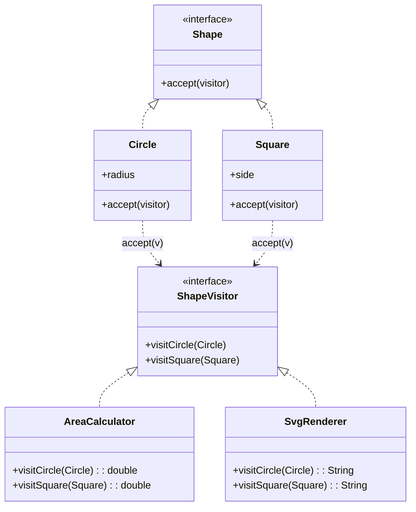
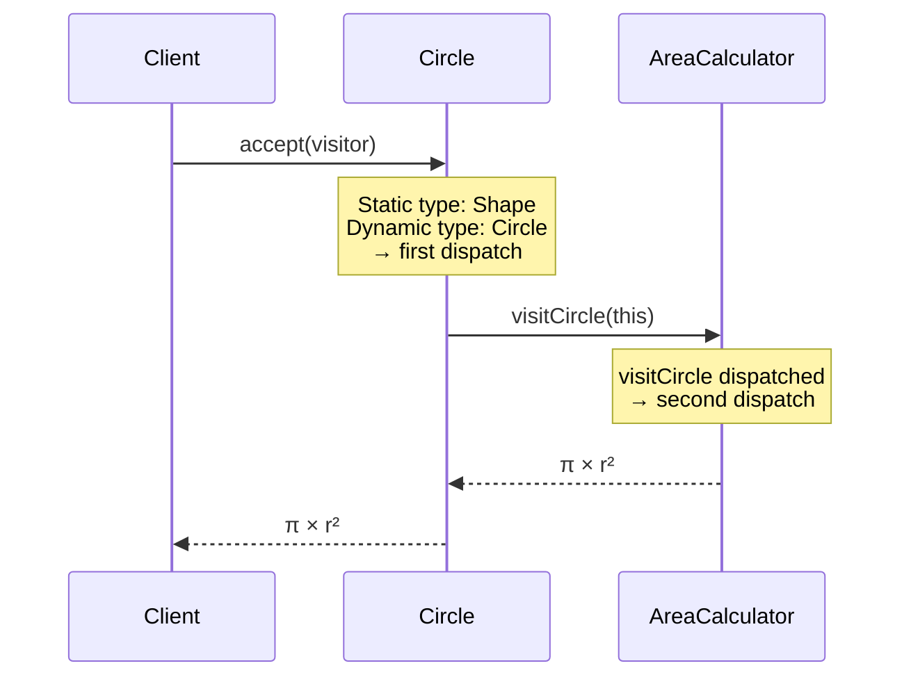

# Visitor — Junior Level

> **Source:** [refactoring.guru/design-patterns/visitor](https://refactoring.guru/design-patterns/visitor)

---

## Table of Contents

1. [What is the Visitor pattern?](#what-is-the-visitor-pattern)
2. [Real-world analogy](#real-world-analogy)
3. [The problem it solves](#the-problem-it-solves)
4. [Structure](#structure)
5. [Hello-world example (Java)](#hello-world-example-java)
6. [Python example](#python-example)
7. [TypeScript example](#typescript-example)
8. [Common situations](#common-situations)
9. [When NOT to use](#when-not-to-use)
10. [Pros and cons](#pros-and-cons)
11. [Common mistakes](#common-mistakes)
12. [Diagrams](#diagrams)
13. [Mini Glossary](#mini-glossary)
14. [Review questions](#review-questions)

---

## What is the Visitor pattern?

**Visitor** lets you separate an algorithm from the data structure it operates on. Instead of putting many different operations as methods inside each class of a structure (Circle, Square, Triangle), you put them in **a separate visitor class**, and the structure classes just say *"come visit me"*.

You walk over a tree of objects. Each object accepts a visitor and asks the visitor to do its thing. The visitor decides what to do based on the object's concrete type.

Two roles:

- **Element** — a node in the structure (e.g., `Circle`, `Square`). It has an `accept(visitor)` method.
- **Visitor** — knows how to handle each element type. Has methods like `visitCircle`, `visitSquare`.

The trick is **double dispatch**: the element calls `visitor.visitCircle(this)` — so the visitor knows both *what kind of element* it is AND *what kind of visitor* it is.

---

## Real-world analogy

### Insurance agent visiting buildings

An insurance agent visits different buildings to sell insurance:

- Visit a residential building → sell life insurance.
- Visit a bank → sell theft insurance.
- Visit a coffee shop → sell fire insurance.

The buildings don't know about insurance types. They just *accept* an agent, and the agent decides what to offer based on the building type.

If a new insurance type appears (cyber insurance), you create a new agent — buildings don't change.

### Tax inspector

The tax inspector visits factories, offices, restaurants. Each type of business has different tax rules. The inspector (visitor) knows the rules; the businesses (elements) just open the door.

---

## The problem it solves

You have a class hierarchy — say, a tree of shapes (Circle, Square, Triangle, Group) — and you need to perform many *different* operations on it:

- Calculate total area.
- Render to SVG.
- Render to JSON.
- Validate that all shapes are inside a canvas.
- Count shapes by type.

### Naive approach: methods on each class

```java
class Circle {
    double area() { ... }
    String toSvg() { ... }
    String toJson() { ... }
    boolean isInside(Rect bounds) { ... }
    int count() { ... }
}
```

Every shape class grows fat with operations that have nothing to do with being a shape. Adding a sixth operation means editing every shape class.

### Visitor approach

```java
interface Shape {
    <R> R accept(Visitor<R> visitor);
}

interface Visitor<R> {
    R visitCircle(Circle c);
    R visitSquare(Square s);
    R visitTriangle(Triangle t);
}

class AreaCalculator implements Visitor<Double> { ... }
class SvgRenderer implements Visitor<String> { ... }
class JsonRenderer implements Visitor<String> { ... }
```

Each operation becomes a separate class. Shape classes stay slim — just `accept`. Adding an operation = new visitor class. **No edits to shapes.**

---

## Structure

```
Element (interface)
    + accept(visitor: Visitor): R

ConcreteElementA → accept(v) { return v.visitA(this); }
ConcreteElementB → accept(v) { return v.visitB(this); }
ConcreteElementC → accept(v) { return v.visitC(this); }

Visitor (interface)
    + visitA(a: ConcreteElementA): R
    + visitB(b: ConcreteElementB): R
    + visitC(c: ConcreteElementC): R

ConcreteVisitor1 — implements all visit methods (e.g., area calculation)
ConcreteVisitor2 — implements all visit methods (e.g., rendering)
```

**Double dispatch.** When you call `element.accept(visitor)`:

1. First dispatch: virtual call selects which `accept` runs (based on element's concrete type).
2. Second dispatch: that `accept` calls `visitor.visitX(this)` — virtual call on visitor.

Result: the right method runs based on **both** types — element AND visitor.

---

## Hello-world example (Java)

Shapes hierarchy with two operations: area calculation and SVG rendering.

```java
// Element interface
public interface Shape {
    <R> R accept(ShapeVisitor<R> visitor);
}

// Concrete elements
public final class Circle implements Shape {
    public final double radius;

    public Circle(double radius) { this.radius = radius; }

    @Override
    public <R> R accept(ShapeVisitor<R> visitor) {
        return visitor.visitCircle(this);
    }
}

public final class Square implements Shape {
    public final double side;

    public Square(double side) { this.side = side; }

    @Override
    public <R> R accept(ShapeVisitor<R> visitor) {
        return visitor.visitSquare(this);
    }
}

public final class Triangle implements Shape {
    public final double base, height;

    public Triangle(double base, double height) {
        this.base = base;
        this.height = height;
    }

    @Override
    public <R> R accept(ShapeVisitor<R> visitor) {
        return visitor.visitTriangle(this);
    }
}

// Visitor interface
public interface ShapeVisitor<R> {
    R visitCircle(Circle c);
    R visitSquare(Square s);
    R visitTriangle(Triangle t);
}

// Concrete visitors
public final class AreaCalculator implements ShapeVisitor<Double> {
    public Double visitCircle(Circle c)     { return Math.PI * c.radius * c.radius; }
    public Double visitSquare(Square s)     { return s.side * s.side; }
    public Double visitTriangle(Triangle t) { return 0.5 * t.base * t.height; }
}

public final class SvgRenderer implements ShapeVisitor<String> {
    public String visitCircle(Circle c)     {
        return String.format("<circle r=\"%f\"/>", c.radius);
    }
    public String visitSquare(Square s)     {
        return String.format("<rect width=\"%f\" height=\"%f\"/>", s.side, s.side);
    }
    public String visitTriangle(Triangle t) {
        return String.format("<polygon points=\"0,0 %f,0 %f,%f\"/>", t.base, t.base / 2, t.height);
    }
}

// Usage
public class Demo {
    public static void main(String[] args) {
        List<Shape> shapes = List.of(
            new Circle(5),
            new Square(3),
            new Triangle(4, 6)
        );

        AreaCalculator areaVisitor = new AreaCalculator();
        SvgRenderer svgVisitor = new SvgRenderer();

        double totalArea = shapes.stream()
            .mapToDouble(s -> s.accept(areaVisitor))
            .sum();

        System.out.println("Total area: " + totalArea);
        shapes.forEach(s -> System.out.println(s.accept(svgVisitor)));
    }
}
```

**Output:**

```
Total area: 99.539...
<circle r="5.000000"/>
<rect width="3.000000" height="3.000000"/>
<polygon points="0,0 4.000000,0 2.000000,6.000000"/>
```

The Shape hierarchy doesn't know about area or SVG. New visitors can be added without touching shapes.

---

## Python example

```python
from abc import ABC, abstractmethod
from typing import Generic, TypeVar

R = TypeVar("R")


class Shape(ABC):
    @abstractmethod
    def accept(self, visitor: "ShapeVisitor[R]") -> R: ...


class Circle(Shape):
    def __init__(self, radius: float):
        self.radius = radius

    def accept(self, visitor: "ShapeVisitor[R]") -> R:
        return visitor.visit_circle(self)


class Square(Shape):
    def __init__(self, side: float):
        self.side = side

    def accept(self, visitor: "ShapeVisitor[R]") -> R:
        return visitor.visit_square(self)


class Triangle(Shape):
    def __init__(self, base: float, height: float):
        self.base = base
        self.height = height

    def accept(self, visitor: "ShapeVisitor[R]") -> R:
        return visitor.visit_triangle(self)


class ShapeVisitor(ABC, Generic[R]):
    @abstractmethod
    def visit_circle(self, c: Circle) -> R: ...
    @abstractmethod
    def visit_square(self, s: Square) -> R: ...
    @abstractmethod
    def visit_triangle(self, t: Triangle) -> R: ...


class AreaCalculator(ShapeVisitor[float]):
    def visit_circle(self, c: Circle) -> float:
        return 3.14159 * c.radius ** 2

    def visit_square(self, s: Square) -> float:
        return s.side ** 2

    def visit_triangle(self, t: Triangle) -> float:
        return 0.5 * t.base * t.height


class SvgRenderer(ShapeVisitor[str]):
    def visit_circle(self, c: Circle) -> str:
        return f'<circle r="{c.radius}"/>'

    def visit_square(self, s: Square) -> str:
        return f'<rect width="{s.side}" height="{s.side}"/>'

    def visit_triangle(self, t: Triangle) -> str:
        return f'<polygon points="0,0 {t.base},0 {t.base/2},{t.height}"/>'


shapes = [Circle(5), Square(3), Triangle(4, 6)]
area = AreaCalculator()
svg = SvgRenderer()

total = sum(s.accept(area) for s in shapes)
print(f"Total area: {total}")
for s in shapes:
    print(s.accept(svg))
```

In Python you can sometimes skip the explicit `accept` method using `isinstance` checks — but the textbook Visitor uses `accept` for clarity.

---

## TypeScript example

TypeScript has good support for Visitor with discriminated unions or interface-based:

```typescript
// Element interface
interface Shape {
    accept<R>(visitor: ShapeVisitor<R>): R;
}

class Circle implements Shape {
    constructor(public readonly radius: number) {}
    accept<R>(visitor: ShapeVisitor<R>): R {
        return visitor.visitCircle(this);
    }
}

class Square implements Shape {
    constructor(public readonly side: number) {}
    accept<R>(visitor: ShapeVisitor<R>): R {
        return visitor.visitSquare(this);
    }
}

class Triangle implements Shape {
    constructor(
        public readonly base: number,
        public readonly height: number
    ) {}
    accept<R>(visitor: ShapeVisitor<R>): R {
        return visitor.visitTriangle(this);
    }
}

// Visitor interface
interface ShapeVisitor<R> {
    visitCircle(c: Circle): R;
    visitSquare(s: Square): R;
    visitTriangle(t: Triangle): R;
}

// Concrete visitors
class AreaCalculator implements ShapeVisitor<number> {
    visitCircle(c: Circle): number     { return Math.PI * c.radius ** 2; }
    visitSquare(s: Square): number     { return s.side ** 2; }
    visitTriangle(t: Triangle): number { return 0.5 * t.base * t.height; }
}

class JsonRenderer implements ShapeVisitor<object> {
    visitCircle(c: Circle): object     { return { type: "circle", radius: c.radius }; }
    visitSquare(s: Square): object     { return { type: "square", side: s.side }; }
    visitTriangle(t: Triangle): object { return { type: "triangle", base: t.base, height: t.height }; }
}

// Usage
const shapes: Shape[] = [
    new Circle(5),
    new Square(3),
    new Triangle(4, 6),
];

const area = new AreaCalculator();
const json = new JsonRenderer();

const totalArea = shapes.reduce((sum, s) => sum + s.accept(area), 0);
const jsonOutput = shapes.map(s => s.accept(json));

console.log("Total area:", totalArea);
console.log(JSON.stringify(jsonOutput, null, 2));
```

TypeScript also offers an alternative form using discriminated unions and `switch` (covered in middle.md).

---

## Common situations

| Situation | Why Visitor helps |
|---|---|
| **Multiple unrelated operations on a stable hierarchy** | Add operations without modifying classes |
| **Compiler / interpreter ASTs** | Type checking, optimization, code gen as separate visitors |
| **Document / serialization** | Render same document tree to HTML, PDF, JSON |
| **File system traversal** | Different operations (size calc, virus scan, copy) on file/folder hierarchy |
| **DOM traversal** | Apply transformations to HTML/XML tree |
| **Compiler stages** | Lexer → Parser → AST visitor for each pass |
| **Complex tree algorithms** | Keep tree clean; algorithms in visitors |

---

## When NOT to use

- **Hierarchy changes often.** Adding a new element class means updating *every* visitor. Visitor only works if the element set is stable.
- **Few operations.** If you have only one or two operations, just put them as methods on the elements. Don't build the visitor scaffolding.
- **Operations need access to private state.** Visitor sees only public API. If operations need internals, prefer methods on elements.
- **Element types unknown at compile time.** Generic / dynamic classes — Visitor breaks down.
- **Simple uniform processing.** If every element does the same thing, a regular method works fine.

**Rule of thumb:** *element hierarchy stable, operation set growing → Visitor. Element hierarchy growing → not Visitor.*

This is called the **expression problem**: you can have either type-safe extensibility in elements OR in operations, but not both. Visitor chooses operations.

---

## Pros and cons

### Pros

- **Open/Closed for operations.** Add new operations without touching elements.
- **Single responsibility.** Each visitor does one thing.
- **Group related logic.** All "to JSON" code in one place; all "validation" code in another.
- **Type-safe.** Compiler enforces all visit methods are implemented.
- **Visitor accumulates state.** A visitor can carry counters, depth, accumulated results.

### Cons

- **Closed for new elements.** Adding a new element type breaks every visitor.
- **Boilerplate.** Need accept method on every element + visit method on every visitor.
- **Encapsulation breaks.** Visitor needs public access to element fields it operates on.
- **Complex.** Double dispatch is conceptually heavy for newcomers.
- **Inheritance ceremony.** Compared to pattern matching in modern languages.

---

## Common mistakes

### Mistake 1: Adding a new element

```java
// New element added
class Hexagon implements Shape {
    public <R> R accept(ShapeVisitor<R> visitor) {
        return visitor.visitHexagon(this);   // ERROR: method not in visitor
    }
}
```

Now every existing visitor must add `visitHexagon`. This is the cost of Visitor.

### Mistake 2: Forgetting `accept`

```java
class Circle implements Shape {
    // ... no accept method
}
```

Compiler catches this if `accept` is abstract. But silent bugs sneak in if you just throw a default.

### Mistake 3: Returning the wrong type

```java
public Double visitCircle(Circle c) {
    return c.radius;   // wrong: should be area
}
```

Type system can't catch this — both are `Double`. Tests must.

### Mistake 4: Stateful visitor reused across calls

```java
class TotalAreaVisitor implements ShapeVisitor<Double> {
    private double total = 0;   // bug: not reset between traversals

    public Double visitCircle(Circle c) {
        total += Math.PI * c.radius * c.radius;
        return total;   // returning running total — confusing!
    }
}
```

If the visitor accumulates, its return value is misleading. Either compute fresh or treat the visitor as one-shot.

### Mistake 5: Big switch statement instead of Visitor

```java
double area(Shape s) {
    if (s instanceof Circle c) return Math.PI * c.radius * c.radius;
    if (s instanceof Square sq) return sq.side * sq.side;
    if (s instanceof Triangle t) return 0.5 * t.base * t.height;
    throw new IllegalArgumentException();
}
```

Works, but breaks on new shapes silently (returns through-fall). Visitor + sealed types make this exhaustive.

---

## Diagrams

### Class diagram



### Double dispatch flow



The double dispatch resolves both element type AND visitor type at runtime.

---

## Mini Glossary

- **Visitor** — operation as object; holds logic for processing each element type.
- **Element** — node in the structure; has `accept(visitor)`.
- **Accept method** — element's hook that delegates to the right visit method on the visitor.
- **Visit method** — visitor's method for a specific element type (e.g., `visitCircle`).
- **Double dispatch** — method selection based on TWO types: element's runtime type AND visitor's runtime type.
- **Single dispatch** — normal virtual call: method selected by ONE type (the receiver).
- **Expression problem** — fundamental tension: type-safely extending elements vs operations is hard.
- **Pattern matching** — modern alternative to Visitor in languages with sealed types and switch expressions.

---

## Review questions

1. **What problem does Visitor solve?** Adding new operations to a class hierarchy without modifying the classes.
2. **What is double dispatch?** Method selection based on the runtime types of *both* the element and the visitor.
3. **What's the trade-off?** Easy to add operations, hard to add new element types — every visitor must update.
4. **What is the expression problem?** Hierarchies extend either in elements OR operations type-safely, not both.
5. **When NOT to use Visitor?** When the element hierarchy is unstable or the operation set is small.
6. **Why does an element have `accept`?** To delegate to the correct `visit` method via virtual dispatch on the element's type.
7. **What does the visitor "see"?** Public state of the element. Cannot access private fields without exposing them.
8. **Can a visitor maintain state?** Yes — counters, depth, accumulated values — but be careful about reuse.
9. **What's the alternative in modern Java/Kotlin/TypeScript?** Sealed types + pattern matching for exhaustive `switch`.
10. **What's a real-world Visitor in production code?** AST visitors in compilers (e.g., javac, TypeScript compiler), JDOM XML visitors, ANTLR parse tree visitors.

[← Behavioral patterns home](../README.md) · [Middle →](middle.md)
