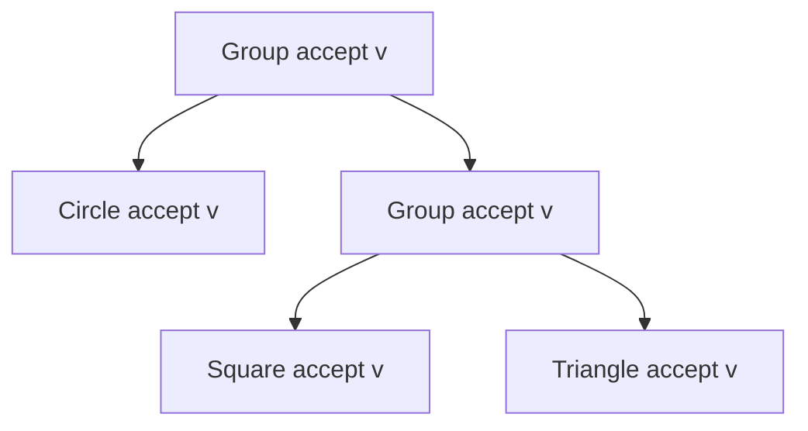
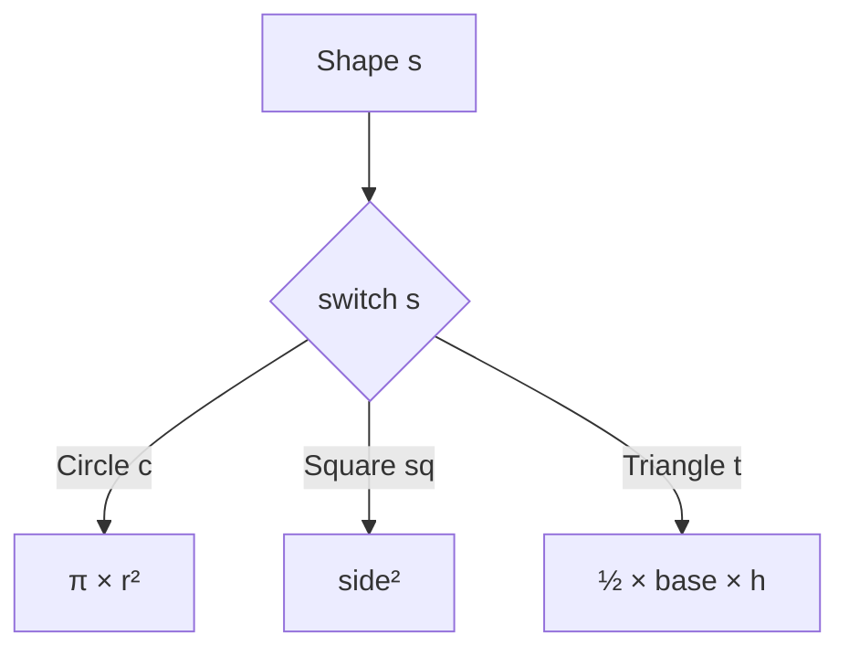
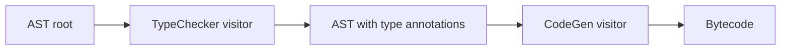

# Visitor — Middle Level

> **Source:** [refactoring.guru/design-patterns/visitor](https://refactoring.guru/design-patterns/visitor)
> **Prerequisite:** [Junior](junior.md)

---

## Table of Contents

1. [Beyond hello-world](#beyond-hello-world)
2. [AST Visitor (compiler / interpreter)](#ast-visitor-compiler--interpreter)
3. [File system traversal](#file-system-traversal)
4. [Visitor + Composite](#visitor--composite)
5. [Reflective Visitor (default fallback)](#reflective-visitor-default-fallback)
6. [Sealed types + pattern matching alternative](#sealed-types--pattern-matching-alternative)
7. [Visitor with accumulator state](#visitor-with-accumulator-state)
8. [Visitor that mutates the tree](#visitor-that-mutates-the-tree)
9. [Generic / typed return values](#generic--typed-return-values)
10. [Stateful traversal: depth, parents, paths](#stateful-traversal-depth-parents-paths)
11. [Pre-order / post-order / in-order](#pre-order--post-order--in-order)
12. [Common refactorings](#common-refactorings)
13. [Comparing Visitor with alternatives](#comparing-visitor-with-alternatives)
14. [Anti-patterns at this level](#anti-patterns-at-this-level)
15. [Diagrams](#diagrams)

---

## Beyond hello-world

Junior level showed shapes. In real code, Visitor appears in:

- **Compiler ASTs** — type check, optimization, code generation as separate visitors.
- **DOM / XML / HTML traversal** — apply transformations to nodes.
- **Configuration trees** — validate, render, merge.
- **Parse trees** — ANTLR generates Visitor and Listener classes.
- **Spring Expression Language** — visitors evaluate expressions.

The middle-level theme: handling real *trees* (not flat lists) and combining Visitor with other patterns.

---

## AST Visitor (compiler / interpreter)

A small expression language: `1 + 2 * 3` → AST → multiple operations on it.

### AST

```java
public sealed interface Expr permits NumberLit, BinaryOp, Variable {
    <R> R accept(ExprVisitor<R> visitor);
}

public record NumberLit(double value) implements Expr {
    public <R> R accept(ExprVisitor<R> v) { return v.visitNumber(this); }
}

public record BinaryOp(Expr left, String op, Expr right) implements Expr {
    public <R> R accept(ExprVisitor<R> v) { return v.visitBinary(this); }
}

public record Variable(String name) implements Expr {
    public <R> R accept(ExprVisitor<R> v) { return v.visitVariable(this); }
}

public interface ExprVisitor<R> {
    R visitNumber(NumberLit n);
    R visitBinary(BinaryOp b);
    R visitVariable(Variable v);
}
```

### Visitor 1: Evaluator

```java
public final class Evaluator implements ExprVisitor<Double> {
    private final Map<String, Double> env;

    public Evaluator(Map<String, Double> env) { this.env = env; }

    public Double visitNumber(NumberLit n)   { return n.value(); }
    public Double visitVariable(Variable v)  { return env.getOrDefault(v.name(), 0.0); }

    public Double visitBinary(BinaryOp b) {
        double l = b.left().accept(this);
        double r = b.right().accept(this);
        return switch (b.op()) {
            case "+" -> l + r;
            case "-" -> l - r;
            case "*" -> l * r;
            case "/" -> l / r;
            default  -> throw new IllegalStateException("op: " + b.op());
        };
    }
}
```

### Visitor 2: Pretty-printer

```java
public final class Printer implements ExprVisitor<String> {
    public String visitNumber(NumberLit n)   { return String.valueOf(n.value()); }
    public String visitVariable(Variable v)  { return v.name(); }
    public String visitBinary(BinaryOp b) {
        return "(" + b.left().accept(this) + " " + b.op() + " " + b.right().accept(this) + ")";
    }
}
```

### Visitor 3: Variable collector

```java
public final class VarCollector implements ExprVisitor<Set<String>> {
    public Set<String> visitNumber(NumberLit n)   { return Set.of(); }
    public Set<String> visitVariable(Variable v)  { return Set.of(v.name()); }
    public Set<String> visitBinary(BinaryOp b) {
        Set<String> left = b.left().accept(this);
        Set<String> right = b.right().accept(this);
        Set<String> result = new HashSet<>(left);
        result.addAll(right);
        return result;
    }
}
```

### Demo

```java
Expr ast = new BinaryOp(
    new NumberLit(1),
    "+",
    new BinaryOp(new Variable("x"), "*", new NumberLit(3))
);

double result = ast.accept(new Evaluator(Map.of("x", 2.0)));   // 7.0
String pretty = ast.accept(new Printer());                      // "(1.0 + (x * 3.0))"
Set<String> vars = ast.accept(new VarCollector());              // {x}
```

Each operation is a separate visitor. Adding "type checker" or "optimizer" = new visitor. **No edits to AST nodes.**

This is *exactly* how compilers like javac, TypeScript Compiler, Roslyn, ANTLR-generated parsers work.

---

## File system traversal

A file/folder tree with multiple operations: total size, file count, find duplicates, virus scan.

```python
from abc import ABC, abstractmethod
from typing import Generic, TypeVar

R = TypeVar("R")


class FsNode(ABC):
    def __init__(self, name: str): self.name = name
    @abstractmethod
    def accept(self, visitor: "FsVisitor[R]") -> R: ...


class File(FsNode):
    def __init__(self, name: str, size: int):
        super().__init__(name)
        self.size = size
    def accept(self, visitor): return visitor.visit_file(self)


class Directory(FsNode):
    def __init__(self, name: str, children: list[FsNode]):
        super().__init__(name)
        self.children = children
    def accept(self, visitor): return visitor.visit_directory(self)


class FsVisitor(ABC, Generic[R]):
    @abstractmethod
    def visit_file(self, f: File) -> R: ...
    @abstractmethod
    def visit_directory(self, d: Directory) -> R: ...


class TotalSize(FsVisitor[int]):
    def visit_file(self, f: File) -> int:
        return f.size

    def visit_directory(self, d: Directory) -> int:
        return sum(c.accept(self) for c in d.children)


class FileCount(FsVisitor[int]):
    def visit_file(self, f: File) -> int:
        return 1

    def visit_directory(self, d: Directory) -> int:
        return sum(c.accept(self) for c in d.children)


class FindLarge(FsVisitor[list[File]]):
    def __init__(self, threshold: int):
        self.threshold = threshold

    def visit_file(self, f: File) -> list[File]:
        return [f] if f.size > self.threshold else []

    def visit_directory(self, d: Directory) -> list[File]:
        result = []
        for c in d.children:
            result.extend(c.accept(self))
        return result
```

Usage:

```python
root = Directory("/", [
    File("a.txt", 100),
    File("b.bin", 5_000_000),
    Directory("docs", [
        File("readme.md", 2_000),
        File("report.pdf", 10_000_000),
    ]),
])

print(root.accept(TotalSize()))           # 15_002_100
print(root.accept(FileCount()))           # 4
print([f.name for f in root.accept(FindLarge(1_000_000))])
# ['b.bin', 'report.pdf']
```

The directory's `visit_directory` recurses by calling each child's `accept(self)` — passing the same visitor down. The visitor naturally walks the tree.

---

## Visitor + Composite

The Composite pattern is a tree of objects sharing an interface. Visitor + Composite is a classic combo.

- **Composite** structures the tree (file / directory; expression / sub-expression).
- **Visitor** does operations on the tree.

The composite's `accept(visitor)` typically:
1. Calls `visitor.visitGroup(this)`, OR
2. Forwards to children: `for (Component c : children) c.accept(visitor);`

Either way works. Modern preference: let the visitor decide whether to recurse, by having `visitGroup` call `child.accept(this)` itself. This gives the visitor more control (e.g., short-circuit, depth limits).

```java
class Group implements Shape {
    private final List<Shape> children;
    public <R> R accept(ShapeVisitor<R> v) { return v.visitGroup(this); }
    public List<Shape> children() { return children; }
}

class AreaCalculator implements ShapeVisitor<Double> {
    public Double visitGroup(Group g) {
        return g.children().stream().mapToDouble(c -> c.accept(this)).sum();
    }
    // ... visitCircle, visitSquare ...
}
```

---

## Reflective Visitor (default fallback)

What if you want most visitors to handle just a few node types and ignore the rest?

```java
public abstract class DefaultVisitor<R> implements ExprVisitor<R> {
    public R visitNumber(NumberLit n)   { return defaultValue(); }
    public R visitVariable(Variable v)  { return defaultValue(); }
    public R visitBinary(BinaryOp b) {
        b.left().accept(this);
        b.right().accept(this);
        return defaultValue();
    }
    protected abstract R defaultValue();
}

// A specialized visitor only cares about variables:
public class VarLogger extends DefaultVisitor<Void> {
    @Override public Void visitVariable(Variable v) {
        System.out.println("var: " + v.name());
        return null;
    }
    @Override protected Void defaultValue() { return null; }
}
```

Inheriting from a default visitor reduces ceremony for narrow visitors. Eclipse JDT / IntelliJ AST visitors work this way.

---

## Sealed types + pattern matching alternative

Modern languages let you skip Visitor for many cases:

### Java 17+ sealed + pattern matching

```java
public sealed interface Shape permits Circle, Square, Triangle {}
public record Circle(double radius) implements Shape {}
public record Square(double side) implements Shape {}
public record Triangle(double base, double height) implements Shape {}

double area(Shape s) {
    return switch (s) {
        case Circle c     -> Math.PI * c.radius() * c.radius();
        case Square sq    -> sq.side() * sq.side();
        case Triangle t   -> 0.5 * t.base() * t.height();
    };
}
```

No accept method, no visitor interface. Compiler enforces exhaustiveness — adding a new shape = compile errors everywhere `switch (Shape)` lives, which is what you want.

### TypeScript discriminated unions

```typescript
type Shape =
    | { kind: "circle"; radius: number }
    | { kind: "square"; side: number }
    | { kind: "triangle"; base: number; height: number };

function area(s: Shape): number {
    switch (s.kind) {
        case "circle":   return Math.PI * s.radius ** 2;
        case "square":   return s.side ** 2;
        case "triangle": return 0.5 * s.base * s.height;
    }
}
```

`s.kind` discriminator drives type narrowing.

### Kotlin sealed classes

```kotlin
sealed class Shape
data class Circle(val radius: Double) : Shape()
data class Square(val side: Double) : Shape()
data class Triangle(val base: Double, val height: Double) : Shape()

fun area(s: Shape): Double = when (s) {
    is Circle   -> Math.PI * s.radius * s.radius
    is Square   -> s.side * s.side
    is Triangle -> 0.5 * s.base * s.height
}
```

`when` is exhaustive.

### When pattern matching beats Visitor

- Element types stable.
- Need access to all element data (visible).
- One operation at a time, written as a function.
- No need to share traversal logic among operations.

### When Visitor is still preferable

- Many operations sharing traversal logic (e.g., visiting BinaryOp recurses left/right; switch must repeat).
- Need to organize operations as classes with state.
- Visitor pre-existed (refactoring tax).
- Code generation / template tools expect visitors (ANTLR).

In practice: modern code uses pattern matching for one-off operations and Visitor for elaborate, stateful, multi-pass traversals.

---

## Visitor with accumulator state

A visitor can carry state to accumulate results during traversal:

```java
public final class StatsVisitor implements ExprVisitor<Void> {
    private int numberOfVariables = 0;
    private int numberOfBinaryOps = 0;
    private double constantSum = 0;

    public Void visitNumber(NumberLit n) {
        constantSum += n.value();
        return null;
    }

    public Void visitVariable(Variable v) {
        numberOfVariables++;
        return null;
    }

    public Void visitBinary(BinaryOp b) {
        numberOfBinaryOps++;
        b.left().accept(this);
        b.right().accept(this);
        return null;
    }

    public int variables()    { return numberOfVariables; }
    public int binaryOps()    { return numberOfBinaryOps; }
    public double sum()       { return constantSum; }
}
```

Usage:

```java
StatsVisitor stats = new StatsVisitor();
ast.accept(stats);
System.out.printf("vars=%d ops=%d sum=%.1f%n", stats.variables(), stats.binaryOps(), stats.sum());
```

Visitor is *one-shot*: after a traversal, read its accumulated state, then discard. **Don't reuse without resetting.**

---

## Visitor that mutates the tree

Mutating visitor returns the new (or same) node:

```java
public final class ConstFolder implements ExprVisitor<Expr> {
    public Expr visitNumber(NumberLit n)   { return n; }
    public Expr visitVariable(Variable v)  { return v; }

    public Expr visitBinary(BinaryOp b) {
        Expr l = b.left().accept(this);
        Expr r = b.right().accept(this);

        if (l instanceof NumberLit ln && r instanceof NumberLit rn) {
            // both sides constant → fold
            return new NumberLit(switch (b.op()) {
                case "+" -> ln.value() + rn.value();
                case "*" -> ln.value() * rn.value();
                default  -> throw new IllegalStateException();
            });
        }
        return new BinaryOp(l, b.op(), r);   // structurally identical, possibly with rewritten children
    }
}
```

`(1 + 2) * 3` becomes `3 * 3` after one pass; another pass yields `9`.

This is the core of **AST rewriting**: each visitor returns a new tree (or unchanged) — a foundational compiler technique.

For mutable trees, an alternative: visitor *modifies* nodes in-place and returns void. Less safe (visitor with side effects); pure rewriting visitors are usually clearer.

---

## Generic / typed return values

Visitor's return type is parameterized:

```java
public interface ExprVisitor<R> {
    R visitNumber(NumberLit n);
    R visitBinary(BinaryOp b);
    R visitVariable(Variable v);
}
```

Different visitors return different types:
- Evaluator returns `Double`.
- Printer returns `String`.
- TypeChecker returns `Type`.
- Optimizer returns `Expr`.

If your visitor needs no return value, use `Void` (Java) / `null` (Python) / `void` (TypeScript). For void visitors that mutate state internally, type is `Void` and `accept` always returns `null`.

---

## Stateful traversal: depth, parents, paths

Sometimes you need context as you walk the tree.

### Depth

```java
public final class DepthAwarePrinter implements ExprVisitor<Void> {
    private int depth = 0;

    public Void visitNumber(NumberLit n) {
        System.out.println("  ".repeat(depth) + "Number(" + n.value() + ")");
        return null;
    }

    public Void visitVariable(Variable v) {
        System.out.println("  ".repeat(depth) + "Variable(" + v.name() + ")");
        return null;
    }

    public Void visitBinary(BinaryOp b) {
        System.out.println("  ".repeat(depth) + "Binary(" + b.op() + ")");
        depth++;
        b.left().accept(this);
        b.right().accept(this);
        depth--;
        return null;
    }
}
```

### Parent tracking

```java
public final class ParentTrackingVisitor implements ExprVisitor<Void> {
    private final Deque<Expr> parents = new ArrayDeque<>();

    public Void visitBinary(BinaryOp b) {
        parents.push(b);
        b.left().accept(this);
        b.right().accept(this);
        parents.pop();
        return null;
    }

    public Void visitVariable(Variable v) {
        Expr parent = parents.peek();
        System.out.println("var " + v.name() + " under: " + parent);
        return null;
    }

    public Void visitNumber(NumberLit n) { return null; }
}
```

ANTLR's `ParseTreeVisitor` and Eclipse JDT visitors track parents this way. The deque pattern is universal for traversal context.

---

## Pre-order / post-order / in-order

Different operations want different traversal orders:

### Pre-order: visit parent before children

```java
public Void visitBinary(BinaryOp b) {
    handle(b);                       // pre-order
    b.left().accept(this);
    b.right().accept(this);
    return null;
}
```

Used for: emitting code (open tag, then children), counting nodes from root down.

### Post-order: visit children before parent

```java
public Void visitBinary(BinaryOp b) {
    b.left().accept(this);
    b.right().accept(this);
    handle(b);                       // post-order
    return null;
}
```

Used for: evaluation (compute children first, then combine), constant folding, type checking from leaves up.

### In-order: between left and right (for binary trees)

```java
public Void visitBinary(BinaryOp b) {
    b.left().accept(this);
    handle(b);                       // in-order
    b.right().accept(this);
    return null;
}
```

Used for: pretty-printing, iterating sorted BSTs.

The visitor controls order. Don't bake order into `accept` methods — let visitors choose.

---

## Common refactorings

### Refactoring 1: From `instanceof` chain to Visitor

Before:

```java
double area(Shape s) {
    if (s instanceof Circle c) return Math.PI * c.radius * c.radius;
    if (s instanceof Square sq) return sq.side * sq.side;
    throw new IllegalArgumentException("unknown: " + s);
}

double perimeter(Shape s) {
    if (s instanceof Circle c) return 2 * Math.PI * c.radius;
    if (s instanceof Square sq) return 4 * sq.side;
    throw new IllegalArgumentException("unknown: " + s);
}
```

Repeated structure; both can be Visitor.

After: `AreaVisitor implements ShapeVisitor<Double>`, `PerimeterVisitor implements ShapeVisitor<Double>`.

Or, in modern Java/Kotlin: sealed types + exhaustive switch (no Visitor needed).

### Refactoring 2: Operation moved out of element

Before:

```java
class Circle {
    double area() { ... }
    String toJson() { ... }
    String toSvg() { ... }
    Color dominantColor() { ... }   // AI-extracted color
    boolean intersects(Circle other) { ... }
    boolean isInside(Rect bounds) { ... }
}
```

Bloated.

After: Operations become visitors:
- `AreaVisitor`
- `JsonVisitor`
- `SvgVisitor`
- `IntersectionTester` (specialized — visitor for one operation between two specific elements; double dispatch overkill).

Keep on the class only what is *intrinsic to being a Circle* (radius, equality, hashing). Lift extrinsic operations.

### Refactoring 3: Visitor → Strategy

If you have *one* operation but it varies, that's Strategy not Visitor:

```java
interface AreaStrategy { double compute(Shape s); }
class StandardArea implements AreaStrategy { ... }
class SignedArea implements AreaStrategy { ... }   // negative for clockwise polygons
```

Visitor handles many operations; Strategy handles many *implementations* of one operation.

---

## Comparing Visitor with alternatives

| Approach | When | Pros | Cons |
|---|---|---|---|
| **Visitor** | Stable hierarchy, growing operations | Clean separation; type-safe | Hierarchy locked |
| **instanceof / pattern match** | Simple, one-off operations | Lightweight; modern syntax | Repeated chains; missed cases |
| **Method on element** | Operation intrinsic; few operations | Encapsulation; OO-natural | Element bloats |
| **Sealed + switch** | Modern languages; stable hierarchy | Compiler exhaustiveness; less ceremony | Element-side operations only |
| **Strategy** | One operation; many algorithms | Fine-grained; pluggable | Doesn't solve hierarchy problem |
| **Reflection / dispatch table** | Runtime-only types | Most flexible | No compile-time safety |

---

## Anti-patterns at this level

### Anti-pattern 1: God visitor

```java
class GiantVisitor implements ShapeVisitor {
    Double area;
    String svg;
    String json;
    Color dominantColor;
    // 20 fields, 10 mixed concerns
}
```

Visitor is supposed to do one thing. If your visitor has multiple unrelated responsibilities, split it.

### Anti-pattern 2: Visitor for elements that change often

If your team adds a new element class every week, every visitor breaks every week. Stop using Visitor; use pattern matching, methods on elements, or a hash-map dispatch.

### Anti-pattern 3: Visitor that bypasses encapsulation

```java
class Circle {
    public double radius;   // exposed for Visitor!
    public Point center;    // exposed!
    public Color borderColor;   // exposed!
    public LineStyle borderStyle;   // exposed!
}
```

Visitor needs *some* public access, but if you're exposing 20 fields, your Visitor is too tightly coupled. Maybe operations belong on the class.

### Anti-pattern 4: Visitor in a non-stable hierarchy

If your hierarchy is `MammalVisitor` and you're constantly adding new species, you'll never finish. Visitor is *only* for stable hierarchies.

### Anti-pattern 5: Visitor that returns mismatched types per element

```java
class WeirdVisitor implements ShapeVisitor<Object> {
    public Object visitCircle(Circle c) { return c.radius; }   // Double
    public Object visitSquare(Square s) { return s.toString(); }   // String
    public Object visitTriangle(Triangle t) { return new Date(); }   // !?
}
```

Use `Object` only as last resort. If return types vary, the visitor is doing multiple things — split.

---

## Diagrams

### Visitor + Composite tree walk



`v` is the same visitor throughout. Each `accept` calls `visitX(this)`.

### Pattern matching alternative



Compiler proves exhaustiveness — adding a `Hexagon` to the sealed hierarchy makes this `switch` fail to compile.

### Two-pass compiler with visitors



Each pass is a visitor. Order matters; output of one becomes input of next.

---

[← Junior](junior.md) · [Senior →](senior.md)
