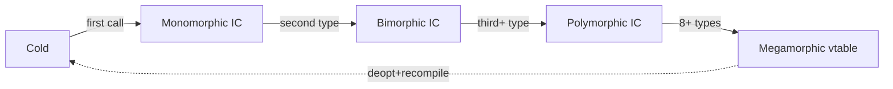
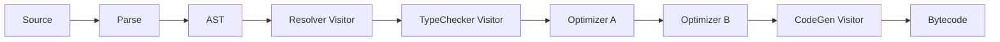
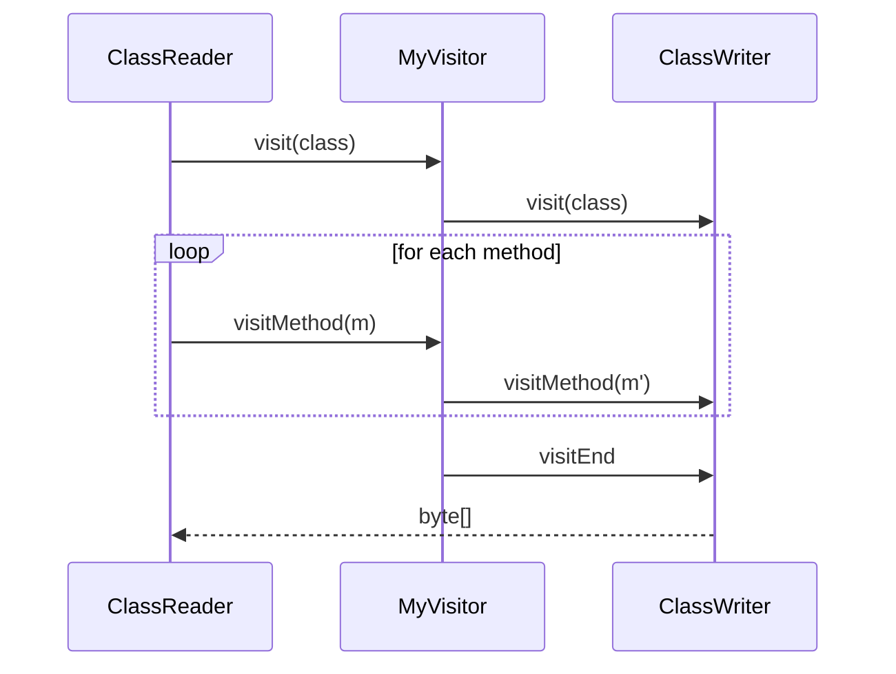

# Visitor — Professional Level

> **Source:** [refactoring.guru/design-patterns/visitor](https://refactoring.guru/design-patterns/visitor)
> **Prerequisite:** [Senior](senior.md)

---

## Table of Contents

1. [Introduction](#introduction)
2. [JIT internals: virtual call sites in Visitor](#jit-internals-virtual-call-sites-in-visitor)
3. [Pattern-matching JIT vs Visitor](#pattern-matching-jit-vs-visitor)
4. [Memory layout of AST + Visitor traversal](#memory-layout-of-ast--visitor-traversal)
5. [Visitor and tail recursion / stack depth](#visitor-and-tail-recursion--stack-depth)
6. [Trampoline visitors](#trampoline-visitors)
7. [Tree rewriting performance](#tree-rewriting-performance)
8. [Visitor in distributed compilation](#visitor-in-distributed-compilation)
9. [Code generation: source-generated visitors](#code-generation-source-generated-visitors)
10. [Bytecode-level Visitor (ASM, JavaParser)](#bytecode-level-visitor-asm-javaparser)
11. [GraphQL resolvers as Visitor](#graphql-resolvers-as-visitor)
12. [Compiler optimization passes](#compiler-optimization-passes)
13. [Cross-language comparison](#cross-language-comparison)
14. [Microbenchmark anatomy](#microbenchmark-anatomy)
15. [Diagrams](#diagrams)
16. [Related Topics](#related-topics)

---

## Introduction

At the professional level, Visitor is examined for what the runtime, compiler, and toolchain make of it: how JIT inlines virtual dispatch, where memory layout dominates, how source-generated visitors beat hand-written ones for static hierarchies, and how Visitor maps to bytecode-manipulation libraries.

For high-throughput systems like compilers (millions of nodes per build), JSON parsers, and analyzers, Visitor's structure determines performance.

---

## JIT internals: virtual call sites in Visitor

A typical Visitor traversal has **two virtual calls per node**:

```java
node.accept(visitor);             // virtual #1: which subclass's accept?
visitor.visitConcrete(this);      // virtual #2: which visitor's visit?
```

### Inline cache (IC) states

JVM HotSpot tracks call sites:

| State | Subclasses seen | Cost |
|---|---|---|
| Cold | 0 | Slow path |
| Monomorphic | 1 | Direct call (~0ns after inlining) |
| Bimorphic | 2 | Compare + call (~1ns) |
| Polymorphic | 3-7 | Fast guard chain (~2-3ns) |
| Megamorphic | 8+ | Vtable lookup (~3-5ns) |

For an AST traversal:

- If you traverse a tree with 5 node types: visit-method call site is polymorphic (~2ns).
- If your traversal sees only 1 visitor type per JVM lifetime (rare): monomorphic (~0ns inlined).
- If your tree has 50 node types (real Java AST): megamorphic (~5ns).

Per node × 1M nodes × 5ns = ~5ms compile-time overhead from dispatch alone.

### Devirtualization tricks

**Single-implementor optimization.** If the JVM sees only one `Shape` implementation at a call site, it inlines `accept` directly. Loading a second class deoptimizes.

**`final` classes** signal to JIT that the dispatch chain is short. `Circle` as `final class` lets JIT skip subclass checks.

**Sealed types** (Java 17+) are even better — JIT proves at compile time the closed set, enabling jump tables.

---

## Pattern-matching JIT vs Visitor

### Sealed switch in Java 21+

```java
double area(Shape s) {
    return switch (s) {
        case Circle c     -> Math.PI * c.radius() * c.radius();
        case Square sq    -> sq.side() * sq.side();
        case Triangle t   -> 0.5 * t.base() * t.height();
    };
}
```

Compiles to `tableswitch` or `lookupswitch` on a hidden type discriminator. **No virtual dispatch.** Branch predictor handles 5+ cases efficiently.

### Visitor compiles to vtable

```java
shape.accept(areaVisitor);   // vtable lookup, then second vtable lookup
```

Pattern matching: ~1-2ns per call.
Visitor: ~3-5ns per call (two virtuals, possibly megamorphic).

For the *same* operation, pattern match is **2-3× faster** when both are warm.

### When Visitor is comparable

JIT inlines monomorphic Visitor calls. After warmup with one visitor type used everywhere, dispatch nearly free.

For visitors used across hot and cold call sites, pattern match wins consistently.

### Why Visitor still pervasive

Compilers and parser tools shape APIs around Visitor (ANTLR, javac plugins). Pattern match can't *replace* Visitor's class-based organization — only compete on dispatch cost.

For *new* Java code on hot paths: prefer sealed + pattern match.
For *existing* compiler infrastructure: keep Visitor.

---

## Memory layout of AST + Visitor traversal

### AST is pointer-soup

```
BinaryOp ───→ left ──→ NumberLit
         └──→ right ─→ BinaryOp
                          └──→ Variable
                          └──→ NumberLit
```

Each node a heap object; references everywhere. Cache lines fragmented.

### Cache miss per node

For 1M nodes, 64-byte cache lines, randomly placed: every node access likely a cache miss. ~10ns per miss × 1M = 10ms. Often dominates dispatch cost.

### Mitigation 1: arena allocation

Allocate AST nodes from a contiguous arena. Adjacent nodes (in AST order) end up adjacent in memory. Pre-order traversal hits the cache.

```java
public class AstArena {
    private final List<Object> nodes = new ArrayList<>();
    public <T> T alloc(T node) { nodes.add(node); return node; }
}

AstArena arena = new AstArena();
Expr ast = arena.alloc(new BinaryOp(
    arena.alloc(new NumberLit(1)),
    "+",
    arena.alloc(new NumberLit(2))
));
```

ANTLR, Roslyn, V8 use arena allocation.

### Mitigation 2: structure of arrays

Instead of `List<Node>` where each `Node` is heterogeneous, use parallel arrays:

```java
class FlatAst {
    int[] kinds;       // node type id
    int[] childStart;  // index into childIndices
    int[] childCount;
    double[] numberValues;
    String[] stringValues;
}
```

Cache-dense; Visitor traversal becomes a tight loop over `kinds[]`. SoA wins on cache for read-heavy workloads.

Cost: API less natural; mutation harder.

### Mitigation 3: bytecode-style Visitor

Don't use AST objects at all — use a stream of typed events:

```java
visitor.startBinary("+");
visitor.numberLit(1);
visitor.numberLit(2);
visitor.endBinary();
```

ASM (Java bytecode lib) does this. Tree exists conceptually; physically, just an event sequence. Zero allocation past the parser.

---

## Visitor and tail recursion / stack depth

Recursive Visitor walks a tree of depth N → stack depth N. JVM default stack ~512KB, ~32K frames at 16B each. 32K-deep AST OK; deeper not.

### Pathological case

A linked list represented as right-recursive AST: `1 + 2 + 3 + ... + 1M` parsed left-associative is fine; right-associative produces a 1M-deep tree → StackOverflowError.

### Mitigation: iterative traversal

```java
public class IterativeEvaluator {
    public double eval(Expr root, Map<String, Double> env) {
        Deque<Object> stack = new ArrayDeque<>();
        Deque<Expr> work = new ArrayDeque<>();
        work.push(root);

        while (!work.isEmpty()) {
            Expr e = work.pop();
            if (e instanceof NumberLit n) {
                stack.push(n.value());
            } else if (e instanceof Variable v) {
                stack.push(env.getOrDefault(v.name(), 0.0));
            } else if (e instanceof BinaryOp b) {
                // emit a "combine" marker on the work stack
                work.push(new Combine(b.op()));
                work.push(b.right());
                work.push(b.left());
            } else if (e instanceof Combine c) {
                double r = (Double) stack.pop();
                double l = (Double) stack.pop();
                stack.push(combine(l, c.op(), r));
            }
        }
        return (Double) stack.pop();
    }
}
```

Stack lives in the heap, depth limited only by RAM. Required for deep ASTs in production.

### Continuation-passing visitor

Each visit returns a continuation `() -> next step`. The runner loop calls one continuation at a time:

```java
interface Cont { Cont step(); }

class EvalCont implements Cont {
    Expr e;
    BiFunction<Double, Cont, Cont> k;   // continuation receives result
    public Cont step() {
        if (e instanceof NumberLit n) return k.apply(n.value(), null);
        // ...
    }
}
```

Heavy ceremony in Java; natural in Scheme/Haskell. Used in real-world for async tree walks.

---

## Trampoline visitors

Java/JVM has no tail-call optimization. A long chain of recursive visits stack-overflows.

**Trampoline:** convert recursion to a loop by returning thunks:

```java
public sealed interface Step<R> {
    record Done<R>(R value) implements Step<R> {}
    record More<R>(Supplier<Step<R>> next) implements Step<R> {}
}

public static <R> R run(Step<R> step) {
    while (step instanceof Step.More<R> more) {
        step = more.next().get();
    }
    return ((Step.Done<R>) step).value();
}

public class TrampolinedEvaluator {
    public Step<Double> visit(Expr e) {
        if (e instanceof NumberLit n) return new Step.Done<>(n.value());
        if (e instanceof BinaryOp b) {
            return new Step.More<>(() -> {
                Step<Double> l = visit(b.left());
                // ...
                return new Step.Done<>(combine(...));
            });
        }
        // ...
    }
}
```

Bouncing between thunks — depth-bounded by allocation, not stack.

### Real-world: Scala/Cats `Eval`

Functional libraries provide trampolines as primitives. For tree visitors that may hit deep recursion, mandatory.

---

## Tree rewriting performance

Visitor that returns a new tree allocates O(depth) per change.

### Persistent / structural sharing

If Visitor returns the original node when nothing changed, only the changed path allocates:

```java
public Expr visitBinary(BinaryOp b) {
    Expr nl = b.left().accept(this);
    Expr nr = b.right().accept(this);
    if (nl == b.left() && nr == b.right()) return b;   // no change → reuse
    return new BinaryOp(nl, b.op(), nr);
}
```

For a 1M-node tree where 1 leaf changes: O(log N) allocations along the path, not O(N) for the whole tree. **Persistent data structure principle.**

Roslyn (C# compiler), Scalameta (Scala), Tree-sitter all use this.

### Hash-consing

Identical subtrees share one object:

```java
class HashConsedAst {
    private final Map<NodeKey, Expr> cache = new HashMap<>();

    public Expr makeBinary(Expr l, String op, Expr r) {
        NodeKey k = new NodeKey(l, op, r);
        return cache.computeIfAbsent(k, x -> new BinaryOp(l, op, r));
    }
}
```

`new BinaryOp(1, +, 2)` always returns the same instance. Equality by reference. Memory bounded by *unique* subtrees, not total.

Used in SMT solvers (Z3, CVC), proof assistants (Coq, Lean), and many compilers for shared subexpressions.

### Allocation-free transforms

If the visitor only inspects (not rewrite), zero allocation. Bring this to mind for read-only visitors (linters, analyzers).

---

## Visitor in distributed compilation

Modern build systems (Bazel, Buck, Pants) split compilation across machines. Each unit is parsed and typed locally; cross-unit references resolved via a build cache.

### Visitor units of work

- One visitor pass per file = independently distributable.
- Cross-file passes (resolution) need a centralized symbol table.

Bazel splits Java compilation: each `java_library` runs javac in its sandbox; outputs bundled class files + a header for downstream consumption. Visitor-based passes fit naturally.

### Incremental recompilation

When a file changes:
1. Reparse → new AST.
2. Re-run visitors, but skip subtrees identical to last build (hash-conse + memoization).

The visitor is the unit; cache keys are AST hashes.

---

## Code generation: source-generated visitors

For a known stable hierarchy, hand-writing Visitor interfaces is boilerplate. Generators help.

### Java annotation processor

```java
@GenerateVisitor
sealed interface Shape permits Circle, Square, Triangle {}

// Generates at compile time:
public interface ShapeVisitor<R> {
    R visitCircle(Circle c);
    R visitSquare(Square s);
    R visitTriangle(Triangle t);
}
```

No hand-maintained Visitor interface. Adding a `Hexagon` regenerates with a `visitHexagon`. Existing visitors break — exactly what you want.

### Roslyn source generators (C#)

```csharp
[GenerateVisitor]
public abstract record Shape;
public record Circle(double Radius) : Shape;
public record Square(double Side) : Shape;
```

Roslyn generates a `ShapeVisitor<R>` interface and helper extension methods.

### TypeScript transformers

`ts-morph` lets you write transformers as visitors generated from type info. The `ts.transform` API itself is a Visitor.

Source-generated visitors eliminate the boilerplate cost of the pattern.

---

## Bytecode-level Visitor (ASM, JavaParser)

ASM is *the* low-level Java bytecode library. Its API is pure Visitor:

```java
public class MethodCounter extends ClassVisitor {
    int methodCount = 0;

    public MethodCounter() { super(Opcodes.ASM9); }

    @Override
    public MethodVisitor visitMethod(int access, String name, String desc, String sig, String[] exc) {
        methodCount++;
        return null;   // skip method body
    }
}

ClassReader reader = new ClassReader(classBytes);
MethodCounter counter = new MethodCounter();
reader.accept(counter, 0);
System.out.println("methods: " + counter.methodCount);
```

For each class file, ASM streams events: class header, then field events, then method events, then (if requested) instruction events per method. Visitor receives them.

### Why streaming Visitor

- No materialized AST (memory-cheap).
- Can transform on the fly: `ClassReader → ClassWriter` with custom `ClassVisitor` in middle = bytecode rewriter.
- Used by AOP frameworks (AspectJ load-time), profilers, mocking frameworks (Mockito, ByteBuddy).

ByteBuddy higher-level; ASM is the foundation.

### JavaParser

For source-level Java AST manipulation, JavaParser:

```java
CompilationUnit cu = StaticJavaParser.parse(file);
cu.accept(new VoidVisitorAdapter<Void>() {
    @Override
    public void visit(MethodDeclaration m, Void arg) {
        System.out.println("method: " + m.getNameAsString());
        super.visit(m, arg);   // recurse into body
    }
}, null);
```

Visitor + adapter pattern; you override only what you care about.

---

## GraphQL resolvers as Visitor

GraphQL queries are trees; resolvers are visitors:

```javascript
const resolvers = {
    Query: {
        user: (_, { id }) => fetchUser(id)
    },
    User: {
        posts: (user) => fetchPosts(user.id),
        friends: (user) => fetchFriends(user.id)
    },
    Post: {
        author: (post) => fetchUser(post.authorId)
    }
};
```

The GraphQL engine walks the query AST, calling the appropriate resolver at each node. Each resolver is a "visit method" specific to a (Type, Field) pair.

This is essentially a Visitor where:
- **Element type** = GraphQL type (User, Post).
- **Operation** = the resolver function for that type's field.

GraphQL's strength comes from keeping type definitions stable and composing resolvers.

---

## Compiler optimization passes

A modern optimizing compiler runs dozens of Visitor passes:

- **Constant folding:** `1 + 2` → `3`.
- **Dead code elimination:** unreachable branches removed.
- **Inlining:** function call replaced with body.
- **Common subexpression elimination:** `f(x) + f(x)` → `t = f(x); t + t`.
- **Loop-invariant code motion.**
- **Strength reduction:** `x * 2` → `x << 1`.

Each pass: a Visitor over the IR (intermediate representation). LLVM, GraalVM, V8, all built around this principle.

### Pass managers

LLVM's `PassManager` schedules passes:

```cpp
PassManager pm;
pm.add(new ConstFoldPass());
pm.add(new DCEPass());
pm.add(new InlinePass());
pm.run(module);
```

Each pass is a Visitor over LLVM IR.

### Pass dependencies

Some passes invalidate analyses (e.g., DCE invalidates dominance). Pass managers track dependencies.

In Visitor terms: visiting tree may invalidate cached info. Visitors often rerun analyses or share immutable analysis results across passes.

---

## Cross-language comparison

| Language | Visitor Idiom | Modern Alternative |
|---|---|---|
| **Java** | Abstract Visitor + accept | Sealed types + switch (Java 17+) |
| **C#** | Visitor + IVisitor<T> | Pattern match on records (C# 9+) |
| **Kotlin** | Sealed classes + when | when on sealed (recommended) |
| **Python** | abc.ABC + accept; or `singledispatch` | structural pattern matching (3.10+) |
| **TypeScript** | Discriminated unions + switch | union + switch (idiomatic) |
| **Rust** | Enum + match | match (idiomatic) |
| **Haskell** | Algebraic data types + pattern match | match (native) |
| **Clojure** | Multimethods | Built-in; no Visitor needed |
| **Go** | type switch | type switch (idiomatic) |
| **C++** | Virtual visit / std::variant + std::visit | std::visit (C++17+) |

Languages with native ADTs + pattern matching rarely need Visitor pattern; they just *do it*. Visitor is a workaround for languages with single dispatch.

---

## Microbenchmark anatomy

### Visitor vs sealed switch (JMH)

```java
@Benchmark public double visitorPath(Bench b) {
    return b.shape.accept(b.areaVisitor);
}

@Benchmark public double switchPath(Bench b) {
    return area(b.shape);   // sealed switch
}
```

Typical numbers (warm JIT):
- Visitor (monomorphic): ~3-5ns per call (two virtuals, one inlined).
- Visitor (megamorphic 10+ types): ~10-15ns.
- Switch (sealed, 5 types): ~1-2ns (jump table).
- `instanceof` chain (5 types): ~2-3ns.

For a 1M-node tree: switch saves ~3-13ms over Visitor depending on dispatch shape.

### Allocation benchmark

```java
@Benchmark public Expr foldVisitor(Bench b) {
    return b.expr.accept(b.constFolder);
}
```

If most subtrees unchanged: ~0 allocations (structural sharing). If every node changes: ~16B per node × N nodes.

Garbage = throughput cost. Heavy-rewrite visitors: budget for GC pauses.

### Cache miss benchmark

Compare:
1. AST nodes randomly heap-allocated.
2. AST in arena.

Test: 1M-node tree, sum of all `NumberLit` values.

Numbers (rough):
- Random: ~50ns per node (cache miss dominated).
- Arena: ~5-10ns per node.

10× speedup just from layout. Visitor logic identical.

### Pitfalls

- JMH benchmarks must `@Fork` to isolate JIT state.
- Constant inputs → JIT folds the operation away.
- Use `Blackhole.consume(result)` to prevent dead-code elimination.

---

## Diagrams

### IC state transitions



### Compiler pass pipeline



Each visitor input: AST (or transformed AST). Each output: refined AST or final code.

### Streaming Visitor (ASM)



No materialized AST. Pure event stream.

---

## Related Topics

- [Sealed types](../../../coding-principles/sealed-types.md)
- [Pattern matching](../../../coding-principles/pattern-matching.md)
- [JIT internals](../../../performance/jit-internals.md)
- [Persistent data structures](../../../coding-principles/persistent-data-structures.md)
- [Cache locality](../../../performance/memory-layout.md)
- [Compiler architecture](../../../coding-principles/compilers.md)

[← Senior](senior.md) · [Interview →](interview.md)
