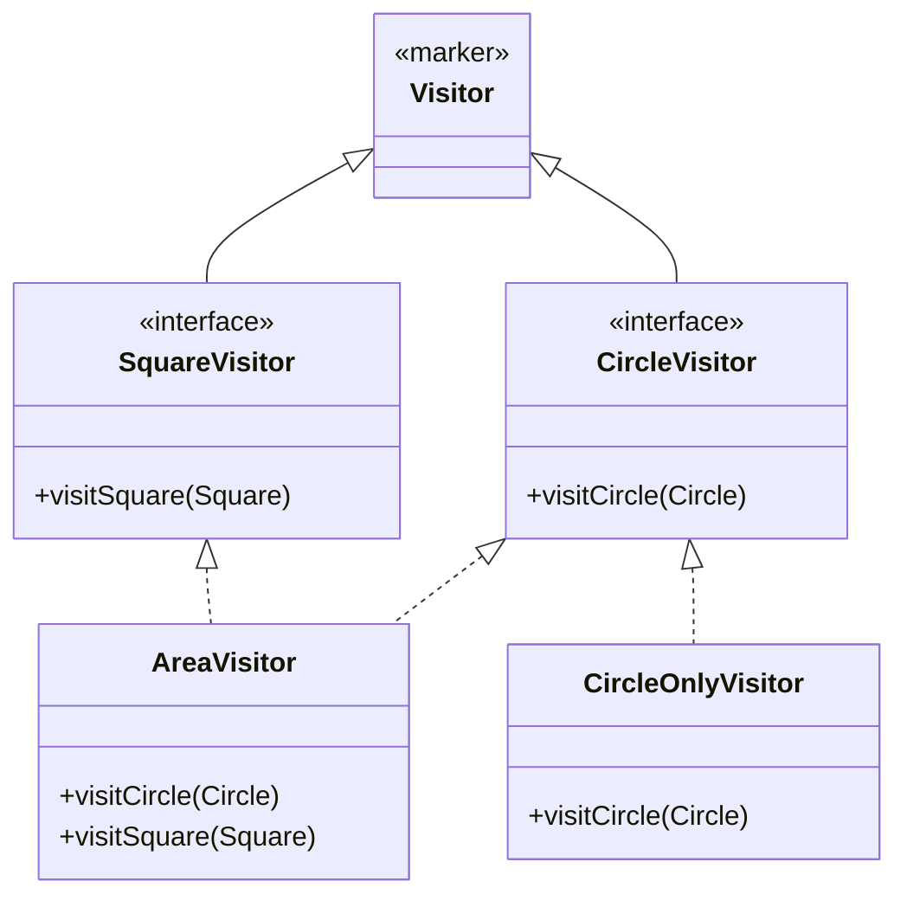

# Visitor — Senior Level

> **Source:** [refactoring.guru/design-patterns/visitor](https://refactoring.guru/design-patterns/visitor)
> **Prerequisite:** [Middle](middle.md)

---

## Table of Contents

1. [The Expression Problem](#the-expression-problem)
2. [Visitor vs Pattern Matching: when each wins](#visitor-vs-pattern-matching-when-each-wins)
3. [Visitor in compilers: ANTLR, javac, Roslyn](#visitor-in-compilers-antlr-javac-roslyn)
4. [Visitor in DOM, JDOM, AST tools](#visitor-in-dom-jdom-ast-tools)
5. [Multiple dispatch alternatives](#multiple-dispatch-alternatives)
6. [Acyclic Visitor (decoupling versions)](#acyclic-visitor-decoupling-versions)
7. [Internal vs external iteration](#internal-vs-external-iteration)
8. [Visitor with multiple traversal phases](#visitor-with-multiple-traversal-phases)
9. [Composite Visitor (combining visitors)](#composite-visitor-combining-visitors)
10. [Visitor and immutability](#visitor-and-immutability)
11. [Visitor + Builder for transformations](#visitor--builder-for-transformations)
12. [Annotations / decorators as alternative dispatch](#annotations--decorators-as-alternative-dispatch)
13. [Cycle detection and infinite traversal](#cycle-detection-and-infinite-traversal)
14. [Performance considerations](#performance-considerations)
15. [Testing visitors](#testing-visitors)
16. [Diagrams](#diagrams)

---

## The Expression Problem

Posed by Phil Wadler in 1998:

> *Can you extend a system in two dimensions — adding new types AND new operations — without modifying existing code, and with full type safety?*

In Visitor terms:
- **Adding operation:** new class implementing `Visitor` interface. Easy.
- **Adding type:** must add `visitNewType` to *every* visitor. Hard.

In OOP-on-element terms:
- **Adding type:** new class. Easy.
- **Adding operation:** must add method to *every* class. Hard.

Visitor and methods-on-element are **dual**: each makes one axis easy and the other hard.

**Solutions to the expression problem:**

| Approach | Fix |
|---|---|
| **Type classes (Haskell, Rust traits)** | Both axes extensible; compile-time proven |
| **Multimethods (Clojure, CLOS)** | Runtime dispatch on multiple args |
| **Default methods on interfaces** | Partial — adds operation methods with defaults |
| **Modular visitors / open variants** | Research languages |
| **Live with the trade-off** | What 95% of OOP does |

In practice: Visitor when operations grow, methods-on-element when types grow, and modern sealed types + pattern matching for finite hierarchies.

---

## Visitor vs Pattern Matching: when each wins

### Visitor wins when

- **Operations have shared traversal logic.** All visitors recurse into BinaryOp's left/right; pattern matching repeats this.
- **Operations have state.** A visitor can be a class with fields (depth, parents, accumulators). Pattern match function is stateless or carries state in args.
- **Operations span multiple files / packages.** Each visitor is a class; modular.
- **Code generators expect visitors.** ANTLR generates a `Visitor` skeleton; using it is path of least resistance.
- **You need to compose visitors.** Multiple passes, pre/post hooks (covered below).

### Pattern matching wins when

- **One-off operation.** Just a function; no need for a class.
- **Hierarchy is small and stable.** Few cases; switch is more readable.
- **You want exhaustiveness checking.** Sealed types + switch enforce at compile time.
- **Performance matters.** No virtual dispatch; compiler can optimize switch into jump table.
- **Modern language features.** Java 21 + records + sealed = clean.

### Real-world heuristic

For a *new* AST in modern Java/Kotlin/Rust: **start with pattern matching.** Refactor to Visitor only when:
1. You have 5+ operations sharing traversal logic.
2. Operations need stateful traversal.
3. You want to allow plugins to add visitors.

---

## Visitor in compilers: ANTLR, javac, Roslyn

### ANTLR

ANTLR generates parse trees and *both* a Listener interface (push: framework calls you on each node) and a Visitor interface (pull: you call children).

```java
// Generated:
public interface CalcVisitor<T> extends ParseTreeVisitor<T> {
    T visitProg(CalcParser.ProgContext ctx);
    T visitExpr(CalcParser.ExprContext ctx);
    T visitNumber(CalcParser.NumberContext ctx);
}

// You write:
public class Evaluator extends CalcBaseVisitor<Double> {
    @Override
    public Double visitNumber(CalcParser.NumberContext ctx) {
        return Double.parseDouble(ctx.NUMBER().getText());
    }

    @Override
    public Double visitExpr(CalcParser.ExprContext ctx) {
        if (ctx.PLUS() != null) {
            return visit(ctx.expr(0)) + visit(ctx.expr(1));
        }
        // ...
    }
}
```

`visit(node)` is the inherited helper that calls `node.accept(this)`. ANTLR users write visitors all day.

### javac

The OpenJDK compiler uses a custom `Visitor` interface (`com.sun.tools.javac.tree.JCTree.Visitor`) with methods like `visitMethodDef`, `visitIf`, `visitVarDef`. Multiple compiler passes — Attr (attribute / type-check), Flow (data flow), Lower (desugar) — are visitors.

The Visitor pattern is *the* primary tool for compilers because:
1. AST is stable (defined by language spec).
2. Operations grow over compiler lifetime (new analyses, new optimizations).
3. Each pass is conceptually one operation.

### Roslyn (C#)

Roslyn uses `CSharpSyntaxVisitor` and `CSharpSyntaxRewriter`. The latter is a Visitor that returns transformed nodes — used for analyzers and code fixes.

Lesson: every serious compiler is built around Visitor. The pattern is the foundation, not an alternative.

---

## Visitor in DOM, JDOM, AST tools

### Eclipse JDT (Java AST)

```java
ASTParser parser = ASTParser.newParser(AST.JLS_Latest);
parser.setSource(sourceCode.toCharArray());
CompilationUnit cu = (CompilationUnit) parser.createAST(null);

cu.accept(new ASTVisitor() {
    @Override
    public boolean visit(MethodDeclaration node) {
        System.out.println("method: " + node.getName());
        return true;   // recurse into children
    }
});
```

`ASTVisitor` has dozens of `visit(NodeKind)` methods. Returning `true` recurses; `false` skips subtree. This is "controlled traversal" — the visitor decides depth.

### JDOM / DOM

W3C DOM uses `NodeVisitor` patterns; libraries like JDOM provide explicit Visitor interfaces:

```java
public class TextExtractor implements org.jdom2.input.sax.SAXHandlerFactory {
    // ...
}

document.getRootElement().accept(new TextExtractor());
```

XSLT itself is Visitor — `apply-templates` matches node types and dispatches.

### IntelliJ PSI

JetBrains' IntelliJ Platform exposes `PsiElementVisitor`. Inspections, refactorings, code completion — all Visitor-based.

```kotlin
file.accept(object : PsiElementVisitor() {
    override fun visitElement(element: PsiElement) {
        if (element is PsiMethod) {
            inspectMethod(element)
        }
        super.visitElement(element)   // recurse
    }
})
```

---

## Multiple dispatch alternatives

Visitor simulates **double dispatch** in single-dispatch languages. Languages with multimethods don't need Visitor.

### Clojure multimethods

```clojure
(defmulti area (fn [shape] (:type shape)))

(defmethod area :circle   [shape] (* Math/PI (:radius shape) (:radius shape)))
(defmethod area :square   [shape] (* (:side shape) (:side shape)))
(defmethod area :triangle [shape] (* 0.5 (:base shape) (:height shape)))

(area {:type :circle :radius 5})   ; 78.54
```

Add new shape: another `defmethod`. Add new operation: another `defmulti`. Both axes extensible. **Solves the expression problem.**

### Common Lisp CLOS

```lisp
(defgeneric area (shape))
(defmethod area ((s circle))   (* pi (slot-value s 'radius) (slot-value s 'radius)))
(defmethod area ((s square))   (expt (slot-value s 'side) 2))

(defgeneric perimeter (shape))
(defmethod perimeter ((s circle)) (* 2 pi (slot-value s 'radius)))
```

Multimethods dispatch on *all* argument types, not just receiver.

### Julia

```julia
abstract type Shape end
struct Circle <: Shape; radius::Float64 end
struct Square <: Shape; side::Float64 end

area(s::Circle) = π * s.radius^2
area(s::Square) = s.side^2
```

Julia's multiple dispatch is a core feature. No Visitor needed.

### Java/C# pseudo-multimethod via Visitor

Visitor *is* multiple dispatch in disguise. Each `accept` is single dispatch on element type; the call to `visitor.visitX(this)` is single dispatch on visitor type. Together = double dispatch.

If you find yourself wanting "dispatch on TWO arguments" (e.g., `collide(Asteroid, Spaceship)` vs `collide(Asteroid, Asteroid)`), you'll either:
1. Build double-Visitor (heavy).
2. Use a `Map<Pair<Class<?>, Class<?>>, BiFunction>`.
3. Switch to a multimethod language.

---

## Acyclic Visitor (decoupling versions)

Standard Visitor: `Visitor` interface lists all element types. **Adding a new element forces every visitor to recompile.**

**Acyclic Visitor** (Robert Martin, *Agile PPP*): break the dependency.

```java
// Marker interface, no methods
public interface Visitor {}

// One sub-interface per element type
public interface CircleVisitor extends Visitor {
    void visitCircle(Circle c);
}

public interface SquareVisitor extends Visitor {
    void visitSquare(Square s);
}

// Element checks at runtime
public class Circle implements Shape {
    public void accept(Visitor v) {
        if (v instanceof CircleVisitor cv) {
            cv.visitCircle(this);
        }
    }
}

// Visitor implements only the types it cares about
public class AreaVisitor implements CircleVisitor, SquareVisitor {
    public void visitCircle(Circle c) { ... }
    public void visitSquare(Square s) { ... }
    // doesn't care about Triangle — won't even know it exists
}
```

### Trade-offs

**Pros:**
- Adding a new element doesn't force recompile of unrelated visitors.
- Visitors only depend on the elements they visit.
- Plugin-friendly: third-party visitors can be added without coupling to the full hierarchy.

**Cons:**
- Lost compile-time exhaustiveness — if you add `Hexagon` and forget a visitor, no error.
- `instanceof` cost at every accept (small).
- Lookup logic on every element.

Used in plugin systems where elements come from one team, visitors from many.

---

## Internal vs external iteration

### Internal iteration (visitor controls traversal)

```java
public Void visitGroup(Group g) {
    for (Shape child : g.children()) child.accept(this);
    return null;
}
```

Visitor recurses. Standard. Easy. No way to pause / resume.

### External iteration

The framework provides an iterator over the tree; user pulls one element at a time.

```java
TreeIterator it = TreeIterator.preOrder(root);
while (it.hasNext()) {
    Node n = it.next();
    process(n);
}
```

Pros:
- Caller controls pace; can pause / resume / skip.
- Combines with for-loops, streams, async.

Cons:
- Iterator must encode traversal state (stack of nodes).
- Less natural for tree shapes with mixed types.

Modern: streams + `Stream.flatMap` for tree traversal:

```java
Stream<Shape> all = root.stream();   // recursive flatMap
double totalArea = all.mapToDouble(s -> s.accept(area)).sum();
```

**External iteration + Visitor** (best of both): use a generic tree walker + visitor for per-node logic.

---

## Visitor with multiple traversal phases

Some compiler analyses need **two-pass** traversal: first collect declarations, second resolve references.

```java
public class TwoPassAnalyzer {
    public void analyze(Program p) {
        DeclarationCollector pass1 = new DeclarationCollector();
        p.accept(pass1);

        ReferenceResolver pass2 = new ReferenceResolver(pass1.declarations());
        p.accept(pass2);
    }
}
```

Each pass is its own visitor. The output of pass 1 (a symbol table) feeds pass 2.

### Many-pass compilation

```
Lexer → Parser → AST
              ↓
       AST → Resolver → Resolved AST
              ↓
       Resolved AST → TypeChecker → Typed AST
              ↓
       Typed AST → Optimizer → Optimized AST
              ↓
       Optimized AST → CodeGen → Bytecode
```

Each arrow is a Visitor (or two). Decoupling passes is a key benefit of Visitor.

---

## Composite Visitor (combining visitors)

You can combine multiple visitors into one walk:

```java
public final class CompositeVisitor<R> implements ExprVisitor<List<R>> {
    private final List<ExprVisitor<R>> visitors;

    public CompositeVisitor(List<ExprVisitor<R>> visitors) {
        this.visitors = visitors;
    }

    public List<R> visitNumber(NumberLit n) {
        return visitors.stream().map(v -> v.visitNumber(n)).toList();
    }

    public List<R> visitVariable(Variable v) {
        return visitors.stream().map(vis -> vis.visitVariable(v)).toList();
    }

    public List<R> visitBinary(BinaryOp b) {
        return visitors.stream().map(v -> v.visitBinary(b)).toList();
    }
}
```

Run multiple visitors in one traversal:

```java
List<ExprVisitor<Double>> all = List.of(new Evaluator(env), new ConstFolder(), new TypeChecker());
List<List<Double>> results = ast.accept(new CompositeVisitor<>(all));
```

Saves repeated tree walks. Useful when traversal is expensive (large ASTs).

### Decorator-style visitor

A pre-/post-hook visitor wraps another:

```java
public class TimingVisitor<R> implements ExprVisitor<R> {
    private final ExprVisitor<R> inner;
    private long totalNanos = 0;

    public TimingVisitor(ExprVisitor<R> inner) { this.inner = inner; }

    public R visitBinary(BinaryOp b) {
        long start = System.nanoTime();
        R result = inner.visitBinary(b);
        totalNanos += System.nanoTime() - start;
        return result;
    }
    // ... similar for other visit methods
}
```

Wrap any visitor for timing, logging, caching.

---

## Visitor and immutability

### Immutable trees + visitors that compute

When the tree is immutable, visitors that compute (return values) are easiest:

```java
public Double visitBinary(BinaryOp b) {
    return b.left().accept(this) + b.right().accept(this);   // pure
}
```

No side effects; thread-safe; cacheable.

### Immutable trees + visitors that rewrite

The visitor returns a new tree:

```java
public Expr visitBinary(BinaryOp b) {
    Expr newLeft = b.left().accept(this);
    Expr newRight = b.right().accept(this);
    if (newLeft == b.left() && newRight == b.right()) return b;   // unchanged → reuse
    return new BinaryOp(newLeft, b.op(), newRight);
}
```

Reusing unchanged subtrees minimizes allocation. **Persistent data structure principle.**

### Mutable trees + side-effect visitors

```java
public Void visitBinary(BinaryOp b) {
    b.setOptimized(true);   // mutate in place
    b.left().accept(this);
    b.right().accept(this);
    return null;
}
```

Cheaper but non-thread-safe. Pick one strategy and stick with it across the codebase.

---

## Visitor + Builder for transformations

For complex tree rewriting, a Visitor that builds a new tree via a Builder is clean:

```java
public class CnfBuilder implements ExprVisitor<Expr> {
    public Expr visitBinary(BinaryOp b) {
        Expr l = b.left().accept(this);
        Expr r = b.right().accept(this);

        // Normalize: A ∧ (B ∧ C) → (A ∧ B) ∧ C (right-fold)
        if (b.op().equals("∧") && r instanceof BinaryOp inner && inner.op().equals("∧")) {
            return new BinaryOp(
                new BinaryOp(l, "∧", inner.left()),
                "∧",
                inner.right()
            );
        }

        return new BinaryOp(l, b.op(), r);
    }
    // ...
}
```

The visitor is the rewrite rule. Multiple passes refine until fixed point (the tree stops changing).

```java
Expr current = original;
while (true) {
    Expr next = current.accept(new CnfBuilder());
    if (next.equals(current)) break;
    current = next;
}
```

---

## Annotations / decorators as alternative dispatch

Java/Kotlin/Python: annotations + reflection can fake visitor dispatch.

### Java reflective dispatch

```java
public abstract class ReflectiveVisitor<R> {
    public R visit(Object node) {
        try {
            Method m = getClass().getMethod("visit" + node.getClass().getSimpleName(), node.getClass());
            return (R) m.invoke(this, node);
        } catch (Exception e) {
            return defaultValue(node);
        }
    }
    protected abstract R defaultValue(Object node);
}

public class AreaVisitor extends ReflectiveVisitor<Double> {
    public Double visitCircle(Circle c)   { return Math.PI * c.radius * c.radius; }
    public Double visitSquare(Square s)   { return s.side * s.side; }
    protected Double defaultValue(Object node) { return 0.0; }
}
```

Pros: no `accept` method on elements, no Visitor interface. Add a method `visitFoo` and it works.

Cons: reflection cost, no compile-time check, IDE rename refactoring breaks links.

### Python `singledispatch`

```python
from functools import singledispatch

@singledispatch
def area(shape) -> float:
    raise NotImplementedError(f"{type(shape).__name__}")

@area.register
def _(c: Circle) -> float:
    return 3.14159 * c.radius ** 2

@area.register
def _(s: Square) -> float:
    return s.side ** 2
```

Built-in. No accept method. Cleanest Visitor-equivalent in Python.

---

## Cycle detection and infinite traversal

If your tree has cycles (e.g., bidirectional refs, parent pointers), a naive Visitor stack-overflows.

```java
public class CycleSafeVisitor implements ExprVisitor<Void> {
    private final Set<Expr> visited = Collections.newSetFromMap(new IdentityHashMap<>());

    public Void visitBinary(BinaryOp b) {
        if (!visited.add(b)) return null;   // already seen
        b.left().accept(this);
        b.right().accept(this);
        return null;
    }
    // ...
}
```

`IdentityHashMap` ensures we compare by reference, not equality (two structurally-equal subtrees may be distinct nodes you want to visit twice; or not — depends on semantics).

For DAGs (shared subtrees, no cycles), the same visited-set technique avoids redundant work.

---

## Performance considerations

### Vtable cost

Each `accept` is a virtual call. Each `visitX` is another virtual call. Two virtual calls per node.

For 1M-node ASTs at ~2ns/call: ~4ms. Negligible for compilers; significant in tight runtime loops (game engines, packet processing).

### JIT inlining

If only one visitor type is observed, JIT inlines `visitX` into `accept`. After warmup, near-zero overhead.

If many visitors are used, dispatch becomes megamorphic — JIT can't inline. ~3-5ns per call.

### Allocation

Visitor instance: typically one per traversal. If created per-element, GC pressure.

Returning new tree on rewrite: O(depth) allocations per change. Persistent trees mitigate.

### Cache locality

Tree structure → memory pattern → cache misses. AST nodes scattered in heap = cache-unfriendly. Tools like ANTLR sometimes flatten to arrays for hot paths.

### Pattern matching can be faster

Modern compilers (Java 21+, C# 9+) compile `switch` over sealed types into jump tables. No virtual dispatch.

```java
double area(Shape s) {
    return switch (s) {
        case Circle c -> ...;
        case Square sq -> ...;
        case Triangle t -> ...;
    };
}
```

If hierarchy stable and exhaustive, switch can outperform Visitor.

---

## Testing visitors

### Unit-test visitors with hand-built trees

```java
@Test void areaCalculator_circle() {
    Circle c = new Circle(5);
    Double area = c.accept(new AreaCalculator());
    assertEquals(Math.PI * 25, area, 0.0001);
}

@Test void areaCalculator_nested() {
    Group g = new Group(List.of(new Circle(1), new Square(2)));
    Double area = g.accept(new AreaCalculator());
    assertEquals(Math.PI + 4, area, 0.0001);
}
```

Each visitor → its own test class. Fast, focused.

### Property-based testing

For rewriting visitors, test invariants:

```java
@Property
void constFolderPreservesValue(@ForAll Expr ast, @ForAll Map<String,Double> env) {
    double original = ast.accept(new Evaluator(env));
    Expr folded = ast.accept(new ConstFolder());
    double afterFolding = folded.accept(new Evaluator(env));
    assertEquals(original, afterFolding, 0.0001);   // semantics preserved
}
```

Generative testing finds weird ASTs that break optimizers — the bug-finding sweet spot.

### Snapshot tests for renderers

```java
@Test void svgRenderer_complexShape() {
    Shape s = buildComplexShape();
    String svg = s.accept(new SvgRenderer());
    assertSnapshotMatches("svg-complex.svg", svg);
}
```

Compare to a frozen reference file. Catches accidental output changes.

---

## Diagrams

### Expression problem matrix

```
                +------+--------+
                | Add  | Add    |
                | Type | Op     |
+---------------+------+--------+
| Methods on    | EASY | HARD   |
| element       |      |        |
+---------------+------+--------+
| Visitor       | HARD | EASY   |
+---------------+------+--------+
| Multimethods  | EASY | EASY   |
+---------------+------+--------+
```

### Compiler pipeline as visitors

```mermaid
flowchart LR
    Src[Source code] --> Lex[Lexer]
    Lex --> Parse[Parser]
    Parse --> AST[AST]
    AST --> R[Resolver Visitor]
    R --> RAST[Resolved AST]
    RAST --> T[TypeChecker Visitor]
    T --> TAST[Typed AST]
    TAST --> O[Optimizer Visitor]
    O --> OAST[Optimized AST]
    OAST --> CG[CodeGen Visitor]
    CG --> Out[Bytecode]
```



### Acyclic Visitor structure



`CircleOnlyVisitor` doesn't know about Square; uncoupled.

---

[← Middle](middle.md) · [Professional →](professional.md)
