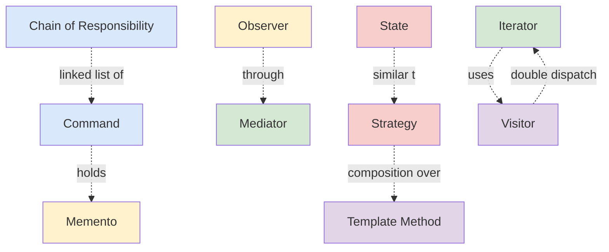

# Behavioral Patterns

> *"Behavioral design patterns are concerned with algorithms and the assignment of responsibilities between objects."*

---

## What Are Behavioral Patterns?

**Behavioral patterns** describe **how objects communicate and collaborate**. Where creational patterns answer *"who creates this?"* and structural answer *"how are these connected?"*, behavioral answer *"how do these talk, and who is responsible for what?"*

The category is the largest (10 patterns) because **communication** is where complexity multiplies. Two objects calling each other is simple; ten objects with mutual dependencies is a maintenance nightmare. Behavioral patterns are the toolkit for taming that.

### The two questions every behavioral pattern asks

1. **Who decides what to do?** — the caller? the receiver? a third party? the runtime?
2. **How do they communicate?** — direct calls? events? a chain? a mediator? state machines?

---

## The 10 Behavioral Patterns

| Pattern | Intent (one line) | Key Question Answered |
|---|---|---|
| [Chain of Responsibility](01-chain-of-responsibility/junior.md) | Pass requests through a chain of handlers; each decides to process or forward | "How do I let any of N handlers handle this?" |
| [Command](02-command/junior.md) | Turn a request into a standalone object — queue it, log it, undo it | "How do I treat actions as data?" |
| [Iterator](03-iterator/junior.md) | Traverse a collection without exposing its internal structure | "How do I walk through items without leaking the container?" |
| [Mediator](04-mediator/junior.md) | Reduce chaotic dependencies by routing communication through a central object | "How do I avoid an N×N call graph?" |
| [Memento](05-memento/junior.md) | Capture and restore an object's state without exposing its internals | "How do I undo without breaking encapsulation?" |
| [Observer](06-observer/junior.md) | Establish a one-to-many dependency so that observers are notified of changes | "How do I broadcast events to subscribers?" |
| [State](07-state/junior.md) | Allow an object to alter its behavior when its internal state changes | "How do I replace a giant switch on state?" |
| [Strategy](08-strategy/junior.md) | Define a family of algorithms, encapsulate each, make them interchangeable | "How do I swap algorithms at runtime?" |
| [Template Method](09-template-method/junior.md) | Define the skeleton of an algorithm in a superclass, let subclasses override steps | "How do I share structure but vary steps?" |
| [Visitor](10-visitor/junior.md) | Separate algorithms from the objects on which they operate | "How do I add operations to a class hierarchy without modifying it?" |

---

## When to Use Behavioral Patterns

Watch for these symptoms in code:

| Symptom | Pattern to consider |
|---|---|
| A long `if/else` chain trying handlers in order | **Chain of Responsibility** |
| Code needs undo/redo, queueing, or history | **Command** + **Memento** |
| You see `for (int i = 0; i < list.size(); i++)` everywhere — exposed internals | **Iterator** |
| Many objects communicate with each other forming a web | **Mediator** |
| You want to revert state but the object guards its fields | **Memento** |
| A change in one object should ripple to many others | **Observer** |
| A class is full of `switch (state)` statements | **State** |
| You have multiple ways to do something and pick at runtime | **Strategy** |
| Several methods share most of their logic but differ in a few steps | **Template Method** |
| You want to add an operation that crosses many class types | **Visitor** |

---

## Comparison Matrix

| Pattern | Direction of communication | Knows about | Coupling reduced |
|---|---|---|---|
| **Chain of Responsibility** | Caller → many handlers (linear) | Handler knows next | Caller from concrete handler |
| **Command** | Caller → invoker → receiver | Invoker doesn't know receiver | Sender from receiver |
| **Iterator** | Client → iterator → collection | Iterator knows collection | Client from collection structure |
| **Mediator** | Component ↔ mediator ↔ component | Mediator knows all | Components from each other |
| **Memento** | Originator → memento → caretaker | Caretaker treats memento as opaque | Caretaker from originator state |
| **Observer** | Subject → many observers (broadcast) | Subject knows observer list | Subject from concrete observers |
| **State** | Object delegates to state object | Object holds current state | Object code from per-state logic |
| **Strategy** | Object delegates to strategy | Object holds current strategy | Object from algorithm details |
| **Template Method** | Superclass → subclass step | Superclass calls hooks | Algorithm structure from steps |
| **Visitor** | Visitor → element (double dispatch) | Visitor knows all element types | Element types from operations |

---

## Critical Contrasts

### Strategy vs State

Both delegate to a separate object. The difference is **who decides to switch**:

| | Strategy | State |
|---|---|---|
| **Decides switch** | Caller / client | Object itself or current state |
| **Aware of others** | Strategies don't know each other | States may know transitions |
| **Use case** | Pluggable algorithm | State machine |

### Command vs Memento

| | Command | Memento |
|---|---|---|
| **Encapsulates** | An action to perform | A snapshot of state |
| **Used for** | Queue, log, undo via inverse | Undo via state restoration |

### Observer vs Mediator

| | Observer | Mediator |
|---|---|---|
| **Topology** | One-to-many (broadcast) | Many-to-many (centralized) |
| **Coupling** | Subject doesn't know observer types | Components don't know each other |
| **Direction** | One direction (subject → observer) | Bidirectional via mediator |

### Chain of Responsibility vs Decorator

Both compose objects in a chain — but:
- **Chain of Responsibility** — each handler decides whether to handle OR pass on
- **Decorator** — every wrapper adds behavior, all participate

### Strategy vs Template Method

| | Strategy | Template Method |
|---|---|---|
| **Mechanism** | Composition (delegate object) | Inheritance (override hooks) |
| **Switch at runtime** | Yes | No (per instance) |

### Iterator vs Visitor

| | Iterator | Visitor |
|---|---|---|
| **Traverses** | A collection | A type hierarchy |
| **Operation** | Implicit (caller does it) | Explicit (visitor encodes it) |

---

## Pattern Relationships

---

## Quick Decision Guide

> *"Multiple objects need to interact, but..."*

| Constraint | Pattern |
|---|---|
| ...I don't know which one will handle the request → | **Chain of Responsibility** |
| ...I need to queue, log, or undo actions → | **Command** |
| ...I want clean traversal over a collection → | **Iterator** |
| ...everyone is talking to everyone → | **Mediator** |
| ...I need snapshots for undo → | **Memento** |
| ...I want to broadcast events → | **Observer** |
| ...the object behaves differently in different states → | **State** |
| ...I have multiple algorithms picked at runtime → | **Strategy** |
| ...subclasses share structure but vary steps → | **Template Method** |
| ...I add operations to a stable class hierarchy → | **Visitor** |

---

## Common Mistakes

1. **Observer with circular updates** — A notifies B, B updates A, infinite loop. Use careful guards or event queues.
2. **State pattern for trivial state** — A 2-state on/off doesn't need objects. A boolean works.
3. **Visitor for non-stable hierarchies** — adding a new element type requires updating every visitor. Visitor is for stable hierarchies, growing operations.
4. **Strategy with one algorithm** — if there's no second strategy, it's just a normal class.
5. **Mediator becoming a god object** — coordinator that does too much defeats the purpose.
6. **Command pattern for atomic ops** — overhead exceeds benefit for simple inline calls.
7. **Memento exposing internals** — defeats encapsulation; use serialization or proper accessors.
8. **Template Method called from outside** — the public API should be the template; hooks should be `protected`.

---

## Pattern Files

- [01-chain-of-responsibility/](01-chain-of-responsibility/) — Chain of Responsibility
- [02-command/](02-command/) — Command
- [03-iterator/](03-iterator/) — Iterator
- [04-mediator/](04-mediator/) — Mediator
- [05-memento/](05-memento/) — Memento
- [06-observer/](06-observer/) — Observer
- [07-state/](07-state/) — State
- [08-strategy/](08-strategy/) — Strategy
- [09-template-method/](09-template-method/) — Template Method
- [10-visitor/](10-visitor/) — Visitor

[← Back to Design Patterns](../README.md) · [↑ Roadmap Home](../../README.md)
