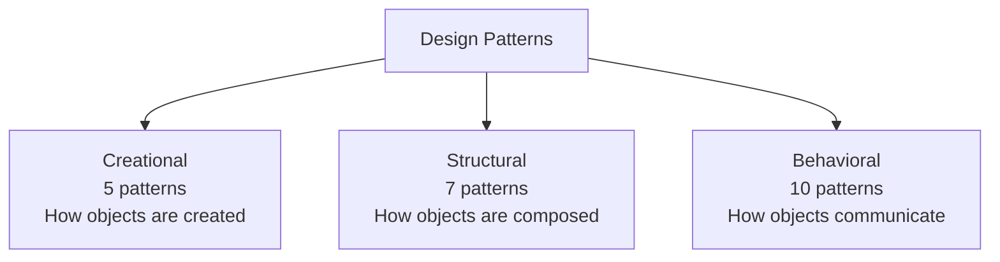

# Design Patterns

> *"Design patterns are typical solutions to common problems in software design. Each pattern is like a blueprint that you can customize to solve a particular design problem in your code."*

---

## What Are Design Patterns?

A **design pattern** is a reusable, named solution to a recurring problem in software design. It is not a finished piece of code — it's a description of *how* to solve a problem in many different situations.

### Pattern vs Algorithm vs Library

| Concept | What it is | Granularity |
|---|---|---|
| **Algorithm** | A precise, deterministic recipe (e.g., quicksort) | Low-level, language-agnostic logic |
| **Design Pattern** | A high-level blueprint for a solution | Mid-level, must be implemented for each context |
| **Library / Framework** | Concrete reusable code | High-level, ready to use |

Two engineers implementing the same pattern can produce very different code, but they will recognize each other's structure and intent.

---

## A Brief History

| Year | Event |
|---|---|
| **1977** | Christopher Alexander (architect) publishes *A Pattern Language* — patterns for buildings and towns. Software pioneers borrow the idea. |
| **1987** | Kent Beck and Ward Cunningham apply patterns to Smalltalk UI development. |
| **1994** | The **"Gang of Four"** — Erich Gamma, Richard Helm, Ralph Johnson, John Vlissides — publish *Design Patterns: Elements of Reusable Object-Oriented Software*. This book defines the canonical 23 patterns. |
| **2004** | *Head First Design Patterns* makes the GoF accessible to a wider audience. |
| **Today** | Patterns remain a shared vocabulary — the foundation of communicating design across teams. |

This roadmap covers the **22 patterns** from the GoF book that refactoring.guru documents (the *Interpreter* pattern is omitted, as on the source site).

---

## Three Categories

The GoF book organizes patterns by **intent** — the kind of problem they solve.

| Category | Concern | Pattern Count | Examples |
|---|---|---|---|
| **[Creational](01-creational/README.md)** | Object creation mechanisms | 5 | Singleton, Factory Method, Builder |
| **[Structural](02-structural/README.md)** | Object composition / structure | 7 | Adapter, Decorator, Proxy |
| **[Behavioral](03-behavioral/README.md)** | Object communication / responsibilities | 10 | Strategy, Observer, Iterator |

---

## Why Design Patterns Matter

> *"Patterns are a toolkit of solutions to common problems in software design. They define a common language that helps your team communicate more efficiently."*

Concretely, patterns help you:

1. **Speak a shared language** — saying "use a Strategy here" conveys structure, intent, and tradeoffs in two words
2. **Avoid reinventing wheels** — proven solutions, battle-tested for decades
3. **Reason about design** — patterns make consequences (coupling, extensibility) explicit
4. **Read other people's code** — once you recognize the pattern, you understand the architecture
5. **Onboard juniors** — pattern names are searchable; "what is a Decorator?" gets a clear answer

### Cautions

- **Don't shoehorn patterns into a problem** — a pattern is a tool, not a goal
- **Adding a pattern always adds complexity** — apply only when the gain (flexibility, decoupling, clarity) outweighs the cost
- **Some patterns are language-specific anti-patterns** — e.g., Singleton in test-heavy code; Visitor in dynamically-typed Python
- **Modern languages reduce the need for some patterns** — Python's first-class functions remove the need for Command/Strategy in many cases

---

## How to Pick a Pattern (Decision Guide)

Ask the question that matches your situation:

| Question | Look at |
|---|---|
| *"How do I create this object without coupling to its concrete class?"* | **Creational** — Factory Method, Abstract Factory, Builder |
| *"How do I make incompatible interfaces work together?"* | **Structural** — Adapter |
| *"How do I add behavior to an object without subclassing?"* | **Structural** — Decorator, Proxy |
| *"How do I work with a tree of objects uniformly?"* | **Structural** — Composite |
| *"How do I substitute an algorithm at runtime?"* | **Behavioral** — Strategy, State |
| *"How do I notify multiple objects when something happens?"* | **Behavioral** — Observer |
| *"How do I undo an action?"* | **Behavioral** — Command + Memento |
| *"How do I traverse a collection without exposing its internals?"* | **Behavioral** — Iterator |
| *"How do I avoid a tangle of mutual references?"* | **Behavioral** — Mediator |

---

## Pattern Relationships

Many patterns are related, complementary, or contrasting. A few key contrasts to keep in mind early:

| Often Confused | Difference |
|---|---|
| **Strategy vs State** | Strategy: client picks the algorithm. State: state transitions are managed internally. |
| **Decorator vs Proxy** | Decorator: adds behavior. Proxy: controls access (lazy, security, remote). |
| **Decorator vs Adapter** | Decorator: same interface, more behavior. Adapter: different interface, same behavior. |
| **Factory Method vs Abstract Factory** | Factory Method: one product, subclass decides. Abstract Factory: family of products, swap whole family. |
| **Facade vs Mediator** | Facade: one-way simplification. Mediator: many-to-many coordination. |
| **Command vs Memento** | Command: encapsulates an action. Memento: encapsulates a state snapshot. |

---

## Browse by Category

- [Creational Patterns](01-creational/README.md) — Factory Method, Abstract Factory, Builder, Prototype, Singleton
- [Structural Patterns](02-structural/README.md) — Adapter, Bridge, Composite, Decorator, Facade, Flyweight, Proxy
- [Behavioral Patterns](03-behavioral/README.md) — Chain of Responsibility, Command, Iterator, Mediator, Memento, Observer, State, Strategy, Template Method, Visitor

---

## Further Reading

- **GoF book** — *Design Patterns: Elements of Reusable Object-Oriented Software*, Gamma, Helm, Johnson, Vlissides (1994)
- **Head First Design Patterns** — Freeman & Robson (highly recommended for beginners)
- **Refactoring.Guru** — [refactoring.guru/design-patterns](https://refactoring.guru/design-patterns)
- **Pattern-Oriented Software Architecture (POSA)** — five-volume series; covers patterns beyond GoF (concurrency, distribution, integration)

[← Back to Roadmap](../README.md)
