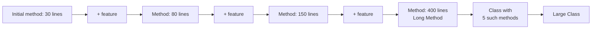
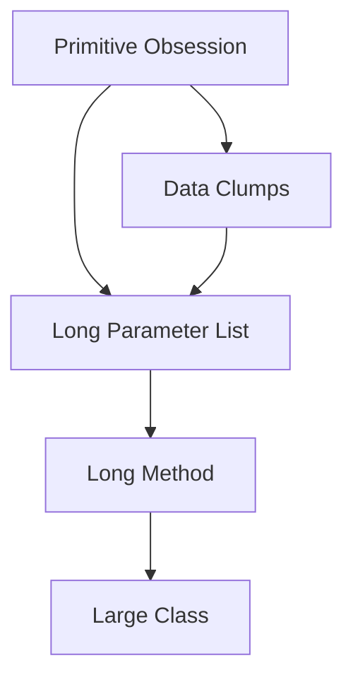

# Bloaters — Junior Level

> **Source:** [refactoring.guru/refactoring/smells/bloaters](https://refactoring.guru/refactoring/smells/bloaters)

---

## Table of Contents

1. [What are Bloaters?](#what-are-bloaters)
2. [Real-world analogy](#real-world-analogy)
3. [The 5 Bloaters at a glance](#the-5-bloaters-at-a-glance)
4. [Long Method](#long-method)
5. [Large Class](#large-class)
6. [Primitive Obsession](#primitive-obsession)
7. [Long Parameter List](#long-parameter-list)
8. [Data Clumps](#data-clumps)
9. [How they relate to each other](#how-they-relate-to-each-other)
10. [Common cures (cross-links)](#common-cures-cross-links)
11. [Diagrams](#diagrams)
12. [Mini Glossary](#mini-glossary)
13. [Review questions](#review-questions)

---

## What are Bloaters?

**Bloaters** are code, methods, or classes that have grown so large they are hard to work with. They don't appear overnight — they accumulate over time, one extra line at a time, until the system has become unmanageable. Nobody decides to write a 600-line method; it grows.

The five smells in this category:

| Smell | What grew too large |
|---|---|
| **Long Method** | A single method's body |
| **Large Class** | A class's fields and methods |
| **Primitive Obsession** | The role of a primitive (`String`, `int`) — it's doing a job a small class should do |
| **Long Parameter List** | A method's signature |
| **Data Clumps** | The number of times the same group of fields appears together |

All five share one characteristic: they slow you down. Reading is harder, changing is harder, testing is harder. The fix is almost always **decomposition** — split the bloated thing into smaller, named pieces.

> **Key idea:** Bloaters are not about line counts in absolute terms. A 60-line method that does one well-named thing is fine; a 20-line method that does five unrelated things is a Long Method.

---

## Real-world analogy

### A briefcase you can't close

Imagine starting a new job with an empty briefcase. Each week you add: a notebook, a pen, a charger, a contract, snacks, a hard drive, a power bank, more papers, a backup laptop, a rubber duck.

Six months in, the briefcase doesn't close. You can't find the pen. Pulling out a single document drags three others with it. Carrying it to a meeting hurts your shoulder.

You don't blame the rubber duck — you didn't know it was the last straw. But the briefcase is now bloated.

The fix isn't a bigger briefcase. It's three smaller, named bags: laptop bag, paperwork folder, snack pouch. Same contents, sane structure.

That's what refactoring Bloaters does to a codebase.

### A 400-line `processOrder()`

You inherit a `processOrder()` method. The first version (written three years ago) was 30 lines. Today it's 400 lines:

- Validation (lines 1–60)
- Pricing (lines 61–110)
- Tax (lines 111–155)
- Inventory check (lines 156–210)
- Payment (lines 211–290)
- Shipping cost (lines 291–340)
- Email confirmation (lines 341–380)
- Logging (lines 381–400)

Nobody set out to write 400 lines. Each engineer added "just one more thing." The result is a bloater. Nobody understands the whole thing in one sitting.

---

## The 5 Bloaters at a glance

| Smell | Symptom | Quick cure |
|---|---|---|
| Long Method | Method doesn't fit on a screen | [Extract Method](../../03-refactoring-techniques/01-composing-methods/junior.md) |
| Large Class | Class has 15+ fields or 30+ methods | [Extract Class](../../03-refactoring-techniques/02-moving-features/junior.md) |
| Primitive Obsession | `String email`, `int dollars`, `String[] address` | [Replace Data Value with Object](../../03-refactoring-techniques/03-organizing-data/junior.md) |
| Long Parameter List | More than 3–4 parameters | [Introduce Parameter Object](../../03-refactoring-techniques/05-simplifying-method-calls/junior.md) |
| Data Clumps | Same fields recur together | [Extract Class](../../03-refactoring-techniques/02-moving-features/junior.md) |

---

## Long Method

### What it is

A **Long Method** is a method whose body has grown so large that you can't hold the whole thing in your head at once. The classic threshold is "doesn't fit on one screen" — but the better threshold is *cognitive*: if you have to scroll, take notes, or trace variables across many lines to understand what it does, it's too long.

### Symptoms

- More than ~10–20 lines of business logic (excluding boilerplate)
- Multiple distinct "phases" inside one method (validation, computation, formatting)
- Section comments dividing the body (`// --- pricing ---`)
- Named local variables that themselves want to be method calls
- Parameters that are only used in part of the method

### Why it's bad

- **Reading cost:** every reader pays the cost of understanding the whole method, even if they only care about one phase.
- **Testing cost:** you can't test phases in isolation — you have to drive the whole method.
- **Change cost:** every change risks breaking unrelated phases.
- **Reuse cost:** another caller wanting only the pricing phase has to copy-paste it.

### Java example — before

```java
class Order {
    public double calculateTotal(List<LineItem> items, Customer customer, String couponCode) {
        // --- subtotal ---
        double subtotal = 0;
        for (LineItem item : items) {
            double price = item.getUnitPrice() * item.getQuantity();
            if (item.getCategory().equals("BOOK")) {
                price *= 0.95; // book discount
            }
            subtotal += price;
        }

        // --- coupon ---
        double discount = 0;
        if (couponCode != null) {
            if (couponCode.equals("SAVE10")) {
                discount = subtotal * 0.10;
            } else if (couponCode.equals("FREESHIP")) {
                discount = 0; // applied later
            }
        }

        // --- loyalty ---
        if (customer.getTier().equals("GOLD")) {
            discount += subtotal * 0.05;
        } else if (customer.getTier().equals("PLATINUM")) {
            discount += subtotal * 0.10;
        }

        // --- tax ---
        double taxable = subtotal - discount;
        double taxRate;
        if (customer.getState().equals("CA")) {
            taxRate = 0.0875;
        } else if (customer.getState().equals("NY")) {
            taxRate = 0.08;
        } else {
            taxRate = 0.06;
        }
        double tax = taxable * taxRate;

        // --- shipping ---
        double shipping;
        if (couponCode != null && couponCode.equals("FREESHIP")) {
            shipping = 0;
        } else if (subtotal > 100) {
            shipping = 0;
        } else {
            shipping = 9.99;
        }

        return subtotal - discount + tax + shipping;
    }
}
```

Five phases in one method. Each phase has its own logic, its own naming, its own decisions. This is a textbook Long Method.

### Java example — after Extract Method

```java
class Order {
    public double calculateTotal(List<LineItem> items, Customer customer, String couponCode) {
        double subtotal = computeSubtotal(items);
        double discount = computeDiscount(subtotal, customer, couponCode);
        double tax = computeTax(subtotal - discount, customer);
        double shipping = computeShipping(subtotal, couponCode);
        return subtotal - discount + tax + shipping;
    }

    private double computeSubtotal(List<LineItem> items) { /* ... */ }
    private double computeDiscount(double subtotal, Customer customer, String couponCode) { /* ... */ }
    private double computeTax(double taxable, Customer customer) { /* ... */ }
    private double computeShipping(double subtotal, String couponCode) { /* ... */ }
}
```

Now the top-level method reads like a recipe. Each phase has a name. Each can be tested, changed, or reused independently.

### Python example

```python
# Before — one long function
def calculate_total(items, customer, coupon_code):
    subtotal = 0
    for item in items:
        price = item.unit_price * item.quantity
        if item.category == "BOOK":
            price *= 0.95
        subtotal += price

    discount = 0
    if coupon_code == "SAVE10":
        discount = subtotal * 0.10
    if customer.tier == "GOLD":
        discount += subtotal * 0.05
    elif customer.tier == "PLATINUM":
        discount += subtotal * 0.10

    tax_rate = {"CA": 0.0875, "NY": 0.08}.get(customer.state, 0.06)
    tax = (subtotal - discount) * tax_rate

    shipping = 0 if coupon_code == "FREESHIP" or subtotal > 100 else 9.99

    return subtotal - discount + tax + shipping


# After — extracted helpers
def calculate_total(items, customer, coupon_code):
    subtotal = compute_subtotal(items)
    discount = compute_discount(subtotal, customer, coupon_code)
    tax = compute_tax(subtotal - discount, customer)
    shipping = compute_shipping(subtotal, coupon_code)
    return subtotal - discount + tax + shipping
```

### Go example

```go
// Before — one long function
func CalculateTotal(items []LineItem, customer Customer, couponCode string) float64 {
    var subtotal float64
    for _, item := range items {
        price := item.UnitPrice * float64(item.Quantity)
        if item.Category == "BOOK" {
            price *= 0.95
        }
        subtotal += price
    }
    // ... 60 more lines ...
    return total
}

// After — extracted helpers
func CalculateTotal(items []LineItem, customer Customer, couponCode string) float64 {
    subtotal := computeSubtotal(items)
    discount := computeDiscount(subtotal, customer, couponCode)
    tax := computeTax(subtotal-discount, customer)
    shipping := computeShipping(subtotal, couponCode)
    return subtotal - discount + tax + shipping
}
```

> **Note:** In Go, prefer unexported helpers (`computeSubtotal` with a lowercase first letter) unless they need to be reusable from another package.

### Cure

Primary refactoring: **[Extract Method](../../03-refactoring-techniques/01-composing-methods/junior.md)**.

Secondary: [Replace Method with Method Object](../../03-refactoring-techniques/01-composing-methods/junior.md) when the method has many local variables that all need to be passed to the extracted helpers — turn the whole method into a class.

---

## Large Class

### What it is

A **Large Class** is a class that has accumulated too many responsibilities. It has many fields, many methods, and is changed for many different reasons.

### Symptoms

- 15+ fields, or 30+ methods
- Subsets of fields used by subsets of methods (the class is really two classes squashed together)
- Long names like `OrderManagerHelperUtilService`
- The class file is 1,000+ lines long
- New features keep being added to this same class because "that's where order stuff lives"

### Why it's bad

- Hard to understand: a new reader has to absorb the whole class to know which methods touch which fields.
- Hard to test: instantiating it requires many collaborators, even if the test only exercises one method.
- Hard to change: a bug fix in one corner of the class can break unrelated functionality.
- Violates the **Single Responsibility Principle (SRP)**: a class should have one reason to change.

### Java example — before

```java
class Customer {
    // identity
    private String id;
    private String firstName;
    private String lastName;
    private String email;

    // address
    private String addressLine1;
    private String addressLine2;
    private String city;
    private String state;
    private String zip;
    private String country;

    // payment
    private String creditCardNumber;
    private String creditCardExpiry;
    private String creditCardCvv;
    private String billingAddressLine1;
    // ... and 4 more billing fields

    // order history
    private List<Order> orders;
    private LocalDate lastOrderDate;
    private double lifetimeSpend;

    // marketing
    private boolean emailOptIn;
    private boolean smsOptIn;
    private String referralSource;

    // 40+ methods touching subsets of these fields...
}
```

This class has at least four responsibilities: identity, address, payment, order history, and marketing. Each lives in its own subset of fields and methods.

### Java example — after Extract Class

```java
class Customer {
    private CustomerId id;
    private PersonName name;
    private Address shippingAddress;
    private PaymentMethod paymentMethod;
    private OrderHistory history;
    private MarketingPreferences marketing;
}
```

Each new class owns one concept. `Customer` is now a coordinator, not a god class.

### Python example

```python
# Before — one big dataclass with 25 fields
@dataclass
class Customer:
    id: str
    first_name: str
    last_name: str
    email: str
    address_line_1: str
    # ... 20 more fields
    
    def update_email(self, new_email): ...
    def add_order(self, order): ...
    def calculate_lifetime_value(self): ...
    def opt_in_marketing(self): ...
    # ... 25 more methods

# After — composition of focused classes
@dataclass
class Customer:
    id: CustomerId
    name: PersonName
    shipping_address: Address
    payment_method: PaymentMethod
    history: OrderHistory
    marketing: MarketingPreferences
```

### Go example

In Go, struct embedding makes Large Class show up as a struct with too many fields:

```go
// Before
type Customer struct {
    ID                  string
    FirstName           string
    LastName            string
    Email               string
    AddressLine1        string
    AddressLine2        string
    City                string
    State               string
    // ... and 17 more fields
}

// After — embedded sub-structs
type Customer struct {
    ID              CustomerID
    Name            PersonName
    ShippingAddress Address
    PaymentMethod   PaymentMethod
    History         OrderHistory
    Marketing       MarketingPreferences
}

type Address struct {
    Line1, Line2 string
    City, State, Zip, Country string
}
```

### Cure

Primary: **[Extract Class](../../03-refactoring-techniques/02-moving-features/junior.md)** — pull a related cluster of fields and methods into a new class.

Secondary: [Extract Subclass](../../03-refactoring-techniques/06-dealing-with-generalization/junior.md) when the cluster represents a variant ("premium customer" vs. "regular customer"). [Extract Interface](../../03-refactoring-techniques/06-dealing-with-generalization/junior.md) when the cluster is a role ("Authenticatable", "Billable").

---

## Primitive Obsession

### What it is

**Primitive Obsession** is using a primitive type (`String`, `int`, `double`, `boolean`, array) where a small dedicated class would be more honest about what the value represents.

The classic giveaway: **a primitive that has rules**. An `int` that's actually "a positive integer ≤ 100 representing a percent" is doing a job that an `int` doesn't know how to do.

### Symptoms

- `String email` (no validation; can be `""` or `"not-an-email"`)
- `int dollars` (no currency, no decimal)
- `String[] address` (no field names; what's `address[2]`?)
- Many helper methods on `String`, `int`, etc. spread across the codebase (`PhoneUtils.format(phone)`, `EmailValidator.isValid(email)`)
- Type-code constants (`int RED = 0; int GREEN = 1; int BLUE = 2;`)

### Why it's bad

- **No invariants:** any string is a "valid" email; any int is a "valid" age.
- **No methods:** behavior that should live on the value type lives elsewhere as utility functions.
- **No type safety:** `transferMoney(int from, int to)` lets you pass arguments in the wrong order; `transferMoney(AccountId from, AccountId to)` does not.
- **No expressiveness:** reading `String address` tells you nothing about structure.

### Java example — before

```java
class Customer {
    private String email;
    private int ageInYears;
    private double balanceInDollars;
    private String phoneNumber;
    
    public void updateEmail(String newEmail) {
        if (newEmail == null || !newEmail.contains("@")) {
            throw new IllegalArgumentException();
        }
        // (validation duplicated everywhere we set an email)
        this.email = newEmail.toLowerCase().trim();
    }
}
```

Every method that takes an email re-implements validation. Every method that returns a phone number formats it differently. The `String` type doesn't help.

### Java example — after Replace Data Value with Object

```java
final class Email {
    private final String value;
    public Email(String raw) {
        if (raw == null || !raw.matches("^[^\\s@]+@[^\\s@]+\\.[^\\s@]+$")) {
            throw new IllegalArgumentException("Invalid email: " + raw);
        }
        this.value = raw.toLowerCase().trim();
    }
    public String value() { return value; }
}

class Customer {
    private Email email;
    private Age age;
    private Money balance;
    private PhoneNumber phone;
    
    public void updateEmail(Email newEmail) {
        this.email = newEmail; // already validated
    }
}
```

The validation lives in *one place*. The type system enforces "you can't accidentally pass a phone number where an email is expected." Tests for `Email` cover all customers automatically.

### Python example

```python
# Before
class Customer:
    def __init__(self, email: str, age: int, balance: float):
        self.email = email
        self.age = age
        self.balance = balance

# After
@dataclass(frozen=True)
class Email:
    value: str
    def __post_init__(self):
        import re
        if not re.match(r"^[^\s@]+@[^\s@]+\.[^\s@]+$", self.value):
            raise ValueError(f"Invalid email: {self.value}")

@dataclass(frozen=True)
class Age:
    years: int
    def __post_init__(self):
        if not 0 <= self.years <= 150:
            raise ValueError(f"Invalid age: {self.years}")

class Customer:
    def __init__(self, email: Email, age: Age, balance: Money):
        self.email = email
        self.age = age
        self.balance = balance
```

`@dataclass(frozen=True)` gives you a value type with structural equality and immutability — Python's idiomatic answer to value objects.

### Go example

```go
// Before
type Customer struct {
    Email   string
    Age     int
    Balance float64
}

// After
type Email string

func NewEmail(raw string) (Email, error) {
    re := regexp.MustCompile(`^[^\s@]+@[^\s@]+\.[^\s@]+$`)
    if !re.MatchString(raw) {
        return "", fmt.Errorf("invalid email: %s", raw)
    }
    return Email(strings.ToLower(strings.TrimSpace(raw))), nil
}

func (e Email) Value() string { return string(e) }

type Customer struct {
    Email   Email
    Age     Age
    Balance Money
}
```

Go's named types (`type Email string`) give you compile-time distinction without overhead — passing a raw string where `Email` is expected is a type error.

### Cure

Primary: **[Replace Data Value with Object](../../03-refactoring-techniques/03-organizing-data/junior.md)**.

For type codes (constants like `int RED = 0`): **[Replace Type Code with Class](../../03-refactoring-techniques/03-organizing-data/junior.md)**, **[Replace Type Code with Subclasses](../../03-refactoring-techniques/03-organizing-data/junior.md)**, or **[Replace Type Code with State/Strategy](../../03-refactoring-techniques/03-organizing-data/junior.md)**.

For arrays-as-records: **[Replace Array with Object](../../03-refactoring-techniques/03-organizing-data/junior.md)**.

---

## Long Parameter List

### What it is

A **Long Parameter List** is a method with too many parameters — typically more than 3 or 4. The threshold isn't absolute, but every additional parameter doubles the cognitive cost of the call site.

### Symptoms

- Method signatures spanning multiple lines
- Callers passing the same group of values to many methods
- Boolean parameters that toggle behavior (`createUser(name, email, true, false, true)` — what do those booleans mean?)
- Optional parameters defaulted with `null`, `-1`, `""`

### Why it's bad

- **Order matters and is invisible:** `transfer(from, to)` vs `transfer(to, from)` — easy to get backward.
- **Adding a parameter breaks every caller:** the change ripples.
- **Hard to read:** `process(a, b, c, d, e, f)` — what is each one?
- **Often hides a missing concept:** `(street, city, state, zip)` should be `Address`.

### Java example — before

```java
class ReportGenerator {
    public Report generate(
        String title,
        LocalDate from,
        LocalDate to,
        String format,
        boolean includeCharts,
        boolean includeRawData,
        boolean compress,
        String emailRecipient,
        int retryCount,
        Duration timeout
    ) { /* ... */ }
}

// Call site:
generator.generate("Q1 Sales", date1, date2, "pdf", true, false, true, "boss@co.com", 3, Duration.ofMinutes(5));
// What does the second `true` mean? You have to look at the signature.
```

### Java example — after

```java
class ReportRequest {
    final String title;
    final DateRange period;
    final ReportFormat format;
    final ReportOptions options;
    final EmailRecipient recipient;
    final RetryPolicy retry;
    // ...
}

class ReportGenerator {
    public Report generate(ReportRequest request) { /* ... */ }
}

// Call site:
ReportRequest req = ReportRequest.builder()
    .title("Q1 Sales")
    .period(new DateRange(date1, date2))
    .format(ReportFormat.PDF)
    .options(ReportOptions.withCharts())
    .recipient(EmailRecipient.of("boss@co.com"))
    .build();
generator.generate(req);
```

The Builder pattern + parameter object turns a confusing 10-arg call into a self-documenting block.

### Python example

```python
# Before — boolean explosion
def generate_report(title, start, end, format, include_charts=True,
                    include_raw=False, compress=True, email=None,
                    retry_count=3, timeout=300):
    ...

# After — parameter object
@dataclass
class ReportRequest:
    title: str
    period: DateRange
    format: ReportFormat
    options: ReportOptions = field(default_factory=ReportOptions)
    recipient: Optional[EmailRecipient] = None
    retry: RetryPolicy = field(default_factory=RetryPolicy)

def generate_report(request: ReportRequest):
    ...
```

Python's keyword arguments mitigate Long Parameter List somewhat, but they don't help with conceptual clumping — `from`, `to`, `format`, `compress` are still four loose values.

### Go example

```go
// Before
func GenerateReport(title string, from, to time.Time, format string,
    includeCharts, includeRawData, compress bool, emailRecipient string,
    retryCount int, timeout time.Duration) (*Report, error) { ... }

// After — options struct
type ReportRequest struct {
    Title     string
    Period    DateRange
    Format    ReportFormat
    Options   ReportOptions
    Recipient *EmailRecipient
    Retry     RetryPolicy
}

func GenerateReport(req ReportRequest) (*Report, error) { ... }
```

Go also has the **functional options** idiom — `WithCharts()`, `WithRetries(3)` — for highly configurable APIs:

```go
func GenerateReport(title string, period DateRange, opts ...Option) (*Report, error) { ... }

GenerateReport("Q1 Sales", period, WithCharts(), WithRetries(3), Compressed())
```

### Cure

Primary: **[Introduce Parameter Object](../../03-refactoring-techniques/05-simplifying-method-calls/junior.md)**, **[Preserve Whole Object](../../03-refactoring-techniques/05-simplifying-method-calls/junior.md)** (when the parameters are already fields of an object the caller has).

Secondary: **[Replace Parameter with Method Call](../../03-refactoring-techniques/05-simplifying-method-calls/junior.md)** when the callee can compute the value itself; **[Replace Parameter with Explicit Methods](../../03-refactoring-techniques/05-simplifying-method-calls/junior.md)** when a boolean parameter switches behavior.

---

## Data Clumps

### What it is

**Data Clumps** are groups of fields that travel together — they appear in many class field lists, many method parameter lists, many DTOs. The fact that they always appear together is the signal that they form a missing concept.

### Symptoms

- The same 3–4 fields appear in many places: `(street, city, state, zip)`, `(startDate, endDate)`, `(latitude, longitude)`, `(currency, amount)`
- When you add a new field, you have to add it everywhere the clump appears
- Methods take the clump as separate parameters: `f(street, city, state, zip, ...)`

### Why it's bad

- **Scatter:** the missing concept (e.g., `Address`) has no home, so its rules and helpers scatter.
- **Drift:** different parts of the codebase format the clump differently.
- **Maintenance:** adding a `country` field to "address" means touching every place addresses appear.

### Java example — before

```java
class Order {
    private String shipStreet, shipCity, shipState, shipZip;
    private String billStreet, billCity, billState, billZip;
    
    public void ship(String street, String city, String state, String zip) { ... }
}

class Customer {
    private String homeStreet, homeCity, homeState, homeZip;
    private String workStreet, workCity, workState, workZip;
}
```

Four-field clump appearing six times. Adding `country` requires six edits.

### Java example — after Extract Class

```java
record Address(String street, String city, String state, String zip, String country) {}

class Order {
    private Address shipping;
    private Address billing;
    public void ship(Address to) { ... }
}

class Customer {
    private Address home;
    private Address work;
}
```

`Address` now has a home. Validation, formatting, equality all live in `Address`. Adding a field is one edit.

### Python example

```python
# Before
class Order:
    def __init__(self, ship_street, ship_city, ship_state, ship_zip, ...): ...

class Customer:
    def __init__(self, home_street, home_city, home_state, home_zip, ...): ...

# After
@dataclass(frozen=True)
class Address:
    street: str
    city: str
    state: str
    zip: str
    country: str = "US"

class Order:
    def __init__(self, shipping: Address, billing: Address): ...
```

### Go example

```go
// Before
type Order struct {
    ShipStreet, ShipCity, ShipState, ShipZip string
    BillStreet, BillCity, BillState, BillZip string
}

// After
type Address struct {
    Street, City, State, Zip, Country string
}

type Order struct {
    Shipping Address
    Billing  Address
}
```

### Cure

Primary: **[Extract Class](../../03-refactoring-techniques/02-moving-features/junior.md)**, **[Introduce Parameter Object](../../03-refactoring-techniques/05-simplifying-method-calls/junior.md)**.

Closely related to **Primitive Obsession**: a Data Clump is *several* primitives that should be *one* object. Solve them together.

---

## How they relate to each other

The five Bloaters are not independent — they reinforce each other:

```
Primitive Obsession  ─► Long Parameter List  ─► Long Method  ─► Large Class
        ▲                       ▲                     ▲             ▲
        └─── Data Clumps ───────┘                     │             │
                                                       └─ all of these grow ───┘
```

- **Primitive Obsession + Long Parameter List:** if you don't have an `Address` object, you pass `street, city, state, zip` everywhere — your parameter lists balloon.
- **Long Parameter List + Long Method:** when a method has 8 parameters, it's usually because it does 4 unrelated things — split it.
- **Long Method + Large Class:** when a class has 50 methods averaging 200 lines each, the class itself is a Bloater.
- **Data Clumps + Primitive Obsession:** "always-together fields" *are* a missing concept.

> **Order of attack:** fix Primitive Obsession and Data Clumps first (they create new types). Then Long Parameter List drops naturally. Then Long Method (now you can group statements by which type they touch). Then Large Class (now the structure of types-and-methods is visible).

---

## Common cures (cross-links)

| Bloater | Primary refactoring | Secondary |
|---|---|---|
| Long Method | [Extract Method](../../03-refactoring-techniques/01-composing-methods/junior.md) | [Replace Method with Method Object](../../03-refactoring-techniques/01-composing-methods/junior.md), [Decompose Conditional](../../03-refactoring-techniques/04-simplifying-conditionals/junior.md), [Replace Temp with Query](../../03-refactoring-techniques/01-composing-methods/junior.md) |
| Large Class | [Extract Class](../../03-refactoring-techniques/02-moving-features/junior.md) | [Extract Subclass](../../03-refactoring-techniques/06-dealing-with-generalization/junior.md), [Extract Interface](../../03-refactoring-techniques/06-dealing-with-generalization/junior.md) |
| Primitive Obsession | [Replace Data Value with Object](../../03-refactoring-techniques/03-organizing-data/junior.md) | [Replace Type Code with Class/Subclasses/State](../../03-refactoring-techniques/03-organizing-data/junior.md), [Introduce Parameter Object](../../03-refactoring-techniques/05-simplifying-method-calls/junior.md), [Replace Array with Object](../../03-refactoring-techniques/03-organizing-data/junior.md) |
| Long Parameter List | [Introduce Parameter Object](../../03-refactoring-techniques/05-simplifying-method-calls/junior.md) | [Preserve Whole Object](../../03-refactoring-techniques/05-simplifying-method-calls/junior.md), [Replace Parameter with Method Call](../../03-refactoring-techniques/05-simplifying-method-calls/junior.md) |
| Data Clumps | [Extract Class](../../03-refactoring-techniques/02-moving-features/junior.md) | [Introduce Parameter Object](../../03-refactoring-techniques/05-simplifying-method-calls/junior.md), [Preserve Whole Object](../../03-refactoring-techniques/05-simplifying-method-calls/junior.md) |

---

## Diagrams

### How Bloaters grow



### Bloater dependency graph



Read top to bottom: each link is "if you don't fix the upstream smell, the downstream one gets worse."

---

## Mini Glossary

| Term | Meaning |
|---|---|
| **Smell** | A surface indication of a deeper design problem. Not a bug — a warning. |
| **Refactoring** | A behaviour-preserving change to internal structure. |
| **Method** | A function attached to a class (Java/Python). In Go, a function with a receiver. |
| **Parameter** | An input to a method, declared in its signature. |
| **Field** | A named piece of data stored on a class/struct. |
| **Class** | A named type that bundles fields and methods (Java/Python). In Go, a struct + methods. |
| **Primitive** | A built-in type with no methods (or only standard-library methods): `int`, `String`, `bool`. |
| **Value object** | A small immutable class representing a value (Email, Money, Address). Equality by content. |
| **SRP** | Single Responsibility Principle — a class should have one reason to change. |

---

## Review questions

1. **What is the difference between a Long Method and a Large Class?**
   A Long Method is a single method whose body is too big. A Large Class is a class with too many fields/methods overall. They often appear together — a Large Class usually has several Long Methods inside it — but the cure is different: Extract Method for the first, Extract Class for the second.

2. **Why is Primitive Obsession bad if `String` "works fine"?**
   `String email` works at runtime but offers no validation, no type safety, no place for behavior. Three months later, when "email must be lowercase" is added in five places (and missed in three more), the cost shows up. An `Email` value object centralizes the rules.

3. **What's the threshold for "too many parameters"?**
   The classic answer is "more than 3 or 4." The better answer: when the signature has parameters that always travel together, or boolean flags, the threshold has been crossed regardless of count.

4. **Aren't Data Clumps just multiple Primitive Obsessions?**
   Often, yes. Both signal a missing concept. Data Clumps emphasize the *grouping* (always together); Primitive Obsession emphasizes the *type* (a primitive doing a typed job). Fixing one usually fixes the other.

5. **A 60-line method does one well-named thing. Is it a Long Method?**
   No. The smell is about *cognitive overload*, not line count. A 60-line method that loops over input applying a single, named operation is fine. A 20-line method that mixes validation, computation, and side effects is a Long Method.

6. **My team's style guide mandates 5+ parameters for "configuration objects." Is that wrong?**
   Style guides like that exist to *prevent* Long Parameter List — they allow a configuration *object* to have many fields, but methods should take that one object, not the unwrapped fields. If methods are still taking 8 raw parameters, the guide is being misread.

7. **Go has no classes. Does Large Class apply?**
   Yes — substitute "struct with a god-like set of fields and methods." Large Struct in Go is the same smell. The cure (split into smaller types) is the same.

8. **Are getters and setters a smell?**
   Not by themselves. But a class that is *only* getters and setters is a [Data Class](../04-dispensables/junior.md) (Dispensables category). And reaching into a class only via getters often signals [Feature Envy](../05-couplers/junior.md) (Couplers).

9. **Should I always split a Long Method?**
   Not if the extracted helpers would have terrible names. If the only sensible name for a fragment is `processStep1`, leave it inline — bad names are worse than a long method. Restructure the data first; better names will appear.

10. **My method is 200 lines but it's "all related." Is that OK?**
    Probably not. "All related" usually means "all I currently know how to name as one." The test: can you write a one-sentence comment for each phase of the method? If yes, those phases want to be methods. If you can write only one sentence for the whole 200-line block, it might genuinely be cohesive — but then the body is usually full of repetitive structure (a state machine, a dispatch table) that wants to be data, not code.

---

> **Next:** [middle.md](middle.md) — when each Bloater appears in real codebases, real-world cases, and trade-offs.
