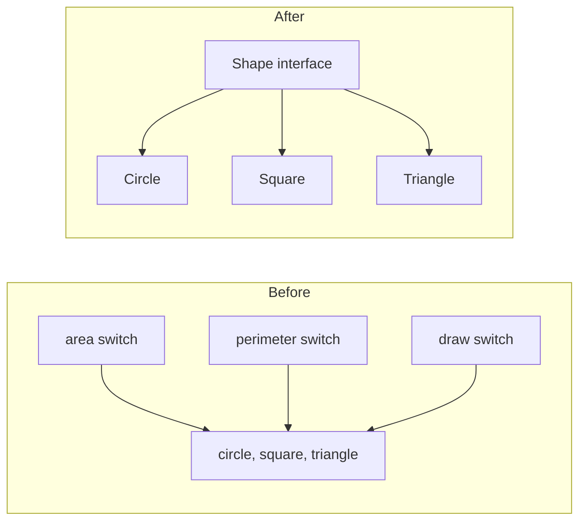
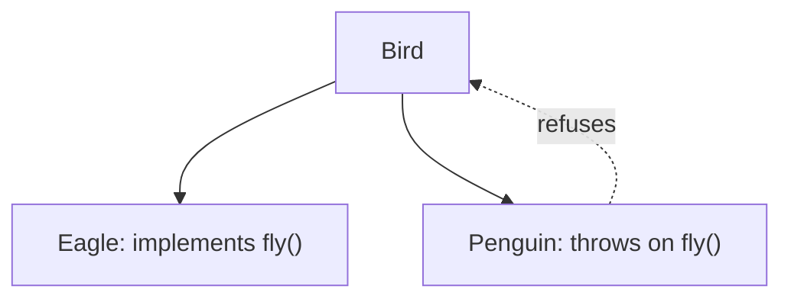

# OO Abusers — Junior Level

> **Source:** [refactoring.guru/refactoring/smells/oop-abusers](https://refactoring.guru/refactoring/smells/oop-abusers)

---

## Table of Contents

1. [What are OO Abusers?](#what-are-oo-abusers)
2. [The 4 OO Abusers at a glance](#the-4-oo-abusers-at-a-glance)
3. [Switch Statements](#switch-statements)
4. [Temporary Field](#temporary-field)
5. [Refused Bequest](#refused-bequest)
6. [Alternative Classes with Different Interfaces](#alternative-classes-with-different-interfaces)
7. [How they relate](#how-they-relate)
8. [Common cures (cross-links)](#common-cures-cross-links)
9. [Diagrams](#diagrams)
10. [Mini Glossary](#mini-glossary)
11. [Review questions](#review-questions)

---

## What are OO Abusers?

**OO Abusers** are code patterns where object-oriented features (polymorphism, inheritance, encapsulation) are either misused or under-used. Often the code "uses classes" syntactically but doesn't take advantage of what classes are *for*.

The four smells:

| Smell | Misuse |
|---|---|
| **Switch Statements** | Branching on type code instead of using polymorphism |
| **Temporary Field** | A field used only sometimes, otherwise null/empty |
| **Refused Bequest** | Subclass uses some inherited methods, ignores or no-ops the rest |
| **Alternative Classes with Different Interfaces** | Two classes do similar things but expose unrelated APIs |

> **Common thread:** these smells reveal that the design didn't *commit* to OO — types are present, but the code routes around them with conditionals, optionals, and inconsistencies.

---

## The 4 OO Abusers at a glance

| Smell | Symptom | Quick cure |
|---|---|---|
| Switch Statements | Long `switch`/`if-else` on type code | [Replace Conditional with Polymorphism](../../03-refactoring-techniques/04-simplifying-conditionals/junior.md) |
| Temporary Field | Field is `null` outside one method | [Extract Class](../../03-refactoring-techniques/02-moving-features/junior.md) |
| Refused Bequest | Subclass `throw new UnsupportedOperationException()` | [Replace Inheritance with Delegation](../../03-refactoring-techniques/06-dealing-with-generalization/junior.md) |
| Alternative Classes | Two classes — same intent, different API | [Rename Method](../../03-refactoring-techniques/05-simplifying-method-calls/junior.md) + [Extract Superclass](../../03-refactoring-techniques/06-dealing-with-generalization/junior.md) |

---

## Switch Statements

### What it is

A long `switch` (or chain of `if-else`) that branches on a **type code** — typically an enum, an integer constant, or a string discriminator. The branches do different things based on the type. Often the same `switch` repeats in many places throughout the codebase.

### Symptoms

- `switch (shape.type)` in `area()`, `perimeter()`, `draw()` — the same branching repeated
- Constants like `int CIRCLE = 0; int SQUARE = 1; int TRIANGLE = 2;`
- Long `if-else if-else if` chains with `instanceof` checks
- Adding a new variant requires editing every place that switches

### Why it's bad

- **Open/Closed violation:** adding a variant means modifying many sites — not adding a new class.
- **Code duplication:** the same branching logic repeats.
- **No type safety:** missing a case (forgot `default`?) silently does nothing.

### Java example — before

```java
class Shape {
    String type;       // "circle", "square", "triangle"
    double radius;     // for circle
    double side;       // for square
    double base, height; // for triangle
}

class GeometryService {
    double area(Shape s) {
        switch (s.type) {
            case "circle":   return Math.PI * s.radius * s.radius;
            case "square":   return s.side * s.side;
            case "triangle": return 0.5 * s.base * s.height;
            default: throw new IllegalStateException("unknown shape");
        }
    }

    double perimeter(Shape s) {
        switch (s.type) {
            case "circle":   return 2 * Math.PI * s.radius;
            case "square":   return 4 * s.side;
            case "triangle": throw new UnsupportedOperationException();
            default: throw new IllegalStateException("unknown shape");
        }
    }
}
```

The same `switch` lives in every method. Adding `Pentagon` means editing every method.

### Java example — after

```java
sealed interface Shape permits Circle, Square, Triangle {
    double area();
    double perimeter();
}

record Circle(double radius) implements Shape {
    public double area() { return Math.PI * radius * radius; }
    public double perimeter() { return 2 * Math.PI * radius; }
}

record Square(double side) implements Shape {
    public double area() { return side * side; }
    public double perimeter() { return 4 * side; }
}

record Triangle(double base, double height) implements Shape {
    public double area() { return 0.5 * base * height; }
    public double perimeter() { throw new UnsupportedOperationException("perimeter needs all sides"); }
}

class GeometryService {
    double area(Shape s) { return s.area(); }
    double perimeter(Shape s) { return s.perimeter(); }
}
```

Adding `Pentagon` is a new class, no edits to existing code. `sealed` (Java 17+) lets the compiler verify exhaustiveness.

### Python example

```python
# Before
class Shape:
    def __init__(self, type, **kwargs):
        self.type = type
        for k, v in kwargs.items(): setattr(self, k, v)

def area(s):
    if s.type == "circle":   return math.pi * s.radius ** 2
    elif s.type == "square": return s.side ** 2
    elif s.type == "triangle": return 0.5 * s.base * s.height

# After
from abc import ABC, abstractmethod
from dataclasses import dataclass

class Shape(ABC):
    @abstractmethod
    def area(self): ...

@dataclass(frozen=True)
class Circle(Shape):
    radius: float
    def area(self): return math.pi * self.radius ** 2

@dataclass(frozen=True)
class Square(Shape):
    side: float
    def area(self): return self.side ** 2
```

### Go example

Go has no inheritance but has interfaces:

```go
// Before — type switch
type Shape struct {
    Type   string
    Radius float64
    Side   float64
}

func Area(s Shape) float64 {
    switch s.Type {
    case "circle": return math.Pi * s.Radius * s.Radius
    case "square": return s.Side * s.Side
    }
    return 0
}

// After — interface with method dispatch
type Shape interface {
    Area() float64
}

type Circle struct{ Radius float64 }
func (c Circle) Area() float64 { return math.Pi * c.Radius * c.Radius }

type Square struct{ Side float64 }
func (s Square) Area() float64 { return s.Side * s.Side }

func Area(s Shape) float64 { return s.Area() }
```

### Cure

Primary: **[Replace Conditional with Polymorphism](../../03-refactoring-techniques/04-simplifying-conditionals/junior.md)**.

For type codes specifically:
- **[Replace Type Code with Subclasses](../../03-refactoring-techniques/03-organizing-data/junior.md)** — when behavior is fixed at construction.
- **[Replace Type Code with State/Strategy](../../03-refactoring-techniques/03-organizing-data/junior.md)** — when type changes at runtime.

### When Switch Statements is OK

- **Pattern matching on inherently disjoint types** in modern languages (Kotlin `when`, Scala `match`, Rust `match`, Java 21 sealed + pattern matching) — the language is built for it. The smell is the *combination* of switch + branching across many call sites.
- **Performance-critical hot paths** where virtual dispatch is provably more expensive than a switch (rare; profile first).

---

## Temporary Field

### What it is

A **Temporary Field** is a class field that is only used by some methods, under some conditions — `null` (or empty, or default-valued) the rest of the time. Readers can't tell when the field is meaningful.

### Symptoms

- Fields with names like `tempBuffer`, `intermediateResult`, `cachedComputation`
- Methods that check `if (this.field != null) { ... }` before using a field
- A field that's set in one method, used in another, then implicitly stale
- Tests that fail because a field wasn't initialized in a particular sequence

### Why it's bad

- **State machine implicit:** the class has hidden modes ("field set" vs "field not set") that aren't named.
- **Null checks proliferate:** every method that touches the field has to defend against absence.
- **Coupling between methods:** method A *must* be called before method B, or B sees `null`.

### Java example — before

```java
class GraphSearch {
    private Graph graph;
    private List<Node> visitedNodes; // ONLY used during search
    private Map<Node, Integer> distances; // ONLY used during search
    
    public List<Node> shortestPath(Node from, Node to) {
        visitedNodes = new ArrayList<>();
        distances = new HashMap<>();
        // ... uses both fields ...
        return result;
    }
    
    public boolean isConnected(Node a, Node b) {
        // doesn't use visitedNodes or distances
        return graph.hasEdge(a, b);
    }
}
```

`visitedNodes` and `distances` are meaningful only during `shortestPath`. Outside that method, they hold stale data from the last search — confusing.

### Java example — after

```java
class GraphSearch {
    private final Graph graph;
    
    public List<Node> shortestPath(Node from, Node to) {
        return new SearchOperation(graph).find(from, to);
    }
    
    public boolean isConnected(Node a, Node b) {
        return graph.hasEdge(a, b);
    }
}

class SearchOperation {
    private final Graph graph;
    private final List<Node> visited = new ArrayList<>();
    private final Map<Node, Integer> distances = new HashMap<>();
    
    SearchOperation(Graph graph) { this.graph = graph; }
    
    List<Node> find(Node from, Node to) { ... }
}
```

The temporary fields move into a dedicated class — `SearchOperation` — that exists only during the operation. They're never `null`.

### Python example

```python
# Before
class Parser:
    def __init__(self):
        self.tokens = None  # set during parse()
        self.pos = 0
    
    def parse(self, source):
        self.tokens = tokenize(source)
        self.pos = 0
        return self._program()
    
    def _program(self): ...

# After — stateful operation as its own class
class _ParseState:
    def __init__(self, tokens):
        self.tokens = tokens
        self.pos = 0

class Parser:
    def parse(self, source):
        return _Parser(_ParseState(tokenize(source))).program()
```

### Go example

Go encourages this naturally — Go's `Parser` would normally hold tokens and pos as fields and be constructed per parse:

```go
type Parser struct {
    tokens []Token
    pos    int
}

func NewParser(source string) *Parser {
    return &Parser{tokens: tokenize(source)}
}

func (p *Parser) Parse() AST { ... }
```

Each parser instance handles one parse. No stale state.

### Cure

Primary: **[Extract Class](../../03-refactoring-techniques/02-moving-features/junior.md)** — move the temporary fields into a class that exists only when they're meaningful.

Secondary: **[Replace Method with Method Object](../../03-refactoring-techniques/01-composing-methods/junior.md)** when the temporary fields are local to one long method (similar to the Bloaters case).

For nullable fields specifically: **[Introduce Null Object](../../03-refactoring-techniques/04-simplifying-conditionals/junior.md)** — a no-op replacement for `null`.

---

## Refused Bequest

### What it is

**Refused Bequest** is a subclass that inherits from a parent it doesn't really need. It uses some inherited methods, ignores others, and may even override inherited methods to throw `UnsupportedOperationException` — refusing the inheritance.

> The name comes from "bequest" (something inherited). The subclass *refuses* what was bequeathed.

### Symptoms

- `throw new UnsupportedOperationException()` overrides
- Subclasses that override most parent methods to no-ops or different behavior
- Inherited fields that the subclass never reads
- "is-a" reads as "is-not-quite-a"

### Why it's bad

- **Liskov violation:** code expecting a parent gets a subclass that refuses parent operations.
- **Fragile design:** the subclass breaks if the parent adds new methods.
- **Mental model:** "Square is a Rectangle" famously fails — setting a Square's width must also set its height; client code doesn't expect that.

### Java example — before

```java
class Bird {
    public void fly() { /* default flying logic */ }
    public void layEgg() { /* default egg-laying */ }
}

class Penguin extends Bird {
    @Override
    public void fly() {
        throw new UnsupportedOperationException("Penguins can't fly");
    }
}
```

`Penguin` is a `Bird` syntactically, but `bird.fly()` blows up half the time. Code that takes `Bird` and calls `fly()` is now defensive or broken.

### Java example — after

Two cures, depending on intent:

**Cure A — Push Down Method:**

```java
class Bird {
    public void layEgg() { ... }
}

class FlyingBird extends Bird {
    public void fly() { ... }
}

class Penguin extends Bird { ... }
class Eagle extends FlyingBird { ... }
```

Methods only relevant to flying birds live on `FlyingBird`, not `Bird`.

**Cure B — Replace Inheritance with Delegation:**

```java
class Bird {
    private final Flyability flyability;
    public Bird(Flyability flyability) { this.flyability = flyability; }
    public void fly() { flyability.fly(); }
}

interface Flyability { void fly(); }
class CanFly implements Flyability { public void fly() { ... } }
class CannotFly implements Flyability {
    public void fly() { throw new UnsupportedOperationException(); }
}
```

Composition replaces "is-a" with "has-a." `Penguin` is a `Bird` with `CannotFly` capability.

### Python example

Python's duck typing makes Refused Bequest less common — there's no "is-a" check at the type level. But it appears as classes in MRO that override parent methods to raise:

```python
# Before
class Stream:
    def read(self): ...
    def write(self, data): ...

class ReadOnlyStream(Stream):
    def write(self, data):
        raise NotImplementedError("read-only")

# After — separate read/write capabilities
from typing import Protocol

class Readable(Protocol):
    def read(self) -> bytes: ...

class Writable(Protocol):
    def write(self, data: bytes) -> None: ...

class ReadOnlyFile:
    def read(self) -> bytes: ...

class ReadWriteFile:
    def read(self) -> bytes: ...
    def write(self, data: bytes) -> None: ...
```

Functions that need only `Readable` accept both; functions that need `Writable` reject `ReadOnlyFile` at type-check time (with `mypy`).

### Go example

> **N/A in Go** — Go has no inheritance. The equivalent issue is **embedding misuse**: embedding a struct whose methods you don't want exposed.

```go
// Bad — embedding pollutes the wrapper's method set
type ReadOnlyFile struct {
    *os.File  // embeds Read AND Write
}

// Good — explicit delegation, only forward what's wanted
type ReadOnlyFile struct {
    f *os.File
}

func (r *ReadOnlyFile) Read(p []byte) (int, error) {
    return r.f.Read(p)
}

// No Write method — caller can't write.
```

Go's substitute for "Refused Bequest" is "embedded too much" — fix by extracting only the methods you genuinely want to expose.

### Cure

Primary in Java/C#/Python: **[Replace Inheritance with Delegation](../../03-refactoring-techniques/06-dealing-with-generalization/junior.md)** — switch from "is-a" to "has-a."

Secondary: **[Push Down Method](../../03-refactoring-techniques/06-dealing-with-generalization/junior.md)** / **[Push Down Field](../../03-refactoring-techniques/06-dealing-with-generalization/junior.md)** — move parent members down into the subclasses that actually use them. **[Extract Superclass](../../03-refactoring-techniques/06-dealing-with-generalization/junior.md)** — refactor the inheritance tree so each level is honest.

---

## Alternative Classes with Different Interfaces

### What it is

**Alternative Classes with Different Interfaces** is two classes that do similar things but expose unrelated method names, parameter orders, or return types — so callers can't substitute one for the other.

### Symptoms

- `EmailNotifier.send(message, address)` vs `SMSNotifier.transmit(text, phone)` — same intent, different vocabulary
- `LegacyAuthService.login(user, password)` returning `boolean` vs `OAuthService.authenticate(creds)` returning `Optional<Token>`
- Parallel hierarchies where corresponding classes have unrelated APIs

### Why it's bad

- Callers can't choose dynamically between the two implementations.
- Polymorphism is impossible — there's no shared interface.
- Code duplication: every call site has to know which class it's calling.

### Java example — before

```java
class EmailService {
    public void mail(String to, String subject, String body) { ... }
}

class SmsService {
    public void send(String number, String content) { ... }
}

// Caller has to know which service:
if (preference.equals("email")) emailService.mail(addr, subj, body);
else smsService.send(phone, body);
```

### Java example — after Rename Method + Extract Superclass

```java
interface MessageService {
    void send(Recipient to, Message message);
}

class EmailService implements MessageService {
    public void send(Recipient to, Message message) { ... }
}

class SmsService implements MessageService {
    public void send(Recipient to, Message message) { ... }
}

// Caller:
service.send(recipient, message);  // either implementation works
```

### Python example

```python
# Before
class FileLogger:
    def write_log(self, message): ...

class CloudLogger:
    def upload(self, msg): ...

# After
from abc import ABC, abstractmethod

class Logger(ABC):
    @abstractmethod
    def log(self, message: str) -> None: ...

class FileLogger(Logger):
    def log(self, message): ...

class CloudLogger(Logger):
    def log(self, message): ...
```

### Go example

```go
// Before
type FileWriter struct{ ... }
func (f *FileWriter) WriteLine(s string) error { ... }

type StdoutPrinter struct{ ... }
func (p *StdoutPrinter) Println(s string) { ... }

// After
type LineWriter interface {
    WriteLine(s string) error
}
```

Go's structural typing means classes don't need to declare they implement an interface — just match the signature.

### Cure

**[Rename Method](../../03-refactoring-techniques/05-simplifying-method-calls/junior.md)** to align names. **[Move Method](../../03-refactoring-techniques/02-moving-features/junior.md)** to align responsibilities. **[Extract Superclass](../../03-refactoring-techniques/06-dealing-with-generalization/junior.md)** or **[Extract Interface](../../03-refactoring-techniques/06-dealing-with-generalization/junior.md)** to formalize the shared contract.

---

## How they relate

These four smells interact:

- **Switch Statements + Refused Bequest:** when polymorphism could replace switching, but the subclasses can't all honor the interface, you get partial-implementations and refused bequests.
- **Temporary Field + Switch Statements:** fields used only in some modes are often paired with switches on which mode the object is in. Both signal a missing State pattern.
- **Alternative Classes + Refused Bequest:** when two classes refuse to share an interface, polymorphism is blocked.

> **Common cure axis:** **commit to OOP**. Each smell exists because the design half-uses OO features. The cures all involve making the OO commitments explicit (real polymorphism, real classes for state, real interfaces for shared behavior).

---

## Common cures (cross-links)

| Smell | Primary | Secondary |
|---|---|---|
| Switch Statements | [Replace Conditional with Polymorphism](../../03-refactoring-techniques/04-simplifying-conditionals/junior.md) | [Replace Type Code with Subclasses / State / Strategy](../../03-refactoring-techniques/03-organizing-data/junior.md), [Introduce Null Object](../../03-refactoring-techniques/04-simplifying-conditionals/junior.md) |
| Temporary Field | [Extract Class](../../03-refactoring-techniques/02-moving-features/junior.md) | [Introduce Null Object](../../03-refactoring-techniques/04-simplifying-conditionals/junior.md), [Replace Method with Method Object](../../03-refactoring-techniques/01-composing-methods/junior.md) |
| Refused Bequest | [Replace Inheritance with Delegation](../../03-refactoring-techniques/06-dealing-with-generalization/junior.md) | [Push Down Method](../../03-refactoring-techniques/06-dealing-with-generalization/junior.md), [Push Down Field](../../03-refactoring-techniques/06-dealing-with-generalization/junior.md), [Extract Superclass](../../03-refactoring-techniques/06-dealing-with-generalization/junior.md) |
| Alternative Classes | [Rename Method](../../03-refactoring-techniques/05-simplifying-method-calls/junior.md) | [Move Method](../../03-refactoring-techniques/02-moving-features/junior.md), [Extract Superclass](../../03-refactoring-techniques/06-dealing-with-generalization/junior.md), [Extract Interface](../../03-refactoring-techniques/06-dealing-with-generalization/junior.md) |

---

## Diagrams

### Switch Statements vs. polymorphism



### Refused Bequest



---

## Mini Glossary

| Term | Meaning |
|---|---|
| **Polymorphism** | Same call (`shape.area()`), different code per type. The OO answer to switch-on-type. |
| **Type code** | An int/string field used to discriminate variants (`int CIRCLE = 0`). The smell underlying many Switch Statements. |
| **State pattern** | Encapsulates each "mode" of an object as a separate class; the object delegates to the current state. |
| **Strategy pattern** | Encapsulates an algorithm choice as an object the consumer holds. |
| **Liskov Substitution Principle (LSP)** | Subtypes must be usable wherever the supertype is expected, without surprises. |
| **Sealed type** | A type whose subclasses are listed in advance — compiler can verify exhaustive matching. |

---

## Review questions

1. **Why is `switch (shape.type)` worse than `shape.area()`?**
   The switch repeats in every method that branches on type. Adding a new shape requires editing every method. With polymorphism, adding a shape adds one new class; nothing else changes.

2. **Aren't all `switch` statements bad?**
   No. Switching on **inherently disjoint values** (HTTP status codes, parser tokens, opcode tables in a VM) is fine and often the clearest expression. The smell is switching on *type code* — specifically, when a switch on type gets duplicated across many methods.

3. **What's a sealed type?**
   A type whose set of direct subtypes is fixed (Java `sealed`, Kotlin `sealed class`, Scala `sealed trait`, Rust `enum`). The compiler can verify exhaustive pattern matching. Lets you write switch-like code with full type safety — useful when polymorphism doesn't fit.

4. **Why is `Penguin extends Bird` problematic?**
   `Bird` declares `fly()` as if all birds fly. Penguins refuse. Code that takes `Bird` and calls `fly()` is broken for `Penguin`. Cure: split `Bird` into `Bird` (no fly) + `FlyingBird extends Bird` (with fly).

5. **What does Liskov Substitution mean concretely?**
   If a function works for the parent type, it must work for any subtype. No exceptions thrown that the parent didn't declare; no preconditions stricter than the parent's; no postconditions weaker. Refused Bequest is a Liskov violation.

6. **Temporary Field vs. lazy initialization — same thing?**
   Different. Lazy init is "compute once on first access; cache." It's a pattern, not a smell. Temporary Field is "field is meaningful in some methods but stale/null in others" — there's no clean lifecycle. Lazy init has a defined lifecycle (eternally cached after first access).

7. **Two classes have totally different APIs but do the same job — why is this bad?**
   Polymorphism is impossible — callers can't pick implementation dynamically. The shared abstraction (the *intent*) has no name in the type system. Cure: extract a common interface.

8. **In Go, how does Refused Bequest manifest?**
   As embedding misuse: embedding a struct whose methods you don't want exposed. The cure is to drop the embedding and explicitly forward only the methods you want.

9. **A subclass overrides one method as a no-op. Smell?**
   Often Refused Bequest. Sometimes legitimate (e.g., `equals` for a sentinel). Examine: would callers be surprised? If the no-op silently breaks something callers expected from the parent, it's the smell.

10. **What's the relationship between Switch Statements and the Strategy pattern?**
    Strategy is the resolution of "switch on what algorithm to use." Each branch becomes a Strategy class. The host object holds a current strategy and delegates to it; swapping strategies replaces the switch.

---

> **Next:** [middle.md](middle.md) — when each smell appears in production, real-world cases, and trade-offs.
