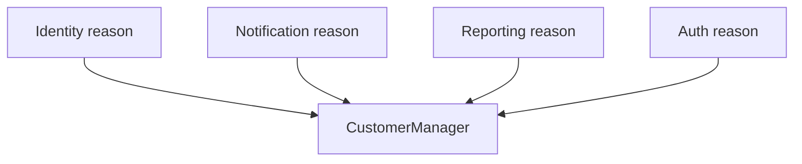
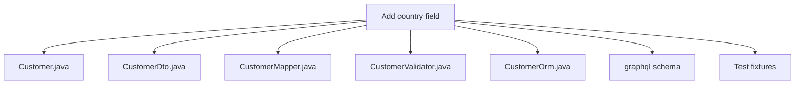
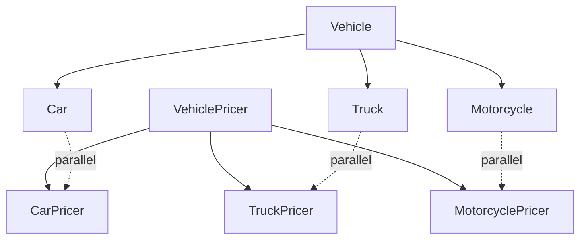

# Change Preventers — Junior Level

> **Source:** [refactoring.guru/refactoring/smells/change-preventers](https://refactoring.guru/refactoring/smells/change-preventers)

---

## Table of Contents

1. [What are Change Preventers?](#what-are-change-preventers)
2. [The 3 Change Preventers at a glance](#the-3-change-preventers-at-a-glance)
3. [Divergent Change](#divergent-change)
4. [Shotgun Surgery](#shotgun-surgery)
5. [Parallel Inheritance Hierarchies](#parallel-inheritance-hierarchies)
6. [Divergent Change vs Shotgun Surgery — opposites](#divergent-change-vs-shotgun-surgery--opposites)
7. [Common cures (cross-links)](#common-cures-cross-links)
8. [Diagrams](#diagrams)
9. [Mini Glossary](#mini-glossary)
10. [Review questions](#review-questions)

---

## What are Change Preventers?

**Change Preventers** are smells that make routine changes expensive — not because the change itself is hard, but because making it requires touching too many places, or wrong places, or both.

The three smells:

| Smell | The pain |
|---|---|
| **Divergent Change** | One class is changed for many different reasons |
| **Shotgun Surgery** | One change forces edits in many classes |
| **Parallel Inheritance Hierarchies** | Adding a subclass in one tree forces a corresponding subclass in another |

> **Common cause:** misaligned boundaries. The way the code is split doesn't match the way it changes. Changes cut across the wrong seams.

---

## The 3 Change Preventers at a glance

| Smell | Symptom | Quick cure |
|---|---|---|
| Divergent Change | Class touched in unrelated PRs | [Extract Class](../../03-refactoring-techniques/02-moving-features/junior.md) |
| Shotgun Surgery | One feature change requires editing 7 files | [Move Method](../../03-refactoring-techniques/02-moving-features/junior.md), [Inline Class](../../03-refactoring-techniques/02-moving-features/junior.md) |
| Parallel Inheritance | Every subclass of A needs a sibling subclass of B | [Move Method](../../03-refactoring-techniques/02-moving-features/junior.md), [Move Field](../../03-refactoring-techniques/02-moving-features/junior.md) |

---

## Divergent Change

### What it is

A class is **changed for many different reasons** — different kinds of changes touch it. The class accumulates responsibilities over time; each new responsibility means a new reason to modify it.

### Symptoms

- The same class appears in PRs about totally unrelated features (UI tweak; payment retry logic; audit logging).
- Different team members modify the same class for their own concerns.
- The class file's git log shows a chaotic mix of unrelated commit messages.
- Adding a feature requires understanding parts of the class unrelated to the feature.

### Why it's bad

- **SRP violation:** the class has multiple responsibilities, multiple reasons to change.
- **Mental load:** to safely change it for one purpose, you have to understand its other purposes.
- **Test fragility:** tests for one responsibility break because of unrelated changes.
- **Merge conflicts:** multiple feature branches all touch the same file.

### Java example — before

```java
class CustomerManager {
    // Identity (changes for: name format, GDPR, tier upgrades)
    public void rename(Customer c, String newName) { ... }
    public void deleteForGdpr(Customer c) { ... }
    public void upgradeTier(Customer c, Tier tier) { ... }
    
    // Notifications (changes for: new channels, throttling, opt-out)
    public void sendEmail(Customer c, String subject, String body) { ... }
    public void sendSms(Customer c, String text) { ... }
    public void canSendNotifications(Customer c) { ... }
    
    // Reporting (changes for: new report types, format changes)
    public Report generateMonthlyReport(Customer c) { ... }
    public Stats getEngagementStats(Customer c) { ... }
}
```

`CustomerManager` is changed for *identity* features, *notification* features, and *reporting* features. Three teams could be modifying it weekly. The git log is chaos.

### Java example — after Extract Class

```java
class CustomerIdentityService {
    public void rename(Customer c, String newName) { ... }
    public void deleteForGdpr(Customer c) { ... }
    public void upgradeTier(Customer c, Tier tier) { ... }
}

class CustomerNotificationService {
    public void sendEmail(Customer c, String subject, String body) { ... }
    public void sendSms(Customer c, String text) { ... }
    public boolean canSendNotifications(Customer c) { ... }
}

class CustomerReportingService {
    public Report generateMonthlyReport(Customer c) { ... }
    public Stats getEngagementStats(Customer c) { ... }
}
```

Now each service has one reason to change. The Identity team owns one file; Notifications another; Reporting a third. Merge conflicts drop dramatically.

### Python example

```python
# Before
class UserManager:
    def update_email(self, user, email): ...      # identity concerns
    def reset_password(self, user): ...           # auth concerns
    def opt_out_of_emails(self, user): ...        # marketing concerns
    def calculate_engagement_score(self, user): ... # analytics concerns

# After — extracted
class UserIdentity:
    def update_email(self, user, email): ...
class UserAuth:
    def reset_password(self, user): ...
class UserMarketingPreferences:
    def opt_out_of_emails(self, user): ...
class UserAnalytics:
    def calculate_engagement_score(self, user): ...
```

### Go example

Go encourages separation of services as separate packages, naturally limiting Divergent Change:

```go
// Before — one big package
package customer

func Rename(...) { ... }
func SendEmail(...) { ... }
func GenerateReport(...) { ... }

// After — separate packages
package customer    // identity
func Rename(...) { ... }

package notification
func SendEmail(...) { ... }

package reporting
func GenerateReport(...) { ... }
```

### Cure

Primary: **[Extract Class](../../03-refactoring-techniques/02-moving-features/junior.md)** — split along reasons-to-change boundaries.

Secondary: **[Move Method](../../03-refactoring-techniques/02-moving-features/junior.md)** — move methods that don't really belong on the class to where they fit.

---

## Shotgun Surgery

### What it is

**Shotgun Surgery** is the *opposite* of Divergent Change: a single logical change requires editing **many** classes. The change is "spread like buckshot" across the codebase. Often happens because some concept that should be in one place has been scattered.

### Symptoms

- Adding a single field requires touching 7 files: model, DTO, validator, mapper, ORM mapping, GraphQL schema, test fixtures.
- Renaming a concept requires search-and-replace across many files.
- Changes habitually have large diffs touching many files.
- Engineers complain "to do anything you have to know about the entire codebase."

### Why it's bad

- **High cost per change:** every feature change is expensive.
- **Forgotten edits:** the change misses one of the 7 places, introducing a subtle bug.
- **Inconsistency drift:** different places handle the change slightly differently over time.
- **Onboarding pain:** new engineers can't make changes without senior guidance.

### Java example — before

```java
// To add a new "country" field to Customer, you have to edit:

// 1. Customer.java
class Customer {
    private String firstName;
    private String lastName;
    // add: private String country;
}

// 2. CustomerDto.java
class CustomerDto {
    public String firstName;
    public String lastName;
    // add: public String country;
}

// 3. CustomerMapper.java
class CustomerMapper {
    public CustomerDto toDto(Customer c) {
        return new CustomerDto(c.getFirstName(), c.getLastName());
        // add country field to constructor call
    }
}

// 4. CustomerValidator.java — validate country code
// 5. CustomerOrmEntity.java — add @Column
// 6. customer-schema.graphql — add field
// 7. CustomerFixtures.java — set country in test fixtures
```

Adding one logical field = 7 file edits.

### Java example — after Inline Class / Move Method

The cure depends on the cause:

**If the same concept is duplicated** (e.g., separate `Customer`, `CustomerDto`, `CustomerOrmEntity` with overlapping fields):

```java
// Use one entity with mappers only at boundaries:
class Customer {
    String firstName, lastName, country;
    // No separate DTO/Entity
}

// Mappers live as namespaced static methods or are auto-generated (e.g., MapStruct)
```

**If the change really must touch multiple layers** (legitimate cross-cutting):

```java
// Use a single source of truth that other layers derive from:
@SchemaSource
record Customer(String firstName, String lastName, String country) {}

// Code-generation produces DTO, ORM entity, GraphQL types, validators automatically.
```

Tools: MapStruct (Java), Pydantic + SQLAlchemy (Python), Protobuf with code generation (multi-language). Define the schema once; the layers stay in sync.

### Python example

```python
# Before — Pydantic model + SQLAlchemy model + GraphQL schema diverge
class CustomerSchema(BaseModel):
    first_name: str
    last_name: str

class CustomerOrm(Base):
    first_name: Mapped[str]
    last_name: Mapped[str]

# After — single Pydantic source feeds the rest
@dataclass
class Customer:
    first_name: str
    last_name: str
    country: str  # add once

# SQLAlchemy 2.0 + Pydantic v2 can derive from typed Python classes
```

### Go example

```go
// Before — Customer scattered:
type Customer struct { ... }       // domain
type CustomerDTO struct { ... }    // wire
type CustomerEntity struct { ... } // database

// After — one Customer; convert at boundaries with explicit functions:
type Customer struct {
    FirstName, LastName, Country string
}

// Convert to wire format:
func (c Customer) ToWire() CustomerWire { ... }
// Convert to DB row:
func (c Customer) ToRow() CustomerRow { ... }
```

When convert-functions are tiny and one-to-one, this is fine. When they grow logic, that's a sign the conversion needs its own type.

### Cure

Primary: **[Move Method](../../03-refactoring-techniques/02-moving-features/junior.md)** — gather scattered behavior into one place.

Secondary: **[Inline Class](../../03-refactoring-techniques/02-moving-features/junior.md)** — when a class barely justifies its existence and folding it into another reduces fan-out.

For schema scatter: code generation, schema-first design, or a single source of truth.

---

## Parallel Inheritance Hierarchies

### What it is

A specific form of Shotgun Surgery: every time you create a subclass of class A, you must also create a corresponding subclass of class B. The two hierarchies grow in parallel.

### Symptoms

- For each `Subclass1Of_A`, there's a `Subclass1Of_B`.
- Adding a new variant means adding two new classes.
- The classes' names follow a parallel pattern: `Cat ↔ CatHandler`, `Dog ↔ DogHandler`.

### Why it's bad

- **Coupled growth:** the two hierarchies are not independent — they evolve together.
- **Forgotten siblings:** add a new subclass in one tree, forget to add the partner in the other → runtime error.

### Java example — before

```java
abstract class Vehicle { ... }
class Car extends Vehicle { ... }
class Truck extends Vehicle { ... }
class Motorcycle extends Vehicle { ... }

abstract class VehiclePricer {
    public abstract BigDecimal price(Vehicle v);
}
class CarPricer extends VehiclePricer { ... }
class TruckPricer extends VehiclePricer { ... }
class MotorcyclePricer extends VehiclePricer { ... }

// Adding `Bicycle extends Vehicle`? Must also add `BicyclePricer extends VehiclePricer`.
```

### Java example — after Move Method

The cleanest cure: move the parallel hierarchy's methods *onto* the original hierarchy.

```java
abstract class Vehicle {
    public abstract BigDecimal price();  // pricing now on Vehicle
}
class Car extends Vehicle {
    public BigDecimal price() { /* car pricing */ }
}
class Truck extends Vehicle {
    public BigDecimal price() { /* truck pricing */ }
}

// VehiclePricer hierarchy goes away entirely.
// Adding Bicycle extends Vehicle? It just needs to implement price().
```

### When the parallel hierarchy is justified

Sometimes it's right — e.g., when the second hierarchy represents a **separate axis of variation**:

- `Vehicle` (rental class) × `RentalPolicy` (regional pricing rules)

Then you have a 2D matrix of behavior — better modeled with the Bridge pattern (covered in [01-design-patterns/02-structural/02-bridge/](../../01-design-patterns/02-structural/02-bridge/junior.md)).

The smell appears when the second hierarchy is *redundant* — its variation matches the first 1:1 with no real second axis.

### Python example

Python's duck typing makes this less common — the "second hierarchy" often just becomes methods on the first. But it appears when designers over-architect.

### Go example

Go's lack of inheritance makes "parallel hierarchies" appear differently: parallel sets of structs and parallel sets of "service" structs that operate on them. The cure is the same: the operations belong on the data type.

### Cure

Primary: **[Move Method](../../03-refactoring-techniques/02-moving-features/junior.md)** + **[Move Field](../../03-refactoring-techniques/02-moving-features/junior.md)** — fold the second hierarchy into the first.

Secondary: when the second axis of variation is real, use the **Bridge pattern** to compose them, not Move.

---

## Divergent Change vs Shotgun Surgery — opposites

The two smells are *exact opposites* on the same axis:

| Divergent Change | Shotgun Surgery |
|---|---|
| One class, many reasons to change | One reason to change, many classes |
| Class is too broad | Class is too narrow / responsibility scattered |
| Cure: split | Cure: merge |
| Extract Class | Move Method, Inline Class |

A codebase often has *both* — different parts have different problems. Diagnosis matters: refactoring the wrong direction makes the smell worse.

> **Heuristic:** look at *recent change history*. Many unrelated commits to one file = Divergent Change. Many files modified together in one commit = Shotgun Surgery.

---

## Common cures (cross-links)

| Smell | Primary | Secondary |
|---|---|---|
| Divergent Change | [Extract Class](../../03-refactoring-techniques/02-moving-features/junior.md) | [Move Method](../../03-refactoring-techniques/02-moving-features/junior.md), [Move Field](../../03-refactoring-techniques/02-moving-features/junior.md) |
| Shotgun Surgery | [Move Method](../../03-refactoring-techniques/02-moving-features/junior.md), [Inline Class](../../03-refactoring-techniques/02-moving-features/junior.md) | [Move Field](../../03-refactoring-techniques/02-moving-features/junior.md) |
| Parallel Inheritance | [Move Method](../../03-refactoring-techniques/02-moving-features/junior.md), [Move Field](../../03-refactoring-techniques/02-moving-features/junior.md) | (Bridge pattern when second axis is real) |

---

## Diagrams

### Divergent Change



### Shotgun Surgery



### Parallel Inheritance



---

## Mini Glossary

| Term | Meaning |
|---|---|
| **SRP** | Single Responsibility Principle — one reason to change per class. |
| **Cohesion** | How closely related the responsibilities of a class are. High cohesion = good. |
| **Coupling** | How dependent classes are on each other. Low coupling = good. |
| **Cross-cutting concern** | A concern (logging, security, transactions) that naturally cuts across many classes — a candidate for AOP or middleware, not Shotgun Surgery. |
| **Bridge pattern** | A structural pattern that decouples an abstraction from its implementation, allowing independent variation along two axes. |

---

## Review questions

1. **What's the difference between Divergent Change and Shotgun Surgery?**
   Divergent Change: *one class* changes for *many reasons*. Shotgun Surgery: *one reason* requires changing *many classes*. They're opposites; cures are opposites (split vs. merge).

2. **A class is changed in PRs about UI, payments, and reporting. Which smell?**
   Divergent Change. The class has at least 3 responsibilities. Cure: Extract Class along responsibility boundaries.

3. **Adding a field requires editing 8 files. Which smell?**
   Shotgun Surgery. The concept of "this field" is scattered. Cure: identify why it's scattered (DTO/Entity/GraphQL all hand-rolled?) and consolidate (single source of truth + code generation).

4. **Are all 8-file changes Shotgun Surgery?**
   No. Some changes legitimately cut across many files (database migration + corresponding entity + corresponding DTO + corresponding API). The smell is when the *cause* of the cuts is duplication or poor abstraction, not when the change is genuinely cross-cutting.

5. **Parallel Inheritance Hierarchies — when is it OK?**
   When the second hierarchy represents a genuinely separate axis of variation (Bridge pattern). Smell appears when the second hierarchy mirrors the first 1:1 with no extra dimension.

6. **Why is Divergent Change called a "Change Preventer"?**
   Each change to the class requires understanding its other responsibilities. Even unrelated changes risk breaking unrelated features. The class becomes a bottleneck — many people can't safely modify it simultaneously.

7. **What tool helps diagnose Divergent Change?**
   `git log --pretty=format:%s -- <file>` — read the commit messages. If they mention many unrelated topics, the file has Divergent Change.

8. **Code generation reduces Shotgun Surgery — why?**
   It establishes a *single source of truth* (a `.proto` file, a schema definition, an OpenAPI spec). Multiple layers are *generated*, not hand-written. Adding a field touches the source; the layers regenerate automatically.

9. **A team has Shotgun Surgery in their Customer model. Quick fix?**
   Identify what's duplicated. Often, the fix is consolidating Customer-Customer (domain), CustomerDto (wire), CustomerEntity (DB), CustomerGraphQL (API) into fewer types — or generating the variants from one source.

10. **Move Method to fix Parallel Inheritance — concrete steps.**
    For each method in the second hierarchy, identify which subclass of the first hierarchy it corresponds to. Move the method to that subclass. Repeat for each method. The second hierarchy disappears.

---

> **Next:** [middle.md](middle.md) — real-world cases and trade-offs.
