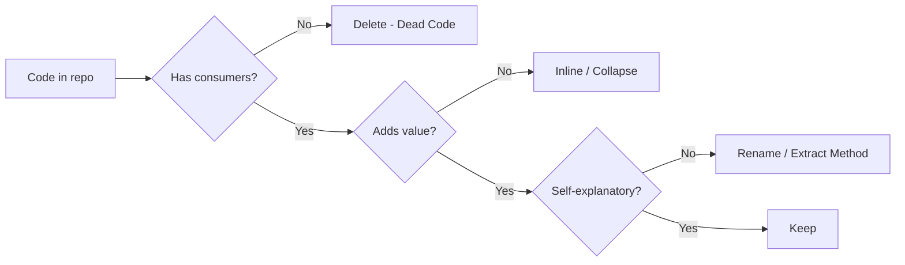

# Dispensables — Junior Level

> **Source:** [refactoring.guru/refactoring/smells/dispensables](https://refactoring.guru/refactoring/smells/dispensables)

---

## Table of Contents

1. [What are Dispensables?](#what-are-dispensables)
2. [The 6 Dispensables at a glance](#the-6-dispensables-at-a-glance)
3. [Comments (the smell, not the practice)](#comments-the-smell-not-the-practice)
4. [Duplicate Code](#duplicate-code)
5. [Lazy Class](#lazy-class)
6. [Data Class](#data-class)
7. [Dead Code](#dead-code)
8. [Speculative Generality](#speculative-generality)
9. [How they relate](#how-they-relate)
10. [Common cures (cross-links)](#common-cures-cross-links)
11. [Diagrams](#diagrams)
12. [Mini Glossary](#mini-glossary)
13. [Review questions](#review-questions)

---

## What are Dispensables?

**Dispensables** are *removable* code — code that adds no value and makes the codebase harder to read or maintain. The cure is almost always **delete**, sometimes **inline**, occasionally **consolidate**.

Six smells:

| Smell | What's wasted |
|---|---|
| **Comments** | Comments compensating for unclear code |
| **Duplicate Code** | The same logic repeated |
| **Lazy Class** | A class that does too little |
| **Data Class** | A class with only fields and accessors |
| **Dead Code** | Code never executed |
| **Speculative Generality** | Abstractions added "just in case" |

> **Common axis:** *aspirational complexity*. Dispensables exist because someone added structure they didn't actually need — explanations no one reads, abstractions for a future that never came, classes that justify themselves with hopes.

---

## The 6 Dispensables at a glance

| Smell | Symptom | Quick cure |
|---|---|---|
| Comments | Long comments explaining unclear code | [Extract Method](../../03-refactoring-techniques/01-composing-methods/junior.md), [Rename Method](../../03-refactoring-techniques/05-simplifying-method-calls/junior.md) |
| Duplicate Code | Same fragment in many places | [Extract Method](../../03-refactoring-techniques/01-composing-methods/junior.md) |
| Lazy Class | Class with one method, used once | [Inline Class](../../03-refactoring-techniques/02-moving-features/junior.md) |
| Data Class | Class with only getters/setters | [Move Method](../../03-refactoring-techniques/02-moving-features/junior.md), [Encapsulate Field](../../03-refactoring-techniques/03-organizing-data/junior.md) |
| Dead Code | Unreachable code | Delete |
| Speculative Generality | Abstract class with one concrete implementation | [Inline Class](../../03-refactoring-techniques/02-moving-features/junior.md), [Collapse Hierarchy](../../03-refactoring-techniques/06-dealing-with-generalization/junior.md) |

---

## Comments (the smell, not the practice)

### What it is

The smell of **Comments** is comments **compensating for unclear code**. The comment explains *what* the code does, suggesting the code itself fails to.

> **Critical distinction:** comments themselves aren't bad. The smell is comments that *should be code*. A comment explaining *why* something is done (for a non-obvious reason — a regulatory requirement, a perf workaround, an upstream API quirk) is excellent. A comment explaining *what* the next 30 lines do — those 30 lines should be a method whose name says it.

### Examples

```java
// BAD — Comment compensates for unclear name
// Calculate the total price after discount and tax for a single item line
double calc(LineItem item, Customer c) { ... }

// GOOD — Name communicates; comment is unnecessary
double finalPriceAfterDiscountAndTax(LineItem item, Customer c) { ... }


// BAD — Comment explains a 50-line block
// Step 1: Validate the order
// (50 lines of validation)
// Step 2: Calculate pricing
// (60 lines of pricing)

// GOOD — Methods named like the comments
validate(order);
calculatePricing(order);


// GOOD — Comment explains *why* (non-obvious)
// Workaround: Stripe's API returns a charge ID even for failed
// charges; we must check `status` separately. See bug 12345.
if (charge.status() == FAILED) throw new PaymentException();
```

### When comments are right

- **Why-comments**: explaining a non-obvious design choice, a workaround, a regulation.
- **API documentation**: javadoc, docstrings, godoc — required for public surface.
- **Performance notes**: "this lookup is O(N²) but N is bounded by 10."
- **Reference links**: pointing to a bug, a blog, a paper that justifies the approach.

### Cure

Primary: **[Extract Method](../../03-refactoring-techniques/01-composing-methods/junior.md)** with a self-explanatory name. **[Rename Method](../../03-refactoring-techniques/05-simplifying-method-calls/junior.md)** when the existing name is opaque. **[Introduce Assertion](../../03-refactoring-techniques/04-simplifying-conditionals/junior.md)** when a comment documents an invariant.

---

## Duplicate Code

### What it is

The same code fragment (or near-same — same logic, different names) in multiple places. Changes to one place need to be replicated everywhere; missing places creates inconsistency.

### Symptoms

- Identical 5-15 line blocks in different methods or files.
- Methods that differ only in literal values (`if (x > 10)` vs `if (x > 20)` with otherwise identical body).
- Subtly different copies (one branch handles `null`, another doesn't) — bugs hiding.

### Java example — before

```java
class OrderProcessor {
    public BigDecimal computeOrderTotal(Order o) {
        BigDecimal total = BigDecimal.ZERO;
        for (OrderLine line : o.getLines()) {
            BigDecimal subtotal = line.getUnitPrice()
                .multiply(BigDecimal.valueOf(line.getQuantity()));
            total = total.add(subtotal);
        }
        return total;
    }
}

class QuoteProcessor {
    public BigDecimal computeQuoteTotal(Quote q) {
        BigDecimal total = BigDecimal.ZERO;
        for (QuoteLine line : q.getLines()) {
            BigDecimal subtotal = line.getUnitPrice()
                .multiply(BigDecimal.valueOf(line.getQuantity()));
            total = total.add(subtotal);
        }
        return total;
    }
}
```

### Java example — after Extract Method

```java
class LineCalculator {
    public BigDecimal sum(List<? extends LineLike> lines) {
        return lines.stream()
            .map(line -> line.getUnitPrice().multiply(BigDecimal.valueOf(line.getQuantity())))
            .reduce(BigDecimal.ZERO, BigDecimal::add);
    }
}

interface LineLike {
    BigDecimal getUnitPrice();
    int getQuantity();
}

class OrderLine implements LineLike { ... }
class QuoteLine implements LineLike { ... }
```

The summation logic exists once. Both processors use it.

### Python example

```python
# Before — duplicated logic
def total_orders(orders):
    return sum(o.unit_price * o.quantity for o in orders)

def total_quotes(quotes):
    return sum(q.unit_price * q.quantity for q in quotes)

# After
def sum_lines(lines):
    return sum(l.unit_price * l.quantity for l in lines)
```

### Go example

```go
// Before
func sumOrders(orders []Order) float64 { ... }
func sumQuotes(quotes []Quote) float64 { ... }

// After — generic helper
type Liner interface {
    LineTotal() float64
}

func Sum[T Liner](lines []T) float64 {
    total := 0.0
    for _, l := range lines { total += l.LineTotal() }
    return total
}
```

### Cure

Primary: **[Extract Method](../../03-refactoring-techniques/01-composing-methods/junior.md)** — pull the duplicated logic into one place.

For duplicated logic across class hierarchies: **[Pull Up Method](../../03-refactoring-techniques/06-dealing-with-generalization/junior.md)** (move to common parent) or **[Form Template Method](../../03-refactoring-techniques/06-dealing-with-generalization/junior.md)** (when the duplicates have variation points).

For substituted-with-different-implementations duplication: **[Substitute Algorithm](../../03-refactoring-techniques/01-composing-methods/junior.md)** — pick the better one and remove the others.

### Be careful

Not all duplication should be unified. Two pieces of code that *coincidentally* look alike but represent different concepts (one for order pricing, one for shipping cost calculation) may evolve in different directions. Premature unification creates Speculative Generality. **Rule of three**: tolerate two duplicates; refactor at the third.

---

## Lazy Class

### What it is

A class that **does too little to justify its existence**. Maintenance cost (one more file, one more import, one more place to look) exceeds the value provided.

### Symptoms

- Class with one method, used once.
- Class with only a constructor and a `toString()`.
- A subclass with no overrides — pure inheritance with no addition.
- A package with one class.

### Examples

```java
// BAD — Lazy Class
class TaxCalculator {
    private final BigDecimal rate;
    public TaxCalculator(BigDecimal rate) { this.rate = rate; }
    public BigDecimal calculate(BigDecimal amount) {
        return amount.multiply(rate);
    }
}

// Used once:
new TaxCalculator(new BigDecimal("0.0875")).calculate(amount);

// CURE — Inline Class
amount.multiply(new BigDecimal("0.0875"));
// Or, if reused, a static helper:
class TaxRules {
    public static BigDecimal applyTax(BigDecimal amount, BigDecimal rate) {
        return amount.multiply(rate);
    }
}
```

### When a small class is OK

- **Value object** with semantic meaning (`Email`, `Money`, `OrderId`) — small but doing real type-safety work.
- **Marker / sentinel** types in an algorithm.
- **Strategy implementation** that's part of a larger pattern.

The smell is when the class adds *no* meaning — it's just a wrapper around one method or one field.

### Cure

Primary: **[Inline Class](../../03-refactoring-techniques/02-moving-features/junior.md)** — fold the class into its single user. For trivial subclasses: **[Collapse Hierarchy](../../03-refactoring-techniques/06-dealing-with-generalization/junior.md)**.

---

## Data Class

### What it is

A class that **only holds data** — fields and accessors, no behavior. The behavior that *should* live on the class lives elsewhere (often as helper functions in a service class).

### Symptoms

- Class with only getters and setters (or, in functional style, only fields).
- "Service" classes that operate on the Data Class via its getters: `service.computeTotal(dataObject)`.
- Logic that touches the data lives in other classes that have to fetch the data.

### Java example — before

```java
class Customer {
    private String firstName;
    private String lastName;
    public String getFirstName() { return firstName; }
    public String getLastName() { return lastName; }
    public void setFirstName(String f) { firstName = f; }
    public void setLastName(String l) { lastName = l; }
}

class CustomerService {
    public String fullName(Customer c) {
        return c.getFirstName() + " " + c.getLastName();
    }
    public boolean hasFullName(Customer c) {
        return c.getFirstName() != null && c.getLastName() != null;
    }
}
```

### Java example — after Move Method

```java
class Customer {
    private String firstName;
    private String lastName;
    
    public String fullName() {
        return firstName + " " + lastName;
    }
    public boolean hasFullName() {
        return firstName != null && lastName != null;
    }
}
```

The methods live with the data they operate on. `Customer` is now a real class, not a holder.

### When Data Class is OK

- **DTOs / wire types** for API serialization. They legitimately have no behavior — they're just shapes for transport.
- **Records / value objects** designed for immutability + structural equality. They have implicit "behavior" (equals, hashCode, immutability invariants).
- **Pydantic models, dataclasses** for data validation at boundaries.

The smell is when **business logic naturally belongs** on the data type but lives elsewhere.

### Cure

Primary: **[Move Method](../../03-refactoring-techniques/02-moving-features/junior.md)** — move logic that operates on the data onto the data class.

Secondary: **[Encapsulate Field](../../03-refactoring-techniques/03-organizing-data/junior.md)** — restrict access; force consumers to use methods rather than getters/setters.

---

## Dead Code

### What it is

Code that **is never executed** — unreachable methods, unused variables, commented-out blocks, conditional branches that can never be true.

### Symptoms

- Methods with no callers.
- Imports for symbols that don't appear in the file.
- Conditions like `if (false)` or `if (debug && false)`.
- Whole files referenced by nothing.
- Commented-out code blocks (sometimes called "code in a coma").
- Unreachable `return` statements after `throw`.

### Java example

```java
public void processOrder(Order order) {
    if (order == null) throw new IllegalArgumentException();
    
    // Old payment flow — replaced 6 months ago
    // chargeViaLegacyGateway(order);  // dead, kept "in case"
    
    chargeViaModernGateway(order);
}

private void chargeViaLegacyGateway(Order order) {
    // 200 lines of dead code
}
```

The commented call leaves the method in the codebase. The method has no callers anywhere. Pure deletion target.

### Why it's bad

- **Cognitive load:** readers must understand whether the code matters.
- **Stale risk:** dead code rots — refactors silently leave it in inconsistent states.
- **Bug risk:** "kept just in case" code may get accidentally re-enabled.
- **Search noise:** searching for a function name lights up dead implementations.

### When "looks dead" isn't dead

- Code called via reflection (Java reflection, Python `getattr`, JS `eval`).
- Code called from frameworks (Spring's `@PostConstruct`, dependency injection wiring, Flask routes).
- Code called only in test fixtures.
- Code called via JNI or generated bindings.

Tools sometimes can't see these. Verify before deleting.

### Cure

**Delete.** Just delete. Use git to recover if you ever need it. Tools:

- **IntelliJ:** "Find Usages" then delete if zero. "Inspect Code" → "Unused declaration."
- **golangci-lint** with `unused` linter.
- **`vulture`** for Python.
- **`tsc --noUnusedLocals`** for TypeScript.

### Commented-out code

Same rule. Delete. Git remembers. Comments saying "// kept for reference" are graveyard markers — bury them properly.

---

## Speculative Generality

### What it is

Abstractions, parameters, hooks, plugin points added "just in case" — for variation that has never appeared and may never appear. The system is more flexible than it needs to be, at the cost of being harder to understand.

### Symptoms

- Abstract class with one concrete subclass.
- Interface with one implementation that's never expected to have another.
- Method parameter that's always passed the same value.
- Configuration knob no one ever changes.
- A plugin system serving zero plugins.
- "Future-proofing" comments justifying complexity.

### Java example — before

```java
abstract class BasePaymentProcessor {
    public abstract void process(Payment p);
    public abstract boolean validate(Payment p);
    public abstract void log(Payment p);
}

class StripePaymentProcessor extends BasePaymentProcessor {
    public void process(Payment p) { ... }
    public boolean validate(Payment p) { ... }
    public void log(Payment p) { ... }
}

// No other subclass ever existed. The team is "Stripe-only" by design.
```

### Java example — after Inline Class / Collapse Hierarchy

```java
class StripePaymentProcessor {
    public void process(Payment p) { ... }
    public boolean validate(Payment p) { ... }
    public void log(Payment p) { ... }
}
```

When a second processor (Adyen, PayPal) actually appears, *then* extract a common abstraction. Until then, the abstraction is overhead.

### When generality is justified

- **Multiple known implementations exist now**, even if one is dominant.
- **The interface is a stable API** consumed by code you don't control.
- **Testability** — interface-based design enables easy mocking.

The smell is *speculative* — generality for *no current consumer*.

### Cure

Primary: **[Inline Class](../../03-refactoring-techniques/02-moving-features/junior.md)** when it's a single class hidden behind an unused abstraction. **[Collapse Hierarchy](../../03-refactoring-techniques/06-dealing-with-generalization/junior.md)** when an inheritance tree has degenerated to one branch.

Secondary: **[Remove Parameter](../../03-refactoring-techniques/05-simplifying-method-calls/junior.md)** for parameters that are always the same.

---

## How they relate

| Pair | Relationship |
|---|---|
| Comments + Duplicate Code | Comments are often copy-pasted along with code → both grow together |
| Lazy Class + Speculative Generality | The lazy class often exists *because* it was meant to be the head of an abstraction that never grew |
| Data Class + Feature Envy (Couplers) | When data has no behavior, callers have to do the work — Feature Envy of the Data Class's getters |
| Dead Code + Commented Code | The commented code is in a coma; commit to euthanizing it |

> **Common cure axis:** *delete or inline*. Most Dispensables are removed, not refactored.

---

## Common cures (cross-links)

| Smell | Primary cure | Secondary |
|---|---|---|
| Comments | [Extract Method](../../03-refactoring-techniques/01-composing-methods/junior.md), [Rename Method](../../03-refactoring-techniques/05-simplifying-method-calls/junior.md) | [Introduce Assertion](../../03-refactoring-techniques/04-simplifying-conditionals/junior.md) |
| Duplicate Code | [Extract Method](../../03-refactoring-techniques/01-composing-methods/junior.md) | [Pull Up Method](../../03-refactoring-techniques/06-dealing-with-generalization/junior.md), [Form Template Method](../../03-refactoring-techniques/06-dealing-with-generalization/junior.md), [Substitute Algorithm](../../03-refactoring-techniques/01-composing-methods/junior.md) |
| Lazy Class | [Inline Class](../../03-refactoring-techniques/02-moving-features/junior.md) | [Collapse Hierarchy](../../03-refactoring-techniques/06-dealing-with-generalization/junior.md) |
| Data Class | [Move Method](../../03-refactoring-techniques/02-moving-features/junior.md) | [Encapsulate Field](../../03-refactoring-techniques/03-organizing-data/junior.md), [Encapsulate Collection](../../03-refactoring-techniques/03-organizing-data/junior.md) |
| Dead Code | Delete | (none — just delete) |
| Speculative Generality | [Collapse Hierarchy](../../03-refactoring-techniques/06-dealing-with-generalization/junior.md), [Inline Class](../../03-refactoring-techniques/02-moving-features/junior.md) | [Remove Parameter](../../03-refactoring-techniques/05-simplifying-method-calls/junior.md), [Rename Method](../../03-refactoring-techniques/05-simplifying-method-calls/junior.md) |

---

## Diagrams

### Dispensables flow



---

## Mini Glossary

| Term | Meaning |
|---|---|
| **YAGNI** | You Aren't Gonna Need It — XP principle. Don't add complexity for hypothetical future needs. |
| **Rule of three** | Tolerate duplication twice; refactor on the third occurrence. |
| **DTO** | Data Transfer Object — a typed shape for moving data between layers. May legitimately be a Data Class. |
| **Dead code** | Code that cannot be executed — no callers. |
| **Tombstone code** | Commented-out code left as a "tombstone" of a past version. |
| **Defensive coding gone wrong** | Adding parameters, hooks, abstractions for problems that haven't appeared. |

---

## Review questions

1. **Are all comments a code smell?**
   No. Why-comments are good (non-obvious design choices, workarounds, regulatory rules). What-comments are the smell — code itself should communicate "what."

2. **The Rule of Three — explain.**
   Tolerate duplication twice; refactor on the third occurrence. Premature unification (after one duplication) often creates a wrong abstraction.

3. **A class has only `equals` and `hashCode`. Lazy Class?**
   No — that's a *value object*. Equals/hashCode is real semantic work.

4. **A method has 200 callers. It's documented with a Javadoc paragraph. Smell?**
   The Javadoc is good — public APIs should be documented. Comments are only the smell when *internal* code uses them to explain what the code itself fails to.

5. **A team's policy: "delete commented-out code on sight." Reasonable?**
   Yes. Git remembers. "Just in case" comments accumulate; deleting forces engineers to commit to "this is the version we ship."

6. **An interface has one implementation. Speculative Generality?**
   Probably. Unless the interface is a stable API consumed externally, or testability requires mocking, the abstraction is overhead.

7. **A team writes "future-proof" code with many extension points. Risk?**
   Speculative Generality. The "future-proofness" is for futures that may never come — meanwhile, current readers pay the cognitive cost.

8. **DTOs in REST APIs are Data Classes — bad?**
   No. DTOs are wire types; their lack of behavior is correct. The smell is "Data Class" when business logic *belongs* on the type but lives elsewhere.

9. **A method is duplicated in 3 classes; the team has the rule "extract at 3." Time to refactor?**
   Now. Three is the threshold — extract.

10. **A linter flags 300 unused private methods. Delete?**
    Yes, but verify first — some may be called via reflection (Spring, Hibernate, dependency injection) and the linter may not see those uses. Mark with `@SuppressWarnings("unused")` when reflection is the consumer; otherwise delete.

---

> **Next:** [middle.md](middle.md) — real-world cases, when to keep, when to remove.
