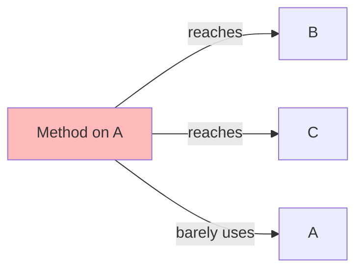
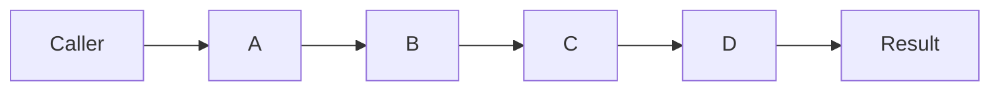
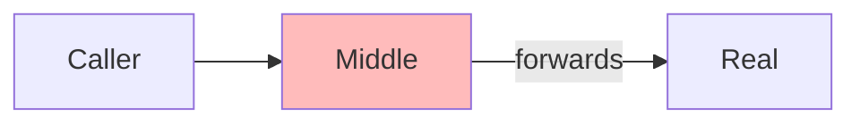

# Couplers — Junior Level

> **Source:** [refactoring.guru/refactoring/smells/couplers](https://refactoring.guru/refactoring/smells/couplers)

---

## Table of Contents

1. [What are Couplers?](#what-are-couplers)
2. [The 4 Couplers at a glance](#the-4-couplers-at-a-glance)
3. [Feature Envy](#feature-envy)
4. [Inappropriate Intimacy](#inappropriate-intimacy)
5. [Message Chains](#message-chains)
6. [Middle Man](#middle-man)
7. [How they relate](#how-they-relate)
8. [Common cures (cross-links)](#common-cures-cross-links)
9. [Diagrams](#diagrams)
10. [Mini Glossary](#mini-glossary)
11. [Review questions](#review-questions)

---

## What are Couplers?

**Couplers** are smells about **excessive dependence between classes**. Every system has dependencies — some classes know about others. Couplers appear when those dependencies are *too tight*: a class knows too much about another's internals, depends on too long a chain, or only exists to forward calls.

The four smells:

| Smell | The pain |
|---|---|
| **Feature Envy** | A method is more interested in another class's data than its own |
| **Inappropriate Intimacy** | Two classes know too much about each other's private parts |
| **Message Chains** | `a.getB().getC().getD().doIt()` — caller depends on a deep navigation chain |
| **Middle Man** | A class delegates almost everything to another — pure forwarding |

> **Common axis:** *misplaced responsibility*. The behavior is in the wrong class, or the wrong class is in between, or two classes share intimate knowledge they shouldn't. Cure: re-place behavior on the right class.

---

## The 4 Couplers at a glance

| Smell | Symptom | Quick cure |
|---|---|---|
| Feature Envy | Method uses another class's getters more than its own fields | [Move Method](../../03-refactoring-techniques/02-moving-features/junior.md) |
| Inappropriate Intimacy | Two classes share each other's private state | [Move Method](../../03-refactoring-techniques/02-moving-features/junior.md), [Hide Delegate](../../03-refactoring-techniques/02-moving-features/junior.md) |
| Message Chains | `a.getB().getC().getD()` | [Hide Delegate](../../03-refactoring-techniques/02-moving-features/junior.md) |
| Middle Man | Class forwards most calls to another | [Remove Middle Man](../../03-refactoring-techniques/02-moving-features/junior.md), [Inline Method](../../03-refactoring-techniques/01-composing-methods/junior.md) |

---

## Feature Envy

### What it is

A **Feature Envy** smell is when a method is more interested in *another class's* data than its own. The method's body keeps reaching across the object boundary — calling many getters of a collaborator, doing the work, and then maybe writing back.

> "Move the method to where the data is."

### Symptoms

- A method calls `other.getX()`, `other.getY()`, `other.getZ()` — pulls a lot from one collaborator.
- A method touches `other`'s data far more than `this`'s data.
- Logic that would be one line if placed on the collaborator becomes four lines when placed elsewhere.

### Java example — before

```java
class Order {
    private List<LineItem> items;
    public List<LineItem> getItems() { return items; }
}

class LineItem {
    private BigDecimal unitPrice;
    private int quantity;
    public BigDecimal getUnitPrice() { return unitPrice; }
    public int getQuantity() { return quantity; }
}

class Invoice {
    public BigDecimal computeOrderSubtotal(Order order) {
        BigDecimal total = BigDecimal.ZERO;
        for (LineItem item : order.getItems()) {
            BigDecimal itemTotal = item.getUnitPrice()
                .multiply(BigDecimal.valueOf(item.getQuantity()));
            total = total.add(itemTotal);
        }
        return total;
    }
}
```

`Invoice.computeOrderSubtotal` reaches into `Order` (getItems) and `LineItem` (getUnitPrice, getQuantity). Three getters across two foreign classes. The method's interest lies elsewhere.

### Java example — after Move Method

```java
class LineItem {
    public BigDecimal subtotal() {
        return unitPrice.multiply(BigDecimal.valueOf(quantity));
    }
}

class Order {
    public BigDecimal subtotal() {
        return items.stream()
            .map(LineItem::subtotal)
            .reduce(BigDecimal.ZERO, BigDecimal::add);
    }
}

class Invoice {
    public BigDecimal computeOrderSubtotal(Order order) {
        return order.subtotal();  // single delegation
    }
}
```

`subtotal()` lives on `LineItem` (where the unit price and quantity are) and `Order` aggregates. Invoice merely delegates.

### Python example

```python
# Before
class Customer:
    def __init__(self, first_name, last_name, dob):
        self.first_name = first_name
        self.last_name = last_name
        self.dob = dob

class Reporter:
    def display_name(self, customer):
        return f"{customer.first_name} {customer.last_name}"
    def age(self, customer):
        return (date.today() - customer.dob).days // 365

# After
class Customer:
    def display_name(self):
        return f"{self.first_name} {self.last_name}"
    def age(self):
        return (date.today() - self.dob).days // 365
```

### Go example

```go
// Before
type Order struct {
    Items []LineItem
}

func computeTotal(o *Order) float64 {
    total := 0.0
    for _, item := range o.Items {
        total += item.UnitPrice * float64(item.Quantity)
    }
    return total
}

// After — methods on the data
func (li *LineItem) Subtotal() float64 {
    return li.UnitPrice * float64(li.Quantity)
}

func (o *Order) Total() float64 {
    total := 0.0
    for _, item := range o.Items {
        total += item.Subtotal()
    }
    return total
}
```

### When NOT to move

- The method *legitimately uses data from multiple objects* equally — it's a coordinator, no single object "owns" the operation.
- Moving creates tighter coupling than already exists (e.g., the donor class shouldn't depend on the receiver's package).

### Cure

Primary: **[Move Method](../../03-refactoring-techniques/02-moving-features/junior.md)**.

Secondary: **[Extract Method](../../03-refactoring-techniques/01-composing-methods/junior.md)** first if only part of the method is envious — extract the envious part, then move it.

---

## Inappropriate Intimacy

### What it is

Two classes that **know too much about each other's internal structure**. They access each other's private fields, override each other's protected methods, share knowledge that should be encapsulated.

### Symptoms

- Class A reads/writes Class B's internal fields directly (using `package-private` access in Java, or `protected` access via subclassing).
- A and B navigate each other's structure constantly.
- Refactoring one breaks the other every time.
- A and B might "secretly" communicate via shared mutable state.

### Why it's bad

- **Brittle:** changes to one ripple to the other.
- **Hard to test:** can't test A without instantiating most of B (and vice versa).
- **Distributed responsibility:** behavior that belongs in one place is split between two for no clear reason.

### Java example — before

```java
class Order {
    List<LineItem> items;          // package-private
    BigDecimal totalCache;         // ditto
}

class OrderCalculator {
    public BigDecimal compute(Order order) {
        if (order.totalCache != null) return order.totalCache;
        BigDecimal total = BigDecimal.ZERO;
        for (LineItem item : order.items) {  // direct field access
            total = total.add(item.computeTotal());
        }
        order.totalCache = total;  // mutating Order's private cache
        return total;
    }
}
```

`OrderCalculator` reaches into `Order`'s package-private fields. It mutates `Order`'s state via direct field assignment. The encapsulation is broken — the two are intimately entangled.

### Java example — after

```java
class Order {
    private final List<LineItem> items;
    private BigDecimal totalCache;
    
    public BigDecimal getTotal() {
        if (totalCache == null) {
            totalCache = items.stream()
                .map(LineItem::computeTotal)
                .reduce(BigDecimal.ZERO, BigDecimal::add);
        }
        return totalCache;
    }
}

// OrderCalculator goes away — Order knows how to total itself.
```

`Order` owns its cache. Encapsulation is restored.

### Python example

Python has weaker access control (everything is "public" by convention), but the smell still appears:

```python
# Before — Helper accesses _private fields
class Account:
    def __init__(self):
        self._balance = 0
        self._transactions = []

class TransactionRecorder:
    def record(self, account, txn):
        account._balance += txn.amount      # ! reaching into private state
        account._transactions.append(txn)

# After — Account owns its state
class Account:
    def deposit(self, amount, description):
        self._balance += amount
        self._transactions.append(Transaction(amount, description))
```

### Go example

Go's lowercase fields are package-private. Inappropriate Intimacy in Go usually appears within a package:

```go
// Before — both types live in same package
type Order struct {
    items []LineItem
    total float64
}

type Calculator struct{}
func (c *Calculator) Compute(o *Order) float64 {
    if o.total != 0 { return o.total }  // direct field access
    total := 0.0
    for _, i := range o.items { total += i.Subtotal() }
    o.total = total
    return total
}

// After
func (o *Order) Total() float64 {
    if o.total != 0 { return o.total }
    total := 0.0
    for _, i := range o.items { total += i.Subtotal() }
    o.total = total
    return total
}
```

### Cure

Primary: **[Move Method](../../03-refactoring-techniques/02-moving-features/junior.md)**, **[Move Field](../../03-refactoring-techniques/02-moving-features/junior.md)** — put behavior with the data it touches.

Secondary: **[Hide Delegate](../../03-refactoring-techniques/02-moving-features/junior.md)** — when intimacy comes from one class navigating another's internal structure to call deeper methods. **[Change Bidirectional Association to Unidirectional](../../03-refactoring-techniques/03-organizing-data/junior.md)** when intimacy is bidirectional but only needs to be one-way. **[Replace Inheritance with Delegation](../../03-refactoring-techniques/06-dealing-with-generalization/junior.md)** when intimacy comes from misplaced inheritance.

---

## Message Chains

### What it is

A **Message Chain** is a long chain of method calls used to navigate object structure: `a.getB().getC().getD().doIt()`. Every link in the chain is a structural assumption — if any of them changes, every caller breaks.

> Also called "Train Wreck Pattern" — Demeter's law violation.

### Symptoms

- `customer.getOrder().getShippingAddress().getCity().getZipCode().getRegion()`
- 3+ chained method calls.
- Refactoring an inner class requires updating many callers across the codebase.

### Why it's bad

- **Coupling to structure:** every caller depends on the path. Changing the path breaks all callers.
- **Demeter violation:** "Talk only to your immediate friends." Following long chains means knowing about strangers.
- **Hidden assumptions:** every `getX()` could return null; the caller often forgets to check, leading to NullPointerException.

### Java example — before

```java
class Customer {
    private Order currentOrder;
    public Order getCurrentOrder() { return currentOrder; }
}

class Order {
    private Address shippingAddress;
    public Address getShippingAddress() { return shippingAddress; }
}

class Address {
    private String city;
    public String getCity() { return city; }
}

// Caller:
String city = customer.getCurrentOrder().getShippingAddress().getCity();
```

The caller knows the entire navigation: customer → order → address → city. Every node could change shape; every caller breaks.

### Java example — after Hide Delegate

```java
class Customer {
    private Order currentOrder;
    
    public String shippingCity() {
        return currentOrder.shippingCity();
    }
}

class Order {
    private Address shippingAddress;
    
    public String shippingCity() {
        return shippingAddress.city();
    }
}

// Caller:
String city = customer.shippingCity();
```

The chain is hidden behind delegate methods. Now if `Order` changes how addresses work (e.g., `Address` is replaced with a coordinate object), only `Order.shippingCity()` changes — callers don't.

### Python example

```python
# Before
city = customer.current_order.shipping_address.city

# After
class Customer:
    @property
    def shipping_city(self):
        return self.current_order.shipping_address.city

# Caller:
city = customer.shipping_city
```

Python's properties make this idiomatic.

### Go example

Go encourages explicit access; chains are syntactically heavier and discourage long ones. Still:

```go
// Before
city := customer.Order.ShippingAddress.City

// After — method, not chain
func (c *Customer) ShippingCity() string {
    return c.Order.ShippingAddress.City
}

// Caller:
city := customer.ShippingCity()
```

### When chains are OK

- **Builder patterns:** `builder.setX(1).setY(2).setZ(3).build()`. Each call returns the builder; the chain is intentional and stable.
- **Stream/iterator pipelines:** `list.stream().filter(...).map(...).collect(...)`. Standard idiom; the chain is the API.
- **Fluent assertions in tests:** `assertThat(x).isNotNull().isEqualTo(y)`. Designed for chaining.

The smell is *navigating someone else's structure* via chains, not *using a fluent API*.

### Cure

Primary: **[Hide Delegate](../../03-refactoring-techniques/02-moving-features/junior.md)** — add a method at one end of the chain that does the navigation internally.

Secondary: **[Extract Method](../../03-refactoring-techniques/01-composing-methods/junior.md)** for repeated chains — put the chain in one named method, callers use the method.

---

## Middle Man

### What it is

A **Middle Man** is a class that delegates almost all of its methods to another. The class's only role is forwarding — it adds no behavior of its own.

### Symptoms

- Most methods are one-line `return delegate.someMethod(args)`.
- Most fields are unused; the class holds only a reference to the delegate.
- Reading the class file: 80%+ of methods are pure forwards.

### Why it's bad

- **Pointless indirection:** every call goes through the middle man, costing a method dispatch with no value.
- **Maintenance:** adding a method on the delegate requires adding a forwarding method on the middle man.
- **Confusing:** readers wonder why two classes exist for one job.

### Java example — before

```java
class Person {
    private Department department;
    
    public String getDepartmentName() { return department.getName(); }
    public String getDepartmentManager() { return department.getManager(); }
    public List<Project> getDepartmentProjects() { return department.getProjects(); }
    public int getDepartmentBudget() { return department.getBudget(); }
    public Address getDepartmentAddress() { return department.getAddress(); }
    
    // The class is a Middle Man for Department.
}
```

If callers want department info, they go through `Person.getDepartmentX()`. But Person doesn't add anything. Why not let callers use `person.getDepartment().getX()` directly? (Though long chains have their own smell.)

### Java example — after Remove Middle Man

```java
class Person {
    private Department department;
    
    public Department getDepartment() { return department; }
    // delegate methods removed
}

// Caller:
String deptName = person.getDepartment().getName();
```

Or, if a few specific delegations are useful (like `getDepartmentName()` for display), keep those — but don't blindly forward everything.

### When Middle Man is OK

- **Adapter pattern:** the middle man translates between interfaces. It's not pure forwarding; it has translation logic.
- **Decorator pattern:** the middle man adds behavior (logging, caching, retry) before/after delegation.
- **Proxy pattern:** the middle man controls access (lazy loading, auth, remote calls).
- **Facade pattern:** the middle man simplifies a complex subsystem; the forwarding is the value.

The smell is *pure forwarding without value-add*. If the middle man adds something (logging, caching, security, simplification), it's a pattern, not a smell.

### Cure

Primary: **[Remove Middle Man](../../03-refactoring-techniques/02-moving-features/junior.md)** — let callers use the delegate directly.

Secondary: **[Replace Delegation with Inheritance](../../03-refactoring-techniques/06-dealing-with-generalization/junior.md)** when the middle man is exhaustively forwarding to one delegate (rare; inheritance brings its own problems).

---

## How they relate

The four smells form a triad of "where does the work go?":

- **Feature Envy:** work is in the wrong class — should be on the data.
- **Inappropriate Intimacy:** two classes share work that should be in one.
- **Message Chains:** caller does navigation work that the navigated class should hide.
- **Middle Man:** class is doing only forwarding work — work that adds no value.

Cures cross over:
- Feature Envy + Move Method ⇄ Inappropriate Intimacy (when moving fixes mutual entanglement).
- Message Chains + Hide Delegate ⇄ Middle Man (Hide Delegate adds forwarding; if everyone hides, you've created a Middle Man).

> **Demeter's tension:** Hide Delegate cures Message Chains by adding a delegate method. Remove Middle Man cures Middle Man by removing delegates. The two cures pull in opposite directions. The right balance: hide what callers genuinely use; expose what the abstraction is for.

---

## Common cures (cross-links)

| Smell | Primary | Secondary |
|---|---|---|
| Feature Envy | [Move Method](../../03-refactoring-techniques/02-moving-features/junior.md) | [Extract Method](../../03-refactoring-techniques/01-composing-methods/junior.md) |
| Inappropriate Intimacy | [Move Method](../../03-refactoring-techniques/02-moving-features/junior.md), [Move Field](../../03-refactoring-techniques/02-moving-features/junior.md) | [Hide Delegate](../../03-refactoring-techniques/02-moving-features/junior.md), [Change Bidirectional Association to Unidirectional](../../03-refactoring-techniques/03-organizing-data/junior.md), [Replace Inheritance with Delegation](../../03-refactoring-techniques/06-dealing-with-generalization/junior.md) |
| Message Chains | [Hide Delegate](../../03-refactoring-techniques/02-moving-features/junior.md) | [Extract Method](../../03-refactoring-techniques/01-composing-methods/junior.md), [Move Method](../../03-refactoring-techniques/02-moving-features/junior.md) |
| Middle Man | [Remove Middle Man](../../03-refactoring-techniques/02-moving-features/junior.md) | [Inline Method](../../03-refactoring-techniques/01-composing-methods/junior.md), [Replace Delegation with Inheritance](../../03-refactoring-techniques/06-dealing-with-generalization/junior.md) |

---

## Diagrams

### Feature Envy



Cure: move Method to B (or C) — wherever the data is.

### Message Chains



Cure: caller asks A; A returns the result, hiding B/C/D internally.

### Middle Man



Cure: caller talks to Real directly.

---

## Mini Glossary

| Term | Meaning |
|---|---|
| **Demeter's Law** | "Talk only to your immediate friends." A method should call: itself, its fields, its parameters, locally created objects. Not transitive friends. |
| **Coupling** | Mutual dependence between modules. Low coupling is good; tight coupling is bad. |
| **Cohesion** | How closely related the responsibilities of a module are. High cohesion is good. |
| **Tell, Don't Ask** | Tell objects what to do, don't ask them for data and act on it. Cures Feature Envy. |
| **Demeter's Train Wreck** | Long Message Chain — `a.b.c.d.e.f`. |

---

## Review questions

1. **`a.getB().getC().getD()` — Message Chain?**
   Yes (3 chained calls). Cure: `a.someAggregateMethod()` that hides the navigation.

2. **A method on Class A uses Class B's getters 5 times. Smell?**
   Likely Feature Envy. Move the method to Class B.

3. **What's "Tell, Don't Ask"?**
   Instead of asking an object for its data and acting on it, tell it what to do. Cures Feature Envy: rather than `if (account.getBalance() > 100) account.setBalance(account.getBalance() - 100)`, do `account.withdraw(100)`.

4. **`builder.setX().setY().setZ().build()` — Message Chain smell?**
   No — fluent builder. The chain is the API. The smell is navigating someone else's structure, not using a designed fluent API.

5. **An adapter class delegates 80% of its methods to another. Middle Man?**
   No — adapter translates. The forwarding has value (interface translation). Genuine Middle Man does *pure* forwarding with no transformation.

6. **Inappropriate Intimacy — only between siblings?**
   Often. Two classes in the same package sharing internals is the classic case. But it can also occur via subclass/superclass over-coupling, or via mutually-aware classes in different packages.

7. **A class has 50 methods, 40 of which forward to a delegate. Middle Man?**
   Yes. Remove the unnecessary forwards; expose the delegate directly (or extract the 10 value-adding methods to their own class).

8. **What's the difference between Feature Envy and Inappropriate Intimacy?**
   Feature Envy: a *method* belongs elsewhere. Inappropriate Intimacy: two *classes* are entangled. Often related — fixing Feature Envy can also fix Intimacy.

9. **A subclass uses a parent's protected fields heavily. Smell?**
   Possibly Inappropriate Intimacy — the subclass knows too much about parent's internals. Cure: make those fields private in the parent and add proper accessor methods, or refactor the inheritance.

10. **Hide Delegate vs Remove Middle Man — opposing cures?**
    Yes, in opposite directions. Hide Delegate adds forwarding methods to cure Message Chains. Remove Middle Man removes forwarding methods to cure Middle Man. The right balance: forward what callers genuinely use as a single conceptual call; don't pre-emptively forward everything.

---

> **Next:** [middle.md](middle.md) — real-world cases, trade-offs.
