# Code Smells

> *"A code smell is a surface indication that usually corresponds to a deeper problem in the system."* — Martin Fowler, *Refactoring*

Code smells are not bugs. They don't break the program. They are **warnings** — patterns in code that have a high probability of indicating something wrong with the design. A smell is the question; a [refactoring technique](../03-refactoring-techniques/README.md) is the answer.

This section follows refactoring.guru's classification: **22 smells** grouped into **5 categories** by the kind of problem they signal.

---

## The Five Categories

| Category | What it signals | Smells |
|---|---|---|
| [Bloaters](01-bloaters/junior.md) | Code that has grown so large it is hard to work with | 5 |
| [Object-Orientation Abusers](02-oo-abusers/junior.md) | OOP features incorrectly applied or under-used | 4 |
| [Change Preventers](03-change-preventers/junior.md) | One change forces ripple changes elsewhere | 3 |
| [Dispensables](04-dispensables/junior.md) | Pointless code that can be removed | 6 |
| [Couplers](05-couplers/junior.md) | Classes know too much about each other | 4 |

Each category is delivered as an **8-file suite** (junior → professional + tasks/find-bug/optimize/interview), covering every smell in the category collectively.

---

## All 22 Smells (with primary cures)

### Bloaters — code blocks that have grown too large

| Smell | Symptom | Primary cure |
|---|---|---|
| **Long Method** | A method's body is large enough that it doesn't fit on one screen | [Extract Method](../03-refactoring-techniques/01-composing-methods/junior.md) |
| **Large Class** | A class accumulates too many fields and methods, doing too much | [Extract Class](../03-refactoring-techniques/02-moving-features/junior.md) |
| **Primitive Obsession** | Primitives (`String`, `int`) used where a small class belongs | [Replace Data Value with Object](../03-refactoring-techniques/03-organizing-data/junior.md) |
| **Long Parameter List** | More than 3–4 parameters; signals a missing object | [Introduce Parameter Object](../03-refactoring-techniques/05-simplifying-method-calls/junior.md) |
| **Data Clumps** | The same group of fields appears together in many places | [Extract Class](../03-refactoring-techniques/02-moving-features/junior.md) |

### Object-Orientation Abusers — OOP features misused

| Smell | Symptom | Primary cure |
|---|---|---|
| **Switch Statements** | Long `switch` or chained `if-else` on type code | [Replace Conditional with Polymorphism](../03-refactoring-techniques/04-simplifying-conditionals/junior.md) |
| **Temporary Field** | Field used only sometimes; null otherwise | [Extract Class](../03-refactoring-techniques/02-moving-features/junior.md) |
| **Refused Bequest** | Subclass uses only some inherited methods, ignores the rest | [Replace Inheritance with Delegation](../03-refactoring-techniques/06-dealing-with-generalization/junior.md) |
| **Alternative Classes with Different Interfaces** | Two classes do similar work but expose different APIs | [Rename Method](../03-refactoring-techniques/05-simplifying-method-calls/junior.md), [Move Method](../03-refactoring-techniques/02-moving-features/junior.md) |

### Change Preventers — one change forces many

| Smell | Symptom | Primary cure |
|---|---|---|
| **Divergent Change** | One class is changed for many different reasons (violates SRP) | [Extract Class](../03-refactoring-techniques/02-moving-features/junior.md) |
| **Shotgun Surgery** | One logical change forces edits in many classes | [Move Method](../03-refactoring-techniques/02-moving-features/junior.md), [Inline Class](../03-refactoring-techniques/02-moving-features/junior.md) |
| **Parallel Inheritance Hierarchies** | Every subclass of one hierarchy needs a corresponding subclass in another | [Move Method](../03-refactoring-techniques/02-moving-features/junior.md), [Move Field](../03-refactoring-techniques/02-moving-features/junior.md) |

### Dispensables — pointless code

| Smell | Symptom | Primary cure |
|---|---|---|
| **Comments** | Comments compensating for unclear code | [Extract Method](../03-refactoring-techniques/01-composing-methods/junior.md), [Rename Method](../03-refactoring-techniques/05-simplifying-method-calls/junior.md) |
| **Duplicate Code** | The same fragment appears in multiple places | [Extract Method](../03-refactoring-techniques/01-composing-methods/junior.md), [Pull Up Method](../03-refactoring-techniques/06-dealing-with-generalization/junior.md) |
| **Lazy Class** | A class that does too little to justify its existence | [Inline Class](../03-refactoring-techniques/02-moving-features/junior.md), [Collapse Hierarchy](../03-refactoring-techniques/06-dealing-with-generalization/junior.md) |
| **Data Class** | A class with only fields and accessors, no behaviour | [Move Method](../03-refactoring-techniques/02-moving-features/junior.md), [Encapsulate Field](../03-refactoring-techniques/03-organizing-data/junior.md) |
| **Dead Code** | Code that is never executed | Just delete it |
| **Speculative Generality** | Abstractions added "just in case" with no real consumer | [Collapse Hierarchy](../03-refactoring-techniques/06-dealing-with-generalization/junior.md), [Inline Class](../03-refactoring-techniques/02-moving-features/junior.md) |

### Couplers — classes too tightly bound

| Smell | Symptom | Primary cure |
|---|---|---|
| **Feature Envy** | A method is more interested in another class's data than its own | [Move Method](../03-refactoring-techniques/02-moving-features/junior.md) |
| **Inappropriate Intimacy** | Two classes know too much about each other's internals | [Move Method](../03-refactoring-techniques/02-moving-features/junior.md), [Hide Delegate](../03-refactoring-techniques/02-moving-features/junior.md) |
| **Message Chains** | `a.getB().getC().getD().doIt()` (Law of Demeter violation) | [Hide Delegate](../03-refactoring-techniques/02-moving-features/junior.md) |
| **Middle Man** | A class that delegates almost everything to another | [Remove Middle Man](../03-refactoring-techniques/02-moving-features/junior.md), [Inline Method](../03-refactoring-techniques/01-composing-methods/junior.md) |

---

## How to Read This Section

Each category folder contains an **8-file suite**, identical to the [Design Patterns](../01-design-patterns/README.md) section:

| File | Focus | Audience |
|---|---|---|
| `junior.md` | "What is it?" "How to spot it?" — definitions and simple examples | Just learned the language |
| `middle.md` | "Why?" "When?" — trade-offs and real-world cases | 1–3 yr experience |
| `senior.md` | Architecture-scale impact, tooling, CI integration | 3–7 yr experience |
| `professional.md` | Runtime, JIT, GC, allocation patterns under the hood | 7+ yr / specialist |
| `interview.md` | 50+ Q&A across all levels | Job preparation |
| `tasks.md` | 10+ exercises with solutions | Practice |
| `find-bug.md` | 10+ buggy snippets to fix | Critical reading |
| `optimize.md` | 10+ inefficient implementations to refactor | Performance practice |

**Recommended order:** `junior.md` → `middle.md` → `senior.md` → `professional.md` → practice files → `interview.md` for review.

Each file in a category covers **all smells in that category collectively** — for example, [01-bloaters/middle.md](01-bloaters/) discusses Long Method, Large Class, Primitive Obsession, Long Parameter List, and Data Clumps together, drawing comparisons and showing how they often appear in concert.

---

## Categories at a Glance

```mermaid
graph TD
    CS[Code Smells - 22]
    CS --> B[Bloaters - 5]
    CS --> O[OO Abusers - 4]
    CS --> CP[Change Preventers - 3]
    CS --> D[Dispensables - 6]
    CS --> C[Couplers - 4]

    B --> B1[Long Method]
    B --> B2[Large Class]
    B --> B3[Primitive Obsession]
    B --> B4[Long Parameter List]
    B --> B5[Data Clumps]

    O --> O1[Switch Statements]
    O --> O2[Temporary Field]
    O --> O3[Refused Bequest]
    O --> O4[Alternative Classes]

    CP --> CP1[Divergent Change]
    CP --> CP2[Shotgun Surgery]
    CP --> CP3[Parallel Inheritance]

    D --> D1[Comments]
    D --> D2[Duplicate Code]
    D --> D3[Lazy Class]
    D --> D4[Data Class]
    D --> D5[Dead Code]
    D --> D6[Speculative Generality]

    C --> C1[Feature Envy]
    C --> C2[Inappropriate Intimacy]
    C --> C3[Message Chains]
    C --> C4[Middle Man]
```

---

## Status

- ⬜ **Bloaters** (Long Method, Large Class, Primitive Obsession, Long Parameter List, Data Clumps) — 0/8 files
- ⬜ **OO Abusers** (Switch Statements, Temporary Field, Refused Bequest, Alternative Classes) — 0/8 files
- ⬜ **Change Preventers** (Divergent Change, Shotgun Surgery, Parallel Inheritance Hierarchies) — 0/8 files
- ⬜ **Dispensables** (Comments, Duplicate Code, Lazy Class, Data Class, Dead Code, Speculative Generality) — 0/8 files
- ⬜ **Couplers** (Feature Envy, Inappropriate Intimacy, Message Chains, Middle Man) — 0/8 files

---

## References

- **Source:** [refactoring.guru — Smells](https://refactoring.guru/refactoring/smells)
- **Foundational book:** *Refactoring: Improving the Design of Existing Code* (1999, 2nd ed. 2018) — Martin Fowler
- **Companion section:** [Refactoring Techniques](../03-refactoring-techniques/README.md) — the cures for the smells in this section
- **Related section:** [Design Patterns](../01-design-patterns/README.md) — many techniques here transition code into the patterns documented there

---

## Project Context

This section is part of the [Refactoring.Guru roadmap](../README.md), itself part of the [Senior Project](../../../../README.md).
