# Refactoring Techniques

> *"Refactoring is the process of changing a software system in such a way that it does not alter the external behaviour of the code yet improves its internal structure."* — Martin Fowler, *Refactoring*

A refactoring technique is a small, **behaviour-preserving** transformation: rename a method, extract a fragment into its own function, push a field up the inheritance chain. Each one looks trivial on its own. Together they form the practical vocabulary for paying down the design debt diagnosed in [Code Smells](../02-code-smells/README.md).

This section follows refactoring.guru's classification: **~70 techniques** grouped into **6 categories** by the kind of change they perform.

---

## The Six Categories

| Category | What it does | Techniques |
|---|---|---|
| [Composing Methods](01-composing-methods/junior.md) | Reorganize the inside of methods; split, merge, rename fragments | 9 |
| [Moving Features Between Objects](02-moving-features/junior.md) | Move methods, fields, or whole responsibilities across classes | 8 |
| [Organizing Data](03-organizing-data/junior.md) | Reshape how data is represented (primitive → object, value → reference, ...) | 15 |
| [Simplifying Conditional Expressions](04-simplifying-conditionals/junior.md) | Tame `if`/`switch`/null-check thickets | 8 |
| [Simplifying Method Calls](05-simplifying-method-calls/junior.md) | Clean up method signatures and call sites | 14 |
| [Dealing with Generalization](06-dealing-with-generalization/junior.md) | Move features through an inheritance hierarchy | 12 |

Each category is delivered as an **8-file suite** (junior → professional + tasks/find-bug/optimize/interview).

---

## All Techniques (with smells they resolve)

### Composing Methods — reorganize the inside of methods

| Technique | What it does | Resolves smell |
|---|---|---|
| **Extract Method** | Take a fragment, give it a name, replace with a call | [Long Method](../02-code-smells/01-bloaters/junior.md), [Duplicate Code](../02-code-smells/04-dispensables/junior.md), [Comments](../02-code-smells/04-dispensables/junior.md) |
| **Inline Method** | Body is as clear as the name; replace calls with body | [Lazy Class](../02-code-smells/04-dispensables/junior.md), [Speculative Generality](../02-code-smells/04-dispensables/junior.md) |
| **Extract Variable** | Name a complex sub-expression | [Long Method](../02-code-smells/01-bloaters/junior.md) |
| **Inline Temp** | Replace a one-use temporary with the expression | (preparation step) |
| **Replace Temp with Query** | Turn a temporary into a method | [Long Method](../02-code-smells/01-bloaters/junior.md) |
| **Split Temporary Variable** | A temp assigned twice for two purposes → two temps | (preparation step) |
| **Remove Assignments to Parameters** | Don't reassign parameters; use a local | (correctness) |
| **Replace Method with Method Object** | Long method with many locals → its own class | [Long Method](../02-code-smells/01-bloaters/junior.md) |
| **Substitute Algorithm** | Replace algorithm body with a clearer one | [Long Method](../02-code-smells/01-bloaters/junior.md), [Duplicate Code](../02-code-smells/04-dispensables/junior.md) |

### Moving Features Between Objects

| Technique | What it does | Resolves smell |
|---|---|---|
| **Move Method** | Method belongs to another class | [Feature Envy](../02-code-smells/05-couplers/junior.md), [Shotgun Surgery](../02-code-smells/03-change-preventers/junior.md) |
| **Move Field** | Field belongs to another class | [Feature Envy](../02-code-smells/05-couplers/junior.md), [Inappropriate Intimacy](../02-code-smells/05-couplers/junior.md) |
| **Extract Class** | One class doing two jobs → two classes | [Large Class](../02-code-smells/01-bloaters/junior.md), [Data Clumps](../02-code-smells/01-bloaters/junior.md), [Divergent Change](../02-code-smells/03-change-preventers/junior.md) |
| **Inline Class** | A class doing too little → fold into another | [Lazy Class](../02-code-smells/04-dispensables/junior.md) |
| **Hide Delegate** | `a.getB().doIt()` → `a.doIt()` | [Message Chains](../02-code-smells/05-couplers/junior.md) |
| **Remove Middle Man** | Too many delegating wrappers → expose the delegate | [Middle Man](../02-code-smells/05-couplers/junior.md) |
| **Introduce Foreign Method** | Add a method via wrapper when you can't modify the class | (workaround for closed classes) |
| **Introduce Local Extension** | Subclass / wrapper holding many foreign methods | (workaround for closed classes) |

### Organizing Data

| Technique | What it does | Resolves smell |
|---|---|---|
| **Self Encapsulate Field** | Use accessors even from inside the class | (preparation for further refactoring) |
| **Replace Data Value with Object** | `String customerName` → `Customer` object | [Primitive Obsession](../02-code-smells/01-bloaters/junior.md) |
| **Change Value to Reference** | Logical id → single instance | (correctness for entities) |
| **Change Reference to Value** | Small immutable object → value semantics | (simplifies sharing) |
| **Replace Array with Object** | Array elements with different meanings → object | [Primitive Obsession](../02-code-smells/01-bloaters/junior.md) |
| **Duplicate Observed Data** | Domain data trapped in a UI widget → duplicated and synced | (architecture) |
| **Change Unidirectional Association to Bidirectional** | Add the back-pointer | (modeling) |
| **Change Bidirectional Association to Unidirectional** | Remove the unneeded back-pointer | [Inappropriate Intimacy](../02-code-smells/05-couplers/junior.md) |
| **Replace Magic Number with Symbolic Constant** | `1.78` → `AVG_HEIGHT` | (clarity) |
| **Encapsulate Field** | Make a field private + accessors | [Inappropriate Intimacy](../02-code-smells/05-couplers/junior.md) |
| **Encapsulate Collection** | Don't expose the mutable collection; return a read-only view | [Inappropriate Intimacy](../02-code-smells/05-couplers/junior.md) |
| **Replace Type Code with Class** | `int BLOOD_TYPE_A = 1` → `BloodType` class | [Primitive Obsession](../02-code-smells/01-bloaters/junior.md), [Switch Statements](../02-code-smells/02-oo-abusers/junior.md) |
| **Replace Type Code with Subclasses** | When behaviour differs per type code | [Switch Statements](../02-code-smells/02-oo-abusers/junior.md) |
| **Replace Type Code with State/Strategy** | When the type code changes at runtime | [Switch Statements](../02-code-smells/02-oo-abusers/junior.md) |
| **Replace Subclass with Fields** | Subclasses differ only by constant data | [Lazy Class](../02-code-smells/04-dispensables/junior.md), [Speculative Generality](../02-code-smells/04-dispensables/junior.md) |

### Simplifying Conditional Expressions

| Technique | What it does | Resolves smell |
|---|---|---|
| **Decompose Conditional** | Extract the condition and each branch into named methods | [Long Method](../02-code-smells/01-bloaters/junior.md) |
| **Consolidate Conditional Expression** | Multiple `if` with the same body → one combined check | (readability) |
| **Consolidate Duplicate Conditional Fragments** | Same line in every branch → outside the conditional | [Duplicate Code](../02-code-smells/04-dispensables/junior.md) |
| **Remove Control Flag** | Replace a boolean flag with `break`/`return` | (clarity) |
| **Replace Nested Conditional with Guard Clauses** | Early returns instead of `if-else` pyramids | [Long Method](../02-code-smells/01-bloaters/junior.md) |
| **Replace Conditional with Polymorphism** | `switch` on type → polymorphism | [Switch Statements](../02-code-smells/02-oo-abusers/junior.md) |
| **Introduce Null Object** | Replace `null` checks with a no-op object | [Switch Statements](../02-code-smells/02-oo-abusers/junior.md) (null-checking branches) |
| **Introduce Assertion** | Make implicit assumptions explicit at runtime | (correctness, documentation) |

### Simplifying Method Calls

| Technique | What it does | Resolves smell |
|---|---|---|
| **Rename Method** | Better name | [Comments](../02-code-smells/04-dispensables/junior.md), [Alternative Classes](../02-code-smells/02-oo-abusers/junior.md) |
| **Add Parameter** | Method needs more info | (evolution) |
| **Remove Parameter** | Parameter no longer needed | [Speculative Generality](../02-code-smells/04-dispensables/junior.md) |
| **Separate Query from Modifier** | A method that returns a value should not have side effects | (correctness) |
| **Parameterize Method** | Several similar methods differing only in a constant → one method | [Duplicate Code](../02-code-smells/04-dispensables/junior.md) |
| **Replace Parameter with Explicit Methods** | Opposite: a parameter that triggers different code paths → split into named methods | (clarity) |
| **Preserve Whole Object** | Pass the object instead of a handful of its fields | [Long Parameter List](../02-code-smells/01-bloaters/junior.md), [Data Clumps](../02-code-smells/01-bloaters/junior.md) |
| **Replace Parameter with Method Call** | Caller already has access; let callee compute it | [Long Parameter List](../02-code-smells/01-bloaters/junior.md) |
| **Introduce Parameter Object** | Group parameters into an object | [Long Parameter List](../02-code-smells/01-bloaters/junior.md), [Data Clumps](../02-code-smells/01-bloaters/junior.md) |
| **Remove Setting Method** | Field shouldn't change after construction | (immutability) |
| **Hide Method** | Make a method private (or move it) | [Inappropriate Intimacy](../02-code-smells/05-couplers/junior.md) |
| **Replace Constructor with Factory Method** | Need named construction or subclass selection | [Switch Statements](../02-code-smells/02-oo-abusers/junior.md) |
| **Encapsulate Downcast** | Push downcast inside the method that returns the value | (type safety) |
| **Replace Error Code with Exception** / **Replace Exception with Test** | Exceptional vs. expected — choose one | (error handling) |

### Dealing with Generalization

| Technique | What it does | Resolves smell |
|---|---|---|
| **Pull Up Field** | Common field in multiple subclasses → superclass | [Duplicate Code](../02-code-smells/04-dispensables/junior.md) |
| **Pull Up Method** | Common method → superclass | [Duplicate Code](../02-code-smells/04-dispensables/junior.md) |
| **Pull Up Constructor Body** | Common constructor work → superclass | [Duplicate Code](../02-code-smells/04-dispensables/junior.md) |
| **Push Down Method** | Method only relevant to one subclass → push down | [Refused Bequest](../02-code-smells/02-oo-abusers/junior.md) |
| **Push Down Field** | Field only used by some subclasses → push down | [Refused Bequest](../02-code-smells/02-oo-abusers/junior.md) |
| **Extract Subclass** | Features used only sometimes → subclass for that case | [Large Class](../02-code-smells/01-bloaters/junior.md) |
| **Extract Superclass** | Two classes share features → common superclass | [Duplicate Code](../02-code-smells/04-dispensables/junior.md), [Alternative Classes](../02-code-smells/02-oo-abusers/junior.md) |
| **Extract Interface** | Same operations used together → interface | [Alternative Classes](../02-code-smells/02-oo-abusers/junior.md) |
| **Collapse Hierarchy** | Superclass and subclass not different enough → merge | [Lazy Class](../02-code-smells/04-dispensables/junior.md), [Speculative Generality](../02-code-smells/04-dispensables/junior.md) |
| **Form Template Method** | Two methods do similar work in different ways → [Template Method pattern](../01-design-patterns/03-behavioral/09-template-method/junior.md) | [Duplicate Code](../02-code-smells/04-dispensables/junior.md) |
| **Replace Inheritance with Delegation** | Subclass uses only part of superclass → composition | [Refused Bequest](../02-code-smells/02-oo-abusers/junior.md) |
| **Replace Delegation with Inheritance** | Pure pass-through delegation → inheritance | [Middle Man](../02-code-smells/05-couplers/junior.md) |

---

## How to Read This Section

The 8-file suite per category mirrors [Code Smells](../02-code-smells/README.md) and [Design Patterns](../01-design-patterns/README.md):

| File | Focus |
|---|---|
| `junior.md` | What each technique does + simple before/after examples |
| `middle.md` | When to apply, when not to, related techniques |
| `senior.md` | Architecture-scale decisions, tooling, automated refactoring (IntelliJ, Eclipse, IDE refactor commands) |
| `professional.md` | Effect on bytecode/IR, JIT inlining, escape analysis, allocation patterns |
| `interview.md` | 50+ Q&A — including "what technique resolves smell X?" |
| `tasks.md` | 10+ exercises (apply the technique correctly) |
| `find-bug.md` | 10+ snippets where the technique was applied **wrong** |
| `optimize.md` | 10+ refactorings that look correct but have subtle perf issues |

**Recommended order:** `junior.md` → `middle.md` → `senior.md` → `professional.md` → practice files → `interview.md` for review.

---

## A Note on Languages

Each suite presents code in three languages — **Go**, **Java**, **Python**:

- **Java** — Fowler's *Refactoring* book is built around Java; classical OOP makes most techniques natural and the IDE tooling (IntelliJ, Eclipse) is the gold standard for automated refactoring.
- **Python** — dynamic typing collapses several techniques into language idioms (`Replace Type Code with Class` is often just a `dataclass` or `Enum`; `Replace Constructor with Factory Method` is often a `@classmethod`).
- **Go** — the entire **Dealing with Generalization** category is largely *N/A*: Go has no inheritance. The Go sections present **composition + embedding + interface** as the idiomatic alternative. This is itself pedagogically valuable: it shows what a refactoring is really about, separated from any specific language's syntax.

When a technique does not apply to a given language, the file states this explicitly and shows the idiomatic equivalent.

---

## Categories at a Glance

```mermaid
graph TD
    RT[Refactoring Techniques - ~70]
    RT --> CM[Composing Methods - 9]
    RT --> MF[Moving Features - 8]
    RT --> OD[Organizing Data - 15]
    RT --> SC[Simplifying Conditionals - 8]
    RT --> SM[Simplifying Method Calls - 14]
    RT --> DG[Dealing with Generalization - 12]

    CM --> CM1[Extract Method]
    CM --> CM2[Inline Method]
    CM --> CM3[Extract Variable]
    CM --> CM4[Replace Temp with Query]
    CM --> CM5[Replace Method with Method Object]

    MF --> MF1[Move Method]
    MF --> MF2[Extract Class]
    MF --> MF3[Hide Delegate]
    MF --> MF4[Remove Middle Man]

    OD --> OD1[Replace Magic Number]
    OD --> OD2[Replace Type Code with Class]
    OD --> OD3[Encapsulate Field]
    OD --> OD4[Encapsulate Collection]

    SC --> SC1[Decompose Conditional]
    SC --> SC2[Replace Nested with Guard Clauses]
    SC --> SC3[Replace Conditional with Polymorphism]
    SC --> SC4[Introduce Null Object]

    SM --> SM1[Rename Method]
    SM --> SM2[Introduce Parameter Object]
    SM --> SM3[Replace Constructor with Factory Method]

    DG --> DG1[Pull Up Method]
    DG --> DG2[Extract Superclass]
    DG --> DG3[Extract Interface]
    DG --> DG4[Form Template Method]
```

---

## Status

- ✅ **Composing Methods** (Extract/Inline Method, Extract Variable, Replace Temp with Query, ...) — 8/8 files
- ✅ **Moving Features Between Objects** (Move Method/Field, Extract/Inline Class, Hide/Remove Delegate, ...) — 8/8 files
- ✅ **Organizing Data** (Replace Magic Number, Replace Type Code, Encapsulate Field/Collection, ...) — 8/8 files
- ✅ **Simplifying Conditional Expressions** (Decompose, Guard Clauses, Polymorphism, Null Object, ...) — 8/8 files
- ✅ **Simplifying Method Calls** (Rename, Parameter Object, Factory Method, ...) — 8/8 files
- ✅ **Dealing with Generalization** (Pull Up/Push Down, Extract Super/Subclass/Interface, Form Template Method, ...) — 8/8 files

---

## References

- **Source:** [refactoring.guru — Techniques](https://refactoring.guru/refactoring/techniques)
- **Foundational book:** *Refactoring: Improving the Design of Existing Code* (1999, 2nd ed. 2018) — Martin Fowler
- **Companion section:** [Code Smells](../02-code-smells/README.md) — the diagnoses these techniques cure
- **Related section:** [Design Patterns](../01-design-patterns/README.md) — the destination of many refactorings (Form Template Method → Template Method pattern, Replace Type Code with State/Strategy → State / Strategy patterns, etc.)

---

## Project Context

This section is part of the [Refactoring.Guru roadmap](../README.md), itself part of the [Senior Project](../../../../index.md).
