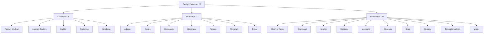
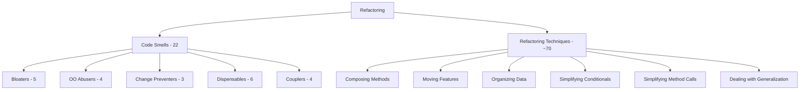

# Refactoring.Guru Roadmap

> **Source:** [refactoring.guru](https://refactoring.guru/) — adapted into a structured, multi-language roadmap with code examples in **Go**, **Java**, and **Python**.

> *"Design patterns are typical solutions to common problems in software design. Each pattern is like a blueprint that you can customize to solve a particular design problem in your code."* — Refactoring.Guru

---

## What This Roadmap Covers

| Section | Topics | Files |
|---|---|---|
| [Design Patterns](01-design-patterns/README.md) | 22 GoF patterns (Creational, Structural, Behavioral) | 176 |
| [Code Smells](02-code-smells/README.md) | 22 smells in 5 categories | 40 |
| [Refactoring Techniques](03-refactoring-techniques/README.md) | ~70 techniques in 6 categories | 48 |

---

## How to Use This Roadmap

Each pattern lives in its own folder containing **8 files**, each targeting a different skill level or learning mode:

| File | Focus | Audience |
|---|---|---|
| `junior.md` | "What is it?" "How to use?" | Just learned the language |
| `middle.md` | "Why?" "When?" Tradeoffs and real-world cases | 1-3 yr experience |
| `senior.md` | "How to optimize?" "How to architect?" | 3-7 yr experience |
| `professional.md` | Under the hood — runtime, memory, performance | 7+ yr / specialist |
| `interview.md` | 50+ Q&A across all levels | Job preparation |
| `tasks.md` | 10+ hands-on exercises with solutions | Practice |
| `find-bug.md` | 10+ buggy code snippets to fix | Critical reading |
| `optimize.md` | 10+ inefficient implementations to optimize | Performance practice |

**Recommended order:** `junior.md` → `middle.md` → `senior.md` → `professional.md` → practice files (`tasks.md` → `find-bug.md` → `optimize.md`) → `interview.md` for review.

---

## Pattern Index

### Creational Patterns (5)
> *"Provide various object creation mechanisms, which increase flexibility and reuse of existing code."*

- [Factory Method](01-design-patterns/01-creational/01-factory-method/junior.md) — Interface for creating objects, subclasses choose the type
- [Abstract Factory](01-design-patterns/01-creational/02-abstract-factory/junior.md) — Produce families of related objects without specifying concrete classes
- [Builder](01-design-patterns/01-creational/03-builder/junior.md) — Construct complex objects step by step
- [Prototype](01-design-patterns/01-creational/04-prototype/junior.md) — Copy existing objects without depending on their classes
- [Singleton](01-design-patterns/01-creational/05-singleton/junior.md) — Ensure a class has only one instance with a global access point

### Structural Patterns (7)
> *"Explain how to assemble objects and classes into larger structures, while keeping these structures flexible and efficient."*

- [Adapter](01-design-patterns/02-structural/01-adapter/junior.md) — Make incompatible interfaces collaborate
- [Bridge](01-design-patterns/02-structural/02-bridge/junior.md) — Split a class into two separate hierarchies (abstraction & implementation)
- [Composite](01-design-patterns/02-structural/03-composite/junior.md) — Compose objects into tree structures, treat them uniformly
- [Decorator](01-design-patterns/02-structural/04-decorator/junior.md) — Attach new behaviors via wrapper objects
- [Facade](01-design-patterns/02-structural/05-facade/junior.md) — Provide a simplified interface to a complex subsystem
- [Flyweight](01-design-patterns/02-structural/06-flyweight/junior.md) — Share common state to fit more objects into RAM
- [Proxy](01-design-patterns/02-structural/07-proxy/junior.md) — Substitute / placeholder controlling access to another object

### Behavioral Patterns (10)
> *"Concerned with algorithms and the assignment of responsibilities between objects."*

- [Chain of Responsibility](01-design-patterns/03-behavioral/01-chain-of-responsibility/junior.md) — Pass a request through a chain of handlers
- [Command](01-design-patterns/03-behavioral/02-command/junior.md) — Turn requests into standalone objects (queue, undo)
- [Iterator](01-design-patterns/03-behavioral/03-iterator/junior.md) — Traverse a collection without exposing its structure
- [Mediator](01-design-patterns/03-behavioral/04-mediator/junior.md) — Centralize object communication to reduce coupling
- [Memento](01-design-patterns/03-behavioral/05-memento/junior.md) — Capture and restore object state without exposing internals
- [Observer](01-design-patterns/03-behavioral/06-observer/junior.md) — Subscribe to and broadcast events
- [State](01-design-patterns/03-behavioral/07-state/junior.md) — Alter behavior when internal state changes
- [Strategy](01-design-patterns/03-behavioral/08-strategy/junior.md) — Interchangeable algorithm families
- [Template Method](01-design-patterns/03-behavioral/09-template-method/junior.md) — Algorithm skeleton in superclass, steps overridable
- [Visitor](01-design-patterns/03-behavioral/10-visitor/junior.md) — Separate algorithms from objects they operate on

---

## Categories at a Glance

---

## Code Smells & Techniques at a Glance

---

## Cross-References: Smell ↔ Technique

Smells and techniques are two sides of the same coin: a smell is a *symptom*, a technique is the *cure*. The two new sections are linked bidirectionally — each smell file lists the techniques that resolve it, and each technique file lists the smells it addresses.

A few high-traffic correspondences:

| Smell | Resolved by |
|---|---|
| Long Method | Extract Method, Replace Method with Method Object, Decompose Conditional |
| Large Class | Extract Class, Extract Subclass, Extract Interface |
| Primitive Obsession | Replace Data Value with Object, Replace Type Code with Class/Subclasses, Introduce Parameter Object |
| Switch Statements | Replace Conditional with Polymorphism, Replace Type Code with State/Strategy |
| Duplicate Code | Extract Method, Pull Up Method, Form Template Method |
| Feature Envy | Move Method, Extract Method |
| Message Chains | Hide Delegate |
| Refused Bequest | Push Down Method/Field, Replace Inheritance with Delegation |

The catalog continues inside each section — every smell page enumerates its full set of resolving techniques, and every technique page enumerates the smells it addresses.

---

## Languages

All code examples in three languages — **Go**, **Java**, **Python** — to highlight idiomatic differences:

- **Go** — package-oriented, composition over inheritance, no classical OOP — patterns look different
- **Java** — classical OOP, the language refactoring.guru itself uses by default — closest to the GoF book
- **Python** — dynamic typing, "duck typing" — many patterns simplify or become unnecessary

Comparing the same pattern across all three is a powerful learning device: it shows what the pattern is **really** about, separated from any specific language's syntax.

---

## Status

### ✅ Design Patterns — COMPLETE (22/22)
- ✅ Creational (5/5) — Factory Method, Abstract Factory, Builder, Prototype, Singleton
- ✅ Structural (7/7) — Adapter, Bridge, Composite, Decorator, Facade, Flyweight, Proxy
- ✅ Behavioral (10/10) — Chain of Responsibility, Command, Iterator, Mediator, Memento, Observer, State, Strategy, Template Method, Visitor

### ✅ Code Smells — COMPLETE (5/5)
- ✅ Bloaters (Long Method, Large Class, Primitive Obsession, Long Parameter List, Data Clumps)
- ✅ OO Abusers (Switch Statements, Temporary Field, Refused Bequest, Alternative Classes)
- ✅ Change Preventers (Divergent Change, Shotgun Surgery, Parallel Inheritance Hierarchies)
- ✅ Dispensables (Comments, Duplicate Code, Lazy Class, Data Class, Dead Code, Speculative Generality)
- ✅ Couplers (Feature Envy, Inappropriate Intimacy, Message Chains, Middle Man)

### ⏳ Refactoring Techniques — PENDING (0/6)
- ⬜ Composing Methods
- ⬜ Moving Features Between Objects
- ⬜ Organizing Data
- ⬜ Simplifying Conditional Expressions
- ⬜ Simplifying Method Calls
- ⬜ Dealing with Generalization

---

## References

- **Source:** [Refactoring.Guru](https://refactoring.guru/)
- **Foundational book:** *Design Patterns: Elements of Reusable Object-Oriented Software* (1994) — Erich Gamma, Richard Helm, Ralph Johnson, John Vlissides ("Gang of Four"/GoF)
- **Modern complement:** *Head First Design Patterns* — Eric Freeman, Elisabeth Robson

---

## Project Context

This roadmap is part of the [Senior Project](../../../README.md) — a personal effort to consolidate the essential knowledge of software engineering in one place.
