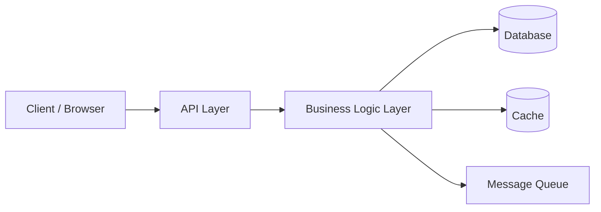
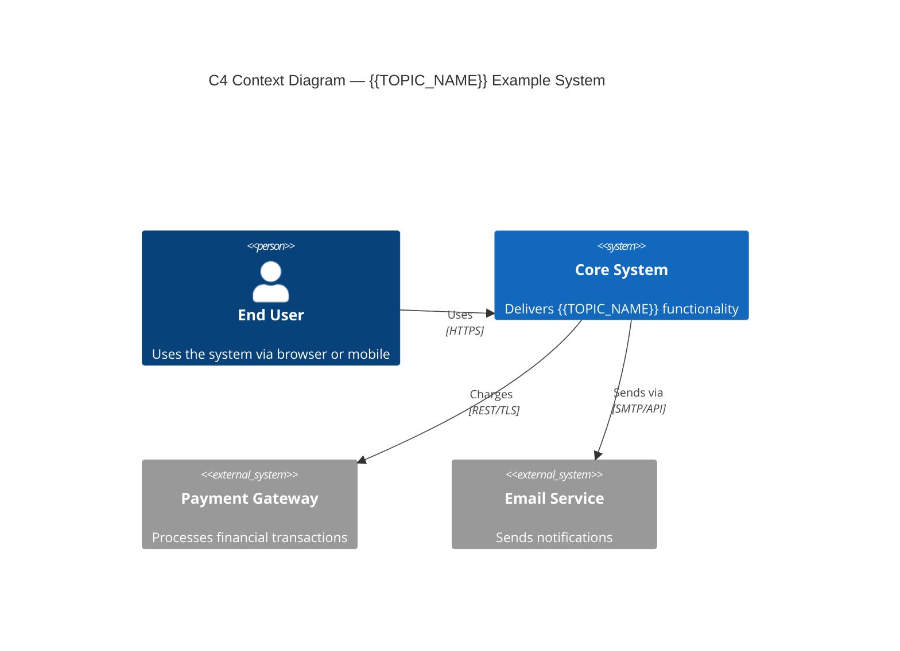
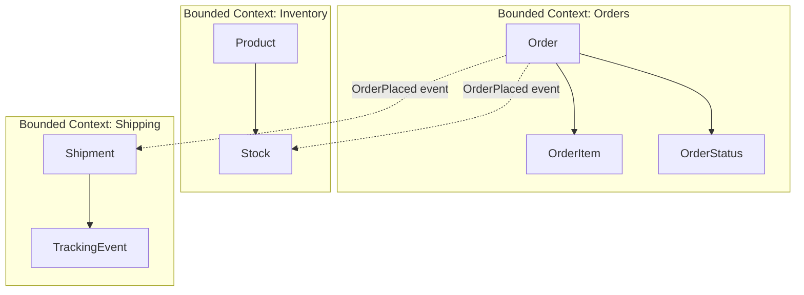
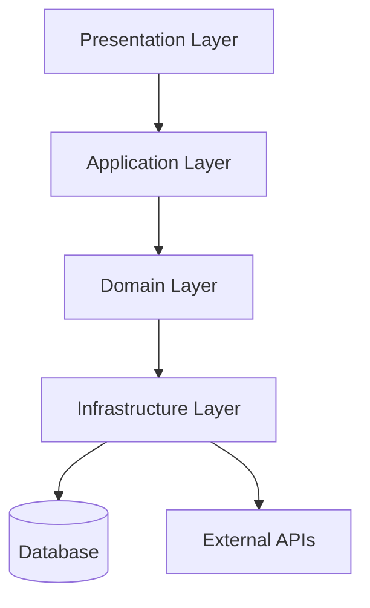
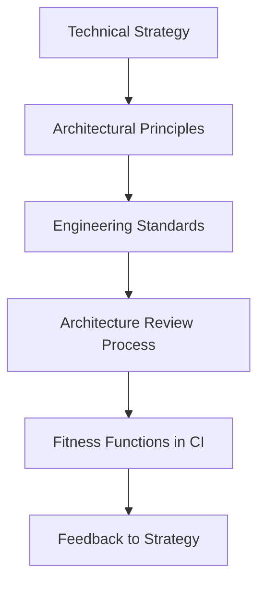
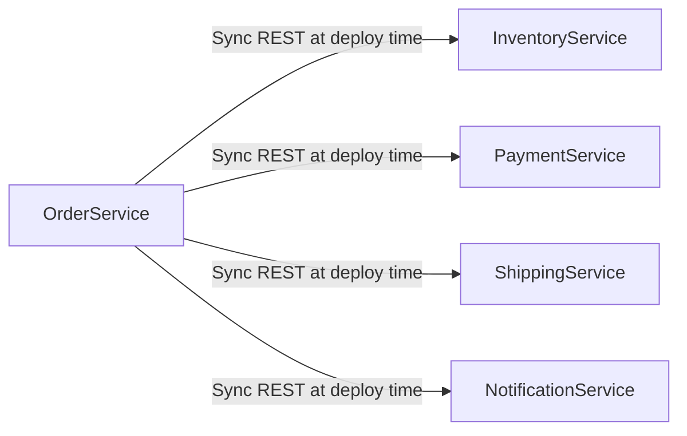
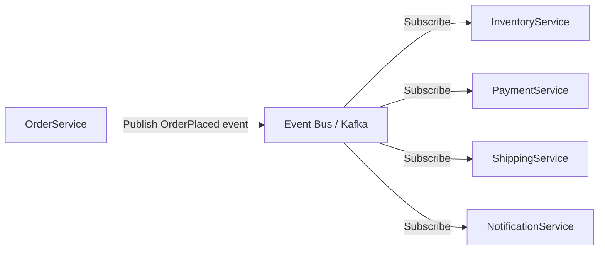

# Software Architect Roadmap — Universal Template

## Overview

| | Description |
|---|---|
| **Purpose** | Universal template for all Software Architect roadmap topics |
| **Files per topic** | 9 files: `junior.md`, `middle.md`, `senior.md`, `professional.md`, `interview.md`, `tasks.md`, `find-bug.md`, `optimize.md`, `specification.md` |
| **Language** | All content must be generated in **English** |

### Topic Structure

```
XX-topic-name/
├── junior.md          ← Component diagrams, key terms, trade-offs
├── middle.md          ← DDD, bounded contexts, layered architecture
├── senior.md          ← Quality attributes, ADRs, evolutionary architecture
├── professional.md    ← Governance, technical strategy, org-level influence
├── interview.md       ← Interview prep across all levels
├── tasks.md           ← Hands-on architecture tasks
├── find-bug.md        ← Find and fix bugs in code (10+ exercises)
├── optimize.md        ← Optimize slow/inefficient code (10+ exercises)
└── specification.md   ← Official spec / documentation deep-dive
```

> Replace `{{TOPIC_NAME}}` with the specific architectural concept being documented.
> Each section below corresponds to one output file in the topic folder.

---

# TEMPLATE 1 — `junior.md`

## {{TOPIC_NAME}} — Junior Level

### What Is It?
Explain `{{TOPIC_NAME}}` to a developer who has built production features but has
not yet thought about system-wide design. Frame it as a decision that affects multiple
teams, not just a single component.

### Core Concept



### Mental Model
- Architecture is about **trade-offs**, not perfect solutions.
- Every architectural decision involves constraints: cost, latency, team size, release speed.
- `{{TOPIC_NAME}}` addresses the trade-off between: _[fill in]_.

### Key Terms
| Term | Definition |
|------|-----------|
| Coupling | The degree to which one component depends on another |
| Cohesion | The degree to which elements within a component belong together |
| Abstraction | Hiding implementation details behind an interface |
| Separation of Concerns | Each component has one clearly defined responsibility |
| ADR | Architecture Decision Record — a document capturing a significant design choice |
| Non-functional requirement | Quality attributes: performance, availability, security, maintainability |

### Comparison with Alternatives
| Pattern | Strength | Weakness | When to Use |
|---------|----------|---------|-------------|
| Monolith | Simple deploy, easy debugging | Scales as one unit, tech lock-in | Small team, early product |
| Microservices | Independent deploy/scale | Operational complexity | Multiple teams, high scale |
| Modular Monolith | Bounded modules, simple ops | Single codebase constraints | Medium-size team, pragmatic |
| Event-driven | Loose coupling, async | Complex ordering, hard to debug | High throughput, audit trails |

### Common Mistakes at This Level
1. Jumping to microservices before the domain is well understood.
2. Treating architecture as a one-time decision rather than an evolving process.
3. Ignoring non-functional requirements until they cause production incidents.
4. Not documenting decisions — future engineers cannot understand why choices were made.

### Hands-On Exercise
For a simple e-commerce checkout service, draw a component diagram. Identify: which
components are likely to change independently, which need to scale together, and which
have the highest coupling risk. Write a one-paragraph justification for how you would
decompose the service.

---

# TEMPLATE 2 — `middle.md`

## {{TOPIC_NAME}} — Middle Level

### Prerequisites
- Has delivered multiple end-to-end features spanning several components.
- Understands REST, basic SQL/NoSQL trade-offs, and synchronous vs asynchronous communication.
- Beginning to participate in architectural discussions and code reviews.

### Deep Dive: {{TOPIC_NAME}}



### Domain-Driven Design Basics



```text
Key DDD Building Blocks:
  Entity       — has identity (e.g., Order with orderId)
  Value Object — no identity; defined by attributes (e.g., Money { amount, currency })
  Aggregate    — consistency boundary; transactions stay within one aggregate
  Repository   — collection-like interface to load/save aggregates
  Domain Event — something meaningful that happened (OrderPlaced, PaymentFailed)
  Bounded Context — explicit boundary where a model is defined and consistent
```

### Layered Architecture



```text
Dependency Rule (Clean Architecture / Onion):
  Inner layers know NOTHING about outer layers.
  Dependencies point inward only.
  Domain layer has zero framework or database dependencies.
```

### Middle Checklist
- [ ] Domain boundaries identified before technology choices are made.
- [ ] Cross-cutting concerns (auth, logging, tracing) addressed at the infrastructure layer.
- [ ] Integration points between bounded contexts communicate via events or anti-corruption layers.
- [ ] Architecture diagrams kept up to date (C4 or equivalent).

---

# TEMPLATE 3 — `senior.md`

## {{TOPIC_NAME}} — Senior Level

### Responsibilities at This Level
- Lead the design of a complete system or major subsystem from requirements to implementation.
- Make and document architectural decisions; influence technology choices.
- Define quality attributes (availability, scalability, security) and design to meet them.
- Review architecture proposals from other engineers and provide structured feedback.

### Quality Attribute Scenarios

```text
Quality Attribute Scenario format (Bass et al., SEI):
  Source     — who triggers the event (user, attacker, another system)
  Stimulus   — what the event is
  Artifact   — the part of the system affected
  Environment — normal operation, high load, degraded state
  Response   — how the system responds
  Measure    — what "correct" looks like (numbers, not vague terms)

Example — Availability:
  Source:      A dependent microservice
  Stimulus:    Becomes unresponsive
  Artifact:    API Gateway + Checkout Service
  Environment: Peak traffic (10,000 req/s)
  Response:    Circuit breaker opens; degraded response returned from cache
  Measure:     99.9% of requests complete in < 500 ms; no cascading failure
```

### Architectural Decision Records

```text
ADR Template:
  # ADR-042: Use event sourcing for the Order aggregate

  Status: Accepted
  Date: 2025-11-01
  Deciders: Alice (Architect), Bob (Lead Eng), Carol (Product)

  ## Context
  Order history must be auditable; we need to replay events to rebuild projections.
  The current CRUD approach cannot reproduce past states.

  ## Decision
  We will use event sourcing for the Order aggregate.
  Events stored in EventStoreDB. Read-side projections in PostgreSQL.

  ## Consequences
  + Full audit trail; event replay for debugging and projection rebuild.
  + Enables CQRS pattern; read/write can scale independently.
  - Increased complexity: eventual consistency for read models.
  - Team must learn event sourcing patterns (training budget allocated).

  ## Alternatives Considered
  - Audit log table: simpler but does not allow full state reconstruction.
  - Change Data Capture (CDC): captures DB changes but not domain intent.
```

### Evolutionary Architecture


```text
Strangler Fig Pattern:
  1. Build new capability in a separate service.
  2. Route traffic for that capability to the new service.
  3. Gradually move remaining functionality out of the old system.
  4. Retire the old system once fully replaced.

  Applied to {{TOPIC_NAME}}: _[fill in migration steps]_
```

### Senior Checklist
- [ ] Quality attribute scenarios written before design begins; reviewed with stakeholders.
- [ ] ADR written for every significant decision; stored in the repo alongside code.
- [ ] Architecture fitness functions defined to detect drift over time.
- [ ] Fallback behavior designed explicitly: every integration point has a graceful degradation path.

---

# TEMPLATE 4 — `professional.md`

## {{TOPIC_NAME}} — Mastery and Leadership Level

### Overview
At the professional level, Software Architecture is a **role and a practice**, not a
technical skill set. This section covers architectural governance, embedding ADR culture
across an organization, setting technical strategy, exerting org-level influence, and
measuring architectural quality. The focus is leadership and systemic thinking, not
internals of any specific technology.

### Architectural Governance



```text
Governance does NOT mean a bottleneck review board.
Effective governance = enabling teams to make good decisions independently.

Instruments of governance:
  1. Architectural Principles — short, memorable rules teams apply daily.
     Example: "Prefer async over sync for cross-service calls."
  2. Reference Architectures — pre-approved patterns teams can use without review.
  3. Tech Radar — categorize technologies: adopt / trial / assess / hold.
  4. ADR culture — decision-making authority pushed to teams; architects consult.
  5. Architecture Review Board (ARB) — only for cross-cutting, high-risk decisions.
```

### ADR Culture at Scale

```text
Embedding ADR culture across 10+ teams:

Phase 1 — Introduction:
  - Template standardized (1 page max, Status / Context / Decision / Consequences).
  - ADRs stored in each team's repo under /docs/adr/.
  - Architects review ADRs as consultants, not approvers.

Phase 2 — Cross-cutting decisions:
  - ADRs that affect multiple services escalated to a shared /architecture/adr/ repo.
  - Monthly architecture guild reviews shared ADRs; decisions are reversible where possible.

Phase 3 — Learning from decisions:
  - Each ADR includes a "Review Date" — schedule to assess if the decision still holds.
  - Superseded ADRs not deleted — linked with "Superseded by ADR-NNN."
  - Metrics from fitness functions referenced to confirm or challenge assumptions.
```

### Technical Strategy


```text
Technical Strategy Document outline:
  1. Where are we today? (honest assessment: strengths, debt, risks)
  2. Where do we need to be in 12–18 months? (tied to product/business goals)
  3. What are our highest-leverage investments?
     - Build vs Buy vs Open Source decisions
     - Platform investments (developer experience, CI/CD, observability)
     - Architectural migrations (e.g., modularize the monolith)
  4. What will we NOT do? (explicit de-prioritization is as important as prioritization)
  5. How will we know we are succeeding? (measurable outcomes, not outputs)
```

### Org-Level Influence

```text
Influence without authority — the architect's core skill:

1. Technical credibility: stay current; write code; be accurate when you speak.

2. Strategic framing: connect technical decisions to business outcomes.
   Not: "We need to refactor the authentication module."
   Yes: "Fragile auth is costing 2 incidents/month; refactoring reduces on-call burden
        and is a prerequisite for the SSO feature the enterprise sales team needs."

3. Sponsorship mapping: identify who has budget and approval power; help them
   understand the cost of inaction (not just the cost of action).

4. Building a guild/community of practice:
   - Regular architecture reviews (open to all engineers, not just seniors).
   - Shared reading list; discussion of patterns and trade-offs.
   - Rotate "architecture champion" role within teams.

5. Written communication: architects who write clearly win debates they are not
   present for. Every significant decision should have a written record.
```

### Measuring Architectural Quality

```text
Fitness Functions (from Building Evolutionary Architectures — Ford et al.):
  Definition: a metric or test that objectively measures an architectural characteristic.

  Examples:
    Coupling:     "No service may import code from another service's internal package."
                  → Enforced by ArchUnit / Dependency Cruiser in CI.

    Performance:  "P99 API response time < 200 ms under 1,000 req/s load."
                  → k6 / Gatling test in nightly pipeline.

    Security:     "No dependency with a CVSS score > 7.0 in production."
                  → Snyk / Trivy in every PR.

    Modularity:   "Cyclomatic complexity per module < 10."
                  → SonarQube quality gate.

    Test coverage: "Domain layer coverage > 90%."
                  → Coverage gate in CI; does not count infrastructure adapters.

    Deployability: "Any service can be deployed independently in < 10 minutes."
                  → Measured in deployment pipeline metrics dashboard.
```

---

# TEMPLATE 5 — `interview.md`

## {{TOPIC_NAME}} — Interview Questions

### Junior Interview Questions

**Q1: What is the difference between coupling and cohesion?**
> Coupling measures how dependent components are on each other (lower is better).
> Cohesion measures how well the responsibilities within a component belong together
> (higher is better). The goal is low coupling and high cohesion.

**Q2: What is an Architecture Decision Record (ADR)?**
> A short document that captures a significant architectural decision, its context,
> the decision made, and its consequences. ADRs create institutional memory —
> they explain the "why" behind a decision to future engineers.

**Q3: What is the difference between a monolith and microservices?**
> A monolith deploys as a single unit; all modules run in the same process. Microservices
> split into independently deployable services communicating over a network. Monoliths
> are simpler to operate; microservices allow independent scaling and team autonomy at
> the cost of distributed systems complexity.

---

### Middle Interview Questions

**Q4: What are non-functional requirements? Give three examples.**
> Quality attributes that describe how a system behaves rather than what it does.
> Examples: availability (99.9% uptime SLA), latency (P99 < 200 ms), and
> maintainability (new developer productive within 1 week).

**Q5: Explain the Strangler Fig pattern.**
> A migration strategy: new functionality is built in a new system while the old
> system is kept running. Traffic is gradually routed to the new system until the
> old one is fully replaced and can be retired. The old system is "strangled" over time.

---

### Senior Interview Questions

**Q6: How do you decide when to extract a microservice from a monolith?**
> Signals: the module has an independent deployment cadence, it needs to scale
> differently from the rest of the system, it is owned by a separate team, or it
> has a clearly defined domain boundary. Counter-signals: the domain is still evolving
> rapidly (high cost of premature decomposition), the team is small, or the
> operational maturity to run distributed systems is not yet in place.

**Q7: What is an architectural fitness function and why is it valuable?**
> A fitness function is an automated test or metric that verifies an architectural
> characteristic continuously. It is valuable because it prevents architectural drift:
> teams can make changes confidently knowing that if a fitness function fails in CI,
> an architectural property has been violated.

---

### Professional / Deep-Dive Questions

**Q8: How would you introduce an ADR culture into an organization that currently has no documentation practice?**
> Start small: introduce ADR for the next three significant decisions; make it a 1-page
> max template to reduce friction. Demonstrate value by writing an ADR for a past
> decision that caused confusion. Build momentum by praising teams that write ADRs in
> architecture reviews. Avoid making ADRs a gate or approval requirement early on —
> adoption is more important than compliance.

**Q9: How do you measure the quality of an architecture over time?**
> Define fitness functions for key quality attributes (coupling, performance, security,
> deployability). Run them in CI and trend the metrics over time. Supplement with
> quarterly architecture reviews using DORA metrics (deployment frequency, change
> failure rate, MTTR) as proxies for system health and team productivity.

---

# TEMPLATE 6 — `tasks.md`

## {{TOPIC_NAME}} — Practical Tasks

### Task 1 — Junior: Draw a System Context Diagram
**Goal**: Produce a C4 Context diagram for a given system description.

**Requirements**:
- Identify: the system being built, the users who interact with it, and all external systems.
- Use the C4 Context level (users and external systems only, no internals).
- Write one paragraph explaining the key integration dependencies and their protocols.

**Acceptance Criteria**:
- [ ] All actors and external systems identified.
- [ ] Communication protocols labeled on each relationship.
- [ ] Diagram understandable by a non-technical product stakeholder.

---

### Task 2 — Middle: Write Three ADRs
**Goal**: Document three real or hypothetical architectural decisions using the ADR format.

**Requirements**:
- ADR 1: choice of event-driven vs synchronous communication between two services.
- ADR 2: choice of database (relational vs document) for a specific use case.
- ADR 3: choice of deployment model (containers vs serverless) for a new service.
- Each ADR must include: Context, Decision, Consequences (positive and negative), and Alternatives Considered.

**Acceptance Criteria**:
- [ ] Each ADR is < 1 page and understandable without context from the author.
- [ ] Consequences list real trade-offs, not just positives.
- [ ] Alternative options are genuinely considered (not strawmen).

---

### Task 3 — Senior: Architecture Review of an Existing System
**Goal**: Conduct a structured architecture review of a provided system diagram.

**Requirements**:
- Identify: SPOFs, tight coupling hotspots, missing non-functional requirements.
- Write quality attribute scenarios for availability and performance.
- Propose one architectural change to reduce the highest-risk coupling.
- Define two fitness functions to monitor the proposed change.

**Acceptance Criteria**:
- [ ] At least 3 concrete risks identified with evidence from the diagram.
- [ ] Quality attribute scenarios follow the Bass et al. format (Source/Stimulus/Artifact/Response/Measure).
- [ ] Fitness functions are automatable (not manual checks).

---

### Task 4 — Professional: Technical Strategy Document
**Goal**: Write a 12-month technical strategy for a fictional 50-person engineering organization.

**Requirements**:
- Current state assessment (pick 3 realistic strengths and 3 weaknesses).
- 3 strategic initiatives with measurable outcomes.
- Tech Radar entries: at least 2 "adopt", 2 "hold", 1 "trial".
- Governance model: describe how architectural decisions will be made and documented.
- Success metrics: 3 fitness functions tied to the strategic initiatives.

**Acceptance Criteria**:
- [ ] Strategy is tied to business outcomes, not just technology for its own sake.
- [ ] "What we will NOT do" section present and justified.
- [ ] Success metrics are measurable and have a target date.

---

# TEMPLATE 7 — `find-bug.md`

## {{TOPIC_NAME}} — Find the Bug

### Bug 1: Distributed Monolith (Anti-pattern)



```text
ARCHITECTURAL BUG:

The system was decomposed into 5 "microservices" but:
  1. OrderService makes synchronous blocking calls to ALL other services
     for every order placement.
  2. If ANY downstream service is slow or unavailable, orders fail.
  3. All services must be deployed in a coordinated release — changing
     the OrderPlaced payload requires updating all 4 downstream services simultaneously.
  4. No independent deployability: the system behaves like a monolith but pays
     the full operational cost of distributed systems.

This is a DISTRIBUTED MONOLITH — the worst of both worlds.
```

**Fix:**


```text
Correct pattern: event-driven communication.
  - OrderService publishes an OrderPlaced event and returns immediately.
  - Each downstream service subscribes independently.
  - A downstream service being unavailable does not block order placement.
  - Each service can be deployed independently.
  - Payload changes require a versioning strategy, not a coordinated release.
```

---

### Bug 2: Missing API Contract

```text
ARCHITECTURAL BUG:

Service A calls Service B's internal database table directly:
  Service A: SELECT * FROM service_b.users WHERE created_at > ?

Problems:
  1. Service B cannot change its schema without breaking Service A.
  2. Service B has no way to enforce access control on its data.
  3. There is no API contract — no versioning, no documentation.
  4. This is schema coupling — the tightest possible coupling between services.
  5. Any query optimization in Service B (adding/removing columns, renaming tables)
     is blocked because Service A depends on the physical schema.
```

**Fix:**
```text
Enforce an explicit API contract:
  - Service B exposes an API endpoint: GET /api/users?since={timestamp}
  - Service A calls the API, not the database.
  - Service B controls the response shape; schema changes are internal.
  - API is versioned: /v1/users — breaking changes go to /v2/users with a migration period.
  - Fitness function: "No service connects to another service's database."
    Enforced by network policy (database port not accessible cross-service) + ArchUnit test.
```

---

# TEMPLATE 8 — `optimize.md`

## {{TOPIC_NAME}} — Optimization Guide

### Optimization 1: Reduce Coupling

**Measurement**: Count afferent (Ca) and efferent (Ce) couplings per module.
Calculate instability: I = Ce / (Ca + Ce). Target: I < 0.5 for stable core modules.

```mermaid
graph TD
    subgraph Before — High Coupling
        A --> B
        A --> C
        A --> D
        B --> C
        B --> D
        C --> D
    end

    subgraph After — Hub Introduced
        A2[A] --> Hub[Event Bus / Interface]
        B2[B] --> Hub
        C2[C] --> Hub
        D2[D] --> Hub
    end
```

```text
Techniques to reduce coupling:
  1. Introduce an interface / abstraction layer — components depend on the contract,
     not the implementation.
  2. Replace synchronous calls with events — producer does not know consumers.
  3. Apply the Dependency Inversion Principle — high-level modules depend on
     abstractions; low-level modules implement them.
  4. Use anti-corruption layers between bounded contexts — translate models at the boundary.
```

---

### Optimization 2: Improve Cohesion

```text
Low cohesion signal: a module has many unrelated responsibilities.

Example:
  UserService: handles registration, authentication, email sending,
               profile pictures, billing, and notifications.
  → Any change touches this module; test suite is large and slow.

Refactored:
  AuthService:    registration, login, token management
  ProfileService: user profile data, avatars
  BillingService: subscription, invoicing
  NotificationService: email, SMS, push

Each service now has ONE reason to change.
Measure: module size (lines of code), number of change reasons per quarter.
```

---

### Optimization 3: Eliminate Single Points of Failure

```mermaid
graph LR
    subgraph Before — SPOF
        Client --> LB[Single Load Balancer]
        LB --> App[Single App Instance]
        App --> DB[(Single DB)]
    end

    subgraph After — No SPOF
        Client2[Client] --> LB1[LB 1]
        Client2 --> LB2[LB 2]
        LB1 --> App1[App Instance 1]
        LB1 --> App2[App Instance 2]
        LB2 --> App1
        LB2 --> App2
        App1 --> Primary[(Primary DB)]
        App2 --> Primary
        Primary -->|Replication| Replica[(Replica DB)]
    end
```

```text
SPOF elimination checklist:
  [ ] Load balancers: at least 2 in different availability zones
  [ ] Application: minimum 2 instances; auto-scaling configured
  [ ] Database: primary + read replica; automated failover tested quarterly
  [ ] Message queue: replication factor >= 3 (Kafka) or Multi-AZ (SQS)
  [ ] DNS: TTL short enough (< 60 s) for failover to propagate
  [ ] External API dependencies: circuit breaker + fallback response for each
```

### Optimization Summary Table
| Architectural Problem | Technique | Fitness Function |
|----------------------|-----------|-----------------|
| High coupling | Event-driven communication | Afferent coupling < threshold |
| Low cohesion | Domain decomposition | Module LoC < 1,000 |
| SPOF | Redundancy + auto-failover | MTTR < 5 min |
| Distributed monolith | Async events, API contracts | Deploy frequency per service |
| Missing governance | ADR culture + Tech Radar | ADR count per quarter |
| Undocumented decisions | Mandatory ADRs for major decisions | ADR coverage metric |
---
---

# TEMPLATE 9 — `specification.md`

> **Focus:** Official documentation deep-dive — API reference, configuration schema, behavioral guarantees, and version compatibility.
>
> **Source:** Always cite the official documentation with direct section links.
> - Blockchain: https://bitcoin.org/bitcoin.pdf | https://ethereum.org/en/whitepaper/
> - Software Design/Architecture: https://refactoring.guru/design-patterns
> - Computer Science: https://en.wikipedia.org/wiki/List_of_data_structures
> - Software Architect: https://www.oreilly.com/library/view/fundamentals-of-software/9781492043447/
> - System Design: https://github.com/donnemartin/system-design-primer
> - MongoDB: https://www.mongodb.com/docs/manual/reference/
> - PostgreSQL: https://www.postgresql.org/docs/current/
> - API Design: https://swagger.io/specification/ (OpenAPI 3.x)
> - Backend: https://developer.mozilla.org/en-US/docs/Learn/Server-side
> - Elasticsearch: https://www.elastic.co/guide/en/elasticsearch/reference/current/
> - Redis: https://redis.io/docs/latest/commands/
> - Full-Stack: https://developer.mozilla.org/en-US/

<details open>
<summary><strong>Template Content</strong></summary>

# {{TOPIC_NAME}} — Specification

> **Official Documentation Reference**
>
> Source: [{{TOOL_NAME}} Official Docs]({{DOCS_URL}}) — {{SECTION}}

---

## Table of Contents

1. [Docs Reference](#docs-reference)
2. [API / Configuration Reference](#api--configuration-reference)
3. [Core Concepts & Rules](#core-concepts--rules)
4. [Schema / Options Reference](#schema--options-reference)
5. [Behavioral Specification](#behavioral-specification)
6. [Edge Cases from Official Docs](#edge-cases-from-official-docs)
7. [Version & Compatibility Matrix](#version--compatibility-matrix)
8. [Official Examples](#official-examples)
9. [Compliance Checklist](#compliance-checklist)
10. [Related Documentation](#related-documentation)

---

## 1. Docs Reference

| Property | Value |
|----------|-------|
| **Official Docs** | [{{TOOL_NAME}} Documentation]({{DOCS_URL}}) |
| **Relevant Section** | {{SECTION_NAME}} — {{SECTION_TITLE}} |
| **Version** | {{TOOL_VERSION}} |
| **Direct URL** | {{DOCS_URL}}/{{PATH}} |

---

## 2. API / Configuration Reference

> From: {{DOCS_URL}}/{{API_SECTION}}

### {{RESOURCE_OR_ENDPOINT_NAME}}

| Field / Parameter | Type | Required | Default | Description |
|------------------|------|----------|---------|-------------|
| `{{FIELD_1}}` | `{{TYPE_1}}` | ✅ | — | {{DESC_1}} |
| `{{FIELD_2}}` | `{{TYPE_2}}` | ❌ | `{{DEFAULT_2}}` | {{DESC_2}} |
| `{{FIELD_3}}` | `{{TYPE_3}}` | ❌ | `{{DEFAULT_3}}` | {{DESC_3}} |

---

## 3. Core Concepts & Rules

The official documentation defines these key rules for {{TOPIC_NAME}}:

### Rule 1: {{RULE_NAME}}

> *Docs: [{{DOCS_URL}}/{{SECTION}}]({{DOCS_URL}}/{{SECTION}}) — "{{DOC_QUOTE}}"*

{{RULE_EXPLANATION}}

```{{CODE_LANG}}
# ✅ Correct — follows official guidance
{{VALID_EXAMPLE}}

# ❌ Incorrect — violates official guidance
{{INVALID_EXAMPLE}}
```

### Rule 2: {{RULE_NAME}}

> *Docs: [{{DOCS_URL}}/{{SECTION}}]({{DOCS_URL}}/{{SECTION}})*

{{RULE_EXPLANATION}}

```{{CODE_LANG}}
{{CODE_EXAMPLE}}
```

---

## 4. Schema / Options Reference

| Option | Type | Allowed Values | Default | Docs |
|--------|------|---------------|---------|------|
| `{{OPT_1}}` | `{{TYPE_1}}` | `{{VALUES_1}}` | `{{DEFAULT_1}}` | [Link]({{URL_1}}) |
| `{{OPT_2}}` | `{{TYPE_2}}` | `{{VALUES_2}}` | `{{DEFAULT_2}}` | [Link]({{URL_2}}) |
| `{{OPT_3}}` | `{{TYPE_3}}` | `{{VALUES_3}}` | `{{DEFAULT_3}}` | [Link]({{URL_3}}) |

---

## 5. Behavioral Specification

### Normal Operation

{{NORMAL_OPERATION}}

### Performance Characteristics

| Operation | Time Complexity | Space | Notes |
|-----------|----------------|-------|-------|
| {{OP_1}} | {{TIME_1}} | {{SPACE_1}} | {{NOTES_1}} |
| {{OP_2}} | {{TIME_2}} | {{SPACE_2}} | {{NOTES_2}} |

### Error / Failure Conditions

| Error | Condition | Official Resolution |
|-------|-----------|---------------------|
| `{{ERROR_1}}` | {{COND_1}} | {{FIX_1}} |
| `{{ERROR_2}}` | {{COND_2}} | {{FIX_2}} |

---

## 6. Edge Cases from Official Docs

| Edge Case | Official Behavior | Reference |
|-----------|-------------------|-----------|
| {{EDGE_1}} | {{BEHAVIOR_1}} | [Docs]({{URL_1}}) |
| {{EDGE_2}} | {{BEHAVIOR_2}} | [Docs]({{URL_2}}) |
| {{EDGE_3}} | {{BEHAVIOR_3}} | [Docs]({{URL_3}}) |

---

## 7. Version & Compatibility Matrix

| Version | Change | Backward Compatible? | Notes |
|---------|--------|---------------------|-------|
| `{{VER_1}}` | {{CHANGE_1}} | {{COMPAT_1}} | {{NOTES_1}} |
| `{{VER_2}}` | {{CHANGE_2}} | {{COMPAT_2}} | {{NOTES_2}} |

---

## 8. Official Examples

### Example from Docs: {{EXAMPLE_TITLE}}

> Source: [{{DOCS_URL}}/{{ANCHOR}}]({{DOCS_URL}}/{{ANCHOR}})

```{{CODE_LANG}}
{{OFFICIAL_EXAMPLE_CODE}}
```

**Expected result:**

```
{{EXPECTED_RESULT}}
```

---

## 9. Compliance Checklist

- [ ] Follows official recommended patterns for {{TOPIC_NAME}}
- [ ] Uses supported version ({{TOOL_VERSION}}+)
- [ ] Handles all documented error conditions
- [ ] Follows official security recommendations
- [ ] Compatible with listed dependencies
- [ ] Configuration validated against official schema

---

## 10. Related Documentation

| Topic | Doc Section | URL |
|-------|-------------|-----|
| {{RELATED_1}} | {{SECTION_1}} | [Link]({{URL_1}}) |
| {{RELATED_2}} | {{SECTION_2}} | [Link]({{URL_2}}) |
| {{RELATED_3}} | {{SECTION_3}} | [Link]({{URL_3}}) |

---

> **Content Rules for `specification.md`:**
> - Always link directly to the relevant doc section (not just the homepage)
> - Use official examples from the documentation when available
> - Note breaking changes and deprecated features between versions
> - Include official security recommendations
> - Minimum 2 Core Rules, 3 Schema fields, 3 Edge Cases, 2 Official Examples

</details>
