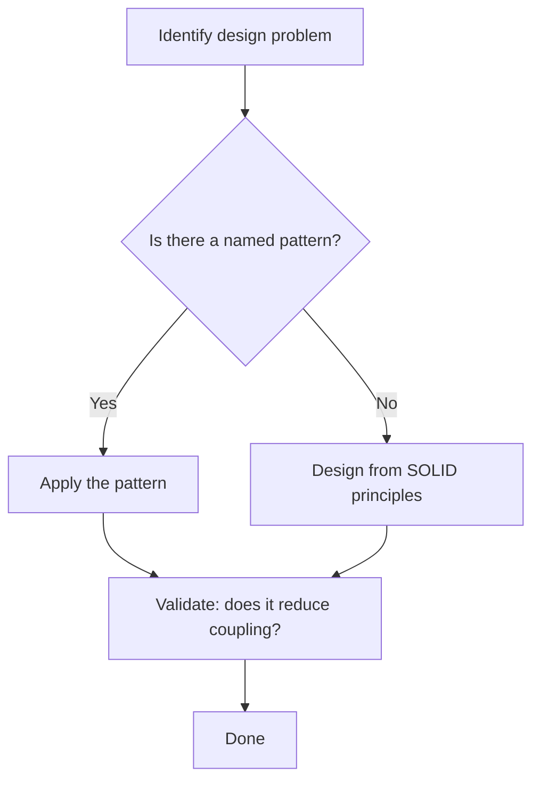
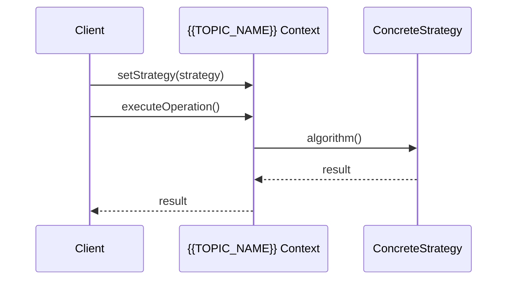
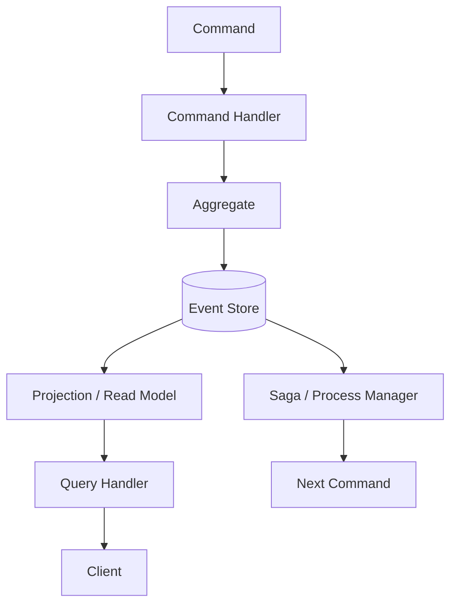
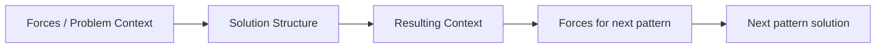
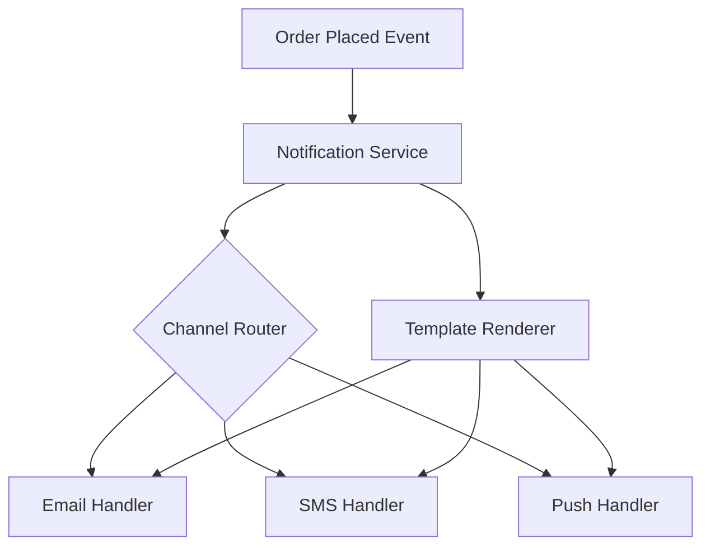
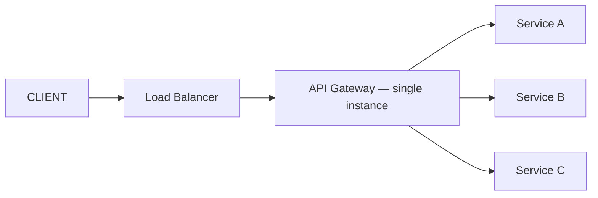
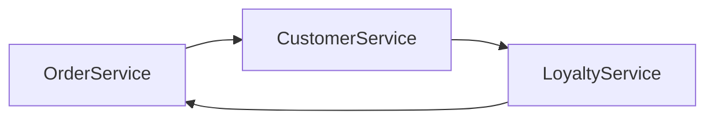

# Software Design & Architecture Roadmap — Universal Template

> Guides content generation for **Software Design & Architecture** topics.
> Primary code fences: ` ```mermaid ` for diagrams, ` ```text ` for pseudocode/patterns

## Overview

| | Description |
|---|---|
| **Purpose** | Universal template for all Software Design & Architecture roadmap topics |
| **Files per topic** | 8 files: `junior.md`, `middle.md`, `senior.md`, `professional.md`, `interview.md`, `tasks.md`, `find-bug.md`, `optimize.md` |
| **Language** | All content must be generated in **English** |
| **Table of Contents** | Optional — include only if relevant to the topic. For practice files (`tasks.md`, `find-bug.md`, `optimize.md`) it is NOT required |

### Topic Structure

```
XX-topic-name/
├── junior.md          ← "What is this pattern/principle?" and "How do I recognize it?"
├── middle.md          ← "Why this pattern?" and "When do I choose it over alternatives?"
├── senior.md          ← "How to architect at scale?" and "When do patterns break down?"
├── professional.md    ← Formal theory — proofs, formal models, pattern language
├── interview.md       ← Interview prep across all levels
├── tasks.md           ← Hands-on design tasks
├── find-bug.md        ← Find design flaws (10+ exercises)
└── optimize.md        ← Improve slow/brittle designs using metrics
```

---

## Level Comparison Matrix

| Aspect | Junior | Middle | Senior | Professional |
|:------:|:------:|:------:|:------:|:------------:|
| **Depth** | Pattern vocabulary, SOLID basics | Trade-off analysis, pattern selection | DDD, event sourcing, CQRS, capacity | Formal proofs, DDD models, verification |
| **Design Examples** | Simple class diagrams, single pattern | Multi-pattern composition, refactoring | Distributed design, bounded contexts | Formal specification, pattern algebra |
| **Tricky Points** | Overusing patterns, misidentifying SOLID | Coupling vs. cohesion, abstraction leaks | Consistency, eventual consistency in DDD | Liskov substitution proof, DI container math |
| **Focus** | "What?" and "How?" | "Why?" and "When?" | "How to scale?" | "What are the formal guarantees?" |

---

---

# TEMPLATE 1 — `junior.md`

<details open>
<summary><strong>Template Content</strong></summary>

# {{TOPIC_NAME}} — Junior Level

## Table of Contents

1. [Introduction](#introduction)
2. [Prerequisites](#prerequisites)
3. [Glossary](#glossary)
4. [Core Concepts](#core-concepts)
5. [Real-World Analogies](#real-world-analogies)
6. [Mental Models](#mental-models)
7. [Pros & Cons](#pros--cons)
8. [Use Cases](#use-cases)
9. [Design Examples / Pseudocode](#design-examples--pseudocode)
10. [Failure Mode Design](#failure-mode-design)
11. [Security Considerations](#security-considerations)
12. [Capacity Planning and Scalability](#capacity-planning-and-scalability)
13. [Best Practices](#best-practices)
14. [Edge Cases & Pitfalls](#edge-cases--pitfalls)
15. [Common Mistakes](#common-mistakes)
16. [Tricky Points](#tricky-points)
17. [Test](#test)
18. [Tricky Questions](#tricky-questions)
19. [Cheat Sheet](#cheat-sheet)
20. [Summary](#summary)
21. [What You Can Build](#what-you-can-build)
22. [Further Reading](#further-reading)
23. [Related Topics](#related-topics)
24. [Diagrams & Visual Aids](#diagrams--visual-aids)

---

## Introduction

> Focus: "What is this pattern or principle?" and "How do I recognize it in code?"

Briefly explain what {{TOPIC_NAME}} is and why a junior developer needs to understand it.
Assume the reader can write basic object-oriented code but has not yet studied design patterns or architecture principles.

---

## Prerequisites

- **Required:** Object-oriented programming basics — needed to understand class relationships
- **Required:** Basic UML class diagram reading — patterns are described visually
- **Helpful:** Familiarity with at least one typed language (Java, C#, TypeScript, Go)

> List 2–4 prerequisites. Link to related roadmap topics where available.

---

## Glossary

| Term | Definition |
|------|-----------|
| **{{Term 1}}** | Simple, one-sentence definition |
| **{{Term 2}}** | Simple, one-sentence definition |
| **Pattern** | A named, reusable solution to a commonly occurring design problem |
| **SOLID** | Five principles (Single Responsibility, Open/Closed, Liskov, Interface Segregation, Dependency Inversion) that guide object-oriented design |
| **Coupling** | The degree to which one module depends on another |
| **Cohesion** | How closely related the responsibilities of a single module are |

> 5–10 terms. Keep definitions beginner-friendly.

---

## Core Concepts

### Concept 1: {{name}}

Simple explanation with analogy if helpful. Limit to 3–5 sentences.

### Concept 2: SOLID Principle — {{specific principle}}

Explain the principle in plain English. Show what violates it and what satisfies it.

### Concept 3: Design Pattern Category — {{Creational / Structural / Behavioral}}

Explain why patterns are grouped this way and what problem category {{TOPIC_NAME}} falls under.

> Each concept: 3–5 sentences max, bullet points for lists, inline pseudocode where needed.

---

## Real-World Analogies

| Concept | Analogy |
|---------|--------|
| **{{Concept 1}}** | {{Everyday analogy — e.g., "The Facade pattern is like a hotel concierge: one person who coordinates many complex services behind the scenes"}} |
| **{{Concept 2}}** | {{Analogy}} |
| **Single Responsibility** | A chef who only cooks — billing and seating are handled by others |
| **Open/Closed** | A power strip: you add devices by plugging in, not by rewiring the strip |

> 2–4 analogies. Note where the analogy breaks down.

---

## Mental Models

**The intuition:** {{A simple mental model — e.g., "Think of design patterns as vocabulary: they let you say 'use a Strategy here' instead of explaining 50 lines of code."}}

**Why this model helps:** {{Why visualizing it this way prevents common mistakes — e.g., stops juniors from inventing ad-hoc solutions that already have a name and a better form.}}

---

## Pros & Cons

| Pros | Cons |
|------|------|
| {{Advantage 1 — e.g., improves code readability}} | {{Disadvantage 1 — e.g., adds indirection that can confuse newcomers}} |
| {{Advantage 2}} | {{Disadvantage 2}} |
| {{Advantage 3}} | {{Disadvantage 3}} |

### When to use:
- {{Scenario where this pattern or principle clearly applies}}

### When NOT to use:
- {{Scenario where simpler code is better — avoid over-engineering}}

---

## Use Cases

- {{Real-world scenario 1 — e.g., "Factory pattern when object creation logic is complex or varies by configuration"}}
- {{Real-world scenario 2}}
- {{Real-world scenario 3}}

---

## Design Examples / Pseudocode

### Example 1: {{Basic application of the pattern}}

```text
// {{TOPIC_NAME}} — minimal example

interface Shape {
    area(): float
}

class Circle implements Shape {
    radius: float
    area(): float -> return PI * radius^2
}

class Square implements Shape {
    side: float
    area(): float -> return side^2
}

// Client depends on abstraction, not concrete type
function printArea(shape: Shape) {
    print(shape.area())
}
```

### Example 2: Mermaid Class Diagram

```mermaid
classDiagram
    class {{AbstractComponent}} {
        <<interface>>
        +operation() result
    }
    class {{ConcreteA}} {
        +operation() result
    }
    class {{ConcreteB}} {
        +operation() result
    }
    class Client {
        -component: AbstractComponent
        +execute()
    }
    AbstractComponent <|.. ConcreteA
    AbstractComponent <|.. ConcreteB
    Client --> AbstractComponent
```

> Keep examples minimal. Show only what is needed to illustrate the pattern.

---

## Failure Mode Design

> In architecture, "error handling" means designing for failure up front, not adding try-catch later.

- **What happens when {{TOPIC_NAME}} is applied incorrectly?**
  - Example: Applying Singleton everywhere causes hidden global state and untestable code
- **What happens when the pattern is missing?**
  - Example: Without Dependency Inversion, changing a database library requires touching every service class
- **Recovery strategy:** {{How to refactor code that broke this principle}}

---

## Security Considerations

- {{Security implication 1 — e.g., Singleton holding mutable shared state is a race condition risk in concurrent systems}}
- {{Security implication 2 — e.g., exposing internal object graph through a public Builder can leak implementation details}}

---

## Capacity Planning and Scalability

> At the junior level this is about code-level scalability, not infrastructure.

- Does this pattern add memory overhead? (e.g., Flyweight reduces object count; Decorator chains add stack depth)
- Does this pattern affect testability and therefore CI speed?

---

## Best Practices

- {{Best practice 1 — e.g., "Name your classes after the pattern when the pattern adds clarity: UserRepository, not UserManager"}}
- {{Best practice 2}}
- {{Best practice 3}}

---

## Edge Cases & Pitfalls

- {{Edge case 1 — e.g., Abstract Factory becomes unwieldy when the product family grows beyond 3–4 types}}
- {{Edge case 2}}

---

## Common Mistakes

| Mistake | Why It Happens | Fix |
|---------|---------------|-----|
| {{Mistake 1}} | {{Root cause}} | {{Correction}} |
| Applying a pattern because it sounds sophisticated | Cargo-culting without understanding the problem it solves | Start with the simplest design; add patterns only when a real pain point appears |
| Violating SRP by adding utility methods to domain classes | Convenience | Move utility logic to a dedicated helper or service class |

---

## Tricky Points

- {{Tricky point 1 — e.g., The difference between Strategy and State is subtle: State transitions itself; Strategy is swapped by the client}}
- {{Tricky point 2}}

---

## Test

Quick self-check questions (answer before looking at the cheat sheet):

1. What problem does {{TOPIC_NAME}} solve?
2. Draw the class diagram for {{TOPIC_NAME}} from memory.
3. Name one SOLID principle that {{TOPIC_NAME}} enforces and one it does not affect.
4. What is the main trade-off of using {{TOPIC_NAME}}?

---

## Tricky Questions

1. {{Q: "Can you use {{TOPIC_NAME}} together with {{Related Pattern}}? What breaks?"}}
2. {{Q: "Does {{TOPIC_NAME}} violate the Open/Closed Principle? Defend your answer."}}

---

## Cheat Sheet

```text
{{TOPIC_NAME}} — one-line summary

Structure:   [Diagram in words — e.g., Context → Strategy interface ← ConcreteStrategyA / ConcreteStrategyB]
Intent:      {{One sentence}}
Applicable:  {{When to reach for it}}
Avoid when:  {{When simpler code wins}}
SOLID link:  {{Which principle(s) this directly supports}}
```

---

## Summary

{{TOPIC_NAME}} is {{one-paragraph recap}}. At the junior level the most important things to remember are: {{2–3 bullet points}}.

---

## What You Can Build

- {{Project idea 1 — e.g., a shape renderer that uses the Strategy pattern to switch between SVG and Canvas output}}
- {{Project idea 2}}

---

## Further Reading

- *Design Patterns: Elements of Reusable Object-Oriented Software* — Gamma et al. (GoF)
- *Head First Design Patterns* — Freeman & Robson (beginner-friendly)
- {{Link or book relevant to {{TOPIC_NAME}} specifically}}

---

## Related Topics

- {{Related pattern or principle 1}}
- {{Related pattern or principle 2}}
- SOLID Principles overview

---

## Diagrams & Visual Aids



</details>

---

---

# TEMPLATE 2 — `middle.md`

<details open>
<summary><strong>Template Content</strong></summary>

# {{TOPIC_NAME}} — Middle Level

## Table of Contents

1. [Introduction](#introduction)
2. [Prerequisites](#prerequisites)
3. [Pattern Selection Trade-offs](#pattern-selection-trade-offs)
4. [Core Concepts — Deeper Dive](#core-concepts--deeper-dive)
5. [Comparison with Alternative Architectural Patterns](#comparison-with-alternative-architectural-patterns)
6. [Design Examples / Pseudocode](#design-examples--pseudocode)
7. [Failure Mode Design](#failure-mode-design)
8. [Capacity Planning and Scalability](#capacity-planning-and-scalability)
9. [Refactoring Paths](#refactoring-paths)
10. [Best Practices](#best-practices)
11. [Common Mistakes](#common-mistakes)
12. [Tricky Points](#tricky-points)
13. [Diagrams & Visual Aids](#diagrams--visual-aids)
14. [Cheat Sheet](#cheat-sheet)
15. [Summary](#summary)
16. [Further Reading](#further-reading)

---

## Introduction

> Focus: "Why this pattern?" and "When do I choose it over alternatives?"

At this level you already know what {{TOPIC_NAME}} is. The goal now is to understand the forces that make you reach for it, when a simpler solution is better, and how it interacts with other patterns in a real codebase.

---

## Prerequisites

- Solid understanding of {{TOPIC_NAME}} at the junior level
- Familiarity with at least 2–3 other patterns (ideally in the same GoF category)
- Experience refactoring a non-trivial codebase

---

## Pattern Selection Trade-offs

> This section is unique to middle.md — it drives the "why/when" focus.

| Force | Favors {{TOPIC_NAME}} | Favors Alternative |
|-------|-----------------------|-------------------|
| {{Force 1 — e.g., algorithm varies at runtime}} | {{Yes/No + reason}} | {{Alternative pattern + reason}} |
| {{Force 2 — e.g., object graph is fixed at compile time}} | {{Yes/No + reason}} | {{Alternative pattern}} |
| {{Force 3}} | | |

---

## Core Concepts — Deeper Dive

### Coupling and Cohesion Impact

Explain how {{TOPIC_NAME}} affects afferent/efferent coupling. Use metrics if helpful (e.g., Instability = Ce / (Ca + Ce)).

### Interaction with Dependency Injection

How does {{TOPIC_NAME}} compose with a DI container? Which roles are injected vs. constructed inline?

### Layering and Clean Architecture

Where does {{TOPIC_NAME}} sit in the layers (domain / application / infrastructure / presentation)? What crosses layer boundaries?

```mermaid
flowchart LR
    subgraph Presentation
        UI[UI Layer]
    end
    subgraph Application
        UC[Use Case / Service]
    end
    subgraph Domain
        E[Entity / Value Object]
        P[{{TOPIC_NAME}} component]
    end
    subgraph Infrastructure
        DB[(Database)]
        EXT[External API]
    end
    UI --> UC
    UC --> E
    UC --> P
    P --> DB
    P --> EXT
```

---

## Comparison with Alternative Architectural Patterns

| Criterion | {{TOPIC_NAME}} | {{Alternative 1}} | {{Alternative 2}} |
|-----------|---------------|-------------------|-------------------|
| Flexibility | {{High/Medium/Low + why}} | | |
| Complexity overhead | | | |
| Testability | | | |
| Best fit | | | |

---

## Design Examples / Pseudocode

### Example 1: Real-world multi-pattern composition

```text
// Combining {{TOPIC_NAME}} with Observer for a notification pipeline

interface EventHandler {
    handle(event: DomainEvent): void
}

class OrderPlacedHandler implements EventHandler {
    constructor(emailService: EmailService, inventoryService: InventoryService)
    handle(event: OrderPlaced): void {
        emailService.sendConfirmation(event.orderId)
        inventoryService.reserve(event.items)
    }
}

class EventBus {
    handlers: Map<EventType, List<EventHandler>>
    publish(event: DomainEvent): void {
        handlers[event.type].forEach(h -> h.handle(event))
    }
}
```

### Example 2: Refactoring to {{TOPIC_NAME}}

Show the before (problematic code) and after (pattern applied) side by side.

```text
// BEFORE: {{Violation description}}
class ReportService {
    generate(format: string): Report {
        if format == "pdf" { ... 30 lines ... }
        else if format == "csv" { ... 30 lines ... }
        // Adding "xlsx" requires editing this class — Open/Closed violation
    }
}

// AFTER: {{TOPIC_NAME}} applied
interface ReportFormatter { format(data: Data): Report }
class PdfFormatter implements ReportFormatter { ... }
class CsvFormatter implements ReportFormatter { ... }
class ReportService {
    constructor(formatter: ReportFormatter)
    generate(): Report { return formatter.format(data) }
}
```

---

## Failure Mode Design

- **Pattern misapplication:** {{What subtle misuse looks like at this level — e.g., using Template Method where Strategy is needed because algorithm steps are not stable}}
- **Abstraction leak:** When the interface of {{TOPIC_NAME}} exposes implementation details, forcing clients to know too much
- **Recovery:** {{Specific refactoring technique — e.g., extract interface, introduce Facade, apply Strangler Fig}}

---

## Capacity Planning and Scalability

- **Object allocation cost:** Does {{TOPIC_NAME}} create many short-lived objects? Does this matter at your throughput level?
- **Reflection / dynamic dispatch overhead:** In JVM/CLR environments, interface dispatch adds ~1–3 ns per call — negligible except in hot inner loops
- **Thread safety:** Which parts of {{TOPIC_NAME}}'s structure must be immutable or synchronized in a multi-threaded context?

---

## Refactoring Paths

```mermaid
flowchart TD
    A[Large class with multiple responsibilities] --> B[Extract class per responsibility]
    B --> C{Do classes need to collaborate?}
    C -- Yes --> D[Apply {{TOPIC_NAME}} to define collaboration contract]
    C -- No --> E[Keep them independent — no pattern needed]
    D --> F[Inject dependencies via constructor]
    F --> G[Write unit tests for each class in isolation]
```

---

## Best Practices

- {{BP 1 — e.g., "Prefer composition over inheritance; reach for {{TOPIC_NAME}} before subclassing"}}
- {{BP 2 — e.g., "Define interfaces in the domain layer, implementations in infrastructure"}}
- {{BP 3}}

---

## Common Mistakes

| Mistake | Consequence | Fix |
|---------|------------|-----|
| {{Mistake 1 — e.g., fat interface with 10+ methods}} | All implementors must provide stubs for unused methods | Split using Interface Segregation |
| {{Mistake 2}} | | |

---

## Tricky Points

- The difference between {{Pattern A}} and {{Pattern B}} is often only intent, not structure — name your classes to signal intent
- {{Tricky point 2}}

---

## Diagrams & Visual Aids



---

## Cheat Sheet

```text
{{TOPIC_NAME}} — Middle-level quick reference

Trade-off axes:
  Flexibility  <---> Simplicity
  Reuse        <---> Indirection
  Testability  <---> Build-time coupling

Choose {{TOPIC_NAME}} when: {{condition}}
Prefer {{Alternative}} when: {{condition}}
Key metric: afferent coupling (Ca) should stay LOW on core domain classes
```

---

## Summary

At the middle level, {{TOPIC_NAME}} is most valuable when {{key condition}}. The primary trade-off is {{trade-off}}. Watch for {{most common mistake at this level}}.

---

## Further Reading

- *Clean Architecture* — Robert C. Martin
- *Refactoring: Improving the Design of Existing Code* — Martin Fowler
- *Patterns of Enterprise Application Architecture* — Martin Fowler

</details>

---

---

# TEMPLATE 3 — `senior.md`

<details open>
<summary><strong>Template Content</strong></summary>

# {{TOPIC_NAME}} — Senior Level

## Table of Contents

1. [Introduction](#introduction)
2. [Distributed Design Context](#distributed-design-context)
3. [Domain-Driven Design Integration](#domain-driven-design-integration)
4. [Event Sourcing and CQRS](#event-sourcing-and-cqrs)
5. [Design Examples / Pseudocode](#design-examples--pseudocode)
6. [Failure Mode Design](#failure-mode-design)
7. [Capacity Planning and Scalability](#capacity-planning-and-scalability)
8. [Diagrams & Visual Aids](#diagrams--visual-aids)
9. [Cheat Sheet](#cheat-sheet)
10. [Summary](#summary)
11. [Further Reading](#further-reading)

---

## Introduction

> Focus: "How does {{TOPIC_NAME}} compose at the architecture level — across services, bounded contexts, and deployment units?"

At the senior level the question is not whether to use {{TOPIC_NAME}} but how to apply it across service boundaries, how it interacts with distributed consistency requirements, and how to enforce it through team conventions and tooling.

---

## Distributed Design Context

- How does {{TOPIC_NAME}} behave when the collaborating components are in different services?
- What contracts (gRPC, REST, AsyncAPI) replace in-process interfaces?
- How does network latency change the design — do you need bulkheads, circuit breakers, retries?

```mermaid
flowchart LR
    subgraph ServiceA
        CA[Component A using {{TOPIC_NAME}}]
    end
    subgraph ServiceB
        CB[Component B implementation]
    end
    subgraph MessageBroker
        T[Topic / Queue]
    end
    CA -->|publishes event| T
    T -->|subscribes| CB
    CB -->|publishes reply| T
```

---

## Domain-Driven Design Integration

- **Bounded Context:** Which bounded context owns {{TOPIC_NAME}}'s abstraction? Who implements it?
- **Aggregate boundary:** Does {{TOPIC_NAME}} cross aggregate boundaries? If so, use domain events, not direct calls.
- **Context Map:** Show where Anti-Corruption Layers are needed when {{TOPIC_NAME}} components live in different bounded contexts.

```mermaid
flowchart TD
    subgraph OrderContext ["Order Bounded Context"]
        OA[Order Aggregate]
        OS[OrderService using {{TOPIC_NAME}}]
    end
    subgraph PaymentContext ["Payment Bounded Context"]
        PA[Payment Aggregate]
    end
    subgraph ACL ["Anti-Corruption Layer"]
        T[Translator]
    end
    OS -- domain event --> T
    T -- translated command --> PA
```

---

## Event Sourcing and CQRS

- **Event Sourcing:** If {{TOPIC_NAME}}'s state is sourced from events, describe the event schema and projection
- **CQRS split:** Which side (command / query) does {{TOPIC_NAME}} live on?
- **Eventual consistency:** What invariants hold immediately vs. eventually?

```text
// Command side — write model
CommandHandler.handle(PlaceOrderCommand cmd):
    order = Order.reconstitute(eventStore.load(cmd.orderId))
    order.place(cmd.items)           // raises OrderPlaced event
    eventStore.append(order.events)

// Query side — read model (projection)
on OrderPlaced(event):
    readDb.upsert({ id: event.orderId, status: "placed", items: event.items })
```

---

## Design Examples / Pseudocode

### Large-scale composition example

```text
// {{TOPIC_NAME}} at service boundary — using async messaging

// Producing service
class OrderService {
    placeOrder(cmd: PlaceOrderCommand): void {
        order = Order.create(cmd)
        repository.save(order)
        eventBus.publish(new OrderPlaced(order.id, order.items))
    }
}

// Consuming service — loose coupling via event contract
class InventoryService {
    @Subscribe(OrderPlaced)
    onOrderPlaced(event: OrderPlaced): void {
        inventory.reserve(event.items)
        // Idempotency: check event.id before processing
    }
}
```

---

## Failure Mode Design

| Failure | Detection | Mitigation |
|---------|-----------|-----------|
| Event out of order | Sequence number gap | Hold and reorder buffer |
| Duplicate event delivery | Idempotency key collision | Deduplication store (Redis SET NX) |
| Aggregate invariant violated across contexts | Missing ACL | Add Anti-Corruption Layer with explicit translation |
| {{TOPIC_NAME}} abstraction leaked across service boundary | Consumers import producer's internal interface | Publish a versioned schema contract (Protobuf/Avro) |

---

## Capacity Planning and Scalability

- **Event throughput:** At N events/sec, what is the lag budget for downstream projections? Aim for p99 lag < 500 ms for user-facing queries.
- **Aggregate load:** How many aggregates per second does this design support before the event store becomes the bottleneck?
- **Scaling strategy:** Partition by aggregate ID to keep ordering guarantees while scaling horizontally.

```text
Capacity estimate:
  Aggregate writes:  5,000 req/s
  Avg events/write:  3
  Event store write: 15,000 events/s
  At 1 KB/event:     15 MB/s ingress
  Retention 7 days:  ~9 TB raw — plan for tiered storage
```

---

## Diagrams & Visual Aids



---

## Cheat Sheet

```text
{{TOPIC_NAME}} — Senior quick reference

Distributed checklist:
  [ ] Interface defined in domain layer, not infrastructure
  [ ] Network calls wrapped with circuit breaker + retry
  [ ] Events are idempotent and carry correlation ID
  [ ] Aggregate boundaries respected — no cross-aggregate sync calls
  [ ] ACL in place at every bounded context boundary
  [ ] Read model eventually consistent — SLA documented

CQRS/ES checklist:
  [ ] Command handlers are side-effect-free except for event appending
  [ ] Projections are rebuildable from scratch
  [ ] Saga compensating actions are defined for each step
```

---

## Summary

At the senior level, {{TOPIC_NAME}} is applied across service and context boundaries. The critical concerns are: contract stability, idempotency, ordering guarantees, and the consistency model. Always document which invariants are immediate and which are eventual.

---

## Further Reading

- *Domain-Driven Design* — Eric Evans
- *Implementing Domain-Driven Design* — Vaughn Vernon
- *Building Microservices* — Sam Newman
- *Designing Data-Intensive Applications* — Martin Kleppmann

</details>

---

---

# TEMPLATE 4 — `professional.md`

<details open>
<summary><strong>Template Content</strong></summary>

# {{TOPIC_NAME}} — Theory and Formal Foundations

## Table of Contents

1. [Formal Definition](#formal-definition)
2. [SOLID — Proofs and Counterexamples](#solid--proofs-and-counterexamples)
3. [DDD Formal Models](#ddd-formal-models)
4. [Formal Verification of Design Patterns](#formal-verification-of-design-patterns)
5. [Pattern Language Theory](#pattern-language-theory)
6. [Design Examples / Pseudocode](#design-examples--pseudocode)
7. [Failure Mode Design — Formal Analysis](#failure-mode-design--formal-analysis)
8. [Capacity Planning and Scalability — Mathematical Basis](#capacity-planning-and-scalability--mathematical-basis)
9. [Summary](#summary)
10. [Further Reading](#further-reading)

---

## Formal Definition

> Formal definitions use set-theoretic or type-theoretic notation. This is intentionally rigorous.

Let a software system S be a tuple S = (M, D, R) where:
- M is a finite set of modules
- D ⊆ M × M is the dependency relation (directed, acyclic in an ideal layered architecture)
- R: M → Responsibilities is a function assigning responsibilities to modules

**{{TOPIC_NAME}} formally:** {{State what structural or behavioral property {{TOPIC_NAME}} imposes on S, M, D, or R.}}

Example for Single Responsibility Principle:
> ∀ m ∈ M, |R(m)| = 1 — every module has exactly one responsibility

---

## SOLID — Proofs and Counterexamples

### Liskov Substitution Principle — Formal Statement

Let φ(x) be a provable property of objects x of type T. Then φ(y) must be true for objects y of type S where S is a subtype of T.

**Behavioral subtyping conditions (after Liskov & Wing 1994):**
1. **Precondition rule:** preconditions cannot be strengthened in a subtype
2. **Postcondition rule:** postconditions cannot be weakened in a subtype
3. **Invariant rule:** invariants of the supertype must be preserved in the subtype
4. **History constraint:** subtype methods may not allow state transitions the supertype forbids

```text
// LSP violation — strengthened precondition
class Rectangle {
    setWidth(w: int): void  // precondition: w > 0
    setHeight(h: int): void // precondition: h > 0
}

class Square extends Rectangle {
    setWidth(w: int): void {
        super.setWidth(w)
        super.setHeight(w)  // history constraint violated:
                             // Rectangle permits width != height
    }
}

// Proof of violation:
// Let p = new Square()
// p.setWidth(5); p.setHeight(3)
// assert p.width == 5 && p.height == 3  → FAILS
// A Rectangle substitution would pass this assertion
```

### Open/Closed Principle — Module Stability Metric

Define instability I(m) = Ce(m) / (Ca(m) + Ce(m))
where Ce = efferent coupling (dependencies out), Ca = afferent coupling (dependencies in)

OCP compliance correlates with: stable modules (I ≈ 0) are abstract; unstable modules (I ≈ 1) are concrete.

**Abstractness A(m)** = (abstract classes + interfaces) / total types in m

**Distance from the Main Sequence:** D(m) = |A(m) + I(m) - 1|
- D ≈ 0: module is on the main sequence (well-balanced)
- D near 1 in the "Zone of Pain": concrete and stable (hard to change)
- D near 1 in the "Zone of Uselessness": abstract but unstable (unused abstractions)

---

## DDD Formal Models

### Aggregate as a Consistency Boundary

An Aggregate A is a cluster of domain objects with:
- One designated **Aggregate Root** r ∈ A such that all external references point only to r
- A **transactional boundary**: all invariants within A are enforced atomically
- A **lifetime policy**: objects within A are created and destroyed with r

**Invariant enforcement (formal):**
Let I_A be the set of invariants for aggregate A.
∀ command c applied to A: post-state of A must satisfy ∀ i ∈ I_A: i(A) = true

### Value Object Equivalence

A Value Object V is characterized by its attributes, not identity:
- V1 = V2 iff attributes(V1) = attributes(V2)
- Value objects are **immutable**: no state transition is permitted after construction

### Domain Event as a Fact

A Domain Event E = (id, type, aggregateId, occurredAt, payload) is an **immutable fact**.
The event log L = [E₁, E₂, …, Eₙ] is the **source of truth** in an event-sourced system.
Current state = fold(L, initialState, applyEvent)

---

## Formal Verification of Design Patterns

### Verifying the Strategy Pattern with Pre/Post Conditions

```text
// Specification using Design by Contract notation
interface SortStrategy {
    // Pre:  input is a non-null list
    // Post: output is a permutation of input AND output is sorted
    sort(input: List<T>): List<T>
}

// Formal property to verify for any implementation:
∀ impl ∈ SortStrategy, ∀ list L:
    let result = impl.sort(L)
    assert isPermutation(result, L)      // no elements added/removed
    assert isSorted(result)              // ordering maintained
```

### Template Method — Invariant Preservation

```text
// The template method defines an invariant:
// step1 ALWAYS precedes step2 ALWAYS precedes step3
abstract class DataProcessor {
    // Invariant: execute() = step1(); step2(); step3()  (order non-negotiable)
    final execute(): void {
        step1()  // hook — may be overridden
        step2()  // hook — may be overridden
        step3()  // hook — may be overridden
    }
    abstract step1(): void
    abstract step2(): void
    abstract step3(): void
}
// Subclasses can change WHAT each step does but NOT the order — invariant guaranteed by final
```

---

## Pattern Language Theory

Christopher Alexander's **Pattern Language** (1977) provides the theoretical basis for GoF patterns:

- **A pattern** is a three-part rule: context → forces → solution
- Patterns form a **language** because they compose: applying one pattern creates the context for applying the next
- **Pattern confidence:** A pattern is valid when it has been applied successfully in at least 3 independent contexts (the "Rule of Three")

**Formal composition:**
Let P₁ and P₂ be patterns. P₁ ∘ P₂ is valid iff:
- solution(P₁) resolves the context required by P₂
- The combined forces do not contradict each other



---

## Design Examples / Pseudocode

### Formal specification of {{TOPIC_NAME}}

```text
// {{TOPIC_NAME}} — formal behavioral specification

// Types
type State
type Event
type Command
type Invariant = State -> Bool

// Aggregate protocol
module {{TOPIC_NAME}}Aggregate {
    initialState: State
    apply: (State, Event) -> State          // pure function, no side effects
    decide: (State, Command) -> List<Event> // may raise domain error
    invariants: List<Invariant>

    // Correctness condition:
    // ∀ cmd, ∀ s satisfying invariants:
    //   let events = decide(s, cmd)
    //   let s' = events.foldLeft(s, apply)
    //   assert ∀ inv ∈ invariants: inv(s') == true
}
```

---

## Failure Mode Design — Formal Analysis

| Failure | Formal Characterization | Detection Method |
|---------|------------------------|-----------------|
| LSP violation | Subtype breaks behavioral contract (pre/post/history) | Property-based testing; contract checking tools |
| Invariant violation after command | ∃ inv ∈ I_A: inv(post-state) = false | Assertion in aggregate's apply function |
| Circular dependency | ∃ cycle in D (the dependency relation) | Static analysis (ArchUnit, Dependency Cruiser) |
| God class | |R(m)| >> 1 for some m | Coupling metrics; SRP linter |

---

## Capacity Planning and Scalability — Mathematical Basis

### Module Coupling Growth

In a system with N modules with unrestricted dependencies, the maximum coupling is N(N-1)/2 (complete directed graph).

With layered architecture enforcing D to be a DAG with L layers:
- Maximum dependencies: N(N-1)/2 × (L/(L-1)) — still quadratic but bounded by layer count
- Layering reduces effective coupling by a factor proportional to L

### Change Propagation Model

If a module m changes, the set of affected modules is:
affected(m) = { x ∈ M | ∃ path m → x in D }

The **ripple effect** RE(m) = |affected(m)| / |M|

For a well-designed system: RE(m) < 0.1 for all concrete modules.

---

## Summary

The formal foundations of {{TOPIC_NAME}} rest on: {{SOLID principle proofs}}, {{DDD aggregate theory}}, and {{pattern language composition rules}}. The key measurable properties are: LSP behavioral subtyping, OCP distance from main sequence (D ≈ 0), and ripple effect (RE < 0.1 per module).

---

## Further Reading

- Liskov, B. & Wing, J. (1994). *A Behavioral Notion of Subtyping*. ACM TOPLAS.
- Alexander, C. (1977). *A Pattern Language*. Oxford University Press.
- Evans, E. (2003). *Domain-Driven Design*. Addison-Wesley.
- Martin, R. C. (2000). *Design Principles and Design Patterns* (paper).
- Fowler, M. (2002). *Patterns of Enterprise Application Architecture*. Addison-Wesley.

</details>

---

---

# TEMPLATE 5 — `interview.md`

<details open>
<summary><strong>Template Content</strong></summary>

# {{TOPIC_NAME}} — Interview Preparation

## Table of Contents

1. [Junior Questions](#junior-questions)
2. [Middle Questions](#middle-questions)
3. [Senior Questions](#senior-questions)
4. [Professional / Architect Questions](#professional--architect-questions)
5. [Live Design Exercise](#live-design-exercise)
6. [Red Flags Interviewers Watch For](#red-flags-interviewers-watch-for)

---

## Junior Questions

**Q1: What is {{TOPIC_NAME}} and what problem does it solve?**
> Expected answer: {{One clear sentence defining the pattern, one sentence on the problem it solves.}}

**Q2: Draw the class diagram for {{TOPIC_NAME}}.**
> Expected: Correct roles, correct arrows (composition vs. aggregation vs. dependency), correct multiplicity.

**Q3: Which SOLID principle does {{TOPIC_NAME}} most directly enforce?**
> Expected: {{Correct principle + brief justification.}}

**Q4: Name a real-world situation where you would use {{TOPIC_NAME}}.**
> Expected: Concrete, not abstract — "payment processing that supports multiple gateways" not "when behavior varies."

**Q5: What is the difference between {{TOPIC_NAME}} and {{Similar Pattern}}?**
> Expected: {{Key differentiator — structural or intentional.}}

---

## Middle Questions

**Q6: You have a class that uses {{TOPIC_NAME}}. The interface has 8 methods. Is this a problem?**
> Expected: Yes — Interface Segregation Principle violation. Split into smaller, role-specific interfaces.

**Q7: How does {{TOPIC_NAME}} interact with a dependency injection container?**
> Expected: The interface is registered; the concrete implementation is bound at composition root. Describe lifetime (singleton vs. transient).

**Q8: A colleague argues that {{TOPIC_NAME}} adds unnecessary abstraction for a small project. How do you respond?**
> Expected: Agree — patterns are not universally mandatory. YAGNI applies. Introduce the pattern when the pain point (e.g., the switch statement that keeps growing) actually appears.

**Q9: How would you test code that uses {{TOPIC_NAME}}?**
> Expected: Unit test each concrete implementation in isolation; test the context/client with a mock/stub of the interface; integration test the wiring.

**Q10: Describe a time you refactored code to use {{TOPIC_NAME}}. What triggered the refactor?**
> Expected: Concrete story — the trigger, the before state, the after state, and the measurable improvement (e.g., adding a new variant without touching existing code).

---

## Senior Questions

**Q11: How does {{TOPIC_NAME}} change when the components are in separate microservices?**
> Expected: In-process interface becomes a network contract (REST/gRPC/event schema). Discuss versioning, backward compatibility, circuit breakers, idempotency.

**Q12: Where does {{TOPIC_NAME}} sit in Clean Architecture / Hexagonal Architecture?**
> Expected: Interface belongs in the domain or application layer; implementation in infrastructure. Dependency rule enforced: inner layers do not reference outer layers.

**Q13: Explain how {{TOPIC_NAME}} relates to Domain-Driven Design bounded contexts.**
> Expected: Each bounded context may have its own interpretation of the abstraction. Anti-Corruption Layers translate between them.

**Q14: Design a system that uses {{TOPIC_NAME}} with CQRS. Where does each half live?**
> Expected: Command side uses domain objects; query side uses optimized read models. {{TOPIC_NAME}}'s abstraction appears in the command handler.

**Q15: What are the operational concerns of {{TOPIC_NAME}} at scale?**
> Expected: Observability (which implementation is active at runtime?), deployment (can implementations be hot-swapped?), capacity (does the abstraction hide cost?).

---

## Professional / Architect Questions

**Q16: State and prove the Liskov Substitution Principle formally. Give a counterexample using {{TOPIC_NAME}}.**
> Expected: Behavioral subtyping conditions (precondition, postcondition, history constraint). Concrete counterexample with proof of violation.

**Q17: Using coupling metrics, how would you measure whether {{TOPIC_NAME}} is correctly applied across the codebase?**
> Expected: Afferent/efferent coupling, instability metric, distance from main sequence. Target D ≈ 0 for core domain modules.

**Q18: What is Christopher Alexander's influence on GoF patterns? How does pattern language theory apply to {{TOPIC_NAME}}?**
> Expected: Context–Forces–Solution structure. Pattern composition. Rule of Three for pattern validity.

---

## Live Design Exercise

> Presented in interview — solve in 30 minutes on a whiteboard.

**Scenario:** {{Realistic, scoped design problem that naturally calls for {{TOPIC_NAME}}}}

Example: "Design the notification system for an e-commerce platform. It must support email, SMS, and push notifications today, with webhook support planned for next quarter. The notification content varies by event type (order placed, shipment, refund)."

**What the interviewer evaluates:**
- Do you identify the correct abstraction boundary?
- Do you name and justify the patterns you choose?
- Do you acknowledge trade-offs (complexity vs. flexibility)?
- Do you ask clarifying questions about scale, consistency, and operational requirements?



---

## Red Flags Interviewers Watch For

| Red Flag | What It Signals |
|----------|----------------|
| Cannot draw the class diagram from memory | Pattern not internalized, only memorized by name |
| Applies every pattern to every problem | Cargo-culting; no sense of trade-offs |
| Cannot explain an alternative approach | Tunnel vision; weak design judgment |
| No mention of testability | Misses the primary practical benefit |
| Describes pattern without a concrete use case | Purely theoretical understanding |

</details>

---

---

# TEMPLATE 6 — `tasks.md`

<details open>
<summary><strong>Template Content</strong></summary>

# {{TOPIC_NAME}} — Hands-on Tasks

> No table of contents required.

---

## Junior Tasks

**Task 1 — Recognize the pattern**
Read the following code. Name the design pattern being used and draw its class diagram.
```text
{{Short code snippet using a well-known pattern — make it recognizable but not labeled}}
```

**Task 2 — Apply SOLID**
The class below violates the Single Responsibility Principle. Identify the violation and refactor it.
```text
class UserManager {
    createUser(name, email): User { ... }
    sendWelcomeEmail(user: User): void { ... }
    generateMonthlyReport(): Report { ... }
}
```

**Task 3 — Implement {{TOPIC_NAME}}**
Implement a minimal version of {{TOPIC_NAME}} in a language of your choice. Use the following requirements:
- {{Requirement 1}}
- {{Requirement 2}}

---

## Middle Tasks

**Task 4 — Trade-off analysis**
You are designing a payment module. Compare using {{TOPIC_NAME}} vs. {{Alternative Pattern}} for the gateway abstraction. Write a 1-page technical decision record (ADR) covering: context, options considered, decision, and consequences.

**Task 5 — Refactor to pattern**
Refactor the following code to use {{TOPIC_NAME}}. Ensure all existing tests pass after the refactor.
```text
{{300-line monolithic class that clearly needs the pattern}}
```

**Task 6 — Metrics**
Using a static analysis tool (ArchUnit, Dependency Cruiser, or Understand), measure the afferent/efferent coupling of the modules in a provided sample project. Identify the top 3 modules that violate the main sequence and propose a refactoring plan.

---

## Senior Tasks

**Task 7 — Distributed design**
Design the {{TOPIC_NAME}}-based abstraction for a notification service that must work across 3 microservices. Define: the event schema, the interface contract, the idempotency strategy, and the failure recovery plan.

**Task 8 — CQRS + DDD**
Model a shopping cart bounded context using CQRS and event sourcing. Identify where {{TOPIC_NAME}} applies on the command side and on the query side. Draw the full aggregate lifecycle diagram.

**Task 9 — Architecture review**
Review the provided architecture diagram for a legacy monolith. Identify: (a) SRP violations, (b) missing {{TOPIC_NAME}} abstractions, (c) inappropriate coupling. Write a phased refactoring plan with milestones.

---

## Professional Tasks

**Task 10 — Formal proof**
Formally prove or disprove: "All GoF behavioral patterns are behavioral subtypes in the Liskov sense." Use the behavioral subtyping conditions (precondition, postcondition, history constraint).

**Task 11 — Metric design**
Design a custom coupling metric that captures {{TOPIC_NAME}}-specific structural properties. Define it mathematically, implement it as a static analysis rule, and validate it against 3 open-source codebases.

</details>

---

---

# TEMPLATE 7 — `find-bug.md`

<details open>
<summary><strong>Template Content</strong></summary>

# {{TOPIC_NAME}} — Find the Design Flaw

> Each exercise presents a design that has a subtle architectural flaw. Identify the flaw, explain why it matters, and propose a fix.
> No table of contents required.

---

**Exercise 1 — Hidden Global State**

```text
class ConfigurationManager {
    private static instance: ConfigurationManager
    private config: Map<string, string>

    static getInstance(): ConfigurationManager {
        if (!instance) instance = new ConfigurationManager()
        return instance
    }
    get(key: string): string { return config[key] }
    set(key: string, value: string): void { config[key] = value }
}

// Used in 40 classes across the codebase
```

**Question:** What design flaw does this Singleton introduce? How does it affect testability and thread safety?

<details>
<summary>Answer</summary>

**Flaw:** Mutable singleton — global mutable state. Every class that calls `ConfigurationManager.getInstance()` is implicitly coupled to every other class that modifies it. Tests cannot run in isolation: one test's `set()` pollutes the next test's `get()`.

**Thread safety issue:** `getInstance()` is not synchronized — two threads can create two instances (broken singleton), or one thread can read a half-initialized instance.

**Fix:** Make the config immutable after construction. Inject it via constructor. Use a thread-safe initialization pattern (double-checked locking with `volatile`, or class-holder idiom).

</details>

---

**Exercise 2 — Missing Idempotency**

```text
class PaymentService {
    @Subscribe(OrderPlaced)
    onOrderPlaced(event: OrderPlaced): void {
        chargeCard(event.customerId, event.amount)
        sendConfirmationEmail(event.customerId)
    }
}
```

**Question:** The message broker guarantees at-least-once delivery. What is the design flaw?

<details>
<summary>Answer</summary>

**Flaw:** The handler is not idempotent. If the broker delivers `OrderPlaced` twice (network retry, consumer restart), the card is charged twice and two emails are sent.

**Fix:** Check for a processed-event record before acting. Store `event.id` in a deduplication table after first processing. Use a database transaction to make the charge and the deduplication record atomic.

</details>

---

**Exercise 3 — Wrong Consistency Model**

```text
// The team claims this system is strongly consistent (CP in CAP terms)
// User balance is stored in ServiceA
// Order creation happens in ServiceB
// Both services talk via REST synchronously

class OrderService {
    createOrder(userId, items): Order {
        balance = balanceService.getBalance(userId)  // REST call to ServiceA
        if balance < total(items) { throw InsufficientFunds }
        order = Order.create(userId, items)
        orderRepo.save(order)                        // saved in ServiceB DB
        // No distributed transaction
        return order
    }
}
```

**Question:** The team says this is CP. Is it? What failure scenario proves otherwise?

<details>
<summary>Answer</summary>

**Flaw:** This is NOT CP. There is a TOCTOU (Time of Check / Time of Use) race condition. Between the balance check and the order save, another process can deduct from the balance. Two concurrent orders for the same user can both pass the balance check and both be saved, overdrafting the account.

**Actual model:** AP — available and partition-tolerant but NOT consistent. The team has a consistency illusion because failures are rare in development.

**Fix:** Use a distributed saga with compensation, or use a single database for both services (monolith for this transaction boundary), or implement optimistic locking on the balance with a version field.

</details>

---

**Exercise 4 — Single Point of Failure**



**Question:** Identify the single point of failure and its blast radius.

<details>
<summary>Answer</summary>

**Flaw:** The API Gateway is a single instance. Its failure takes down all three services simultaneously regardless of their individual health.

**Blast radius:** 100% of user traffic.

**Fix:** Run API Gateway behind a load balancer with at least 3 instances across availability zones. Implement health checks with automatic instance replacement. Add circuit breakers on each downstream route so one failed service does not cascade.

</details>

---

**Exercise 5 — Abstraction Leak Across Bounded Contexts**

```text
// OrderContext imports PaymentContext's internal domain object directly
import { PaymentTransaction } from '../payment-context/domain/PaymentTransaction'

class OrderService {
    completeOrder(orderId: string, tx: PaymentTransaction): void {
        order = orderRepo.find(orderId)
        order.markPaid(tx.externalReference, tx.amount, tx.currency)
    }
}
```

**Question:** What DDD principle is violated? What happens when the Payment team changes `PaymentTransaction`?

<details>
<summary>Answer</summary>

**Flaw:** The Order bounded context directly imports an internal domain object from the Payment bounded context. This violates context isolation — there is no Anti-Corruption Layer.

**Consequence:** Any rename, field change, or behavioral change to `PaymentTransaction` in the Payment context breaks `OrderService` immediately. The two contexts are now tightly coupled at the source-code level.

**Fix:** Define a shared kernel contract (`PaymentConfirmed` event schema in Protobuf/Avro/JSON Schema) published by the Payment context. The Order context consumes only this contract, never the internal object. Add an ACL that maps the event to the Order context's own `PaymentInfo` value object.

</details>

---

**Exercise 6 — Violated Open/Closed Principle**

```text
class ReportExporter {
    export(report: Report, format: string): void {
        if format == "pdf"  { exportToPdf(report) }
        if format == "csv"  { exportToCsv(report) }
        if format == "xlsx" { exportToXlsx(report) }
        // Every new format requires editing this class
    }
}
```

**Question:** Which SOLID principle is violated? What is the risk as the codebase grows?

<details>
<summary>Answer</summary>

**Flaw:** Open/Closed Principle violation. The class is not closed for modification — every new format requires editing `ReportExporter`, which risks breaking existing formats and prevents independent deployment of format support.

**Risk:** As formats grow, the class becomes a God class and a merge conflict hotspot. All format logic is in one place — a bug in xlsx export is in the same class as pdf export, making blame and rollback difficult.

**Fix:** Extract a `ReportFormatter` interface. Implement one class per format. Register formatters in a map or inject via DI container. `ReportExporter` becomes closed for modification.

</details>

---

**Exercise 7 — Dependency Inversion Violation**

```text
class UserService {
    private db: MySQLUserRepository  // concrete, not abstract

    constructor() {
        this.db = new MySQLUserRepository("localhost:3306")
    }
    findUser(id: string): User { return db.find(id) }
}
```

**Question:** What are the three problems introduced by this design?

<details>
<summary>Answer</summary>

**Flaw 1 — Dependency Inversion:** `UserService` (high-level) depends on `MySQLUserRepository` (low-level concrete). Switching to PostgreSQL requires modifying `UserService`.

**Flaw 2 — Testability:** `UserService` cannot be unit-tested without a live MySQL database. The constructor hardcodes the connection string.

**Flaw 3 — Hardcoded configuration:** The connection string is embedded in the constructor, making environment-specific configuration impossible without recompilation.

**Fix:** Introduce a `UserRepository` interface. Inject the concrete implementation via the constructor. Bind the implementation in the composition root (DI container or `main`).

</details>

---

**Exercise 8 — Aggregate Boundary Violation**

```text
class OrderService {
    addItemToCart(orderId, productId, qty): void {
        order = orderRepo.find(orderId)
        product = productRepo.find(productId)  // crosses aggregate boundary
        if product.stockLevel < qty { throw OutOfStock }
        order.addItem(productId, qty)
        product.decrementStock(qty)             // modifies second aggregate
        orderRepo.save(order)
        productRepo.save(product)               // two separate saves — no atomicity
    }
}
```

**Question:** What DDD rule is violated? What failure scenario does this create?

<details>
<summary>Answer</summary>

**Flaw:** Two aggregates (Order and Product) are modified in a single transaction. DDD rule: modify at most one aggregate per transaction. The two `save()` calls are not atomic — if the second fails, the order has an item the inventory does not know about.

**Failure scenario:** Network failure between `orderRepo.save()` and `productRepo.save()` leaves Order modified and Product unmodified → inventory inconsistency → overselling.

**Fix:** Use a domain event. `OrderItemAdded` event is published by the Order aggregate. A separate saga/process manager handles the `StockReservation` command against the Product aggregate. Use the outbox pattern to guarantee event delivery.

</details>

---

**Exercise 9 — Facade Hiding Critical Failures**

```text
class PaymentFacade {
    processPayment(order: Order): boolean {
        try {
            gateway.charge(order.total)
            inventory.reserve(order.items)
            email.sendConfirmation(order.customer)
            return true
        } catch (e: any) {
            log.error(e)
            return false
        }
    }
}
```

**Question:** What failure mode design problem is present? What does the caller lose?

<details>
<summary>Answer</summary>

**Flaw:** The facade swallows all exceptions and returns a boolean. The caller cannot distinguish between "payment failed," "inventory reservation failed," and "email failed." The first two are fatal business failures; the third is recoverable.

**Consequence:** Partial execution is invisible. `gateway.charge()` may succeed, `inventory.reserve()` may fail, and the customer is charged but receives no goods. The `return false` gives no guidance for compensation.

**Fix:** Use typed exceptions or a Result type (`Result<Success, PaymentError | InventoryError>`). Handle recoverable failures (email) with a retry queue. Use the saga pattern to define compensation actions for each step.

</details>

---

**Exercise 10 — Circular Dependency**



**Question:** What is the impact of this circular dependency? How do you break it?

<details>
<summary>Answer</summary>

**Flaw:** Circular dependency: OrderService → CustomerService → LoyaltyService → OrderService. No module can be compiled, deployed, or tested independently. Changing any one class forces recompilation and retesting of all three.

**Impact:** Deployment coupling, test coupling, inability to extract any service to a separate module or microservice.

**Fix:** Identify the direction that is wrong (likely LoyaltyService should not depend on OrderService). Extract a domain event: `OrderCompleted`. LoyaltyService subscribes to this event via an event bus — it does not call OrderService directly. The dependency direction is now: OrderService publishes → EventBus → LoyaltyService subscribes. Cycle broken.

</details>

</details>

---

---

# TEMPLATE 8 — `optimize.md`

<details open>
<summary><strong>Template Content</strong></summary>

# {{TOPIC_NAME}} — Optimize the Design

> Each exercise presents a design with measurable performance, scalability, or cost problems. Use system metrics to identify the bottleneck and propose a concrete improvement.
> No table of contents required.

---

**Exercise 1 — God Class Throughput Bottleneck**

**Metrics observed:**
- `OrderProcessor` handles 10 req/s at p99 = 800 ms
- CPU: 15% | DB: 5% | `OrderProcessor` lock contention: 62%
- Code review reveals: `OrderProcessor` handles validation, pricing, inventory, payment, email, and audit logging — 1,200 lines

**Question:** Use the metrics to identify the bottleneck. Propose a redesign and estimate the throughput improvement.

<details>
<summary>Answer</summary>

**Bottleneck:** 62% lock contention on a single class handling 6 responsibilities. Sequential execution of all 6 steps blocks the thread for the full 800 ms even if most steps are independent.

**Redesign:**
1. Apply SRP: extract 6 single-responsibility handlers
2. Execute independent steps concurrently (pricing and inventory have no dependency — run in parallel)
3. Move email and audit logging to async event handlers (fire-and-forget with at-least-once delivery)

**Estimate:**
- Synchronous critical path: validation + payment = ~150 ms
- Parallel: pricing + inventory = max(50 ms, 40 ms) = 50 ms
- Async: email, audit = 0 ms on critical path
- New p99 estimate: ~200 ms (4× improvement)
- Throughput: unblocking the thread pool → ~40 req/s (4× improvement)

</details>

---

**Exercise 2 — Repeated Abstraction Instantiation**

**Metrics observed:**
- 5,000 req/s; GC pause every 3 seconds; GC pause duration p99 = 120 ms
- Heap profiler: 80% of heap is `StrategyFactory` creating new `TaxCalculationStrategy` objects per request

**Question:** What is the allocation pattern? How do you fix it without removing the Strategy pattern?

<details>
<summary>Answer</summary>

**Problem:** Stateless strategy objects are being created on every request. A `TaxCalculationStrategy` has no mutable state — there is no reason to allocate a new instance per request.

**Fix:** Register strategy implementations as singletons in the DI container (or use an object pool for stateful variants). Inject the strategy once at startup. At 5,000 req/s this eliminates ~5,000 object allocations/sec, reducing GC pressure by ~80%.

**Estimate:** GC pause frequency drops from every 3 s to every 60+ s based on heap reduction. p99 latency improves by ~40 ms (GC pause contribution eliminated).

</details>

---

**Exercise 3 — Over-abstracted Query Path**

**Metrics observed:**
- Read-heavy workload: 95% reads, 5% writes
- p99 read latency: 450 ms | p99 write latency: 60 ms
- DB query analysis: each read joins 8 tables (domain model normalized to 3NF)
- All reads go through the domain aggregate (reconstitutes from 8 tables per request)

**Question:** Which architectural pattern resolves this? Quantify the expected improvement.

<details>
<summary>Answer</summary>

**Pattern:** CQRS — separate the read model from the write model.

**Redesign:**
- Write path: continues through the domain aggregate (correctness over performance)
- Read path: dedicated read model (denormalized, pre-joined projection) stored in a read-optimized store (Elasticsearch, Redis, or a PostgreSQL materialized view)

**Estimate:**
- Denormalized read: single table scan or cache hit → ~5 ms p99
- Improvement: 450 ms → ~10 ms (45× for reads)
- Write path: unaffected (already 60 ms p99)
- Cost: eventual consistency lag (target < 100 ms); projection rebuild on schema change

</details>

---

**Exercise 4 — Synchronous Fan-out Latency**

**Metrics observed:**
- `NotificationService.send()` p99 = 2,100 ms
- It calls: email provider (800 ms), SMS provider (600 ms), push provider (400 ms) — all synchronously
- QPS: 200 req/s; thread pool exhaustion at 180 req/s

**Question:** Redesign the notification fan-out. Show the before/after architecture and estimate the throughput ceiling.

<details>
<summary>Answer</summary>

**Before:** Sequential synchronous calls — total latency = 800 + 600 + 400 = 1,800 ms + overhead = 2,100 ms p99. Thread held for entire duration → exhaustion at 180 req/s.

**After:**
1. `send()` publishes a `NotificationRequested` event to a message queue (< 5 ms) and returns immediately
2. Three independent consumer workers (email, SMS, push) process in parallel
3. Each worker handles retries independently

**p99 latency for caller:** < 10 ms (just queue publish)
**Throughput ceiling:** Limited by queue throughput (typically 100,000+ msg/s) not thread pool
**Reliability improvement:** Each channel retried independently; SMS failure does not block email delivery

</details>

---

**Exercise 5 — Cost Optimization via Caching Strategy**

**Metrics observed:**
- ProductCatalogService: 50,000 req/s; avg latency 120 ms; DB CPU 95%
- 98% of requests are reads; product data changes on average 2 times/day
- Infrastructure cost: $8,000/month (mostly DB read replicas)

**Question:** Apply a caching strategy using the architectural patterns available. Estimate cost reduction.

<details>
<summary>Answer</summary>

**Strategy:**
1. **Read-through cache (Redis):** TTL = 30 minutes (well within 2 changes/day cadence)
2. **Cache-aside at the repository layer:** Repository checks cache before DB query
3. **Cache invalidation:** On product update event, publish `ProductUpdated` → invalidate specific cache key

**Estimate:**
- Cache hit rate: ~99% (product changes 2×/day; requests 50,000/s → 4.3B req/day; 2 invalidations = negligible miss rate)
- DB load reduction: 99% → DB serves ~500 req/s instead of 50,000 req/s
- Read replicas needed: 1 instead of current fleet
- New cost: $8,000 → ~$1,200/month (Redis ~$200 + 1 replica ~$1,000)
- Savings: ~$6,800/month (~85%)
- p99 latency: 120 ms → ~2 ms (cache hit)

</details>

---

**Exercise 6 — Bottleneck from Violated Dependency Inversion**

**Metrics observed:**
- 3 squads each deploy `UserService`, `OrderService`, `InventoryService`
- Release frequency: 1 deploy/month (industry baseline for this type of system: 1/week)
- Root cause analysis: each service directly imports the other two via shared library
- Any change to the shared library requires coordinated testing and deployment of all 3 services

**Question:** This is an organizational throughput bottleneck, not a runtime one. Which architectural principle fixes it and how?

<details>
<summary>Answer</summary>

**Problem:** Violation of Dependency Inversion at the service level. Services depend on a shared concrete library rather than on stable abstract contracts (event schemas, API contracts).

**Fix:**
1. Define stable event contracts (Protobuf/Avro schemas) in a schema registry
2. Each service owns its own domain model — no shared library for domain objects
3. Services communicate via events only; no direct imports
4. Schema evolution uses backward-compatible changes (add fields, never remove)

**Outcome:**
- Each squad deploys independently — no coordination required
- Release frequency target: 1 deploy/day per squad (from 1/month)
- Deployment lead time: hours instead of weeks
- This is Conway's Law in reverse: the architecture enables independent team delivery

</details>

---

**Exercise 7 — Monolithic Transaction Latency**

**Metrics observed:**
- `CheckoutService.checkout()` p99 = 3,500 ms
- DB transaction holds: 3,200 ms average (lock contention on `orders` table)
- Steps inside the transaction: validate cart, check inventory, create order, charge payment, update inventory, send email, write audit log

**Question:** Not all of these steps belong in the same transaction. Identify the transactional boundary and redesign using the Saga pattern.

<details>
<summary>Answer</summary>

**Transactional boundary:** Only `create order` belongs in the DB transaction (it is the single source of truth for the order aggregate). All other steps are either compensatable or asynchronous.

**Saga design (choreography):**
1. `CreateOrder` → publishes `OrderCreated` (single DB transaction, ~20 ms)
2. `InventoryService` subscribes → reserves stock → publishes `StockReserved` or `StockUnavailable`
3. `PaymentService` subscribes → charges card → publishes `PaymentSucceeded` or `PaymentFailed`
4. On success: `OrderService` marks order confirmed
5. On failure: compensating transactions (release reservation, refund charge)
6. Email and audit: async, non-compensatable, best-effort

**New p99:** CreateOrder ~20 ms; full saga completion ~500 ms (async, not on critical path for user response)
**User-facing latency:** 20 ms (order accepted) vs. 3,500 ms (full synchronous checkout)

</details>

</details>
