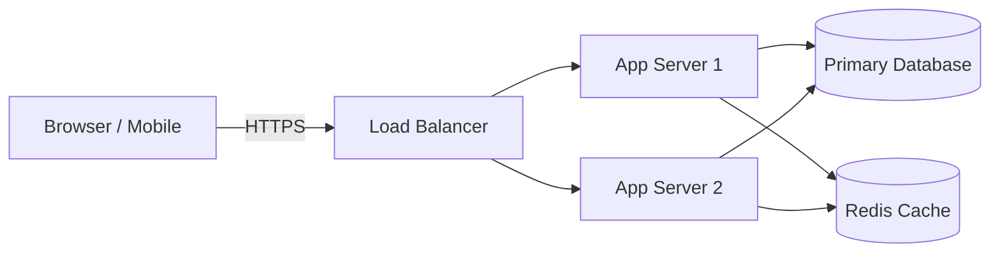
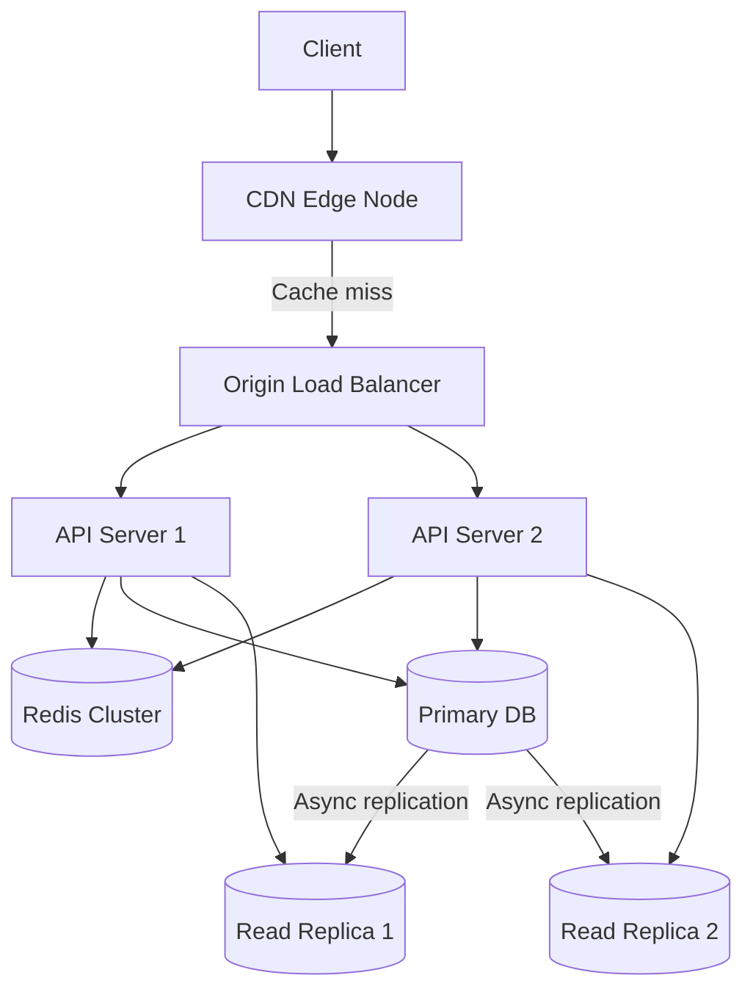
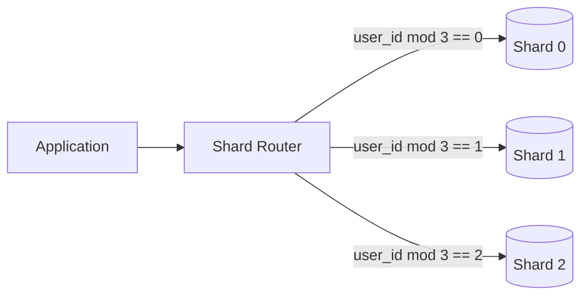
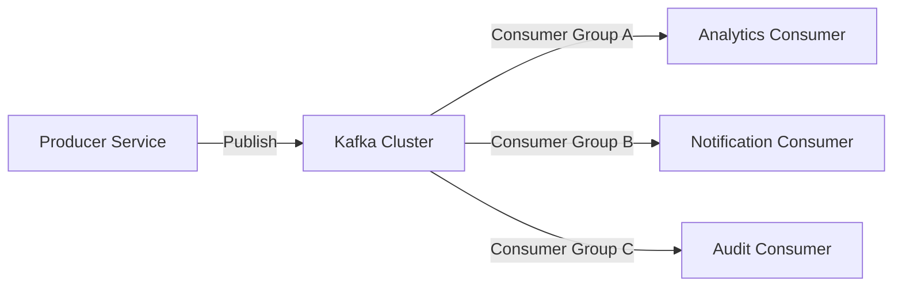
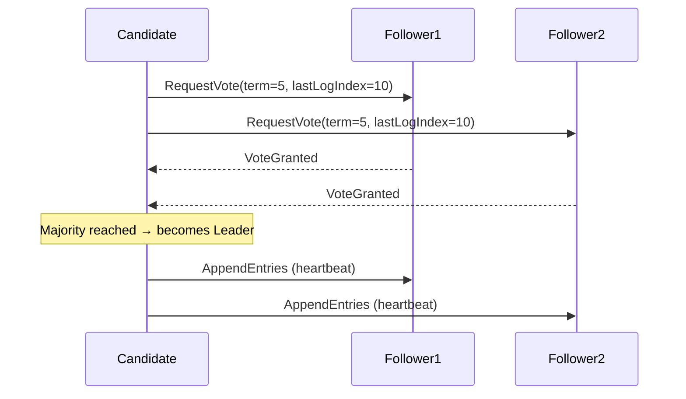
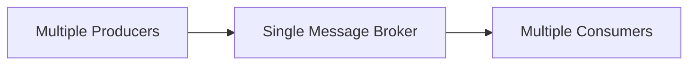
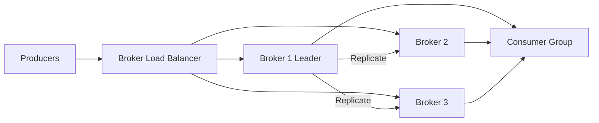
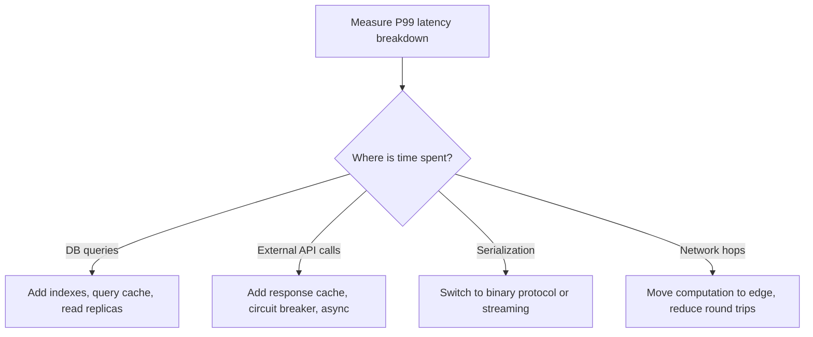

# System Design Roadmap — Universal Template

## Overview

| | Description |
|---|---|
| **Purpose** | Universal template for all System Design roadmap topics |
| **Files per topic** | 9 files: `junior.md`, `middle.md`, `senior.md`, `professional.md`, `interview.md`, `tasks.md`, `find-bug.md`, `optimize.md`, `specification.md` |
| **Language** | All content must be generated in **English** |

### Topic Structure

```
XX-topic-name/
├── junior.md          ← Distributed system basics, key terms, availability nines
├── middle.md          ← Caching strategies, sharding, back-of-envelope estimation
├── senior.md          ← Messaging patterns, consensus, SLO design
├── professional.md    ← CAP/PACELC proofs, Raft safety, queueing theory
├── interview.md       ← Interview prep across all levels
├── tasks.md           ← Hands-on system design tasks
├── find-bug.md        ← Find and fix bugs in code (10+ exercises)
├── optimize.md        ← Optimize slow/inefficient code (10+ exercises)
└── specification.md   ← Official spec / documentation deep-dive
```

> Replace `{{TOPIC_NAME}}` with the specific System Design concept being documented.
> Each section below corresponds to one output file in the topic folder.

---

# TEMPLATE 1 — `junior.md`

## {{TOPIC_NAME}} — Junior Level

### What Is It?
Describe `{{TOPIC_NAME}}` for an engineer who writes application code but has not
yet had to design a complete distributed system. Connect it to a real product they
have used (e.g., Instagram, Twitter, YouTube) to make it concrete.

### Core Concept



### Mental Model
- A distributed system is many computers working together that appear as one to users.
- The central challenge: machines fail, networks are unreliable, clocks drift.
- `{{TOPIC_NAME}}` matters because: _[fill in]_.

### Key Terms
| Term | Definition |
|------|-----------|
| Latency | Time for a request to travel from client to server and back |
| Throughput | Requests (or bytes) processed per unit time |
| Availability | Fraction of time the system is operational |
| Scalability | Ability to handle increasing load by adding resources |
| Reliability | Probability of correct operation over a time period |
| Consistency | All nodes see the same data at the same time |

### Availability Nines Reference
| Nines | Annual Downtime |
|-------|----------------|
| 99% (2 nines) | 87.6 hours |
| 99.9% (3 nines) | 8.76 hours |
| 99.99% (4 nines) | 52.6 minutes |
| 99.999% (5 nines) | 5.3 minutes |

### Comparison with Alternatives
| Architecture | Availability | Consistency | Latency | Complexity |
|-------------|-------------|------------|---------|-----------|
| Single server | Low | Strong | Low | Minimal |
| Leader-follower replication | Medium | Eventual (reads) | Low–Medium | Low |
| Multi-region active-active | High | Eventual | Low globally | High |
| Sharded + replicated | High | Configurable | Low | Very High |

### Common Mistakes at This Level
1. Designing for current scale instead of the next 10x.
2. Ignoring failure modes — what happens when the database is down?
3. Assuming the network is reliable (Fallacies of Distributed Computing).
4. Adding caching without thinking about cache invalidation strategy.

### Hands-On Exercise
Given a URL shortener (like bit.ly), sketch a basic architecture on paper. Identify:
the write path, the read path, where the database lives, and what breaks if the
database goes down.

---

# TEMPLATE 2 — `middle.md`

## {{TOPIC_NAME}} — Middle Level

### Prerequisites
- Understands basic RDBMS and NoSQL trade-offs.
- Has debugged latency issues in a production system.
- Familiar with HTTP caching headers and CDN concepts.

### Deep Dive: {{TOPIC_NAME}}



### Caching Strategies

```text
Cache-Aside (Lazy Loading):
  READ:
    1. Check cache → HIT: return value
    2. MISS: query DB → store in cache → return value
  WRITE:
    Invalidate (or update) cache entry after DB write.
  Pro: Only caches data that is actually requested.
  Con: Cache miss always has extra latency; stale data possible.

Write-Through:
  WRITE:
    1. Write to cache AND to DB simultaneously.
  Pro: Cache always up to date.
  Con: Write latency increases; cache fills with rarely-read data.

Write-Behind (Write-Back):
  WRITE:
    1. Write to cache; acknowledge to client.
    2. Asynchronously flush to DB.
  Pro: Very fast writes.
  Con: Data loss risk on cache crash before flush.

Read-Through:
  Cache sits in front of DB; cache is responsible for fetching from DB on miss.
  Application always reads from cache only.
```

### Database Sharding



```text
Sharding strategies:
  Range-based: shard by key range (A–M on shard 0, N–Z on shard 1).
    Pro: Range queries stay on one shard.
    Con: Hot spots if data is skewed (e.g., most users start with 'A').

  Hash-based: shard_id = hash(key) mod N.
    Pro: Uniform distribution.
    Con: Range queries must fan out to all shards.

  Directory-based: a lookup table maps key → shard.
    Pro: Flexible reassignment.
    Con: Lookup table is a SPOF and potential bottleneck.
```

### Back-of-Envelope Estimation

```text
Useful constants:
  Memory:    1 byte, 1 KB = 10³, 1 MB = 10⁶, 1 GB = 10⁹, 1 TB = 10¹²
  Network:   LAN ~0.1 ms, same datacenter ~1 ms, cross-continent ~150 ms
  Disk:      SSD sequential read ~500 MB/s, HDD ~100 MB/s
  CPU:       ~10⁹ simple operations/second

Example — Twitter timeline storage:
  100M DAU, each user posts 2 tweets/day
  = 200M tweets/day = 2,300 tweets/second (write)
  Each tweet: 140 chars × 2 bytes (UTF-16) = 280 bytes + metadata ≈ 500 bytes
  Daily storage: 200M × 500B = 100 GB/day
  5-year storage: 100 GB × 365 × 5 ≈ 182 TB
```

### Middle Checklist
- [ ] Read/write paths designed separately; read replicas for read-heavy workloads.
- [ ] Cache invalidation strategy documented for every cached data type.
- [ ] Back-of-envelope estimate done before choosing storage technology.
- [ ] Failure mode analyzed: what happens when cache is unavailable?

---

# TEMPLATE 3 — `senior.md`

## {{TOPIC_NAME}} — Senior Level

### Responsibilities at This Level
- Own end-to-end design of systems handling millions of users.
- Define SLOs, error budgets, and operational runbooks.
- Evaluate technology choices (Kafka vs SQS, Cassandra vs DynamoDB) with quantified trade-offs.
- Lead design reviews; identify unstated assumptions in proposals.

### Distributed Messaging Patterns



```text
Kafka Key Characteristics:
  - Partitioned log: each topic split into P partitions; each message appended to one partition.
  - Consumer groups: each group gets its own offset pointer; multiple groups = fan-out.
  - Durability: messages retained for configurable period (default 7 days), not deleted on consume.
  - Ordering guarantee: only within a partition (not across partitions).
  - Throughput: millions of messages/second with proper partition count.

At-least-once vs Exactly-once vs At-most-once:
  At-most-once:   commit offset before processing; may lose messages on crash.
  At-least-once:  commit offset after processing; may duplicate on crash.
  Exactly-once:   Kafka transactions (idempotent producer + transactional consumer).
  Rule of thumb:  Design consumers to be idempotent; use at-least-once delivery.
```

### Consensus and Leader Election



```text
Systems built on Raft / Paxos consensus:
  etcd (Kubernetes state store)
  CockroachDB (distributed SQL)
  Apache ZooKeeper (coordination service)
  Consul (service mesh, KV store)

When to use consensus vs eventual consistency:
  Use consensus: leader election, distributed locks, configuration management.
  Use eventual consistency: social feeds, shopping carts, analytics counters.
```

### SLO Design

```text
SLO (Service Level Objective) Template:
  Metric:     Request success rate (non-5xx responses)
  Target:     99.9% over a 30-day rolling window
  Measurement: Prometheus query: sum(rate(http_requests_total{status!~"5.."}[30d]))
                               / sum(rate(http_requests_total[30d]))

Error Budget:
  Error budget = 1 - SLO = 0.1% of 30 days = 43.2 minutes of allowable downtime.
  If error budget is exhausted: freeze feature releases; focus on reliability.
  If error budget is healthy: invest in feature velocity.
```

### Senior Checklist
- [ ] SLOs defined for all user-facing services; error budgets tracked in dashboards.
- [ ] Message consumers are idempotent; duplicate delivery handled.
- [ ] Technology selection documented with quantified trade-offs, not just features.
- [ ] Runbooks written for top 5 failure scenarios; tested in game days.

---

# TEMPLATE 4 — `professional.md`

## {{TOPIC_NAME}} — Theory and Formal Foundations

### Overview
This section covers the formal theoretical foundations of distributed systems:
CAP and PACELC theorems with proofs, Paxos and Raft safety guarantees,
queueing theory for capacity planning, and back-of-envelope estimation methodology.
These tools allow engineers to reason rigorously about system behavior under failure
and load, beyond the level of intuition or heuristics.

### CAP Theorem — Formal Statement

```text
CAP Theorem (Brewer 2000, Gilbert & Lynch 2002):
  In any distributed data system, you can guarantee at most TWO of:
    C — Consistency: every read receives the most recent write or an error
    A — Availability: every request receives a non-error response
    P — Partition tolerance: the system operates despite network partition

Proof sketch (impossibility):
  Assume a network partition divides nodes into two groups G1 and G2.
  A write of value v occurs on G1.
  A read request arrives at G2.

  Case 1 — Enforce Consistency:
    G2 must refuse the read (or wait for G1 to recover) → not Available.

  Case 2 — Enforce Availability:
    G2 returns the last known value (may be stale) → not Consistent.

  Therefore: under partition, Consistency and Availability cannot both hold. ∎

  Practical reading:
    CP systems: refuse requests when uncertain (MongoDB, HBase, ZooKeeper)
    AP systems: serve possibly stale data (Cassandra, DynamoDB in default mode, CouchDB)
    CA systems: only possible with no partitions — single-node databases
```

### PACELC Theorem

```text
PACELC (Abadi 2012) — extends CAP to address latency:

  If Partition:  choose between Availability vs Consistency (CAP)
  Else (no partition): choose between Latency vs Consistency

  Because even without a partition, replication introduces latency:
    Strong consistency → wait for all replicas to acknowledge → higher latency
    Eventual consistency → acknowledge on one replica → lower latency, stale reads possible

System classification (PACELC):
  System         | Partition  | Else
  ---------------|------------|-----
  DynamoDB       | PA         | EL  (availability + low latency by default)
  Cassandra      | PA         | EL  (tunable, default AP/EL)
  Spanner        | PC         | EC  (strong consistency globally, higher latency)
  MongoDB (PSS)  | PC         | EC  (after 2018: strong reads by default)
  MySQL replica  | PC         | EC  (sync replication enforces consistency)
```

### Paxos and Raft Safety Proofs

```text
Raft Safety Property (Ongaro & Ousterhout 2014):
  "At most one leader is elected in any given term."

  Proof:
    A candidate becomes leader only if it receives votes from a majority (quorum).
    Two different candidates in the same term cannot both receive majority votes,
    because any two majorities in a cluster of n nodes share at least one node.
    That shared node can vote for only one candidate per term.
    Therefore at most one leader per term. ∎

  Log Matching Property:
    If two log entries in different servers have the same index and term,
    then the logs are identical in all entries up through that index.

    This is maintained inductively:
    - A leader creates at most one entry per index per term.
    - AppendEntries checks the previous log entry term before appending.
```

### Queueing Theory for Capacity Planning

```text
Little's Law:   L = λ × W
  L = average number of items in the system
  λ = average arrival rate (requests/sec)
  W = average time an item spends in the system (latency)

  Application:
    If your API handles 1,000 req/s (λ) and average latency is 0.1 s (W),
    then average in-flight requests: L = 1,000 × 0.1 = 100 concurrent requests.

M/M/1 Queue Model (Poisson arrivals, exponential service times, 1 server):
  ρ = λ / μ   (utilization, where μ = service rate)

  Mean queue length:   Lq = ρ² / (1 - ρ)
  Mean wait time:      Wq = ρ / (μ - λ)

  Critical insight: as utilization ρ → 1 (approaching capacity), latency → ∞.
  Rule of thumb: keep server utilization below 70–80% to maintain stable latency.

  Example:
    Server handles 100 req/s (μ = 100), load = 80 req/s (λ = 80)
    ρ = 0.8
    Mean additional wait: Wq = 0.8 / (100 - 80) = 0.04 s = 40 ms
    At ρ = 0.95: Wq = 0.95 / (100 - 95) = 0.19 s = 190 ms — 5x worse
```

### Back-of-Envelope Estimation Methodology

```text
Standard estimation template:

1. Clarify scale assumptions:
   DAU (daily active users), peak multiplier (peak ≈ 2–3× average)

2. Estimate write throughput:
   writes/day = DAU × writes_per_user_per_day
   writes/second = writes/day / 86,400 (× 2 for peak)

3. Estimate read throughput:
   read/write ratio × write throughput (typical ratios: 1:1 to 100:1)

4. Estimate storage:
   bytes_per_record × writes_per_day × retention_days

5. Estimate network bandwidth:
   read_throughput × avg_response_size

Example — Design a photo storage system (Instagram-scale):
  500M DAU, 1 photo upload/user/day = 5,800 writes/s (peak ~12,000/s)
  Average photo: 3 MB compressed → 500M × 3 MB = 1.5 PB/day raw
  Stored at 3 resolutions (original, medium, thumb): ≈ 4 MB total
  Yearly storage: 365 × 500M × 4 MB = 730 PB = ~730 TB

  Implications:
    → Object storage (S3-compatible), not block storage
    → CDN for read path (read:write ≈ 100:1 for popular photos)
    → Eventual consistency acceptable for photo visibility
```

---

# TEMPLATE 5 — `interview.md`

## {{TOPIC_NAME}} — Interview Questions

### Junior Interview Questions

**Q1: What is the difference between vertical and horizontal scaling?**
> Vertical scaling: increase the resources of a single machine (more CPU, RAM).
> Limited by hardware ceiling. Horizontal scaling: add more machines to distribute load.
> Limited by the ability to partition work. Most large systems scale horizontally.

**Q2: What is a CDN and what problem does it solve?**
> A Content Delivery Network caches static assets (images, JS, CSS, videos) at
> geographically distributed edge nodes. Users are served from the nearest edge,
> reducing latency. It also reduces load on the origin servers.

**Q3: What is the difference between SQL and NoSQL databases?**
> SQL: relational model, ACID guarantees, strong schema, powerful joins.
> NoSQL: various models (document, column-family, key-value, graph), often eventual
> consistency, flexible schema, horizontal scaling. Choose SQL when you need joins,
> transactions, and strong consistency. Choose NoSQL when you need extreme scale,
> flexible schema, or high write throughput.

---

### Middle Interview Questions

**Q4: Explain the CAP theorem in plain language.**
> In a distributed system, when a network partition occurs, you must choose: either
> reject requests to stay consistent (CP), or serve potentially stale data to stay
> available (AP). You cannot have both. In practice, partition tolerance is not
> optional for distributed systems, so the real choice is between consistency and
> availability during a partition.

**Q5: What is an idempotent operation and why does it matter in distributed systems?**
> An idempotent operation produces the same result whether called once or many times.
> In distributed systems, messages can be delivered more than once (at-least-once
> delivery). If the consumer is idempotent, duplicate messages cause no harm.
> Implementation: include a unique `idempotency_key` per operation; record processed
> keys; ignore duplicates.

**Q6: What is consistent hashing and what problem does it solve?**
> Consistent hashing places both cache nodes and cache keys on a virtual ring.
> When a node is added or removed, only K/N keys must be remapped (K = keys, N = nodes).
> Normal modulo hashing remaps all keys when N changes — catastrophic for a live cache.

---

### Professional / Deep-Dive Questions

**Q7: Prove (informally) why CAP says you cannot have all three properties under a partition.**
> Under partition, nodes cannot communicate. To serve a write, G1 updates its copy.
> If a read arrives at G2, you must choose: (1) refuse the read (lose availability to
> maintain consistency) or (2) return stale data (lose consistency to maintain
> availability). No option satisfies both. ∎

**Q8: Apply queueing theory to predict P99 latency at 90% CPU utilization.**
> M/M/1 model: at ρ = 0.9, Wq = 0.9 / (μ × (1 - 0.9)) = 9/μ.
> If the server processes 100 req/s (μ = 100 ms mean service time), Wq = 90 ms wait
> time PLUS 10 ms service time = ~100 ms mean. P99 ≈ 3–5× mean for exponential service
> distribution → P99 ≈ 300–500 ms. Recommendation: do not exceed 70% CPU utilization
> to keep P99 under 100 ms for this service.

---

# TEMPLATE 6 — `tasks.md`

## {{TOPIC_NAME}} — Practical Tasks

### Task 1 — Junior: Design a URL Shortener
**Goal**: Produce a basic architecture for a URL shortener (bit.ly scale).

**Requirements**:
- Estimate: 100M URLs stored, 10:1 read-to-write ratio, 1,000 writes/s, 10,000 reads/s.
- Design the write path: how is a short code generated and stored?
- Design the read path: how is a redirect served?
- Identify where a cache would help and what the cache key would be.

**Acceptance Criteria**:
- [ ] Back-of-envelope storage estimate done.
- [ ] Short code generation strategy explained (hash vs counter vs random).
- [ ] Cache hit scenario and cache miss scenario both described.
- [ ] Single point of failure identified.

---

### Task 2 — Middle: Design a Rate Limiter
**Goal**: Design a distributed rate limiter that can handle 1M req/s across 10 API servers.

**Requirements**:
- Algorithm: Token bucket or sliding window (justify your choice).
- State must be shared across all 10 API servers (use Redis).
- Handle Redis unavailability gracefully (fail open or fail closed — justify).
- Burst allowance: 2× sustained rate for up to 5 seconds.

**Acceptance Criteria**:
- [ ] Algorithm chosen with written trade-off justification.
- [ ] Redis data structure specified (string with TTL, sorted set, etc.).
- [ ] Behavior during Redis outage explicitly defined.
- [ ] Back-of-envelope: confirm Redis can handle the key access rate.

---

### Task 3 — Senior: Design a Notification System
**Goal**: Design a push notification system for a social platform with 500M users.

**Requirements**:
- Support: push (iOS/Android), email, and SMS delivery channels.
- Delivery guarantee: at-least-once; notifications must not be lost.
- Personalization: per-user quiet hours and channel preferences.
- Scale: up to 1M notifications/minute during peak events.

**Acceptance Criteria**:
- [ ] Message queue choice justified (Kafka vs SQS vs RabbitMQ).
- [ ] Idempotency design: how are duplicate deliveries avoided at the recipient?
- [ ] Fan-out strategy for sending to 1M users in < 1 minute documented.
- [ ] Failure handling: what happens if FCM/APNs is temporarily down?

---

### Task 4 — Professional: PACELC Analysis of a Given System
**Goal**: Classify a provided distributed database design on the PACELC spectrum.

**Requirements**:
- Given: a description of a multi-region database with configurable replication lag.
- Classify: PA/EL, PA/EC, PC/EL, or PC/EC — with proof from the design.
- Identify: what consistency guarantees the application can assume.
- Propose: a fitness function (automated test) that validates the consistency claim.

**Acceptance Criteria**:
- [ ] PACELC classification is correct and justified with reference to replication mode.
- [ ] Application-level implications stated (e.g., "reads may be 200 ms stale").
- [ ] Fitness function is runnable: specifies tools, query, and pass/fail threshold.

---

# TEMPLATE 7 — `find-bug.md`

## {{TOPIC_NAME}} — Find the Bug

### Bug 1: System Claims CP but Is Actually AP

```text
SYSTEM DESCRIPTION:
  "Our database provides strong consistency. Reads always reflect the latest write."

ARCHITECTURE:
  Primary (us-east-1) → async replication → Replica (eu-west-1)
  Read requests routed to nearest node (global load balancer).

BUG:
  With ASYNC replication, a write acknowledged by the Primary has NOT been applied
  to the Replica at the time of acknowledgment.

  Scenario:
    User writes record X on Primary (us-east-1). Write returns 200 OK.
    User immediately reads X routed to Replica (eu-west-1).
    Replication lag = 200 ms → read returns stale data (or "not found").

  The system is AP/EL (per PACELC), NOT CP.
  The "strong consistency" claim is FALSE for cross-region reads.
```

**Fix:**
```text
Option A — Synchronous replication (PC/EC):
  Primary waits for Replica to confirm write before acknowledging client.
  Pro: Consistent cross-region reads.
  Con: Write latency increases by cross-region RTT (~150 ms). System is PC: during
       partition, Primary may reject writes until quorum is restored.

Option B — Read-your-writes consistency (weaker but often sufficient):
  Route reads for a user back to the Primary for 5 s after their last write.
  Pro: The writing user sees their own writes consistently.
  Con: Other users may still see stale data. Not truly strongly consistent.

Option C — Document the actual consistency model honestly:
  Mark the system as AP/EL. Application code handles stale reads.
  Add retry logic and idempotency keys for critical operations.
```

---

### Bug 2: Missing Idempotency Key

```text
BUGGY API DESIGN:
  POST /api/payments
  Body: { "amount": 100, "currency": "USD", "account_id": "acc_123" }

BUG:
  The client sends this request, but the network times out before the response arrives.
  The client retries the request.
  Result: the payment is charged TWICE — 200 USD total.

  This is a duplicate write problem caused by at-least-once network delivery.
```

**Fix:**
```text
Correct API design — add idempotency key:
  POST /api/payments
  Header: Idempotency-Key: 7f8a9b12-4c3d-4e5f-8d2e-1a2b3c4d5e6f
  Body: { "amount": 100, "currency": "USD", "account_id": "acc_123" }

Server implementation:
  1. Receive request with Idempotency-Key.
  2. Check Redis / DB: has this key been processed before?
     → YES: return the cached result (200 OK with original response).
     → NO: process payment; store key + result with TTL (e.g., 24 hours).
  3. Return result.

  Idempotency key must be:
    - Generated by the CLIENT (not the server) — client controls retry identity.
    - A UUID v4 or similar globally unique identifier.
    - Per-operation (new key for genuinely new operations).
```

---

### Bug 3: Single Point of Failure in Message Queue



```text
BUG:
  The message queue has a single broker node.
  If this broker goes down:
    - Producers cannot publish messages (writes fail).
    - Consumers cannot read messages (reads fail).
    - Any in-flight messages not yet persisted to disk are LOST.

  All downstream services that depend on this queue are unavailable.
  Even if the broker recovers, the messages sent during the outage are gone.
```

**Fix:**


```text
Fix: Kafka cluster with replication factor 3, min.insync.replicas=2.
  - A message is acknowledged only when 2 of 3 brokers have it durably.
  - If one broker fails, 2 remain; quorum maintained; no data loss.
  - Consumers reconnect to a live broker automatically.
```

---

# TEMPLATE 8 — `optimize.md`

## {{TOPIC_NAME}} — Optimization Guide

### Optimization 1: Latency Reduction

**Goal**: Reduce P99 API latency from 800 ms to < 200 ms.



```text
Latency reduction techniques:
  1. Caching: Identify hot read paths; cache responses in Redis (TTL appropriate for freshness).
     Target: cache hit rate > 90% for static/semi-static data.

  2. Database indexes: EXPLAIN ANALYZE every query > 10 ms.
     Add composite indexes for multi-column WHERE clauses.
     Partial indexes for queries with constant conditions (WHERE status = 'active').

  3. Connection pooling: each app server maintains a warm pool of DB connections.
     Without pooling: TCP handshake + TLS adds ~10–50 ms per request.
     PgBouncer (PostgreSQL), ProxySQL (MySQL): reduces connection overhead 10–50x.

  4. Async processing: move non-critical work (email, analytics, audit log) to a queue.
     Reduces synchronous response time; improves perceived responsiveness.
```

---

### Optimization 2: Throughput Increase

```text
Current state: 5,000 req/s at 70% CPU utilization.
Target: 50,000 req/s.

Strategy (in order of effort):
  1. Horizontal scale: add more app server instances behind the load balancer.
     10x instances → 10x throughput (if stateless). Cost: linear with instances.

  2. Reduce work per request:
     - Move expensive computation to background jobs (async).
     - Add caching to skip computation on repeated queries.
     - Batch database writes (write-behind cache or micro-batching).

  3. Database scaling:
     - Read replicas for read-heavy queries (read:write > 5:1).
     - Sharding for write-heavy workloads (> 50,000 writes/s on single node).
     - CQRS: separate read model optimized for query patterns.

  4. Protocol upgrade:
     - HTTP/2 multiplexing: reduces connection overhead for concurrent requests.
     - gRPC: binary protocol; ~3–10× more efficient than JSON/REST for internal services.
```

---

### Optimization 3: Cost Per Request Reduction

```text
Cost drivers in cloud-hosted APIs:
  Compute: CPU × hours × instance cost
  Storage: GB × month
  Network: GB transferred (especially egress)
  Managed services: per-request fees (Lambda, DynamoDB on-demand, SQS)

Reduction techniques:
  1. Increase cache hit rate → reduce origin compute + DB read cost.
     Each 10% increase in cache hit rate reduces origin traffic by 10%.

  2. Compress responses (gzip / brotli):
     Typical compression ratio: 5–10x for JSON, 2–3x for binary.
     Reduces network egress cost; speeds up client rendering.

  3. Right-size instances:
     Profile CPU and memory utilization; downgrade over-provisioned instances.
     Use spot/preemptible instances for stateless, fault-tolerant workloads.

  4. Batching API calls:
     Instead of N individual writes, batch into groups of 100.
     Reduces per-request overhead; especially impactful for managed DBaaS billing.
```

### Optimization Summary Table
| Problem | Technique | Expected Gain | Key Metric |
|---------|-----------|--------------|-----------|
| High P99 latency | Cache hot reads | 50–90% latency reduction | P99 ms |
| Low throughput | Horizontal scale | Linear with instances | req/s |
| DB bottleneck (reads) | Read replicas + cache | 5–20× read capacity | DB CPU% |
| DB bottleneck (writes) | Sharding / CQRS | 10–100× write capacity | Write latency |
| High egress cost | CDN + compression | 60–90% egress reduction | GB/month |
| Slow deploys under load | Blue-green + canary | Zero-downtime deploys | Deployment MTTR |
---
---

# TEMPLATE 9 — `specification.md`

> **Focus:** Official documentation deep-dive — API reference, configuration schema, behavioral guarantees, and version compatibility.
>
> **Source:** Always cite the official documentation with direct section links.
> - Blockchain: https://bitcoin.org/bitcoin.pdf | https://ethereum.org/en/whitepaper/
> - Software Design/Architecture: https://refactoring.guru/design-patterns
> - Computer Science: https://en.wikipedia.org/wiki/List_of_data_structures
> - Software Architect: https://www.oreilly.com/library/view/fundamentals-of-software/9781492043447/
> - System Design: https://github.com/donnemartin/system-design-primer
> - MongoDB: https://www.mongodb.com/docs/manual/reference/
> - PostgreSQL: https://www.postgresql.org/docs/current/
> - API Design: https://swagger.io/specification/ (OpenAPI 3.x)
> - Backend: https://developer.mozilla.org/en-US/docs/Learn/Server-side
> - Elasticsearch: https://www.elastic.co/guide/en/elasticsearch/reference/current/
> - Redis: https://redis.io/docs/latest/commands/
> - Full-Stack: https://developer.mozilla.org/en-US/

<details open>
<summary><strong>Template Content</strong></summary>

# {{TOPIC_NAME}} — Specification

> **Official Documentation Reference**
>
> Source: [{{TOOL_NAME}} Official Docs]({{DOCS_URL}}) — {{SECTION}}

---

## Table of Contents

1. [Docs Reference](#docs-reference)
2. [API / Configuration Reference](#api--configuration-reference)
3. [Core Concepts & Rules](#core-concepts--rules)
4. [Schema / Options Reference](#schema--options-reference)
5. [Behavioral Specification](#behavioral-specification)
6. [Edge Cases from Official Docs](#edge-cases-from-official-docs)
7. [Version & Compatibility Matrix](#version--compatibility-matrix)
8. [Official Examples](#official-examples)
9. [Compliance Checklist](#compliance-checklist)
10. [Related Documentation](#related-documentation)

---

## 1. Docs Reference

| Property | Value |
|----------|-------|
| **Official Docs** | [{{TOOL_NAME}} Documentation]({{DOCS_URL}}) |
| **Relevant Section** | {{SECTION_NAME}} — {{SECTION_TITLE}} |
| **Version** | {{TOOL_VERSION}} |
| **Direct URL** | {{DOCS_URL}}/{{PATH}} |

---

## 2. API / Configuration Reference

> From: {{DOCS_URL}}/{{API_SECTION}}

### {{RESOURCE_OR_ENDPOINT_NAME}}

| Field / Parameter | Type | Required | Default | Description |
|------------------|------|----------|---------|-------------|
| `{{FIELD_1}}` | `{{TYPE_1}}` | ✅ | — | {{DESC_1}} |
| `{{FIELD_2}}` | `{{TYPE_2}}` | ❌ | `{{DEFAULT_2}}` | {{DESC_2}} |
| `{{FIELD_3}}` | `{{TYPE_3}}` | ❌ | `{{DEFAULT_3}}` | {{DESC_3}} |

---

## 3. Core Concepts & Rules

The official documentation defines these key rules for {{TOPIC_NAME}}:

### Rule 1: {{RULE_NAME}}

> *Docs: [{{DOCS_URL}}/{{SECTION}}]({{DOCS_URL}}/{{SECTION}}) — "{{DOC_QUOTE}}"*

{{RULE_EXPLANATION}}

```{{CODE_LANG}}
# ✅ Correct — follows official guidance
{{VALID_EXAMPLE}}

# ❌ Incorrect — violates official guidance
{{INVALID_EXAMPLE}}
```

### Rule 2: {{RULE_NAME}}

> *Docs: [{{DOCS_URL}}/{{SECTION}}]({{DOCS_URL}}/{{SECTION}})*

{{RULE_EXPLANATION}}

```{{CODE_LANG}}
{{CODE_EXAMPLE}}
```

---

## 4. Schema / Options Reference

| Option | Type | Allowed Values | Default | Docs |
|--------|------|---------------|---------|------|
| `{{OPT_1}}` | `{{TYPE_1}}` | `{{VALUES_1}}` | `{{DEFAULT_1}}` | [Link]({{URL_1}}) |
| `{{OPT_2}}` | `{{TYPE_2}}` | `{{VALUES_2}}` | `{{DEFAULT_2}}` | [Link]({{URL_2}}) |
| `{{OPT_3}}` | `{{TYPE_3}}` | `{{VALUES_3}}` | `{{DEFAULT_3}}` | [Link]({{URL_3}}) |

---

## 5. Behavioral Specification

### Normal Operation

{{NORMAL_OPERATION}}

### Performance Characteristics

| Operation | Time Complexity | Space | Notes |
|-----------|----------------|-------|-------|
| {{OP_1}} | {{TIME_1}} | {{SPACE_1}} | {{NOTES_1}} |
| {{OP_2}} | {{TIME_2}} | {{SPACE_2}} | {{NOTES_2}} |

### Error / Failure Conditions

| Error | Condition | Official Resolution |
|-------|-----------|---------------------|
| `{{ERROR_1}}` | {{COND_1}} | {{FIX_1}} |
| `{{ERROR_2}}` | {{COND_2}} | {{FIX_2}} |

---

## 6. Edge Cases from Official Docs

| Edge Case | Official Behavior | Reference |
|-----------|-------------------|-----------|
| {{EDGE_1}} | {{BEHAVIOR_1}} | [Docs]({{URL_1}}) |
| {{EDGE_2}} | {{BEHAVIOR_2}} | [Docs]({{URL_2}}) |
| {{EDGE_3}} | {{BEHAVIOR_3}} | [Docs]({{URL_3}}) |

---

## 7. Version & Compatibility Matrix

| Version | Change | Backward Compatible? | Notes |
|---------|--------|---------------------|-------|
| `{{VER_1}}` | {{CHANGE_1}} | {{COMPAT_1}} | {{NOTES_1}} |
| `{{VER_2}}` | {{CHANGE_2}} | {{COMPAT_2}} | {{NOTES_2}} |

---

## 8. Official Examples

### Example from Docs: {{EXAMPLE_TITLE}}

> Source: [{{DOCS_URL}}/{{ANCHOR}}]({{DOCS_URL}}/{{ANCHOR}})

```{{CODE_LANG}}
{{OFFICIAL_EXAMPLE_CODE}}
```

**Expected result:**

```
{{EXPECTED_RESULT}}
```

---

## 9. Compliance Checklist

- [ ] Follows official recommended patterns for {{TOPIC_NAME}}
- [ ] Uses supported version ({{TOOL_VERSION}}+)
- [ ] Handles all documented error conditions
- [ ] Follows official security recommendations
- [ ] Compatible with listed dependencies
- [ ] Configuration validated against official schema

---

## 10. Related Documentation

| Topic | Doc Section | URL |
|-------|-------------|-----|
| {{RELATED_1}} | {{SECTION_1}} | [Link]({{URL_1}}) |
| {{RELATED_2}} | {{SECTION_2}} | [Link]({{URL_2}}) |
| {{RELATED_3}} | {{SECTION_3}} | [Link]({{URL_3}}) |

---

> **Content Rules for `specification.md`:**
> - Always link directly to the relevant doc section (not just the homepage)
> - Use official examples from the documentation when available
> - Note breaking changes and deprecated features between versions
> - Include official security recommendations
> - Minimum 2 Core Rules, 3 Schema fields, 3 Edge Cases, 2 Official Examples

</details>
