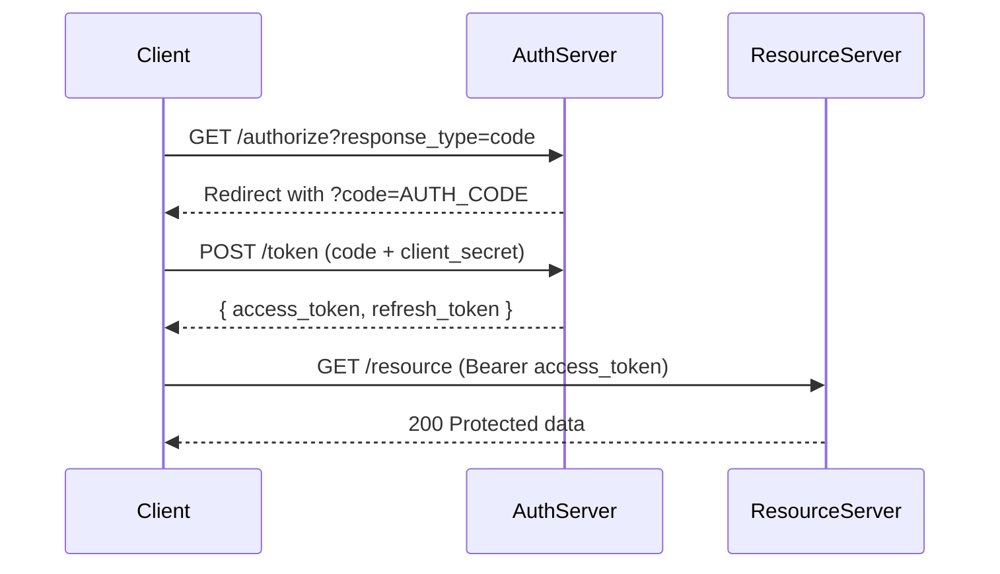
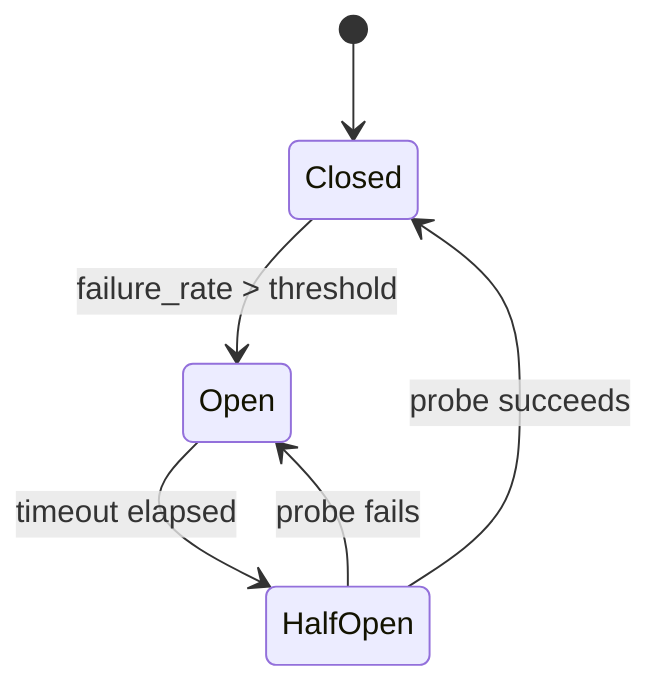
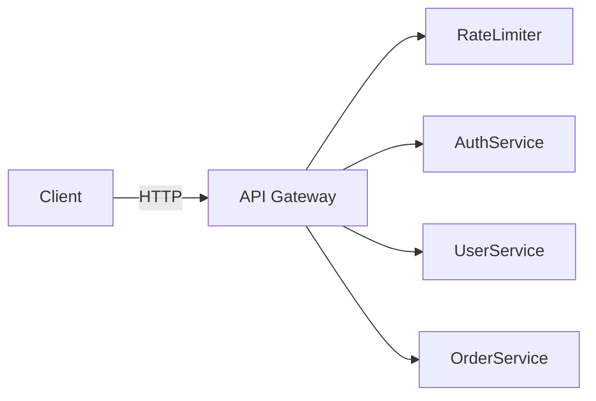
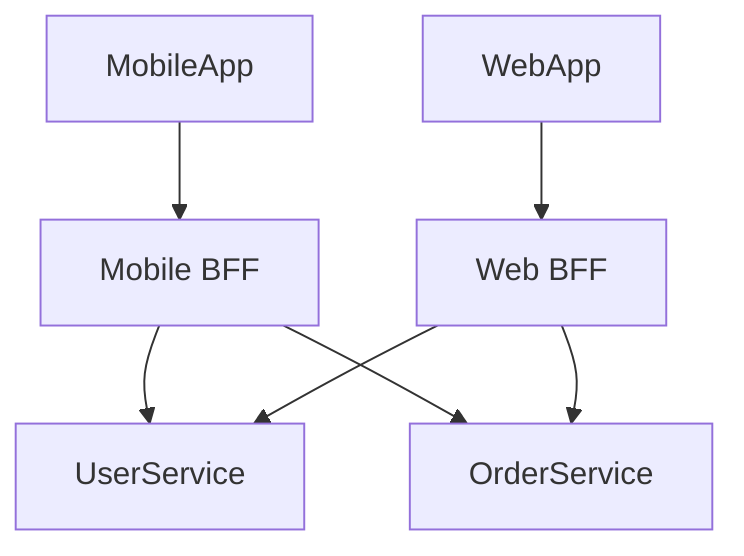
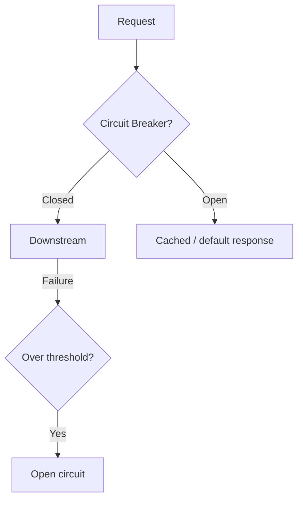
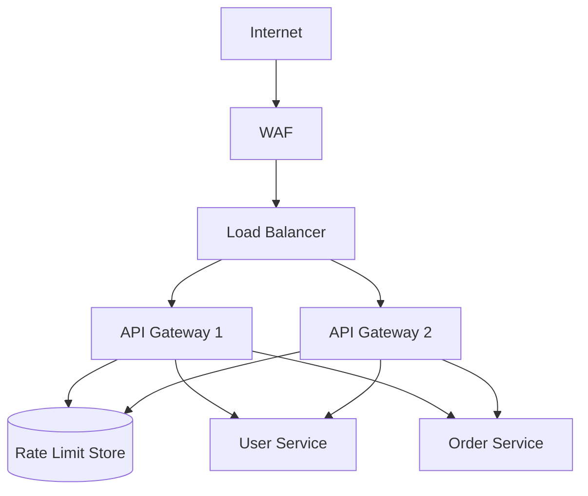
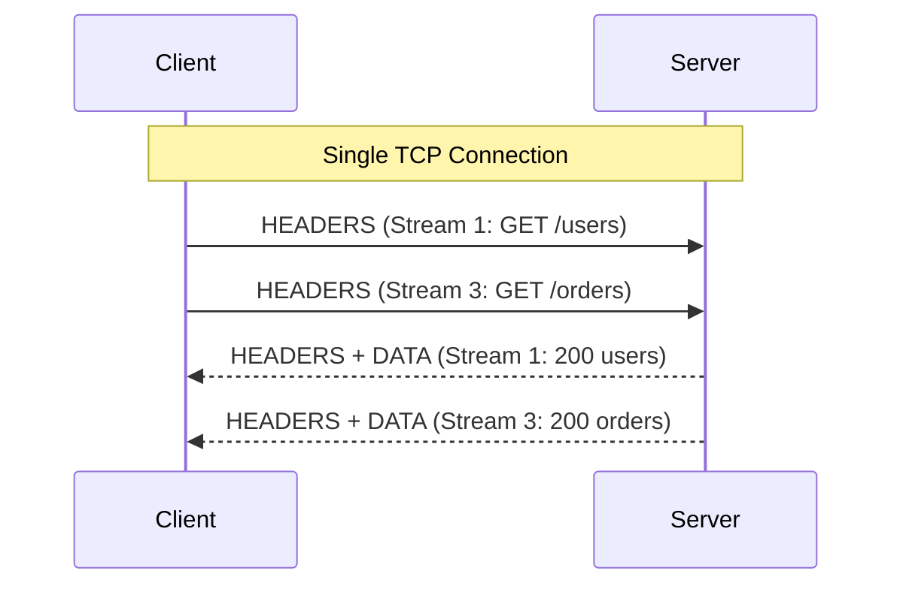
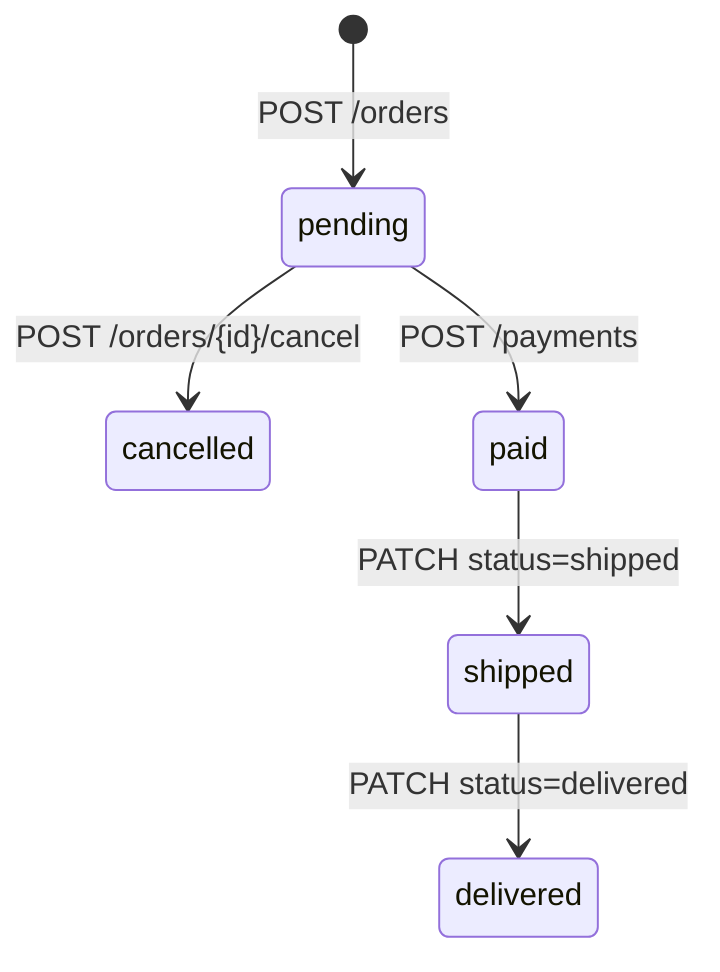

# API Design Roadmap — Universal Template

> Guides content generation for **API Design** topics.
> Primary code fences: `http`, `json`, `yaml` (OpenAPI)

## Overview

| | Description |
|---|---|
| **Purpose** | Universal template for all API Design roadmap topics |
| **Files per topic** | 8 files: `junior.md`, `middle.md`, `senior.md`, `professional.md`, `interview.md`, `tasks.md`, `find-bug.md`, `optimize.md` |
| **Language** | All content must be generated in **English** |

### Topic Structure

```
XX-topic-name/
├── junior.md          ← HTTP verbs, status codes, basic CRUD
├── middle.md          ← Versioning, auth, pagination, idempotency, rate limiting
├── senior.md          ← API gateway patterns, HA, contract-first, schema evolution
├── professional.md    ← HTTP/2 wire protocol, TLS handshake, REST constraint theory, HATEOAS
├── interview.md       ← Interview prep across all levels
├── tasks.md           ← Hands-on design and implementation tasks
├── find-bug.md        ← Wrong status code, missing idempotency key, broken pagination
└── optimize.md        ← Caching headers, cursor pagination, batch endpoints
```

## Level Comparison Matrix

| Aspect | Junior | Middle | Senior | Professional |
|:------:|:------:|:------:|:------:|:------------:|
| **Depth** | HTTP verbs, status codes, CRUD | Auth, versioning, pagination | Gateway, rate limiting, distributed contracts | HTTP/2 wire format, TLS, REST constraint theory |
| **Code** | Simple request/response pairs | OpenAPI specs, middleware | Multi-service flows, circuit breakers | Protocol analysis, HATEOAS state machines |
| **Focus** | "What?" and "How?" | "Why?" and "When?" | "How to scale?" | "What happens on the wire?" |

---

# TEMPLATE 1 — `junior.md`

# {{TOPIC_NAME}} — Junior Level

## Table of Contents
1. [Introduction](#introduction) 2. [Prerequisites](#prerequisites) 3. [Glossary](#glossary) 4. [Core Concepts](#core-concepts) 5. [Real-World Analogies](#real-world-analogies) 6. [Pros & Cons](#pros--cons) 7. [Use Cases](#use-cases) 8. [Query / Request Examples](#query--request-examples) 9. [Error Handling and Circuit Breaker Patterns](#error-handling-and-circuit-breaker-patterns) 10. [Security Considerations](#security-considerations) 11. [Best Practices](#best-practices) 12. [Common Mistakes](#common-mistakes) 13. [Cheat Sheet](#cheat-sheet) 14. [Summary](#summary) 15. [Further Reading](#further-reading)

## Introduction
> Focus: "What is it?" and "How to use it?"

Brief explanation of {{TOPIC_NAME}} for a beginner. Assume basic programming knowledge but no API design experience.

## Prerequisites
- **Required:** Basic HTTP (request/response, methods, status codes)
- **Required:** JSON syntax
- **Required:** At least one server-side language
- **Helpful:** `curl` or Postman

## Glossary

| Term | Definition |
|------|-----------|
| **Endpoint** | A URL path that accepts requests, e.g., `/users/{id}` |
| **HTTP Method** | Verb describing the action: GET, POST, PUT, PATCH, DELETE |
| **Status Code** | 3-digit number indicating success or failure |
| **Resource** | A noun the API manages — `user`, `order`, `product` |
| **REST** | Architectural style for HTTP APIs |
| **Idempotency** | Calling an operation multiple times produces the same result |

## Core Concepts

### HTTP Methods and Their Meaning

| Method | Purpose | Idempotent? |
|--------|---------|-------------|
| GET | Retrieve | Yes |
| POST | Create | No |
| PUT | Replace | Yes |
| PATCH | Partial update | No* |
| DELETE | Remove | Yes |

### Status Codes

| Range | Meaning | Key Examples |
|-------|---------|-------------|
| 2xx | Success | 200 OK, 201 Created, 204 No Content |
| 4xx | Client error | 400 Bad Request, 401 Unauthorized, 404 Not Found, 422 Unprocessable Entity |
| 5xx | Server error | 500 Internal Server Error, 503 Service Unavailable |

### Resource Naming
```
❌ /getUser?id=42   ❌ /createOrder
✅ /users/42        ✅ /orders
```

## Real-World Analogies

| Concept | Analogy |
|---------|--------|
| **HTTP Method** | A letter verb: GET = "give me", POST = "here's new data", DELETE = "throw this away" |
| **Status Code** | Waiter's response: 200 = delivered, 404 = not on menu, 500 = kitchen fire |
| **Resource URL** | A postal address — uniquely identifies the thing you want |

## Pros & Cons

| Pros | Cons |
|------|------|
| Human-readable, universal tooling | Chatty — many round trips for complex operations |
| Stateless, horizontally scalable | No built-in real-time support |
| Cacheable GET responses | Versioning requires upfront planning |

## Use Cases
- CRUD API for a blog or product catalog
- Third-party integration endpoint
- Mobile backend serving JSON

## Query / Request Examples

### Create a user (POST)

```http
POST /users HTTP/1.1
Host: api.example.com
Content-Type: application/json
Authorization: Bearer <token>

{
  "name": "Carol",
  "email": "carol@example.com"
}
```

```json
HTTP/1.1 201 Created
Location: /users/3

{
  "id": 3,
  "name": "Carol",
  "email": "carol@example.com",
  "created_at": "2026-03-26T10:00:00Z"
}
```

### OpenAPI stub

```yaml
openapi: "3.1.0"
info:
  title: User Service API
  version: "1.0.0"
paths:
  /users:
    post:
      summary: Create a user
      requestBody:
        required: true
        content:
          application/json:
            schema:
              $ref: "#/components/schemas/CreateUserRequest"
      responses:
        "201":
          description: User created
        "422":
          description: Validation error
```

## Error Handling and Circuit Breaker Patterns

Standard error response — never return `200` for an error:

```json
HTTP/1.1 422 Unprocessable Entity

{
  "error": {
    "code": "VALIDATION_FAILED",
    "message": "The email field is required.",
    "details": [{ "field": "email", "issue": "missing" }]
  }
}
```

## Security Considerations
- Never expose stack traces in API responses
- Validate all input before processing
- Return `401` when no credentials supplied, `403` when credentials valid but no permission

## Best Practices
- Plural nouns: `/users`, not `/user`
- Lowercase with hyphens: `/user-profiles`
- Version from day one: `/v1/users`
- Document every endpoint with an OpenAPI spec

## Common Mistakes

| Mistake | Fix |
|---------|-----|
| `GET /deleteUser?id=5` | `DELETE /users/5` |
| `200` for created resource | `201 Created` + `Location` header |
| `200` with error body | Use `4xx`/`5xx` status codes |

## Cheat Sheet

```
GET    /resources          → 200
POST   /resources          → 201 + Location
GET    /resources/{id}     → 200 / 404
PUT    /resources/{id}     → 200 / 404
PATCH  /resources/{id}     → 200 / 404
DELETE /resources/{id}     → 204 / 404
```

## Summary
{{TOPIC_NAME}} at the junior level: correct HTTP verb, correct status code, nouns as URLs, consistent error shape.

## Further Reading
- [RFC 7231 — HTTP Semantics](https://datatracker.ietf.org/doc/html/rfc7231)
- [OpenAPI Specification 3.1](https://spec.openapis.org/oas/v3.1.0)

---

# TEMPLATE 2 — `middle.md`

# {{TOPIC_NAME}} — Middle Level

## Table of Contents
1. [Introduction](#introduction) 2. [API Versioning Strategies](#api-versioning-strategies) 3. [Authentication and Authorization](#authentication-and-authorization) 4. [Pagination Design](#pagination-design) 5. [Idempotency Keys](#idempotency-keys) 6. [Rate Limiting](#rate-limiting) 7. [Query / Request Examples](#query--request-examples) 8. [Error Handling and Circuit Breaker Patterns](#error-handling-and-circuit-breaker-patterns) 9. [Comparison with Alternative Approaches / Databases](#comparison-with-alternative-approaches--databases) 10. [Best Practices](#best-practices) 11. [Diagrams & Visual Aids](#diagrams--visual-aids)

## Introduction
> Focus: "Why does this design decision exist?" and "When do I choose one approach?"

At the middle level, {{TOPIC_NAME}} is about deliberate design choices: versioning, auth strategy, resilient pagination, and protecting services from abuse.

## API Versioning Strategies

| Strategy | Example | Pros | Cons |
|----------|---------|------|------|
| URL path | `/v1/users` | Visible, cacheable | URL pollution |
| Header | `Accept-Version: 1` | Clean URLs | Less discoverable |
| Content negotiation | `Accept: application/vnd.api+json;version=2` | HTTP-native | Complex clients |

**Recommendation:** URL path versioning for public APIs.

## Authentication and Authorization

### OAuth 2.0 Authorization Code Flow



## Pagination Design

### Cursor Pagination (preferred for large datasets)

```http
GET /users?limit=20&after=cursor_opaque_xyz HTTP/1.1
```

```json
{
  "data": ["..."],
  "pagination": { "next_cursor": "cursor_opaque_abc", "has_next": true }
}
```

**Why cursors beat offset:** Stable results under concurrent writes, O(log n) DB query vs O(offset) scan.

## Idempotency Keys

```http
POST /payments HTTP/1.1
Idempotency-Key: 550e8400-e29b-41d4-a716-446655440000
Content-Type: application/json

{ "amount": 5000, "currency": "USD" }
```

Server: hash the key, check Redis (TTL 24h). If found, return cached response. If not, execute and cache.

## Rate Limiting

```http
HTTP/1.1 429 Too Many Requests
Retry-After: 30
X-RateLimit-Limit: 1000
X-RateLimit-Remaining: 0
X-RateLimit-Reset: 1780003600
```

| Algorithm | Burst | Memory |
|-----------|-------|--------|
| Token bucket | Yes | Low |
| Sliding window counter | Partial | Low |
| Fixed window | Yes | Very low |

## Query / Request Examples

### PATCH partial update

```http
PATCH /users/42 HTTP/1.1
Content-Type: application/json

{ "email": "new@example.com" }
```

```json
HTTP/1.1 200 OK
{ "id": 42, "email": "new@example.com", "updated_at": "2026-03-26T12:00:00Z" }
```

## Error Handling and Circuit Breaker Patterns

### Circuit Breaker States



## Comparison with Alternative Approaches / Databases

| Approach | Best For | Avoid When |
|----------|---------|-----------|
| REST | CRUD resources, public APIs | Tight internal service coupling |
| GraphQL | Flexible queries, multiple clients | Simple APIs |
| gRPC | High-performance internal services | Browser clients |
| WebSockets | Real-time bidirectional | Simple request-response |

## Best Practices
- Include `trace_id` in every error response
- Design for backward compatibility — add fields, never remove
- Use `Link` headers for pagination

## Diagrams & Visual Aids



---

# TEMPLATE 3 — `senior.md`

# {{TOPIC_NAME}} — Senior Level

## Table of Contents
1. [Introduction](#introduction) 2. [API Gateway Patterns](#api-gateway-patterns) 3. [Contract-First Design](#contract-first-design) 4. [Schema Evolution](#schema-evolution) 5. [Distributed Rate Limiting](#distributed-rate-limiting) 6. [High Availability](#high-availability) 7. [Query / Request Examples](#query--request-examples) 8. [Error Handling and Circuit Breaker Patterns](#error-handling-and-circuit-breaker-patterns) 9. [Observability](#observability) 10. [Diagrams & Visual Aids](#diagrams--visual-aids)

## Introduction
> Focus: "How to architect APIs that scale to millions of requests and evolve without breaking clients?"

## API Gateway Patterns

### BFF (Backend for Frontend)



| Gateway Concern | Handles |
|----------------|---------|
| Auth | Token validation, API key lookup |
| Rate limiting | Distributed token bucket per client |
| Routing | Path/header-based to microservices |
| Protocol translation | REST → gRPC, HTTP/1.1 → HTTP/2 |
| Observability | Trace injection, access logging |

## Contract-First Design

Write the OpenAPI spec before any code to force team agreement and enable mock servers.

```yaml
openapi: "3.1.0"
paths:
  /v2/orders:
    post:
      x-idempotency-key: required
      responses:
        "201":
          headers:
            Location: { schema: { type: string } }
        "409":
          description: Duplicate idempotency key
```

## Schema Evolution

Non-breaking: add optional fields, add endpoints.
Breaking: change field type, remove field, rename field.

```http
HTTP/1.1 200 OK
Deprecation: Sun, 01 Jun 2027 00:00:00 GMT
Sunset: Sun, 01 Dec 2027 00:00:00 GMT
Link: <https://docs.example.com/migration/v3>; rel="successor-version"
```

## Distributed Rate Limiting

Redis sliding window (atomic Lua script):
```
ZADD rate:user:42 <now_ms> <request_id>
ZREMRANGEBYSCORE rate:user:42 0 <(now_ms - window_ms)>
count = ZCARD rate:user:42
if count > limit → 429
```

## High Availability

Retry only on `5xx` and network timeouts, never on `4xx`.
```
attempt 1: 0ms  →  attempt 2: 100ms + jitter  →  attempt 3: 200ms + jitter  →  max 5 attempts
```

Deadline propagation: pass `X-Request-Deadline` downstream; fail fast when budget exhausted.

## Query / Request Examples

### Bulk operation with 207 Multi-Status

```http
POST /v1/users/batch HTTP/1.1

{
  "operations": [
    { "method": "POST",   "path": "/users", "body": { "name": "Dave" } },
    { "method": "DELETE", "path": "/users/5" }
  ]
}
```

```json
HTTP/1.1 207 Multi-Status

{ "results": [{ "status": 201, "body": { "id": 10 } }, { "status": 204 }] }
```

## Error Handling and Circuit Breaker Patterns



## Observability

- Propagate `traceparent` (W3C Trace Context) on every request
- Emit span duration, HTTP status code, downstream dependency name
- Alert on error rate > 1% per endpoint

## Diagrams & Visual Aids



---

# TEMPLATE 4 — `professional.md`

# {{TOPIC_NAME}} — Database/System Internals

## Table of Contents
1. [Introduction](#introduction) 2. [HTTP/2 Wire Protocol Internals](#http2-wire-protocol-internals) 3. [TLS Handshake Deep Dive](#tls-handshake-deep-dive) 4. [REST Constraint Theory](#rest-constraint-theory) 5. [HATEOAS Formal Model](#hateoas-formal-model) 6. [Query / Request Examples](#query--request-examples) 7. [Comparison with Alternative Approaches / Databases](#comparison-with-alternative-approaches--databases) 8. [Further Reading](#further-reading)

## Introduction
> Focus: "What happens at the protocol, wire, and constraint-theory level?"

HTTP/2 binary framing, TLS 1.3 1-RTT handshake, Fielding's six REST constraints and their emergent properties, and HATEOAS as a formal state machine driven by hypermedia links.

## HTTP/2 Wire Protocol Internals

All HTTP/2 communication is multiplexed over a single TCP connection via **streams**.

```
+-----------------------------------------------+
|                Length (24 bits)               |
+---------------+-------------------------------+
|  Type (8)     |  Flags (8)                    |
+-+-------------+-------------------------------+
|R|          Stream ID (31)                     |
+=+=============================================+
|          Frame Payload (variable)             |
+-----------------------------------------------+
```

| Frame Type | Purpose |
|-----------|---------|
| HEADERS (0x1) | HPACK-compressed request/response headers |
| DATA (0x0) | HTTP body bytes |
| SETTINGS (0x4) | Connection-level parameters |
| WINDOW_UPDATE (0x8) | Flow control credit |

**HPACK:** Static table (61 common headers) + per-connection dynamic table. Repeated headers like `Authorization: Bearer ...` cost 1 byte after first transmission.



## TLS Handshake Deep Dive

TLS 1.3 reduces handshake latency from 2 RTT (TLS 1.2) to **1 RTT**.

```
Client                          Server
  |--- ClientHello (key_share) --->|
  |<-- ServerHello (key_share) ----|
  |<-- {Certificate, Finished} ----|
  |    [1 RTT complete]            |
  |--- {Finished} ---------------->|
  |=== Application Data ===========|
```

Key improvements: ephemeral DH only (forward secrecy), no RSA key exchange, server certificates encrypted, 0-RTT resumption with PSK (safe for GET only — replay attack risk on POST).

## REST Constraint Theory

Roy Fielding's 2000 dissertation defined 6 constraints producing specific emergent properties:

| Constraint | Property |
|-----------|---------|
| Client-Server | UI/storage separation |
| Stateless | Visibility, reliability, scalability |
| Cacheable | Efficiency — eliminates some client-server interactions |
| Uniform Interface | Decoupled component evolution |
| Layered System | Enables proxies, gateways, CDNs |
| Code on Demand (optional) | Extends client via scripts |

## HATEOAS Formal Model

Clients navigate entirely through links in responses — no hardcoded URLs.

```json
{
  "data": { "id": "order-99", "attributes": { "status": "pending" } },
  "_links": {
    "self":   { "href": "/v1/orders/99",        "method": "GET"  },
    "cancel": { "href": "/v1/orders/99/cancel", "method": "POST" },
    "pay":    { "href": "/v1/payments",         "method": "POST" }
  }
}
```



## Query / Request Examples

### 0-RTT request (TLS 1.3 resumption)

```http
GET /v1/products HTTP/2
early-data: 1
```

```http
HTTP/2 200
vary: early-data
```

Safe only for GET — `early-data` can be replayed by an attacker.

## Comparison with Alternative Approaches / Databases

| Protocol | Multiplexing | Header Compression | Encryption |
|---------|-------------|-------------------|-----------|
| HTTP/1.1 | No | None | Optional |
| HTTP/2 | Yes (streams) | HPACK | Required (browsers) |
| HTTP/3 (QUIC) | Yes + 0-RTT | QPACK | Always |
| gRPC (HTTP/2) | Yes | HPACK | mTLS common |

## Further Reading
- Roy Fielding, *Architectural Styles and Network-based Software Architectures* (2000) — Chapter 5
- [RFC 9113 — HTTP/2](https://datatracker.ietf.org/doc/html/rfc9113)
- [RFC 8446 — TLS 1.3](https://datatracker.ietf.org/doc/html/rfc8446)

---

# TEMPLATE 5 — `interview.md`

# {{TOPIC_NAME}} — Interview Preparation

**Q1 (Junior):** What is the difference between PUT and PATCH?
PUT replaces the entire resource. PATCH partially updates it. PUT is idempotent; PATCH may not be.

**Q2 (Junior):** When should you return 404 vs 403?
404 = resource not found (or hidden). 403 = authenticated but no permission. Return 404 to hide resource existence from unauthorized callers.

**Q3 (Junior):** Why use plural nouns in REST URLs?
Resources represent collections. `/users` is a collection; `/users/42` is a member. Consistency makes the API predictable.

**Q4 (Junior):** What does 422 mean?
Unprocessable Entity — body is syntactically valid JSON but semantically invalid (failed business validation). Prefer over 400 for validation errors.

**Q5 (Middle):** How do you design an API that never breaks existing clients?
Additive-only changes: add optional fields, new endpoints, new query params. Never remove or rename. Deprecate with sunset headers before removal.

**Q6 (Middle):** Why prefer cursor pagination over offset?
Cursors are stable under concurrent writes — offset skips/repeats rows when records are inserted/deleted mid-page. Cursors use an O(log n) indexed lookup; offsets do O(offset) scans.

**Q7 (Middle):** What is an idempotency key?
A client-supplied UUID stored in a header. The server caches the result in Redis (24h TTL). Duplicate submissions return the cached result without re-executing — making retries safe for payments.

**Q8 (Middle):** Describe OAuth 2.0 Authorization Code flow.
Client → redirect user to `/authorize` → auth code → exchange for `access_token` via back-channel POST → use Bearer token for API calls.

**Q9 (Senior):** What is the BFF pattern?
Backend for Frontend — a dedicated gateway per client type (mobile, web). Each BFF shapes data for its client, avoiding over-fetching on mobile and under-fetching on web.

**Q10 (Senior):** How does deadline propagation work?
The caller sets an absolute deadline. Each downstream service deducts its processing time and passes the reduced budget forward. If the budget is exhausted, fail fast.

**Q11 (Senior):** How do you implement distributed rate limiting across multiple gateways?
Redis sliding window with atomic Lua script: ZADD current timestamp to a sorted set, ZREMRANGEBYSCORE to expire old entries, ZCARD to count. Key by `(client_id, window)`.

**Q12 (Professional):** Explain HATEOAS and why most "REST" APIs are not truly RESTful.
HATEOAS requires clients navigate entirely through links returned in responses. Most "REST" APIs are HTTP-based RPC with hardcoded URLs in clients. True HATEOAS means the server can change URL structure without breaking compliant clients.

**Q13 (Professional):** What is HPACK?
HTTP/2 header compression. Static table of 61 common header name/value pairs + dynamic per-connection table. Repeated headers (e.g., Authorization) are encoded as a 1-byte index reference.

**Q14 (Professional):** Why is TLS 1.3 0-RTT unsafe for POST?
0-RTT sends data in the first TLS flight using a Pre-Shared Key. An attacker can replay that record — the server cannot distinguish a replay from a legitimate retry, re-executing the mutation.

---

# TEMPLATE 6 — `tasks.md`

# {{TOPIC_NAME}} — Hands-On Tasks

**Task 1 (Junior):** Design a CRUD API for a blog. Write URL paths, HTTP methods, and expected status codes for: list posts, get single post, create post, update title, delete post. Write request/response pairs in HTTP notation.

**Task 2 (Junior):** Fix the status codes: (a) crash returns `200 { "error": true }`, (b) not found returns `200 { "data": null }`, (c) created resource returns `200 { "id": 5 }`.

**Task 3 (Junior):** Write a minimal OpenAPI 3.1 spec for `GET /products` and `POST /products` with request body schema, 200/201/422 responses.

**Task 4 (Middle):** Implement cursor-paginated `GET /events`. Cursor must be opaque to the client (base64-encode the last row ID). Test that concurrent inserts do not cause skipped rows.

**Task 5 (Middle):** Add idempotency key support to `POST /transfers` using Redis. Return `409` with the cached response if the key was already used.

**Task 6 (Middle):** A public API needs: (a) SPA browser clients, (b) server-to-server integrations, (c) mobile apps. Choose and justify an auth strategy for each. Draw a sequence diagram for the most complex flow.

**Task 7 (Senior):** Design the full deprecation lifecycle for `/v1/users` → `/v2/users`. Include sunset headers, migration link header, 12-month timeline, client notification strategy.

**Task 8 (Senior):** Implement a Redis sliding window rate limiter handling 10,000 RPS across 5 gateway instances. Include the Lua script, key structure, and TTL strategy.

**Task 9 (Senior):** Design a globally distributed API (3 regions) with active-active routing, conflict resolution, and latency-based routing. Draw the topology.

**Task 10 (Professional):** Add `_links` to every response of an order API. Model the full state machine (pending → paid → shipped → delivered) using link relations. Clients must not need to know any URL in advance.

**Task 11 (Professional):** Using Wireshark, capture an HTTP/2 session. Identify stream IDs, HEADERS frames, DATA frames, WINDOW_UPDATE frames. Explain what happens when the flow control window is exhausted.

---

# TEMPLATE 7 — `find-bug.md`

# {{TOPIC_NAME}} — Find and Fix the Bug

## Bug 1: Wrong status code for resource creation

```http
POST /users HTTP/1.1
{ "name": "Alice" }

HTTP/1.1 200 OK
{ "id": 5, "name": "Alice" }
```

**Bug:** `200` instead of `201 Created`.
**Fix:** Return `201 Created` + `Location: /users/5` header.

## Bug 2: 200 OK for an error condition

```json
HTTP/1.1 200 OK
{ "success": false, "error": "User not found" }
```

**Bug:** `200` makes this failure invisible to proxies, gateways, and alerting systems.
**Fix:** Return `404 Not Found` with a structured error body.

## Bug 3: Missing idempotency key on payment endpoint

```http
POST /payments HTTP/1.1
{ "amount": 9999, "currency": "USD" }
```

**Bug:** No idempotency key. Network timeout causes client to retry, creating a duplicate charge.
**Fix:** Require `Idempotency-Key` header. Return `400` if absent. Cache result in Redis for 24h.

## Bug 4: Broken pagination — no next-page signal

```json
{ "data": ["...20 items..."], "page": 2 }
```

**Bug:** No `total`, `total_pages`, or `next_cursor`. Clients cannot know if more pages exist.
**Fix:** Include `meta.total`, `meta.total_pages`, and `links.next` cursor.

## Bug 5: Missing rate limiting headers on 429

```http
HTTP/1.1 429 Too Many Requests
{ "error": "Rate limit exceeded" }
```

**Bug:** No `Retry-After`, `X-RateLimit-Limit`, or `X-RateLimit-Reset`. Clients cannot back off intelligently.
**Fix:** Add `Retry-After: 30`, `X-RateLimit-Limit: 1000`, `X-RateLimit-Remaining: 0`, `X-RateLimit-Reset: <epoch>`.

## Bug 6: DELETE returns a body

```http
DELETE /users/42

HTTP/1.1 200 OK
{ "id": 42, "deleted": true }
```

**Bug:** DELETE should return `204 No Content` with no body.
**Fix:** Return `204 No Content`.

## Bug 7: GET used for a state-changing operation

```http
GET /users/42/activate HTTP/1.1
```

**Bug:** GET must be safe and idempotent. CDNs and browser prefetch can trigger it unexpectedly.
**Fix:** `PATCH /users/42` with body `{ "status": "active" }`.

## Bug 8: Stack trace in error response

```json
HTTP/1.1 500 Internal Server Error
{ "error": "NullPointerException at UserService.java:142", "stack": "..." }
```

**Bug:** Exposes implementation details useful to attackers.
**Fix:** Log full trace server-side. Return only a generic error with a `trace_id`.

## Bug 9: Missing Content-Type validation

A server silently accepts `POST /users` with `Content-Type: text/plain` and a JSON body.
**Bug:** Without validating `Content-Type`, malformed content can cause silent parsing failures.
**Fix:** Return `415 Unsupported Media Type` for non-JSON bodies.

## Bug 10: Breaking change on unversioned endpoint

A new required field `phone` is added to `POST /users`, breaking all existing clients.
**Bug:** Required field addition is a breaking change on an unversioned API.
**Fix:** Introduce in `/v2/users` only. On existing version, make field optional or provide a default.

---

# TEMPLATE 8 — `optimize.md`

# {{TOPIC_NAME}} — Optimization Exercises

## Exercise 1: HTTP caching on a hot GET endpoint

**Before:** 8,000 RPS × 280KB = ~2.2 GB/s egress. DB CPU at 90%.

**After:**
```http
HTTP/1.1 200 OK
ETag: "abc123def456"
Cache-Control: public, max-age=300, stale-while-revalidate=60
```

On repeat request: `If-None-Match: "abc123"` → `304 Not Modified`.

| Metric | Before | After |
|--------|--------|-------|
| DB queries/min | 480,000 | 960 (CDN revalidations) |
| Egress GB/day | 190 GB | 3.8 GB |
| p99 latency | 180ms | 4ms (CDN hit) |

## Exercise 2: Cursor pagination vs offset

**Before:**
```
GET /events?page=500&per_page=100
EXPLAIN ANALYZE: Seq Scan (actual time=4800ms)
```

**After:**
```
GET /events?after=cursor_xyz&limit=100
EXPLAIN ANALYZE: Index Scan (actual time=0.8ms)
```

| Metric | Before | After |
|--------|--------|-------|
| Query time (page 500) | 4,800ms | 0.8ms |
| DB CPU | 85% | 4% |

## Exercise 3: Response compression

| Metric | Before | After (gzip) |
|--------|--------|-------------|
| Response size | 1,200 KB | 87 KB |
| Transfer time (10Mbps) | 960ms | 70ms |

## Exercise 4: Batch endpoint vs N individual calls

**Before:** Mobile app: 50 × `GET /products/{id}` = 50 RTTs × 40ms = 2,000ms.

**After:** `POST /v1/products/batch-get` with `{ "ids": [...50...] }` = 1 RTT × 60ms = 60ms.

| Metric | Before | After |
|--------|--------|-------|
| Latency | 2,000ms | 60ms |
| Request count | 50 | 1 |

## Exercise 5: Rate limiter — atomic Lua vs multi-round-trip

**Before:** 3 Redis round trips per request (GET, INCR, EXPIRE) + race condition allowing burst-through.

**After:** Single atomic Lua script (1 Redis op, no race condition).

```lua
local current = redis.call("INCR", KEYS[1])
if current == 1 then redis.call("EXPIRE", KEYS[1], ARGV[2]) end
if current > tonumber(ARGV[1]) then return 0 end
return 1
```

| Metric | Before | After |
|--------|--------|-------|
| Redis ops/request | 3 | 1 |
| Race condition | Yes | No |
| Throughput headroom | 50K RPS | 150K RPS |

---

## Universal Requirements

- 8 files per topic: `junior.md`, `middle.md`, `senior.md`, `professional.md`, `interview.md`, `tasks.md`, `find-bug.md`, `optimize.md`
- Keep `{{TOPIC_NAME}}` placeholder throughout
- Include Mermaid diagrams for request flows, auth sequences, system topology
- Code fences: ` ```http `, ` ```json `, ` ```yaml `
- `find-bug.md`: wrong HTTP status code (200 for error), missing idempotency key, broken pagination, missing rate limiting
- `optimize.md`: query time before/after, QPS figures, `EXPLAIN ANALYZE` output where relevant
