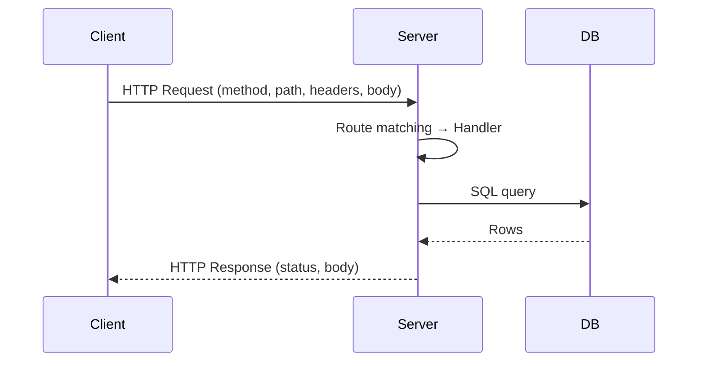
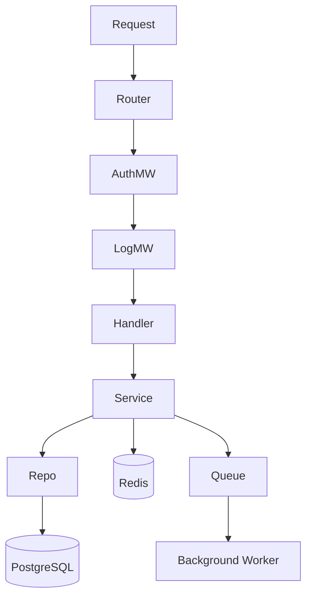
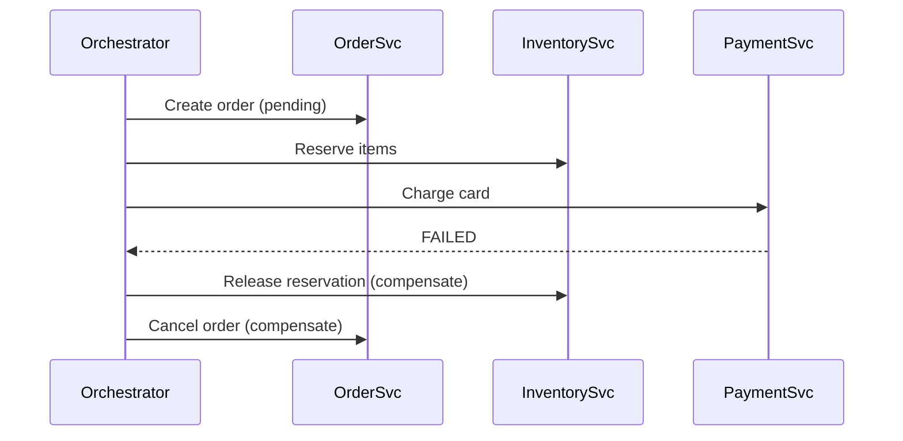
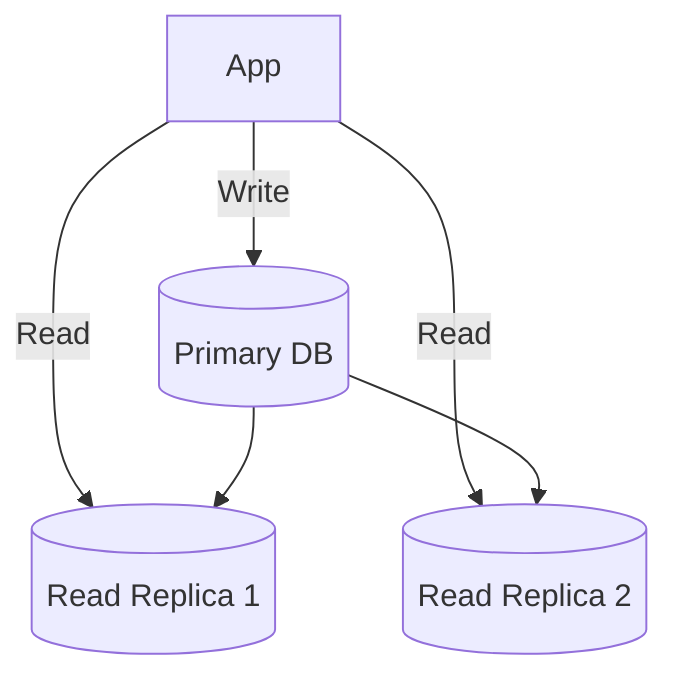
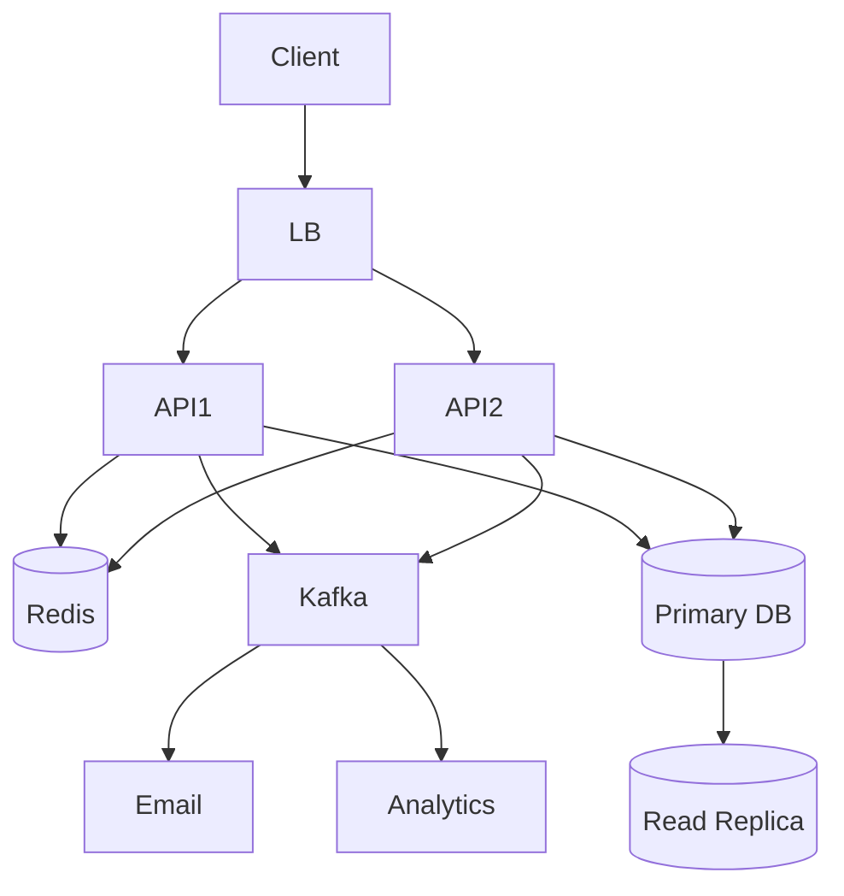
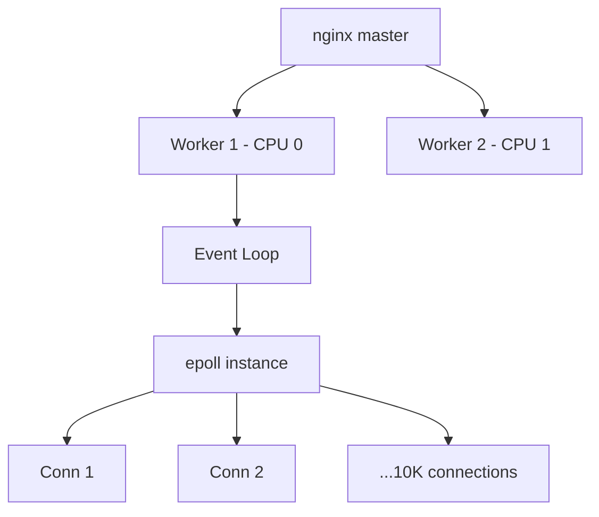
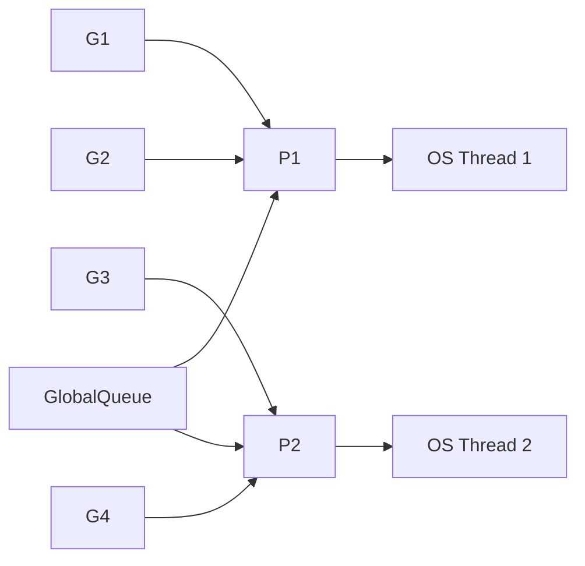

# Backend Roadmap — Universal Template

> Guides content generation for **Backend Development** topics.
> Primary code fences: `python`, `go`, `javascript` (polyglot)

## Overview

| | Description |
|---|---|
| **Purpose** | Universal template for all Backend roadmap topics |
| **Files per topic** | 8 files: `junior.md`, `middle.md`, `senior.md`, `professional.md`, `interview.md`, `tasks.md`, `find-bug.md`, `optimize.md` |
| **Polyglot policy** | Show concepts in Python, Go, and JavaScript unless topic is language-specific |

### Topic Structure

```
XX-topic-name/
├── junior.md          ← Request lifecycle, routing, basic CRUD
├── middle.md          ← Middleware chains, patterns, ORM, auth, background jobs
├── senior.md          ← Distributed systems, event sourcing, CQRS, sharding
├── professional.md    ← nginx event loop, epoll, Go GMP scheduler, Python GIL
├── interview.md       ← Interview prep across all levels
├── tasks.md           ← Hands-on implementation tasks
├── find-bug.md        ← N+1 query, SQL injection, connection pool exhaustion
└── optimize.md        ← EXPLAIN ANALYZE before/after, QPS, latency
```

## Level Comparison Matrix

| Aspect | Junior | Middle | Senior | Professional |
|:------:|:------:|:------:|:------:|:------------:|
| **Depth** | Request/response, CRUD | Middleware, ORM, auth | Distributed, event sourcing | epoll, GMP scheduler, GIL |
| **Code** | Single-file handlers | Layered architecture | Multi-service orchestration | Profiling, syscall analysis |
| **Focus** | "What?" and "How?" | "Why?" and "When?" | "How to scale?" | "What happens in the kernel?" |

---

# TEMPLATE 1 — `junior.md`

# {{TOPIC_NAME}} — Junior Level

## Table of Contents
1. [Introduction](#introduction) 2. [Prerequisites](#prerequisites) 3. [Glossary](#glossary) 4. [Core Concepts](#core-concepts) 5. [Real-World Analogies](#real-world-analogies) 6. [Pros & Cons](#pros--cons) 7. [Use Cases](#use-cases) 8. [Query / Request Examples](#query--request-examples) 9. [Error Handling and Circuit Breaker Patterns](#error-handling-and-circuit-breaker-patterns) 10. [Security Considerations](#security-considerations) 11. [Best Practices](#best-practices) 12. [Common Mistakes](#common-mistakes) 13. [Cheat Sheet](#cheat-sheet) 14. [Summary](#summary) 15. [Further Reading](#further-reading)

## Introduction
> Focus: "What is backend development?" and "How does a server handle a request?"

{{TOPIC_NAME}} covers server-side code: receiving HTTP requests, processing data, querying databases, and returning responses. At the junior level: understand the request lifecycle, write route handlers, perform CRUD operations.

## Prerequisites
- **Required:** Basic Python, Go, or JavaScript/Node.js
- **Required:** HTTP basics (methods, status codes)
- **Required:** Basic SQL (SELECT, INSERT, UPDATE, DELETE)
- **Helpful:** JSON, command line

## Glossary

| Term | Definition |
|------|-----------|
| **Route** | A URL pattern mapped to a handler function |
| **Middleware** | Code that runs between request receipt and the handler |
| **ORM** | Maps database rows to language objects |
| **CRUD** | Create, Read, Update, Delete |
| **Connection Pool** | Cache of reusable DB connections |
| **Migration** | Versioned script that modifies the DB schema |

## Core Concepts

### Request-Response Cycle



### Routing — three languages

**Python (FastAPI):**
```python
from fastapi import FastAPI
app = FastAPI()

@app.get("/users/{user_id}")
def get_user(user_id: int):
    return {"id": user_id, "name": "Alice"}
```

**Go (net/http):**
```go
func getUser(w http.ResponseWriter, r *http.Request) {
    w.Header().Set("Content-Type", "application/json")
    json.NewEncoder(w).Encode(map[string]any{"id": 1, "name": "Alice"})
}
func main() {
    http.HandleFunc("/users/", getUser)
    http.ListenAndServe(":8080", nil)
}
```

**JavaScript (Express):**
```javascript
app.get('/users/:id', (req, res) => {
    res.json({ id: req.params.id, name: 'Alice' });
});
```

## Real-World Analogies

| Concept | Analogy |
|---------|--------|
| **Router** | Hotel receptionist — directs request to the right room |
| **Middleware** | Airport security — every request passes through it first |
| **Connection Pool** | A taxi fleet — reuse existing connections instead of creating new ones |

## Pros & Cons

| Pros | Cons |
|------|------|
| Full control over server logic | Responsible for security and performance |
| Language of choice | Framework sprawl |
| Highly testable | Deployment complexity vs serverless |

## Use Cases
- User authentication service
- E-commerce product and order API
- File upload service (S3 + metadata)
- Webhook processor for third-party events

## Query / Request Examples

### Full CRUD handler (Python / FastAPI)

```python
from fastapi import FastAPI, HTTPException, Depends
from sqlalchemy.orm import Session
from pydantic import BaseModel

app = FastAPI()

class ProductCreate(BaseModel):
    name: str
    price: float

@app.post("/products", status_code=201)
def create_product(payload: ProductCreate, db: Session = Depends(get_db)):
    product = Product(**payload.model_dump())
    db.add(product); db.commit(); db.refresh(product)
    return product

@app.get("/products/{product_id}")
def get_product(product_id: int, db: Session = Depends(get_db)):
    product = db.query(Product).filter(Product.id == product_id).first()
    if not product:
        raise HTTPException(status_code=404, detail="Product not found")
    return product
```

### Parameterized query (Go)

```go
func createUser(db *sql.DB, name, email string) (int64, error) {
    result, err := db.Exec(
        "INSERT INTO users (name, email) VALUES ($1, $2)", name, email,
    )
    if err != nil { return 0, err }
    return result.LastInsertId()
}
```

## Error Handling and Circuit Breaker Patterns

```python
from sqlalchemy.exc import IntegrityError

@app.post("/users")
def create_user(payload: UserCreate, db: Session = Depends(get_db)):
    try:
        user = User(**payload.model_dump())
        db.add(user); db.commit()
    except IntegrityError:
        db.rollback()
        raise HTTPException(status_code=409, detail="Email already exists")
    return user
```

## Security Considerations
- Always use parameterized queries — never concatenate user input into SQL
- Hash passwords with bcrypt, never plain text or MD5
- Store DB credentials in environment variables, never in source code
- Validate and sanitize all input before use

## Best Practices
- Keep handlers thin — move business logic into service functions
- Use DB transactions for multi-step operations
- Return consistent error shapes across all endpoints

## Common Mistakes

| Mistake | Fix |
|---------|-----|
| `SELECT *` in production | Select only needed columns |
| No connection pool | pgxpool / SQLAlchemy pool / pg Pool |
| Secrets in code | Environment variables / secrets manager |
| Opening DB connection per request | Inject a shared pool |

## Cheat Sheet

```
Route → Handler → Service → Repository → DB
Status: 200 list/update, 201 create, 204 delete,
        400 bad input, 401 no auth, 403 forbidden,
        404 not found, 409 conflict, 422 validation, 500 server error
```

## Summary
{{TOPIC_NAME}} junior: request lifecycle, parameterized queries, correct status codes, secrets in env vars.

## Further Reading
- [FastAPI docs](https://fastapi.tiangolo.com/)
- [Go net/http](https://pkg.go.dev/net/http)
- [Express.js routing](https://expressjs.com/en/guide/routing.html)

---

# TEMPLATE 2 — `middle.md`

# {{TOPIC_NAME}} — Middle Level

## Table of Contents
1. [Introduction](#introduction) 2. [Layered Architecture](#layered-architecture) 3. [Middleware Chains](#middleware-chains) 4. [Authentication Strategies](#authentication-strategies) 5. [Query Optimization](#query-optimization) 6. [Background Jobs](#background-jobs) 7. [Query / Request Examples](#query--request-examples) 8. [Error Handling and Circuit Breaker Patterns](#error-handling-and-circuit-breaker-patterns) 9. [Comparison with Alternative Approaches / Databases](#comparison-with-alternative-approaches--databases) 10. [Performance Tips](#performance-tips) 11. [Diagrams & Visual Aids](#diagrams--visual-aids)

## Introduction
> Focus: "Why does this pattern exist?" and "When do I choose one approach?"

Layering, reusable middleware, efficient queries, background queues.

## Layered Architecture

```
HTTP Handler  ← Parse/validate request, serialize response
Service       ← Business logic, orchestration
Repository    ← All DB access, SQL queries
Domain Model  ← Entities, value objects, business rules
```

**Go — Repository pattern:**
```go
type UserRepository interface {
    FindByID(ctx context.Context, id int64) (*User, error)
    Create(ctx context.Context, u *User) error
}
type postgresUserRepo struct{ db *pgxpool.Pool }

func (r *postgresUserRepo) FindByID(ctx context.Context, id int64) (*User, error) {
    var u User
    err := r.db.QueryRow(ctx, "SELECT id, name FROM users WHERE id=$1", id).Scan(&u.ID, &u.Name)
    if errors.Is(err, pgx.ErrNoRows) { return nil, ErrNotFound }
    return &u, err
}
```

**Python — Service layer:**
```python
class UserService:
    def __init__(self, repo: UserRepository, mailer: Mailer):
        self._repo, self._mailer = repo, mailer

    def register(self, name: str, email: str, password: str) -> User:
        if self._repo.find_by_email(email):
            raise DuplicateEmailError(email)
        hashed = bcrypt.hashpw(password.encode(), bcrypt.gensalt())
        user = self._repo.create(name=name, email=email, password_hash=hashed)
        self._mailer.send_welcome(user)
        return user
```

## Middleware Chains

**Go — chain: Logger → Auth → Handler:**
```go
func LoggingMiddleware(next http.Handler) http.Handler {
    return http.HandlerFunc(func(w http.ResponseWriter, r *http.Request) {
        start := time.Now()
        next.ServeHTTP(w, r)
        log.Printf("%s %s %dms", r.Method, r.URL.Path, time.Since(start).Milliseconds())
    })
}
mux.Handle("/api/users", LoggingMiddleware(AuthMiddleware(userHandler)))
```

**Express:** `app.use(logging); app.use('/api', auth); app.use('/api', rateLimit({ max: 100 }))`

## Authentication Strategies

**JWT (stateless):** Issue token on login. Verify signature on each request — no DB lookup. Short expiry (15m) + refresh token revocation list.

```python
def issue_token(user_id: int, roles: list[str]) -> str:
    return jwt.encode({"sub": str(user_id), "roles": roles,
        "exp": datetime.now(UTC) + timedelta(hours=1)}, SECRET, algorithm="HS256")
```

**Session (stateful, Node.js):** Store session in Redis. Cookie contains session ID only.

```javascript
app.use(session({ store: new RedisStore({ client: redisClient }),
    secret: process.env.SESSION_SECRET,
    cookie: { secure: true, httpOnly: true, maxAge: 3_600_000 } }));
```

## Query Optimization

### N+1 Problem

```python
# ❌ N+1: 1 query for users + N for orders
users = db.query(User).all()
for user in users: print(user.orders)  # separate SELECT per user

# ✅ Eager load with JOIN
users = db.query(User).options(joinedload(User.orders)).all()
```

Go fix: replace per-user `GetOrdersByUser(uid)` loop with a single batched `GetOrdersByUsers(userIDs)` using `WHERE user_id = ANY($1)`.

## Background Jobs

Decouple slow work (email, image processing) from the request cycle. Handler returns `202 Accepted`, job executes asynchronously with retry logic.

```python
@celery.task(bind=True, max_retries=3)
def send_confirmation_email(self, order_id: int):
    try:
        order = Order.objects.get(id=order_id)
        mailer.send(order.user.email, "Confirmed", render(order))
    except Exception as exc:
        raise self.retry(exc=exc, countdown=60)
```

## Query / Request Examples

### Paginated cursor list (Go)

```go
rows, err := r.db.Query(ctx,
    `SELECT id, name, email FROM users
     WHERE ($1 = '' OR role = $1) AND id > $2
     ORDER BY id LIMIT $3`,
    role, cursor, limit)
```

## Error Handling and Circuit Breaker Patterns

```go
type AppError struct{ Code, Message string; Status int }
var (
    ErrNotFound  = &AppError{"NOT_FOUND",  "Resource not found",      404}
    ErrForbidden = &AppError{"FORBIDDEN",  "Permission denied",       403}
    ErrConflict  = &AppError{"CONFLICT",   "Resource already exists", 409}
)
```

```python
def with_retry(fn, max_attempts=3):
    for attempt in range(max_attempts):
        try:
            return fn()
        except TransientError as e:
            if attempt == max_attempts - 1: raise
            time.sleep((2 ** attempt) * 0.1 + random.uniform(0, 0.05))
```

## Comparison with Alternative Approaches / Databases

| Pattern | Use When | Avoid When |
|---------|---------|-----------|
| Monolith | Small team, fast iteration | Independent scaling needed |
| Microservices | Teams own separate domains | Small team |
| Serverless | Event-driven, sporadic load | Long-running processes |
| Background queues | Slow/async work, retries | Work must complete synchronously |

## Performance Tips
- Run `EXPLAIN ANALYZE` on every slow query — look for Seq Scan on large tables
- Add composite index for common WHERE + ORDER BY pairs
- Cache hot reads in Redis with a short TTL

## Diagrams & Visual Aids



---

# TEMPLATE 3 — `senior.md`

# {{TOPIC_NAME}} — Senior Level

## Table of Contents
1. [Introduction](#introduction) 2. [Distributed Architecture Patterns](#distributed-architecture-patterns) 3. [Event-Driven Design](#event-driven-design) 4. [CQRS and Event Sourcing](#cqrs-and-event-sourcing) 5. [Resilience Patterns](#resilience-patterns) 6. [Database Sharding](#database-sharding) 7. [Query / Request Examples](#query--request-examples) 8. [Error Handling and Circuit Breaker Patterns](#error-handling-and-circuit-breaker-patterns) 9. [Observability](#observability) 10. [Diagrams & Visual Aids](#diagrams--visual-aids)

## Introduction
> Focus: "How to architect systems that handle millions of requests and survive partial failures?"

## Distributed Architecture Patterns

### Saga (distributed transactions)



## Event-Driven Design

```go
func (s *OrderService) Create(ctx context.Context, req CreateOrderReq) (*Order, error) {
    order, err := s.repo.Create(ctx, req)
    if err != nil { return nil, err }
    s.bus.Publish(ctx, "orders.created", OrderCreatedEvent{
        OrderID: order.ID, UserID: req.UserID, Total: order.Total,
    })
    return order, nil
}
```

```javascript
// Kafka consumer (Node.js)
await consumer.run({
    eachMessage: async ({ message }) => {
        const event = JSON.parse(message.value.toString());
        await notificationService.sendOrderConfirmation(event.user_id, event.order_id);
    },
});
```

## CQRS and Event Sourcing

CQRS separates write models (commands) from read models (denormalized projections).

```python
# Command side — write model
class OrderCommandHandler:
    def handle(self, cmd: CreateOrderCommand) -> str:
        order = Order.create(cmd.user_id, cmd.items)
        self.event_store.append(order.pending_events)
        self.event_bus.publish(order.pending_events)
        return order.id
```

## Resilience Patterns

```go
// Bulkhead: separate pools per service
var (
    userDBPool    = pgxpool.New(ctx, userDSN,    pgxpool.WithMaxConns(20))
    paymentDBPool = pgxpool.New(ctx, paymentDSN, pgxpool.WithMaxConns(10))
)
// Timeout propagation
ctx, cancel := context.WithTimeout(ctx, 500*time.Millisecond)
defer cancel()
```

## Database Sharding



```go
func (r *shardedRepo) shardFor(userID string) *pgxpool.Pool {
    h := fnv.New32(); h.Write([]byte(userID))
    return r.shards[h.Sum32()%uint32(len(r.shards))]
}
```

## Error Handling and Circuit Breaker Patterns

```go
var cb = gobreaker.NewCircuitBreaker(gobreaker.Settings{
    Name: "payment-service", MaxRequests: 3, Timeout: 30 * time.Second,
    ReadyToTrip: func(c gobreaker.Counts) bool { return c.ConsecutiveFailures > 5 },
})
result, err := cb.Execute(func() (any, error) { return paymentClient.Charge(ctx, req) })
if err == gobreaker.ErrOpenState { return nil, ErrPaymentServiceUnavailable }
```

## Observability

| Pillar | Tool | Key Fields |
|--------|------|-----------|
| Logs | Zap / structlog | trace_id, user_id, duration_ms |
| Metrics | Prometheus | http_requests_total, db_query_duration_seconds |
| Traces | OpenTelemetry + Jaeger | span_id, parent_span_id |

## Diagrams & Visual Aids



---

# TEMPLATE 4 — `professional.md`

# {{TOPIC_NAME}} — Database/System Internals

## Table of Contents
1. [Introduction](#introduction) 2. [nginx Event Loop Internals](#nginx-event-loop-internals) 3. [epoll — Connection Handling](#epoll--connection-handling) 4. [Request Lifecycle Deep Dive](#request-lifecycle-deep-dive) 5. [Go GMP Scheduler](#go-gmp-scheduler) 6. [Python GIL and asyncio](#python-gil-and-asyncio) 7. [Node.js libuv Event Loop](#nodejs-libuv-event-loop) 8. [Query / Request Examples](#query--request-examples) 9. [Comparison with Alternative Approaches / Databases](#comparison-with-alternative-approaches--databases) 10. [Further Reading](#further-reading)

## Introduction
> Focus: "What happens inside the web server, OS, and language runtime when a request arrives?"

## nginx Event Loop Internals

nginx uses one event loop per worker process. Each worker handles tens of thousands of connections via epoll — never blocking on I/O.



### nginx request phases
```
post-read → server-rewrite → find-config → rewrite → preaccess
→ access → precontent → content (your app) → log
```

## epoll — Connection Handling

```
epoll_create1(0)                         → epfd
epoll_ctl(epfd, EPOLL_CTL_ADD, fd, &ev)  → register fd
epoll_wait(epfd, events, max, timeout)   → block until ready
```

nginx uses **edge-triggered** mode: notified only on state change (new data arrives), not while data remains. Must `read()` until `EAGAIN` to drain kernel buffer.

| Mode | Behavior | nginx uses? |
|------|---------|-----------|
| Level-triggered | Notify while data available | No |
| Edge-triggered | Notify on state change only | Yes |

## Request Lifecycle Deep Dive

```
1.  TCP SYN → kernel 3-way handshake → fd placed in accept queue
2.  nginx accept(2) → new fd
3.  epoll_ctl ADD fd (EPOLLIN | EPOLLET)
4.  EPOLLIN fires → nginx recv(2) until EAGAIN
5.  HTTP parse: method, URI, headers
6.  nginx proxy_pass → upstream connection (or keepalive pool)
7.  nginx write(2) to upstream
8.  EPOLLIN on upstream fd → recv(2) response
9.  nginx sendfile(2) to client
10. keepalive → return fd to epoll pool  |  else close(2)
```

## Go GMP Scheduler

```
G = Goroutine (user-space)   M = OS Thread   P = Logical Processor
GOMAXPROCS = number of P's = true parallel goroutines
```



- Initial goroutine stack: 2KB (vs 1–8MB OS thread)
- Work stealing: idle P steals from busy P's local run queue
- When goroutine blocks on syscall, runtime can spin up a new M to keep P busy

## Python GIL and asyncio

```python
# ❌ CPU-bound: GIL prevents true parallelism
threading.Thread(target=compute_intensive).start()  # runs sequentially

# ✅ I/O-bound: GIL released during C-extension socket ops
async def fetch(session, url):
    async with session.get(url) as resp:   # GIL released
        return await resp.json()           # GIL released

async def main():
    async with aiohttp.ClientSession() as s:
        results = await asyncio.gather(fetch(s, url1), fetch(s, url2))
```

## Node.js libuv Event Loop

Phases (in order):
```
1. timers          — setTimeout / setInterval
2. pending I/O     — deferred I/O errors
3. poll            — retrieve new I/O events (blocks here if queue empty)
4. check           — setImmediate
5. close callbacks — socket.on('close')
```

Microtasks (Promises) drain **between** each phase.

## Query / Request Examples

### Go pprof profiling

```go
import _ "net/http/pprof"
go func() { log.Println(http.ListenAndServe("localhost:6060", nil)) }()
```

```bash
go tool pprof http://localhost:6060/debug/pprof/profile?seconds=30
curl http://localhost:6060/debug/pprof/goroutine?debug=2
```

### Python async with connection pool

```python
pool = await asyncpg.create_pool(dsn=DATABASE_URL, min_size=5, max_size=20)

@app.get("/users/{user_id}")
async def get_user(user_id: int):
    async with pool.acquire() as conn:
        row = await conn.fetchrow("SELECT id, name FROM users WHERE id=$1", user_id)
    if not row: raise HTTPException(status_code=404)
    return dict(row)
```

## Comparison with Alternative Approaches / Databases

| Model | Language | Concurrency | Context Switch |
|-------|---------|------------|---------------|
| Goroutines (M:N) | Go | Millions | ~200ns (user-space) |
| async/await | Python | 10K–100K | ~1μs |
| Event loop | Node.js | 10K–100K | ~1μs |
| OS threads | Java (pre-Loom) | ~10K | ~5–15μs (kernel) |
| Virtual threads | Java (Loom) | Millions | ~200ns |

## Further Reading
- [nginx internals — aosabook.org](https://aosabook.org/en/nginx.html)
- [Go scheduler — Dmitry Vyukov](https://docs.google.com/document/d/1TTj4T2JO42uD5ID9e89oa0sLKhJYD0Y_kqxDv3I3XMw)
- [epoll man page](https://man7.org/linux/man-pages/man7/epoll.7.html)
- [libuv design overview](https://docs.libuv.org/en/v1.x/design.html)

---

# TEMPLATE 5 — `interview.md`

# {{TOPIC_NAME}} — Interview Preparation

**Q1 (Junior):** What is the N+1 query problem?
N+1: load N records, then one extra query per record for related data. Fix: eager loading with JOIN or batched IN clause.

**Q2 (Junior):** Why use parameterized queries?
String concatenation enables SQL injection. Parameterized queries send query and data separately — the driver escapes data, injection is impossible.

**Q3 (Junior):** What is a connection pool?
A set of pre-opened DB connections that handlers borrow and return. Opening a new PostgreSQL TCP connection costs 20–50ms. Pools limit connections to a configured maximum.

**Q4 (Junior):** What does HTTP 202 Accepted mean?
Request received and valid, but processing is not yet complete — it is queued. Include a polling URL in the response.

**Q5 (Middle):** Explain the Repository pattern.
Abstracts all DB access behind an interface. Handlers and services call repository methods, never raw SQL. Enables unit testing with mock repositories and DB swapping without changing business logic.

**Q6 (Middle):** When would you use a background job queue?
When work (a) takes longer than acceptable response time, (b) tolerates eventual consistency, or (c) needs retry logic. Examples: sending emails, generating reports, processing images.

**Q7 (Middle):** What is JWT and what are its trade-offs?
Self-contained signed token encoding user identity. Stateless — no DB lookup needed. Trade-off: cannot be revoked before expiry. Mitigations: short expiry (15m) + server-side refresh token revocation list.

**Q8 (Middle):** Describe the Service Layer pattern.
Handler parses/serializes; service contains business logic and orchestration; repository handles persistence. Business logic is testable without HTTP or DB infrastructure.

**Q9 (Senior):** What is the CAP theorem?
A distributed system guarantees at most 2 of: Consistency, Availability, Partition tolerance. Since partitions are inevitable, the real choice is CP (consistent, may refuse) vs AP (available, may return stale). PostgreSQL is CP; Cassandra is AP.

**Q10 (Senior):** How does the Saga pattern solve distributed transactions?
Breaks a distributed transaction into local transactions with compensating transactions on failure. Orchestration (central coordinator) or choreography (event-driven). Orchestration is easier to reason about for complex flows.

**Q11 (Senior):** What is event sourcing?
Stores the sequence of events that produced state instead of current state. Current state is derived by replaying events. Benefits: full audit log, temporal queries. Drawbacks: schema evolution is hard, queries require projections.

**Q12 (Professional):** How does Go's goroutine scheduler work?
M:N scheduling — M goroutines on N OS threads. G = goroutine, M = OS thread, P = logical processor with local run queue. When a goroutine blocks on I/O, runtime parks it and assigns M to another runnable goroutine. Work stealing keeps all P's busy.

**Q13 (Professional):** Why can nginx handle 10,000 connections on one thread?
Event-driven, non-blocking with epoll edge-triggered. Never blocks waiting for I/O — registers sockets with epoll, gets notified when ready. One thread multiplexes thousands of connections at near-zero OS scheduler cost.

**Q14 (Professional):** What is the Python GIL and how does asyncio work around it?
GIL: CPython mutex ensuring only one thread executes bytecode at a time. asyncio avoids GIL contention by being single-threaded. For I/O, the GIL is released during C-level socket operations, allowing other coroutines to run. For CPU-bound work, use `ProcessPoolExecutor`.

---

# TEMPLATE 6 — `tasks.md`

# {{TOPIC_NAME}} — Hands-On Tasks

**Task 1 (Junior):** Build a CRUD API for `/products` in Python, Go, or Node.js. Use parameterized SQL. Return correct status codes. Write tests for each handler.

**Task 2 (Junior):** Add input validation to `POST /products`: `name` required (max 100 chars), `price` positive float, `stock` non-negative integer. Return `422` with field-level errors.

**Task 3 (Junior):** Replace direct `sql.Open` / `psycopg2.connect` per request with a connection pool. Verify under load that the pool is reused.

**Task 4 (Middle):** Refactor handlers into Handler → Service → Repository layers. Service must not import database packages. Write unit tests using a mock repository.

**Task 5 (Middle):** Add JWT authentication middleware. Issue token on `POST /auth/login`. Return `401` for missing/invalid tokens, `403` for expired.

**Task 6 (Middle):** Move "send order confirmation email" to a Celery / asynq / BullMQ job. Handler returns `202 Accepted`. Include retry with exponential backoff (max 3 attempts).

**Task 7 (Senior):** Implement an order creation saga across Order, Inventory, Payment services. Include compensating transactions. Write a test simulating payment failure and verifying inventory reservation is released.

**Task 8 (Senior):** Instrument your service with OpenTelemetry. Propagate `traceparent` headers. Visualize the call graph in Jaeger. Identify the slowest span.

**Task 9 (Senior):** Route `SELECT` to a read replica, `INSERT/UPDATE/DELETE` to primary. Handle replica lag: after a write, read from primary for 500ms.

**Task 10 (Professional):** Profile a Go server under `wrk` load with `go tool pprof`. Identify the top 3 CPU-consuming functions. Optimize one and show before/after benchmark numbers.

**Task 11 (Professional):** Implement a connection pool from scratch (no library): pre-allocate N connections, borrow/return with timeout, health-check idle connections every 30s, replace broken connections.

---

# TEMPLATE 7 — `find-bug.md`

# {{TOPIC_NAME}} — Find and Fix the Bug

## Bug 1: N+1 query in a list endpoint

```python
# ❌ Broken — 1 + N queries for N orders
@app.get("/orders")
def list_orders(db: Session = Depends(get_db)):
    orders = db.query(Order).all()
    return [{"id": o.id, "user": db.query(User).filter(User.id == o.user_id).first().name}
            for o in orders]
```

**Bug:** 100 orders = 101 queries. DB CPU spikes under any real load.
**Fix:** `db.query(Order).options(joinedload(Order.user)).all()`

## Bug 2: SQL injection vulnerability

```python
# ❌ Broken
result = db.execute(f"SELECT * FROM users WHERE name = '{name}'")
```

**Bug:** `name = "'; DROP TABLE users; --"` drops the table.
**Fix:** `db.execute(text("SELECT * FROM users WHERE name = :name"), {"name": name})`

## Bug 3: Connection pool exhaustion

```go
// ❌ Broken — new connection per request
func getUser(w http.ResponseWriter, r *http.Request) {
    db, _ := sql.Open("postgres", os.Getenv("DATABASE_URL"))
    defer db.Close()
    // ...
}
```

**Bug:** New TCP connection per request (~30ms). Under load, DB hits `max_connections` and rejects.
**Fix:**
```go
var db *sql.DB  // package-level, initialized once in main()
db.SetMaxOpenConns(25); db.SetMaxIdleConns(5); db.SetConnMaxLifetime(5 * time.Minute)
```

## Bug 4: Missing index on hot query column

```go
// Runs on every API request — no index on category
rows, _ := db.Query(ctx, "SELECT id, name FROM products WHERE category=$1 ORDER BY price ASC LIMIT 20", category)
```

**Bug:** Full sequential scan on millions of rows.
**Fix:**
```sql
CREATE INDEX CONCURRENTLY idx_products_category_price ON products (category, price);
```

## Bug 5: Missing transaction for multi-step write

```python
# ❌ Broken — crash between commits leaves inconsistent state
sender.balance -= amount; db.commit()
receiver.balance += amount; db.commit()
```

**Fix:**
```python
try:
    sender.balance -= amount; receiver.balance += amount; db.commit()
except Exception: db.rollback(); raise
```

## Bug 6: Secret stored in source code

```javascript
// ❌
const db = new Pool({ password: 'super_secret_prod_password_123' });
```

**Fix:** `connectionString: process.env.DATABASE_URL`

## Bug 7: Unhandled promise rejection in Express

```javascript
// ❌ — if findById throws, Express never sends response; client hangs
app.get('/users/:id', async (req, res) => {
    const user = await userService.findById(req.params.id);
    res.json(user);
});
```

**Fix:** Add `try/catch` and call `next(err)` to pass to the Express error handler.

## Bug 8: Race condition on shared counter

```go
// ❌ DATA RACE
var requestCount int
func handler(...) { requestCount++ }
```

**Fix:** `var requestCount atomic.Int64` → `requestCount.Add(1)`

## Bug 9: Retrying 4xx errors

```python
# ❌ Retries 404/422 which will never succeed
for attempt in range(5):
    resp = requests.get(url)
    if resp.status_code == 200: return resp.json()
    time.sleep(2 ** attempt)
```

**Fix:** Only retry on `5xx` and `ConnectionError`. Return immediately for `4xx`.

## Bug 10: Returning 500 for a validation error

```go
// ❌
if input.Email == "" {
    http.Error(w, "email required", http.StatusInternalServerError)
}
```

**Bug:** Validation failure is a client error, not a server error. Misleads monitoring dashboards.
**Fix:** Return `422 Unprocessable Entity`.

---

# TEMPLATE 8 — `optimize.md`

# {{TOPIC_NAME}} — Optimization Exercises

## Exercise 1: Fix N+1 query

**Before:**
```python
users = db.query(User).limit(1000).all()
# 1001 queries — 1 for users + 1000 for latest order each
# Total time: ~12,300ms
```

**After:**
```python
users = db.query(User).options(joinedload(User.orders)).limit(1000).all()
```
```
EXPLAIN ANALYZE:
Hash Join  (actual time=2.1..18.4ms)
  -> Seq Scan on orders  (actual time=0.05..8.1ms)
  -> Hash on users       (actual time=0.04..0.9ms)
```

| Metric | Before | After |
|--------|--------|-------|
| DB queries | 1,001 | 1 |
| Total time | 12,300ms | 18ms |

## Exercise 2: Add missing index

**Before:**
```sql
EXPLAIN ANALYZE:
Seq Scan on products  (actual time=3401ms)
  Filter: category='electronics' AND in_stock=true
  Rows Removed by Filter: 4,950,000
```

**After:**
```sql
CREATE INDEX CONCURRENTLY idx_products_cat_stock_price
    ON products (category, in_stock, price) WHERE in_stock = true;
```
```
EXPLAIN ANALYZE:
Index Scan using idx_products_cat_stock_price  (actual time=0.5ms)
```

| Metric | Before | After |
|--------|--------|-------|
| Query time | 3,401ms | 0.5ms |
| Rows scanned | 5,000,000 | 20 |
| QPS capacity | 2 RPS | 4,000 RPS |

## Exercise 3: Connection pool tuning

**Problem:** 500 concurrent users → 8,000ms p99 latency. All goroutines waiting on `db.conn()`.

**Before:** `MaxOpenConns = 0` (unlimited). 8 servers × unlimited = DB rejecting connections.

**After:**
```go
db.SetMaxOpenConns(15)        // 8 × 15 = 120 < DB max_connections=100 (with headroom)
db.SetMaxIdleConns(5)
db.SetConnMaxLifetime(5 * time.Minute)
```

| Metric | Before | After |
|--------|--------|-------|
| p99 latency (500 users) | 8,000ms | 45ms |
| DB connection errors | 1,200/min | 0 |

## Exercise 4: Async email → background job

**Before:** `POST /orders` takes 3.2s — email sent inline.
**After:** `send_confirmation_email.delay(order.id)` — 0.5ms enqueue.

| Metric | Before | After |
|--------|--------|-------|
| `POST /orders` p99 | 3,200ms | 18ms |
| Throughput | 8 RPS | 1,200 RPS |

## Exercise 5: Redis cache for hot read endpoint

**Before:** 5,000 rows, 280ms query, 8,000 RPS → DB CPU 100%.
**After:** `cache.setex(CATALOG_KEY, 300, json.dumps(products))` → 0.3ms cache hit.

| Metric | Before | After |
|--------|--------|-------|
| DB queries/min | 480,000 | 1 (per TTL) |
| Response p99 | 280ms | 0.3ms |
| Throughput | 200 RPS | 50,000 RPS |

---

## Universal Requirements

- 8 files per topic: `junior.md`, `middle.md`, `senior.md`, `professional.md`, `interview.md`, `tasks.md`, `find-bug.md`, `optimize.md`
- Keep `{{TOPIC_NAME}}` placeholder throughout
- Polyglot code fences: ` ```python `, ` ```go `, ` ```javascript `
- Include Mermaid diagrams for request flows, middleware chains, system topology
- `find-bug.md`: N+1 query, SQL injection, connection pool exhaustion, missing index
- `optimize.md`: `EXPLAIN ANALYZE` output, QPS figures, latency percentiles before/after
