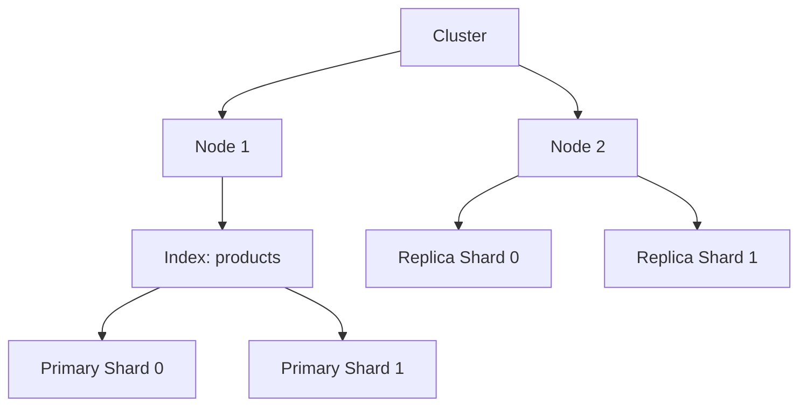
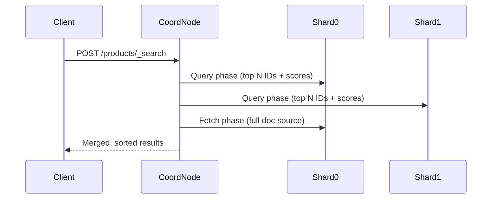
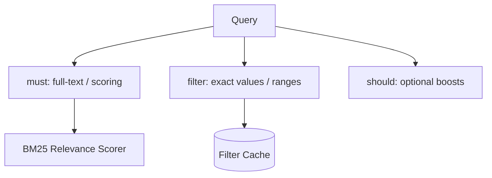
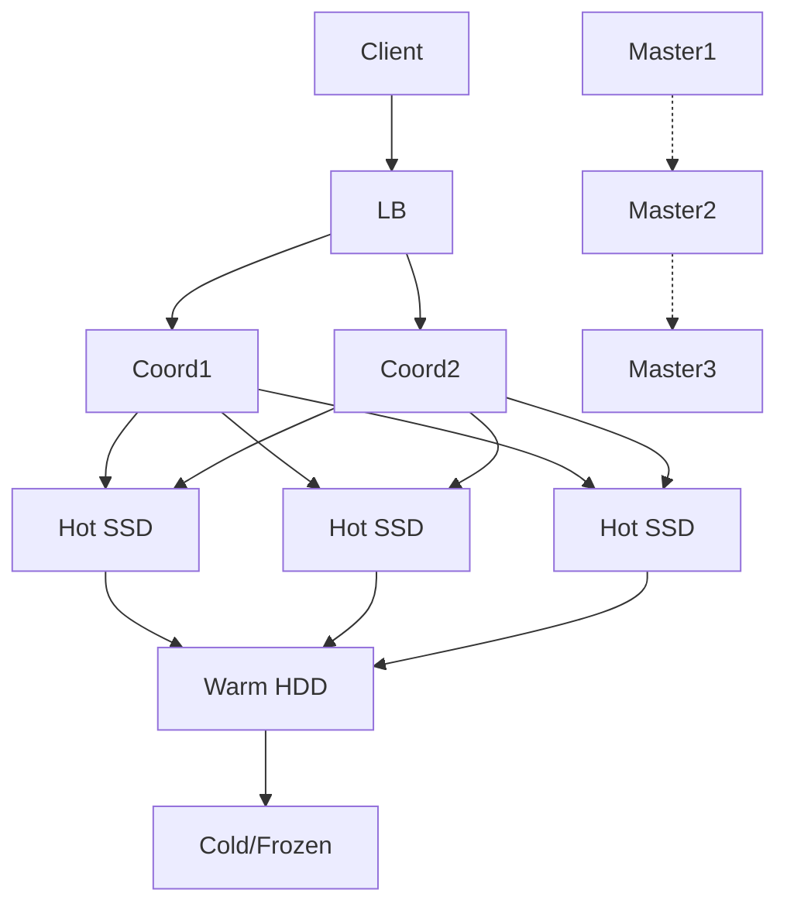
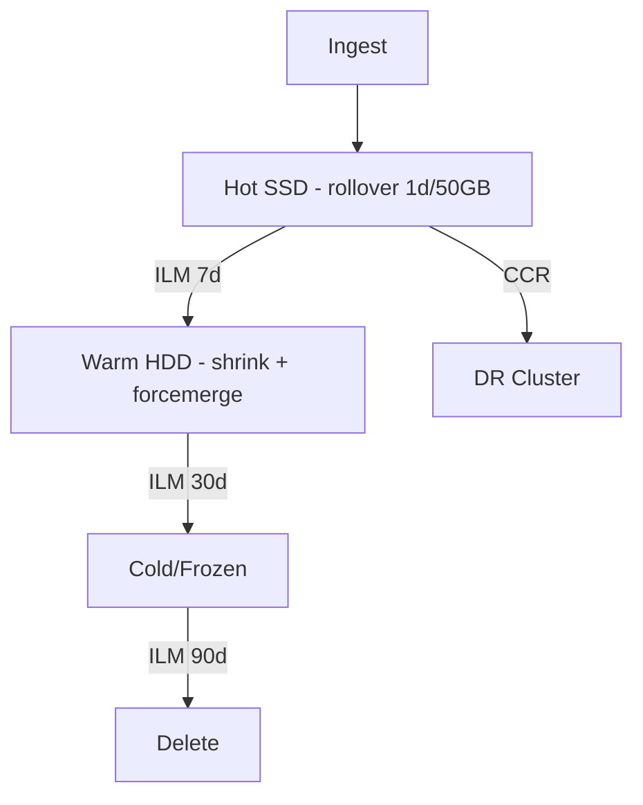
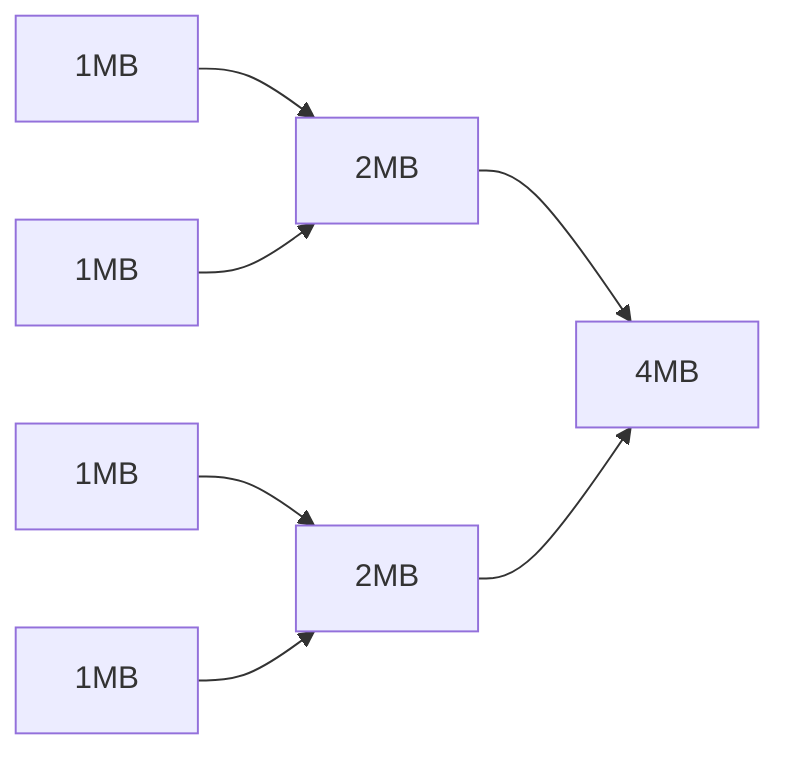
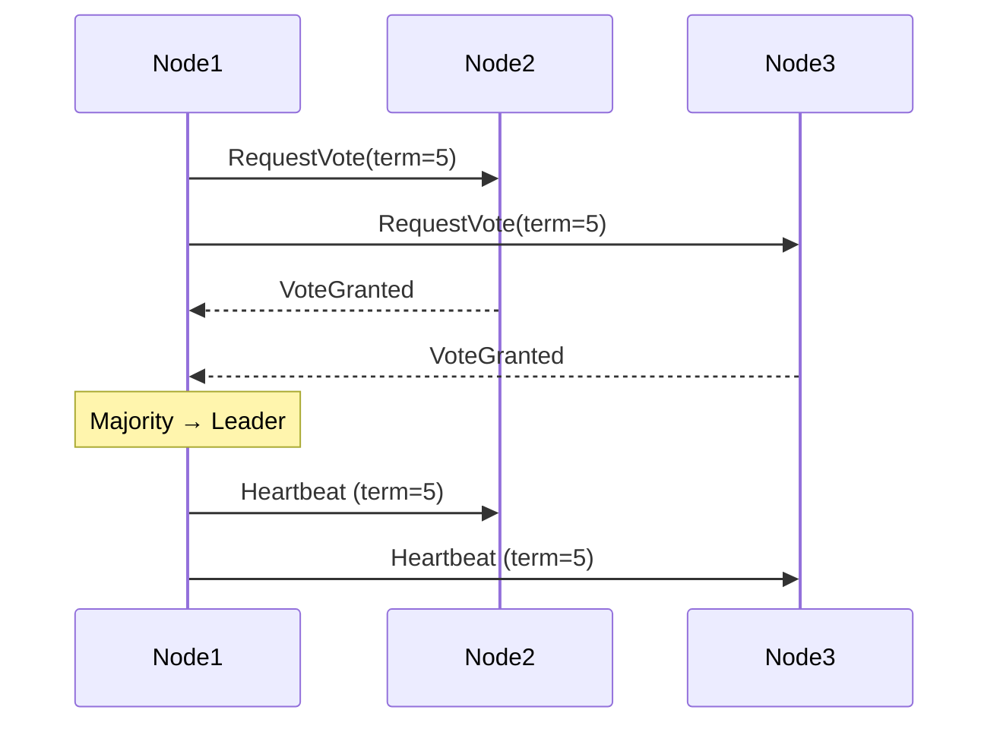

# Elasticsearch Roadmap — Universal Template

> Guides content generation for **Elasticsearch** topics.
> Primary code fences: `json` (queries/mappings), `bash` (curl/CLI)

## Overview

| | Description |
|---|---|
| **Purpose** | Universal template for all Elasticsearch roadmap topics |
| **Files per topic** | 8 files: `junior.md`, `middle.md`, `senior.md`, `professional.md`, `interview.md`, `tasks.md`, `find-bug.md`, `optimize.md` |
| **Language** | All content in **English** |

### Topic Structure

```
XX-topic-name/
├── junior.md          ← Index, document model, basic queries
├── middle.md          ← Mappings, analyzers, aggregations, ILM
├── senior.md          ← Cluster topology, sharding, CCR, security
├── professional.md    ← Inverted index, Lucene segments, BKD tree, Raft
├── interview.md       ← Interview prep across all levels
├── tasks.md           ← Hands-on indexing and search tasks
├── find-bug.md        ← Wrong mapping, missing replica, wildcard on text
└── optimize.md        ← _profile API output, shard sizing, query rewrite
```

## Level Comparison Matrix

| Aspect | Junior | Middle | Senior | Professional |
|:------:|:------:|:------:|:------:|:------------:|
| **Depth** | Index, search, basic queries | Mappings, analyzers, aggregations | Cluster design, ILM, CCR | Lucene internals, BKD tree, Raft |
| **Code** | `match` and `term` | Complex bool queries, analyzers | Multi-tier topology, CCR | Segment files, merge policies |
| **Focus** | "What?" and "How?" | "Why?" and "When?" | "How to scale?" | "What happens on disk?" |

---

# TEMPLATE 1 — `junior.md`

# {{TOPIC_NAME}} — Junior Level

## Table of Contents
1. [Introduction](#introduction) 2. [Prerequisites](#prerequisites) 3. [Glossary](#glossary) 4. [Core Concepts](#core-concepts) 5. [Real-World Analogies](#real-world-analogies) 6. [Pros & Cons](#pros--cons) 7. [Use Cases](#use-cases) 8. [Query / Request Examples](#query--request-examples) 9. [Error Handling and Circuit Breaker Patterns](#error-handling-and-circuit-breaker-patterns) 10. [Security Considerations](#security-considerations) 11. [Best Practices](#best-practices) 12. [Common Mistakes](#common-mistakes) 13. [Cheat Sheet](#cheat-sheet) 14. [Summary](#summary) 15. [Further Reading](#further-reading)

## Introduction
> Focus: "What is Elasticsearch?" and "How do I index and search documents?"

{{TOPIC_NAME}} is a distributed RESTful search engine built on Apache Lucene. At the junior level: understand the index/document model, define mappings, run basic queries.

## Prerequisites
- **Required:** JSON syntax — all communication is JSON
- **Required:** Basic HTTP (REST-style calls)
- **Helpful:** Relational database concepts (helps with analogies)
- **Helpful:** `curl` and command line

## Glossary

| Term | Definition |
|------|-----------|
| **Index** | A collection of documents (like a DB table) |
| **Document** | A JSON object — the basic unit of data |
| **Mapping** | Schema: field names and their types |
| **Shard** | A single Lucene index; an ES index is split into N shards |
| **Replica** | A copy of a shard for fault tolerance and read scaling |
| **Node** | A single Elasticsearch server process |
| **Query DSL** | JSON-based syntax for constructing queries |
| **Inverted Index** | Data structure enabling fast full-text search |

## Core Concepts

### Index and Document Model



### text vs keyword — the most important mapping decision

| Type | Analyzed? | Use For | Search With |
|------|----------|---------|------------|
| `text` | Yes (tokenized, lowercased) | Descriptions, articles | `match`, `match_phrase` |
| `keyword` | No (exact value) | IDs, status, tags, emails | `term`, aggregations, sort |

### Two-Phase Search



## Real-World Analogies

| Concept | Analogy |
|---------|--------|
| **Index** | A library containing books on one topic |
| **Inverted index** | A book's index — look up "elasticsearch" and get page numbers instantly |
| **Shards** | Splitting a thick book into volumes stored in different locations |
| **Replicas** | Photocopying a volume — if the original is lost, a copy remains |

## Pros & Cons

| Pros | Cons |
|------|------|
| Sub-second full-text search on billions of docs | Limited ACID transactions |
| Near-real-time indexing (~1s) | Schema changes require reindexing |
| Powerful aggregations | High memory (JVM heap + OS file cache) |
| Horizontal scaling built-in | Operational complexity |

## Use Cases
- E-commerce full-text product search with filters
- Log analytics (ELK/EFK stack)
- Autocomplete and prefix search
- Geospatial search (restaurants within 5km)

## Query / Request Examples

### Create index with mapping

```bash
curl -X PUT "localhost:9200/products" -H 'Content-Type: application/json' -d'
{
  "mappings": {
    "properties": {
      "name":       { "type": "text",    "fields": { "keyword": { "type": "keyword" } } },
      "price":      { "type": "float"   },
      "category":   { "type": "keyword" },
      "in_stock":   { "type": "boolean" },
      "created_at": { "type": "date"    }
    }
  }
}'
```

### Index a document and search

```bash
curl -X POST "localhost:9200/products/_doc/1" -d'
{ "name": "Wireless Noise-Cancelling Headphones", "price": 299.99, "category": "electronics" }'
```

```json
POST /products/_search
{
  "query": { "match": { "name": "wireless headphones" } }
}
```

Exact-value filter: `{ "query": { "term": { "category": "electronics" } } }`

## Error Handling and Circuit Breaker Patterns

| HTTP Status | Meaning | Action |
|------------|---------|--------|
| 404 | Index or document not found | Create index / check ID |
| 400 | Malformed query DSL | Fix query syntax |
| 429 | Circuit breaker / too many requests | Back off and retry |
| 503 | Cluster unavailable | Wait for green health |

## Security Considerations
- Enable X-Pack security — never run without auth in production
- Use TLS for all inter-node and client communication
- Create least-privilege roles — do not use the `elastic` superuser in app code
- Restrict port 9200 to the internal network

## Best Practices
- Always define explicit mappings before indexing
- Use aliases instead of index names in application code
- Set `number_of_replicas: 1` minimum for production

## Common Mistakes

| Mistake | Fix |
|---------|-----|
| `text` for status/ID fields | Use `keyword` |
| `wildcard` on large datasets | Use `match`, `prefix`, or `edge_ngram` |
| Dynamic mapping in production | Explicit mappings only |
| Writing directly to index name | Write through an alias |

## Cheat Sheet

```bash
PUT  /my-index                          # Create index
POST /my-index/_doc/{id}  { ... }       # Index document
GET  /my-index/_doc/{id}                # Get document
GET  /my-index/_search  { "query": {} } # Search
DELETE /my-index/_doc/{id}              # Delete document
GET  /_cluster/health                   # Cluster health
GET  /_cat/shards?v                     # Shard allocation
```

## Summary
{{TOPIC_NAME}} junior: explicit mappings, `text` vs `keyword`, `match` for full-text, `term` for exact, security enabled, write through aliases.

## Further Reading
- [Elasticsearch Reference — Mapping Types](https://www.elastic.co/guide/en/elasticsearch/reference/current/mapping-types.html)
- [Query DSL Overview](https://www.elastic.co/guide/en/elasticsearch/reference/current/query-dsl.html)

---

# TEMPLATE 2 — `middle.md`

# {{TOPIC_NAME}} — Middle Level

## Table of Contents
1. [Introduction](#introduction) 2. [Custom Analyzers](#custom-analyzers) 3. [Boolean Query DSL](#boolean-query-dsl) 4. [Aggregations](#aggregations) 5. [Index Templates and ILM](#index-templates-and-ilm) 6. [Query / Request Examples](#query--request-examples) 7. [Error Handling and Circuit Breaker Patterns](#error-handling-and-circuit-breaker-patterns) 8. [Comparison with Alternative Approaches / Databases](#comparison-with-alternative-approaches--databases) 9. [Performance Tips](#performance-tips) 10. [Diagrams & Visual Aids](#diagrams--visual-aids)

## Introduction
> Focus: "Why does mapping design matter?" and "When do I put conditions in filter vs query context?"

## Custom Analyzers

```json
PUT /articles
{
  "settings": {
    "analysis": {
      "analyzer": { "custom_english": { "type": "custom", "tokenizer": "standard",
          "filter": ["lowercase", "english_stemmer", "english_stop"] } },
      "filter": {
        "english_stemmer": { "type": "stemmer", "language": "english" },
        "english_stop":    { "type": "stop",    "stopwords": "_english_" }
      }
    }
  },
  "mappings": {
    "properties": {
      "title": { "type": "text", "analyzer": "custom_english" },
      "author": { "type": "keyword" }, "pub_date": { "type": "date" }
    }
  }
}
```

Test: `POST /articles/_analyze { "analyzer": "custom_english", "text": "The quick brown foxes are jumping" }`
→ tokens: `quick`, `brown`, `fox`, `jump` (stopwords removed, stems applied)

## Boolean Query DSL

| Clause | Scoring | Cached | Description |
|--------|---------|--------|-------------|
| `must` | Yes | No | Must match; contributes to relevance score |
| `filter` | No | Yes | Must match; result cached; no score overhead |
| `should` | Yes | No | Optional; improves score |
| `must_not` | No | Yes | Must not match; cached |

**Rule:** Exact-value conditions always belong in `filter`.

```json
{
  "query": {
    "bool": {
      "must":   [{ "match": { "title": "elasticsearch performance" } }],
      "filter": [
        { "term":  { "author":   "alice"      } },
        { "range": { "pub_date": { "gte": "2025-01-01" } } },
        { "range": { "views":    { "gte": 1000 } } }
      ],
      "must_not": [{ "term": { "tags": "draft" } }]
    }
  }
}
```

## Aggregations

```json
{
  "size": 0,
  "aggs": {
    "by_author": {
      "terms": { "field": "author", "size": 10 },
      "aggs": {
        "avg_views": { "avg": { "field": "views" } }
      }
    },
    "views_stats": { "stats": { "field": "views" } }
  }
}
```

## Index Templates and ILM

### ILM policy (hot-warm-cold-delete)

```json
PUT _ilm/policy/logs-ilm-policy
{
  "policy": {
    "phases": {
      "hot":    { "actions": { "rollover": { "max_size": "50gb", "max_age": "1d" } } },
      "warm":   { "min_age": "7d",  "actions": { "shrink": { "number_of_shards": 1 }, "forcemerge": { "max_num_segments": 1 } } },
      "cold":   { "min_age": "30d", "actions": { "freeze": {} } },
      "delete": { "min_age": "90d", "actions": { "delete": {} } }
    }
  }
}
```

## Query / Request Examples

### Multi-field search with field boosting

```json
{
  "query": {
    "multi_match": {
      "query": "elasticsearch optimization",
      "fields": ["title^3", "body^1", "tags^2"],
      "type": "best_fields",
      "tie_breaker": 0.3
    }
  }
}
```

## Error Handling and Circuit Breaker Patterns

```json
{
  "error": {
    "type": "circuit_breaking_exception",
    "reason": "[parent] Data too large — would exceed heap limit",
    "status": 429
  }
}
```

**Response:** Reduce result `size`, use pagination, avoid large aggregation buckets, increase JVM heap.

## Comparison with Alternative Approaches / Databases

| Feature | Elasticsearch | PostgreSQL FTS | Solr | OpenSearch |
|---------|--------------|---------------|------|-----------|
| Full-text search | Excellent | Good | Excellent | Excellent |
| ACID transactions | No | Yes | No | No |
| Horizontal scaling | Native | Extension | Yes | Native |
| License | SSPL + Elastic | PostgreSQL (MIT) | Apache 2.0 | Apache 2.0 |

## Performance Tips
- Use `filter` for date ranges and keyword terms — results are cached
- Set `"size": 0` for aggregation-only queries
- `doc_values` enabled by default for `keyword`, `numeric`, `date` — always use for sorting/aggs

## Diagrams & Visual Aids



---

# TEMPLATE 3 — `senior.md`

# {{TOPIC_NAME}} — Senior Level

## Table of Contents
1. [Introduction](#introduction) 2. [Cluster Topology Design](#cluster-topology-design) 3. [Shard Sizing and Allocation](#shard-sizing-and-allocation) 4. [Cross-Cluster Replication](#cross-cluster-replication) 5. [Security Architecture](#security-architecture) 6. [Monitoring and Alerting](#monitoring-and-alerting) 7. [Query / Request Examples](#query--request-examples) 8. [Error Handling and Circuit Breaker Patterns](#error-handling-and-circuit-breaker-patterns) 9. [Diagrams & Visual Aids](#diagrams--visual-aids)

## Introduction
> Focus: "How to design an Elasticsearch cluster that survives node failures and scales to terabytes?"

## Cluster Topology Design



| Role | Count | Reason |
|------|-------|--------|
| Master-eligible | 3 (odd) | Quorum (n/2)+1; 3 → tolerates 1 failure |
| Coordinating | 2 | Offloads scatter-gather from data nodes |
| Hot data | 3+ | Primary + 1 replica on separate nodes |

## Shard Sizing and Allocation

Target: 10–50 GB per shard. Max 20 shards per GB JVM heap. Primary shards are fixed at creation.

```bash
PUT /logs-2026-03
{ "settings": { "index.routing.allocation.require.data": "hot", "number_of_shards": 3 } }
POST /logs-2025-01/_forcemerge?max_num_segments=1
```

### Zero-downtime reindex

```bash
POST /_reindex { "source": { "index": "products-v1" }, "dest": { "index": "products-v2" } }
POST /_aliases { "actions": [
  { "remove": { "index": "products-v1", "alias": "products" } },
  { "add":    { "index": "products-v2", "alias": "products" } }
]}

## Cross-Cluster Replication

```bash
PUT /_cluster/settings
{ "persistent": { "cluster.remote.dr-cluster.seeds": ["dr-node1:9300"] } }
PUT /follower-logs/_ccr/follow { "remote_cluster": "dr-cluster", "leader_index": "logs" }
```

Use cases: DR (follower in another region), read offloading for analytics, geo-distributed search.

## Security Architecture

```json
POST /_security/role/app-read-role
{ "indices": [{ "names": ["logs-*"], "privileges": ["read"],
    "field_security": { "grant": ["@timestamp", "level", "message"] } }] }
```

```json
POST /_security/api_key
{ "name": "ingest-key", "expiration": "30d",
  "role_descriptors": { "ingest": { "indices": [{ "names": ["logs-*"], "privileges": ["write"] }] } } }
```

## Monitoring and Alerting

| Metric | Warning | Critical |
|--------|---------|---------|
| JVM heap used % | > 75% | > 85% |
| Unassigned shards | > 0 | > 0 |
| Disk usage | > 80% | > 90% (flood stage) |
| Search reject count | > 0 | Any |

```bash
GET /_cluster/health && GET /_nodes/stats/jvm,os,fs && GET /_nodes/hot_threads
```

## Error Handling and Circuit Breaker Patterns

```mermaid
flowchart TD
    Health[/_cluster/health] --> Status{Status?}
    Status -- green --> OK[All shards assigned]
    Status -- yellow --> Unassigned[Check: node left? disk > 85%?]
    Status -- red --> Primary[Primary shard missing — data loss risk]
    Primary --> Restore[Restore from snapshot]
```

```bash
GET /_cluster/allocation/explain
```

## Diagrams & Visual Aids



---

# TEMPLATE 4 — `professional.md`

# {{TOPIC_NAME}} — Database/System Internals

## Table of Contents
1. [Introduction](#introduction) 2. [Inverted Index Internals](#inverted-index-internals) 3. [Lucene Segment Lifecycle](#lucene-segment-lifecycle) 4. [BKD Tree for Numeric and Geo Data](#bkd-tree-for-numeric-and-geo-data) 5. [Raft Consensus for Cluster State](#raft-consensus-for-cluster-state) 6. [Query / Request Examples](#query--request-examples) 7. [Comparison with Alternative Approaches / Databases](#comparison-with-alternative-approaches--databases) 8. [Further Reading](#further-reading)

## Introduction
> Focus: "What happens inside Lucene when a document is indexed and a query is executed?"

## Inverted Index Internals

Maps terms → posting lists (doc IDs that contain the term).

```
Corpus:
  Doc 1: "the quick brown fox"
  Doc 2: "the fox jumped over the lazy dog"
  Doc 3: "quick brown dog"

Inverted index:
  brown  → [1, 3]   positions: [2, 1]
  dog    → [2, 3]   positions: [6, 2]
  fox    → [1, 2]   positions: [3, 1]
  quick  → [1, 3]   positions: [1, 0]
```

### Posting list compression
- **Delta encoding:** store diffs (4, 7, 9 → 4, 3, 2)
- **VByte:** small integers use fewer bytes
- **Skip lists:** every 128th entry enables O(log n) `advance(docID)` for boolean AND intersection

### BM25 scoring

```
score(q, d) = Σ IDF(t) × tf(t,d)×(k1+1) / (tf(t,d) + k1×(1 - b + b×|d|/avgdl))

k1 = 1.2  (term frequency saturation)
b  = 0.75 (length normalization)
```

BM25 saturates — 100 occurrences barely scores better than 10.

## Lucene Segment Lifecycle

Lucene writes immutable segments. Updates = delete + re-index.

```
Document → In-memory buffer (16MB default)
         → Flush   → New segment on disk (immutable)
         → Refresh → Lucene reader reopened → searchable
         → Commit  → fsync + write segments_N file
         → Merge   → N small segments → 1 larger segment
```

| Operation | Trigger | Makes docs searchable? |
|-----------|---------|----------------------|
| **Refresh** | Every 1s | Yes |
| **Flush** | Buffer full / translog threshold | No (not yet fsync'd) |
| **Commit** | `flush` API / fsync interval | Yes + durable |

**Segment merging:**


Merging reclaims space from soft-deleted documents. Force-merge (`max_num_segments=1`) only on read-only indices.

## BKD Tree for Numeric and Geo Data

An inverted index is poor for numeric ranges — `price BETWEEN 10 AND 50` would enumerate every distinct value. Lucene uses a **BKD tree** (Block K-Dimensional tree) for numeric, date, IP, and geo fields.

**Range query `[10, 50]`:**
```
Root: median = 30
  Left [0,30]:  overlaps [10,50] → recurse
  Right [30,100]: overlaps [10,50] → recurse
Leaf blocks fully inside [10,50] → return entire block (SIMD)
Boundary blocks → check each value
```

Complexity: O(log n + k) — independent of cardinality of values in the range.
For geo queries: lat/lon interleaved as a Hilbert curve so 2D proximity maps to 1D BKD range.

## Raft Consensus for Cluster State

Cluster state contains: index mappings, shard routing table, node membership, ILM policies, aliases.



**Quorum:** 3 master-eligible → tolerates 1 failure (quorum = 2). 5 nodes → tolerates 2 failures.

**Cluster state publication (2-phase commit):**
1. Leader publishes new state to all nodes
2. Waits for quorum ACK
3. Commits — nodes apply new state
If quorum not reached → rolled back.

## Query / Request Examples

### _profile API — diagnose slow queries

```bash
GET /products/_search
{
  "profile": true,
  "query": {
    "bool": {
      "must":   [{ "match":  { "description": "noise cancelling" } }],
      "filter": [{ "term":   { "category": "electronics" } },
                 { "range":  { "price": { "gte": 100 } } }]
    }
  }
}
```

```json
{
  "profile": { "shards": [{ "searches": [{ "query": [{
    "type": "BooleanQuery",
    "time_in_nanos": 1450280,
    "children": [
      { "type": "TermQuery",       "description": "description:noise",       "time_in_nanos": 320000 },
      { "type": "PointRangeQuery", "description": "price:[100 TO *]",         "time_in_nanos": 80000 }
    ]
  }]}]}]}
}
```

`PointRangeQuery` (BKD) = 80μs. `TermQuery` = 320μs. If `TermQuery` is slow, move to `filter` context.

## Comparison with Alternative Approaches / Databases

| Feature | Lucene Inverted Index | B-Tree (PostgreSQL) | BKD Tree | LSM (Cassandra) |
|---------|----------------------|--------------------|----------|----------------|
| Full-text search | Excellent | Poor | N/A | Poor |
| Numeric range | Poor | Good | Excellent | Good |
| Write throughput | High (immutable) | Medium (in-place) | High | Very high |
| Update cost | Delete + re-index | In-place | Delete + re-index | Append-only |

## Further Reading
- [Lucene in Action — McCandless et al.](https://www.manning.com/books/lucene-in-action-second-edition)
- [BKD Trees paper — Procopiuc et al.](https://dl.acm.org/doi/10.1145/502512.502538)
- [Raft consensus — Ongaro & Ousterhout](https://raft.github.io/)
- [Elasticsearch Raft implementation](https://www.elastic.co/blog/a-new-era-for-cluster-coordination-in-elasticsearch)

---

# TEMPLATE 5 — `interview.md`

# {{TOPIC_NAME}} — Interview Preparation

**Q1 (Junior):** What is the difference between `text` and `keyword`?
`text` is analyzed — tokenized and lowercased, enabling full-text `match` queries. `keyword` is stored exactly, used for `term` queries, aggregations, and sorting.

**Q2 (Junior):** What is an inverted index?
Maps each unique term to the list of documents containing it. A search looks up the term in the dictionary and retrieves the posting list directly — no full scan needed.

**Q3 (Junior):** What does cluster health "yellow" mean?
All primary shards assigned and data available, but some replicas are unassigned. Functional but not fully fault-tolerant.

**Q4 (Junior):** Why put exact-value matches in `filter` context?
`filter` skips relevance scoring (faster) and its results are cached. `query` context calculates a score for every match even for boolean conditions where ranking is irrelevant.

**Q5 (Middle):** What is the N+1 problem in Elasticsearch?
Performing N individual `GET` requests instead of one `mget` or `terms` query. Always batch lookups.

**Q6 (Middle):** What is the hot-warm-cold architecture?
Time-series data tiered by access frequency. Hot nodes use SSDs for recent data. Warm nodes (HDDs) hold less-queried data. Cold/frozen nodes hold rarely accessed data. ILM automates movement between tiers.

**Q7 (Middle):** Why should you always write to an alias?
An alias lets you atomically swap from the old index to a new reindexed one without changing application code. It also supports write aliases for rollover-managed indices.

**Q8 (Middle):** What is the default `terms` aggregation bucket limit and why does it matter?
Default `size` is 10. If you need all distinct values, you silently get an incomplete result. Setting `size` to millions can cause OOM. Use `composite` aggregation for large cardinality pagination.

**Q9 (Senior):** How do you zero-downtime reindex a mapping change?
Create new index with correct mapping → `_reindex` to copy docs → atomically swap alias with `_aliases` remove + add. Application always writes/reads through the alias — no downtime.

**Q10 (Senior):** What is cross-cluster replication used for?
DR (follower in another region), read offloading (query DR for analytics without impacting production), geo-distributed search.

**Q11 (Senior):** How does Elasticsearch prevent split-brain?
With 3 master-eligible nodes and quorum = 2, a 1 + 2 partition means only the 2-node side can elect a master. The single node cannot form a quorum. Always use an odd number of master-eligible nodes.

**Q12 (Professional):** Explain Lucene segment immutability.
Updates are a soft-delete + new segment. Immutability maximizes write throughput (append-only I/O), OS page cache efficiency (segments never rewritten), and enables concurrent reads without locking. Periodic merges reclaim space from soft-deleted docs.

**Q13 (Professional):** How does the BKD tree enable fast range queries?
Recursively partitions values on the median. Subtrees fully within the range are added entirely (bulk bitset). Boundary subtrees are recursively inspected. Leaf blocks use SIMD comparison. O(log n + k) — independent of cardinality in the range.

**Q14 (Professional):** What does the Elasticsearch Raft implementation manage?
Cluster state: index mappings, shard routing table, node membership, ILM policies, aliases. The elected master publishes state changes as a two-phase commit (publish → quorum ACK → commit). Non-quorum changes are rolled back.

---

# TEMPLATE 6 — `tasks.md`

# {{TOPIC_NAME}} — Hands-On Tasks

**Task 1 (Junior):** Create index `products` with explicit mapping (name: text+keyword, category: keyword, price: float, in_stock: boolean). Bulk-index 10 products. Write queries for: full-text on name, filter by category, price range 10–100.

**Task 2 (Junior):** Use `_analyze` to test how the standard analyzer tokenizes "Quick Brown Foxes Are Running". Configure a custom analyzer with stemmer and stop words. Compare token output.

**Task 3 (Junior):** Run `GET /_cluster/health`, `GET /_cat/nodes?v`, `GET /_cat/shards?v`. Identify the master node. List any unassigned shards.

**Task 4 (Middle):** Build a product search returning: full-text results + category terms aggregation + price histogram (0–50, 50–200, 200+) + avg price per category. Use `filter` for all exact conditions.

**Task 5 (Middle):** Configure `edge_ngram` analyzer for autocomplete. Index 100 product names. Verify "wire" matches "Wireless Headphones" using `match` (not `wildcard`).

**Task 6 (Middle):** Create ILM policy: rollover at 50GB/1 day, warm at 7 days (shrink to 1 shard, force-merge), delete at 30 days. Apply to `logs-*` via an index template. Verify with `GET /logs-*/_ilm/explain`.

**Task 7 (Senior):** Given `products` index with `price` mapped as `text` (wrong), perform a zero-downtime reindex to `products-v2` with `price: float`. Run continuous reads against the alias during reindex.

**Task 8 (Senior):** An index has grown to 10 shards × 8GB = 80GB. Is the shard count appropriate? Calculate optimal count. Write the reindex + alias swap procedure.

**Task 9 (Senior):** Use the `_profile` API on a slow search. Identify the top time-consuming clause. Determine if it should be moved to `filter` context. Compare before/after times.

**Task 10 (Professional):** Using `CheckIndex` (Lucene CLI), analyze segment files of an index. Report segment count, docs per segment, deleted doc %. Trigger force-merge and compare.

**Task 11 (Professional):** In a 3-node test cluster, block network between node 1 and nodes 2+3 using `iptables`. Observe master election. Restore network and observe re-merge. Document cluster state transitions.

---

# TEMPLATE 7 — `find-bug.md`

# {{TOPIC_NAME}} — Find and Fix the Bug

## Bug 1: Wrong mapping type — text for status field

```json
PUT /orders
{ "mappings": { "properties": { "status": { "type": "text" } } } }

GET /orders/_search
{ "query": { "term": { "status": "PENDING" } } }
```

**Bug:** `status` is analyzed — stored as lowercase token "pending". `term` looks for exact "PENDING" → 0 hits.
**Fix:** `"status": { "type": "keyword" }`

## Bug 2: Missing replica — data loss risk

```json
PUT /critical-orders
{ "settings": { "number_of_shards": 5, "number_of_replicas": 0 } }
```

**Bug:** No replica. If the node holding a shard leaves, that shard's data is unavailable until recovery.
**Fix:** `PUT /critical-orders/_settings { "number_of_replicas": 1 }`

## Bug 3: Wildcard on text field — full term dictionary scan

```json
{ "query": { "wildcard": { "description": { "value": "*noise*" } } } }
```

**Bug:** Leading wildcard forces a full scan of the entire term dictionary. On a large index causes extreme latency and possible circuit breaker trips.
**Fix:** Use `match` for full-text, or configure `ngram` tokenizer at index time for substring search.

## Bug 4: Exact-value conditions in `must` (query context)

```json
{ "query": { "bool": { "must": [
  { "match": { "title": "elasticsearch" } },
  { "term":  { "category": "tutorial"   } },
  { "range": { "views":    { "gte": 1000 } } }
]}}}
```

**Bug:** `term` and `range` are in `must` — scores are calculated and results are not cached.
**Fix:** Move exact-value conditions to `filter` context.

## Bug 5: Over-sharding a small index

```json
PUT /user-events
{ "settings": { "number_of_shards": 50, "number_of_replicas": 1 } }
```

**Bug:** 1GB total data × 50 primary shards = 20MB per shard. Each shard has JVM overhead. 100 total shards wastes heap and adds scatter-gather overhead.
**Fix:** `"number_of_shards": 2` for a small index (target 10–50GB per shard).

## Bug 6: Forgetting refresh in tests

**Bug:** Default refresh interval is 1 second — document is buffered but not yet searchable. Test intermittently returns 0 hits.
**Fix:** `es.index(..., refresh="wait_for")` in tests. Never use `refresh=true` in production bulk indexing.

## Bug 7: Dynamic mapping causes field explosion

**Bug:** Each document with different keys under `dimensions` creates new fields. Hundreds of services → mapping explosion → master OOM.
**Fix:** `"dimensions": { "type": "flattened" }` stores arbitrary key structures without creating new fields.

## Bug 8: Sorting on a `text` field

**Bug:** Sorting on `text` loads fielddata into JVM heap — expensive, can cause OOM.
**Fix:** Add `.keyword` sub-field (`"type": "keyword"`). Sort on `title.keyword`.

## Bug 9: Unbounded `terms` aggregation

**Bug:** Default `size: 10` silently truncates results. Setting `size: 1000000` risks OOM / circuit breaker.
**Fix:** `composite` aggregation with `after` cursor for large-cardinality pagination.

## Bug 10: No ILM — unbounded index growth

Index `app-logs` written to forever. After 18 months: 800 shards, 40TB, 45-second searches.

**Bug:** No rollover, no data tiering, no retention. One massive index coordinates 800 shards on every query.
**Fix:** Implement ILM with rollover (50GB/1 day), hot-warm-cold data tiers, and a retention delete policy. Migrate historical data via `_reindex` into the ILM-managed index series.

---

# TEMPLATE 8 — `optimize.md`

# {{TOPIC_NAME}} — Optimization Exercises

## Exercise 1: Move conditions to filter context

**Before:**
```
_profile: time_in_nanos: 4,820,000  (scoring all term/range matches)
```

**After:** Move `term` and `range` to `filter`.
```
_profile: time_in_nanos: 380,000  (cached bitset, no scoring)
```

| Metric | Before | After |
|--------|--------|-------|
| Query time | 4.8ms | 0.38ms |
| Filter cache hit | No | Yes (2nd+ request) |

## Exercise 2: Replace `wildcard` with ngram

**Before:**
```json
{ "query": { "wildcard": { "name": { "value": "*phone*" } } } }
```
```
_profile: MultiTermQueryConstantScoreWrapper  time_in_nanos: 185,000,000  (full term dict scan)
```

**After:** `edge_ngram` tokenizer + `match` on `name.ngram`.
```
_profile: BooleanQuery (ngram terms)  time_in_nanos: 820,000
```

| Metric | Before | After |
|--------|--------|-------|
| Query time | 185ms | 0.82ms |
| Index size | unchanged | +35% (ngram tokens) |
| Requires reindex | No | Yes |

## Exercise 3: Reduce shard count for small index

**Before:** 10 shards × 500MB = 5GB. Search fans out to 10 shards.
**After (reindex to 2 shards):**

| Metric | Before | After |
|--------|--------|-------|
| Shards per query | 10 | 2 |
| JVM overhead | 10× | 2× |
| Query p99 | 28ms | 8ms |

## Exercise 4: Composite aggregation vs large terms size

**Before:** `"terms": { "size": 1000000 }` → OOM, 429 circuit breaker.
**After:** `composite` with 1000-bucket pages + `after` cursor.

| Metric | Before | After |
|--------|--------|-------|
| Memory/request | 2GB (OOM) | 5MB/page |
| Success rate | Fails | 100% |

## Exercise 5: Force-merge read-only warm index

**Before:** 320 segments — each query opens 320 segment readers.
```bash
GET /logs-2025-01/_stats/segments → segment_count: 320, size: 42GB
```

**After:**
```bash
POST /logs-2025-01/_forcemerge?max_num_segments=1
```
```
segment_count: 1, size: 36GB  (deleted docs reclaimed)
```

| Metric | Before | After |
|--------|--------|-------|
| Segment count | 320 | 1 |
| Index size | 42GB | 36GB |
| Date-range query p99 | 45ms | 4ms |
| File descriptors | 320 × files/seg | ~5 |

**Warning:** Force-merge is I/O intensive. Only run on read-only (warm/cold) indices.

---

## Universal Requirements

- 8 files per topic: `junior.md`, `middle.md`, `senior.md`, `professional.md`, `interview.md`, `tasks.md`, `find-bug.md`, `optimize.md`
- Keep `{{TOPIC_NAME}}` placeholder throughout
- Code fences: ` ```json ` (queries/mappings), ` ```bash ` (curl/CLI)
- Include Mermaid diagrams for cluster topology, search flow, ILM tiers, Raft election
- `find-bug.md`: wrong mapping type, missing replica, wildcard on unanalyzed field
- `optimize.md`: `_profile` API output, index size before/after, shard count analysis, latency figures
