# Full-Stack Roadmap — Universal Template

> **A comprehensive template system for generating Full-Stack roadmap content across all skill levels.**

---

## Overview

| | Description |
|---|---|
| **Purpose** | Universal template for all Full-Stack roadmap topics |
| **Files per topic** | 8 files: `junior.md`, `middle.md`, `senior.md`, `professional.md`, `interview.md`, `tasks.md`, `find-bug.md`, `optimize.md` |
| **Language** | All content must be generated in **English** |
| **Table of Contents** | **Optional** — include only if relevant to the topic. For theory/practice files (`tasks.md`, `find-bug.md`, `optimize.md`) it is NOT required |

### Topic Structure

```
XX-topic-name/
├── junior.md          ← "What?" and "How?"
├── middle.md          ← "Why?" and "When?"
├── senior.md          ← "How to optimize?" and "How to architect?"
├── professional.md    ← "Under the Hood" — HTTP, browser rendering, Node.js, DB
├── interview.md       ← Interview prep across all levels
├── tasks.md           ← Hands-on practice tasks
├── find-bug.md        ← Find and fix bugs in code (10+ exercises)
└── optimize.md        ← Optimize slow/inefficient code (10+ exercises)
```

---

## Level Comparison Matrix

| Aspect | Junior | Middle | Senior | Professional |
|:------:|:------:|:------:|:------:|:------------:|
| **Depth** | Basic concepts, simple examples | Practical usage, real-world cases | Architecture, optimization | HTTP internals, event loop, connection pooling |
| **Code** | Basic React component + Express route | Production patterns, TypeScript, tests | Architecture patterns, benchmarks | Source code analysis, protocol-level |
| **Tricky Points** | State management, async/await | N+1 queries, race conditions | Distributed systems, caching | Event loop phases, V8 internals, TLS |
| **Focus** | "What?" and "How?" | "Why?" and "When?" | "How to improve?" | "What happens under the hood?" |

---
---

# TEMPLATE 1 — `junior.md`

<details open>
<summary><strong>Template Content</strong></summary>

# {{TOPIC_NAME}} — Junior Level

## Table of Contents

1. [Introduction](#introduction)
2. [Prerequisites](#prerequisites)
3. [Glossary](#glossary)
4. [Core Concepts](#core-concepts)
5. [Pros & Cons](#pros--cons)
6. [Use Cases](#use-cases)
7. [Code Examples](#code-examples)
8. [Coding Patterns](#coding-patterns)
9. [Clean Code](#clean-code)
10. [Product Use / Feature](#product-use--feature)
11. [Error Handling](#error-handling)
12. [Security Considerations](#security-considerations)
13. [Performance Tips](#performance-tips)
14. [Metrics & Analytics](#metrics--analytics)
15. [Best Practices](#best-practices)
16. [Edge Cases & Pitfalls](#edge-cases--pitfalls)
17. [Common Mistakes](#common-mistakes)
18. [Tricky Points](#tricky-points)
19. [Test](#test)
20. [Tricky Questions](#tricky-questions)
21. [Cheat Sheet](#cheat-sheet)
22. [Summary](#summary)
23. [What You Can Build](#what-you-can-build)
24. [Further Reading](#further-reading)
25. [Related Topics](#related-topics)
26. [Diagrams & Visual Aids](#diagrams--visual-aids)

---

## Introduction

> Focus: "What is it?" and "How to use it?"

Brief explanation of what {{TOPIC_NAME}} is and why a beginner full-stack developer needs to know it.
Keep it simple — assume the reader knows basic HTML/CSS/JavaScript but is new to React and Node.js.

---

## Prerequisites

What you should know before studying this topic:

- **Required:** {{concept 1}} — brief explanation of why
- **Required:** {{concept 2}} — brief explanation of why
- **Helpful but not required:** {{concept 3}}

> List 2-4 prerequisites.

---

## Glossary

| Term | Definition |
|------|-----------|
| **{{Term 1}}** | Simple, one-sentence definition |
| **{{Term 2}}** | Simple, one-sentence definition |
| **{{Term 3}}** | Simple, one-sentence definition |

---

## Core Concepts

### Concept 1: {{name}}

Simple explanation with analogy if helpful.

### Concept 2: {{name}}

...

---

## Real-World Analogies

| Concept | Analogy |
|---------|--------|
| **{{Concept 1}}** | {{Analogy — e.g., "A REST API is like a waiter — you order (request), they bring the food (response)"}} |
| **{{Concept 2}}** | {{Analogy}} |

---

## Mental Models

**The intuition:** {{A simple mental model}}

**Why this model helps:** {{Why visualizing it this way prevents common mistakes}}

---

## Pros & Cons

| Pros | Cons |
|------|------|
| {{Advantage 1}} | {{Disadvantage 1}} |
| {{Advantage 2}} | {{Disadvantage 2}} |

### When to use:
- {{Scenario where this approach shines}}

### When NOT to use:
- {{Scenario where another approach is better}}

---

## Use Cases

- **Use Case 1:** Description
- **Use Case 2:** Description
- **Use Case 3:** Description

---

## Code Examples

### Example 1: {{Frontend — React component}}

```typescript
// Full working example with comments
import React, { useState } from 'react';

interface User {
  id: number;
  name: string;
}

export function UserCard({ user }: { user: User }) {
  const [isExpanded, setIsExpanded] = useState(false);

  return (
    <div className="user-card">
      <h2>{user.name}</h2>
      <button onClick={() => setIsExpanded(!isExpanded)}>
        {isExpanded ? 'Collapse' : 'Expand'}
      </button>
      {isExpanded && <p>User ID: {user.id}</p>}
    </div>
  );
}
```

**What it does:** Brief explanation.

### Example 2: {{Backend — Express route}}

```typescript
// Express API route with TypeScript
import express, { Request, Response } from 'express';

const router = express.Router();

router.get('/users/:id', async (req: Request, res: Response) => {
  try {
    const userId = parseInt(req.params.id);
    const user = await getUserById(userId);

    if (!user) {
      return res.status(404).json({ error: 'User not found' });
    }

    res.json(user);
  } catch (error) {
    res.status(500).json({ error: 'Internal server error' });
  }
});
```

### Example 3: {{Database — SQL query}}

```sql
-- Simple PostgreSQL query
SELECT id, name, email, created_at
FROM users
WHERE active = true
ORDER BY created_at DESC
LIMIT 10;
```

---

## Coding Patterns

### Pattern 1: {{Basic pattern name}}

**Intent:** {{One sentence — what problem does this pattern solve?}}
**When to use:** {{Simple scenario where this pattern applies}}

```typescript
// Pattern implementation — simple and well-commented
```

**Diagram:**

```mermaid
graph TD
    A[User Action] --> B[{{TOPIC_NAME}} Pattern]
    B --> C[API Call]
    C --> D[Update UI State]
    D --> E[Re-render Component]
```

**Remember:** {{One key takeaway for junior developers}}

---

### Pattern 2: {{Another basic pattern}}

**Intent:** {{What it solves}}

```typescript
// Second pattern example
```

**Diagram:**

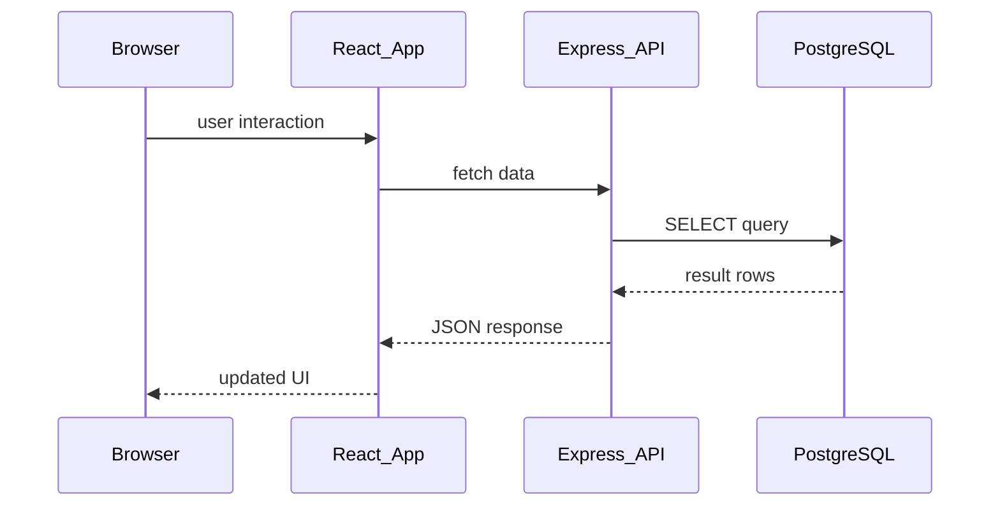

> Include 2 patterns at this level.

---

## Clean Code

### Naming Conventions

| Bad ❌ | Good ✅ | Why |
|--------|---------|-----|
| `const d = fetchData()` | `const users = fetchUsers()` | Describes what it holds |
| `function proc(x)` | `function calculateTotalPrice(items)` | Describes what it does |
| `const flag = true` | `const isLoading = true` | Boolean prefix makes intent clear |

### Function Design

❌ Anti-pattern:
```typescript
// Bad — does too many things
async function handleSubmit(data: any) {
  // validate, call API, update state, show toast, redirect...
}
```

✅ Better:
```typescript
// Good — single responsibility
async function submitUserForm(data: UserFormData): Promise<void> {
  const validated = validateUserForm(data);
  const user = await createUser(validated);
  showSuccessToast(`Welcome, ${user.name}!`);
  redirectToProfile(user.id);
}
```

---

## Product Use / Feature

### 1. {{Product/Tool Name}}

- **How it uses {{TOPIC_NAME}}:** Brief description
- **Why it matters:** Practical impact

> 3-5 real products/tools.

---

## Error Handling

### Error 1: {{Common error}}

```typescript
// Code that produces this error
```

**Why it happens:** Simple explanation.
**How to fix:**

```typescript
// Corrected code
```

### Error Handling Pattern

```typescript
// Frontend: error boundary
class ErrorBoundary extends React.Component {
  state = { hasError: false };

  static getDerivedStateFromError() {
    return { hasError: true };
  }

  render() {
    if (this.state.hasError) {
      return <h1>Something went wrong.</h1>;
    }
    return this.props.children;
  }
}
```

---

## Security Considerations

### 1. {{Security concern — e.g., XSS}}

```typescript
// ❌ Insecure
function renderHTML(userInput: string) {
  return <div dangerouslySetInnerHTML={{ __html: userInput }} />;
}

// ✅ Secure
function renderText(userInput: string) {
  return <div>{userInput}</div>; // React escapes by default
}
```

**Risk:** XSS attacks, data injection.
**Mitigation:** Never use `dangerouslySetInnerHTML` with user data.

---

## Performance Tips

### Tip 1: {{Performance optimization}}

```typescript
// ❌ Slow approach
...

// ✅ Faster approach
...
```

---

## Metrics & Analytics

| Metric | Why it matters | Tool |
|--------|---------------|------|
| **API response time** | User experience | Chrome DevTools, Datadog |
| **Bundle size** | Page load performance | webpack-bundle-analyzer |
| **Database query time** | Backend performance | pg_stat_statements |

---

## Best Practices

- **Do this:** Explanation
- **Do this:** Explanation

---

## Edge Cases & Pitfalls

### Pitfall 1: {{name}}

```typescript
// Code that demonstrates the pitfall
```

**What happens:** Explanation.
**How to fix:** Solution.

---

## Common Mistakes

### Mistake 1: {{description}}

```typescript
// ❌ Wrong way
...

// ✅ Correct way
...
```

---

## Common Misconceptions

### Misconception 1: "{{False belief}}"

**Reality:** {{What's actually true}}

---

## Tricky Points

### Tricky Point 1: {{name}}

```typescript
// Code that might surprise a junior
```

**Why it's tricky:** Explanation.

---

## Test

### Multiple Choice

**1. {{Question}}?**

- A) Option A
- B) Option B
- C) Option C
- D) Option D

<details>
<summary>Answer</summary>
**C)** — Explanation.
</details>

### What's the Output?

**2. What does this code produce?**

```typescript
// code snippet
```

<details>
<summary>Answer</summary>
Output: `...`
Explanation: ...
</details>

---

## Tricky Questions

**1. {{Confusing question}}?**

- A) {{Looks correct but wrong}}
- B) {{Correct answer}}
- C) {{Common misconception}}
- D) {{Partially correct}}

<details>
<summary>Answer</summary>
**B)** — Explanation.
</details>

---

## Cheat Sheet

| What | Syntax / Command | Example |
|------|-----------------|---------|
| {{Action 1}} | `{{syntax}}` | `{{example}}` |
| {{Action 2}} | `{{syntax}}` | `{{example}}` |

---

## Self-Assessment Checklist

### I can explain:
- [ ] What {{TOPIC_NAME}} is and why it exists
- [ ] When to use it and when NOT to use it

### I can do:
- [ ] Write a basic React component + Express route from scratch
- [ ] Connect frontend to backend and display data
- [ ] Handle loading and error states

---

## Summary

- Key point 1
- Key point 2

**Next step:** What to learn after this topic.

---

## What You Can Build

### Projects you can create:
- **{{Project 1}}:** A simple CRUD web app
- **{{Project 2}}:** A user authentication flow
- **{{Project 3}}:** A real-time dashboard

### Learning path:

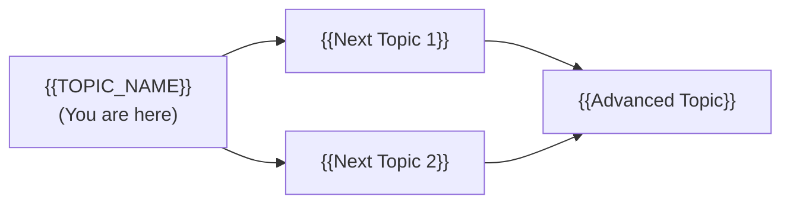

---

## Further Reading

- **Official docs:** [{{link title}}]({{url}})
- **Blog post:** [{{link title}}]({{url}})

---

## Related Topics

- **[{{Related Topic 1}}](../XX-related-topic/)** — how it connects
- **[{{Related Topic 2}}](../XX-related-topic/)** — how it connects

---

## Diagrams & Visual Aids

### Mind Map

```mermaid
mindmap
  root(({{TOPIC_NAME}}))
    Frontend
      React
      TypeScript
    Backend
      Node.js
      Express
    Database
      PostgreSQL
      SQL
```

</details>

---
---

# TEMPLATE 2 — `middle.md`

<details open>
<summary><strong>Template Content</strong></summary>

# {{TOPIC_NAME}} — Middle Level

## Table of Contents

1. [Introduction](#introduction)
2. [Core Concepts](#core-concepts)
3. [Pros & Cons](#pros--cons)
4. [Use Cases](#use-cases)
5. [Code Examples](#code-examples)
6. [Coding Patterns](#coding-patterns)
7. [Clean Code](#clean-code)
8. [Product Use / Feature](#product-use--feature)
9. [Error Handling](#error-handling)
10. [Security Considerations](#security-considerations)
11. [Performance Optimization](#performance-optimization)
12. [Metrics & Analytics](#metrics--analytics)
13. [Debugging Guide](#debugging-guide)
14. [Best Practices](#best-practices)
15. [Edge Cases & Pitfalls](#edge-cases--pitfalls)
16. [Common Mistakes](#common-mistakes)
17. [Tricky Points](#tricky-points)
18. [Test](#test)
19. [Tricky Questions](#tricky-questions)
20. [Cheat Sheet](#cheat-sheet)
21. [Summary](#summary)
22. [What You Can Build](#what-you-can-build)
23. [Further Reading](#further-reading)
24. [Related Topics](#related-topics)
25. [Diagrams & Visual Aids](#diagrams--visual-aids)

---

## Introduction

> Focus: "Why?" and "When to use?"

Assumes the reader already knows basic React + Express. This level covers:
- Production patterns for full-stack applications
- Database design and query optimization
- Authentication, caching, and deployment

---

## Core Concepts

### Concept 1: {{Advanced concept}}

Detailed explanation with diagrams.

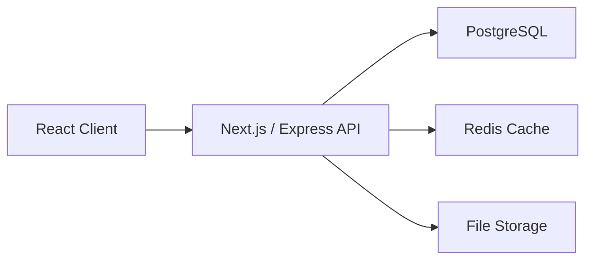

---

## Pros & Cons

| Pros | Cons |
|------|------|
| {{Advantage 1}} | {{Disadvantage 1}} |
| {{Advantage 2}} | {{Disadvantage 2}} |

### Comparison with alternatives:

| Approach | Pros | Cons | Best for |
|----------|------|------|----------|
| {{Approach A}} | {{pros}} | {{cons}} | {{scenario}} |
| {{Approach B}} | {{pros}} | {{cons}} | {{scenario}} |

---

## Code Examples

### Example 1: {{Production-ready full-stack pattern}}

```typescript
// React: data fetching with proper loading/error states
import { useState, useEffect } from 'react';

interface FetchState<T> {
  data: T | null;
  loading: boolean;
  error: string | null;
}

function useFetch<T>(url: string): FetchState<T> {
  const [state, setState] = useState<FetchState<T>>({
    data: null,
    loading: true,
    error: null,
  });

  useEffect(() => {
    let cancelled = false;

    fetch(url)
      .then(res => {
        if (!res.ok) throw new Error(`HTTP ${res.status}`);
        return res.json();
      })
      .then(data => {
        if (!cancelled) setState({ data, loading: false, error: null });
      })
      .catch(err => {
        if (!cancelled) setState({ data: null, loading: false, error: err.message });
      });

    return () => { cancelled = true; };
  }, [url]);

  return state;
}
```

### Example 2: {{Database — PostgreSQL schema}}

```sql
-- Well-designed PostgreSQL schema with indexes
CREATE TABLE users (
    id          BIGSERIAL PRIMARY KEY,
    email       VARCHAR(255) NOT NULL UNIQUE,
    name        VARCHAR(100) NOT NULL,
    created_at  TIMESTAMPTZ  NOT NULL DEFAULT NOW(),
    updated_at  TIMESTAMPTZ  NOT NULL DEFAULT NOW()
);

CREATE INDEX idx_users_email ON users(email);
CREATE INDEX idx_users_created_at ON users(created_at DESC);

-- Trigger: auto-update updated_at
CREATE OR REPLACE FUNCTION update_updated_at()
RETURNS TRIGGER AS $$
BEGIN NEW.updated_at = NOW(); RETURN NEW; END;
$$ LANGUAGE plpgsql;

CREATE TRIGGER users_updated_at
    BEFORE UPDATE ON users
    FOR EACH ROW EXECUTE FUNCTION update_updated_at();
```

---

## Coding Patterns

### Pattern 1: {{Repository Pattern}}

**Category:** Structural / Data Access
**Intent:** Decouple business logic from database access
**When to use:** When you want testable business logic
**When NOT to use:** Simple CRUD with no business logic

**Structure diagram:**

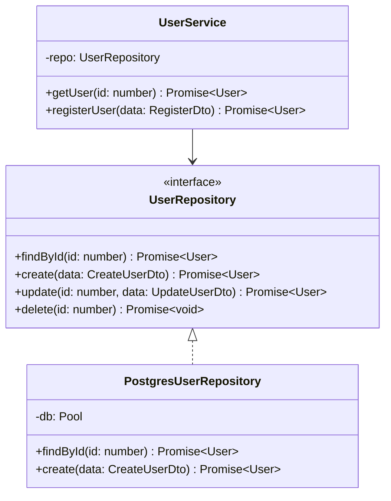

**Implementation:**

```typescript
interface UserRepository {
  findById(id: number): Promise<User | null>;
  create(data: CreateUserDto): Promise<User>;
  update(id: number, data: UpdateUserDto): Promise<User>;
  delete(id: number): Promise<void>;
}

class PostgresUserRepository implements UserRepository {
  constructor(private db: Pool) {}

  async findById(id: number): Promise<User | null> {
    const result = await this.db.query('SELECT * FROM users WHERE id = $1', [id]);
    return result.rows[0] ?? null;
  }

  async create(data: CreateUserDto): Promise<User> {
    const result = await this.db.query(
      'INSERT INTO users (email, name) VALUES ($1, $2) RETURNING *',
      [data.email, data.name]
    );
    return result.rows[0];
  }
}
```

---

### Pattern 2: {{Middleware Chain Pattern}}

**Category:** Behavioral / Express
**Intent:** Compose request processing as a pipeline

**Flow diagram:**

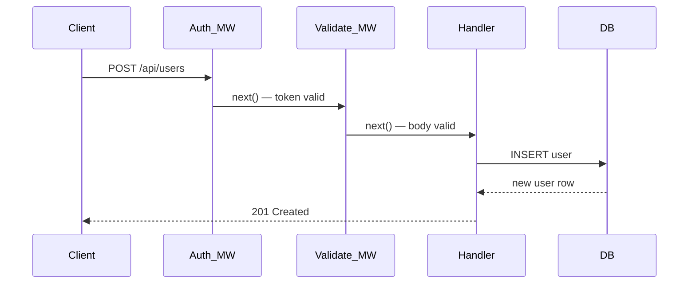

```typescript
// Middleware chain
const createUserRoute = [
  authenticate,        // verify JWT
  validateBody(schema), // validate request body
  rateLimiter,         // rate limit
  async (req, res) => {
    const user = await userRepo.create(req.body);
    res.status(201).json(user);
  },
];

router.post('/users', ...createUserRoute);
```

---

### Pattern 3: {{Service Layer Pattern}}

**Intent:** Centralize business logic separate from HTTP handlers

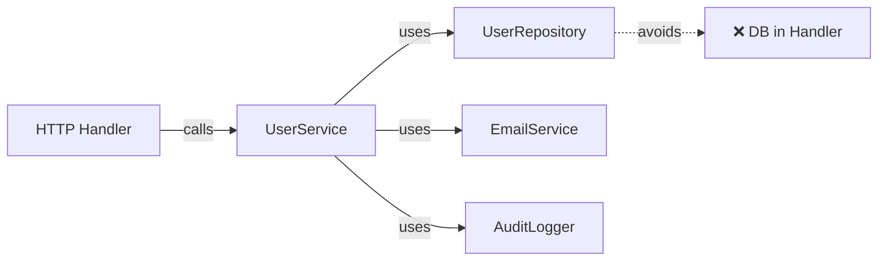

```typescript
// ❌ Non-idiomatic — business logic in HTTP handler
router.post('/users', async (req, res) => {
  const hash = bcrypt.hashSync(req.body.password, 10);
  const user = await db.query('INSERT...', [req.body.email, hash]);
  await sendEmail(user.email, 'Welcome!');
  res.json(user);
});

// ✅ Idiomatic — thin handler, fat service
router.post('/users', async (req, res) => {
  const user = await userService.register(req.body);
  res.status(201).json(user);
});
```

---

## Clean Code

### Naming & Readability

```typescript
// ❌ Cryptic
async function proc(u: any, p: string): Promise<any>

// ✅ Self-documenting
async function authenticateUser(email: string, password: string): Promise<AuthToken>
```

| Element | Rule | Example |
|---------|------|---------|
| Components | PascalCase noun | `UserProfile`, `OrderList` |
| Hooks | `use` prefix | `useAuth`, `useUserData` |
| API routes | REST nouns | `/api/users`, `/api/orders/:id` |
| DB functions | Verb + noun | `findUserById`, `createOrder` |

### SOLID in Practice

```typescript
// Single Responsibility
// ❌ One component doing everything
function Dashboard() {
  // fetches data, formats it, renders charts, handles errors...
}

// ✅ Split responsibilities
function Dashboard() {
  const { data, loading } = useDashboardData();
  if (loading) return <Spinner />;
  return <DashboardCharts data={data} />;
}
```

---

## Product Use / Feature

### 1. {{Product/Tool Name}}

- **How it uses {{TOPIC_NAME}}:** Description
- **Scale:** Numbers

---

## Error Handling

### Pattern 1: Centralized Express error handler

```typescript
// Global error handler — must be last middleware
app.use((err: Error, req: Request, res: Response, next: NextFunction) => {
  console.error(err);

  if (err instanceof ValidationError) {
    return res.status(400).json({ error: err.message, fields: err.fields });
  }

  if (err instanceof NotFoundError) {
    return res.status(404).json({ error: err.message });
  }

  if (err instanceof UnauthorizedError) {
    return res.status(401).json({ error: 'Unauthorized' });
  }

  res.status(500).json({ error: 'Internal server error' });
});
```

### Common Error Patterns

| Situation | Pattern | Example |
|-----------|---------|---------|
| Async errors | `try/catch` + next(err) | `catch (e) { next(e) }` |
| Validation | Throw domain error | `throw new ValidationError(...)` |
| Not found | 404 with helpful message | `throw new NotFoundError('User')` |
| Auth failure | 401 or 403 | `throw new UnauthorizedError()` |

---

## Security Considerations

### 1. SQL Injection

**Risk level:** Critical

```typescript
// ❌ Vulnerable — string interpolation
const user = await db.query(`SELECT * FROM users WHERE id = ${req.params.id}`);

// ✅ Secure — parameterized query
const user = await db.query('SELECT * FROM users WHERE id = $1', [req.params.id]);
```

### Security Checklist

- [ ] All DB queries use parameterized statements
- [ ] JWT secrets stored in environment variables
- [ ] Passwords hashed with bcrypt (cost factor ≥ 12)
- [ ] CORS configured to allow only known origins
- [ ] Input validation on every API endpoint
- [ ] Rate limiting on auth endpoints

---

## Performance Optimization

### Optimization 1: Database query caching with Redis

```typescript
// ❌ Slow — DB query on every request
async function getUser(id: number): Promise<User> {
  const result = await db.query('SELECT * FROM users WHERE id = $1', [id]);
  return result.rows[0];
}

// ✅ Fast — Redis cache with TTL
async function getUser(id: number): Promise<User> {
  const cacheKey = `user:${id}`;
  const cached = await redis.get(cacheKey);

  if (cached) return JSON.parse(cached);

  const result = await db.query('SELECT * FROM users WHERE id = $1', [id]);
  const user = result.rows[0];

  await redis.setEx(cacheKey, 300, JSON.stringify(user)); // TTL: 5 min
  return user;
}
```

### Performance Decision Matrix

| Scenario | Approach | Why |
|----------|----------|-----|
| Frequently read, rarely changed | Redis cache | Eliminate DB round-trip |
| Complex join query | Materialized view | Pre-compute |
| Large list endpoint | Pagination | Limit response size |
| File upload | Streaming | Avoid loading to memory |

---

## Metrics & Analytics

### Key Metrics

| Metric | Type | Description | Alert threshold |
|--------|------|-------------|-----------------|
| **http_request_duration_ms p50** | Histogram | API latency | > 500ms |
| **http_request_duration_ms p99** | Histogram | Tail latency | > 2000ms |
| **db_query_duration_ms** | Histogram | Query time | > 100ms |
| **http_error_rate** | Gauge | 5xx rate | > 1% |

---

## Debugging Guide

### Problem 1: N+1 query problem

**Symptoms:** API is slow; DB shows hundreds of identical queries per request.

**Diagnostic steps:**
```typescript
// Add query logging
const pool = new Pool({
  ...config,
  log: (msg) => console.log('[DB]', msg),
});
```

**Root cause:** Loading a list, then querying for each item's related data.
**Fix:** Use JOIN or DataLoader for batch fetching.

---

## Best Practices

- **Practice 1:** Always use TypeScript strict mode — catches runtime errors at compile time
- **Practice 2:** Use database transactions for multi-step operations

---

## Edge Cases & Pitfalls

### Pitfall 1: Race condition in concurrent updates

```typescript
// Two requests simultaneously update the same record
// Both read balance=100, both write balance=110 (should be 120)
```

**Impact:** Data corruption.
**Fix:** Use database transactions with `SELECT FOR UPDATE`.

---

## Common Mistakes

### Mistake 1: Not handling async errors in Express

```typescript
// ❌ Unhandled promise rejection crashes Node.js
router.get('/users', async (req, res) => {
  const users = await db.query('...');  // throws — uncaught!
  res.json(users);
});

// ✅ Always wrap async handlers
router.get('/users', async (req, res, next) => {
  try {
    const users = await db.query('...');
    res.json(users);
  } catch (err) {
    next(err);
  }
});
```

---

## Test

### Multiple Choice (harder)

**1. {{Question about REST API design}}?**

- A) ...
- B) ...
- C) ...
- D) ...

<details>
<summary>Answer</summary>
**B)** — Detailed explanation.
</details>

---

## Tricky Questions

**1. What is the difference between `401 Unauthorized` and `403 Forbidden`?**

- A) They are the same
- B) 401 = not authenticated, 403 = authenticated but not authorized
- C) 401 = not authorized, 403 = server error
- D) 401 is deprecated

<details>
<summary>Answer</summary>
**B)** — 401 means the client has not authenticated (send credentials). 403 means the client is authenticated but lacks permission (don't bother retrying with same credentials).
</details>

---

## Cheat Sheet

| Scenario | Pattern | Key consideration |
|----------|---------|-------------------|
| Read-heavy endpoint | Redis cache | Set appropriate TTL |
| Write operation | DB transaction | Rollback on error |
| Auth check | JWT middleware | Verify signature + expiry |
| Pagination | LIMIT + OFFSET or cursor | Cursor for large datasets |

---

## Summary

- Key insight 1: Repository pattern enables testable business logic
- Key insight 2: Always handle async errors explicitly

**Next step:** Senior level — distributed systems, caching strategies, performance architecture.

---

## What You Can Build

### Production systems:
- **Full-stack SaaS App:** Authentication + CRUD + dashboard
- **REST API with caching:** Node.js + PostgreSQL + Redis

---

## Further Reading

- **Official docs:** [{{link title}}]({{url}})
- **Blog post:** [{{link title}}]({{url}})

---

## Diagrams & Visual Aids

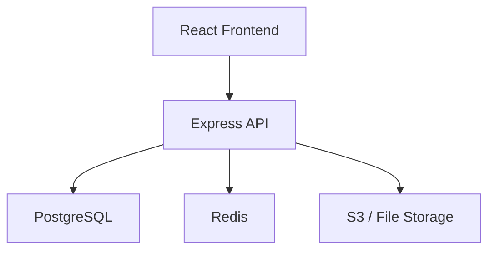

</details>

---
---

# TEMPLATE 3 — `senior.md`

<details open>
<summary><strong>Template Content</strong></summary>

# {{TOPIC_NAME}} — Senior Level

## Table of Contents

1. [Introduction](#introduction)
2. [Core Concepts](#core-concepts)
3. [Pros & Cons](#pros--cons)
4. [Use Cases](#use-cases)
5. [Code Examples](#code-examples)
6. [Coding Patterns](#coding-patterns)
7. [Clean Code](#clean-code)
8. [Best Practices](#best-practices)
9. [Product Use / Feature](#product-use--feature)
10. [Error Handling](#error-handling)
11. [Security Considerations](#security-considerations)
12. [Performance Optimization](#performance-optimization)
13. [Metrics & Analytics](#metrics--analytics)
14. [Debugging Guide](#debugging-guide)
15. [Edge Cases & Pitfalls](#edge-cases--pitfalls)
16. [Postmortems & System Failures](#postmortems--system-failures)
17. [Common Mistakes](#common-mistakes)
18. [Tricky Points](#tricky-points)
19. [Test](#test)
20. [Tricky Questions](#tricky-questions)
21. [Cheat Sheet](#cheat-sheet)
22. [Summary](#summary)
23. [What You Can Build](#what-you-can-build)
24. [Further Reading](#further-reading)
25. [Related Topics](#related-topics)
26. [Diagrams & Visual Aids](#diagrams--visual-aids)

---

## Introduction

> Focus: "How to optimize?" and "How to architect?"

For full-stack developers who:
- Design scalable web application architectures
- Optimize performance across the entire stack
- Make technology and architectural decisions
- Mentor junior/middle developers

---

## Core Concepts

### Concept 1: {{Architecture-level concept}}

Deep dive with benchmark comparisons:

```typescript
// Benchmark: connection pooling impact
import { Pool } from 'pg';

// Without pooling — new connection per request (slow)
// 1000 requests: ~2000ms avg (150ms connection overhead each)

// With pooling — reuse connections
const pool = new Pool({ max: 20 });
// 1000 requests: ~50ms avg (0ms connection overhead)
```

Results:
```
Without pool:  2000ms avg, 150ms connection overhead
With pool:       50ms avg, ~0ms connection overhead
```

---

## Code Examples

### Example 1: {{Architecture pattern — e.g., CQRS}}

```typescript
// Command/Query Responsibility Segregation
interface WriteOrderCommand {
  userId: number;
  items: CartItem[];
  shippingAddress: Address;
}

interface OrderSummaryQuery {
  userId: number;
  dateRange: DateRange;
}

class OrderCommandHandler {
  async handle(cmd: WriteOrderCommand): Promise<Order> {
    return this.db.transaction(async (tx) => {
      const order = await tx.createOrder(cmd);
      await tx.reserveInventory(cmd.items);
      await this.events.publish('order.created', order);
      return order;
    });
  }
}

class OrderQueryHandler {
  async handle(query: OrderSummaryQuery): Promise<OrderSummary[]> {
    // Can use read replica or pre-aggregated view
    return this.readReplica.query(`
      SELECT o.id, o.total_usd, o.status, o.created_at
      FROM orders o
      WHERE o.user_id = $1
        AND o.created_at BETWEEN $2 AND $3
      ORDER BY o.created_at DESC
    `, [query.userId, query.dateRange.from, query.dateRange.to]);
  }
}
```

---

## Coding Patterns

### Pattern 1: {{Architectural pattern — e.g., Event-Driven Architecture}}

**Category:** Architectural / Distributed Systems
**Intent:** Decouple services via async events
**Problem it solves:** Synchronous coupling causes cascading failures

**Architecture diagram:**

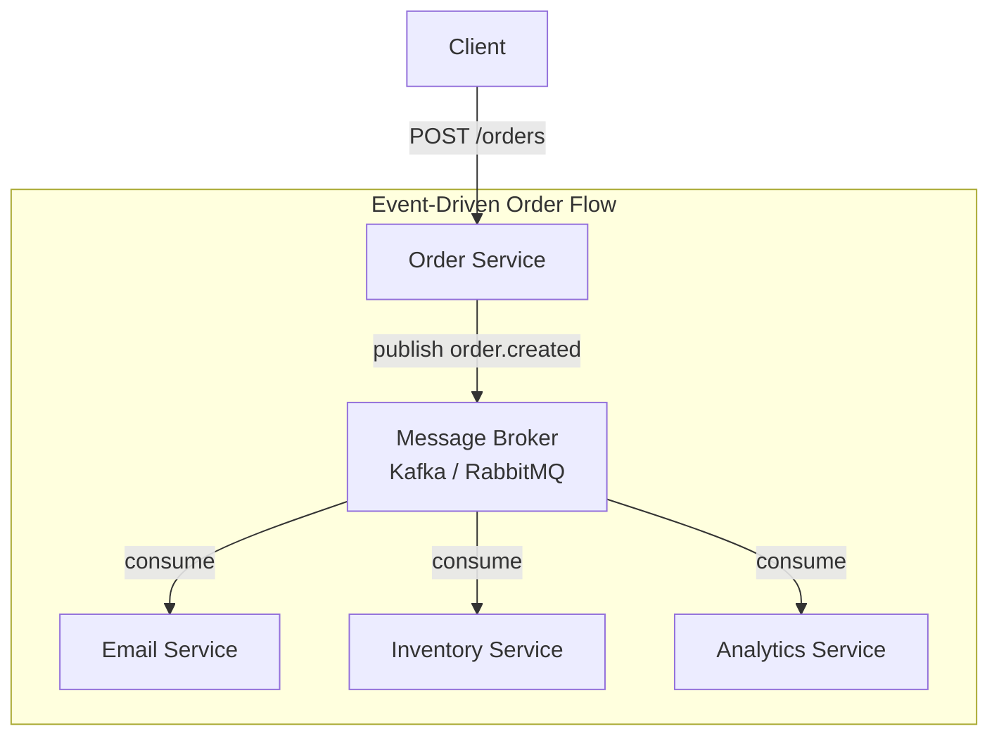

**Implementation:**

```typescript
// Event publisher
class OrderService {
  async createOrder(dto: CreateOrderDto): Promise<Order> {
    const order = await this.orderRepo.create(dto);
    await this.eventBus.publish('order.created', {
      orderId: order.id,
      userId: dto.userId,
      total: order.total,
      timestamp: new Date().toISOString(),
    });
    return order;
  }
}

// Event consumer
class EmailService {
  @EventHandler('order.created')
  async onOrderCreated(event: OrderCreatedEvent): Promise<void> {
    await this.emailProvider.sendConfirmation(event.userId, event.orderId);
  }
}
```

---

### Pattern 2: {{Circuit Breaker Pattern}}

**Category:** Resilience
**Intent:** Prevent cascading failures when a dependency is down

**State diagram:**

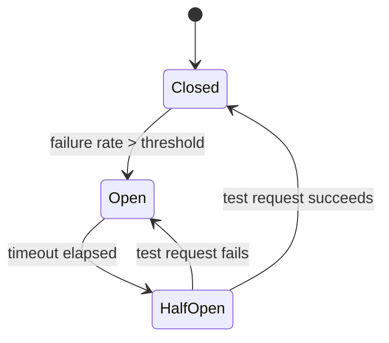

```typescript
class CircuitBreaker {
  private state: 'closed' | 'open' | 'half-open' = 'closed';
  private failures = 0;
  private lastFailureTime?: number;

  async call<T>(fn: () => Promise<T>): Promise<T> {
    if (this.state === 'open') {
      if (Date.now() - this.lastFailureTime! > this.timeout) {
        this.state = 'half-open';
      } else {
        throw new Error('Circuit breaker open');
      }
    }

    try {
      const result = await fn();
      this.onSuccess();
      return result;
    } catch (err) {
      this.onFailure();
      throw err;
    }
  }
}
```

---

### Pattern 3: {{Database per Service Pattern}}

**Category:** Microservices / Data Architecture
**Intent:** Each service owns its data — no shared database

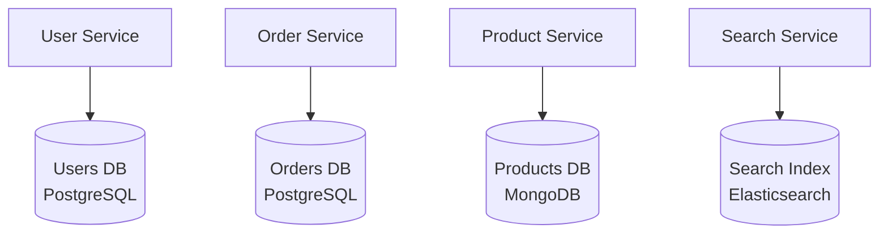

---

### Pattern 4: {{BFF — Backend for Frontend}}

**Category:** API Design
**Intent:** API layer tailored to each client's needs

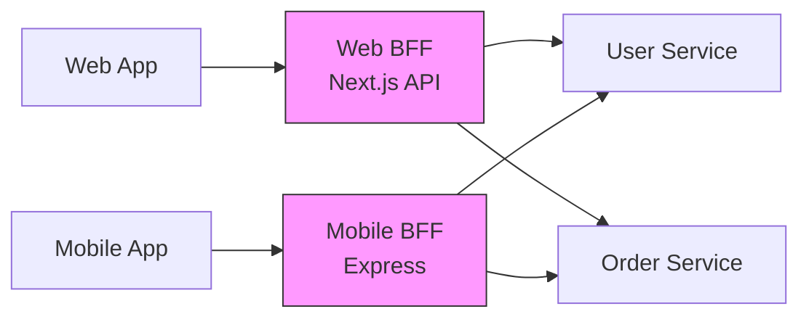

### Pattern Comparison Matrix

| Pattern | Use When | Avoid When | Complexity |
|---------|----------|------------|------------|
| Event-Driven | Services need to react to changes | Strong consistency required | High |
| Circuit Breaker | Calling unreliable external services | Internal calls only | Medium |
| DB per Service | Independent scaling needed | Transactions across services | High |
| BFF | Multiple client types | Single client type | Medium |

---

## Clean Code

### Clean Architecture Boundaries

```typescript
// ❌ Layering violation — controller accesses DB directly
class OrderController {
  async createOrder(req: Request, res: Response) {
    const order = await pool.query('INSERT INTO orders...', [...]); // DB in controller!
  }
}

// ✅ Clean dependency flow
class OrderController {
  constructor(private orderService: OrderService) {}

  async createOrder(req: Request, res: Response) {
    const order = await this.orderService.createOrder(req.body);
    res.status(201).json(order);
  }
}
```

**Dependency flow:**
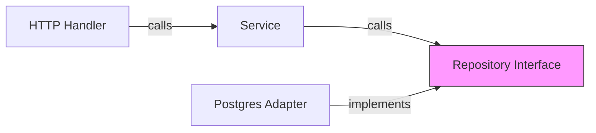

---

### Code Review Checklist (Senior)

- [ ] No business logic in HTTP handlers
- [ ] All DB queries use parameterized statements
- [ ] Transactions used for multi-step writes
- [ ] Proper indexes on all JOIN and WHERE columns
- [ ] N+1 queries identified and fixed
- [ ] Error handling at every async boundary
- [ ] Environment-specific config in .env, not hardcoded

---

## Best Practices

### Must Do ✅

1. **Use database transactions for multi-step writes**
   ```typescript
   async function transferFunds(fromId: number, toId: number, amount: number) {
     await db.transaction(async (tx) => {
       await tx.query('UPDATE accounts SET balance = balance - $1 WHERE id = $2', [amount, fromId]);
       await tx.query('UPDATE accounts SET balance = balance + $1 WHERE id = $2', [amount, toId]);
     });
   }
   ```

2. **Use connection pooling — never create a new DB connection per request**
   ```typescript
   // ❌ New connection per request
   const client = new Client(config); await client.connect();
   // ✅ Pool — reuse connections
   const pool = new Pool({ max: 20, idleTimeoutMillis: 30000 });
   ```

3. **Index your foreign keys and common WHERE columns**
   ```sql
   CREATE INDEX idx_orders_user_id ON orders(user_id);
   CREATE INDEX idx_orders_created_at ON orders(created_at DESC);
   ```

### Never Do ❌

1. **Never store plaintext passwords** — use bcrypt with cost ≥ 12
2. **Never use `SELECT *` in production** — list columns explicitly
3. **Never trust user input** — validate and sanitize everything

### Full-Stack Architecture Checklist

- [ ] Authentication: JWT with proper expiry and refresh token rotation
- [ ] Authorization: check permissions at API layer, not just UI
- [ ] Rate limiting: protect all public endpoints
- [ ] Database: connection pool configured, slow query logging enabled
- [ ] Caching: cache strategy defined (TTL, invalidation)
- [ ] Error handling: global error handler, structured logging
- [ ] Security: CORS, helmet, CSP headers configured
- [ ] Deployment: environment variables, health check endpoint, graceful shutdown
- [ ] Observability: structured logs, distributed tracing, metrics endpoint
- [ ] Performance: N+1 queries fixed, pagination on all list endpoints

---

## Product Use / Feature

### 1. {{Company/Product Name}}

- **Architecture:** How they implement {{TOPIC_NAME}} at scale
- **Scale:** Specific numbers

---

## Error Handling

### Enterprise-grade error hierarchy

```typescript
class AppError extends Error {
  constructor(
    public readonly code: string,
    message: string,
    public readonly statusCode: number,
    public readonly isOperational: boolean = true,
  ) {
    super(message);
    this.name = this.constructor.name;
  }
}

class ValidationError extends AppError {
  constructor(message: string, public readonly fields: Record<string, string>) {
    super('VALIDATION_ERROR', message, 400);
  }
}

class NotFoundError extends AppError {
  constructor(resource: string) {
    super('NOT_FOUND', `${resource} not found`, 404);
  }
}
```

---

## Security Considerations

### Threat Model

| Threat | Likelihood | Impact | Mitigation |
|--------|:---------:|:------:|------------|
| SQL Injection | High | Critical | Parameterized queries |
| XSS | High | High | CSP headers, input sanitization |
| CSRF | Medium | High | CSRF tokens, SameSite cookies |
| JWT compromise | Medium | Critical | Short expiry + refresh rotation |
| DoS | Medium | High | Rate limiting, request size limits |

---

## Performance Optimization

### Optimization 1: Eliminate N+1 queries

```typescript
// Before — N+1: 1 query for orders + N queries for users
const orders = await db.query('SELECT * FROM orders LIMIT 100');
for (const order of orders.rows) {
  order.user = await db.query('SELECT * FROM users WHERE id = $1', [order.user_id]);
}

// After — single JOIN query
const orders = await db.query(`
  SELECT o.*, u.name AS user_name, u.email AS user_email
  FROM orders o
  JOIN users u ON o.user_id = u.id
  ORDER BY o.created_at DESC
  LIMIT 100
`);
```

**Benchmark proof:**
```
N+1 (100 orders):    ~2500ms (1 + 100 queries × 25ms avg)
JOIN query:            ~15ms (single optimized query)
```

---

## Metrics & Analytics

### SLO / SLA Definition

| SLI | SLO Target | Window | Consequence |
|-----|-----------|--------|-------------|
| **API p50 latency** | < 100ms | 5 min | Warning |
| **API p99 latency** | < 1000ms | 5 min | PagerDuty |
| **Error rate (5xx)** | < 0.1% | 1 hour | Incident |
| **DB pool exhaustion** | 0 events | 1 day | Alert |

---

## Postmortems & System Failures

### The Connection Pool Exhaustion Incident

- **The goal:** Handle a marketing campaign spike of 5x normal traffic
- **The mistake:** DB pool `max` set to 10 — each request held a connection for 800ms
- **The impact:** All connections exhausted → 100% 503 errors for 20 minutes
- **The fix:** Increased pool to 50, added query timeout, added pool exhaustion alert

**Key takeaway:** Always load-test with realistic traffic spikes. Monitor pool utilization, not just query time.

---

## Test

### Architecture Questions

**1. You're building a system that processes 10,000 order submissions per second. Which architecture is best?**

- A) Single Express server with PostgreSQL
- B) Load-balanced Node.js cluster + PostgreSQL with read replicas + Redis
- C) Microservices with message queues for async processing
- D) GraphQL with REST fallback

<details>
<summary>Answer</summary>
**C)** — At 10K req/s, synchronous processing would require 100+ servers. Async message queue (Kafka/RabbitMQ) absorbs bursts, enables independent scaling of producers and consumers, and provides durability if consumers are slow.
</details>

---

## Tricky Questions

**1. Why can't you use `SELECT * FROM orders ORDER BY created_at DESC LIMIT 10 OFFSET 10000` for pagination in production?**

<details>
<summary>Answer</summary>
OFFSET pagination requires scanning and discarding all preceding rows. At OFFSET 10000, PostgreSQL scans 10010 rows to return 10. At OFFSET 1000000, it scans 1 million rows. Use cursor-based pagination: `WHERE created_at < :last_cursor ORDER BY created_at DESC LIMIT 10` — constant O(log n) cost regardless of page.
</details>

---

## Cheat Sheet

### Architecture Decision Matrix

| Scenario | Recommended | Avoid | Why |
|----------|-------------|-------|-----|
| < 1K req/s | Monolith + single DB | Microservices | Complexity overkill |
| > 10K req/s | Message queue + async | Synchronous chains | Absorbs bursts |
| Read-heavy | Read replica + Redis | Write DB for reads | Reduces write DB load |
| Strong consistency | DB transaction | Eventual consistency | Data correctness |

### Performance Quick Wins

| Optimization | When to apply | Expected improvement |
|-------------|---------------|---------------------|
| DB connection pool | Always | 10-50x throughput |
| Redis cache | Read-heavy, stable data | 100x latency |
| Fix N+1 queries | List endpoints | 10-1000x |
| Add DB indexes | Slow WHERE/JOIN | 10-100x |
| Pagination | List endpoints | Prevents OOM |

---

## Summary

- Clean architecture: separate concerns, invert dependencies
- Performance: fix N+1, use connection pooling, add indexes
- Reliability: circuit breakers, transactions, graceful degradation

---

## What You Can Build

### Architect and lead:
- **Scalable SaaS Platform:** Multi-tenant, horizontally scaled
- **Real-time Application:** WebSocket + Redis pub/sub

### Career impact:
- **Staff Engineer** — system design interviews require this depth
- **Tech Lead** — define architecture standards for the team

---

## Further Reading

- **Book:** "Designing Data-Intensive Applications" — Kleppmann
- **Blog:** [The Twelve-Factor App](https://12factor.net/)

---

## Diagrams & Visual Aids

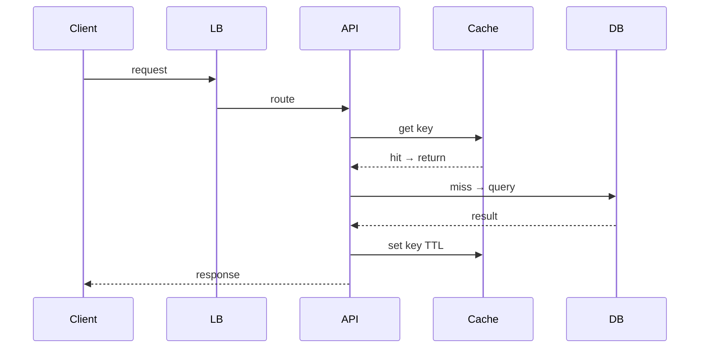

</details>

---
---

# TEMPLATE 4 — `professional.md`

<details open>
<summary><strong>Template Content</strong></summary>

# {{TOPIC_NAME}} — Full-Stack System Internals

## Table of Contents

1. [Introduction](#introduction)
2. [HTTP Request Lifecycle](#http-request-lifecycle)
3. [Browser Rendering Pipeline](#browser-rendering-pipeline)
4. [Node.js Event Loop Internals](#nodejs-event-loop-internals)
5. [Database Connection Pooling Internals](#database-connection-pooling-internals)
6. [TCP/TLS Handshake](#tcptls-handshake)
7. [Memory Layout](#memory-layout)
8. [Performance Internals](#performance-internals)
9. [Edge Cases at the Lowest Level](#edge-cases-at-the-lowest-level)
10. [Test](#test)
11. [Tricky Questions](#tricky-questions)
12. [Summary](#summary)
13. [Further Reading](#further-reading)
14. [Diagrams & Visual Aids](#diagrams--visual-aids)

---

## Introduction

> Focus: "What happens under the hood?"

This document explores what happens internally in a full-stack application:
- The full lifecycle of an HTTP request from browser to database
- How the browser renders HTML/CSS/JS
- How Node.js event loop processes async I/O
- How database connection pooling works internally

---

## HTTP Request Lifecycle

### Every request from browser to database:

```
Browser: user types URL → press Enter
    1. DNS resolution: domain → IP address
       (DNS cache → OS → /etc/hosts → resolver → root → TLD → authoritative)
    2. TCP 3-way handshake
       SYN → SYN-ACK → ACK (1 RTT)
    3. TLS 1.3 handshake
       ClientHello → ServerHello + Certificate → Finished (1 RTT)
    4. HTTP/2 request sent
       HEADERS frame → DATA frame (multiplexed, compressed)
    5. Server receives request
       → OS networking stack → Node.js net module → HTTP parser
       → Express router → middleware chain → route handler
    6. DB query
       → pg Pool → take idle connection → send query over TCP
       → PostgreSQL parses → plans → executes → sends result
    7. Response
       → JSON.stringify → HTTP/2 DATA frame → TLS encrypt → TCP → browser
    8. Browser
       → JSON.parse → React re-render → DOM diff → DOM update → repaint
```

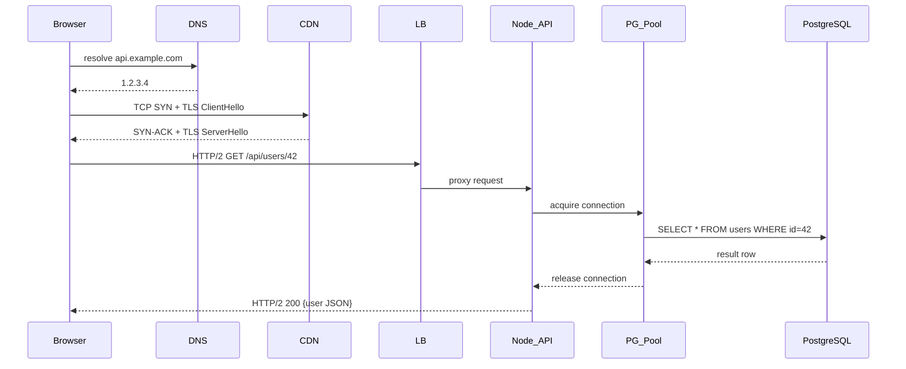

---

## Browser Rendering Pipeline

### From HTML bytes to pixels on screen:

```
1. Bytes → Characters → Tokens → Nodes → DOM tree
2. CSS bytes → CSSOM tree (parallel to DOM)
3. DOM + CSSOM → Render Tree (visible nodes only)
4. Layout (Reflow): calculate position and size of each node
5. Paint: fill in pixels for each layer
6. Composite: combine layers (GPU-accelerated)

Critical rendering path:
HTML → [parse] → DOM
CSS  → [parse] → CSSOM
DOM + CSSOM → Render Tree → Layout → Paint → Composite
                                                    │
                                                    └── display: 1 frame (16.7ms at 60fps)
```

```
Performance bottlenecks:
┌─────────────────────────────────────────────────────────┐
│ JavaScript on main thread:                              │
│   - Blocks HTML parsing (unless async/defer)            │
│   - Triggers synchronous layout if you read layout props│
│     after style changes (forced reflow = jank)          │
│                                                         │
│ Forced Reflow example:                                  │
│   el.style.width = '100px';  // style mutation         │
│   const h = el.offsetHeight; // READS layout → forces  │
│                               // synchronous reflow!    │
└─────────────────────────────────────────────────────────┘
```

```typescript
// ❌ Forced reflow (reads after write)
function badAnimation(elements: HTMLElement[]) {
  elements.forEach(el => {
    el.style.transform = `translateX(${el.offsetLeft}px)`; // read after write!
  });
}

// ✅ Batch reads then writes (no forced reflow)
function goodAnimation(elements: HTMLElement[]) {
  const positions = elements.map(el => el.offsetLeft);      // read all first
  elements.forEach((el, i) => {
    el.style.transform = `translateX(${positions[i]}px)`;   // write all after
  });
}
```

---

## Node.js Event Loop Internals

### The event loop phases (libuv):

```
Event Loop Tick:
┌─────────────────────────────────────────────┐
│ 1. timers      → setTimeout / setInterval   │
│ 2. pending I/O → I/O callbacks from prev    │
│ 3. idle/prepare → internal only             │
│ 4. poll        → wait for I/O events        │
│                  (this is where we spend     │
│                   most time waiting for DB)  │
│ 5. check       → setImmediate callbacks     │
│ 6. close       → close events               │
│                                             │
│ Between each phase:                         │
│   → drain nextTick queue                   │
│   → drain microtask queue (Promises)       │
└─────────────────────────────────────────────┘
```

```typescript
// Demonstrate event loop order
console.log('1: sync');

Promise.resolve().then(() => console.log('3: microtask'));
process.nextTick(() => console.log('2: nextTick'));
setImmediate(() => console.log('5: setImmediate'));
setTimeout(() => console.log('4: setTimeout 0'), 0);

console.log('1: sync end');

// Output: 1: sync → 1: sync end → 2: nextTick → 3: microtask → 4: setTimeout 0 → 5: setImmediate
```

### Why blocking the event loop is catastrophic

```
Event loop blocked by CPU-intensive work:
─────────────────────────────────────────
t=0ms: Request A arrives → starts processing
t=0ms: Request B arrives → queued (event loop busy)
t=0ms: Request C arrives → queued
...
t=200ms: CPU work done → Request A responds
t=200ms: Request B finally starts
t=400ms: Request B responds
t=400ms: Request C finally starts
...
All users experience 200ms × N latency spike!

Fix: Move CPU work to worker_threads or child_process
```

```typescript
// ❌ Blocks event loop — all other requests wait
app.get('/compute', (req, res) => {
  const result = expensiveCPUWork(); // 200ms of CPU → everything waits
  res.json(result);
});

// ✅ Use Worker Threads for CPU-bound work
import { Worker, workerData, parentPort } from 'worker_threads';

app.get('/compute', (req, res) => {
  const worker = new Worker('./worker.js', { workerData: req.query });
  worker.on('message', result => res.json(result));
  worker.on('error', err => res.status(500).json({ error: err.message }));
});
```

---

## Database Connection Pooling Internals

### How pg Pool manages connections:

```
pg.Pool internal state:
┌─────────────────────────────────────────────────────┐
│ Pool: max=20, idleTimeout=30s                        │
├─────────────────────────────────────────────────────┤
│ idle connections:     [conn1, conn2, conn3]          │
│   → established TCP + TLS to PostgreSQL             │
│   → ready for immediate use (no handshake needed)   │
├─────────────────────────────────────────────────────┤
│ active connections:   [conn4(query A), conn5(query B)]│
│   → currently executing a query                     │
├─────────────────────────────────────────────────────┤
│ waiting queue:        [req-101, req-102]             │
│   → max connections reached → requests queue here   │
│   → queue releases when a connection becomes idle   │
└─────────────────────────────────────────────────────┘
```

```typescript
// Pool configuration internals
const pool = new Pool({
  max: 20,                    // max open connections
  min: 2,                     // min idle connections (always ready)
  idleTimeoutMillis: 30000,   // close idle connections after 30s
  connectionTimeoutMillis: 2000, // fail fast if no connection available
  statement_timeout: 5000,    // kill queries running > 5s
});

// Monitor pool health
pool.on('connect', () => console.log('New DB connection created'));
pool.on('acquire', () => console.log('Connection acquired from pool'));
pool.on('remove', () => console.log('Connection removed from pool'));

// Check pool status
setInterval(() => {
  console.log({
    total: pool.totalCount,     // all connections (idle + active)
    idle: pool.idleCount,       // waiting for queries
    waiting: pool.waitingCount, // queries waiting for a connection
  });
}, 5000);
```

---

## TCP/TLS Handshake

### What happens before the first byte of data:

```
TCP 3-Way Handshake (1 RTT):
Browser                          Server
   │──────── SYN ─────────────────►│  "I want to connect"
   │◄──── SYN-ACK ─────────────────│  "OK, connect"
   │──────── ACK ─────────────────►│  "Connected"
   │                               │
   Time: 1 RTT = 50ms (US→EU)

TLS 1.3 Handshake (1 RTT additional):
   │── ClientHello (TLS 1.3) ─────►│  supported ciphers, key_share
   │◄─ ServerHello + Cert + Fin ───│  chosen cipher, public key, certificate
   │── Finished ────────────────►│
   │                               │
   Time: 1 RTT more = 50ms

First request sends data:
   │── HTTP/2 GET /api/data ──────►│
   │◄─ HTTP/2 200 {data} ──────────│

Total for cold connection: 150ms before first byte of response
TCP keep-alive + HTTP/2 connection reuse: eliminates this for subsequent requests
```

---

## Memory Layout

### V8 heap structure in Node.js:

```
V8 Heap:
┌────────────────────────────────────────┐
│ New Space (Young Generation):   ~8MB  │
│   Objects just created                │
│   Scavenged (minor GC) frequently     │
│   Most objects die here (ephemeral)   │
├────────────────────────────────────────┤
│ Old Space (Old Generation):    ~1.5GB  │
│   Objects that survived 2 GC cycles   │
│   Mark-and-sweep (major GC) — slow    │
├────────────────────────────────────────┤
│ Code Space: compiled JS functions      │
├────────────────────────────────────────┤
│ Large Object Space: objects > 512KB   │
│   (never moved by GC)                 │
└────────────────────────────────────────┘

Memory pressure indicators:
  node --inspect
  process.memoryUsage()  // heapUsed / heapTotal / rss / external
```

---

## Performance Internals

### Benchmarks with profiling

```bash
# Profile Node.js CPU usage
node --prof server.js
# Load test
ab -n 10000 -c 100 http://localhost:3000/api/users
# Process profile
node --prof-process isolate-*.log > profile.txt
```

**Internal performance characteristics:**
- V8 JIT: hot functions compiled to machine code after ~100 calls
- Event loop latency: `perf_hooks.monitorEventLoopDelay()` — alert if > 10ms
- GC pause: major GC can pause for 50-100ms — avoid large heap
- HTTP/2 multiplexing: multiple requests over one TCP connection

---

## Metrics & Analytics (Runtime Level)

```typescript
import { monitorEventLoopDelay, performance } from 'perf_hooks';

// Monitor event loop lag
const histogram = monitorEventLoopDelay({ resolution: 10 });
histogram.enable();

setInterval(() => {
  console.log({
    eventLoopLag_p50_ms: histogram.percentile(50) / 1e6,
    eventLoopLag_p99_ms: histogram.percentile(99) / 1e6,
    heapUsed_mb: process.memoryUsage().heapUsed / 1e6,
    activeHandles: (process as any)._getActiveHandles().length,
    activeRequests: (process as any)._getActiveRequests().length,
  });
  histogram.reset();
}, 5000);
```

---

## Edge Cases at the Lowest Level

### Edge Case 1: Event loop starvation from recursive setImmediate

```typescript
// This prevents other I/O from running
function infiniteSetImmediate() {
  setImmediate(infiniteSetImmediate); // starves poll phase
}
// Use: setInterval or yield to event loop periodically
```

### Edge Case 2: Pool exhaustion under high concurrency

```typescript
// 100 concurrent requests, pool max=10
// 10 get connections, 90 queue up
// If queries are slow (500ms each):
// Last request waits: 9 × 500ms = 4500ms just for a connection
// Mitigation: connectionTimeoutMillis prevents infinite waiting
```

---

## Test

### Internal Knowledge Questions

**1. Why does `setTimeout(fn, 0)` not run immediately, and what runs before it?**

<details>
<summary>Answer</summary>
`setTimeout(fn, 0)` is scheduled in the timers phase. Before it runs, the event loop drains: (1) `process.nextTick()` queue, (2) Promise microtask queue, (3) any pending I/O callbacks. In practice, `setTimeout(fn, 0)` runs no sooner than the next event loop tick, after all microtasks are done.
</details>

**2. What is a "forced reflow" and why is it bad for rendering performance?**

<details>
<summary>Answer</summary>
A forced reflow (also called "layout thrashing") occurs when JavaScript reads a layout property (offsetHeight, scrollTop, getBoundingClientRect, etc.) after modifying styles in the same frame. The browser must flush pending style changes and recalculate layout synchronously before returning the value. This can turn a 16ms animation frame into 100ms+. Fix: batch all reads before writes.
</details>

---

## Tricky Questions

**1. You have a Node.js server that works fine under 100 req/s but becomes unresponsive at 500 req/s even though CPU is only 30%. Why might this happen?**

<details>
<summary>Answer</summary>
Most likely causes: (1) DB connection pool exhaustion — 500 req/s × 50ms avg query = 25 connections needed; if pool max=10, 490 req/s queue up waiting. (2) Event loop blocking — a slow synchronous operation (JSON.parse of large payload, bcrypt, etc.) is blocking the single-threaded event loop. Check: `process._getActiveHandles()` count and event loop lag metrics.
</details>

---

## Self-Assessment Checklist

### I can explain internals:
- [ ] Every step of an HTTP request from browser URL to database and back
- [ ] The 6 phases of the Node.js event loop and what runs between them
- [ ] How pg Pool manages idle/active/waiting connections
- [ ] How the browser critical rendering path works

### I can analyze:
- [ ] Read a Chrome DevTools performance profile and identify jank
- [ ] Interpret `process.memoryUsage()` output for memory leaks
- [ ] Diagnose event loop blocking from profiler output

---

## Summary

- HTTP request lifecycle: DNS → TCP → TLS → HTTP/2 → Express → DB → response
- Event loop: single-threaded, non-blocking I/O via libuv + OS kernel
- Connection pool: pre-established connections, queue-based acquisition
- Browser rendering: DOM + CSSOM → Layout → Paint → Composite (must complete in 16ms for 60fps)

---

## Further Reading

- **Node.js docs:** [The Node.js Event Loop](https://nodejs.org/en/docs/guides/event-loop-timers-and-nexttick)
- **V8 blog:** [Trash talk: the Orinoco garbage collector](https://v8.dev/blog/trash-talk)
- **MDN:** [Critical Rendering Path](https://developer.mozilla.org/en-US/docs/Web/Performance/Critical_rendering_path)
- **libuv:** [Design Overview](https://docs.libuv.org/en/v1.x/design.html)

---

## Diagrams & Visual Aids

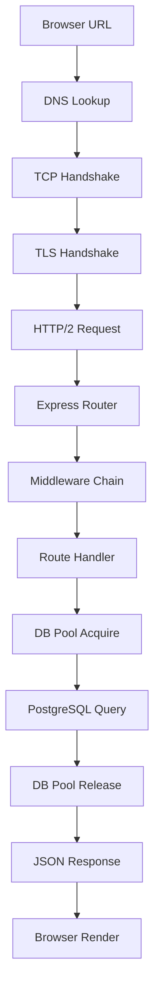

</details>

---
---

# TEMPLATE 5 — `interview.md`

<details open>
<summary><strong>Template Content</strong></summary>

# {{TOPIC_NAME}} — Interview Questions

## Table of Contents

1. [Junior Level](#junior-level)
2. [Middle Level](#middle-level)
3. [Senior Level](#senior-level)
4. [Scenario-Based Questions](#scenario-based-questions)
5. [FAQ](#faq)

---

## Junior Level

### 1. What is the difference between GET and POST requests?

**Answer:**
GET retrieves data, should be idempotent, parameters in URL, no body. POST submits data, can have side effects, data in body. GET responses can be cached; POST responses generally should not.

---

### 2. {{Question about React/component lifecycle}}?

**Answer:**
...with code example.

```typescript
// Code example
```

---

### 3. {{Question about async/await}}?

**Answer:**
...

---

> 5-7 junior questions.

---

## Middle Level

### 4. What is the N+1 query problem and how do you fix it?

**Answer:**
N+1 occurs when you fetch a list (1 query) then fetch related data for each item (N queries). For a list of 100 orders, you make 101 queries. Fix with JOINs or DataLoader (batching).

---

### 5. {{Question about authentication/JWT}}?

**Answer:**
...

---

> 4-6 middle questions.

---

## Senior Level

### 6. Design a URL shortener that handles 100M URLs and 10B redirects per month.

**Answer:**
Write API: store mapping in PostgreSQL + hash/base62 encode. Read API: Redis cache for hot URLs (cache hit rate ~95%), PostgreSQL fallback. Use CDN for edge caching. Horizontally scale stateless API servers.

---

### 7. {{Question about system design — rate limiter, message queue, etc.}}?

**Answer:**
...

---

> 4-6 senior questions.

---

## Scenario-Based Questions

### 8. Your API response times went from 50ms to 3000ms overnight with no deployment. How do you investigate?

**Answer:**
1. Check DB slow query log — is there a missing index or new N+1?
2. Check DB connection pool metrics — exhausted?
3. Check external service dependencies — third-party API slow?
4. Check memory usage — heap full → GC pressure?
5. Check for traffic spike → resource contention?

---

> 3-5 scenario questions.

---

## FAQ

### Q: What's the difference between authentication and authorization?

**A:** Authentication = verifying identity (who you are). Authorization = verifying permissions (what you can do). Authentication happens first, then authorization checks permissions.

### Q: What do interviewers look for in full-stack answers?

**A:**
- **Junior:** Knows React components, REST basics, basic SQL
- **Middle:** Can design a data model, handles auth, understands async
- **Senior:** System design, scalability, trade-offs, observability

</details>

---
---

# TEMPLATE 6 — `tasks.md`

<details open>
<summary><strong>Template Content</strong></summary>

# {{TOPIC_NAME}} — Practical Tasks

## Table of Contents

1. [Junior Tasks](#junior-tasks)
2. [Middle Tasks](#middle-tasks)
3. [Senior Tasks](#senior-tasks)
4. [Questions](#questions)
5. [Mini Projects](#mini-projects)
6. [Challenge](#challenge)

---

## Junior Tasks

### Task 1: Build a React + Express todo list

**Type:** 💻 Code

**Goal:** Connect a React frontend to an Express backend with PostgreSQL

**Instructions:**
1. Create Express API with GET, POST, DELETE /api/todos
2. Create PostgreSQL `todos` table
3. Build React UI with add/delete functionality

**Starter code:**

```typescript
// backend/src/routes/todos.ts
import express from 'express';
const router = express.Router();

// TODO: GET /api/todos
// TODO: POST /api/todos
// TODO: DELETE /api/todos/:id

export default router;
```

**Evaluation criteria:**
- [ ] All 3 endpoints work
- [ ] Data persists to PostgreSQL
- [ ] React UI updates correctly

---

### Task 2: Design the database schema for a blog

**Type:** 🎨 Design

**Goal:** Design a normalized PostgreSQL schema

**Deliverable:** SQL CREATE TABLE statements + ER diagram

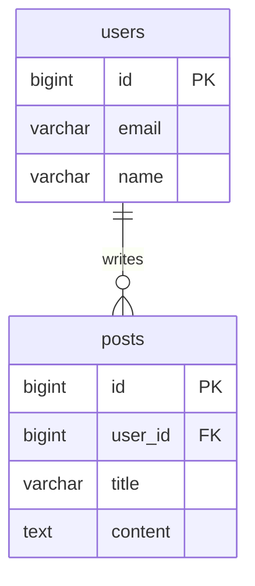

---

## Middle Tasks

### Task 3: Add JWT authentication to REST API

**Type:** 💻 Code

**Goal:** Implement secure authentication flow

**Requirements:**
- [ ] `POST /auth/register` with bcrypt password hashing
- [ ] `POST /auth/login` returning JWT + refresh token
- [ ] `POST /auth/refresh` to rotate tokens
- [ ] Auth middleware protecting private routes

---

## Senior Tasks

### Task 4: Design a scalable notification system

**Type:** 🎨 Design

**Goal:** Design a system that sends email/push/SMS notifications to 1M users

**Requirements:**
- [ ] Handle 100K notification events/minute
- [ ] Support email, push, SMS channels
- [ ] Retry failed notifications
- [ ] Track delivery status

**Deliverable:**
- Architecture diagram
- Component interaction diagrams
- Database schema for notification log

---

## Questions

### 1. What is the difference between `process.nextTick()` and `setImmediate()`?

**Answer:**
`process.nextTick()` runs before the next I/O event, before any I/O in the current iteration. `setImmediate()` runs in the check phase after I/O. `nextTick` has higher priority — it can starve I/O if used recursively.

---

## Mini Projects

### Project 1: Full-Stack E-commerce App

**Goal:** Complete CRUD application with authentication and payments

**Requirements:**
- [ ] User auth (JWT)
- [ ] Product catalog with search
- [ ] Cart and checkout (Stripe integration)
- [ ] Order history dashboard
- [ ] Tests with > 80% coverage

**Difficulty:** Middle
**Estimated time:** 20 hours

---

## Challenge

### Build a Rate Limiter API Middleware

**Problem:** Implement a sliding window rate limiter using Redis that limits each IP to 100 requests per minute.

**Constraints:**
- Must be accurate (not approximate)
- Must handle distributed instances (multiple Node.js servers)
- Must add < 5ms overhead per request

**Scoring:**
- Correctness: 50%
- Performance: 30%
- Code quality: 20%

</details>

---
---

# TEMPLATE 7 — `find-bug.md`

<details open>
<summary><strong>Template Content</strong></summary>

# {{TOPIC_NAME}} — Find the Bug

> **Practice finding and fixing bugs in full-stack code related to {{TOPIC_NAME}}.**

---

## How to Use

1. Read the buggy code carefully
2. Try to find the bug **without** looking at the hint
3. Write the fix yourself before checking the solution
4. Understand **why** the bug happens

### Difficulty Levels

| Level | Description |
|:-----:|:-----------|
| 🟢 | **Easy** — Syntax errors, missing await, undefined variables |
| 🟡 | **Medium** — Race conditions, memory leaks, wrong status codes |
| 🔴 | **Hard** — N+1 queries, event loop blocking, SQL injection |

---

## Bug 1: Missing await causes undefined 🟢

**What the code should do:** Fetch user and return their name

```typescript
async function getUserName(id: number): Promise<string> {
  const user = getUserById(id);  // Bug: missing await!
  return user.name;              // user is Promise<User>, not User
}
```

**Expected output:** `"Alice"`
**Actual output:** `TypeError: Cannot read property 'name' of undefined`

<details>
<summary>💡 Hint</summary>
Is `getUserById` an async function? What does it return without `await`?
</details>

<details>
<summary>🐛 Bug Explanation</summary>

**Bug:** Missing `await` before async function call
**Why it happens:** `getUserById` returns a `Promise<User>`, not a `User`. Without `await`, `user` is the Promise object, which has no `.name` property.
**Impact:** Runtime TypeError on every call

</details>

<details>
<summary>✅ Fixed Code</summary>

```typescript
async function getUserName(id: number): Promise<string> {
  const user = await getUserById(id);  // fixed: added await
  return user.name;
}
```

**What changed:** Added `await` keyword

</details>

---

## Bug 2: {{Bug title}} 🟢

**What the code should do:** {{Expected behavior}}

```typescript
// Buggy code
```

<details>
<summary>💡 Hint</summary>
...
</details>

<details>
<summary>🐛 Bug Explanation</summary>

**Bug:** ...
**Why it happens:** ...
**Impact:** ...

</details>

<details>
<summary>✅ Fixed Code</summary>

```typescript
// Fixed code
```

</details>

---

## Bug 3: {{Bug title}} 🟢

```typescript
// Buggy code
```

<details>
<summary>💡 Hint</summary>
...
</details>

<details>
<summary>🐛 Bug Explanation</summary>

**Bug:** ...
**Why it happens:** ...
**Impact:** ...

</details>

<details>
<summary>✅ Fixed Code</summary>

```typescript
// Fixed code
```

</details>

---

## Bug 4: SQL Injection 🟡

**What the code should do:** Find user by username

```typescript
async function findUser(username: string): Promise<User> {
  const result = await db.query(
    `SELECT * FROM users WHERE username = '${username}'`  // Bug!
  );
  return result.rows[0];
}
// Input: "' OR '1'='1" → returns ALL users
```

<details>
<summary>💡 Hint</summary>
How should user-provided values be passed to SQL queries?
</details>

<details>
<summary>🐛 Bug Explanation</summary>

**Bug:** String interpolation allows SQL injection
**Why it happens:** User controls part of the SQL string
**Impact:** Attackers can bypass auth, read/delete all data

</details>

<details>
<summary>✅ Fixed Code</summary>

```typescript
async function findUser(username: string): Promise<User> {
  const result = await db.query(
    'SELECT * FROM users WHERE username = $1',  // parameterized
    [username]
  );
  return result.rows[0];
}
```

**What changed:** Used parameterized query — database handles escaping

</details>

---

## Bug 5: {{Race condition}} 🟡

```typescript
// Buggy code — race condition in concurrent updates
```

<details>
<summary>💡 Hint</summary>
...
</details>

<details>
<summary>🐛 Bug Explanation</summary>

**Bug:** ...
**Why it happens:** ...
**Impact:** ...

</details>

<details>
<summary>✅ Fixed Code</summary>

```typescript
// Fixed code
```

</details>

---

## Bug 6: {{Event loop blocking}} 🟡

```typescript
// Buggy code — synchronous CPU work in request handler
```

<details>
<summary>💡 Hint</summary>
...
</details>

<details>
<summary>🐛 Bug Explanation</summary>

**Bug:** ...
**Why it happens:** ...
**Impact:** ...

</details>

<details>
<summary>✅ Fixed Code</summary>

```typescript
// Fixed code
```

</details>

---

## Bug 7: {{Memory leak in Node.js}} 🟡

```typescript
// Buggy code — event listener never removed
```

<details>
<summary>💡 Hint</summary>
...
</details>

<details>
<summary>🐛 Bug Explanation</summary>

**Bug:** ...
**Why it happens:** ...
**Impact:** ...

</details>

<details>
<summary>✅ Fixed Code</summary>

```typescript
// Fixed code
```

</details>

---

## Bug 8: N+1 Query Problem 🔴

**What the code should do:** Return orders with user details

```typescript
async function getOrdersWithUsers(): Promise<OrderWithUser[]> {
  const orders = await db.query('SELECT * FROM orders LIMIT 100');

  const result = [];
  for (const order of orders.rows) {
    const user = await db.query('SELECT * FROM users WHERE id = $1', [order.user_id]);
    result.push({ ...order, user: user.rows[0] });
  }
  return result;
}
// 1 query for orders + 100 queries for users = 101 queries!
```

**Expected output:** 100 orders with user data
**Actual behavior:** Works correctly but takes 2500ms instead of 15ms

<details>
<summary>💡 Hint</summary>
Can you fetch the user data in the same query as the orders?
</details>

<details>
<summary>🐛 Bug Explanation</summary>

**Bug:** N+1 query pattern — one DB query per order
**Why it happens:** Each `await db.query(...)` in a loop is sequential
**Impact:** 100 orders = 101 queries × 25ms = 2525ms (vs 15ms with JOIN)

</details>

<details>
<summary>✅ Fixed Code</summary>

```typescript
async function getOrdersWithUsers(): Promise<OrderWithUser[]> {
  const result = await db.query(`
    SELECT o.*, u.name AS user_name, u.email AS user_email
    FROM orders o
    JOIN users u ON o.user_id = u.id
    ORDER BY o.created_at DESC
    LIMIT 100
  `);
  return result.rows;
}
```

**What changed:** Single JOIN query replaces 101 sequential queries

</details>

---

## Bug 9: {{Connection pool not released}} 🔴

```typescript
// Buggy code — connection never returned to pool after error
```

<details>
<summary>💡 Hint</summary>
...
</details>

<details>
<summary>🐛 Bug Explanation</summary>

**Bug:** ...
**Why it happens:** ...
**Impact:** Pool exhaustion under error conditions
**How to detect:** Monitor `pool.waitingCount` — grows over time under load

</details>

<details>
<summary>✅ Fixed Code</summary>

```typescript
// Fixed code — always release in finally block
```

</details>

---

## Bug 10: {{CSRF vulnerability}} 🔴

```typescript
// Buggy code — state-changing endpoint accepts GET requests
app.get('/api/delete-account', async (req, res) => {
  // Attacker can trick user into visiting: https://evil.com/img?src=https://myapp.com/api/delete-account
```

<details>
<summary>💡 Hint</summary>
...
</details>

<details>
<summary>🐛 Bug Explanation</summary>

**Bug:** Destructive operation on GET endpoint — CSRF vulnerability
**Why it happens:** GET requests are sent automatically by browsers (images, iframes)
**Impact:** Attackers can delete user accounts with a crafted URL

</details>

<details>
<summary>✅ Fixed Code</summary>

```typescript
// Fixed: use DELETE method + require authentication + CSRF token
app.delete('/api/account', authenticate, csrfProtection, async (req, res) => {
  ...
});
```

</details>

---

## Score Card

| Bug | Difficulty | Found without hint? | Understood why? | Fixed correctly? |
|:---:|:---------:|:-------------------:|:---------------:|:----------------:|
| 1 | 🟢 | ☐ | ☐ | ☐ |
| 2 | 🟢 | ☐ | ☐ | ☐ |
| 3 | 🟢 | ☐ | ☐ | ☐ |
| 4 | 🟡 | ☐ | ☐ | ☐ |
| 5 | 🟡 | ☐ | ☐ | ☐ |
| 6 | 🟡 | ☐ | ☐ | ☐ |
| 7 | 🟡 | ☐ | ☐ | ☐ |
| 8 | 🔴 | ☐ | ☐ | ☐ |
| 9 | 🔴 | ☐ | ☐ | ☐ |
| 10 | 🔴 | ☐ | ☐ | ☐ |

</details>

---
---

# TEMPLATE 8 — `optimize.md`

<details open>
<summary><strong>Template Content</strong></summary>

# {{TOPIC_NAME}} — Optimize the Code

> **Practice optimizing slow, inefficient full-stack code related to {{TOPIC_NAME}}.**

---

## How to Use

1. Read the slow code and understand what it does
2. Identify the performance bottleneck
3. Write your optimized version
4. Compare with the solution and benchmark results

### Difficulty Levels

| Level | Focus |
|:-----:|:------|
| 🟢 | **Easy** — Add indexes, fix N+1, add caching |
| 🟡 | **Medium** — Pagination, connection pooling, async optimization |
| 🔴 | **Hard** — Query plan analysis, event loop, worker threads |

### Optimization Categories

| Category | Icon | Description |
|:--------:|:----:|:-----------|
| **Database** | 🗄️ | Query optimization, indexing, connection pooling |
| **Network** | 🌐 | Reduce payload, HTTP/2, caching headers |
| **Node.js** | ⚡ | Event loop, worker threads, memory |
| **Frontend** | 🖥️ | Bundle size, rendering performance, code splitting |

---

## Exercise 1: Add database index 🟢 🗄️

**What the code does:** Find all orders for a user.

**The problem:** Full table scan on every user request.

```sql
-- Slow — no index on user_id
SELECT * FROM orders WHERE user_id = 42 ORDER BY created_at DESC;
-- Table: 10M rows → full scan every time
```

**Current benchmark:**
```
Query time: 3200ms
Rows scanned: 10,000,000
```

<details>
<summary>💡 Hint</summary>
Which column is used in the WHERE clause and ORDER BY? Add an index on those.
</details>

<details>
<summary>⚡ Optimized Code</summary>

```sql
-- Add composite index
CREATE INDEX idx_orders_user_created ON orders(user_id, created_at DESC);

-- Same query now uses index
SELECT * FROM orders WHERE user_id = 42 ORDER BY created_at DESC;
```

**Optimized benchmark:**
```
Query time: 2ms
Rows scanned: ~50 (user's orders only)
```

**Improvement:** 1600x faster

</details>

---

## Exercise 2: Add pagination to list endpoint 🟢 🌐

**What the code does:** Returns all orders for a user.

**The problem:** Returns unbounded number of rows — will OOM at scale.

```typescript
// Slow — returns ALL orders
app.get('/api/orders', async (req, res) => {
  const orders = await db.query('SELECT * FROM orders WHERE user_id = $1', [req.user.id]);
  res.json(orders.rows);  // Could be 100,000 rows!
});
```

<details>
<summary>⚡ Optimized Code</summary>

```typescript
// Fast — cursor-based pagination
app.get('/api/orders', async (req, res) => {
  const limit = Math.min(parseInt(req.query.limit as string) || 20, 100);
  const cursor = req.query.cursor as string | undefined;

  const query = cursor
    ? 'SELECT * FROM orders WHERE user_id = $1 AND id < $2 ORDER BY id DESC LIMIT $3'
    : 'SELECT * FROM orders WHERE user_id = $1 ORDER BY id DESC LIMIT $2';

  const params = cursor ? [req.user.id, cursor, limit] : [req.user.id, limit];
  const orders = await db.query(query, params);

  res.json({
    data: orders.rows,
    nextCursor: orders.rows.length === limit ? orders.rows[orders.rows.length - 1].id : null,
  });
});
```

**Improvement:** Constant response time regardless of total orders

</details>

---

## Exercise 3: Add Redis caching for user profile 🟢 🗄️

**What the code does:** Returns user profile data.

**The problem:** Database query on every request for rarely-changing data.

```typescript
app.get('/api/profile', authenticate, async (req, res) => {
  const user = await db.query('SELECT * FROM users WHERE id = $1', [req.user.id]);
  res.json(user.rows[0]);  // Hits DB even if data hasn't changed in days
});
```

<details>
<summary>⚡ Optimized Code</summary>

```typescript
app.get('/api/profile', authenticate, async (req, res) => {
  const cacheKey = `user:profile:${req.user.id}`;
  const cached = await redis.get(cacheKey);

  if (cached) return res.json(JSON.parse(cached));

  const user = await db.query('SELECT * FROM users WHERE id = $1', [req.user.id]);
  await redis.setEx(cacheKey, 300, JSON.stringify(user.rows[0]));  // 5 min TTL
  res.json(user.rows[0]);
});
```

**Improvement:** Cache hit: 1ms vs DB: 20ms; 95% cache hit rate on popular profiles

</details>

---

## Exercise 4: Fix sequential async with parallel 🟡 ⚡

**What the code does:** Fetches user, orders, and preferences for a dashboard.

**The problem:** Sequential awaits — total time = sum of all fetches.

```typescript
async function getDashboardData(userId: number) {
  const user    = await fetchUser(userId);     // 50ms
  const orders  = await fetchOrders(userId);   // 80ms
  const prefs   = await fetchPrefs(userId);    // 40ms
  // Total: 170ms sequential
  return { user, orders, prefs };
}
```

<details>
<summary>⚡ Optimized Code</summary>

```typescript
async function getDashboardData(userId: number) {
  const [user, orders, prefs] = await Promise.all([
    fetchUser(userId),    // 50ms \
    fetchOrders(userId),  // 80ms  } all run simultaneously
    fetchPrefs(userId),   // 40ms /
  ]);
  // Total: 80ms (longest individual fetch)
  return { user, orders, prefs };
}
```

**Improvement:** 170ms → 80ms (2x faster)

</details>

---

## Exercise 5: Fix N+1 with DataLoader batching 🟡 🗄️

**What the code does:** GraphQL resolver fetches users for each post author.

**The problem:** Each post triggers a separate user query.

```typescript
// GraphQL resolver — N+1
const resolvers = {
  Post: {
    author: async (post) => {
      return db.query('SELECT * FROM users WHERE id = $1', [post.user_id]);
      // Called once per post → 100 posts = 100 user queries
    },
  },
};
```

<details>
<summary>⚡ Optimized Code</summary>

```typescript
import DataLoader from 'dataloader';

const userLoader = new DataLoader(async (userIds: readonly number[]) => {
  const users = await db.query(
    'SELECT * FROM users WHERE id = ANY($1)',
    [userIds]
  );
  // Return users in same order as requested ids
  return userIds.map(id => users.rows.find(u => u.id === id));
});

const resolvers = {
  Post: {
    author: async (post) => userLoader.load(post.user_id),
    // DataLoader batches all loads in one tick → single query for all authors
  },
};
```

**Improvement:** 100 queries → 1 batched query

</details>

---

## Exercise 6: Implement HTTP response caching headers 🟡 🌐

**What the code does:** Serves static product catalog data.

**The problem:** Same data re-fetched from server on every page view.

```typescript
app.get('/api/products/categories', async (req, res) => {
  const categories = await db.query('SELECT * FROM categories');
  res.json(categories.rows);  // No cache headers — browser fetches every time
});
```

<details>
<summary>⚡ Optimized Code</summary>

```typescript
app.get('/api/products/categories', async (req, res) => {
  const categories = await db.query('SELECT * FROM categories');

  res.set({
    'Cache-Control': 'public, max-age=3600, stale-while-revalidate=86400',
    'ETag': generateETag(categories.rows),
    'Last-Modified': new Date().toUTCString(),
  });

  // Handle conditional request
  if (req.headers['if-none-match'] === res.getHeader('ETag')) {
    return res.status(304).end();
  }

  res.json(categories.rows);
});
```

**Improvement:** Subsequent requests: 0ms (browser cache) or 304 Not Modified

</details>

---

## Exercise 7: Offload CPU work to worker thread 🟡 ⚡

**What the code does:** Generates PDF reports on the API server.

**The problem:** PDF generation is CPU-intensive — blocks the event loop.

```typescript
app.get('/api/report/:id', async (req, res) => {
  const data = await fetchReportData(req.params.id);
  const pdf = generatePDF(data);  // CPU: 500ms — blocks ALL other requests!
  res.contentType('pdf').send(pdf);
});
```

<details>
<summary>⚡ Optimized Code</summary>

```typescript
// pdf-worker.ts
import { parentPort, workerData } from 'worker_threads';
const pdf = generatePDF(workerData.data);
parentPort!.postMessage(pdf);

// main route
app.get('/api/report/:id', async (req, res) => {
  const data = await fetchReportData(req.params.id);

  const pdf = await new Promise<Buffer>((resolve, reject) => {
    const worker = new Worker('./pdf-worker.js', { workerData: { data } });
    worker.on('message', resolve);
    worker.on('error', reject);
  });

  res.contentType('pdf').send(pdf);
});
```

**Improvement:** Event loop no longer blocked — other requests served normally during PDF generation

</details>

---

## Exercise 8: Optimize React bundle with code splitting 🔴 🖥️

**What the code does:** A large SPA loaded as a single bundle.

**The problem:** 2MB bundle downloaded on first load — users on mobile wait 8 seconds.

```typescript
// ❌ All routes in one bundle
import Dashboard from './Dashboard';
import Reports from './Reports';    // 500KB chart library
import Settings from './Settings';  // 200KB form library
import Admin from './Admin';        // rarely visited
```

<details>
<summary>⚡ Optimized Code</summary>

```typescript
import { lazy, Suspense } from 'react';

// ✅ Code-split — each route is a separate chunk
const Dashboard = lazy(() => import('./Dashboard'));
const Reports   = lazy(() => import('./Reports'));   // loads only when visited
const Settings  = lazy(() => import('./Settings'));
const Admin     = lazy(() => import('./Admin'));

function App() {
  return (
    <Suspense fallback={<Spinner />}>
      <Routes>
        <Route path="/" element={<Dashboard />} />
        <Route path="/reports" element={<Reports />} />
        <Route path="/settings" element={<Settings />} />
      </Routes>
    </Suspense>
  );
}
```

**Improvement:** Initial bundle: 200KB (was 2MB); Reports 500KB chunk loads only when needed

</details>

---

## Exercise 9: Fix connection pool exhaustion under load 🔴 🗄️

**What the code does:** Transaction that acquires a connection but doesn't release on error.

**The problem:** Pool leaks connections on error → pool exhausts after 20 errors.

```typescript
async function transferFunds(from: number, to: number, amount: number) {
  const client = await pool.connect();
  await client.query('BEGIN');
  await client.query('UPDATE accounts SET balance = balance - $1 WHERE id = $2', [amount, from]);
  await client.query('UPDATE accounts SET balance = balance + $1 WHERE id = $2', [amount, to]);
  await client.query('COMMIT');
  // Bug: if any query throws, client is never released!
}
```

<details>
<summary>⚡ Optimized Code</summary>

```typescript
async function transferFunds(from: number, to: number, amount: number) {
  const client = await pool.connect();
  try {
    await client.query('BEGIN');
    await client.query('UPDATE accounts SET balance = balance - $1 WHERE id = $2', [amount, from]);
    await client.query('UPDATE accounts SET balance = balance + $1 WHERE id = $2', [amount, to]);
    await client.query('COMMIT');
  } catch (err) {
    await client.query('ROLLBACK');
    throw err;
  } finally {
    client.release();  // ALWAYS release — even on error
  }
}
```

**Improvement:** Zero connection leaks — pool never exhausts from errors

</details>

---

## Exercise 10: Optimize database query with proper index and EXPLAIN 🔴 🗄️

**What the code does:** Search orders by status and date range.

**The problem:** Query takes 5s on a 50M row table; no index matches the query pattern.

```sql
-- Slow — existing index on (user_id) doesn't help this query
EXPLAIN ANALYZE
SELECT * FROM orders
WHERE status = 'pending'
  AND created_at > NOW() - INTERVAL '7 days'
ORDER BY created_at DESC;
-- Seq Scan on orders: 50M rows, 5200ms
```

<details>
<summary>💡 Hint</summary>
Create an index that matches this exact query pattern — partial index for common status values.
</details>

<details>
<summary>⚡ Optimized Code</summary>

```sql
-- Partial index: only indexes 'pending' orders (small fraction of total)
CREATE INDEX idx_orders_pending_recent
ON orders(created_at DESC)
WHERE status = 'pending';

-- Query now uses this index
EXPLAIN ANALYZE
SELECT * FROM orders
WHERE status = 'pending'
  AND created_at > NOW() - INTERVAL '7 days'
ORDER BY created_at DESC;
-- Index Scan: 15,000 rows, 8ms
```

**What changed:** Partial index only on pending orders → tiny index, fast scan
**Improvement:** 5200ms → 8ms, 99.8% improvement

</details>

---

## Score Card

| Exercise | Difficulty | Category | Found bottleneck? | Your improvement | Target |
|:--------:|:---------:|:--------:|:-----------------:|:----------------:|:------:|
| 1 | 🟢 | 🗄️ | ☐ | ___ x | 1600x |
| 2 | 🟢 | 🌐 | ☐ | — | Constant time |
| 3 | 🟢 | 🗄️ | ☐ | ___ x | 20x |
| 4 | 🟡 | ⚡ | ☐ | ___ x | 2x |
| 5 | 🟡 | 🗄️ | ☐ | ___ x | 100x |
| 6 | 🟡 | 🌐 | ☐ | — | 0ms cache hit |
| 7 | 🟡 | ⚡ | ☐ | — | Non-blocking |
| 8 | 🔴 | 🖥️ | ☐ | ___ x | 10x bundle |
| 9 | 🔴 | 🗄️ | ☐ | — | 0 leaks |
| 10 | 🔴 | 🗄️ | ☐ | ___ x | 650x |

---

## Optimization Cheat Sheet

| Problem | Solution | Impact |
|:--------|:---------|:------:|
| Slow query on large table | Add index on WHERE/JOIN/ORDER columns | Very High |
| Unbounded list endpoint | Add cursor-based pagination | Very High |
| Repeated DB queries | Redis cache with TTL | High |
| Sequential independent fetches | `Promise.all([...])` | Medium |
| N+1 in GraphQL | DataLoader batching | Very High |
| No browser caching | Cache-Control headers + ETag | High |
| CPU work in event loop | Worker Threads | Critical |
| Large SPA bundle | Code splitting with React.lazy | High |
| Connection leak on error | `finally { client.release() }` | Critical |
| Wrong index type | EXPLAIN ANALYZE + partial/composite index | Very High |

</details>
