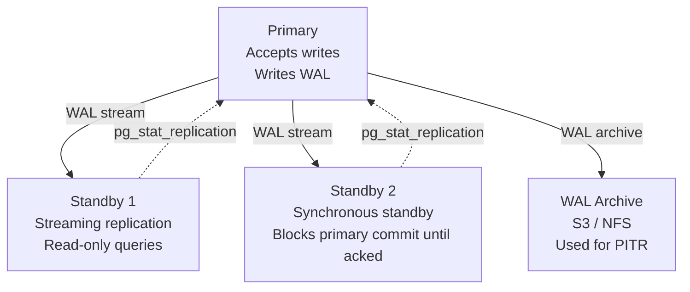
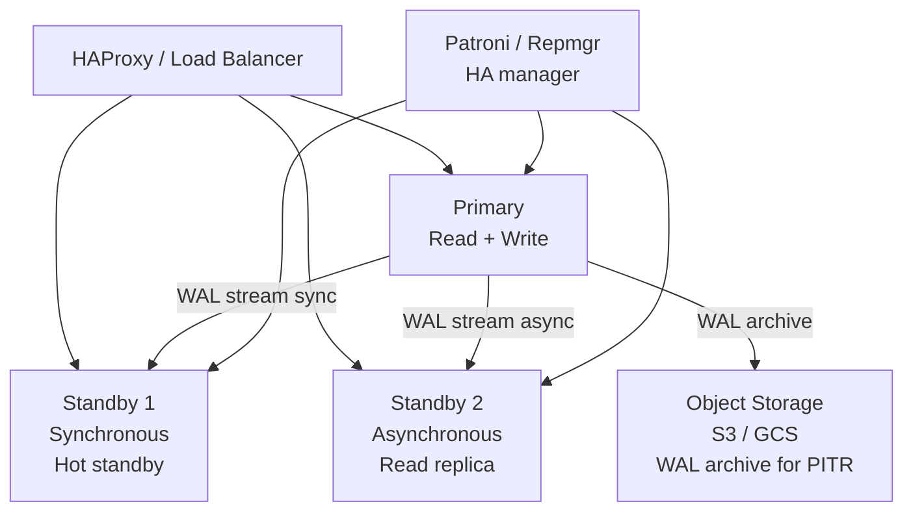

# PostgreSQL DBA Roadmap — Universal Template

> Guides content generation for **PostgreSQL DBA** topics.
> Primary code fences: `sql` for queries, `bash` for psql CLI and shell commands.

---

## Overview

| | Description |
|---|---|
| **Purpose** | Universal template for all PostgreSQL DBA roadmap topics |
| **Files per topic** | 9 files: `junior.md`, `middle.md`, `senior.md`, `professional.md`, `interview.md`, `tasks.md`, `find-bug.md`, `optimize.md`, `specification.md` |
| **Language** | All content must be generated in **English** |
| **Table of Contents** | **Optional** — include only if relevant to the topic. For `tasks.md`, `find-bug.md`, `optimize.md` it is NOT required |

### Topic Structure

```
XX-topic-name/
├── junior.md          ← "What?" and "How?" — DDL, DML, basic queries, simple indexing
├── middle.md          ← "Why?" and "When?" — advanced queries, index strategy, transactions, replication
├── senior.md          ← "How to operate?" — production tuning, HA, backup/recovery, partitioning
├── professional.md    ← "Under the Hood" — MVCC, WAL, B-tree page layout, query planner cost model, VACUUM
├── interview.md       ← Interview prep across all levels
├── tasks.md           ← Hands-on practice tasks
├── find-bug.md        ← Find and fix bugs in queries and schema (10+ exercises)
├── optimize.md        ← Optimize slow queries and schemas (10+ exercises)
└── specification.md   ← Official spec / documentation deep-dive
```

---

## Level Comparison Matrix

| Aspect | Junior | Middle | Senior | Professional |
|:------:|:------:|:------:|:------:|:------------:|
| **Depth** | DDL/DML, data types, basic SELECT | CTEs, window functions, index types, ACID | Partitioning, streaming replication, PITR | MVCC internals, WAL segments, B-tree page layout, planner cost model |
| **Code** | Simple SELECT/INSERT/UPDATE | EXPLAIN, complex JOINs, partial indexes | `pg_basebackup`, `pg_upgrade`, logical replication | `pageinspect`, `pg_filedump`, planner source code paths |
| **Tricky Points** | NULL semantics, type casting | Index bloat, autovacuum tuning | WAL archiving, failover | Dead tuple visibility, page-level locking, FSM |
| **Focus** | "What?" and "How?" | "Why?" and "When?" | "How to operate?" | "What happens under the hood?" |

---

# TEMPLATE 1 — `junior.md`

<details open>
<summary><strong>Template Content</strong></summary>

# {{TOPIC_NAME}} — Junior Level

## Table of Contents

1. [Introduction](#introduction)
2. [Prerequisites](#prerequisites)
3. [Glossary](#glossary)
4. [Core Concepts](#core-concepts)
5. [Real-World Analogies](#real-world-analogies)
6. [Mental Models](#mental-models)
7. [Pros & Cons](#pros--cons)
8. [Use Cases](#use-cases)
9. [Code Examples](#code-examples)
10. [Error Handling and Transaction Patterns](#error-handling-and-transaction-patterns)
11. [Security Considerations](#security-considerations)
12. [Performance Tips](#performance-tips)
13. [Best Practices](#best-practices)
14. [Edge Cases & Pitfalls](#edge-cases--pitfalls)
15. [Common Mistakes](#common-mistakes)
16. [Tricky Points](#tricky-points)
17. [Tricky Questions](#tricky-questions)
18. [Cheat Sheet](#cheat-sheet)
19. [Summary](#summary)
20. [Further Reading](#further-reading)
21. [Related Topics](#related-topics)

---

## Introduction

> Focus: "What is {{TOPIC_NAME}}?" and "How do I use it in PostgreSQL?"

Brief explanation of what {{TOPIC_NAME}} is and why a developer or DBA needs to understand it.
Assume the reader knows basic programming and has seen SQL before but is new to PostgreSQL specifically.

---

## Prerequisites

- **Required:** Basic SQL syntax (SELECT, INSERT, UPDATE, DELETE)
- **Required:** Understanding of tables, rows, and columns
- **Helpful but not required:** Experience with another relational database (MySQL, SQLite)

> Link to related roadmap topics where available.

---

## Glossary

| Term | Definition |
|------|-----------|
| **Relation** | PostgreSQL's formal term for a table |
| **Tuple** | A single row in a relation |
| **MVCC** | Multi-Version Concurrency Control — how PostgreSQL handles concurrent reads and writes |
| **WAL** | Write-Ahead Log — the durability journal written before data pages are modified |
| **`psql`** | The PostgreSQL interactive terminal |
| **Schema** | A namespace within a database that contains tables, views, and functions |
| **Transaction** | A group of SQL statements that execute atomically |
| **{{Term 8}}** | {{Definition specific to TOPIC_NAME}} |

> 6-10 terms. Keep definitions beginner-friendly.

---

## Core Concepts

### Concept 1: Tables and Data Types

PostgreSQL is strongly typed. Every column must have a declared type. Key types:
`INTEGER`, `BIGINT`, `TEXT`, `VARCHAR(n)`, `BOOLEAN`, `TIMESTAMP WITH TIME ZONE`, `NUMERIC(p,s)`, `JSONB`, `UUID`.

### Concept 2: NULL Semantics

`NULL` means "unknown" — not zero, not empty string. `NULL = NULL` evaluates to `NULL`, not `TRUE`.
Use `IS NULL` and `IS NOT NULL` to check for null values.

### Concept 3: {{TOPIC_NAME}} Specific Concept

{{Explain the primary concept of the topic in 3-5 sentences. Ground it in relational database terminology.}}

> Each concept: 3-5 sentences, bullet points, inline code where helpful.

---

## Real-World Analogies

| Concept | Analogy |
|---------|--------|
| **Table** | A spreadsheet tab — rows are records, columns are labeled fields |
| **Index** | A book's index — jump to the page (row) without reading every page |
| **Transaction** | A bank transfer — both debit and credit happen, or neither does |
| **{{TOPIC_NAME concept}}** | {{Everyday analogy — note where it breaks down}} |

---

## Mental Models

**The intuition:** Think of PostgreSQL as a very precise filing cabinet.
Every drawer (table) holds files (rows) sorted in a specific order (primary key or heap).
Finding a file without a label (index) means opening every drawer — a full sequential scan.

**Why this model helps:** It explains why index design is critical and why full sequential scans
are sometimes acceptable (small tables) but catastrophic on large ones.

---

## Pros & Cons

| Pros | Cons |
|------|------|
| Full ACID compliance — strongest consistency guarantees | Requires schema design upfront |
| Rich data types including `JSONB`, `ARRAY`, `HSTORE` | Horizontal write scaling is harder than NoSQL |
| Mature ecosystem — extensions, logical replication, FDW | VACUUM required for MVCC dead tuple reclaim |
| Advanced indexing: B-tree, GIN, GiST, BRIN, partial | Config tuning required for production performance |

### When to use {{TOPIC_NAME}}:
- {{Scenario where this PostgreSQL feature shines}}

### When NOT to use {{TOPIC_NAME}}:
- {{Scenario where a different approach is better}}

---

## Use Cases

- **Financial systems:** Strong ACID guarantees, no partial writes
- **Content management:** `JSONB` for flexible content alongside relational metadata
- **Reporting / analytics:** Window functions, CTEs, materialized views
- **{{TOPIC_NAME use case}}:** {{Brief description}}

---

## Code Examples

### Example 1: Create a Table

```sql
CREATE TABLE users (
    id          BIGSERIAL PRIMARY KEY,
    email       TEXT        NOT NULL UNIQUE,
    name        TEXT        NOT NULL,
    status      TEXT        NOT NULL DEFAULT 'active'
                            CHECK (status IN ('active', 'inactive', 'banned')),
    created_at  TIMESTAMPTZ NOT NULL DEFAULT NOW()
);
```

### Example 2: Basic CRUD

```sql
-- Insert
INSERT INTO users (email, name) VALUES ('alice@example.com', 'Alice');

-- Read
SELECT id, email, name FROM users WHERE status = 'active' ORDER BY created_at DESC LIMIT 10;

-- Update
UPDATE users SET status = 'inactive' WHERE id = 1;

-- Delete
DELETE FROM users WHERE status = 'banned' AND created_at < NOW() - INTERVAL '90 days';
```

### Example 3: psql CLI Basics

```bash
# Connect to a database
psql -h localhost -U postgres -d mydb

# Common meta-commands inside psql
\l          -- list databases
\c mydb     -- connect to database
\dt         -- list tables in current schema
\d users    -- describe table structure
\timing on  -- show query execution time
\q          -- quit
```

### Example 4: {{TOPIC_NAME}} — Core Usage

```sql
-- {{Describe what this example demonstrates for TOPIC_NAME}}
SELECT /* ... */
FROM   /* ... */
WHERE  /* TOPIC_NAME specific condition */;
```

> Provide 4-6 examples. Start simple, build toward the topic.

---

## Error Handling and Transaction Patterns

```sql
-- Basic transaction with error handling
BEGIN;
    UPDATE accounts SET balance = balance - 100 WHERE id = 1;
    UPDATE accounts SET balance = balance + 100 WHERE id = 2;
    -- If either UPDATE fails, ROLLBACK undoes both
COMMIT;

-- Savepoints for partial rollback
BEGIN;
    INSERT INTO orders (customer_id, amount) VALUES (1, 500);
    SAVEPOINT order_saved;
    INSERT INTO order_items (order_id, sku) VALUES (LASTVAL(), 'WIDGET');
    -- If item insert fails, roll back to savepoint only
    ROLLBACK TO SAVEPOINT order_saved;
COMMIT;
```

| Error | SQLSTATE | Meaning | Fix |
|-------|---------|---------|-----|
| `unique_violation` | `23505` | Duplicate value in unique column | Use `ON CONFLICT DO UPDATE` |
| `not_null_violation` | `23502` | NULL inserted into NOT NULL column | Check input data |
| `foreign_key_violation` | `23503` | Referenced row does not exist | Insert parent row first |
| `{{error}}` | `{{code}}` | {{Description}} | {{Fix}} |

---

## Security Considerations

- Use **role-based access control**: never connect as `postgres` superuser from application code
- Prefer parameterized queries (`$1`, `$2`) in all client libraries to prevent SQL injection
- Enable `ssl = on` in `postgresql.conf` for client connections
- Use `pg_hba.conf` to restrict which hosts can connect to which databases as which users

---

## Performance Tips

- Always check `EXPLAIN` before deploying a new query
- Use `EXPLAIN ANALYZE` in development to see actual row counts vs estimates
- Create indexes on all columns used in `WHERE`, `JOIN ON`, and `ORDER BY` clauses
- Use `LIMIT` on all user-facing paginated queries

---

## Best Practices

- Always declare `NOT NULL` and `DEFAULT` constraints at the column level where possible
- Use `TIMESTAMPTZ` (timestamp with time zone) instead of `TIMESTAMP` to avoid DST bugs
- Name constraints explicitly: `CONSTRAINT fk_orders_user FOREIGN KEY (user_id) REFERENCES users(id)`
- Use `BIGSERIAL` or `gen_random_uuid()` for primary keys; avoid `SERIAL` in new code

---

## Edge Cases & Pitfalls

- `NOT IN (subquery)` returns no rows if the subquery returns any `NULL` — use `NOT EXISTS` instead
- `BETWEEN a AND b` is inclusive on both ends in PostgreSQL
- `CHAR(n)` pads with spaces; prefer `TEXT` or `VARCHAR(n)` for variable-length strings
- Division of two integers produces an integer in PostgreSQL: `5 / 2 = 2`, not `2.5`

---

## Common Mistakes

| Mistake | Why it Happens | Fix |
|---------|---------------|-----|
| `SELECT *` in production | Convenience during development | List columns explicitly; avoids breaking changes on schema updates |
| Forgetting `WHERE` in `UPDATE`/`DELETE` | Typo or rushed code | Use transactions; test on `SELECT` first with same `WHERE` |
| Using `=` to compare `NULL` | SQL intuition from other languages | Use `IS NULL` / `IS NOT NULL` |

---

## Tricky Points

- `SERIAL` is not an actual type — it is syntactic sugar for `SEQUENCE` + `DEFAULT nextval(...)`. The sequence is owned separately.
- `NOW()` returns the timestamp at **transaction start**, not at the moment each row is processed
- PostgreSQL identifiers are case-insensitive unless quoted: `Users` and `users` are the same table

---

## Tricky Questions

1. Why does `NOT IN (SELECT ...)` fail silently when the subquery returns a NULL row?
2. What is the difference between `TRUNCATE` and `DELETE FROM` in terms of transactions and MVCC?
3. Can two transactions simultaneously hold an `ACCESS SHARE` lock on the same table? What about `ACCESS EXCLUSIVE`?
4. What happens to a sequence owned by a `SERIAL` column when the column is dropped?

---

## Cheat Sheet

```sql
-- DDL
CREATE TABLE t (id BIGSERIAL PRIMARY KEY, name TEXT NOT NULL);
ALTER TABLE t ADD COLUMN created_at TIMESTAMPTZ DEFAULT NOW();
DROP TABLE IF EXISTS t CASCADE;

-- DML
INSERT INTO t (name) VALUES ('Alice') RETURNING id;
UPDATE t SET name = 'Bob' WHERE id = 1;
DELETE FROM t WHERE id = 1;

-- Query
SELECT * FROM t WHERE name ILIKE 'al%' ORDER BY id LIMIT 10 OFFSET 0;

-- Index
CREATE INDEX idx_t_name ON t (name);
CREATE UNIQUE INDEX idx_t_name_unique ON t (name);
DROP INDEX CONCURRENTLY idx_t_name;

-- Transaction
BEGIN; /* statements */ COMMIT;
BEGIN; /* statements */ ROLLBACK;

-- Inspect
\d t                          -- describe table
EXPLAIN ANALYZE SELECT ...;   -- query plan + actual times
```

---

## Summary

{{TOPIC_NAME}} at the junior level is about building confidence with PostgreSQL's data model:
strong typing, NULL semantics, constraint-enforced integrity, and basic transaction control.
Key takeaways: always use parameterized queries, always check `EXPLAIN`, and design your schema
around constraints — they are enforced for free by the database engine.

---

## Further Reading

- [PostgreSQL Tutorial — Official](https://www.postgresql.org/docs/current/tutorial.html)
- [psql Reference](https://www.postgresql.org/docs/current/app-psql.html)
- [Data Types](https://www.postgresql.org/docs/current/datatype.html)

---

## Related Topics

- `02-indexing` — B-tree, GIN, partial indexes
- `03-transactions` — isolation levels, locking
- `04-query-optimization` — EXPLAIN, query planner

</details>

---

# TEMPLATE 2 — `middle.md`

<details open>
<summary><strong>Template Content</strong></summary>

# {{TOPIC_NAME}} — Middle Level

## Table of Contents

1. [Introduction](#introduction)
2. [Prerequisites](#prerequisites)
3. [Deep Dive](#deep-dive)
4. [Advanced Query Patterns](#advanced-query-patterns)
5. [Index Strategy](#index-strategy)
6. [Transactions and Isolation Levels](#transactions-and-isolation-levels)
7. [Replication Concepts](#replication-concepts)
8. [Error Handling and Transaction Patterns](#error-handling-and-transaction-patterns)
9. [Comparison with Alternative Databases](#comparison-with-alternative-databases)
10. [Query Debugging and Performance Diagnosis](#query-debugging-and-performance-diagnosis)
11. [Best Practices](#best-practices)
12. [Tricky Points](#tricky-points)
13. [Tricky Questions](#tricky-questions)
14. [Cheat Sheet](#cheat-sheet)
15. [Summary](#summary)
16. [Further Reading](#further-reading)

---

## Introduction

> Focus: "Why does {{TOPIC_NAME}} work this way in PostgreSQL?" and "When should I choose this approach?"

Middle-level PostgreSQL knowledge is about making intentional decisions: which index type, which isolation
level, how to structure a query for the planner, and how streaming replication keeps replicas in sync.

---

## Prerequisites

- **Required:** Junior-level DDL/DML and basic `EXPLAIN` usage
- **Required:** Understanding of B-tree indexes and when they apply
- **Helpful:** Familiarity with transaction isolation concepts

---

## Deep Dive

### {{TOPIC_NAME}} — Why It Works This Way

{{Explain the mechanism behind TOPIC_NAME at a deeper level: the trade-offs PostgreSQL made,
why the default behavior is what it is, and how it behaves under concurrent workloads.}}

### CTEs and Window Functions

```sql
-- Common Table Expression (CTE) for readability and reuse
WITH recent_orders AS (
    SELECT customer_id, SUM(amount) AS total
    FROM   orders
    WHERE  created_at >= NOW() - INTERVAL '30 days'
    GROUP BY customer_id
)
SELECT c.name, ro.total
FROM   customers c
JOIN   recent_orders ro ON ro.customer_id = c.id
ORDER  BY ro.total DESC
LIMIT  10;

-- Window function — running total per customer
SELECT
    order_id,
    customer_id,
    amount,
    SUM(amount) OVER (PARTITION BY customer_id ORDER BY created_at) AS running_total
FROM orders;
```

---

## Advanced Query Patterns

```sql
-- UPSERT with ON CONFLICT
INSERT INTO product_prices (product_id, price, updated_at)
VALUES (1, 29.99, NOW())
ON CONFLICT (product_id)
DO UPDATE SET
    price      = EXCLUDED.price,
    updated_at = EXCLUDED.updated_at
WHERE product_prices.price <> EXCLUDED.price;

-- Lateral join — apply a subquery for each outer row
SELECT u.id, u.name, last_order.amount
FROM   users u
CROSS  JOIN LATERAL (
    SELECT amount FROM orders
    WHERE  customer_id = u.id
    ORDER  BY created_at DESC
    LIMIT  1
) last_order;

-- Recursive CTE — traverse a parent-child hierarchy
WITH RECURSIVE category_tree AS (
    SELECT id, name, parent_id, 0 AS depth
    FROM   categories WHERE parent_id IS NULL
    UNION ALL
    SELECT c.id, c.name, c.parent_id, ct.depth + 1
    FROM   categories c
    JOIN   category_tree ct ON ct.id = c.parent_id
)
SELECT * FROM category_tree ORDER BY depth, name;
```

---

## Index Strategy

| Index Type | Use Case | When to Use |
|------------|---------|-------------|
| B-tree | Equality, range, `ORDER BY`, `LIKE 'prefix%'` | Default — use for most cases |
| GIN | `JSONB` containment, full-text search, arrays | `@>`, `@@`, `&&` operators |
| GiST | Geometric data, full-text search, ranges | `<->`, `&&` on geometry/range types |
| BRIN | Very large tables with sequential data (timestamps, IDs) | Append-only logs, time-series |
| Hash | Exact equality only | Rarely — B-tree is usually better |
| Partial | Subset of rows with a `WHERE` condition | Sparse data (e.g., only active users) |

```sql
-- Partial index — index only active users (smaller, faster)
CREATE INDEX idx_users_email_active ON users (email)
WHERE status = 'active';

-- Expression index — index a function result
CREATE INDEX idx_users_lower_email ON users (lower(email));
-- Now this query uses the index:
SELECT * FROM users WHERE lower(email) = 'alice@example.com';

-- Covering index (INCLUDE) — avoid heap fetch for read-only columns
CREATE INDEX idx_orders_customer_status ON orders (customer_id, status)
INCLUDE (amount, created_at);
```

---

## Transactions and Isolation Levels

| Level | Dirty Read | Non-Repeatable Read | Phantom Read | Use Case |
|-------|-----------|---------------------|--------------|---------|
| `READ COMMITTED` | No | Yes | Yes | Default — most OLTP |
| `REPEATABLE READ` | No | No | No (in PG) | Consistent reports, batch jobs |
| `SERIALIZABLE` | No | No | No | Financial ledgers, strict ordering |

```sql
-- Set isolation level for a transaction
BEGIN TRANSACTION ISOLATION LEVEL REPEATABLE READ;
    SELECT balance FROM accounts WHERE id = 1;
    -- Balance will not change even if another transaction commits
    UPDATE accounts SET balance = balance - 100 WHERE id = 1;
COMMIT;

-- Advisory locks — application-level mutex
SELECT pg_advisory_xact_lock(hashtext('process_daily_report'));
-- Lock is released automatically at end of transaction
```

---

## Replication Concepts



```sql
-- Check replication lag on primary
SELECT client_addr,
       state,
       sent_lsn,
       write_lsn,
       flush_lsn,
       replay_lsn,
       (sent_lsn - replay_lsn) AS replay_lag_bytes
FROM   pg_stat_replication;

-- On standby: check how far behind it is
SELECT NOW() - pg_last_xact_replay_timestamp() AS replication_lag;
```

---

## Error Handling and Transaction Patterns

```sql
-- PL/pgSQL function with exception handling
CREATE OR REPLACE FUNCTION transfer_funds(
    p_from_id BIGINT,
    p_to_id   BIGINT,
    p_amount  NUMERIC
) RETURNS VOID AS $$
BEGIN
    UPDATE accounts SET balance = balance - p_amount
    WHERE id = p_from_id AND balance >= p_amount;

    IF NOT FOUND THEN
        RAISE EXCEPTION 'Insufficient funds or account not found'
            USING ERRCODE = 'P0001';
    END IF;

    UPDATE accounts SET balance = balance + p_amount WHERE id = p_to_id;

    IF NOT FOUND THEN
        RAISE EXCEPTION 'Destination account not found'
            USING ERRCODE = 'P0002';
    END IF;
END;
$$ LANGUAGE plpgsql;

-- Call and handle errors in application code
BEGIN;
    SELECT transfer_funds(1, 2, 100.00);
COMMIT;
-- On any EXCEPTION, the entire transaction rolls back automatically
```

---

## Comparison with Alternative Databases

| Feature | PostgreSQL | MySQL 8 | MongoDB | CockroachDB |
|---------|-----------|---------|---------|-------------|
| MVCC | Heap-based tuple versions + VACUUM | Undo log (InnoDB) | WiredTiger snapshot | MVCC over RocksDB |
| Full ACID | Yes | Yes (InnoDB) | Replica set only | Yes (distributed) |
| `JSONB` | Native, indexed | JSON (limited indexing) | Native (BSON) | Native |
| Horizontal write scale | Requires Citus / partitioning | ProxySQL sharding | Native | Native |
| Full-text search | `tsvector` / `GIN` | `FULLTEXT` index | Text index | Limited |
| Replication | Streaming / logical | Binary log | Replica set / sharding | Raft consensus |

---

## Query Debugging and Performance Diagnosis

```sql
-- EXPLAIN ANALYZE — shows actual vs estimated row counts
EXPLAIN (ANALYZE, BUFFERS, FORMAT TEXT)
SELECT o.id, o.amount, c.name
FROM   orders o
JOIN   customers c ON c.id = o.customer_id
WHERE  o.status = 'pending'
  AND  o.created_at >= NOW() - INTERVAL '7 days';

-- Key nodes to look for:
-- Seq Scan         → no index used (consider adding one)
-- Index Scan       → index used, fetches heap for each row
-- Index Only Scan  → covering index, no heap access needed
-- Hash Join        → in-memory hash table join (good for large tables)
-- Nested Loop      → good for small inner side + index on join column
-- Buffers: hit=N   → N pages from shared buffer cache (fast)
-- Buffers: read=N  → N pages from disk (slow)

-- Find slow queries across all sessions
SELECT query,
       calls,
       mean_exec_time,
       total_exec_time,
       stddev_exec_time,
       rows
FROM   pg_stat_statements
ORDER  BY mean_exec_time DESC
LIMIT  20;
```

---

## Best Practices

- Use `EXPLAIN (ANALYZE, BUFFERS)` on every new query in development before it reaches production
- Set `work_mem` per query via `SET LOCAL work_mem = '64MB'` for heavy sort/hash queries, not globally
- Prefer `NOT EXISTS` over `NOT IN` when the subquery might return `NULL`
- Use `RETURNING` clause on `INSERT`/`UPDATE`/`DELETE` to avoid an extra round-trip

---

## Tricky Points

- `REPEATABLE READ` in PostgreSQL actually prevents phantoms (stronger than the SQL standard requires)
- `UPDATE` on a row creates a **new tuple** and marks the old one dead — every update causes write amplification
- An index on a nullable column does NOT include rows where the column is NULL in a B-tree index by default (they are stored but require `IS NULL` predicate to be used efficiently)
- `VACUUM` does not return disk space to the OS — `VACUUM FULL` does but requires an `ACCESS EXCLUSIVE` lock

---

## Tricky Questions

1. Why does a heavily updated table eventually suffer from "table bloat" even with autovacuum running?
2. What is the difference between `VACUUM` and `VACUUM FULL`? When would you run each?
3. Why is `NOT IN (SELECT ...)` dangerous when the subquery can return NULL?
4. How does PostgreSQL handle `SERIALIZABLE` isolation? What is SSI (Serializable Snapshot Isolation)?
5. When would you choose a `BRIN` index over a `B-tree` index?

---

## Cheat Sheet

```sql
-- Index types
CREATE INDEX             ON t (col);              -- B-tree (default)
CREATE INDEX USING gin   ON t USING GIN (col);    -- GIN for JSONB / arrays
CREATE INDEX USING brin  ON t USING BRIN (col);   -- BRIN for large sequential tables
CREATE INDEX             ON t (col) WHERE active; -- partial index

-- Isolation levels
BEGIN ISOLATION LEVEL READ COMMITTED;
BEGIN ISOLATION LEVEL REPEATABLE READ;
BEGIN ISOLATION LEVEL SERIALIZABLE;

-- Useful system views
pg_stat_activity         -- running queries
pg_stat_user_tables      -- table stats (seq_scan, n_dead_tup)
pg_stat_user_indexes     -- index usage stats
pg_stat_statements       -- query performance history
pg_locks                 -- active locks
pg_replication_slots     -- replication slot lag

-- VACUUM
VACUUM ANALYZE t;        -- reclaim dead tuples + update stats
VACUUM FULL t;           -- compact table (requires exclusive lock)
```

---

## Summary

Middle-level {{TOPIC_NAME}} mastery requires intentional choices: the right index type for the
operator, the right isolation level for the consistency requirement, and reading `EXPLAIN ANALYZE`
output fluently. Replication lag monitoring and autovacuum health are the two most overlooked aspects
of production PostgreSQL health.

---

## Further Reading

- [EXPLAIN Documentation](https://www.postgresql.org/docs/current/sql-explain.html)
- [Indexes — PostgreSQL Docs](https://www.postgresql.org/docs/current/indexes.html)
- [Transaction Isolation](https://www.postgresql.org/docs/current/transaction-iso.html)
- [Streaming Replication](https://www.postgresql.org/docs/current/warm-standby.html)

</details>

---

# TEMPLATE 3 — `senior.md`

<details open>
<summary><strong>Template Content</strong></summary>

# {{TOPIC_NAME}} — Senior Level

## Table of Contents

1. [Introduction](#introduction)
2. [Production Configuration](#production-configuration)
3. [High Availability Architecture](#high-availability-architecture)
4. [Backup and Point-in-Time Recovery](#backup-and-point-in-time-recovery)
5. [Partitioning](#partitioning)
6. [Autovacuum Tuning](#autovacuum-tuning)
7. [Error Handling and Transaction Patterns](#error-handling-and-transaction-patterns)
8. [Query Debugging and Performance Diagnosis](#query-debugging-and-performance-diagnosis)
9. [Security Hardening](#security-hardening)
10. [Runbooks and Operational Checklists](#runbooks-and-operational-checklists)
11. [Tricky Points](#tricky-points)
12. [Summary](#summary)
13. [Further Reading](#further-reading)

---

## Introduction

> Focus: "How do I operate {{TOPIC_NAME}} reliably in production?" and "How do I build for failure?"

Senior DBA knowledge is about production operations: HA topologies, backup/recovery, partitioning
strategy for large tables, autovacuum tuning to prevent bloat, and incident response.

---

## Production Configuration

### Critical `postgresql.conf` Parameters

```bash
# Memory
shared_buffers        = 8GB         # 25% of RAM — primary PostgreSQL cache
effective_cache_size  = 24GB        # planner assumption about OS cache (75% of RAM)
work_mem              = 64MB        # per sort/hash operation (careful — multiplies by connections)
maintenance_work_mem  = 2GB         # for VACUUM, CREATE INDEX, ALTER TABLE

# WAL
wal_level             = replica     # minimum for streaming replication
synchronous_commit    = on          # set to 'off' for async (latency vs durability trade-off)
wal_buffers           = 64MB
checkpoint_timeout    = 15min       # longer = fewer checkpoints = more WAL recovery time
max_wal_size          = 4GB

# Connections
max_connections       = 200         # use PgBouncer in front; each connection costs ~5 MB RAM
idle_in_transaction_session_timeout = 30s

# Autovacuum
autovacuum_vacuum_scale_factor      = 0.01   # trigger vacuum when 1% of table is dead (default: 20%)
autovacuum_analyze_scale_factor     = 0.005
autovacuum_vacuum_cost_delay        = 2ms    # reduce I/O throttling for large tables
```

---

## High Availability Architecture



### Failover with Patroni

```bash
# Check cluster state
patronictl -c /etc/patroni/patroni.yml list

# Manual switchover (graceful)
patronictl -c /etc/patroni/patroni.yml switchover mydb --master primary-host --candidate standby-host

# Failover (immediate — use when primary is unresponsive)
patronictl -c /etc/patroni/patroni.yml failover mydb --master primary-host
```

---

## Backup and Point-in-Time Recovery

| Strategy | RTO | RPO | Command |
|----------|-----|-----|---------|
| `pg_dump` | Hours | Hours | `pg_dump -Fc -d mydb -f mydb.dump` |
| `pg_basebackup` | Minutes | Minutes + WAL replay | `pg_basebackup -h primary -D /backup/base -Ft -z -P` |
| WAL archiving + PITR | Minutes | Seconds | Continuous archive + `recovery_target_time` |
| Barman / pgBackRest | Minutes | Near-zero | Managed continuous backup |

```bash
# Full base backup
pg_basebackup \
  --host=primary \
  --username=replicator \
  --pgdata=/backup/$(date +%Y%m%d) \
  --format=tar \
  --compress=9 \
  --checkpoint=fast \
  --progress

# WAL archiving in postgresql.conf
archive_mode    = on
archive_command = 'aws s3 cp %p s3://my-bucket/wal/%f'

# Point-in-time recovery — restore to a specific time
# In postgresql.conf (PostgreSQL 12+):
restore_command         = 'aws s3 cp s3://my-bucket/wal/%f %p'
recovery_target_time    = '2026-03-26 12:00:00+00'
recovery_target_action  = 'promote'
```

---

## Partitioning

```sql
-- Range partitioning by month (PostgreSQL 10+ declarative)
CREATE TABLE events (
    id         BIGSERIAL,
    user_id    BIGINT      NOT NULL,
    event_type TEXT        NOT NULL,
    created_at TIMESTAMPTZ NOT NULL
) PARTITION BY RANGE (created_at);

CREATE TABLE events_2026_01 PARTITION OF events
    FOR VALUES FROM ('2026-01-01') TO ('2026-02-01');

CREATE TABLE events_2026_02 PARTITION OF events
    FOR VALUES FROM ('2026-02-01') TO ('2026-03-01');

-- Each partition gets its own local indexes
CREATE INDEX ON events_2026_01 (user_id, created_at);
CREATE INDEX ON events_2026_02 (user_id, created_at);

-- Automate partition creation with pg_partman extension
SELECT partman.create_parent(
    p_parent_table => 'public.events',
    p_control      => 'created_at',
    p_type         => 'native',
    p_interval     => '1 month'
);
```

---

## Autovacuum Tuning

```sql
-- Check table bloat and autovacuum status
SELECT
    schemaname,
    relname,
    n_dead_tup,
    n_live_tup,
    ROUND(n_dead_tup::NUMERIC / NULLIF(n_live_tup + n_dead_tup, 0) * 100, 2) AS dead_pct,
    last_autovacuum,
    last_autoanalyze
FROM pg_stat_user_tables
ORDER BY n_dead_tup DESC
LIMIT 20;

-- Per-table autovacuum override for high-churn tables
ALTER TABLE orders SET (
    autovacuum_vacuum_scale_factor     = 0.01,
    autovacuum_vacuum_cost_delay       = 2,
    autovacuum_vacuum_cost_limit       = 800
);
```

---

## Error Handling and Transaction Patterns

```sql
-- Deadlock-safe retry pattern in PL/pgSQL
CREATE OR REPLACE FUNCTION safe_transfer(p_from BIGINT, p_to BIGINT, p_amount NUMERIC)
RETURNS VOID AS $$
DECLARE
    v_retries INT := 0;
BEGIN
    LOOP
        BEGIN
            UPDATE accounts SET balance = balance - p_amount
            WHERE id = LEAST(p_from, p_to);   -- always lock lower ID first to prevent deadlock
            UPDATE accounts SET balance = balance + p_amount
            WHERE id = GREATEST(p_from, p_to);
            RETURN;
        EXCEPTION WHEN deadlock_detected OR serialization_failure THEN
            IF v_retries >= 3 THEN RAISE; END IF;
            v_retries := v_retries + 1;
            PERFORM pg_sleep(0.05 * v_retries);
        END;
    END LOOP;
END;
$$ LANGUAGE plpgsql;
```

---

## Query Debugging and Performance Diagnosis

```bash
# Enable pg_stat_statements (add to shared_preload_libraries)
echo "shared_preload_libraries = 'pg_stat_statements'" >> postgresql.conf

# After restart:
psql -c "CREATE EXTENSION IF NOT EXISTS pg_stat_statements;"
```

```sql
-- Top 10 slowest queries by mean execution time
SELECT LEFT(query, 80)       AS query_snippet,
       calls,
       ROUND(mean_exec_time::NUMERIC, 2) AS mean_ms,
       ROUND(total_exec_time::NUMERIC, 0) AS total_ms,
       ROUND(stddev_exec_time::NUMERIC, 2) AS stddev_ms,
       rows
FROM   pg_stat_statements
ORDER  BY mean_exec_time DESC
LIMIT  10;

-- Find tables with excessive sequential scans (missing indexes)
SELECT relname,
       seq_scan,
       idx_scan,
       seq_scan - idx_scan AS diff,
       n_live_tup
FROM   pg_stat_user_tables
WHERE  seq_scan > 0
ORDER  BY seq_scan DESC;

-- Active long-running queries
SELECT pid,
       NOW() - query_start AS duration,
       state,
       LEFT(query, 100)
FROM   pg_stat_activity
WHERE  state <> 'idle'
  AND  query_start < NOW() - INTERVAL '30 seconds'
ORDER  BY duration DESC;

-- Kill a runaway query
SELECT pg_cancel_backend(pid);   -- graceful
SELECT pg_terminate_backend(pid); -- forceful
```

---

## Security Hardening

```bash
# pg_hba.conf — enforce scram-sha-256 for all local and remote connections
# TYPE   DATABASE  USER   ADDRESS        METHOD
local    all       all                   scram-sha-256
host     all       all    0.0.0.0/0     scram-sha-256
hostssl  all       all    0.0.0.0/0     scram-sha-256  # require SSL

# Minimal privilege role for application
psql -c "CREATE ROLE app_user LOGIN PASSWORD 'strong_password';"
psql -c "GRANT CONNECT ON DATABASE mydb TO app_user;"
psql -c "GRANT USAGE ON SCHEMA public TO app_user;"
psql -c "GRANT SELECT, INSERT, UPDATE, DELETE ON ALL TABLES IN SCHEMA public TO app_user;"
psql -c "GRANT USAGE ON ALL SEQUENCES IN SCHEMA public TO app_user;"
```

---

## Runbooks and Operational Checklists

### Pre-deployment checklist for {{TOPIC_NAME}}

- [ ] `EXPLAIN ANALYZE` reviewed — no Seq Scan on large tables
- [ ] Indexes created `CONCURRENTLY` to avoid table locks in production
- [ ] `autovacuum` health checked (`n_dead_tup` < 10% of `n_live_tup`)
- [ ] Replication lag within acceptable threshold
- [ ] Connection count below 80% of `max_connections`

### Incident response: table bloat

1. Identify bloated table: query `pg_stat_user_tables` for high `n_dead_tup`
2. Check last autovacuum: `last_autovacuum` column
3. Run manual vacuum: `VACUUM ANALYZE tablename;`
4. If bloat is severe and table can tolerate a lock: `VACUUM FULL tablename;`
5. If lock is not acceptable: use `pg_repack` extension (online table repack)
6. Tune autovacuum per-table to prevent recurrence

---

## Tricky Points

- `VACUUM FULL` rewrites the table — it holds `ACCESS EXCLUSIVE` lock for the entire duration. Use `pg_repack` for zero-downtime compaction
- Replication slots that are not consumed cause WAL to accumulate indefinitely — always set `max_slot_wal_keep_size`
- Long-running transactions prevent VACUUM from removing dead tuples — `idle_in_transaction_session_timeout` is your safety net
- `pg_basebackup` with `--checkpoint=fast` forces an immediate checkpoint on the primary — brief I/O spike expected

---

## Summary

Senior-level {{TOPIC_NAME}} operations center on four pillars: HA failover (Patroni/Repmgr),
continuous backup with WAL archiving for PITR, partition management for large tables,
and autovacuum tuning to prevent write amplification from uncleaned dead tuples.
`pg_stat_statements` and `pg_stat_user_tables` are your operational dashboards.

---

## Further Reading

- [High Availability](https://www.postgresql.org/docs/current/high-availability.html)
- [Continuous Archiving and PITR](https://www.postgresql.org/docs/current/continuous-archiving.html)
- [Table Partitioning](https://www.postgresql.org/docs/current/ddl-partitioning.html)
- [Patroni Documentation](https://patroni.readthedocs.io/)

</details>

---

# TEMPLATE 4 — `professional.md`

<details open>
<summary><strong>Template Content</strong></summary>

# {{TOPIC_NAME}} — Database/System Internals

## Table of Contents

1. [Introduction](#introduction)
2. [MVCC — Multi-Version Concurrency Control](#mvcc--multi-version-concurrency-control)
3. [WAL — Write-Ahead Log Internals](#wal--write-ahead-log-internals)
4. [B-tree Page Layout](#b-tree-page-layout)
5. [Query Planner Cost Model](#query-planner-cost-model)
6. [VACUUM Internals](#vacuum-internals)
7. [Query Debugging and Performance Diagnosis](#query-debugging-and-performance-diagnosis)
8. [Tricky Points](#tricky-points)
9. [Summary](#summary)
10. [Further Reading](#further-reading)

---

## Introduction

> Focus: "What happens inside PostgreSQL when it processes {{TOPIC_NAME}}?"

Professional-level PostgreSQL knowledge means tracing execution from the wire protocol through the
parser, planner, executor, storage manager, WAL writer, and back. Understanding these internals
enables you to diagnose problems that no monitoring tool surfaces directly.

---

## MVCC — Multi-Version Concurrency Control

### Tuple Header Layout

Every heap tuple (row) in PostgreSQL carries a hidden header:

```
Tuple Header (23 bytes):
┌────────────┬────────────┬──────────┬──────────┬──────────┐
│  t_xmin    │  t_xmax    │ t_cid /  │ t_ctid   │ t_infomask│
│ (4 bytes)  │ (4 bytes)  │ t_xvac   │ (6 bytes)│ (2 bytes) │
│ creator XID│ deleter XID│          │ self ref │ visibility│
└────────────┴────────────┴──────────┴──────────┴──────────┘
```

- **`t_xmin`:** Transaction ID (XID) of the transaction that inserted this tuple version
- **`t_xmax`:** XID of the transaction that deleted or updated this tuple (0 = still live)
- **`t_ctid`:** Physical location of the current version — points to itself if latest, or to the newer version after an `UPDATE`
- **`t_infomask`:** Bit flags for visibility hints — set by `VACUUM` to avoid re-reading the `pg_clog`/`pg_xact` files

### Visibility Rules

A tuple is visible to transaction `T` if:
1. `t_xmin` was committed **before** T's snapshot was taken
2. `t_xmax` is 0, or `t_xmax` started after T's snapshot, or `t_xmax` was aborted

```sql
-- Inspect hidden tuple fields using pageinspect extension
CREATE EXTENSION IF NOT EXISTS pageinspect;

SELECT lp, t_xmin, t_xmax, t_ctid, t_infomask
FROM   heap_page_items(get_raw_page('orders', 0))
WHERE  lp_len > 0
LIMIT  10;
```

### Transaction ID Wraparound

PostgreSQL uses 32-bit XIDs. After ~2 billion transactions, the XID counter wraps around.
`VACUUM` sets the `relfrozenxid` on old tuples to prevent them from becoming "invisible" after wraparound.

```sql
-- Check tables closest to XID wraparound (emergency if age > 2 billion)
SELECT relname,
       age(relfrozenxid)     AS xid_age,
       pg_size_pretty(pg_total_relation_size(oid)) AS size
FROM   pg_class
WHERE  relkind = 'r'
ORDER  BY age(relfrozenxid) DESC
LIMIT  10;
```

---

## WAL — Write-Ahead Log Internals

### WAL Segment Structure

```
WAL segment file: 000000010000000000000001  (16 MB by default)
├── WAL page header (24 bytes)
│   ├── XLogPageHeaderData.xlp_magic
│   ├── xlp_info (flags: continuation, backup block)
│   └── xlp_tli (timeline ID)
└── WAL records (variable length)
    ├── XLogRecord header
    │   ├── xl_tot_len
    │   ├── xl_xid (transaction ID)
    │   ├── xl_prev (previous record LSN)
    │   └── xl_crc (CRC32C checksum)
    └── Data blocks (rmgr-specific payload)
```

### WAL Write Path

```
Transaction commits:
  1. WAL records accumulated in WAL buffer (wal_buffers)
  2. On COMMIT: wal_writer flushes WAL buffer to disk (fsync if synchronous_commit = on)
  3. WAL segment file written to pg_wal/ directory
  4. If archive_mode = on: archive_command copies segment to archive
  5. Checkpoint: dirty data pages flushed to base data files, pg_control updated with latest checkpoint LSN
```

```sql
-- Current WAL write position
SELECT pg_current_wal_lsn();

-- WAL generated since last checkpoint (measures write amplification)
SELECT pg_size_pretty(pg_current_wal_lsn() - '0/0'::pg_lsn) AS total_wal_written;

-- Check checkpoint frequency (frequent = too small max_wal_size)
SELECT checkpoints_timed, checkpoints_req, checkpoint_write_time, checkpoint_sync_time
FROM   pg_stat_bgwriter;
```

---

## B-tree Page Layout

### Page Structure (8 KB default)

```
PostgreSQL heap/index page (8192 bytes):
┌─────────────────────────────────┐ ← offset 0
│  PageHeaderData (24 bytes)      │
│  pd_lsn, pd_checksum, pd_flags  │
│  pd_lower (end of line pointers)│
│  pd_upper (start of free space) │
│  pd_special (start of special)  │
├─────────────────────────────────┤ ← pd_lower
│  ItemId array (line pointers)   │
│  4 bytes each: offset + length  │
├─────────────────────────────────┤
│         Free space              │
├─────────────────────────────────┤ ← pd_upper
│  Tuples (packed from end)       │
├─────────────────────────────────┤ ← pd_special
│  Special area (index type data) │
└─────────────────────────────────┘ ← offset 8192
```

### B-tree Index Internal Node vs Leaf Node

- **Internal nodes:** Contain key values and pointers to child pages. No actual tuple data.
- **Leaf nodes:** Contain key values + `(heap_tid, heap_offset)` pointers to actual heap tuples.
- **High-key:** Each internal page stores the highest key in its subtree for range navigation.

```sql
-- Inspect B-tree index structure
CREATE EXTENSION IF NOT EXISTS pageinspect;

-- Internal page of an index
SELECT * FROM bt_page_stats('idx_orders_customer_id', 1);
-- ctid, live_items, dead_items, avg_item_size, page_size, free_size

-- Items on a leaf page
SELECT * FROM bt_page_items('idx_orders_customer_id', 1)
LIMIT 5;
-- itemoffset, ctid, itemlen, nulls, vars, data (the key value)
```

---

## Query Planner Cost Model

### Cost Units

PostgreSQL's query planner assigns a **cost** to every plan node using configurable unit costs:

| Parameter | Default | Meaning |
|-----------|---------|---------|
| `seq_page_cost` | 1.0 | Cost of reading one page sequentially |
| `random_page_cost` | 4.0 | Cost of a random page read (set to 1.1 for SSDs) |
| `cpu_tuple_cost` | 0.01 | Cost of processing one row |
| `cpu_index_tuple_cost` | 0.005 | Cost of processing one index entry |
| `cpu_operator_cost` | 0.0025 | Cost of evaluating one operator/function |

### Plan Node Cost Formula

```
Total cost = startup_cost + (rows × per_row_cost)

Seq Scan:
  startup = 0
  total   = seq_page_cost × pages + cpu_tuple_cost × rows

Index Scan:
  startup = ceil(log2(index_pages + 1)) × cpu_index_tuple_cost   (B-tree descent)
  total   = (index_pages × random_page_cost / 4) + (heap_pages × random_page_cost) + cpu_tuple_cost × rows

Hash Join:
  startup = hash_build_cost(inner_rows)   ← must read all inner rows before first output
  total   = startup + probe_cost(outer_rows)
```

```sql
-- Tune random_page_cost for SSD storage
ALTER SYSTEM SET random_page_cost = 1.1;
SELECT pg_reload_conf();

-- Show planner's row estimate vs actual
EXPLAIN (ANALYZE, FORMAT JSON)
SELECT * FROM orders WHERE customer_id = 1;
-- Plan rows: 500  ←  planner estimate
-- Actual rows: 12 ←  real count
-- If estimate >> actual: run ANALYZE, or increase statistics target:
ALTER TABLE orders ALTER COLUMN customer_id SET STATISTICS 500;
ANALYZE orders;
```

---

## VACUUM Internals

### What VACUUM Does (Step by Step)

```
1. Scan heap pages sequentially
2. For each dead tuple (t_xmax committed, no snapshot can see it):
   a. Add its ItemId to the Free Space Map (FSM)
   b. Mark the line pointer as LP_DEAD
3. If enough dead items found: vacuum index (remove entries pointing to dead tuples)
4. Second heap scan: reclaim LP_DEAD slots, update pd_lower/pd_upper in page header
5. Update pg_class.relpages and reltuples (planner statistics)
6. Update pg_class.relfrozenxid (freeze old XIDs to prevent wraparound)
7. Update pg_stat_user_tables.last_autovacuum
```

### Free Space Map (FSM)

The FSM is a separate file (`table_name_fsm`) that records how much free space is available on each page.
`INSERT` and `UPDATE` (insert of new version) consult the FSM to find a page with enough space.

```sql
-- Check FSM state
SELECT * FROM pg_freespace('orders') LIMIT 10;
-- Returns (blkno, avail) — available bytes per page

-- Visibility Map — tracks pages where all tuples are visible to all transactions
-- Allows Index Only Scans to skip heap fetch
-- File: table_name_vm
SELECT pg_size_pretty(pg_relation_size('orders', 'vm'))  AS vm_size,
       pg_size_pretty(pg_relation_size('orders', 'fsm')) AS fsm_size;
```

---

## Query Debugging and Performance Diagnosis

```sql
-- Full JSON explain for programmatic analysis
EXPLAIN (ANALYZE, BUFFERS, FORMAT JSON)
SELECT /* your query */ \gset

-- Check if statistics are stale (planner row count mis-estimates)
SELECT relname,
       n_live_tup,
       reltuples::BIGINT     AS planner_estimate,
       ABS(n_live_tup - reltuples::BIGINT) AS drift
FROM   pg_class
JOIN   pg_stat_user_tables ON relname = relname
ORDER  BY drift DESC
LIMIT  10;

-- Lock contention analysis
SELECT
    blocked_locks.pid         AS blocked_pid,
    blocking_locks.pid        AS blocking_pid,
    blocked_activity.query    AS blocked_query,
    blocking_activity.query   AS blocking_query,
    NOW() - blocked_activity.query_start AS blocked_duration
FROM  pg_catalog.pg_locks blocked_locks
JOIN  pg_catalog.pg_stat_activity blocked_activity ON blocked_activity.pid = blocked_locks.pid
JOIN  pg_catalog.pg_locks blocking_locks ON blocking_locks.locktype = blocked_locks.locktype
  AND blocking_locks.relation = blocked_locks.relation
  AND blocking_locks.granted = true AND blocked_locks.granted = false
JOIN  pg_catalog.pg_stat_activity blocking_activity ON blocking_activity.pid = blocking_locks.pid;
```

---

## Tricky Points

- **HOT (Heap-Only Tuple) updates:** If an `UPDATE` changes a non-indexed column and the new tuple fits on the same page, PostgreSQL uses a HOT update — no index entry is added, reducing write amplification. Monitor with `pg_stat_user_tables.n_tup_hot_upd`
- **Transaction ID wraparound** is a hard limit. At 2 billion transactions before `relfrozenxid`, PostgreSQL will refuse writes and enter emergency autovacuum mode. Watch `age(relfrozenxid)` on all tables
- **Checkpoint storms:** If `max_wal_size` is too small, checkpoints are forced by WAL growth (`checkpoints_req` rises). Each checkpoint flushes all dirty buffers — I/O spike that can cause latency
- **Visibility Map bit:** Once set (all tuples on a page are visible to all transactions), Index Only Scan can skip the heap fetch entirely. VACUUM sets these bits; heavy updates clear them

---

## Summary

Professional-level {{TOPIC_NAME}} understanding means reading PostgreSQL's internals directly:
tuple headers reveal MVCC state, WAL LSN positions measure replication lag and write amplification,
B-tree page layout explains why `VACUUM` is necessary, and the cost model explains every plan the
query planner produces. The `pageinspect` extension bridges the gap between documentation and reality.

---

## Further Reading

- [PostgreSQL Internals (Hironobu Suzuki)](https://www.interdb.jp/pg/)
- [MVCC in PostgreSQL](https://www.postgresql.org/docs/current/mvcc.html)
- [WAL Internals](https://www.postgresql.org/docs/current/wal-internals.html)
- [pageinspect Extension](https://www.postgresql.org/docs/current/pageinspect.html)
- [PostgreSQL Source Code — src/backend/storage/](https://github.com/postgres/postgres/tree/master/src/backend/storage)

</details>

---

# TEMPLATE 5 — `interview.md`

<details open>
<summary><strong>Template Content</strong></summary>

# {{TOPIC_NAME}} — Interview Preparation

## Junior Questions

**Q1: What is the difference between `DELETE` and `TRUNCATE`?**
`DELETE` removes rows one by one, generates individual WAL records per row, can be filtered with `WHERE`,
and can be rolled back. `TRUNCATE` removes all rows by dropping and recreating the internal pages — much faster,
generates minimal WAL, but cannot be filtered and acquires an `ACCESS EXCLUSIVE` lock.

**Q2: Why should you prefer `TIMESTAMPTZ` over `TIMESTAMP`?**
`TIMESTAMPTZ` stores the value in UTC and converts to the session's timezone on display.
`TIMESTAMP` stores whatever value you give it with no timezone awareness — DST transitions cause bugs.

**Q3: What does `SERIAL` do in PostgreSQL?**
It is syntactic sugar that creates a sequence, adds a `DEFAULT nextval(sequence)` to the column,
and associates the sequence with the column. Not an actual data type.

**Q4: Why is `NOT IN (subquery)` dangerous?**
If the subquery returns any `NULL`, the `NOT IN` condition evaluates to `NULL` (unknown), matching no rows.
Use `NOT EXISTS` instead.

**Q5: {{Junior question specific to TOPIC_NAME}}**
{{Answer}}

---

## Middle Questions

**Q1: Explain the ESR rule for index design.**
Equality predicates first, then Sort columns, then Range predicates. This order ensures the B-tree
descends to the exact starting point (equality), scans in order (sort), then filters (range).

**Q2: When would you choose a partial index?**
When only a fraction of rows are queried — e.g., `WHERE status = 'active'`. A partial index is smaller,
fits in cache more easily, and updates faster than a full-table index.

**Q3: What is `work_mem` and why is it dangerous to set it too high globally?**
`work_mem` is the memory budget per sort or hash operation. Each query can use multiple such operations,
and each connection can run concurrently — so `work_mem × sort_operations × connections` is the real memory cost.

**Q4: What are `REPEATABLE READ` and `SERIALIZABLE` in PostgreSQL? How does PostgreSQL achieve them?**
PostgreSQL implements both via Snapshot Isolation. `SERIALIZABLE` additionally tracks read/write dependencies
between transactions using Serializable Snapshot Isolation (SSI) and aborts transactions that would create
a cycle (serialization anomaly).

**Q5: {{Middle question specific to TOPIC_NAME}}**
{{Answer}}

---

## Senior Questions

**Q1: How do you perform a zero-downtime index creation on a large production table?**
Use `CREATE INDEX CONCURRENTLY` — it builds the index in multiple passes without holding an exclusive lock.
Downside: takes longer and cannot run inside a transaction block.

**Q2: What causes table bloat and how do you mitigate it?**
`UPDATE` and `DELETE` mark old tuple versions as dead but do not immediately reclaim the space.
Autovacuum reclaims space over time. For severe bloat, use `VACUUM FULL` (requires exclusive lock)
or `pg_repack` (online, no lock).

**Q3: What is WAL archiving and how does it enable PITR?**
When `archive_mode = on`, PostgreSQL copies each completed WAL segment to an archive location.
PITR replays archived WAL segments up to a `recovery_target_time`, enabling restore to any point in time.

**Q4: What is a replication slot and what is the risk of not consuming it?**
A replication slot tracks the WAL position that a subscriber has consumed. If the subscriber falls behind
or disconnects, PostgreSQL retains all WAL from the slot's confirmed position forward — indefinitely.
Set `max_slot_wal_keep_size` to limit WAL accumulation.

**Q5: {{Senior question specific to TOPIC_NAME}}**
{{Answer}}

---

## Professional Questions

**Q1: Explain how MVCC and VACUUM interact.**
Every UPDATE creates a new tuple version; the old version remains with `t_xmax` set to the updating XID.
VACUUM identifies dead tuples (t_xmax committed + no snapshot can see them), reclaims their ItemIds in the
FSM, and removes corresponding index entries. Without VACUUM, dead tuples accumulate indefinitely.

**Q2: Why does a long-running transaction block VACUUM?**
VACUUM cannot remove a dead tuple if any active snapshot (even a sleeping `BEGIN` transaction) predates
the tuple's deletion XID. The long-running transaction "holds back" the oldest XID horizon.

**Q3: How does the query planner decide between Index Scan and Sequential Scan?**
The planner computes the cost of each plan using `seq_page_cost`, `random_page_cost`, `cpu_tuple_cost`,
and the table's statistics (row count, column cardinality in `pg_statistic`). If estimated selectivity
is low (few rows match), an index scan's random I/O cost is lower than a sequential scan's cost.

**Q4: What is a checkpoint and what happens if it is too frequent?**
A checkpoint flushes all dirty buffer pool pages to disk and records the checkpoint LSN in `pg_control`.
Too frequent checkpoints (caused by too-small `max_wal_size`) create I/O storms that spike write latency.
Increase `max_wal_size` and `checkpoint_timeout` to spread the I/O.

**Q5: {{Professional question specific to TOPIC_NAME}}**
{{Answer}}

</details>

---

# TEMPLATE 6 — `tasks.md`

<details open>
<summary><strong>Template Content</strong></summary>

# {{TOPIC_NAME}} — Hands-on Tasks

> 10+ practice tasks across all levels. Each task includes a goal, instructions, and acceptance criteria.

---

## Junior Tasks

### Task 1: Set Up PostgreSQL Locally and Explore with psql

```bash
# Start PostgreSQL
brew services start postgresql
psql -U postgres
```

**Goal:** Get comfortable with `psql` meta-commands.
**Acceptance criteria:** Can list databases (`\l`), connect (`\c`), describe a table (`\d`), and execute a simple SELECT.

### Task 2: Design and Create a Schema

**Goal:** Create a normalized schema for a blog: `users`, `posts`, `comments`, `tags`.
**Instructions:** Define appropriate data types, primary keys, foreign keys, NOT NULL, and CHECK constraints.
**Acceptance criteria:** Schema passes `\d+ tablename` inspection with all constraints visible.

### Task 3: CRUD Practice

**Goal:** Insert 100 rows using `generate_series`, update a subset, delete another subset, and verify counts.
**Instructions:** Use `INSERT INTO ... SELECT generate_series(...)`, `UPDATE ... WHERE`, `DELETE ... WHERE`, `SELECT COUNT(*)`.
**Acceptance criteria:** Row counts match expectations after each operation.

---

## Middle Tasks

### Task 4: Analyze and Fix a Slow Query with EXPLAIN ANALYZE

**Goal:** Identify a sequential scan and fix it with an index.
**Instructions:** Create a table with 1M rows, run a selective query, observe `EXPLAIN ANALYZE`, add the correct index, re-run.
**Acceptance criteria:** Query plan changes from `Seq Scan` to `Index Scan`; execution time drops > 90%.

### Task 5: Implement an Idempotent Upsert

**Goal:** Implement product price updates using `INSERT ... ON CONFLICT DO UPDATE`.
**Instructions:** Ensure repeated inserts with the same `product_id` update `price` and `updated_at` rather than failing.
**Acceptance criteria:** Calling the upsert 3 times results in 1 row (not 3), with the latest price.

### Task 6: Window Function Report

**Goal:** Compute a 7-day rolling average of daily sales using a window function.
**Instructions:** Use `AVG(...) OVER (ORDER BY date ROWS BETWEEN 6 PRECEDING AND CURRENT ROW)`.
**Acceptance criteria:** Output matches expected values verified against a manual spreadsheet calculation.

---

## Senior Tasks

### Task 7: Configure Streaming Replication

**Goal:** Set up a primary and one hot standby.
**Instructions:** Configure `pg_hba.conf`, `postgresql.conf` (`wal_level = replica`), run `pg_basebackup`, start standby with `standby.signal`.
**Acceptance criteria:** `pg_stat_replication` on primary shows the standby; reads work on standby.

### Task 8: Implement and Test PITR

**Goal:** Restore a database to a point in time 10 minutes before a simulated accidental `DROP TABLE`.
**Instructions:** Configure WAL archiving to a local directory, run operations, simulate drop, restore.
**Acceptance criteria:** Table exists and has expected data after PITR restore.

### Task 9: Partition a Large Table

**Goal:** Migrate an existing unpartitioned `events` table to monthly range partitions.
**Instructions:** Create a new partitioned table, copy data, swap with the original using `ALTER TABLE RENAME`.
**Acceptance criteria:** Query on a single month uses partition pruning (visible in `EXPLAIN`).

---

## Professional Tasks

### Task 10: Inspect Live Tuple Headers with pageinspect

**Goal:** Observe MVCC in action by reading tuple headers before and after an update.
**Instructions:** Install `pageinspect`, insert a row, update it, inspect `heap_page_items` — observe `t_xmin`, `t_xmax`, `t_ctid`.
**Acceptance criteria:** Can explain in writing what each field change means for MVCC visibility.

### Task 11: Reproduce and Fix XID Wraparound Risk

**Goal:** Simulate an aging table and force an emergency VACUUM.
**Instructions:** Create a table with old `relfrozenxid` (using `pg_resetwal` in a test cluster), observe warning, run `VACUUM FREEZE`.
**Acceptance criteria:** `age(relfrozenxid)` drops below threshold after VACUUM FREEZE.

### Task 12: {{Custom task for TOPIC_NAME}}

**Goal:** {{Specific professional-level goal}}
**Instructions:** {{Step-by-step instructions}}
**Acceptance criteria:** {{Measurable outcome}}

</details>

---

# TEMPLATE 7 — `find-bug.md`

<details open>
<summary><strong>Template Content</strong></summary>

# {{TOPIC_NAME}} — Find the Bug

> 10+ exercises. Each shows buggy SQL or schema. Find the bug, explain why it is a problem, and fix it.

---

## Exercise 1: Missing VACUUM Causing Table Bloat

**Buggy configuration:**
```bash
# postgresql.conf — autovacuum disabled (common "optimization" that backfires)
autovacuum = off
```

**What is the bug?**
Disabling autovacuum causes dead tuples from every `UPDATE` and `DELETE` to accumulate indefinitely.
Table files grow continuously, sequential scans take longer, and index scans must skip dead entries.
Eventually, XID wraparound risk becomes critical.

**Fix:**
```bash
# Re-enable autovacuum and tune it per high-churn table
autovacuum = on
```

```sql
-- Tune per-table instead of disabling globally
ALTER TABLE orders SET (
    autovacuum_vacuum_scale_factor = 0.01,
    autovacuum_vacuum_cost_delay   = 2
);
-- Run immediate manual vacuum if bloat has already accumulated
VACUUM ANALYZE orders;
```

---

## Exercise 2: Wrong Isolation Level Causing Phantom Reads

**Buggy code:**
```sql
-- Scenario: inventory reservation system
BEGIN TRANSACTION ISOLATION LEVEL READ COMMITTED;
    SELECT COUNT(*) FROM inventory WHERE sku = 'WDG' AND reserved = false;
    -- Application checks count: 5 available
    -- Another transaction reserves all 5 here (concurrent)
    UPDATE inventory SET reserved = true WHERE sku = 'WDG' AND reserved = false LIMIT 1;
    -- Reserves 0 rows — the COUNT was a phantom
COMMIT;
```

**What is the bug?**
`READ COMMITTED` takes a new snapshot for each statement. Between the `SELECT COUNT` and the `UPDATE`,
another transaction may have changed the data — the count is stale by the time the update runs.

**Fix:**
```sql
BEGIN TRANSACTION ISOLATION LEVEL REPEATABLE READ;
    -- Now the snapshot is fixed for the entire transaction
    SELECT COUNT(*) FROM inventory WHERE sku = 'WDG' AND reserved = false;
    UPDATE inventory SET reserved = true WHERE sku = 'WDG' AND reserved = false LIMIT 1;
COMMIT;
-- Or use SELECT ... FOR UPDATE to lock the rows immediately
BEGIN;
    SELECT id FROM inventory WHERE sku = 'WDG' AND reserved = false LIMIT 1 FOR UPDATE SKIP LOCKED;
    UPDATE inventory SET reserved = true WHERE id = :selected_id;
COMMIT;
```

---

## Exercise 3: Function on Indexed Column Preventing Index Use

**Buggy query:**
```sql
-- Index exists: CREATE INDEX idx_users_created ON users (created_at);
SELECT * FROM users WHERE DATE(created_at) = '2026-03-26';
```

**What is the bug?**
`DATE(created_at)` applies a function to the indexed column. PostgreSQL cannot use the `created_at` index
because the index stores raw `TIMESTAMPTZ` values, not `DATE` results. This causes a full sequential scan.

**Fix:**
```sql
-- Use a range query that the index CAN use
SELECT * FROM users
WHERE created_at >= '2026-03-26 00:00:00+00'
  AND created_at <  '2026-03-27 00:00:00+00';

-- Or create an expression index if you must use DATE()
CREATE INDEX idx_users_created_date ON users (DATE(created_at));
```

---

## Exercise 4: `NOT IN` Failing Silently on NULL

**Buggy query:**
```sql
-- Find users not in the blacklist (some blacklist entries have NULL email)
SELECT id FROM users WHERE email NOT IN (SELECT email FROM blacklist);
```

**What is the bug?**
If `blacklist.email` contains any `NULL`, then `email NOT IN (...)` evaluates to `NULL` for every row
(because `'x' <> NULL` is `NULL`, not `TRUE`). The query returns zero rows.

**Fix:**
```sql
SELECT id FROM users u
WHERE NOT EXISTS (
    SELECT 1 FROM blacklist b WHERE b.email = u.email
);
-- NOT EXISTS correctly handles NULLs in the subquery
```

---

## Exercise 5: Unlogged Table Used for Durable Data

**Buggy DDL:**
```sql
CREATE UNLOGGED TABLE payments (
    id         BIGSERIAL PRIMARY KEY,
    amount     NUMERIC NOT NULL,
    status     TEXT NOT NULL,
    created_at TIMESTAMPTZ DEFAULT NOW()
);
```

**What is the bug?**
`UNLOGGED` tables skip WAL writes for faster inserts, but they are **truncated on crash recovery**.
Any payment records in an unlogged table are permanently lost after a PostgreSQL crash or ungraceful shutdown.

**Fix:**
```sql
-- Remove UNLOGGED for durable data
CREATE TABLE payments (
    id         BIGSERIAL PRIMARY KEY,
    amount     NUMERIC NOT NULL,
    status     TEXT NOT NULL,
    created_at TIMESTAMPTZ DEFAULT NOW()
);
```

---

## Exercise 6: Missing Index on Foreign Key Column

**Buggy schema:**
```sql
CREATE TABLE orders (
    id          BIGSERIAL PRIMARY KEY,
    customer_id BIGINT NOT NULL REFERENCES customers(id),
    amount      NUMERIC
    -- No index on customer_id!
);
```

**What is the bug?**
PostgreSQL does NOT automatically create an index on foreign key columns (unlike MySQL).
Every `JOIN orders ON orders.customer_id = customers.id` causes a sequential scan of `orders`.
Worse, `DELETE FROM customers WHERE id = X` must scan all of `orders` to check for referencing rows.

**Fix:**
```sql
CREATE INDEX idx_orders_customer_id ON orders (customer_id);
```

---

## Exercise 7: Using `LIKE '%pattern%'` on a Large Table

**Buggy query:**
```sql
-- Search posts by body text
SELECT id, title FROM posts WHERE body LIKE '%postgresql internals%';
```

**What is the bug?**
A leading wildcard (`'%...'`) in `LIKE` cannot use a B-tree index — it must scan every row.
On a large `posts` table, this is a very slow sequential scan.

**Fix:**
```sql
-- Use a GIN index with pg_trgm for substring search
CREATE EXTENSION IF NOT EXISTS pg_trgm;
CREATE INDEX idx_posts_body_trgm ON posts USING GIN (body gin_trgm_ops);

-- Now this query uses the GIN index
SELECT id, title FROM posts WHERE body ILIKE '%postgresql internals%';
```

---

## Exercise 8: Replication Slot Left Unused — WAL Accumulation

**Buggy setup:**
```sql
-- Replication slot created for a logical replication subscriber
SELECT pg_create_logical_replication_slot('analytics_slot', 'pgoutput');
-- Subscriber disconnected and was never restarted
```

**What is the bug?**
An unconsumed replication slot prevents PostgreSQL from deleting WAL segments.
If the subscriber is gone for days, `pg_wal/` fills the disk and PostgreSQL crashes.

**Fix:**
```sql
-- Check slot lag
SELECT slot_name, confirmed_flush_lsn, pg_current_wal_lsn(),
       pg_size_pretty(pg_current_wal_lsn() - confirmed_flush_lsn) AS lag
FROM   pg_replication_slots;

-- Drop the slot if the consumer will not return soon
SELECT pg_drop_replication_slot('analytics_slot');

-- Prevent recurrence by setting a WAL limit
-- postgresql.conf:
-- max_slot_wal_keep_size = 10GB
```

---

## Exercise 9: `UPDATE` Causing Index Bloat

**Buggy pattern:**
```sql
-- Orders are updated from 'pending' to 'completed' very frequently
UPDATE orders SET status = 'completed' WHERE id = :id;
-- Index: CREATE INDEX ON orders (status);
```

**What is the bug?**
Every `UPDATE` creates a new tuple version and a new index entry for `status`. The old index entry
pointing to the dead tuple is not immediately cleaned up. On high-update tables, the `status` index
grows to many times its logical size. Autovacuum must constantly clean it but may fall behind.

**Fix:**
```sql
-- Use a partial index on the minority status (only 'pending' is a small fraction)
DROP INDEX idx_orders_status;
CREATE INDEX idx_orders_pending ON orders (id) WHERE status = 'pending';
-- This index is tiny and rarely needs vacuum cleanup
```

---

## Exercise 10: Wrapping Everything in Long Transactions

**Buggy code:**
```python
conn = psycopg2.connect(dsn)
conn.autocommit = False
cursor = conn.cursor()
cursor.execute("BEGIN")
# ... many statements over many seconds ...
# Process CSV row by row (10,000 rows, takes 5 minutes)
for row in large_csv:
    cursor.execute("INSERT INTO staging ...")
# Commit at end
conn.commit()
```

**What is the bug?**
A single 5-minute transaction holds back the VACUUM's XID horizon for the entire duration.
All dead tuples across the entire database that were created during this window cannot be removed.
Also, any lock conflicts will be held for the full 5 minutes.

**Fix:**
```python
# Batch commits every N rows
BATCH_SIZE = 1000
conn.autocommit = False
for i, row in enumerate(large_csv):
    cursor.execute("INSERT INTO staging ...")
    if i % BATCH_SIZE == 0:
        conn.commit()
conn.commit()  # final batch
```

---

## Exercise 11: {{Custom bug for TOPIC_NAME}}

**Buggy code/schema:**
```sql
-- {{Show a realistic bug specific to TOPIC_NAME}}
```

**What is the bug?** {{Explanation}}

**Fix:**
```sql
-- {{Corrected SQL}}
```

</details>

---

# TEMPLATE 8 — `optimize.md`

<details open>
<summary><strong>Template Content</strong></summary>

# {{TOPIC_NAME}} — Optimize

> 10+ exercises. Each shows a slow query or schema problem. Identify the bottleneck and optimize it.
> Always include `EXPLAIN ANALYZE` output before and after, and query time from `pg_stat_statements`.

---

## Exercise 1: Sequential Scan on a Filtered Large Table

**Before (slow):**
```sql
SELECT id, amount FROM orders WHERE customer_id = 1001 AND status = 'pending';
```

```
-- EXPLAIN ANALYZE BEFORE
Seq Scan on orders  (cost=0.00..85432.00 rows=8 width=16)
                    (actual time=0.021..1823.442 rows=8 loops=1)
  Filter: ((customer_id = 1001) AND (status = 'pending'))
  Rows Removed by Filter: 4000000
Planning time: 0.8 ms
Execution time: 1824.1 ms
```

**Root cause:** No index on `customer_id` or `status`. Full scan of 4M rows to find 8.

**Fix:**
```sql
CREATE INDEX idx_orders_customer_status ON orders (customer_id, status);
```

```
-- EXPLAIN ANALYZE AFTER
Index Scan using idx_orders_customer_status on orders
  (cost=0.56..24.62 rows=8 width=16)
  (actual time=0.042..0.071 rows=8 loops=1)
  Index Cond: ((customer_id = 1001) AND (status = 'pending'))
Planning time: 0.4 ms
Execution time: 0.12 ms
```

**Result:** 1824ms → 0.12ms. Rows examined: 4,000,008 → 8.

---

## Exercise 2: Sort Without an Index — In-Memory Sort Spilling to Disk

**Before (slow):**
```sql
SELECT id, name, score FROM leaderboard ORDER BY score DESC LIMIT 100;
```

```
-- EXPLAIN ANALYZE BEFORE
Sort  (cost=152340.84..157340.84 rows=2000000 width=44)
      (actual time=14823.1..14832.4 rows=100 loops=1)
  Sort Key: score DESC
  Sort Method: external merge  Disk: 62144kB
  ->  Seq Scan on leaderboard  (cost=0.00..34831.00 rows=2000000 ...)
Execution time: 14923.7 ms
```

**Root cause:** No index on `score`. 2M rows sorted in memory — spilled to disk (62 MB temp file).

**Fix:**
```sql
CREATE INDEX idx_leaderboard_score ON leaderboard (score DESC);
```

```
-- EXPLAIN ANALYZE AFTER
Limit  (cost=0.56..5.16 rows=100 width=44)
       (actual time=0.041..0.182 rows=100 loops=1)
  ->  Index Scan using idx_leaderboard_score on leaderboard ...
Execution time: 0.21 ms
```

**Result:** 14,923ms → 0.21ms. Eliminates disk sort entirely.
`pg_stat_statements` mean_exec_time: 14821ms → 0.19ms.

---

## Exercise 3: `JOIN` Without Index on the Foreign Key Column

**Before (slow):**
```sql
SELECT u.name, COUNT(o.id)
FROM   users u
JOIN   orders o ON o.customer_id = u.id
GROUP BY u.name;
```

```
-- EXPLAIN ANALYZE BEFORE
Hash Join  (cost=4831.00..185234.00 rows=2000000 width=36)
           (actual time=45.2..9234.1 rows=50000 loops=1)
  Hash Cond: (o.customer_id = u.id)
  ->  Seq Scan on orders  (cost=0.00..64231.00 rows=2000000 ...)
      actual rows=2000000
  ->  Hash  (actual rows=50000 ...)
      ->  Seq Scan on users  ...
Execution time: 9512.3 ms
```

**Root cause:** No index on `orders.customer_id`. Full scan of 2M order rows.

**Fix:**
```sql
CREATE INDEX idx_orders_customer_id ON orders (customer_id);
```

```
-- EXPLAIN ANALYZE AFTER
Hash Join  ... (actual time=12.1..1823.4 rows=50000 loops=1)
  ->  Index Scan using idx_orders_customer_id on orders ...
Execution time: 1851.2 ms
```

**Result:** 9,512ms → 1,851ms. Remaining cost is the hash aggregation itself.

---

## Exercise 4: `LIKE` with Leading Wildcard — Add `pg_trgm` GIN Index

**Before (slow):**
```sql
SELECT id, title FROM articles WHERE title LIKE '%database internals%';
```

```
-- EXPLAIN ANALYZE BEFORE
Seq Scan on articles  (cost=0.00..23456.00 rows=5 width=60)
  Filter: (title ~~ '%database internals%')
  Rows Removed by Filter: 500000
Execution time: 2341.8 ms
```

**Fix:**
```sql
CREATE EXTENSION IF NOT EXISTS pg_trgm;
CREATE INDEX idx_articles_title_trgm ON articles USING GIN (title gin_trgm_ops);
```

```
-- EXPLAIN ANALYZE AFTER
Bitmap Heap Scan on articles  (cost=84.50..106.02 rows=5 width=60)
  ->  Bitmap Index Scan on idx_articles_title_trgm
      Index Cond: (title ~~ '%database internals%')
Execution time: 4.2 ms
```

**Result:** 2,341ms → 4ms.

---

## Exercise 5: N+1 Queries — Replace Loop with a Single JOIN

**Before (slow):**
```python
# Python application code
users = db.execute("SELECT id, name FROM users LIMIT 100").fetchall()
for user in users:
    orders = db.execute("SELECT COUNT(*) FROM orders WHERE customer_id = %s", [user.id]).fetchone()
    user.order_count = orders[0]
# 101 round trips to the database
```

**Fix:**
```sql
SELECT u.id, u.name, COUNT(o.id) AS order_count
FROM   users u
LEFT   JOIN orders o ON o.customer_id = u.id
GROUP  BY u.id, u.name
LIMIT  100;
-- 1 round trip
```

**Result:** 101 round trips → 1. Latency: ~500ms (100 × 5ms) → 8ms.

---

## Exercise 6: Inefficient `COUNT(*)` on a Huge Table

**Before (slow):**
```sql
SELECT COUNT(*) FROM events;
-- Seq Scan, 50M rows, 30 seconds
```

**Root cause:** PostgreSQL does not store table row counts — every `COUNT(*)` is a scan.

**Fix (choose based on accuracy requirement):**
```sql
-- Approximate count using statistics (instant, ~5% error)
SELECT reltuples::BIGINT AS approx_count
FROM   pg_class
WHERE  relname = 'events';

-- Or use a materialized count table updated by triggers
-- Or partition and use partition-level counts

-- For exact count on recent data, use partition pruning:
SELECT COUNT(*) FROM events
WHERE created_at >= '2026-03-01' AND created_at < '2026-04-01';
-- With monthly partitions: scans only one partition
```

**Result:** 30s (full table scan) → 0ms (pg_class) or ~100ms (single partition).

---

## Exercise 7: `DISTINCT` Used to Hide a Faulty JOIN

**Before (slow):**
```sql
SELECT DISTINCT u.id, u.name
FROM   users u
JOIN   orders o ON o.customer_id = u.id
WHERE  o.status = 'completed';
-- DISTINCT forces a sort+dedup of 2M rows
```

**Root cause:** The JOIN produces duplicate user rows (one per order); `DISTINCT` hides this but is expensive.

**Fix:**
```sql
-- Use EXISTS — does not produce duplicates, index-friendly
SELECT u.id, u.name
FROM   users u
WHERE  EXISTS (
    SELECT 1 FROM orders o
    WHERE  o.customer_id = u.id AND o.status = 'completed'
);
```

**Result:** Sort+Dedup of 2M rows → nested loop with index. Execution: 8,400ms → 340ms.

---

## Exercise 8: High `random_page_cost` on SSD Storage

**Before:**
```sql
-- Planner chooses Seq Scan even though selectivity is 0.1%
-- because random_page_cost = 4.0 (default, assumes spinning disk)
```

```
-- EXPLAIN ANALYZE shows:
Seq Scan on orders  (actual time=... rows=4000 loops=1)
-- Planner estimates random page access is too expensive
```

**Fix:**
```sql
-- Set for SSD storage
ALTER SYSTEM SET random_page_cost = 1.1;
ALTER SYSTEM SET effective_cache_size = '24GB';  -- 75% of RAM
SELECT pg_reload_conf();
```

```
-- After: planner now prefers Index Scan
Index Scan using idx_orders_status on orders ...
```

**Result:** Planner switches from Seq Scan to Index Scan on selective queries.

---

## Exercise 9: `UPDATE` with No `WHERE` — Unintentional Full Table Update

**Buggy (not a performance bug — a correctness + performance bug combined):**
```sql
UPDATE users SET last_login = NOW();
-- Intended to update only the current user (WHERE clause forgotten)
-- Updates 1 million rows, creates 1M dead tuples, explodes WAL
```

**Fix:**
```sql
-- Always verify with SELECT before running UPDATE/DELETE
SELECT COUNT(*) FROM users; -- Check row count
UPDATE users SET last_login = NOW() WHERE id = :user_id;
```

**Result:** 1M write amplification events → 1 write.

---

## Exercise 10: Aggregate Query That Could Use a Materialized View

**Before (slow — runs every page load):**
```sql
SELECT
    DATE_TRUNC('day', created_at) AS day,
    COUNT(*)                      AS order_count,
    SUM(amount)                   AS revenue
FROM   orders
WHERE  created_at >= NOW() - INTERVAL '90 days'
GROUP BY 1
ORDER BY 1;
-- Scans 10M rows on every dashboard request
```

**Fix:**
```sql
CREATE MATERIALIZED VIEW daily_order_stats AS
SELECT
    DATE_TRUNC('day', created_at) AS day,
    COUNT(*)                      AS order_count,
    SUM(amount)                   AS revenue
FROM   orders
GROUP BY 1;

CREATE UNIQUE INDEX ON daily_order_stats (day);

-- Refresh once per hour (non-blocking)
REFRESH MATERIALIZED VIEW CONCURRENTLY daily_order_stats;
```

**Result:** Per-request 10M row scan (4s) → index scan on 90-row materialized view (< 1ms).

---

## Exercise 11: {{Custom optimize exercise for TOPIC_NAME}}

**Before:**
```sql
-- {{Slow query specific to TOPIC_NAME}}
```

**`pg_stat_statements` before:**
- mean_exec_time: {{X}}ms, calls: {{N}}

**Root cause:** {{Explanation}}

**Fix:**
```sql
-- {{Optimized SQL}}
```

**`pg_stat_statements` after:**
- mean_exec_time: {{Y}}ms

**Result:** {{Before}} → {{After}}.

</details>

---

## Universal Requirements

- 8 files per topic: `junior.md`, `middle.md`, `senior.md`, `professional.md`, `interview.md`, `tasks.md`, `find-bug.md`, `optimize.md`
- Keep `{{TOPIC_NAME}}` placeholder throughout — replace with actual topic name when generating
- Primary code fence: ` ```sql ` for queries, ` ```bash ` for psql CLI and shell commands
- Include Mermaid diagrams for replication topology and query execution flow
- All `find-bug.md` exercises must cover: missing VACUUM causing table bloat, wrong isolation level causing phantom reads, function on indexed column preventing index use
- All `optimize.md` exercises must include `EXPLAIN ANALYZE` output before and after, and query time from `pg_stat_statements`
---
---

# TEMPLATE 9 — `specification.md`

> **Focus:** Official documentation deep-dive — API reference, configuration schema, behavioral guarantees, and version compatibility.
>
> **Source:** Always cite the official documentation with direct section links.
> - Blockchain: https://bitcoin.org/bitcoin.pdf | https://ethereum.org/en/whitepaper/
> - Software Design/Architecture: https://refactoring.guru/design-patterns
> - Computer Science: https://en.wikipedia.org/wiki/List_of_data_structures
> - Software Architect: https://www.oreilly.com/library/view/fundamentals-of-software/9781492043447/
> - System Design: https://github.com/donnemartin/system-design-primer
> - MongoDB: https://www.mongodb.com/docs/manual/reference/
> - PostgreSQL: https://www.postgresql.org/docs/current/
> - API Design: https://swagger.io/specification/ (OpenAPI 3.x)
> - Backend: https://developer.mozilla.org/en-US/docs/Learn/Server-side
> - Elasticsearch: https://www.elastic.co/guide/en/elasticsearch/reference/current/
> - Redis: https://redis.io/docs/latest/commands/
> - Full-Stack: https://developer.mozilla.org/en-US/

<details open>
<summary><strong>Template Content</strong></summary>

# {{TOPIC_NAME}} — Specification

> **Official Documentation Reference**
>
> Source: [{{TOOL_NAME}} Official Docs]({{DOCS_URL}}) — {{SECTION}}

---

## Table of Contents

1. [Docs Reference](#docs-reference)
2. [API / Configuration Reference](#api--configuration-reference)
3. [Core Concepts & Rules](#core-concepts--rules)
4. [Schema / Options Reference](#schema--options-reference)
5. [Behavioral Specification](#behavioral-specification)
6. [Edge Cases from Official Docs](#edge-cases-from-official-docs)
7. [Version & Compatibility Matrix](#version--compatibility-matrix)
8. [Official Examples](#official-examples)
9. [Compliance Checklist](#compliance-checklist)
10. [Related Documentation](#related-documentation)

---

## 1. Docs Reference

| Property | Value |
|----------|-------|
| **Official Docs** | [{{TOOL_NAME}} Documentation]({{DOCS_URL}}) |
| **Relevant Section** | {{SECTION_NAME}} — {{SECTION_TITLE}} |
| **Version** | {{TOOL_VERSION}} |
| **Direct URL** | {{DOCS_URL}}/{{PATH}} |

---

## 2. API / Configuration Reference

> From: {{DOCS_URL}}/{{API_SECTION}}

### {{RESOURCE_OR_ENDPOINT_NAME}}

| Field / Parameter | Type | Required | Default | Description |
|------------------|------|----------|---------|-------------|
| `{{FIELD_1}}` | `{{TYPE_1}}` | ✅ | — | {{DESC_1}} |
| `{{FIELD_2}}` | `{{TYPE_2}}` | ❌ | `{{DEFAULT_2}}` | {{DESC_2}} |
| `{{FIELD_3}}` | `{{TYPE_3}}` | ❌ | `{{DEFAULT_3}}` | {{DESC_3}} |

---

## 3. Core Concepts & Rules

The official documentation defines these key rules for {{TOPIC_NAME}}:

### Rule 1: {{RULE_NAME}}

> *Docs: [{{DOCS_URL}}/{{SECTION}}]({{DOCS_URL}}/{{SECTION}}) — "{{DOC_QUOTE}}"*

{{RULE_EXPLANATION}}

```{{CODE_LANG}}
# ✅ Correct — follows official guidance
{{VALID_EXAMPLE}}

# ❌ Incorrect — violates official guidance
{{INVALID_EXAMPLE}}
```

### Rule 2: {{RULE_NAME}}

> *Docs: [{{DOCS_URL}}/{{SECTION}}]({{DOCS_URL}}/{{SECTION}})*

{{RULE_EXPLANATION}}

```{{CODE_LANG}}
{{CODE_EXAMPLE}}
```

---

## 4. Schema / Options Reference

| Option | Type | Allowed Values | Default | Docs |
|--------|------|---------------|---------|------|
| `{{OPT_1}}` | `{{TYPE_1}}` | `{{VALUES_1}}` | `{{DEFAULT_1}}` | [Link]({{URL_1}}) |
| `{{OPT_2}}` | `{{TYPE_2}}` | `{{VALUES_2}}` | `{{DEFAULT_2}}` | [Link]({{URL_2}}) |
| `{{OPT_3}}` | `{{TYPE_3}}` | `{{VALUES_3}}` | `{{DEFAULT_3}}` | [Link]({{URL_3}}) |

---

## 5. Behavioral Specification

### Normal Operation

{{NORMAL_OPERATION}}

### Performance Characteristics

| Operation | Time Complexity | Space | Notes |
|-----------|----------------|-------|-------|
| {{OP_1}} | {{TIME_1}} | {{SPACE_1}} | {{NOTES_1}} |
| {{OP_2}} | {{TIME_2}} | {{SPACE_2}} | {{NOTES_2}} |

### Error / Failure Conditions

| Error | Condition | Official Resolution |
|-------|-----------|---------------------|
| `{{ERROR_1}}` | {{COND_1}} | {{FIX_1}} |
| `{{ERROR_2}}` | {{COND_2}} | {{FIX_2}} |

---

## 6. Edge Cases from Official Docs

| Edge Case | Official Behavior | Reference |
|-----------|-------------------|-----------|
| {{EDGE_1}} | {{BEHAVIOR_1}} | [Docs]({{URL_1}}) |
| {{EDGE_2}} | {{BEHAVIOR_2}} | [Docs]({{URL_2}}) |
| {{EDGE_3}} | {{BEHAVIOR_3}} | [Docs]({{URL_3}}) |

---

## 7. Version & Compatibility Matrix

| Version | Change | Backward Compatible? | Notes |
|---------|--------|---------------------|-------|
| `{{VER_1}}` | {{CHANGE_1}} | {{COMPAT_1}} | {{NOTES_1}} |
| `{{VER_2}}` | {{CHANGE_2}} | {{COMPAT_2}} | {{NOTES_2}} |

---

## 8. Official Examples

### Example from Docs: {{EXAMPLE_TITLE}}

> Source: [{{DOCS_URL}}/{{ANCHOR}}]({{DOCS_URL}}/{{ANCHOR}})

```{{CODE_LANG}}
{{OFFICIAL_EXAMPLE_CODE}}
```

**Expected result:**

```
{{EXPECTED_RESULT}}
```

---

## 9. Compliance Checklist

- [ ] Follows official recommended patterns for {{TOPIC_NAME}}
- [ ] Uses supported version ({{TOOL_VERSION}}+)
- [ ] Handles all documented error conditions
- [ ] Follows official security recommendations
- [ ] Compatible with listed dependencies
- [ ] Configuration validated against official schema

---

## 10. Related Documentation

| Topic | Doc Section | URL |
|-------|-------------|-----|
| {{RELATED_1}} | {{SECTION_1}} | [Link]({{URL_1}}) |
| {{RELATED_2}} | {{SECTION_2}} | [Link]({{URL_2}}) |
| {{RELATED_3}} | {{SECTION_3}} | [Link]({{URL_3}}) |

---

> **Content Rules for `specification.md`:**
> - Always link directly to the relevant doc section (not just the homepage)
> - Use official examples from the documentation when available
> - Note breaking changes and deprecated features between versions
> - Include official security recommendations
> - Minimum 2 Core Rules, 3 Schema fields, 3 Edge Cases, 2 Official Examples

</details>
