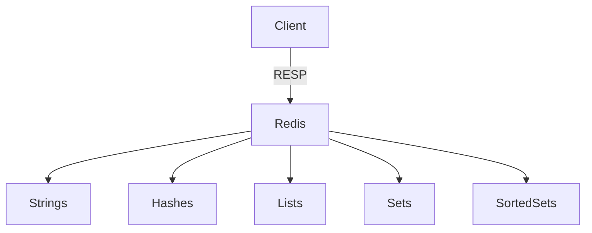
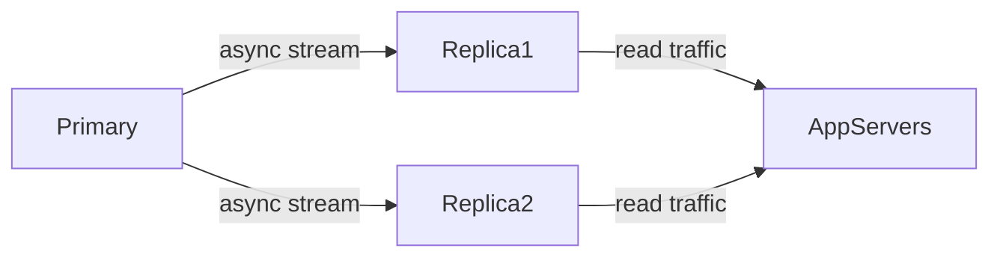
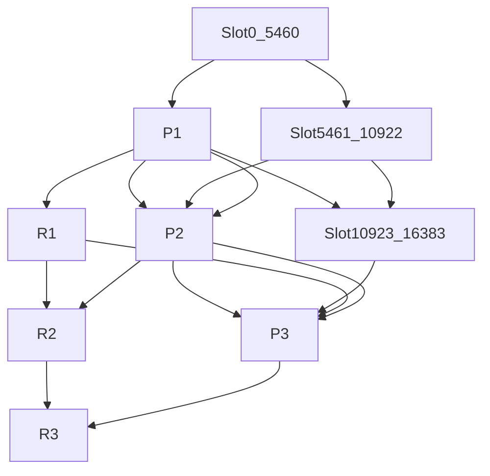
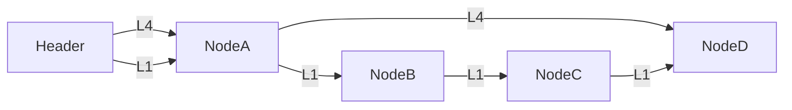
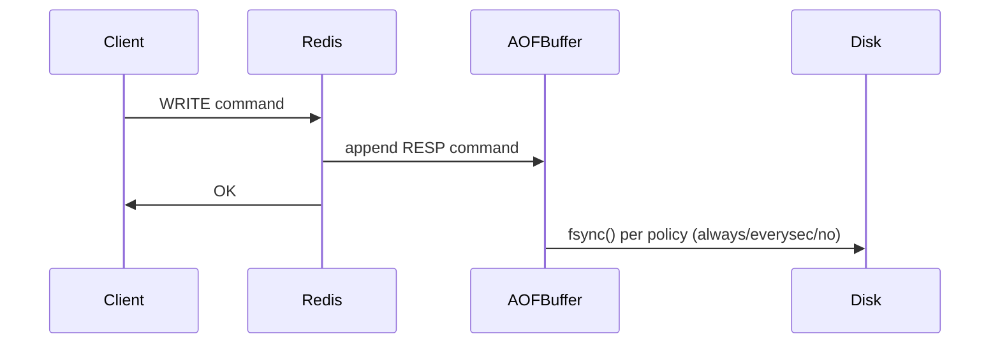
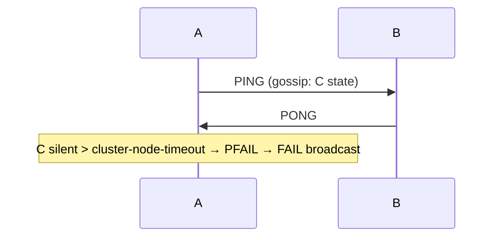

# Redis Roadmap — Universal Template

> **A comprehensive template system for generating Redis roadmap content across all skill levels.**

## Overview

| | Description |
|---|---|
| **Purpose** | Universal template for all Redis roadmap topics |
| **Files per topic** | 9 files: `junior.md`, `middle.md`, `senior.md`, `professional.md`, `interview.md`, `tasks.md`, `find-bug.md`, `optimize.md`, `specification.md` |
| **Code fences** | `bash` for redis-cli, `python` for client code |

### Topic Structure

```
XX-topic-name/
├── junior.md      ← "What?" and "How?" — basic data types, CRUD, TTL
├── middle.md      ← "Why?" and "When?" — pub/sub, transactions, Lua, pipelining
├── senior.md      ← "How to scale?" — cluster, replication, persistence, eviction
├── professional.md ← "Under the Hood" — skiplist, listpack, AOF/RDB, gossip, jemalloc
├── interview.md   ← Interview prep
├── tasks.md       ← Hands-on practice
├── find-bug.md    ← Bug-finding exercises
├── optimize.md    ← Optimization exercises
└── specification.md   ← Official spec / documentation deep-dive
```

| Aspect | Junior | Middle | Senior | Professional |
|--------|--------|--------|--------|--------------|
| Depth | Basic types, CRUD | Pub/sub, transactions | Cluster, persistence | Skiplist, jemalloc |
| Focus | "What? How?" | "Why? When?" | "Scale? Persist?" | "Inside Redis memory?" |

---

# TEMPLATE 1 — `junior.md`

<details open>
<summary><strong>Template Content</strong></summary>

# {{TOPIC_NAME}} — Junior Level

## Table of Contents
1. [Introduction](#introduction)  2. [Glossary](#glossary)  3. [Core Concepts](#core-concepts)
4. [Data Types & CRUD](#data-types--crud)  5. [Pros & Cons](#pros--cons)  6. [Common Mistakes](#common-mistakes)

## Introduction
{{TOPIC_NAME}} covers the five core Redis data types and basic CRUD operations with TTL management.

## Glossary
| Term | Definition |
|------|-----------|
| **Key** | Unique string identifier |
| **TTL** | Time-To-Live — expiry in seconds |
| **String/List/Hash/Set/ZSet** | The five native data types |
| **RESP** | Redis Serialization Protocol |

## Core Concepts


## Data Types & CRUD

```bash
# Strings
SET user:1:name "Alice"
GET user:1:name
SET session:abc "data" EX 3600
INCR page:views

# Hashes
HSET user:1 name "Alice" age 30
HGETALL user:1
HDEL user:1 age

# Lists
RPUSH tasks "t1" "t2"
LPOP tasks
LRANGE tasks 0 -1

# Sets
SADD tags "redis" "cache"
SMEMBERS tags
SINTER tags other:tags

# Sorted Sets
ZADD board 1500 "Alice" 2000 "Bob"
ZREVRANGE board 0 2 WITHSCORES
ZRANK board "Alice"
```

```python
import redis
r = redis.Redis(host="localhost", port=6379, decode_responses=True)
r.set("greeting", "hello", ex=60)
r.hset("user:1", mapping={"name": "Alice", "age": "30"})
r.rpush("queue", "job1", "job2")
r.zadd("scores", {"Alice": 100, "Bob": 200})
print(r.zrange("scores", 0, -1, withscores=True))
```

## Pros & Cons
| Pros | Cons |
|------|------|
| Sub-millisecond latency | Dataset must fit in RAM |
| Five native data structures | No relational query language |
| Built-in atomic ops (INCR, LPUSH) | Single-threaded command execution |

## Common Mistakes
| Mistake | Fix |
|---------|-----|
| No TTL on cached keys | Always set `EX` on cache keys |
| Using `KEYS *` in production | Use `SCAN` with cursor |
| Storing collections as JSON strings | Use the appropriate native type |

</details>

---

# TEMPLATE 2 — `middle.md`

<details open>
<summary><strong>Template Content</strong></summary>

# {{TOPIC_NAME}} — Middle Level

## Table of Contents
1. [Pub/Sub](#pubsub)  2. [Transactions](#transactions)  3. [WATCH](#watch)
4. [Lua Scripting](#lua-scripting)  5. [Pipelining](#pipelining)  6. [Error Handling](#error-handling)

## Introduction
At the middle level, {{TOPIC_NAME}} covers coordination patterns: pub/sub messaging, multi-command transactions, server-side Lua logic, and pipelining for throughput.

## Pub/Sub
```bash
SUBSCRIBE news:sports       # terminal 1
PUBLISH news:sports "Goal!" # terminal 2
```
```python
def listener():
    p = r.pubsub()
    p.subscribe("news:sports")
    for msg in p.listen():
        if msg["type"] == "message":
            print(msg["data"])
```
> Use Redis Streams (`XADD/XREAD`) for durable, replayable messaging.

## Transactions
```bash
MULTI
SET balance:alice 900
SET balance:bob 1100
EXEC
```
```python
pipe = r.pipeline(transaction=True)
pipe.decrby("balance:alice", 100)
pipe.incrby("balance:bob", 100)
pipe.execute()
```

## WATCH — Optimistic Locking
```python
with r.pipeline() as pipe:
    while True:
        try:
            pipe.watch("balance:alice")
            current = int(pipe.get("balance:alice"))
            pipe.multi()
            pipe.set("balance:alice", current - 100)
            pipe.execute()
            break
        except redis.WatchError:
            continue
```

## Lua Scripting
```bash
EVAL "
  local v = tonumber(redis.call('GET', KEYS[1]))
  if v and v > 0 then return redis.call('DECRBY', KEYS[1], ARGV[1]) end
  return -1
" 1 stock:item42 5
```
```python
sha = r.script_load("return redis.call('GET', KEYS[1])")
r.evalsha(sha, 1, "mykey")
```

## Pipelining
```python
pipe = r.pipeline(transaction=False)
for i in range(10_000):
    pipe.set(f"key:{i}", i)
pipe.execute()  # 10-50x faster than sequential
```

## Error Handling
```python
try:
    r.execute_command("SET")
except redis.exceptions.ResponseError as e:
    print(f"Command error: {e}")
except redis.exceptions.ConnectionError as e:
    print(f"Connection lost: {e}")
```

</details>

---

# TEMPLATE 3 — `senior.md`

<details open>
<summary><strong>Template Content</strong></summary>

# {{TOPIC_NAME}} — Senior Level

## Table of Contents
1. [Replication](#replication)  2. [Sentinel](#sentinel)  3. [Cluster](#cluster)
4. [Persistence](#persistence)  5. [Eviction Policies](#eviction-policies)

## Introduction
At the senior level, {{TOPIC_NAME}} is about production reliability: persistence strategy, cluster topology, eviction tuning, and high availability with Sentinel.

## Replication
```bash
replicaof 192.168.1.10 6379   # redis.conf on replica
redis-cli INFO replication | grep -E "master_repl_offset|slave_repl_offset"
```


## Sentinel
```bash
sentinel monitor mymaster 127.0.0.1 6379 2
sentinel down-after-milliseconds mymaster 5000
```
```python
from redis.sentinel import Sentinel
s = Sentinel([("127.0.0.1", 26379)], socket_timeout=0.1)
master = s.master_for("mymaster", decode_responses=True)
```

## Cluster
```bash
redis-cli --cluster create \
  127.0.0.1:7001 127.0.0.1:7002 127.0.0.1:7003 \
  127.0.0.1:7004 127.0.0.1:7005 127.0.0.1:7006 \
  --cluster-replicas 1
redis-cli -p 7001 CLUSTER INFO
```


## Persistence
| Mode | Durability | Restart | Use Case |
|------|-----------|---------|----------|
| RDB | Periodic snapshot | Fast | Cache-tolerant |
| AOF | Every write | Slow (replay) | Financial data |
| Hybrid | RDB + AOF tail | Fast | Production |

```bash
# redis.conf — hybrid
save 900 1
appendonly yes
appendfsync everysec
aof-use-rdb-preamble yes
```

## Eviction Policies
```bash
maxmemory 4gb
maxmemory-policy allkeys-lru
```
| Policy | Best For |
|--------|---------|
| `noeviction` | Critical permanent data |
| `allkeys-lru` | General cache |
| `volatile-lru` | Mixed cache + config keys |
| `allkeys-lfu` | Skewed/hot-spot workloads |
| `volatile-ttl` | Session stores |

</details>

---

# TEMPLATE 4 — `professional.md`

<details open>
<summary><strong>Template Content</strong></summary>

# {{TOPIC_NAME}} — Database/System Internals

## Table of Contents
1. [Skiplist Internals](#skiplist-internals)  2. [Listpack Encoding](#listpack-encoding)
3. [AOF/RDB Mechanics](#aofrdb-mechanics)  4. [Cluster Gossip](#cluster-gossip)
5. [Lua Execution Model](#lua-execution-model)  6. [jemalloc](#jemalloc)
7. [Encoding Inspection](#encoding-inspection)

## Introduction
At the professional level, {{TOPIC_NAME}} demands understanding what happens inside the Redis process — skiplist internals, listpack byte layout, AOF fsync/copy-on-write, gossip convergence, and jemalloc fragmentation.

## Skiplist Internals
```bash
ZADD myzset 1.0 "a" 2.0 "b"
OBJECT ENCODING myzset     # → "listpack" (≤128 members, ≤64B each)
# Add 129th member → promotes to "skiplist"
```

Each level pointer stores a **span** — rank distance — enabling O(log N) `ZRANK` without counting nodes.

## Listpack Encoding
```text
[ total-bytes (4B) | num-elements (2B) | entry…entry | 0xFF END ]
Each entry: [ encoding (1B) | content | backlen (1B) ]
```
```bash
redis-cli CONFIG SET zset-max-listpack-entries 64
redis-cli CONFIG SET zset-max-listpack-value 32
```
Listpack uses ~20 bytes/entry vs ~64 bytes/skiplist node — ~3x memory savings below threshold.

## AOF/RDB Mechanics

```bash
BGSAVE          # fork() → child writes dump.rdb; parent uses copy-on-write
BGREWRITEAOF    # fork() → child writes compact AOF; parent buffers new writes
# Peak RSS can approach 2× dataset under heavy write load during fork
```

## Cluster Gossip
```bash
# Each node sends PING with gossip payload about random peers → O(N log N) convergence
# PFAIL (suspected) → FAIL (quorum of nodes agree) → failover triggered
redis-cli -p 7001 CLUSTER NODES
```


## Lua Execution Model
```bash
lua-time-limit 5000        # ms — soft limit; SCRIPT KILL on timeout (if no writes)
SCRIPT LOAD "return redis.call('GET', KEYS[1])"
EVALSHA <sha> 1 mykey      # reuses server-side cached bytecode
```

## jemalloc
```bash
redis-cli INFO memory | grep -E "mem_allocator|mem_fragmentation_ratio"
# healthy ratio: 1.0–1.5; >1.5 → enable active defrag
redis-cli CONFIG SET activedefrag yes
redis-cli CONFIG SET active-defrag-threshold-lower 10
```
```mermaid
graph TD
    Redis -->|≤8B| TinyBin & |8B-16KB| SmallBin & |>16KB| LargeAlloc
    TinyBin & SmallBin & LargeAlloc --> Arena --> OSMemory
```

## Encoding Inspection
```bash
redis-cli OBJECT ENCODING mykey
redis-cli MEMORY USAGE mykey
redis-cli DEBUG OBJECT mykey       # serializedlength, encoding, lru_seconds_idle
redis-cli --scan --pattern "*" | xargs -I{} redis-cli OBJECT ENCODING {}
```

</details>

---

# TEMPLATE 5 — `interview.md`

<details open>
<summary><strong>Template Content</strong></summary>

# {{TOPIC_NAME}} — Interview Preparation

## Junior
**Q1: Five core data types and a use case each?**
String (sessions), List (queues), Hash (user objects), Set (tag indexes), ZSet (leaderboards).

**Q2: `DEL` vs `UNLINK`?**
`DEL` is synchronous — blocks the event loop. `UNLINK` marks the key deleted and frees memory asynchronously.

**Q3: Why not `KEYS *` in production?**
O(N) full keyspace scan that blocks all other commands. Use cursor-based `SCAN`.

## Middle
**Q4: Transaction vs Lua script?**
Both atomic. Transactions queue commands but cannot branch on results. Lua scripts run inside the event loop and can use conditionals on intermediate results.

**Q5: Pub/Sub vs Streams?**
Pub/sub is fire-and-forget with no persistence. Streams persist to a durable log with consumer-group acknowledgment and replay support.

**Q6: What does `WATCH` solve?**
Optimistic locking: aborts the `EXEC` if the watched key was modified between `WATCH` and `EXEC`.

## Senior
**Q7: RDB vs AOF vs hybrid?**
RDB: periodic binary snapshot — fast restart, potential data loss. AOF: logs every write — durable, slow replay. Hybrid: RDB preamble in the AOF file — fast restart with near-AOF durability.

**Q8: Cluster hash slots?**
16,384 slots. Key maps to `CRC16(key) % 16384`. Hash tags `{order}` force co-location.

**Q9: Eviction policy for session cache vs config store?**
Sessions: `volatile-lru` (only evict TTL-bearing keys). Config: `noeviction` (error on full, never silently drop config).

## Professional
**Q10: Why skiplist over red-black tree for ZSets?**
Skip lists give O(log N) ZRANGE/ZRANK via span accumulation, simpler code, no rotations, and better sequential-scan cache locality.

**Q11: listpack → skiplist promotion memory impact?**
Below threshold (~20 B/entry listpack vs ~64 B/node skiplist). Crossing the threshold causes a one-way 3x memory increase. Tune `zset-max-listpack-entries` to balance lookup speed vs memory.

**Q12: `BGREWRITEAOF` and copy-on-write memory spike?**
`fork()` shares pages via COW. Under heavy writes, the parent modifies pages that the OS duplicates — peak RSS can approach 2× dataset size.

</details>

---

# TEMPLATE 6 — `tasks.md`

<details open>
<summary><strong>Template Content</strong></summary>

# {{TOPIC_NAME}} — Hands-On Practice Tasks

## Junior
**Task 1 — Session Store:** Implement `create_session` / `get_session` using Redis Strings with a 30-min TTL. Use `GETEX` to refresh TTL on read.
```python
r.set(f"session:{sid}", json.dumps(data), ex=1800)
raw = r.getex(f"session:{sid}", ex=1800)
```

**Task 2 — Leaderboard:** Build a sorted-set leaderboard supporting add/update score, top-10 query, and rank lookup.
```bash
ZADD game:lb 4200 "alice"
ZREVRANGE game:lb 0 9 WITHSCORES
ZREVRANK game:lb "alice"
```

**Task 3 — Tag Index:** Use one Set per tag to build an inverted index. Use `SINTER` to find items matching multiple tags.

## Middle
**Task 4 — Distributed Lock:** Implement `acquire` / `release` using `SET NX EX` + Lua release script to ensure only the owner can release.
```python
r.set(f"lock:{resource}", token, nx=True, ex=10)
r.eval("if redis.call('GET',KEYS[1])==ARGV[1] then return redis.call('DEL',KEYS[1]) end return 0", 1, key, token)
```

**Task 5 — Rate Limiter:** Sliding-window rate limiter (100 req/min) using ZSet + pipeline.
```python
pipe.zremrangebyscore(key, 0, now - 60)
pipe.zadd(key, {str(now): now})
pipe.zcard(key)
pipe.expire(key, 60)
```

## Senior
**Task 6 — Cache Stampede Protection:** Combine cache-aside with a distributed lock to prevent thundering herd on popular key expiry.

**Task 7 — Cluster Reshard:** Move 2,000 hash slots via `redis-cli --cluster reshard`. Verify no key loss.

**Task 8 — Persistence Benchmark:** Compare ops/sec under: no persistence, RDB only, AOF `everysec`, AOF `always` using `redis-benchmark -t set -n 200000`.

</details>

---

# TEMPLATE 7 — `find-bug.md`

<details open>
<summary><strong>Template Content</strong></summary>

# {{TOPIC_NAME}} — Find the Bug

## Exercise 1 — Cache Stampede (Missing Lock)
```python
# BUG: concurrent cache misses all hit the DB simultaneously
def get_product(pid):
    cached = r.get(f"product:{pid}")
    if cached: return json.loads(cached)
    data = db.fetch(pid)          # thundering herd
    r.set(f"product:{pid}", json.dumps(data), ex=60)
    return data
```
**Fix:** Wrap the DB call in a distributed lock (`SET NX EX`). Concurrent waiters sleep briefly and serve from cache once the lock holder repopulates it.

## Exercise 2 — Wrong Data Type for Shopping Cart
```bash
# BUG: full read-modify-write on every cart change + race condition
SET cart:user:42 '["itemA","itemB"]'
```
**Fix:** Use a Redis List — `RPUSH`/`LREM`/`LRANGE` for atomic O(1) operations.

## Exercise 3 — Missing TTL
```python
# BUG: keys never expire → unbounded memory growth + stale data
r.set(f"user:profile:{uid}", json.dumps(profile))
```
**Fix:** Always pass `ex=ttl` on cache writes: `r.set(key, value, ex=3600)`.

## Exercise 4 — KEYS in Production
```python
# BUG: O(N) full scan blocks entire Redis event loop
keys = r.keys(f"user:{uid}:*")
```
**Fix:**
```python
cursor = 0
while True:
    cursor, keys = r.scan(cursor, match=f"user:{uid}:*", count=100)
    if keys: r.delete(*keys)
    if cursor == 0: break
```

## Exercise 5 — Race Condition in Transfer
```python
# BUG: check-then-act is not atomic → potential overdraft
bal = int(r.get(f"balance:{from_id}"))
if bal >= amount:
    r.decrby(f"balance:{from_id}", amount)
    r.incrby(f"balance:{to_id}", amount)
```
**Fix:** Use `WATCH` + `MULTI/EXEC` pipeline with retry on `WatchError`.

## Exercise 6 — Pub/Sub Message Loss
```python
# BUG: messages lost when consumer is offline
r.publish("orders", json.dumps(order))
```
**Fix:** Use Streams for durable delivery:
```python
r.xadd("orders", {"data": json.dumps(order)})
msgs = r.xreadgroup("processors", "w1", {"orders": ">"}, count=10)
```

</details>

---

# TEMPLATE 8 — `optimize.md`

<details open>
<summary><strong>Template Content</strong></summary>

# {{TOPIC_NAME}} — Optimize

## Optimization 1 — Pipeline vs Sequential
```bash
redis-cli --latency -h 127.0.0.1   # measure baseline RTT
```
```python
# Sequential: 10,000 × 0.1ms RTT ≈ 1s
for i in range(10_000): r.set(f"key:{i}", i)

# Pipeline: single TCP write for all commands
pipe = r.pipeline(transaction=False)
for i in range(10_000): pipe.set(f"key:{i}", i)
pipe.execute()   # 10-50x faster
```

## Optimization 2 — Encoding Threshold Tuning
| Encoding | Memory/key (50 members) | Lookup |
|----------|------------------------|--------|
| listpack | ~800 B | O(N) |
| skiplist | ~2 KB | O(log N) |
```bash
redis-cli CONFIG SET zset-max-listpack-entries 200
redis-cli MEMORY USAGE leaderboard   # compare before/after
```

## Optimization 3 — Hash vs JSON String
```python
# Before: full GET + deserialize for every field access, ~1.5 KB/key
r.set("user:1", json.dumps(large_user))

# After: server-side field access, ~700 B/key (listpack)
r.hset("user:1", mapping=large_user)
r.hget("user:1", "email")   # no client-side deserialization
```

## Optimization 4 — Slow Log Analysis
```bash
redis-cli CONFIG SET slowlog-log-slower-than 1000   # 1ms threshold
redis-cli SLOWLOG GET 10
# Common offenders: SMEMBERS (large set), LRANGE 0 -1, HGETALL (large hash)
# Fix: SSCAN, paginated LRANGE, HSCAN
```

## Optimization 5 — redis-benchmark
```bash
redis-benchmark -t set -n 100000 -q                  # baseline: ~80k req/s
redis-benchmark -t set -n 100000 -P 16 -q            # pipeline: ~600k req/s
redis-benchmark -t get,set -n 200000 -c 50 -q        # concurrency test
redis-benchmark -t set -n 100000 --latency-history -q # p99 latency
```

## Optimization 6 — Active Defragmentation
```bash
redis-cli INFO memory | grep mem_fragmentation_ratio
# ratio > 1.5 → enable active defrag
redis-cli CONFIG SET activedefrag yes
redis-cli CONFIG SET active-defrag-threshold-lower 10
redis-cli CONFIG SET active-defrag-threshold-upper 100
watch -n 2 "redis-cli INFO memory | grep mem_fragmentation_ratio"
```

</details>
---
---

# TEMPLATE 9 — `specification.md`

> **Focus:** Official documentation deep-dive — API reference, configuration schema, behavioral guarantees, and version compatibility.
>
> **Source:** Always cite the official documentation with direct section links.
> - Blockchain: https://bitcoin.org/bitcoin.pdf | https://ethereum.org/en/whitepaper/
> - Software Design/Architecture: https://refactoring.guru/design-patterns
> - Computer Science: https://en.wikipedia.org/wiki/List_of_data_structures
> - Software Architect: https://www.oreilly.com/library/view/fundamentals-of-software/9781492043447/
> - System Design: https://github.com/donnemartin/system-design-primer
> - MongoDB: https://www.mongodb.com/docs/manual/reference/
> - PostgreSQL: https://www.postgresql.org/docs/current/
> - API Design: https://swagger.io/specification/ (OpenAPI 3.x)
> - Backend: https://developer.mozilla.org/en-US/docs/Learn/Server-side
> - Elasticsearch: https://www.elastic.co/guide/en/elasticsearch/reference/current/
> - Redis: https://redis.io/docs/latest/commands/
> - Full-Stack: https://developer.mozilla.org/en-US/

<details open>
<summary><strong>Template Content</strong></summary>

# {{TOPIC_NAME}} — Specification

> **Official Documentation Reference**
>
> Source: [{{TOOL_NAME}} Official Docs]({{DOCS_URL}}) — {{SECTION}}

---

## Table of Contents

1. [Docs Reference](#docs-reference)
2. [API / Configuration Reference](#api--configuration-reference)
3. [Core Concepts & Rules](#core-concepts--rules)
4. [Schema / Options Reference](#schema--options-reference)
5. [Behavioral Specification](#behavioral-specification)
6. [Edge Cases from Official Docs](#edge-cases-from-official-docs)
7. [Version & Compatibility Matrix](#version--compatibility-matrix)
8. [Official Examples](#official-examples)
9. [Compliance Checklist](#compliance-checklist)
10. [Related Documentation](#related-documentation)

---

## 1. Docs Reference

| Property | Value |
|----------|-------|
| **Official Docs** | [{{TOOL_NAME}} Documentation]({{DOCS_URL}}) |
| **Relevant Section** | {{SECTION_NAME}} — {{SECTION_TITLE}} |
| **Version** | {{TOOL_VERSION}} |
| **Direct URL** | {{DOCS_URL}}/{{PATH}} |

---

## 2. API / Configuration Reference

> From: {{DOCS_URL}}/{{API_SECTION}}

### {{RESOURCE_OR_ENDPOINT_NAME}}

| Field / Parameter | Type | Required | Default | Description |
|------------------|------|----------|---------|-------------|
| `{{FIELD_1}}` | `{{TYPE_1}}` | ✅ | — | {{DESC_1}} |
| `{{FIELD_2}}` | `{{TYPE_2}}` | ❌ | `{{DEFAULT_2}}` | {{DESC_2}} |
| `{{FIELD_3}}` | `{{TYPE_3}}` | ❌ | `{{DEFAULT_3}}` | {{DESC_3}} |

---

## 3. Core Concepts & Rules

The official documentation defines these key rules for {{TOPIC_NAME}}:

### Rule 1: {{RULE_NAME}}

> *Docs: [{{DOCS_URL}}/{{SECTION}}]({{DOCS_URL}}/{{SECTION}}) — "{{DOC_QUOTE}}"*

{{RULE_EXPLANATION}}

```{{CODE_LANG}}
# ✅ Correct — follows official guidance
{{VALID_EXAMPLE}}

# ❌ Incorrect — violates official guidance
{{INVALID_EXAMPLE}}
```

### Rule 2: {{RULE_NAME}}

> *Docs: [{{DOCS_URL}}/{{SECTION}}]({{DOCS_URL}}/{{SECTION}})*

{{RULE_EXPLANATION}}

```{{CODE_LANG}}
{{CODE_EXAMPLE}}
```

---

## 4. Schema / Options Reference

| Option | Type | Allowed Values | Default | Docs |
|--------|------|---------------|---------|------|
| `{{OPT_1}}` | `{{TYPE_1}}` | `{{VALUES_1}}` | `{{DEFAULT_1}}` | [Link]({{URL_1}}) |
| `{{OPT_2}}` | `{{TYPE_2}}` | `{{VALUES_2}}` | `{{DEFAULT_2}}` | [Link]({{URL_2}}) |
| `{{OPT_3}}` | `{{TYPE_3}}` | `{{VALUES_3}}` | `{{DEFAULT_3}}` | [Link]({{URL_3}}) |

---

## 5. Behavioral Specification

### Normal Operation

{{NORMAL_OPERATION}}

### Performance Characteristics

| Operation | Time Complexity | Space | Notes |
|-----------|----------------|-------|-------|
| {{OP_1}} | {{TIME_1}} | {{SPACE_1}} | {{NOTES_1}} |
| {{OP_2}} | {{TIME_2}} | {{SPACE_2}} | {{NOTES_2}} |

### Error / Failure Conditions

| Error | Condition | Official Resolution |
|-------|-----------|---------------------|
| `{{ERROR_1}}` | {{COND_1}} | {{FIX_1}} |
| `{{ERROR_2}}` | {{COND_2}} | {{FIX_2}} |

---

## 6. Edge Cases from Official Docs

| Edge Case | Official Behavior | Reference |
|-----------|-------------------|-----------|
| {{EDGE_1}} | {{BEHAVIOR_1}} | [Docs]({{URL_1}}) |
| {{EDGE_2}} | {{BEHAVIOR_2}} | [Docs]({{URL_2}}) |
| {{EDGE_3}} | {{BEHAVIOR_3}} | [Docs]({{URL_3}}) |

---

## 7. Version & Compatibility Matrix

| Version | Change | Backward Compatible? | Notes |
|---------|--------|---------------------|-------|
| `{{VER_1}}` | {{CHANGE_1}} | {{COMPAT_1}} | {{NOTES_1}} |
| `{{VER_2}}` | {{CHANGE_2}} | {{COMPAT_2}} | {{NOTES_2}} |

---

## 8. Official Examples

### Example from Docs: {{EXAMPLE_TITLE}}

> Source: [{{DOCS_URL}}/{{ANCHOR}}]({{DOCS_URL}}/{{ANCHOR}})

```{{CODE_LANG}}
{{OFFICIAL_EXAMPLE_CODE}}
```

**Expected result:**

```
{{EXPECTED_RESULT}}
```

---

## 9. Compliance Checklist

- [ ] Follows official recommended patterns for {{TOPIC_NAME}}
- [ ] Uses supported version ({{TOOL_VERSION}}+)
- [ ] Handles all documented error conditions
- [ ] Follows official security recommendations
- [ ] Compatible with listed dependencies
- [ ] Configuration validated against official schema

---

## 10. Related Documentation

| Topic | Doc Section | URL |
|-------|-------------|-----|
| {{RELATED_1}} | {{SECTION_1}} | [Link]({{URL_1}}) |
| {{RELATED_2}} | {{SECTION_2}} | [Link]({{URL_2}}) |
| {{RELATED_3}} | {{SECTION_3}} | [Link]({{URL_3}}) |

---

> **Content Rules for `specification.md`:**
> - Always link directly to the relevant doc section (not just the homepage)
> - Use official examples from the documentation when available
> - Note breaking changes and deprecated features between versions
> - Include official security recommendations
> - Minimum 2 Core Rules, 3 Schema fields, 3 Edge Cases, 2 Official Examples

</details>
