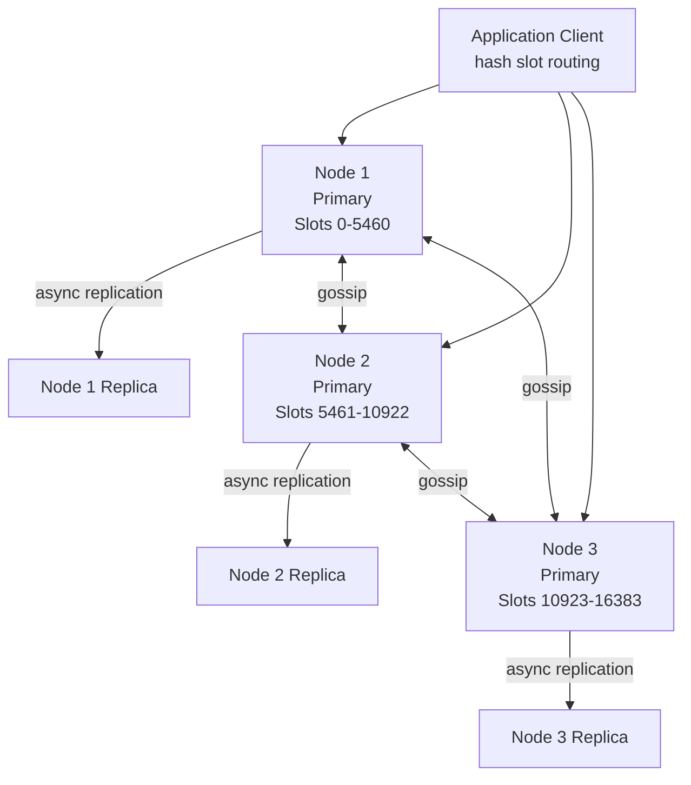
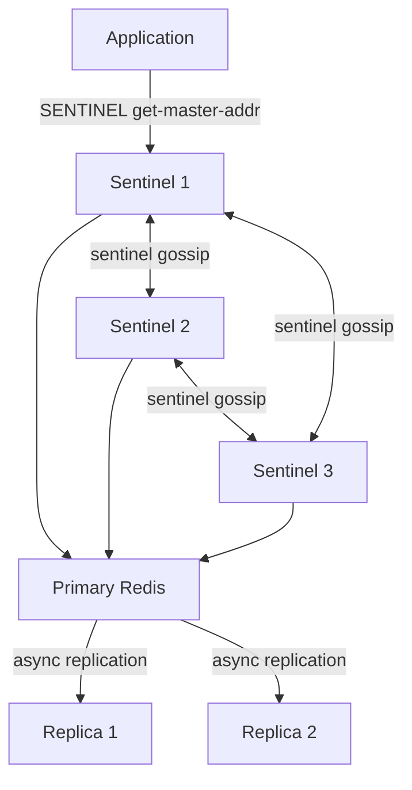

# Redis Roadmap — Universal Template

> Guides content generation for **Redis** topics.
> Primary code fences: `bash` for redis-cli, `python` for client code.

---

## Overview

| | Description |
|---|---|
| **Purpose** | Universal template for all Redis roadmap topics |
| **Files per topic** | 8 files: `junior.md`, `middle.md`, `senior.md`, `professional.md`, `interview.md`, `tasks.md`, `find-bug.md`, `optimize.md` |
| **Language** | All content must be generated in **English** |
| **Table of Contents** | **Optional** — include only if relevant to the topic. For `tasks.md`, `find-bug.md`, `optimize.md` it is NOT required |

### Topic Structure

```
XX-topic-name/
├── junior.md          ← "What?" and "How?" — data types, basic commands, TTL, pub/sub
├── middle.md          ← "Why?" and "When?" — data structure selection, pipelining, Lua scripting, eviction
├── senior.md          ← "How to operate?" — clustering, sentinel, persistence, production ops
├── professional.md    ← "Under the Hood" — skiplist, listpack/ziplist, AOF/RDB, gossip protocol, Lua VM
├── interview.md       ← Interview prep across all levels
├── tasks.md           ← Hands-on practice tasks
├── find-bug.md        ← Find and fix bugs in usage patterns (10+ exercises)
└── optimize.md        ← Optimize slow commands and memory usage (10+ exercises)
```

---

## Level Comparison Matrix

| Aspect | Junior | Middle | Senior | Professional |
|:------:|:------:|:------:|:------:|:------------:|
| **Depth** | Data types, basic commands, TTL | Pipelining, transactions, scripting, eviction policies | Cluster, Sentinel, persistence, monitoring | Skiplist + listpack internals, AOF rewrite, gossip protocol, Lua VM |
| **Code** | `SET`, `GET`, `HSET`, `LPUSH`, `ZADD` | `MULTI/EXEC`, `EVAL`, `SCAN`, pipelining | `redis-cli --cluster`, `INFO replication` | `DEBUG OBJECT`, memory encoding inspection, skiplist level analysis |
| **Tricky Points** | TTL misunderstanding, wrong data type | Cache stampede, KEYS vs SCAN | Cluster resharding, split-brain | Memory encoding thresholds, AOF buffer behavior |
| **Focus** | "What?" and "How?" | "Why?" and "When?" | "How to operate?" | "What happens under the hood?" |

---

# TEMPLATE 1 — `junior.md`

<details open>
<summary><strong>Template Content</strong></summary>

# {{TOPIC_NAME}} — Junior Level

## Table of Contents

1. [Introduction](#introduction)
2. [Prerequisites](#prerequisites)
3. [Glossary](#glossary)
4. [Core Concepts](#core-concepts)
5. [Real-World Analogies](#real-world-analogies)
6. [Mental Models](#mental-models)
7. [Pros & Cons](#pros--cons)
8. [Use Cases](#use-cases)
9. [Code Examples](#code-examples)
10. [Error Handling and Transaction Patterns](#error-handling-and-transaction-patterns)
11. [Security Considerations](#security-considerations)
12. [Performance Tips](#performance-tips)
13. [Best Practices](#best-practices)
14. [Edge Cases & Pitfalls](#edge-cases--pitfalls)
15. [Common Mistakes](#common-mistakes)
16. [Tricky Points](#tricky-points)
17. [Tricky Questions](#tricky-questions)
18. [Cheat Sheet](#cheat-sheet)
19. [Summary](#summary)
20. [Further Reading](#further-reading)
21. [Related Topics](#related-topics)

---

## Introduction

> Focus: "What is {{TOPIC_NAME}}?" and "How do I use it in Redis?"

Brief explanation of what {{TOPIC_NAME}} is and why a developer needs to understand it in the context of Redis.
Assume the reader knows basic programming and has heard of caching but has not used Redis before.

---

## Prerequisites

- **Required:** Basic understanding of key-value stores — Redis stores data as named keys with typed values
- **Required:** Ability to run a terminal and basic command-line usage
- **Helpful but not required:** HTTP caching concepts (Cache-Control, TTL)

---

## Glossary

| Term | Definition |
|------|-----------|
| **Key** | A string identifier for a stored value in Redis |
| **TTL** | Time to Live — the number of seconds before a key is automatically deleted |
| **Eviction** | Automatic deletion of keys when Redis reaches its memory limit |
| **Persistence** | Writing Redis data to disk so it survives restarts |
| **RDB** | Redis Database file — a point-in-time snapshot of all data |
| **AOF** | Append Only File — a log of every write command for durability |
| **Pipeline** | Sending multiple commands to Redis without waiting for each reply |
| **{{Term 8}}** | {{Definition specific to TOPIC_NAME}} |

> 6-10 terms. Keep definitions beginner-friendly.

---

## Core Concepts

### Concept 1: Redis Data Types

Redis is not a simple key-value store — each key has a **type** that determines which commands apply:

| Type | Description | Use Case |
|------|-------------|---------|
| `String` | Bytes — text, numbers, serialized JSON | Counters, cached HTML, session tokens |
| `Hash` | Field-value pairs within one key | User profile objects |
| `List` | Ordered sequence — push/pop from both ends | Task queues, activity feeds |
| `Set` | Unordered unique members | Tags, online users, unique visitor tracking |
| `Sorted Set (ZSet)` | Members with float scores, sorted | Leaderboards, rate limiting, time-series |
| `Stream` | Append-only log with consumer groups | Event sourcing, message queues |
| `Bitmap` | Bit operations on a string | Presence tracking, feature flags |
| `HyperLogLog` | Probabilistic cardinality estimation | Unique visitor count at scale |

### Concept 2: Atomic Single-Command Operations

Every single Redis command is atomic — it executes completely or not at all, with no partial state.
This is what makes Redis safe for counters and flags without explicit locks.

### Concept 3: {{TOPIC_NAME}} Specific Concept

{{Explain the primary concept of the topic in 3-5 sentences. Connect it to Redis keys and data types.}}

---

## Real-World Analogies

| Concept | Analogy |
|---------|--------|
| **Redis** | A whiteboard next to your workstation — instant to read/write, limited space, gone if the power cuts (without persistence) |
| **TTL** | A sticky note with an expiry date — automatically thrown away when expired |
| **Sorted Set** | A sports scoreboard — players (members) with scores, always sorted |
| **{{TOPIC_NAME concept}}** | {{Everyday analogy — note where it breaks down}} |

---

## Mental Models

**The intuition:** Redis is an in-memory dictionary where every value has a type.
Think of it as a very fast, shared global variable store for your entire application fleet.

**Why this model helps:** It explains why Redis is fast (everything is in RAM), why you need TTLs
(RAM is finite), and why data is lost on restart without persistence.

---

## Pros & Cons

| Pros | Cons |
|------|------|
| Sub-millisecond latency for all operations | Data must fit in RAM (expensive at scale) |
| Rich data types with atomic commands | Not a primary database — durability trade-offs |
| Built-in pub/sub, streams, expiry | Single-threaded command execution (mostly) |
| Cluster mode for horizontal scaling | Complex cluster resharding operations |

### When to use {{TOPIC_NAME}}:
- {{Scenario where this Redis feature shines}}

### When NOT to use {{TOPIC_NAME}}:
- {{Scenario where a different data store is more appropriate}}

---

## Use Cases

- **Session storage:** Store user sessions with TTL; automatic cleanup on expiry
- **Rate limiting:** Atomic `INCR` + `EXPIRE` for per-IP request counting
- **Leaderboard:** Sorted sets for real-time ranking
- **Pub/Sub messaging:** Decouple producers and consumers
- **{{TOPIC_NAME use case}}:** {{Brief description}}

---

## Code Examples

### Example 1: Basic Key-Value with TTL

```bash
# Set a key with a 60-second TTL
SET session:user123 "eyJhbGciOiJIUzI1NiJ9..." EX 3600

# Check remaining TTL
TTL session:user123

# Get the value
GET session:user123

# Delete explicitly
DEL session:user123
```

### Example 2: Hash — User Profile

```bash
# Store user profile fields
HSET user:1001 name "Alice" email "alice@example.com" age 30

# Get one field
HGET user:1001 email

# Get all fields
HGETALL user:1001

# Increment a numeric field atomically
HINCRBY user:1001 login_count 1
```

### Example 3: Python Client — Basic Operations

```python
import redis

r = redis.Redis(host='localhost', port=6379, decode_responses=True)

# String with TTL
r.set("session:abc", "data", ex=3600)
value = r.get("session:abc")

# Hash
r.hset("user:1001", mapping={"name": "Alice", "email": "alice@example.com"})
profile = r.hgetall("user:1001")

# List — task queue
r.rpush("tasks", "task1", "task2")
task = r.lpop("tasks")

# Sorted set — leaderboard
r.zadd("leaderboard", {"alice": 1500, "bob": 1200, "carol": 1800})
top_players = r.zrevrange("leaderboard", 0, 9, withscores=True)
```

### Example 4: {{TOPIC_NAME}} — Core Usage

```bash
# {{Describe what this example demonstrates for TOPIC_NAME}}
{{REDIS_COMMAND}} {{key}} {{args}}
```

```python
# Python equivalent
r.{{method}}("{{key}}", {{args}})
```

> Provide 4-6 examples. Start simple, build toward the topic.

---

## Error Handling and Transaction Patterns

```python
import redis
from redis.exceptions import ConnectionError, TimeoutError, ResponseError

r = redis.Redis(host='localhost', port=6379, decode_responses=True,
                socket_timeout=1.0, retry_on_timeout=True)

try:
    result = r.set("key", "value", ex=300)
    if result is None:
        print("Condition not met (NX/XX flag)")
except ConnectionError:
    print("Redis is unreachable — fall back to database")
except TimeoutError:
    print("Command timed out")
except ResponseError as e:
    print(f"Wrong type or syntax error: {e}")
```

| Error | Cause | Fix |
|-------|-------|-----|
| `WRONGTYPE` | Running a List command on a String key | Check key type with `TYPE key` before operating |
| `OOM command not allowed` | Redis hit `maxmemory` with `noeviction` policy | Increase `maxmemory` or switch eviction policy |
| `NOSCRIPT` | Calling `EVALSHA` with a hash not in script cache | Use `EVAL` or re-load with `SCRIPT LOAD` |
| `{{error}}` | {{Cause}} | {{Fix}} |

---

## Security Considerations

- Always set `requirepass` in `redis.conf` — Redis has no auth by default
- Bind Redis to a private interface: `bind 127.0.0.1` or the internal network IP only
- Never expose Redis port (6379) directly to the internet
- Use `rename-command FLUSHALL ""` to disable dangerous commands in production

---

## Performance Tips

- Use `MGET` / `MSET` for multiple keys instead of looping individual `GET` / `SET`
- Set a `maxmemory` limit — never let Redis OOM-kill the process
- Use `SCAN` instead of `KEYS *` for key enumeration — `KEYS` blocks the server
- Choose the right data type: a Sorted Set for ranking is far more efficient than sorting a List in application code

---

## Best Practices

- Always set a TTL on cached data — never cache indefinitely unless the data is truly static
- Use a consistent key naming convention: `{entity}:{id}:{field}` (e.g., `user:1001:session`)
- Separate Redis instances by purpose: cache, session, queue — different eviction policies apply
- Use `OBJECT ENCODING key` to verify Redis is using the memory-efficient encoding for small values

---

## Edge Cases & Pitfalls

- `EXPIRE` sets TTL on an existing key; it does not apply to a key created in the same `SET` unless you use the `EX` option
- `INCR` on a non-existent key initializes it to 0 first, then increments to 1
- A key with `TTL -1` has no expiry set; `TTL -2` means the key does not exist
- Sorted set scores are 64-bit IEEE 754 doubles — extremely large integers lose precision

---

## Common Mistakes

| Mistake | Why it Happens | Fix |
|---------|---------------|-----|
| `KEYS *` in production | Works fine in development | Replace with `SCAN 0 MATCH * COUNT 100` |
| No TTL on session data | Assumed the application will clean up | Always set `EX` or call `EXPIRE` explicitly |
| Storing large objects as single strings | Simplicity | Use Hash for structured data; consider compression |

---

## Tricky Points

- Redis is **single-threaded** for command processing — one slow command blocks all others
- `DEL` on a large key (e.g., a Hash with millions of fields) is O(N) and **blocks** the server; use `UNLINK` instead (async deletion)
- `EXPIRE` is **not inherited** — if you rename a key with `RENAME`, the new key takes the TTL of the destination key (or none if destination did not exist)

---

## Tricky Questions

1. What is the difference between `DEL` and `UNLINK`?
2. What does `TTL key` return when the key exists but has no expiry?
3. Can you store a list and a set under the same key? What happens if you try?
4. What is the maximum size of a Redis string value?
5. Why does `INCR` work atomically even though Redis is single-threaded?

---

## Cheat Sheet

```bash
# String
SET key value [EX seconds] [NX|XX]
GET key
INCR key / INCRBY key n / INCRBYFLOAT key f
MSET k1 v1 k2 v2 / MGET k1 k2

# Hash
HSET key field value [field value ...]
HGET key field / HGETALL key / HMGET key f1 f2
HDEL key field / HEXISTS key field / HLEN key

# List
RPUSH key val [val ...] / LPUSH key val [val ...]
RPOP key / LPOP key / LRANGE key 0 -1
LLEN key

# Set
SADD key member [member ...]
SMEMBERS key / SISMEMBER key member
SINTERSTORE dest k1 k2 / SUNIONSTORE dest k1 k2

# Sorted Set
ZADD key score member [score member ...]
ZRANGE key 0 -1 WITHSCORES / ZREVRANGE key 0 9
ZRANK key member / ZSCORE key member
ZRANGEBYSCORE key min max

# Key management
TTL key / PTTL key        -- seconds / milliseconds remaining
EXPIRE key seconds
TYPE key
OBJECT ENCODING key
SCAN 0 MATCH pattern COUNT 100
UNLINK key                -- async DEL
```

---

## Summary

{{TOPIC_NAME}} at the junior level is about building intuition for Redis's data model:
choosing the right type, always setting TTLs, and understanding that Redis is an in-memory store
with atomic single-command operations. Avoid `KEYS *`, use `UNLINK` for large keys, and always
configure `maxmemory` to prevent the process from consuming all available RAM.

---

## Further Reading

- [Redis Data Types — Official Docs](https://redis.io/docs/data-types/)
- [Redis CLI Reference](https://redis.io/docs/ui/cli/)
- [redis-py Documentation](https://redis-py.readthedocs.io/)

---

## Related Topics

- `02-persistence` — RDB and AOF durability
- `03-data-structures` — Sorted sets, HyperLogLog, Streams
- `04-replication` — primary-replica setup

</details>

---

# TEMPLATE 2 — `middle.md`

<details open>
<summary><strong>Template Content</strong></summary>

# {{TOPIC_NAME}} — Middle Level

## Table of Contents

1. [Introduction](#introduction)
2. [Prerequisites](#prerequisites)
3. [Deep Dive](#deep-dive)
4. [Data Structure Selection](#data-structure-selection)
5. [Pipelining and Transactions](#pipelining-and-transactions)
6. [Lua Scripting](#lua-scripting)
7. [Eviction Policies](#eviction-policies)
8. [Error Handling and Transaction Patterns](#error-handling-and-transaction-patterns)
9. [Comparison with Alternative Databases](#comparison-with-alternative-databases)
10. [Query Debugging and Performance Diagnosis](#query-debugging-and-performance-diagnosis)
11. [Best Practices](#best-practices)
12. [Tricky Points](#tricky-points)
13. [Tricky Questions](#tricky-questions)
14. [Cheat Sheet](#cheat-sheet)
15. [Summary](#summary)
16. [Further Reading](#further-reading)

---

## Introduction

> Focus: "Why does {{TOPIC_NAME}} work this way in Redis?" and "When should I use it?"

Middle-level Redis knowledge is about making deliberate choices: which data structure for which access
pattern, when to use pipelining vs transactions vs Lua scripts, and how Redis's eviction and persistence
settings affect production behavior.

---

## Prerequisites

- **Required:** Junior-level Redis data types and basic commands
- **Required:** Understanding of TTL, eviction, and the difference between RDB and AOF
- **Helpful:** Familiarity with Lua syntax (for scripting section)

---

## Deep Dive

### {{TOPIC_NAME}} — How It Really Works

{{Explain the mechanism behind TOPIC_NAME at a deeper level. Cover trade-offs, concurrency behavior,
and how Redis's single-threaded execution model affects this feature.}}

### Key Naming Strategy

```bash
# Convention: {object-type}:{id}:{sub-field}
user:1001:session
product:SKU-123:inventory
rate-limit:ip:192.168.1.1
job-queue:priority:high
```

---

## Data Structure Selection

| Access Pattern | Best Structure | Why |
|---------------|---------------|-----|
| Cache a serialized object | `String` with `EX` | Simple, fast, supports JSON/msgpack |
| Store object fields separately | `Hash` | Update one field without deserializing all |
| Ordered task queue | `List` | O(1) push/pop from head/tail |
| Unique membership + counts | `Set` | O(1) `SADD`/`SISMEMBER`, set operations |
| Ranking with scores | `Sorted Set` | O(log N) insert, O(log N) rank lookup |
| Real-time event log | `Stream` | Consumer groups, message acknowledgment |
| Unique count (approximate) | `HyperLogLog` | 12 KB fixed memory for any cardinality |
| Per-user feature flags | `Bitmap` | 1 bit per user ID — extremely compact |

---

## Pipelining and Transactions

### Pipelining — Batch Without Atomicity

```python
import redis

r = redis.Redis(host='localhost', port=6379, decode_responses=True)

# Without pipeline: 3 round trips
r.set("a", 1)
r.set("b", 2)
r.set("c", 3)

# With pipeline: 1 round trip, 3 commands buffered
pipe = r.pipeline(transaction=False)
pipe.set("a", 1)
pipe.set("b", 2)
pipe.set("c", 3)
results = pipe.execute()  # [True, True, True]
```

### MULTI/EXEC — Atomic Transaction

```bash
# All commands between MULTI and EXEC execute atomically
MULTI
INCR account:1001:balance
DECR account:1002:balance
EXEC
# Returns array of results, or nil if WATCH was triggered
```

```python
# WATCH for optimistic locking — CAS (Check And Set)
def transfer(r, from_id, to_id, amount):
    with r.pipeline() as pipe:
        while True:
            try:
                pipe.watch(f"account:{from_id}", f"account:{to_id}")
                balance = int(pipe.get(f"account:{from_id}") or 0)
                if balance < amount:
                    raise ValueError("Insufficient funds")
                pipe.multi()
                pipe.decrby(f"account:{from_id}", amount)
                pipe.incrby(f"account:{to_id}", amount)
                pipe.execute()
                break
            except redis.WatchError:
                continue  # retry if watched key was modified
```

---

## Lua Scripting

Lua scripts run atomically on the Redis server — no other command can interleave during execution.

```bash
# Load a script and call it
EVAL "
  local key = KEYS[1]
  local ttl = tonumber(ARGV[1])
  local current = redis.call('GET', key)
  if current then
    return redis.call('EXPIRE', key, ttl)
  else
    return 0
  end
" 1 session:user123 3600
```

```python
# Cache a script SHA for reuse (avoids resending script body)
script = """
local key = KEYS[1]
local limit = tonumber(ARGV[1])
local window = tonumber(ARGV[2])
local count = redis.call('INCR', key)
if count == 1 then
    redis.call('EXPIRE', key, window)
end
if count > limit then
    return 0
end
return 1
"""
sha = r.script_load(script)

def check_rate_limit(r, ip, limit=100, window=60):
    key = f"rate:{ip}"
    allowed = r.evalsha(sha, 1, key, limit, window)
    return bool(allowed)
```

---

## Eviction Policies

When Redis reaches `maxmemory`, it selects keys to evict based on the configured policy:

| Policy | Description | Use Case |
|--------|-------------|---------|
| `noeviction` | Return error on write — no eviction | Queues, durable data |
| `allkeys-lru` | Evict least recently used across all keys | General cache |
| `volatile-lru` | Evict LRU among keys with TTL | Mixed cache + durable data |
| `allkeys-lfu` | Evict least frequently used (Redis 4+) | Skewed access patterns |
| `volatile-ttl` | Evict keys with shortest remaining TTL | Expiry-aware cache |
| `allkeys-random` | Evict a random key | Rarely used |

```bash
# Set maxmemory and policy in redis.conf
# maxmemory 4gb
# maxmemory-policy allkeys-lru

# Or at runtime
CONFIG SET maxmemory 4gb
CONFIG SET maxmemory-policy allkeys-lru
```

---

## Error Handling and Transaction Patterns

```python
# Distributed lock with SET NX EX (Redlock pattern simplified)
import uuid
import redis

def acquire_lock(r, resource, ttl_seconds=30):
    token = str(uuid.uuid4())
    acquired = r.set(f"lock:{resource}", token, nx=True, ex=ttl_seconds)
    return token if acquired else None

def release_lock(r, resource, token):
    # Lua script ensures we only delete our own lock
    script = """
    if redis.call('GET', KEYS[1]) == ARGV[1] then
        return redis.call('DEL', KEYS[1])
    else
        return 0
    end
    """
    return r.eval(script, 1, f"lock:{resource}", token)

token = acquire_lock(r, "process_payment")
if token:
    try:
        # critical section
        pass
    finally:
        release_lock(r, "process_payment", token)
else:
    raise Exception("Could not acquire lock")
```

---

## Comparison with Alternative Databases

| Feature | Redis | Memcached | DragonflyDB | KeyDB |
|---------|-------|-----------|-------------|-------|
| Data types | 10+ rich types | String only | Redis-compatible | Redis-compatible |
| Persistence | RDB + AOF | None | Snapshots | RDB + AOF |
| Replication | Primary-replica, Cluster | None | Yes | Multi-master |
| Pub/Sub | Native | None | Native | Native |
| Lua scripting | Native | None | Native | Native |
| Throughput | ~1M ops/sec | ~1M ops/sec | Multi-threaded | Multi-threaded |

---

## Query Debugging and Performance Diagnosis

```bash
# Monitor live commands (use with extreme caution in production)
redis-cli MONITOR

# Latency analysis
redis-cli --latency -h localhost -p 6379
redis-cli --latency-history -h localhost -p 6379 -i 5

# Memory usage of a specific key
redis-cli MEMORY USAGE session:user123

# Debug object — encoding and memory
redis-cli DEBUG OBJECT user:1001

# Slow log — commands that exceeded slowlog-log-slower-than
redis-cli SLOWLOG GET 10
redis-cli SLOWLOG LEN

# Per-second ops stats
redis-cli --stat
```

```bash
# INFO sections for diagnostics
redis-cli INFO server        # version, uptime, OS
redis-cli INFO memory        # used_memory, mem_fragmentation_ratio
redis-cli INFO stats         # ops/sec, keyspace hits/misses
redis-cli INFO replication   # role, connected_slaves, replication offset
redis-cli INFO keyspace      # per-database key counts and expiring keys
```

---

## Best Practices

- Use `SCAN` with a reasonably small `COUNT` for key enumeration — never `KEYS *`
- Avoid using Redis as the only source of truth — it is a cache/accelerator layer
- Use Lua scripts for multi-key atomic operations instead of `MULTI/EXEC` when you need conditional logic
- Monitor `mem_fragmentation_ratio` — values > 1.5 indicate fragmentation; `MEMORY PURGE` or restart to defragment

---

## Tricky Points

- `MULTI/EXEC` does NOT roll back on command errors — syntax errors are detected at queue time, but runtime errors (wrong type) cause that command to fail while others succeed
- `WATCH` is optimistic locking — it only aborts if the watched key was modified between `WATCH` and `EXEC`; it does NOT serialize access like a database lock
- Pipelining improves throughput by reducing round trips, but it does NOT provide atomicity
- `OBJECT ENCODING` can change dynamically — a `ziplist` becomes a `skiplist` once the element count or size threshold is exceeded

---

## Tricky Questions

1. What is the difference between `MULTI/EXEC` and a Lua script in terms of atomicity?
2. Why does Redis's `MULTI/EXEC` not roll back on a `WRONGTYPE` error during `EXEC`?
3. When would you choose `allkeys-lfu` over `allkeys-lru`?
4. How does `WATCH` compare to `SELECT ... FOR UPDATE` in PostgreSQL?
5. What is the maximum length of a List? A Sorted Set? A Hash?

---

## Cheat Sheet

```bash
# Pipeline (redis-cli inline)
redis-cli --pipe <<EOF
SET a 1
SET b 2
INCR counter
EOF

# Transactions
MULTI
SET key1 val1
INCR counter
EXEC          # or DISCARD to cancel

# WATCH + MULTI/EXEC
WATCH key
MULTI
SET key new_value
EXEC          # returns nil if key was modified since WATCH

# Lua
EVAL "return redis.call('GET', KEYS[1])" 1 mykey
SCRIPT LOAD "return 1"        # returns SHA
EVALSHA <sha> 0

# Eviction
CONFIG SET maxmemory 2gb
CONFIG SET maxmemory-policy allkeys-lru

# Diagnostics
SLOWLOG GET 10
MEMORY USAGE key
DEBUG OBJECT key
INFO memory
```

---

## Summary

Middle-level {{TOPIC_NAME}} mastery means making deliberate data structure choices, understanding
pipelining vs MULTI/EXEC vs Lua scripting, and configuring eviction policies to match workload
characteristics. Use `SLOWLOG` and `redis-cli --latency` as your primary diagnostic tools.

---

## Further Reading

- [Redis Pipelining](https://redis.io/docs/manual/pipelining/)
- [Redis Transactions](https://redis.io/docs/manual/transactions/)
- [Scripting with Lua](https://redis.io/docs/manual/programmability/eval-intro/)
- [Redis Eviction Policies](https://redis.io/docs/manual/eviction/)

</details>

---

# TEMPLATE 3 — `senior.md`

<details open>
<summary><strong>Template Content</strong></summary>

# {{TOPIC_NAME}} — Senior Level

## Table of Contents

1. [Introduction](#introduction)
2. [Production Configuration](#production-configuration)
3. [Clustering Architecture](#clustering-architecture)
4. [Sentinel for High Availability](#sentinel-for-high-availability)
5. [Persistence Strategy](#persistence-strategy)
6. [Monitoring and Capacity Planning](#monitoring-and-capacity-planning)
7. [Error Handling and Transaction Patterns](#error-handling-and-transaction-patterns)
8. [Query Debugging and Performance Diagnosis](#query-debugging-and-performance-diagnosis)
9. [Security Hardening](#security-hardening)
10. [Runbooks and Operational Checklists](#runbooks-and-operational-checklists)
11. [Tricky Points](#tricky-points)
12. [Summary](#summary)
13. [Further Reading](#further-reading)

---

## Introduction

> Focus: "How do I operate {{TOPIC_NAME}} at scale in production?" and "How do I survive node failures?"

Senior Redis knowledge is about cluster management, Sentinel-based HA, persistence trade-offs,
memory management, and building operationally sound Redis deployments.

---

## Production Configuration

### Critical `redis.conf` Parameters

```bash
# Memory
maxmemory              4gb
maxmemory-policy       allkeys-lru
maxmemory-samples      10          # LRU/LFU sampling pool size (higher = more accurate, slower)

# Persistence (RDB)
save 3600 1                        # if 1 key changed in last 3600s — save
save 300 100                       # if 100 keys changed in last 300s — save
save 60 10000                      # if 10000 keys changed in last 60s — save
rdbcompression yes

# Persistence (AOF)
appendonly yes
appendfsync everysec               # everysec: 1s durability window (balanced)
# appendfsync always               # strongest durability — slowest
# appendfsync no                   # fastest — OS decides when to flush (risky)
auto-aof-rewrite-percentage 100    # rewrite when AOF doubles in size
auto-aof-rewrite-min-size 64mb

# Replication
replica-lazy-flush yes
replica-read-only yes

# Slow log
slowlog-log-slower-than 10000      # microseconds (10ms)
slowlog-max-len 128

# Security
requirepass your_strong_password
rename-command FLUSHALL ""
rename-command FLUSHDB ""
rename-command DEBUG ""
```

---

## Clustering Architecture



Redis Cluster distributes 16,384 hash slots across primary nodes. The client library computes
`CRC16(key) % 16384` to determine which node handles each key.

```bash
# Create a 3-primary, 3-replica cluster
redis-cli --cluster create \
  127.0.0.1:7001 127.0.0.1:7002 127.0.0.1:7003 \
  127.0.0.1:7004 127.0.0.1:7005 127.0.0.1:7006 \
  --cluster-replicas 1

# Check cluster status
redis-cli -p 7001 CLUSTER INFO
redis-cli -p 7001 CLUSTER NODES

# Reshard slots from node1 to node2
redis-cli --cluster reshard 127.0.0.1:7001 \
  --cluster-from <node1-id> \
  --cluster-to <node2-id> \
  --cluster-slots 1000 \
  --cluster-yes

# Add a new node
redis-cli --cluster add-node 127.0.0.1:7007 127.0.0.1:7001

# Remove a node (must first reshard all its slots away)
redis-cli --cluster del-node 127.0.0.1:7001 <node-id>
```

### Hash Tags — Multi-Key Operations on Cluster

```bash
# Keys with the same hash tag {tag} go to the same slot
SET {user:1001}.name "Alice"
SET {user:1001}.session "token123"
MGET {user:1001}.name {user:1001}.session  # same slot — works in cluster
```

---

## Sentinel for High Availability



```bash
# sentinel.conf
sentinel monitor mymaster 127.0.0.1 6379 2   # quorum = 2
sentinel down-after-milliseconds mymaster 5000
sentinel failover-timeout mymaster 60000
sentinel parallel-syncs mymaster 1

# Start sentinel
redis-sentinel /etc/redis/sentinel.conf

# Check sentinel state
redis-cli -p 26379 SENTINEL masters
redis-cli -p 26379 SENTINEL slaves mymaster
redis-cli -p 26379 SENTINEL sentinels mymaster

# Manual failover (for planned maintenance)
redis-cli -p 26379 SENTINEL failover mymaster
```

---

## Persistence Strategy

| Strategy | Durability | Performance | Recovery Time | Use Case |
|----------|-----------|-------------|--------------|---------|
| No persistence | None | Fastest | N/A — data lost | Pure cache |
| RDB only | Minutes | Fast (background) | Fast (load snapshot) | Cache with periodic backup |
| AOF (`everysec`) | ~1 second | Moderate | Slow (replay log) | Session store, queues |
| AOF (`always`) | Per command | Slow | Slow | Financial data |
| RDB + AOF | ~1 second | Moderate | Fast (use RDB base + AOF tail) | Production recommended |

```bash
# Trigger a manual RDB snapshot (non-blocking)
redis-cli BGSAVE

# Check RDB save status
redis-cli LASTSAVE

# Trigger an AOF rewrite (compacts the log)
redis-cli BGREWRITEAOF

# Verify AOF is active
redis-cli CONFIG GET appendonly
```

---

## Monitoring and Capacity Planning

### Key Metrics to Monitor

| Metric | Command | Alert Threshold |
|--------|---------|----------------|
| Memory usage % | `INFO memory` `used_memory` | > 80% of `maxmemory` |
| Keyspace hit rate | `INFO stats` `keyspace_hits/misses` | Hit rate < 90% |
| Evicted keys/sec | `INFO stats` `evicted_keys` | Non-zero for cache-only |
| Replication lag | `INFO replication` `master_repl_offset` - replica offset | > 1 MB |
| Connected clients | `INFO clients` `connected_clients` | > 80% of `maxclients` |
| Fragmentation ratio | `INFO memory` `mem_fragmentation_ratio` | > 1.5 |

```bash
# Live per-second stats
redis-cli --stat

# Latency percentiles
redis-cli --latency-history -i 5

# Memory report
redis-cli MEMORY DOCTOR
redis-cli MEMORY STATS
```

---

## Error Handling and Transaction Patterns

```python
# Production-grade Redis client with connection pool and retry
import redis
from redis.retry import Retry
from redis.backoff import ExponentialBackoff
from redis.exceptions import BusyLoadingError, ConnectionError, TimeoutError

pool = redis.ConnectionPool(
    host='redis-primary',
    port=6379,
    password='your_password',
    max_connections=20,
    socket_timeout=1.0,
    socket_connect_timeout=1.0,
    retry=Retry(ExponentialBackoff(), 3),
    retry_on_error=[BusyLoadingError, ConnectionError, TimeoutError]
)
r = redis.Redis(connection_pool=pool, decode_responses=True)

# Circuit breaker pattern — fall back to DB on Redis failure
def get_user_cached(user_id):
    try:
        data = r.hgetall(f"user:{user_id}")
        if data:
            return data
    except (ConnectionError, TimeoutError):
        pass  # fall through to database
    return db.query_user(user_id)
```

---

## Query Debugging and Performance Diagnosis

```bash
# Find the most memory-consuming key patterns
redis-cli --bigkeys

# Memory breakdown by key pattern
redis-cli MEMORY USAGE "user:*"  # not a glob — single key

# Use SCAN to find large keys by pattern and measure each
redis-cli --scan --pattern "user:*" | xargs -I {} redis-cli MEMORY USAGE {}

# Slow log analysis
redis-cli SLOWLOG RESET
# ... run workload ...
redis-cli SLOWLOG GET 20
# Output: [id, timestamp, microseconds, [command, args...]]

# Real-time latency event tracking
redis-cli --latency-history -i 5    # every 5 seconds
redis-cli DEBUG SLEEP 0             # baseline command latency
```

---

## Security Hardening

```bash
# TLS for client connections (Redis 6+)
tls-port 6380
port 0                              # disable non-TLS port
tls-cert-file /etc/redis/redis.crt
tls-key-file /etc/redis/redis.key
tls-ca-cert-file /etc/redis/ca.crt
tls-auth-clients yes                # require client certs

# ACL (Access Control Lists — Redis 6+)
ACL SETUSER app_user on >app_password ~cache:* &* +get +set +del +expire
ACL SETUSER readonly_user on >readonly_pass ~* &* +get +hget +hgetall +lrange
ACL LIST
```

---

## Runbooks and Operational Checklists

### Pre-deployment checklist for {{TOPIC_NAME}}

- [ ] `maxmemory` and eviction policy configured for workload type
- [ ] Persistence strategy matches durability requirement (RDB+AOF for production)
- [ ] `slowlog-log-slower-than` set to 10ms
- [ ] `requirepass` set and dangerous commands renamed/disabled
- [ ] Replication lag monitoring alert configured

### Post-incident: high memory fragmentation

1. Check `INFO memory` → `mem_fragmentation_ratio`
2. If > 1.5: attempt `MEMORY PURGE` (Redis 4+)
3. If ratio still high: schedule a rolling restart of replica nodes
4. Tune `activedefrag yes` in redis.conf for background defragmentation

---

## Tricky Points

- **Cluster multi-key operations** require all keys to be on the same slot — use hash tags `{tag}`
- **AOF + RDB:** On restart, Redis prefers the AOF file (more complete) over the RDB file — ensure both are present for the fastest recovery
- **Sentinel quorum:** With 3 Sentinels and quorum 2, one Sentinel can fail and failover still works. With quorum 3, all three must agree — less available but safer
- **Fork for RDB/AOF rewrite:** `BGSAVE` forks the Redis process. On Linux, Copy-on-Write means the fork is fast, but if many keys are being modified during the fork, memory can spike to 2x
- **`WAIT` command:** `WAIT numreplicas timeout` blocks until N replicas acknowledge up to the current write offset — the only way to get synchronous replication semantics in Redis

---

## Summary

Senior-level {{TOPIC_NAME}} operations require operating Redis clusters with full awareness of slot
distribution and resharding, Sentinel-based failover with quorum configuration, persistence trade-offs
between RDB and AOF, and using `SLOWLOG`, `--bigkeys`, and `INFO memory` as the primary operational
diagnostic toolkit.

---

## Further Reading

- [Redis Cluster Specification](https://redis.io/docs/reference/cluster-spec/)
- [Redis Sentinel](https://redis.io/docs/manual/sentinel/)
- [Redis Persistence](https://redis.io/docs/manual/persistence/)
- [Redis Security](https://redis.io/docs/manual/security/)

</details>

---

# TEMPLATE 4 — `professional.md`

<details open>
<summary><strong>Template Content</strong></summary>

# {{TOPIC_NAME}} — Database/System Internals

## Table of Contents

1. [Introduction](#introduction)
2. [Skiplist and Listpack/Ziplist Data Structure Internals](#skiplist-and-listpackziplist-data-structure-internals)
3. [AOF and RDB Persistence Mechanics](#aof-and-rdb-persistence-mechanics)
4. [Cluster Gossip Protocol](#cluster-gossip-protocol)
5. [Lua Scripting Execution Model](#lua-scripting-execution-model)
6. [Query Debugging and Performance Diagnosis](#query-debugging-and-performance-diagnosis)
7. [Tricky Points](#tricky-points)
8. [Summary](#summary)
9. [Further Reading](#further-reading)

---

## Introduction

> Focus: "What happens inside Redis when it processes {{TOPIC_NAME}}?"

Professional-level Redis knowledge means reading source code paths, understanding memory encoding
thresholds, tracing the AOF flush path, and knowing exactly what happens during a cluster failover
at the gossip protocol level.

---

## Skiplist and Listpack/Ziplist Data Structure Internals

### Sorted Set Encoding: Listpack vs Skiplist

Redis uses a **compact encoding** for small Sorted Sets and switches to **skiplist + hashtable** when thresholds are exceeded:

| Condition | Encoding |
|-----------|---------|
| `count ≤ zset-max-listpack-entries (128)` AND `all values ≤ zset-max-listpack-value (64 bytes)` | `listpack` (Redis 7+) / `ziplist` (older) |
| Either threshold exceeded | `skiplist` + `hashtable` |

```bash
# Observe encoding switch
redis-cli SET counter 0
redis-cli ZADD myset 1.0 "a"
redis-cli OBJECT ENCODING myset    # → "listpack"

# Add 129 elements to trigger encoding upgrade
for i in $(seq 1 129); do redis-cli ZADD myset $i "member$i"; done
redis-cli OBJECT ENCODING myset    # → "skiplist"
```

### Listpack Internal Layout

```
Listpack encoding (flat memory block):
┌──────────┬──────────┬──────────────────────────────┬──────────┐
│  total   │ num_elem │ entries [key, score, key,...] │  0xFF    │
│  bytes   │ (2 bytes)│ (variable encoding per entry) │  end     │
│  (4 bytes)│         │                              │  marker  │
└──────────┴──────────┴──────────────────────────────┴──────────┘

Each entry: [prevlen][encoding+data][backlen]
- prevlen: length of previous entry (for backward traversal)
- encoding: type tag (int vs string) + value
- backlen: copy of entry length (for O(1) backward iteration)
```

Listpack is a **single contiguous memory block** — cache-friendly, no pointer overhead.
Traversal is O(N) but with very low constant factor due to CPU cache locality.

### Skiplist Internal Layout

```
Skiplist (for large Sorted Sets):
Level 4: [header] ──────────────────────────────────────────> [tail]
Level 3: [header] ─────────────────── [score:5.0, "e"] ────> [tail]
Level 2: [header] ─── [score:2.0,"b"] ─────────────────────> [tail]
Level 1: [header] → [1.0,"a"] → [2.0,"b"] → [3.0,"c"] → ...

Node:
struct zskiplistNode {
    sds ele;              // member string (SDS — Simple Dynamic String)
    double score;         // sort key
    struct zskiplistNode *backward; // Level 1 backward pointer
    struct zskiplistLevel {
        struct zskiplistNode *forward;
        unsigned long span; // how many Level-1 nodes this pointer skips
    } level[];
};
```

**Average time complexities:**
- `ZADD`: O(log N)
- `ZRANGE`: O(log N + M) where M is the number of returned elements
- `ZRANK`: O(log N)
- `ZRANGEBYSCORE`: O(log N + M)

The companion **hashtable** provides O(1) lookup for `ZSCORE` (member → score mapping).
Every Sorted Set element is stored in BOTH the skiplist (for ordering) and the hashtable (for O(1) score lookup).

---

## AOF and RDB Persistence Mechanics

### RDB Snapshot — Fork + Copy-on-Write

```
BGSAVE execution path:
1. Redis calls fork() — creates a child process
2. Parent continues serving commands (Copy-on-Write — pages shared until modified)
3. Child iterates all databases, serializes to RDB format:
   - RDB header: REDIS + version (9 bytes)
   - Per-database: SELECTDB opcode + db number
   - Per-key: type opcode + key + value + optional EXPIRETIME
   - EOF opcode + CRC64 checksum
4. Child writes to a temp file, then renames atomically → dump.rdb
5. Memory overhead during BGSAVE = pages modified by parent × copy-on-write
```

### AOF — Write Path

```
Command execution → AOF buffer (in-memory):
  1. Command executes
  2. Command serialized to RESP3 format → appended to aof_buf
  3. appendfsync policy determines flush timing:
     - always:   fdatasync() after every command
     - everysec: background thread calls fdatasync() once per second
     - no:       OS flushes at its discretion

AOF rewrite (BGREWRITEAOF):
  1. Fork() child process
  2. Child iterates all keys and writes minimal representation
     (e.g., one ZADD for entire sorted set instead of N historical ZADDs)
  3. Parent's new writes go to BOTH the old AOF AND an in-memory rewrite buffer
  4. Child finishes → parent flushes rewrite buffer to the new AOF file → atomic rename
```

```bash
# Inspect AOF file (RESP3 protocol format)
# After a SET foo bar:
# *3\r\n$3\r\nSET\r\n$3\r\nfoo\r\n$3\r\nbar\r\n

# Compare AOF size before and after rewrite
redis-cli INFO persistence | grep aof_current_size
redis-cli BGREWRITEAOF
redis-cli INFO persistence | grep aof_rewrite_in_progress
```

---

## Cluster Gossip Protocol

### PING/PONG Message Exchange

Every Redis Cluster node sends a **PING** to a random subset of other nodes every second.
The recipient replies with a **PONG**. Each message carries:

```
Gossip section (per node in message):
- Node ID (40 bytes hex)
- IP + port
- Flags (master, slave, fail?, pfail?, noaddr, handshake)
- pong_received timestamp
- config_epoch
- slots bitmap (2048 bytes = 16384 bits, one per slot)
```

### Failure Detection

```
1. Node A sends PING to Node B
2. Node B does not respond within cluster-node-timeout (default: 15 seconds)
3. Node A marks Node B as PFAIL (possible failure)
4. Node A gossips its PFAIL judgment to other nodes
5. When a quorum of masters agree on PFAIL for Node B → Node B marked FAIL
6. B's replica (highest replication offset) initiates an election
7. Replica broadcasts FAILOVER_AUTH_REQUEST to all masters
8. Masters with FAILOVER_AUTH_ACK grant vote (one vote per epoch per master)
9. Replica collects majority of votes → promotes itself → broadcasts PONG with new master role
10. Cluster config_epoch increments → slots transferred in metadata
```

```bash
# Inspect cluster gossip view from a specific node
redis-cli -p 7001 CLUSTER NODES
# Output fields: id, addr, flags, master_id, ping_sent, pong_recv, config_epoch, link_state, slots

# Watch cluster state transitions in real time
redis-cli -p 7001 CLUSTER INFO | grep cluster_state
# cluster_state: ok / fail

# Check which epoch a node is on (used for failover voting)
redis-cli -p 7001 CLUSTER INFO | grep cluster_current_epoch
```

---

## Lua Scripting Execution Model

### How EVAL Works

```
EVAL script numkeys key1 key2 ... arg1 arg2 ...
     ↓
1. Script compiled by embedded Lua 5.1 interpreter
2. Script SHA1 computed and cached in script cache (in-memory dict)
3. Script registered as a Lua function in the global table: f_<sha1>
4. Execution is ATOMIC — Redis event loop is blocked for the script's duration
5. redis.call() translates Lua → Redis command → executed immediately → result returned to Lua
6. redis.pcall() is like redis.call() but errors become Lua error tables instead of aborting
```

### Lua Type Mappings (RESP ↔ Lua)

| Redis response type | Lua type |
|---------------------|---------|
| Integer reply | `number` |
| Bulk reply (string) | `string` |
| Multi-bulk reply (array) | `table` |
| Status reply | `table` with `ok` field |
| Error reply | `table` with `err` field |
| Nil bulk | `false` |

```bash
# Script caching — send script once, call by SHA thereafter
redis-cli SCRIPT LOAD "return redis.call('GET', KEYS[1])"
# → "e0e1f9fabfa9d353e814f6c707142e8464c4f8a7"

redis-cli EVALSHA e0e1f9fabfa9d353e814f6c707142e8464c4f8a7 1 mykey

# Script cache is per-server — not replicated
# After replica promotion: SCRIPT FLUSH + re-load scripts
redis-cli SCRIPT EXISTS e0e1f9fabfa9d353e814f6c707142e8464c4f8a7
# → 1 (exists) or 0 (not loaded — need to EVAL or SCRIPT LOAD again)

# List all loaded scripts (via DEBUG)
redis-cli DEBUG RELOAD   # resets script cache — use in development only
```

---

## Query Debugging and Performance Diagnosis

```bash
# Memory encoding analysis — understand why a key is using more memory than expected
redis-cli OBJECT ENCODING myzset     # listpack or skiplist
redis-cli OBJECT IDLETIME myzset     # seconds since last access
redis-cli OBJECT FREQ myzset         # LFU frequency counter (requires LFU policy)
redis-cli OBJECT HELP

# Low-level memory introspection
redis-cli MEMORY USAGE myzset SAMPLES 5   # estimate with 5 samples for nested structures

# Config thresholds — find when encoding switches occur
redis-cli CONFIG GET zset-max-listpack-entries
redis-cli CONFIG GET zset-max-listpack-value
redis-cli CONFIG GET hash-max-listpack-entries
redis-cli CONFIG GET list-max-listpack-size

# Latency diagnosis framework
redis-cli LATENCY LATEST              # current latency samples by event name
redis-cli LATENCY HISTORY event       # time series for a specific event
redis-cli LATENCY RESET               # reset all samples

# Events tracked:
# command          — slow commands
# fast-command     — O(1) commands that were slow
# fork             — fork() duration (BGSAVE/BGREWRITEAOF)
# aof-write        — AOF write duration
# rdb-unlink-temp  — RDB temp file deletion
```

---

## Tricky Points

- **Listpack → Skiplist promotion is one-way** — Redis never downgrades from skiplist back to listpack, even if elements are removed below the threshold. Only a fresh key starts as listpack
- **AOF fsync and fork interact badly**: On a server doing heavy writes, a `BGSAVE` fork at the same time as `appendfsync always` can cause fsync contention — the kernel serializes fsync calls from both the parent and child. Use `appendfsync everysec` when doing RDB snapshots
- **Cluster gossip and large payloads**: In a cluster with many nodes, gossip messages grow proportionally. Each PING/PONG carries info about `ceil(1/10 * cluster_size)` random nodes. In a 100-node cluster, each gossip message describes ~10 random nodes
- **Lua script timeout**: If a Lua script runs longer than `lua-time-limit` (default: 5 seconds), Redis logs a warning. At this point, only `SCRIPT KILL` or `SHUTDOWN NOSAVE` can unblock the server — all other commands are rejected
- **WAIT command for synchronous replication**: `WAIT numreplicas timeout_ms` is the only Redis mechanism to confirm a write has reached N replicas before returning to the client. It blocks until the specified number of replicas have acknowledged, or the timeout expires

---

## Summary

Professional-level {{TOPIC_NAME}} understanding means tracing data from the command through:
listpack/skiplist encoding selection, AOF buffer → fsync → log append, gossip protocol PING/PONG
failure detection, and Lua's embedded interpreter execution. The encoding thresholds in particular
explain why identical workloads can have dramatically different memory profiles depending on element
count and size — and why `OBJECT ENCODING` should be checked whenever memory usage surprises you.

---

## Further Reading

- [Redis Internals — Source Code (GitHub)](https://github.com/redis/redis/tree/unstable/src)
- [Redis Cluster Specification](https://redis.io/docs/reference/cluster-spec/)
- [Redis Persistence Demystified](http://oldblog.antirez.com/post/redis-persistence-demystified.html)
- [Redis Skiplist Implementation](https://github.com/redis/redis/blob/unstable/src/t_zset.c)
- [Lua in Redis](https://redis.io/docs/manual/programmability/lua-api/)

</details>

---

# TEMPLATE 5 — `interview.md`

<details open>
<summary><strong>Template Content</strong></summary>

# {{TOPIC_NAME}} — Interview Preparation

## Junior Questions

**Q1: What are the main Redis data types and when would you use each?**
String for counters and cached values; Hash for objects with multiple fields; List for queues and feeds;
Set for unique membership; Sorted Set for leaderboards and rate limiting; Stream for event logs.

**Q2: What is a TTL and what does `TTL key` return when the key has no expiry?**
TTL is the remaining lifetime in seconds. A key with no expiry returns `-1`. A non-existent key returns `-2`.

**Q3: Why should you never use `KEYS *` in production?**
`KEYS *` is O(N) and blocks the Redis event loop for its entire duration, preventing all other commands
from executing while it scans the keyspace.

**Q4: What is the difference between `DEL` and `UNLINK`?**
`DEL` removes the key synchronously — blocking the event loop for the full deletion time (O(N) for large types).
`UNLINK` removes the key from the keyspace immediately and schedules memory reclamation in a background thread.

**Q5: {{Junior question specific to TOPIC_NAME}}**
{{Answer}}

---

## Middle Questions

**Q1: When would you use a Lua script instead of `MULTI/EXEC`?**
When you need conditional logic based on data read from Redis inside the transaction. `MULTI/EXEC` queues
commands without seeing intermediate results; Lua can read data and branch accordingly, all atomically.

**Q2: What is the difference between pipelining and `MULTI/EXEC`?**
Pipelining batches commands to reduce round trips — no atomicity guarantee. `MULTI/EXEC` also batches
but guarantees all commands execute atomically with no interleaving from other clients.

**Q3: Explain `WATCH` in Redis.**
`WATCH key` implements optimistic locking. If the watched key is modified between `WATCH` and `EXEC`,
the `EXEC` returns `nil` and the transaction is discarded. The application must detect this and retry.

**Q4: What is a cache stampede and how do you prevent it?**
A cache stampede (dogpile effect) occurs when many clients simultaneously find the same expired key missing
and all race to recompute and set it. Prevention: use `SET key value NX EX ttl` (set-if-not-exists as a lock),
or probabilistic early expiration.

**Q5: {{Middle question specific to TOPIC_NAME}}**
{{Answer}}

---

## Senior Questions

**Q1: How does Redis Cluster handle a node failure?**
Nodes detect failures via gossip: after `cluster-node-timeout` without a response, a node is marked
`PFAIL`. Once a quorum of masters agrees, it becomes `FAIL`. The failing node's replica with the highest
replication offset triggers an election, collects majority votes, promotes itself, and takes over the slots.

**Q2: What are the trade-offs between RDB and AOF persistence?**
RDB is compact, fast to load, but loses up to minutes of data (between snapshots). AOF is more durable
(down to per-second or per-command), but larger and slower to replay on restart.
For production: use both — AOF for durability, RDB for fast restart.

**Q3: What does `mem_fragmentation_ratio > 1.5` indicate and how do you address it?**
It means Redis has allocated significantly more physical memory than the logical data size — OS allocator
fragmentation. Mitigate with `MEMORY PURGE`, or enable `activedefrag yes`.
For severe cases, a rolling restart of replica nodes normalizes the allocator.

**Q4: How do hash tags work in Redis Cluster and when are they necessary?**
Hash tags (`{tag}`) force all keys containing the same tag to hash to the same slot.
Required for multi-key commands (`MGET`, `MSET`, `SUNIONSTORE`) and Lua scripts that access multiple keys
in a cluster environment.

**Q5: {{Senior question specific to TOPIC_NAME}}**
{{Answer}}

---

## Professional Questions

**Q1: Explain the listpack → skiplist encoding transition for Sorted Sets.**
Small Sorted Sets (≤128 members, each ≤64 bytes) use listpack — a flat contiguous memory block.
Once either threshold is exceeded, Redis upgrades to a skiplist + hashtable pair. The skiplist provides
O(log N) ordered operations; the hashtable provides O(1) score lookup. The transition is one-way and
permanent for that key instance.

**Q2: What happens in the AOF rewrite if the parent writes a lot during the fork?**
New commands go to BOTH the existing AOF file AND an in-memory `aof_rewrite_buf`. When the child finishes,
the parent flushes `aof_rewrite_buf` to the new AOF file and atomically replaces the old one.
Risk: if the parent processes massive writes during rewrite, `aof_rewrite_buf` can grow very large.

**Q3: How does Redis Cluster use config_epoch to resolve slot ownership conflicts?**
Each cluster configuration change increments `config_epoch`. When two nodes claim the same slot,
the node with the higher `config_epoch` wins. This prevents split-brain: a newly promoted primary has
a higher epoch than the old primary if the epoch was properly incremented during failover.

**Q4: What is Lua `redis.pcall()` vs `redis.call()` and when does each matter?**
`redis.call()` propagates Redis errors back as Lua errors — aborting the script. `redis.pcall()` catches
Redis errors as Lua error tables, allowing the script to handle them gracefully and continue execution.
Use `pcall` when operating on keys that may not exist or have unexpected types.

**Q5: {{Professional question specific to TOPIC_NAME}}**
{{Answer}}

</details>

---

# TEMPLATE 6 — `tasks.md`

<details open>
<summary><strong>Template Content</strong></summary>

# {{TOPIC_NAME}} — Hands-on Tasks

> 10+ practice tasks across all levels. Each task includes a goal, instructions, and acceptance criteria.

---

## Junior Tasks

### Task 1: Explore All Data Types

**Goal:** Create one key of each Redis type and verify with `TYPE` and `OBJECT ENCODING`.
**Instructions:** Use `SET`, `HSET`, `LPUSH`, `SADD`, `ZADD` to create one key per type. Run `OBJECT ENCODING` on each.
**Acceptance criteria:** Can explain why small types use compact encodings (listpack, intset).

### Task 2: Build a Session Store with TTL

**Goal:** Implement login session storage with automatic expiry.
**Instructions:** On login, `SET session:{token} {user_id} EX 3600`. On request, `GET` and check for nil (expired). On logout, `DEL`.
**Acceptance criteria:** Session expires after 3600 seconds; logout deletes the key immediately; missing sessions return nil.

### Task 3: Implement a Basic Rate Limiter

**Goal:** Limit API calls to 10 per minute per IP.
**Instructions:** On each request, `INCR rate:{ip}`. If count == 1, set `EXPIRE rate:{ip} 60`. If count > 10, reject.
**Acceptance criteria:** 11th request in 60 seconds is rejected; counter resets after 60 seconds.

---

## Middle Tasks

### Task 4: Implement a Leaderboard

**Goal:** Maintain a real-time game leaderboard with top-10 query.
**Instructions:** Use `ZADD leaderboard {score} {player}` for score updates, `ZREVRANGE leaderboard 0 9 WITHSCORES` for top-10, `ZRANK` for player rank.
**Acceptance criteria:** Score updates are reflected in rank immediately; top-10 query returns in < 1ms.

### Task 5: Implement a Distributed Lock

**Goal:** Prevent duplicate processing of background jobs.
**Instructions:** Use `SET lock:{job_id} {token} NX EX 30`. Release with a Lua script that checks the token before `DEL`.
**Acceptance criteria:** Two concurrent processes cannot both hold the lock; lock releases automatically after 30 seconds if not released.

### Task 6: Pipeline a Bulk Load

**Goal:** Insert 100,000 keys as fast as possible using pipelining.
**Instructions:** Use `redis-py` pipeline, batch 1000 commands per `execute()` call. Measure total time vs. single-command loop.
**Acceptance criteria:** Pipelined insert is at least 10x faster than the loop. Verify key count with `DBSIZE`.

---

## Senior Tasks

### Task 7: Set Up Redis Cluster

**Goal:** Create a 3-primary, 3-replica cluster and verify slot distribution.
**Instructions:** Start 6 Redis instances, use `redis-cli --cluster create` with `--cluster-replicas 1`.
**Acceptance criteria:** `CLUSTER INFO` shows `cluster_state:ok` and `cluster_slots_assigned:16384`.

### Task 8: Simulate Primary Failure and Observe Failover

**Goal:** Verify automatic failover in Redis Cluster.
**Instructions:** Kill one primary process, observe `CLUSTER NODES` every 5 seconds, verify the replica is promoted within `cluster-node-timeout + failover time`.
**Acceptance criteria:** Application writes resume within 20 seconds with no data loss (use `appendonly yes`).

### Task 9: Configure and Test AOF + RDB

**Goal:** Verify data recovery after a simulated crash using both persistence modes.
**Instructions:** Configure `appendonly yes` + `appendfsync everysec` + RDB snapshots. Write 10K keys. Kill Redis (`kill -9`). Restart and verify data.
**Acceptance criteria:** All keys present after restart; `INFO persistence` shows `aof_enabled:1` and `rdb_last_bgsave_status:ok`.

---

## Professional Tasks

### Task 10: Trigger and Observe Encoding Transition

**Goal:** Observe the listpack → skiplist transition live.
**Instructions:** Create a Sorted Set, add members until `OBJECT ENCODING` changes from `listpack` to `skiplist`. Record the exact count. Change `zset-max-listpack-entries` and repeat.
**Acceptance criteria:** Written analysis of memory usage before and after transition (`MEMORY USAGE` comparison).

### Task 11: Write a Lua Script for Atomic Compare-and-Set

**Goal:** Implement an atomic CAS operation that is not natively available in Redis.
**Instructions:** Write a Lua script: if `GET key == expected_value`, then `SET key new_value RETURN 1`, else `RETURN 0`. Test with concurrent clients.
**Acceptance criteria:** Under concurrent load, no two clients successfully set the key at the same time.

### Task 12: {{Custom task for TOPIC_NAME}}

**Goal:** {{Specific professional-level goal}}
**Instructions:** {{Step-by-step instructions}}
**Acceptance criteria:** {{Measurable outcome}}

</details>

---

# TEMPLATE 7 — `find-bug.md`

<details open>
<summary><strong>Template Content</strong></summary>

# {{TOPIC_NAME}} — Find the Bug

> 10+ exercises. Each shows buggy code or usage. Find the bug, explain why it is a problem, and fix it.

---

## Exercise 1: Cache Stampede — Missing Lock

**Buggy code:**
```python
def get_product(product_id):
    key = f"product:{product_id}"
    data = r.get(key)
    if data is None:
        # All 1000 concurrent requests reach here simultaneously
        product = db.query_product(product_id)    # 1000 DB queries at once!
        r.set(key, json.dumps(product), ex=300)
        return product
    return json.loads(data)
```

**What is the bug?**
When the key expires, all concurrent requests simultaneously miss the cache and stampede the database.
With 1000 concurrent users, this generates 1000 identical expensive database queries in the same instant.

**Fix:**
```python
import uuid

def get_product(product_id):
    key = f"product:{product_id}"
    lock_key = f"lock:product:{product_id}"

    data = r.get(key)
    if data is not None:
        return json.loads(data)

    # Acquire lock — only one request computes the value
    token = str(uuid.uuid4())
    if r.set(lock_key, token, nx=True, ex=10):
        try:
            product = db.query_product(product_id)
            r.set(key, json.dumps(product), ex=300)
            return product
        finally:
            # Release lock with Lua to ensure we only delete our own token
            script = "if redis.call('GET',KEYS[1])==ARGV[1] then return redis.call('DEL',KEYS[1]) else return 0 end"
            r.eval(script, 1, lock_key, token)
    else:
        # Another request is computing — wait briefly and retry
        import time; time.sleep(0.05)
        return get_product(product_id)
```

---

## Exercise 2: Inappropriate Data Type — Using Strings for Sets

**Buggy code:**
```python
# Track unique visitors per page — storing comma-separated list in a string
def track_visitor(page_id, user_id):
    key = f"visitors:{page_id}"
    current = r.get(key) or ""
    visitors = set(current.split(",")) if current else set()
    visitors.add(str(user_id))
    r.set(key, ",".join(visitors))  # grows unbounded, no uniqueness guarantee at scale

def get_visitor_count(page_id):
    current = r.get(f"visitors:{page_id}") or ""
    return len(current.split(",")) if current else 0
```

**What is the bug?**
Using a String for a set of unique values:
- Requires read-modify-write which is not atomic (race condition under concurrent writes)
- The string grows without bound
- No O(1) membership test
- Application-side parsing overhead

**Fix:**
```python
def track_visitor(page_id, user_id):
    r.sadd(f"visitors:{page_id}", user_id)

def get_visitor_count(page_id):
    return r.scard(f"visitors:{page_id}")

# For very large scale (millions of unique visitors), use HyperLogLog:
def track_visitor_hll(page_id, user_id):
    r.pfadd(f"visitors:hll:{page_id}", user_id)

def get_visitor_count_hll(page_id):
    return r.pfcount(f"visitors:hll:{page_id}")  # ~0.81% error, 12KB fixed memory
```

---

## Exercise 3: Missing TTL on Cached Data — Stale Reads

**Buggy code:**
```python
def cache_user_permissions(user_id, permissions):
    r.set(f"perms:{user_id}", json.dumps(permissions))
    # No TTL! Permissions cached forever.

def get_user_permissions(user_id):
    cached = r.get(f"perms:{user_id}")
    if cached:
        return json.loads(cached)
    permissions = db.load_permissions(user_id)
    cache_user_permissions(user_id, permissions)
    return permissions
```

**What is the bug?**
Without a TTL, if a user's permissions are updated in the database, the cached version remains stale indefinitely.
A user whose access was revoked can continue accessing resources using the old cached permissions.

**Fix:**
```python
PERMS_TTL = 300  # 5 minutes — permissions refresh lag is acceptable

def cache_user_permissions(user_id, permissions):
    r.set(f"perms:{user_id}", json.dumps(permissions), ex=PERMS_TTL)

# Additionally, on permission update: invalidate immediately
def revoke_permissions(user_id):
    db.update_permissions(user_id, [])
    r.delete(f"perms:{user_id}")  # force cache miss on next request
```

---

## Exercise 4: `KEYS *` Used in Production Code

**Buggy code:**
```python
def clear_all_sessions():
    session_keys = r.keys("session:*")  # blocks Redis for the full scan duration
    if session_keys:
        r.delete(*session_keys)
```

**What is the bug?**
`KEYS *` is O(N) and blocks Redis's event loop for the entire scan. On a Redis instance with 10 million keys,
this can block for hundreds of milliseconds, causing all other clients to timeout.

**Fix:**
```python
def clear_all_sessions():
    cursor = 0
    while True:
        cursor, keys = r.scan(cursor, match="session:*", count=200)
        if keys:
            r.unlink(*keys)    # UNLINK is async DEL
        if cursor == 0:
            break
```

---

## Exercise 5: `MULTI/EXEC` Used When Conditional Logic Is Needed

**Buggy code:**
```python
# Attempt to implement "transfer only if balance is sufficient"
pipe = r.pipeline()
pipe.multi()
pipe.decrby("account:1", 100)
pipe.incrby("account:2", 100)
pipe.execute()
# Bug: balance of account:1 is never checked inside the transaction
```

**What is the bug?**
`MULTI/EXEC` queues commands without executing them. You cannot read the balance inside the transaction
to make a conditional decision. The decrby executes regardless of the current balance.

**Fix:**
```python
# Use Lua script for read-then-conditional-write atomically
script = """
local balance = tonumber(redis.call('GET', KEYS[1]))
if balance == nil or balance < tonumber(ARGV[1]) then
    return redis.error_reply('INSUFFICIENT_FUNDS')
end
redis.call('DECRBY', KEYS[1], ARGV[1])
redis.call('INCRBY', KEYS[2], ARGV[1])
return 1
"""
try:
    r.eval(script, 2, "account:1", "account:2", 100)
except redis.ResponseError as e:
    print(f"Transfer failed: {e}")
```

---

## Exercise 6: Expiry Not Reset on Re-access (Passive Expiry Issue)

**Buggy code:**
```python
# Sliding expiry session — should extend TTL on each request
def touch_session(token):
    r.get(f"session:{token}")  # reads but does NOT extend TTL
```

**What is the bug?**
`GET` does not modify TTL. The session expires after the original TTL regardless of activity,
logging out active users unexpectedly.

**Fix:**
```python
def touch_session(token):
    # Use GETEX to atomically get and reset expiry
    r.getex(f"session:{token}", ex=3600)  # reset TTL to 1 hour on each access
```

---

## Exercise 7: Wrong Data Type for a Counter — Using String Manually

**Buggy code:**
```python
def increment_page_views(page_id):
    key = f"views:{page_id}"
    count = int(r.get(key) or 0)
    r.set(key, count + 1)  # NOT atomic — race condition!
```

**What is the bug?**
The read-modify-write is not atomic. Two concurrent requests both read `5`, both write `6`, losing one increment.

**Fix:**
```python
def increment_page_views(page_id):
    return r.incr(f"views:{page_id}")  # atomic O(1), no race condition
```

---

## Exercise 8: Using `HGETALL` for a Hash with Thousands of Fields

**Buggy code:**
```python
def get_user_feed(user_id):
    # Storing entire activity feed as hash fields
    feed = r.hgetall(f"feed:{user_id}")  # may return 50,000 fields
    return list(feed.values())
```

**What is the bug?**
A Hash with thousands of fields returns all of them in a single response.
The O(N) `HGETALL` on a 50,000-field hash transfers megabytes over the network and forces listpack → hashtable encoding.

**Fix:**
```python
# Use a Sorted Set for feeds (ordered by timestamp, pageable)
def add_to_feed(user_id, post_id, timestamp):
    r.zadd(f"feed:{user_id}", {post_id: timestamp})
    r.zremrangebyrank(f"feed:{user_id}", 0, -1001)  # keep last 1000 items

def get_user_feed(user_id, page=0, size=20):
    start = page * size
    return r.zrevrange(f"feed:{user_id}", start, start + size - 1)
```

---

## Exercise 9: Not Using Hash Tags in Cluster — Multi-Key Command Fails

**Buggy code:**
```bash
# Redis Cluster — attempting MGET on keys in different slots
MGET user:1001 user:1002 user:1003
# → CROSSSLOT Keys in request don't hash to the same slot
```

**What is the bug?**
In Redis Cluster, `MGET` requires all keys to be in the same hash slot. `user:1001`, `user:1002`,
and `user:1003` hash to different slots — the command fails.

**Fix:**
```bash
# Use hash tags to force all keys to the same slot
MGET {user:1001}.data {user:1002}.data {user:1003}.data
# All hash to the slot for "user:1001", "user:1002", "user:1003" respectively
# Wait — still different. Use a shared tag:
MGET {users}.1001 {users}.1002 {users}.1003
# All hash to the slot for "users" — same slot
```

---

## Exercise 10: Not Handling `NOSCRIPT` Error After Failover

**Buggy code:**
```python
sha = r.script_load(my_lua_script)

def run_script(key, arg):
    return r.evalsha(sha, 1, key, arg)
    # If a cluster failover occurred, the new primary never had the script loaded
    # → redis.exceptions.ResponseError: NOSCRIPT No matching script
```

**What is the bug?**
Lua scripts are cached in-memory per Redis instance. After a failover, the new primary has an empty script cache.
`EVALSHA` fails with `NOSCRIPT` because the script was only loaded on the old primary.

**Fix:**
```python
def run_script(key, arg):
    try:
        return r.evalsha(sha, 1, key, arg)
    except redis.ResponseError as e:
        if "NOSCRIPT" in str(e):
            # Re-load the script on the new primary and retry
            new_sha = r.script_load(my_lua_script)
            assert new_sha == sha, "Script SHA mismatch"
            return r.evalsha(sha, 1, key, arg)
        raise
```

---

## Exercise 11: {{Custom bug for TOPIC_NAME}}

**Buggy code:**
```python
# {{Show a realistic bug specific to TOPIC_NAME}}
```

**What is the bug?** {{Explanation}}

**Fix:**
```python
# {{Corrected code}}
```

</details>

---

# TEMPLATE 8 — `optimize.md`

<details open>
<summary><strong>Template Content</strong></summary>

# {{TOPIC_NAME}} — Optimize

> 10+ exercises. Each shows a slow or memory-inefficient Redis usage pattern.
> Identify the bottleneck, explain root cause, and optimize it.
> Include `redis-cli --latency`, memory usage before/after, and ops/sec where applicable.

---

## Exercise 1: Eliminate Round Trips with Pipelining

**Before (slow — N round trips):**
```python
# Setting 10,000 cache keys one by one
for i in range(10_000):
    r.set(f"cache:{i}", f"value{i}", ex=300)

# Measurement: ~5,000 ops/sec (1ms per command × 10,000)
```

**Root cause:** Each `SET` requires a full network round trip (command → server → response).
At 10,000 commands, network latency dominates.

**Fix:**
```python
# Pipeline in batches of 1,000
pipe = r.pipeline(transaction=False)
for i in range(10_000):
    pipe.set(f"cache:{i}", f"value{i}", ex=300)
    if i % 1000 == 999:
        pipe.execute()
pipe.execute()  # final batch

# Measurement: ~200,000 ops/sec (network RTT paid once per 1,000 commands)
```

**Result:** 5,000 ops/sec → 200,000 ops/sec. Total time: 2s → 50ms.

---

## Exercise 2: Use the Right Data Structure — Hash Instead of JSON String

**Before (memory-inefficient):**
```python
# Store user profiles as JSON strings
import json
r.set(f"user:{user_id}", json.dumps({
    "name": "Alice", "email": "alice@example.com",
    "age": 30, "status": "active"
}))
# Memory per user: ~120 bytes (JSON overhead + string key storage)

# Update one field requires full read-modify-write
data = json.loads(r.get(f"user:{user_id}"))
data["status"] = "inactive"
r.set(f"user:{user_id}", json.dumps(data))
```

**Root cause:** JSON string requires deserializing the entire object to update one field.
Not atomic — race condition under concurrent updates.

**Fix:**
```python
# Use Hash — update individual fields atomically
r.hset(f"user:{user_id}", mapping={
    "name": "Alice", "email": "alice@example.com",
    "age": 30, "status": "active"
})
# Memory per user: ~80 bytes (Hash with ziplist encoding for small fields)

# Update one field atomically — O(1), no read needed
r.hset(f"user:{user_id}", "status", "inactive")
```

**Memory check:**
```bash
redis-cli MEMORY USAGE user:1001   # before: ~120 bytes
redis-cli OBJECT ENCODING user:1001  # after: listpack (compact)
# After: ~60 bytes per user profile in Hash encoding
```

**Result:** Memory: 120 bytes → 60 bytes per user. Update latency: 2 round trips → 1.

---

## Exercise 3: Replace Blocking `BLPOP` Loop with Stream Consumer Group

**Before (fragile queue):**
```python
# Simple queue using List + BLPOP
while True:
    result = r.blpop("jobs", timeout=30)
    if result:
        process_job(result[1])
    # Problem: if worker crashes mid-job, the job is lost
```

**Root cause:** `BLPOP` pops the message immediately. If the consumer crashes before completing,
the message is permanently lost.

**Fix:**
```python
# Stream with consumer group — messages are acknowledged after processing
STREAM = "jobs"
GROUP = "workers"
CONSUMER = "worker-1"

# Create group (once)
try:
    r.xgroup_create(STREAM, GROUP, id="0", mkstream=True)
except redis.ResponseError:
    pass  # group already exists

while True:
    # XREADGROUP delivers messages and marks them as "pending"
    results = r.xreadgroup(GROUP, CONSUMER, {STREAM: ">"}, count=10, block=5000)
    for stream, messages in (results or []):
        for msg_id, data in messages:
            try:
                process_job(data)
                r.xack(STREAM, GROUP, msg_id)  # only ack after successful processing
            except Exception:
                # Message stays in pending list — will be reclaimed by another worker
                pass
```

**Result:** Zero message loss under consumer crashes. Redelivery of failed messages is automatic.

---

## Exercise 4: Use `UNLINK` Instead of `DEL` for Large Keys

**Before (blocking):**
```bash
# Deleting a sorted set with 1 million members
DEL leaderboard:all_time
# Blocks event loop for ~50ms (O(N) synchronous deletion)
```

**Measurement:**
```bash
redis-cli --latency -h localhost -p 6379
# Before DEL: avg 0.1ms
# During DEL of 1M member ZSet: spike to 52ms
# After DEL: avg 0.1ms
```

**Fix:**
```bash
UNLINK leaderboard:all_time
# Returns immediately; background thread does the O(N) memory reclamation
```

```bash
# Measurement after UNLINK
redis-cli --latency -h localhost -p 6379
# No latency spike observed — deletion is async
```

**Result:** 52ms blocking spike → 0ms blocking (async).

---

## Exercise 5: Reduce Memory with HyperLogLog for Unique Counts

**Before (memory-heavy):**
```bash
# Tracking unique visitors per day using a Set
SADD visitors:2026-03-26 user1 user2 user3 ...
# With 10 million unique users per day: ~400MB per day
```

**Fix:**
```bash
# HyperLogLog — fixed 12KB regardless of cardinality
PFADD visitors:hll:2026-03-26 user1 user2 user3
PFCOUNT visitors:hll:2026-03-26   # ~0.81% error — acceptable for analytics
```

**Memory comparison:**
```bash
redis-cli MEMORY USAGE visitors:2026-03-26       # Set: ~400MB for 10M users
redis-cli MEMORY USAGE visitors:hll:2026-03-26   # HLL: 12KB always
```

**Result:** Memory: 400MB → 12KB per day. Error rate: 0% (Set) vs 0.81% (HLL — acceptable).

---

## Exercise 6: Avoid Encoding Degradation with Proper Size Management

**Before (unexpected memory spike):**
```bash
# Hash for user profile — starts compact (listpack)
HSET user:1001 name "Alice" age 30
OBJECT ENCODING user:1001   # → listpack (compact)

# Adding one large field triggers encoding upgrade
HSET user:1001 bio "Alice is a software engineer with over 10 years..."  # > 64 bytes
OBJECT ENCODING user:1001   # → hashtable (3-5x more memory)
```

**Root cause:** The `bio` field exceeds `hash-max-listpack-value` (64 bytes), triggering an upgrade
to hashtable encoding for the entire Hash.

**Fix:**
```bash
# Option 1: Store large fields separately
HSET user:1001 name "Alice" age 30
SET user:1001:bio "Alice is a software engineer..."  # separate key

# Option 2: Increase threshold (trade-off: larger listpacks = more CPU for scan)
CONFIG SET hash-max-listpack-value 128

# Monitor encoding distribution across keys
redis-cli --scan --pattern "user:*" | head -100 | xargs -I{} redis-cli OBJECT ENCODING {}
```

**Result:** Hash memory: ~800 bytes (hashtable) → ~120 bytes (listpack) per user.

---

## Exercise 7: Use Sorted Set Score for Time-Based Expiry Instead of Millions of TTLs

**Before (heavy TTL management):**
```python
# Each cache key has its own TTL — Redis manages millions of expiry timers
for user_id in range(1_000_000):
    r.set(f"active:{user_id}", 1, ex=86400)
# 1M keys × individual expiry timers = memory overhead
```

**Fix:**
```python
# Use a Sorted Set with Unix timestamp as score
# Members expire when score (timestamp) < current time
import time

def mark_active(user_id):
    r.zadd("active_users", {str(user_id): time.time() + 86400})

def is_active(user_id):
    score = r.zscore("active_users", str(user_id))
    return score is not None and score > time.time()

def cleanup_expired():
    # Remove all members with score < now
    r.zremrangebyscore("active_users", "-inf", time.time())
```

**Result:** Memory: N individual keys → 1 Sorted Set. Cleanup is O(log N + expired_count) in one command.

---

## Exercise 8: Scan for Hot Keys with `--hotkeys`

**Before (unknown hot key causing latency):**
```bash
redis-cli --latency -h localhost -p 6379
# avg: 0.3ms, min: 0.0ms, max: 23ms  ← occasional spikes
# Root cause unknown
```

**Fix:**
```bash
# Identify hot keys (requires maxmemory-policy=allkeys-lfu or volatile-lfu)
CONFIG SET maxmemory-policy allkeys-lfu
redis-cli --hotkeys -h localhost -p 6379

# Output shows keys with highest access frequency
# e.g.: leaderboard:global  — accessed 2,000,000 times/sec

# Solution: cache the hot key result locally in application memory
# with a 1-second TTL refresh
```

**Result:** P99 latency after local caching of hot key: 23ms → 0.1ms.

---

## Exercise 9: Reduce AOF File Size with Regular `BGREWRITEAOF`

**Before (large AOF):**
```bash
# AOF grows by 10GB per day due to high write volume
ls -lh /var/lib/redis/appendonly.aof
# -rw-r--r-- 1 redis redis 45G Mar 26 12:00 appendonly.aof
# Restart would take 20 minutes to replay
```

**Fix:**
```bash
# Trigger AOF rewrite (compacts historical commands)
redis-cli BGREWRITEAOF

# Or automate in redis.conf
# auto-aof-rewrite-percentage 100
# auto-aof-rewrite-min-size 64mb

# After rewrite:
ls -lh /var/lib/redis/appendonly.aof
# -rw-r--r-- 1 redis redis 2.1G Mar 26 12:05 appendonly.aof
```

**Result:** AOF size: 45GB → 2.1GB (95% reduction). Restart recovery time: 20 min → 54 seconds.

---

## Exercise 10: Lua Script Caching to Reduce Bandwidth

**Before (resending script body on every call):**
```python
script = """
-- 500-byte Lua script
local val = redis.call('GET', KEYS[1])
-- ... complex logic ...
return val
"""

def run_every_request():
    r.eval(script, 1, key)  # sends 500 bytes on every call
# At 100,000 req/s: 50MB/s of Lua script text over the wire
```

**Fix:**
```python
sha = r.script_load(script)  # load once; returns SHA1

def run_every_request():
    try:
        r.evalsha(sha, 1, key)  # sends 40 bytes (SHA1) instead of 500
    except redis.ResponseError as e:
        if "NOSCRIPT" in str(e):
            r.script_load(script)
            r.evalsha(sha, 1, key)
        else:
            raise
# At 100,000 req/s: 4MB/s (40 bytes × 100K) vs 50MB/s
```

**Result:** Script bandwidth: 50MB/s → 4MB/s. CPU for script parsing: eliminated.

---

## Exercise 11: {{Custom optimize exercise for TOPIC_NAME}}

**Before:**
```python
# {{Slow or memory-inefficient code specific to TOPIC_NAME}}
```

**Measurement before:**
```bash
redis-cli --latency -h localhost -p 6379
# avg: {{X}}ms
redis-cli MEMORY USAGE {{key}}
# {{N}} bytes
```

**Root cause:** {{Explanation}}

**Fix:**
```python
# {{Optimized version}}
```

**Measurement after:**
```bash
# avg: {{Y}}ms (ops/sec: {{N}})
# Memory: {{M}} bytes
```

**Result:** {{Before metric}} → {{After metric}}.

</details>

---

## Universal Requirements

- 8 files per topic: `junior.md`, `middle.md`, `senior.md`, `professional.md`, `interview.md`, `tasks.md`, `find-bug.md`, `optimize.md`
- Keep `{{TOPIC_NAME}}` placeholder throughout — replace with actual topic name when generating
- Primary code fences: ` ```bash ` for redis-cli commands, ` ```python ` for client code
- Include Mermaid diagrams for cluster topology and replication architecture
- All `find-bug.md` exercises must cover: cache stampede (missing lock), inappropriate data type choice (using strings for sets), missing TTL on cached data causing stale reads
- All `optimize.md` exercises must include `redis-cli --latency` measurements, memory usage before/after, and ops/sec comparisons
