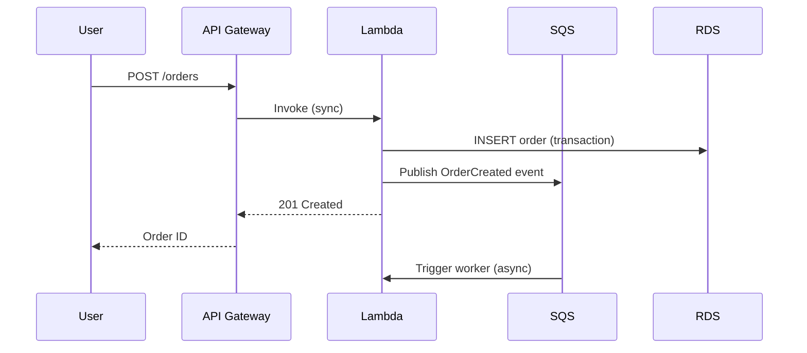
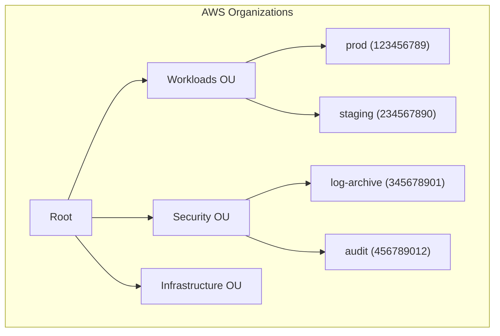
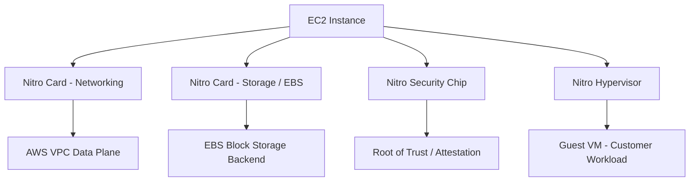
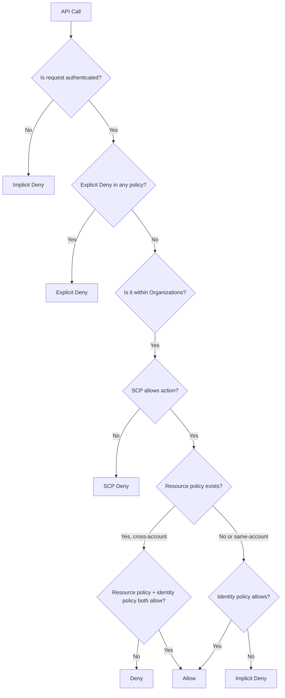
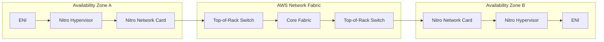
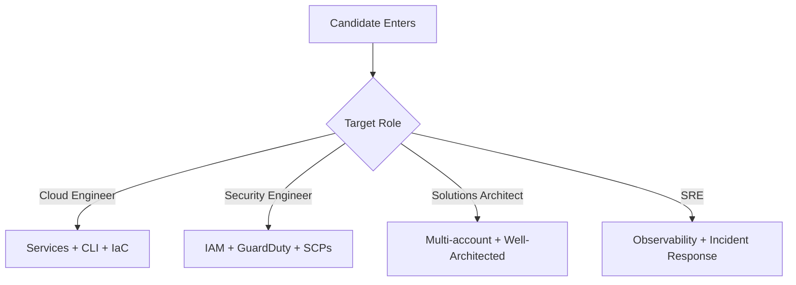
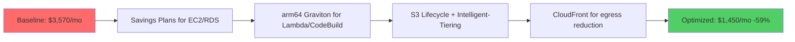

# AWS Roadmap — Universal Template

> This template guides content generation for **AWS** topics.
> Language: English | Code fence: ```json / ```yaml / ```bash

## Universal Requirements
- 9 output files per topic: junior.md, middle.md, senior.md, professional.md, interview.md, tasks.md, find-bug.md, optimize.md, specification.md
- Keep {{TOPIC_NAME}} placeholder throughout
- Include Mermaid diagrams in each template

### Topic Structure

```
XX-topic-name/
├── junior.md          ← "What?" and "How?"
├── middle.md          ← "Why?" and "When?"
├── senior.md          ← "How to optimize?" and "How to architect?"
├── professional.md    ← "Under the Hood" — AWS service internals
├── interview.md       ← Interview prep across all levels
├── tasks.md           ← Hands-on practice tasks
├── find-bug.md        ← Find and fix bugs in code (10+ exercises)
├── optimize.md        ← Optimize slow/inefficient code (10+ exercises)
└── specification.md   ← Official spec / documentation deep-dive
```

---

# TEMPLATE 1 — `junior.md`

**Purpose:** Introduce the AWS topic to a developer who is new to cloud infrastructure. Focus on console navigation, core service concepts, and first working deployments via CLI.

## Key Sections

### 1. What Is {{TOPIC_NAME}}?
Plain-language description of the AWS service or concept. Explain the problem it solves and which AWS service category it belongs to (compute, storage, networking, security, etc.).

### 2. Core Concepts and Terminology
- Bullet list of 5-8 key terms specific to {{TOPIC_NAME}}
- One-sentence definition for each
- Map AWS-specific names to generic concepts where possible (e.g., "Security Group = stateful firewall")

### 3. Getting Started with the AWS CLI

```bash
# Configure credentials
aws configure
# AWS Access Key ID: AKIA...
# AWS Secret Access Key: ...
# Default region: us-east-1
# Default output format: json

# Verify identity
aws sts get-caller-identity

# Example: list S3 buckets
aws s3 ls
```

### 4. First Deployment — Console Walkthrough
Step-by-step instructions for creating the simplest working instance of {{TOPIC_NAME}} via the AWS Management Console. Include screenshots descriptions and key decision points.

### 5. First Deployment — CLI / CloudFormation

```yaml
# Minimal CloudFormation template for {{TOPIC_NAME}}
AWSTemplateFormatVersion: "2010-09-09"
Description: Minimal {{TOPIC_NAME}} stack

Parameters:
  Environment:
    Type: String
    Default: dev
    AllowedValues: [dev, staging, prod]

Resources:
  # Replace with relevant resource type
  MyResource:
    Type: AWS::S3::Bucket
    Properties:
      BucketName: !Sub "my-bucket-${Environment}-${AWS::AccountId}"
      Tags:
        - Key: Environment
          Value: !Ref Environment

Outputs:
  ResourceArn:
    Value: !GetAtt MyResource.Arn
    Export:
      Name: !Sub "${AWS::StackName}-ResourceArn"
```

### 6. IAM Basics for {{TOPIC_NAME}}
Minimum permissions needed to interact with this service. Principle of least privilege from day one.

```json
{
  "Version": "2012-10-17",
  "Statement": [
    {
      "Sid": "{{TOPIC_NAME}}ReadOnly",
      "Effect": "Allow",
      "Action": [
        "s3:GetObject",
        "s3:ListBucket"
      ],
      "Resource": [
        "arn:aws:s3:::my-bucket",
        "arn:aws:s3:::my-bucket/*"
      ]
    }
  ]
}
```

### 7. Common Mistakes
- Using root account credentials (create IAM users/roles instead)
- Leaving default security group open to `0.0.0.0/0`
- Forgetting to set a region — some CLI commands fail silently
- Confusing ARNs with resource names

### 8. Visual Overview

```mermaid
graph TD
    A[Developer Laptop] -->|AWS CLI / SDK| B[AWS API Endpoint]
    B --> C{IAM Auth Check}
    C -->|Allowed| D[{{TOPIC_NAME}} Service]
    C -->|Denied| E[AccessDenied Error]
    D --> F[AWS Resource Created]
```

> Write in plain language. Every AWS CLI command must include the expected output format. Link to official AWS documentation section where relevant.

---

# TEMPLATE 2 — `middle.md`

**Purpose:** Build production-ready skills for developers with 1-2 years of AWS experience. Focus on automation, debugging, cost awareness, and cross-service integration patterns.

## Key Sections

### 1. {{TOPIC_NAME}} Architecture Patterns
Describe 2-3 common architecture patterns for this service in a real production environment, with tradeoffs for each.

### 2. Infrastructure as Code with CloudFormation / SAM / CDK

```yaml
# CloudFormation with cross-stack references and conditions
AWSTemplateFormatVersion: "2010-09-09"
Description: Production {{TOPIC_NAME}} stack

Parameters:
  VpcId:
    Type: AWS::EC2::VPC::Id
  EnableEncryption:
    Type: String
    Default: "true"
    AllowedValues: ["true", "false"]

Conditions:
  IsEncryptionEnabled: !Equals [!Ref EnableEncryption, "true"]

Resources:
  MyQueue:
    Type: AWS::SQS::Queue
    Properties:
      QueueName: !Sub "${AWS::StackName}-queue"
      KmsMasterKeyId: !If
        - IsEncryptionEnabled
        - !Ref MyKMSKey
        - !Ref AWS::NoValue
      RedrivePolicy:
        deadLetterTargetArn: !GetAtt MyDLQ.Arn
        maxReceiveCount: 3

  MyDLQ:
    Type: AWS::SQS::Queue
    Properties:
      QueueName: !Sub "${AWS::StackName}-dlq"
      MessageRetentionPeriod: 1209600  # 14 days
```

### 3. Automation with AWS CLI and Shell Scripts

```bash
#!/usr/bin/env bash
set -euo pipefail

STACK_NAME="${1:?Usage: $0 <stack-name> <environment>}"
ENVIRONMENT="${2:?Usage: $0 <stack-name> <environment>}"
REGION="${AWS_DEFAULT_REGION:-us-east-1}"

echo "Deploying stack ${STACK_NAME} to ${ENVIRONMENT}..."

aws cloudformation deploy \
  --stack-name "${STACK_NAME}" \
  --template-file template.yaml \
  --parameter-overrides Environment="${ENVIRONMENT}" \
  --capabilities CAPABILITY_NAMED_IAM \
  --region "${REGION}" \
  --no-fail-on-empty-changeset

# Wait and get outputs
aws cloudformation describe-stacks \
  --stack-name "${STACK_NAME}" \
  --region "${REGION}" \
  --query "Stacks[0].Outputs" \
  --output table
```

### 4. Cross-Service Integration



### 5. Debugging with CloudWatch

```bash
# Query CloudWatch Logs Insights
aws logs start-query \
  --log-group-name "/aws/lambda/my-function" \
  --start-time $(date -d "1 hour ago" +%s) \
  --end-time $(date +%s) \
  --query-string 'fields @timestamp, @message
    | filter @message like /ERROR/
    | sort @timestamp desc
    | limit 50'

# Get query results
aws logs get-query-results --query-id <query-id>

# Tail logs in real time
aws logs tail /aws/lambda/my-function --follow
```

### 6. Error Handling and Incident Response
- CloudWatch Alarms + SNS for automated alerts
- Dead-letter queues for failed event processing
- AWS Systems Manager OpsCenter for incident tracking
- EventBridge rules for automated remediation

### 7. Cost Management

```bash
# Get cost breakdown for last 30 days by service
aws ce get-cost-and-usage \
  --time-period Start=$(date -d "30 days ago" +%Y-%m-%d),End=$(date +%Y-%m-%d) \
  --granularity MONTHLY \
  --metrics BlendedCost \
  --group-by Type=DIMENSION,Key=SERVICE \
  --query "ResultsByTime[0].Groups[*].{Service:Keys[0],Cost:Metrics.BlendedCost.Amount}" \
  --output table
```

### 8. Comparison with Alternative Tools / Approaches
| Approach | When to Use | Tradeoff |
|----------|------------|----------|
| AWS Console | One-off exploration | Not repeatable |
| AWS CLI scripts | Simple automation | No state management |
| CloudFormation | AWS-native IaC | Verbose; AWS-only |
| Terraform | Multi-cloud IaC | More tooling overhead |
| CDK | Programmatic IaC | Requires coding skills |
| Pulumi | Multi-language IaC | Smaller community |

> Include at least one real-world debugging scenario. Reference AWS Well-Architected Framework pillars where relevant.

---

# TEMPLATE 3 — `senior.md`

**Purpose:** Address multi-account strategy, security posture, cost optimization at scale, disaster recovery, and architectural governance for engineers owning AWS in production.

## Key Sections

### 1. Multi-Account Architecture for {{TOPIC_NAME}}
Explain AWS Organizations, SCPs, and how {{TOPIC_NAME}} fits into a landing zone design. Reference AWS Control Tower where relevant.



### 2. Security Hardening and Compliance

```json
{
  "Version": "2012-10-17",
  "Statement": [
    {
      "Sid": "DenyNonTLSAccess",
      "Effect": "Deny",
      "Principal": "*",
      "Action": "s3:*",
      "Resource": [
        "arn:aws:s3:::my-bucket",
        "arn:aws:s3:::my-bucket/*"
      ],
      "Condition": {
        "Bool": {
          "aws:SecureTransport": "false"
        }
      }
    },
    {
      "Sid": "DenyPublicACLs",
      "Effect": "Deny",
      "Principal": "*",
      "Action": [
        "s3:PutBucketAcl",
        "s3:PutObjectAcl"
      ],
      "Resource": "*",
      "Condition": {
        "StringEquals": {
          "s3:x-amz-acl": ["public-read", "public-read-write", "authenticated-read"]
        }
      }
    }
  ]
}
```

### 3. Disaster Recovery and Business Continuity

| DR Strategy | RTO | RPO | Cost | Use Case |
|-------------|-----|-----|------|----------|
| Backup and Restore | Hours | Hours | Low | Non-critical data |
| Pilot Light | 10-30 min | Minutes | Medium | Internal tools |
| Warm Standby | 1-5 min | Seconds | High | B2B SaaS |
| Multi-Site Active/Active | Seconds | Near-zero | Very high | Financial / consumer |

```yaml
# Cross-region replication for {{TOPIC_NAME}}
ReplicationConfiguration:
  Role: !GetAtt ReplicationRole.Arn
  Rules:
    - Id: CrossRegionReplication
      Status: Enabled
      Destination:
        Bucket: !Sub "arn:aws:s3:::${BucketName}-dr-${DRRegion}"
        StorageClass: STANDARD_IA
        ReplicationTime:
          Status: Enabled
          Time:
            Minutes: 15
        Metrics:
          Status: Enabled
```

### 4. Advanced IAM Patterns
- Attribute-based access control (ABAC) with tags
- Permission boundaries to delegate admin without privilege escalation
- Cross-account role chaining
- AWS SSO / Identity Center integration

```json
{
  "Version": "2012-10-17",
  "Statement": [
    {
      "Effect": "Allow",
      "Action": "s3:*",
      "Resource": "*",
      "Condition": {
        "StringEquals": {
          "aws:ResourceTag/Environment": "${aws:PrincipalTag/Environment}"
        }
      }
    }
  ]
}
```

### 5. Cost Optimization at Scale

```bash
# Find unused EBS volumes
aws ec2 describe-volumes \
  --filters Name=status,Values=available \
  --query "Volumes[*].{ID:VolumeId,Size:Size,Created:CreateTime}" \
  --output table

# Find old snapshots
aws ec2 describe-snapshots \
  --owner-ids self \
  --query "Snapshots[?StartTime<='2025-01-01'][*].{ID:SnapshotId,Size:VolumeSize,Date:StartTime}" \
  --output table

# Identify right-sizing opportunities
aws ce get-rightsizing-recommendation \
  --service EC2 \
  --query "RightsizingRecommendations[*].{ID:CurrentInstance.ResourceId,Recommendation:RightsizingType,Savings:SavingsOpportunity.SavingsOpportunityPercentage}"
```

### 6. Observability and SRE Practices
- AWS X-Ray for distributed tracing
- CloudWatch Container Insights / Lambda Insights
- Custom metrics with EMF (Embedded Metrics Format)
- SLO/SLI tracking with CloudWatch Synthetics

### 7. Error Handling and Incident Response
Runbook structure for AWS incidents:
1. Detect: CloudWatch Alarm → PagerDuty
2. Assess: Check Service Health Dashboard + Personal Health Dashboard
3. Contain: Scale up, enable circuit breaker, failover to DR region
4. Resolve: Apply fix with IaC, not console
5. Review: Post-mortem with 5 Whys, update runbooks, add alarms

> Every architectural recommendation must reference a Well-Architected pillar: Operational Excellence, Security, Reliability, Performance Efficiency, Cost Optimization, or Sustainability.

---

# TEMPLATE 4 — `professional.md`

**Purpose:** Deep internals for principal engineers and solutions architects. Covers the AWS Nitro hypervisor, VPC data plane, IAM policy evaluation engine, and control plane/data plane separation.

# {{TOPIC_NAME}} — Infrastructure Internals

## Infrastructure Engine Internals

### The AWS Nitro System
AWS Nitro is the hypervisor and hardware offload system underpinning all modern EC2 instances. Understanding it is essential for performance-sensitive workloads.



- Nitro offloads VPC networking, EBS I/O, and instance storage to dedicated hardware
- The hypervisor footprint is minimal — no AWS daemons run inside the customer VM
- SR-IOV (Single Root I/O Virtualization) for near-bare-metal network throughput
- Nitro Enclaves: isolated VMs with no persistent storage, no external network, cryptographic attestation

### How IAM Policy Evaluation Works
The IAM policy evaluation logic determines Allow/Deny for every API call:



## Kernel/Daemon Log Analysis

### VPC Flow Logs Deep Dive
VPC Flow Logs capture at the ENI (Elastic Network Interface) level. Understanding the fields is critical for security forensics.

```bash
# Parse VPC Flow Logs in CloudWatch Logs Insights
fields @timestamp, srcAddr, dstAddr, srcPort, dstPort, protocol, action, bytes
| filter action = "REJECT"
| stats sum(bytes) as totalRejectedBytes by srcAddr
| sort totalRejectedBytes desc
| limit 20
```

Flow log record format:
```
version account-id interface-id srcaddr dstaddr srcport dstport protocol packets bytes start end action log-status
2 123456789012 eni-abc123 10.0.1.5 10.0.2.10 54321 443 6 20 40000 1706745600 1706745660 ACCEPT OK
```

### CloudTrail Event Analysis

```bash
# Find all IAM changes in the last 24 hours
aws cloudtrail lookup-events \
  --lookup-attributes AttributeKey=EventSource,AttributeValue=iam.amazonaws.com \
  --start-time $(date -d "24 hours ago" --iso-8601=seconds) \
  --query "Events[*].{Time:EventTime,Name:EventName,User:Username,IP:CloudTrailEvent}" \
  --output table

# Find root account usage (should be near-zero)
aws cloudtrail lookup-events \
  --lookup-attributes AttributeKey=Username,AttributeValue=root \
  --query "Events[*].{Time:EventTime,Event:EventName}"
```

## Resource Model and Scheduling Internals

### EC2 Instance Placement and Scheduling
- Placement groups: cluster (low latency, same AZ), spread (fault isolation), partition (Hadoop/Kafka)
- Capacity reservations vs On-Demand Capacity Reservations vs Dedicated Hosts
- Nitro-based instance hibernation: memory to EBS, fast resume

### S3 Storage Internals
- S3 is a key-value store, not a filesystem — prefix-based request routing
- S3 request rate limits: 3,500 PUT/COPY/POST/DELETE and 5,500 GET/HEAD per prefix per second
- S3 Select and S3 Object Lambda: pushdown filtering at the storage layer
- Multipart upload: mandatory above 5 GB, recommended above 100 MB

```bash
# Optimal multipart upload with aws-cli
aws s3 cp large-file.tar.gz s3://my-bucket/ \
  --multipart-threshold 64MB \
  --multipart-chunksize 64MB \
  --sse aws:kms \
  --sse-kms-key-id alias/my-key
```

### Lambda Execution Environment Internals
- MicroVM based on Firecracker (open-source, also Nitro-based)
- Execution environment lifecycle: Init → Invoke → Shutdown
- Cold start: JVM/Python/Node.js startup inside MicroVM (~100-500ms)
- SnapStart (Java): snapshot and restore Firecracker MicroVM state

## Control Plane / Data Plane Internals

### AWS Control Plane vs Data Plane Separation
Every AWS service separates control plane (configuration, management API) from data plane (actual traffic handling):

| Service | Control Plane | Data Plane |
|---------|--------------|------------|
| S3 | CreateBucket, PutBucketPolicy | GetObject, PutObject |
| EC2 | RunInstances, DescribeInstances | Instance network traffic |
| DynamoDB | CreateTable, UpdateTable | GetItem, PutItem |
| Route 53 | CreateHostedZone, ChangeResourceRecordSets | DNS query resolution |

The data plane is designed for higher availability than the control plane. During an us-east-1 control plane impairment, existing EC2 instances and RDS databases continue serving traffic.

### VPC Data Plane Architecture



### KMS Key Material and Cryptographic Boundaries
- KMS uses HSMs (FIPS 140-2 Level 2 and 3) to protect key material
- Envelope encryption: data key encrypted by CMK, CMK never leaves KMS
- Key policies evaluated separately from IAM policies — both must allow
- AWS-managed keys vs customer-managed keys vs customer-provided keys (SSE-C)

> This file is intended for engineers designing multi-region active/active architectures, conducting security reviews, or debugging subtle networking and IAM issues at scale.

---

# TEMPLATE 5 — `interview.md`

**Purpose:** Prepare candidates for AWS interviews across all seniority levels, from cloud practitioner concepts to principal architect deep-dives.

## Structure

### Junior Level Questions
1. What is the difference between an EC2 instance and a Lambda function?
2. What does an S3 bucket policy do, and how is it different from an IAM policy?
3. How do you make an S3 bucket's objects publicly accessible safely?
4. What is a VPC and why do you need one?
5. What is the difference between a region and an availability zone?

**Sample Answer — Q4:**
> A VPC (Virtual Private Cloud) is a logically isolated section of the AWS network where you launch resources. It gives you control over IP address ranges, subnets, routing, and network access controls. Without a VPC, all resources would share a flat network namespace with no isolation between customers or workloads.

### Middle Level Questions
1. Explain the difference between an IAM role and an IAM user. When would you use each?
2. How would you debug a Lambda function that is timing out?
3. What is the difference between SQS Standard and FIFO queues? When does ordering matter?
4. How do security groups and NACLs differ? Which takes precedence?
5. Your application is returning 503 errors intermittently. Walk me through how you'd diagnose this on AWS.

**Sample Answer — Q4:**
> Security groups are stateful, instance-level firewalls — return traffic is automatically allowed. NACLs are stateless, subnet-level rules — you need explicit inbound and outbound rules. For a given packet, the NACL at the subnet boundary is evaluated first. If the NACL allows it, the security group on the target ENI is then evaluated. Security groups cannot deny traffic explicitly — only allow. NACLs can both allow and deny with numbered rules evaluated in order.

### Senior Level Questions
1. Design a multi-region active/active architecture for a SaaS application. What AWS services would you use?
2. A developer accidentally deleted a production DynamoDB table. How do you recover, and how do you prevent it?
3. Your team is spending $50k/month on AWS. Walk me through how you'd analyze and reduce that cost by 30%.
4. Explain IAM condition keys and give a real-world ABAC example.
5. How does Route 53 failover routing differ from latency-based routing? When would you combine them?

### Professional / Deep-Dive Questions
1. Explain how IAM policy evaluation works when a cross-account role assumption is involved. Draw the decision tree.
2. What is the difference between AWS Nitro and Xen hypervisors, and why did AWS build Nitro?
3. How does S3 achieve 11 nines of durability? What does that actually mean in practice?
4. A Lambda function is experiencing elevated cold start latency. What are all the levers you have to reduce it?
5. Explain the difference between control plane and data plane in the context of Route 53. Why does this matter during an incident?

### Behavioral / Scenario Questions
- "Describe a time you had to reduce AWS costs significantly. What was your methodology?"
- "Tell me about an AWS incident you were involved in. What was the blast radius and how did you contain it?"



> Each question should have a follow-up probe listed. Mark "green flag" answers (e.g., mentions cost tradeoffs unprompted) and "red flag" answers (e.g., suggests console-only management for production).

---

# TEMPLATE 6 — `tasks.md`

**Purpose:** Hands-on exercises for each seniority level using real AWS services. Each task specifies required AWS services and estimated cost.

## Junior Tasks

### Task 1 — Static Website on S3 + CloudFront
Deploy a static website using S3 static hosting and a CloudFront distribution. Enable HTTPS with ACM.

**Acceptance criteria:**
- Website accessible at a custom domain over HTTPS
- S3 bucket is private — all access goes through CloudFront OAC
- `curl -I https://yourdomain.com` returns `200 OK`
- **Estimated cost:** ~$1/month

### Task 2 — Serverless API with Lambda + API Gateway
Create a REST API with two endpoints: `GET /items` and `POST /items`, backed by DynamoDB.

```bash
# Test your deployment
curl -X POST https://api-id.execute-api.us-east-1.amazonaws.com/prod/items \
  -H "Content-Type: application/json" \
  -d '{"name": "Widget", "price": 9.99}'

curl https://api-id.execute-api.us-east-1.amazonaws.com/prod/items
```

### Task 3 — IAM Least-Privilege Exercise
Start with an admin IAM role. Use CloudTrail and IAM Access Analyzer to generate a least-privilege policy. Reduce permissions to only what the application actually uses.

## Middle Tasks

### Task 4 — Multi-Service Event-Driven Pipeline
Build: API Gateway → Lambda → SQS → Lambda (consumer) → DynamoDB. Add a DLQ and CloudWatch alarm on DLQ depth > 0.

```yaml
# SAM template skeleton
AWSTemplateFormatVersion: "2010-09-09"
Transform: AWS::Serverless-2016-10-31
Resources:
  ProducerFunction:
    Type: AWS::Serverless::Function
    Properties:
      Handler: producer.handler
      Runtime: python3.12
      Events:
        Api:
          Type: Api
          Properties:
            Path: /events
            Method: post
      Policies:
        - SQSSendMessagePolicy:
            QueueName: !GetAtt EventQueue.QueueName
```

### Task 5 — CloudFormation Nested Stacks
Decompose a monolithic CloudFormation template into nested stacks: networking, security, compute, application. Practice cross-stack references with `Fn::ImportValue`.

### Task 6 — Incident Simulation
Use AWS Fault Injection Simulator (FIS) to simulate an AZ failure. Verify your application fails over automatically. Document the RTO you observed vs. the RTO you designed for.

## Senior Tasks

### Task 7 — Multi-Account Landing Zone
Using AWS Organizations and Control Tower, set up a landing zone with: management account, log archive account, audit account, one workload account. Apply SCPs that deny disabling CloudTrail.

### Task 8 — Cost Optimization Audit
Perform a full cost optimization audit on an AWS account:
1. Use Trusted Advisor to find idle resources
2. Use Compute Optimizer for EC2/Lambda right-sizing recommendations
3. Implement S3 Intelligent-Tiering for buckets with unknown access patterns
4. Purchase Savings Plans for baseline compute

**Target: Reduce monthly bill by 25% without reducing capacity.**

## Professional Tasks

### Task 9 — IAM Policy Simulator Deep Dive
Write a script using the IAM Policy Simulator API to validate that a given principal cannot perform a list of forbidden actions across all accounts in an AWS Organization.

```bash
aws iam simulate-principal-policy \
  --policy-source-arn arn:aws:iam::123456789012:role/AppRole \
  --action-names s3:DeleteBucket s3:PutBucketPolicy iam:CreateUser \
  --query "EvaluationResults[*].{Action:EvalActionName,Decision:EvalDecision}"
```

### Task 10 — Custom CloudWatch Metric Dashboard
Instrument an application with CloudWatch EMF (Embedded Metrics Format) to publish custom business metrics. Build a CloudWatch dashboard with anomaly detection and composite alarms.

> Specify the AWS account type needed (Free Tier is sufficient for Tasks 1-3; Tasks 7-10 require a multi-account setup). Include teardown instructions for every task to avoid surprise charges.

---

# TEMPLATE 7 — `find-bug.md`

**Purpose:** Present deliberately misconfigured AWS resources. The reader must identify the security or reliability issue, explain the risk, and provide the fix.

## Bug Scenario Format
For each bug: show the broken configuration, describe the risk and symptoms, give a diagnostic hint, then reveal the fix.

---

### Bug 1 — Wildcard IAM Policy (Privilege Escalation Risk)

**Broken IAM Policy:**
```json
{
  "Version": "2012-10-17",
  "Statement": [
    {
      "Effect": "Allow",
      "Action": "*",
      "Resource": "*"
    }
  ]
}
```

**Risk:** Any principal with this policy has full admin access to the AWS account. A compromised credential can delete all data, create backdoor IAM users, exfiltrate secrets.

**Diagnostic hint:**
```bash
aws iam simulate-principal-policy \
  --policy-source-arn arn:aws:iam::ACCOUNT:role/RoleName \
  --action-names iam:CreateUser s3:DeleteBucket ec2:TerminateInstances \
  --query "EvaluationResults[*].EvalDecision"
```

**Fix — Least Privilege Policy:**
```json
{
  "Version": "2012-10-17",
  "Statement": [
    {
      "Sid": "AppS3Access",
      "Effect": "Allow",
      "Action": [
        "s3:GetObject",
        "s3:PutObject",
        "s3:DeleteObject"
      ],
      "Resource": "arn:aws:s3:::my-app-bucket/*"
    },
    {
      "Sid": "AppS3List",
      "Effect": "Allow",
      "Action": "s3:ListBucket",
      "Resource": "arn:aws:s3:::my-app-bucket"
    }
  ]
}
```

---

### Bug 2 — Missing VPC Security Group Restriction (0.0.0.0/0 Inbound)

**Broken CloudFormation:**
```yaml
WebServerSG:
  Type: AWS::EC2::SecurityGroup
  Properties:
    GroupDescription: Web server security group
    VpcId: !Ref VPC
    SecurityGroupIngress:
      - IpProtocol: tcp
        FromPort: 22
        ToPort: 22
        CidrIp: 0.0.0.0/0    # SSH open to the entire internet!
      - IpProtocol: tcp
        FromPort: 3306
        ToPort: 3306
        CidrIp: 0.0.0.0/0    # Database port open to the internet!
```

**Risk:** SSH and database ports exposed to the entire internet. Automated scanners will find and attempt brute-force attacks within minutes of deployment.

**Diagnostic hint:**
```bash
aws ec2 describe-security-groups \
  --filters "Name=ip-permission.cidr,Values=0.0.0.0/0" \
  --query "SecurityGroups[*].{ID:GroupId,Name:GroupName,Rules:IpPermissions}"
```

**Fix:**
```yaml
WebServerSG:
  Type: AWS::EC2::SecurityGroup
  Properties:
    GroupDescription: Web server security group
    VpcId: !Ref VPC
    SecurityGroupIngress:
      - IpProtocol: tcp
        FromPort: 443
        ToPort: 443
        CidrIp: 0.0.0.0/0       # HTTPS only from internet

DatabaseSG:
  Type: AWS::EC2::SecurityGroup
  Properties:
    GroupDescription: Database security group
    VpcId: !Ref VPC
    SecurityGroupIngress:
      - IpProtocol: tcp
        FromPort: 3306
        ToPort: 3306
        SourceSecurityGroupId: !Ref WebServerSG  # Only from app tier
```

---

### Bug 3 — Unencrypted S3 Bucket with Public Access

**Broken configuration:**
```yaml
DataBucket:
  Type: AWS::S3::Bucket
  Properties:
    BucketName: my-company-data
    # Missing: ServerSideEncryptionConfiguration
    # Missing: PublicAccessBlockConfiguration
    # Missing: BucketEncryption
```

**Risk:** Customer data stored in plaintext. Bucket may be made public accidentally (no block). Fails SOC 2, HIPAA, PCI-DSS compliance requirements.

**Fix:**
```yaml
DataBucket:
  Type: AWS::S3::Bucket
  Properties:
    BucketName: !Sub "my-company-data-${AWS::AccountId}"
    PublicAccessBlockConfiguration:
      BlockPublicAcls: true
      BlockPublicPolicy: true
      IgnorePublicAcls: true
      RestrictPublicBuckets: true
    BucketEncryption:
      ServerSideEncryptionConfiguration:
        - ServerSideEncryptionByDefault:
            SSEAlgorithm: aws:kms
            KMSMasterKeyID: !Ref DataBucketKey
    VersioningConfiguration:
      Status: Enabled
    LoggingConfiguration:
      DestinationBucketName: !Ref LogBucket
      LogFilePrefix: data-bucket/
```

---

### Bug 4 — Lambda Function Leaking Secrets via Environment Variables

**Broken SAM template:**
```yaml
MyFunction:
  Type: AWS::Serverless::Function
  Properties:
    Handler: index.handler
    Runtime: nodejs20.x
    Environment:
      Variables:
        DB_PASSWORD: "mySuperSecretPassword123"   # Plaintext secret!
        API_KEY: "sk-live-abc123def456"
```

**Risk:** Secrets visible in CloudFormation console, Lambda console, CloudTrail, and any tool that calls `DescribeFunctionConfiguration`. Also embedded in deployment artifacts.

**Fix — Use SSM Parameter Store or Secrets Manager:**
```yaml
MyFunction:
  Type: AWS::Serverless::Function
  Properties:
    Handler: index.handler
    Runtime: nodejs20.x
    Environment:
      Variables:
        DB_PASSWORD_ARN: !Sub "arn:aws:ssm:${AWS::Region}:${AWS::AccountId}:parameter/myapp/db-password"
    Policies:
      - SSMParameterReadPolicy:
          ParameterName: "myapp/db-password"
```

```javascript
// In Lambda function code — fetch at runtime, not deploy time
const { SSMClient, GetParameterCommand } = require("@aws-sdk/client-ssm");
const ssm = new SSMClient({});
const { Parameter } = await ssm.send(new GetParameterCommand({
  Name: process.env.DB_PASSWORD_ARN,
  WithDecryption: true
}));
```

---

### Bug 5 — No CloudTrail Logging Enabled

**Symptom:** A breach investigation is impossible because there is no audit log of API calls. Security team cannot determine what was accessed, changed, or deleted.

```bash
# Check if CloudTrail is enabled
aws cloudtrail describe-trails --query "trailList[*].{Name:Name,MultiRegion:IsMultiRegionTrail,LogValidation:LogFileValidationEnabled}"
# If empty or IsMultiRegionTrail is false — you have a gap

# Check if logging is currently active
aws cloudtrail get-trail-status --name default --query "{Logging:IsLogging,LatestDelivery:LatestDeliveryTime}"
```

**Fix:**
```yaml
AuditTrail:
  Type: AWS::CloudTrail::Trail
  Properties:
    TrailName: org-audit-trail
    S3BucketName: !Ref LogArchiveBucket
    IncludeGlobalServiceEvents: true
    IsMultiRegionTrail: true
    EnableLogFileValidation: true
    IsLogging: true
    EventSelectors:
      - ReadWriteType: All
        IncludeManagementEvents: true
        DataResources:
          - Type: AWS::S3::Object
            Values: ["arn:aws:s3:::"]
          - Type: AWS::Lambda::Function
            Values: ["arn:aws:lambda"]
```

> Each bug must specify the compliance framework it violates (e.g., CIS AWS Foundations Benchmark control number) and the AWS Security Hub finding it would generate.

---

# TEMPLATE 8 — `optimize.md`

**Purpose:** Provide concrete AWS cost and performance optimization techniques with measurable before/after metrics.

## Metrics Baseline

```bash
# Get current month-to-date spend
aws ce get-cost-and-usage \
  --time-period Start=$(date +%Y-%m-01),End=$(date +%Y-%m-%d) \
  --granularity DAILY \
  --metrics UnblendedCost \
  --query "ResultsByTime[-1].Total.UnblendedCost.Amount"

# Lambda cold start baseline (k6 or Artillery)
artillery run --target https://api.example.com \
  --config '{"phases":[{"duration":60,"arrivalRate":10}]}'
```

## Optimization 1 — Lambda Cold Start Reduction

**Before:** Python Lambda with pandas/numpy — 4.2s cold start
**After:** Lambda Layers + SnapStart (Java) or Graviton2 + provisioned concurrency — 180ms

```yaml
MyFunction:
  Type: AWS::Serverless::Function
  Properties:
    Runtime: python3.12
    Architectures: [arm64]   # Graviton2: 20% better price-performance
    MemorySize: 512           # More memory = more vCPU = faster init
    SnapStart:                # Java only
      ApplyOn: PublishedVersions
    ProvisionedConcurrencyConfig:
      ProvisionedConcurrentExecutions: 5
    Layers:
      - !Ref DependenciesLayer  # Pre-warmed dependencies layer
```

**k6 load test results (cold start p99):**
```
Before:  p(99)=4200ms
After:   p(99)=180ms
Improvement: 96%
```

## Optimization 2 — S3 Request Cost Reduction

**Before:** 50M GET requests/month to S3 directly — $22.50/month
**After:** CloudFront in front of S3 — $1.80/month in origin requests + $4.20 CloudFront = $6/month

```bash
# Enable S3 Transfer Acceleration only where needed
aws s3api put-bucket-accelerate-configuration \
  --bucket my-bucket \
  --accelerate-configuration Status=Enabled

# Check which S3 storage classes are costing most
aws s3api list-objects-v2 \
  --bucket my-bucket \
  --query "Contents[*].{Key:Key,Size:Size,Storage:StorageClass}" \
  | jq 'group_by(.Storage) | map({class: .[0].Storage, totalGB: (map(.Size) | add) / 1073741824})'
```

## Optimization 3 — EC2 Cost Reduction with Savings Plans

| Compute Type | On-Demand $/mo | Reserved 1yr $/mo | Savings Plan $/mo | Spot $/mo |
|-------------|---------------|------------------|------------------|-----------|
| m5.2xlarge  | $277          | $166 (-40%)       | $172 (-38%)       | $83 (-70%)|
| c5.4xlarge  | $554          | $332 (-40%)       | $344 (-38%)       | $166 (-70%)|

```bash
# Get Savings Plans coverage recommendation
aws ce get-savings-plans-purchase-recommendation \
  --savings-plans-type COMPUTE_SP \
  --term-in-years ONE_YEAR \
  --payment-option NO_UPFRONT \
  --lookback-period-in-days SIXTY_DAYS
```

## Optimization 4 — DynamoDB Cost Optimization

**Before:** Provisioned capacity — 500 RCU + 200 WCU = $148/month
**After:** On-demand mode for spiky workloads — $67/month average

```yaml
# Switch to on-demand for variable traffic
DynamoTable:
  Type: AWS::DynamoDB::Table
  Properties:
    BillingMode: PAY_PER_REQUEST   # vs PROVISIONED
    TableClass: STANDARD_INFREQUENT_ACCESS  # 60% cheaper for cold data
    PointInTimeRecoverySpecification:
      PointInTimeRecoveryEnabled: true
```

## Optimization 5 — Pipeline Duration (CI/CD on AWS CodePipeline)

| Stage | Before | After | Technique |
|-------|--------|-------|-----------|
| Source fetch | 45s | 8s | CodeConnections + shallow clone |
| Build (CodeBuild) | 12m | 3m | arm64 Graviton + Docker layer cache in ECR |
| Test | 8m | 2m | Parallelism across CodeBuild batch |
| Deploy (CloudFormation) | 6m | 90s | Change sets + parallel resource creation |
| **Total** | **26m 45s** | **6m 38s** | **75% reduction** |

## Optimization 6 — Infra Cost / Month Summary

| Service | Before | After | Change | Method |
|---------|--------|-------|--------|--------|
| EC2 | $2,100 | $840 | -60% | Savings Plans + right-sizing |
| RDS | $680 | $340 | -50% | Reserved instances + Aurora Serverless v2 |
| Lambda | $290 | $145 | -50% | arm64 + memory tuning |
| S3 | $180 | $45 | -75% | Lifecycle policies + Intelligent-Tiering |
| Data Transfer | $320 | $80 | -75% | CloudFront + same-region traffic |
| **Total** | **$3,570** | **$1,450** | **-59%** | |



> Every optimization must include: the AWS service affected, the dollar impact, and whether it requires downtime. Mark optimizations that can be applied without application changes separately from those that require code modifications.
---
---

# TEMPLATE 9 — `specification.md`

> **Focus:** Official documentation deep-dive — reference specs, configuration schemas, CLI reference, and version compatibility.
>
> **Source:** Always cite the official documentation with direct section links.
> - Docker: https://docs.docker.com/reference/
> - Kubernetes: https://kubernetes.io/docs/reference/
> - AWS: https://docs.aws.amazon.com/
> - Terraform: https://developer.hashicorp.com/terraform/docs
> - Linux: https://man7.org/linux/man-pages/ | https://kernel.org/doc/
> - Cloudflare: https://developers.cloudflare.com/docs/
> - DevOps: https://www.atlassian.com/devops | https://dora.dev/
> - MLOps: https://ml-ops.org/ | https://mlflow.org/docs/latest/

<details open>
<summary><strong>Template Content</strong></summary>

# {{TOPIC_NAME}} — Specification

> **Official Documentation Reference**
>
> Source: [{{TOOL_NAME}} Official Docs]({{DOCS_URL}}) — {{SECTION}}

---

## Table of Contents

1. [Docs Reference](#docs-reference)
2. [CLI / API Reference](#cli--api-reference)
3. [Configuration Schema](#configuration-schema)
4. [Core Rules & Constraints](#core-rules--constraints)
5. [Behavioral Specification](#behavioral-specification)
6. [Edge Cases from Official Docs](#edge-cases-from-official-docs)
7. [Version & Compatibility Matrix](#version--compatibility-matrix)
8. [Official Examples](#official-examples)
9. [Compliance Checklist](#compliance-checklist)
10. [Related Documentation](#related-documentation)

---

## 1. Docs Reference

| Property | Value |
|----------|-------|
| **Official Docs** | [{{TOOL_NAME}} Documentation]({{DOCS_URL}}) |
| **Relevant Section** | {{SECTION_NAME}} — {{SECTION_TITLE}} |
| **Version** | {{TOOL_VERSION}} |
| **Direct URL** | {{DOCS_URL}}/{{PATH}} |

---

## 2. CLI / API Reference

> From: {{DOCS_URL}}/{{CLI_SECTION}}

### `{{COMMAND_OR_RESOURCE}}`

**Syntax:**
```
{{COMMAND_SYNTAX}}
```

| Flag / Option | Type | Required | Default | Description |
|---------------|------|----------|---------|-------------|
| `{{FLAG_1}}` | `{{TYPE_1}}` | ✅ | — | {{DESC_1}} |
| `{{FLAG_2}}` | `{{TYPE_2}}` | ❌ | `{{DEFAULT_2}}` | {{DESC_2}} |
| `{{FLAG_3}}` | `{{TYPE_3}}` | ❌ | `{{DEFAULT_3}}` | {{DESC_3}} |

**Exit codes:**

| Code | Meaning |
|------|---------|
| `0` | Success |
| `1` | General error |
| `{{CODE_N}}` | {{MEANING_N}} |

---

## 3. Configuration Schema

> From: {{DOCS_URL}}/{{CONFIG_SECTION}}

```yaml
# {{TOPIC_NAME}} configuration schema
{{CONFIG_SCHEMA_YAML}}
```

| Field | Type | Required | Default | Description |
|-------|------|----------|---------|-------------|
| `{{FIELD_1}}` | `{{TYPE_1}}` | ✅ | — | {{DESC_1}} |
| `{{FIELD_2}}` | `{{TYPE_2}}` | ❌ | `{{DEFAULT_2}}` | {{DESC_2}} |

---

## 4. Core Rules & Constraints

### Rule 1: {{RULE_NAME}}

> *Docs: [{{DOCS_URL}}/{{SECTION}}]({{DOCS_URL}}/{{SECTION}}) — "{{DOC_QUOTE}}"*

{{RULE_EXPLANATION}}

```{{CODE_LANG}}
# ✅ Correct
{{VALID_EXAMPLE}}

# ❌ Incorrect
{{INVALID_EXAMPLE}}
```

### Rule 2: {{RULE_NAME}}

> *Docs: [{{DOCS_URL}}/{{SECTION}}]({{DOCS_URL}}/{{SECTION}})*

{{RULE_EXPLANATION}}

---

## 5. Behavioral Specification

### Normal Operation

{{NORMAL_OPERATION}}

### Resource Limits & Quotas

| Resource | Default Limit | Max | Notes |
|----------|--------------|-----|-------|
| {{RES_1}} | {{LIMIT_1}} | {{MAX_1}} | {{NOTES_1}} |
| {{RES_2}} | {{LIMIT_2}} | {{MAX_2}} | {{NOTES_2}} |

### Error / Failure Conditions

| Error Code | Condition | Resolution |
|-----------|-----------|------------|
| `{{ERROR_1}}` | {{COND_1}} | {{FIX_1}} |
| `{{ERROR_2}}` | {{COND_2}} | {{FIX_2}} |

---

## 6. Edge Cases from Official Docs

| Edge Case | Official Behavior | Reference |
|-----------|-------------------|-----------|
| {{EDGE_1}} | {{BEHAVIOR_1}} | [Docs]({{URL_1}}) |
| {{EDGE_2}} | {{BEHAVIOR_2}} | [Docs]({{URL_2}}) |
| {{EDGE_3}} | {{BEHAVIOR_3}} | [Docs]({{URL_3}}) |

---

## 7. Version & Compatibility Matrix

| Version | Change | Backward Compatible? | Notes |
|---------|--------|---------------------|-------|
| `{{VER_1}}` | {{CHANGE_1}} | {{COMPAT_1}} | {{NOTES_1}} |
| `{{VER_2}}` | {{CHANGE_2}} | {{COMPAT_2}} | {{NOTES_2}} |

---

## 8. Official Examples

### Example from Docs: {{EXAMPLE_TITLE}}

> Source: [{{DOCS_URL}}/{{ANCHOR}}]({{DOCS_URL}}/{{ANCHOR}})

```{{CODE_LANG}}
{{OFFICIAL_EXAMPLE_CODE}}
```

**Expected output:**

```
{{EXPECTED_OUTPUT}}
```

---

## 9. Compliance Checklist

- [ ] Follows official recommended configuration for {{TOPIC_NAME}}
- [ ] Uses supported version ({{TOOL_VERSION}}+)
- [ ] Handles all documented error/failure conditions
- [ ] Follows official security hardening guidelines
- [ ] Resource limits configured per official recommendations
- [ ] Monitoring/alerting set up per official guidance

---

## 10. Related Documentation

| Topic | Doc Section | URL |
|-------|-------------|-----|
| {{RELATED_1}} | {{SECTION_1}} | [Link]({{URL_1}}) |
| {{RELATED_2}} | {{SECTION_2}} | [Link]({{URL_2}}) |
| {{RELATED_3}} | {{SECTION_3}} | [Link]({{URL_3}}) |

---

> **Content Rules for `specification.md`:**
> - Always link directly to the relevant doc section (not just the homepage)
> - Include official CLI/API reference tables with all flags and options
> - Document configuration schema with required/optional fields
> - Note deprecated commands and their replacements
> - Include official security hardening recommendations
> - Minimum 2 Core Rules, 3 Config fields, 3 Edge Cases, 2 Official Examples

</details>
