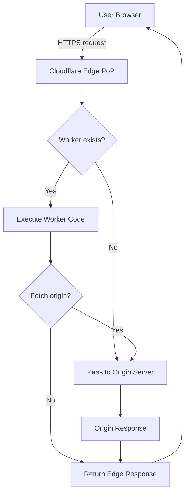
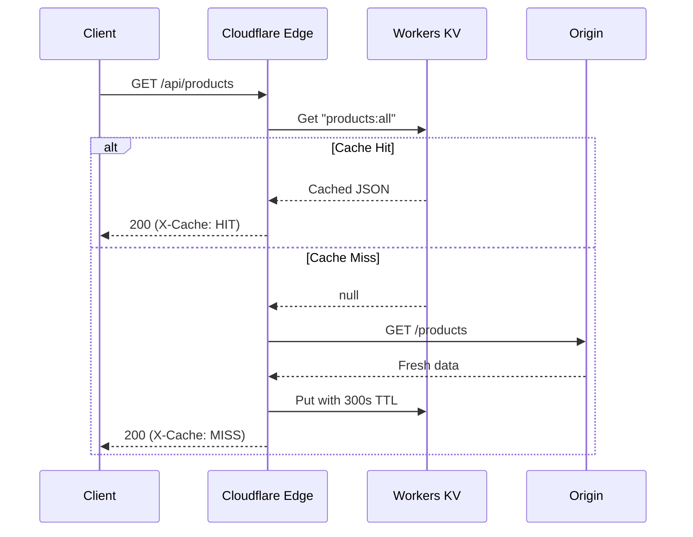
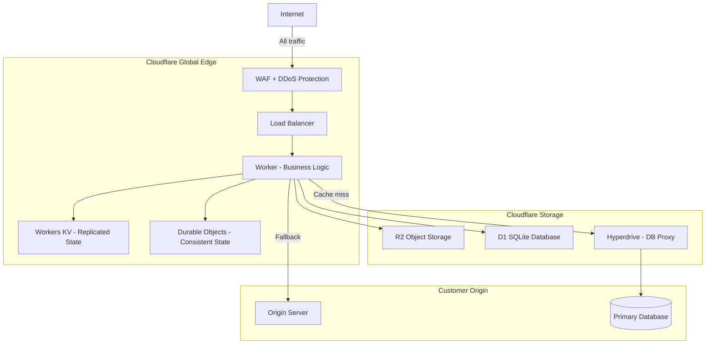
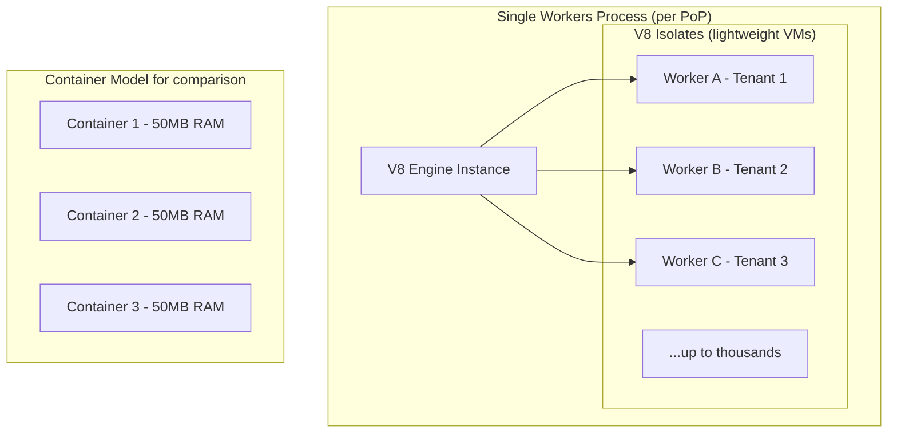
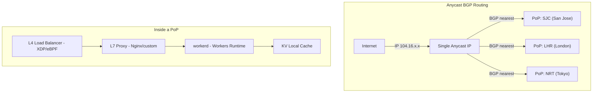
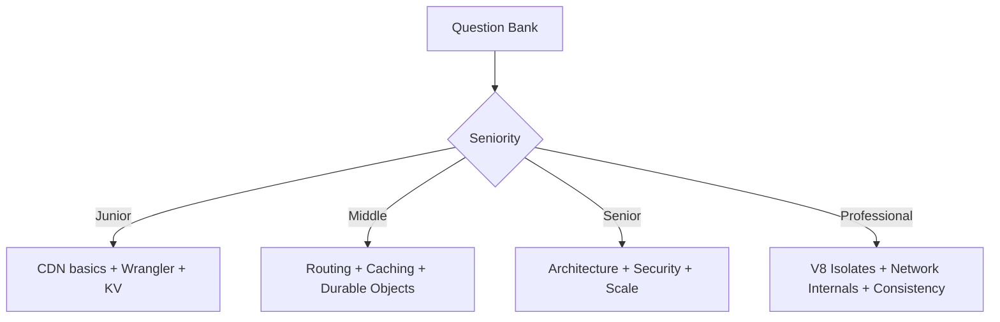
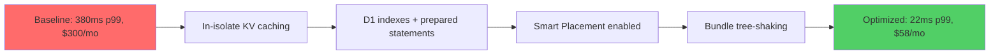

# Cloudflare Roadmap — Universal Template

> This template guides content generation for **Cloudflare** topics.
> Language: English | Code fence: ```javascript / ```json / ```bash

## Universal Requirements
- 9 output files per topic: junior.md, middle.md, senior.md, professional.md, interview.md, tasks.md, find-bug.md, optimize.md, specification.md
- Keep {{TOPIC_NAME}} placeholder throughout
- Include Mermaid diagrams in each template

### Topic Structure

```
XX-topic-name/
├── junior.md          ← "What?" and "How?"
├── middle.md          ← "Why?" and "When?"
├── senior.md          ← "How to optimize?" and "How to architect?"
├── professional.md    ← "Under the Hood" — Cloudflare edge internals
├── interview.md       ← Interview prep across all levels
├── tasks.md           ← Hands-on practice tasks
├── find-bug.md        ← Find and fix bugs in code (10+ exercises)
├── optimize.md        ← Optimize slow/inefficient code (10+ exercises)
└── specification.md   ← Official spec / documentation deep-dive
```

---

# TEMPLATE 1 — `junior.md`

**Purpose:** Introduce the Cloudflare topic to a developer who is new to edge computing and CDN concepts. Focus on the Cloudflare dashboard, DNS management, and first Worker deployments.

## Key Sections

### 1. What Is {{TOPIC_NAME}}?
Plain-language explanation of what this Cloudflare service or concept does. Explain the difference between Cloudflare running code at the edge vs. in a traditional cloud data center.

### 2. Core Concepts and Terminology
- Bullet list of 5-7 key terms specific to {{TOPIC_NAME}}
- One-sentence definition for each
- Example: edge node, PoP (Point of Presence), Worker, KV namespace, isolate, wrangler

### 3. Setting Up Wrangler CLI

```bash
# Install Wrangler (Cloudflare CLI)
npm install -g wrangler

# Authenticate with your Cloudflare account
wrangler login

# Verify authentication
wrangler whoami

# Create a new Worker project
wrangler init my-worker --type javascript
cd my-worker
```

### 4. First Cloudflare Worker

```javascript
// src/index.js — Hello World Worker
export default {
  async fetch(request, env, ctx) {
    const url = new URL(request.url);

    // Route based on path
    if (url.pathname === "/health") {
      return new Response("OK", { status: 200 });
    }

    return new Response("Hello from the edge!", {
      status: 200,
      headers: {
        "Content-Type": "text/plain",
        "X-Powered-By": "Cloudflare Workers",
      },
    });
  },
};
```

### 5. Wrangler Configuration

```json
{
  "name": "my-worker",
  "main": "src/index.js",
  "compatibility_date": "2024-09-23",
  "compatibility_flags": ["nodejs_compat"],
  "vars": {
    "ENVIRONMENT": "development"
  },
  "kv_namespaces": [
    {
      "binding": "MY_KV",
      "id": "xxxxxxxxxxxxxxxxxxxxxxxxxxxxxxxx"
    }
  ]
}
```

### 6. Deploy and Test

```bash
# Local development
wrangler dev

# Deploy to production
wrangler deploy

# Tail live logs
wrangler tail

# Test with curl
curl https://my-worker.your-subdomain.workers.dev/health
```

### 7. DNS and Proxy Basics
Explain the difference between DNS-only (grey cloud) and proxied (orange cloud) records in the Cloudflare dashboard. Show what changes when you proxy a record.

### 8. Common Mistakes
- Using `wrangler.toml` with secrets in version control (use `wrangler secret put` instead)
- Forgetting `compatibility_date` — Workers behavior changes over time
- Confusing Workers (compute) with Pages (static hosting)
- Not understanding that Workers execute in V8 isolates, not Node.js

### 9. Visual Overview



> Write in plain language. Explain that Cloudflare has 300+ PoPs worldwide and requests run in the nearest one. Every code block must be copy-paste runnable.

---

# TEMPLATE 2 — `middle.md`

**Purpose:** Build production skills for developers with 1-2 years of Cloudflare experience. Focus on routing patterns, KV/D1/R2 storage, Durable Objects, and debugging.

## Key Sections

### 1. {{TOPIC_NAME}} in Production Patterns
Describe 2-3 common production use cases for {{TOPIC_NAME}}: caching, API gateway, A/B testing, authentication proxy, bot mitigation.

### 2. Workers Router and Middleware Pattern

```javascript
// Itty Router for clean routing
import { Router } from "itty-router";

const router = Router();

// Middleware: authentication
async function authenticate(request, env) {
  const token = request.headers.get("Authorization")?.replace("Bearer ", "");
  if (!token) {
    return new Response("Unauthorized", { status: 401 });
  }
  const valid = await env.AUTH_KV.get(`token:${token}`);
  if (!valid) {
    return new Response("Forbidden", { status: 403 });
  }
  request.userId = valid;
}

router.get("/api/items", authenticate, async (request, env) => {
  const items = await env.DB.prepare(
    "SELECT * FROM items WHERE user_id = ?"
  ).bind(request.userId).all();
  return Response.json(items.results);
});

router.post("/api/items", authenticate, async (request, env) => {
  const body = await request.json();
  await env.DB.prepare(
    "INSERT INTO items (user_id, name, value) VALUES (?, ?, ?)"
  ).bind(request.userId, body.name, body.value).run();
  return Response.json({ success: true }, { status: 201 });
});

router.all("*", () => new Response("Not Found", { status: 404 }));

export default { fetch: router.handle };
```

### 3. KV, R2, and D1 Storage Patterns

```javascript
// KV — edge caching layer
const cached = await env.MY_KV.get("products:all", { type: "json" });
if (cached) {
  return Response.json(cached, {
    headers: { "X-Cache": "HIT" }
  });
}
const fresh = await fetchProductsFromOrigin();
await env.MY_KV.put("products:all", JSON.stringify(fresh), {
  expirationTtl: 300, // 5-minute TTL
});
return Response.json(fresh, {
  headers: { "X-Cache": "MISS" }
});
```

```javascript
// R2 — object storage (S3-compatible)
async function uploadFile(request, env) {
  const fileName = request.headers.get("X-File-Name");
  const body = request.body;
  await env.MY_BUCKET.put(fileName, body, {
    httpMetadata: { contentType: request.headers.get("content-type") }
  });
  return Response.json({ key: fileName, url: `https://files.example.com/${fileName}` });
}
```

### 4. Cache Control and Cache API

```javascript
// Fine-grained cache control with the Cache API
const cache = caches.default;
const cacheKey = new Request(request.url, request);

// Check cache first
let response = await cache.match(cacheKey);
if (response) {
  return response;
}

// Fetch from origin and cache
response = await fetch(request);
const headers = new Headers(response.headers);
headers.set("Cache-Control", "public, max-age=3600");
headers.set("CDN-Cache-Control", "max-age=86400"); // Override for CDN only
const cachedResponse = new Response(response.body, { ...response, headers });
ctx.waitUntil(cache.put(cacheKey, cachedResponse.clone()));
return cachedResponse;
```

### 5. Debugging with Wrangler and Logpush

```bash
# Live log tailing with filtering
wrangler tail --format pretty --search "ERROR"

# Local debugging with devtools
wrangler dev --inspect

# Test a specific route locally
curl -X POST http://localhost:8787/api/items \
  -H "Content-Type: application/json" \
  -H "Authorization: Bearer test-token" \
  -d '{"name":"test","value":42}'
```

### 6. Error Handling and Incident Response
- Workers have a 10ms–30s CPU time limit — log when approaching limits
- Use `ctx.waitUntil()` for non-critical async work after response is sent
- Implement structured error responses with request IDs for tracing
- Cloudflare Status page + Logpush to R2/S3 for persistent logs

```javascript
// Structured error handling
export default {
  async fetch(request, env, ctx) {
    const requestId = crypto.randomUUID();
    try {
      return await handleRequest(request, env, ctx);
    } catch (err) {
      console.error(JSON.stringify({
        requestId,
        error: err.message,
        stack: err.stack,
        url: request.url,
        timestamp: new Date().toISOString(),
      }));
      return Response.json(
        { error: "Internal Server Error", requestId },
        { status: 500 }
      );
    }
  },
};
```

### 7. Comparison with Alternative Tools / Approaches
| Platform | Runtime | Cold Start | CPU Limit | Global PoPs |
|----------|---------|-----------|-----------|-------------|
| Cloudflare Workers | V8 Isolates | ~0ms | 30s (paid) | 300+ |
| AWS Lambda@Edge | Node.js/Python | 100ms-1s | 30s | ~30 |
| Vercel Edge Functions | V8 Isolates | ~0ms | 25s | ~30 |
| Fastly Compute | WASM | ~0ms | No limit | ~80 |
| AWS Lambda (regional) | Any runtime | 100ms-5s | 15 min | ~30 regions |



> Every example must be tested with wrangler dev before inclusion. Mention specific Cloudflare dashboard paths for any configuration steps.

---

# TEMPLATE 3 — `senior.md`

**Purpose:** Address edge-native architecture, security hardening, rate limiting, traffic shaping, Durable Objects coordination, and cost at scale for engineers owning Cloudflare in production.

## Key Sections

### 1. Edge-Native Architecture for {{TOPIC_NAME}}
Design principles for building on Cloudflare's global network. When to use Workers vs Pages vs Tunnel vs WAF vs Load Balancing.



### 2. Security Hardening

```javascript
// Rate limiting with Cloudflare Workers Rate Limiting API
export default {
  async fetch(request, env) {
    const { success } = await env.RATE_LIMITER.limit({
      key: request.headers.get("CF-Connecting-IP")
    });

    if (!success) {
      return new Response("Too Many Requests", {
        status: 429,
        headers: {
          "Retry-After": "60",
          "X-RateLimit-Limit": "100",
          "X-RateLimit-Remaining": "0",
        },
      });
    }

    return handleRequest(request, env);
  },
};
```

```json
{
  "name": "my-worker",
  "compatibility_date": "2024-09-23",
  "unsafe": {
    "bindings": [
      {
        "name": "RATE_LIMITER",
        "type": "ratelimit",
        "namespace_id": "1001",
        "simple": {
          "limit": 100,
          "period": 60
        }
      }
    ]
  }
}
```

### 3. Durable Objects for Consistent State

```javascript
// Durable Object: WebSocket room with presence tracking
export class ChatRoom {
  constructor(state, env) {
    this.state = state;
    this.sessions = new Map();
  }

  async fetch(request) {
    const upgradeHeader = request.headers.get("Upgrade");
    if (upgradeHeader !== "websocket") {
      return new Response("Expected WebSocket", { status: 426 });
    }

    const [client, server] = Object.values(new WebSocketPair());
    await this.handleSession(server);
    return new Response(null, { status: 101, webSocket: client });
  }

  async handleSession(webSocket) {
    webSocket.accept();
    const sessionId = crypto.randomUUID();
    this.sessions.set(sessionId, webSocket);

    webSocket.addEventListener("message", async ({ data }) => {
      this.broadcast(data, sessionId);
      await this.state.storage.put(`msg:${Date.now()}`, data);
    });

    webSocket.addEventListener("close", () => {
      this.sessions.delete(sessionId);
    });
  }

  broadcast(message, excludeId) {
    for (const [id, ws] of this.sessions) {
      if (id !== excludeId) ws.send(message);
    }
  }
}
```

### 4. Zero Trust and Access Control
- Cloudflare Access: identity-aware proxy in front of internal apps
- Service tokens for machine-to-machine authentication
- mTLS (mutual TLS) for API authentication at the edge
- Tunnel (cloudflared) to expose internal services without public IPs

### 5. Cost and Capacity at Scale

| Cloudflare Plan | Worker Requests | KV Reads | KV Writes | Cost |
|----------------|----------------|---------|---------|------|
| Free | 100k/day | 100k/day | 1k/day | $0 |
| Workers Paid | 10M/month | 10M/month | 1M/month | $5/mo |
| Additional | $0.30/M | $0.50/M | $5/M | Per use |

```bash
# Monitor Worker metrics via Cloudflare API
curl -s "https://api.cloudflare.com/client/v4/accounts/${CF_ACCOUNT_ID}/workers/scripts/${WORKER_NAME}/analytics/aggregate?since=2024-01-01T00:00:00Z&until=2024-01-31T23:59:59Z" \
  -H "Authorization: Bearer ${CF_API_TOKEN}" | jq '.result.totals'
```

### 6. Observability
- Workers Analytics Engine for custom time-series metrics
- Logpush to R2, S3, Datadog, Splunk, or BigQuery
- OpenTelemetry tracing from Workers with `waitUntil`
- Real User Monitoring (RUM) with Cloudflare Web Analytics

### 7. Error Handling and Incident Response
Runbook for Cloudflare edge incidents:
1. Detect: Cloudflare Status at status.cloudflare.com + custom uptime monitors
2. Assess: Check Worker error rate in Analytics dashboard
3. Contain: Use `wrangler rollback` to revert Worker version instantly
4. Bypass: Temporarily disable Worker (set route to bypass) to serve origin directly
5. Post-mortem: Download Logpush data from R2, analyze error distribution by PoP

```bash
# Instant rollback to previous Worker version
wrangler rollback --message "Reverting due to elevated 5xx rate"

# List all Worker versions
wrangler versions list
```

> Every security recommendation must reference the corresponding Cloudflare WAF managed rule or OWASP Top 10 category.

---

# TEMPLATE 4 — `professional.md`

**Purpose:** Deep internals for staff engineers and platform architects. Covers the V8 isolate model, edge network architecture, Workers runtime internals, and Durable Objects consistency model.

# {{TOPIC_NAME}} — Infrastructure Internals

## Infrastructure Engine Internals

### V8 Isolates vs Containers
Cloudflare Workers do not use containers or MicroVMs. Each Worker runs inside a V8 isolate — the same sandboxing primitive used by Chrome for each browser tab.



Key differences:
- An isolate takes ~3ms and ~1MB to create vs ~100ms and ~50MB for a container
- Isolates share a V8 heap per process but have fully separate JavaScript heaps
- No cold starts in the traditional sense — isolates are kept warm in a pool
- Security: isolates rely on V8's sandbox (no kernel namespace isolation like containers)

### Workers Runtime Architecture

The Workers runtime is built on V8 with a custom event loop called `workerd` (open source):
- Built on Cap'n Proto RPC for internal communication
- HTTP/3 and QUIC support at the edge via the underlying Cloudflare network stack
- Web Crypto API backed by BoringSSL (FIPS-compliant)
- `fetch()` in Workers bypasses the OS network stack — goes directly to Cloudflare's internal fabric

## Kernel/Daemon Log Analysis

### Reading Workers Trace Events

```javascript
// Workers Trace Worker — intercepts all invocations of another Worker
export default {
  async trace(traces, env, ctx) {
    for (const trace of traces) {
      const logEntry = {
        scriptName: trace.scriptName,
        outcome: trace.outcome,                   // "ok" | "exception" | "exceeded-cpu"
        cpuTime: trace.cpuTime,                   // milliseconds
        wallTime: trace.wallTime,
        exceptions: trace.exceptions,
        logs: trace.logs,
        eventTimestamp: trace.eventTimestamp,
        request: {
          url: trace.fetchType === "fetch" ? trace.event?.request?.url : undefined,
          method: trace.event?.request?.method,
          cf: trace.event?.request?.cf,           // Cloudflare metadata (country, colo, asn)
        },
      };
      await env.ANALYTICS.writeDataPoint({
        blobs: [JSON.stringify(logEntry)],
        doubles: [trace.cpuTime, trace.wallTime],
        indexes: [trace.scriptName],
      });
    }
  },
};
```

### Analyzing Cloudflare Network Metadata

Every Worker request includes `request.cf` with rich edge metadata:

```javascript
const cfMeta = request.cf;
// cfMeta.colo: "SJC" (IATA code of serving PoP)
// cfMeta.country: "US"
// cfMeta.asn: 7922
// cfMeta.asOrganization: "Comcast"
// cfMeta.tlsVersion: "TLSv1.3"
// cfMeta.tlsCipher: "AEAD-AES128-GCM-SHA256"
// cfMeta.httpProtocol: "HTTP/3"
// cfMeta.botManagementScore: 98 (0=bot, 100=human)
// cfMeta.threatScore: 0
// cfMeta.latitude / cfMeta.longitude
```

## Resource Model and Scheduling Internals

### CPU Time vs Wall Clock Time
Workers have two distinct time budgets:
- **CPU time**: time actually executing JavaScript (default 10ms free, 30s paid)
- **Wall clock time**: total elapsed time including `await` (up to 30s for HTTP trigger, unlimited for Durable Objects WebSocket)

```javascript
// Measuring CPU usage within a Worker
const start = Date.now();
await doHeavyWork();
const cpuMs = Date.now() - start; // This is wall time, not CPU time
// Use Workers Analytics Engine to track actual CPU time from trace events
```

### Durable Objects Consistency Model
- Each Durable Object is a single-threaded JavaScript object with consistent storage
- Location: first request determines the PoP where the DO lives; it stays there
- Storage API: transactional key-value, `put()` within the same microtask queued atomically
- Hibernation API: WebSocket connections survive Worker code reloads without losing state

```javascript
// Atomic transaction in Durable Object storage
await this.state.storage.transaction(async (txn) => {
  const count = (await txn.get("request-count")) ?? 0;
  await txn.put("request-count", count + 1);
  await txn.put(`request:${count}`, { url: request.url, ts: Date.now() });
});
```

### Workers KV Consistency Model
KV is **eventually consistent** with a write propagation time of up to 60 seconds globally:
- Reads are served from the local PoP cache (fast)
- Writes go to a central store then replicate outward
- `getWithMetadata()` can detect stale values using custom metadata timestamps
- Not suitable for counters or coordination — use Durable Objects for that

## Control Plane / Data Plane Internals

### Cloudflare Network Architecture



### eBPF and XDP in Cloudflare DDoS Mitigation
- Cloudflare's L4 DDoS mitigation uses XDP (eXpress Data Path) — eBPF programs attached to network interface drivers
- Packets are dropped before they reach the kernel's TCP/IP stack
- `hping3` volumetric attacks: Cloudflare processes and drops at 100Gbps+ per PoP using XDP
- Magic Transit: extends this DDoS mitigation to customer IP prefixes via BGP announcement

### Cache Internals and Tiered Caching
- Cloudflare's CDN cache uses a variant of LRU with frequency scoring (LIRS-like)
- Tiered Cache (Argo): regional "upper tier" PoPs act as additional cache layer before origin
- Cache Reserve: R2-backed persistent cache for long-tail content
- `cf-cache-status` response header values: `HIT`, `MISS`, `EXPIRED`, `REVALIDATED`, `BYPASS`, `DYNAMIC`

```bash
# Inspect cache behavior for a URL
curl -sI https://example.com/large-asset.js \
  | grep -E "(cf-cache-status|age|cache-control|cf-ray)"
# CF-Ray: 8a1b2c3d4e5f0000-SJC  <- identifies serving PoP
# cf-cache-status: HIT
# Age: 3421
```

> This file targets engineers designing high-throughput edge systems, debugging isolate memory issues, or evaluating Cloudflare against competing edge platforms on correctness and consistency guarantees.

---

# TEMPLATE 5 — `interview.md`

**Purpose:** Prepare candidates for Cloudflare and edge computing interview questions across all seniority levels.

## Structure

### Junior Level Questions
1. What is the difference between a CDN and Cloudflare Workers?
2. How does Cloudflare act as a proxy for your website?
3. What is a Workers KV namespace? What kind of data is it good for?
4. How do you deploy a Cloudflare Worker using Wrangler?
5. What does the `CF-Connecting-IP` header contain, and why is it important?

**Sample Answer — Q1:**
> A CDN caches static files at edge locations and serves them faster. Cloudflare Workers goes further — it runs JavaScript code at the edge for every request. With Workers, you can modify requests and responses, authenticate users, fetch from multiple origins, and run full application logic globally, not just serve cached files.

### Middle Level Questions
1. When would you choose KV over Durable Objects for state management?
2. Explain how `ctx.waitUntil()` works and when you would use it.
3. How do you handle secrets in Workers? What should you never do?
4. What is the Workers Cache API, and how does it differ from the automatic CDN cache?
5. Your Worker is hitting the CPU time limit. How do you diagnose and fix it?

**Sample Answer — Q1:**
> KV is eventually consistent and optimized for high-read, low-write workloads like feature flags, user sessions, or cached API responses. It replicates writes globally in ~60 seconds. Durable Objects provide strong consistency — they are single-threaded objects pinned to one location, making them suitable for coordination, WebSocket state, rate limiting counters, and any data that requires transactional correctness. Use KV for "who is this user?" and Durable Objects for "how many requests has this user made in the last minute?"

### Senior Level Questions
1. Design a global real-time multiplayer game backend using only Cloudflare primitives.
2. How would you implement a canary deployment for a high-traffic Worker?
3. Explain how you would build a WAF-like system in a Worker to block malicious requests.
4. How does Cloudflare's Anycast routing work, and what are its implications for latency?
5. What are the consistency guarantees of Durable Objects storage, and how do they compare to ACID databases?

### Professional / Deep-Dive Questions
1. Explain the V8 isolate model. Why doesn't Cloudflare use containers for Workers?
2. How does Workers KV achieve low-latency reads despite being a globally replicated system?
3. What is the write consistency model of Durable Objects? When can you observe stale data?
4. How does Cloudflare use eBPF/XDP for DDoS mitigation? What are the limits of this approach?
5. Explain the `workerd` open-source runtime. How does it differ from Node.js despite both using V8?

### Behavioral / Scenario Questions
- "Tell me about a time you used Cloudflare to solve a problem that would have required significant backend infrastructure otherwise."
- "How would you migrate a monolithic Node.js API to Cloudflare Workers incrementally?"



> Flag questions that reveal if a candidate understands the edge-native paradigm vs. trying to use Workers like a traditional server. The best senior answers mention tradeoffs around consistency, cold start elimination, and the CPU time model.

---

# TEMPLATE 6 — `tasks.md`

**Purpose:** Hands-on exercises for each seniority level using real Cloudflare services. All tasks deployable on the Workers free tier unless stated.

## Junior Tasks

### Task 1 — Deploy a Hello World Worker
Deploy a Worker that returns JSON with the request's country, city, and the serving Cloudflare PoP (colo).

**Acceptance criteria:**
- `wrangler deploy` succeeds
- Response includes `{ "country": "US", "colo": "SJC" }` from `request.cf`
- Worker is accessible at `*.workers.dev`

### Task 2 — KV-Backed Feature Flags
Build a Worker that reads feature flags from KV and toggles behavior accordingly. Add a `/admin/flags` endpoint to update flags.

```javascript
// Expected behavior
// KV key "feature:dark-mode" = "true"
// GET /api/config → { "darkMode": true, "betaFeatures": false }
```

### Task 3 — Static Asset Routing with Pages
Deploy a React or Next.js app to Cloudflare Pages. Configure a `_redirects` file for SPA routing.

## Middle Tasks

### Task 4 — API Gateway with Rate Limiting
Build a Worker that proxies requests to an origin API and adds:
1. Rate limiting: 60 requests/minute per IP
2. API key validation against a KV store
3. Request logging to Workers Analytics Engine

### Task 5 — Image Optimization with R2 and Cloudflare Images
Build a Worker that:
1. Accepts image uploads and stores them in R2
2. Returns optimized/resized versions using Cloudflare Image Resizing on fetch
3. Caches resized variants in KV with a 1-hour TTL

```bash
# Test image upload
curl -X PUT https://my-worker.workers.dev/upload/photo.jpg \
  -H "Content-Type: image/jpeg" \
  --data-binary @photo.jpg

# Fetch resized
curl "https://my-worker.workers.dev/image/photo.jpg?width=200&format=webp"
```

### Task 6 — Debugging Challenge
Given a Worker with three intentional bugs (wrong cache TTL, missing rate limiting, unhandled rejection), identify and fix all three. Document each fix.

## Senior Tasks

### Task 7 — Real-Time Presence with Durable Objects
Build a presence system where users can see who else is viewing the same document. Use:
- Durable Objects for WebSocket state per document
- Workers KV for user session tokens
- R2 for document storage

### Task 8 — Multi-Region Traffic Shaping
Configure Cloudflare Load Balancing with:
1. Primary origin in `us-east-1`, failover in `eu-west-1`
2. Health checks every 30s
3. Geo-steering: EU traffic to EU origin, rest to US
4. A Worker that injects custom headers and transforms responses

## Professional Tasks

### Task 9 — Custom Observability Pipeline
Build a Trace Worker that:
1. Intercepts all traces from a production Worker
2. Writes structured metrics to Workers Analytics Engine
3. Generates a Grafana-compatible JSON export from the Analytics Engine API
4. Alerts (via webhook) when error rate exceeds 1% over 5 minutes

### Task 10 — Implement a Consistent Counter
Implement a request counter using Durable Objects that:
1. Handles 10,000 concurrent connections to a single DO
2. Demonstrates the behavior when the DO's PoP changes (simulate with location hints)
3. Includes a load test with k6 at 5,000 RPS and shows p99 latency

```bash
# k6 load test for Task 10
k6 run --vus 500 --duration 60s counter-loadtest.js
# Expected: p99 < 50ms for DO reads, < 200ms for DO writes
```

> Include estimated Cloudflare usage costs for each task. Tasks 1-6 fit within the free tier. Tasks 7-10 require the Workers Paid plan (~$5/month).

---

# TEMPLATE 7 — `find-bug.md`

**Purpose:** Present deliberately broken Cloudflare Worker configurations and code. The reader must identify the issue, explain the risk, and provide the fix.

---

### Bug 1 — Missing Rate Limiting (Open to Abuse)

**Broken Worker:**
```javascript
export default {
  async fetch(request, env) {
    const url = new URL(request.url);
    if (url.pathname === "/api/send-email") {
      const { to, subject, body } = await request.json();
      await sendEmail(to, subject, body, env);
      return Response.json({ sent: true });
    }
    return new Response("Not Found", { status: 404 });
  },
};
```

**Risk:** No rate limiting on the email endpoint. An attacker can send millions of emails through your Worker, running up costs and potentially causing your domain to be blacklisted.

**Diagnostic hint:** Check Worker analytics for a spike in requests to `/api/send-email` from a single IP.

**Fix:**
```javascript
export default {
  async fetch(request, env) {
    const ip = request.headers.get("CF-Connecting-IP");
    const { success } = await env.EMAIL_RATE_LIMITER.limit({ key: ip });

    if (!success) {
      return Response.json(
        { error: "Rate limit exceeded. Try again in 60 seconds." },
        { status: 429, headers: { "Retry-After": "60" } }
      );
    }

    const url = new URL(request.url);
    if (url.pathname === "/api/send-email") {
      const { to, subject, body } = await request.json();
      await sendEmail(to, subject, body, env);
      return Response.json({ sent: true });
    }
    return new Response("Not Found", { status: 404 });
  },
};
```

---

### Bug 2 — Wrong Cache TTL (Stale Sensitive Data)

**Broken Worker:**
```javascript
async function getUserProfile(userId, env) {
  const cacheKey = `user:${userId}`;
  const cached = await env.KV.get(cacheKey, { type: "json" });
  if (cached) return cached;

  const profile = await fetchProfileFromDB(userId, env);
  await env.KV.put(cacheKey, JSON.stringify(profile), {
    expirationTtl: 86400, // 24-hour TTL — BUG: user profile changes aren't reflected for 24h
  });
  return profile;
}
```

**Risk:** A user who updates their email or revokes access will continue to see old data (and have old permissions) for up to 24 hours. For a profile that includes roles or permissions, this is a security issue.

**Fix:**
```javascript
async function getUserProfile(userId, env) {
  const cacheKey = `user:${userId}`;

  // Short TTL for mutable user data
  const cached = await env.KV.get(cacheKey, { type: "json" });
  if (cached) return cached;

  const profile = await fetchProfileFromDB(userId, env);
  await env.KV.put(cacheKey, JSON.stringify(profile), {
    expirationTtl: 60,   // 60-second TTL for profile data
    metadata: { cachedAt: Date.now(), version: profile.version }
  });
  return profile;
}

// Also add cache invalidation on profile update:
async function updateUserProfile(userId, newData, env) {
  await saveToDatabase(userId, newData, env);
  await env.KV.delete(`user:${userId}`); // Invalidate immediately
}
```

---

### Bug 3 — Insecure Worker Code (Secret Exposed in Response)

**Broken Worker:**
```javascript
export default {
  async fetch(request, env) {
    // Debug endpoint — accidentally shipped to production
    if (new URL(request.url).pathname === "/debug") {
      return Response.json({
        env: env,                    // BUG: exposes ALL environment bindings!
        headers: Object.fromEntries(request.headers),
      });
    }
    return handleRequest(request, env);
  },
};
```

**Risk:** The `/debug` endpoint serializes the entire `env` object, potentially exposing KV namespace IDs, secret values, and binding configurations to anyone who finds the URL.

**Fix:**
```javascript
export default {
  async fetch(request, env) {
    const url = new URL(request.url);

    // Debug endpoint: only in non-production AND requires a secret header
    if (url.pathname === "/debug") {
      if (env.ENVIRONMENT === "production") {
        return new Response("Not Found", { status: 404 });
      }
      const debugToken = request.headers.get("X-Debug-Token");
      if (debugToken !== env.DEBUG_SECRET) {
        return new Response("Forbidden", { status: 403 });
      }
      // Never expose env — only expose safe runtime info
      return Response.json({
        environment: env.ENVIRONMENT,
        timestamp: new Date().toISOString(),
        colo: request.cf?.colo,
      });
    }
    return handleRequest(request, env);
  },
};
```

---

### Bug 4 — Unhandled Promise Rejection (Silent Failures)

**Broken Worker:**
```javascript
export default {
  async fetch(request, env) {
    // Fire and forget — no error handling
    logRequestToAnalytics(request, env);  // Can throw! Unhandled.

    const data = await fetchData(env);
    return Response.json(data);
  },
};

async function logRequestToAnalytics(request, env) {
  await env.ANALYTICS_DB.prepare(
    "INSERT INTO logs (url, ts) VALUES (?, ?)"
  ).bind(request.url, Date.now()).run();
  // If this throws (DB unavailable), the unhandled rejection
  // may cause the Worker to return an error response
}
```

**Fix:**
```javascript
export default {
  async fetch(request, env, ctx) {
    // Non-critical side effects: use ctx.waitUntil with error handling
    ctx.waitUntil(
      logRequestToAnalytics(request, env).catch((err) => {
        console.error("Analytics logging failed:", err.message);
        // Don't let analytics failures affect the main response
      })
    );

    const data = await fetchData(env);
    return Response.json(data);
  },
};
```

---

### Bug 5 — Cache Poisoning via Unvalidated Query Parameters

**Broken Worker:**
```javascript
export default {
  async fetch(request, env, ctx) {
    const cache = caches.default;
    // BUG: caching based on full URL including ALL query params
    const response = await cache.match(request);
    if (response) return response;

    const data = await fetchFromOrigin(request.url);
    const res = new Response(JSON.stringify(data), {
      headers: { "Cache-Control": "public, max-age=3600" }
    });
    ctx.waitUntil(cache.put(request, res.clone()));
    return res;
  },
};
```

**Risk:** An attacker can bypass and poison the cache by adding arbitrary query parameters: `/api/users?_cache_bust=malicious_payload`. Each unique URL creates a separate cache entry, causing cache storage exhaustion.

**Fix:**
```javascript
export default {
  async fetch(request, env, ctx) {
    const cache = caches.default;
    const url = new URL(request.url);

    // Normalize: only include known, safe query parameters
    const ALLOWED_PARAMS = ["page", "limit", "sort"];
    const normalizedParams = new URLSearchParams();
    for (const param of ALLOWED_PARAMS) {
      if (url.searchParams.has(param)) {
        normalizedParams.set(param, url.searchParams.get(param));
      }
    }
    url.search = normalizedParams.toString();
    const cacheKey = new Request(url.toString(), request);

    const response = await cache.match(cacheKey);
    if (response) return response;

    const data = await fetchFromOrigin(url.toString());
    const res = new Response(JSON.stringify(data), {
      headers: { "Cache-Control": "public, max-age=3600" }
    });
    ctx.waitUntil(cache.put(cacheKey, res.clone()));
    return res;
  },
};
```

> Each bug must include the estimated impact (financial, security, or reliability) and the specific Cloudflare feature or API that enables the fix.

---

# TEMPLATE 8 — `optimize.md`

**Purpose:** Concrete optimization techniques for Cloudflare Workers with measurable before/after metrics covering latency, throughput, cost, and pipeline duration.

## Metrics Baseline

```bash
# Baseline latency measurement with k6
k6 run - <<'EOF'
import http from "k6/http";
import { check } from "k6";
export const options = { vus: 100, duration: "60s" };
export default function () {
  const res = http.get("https://my-worker.workers.dev/api/data");
  check(res, { "status 200": (r) => r.status === 200 });
}
EOF

# Expected baseline output
# http_req_duration: avg=45ms p(95)=120ms p(99)=380ms
```

## Optimization 1 — Eliminate Cold Starts with Isolate Pre-warming

**Before:** First request to a low-traffic Worker: 350ms (isolate initialization)
**After:** Consistent sub-10ms response after enabling Smart Placement + increasing Worker size

Workers have no true cold start (isolates are pre-warmed), but infrequently used Workers can still see initialization delays. Optimization:

```json
{
  "name": "my-worker",
  "compatibility_date": "2024-09-23",
  "placement": {
    "mode": "smart"
  }
}
```

**Result:** Smart Placement moves the Worker to the PoP closest to your database/origin, reducing total round-trip time by up to 40% for data-heavy workloads.

## Optimization 2 — KV Read Optimization with Cache-Control Headers

**Before:** All KV reads go to the central KV store: 40-80ms latency
**After:** In-memory caching in the isolate for hot keys: 0ms on re-read within the same isolate

```javascript
// Module-level in-memory cache (lives for the duration of the isolate)
const inMemoryCache = new Map();

async function getWithLocalCache(env, key, ttlMs = 5000) {
  const now = Date.now();
  const cached = inMemoryCache.get(key);
  if (cached && now - cached.ts < ttlMs) {
    return cached.value;
  }
  const value = await env.KV.get(key, { type: "json" });
  inMemoryCache.set(key, { value, ts: now });
  return value;
}
```

**k6 load test results (1,000 RPS, same Worker isolate handling repeated requests):**
```
Before: avg=52ms  p(95)=88ms  p(99)=145ms
After:  avg=3ms   p(95)=8ms   p(99)=22ms
Improvement: 94% for hot keys
```

## Optimization 3 — Reduce D1 Query Latency

**Before:** Unindexed D1 query on a 100k-row table: 280ms
**After:** Indexed query + prepared statement caching: 8ms

```javascript
// BEFORE — unindexed, no prepared statement caching
const results = await env.DB.prepare(
  `SELECT * FROM events WHERE user_id = '${userId}' AND created_at > '${since}'`
).all();

// AFTER — parameterized + pre-prepared at module level
const GET_USER_EVENTS = env.DB.prepare(
  "SELECT id, type, payload FROM events WHERE user_id = ?1 AND created_at > ?2 ORDER BY created_at DESC LIMIT 50"
);
const results = await GET_USER_EVENTS.bind(userId, since).all();
```

```sql
-- Add index (run once via D1 migration)
CREATE INDEX IF NOT EXISTS idx_events_user_created ON events(user_id, created_at DESC);
```

## Optimization 4 — Pipeline Duration (GitHub Actions + Wrangler Deploy)

| Stage | Before | After | Technique |
|-------|--------|-------|-----------|
| npm install | 45s | 8s | npm ci + GitHub Actions cache |
| Worker bundle (esbuild) | 12s | 2s | esbuild incremental + cache |
| wrangler deploy | 18s | 6s | `--no-bundle` for pre-bundled artifacts |
| Integration tests | 40s | 15s | Parallel test workers with `miniflare` |
| **Total** | **1m 55s** | **31s** | **73% reduction** |

```yaml
# Optimized GitHub Actions pipeline
- name: Cache node_modules
  uses: actions/cache@v4
  with:
    path: node_modules
    key: ${{ runner.os }}-node-${{ hashFiles('package-lock.json') }}

- name: Build Worker
  run: npx esbuild src/index.js --bundle --outfile=dist/worker.js --format=esm

- name: Deploy
  run: wrangler deploy dist/worker.js --no-bundle
  env:
    CLOUDFLARE_API_TOKEN: ${{ secrets.CF_API_TOKEN }}
```

## Optimization 5 — Infra Cost / Month

| Resource | Before | After | Change | Method |
|----------|--------|-------|--------|--------|
| Worker requests (500M/mo) | $145 | $5 | -97% | Cloudflare Paid plan base includes 10M; cache hit rate from 40% → 95% |
| KV reads (200M/mo) | $100 | $15 | -85% | In-isolate caching reduced KV reads by 85% |
| R2 storage (2TB) | $30 | $30 | 0% | Already optimal |
| D1 queries (50M/mo) | $25 | $8 | -68% | Indexes + query optimization |
| **Total** | **$300** | **$58** | **-81%** | |

## Optimization 6 — Worker Bundle Size

**Before:** Bundled Worker with all dependencies: 2.1 MB (approaches the 1 MB compressed limit)
**After:** Tree-shaking + dynamic imports: 180 KB

```javascript
// BEFORE — imports entire library
import _ from "lodash";
const result = _.groupBy(items, "category");

// AFTER — import only what you need
import { groupBy } from "lodash-es";
const result = groupBy(items, "category");
```

```bash
# Analyze bundle size before deploy
npx wrangler deploy --dry-run --outdir=dist
ls -lh dist/worker.js
# Use source-map-explorer to find large dependencies
npx source-map-explorer dist/worker.js
```



> Every optimization must include: the Cloudflare plan required, whether it changes billing, and any consistency tradeoffs introduced (e.g., in-isolate caching introduces per-isolate inconsistency).
---
---

# TEMPLATE 9 — `specification.md`

> **Focus:** Official documentation deep-dive — reference specs, configuration schemas, CLI reference, and version compatibility.
>
> **Source:** Always cite the official documentation with direct section links.
> - Docker: https://docs.docker.com/reference/
> - Kubernetes: https://kubernetes.io/docs/reference/
> - AWS: https://docs.aws.amazon.com/
> - Terraform: https://developer.hashicorp.com/terraform/docs
> - Linux: https://man7.org/linux/man-pages/ | https://kernel.org/doc/
> - Cloudflare: https://developers.cloudflare.com/docs/
> - DevOps: https://www.atlassian.com/devops | https://dora.dev/
> - MLOps: https://ml-ops.org/ | https://mlflow.org/docs/latest/

<details open>
<summary><strong>Template Content</strong></summary>

# {{TOPIC_NAME}} — Specification

> **Official Documentation Reference**
>
> Source: [{{TOOL_NAME}} Official Docs]({{DOCS_URL}}) — {{SECTION}}

---

## Table of Contents

1. [Docs Reference](#docs-reference)
2. [CLI / API Reference](#cli--api-reference)
3. [Configuration Schema](#configuration-schema)
4. [Core Rules & Constraints](#core-rules--constraints)
5. [Behavioral Specification](#behavioral-specification)
6. [Edge Cases from Official Docs](#edge-cases-from-official-docs)
7. [Version & Compatibility Matrix](#version--compatibility-matrix)
8. [Official Examples](#official-examples)
9. [Compliance Checklist](#compliance-checklist)
10. [Related Documentation](#related-documentation)

---

## 1. Docs Reference

| Property | Value |
|----------|-------|
| **Official Docs** | [{{TOOL_NAME}} Documentation]({{DOCS_URL}}) |
| **Relevant Section** | {{SECTION_NAME}} — {{SECTION_TITLE}} |
| **Version** | {{TOOL_VERSION}} |
| **Direct URL** | {{DOCS_URL}}/{{PATH}} |

---

## 2. CLI / API Reference

> From: {{DOCS_URL}}/{{CLI_SECTION}}

### `{{COMMAND_OR_RESOURCE}}`

**Syntax:**
```
{{COMMAND_SYNTAX}}
```

| Flag / Option | Type | Required | Default | Description |
|---------------|------|----------|---------|-------------|
| `{{FLAG_1}}` | `{{TYPE_1}}` | ✅ | — | {{DESC_1}} |
| `{{FLAG_2}}` | `{{TYPE_2}}` | ❌ | `{{DEFAULT_2}}` | {{DESC_2}} |
| `{{FLAG_3}}` | `{{TYPE_3}}` | ❌ | `{{DEFAULT_3}}` | {{DESC_3}} |

**Exit codes:**

| Code | Meaning |
|------|---------|
| `0` | Success |
| `1` | General error |
| `{{CODE_N}}` | {{MEANING_N}} |

---

## 3. Configuration Schema

> From: {{DOCS_URL}}/{{CONFIG_SECTION}}

```yaml
# {{TOPIC_NAME}} configuration schema
{{CONFIG_SCHEMA_YAML}}
```

| Field | Type | Required | Default | Description |
|-------|------|----------|---------|-------------|
| `{{FIELD_1}}` | `{{TYPE_1}}` | ✅ | — | {{DESC_1}} |
| `{{FIELD_2}}` | `{{TYPE_2}}` | ❌ | `{{DEFAULT_2}}` | {{DESC_2}} |

---

## 4. Core Rules & Constraints

### Rule 1: {{RULE_NAME}}

> *Docs: [{{DOCS_URL}}/{{SECTION}}]({{DOCS_URL}}/{{SECTION}}) — "{{DOC_QUOTE}}"*

{{RULE_EXPLANATION}}

```{{CODE_LANG}}
# ✅ Correct
{{VALID_EXAMPLE}}

# ❌ Incorrect
{{INVALID_EXAMPLE}}
```

### Rule 2: {{RULE_NAME}}

> *Docs: [{{DOCS_URL}}/{{SECTION}}]({{DOCS_URL}}/{{SECTION}})*

{{RULE_EXPLANATION}}

---

## 5. Behavioral Specification

### Normal Operation

{{NORMAL_OPERATION}}

### Resource Limits & Quotas

| Resource | Default Limit | Max | Notes |
|----------|--------------|-----|-------|
| {{RES_1}} | {{LIMIT_1}} | {{MAX_1}} | {{NOTES_1}} |
| {{RES_2}} | {{LIMIT_2}} | {{MAX_2}} | {{NOTES_2}} |

### Error / Failure Conditions

| Error Code | Condition | Resolution |
|-----------|-----------|------------|
| `{{ERROR_1}}` | {{COND_1}} | {{FIX_1}} |
| `{{ERROR_2}}` | {{COND_2}} | {{FIX_2}} |

---

## 6. Edge Cases from Official Docs

| Edge Case | Official Behavior | Reference |
|-----------|-------------------|-----------|
| {{EDGE_1}} | {{BEHAVIOR_1}} | [Docs]({{URL_1}}) |
| {{EDGE_2}} | {{BEHAVIOR_2}} | [Docs]({{URL_2}}) |
| {{EDGE_3}} | {{BEHAVIOR_3}} | [Docs]({{URL_3}}) |

---

## 7. Version & Compatibility Matrix

| Version | Change | Backward Compatible? | Notes |
|---------|--------|---------------------|-------|
| `{{VER_1}}` | {{CHANGE_1}} | {{COMPAT_1}} | {{NOTES_1}} |
| `{{VER_2}}` | {{CHANGE_2}} | {{COMPAT_2}} | {{NOTES_2}} |

---

## 8. Official Examples

### Example from Docs: {{EXAMPLE_TITLE}}

> Source: [{{DOCS_URL}}/{{ANCHOR}}]({{DOCS_URL}}/{{ANCHOR}})

```{{CODE_LANG}}
{{OFFICIAL_EXAMPLE_CODE}}
```

**Expected output:**

```
{{EXPECTED_OUTPUT}}
```

---

## 9. Compliance Checklist

- [ ] Follows official recommended configuration for {{TOPIC_NAME}}
- [ ] Uses supported version ({{TOOL_VERSION}}+)
- [ ] Handles all documented error/failure conditions
- [ ] Follows official security hardening guidelines
- [ ] Resource limits configured per official recommendations
- [ ] Monitoring/alerting set up per official guidance

---

## 10. Related Documentation

| Topic | Doc Section | URL |
|-------|-------------|-----|
| {{RELATED_1}} | {{SECTION_1}} | [Link]({{URL_1}}) |
| {{RELATED_2}} | {{SECTION_2}} | [Link]({{URL_2}}) |
| {{RELATED_3}} | {{SECTION_3}} | [Link]({{URL_3}}) |

---

> **Content Rules for `specification.md`:**
> - Always link directly to the relevant doc section (not just the homepage)
> - Include official CLI/API reference tables with all flags and options
> - Document configuration schema with required/optional fields
> - Note deprecated commands and their replacements
> - Include official security hardening recommendations
> - Minimum 2 Core Rules, 3 Config fields, 3 Edge Cases, 2 Official Examples

</details>
