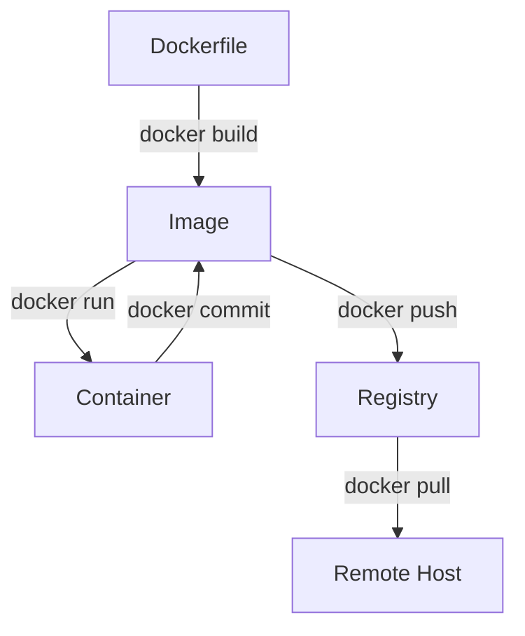
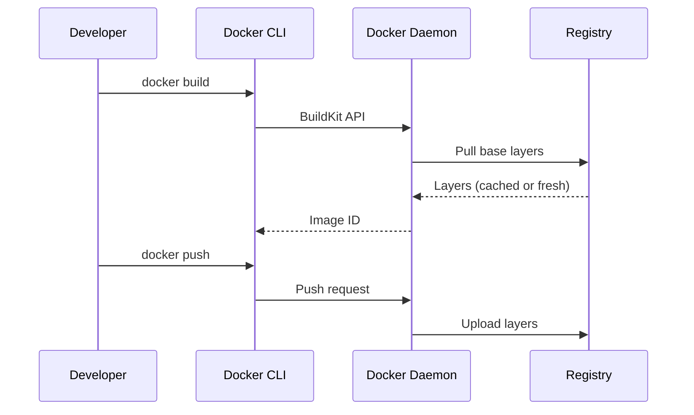
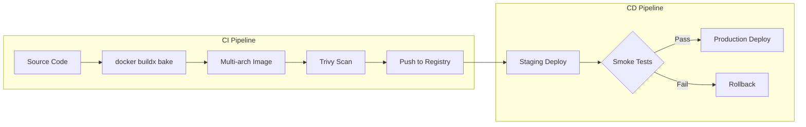
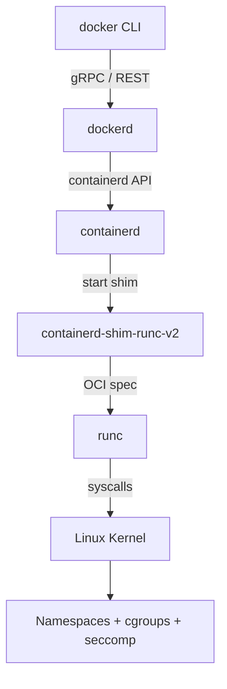
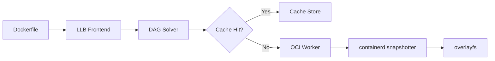
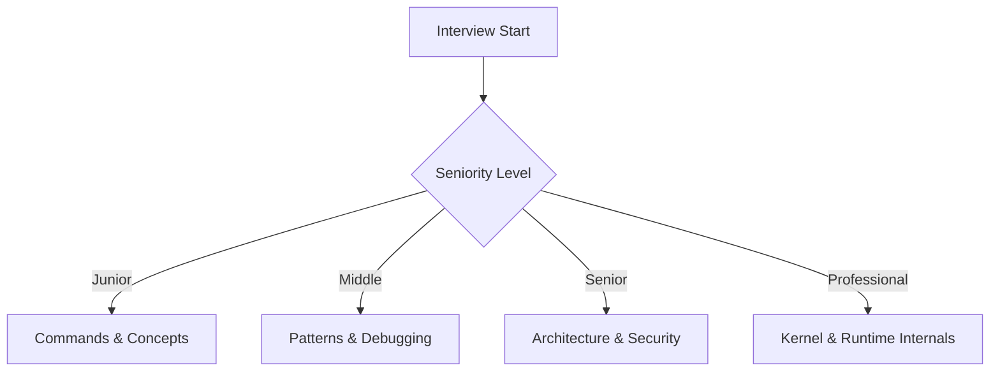
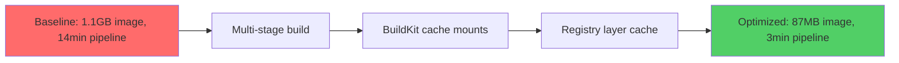

# Docker Roadmap — Universal Template

> This template guides content generation for **Docker** topics.
> Language: English | Code fence: ```dockerfile / ```yaml / ```bash

## Universal Requirements
- 9 output files per topic: junior.md, middle.md, senior.md, professional.md, interview.md, tasks.md, find-bug.md, optimize.md, specification.md
- Keep {{TOPIC_NAME}} placeholder throughout
- Include Mermaid diagrams in each template

### Topic Structure

```
XX-topic-name/
├── junior.md          ← "What?" and "How?"
├── middle.md          ← "Why?" and "When?"
├── senior.md          ← "How to optimize?" and "How to architect?"
├── professional.md    ← "Under the Hood" — Docker engine internals
├── interview.md       ← Interview prep across all levels
├── tasks.md           ← Hands-on practice tasks
├── find-bug.md        ← Find and fix bugs in code (10+ exercises)
├── optimize.md        ← Optimize slow/inefficient code (10+ exercises)
└── specification.md   ← Official spec / documentation deep-dive
```

---

# TEMPLATE 1 — `junior.md`

**Purpose:** Introduce the topic to a beginner who has just started learning Docker. Focus on basic commands, mental models, and first working examples.

## Key Sections

### 1. What Is {{TOPIC_NAME}}?
Brief plain-language explanation of what this Docker concept or component does and why it matters. No assumed knowledge.

### 2. Core Concepts
- Bullet list of 4-6 essential terms (e.g., image, container, layer, registry)
- One-sentence definition for each

### 3. Installation and Setup
Step-by-step instructions to get Docker installed and running locally.

```bash
# Install Docker Engine (Ubuntu)
sudo apt-get update
sudo apt-get install -y docker-ce docker-ce-cli containerd.io

# Verify installation
docker --version
docker run hello-world
```

### 4. First Dockerfile
Show the simplest working Dockerfile for {{TOPIC_NAME}}.

```dockerfile
# Example: minimal Node.js app image
FROM node:20-alpine
WORKDIR /app
COPY package*.json ./
RUN npm install
COPY . .
EXPOSE 3000
CMD ["node", "index.js"]
```

### 5. Basic Commands Reference
Table or list of the 8-10 most-used Docker CLI commands relevant to {{TOPIC_NAME}}.

```bash
docker build -t my-app:latest .
docker run -d -p 3000:3000 --name my-app my-app:latest
docker ps
docker logs my-app
docker exec -it my-app sh
docker stop my-app
docker rm my-app
docker images
docker rmi my-app:latest
```

### 6. Configuration / Script Examples
One compose file showing {{TOPIC_NAME}} in a simple two-service setup.

```yaml
version: "3.9"
services:
  app:
    build: .
    ports:
      - "3000:3000"
    environment:
      - NODE_ENV=development
  db:
    image: postgres:16-alpine
    environment:
      POSTGRES_PASSWORD: secret
    volumes:
      - db-data:/var/lib/postgresql/data
volumes:
  db-data:
```

### 7. Common Mistakes
- Forgetting to add a `.dockerignore` file (causes slow builds, leaks secrets)
- Running containers as root
- Using `latest` tag in production

### 8. Visual Overview



> Write in friendly, encouraging tone. Avoid jargon. Every code block must be runnable as-is or include a note about required substitutions.

---

# TEMPLATE 2 — `middle.md`

**Purpose:** Build on fundamentals for a developer with 1-2 years of Docker experience. Focus on patterns, debugging workflows, multi-stage builds, and automation.

## Key Sections

### 1. Topic Overview
One paragraph summary of {{TOPIC_NAME}} at intermediate level, including where it fits in a production workflow.

### 2. Multi-Stage Builds
Explain when and why to use multi-stage builds. Show a concrete example.

```dockerfile
# Stage 1 — build
FROM golang:1.22-alpine AS builder
WORKDIR /src
COPY go.mod go.sum ./
RUN go mod download
COPY . .
RUN CGO_ENABLED=0 go build -o /app/server ./cmd/server

# Stage 2 — runtime
FROM scratch
COPY --from=builder /app/server /server
EXPOSE 8080
ENTRYPOINT ["/server"]
```

### 3. Networking Patterns
- Bridge, host, and overlay network types
- Service discovery with Docker Compose
- Container-to-container communication

```bash
# Create a custom bridge network
docker network create --driver bridge app-net

# Attach containers
docker run -d --network app-net --name api my-api:latest
docker run -d --network app-net --name cache redis:7-alpine

# Inspect network
docker network inspect app-net
```

### 4. Volume Management and Data Persistence
Named volumes vs bind mounts vs tmpfs. When to use each.

```yaml
services:
  postgres:
    image: postgres:16
    volumes:
      - type: volume
        source: pgdata
        target: /var/lib/postgresql/data
      - type: bind
        source: ./init.sql
        target: /docker-entrypoint-initdb.d/init.sql
        read_only: true
volumes:
  pgdata:
    driver: local
```

### 5. Debugging Containers
Practical debugging techniques for {{TOPIC_NAME}}.

```bash
# Inspect a stopped container's filesystem
docker export my-app | tar -tv | grep config

# Run a debug sidecar against a running container
docker run --rm -it --pid=container:my-app \
  --net=container:my-app \
  nicolaka/netshoot

# Check resource usage
docker stats --no-stream
```

### 6. Error Handling and Incident Response
- Reading structured logs: `docker logs --since 1h --timestamps`
- Handling OOM kills: check `docker inspect` for `OOMKilled: true`
- Restarting policies: `unless-stopped` vs `on-failure:3`

### 7. Automation with Shell and Compose
Makefile targets and CI-friendly compose commands.

```bash
# Makefile excerpt
build:
    docker build --build-arg VERSION=$(VERSION) -t $(IMAGE):$(VERSION) .

test:
    docker compose -f docker-compose.test.yml up --abort-on-container-exit --exit-code-from tests

clean:
    docker compose down -v --remove-orphans
```

### 8. Comparison with Alternative Tools / Approaches
| Tool | Use Case | Key Difference |
|------|----------|----------------|
| Podman | Rootless containers | Daemonless, systemd-native |
| BuildKit | Advanced builds | Parallel stages, cache mounts |
| Nerdctl | containerd CLI | nerdctl compose compatible |
| Kaniko | In-cluster builds | No Docker daemon required |

### 9. Architecture Diagram



> Include at least one real-world scenario (e.g., debugging a production-like Compose stack). Reference Docker documentation versions where relevant.

---

# TEMPLATE 3 — `senior.md`

**Purpose:** Address architecture decisions, security hardening, scaling strategies, and cost considerations for engineers owning Docker in production.

## Key Sections

### 1. Production Architecture for {{TOPIC_NAME}}
Describe how {{TOPIC_NAME}} fits into a production container platform. Include tradeoffs.

### 2. Security Hardening
- Non-root users in Dockerfile
- Read-only root filesystem
- Dropping Linux capabilities
- Scanning images with Trivy or Snyk

```dockerfile
FROM node:20-alpine
RUN addgroup -S appgroup && adduser -S appuser -G appgroup
WORKDIR /app
COPY --chown=appuser:appgroup . .
RUN npm ci --only=production
USER appuser
# Drop all capabilities at runtime via compose or kubernetes securityContext
```

```yaml
# docker-compose.yml security settings
services:
  api:
    image: my-api:latest
    user: "1001:1001"
    read_only: true
    cap_drop:
      - ALL
    cap_add:
      - NET_BIND_SERVICE
    security_opt:
      - no-new-privileges:true
    tmpfs:
      - /tmp
```

### 3. Image Optimization and Registry Strategy
- Layer ordering for maximum cache reuse
- Using `--cache-from` in CI pipelines
- Distroless and scratch images
- Image signing with Docker Content Trust or Cosign

```bash
# BuildKit with inline cache
docker buildx build \
  --cache-from type=registry,ref=registry.example.com/app:cache \
  --cache-to type=registry,ref=registry.example.com/app:cache,mode=max \
  --push -t registry.example.com/app:${GIT_SHA} .
```

### 4. Scaling Patterns
- Horizontal scaling with Docker Swarm or delegating to Kubernetes
- Health checks and graceful shutdown
- Rolling updates with zero downtime

```yaml
services:
  api:
    image: my-api:latest
    deploy:
      replicas: 3
      update_config:
        parallelism: 1
        delay: 10s
        failure_action: rollback
      restart_policy:
        condition: on-failure
    healthcheck:
      test: ["CMD", "wget", "-qO-", "http://localhost:8080/health"]
      interval: 15s
      timeout: 5s
      retries: 3
      start_period: 30s
```

### 5. Cost and Resource Management
- Setting CPU and memory limits to prevent noisy-neighbor issues
- Analyzing image size to reduce registry egress costs
- Cleaning up unused images, volumes, and networks in CI

```bash
# Prune everything unused older than 24h
docker system prune -a --filter "until=24h" -f

# Show disk usage breakdown
docker system df -v
```

### 6. Observability
- Structured logging: configure log driver (`json-file`, `fluentd`, `awslogs`)
- Exporting metrics via cAdvisor or Docker stats API
- Distributed tracing with OpenTelemetry in containers

### 7. Error Handling and Incident Response
Runbook structure for container incidents:
1. Identify: `docker ps -a` + `docker inspect <id>`
2. Triage: `docker logs --tail 200 <id>` + `docker stats`
3. Contain: scale down or redirect traffic
4. Fix: rebuild and redeploy with fix
5. Post-mortem: capture `docker inspect` output, resource usage graphs

### 8. Architecture Decision Record Template



> This file should make the reader able to defend architecture decisions in a design review. Every tradeoff must be stated explicitly.

---

# TEMPLATE 4 — `professional.md`

**Purpose:** Deep internals for staff/principal engineers. Covers Linux primitives, container runtime chain, BuildKit internals, and daemon architecture.

# {{TOPIC_NAME}} — Infrastructure Internals

## Infrastructure Engine Internals

### The Container Runtime Stack
Explain the full chain: Docker CLI → Docker daemon (dockerd) → containerd → containerd-shim → runc → kernel.



### OCI Runtime Specification
- `config.json` structure: process, mounts, hooks, linux namespaces
- How runc reads and applies the OCI bundle
- Low-level container creation: `runc create` → `runc start` → `runc delete`

```bash
# Inspect the OCI spec for a running container
docker inspect --format='{{.Id}}' my-app
# Find the bundle under /run/containerd/io.containerd.runtime.v2.task/
ls /run/containerd/io.containerd.runtime.v2.task/moby/<container-id>/
cat /run/containerd/io.containerd.runtime.v2.task/moby/<container-id>/config.json | jq .linux.namespaces
```

## Kernel/Daemon Log Analysis

### Linux Namespaces Deep Dive
Each namespace type, the corresponding clone flag, and what Docker uses it for:

| Namespace | Clone Flag | Docker Use |
|-----------|-----------|------------|
| PID | CLONE_NEWPID | Process isolation |
| NET | CLONE_NEWNET | Network stack per container |
| MNT | CLONE_NEWNS | Filesystem view |
| UTS | CLONE_NEWUTS | Hostname isolation |
| IPC | CLONE_NEWIPC | SysV IPC, POSIX MQ |
| USER | CLONE_NEWUSER | UID/GID remapping (rootless) |
| CGROUP | CLONE_NEWCGROUP | cgroup namespace (kernel 4.6+) |

### cgroups v2 Resource Enforcement

```bash
# Find the cgroup for a running container
CONTAINER_ID=$(docker inspect --format='{{.Id}}' my-app)
cat /sys/fs/cgroup/system.slice/docker-${CONTAINER_ID}.scope/memory.current
cat /sys/fs/cgroup/system.slice/docker-${CONTAINER_ID}.scope/cpu.stat
```

### Analyzing containerd and dockerd Logs

```bash
# containerd daemon logs (systemd)
journalctl -u containerd -n 200 --no-pager

# dockerd with debug logging
dockerd --log-level=debug 2>&1 | grep "containerd"

# Trace a specific container event
journalctl -u docker -o json | jq 'select(.MESSAGE | contains("container start"))'
```

## Resource Model and Scheduling Internals

### BuildKit Architecture
- Frontend (Dockerfile parser / LLB generator)
- Solver: DAG of build steps with content-addressable cache
- Workers: OCI worker, containerd worker
- Cache storage backends: inline, registry, local, S3



### Overlay Filesystem Mechanics
- How layers stack: lowerdir, upperdir, workdir, merged
- Copy-on-write behavior
- Inspecting layer contents on disk

```bash
# Find overlay mount for a running container
docker inspect my-app --format='{{.GraphDriver.Data}}'
# Output contains LowerDir, UpperDir, WorkDir, MergedDir
mount | grep overlay | grep <container-short-id>
```

## Control Plane / Data Plane Internals

### Docker Networking Data Plane
- iptables rules created by Docker for bridge networks
- NAT and port forwarding chain: DOCKER chain in iptables
- Network namespaces and veth pairs

```bash
# List iptables rules Docker created
sudo iptables -t nat -L DOCKER --line-numbers -n
sudo iptables -L DOCKER --line-numbers -n

# Find veth pairs for a container
ip link show type veth
nsenter --net=/proc/$(docker inspect -f '{{.State.Pid}}' my-app)/net/ns ip addr
```

### Rootless Docker and User Namespaces
- UID/GID mapping: `/etc/subuid`, `/etc/subgid`
- `slirp4netns` vs `pasta` for rootless networking
- Performance and capability tradeoffs vs rootful

### containerd Snapshotter Internals
Different snapshotters (overlayfs, devmapper, zfs, btrfs) and their performance profiles. When to switch snapshotters in production.

> This file targets engineers who need to diagnose runtime failures at the kernel level, tune BuildKit for large-scale CI, or evaluate security posture against CIS Docker Benchmark.

---

# TEMPLATE 5 — `interview.md`

**Purpose:** Prepare candidates for Docker interview questions across all seniority levels. Organized by difficulty tier.

## Structure

### Junior Level Questions
1. What is the difference between a Docker image and a container?
2. What does the `COPY` instruction do, and how does it differ from `ADD`?
3. How do you pass environment variables to a running container?
4. What is a Docker volume and why would you use one?
5. How do you view the logs of a running container?

**Sample Answer — Q1:**
> An image is a read-only, layered filesystem snapshot defined by a Dockerfile. A container is a running (or stopped) instance of that image — it adds a writable layer on top. Multiple containers can run from the same image simultaneously.

### Middle Level Questions
1. Explain multi-stage builds and give a use case where they reduce image size significantly.
2. How does Docker layer caching work? What build steps should you place last to maximize cache hits?
3. What is the difference between `CMD` and `ENTRYPOINT`? When would you use each?
4. How do you connect two containers that need to communicate? What options exist?
5. What happens when a container runs out of memory? How do you configure memory limits?

**Sample Answer — Q2:**
> Docker caches each instruction as a layer. If the instruction and all prior inputs are unchanged, Docker reuses the cached layer. Steps that change frequently (e.g., `COPY . .`) should come after stable steps (e.g., `RUN npm install` after copying only `package.json`) so that dependency installation is cached even when source files change.

### Senior Level Questions
1. How would you design an image build strategy for a monorepo with 20 services?
2. Describe how you would harden a container image for a PCI-DSS environment.
3. What is the container runtime interface (CRI) and how does it relate to Docker?
4. How do you implement zero-downtime deployments with Docker Swarm?
5. Explain Docker Content Trust. How does it work under the hood?

### Professional / Deep-Dive Questions
1. Walk through what happens at the kernel level when you run `docker run`.
2. How do Linux namespaces and cgroups differ, and how does Docker use both?
3. Explain how BuildKit's DAG solver determines which cache entries are valid.
4. What are the security implications of privileged containers, and how would you detect them?
5. How does rootless Docker use user namespaces? What are the networking limitations?

### Behavioral / Scenario Questions
- "Tell me about a time a container worked locally but failed in production. How did you debug it?"
- "How would you migrate a legacy application from bare-metal to containers with minimal risk?"



> Include 2-3 trick questions per level. Mark correct answers with what a strong candidate says vs. a weak candidate.

---

# TEMPLATE 6 — `tasks.md`

**Purpose:** Provide hands-on exercises for each seniority level. Each task must be completable in a standard Docker environment.

## Junior Tasks

### Task 1 — Build and Run Your First Image
Build a Docker image for a simple "Hello World" HTTP server in any language. Run it locally and verify it responds on port 8080.

**Acceptance criteria:**
- `docker build` completes without error
- `curl http://localhost:8080` returns a 200 response
- Image size is under 100 MB

### Task 2 — Docker Compose Setup
Create a `docker-compose.yml` that runs a web app + Redis. The app must read a value from Redis on startup.

### Task 3 — Environment Configuration
Modify the above compose file to read all secrets from a `.env` file. Verify no secrets appear in the image layers using `docker history`.

## Middle Tasks

### Task 4 — Multi-Stage Build
Convert a single-stage Dockerfile for a Go or Rust application to a multi-stage build. Target image must be under 20 MB.

**Acceptance criteria:**
- Final image uses `scratch` or `distroless/static`
- Build artifacts are not present in the final image
- `docker scout cves` shows fewer vulnerabilities than the original

### Task 5 — Custom Bridge Network
Create a compose stack with three services (API, worker, database). Ensure API and worker can reach database, but API and worker cannot reach each other directly.

### Task 6 — Debugging Exercise
Given a broken Docker Compose stack (provided), identify and fix all issues. Document each fix in comments.

## Senior Tasks

### Task 7 — Hardened Production Image
Produce a Dockerfile that passes all critical checks from the CIS Docker Benchmark:
- Non-root user
- Read-only root filesystem
- No added capabilities beyond `NET_BIND_SERVICE`
- Image signed with Cosign

### Task 8 — CI/CD Build Pipeline
Write a GitHub Actions workflow that:
1. Builds a multi-arch image (`linux/amd64`, `linux/arm64`) using `docker buildx`
2. Scans with Trivy, fails on CRITICAL CVEs
3. Pushes to GHCR with semantic versioning tags
4. Caches layers in the registry

```yaml
# Skeleton for Task 8
name: Build and Push
on:
  push:
    branches: [main]
jobs:
  build:
    runs-on: ubuntu-latest
    steps:
      - uses: actions/checkout@v4
      - uses: docker/setup-buildx-action@v3
      - uses: docker/login-action@v3
        with:
          registry: ghcr.io
          username: ${{ github.actor }}
          password: ${{ secrets.GITHUB_TOKEN }}
      - uses: docker/build-push-action@v5
        with:
          platforms: linux/amd64,linux/arm64
          push: true
          tags: ghcr.io/${{ github.repository }}:${{ github.sha }}
          cache-from: type=registry,ref=ghcr.io/${{ github.repository }}:cache
          cache-to: type=registry,ref=ghcr.io/${{ github.repository }}:cache,mode=max
```

## Professional Tasks

### Task 9 — Namespace Inspection
Write a shell script that, given a container name, prints all namespace IDs (pid, net, mnt, uts, ipc, user) by reading `/proc/<pid>/ns/`.

### Task 10 — Custom Network Plugin
Implement a basic CNI plugin in bash that creates a veth pair and assigns IPs. Test it with `runc` directly (without Docker daemon).

> Each task should specify estimated completion time: Junior 30 min, Middle 1-2 h, Senior 4 h, Professional 1 day.

---

# TEMPLATE 7 — `find-bug.md`

**Purpose:** Present deliberately broken Docker configurations. The reader must identify and explain each bug.

## Bug Scenario Format
For each bug: show the broken code, describe symptoms, give hints, then reveal the fix.

---

### Bug 1 — Running as Root

**Broken Dockerfile:**
```dockerfile
FROM node:20
WORKDIR /app
COPY package*.json ./
RUN npm install
COPY . .
EXPOSE 3000
CMD ["node", "index.js"]
```

**Symptom:** Security scanner reports HIGH severity. Container process runs as UID 0.

**Hint:** Check `docker inspect <container> | jq '.[].Config.User'`

**Fix:**
```dockerfile
FROM node:20-alpine
RUN addgroup -S app && adduser -S app -G app
WORKDIR /app
COPY --chown=app:app package*.json ./
RUN npm install --omit=dev
COPY --chown=app:app . .
USER app
EXPOSE 3000
CMD ["node", "index.js"]
```

---

### Bug 2 — Broken Layer Cache (Dependency Reinstall on Every Build)

**Broken Dockerfile:**
```dockerfile
FROM python:3.12-slim
WORKDIR /app
COPY . .
RUN pip install -r requirements.txt
CMD ["python", "app.py"]
```

**Symptom:** Every code change triggers a full `pip install`, making builds 3-5 minutes longer than necessary.

**Hint:** Which files change more frequently — source code or dependency manifests?

**Fix:**
```dockerfile
FROM python:3.12-slim
WORKDIR /app
COPY requirements.txt .
RUN pip install --no-cache-dir -r requirements.txt
COPY . .
CMD ["python", "app.py"]
```

---

### Bug 3 — Missing .dockerignore (Secret Leakage + Slow Builds)

**Project structure:**
```
my-app/
  .env              # contains DB_PASSWORD=supersecret
  node_modules/     # 400 MB
  src/
  Dockerfile
```

**Broken Dockerfile:**
```dockerfile
FROM node:20-alpine
WORKDIR /app
COPY . .            # copies .env and node_modules into the image!
RUN npm install
CMD ["node", "src/index.js"]
```

**Symptom:** Image is 450 MB instead of 80 MB. `.env` file is visible in `docker history` and any layer inspection tool.

**Fix:** Create `.dockerignore`:
```
node_modules
.env
.env.*
*.log
.git
coverage
```

---

### Bug 4 — Hardcoded Secret in Build Arg (Exposed in Image History)

**Broken Dockerfile:**
```dockerfile
FROM alpine:3.19
ARG API_KEY=hardcoded_secret_123
RUN wget --header="Authorization: Bearer ${API_KEY}" https://internal.example.com/config
```

**Symptom:** `docker history my-image` reveals the API key in plain text.

**Fix:** Use BuildKit secrets:
```dockerfile
FROM alpine:3.19
RUN --mount=type=secret,id=api_key \
    wget --header="Authorization: Bearer $(cat /run/secrets/api_key)" \
    https://internal.example.com/config
```

```bash
docker build --secret id=api_key,src=.secrets/api_key .
```

---

### Bug 5 — Unhealthy Container Never Restarted

**Broken compose:**
```yaml
services:
  api:
    image: my-api:latest
    restart: always
    # No healthcheck defined
    # restart: always restarts on crash, but not on hang
```

**Symptom:** API hangs (deadlock), container stays in "running" state, traffic returns 504.

**Fix:**
```yaml
services:
  api:
    image: my-api:latest
    restart: unless-stopped
    healthcheck:
      test: ["CMD", "wget", "-qO-", "http://localhost:8080/health"]
      interval: 10s
      timeout: 3s
      retries: 3
      start_period: 20s
```

> Each bug scenario must include: symptom description, one diagnostic command, and the corrected code. Difficulty should increase across the 5 bugs.

---

# TEMPLATE 8 — `optimize.md`

**Purpose:** Provide concrete optimization techniques for Docker with measurable before/after metrics. Targets image size, build time, and runtime performance.

## Metrics Baseline
Before optimizing, establish baseline measurements:

```bash
# Image size
docker images my-app:before --format "{{.Size}}"

# Build time
time docker build --no-cache -t my-app:before .

# Container startup time
time docker run --rm my-app:before true

# Runtime memory
docker stats --no-stream --format "{{.MemUsage}}" my-app-container
```

## Optimization 1 — Image Size Reduction

**Before:** Single-stage Node.js image — 1.1 GB
**After:** Multi-stage with Alpine — 87 MB

```dockerfile
# BEFORE
FROM node:20
WORKDIR /app
COPY . .
RUN npm install
CMD ["node", "index.js"]

# AFTER
FROM node:20-alpine AS deps
WORKDIR /app
COPY package*.json ./
RUN npm ci --only=production

FROM node:20-alpine
WORKDIR /app
COPY --from=deps /app/node_modules ./node_modules
COPY src ./src
USER node
CMD ["node", "src/index.js"]
```

**Result:** 1.1 GB → 87 MB (92% reduction). Registry push time: 45s → 4s.

## Optimization 2 — Build Time with BuildKit Cache Mounts

**Before:** `npm install` runs in 90s on every build (cold cache in CI).
**After:** 8s using BuildKit cache mount.

```dockerfile
# syntax=docker/dockerfile:1.6
FROM node:20-alpine
WORKDIR /app
COPY package*.json ./
RUN --mount=type=cache,target=/root/.npm \
    npm ci --only=production
COPY . .
CMD ["node", "index.js"]
```

**CI configuration:**
```yaml
- uses: docker/build-push-action@v5
  with:
    cache-from: type=gha
    cache-to: type=gha,mode=max
```

**Result:** CI pipeline duration: 8 min → 3 min (63% reduction).

## Optimization 3 — Container Startup Time

**Before:** JVM application starts in 45s, failing health checks.
**After:** Native image (GraalVM) starts in 0.3s.

```dockerfile
# Multi-stage native build
FROM ghcr.io/graalvm/native-image:ol9-java21 AS native-builder
WORKDIR /app
COPY . .
RUN ./gradlew nativeCompile

FROM debian:12-slim
COPY --from=native-builder /app/build/native/nativeCompile/app /app
CMD ["/app"]
```

**k6 load test results (1000 RPS, 60s):**
```
# Before (JVM)
http_req_duration p(95)=120ms, p(99)=450ms
# After (native)
http_req_duration p(95)=18ms, p(99)=35ms
```

## Optimization 4 — CI Pipeline Duration

**Pipeline duration benchmark:**

| Stage | Before | After | Technique |
|-------|--------|-------|-----------|
| docker build | 8m 30s | 1m 45s | Registry cache + BuildKit |
| docker push | 2m 10s | 18s | Layer dedup + compression |
| Security scan | 4m 00s | 55s | Incremental diff scan |
| Total | 14m 40s | 3m 00s | 80% reduction |

## Optimization 5 — Infra Cost / Month

| Resource | Before | After | Change |
|----------|--------|-------|--------|
| Registry storage (1000 images) | $42/mo | $8/mo | -81% (image pruning + compression) |
| CI compute (GitHub Actions) | $180/mo | $36/mo | -80% (build caching) |
| Egress (image pulls, multi-region) | $95/mo | $22/mo | -77% (regional mirrors) |
| **Total** | **$317/mo** | **$66/mo** | **-79%** |

## Optimization 6 — Runtime Resource Tuning

```yaml
services:
  api:
    image: my-api:latest
    deploy:
      resources:
        limits:
          cpus: "0.5"
          memory: 256M
        reservations:
          cpus: "0.1"
          memory: 64M
    # Tune JVM or runtime for container awareness
    environment:
      - JAVA_TOOL_OPTIONS=-XX:MaxRAMPercentage=75.0 -XX:+UseContainerSupport
```



> Every optimization must include: before metric, after metric, and the exact technique used. Do not include optimizations without measurable results.
---
---

# TEMPLATE 9 — `specification.md`

> **Focus:** Official documentation deep-dive — reference specs, configuration schemas, CLI reference, and version compatibility.
>
> **Source:** Always cite the official documentation with direct section links.
> - Docker: https://docs.docker.com/reference/
> - Kubernetes: https://kubernetes.io/docs/reference/
> - AWS: https://docs.aws.amazon.com/
> - Terraform: https://developer.hashicorp.com/terraform/docs
> - Linux: https://man7.org/linux/man-pages/ | https://kernel.org/doc/
> - Cloudflare: https://developers.cloudflare.com/docs/
> - DevOps: https://www.atlassian.com/devops | https://dora.dev/
> - MLOps: https://ml-ops.org/ | https://mlflow.org/docs/latest/

<details open>
<summary><strong>Template Content</strong></summary>

# {{TOPIC_NAME}} — Specification

> **Official Documentation Reference**
>
> Source: [{{TOOL_NAME}} Official Docs]({{DOCS_URL}}) — {{SECTION}}

---

## Table of Contents

1. [Docs Reference](#docs-reference)
2. [CLI / API Reference](#cli--api-reference)
3. [Configuration Schema](#configuration-schema)
4. [Core Rules & Constraints](#core-rules--constraints)
5. [Behavioral Specification](#behavioral-specification)
6. [Edge Cases from Official Docs](#edge-cases-from-official-docs)
7. [Version & Compatibility Matrix](#version--compatibility-matrix)
8. [Official Examples](#official-examples)
9. [Compliance Checklist](#compliance-checklist)
10. [Related Documentation](#related-documentation)

---

## 1. Docs Reference

| Property | Value |
|----------|-------|
| **Official Docs** | [{{TOOL_NAME}} Documentation]({{DOCS_URL}}) |
| **Relevant Section** | {{SECTION_NAME}} — {{SECTION_TITLE}} |
| **Version** | {{TOOL_VERSION}} |
| **Direct URL** | {{DOCS_URL}}/{{PATH}} |

---

## 2. CLI / API Reference

> From: {{DOCS_URL}}/{{CLI_SECTION}}

### `{{COMMAND_OR_RESOURCE}}`

**Syntax:**
```
{{COMMAND_SYNTAX}}
```

| Flag / Option | Type | Required | Default | Description |
|---------------|------|----------|---------|-------------|
| `{{FLAG_1}}` | `{{TYPE_1}}` | ✅ | — | {{DESC_1}} |
| `{{FLAG_2}}` | `{{TYPE_2}}` | ❌ | `{{DEFAULT_2}}` | {{DESC_2}} |
| `{{FLAG_3}}` | `{{TYPE_3}}` | ❌ | `{{DEFAULT_3}}` | {{DESC_3}} |

**Exit codes:**

| Code | Meaning |
|------|---------|
| `0` | Success |
| `1` | General error |
| `{{CODE_N}}` | {{MEANING_N}} |

---

## 3. Configuration Schema

> From: {{DOCS_URL}}/{{CONFIG_SECTION}}

```yaml
# {{TOPIC_NAME}} configuration schema
{{CONFIG_SCHEMA_YAML}}
```

| Field | Type | Required | Default | Description |
|-------|------|----------|---------|-------------|
| `{{FIELD_1}}` | `{{TYPE_1}}` | ✅ | — | {{DESC_1}} |
| `{{FIELD_2}}` | `{{TYPE_2}}` | ❌ | `{{DEFAULT_2}}` | {{DESC_2}} |

---

## 4. Core Rules & Constraints

### Rule 1: {{RULE_NAME}}

> *Docs: [{{DOCS_URL}}/{{SECTION}}]({{DOCS_URL}}/{{SECTION}}) — "{{DOC_QUOTE}}"*

{{RULE_EXPLANATION}}

```{{CODE_LANG}}
# ✅ Correct
{{VALID_EXAMPLE}}

# ❌ Incorrect
{{INVALID_EXAMPLE}}
```

### Rule 2: {{RULE_NAME}}

> *Docs: [{{DOCS_URL}}/{{SECTION}}]({{DOCS_URL}}/{{SECTION}})*

{{RULE_EXPLANATION}}

---

## 5. Behavioral Specification

### Normal Operation

{{NORMAL_OPERATION}}

### Resource Limits & Quotas

| Resource | Default Limit | Max | Notes |
|----------|--------------|-----|-------|
| {{RES_1}} | {{LIMIT_1}} | {{MAX_1}} | {{NOTES_1}} |
| {{RES_2}} | {{LIMIT_2}} | {{MAX_2}} | {{NOTES_2}} |

### Error / Failure Conditions

| Error Code | Condition | Resolution |
|-----------|-----------|------------|
| `{{ERROR_1}}` | {{COND_1}} | {{FIX_1}} |
| `{{ERROR_2}}` | {{COND_2}} | {{FIX_2}} |

---

## 6. Edge Cases from Official Docs

| Edge Case | Official Behavior | Reference |
|-----------|-------------------|-----------|
| {{EDGE_1}} | {{BEHAVIOR_1}} | [Docs]({{URL_1}}) |
| {{EDGE_2}} | {{BEHAVIOR_2}} | [Docs]({{URL_2}}) |
| {{EDGE_3}} | {{BEHAVIOR_3}} | [Docs]({{URL_3}}) |

---

## 7. Version & Compatibility Matrix

| Version | Change | Backward Compatible? | Notes |
|---------|--------|---------------------|-------|
| `{{VER_1}}` | {{CHANGE_1}} | {{COMPAT_1}} | {{NOTES_1}} |
| `{{VER_2}}` | {{CHANGE_2}} | {{COMPAT_2}} | {{NOTES_2}} |

---

## 8. Official Examples

### Example from Docs: {{EXAMPLE_TITLE}}

> Source: [{{DOCS_URL}}/{{ANCHOR}}]({{DOCS_URL}}/{{ANCHOR}})

```{{CODE_LANG}}
{{OFFICIAL_EXAMPLE_CODE}}
```

**Expected output:**

```
{{EXPECTED_OUTPUT}}
```

---

## 9. Compliance Checklist

- [ ] Follows official recommended configuration for {{TOPIC_NAME}}
- [ ] Uses supported version ({{TOOL_VERSION}}+)
- [ ] Handles all documented error/failure conditions
- [ ] Follows official security hardening guidelines
- [ ] Resource limits configured per official recommendations
- [ ] Monitoring/alerting set up per official guidance

---

## 10. Related Documentation

| Topic | Doc Section | URL |
|-------|-------------|-----|
| {{RELATED_1}} | {{SECTION_1}} | [Link]({{URL_1}}) |
| {{RELATED_2}} | {{SECTION_2}} | [Link]({{URL_2}}) |
| {{RELATED_3}} | {{SECTION_3}} | [Link]({{URL_3}}) |

---

> **Content Rules for `specification.md`:**
> - Always link directly to the relevant doc section (not just the homepage)
> - Include official CLI/API reference tables with all flags and options
> - Document configuration schema with required/optional fields
> - Note deprecated commands and their replacements
> - Include official security hardening recommendations
> - Minimum 2 Core Rules, 3 Config fields, 3 Edge Cases, 2 Official Examples

</details>
