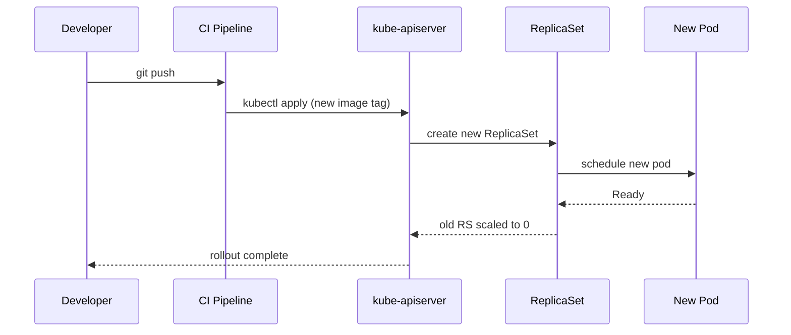
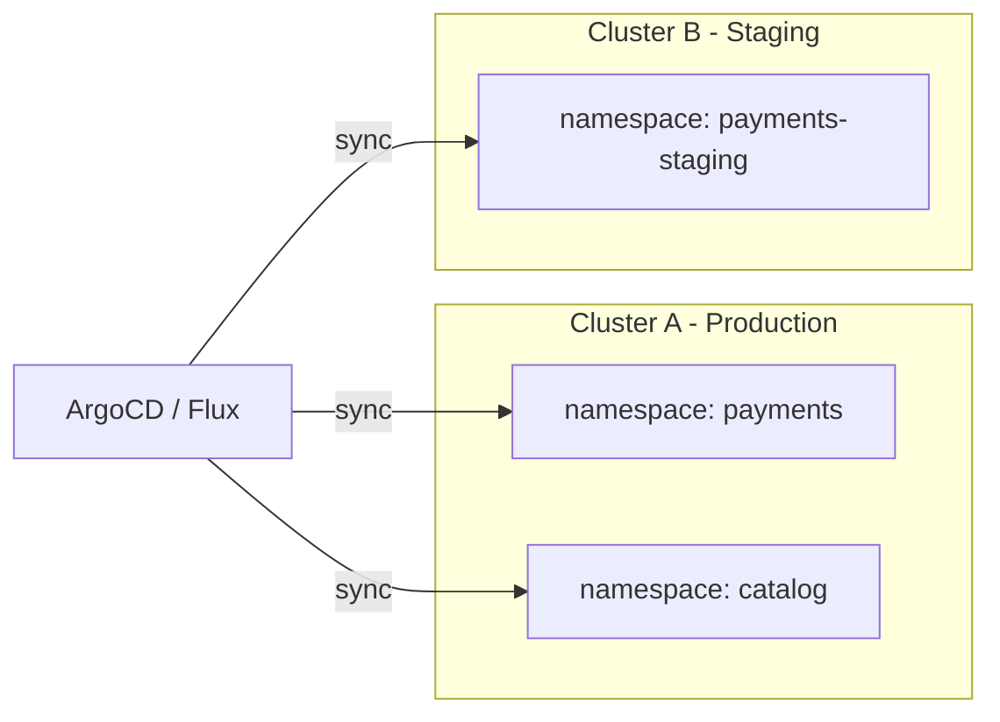
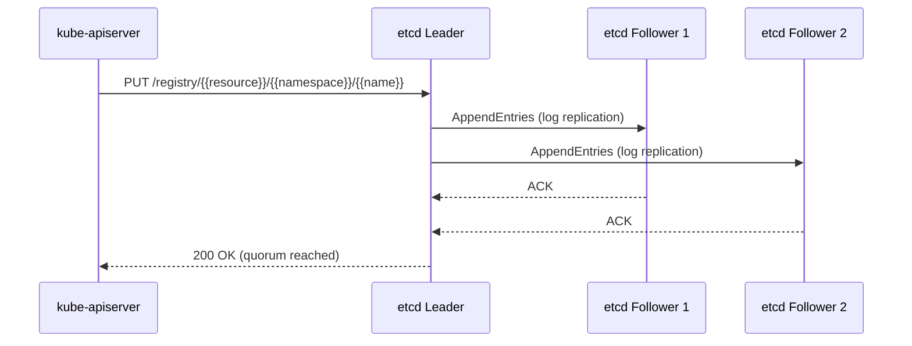
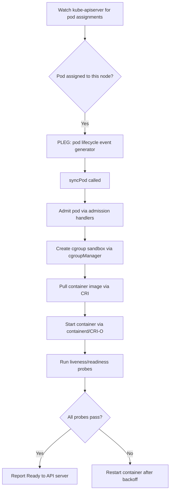
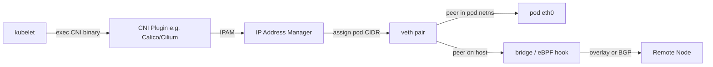

# Kubernetes Roadmap — Universal Template

> This template guides content generation for **Kubernetes** topics.
> Language: English | Code fence: ```yaml (manifests), ```bash (kubectl)

## Universal Requirements
- 9 output files per topic: junior.md, middle.md, senior.md, professional.md, interview.md, tasks.md, find-bug.md, optimize.md, specification.md
- Keep {{TOPIC_NAME}} placeholder throughout
- Include Mermaid diagrams in each template

### Topic Structure

```
XX-topic-name/
├── junior.md          ← "What?" and "How?"
├── middle.md          ← "Why?" and "When?"
├── senior.md          ← "How to optimize?" and "How to architect?"
├── professional.md    ← "Under the Hood" — Kubernetes control plane internals
├── interview.md       ← Interview prep across all levels
├── tasks.md           ← Hands-on practice tasks
├── find-bug.md        ← Find and fix bugs in code (10+ exercises)
├── optimize.md        ← Optimize slow/inefficient code (10+ exercises)
└── specification.md   ← Official spec / documentation deep-dive
```

---

# TEMPLATE 1 — `junior.md`

**Purpose:** Introduce the {{TOPIC_NAME}} concept to someone new to Kubernetes. Cover basic terminology, first commands, and simple manifest structures. The reader should be able to deploy and inspect a basic workload by the end.

---

## 1. What Is {{TOPIC_NAME}}?

> Provide a plain-English definition (3–5 sentences). Explain what problem this Kubernetes resource or concept solves. Avoid jargon where possible; define any Kubernetes-specific terms you must use.

**Example definition block:**
```
{{TOPIC_NAME}} is a Kubernetes object that ...
It solves the problem of ...
Without {{TOPIC_NAME}}, teams would have to ...
```

---

## 2. Core Concepts and Terminology

> List 5–8 key terms with one-sentence definitions each. Use a markdown table.

| Term | Definition |
|------|------------|
| Pod | Smallest deployable unit in Kubernetes; wraps one or more containers |
| Node | A worker machine (VM or physical) where pods are scheduled |
| Namespace | Logical partition within a cluster for resource isolation |
| Label | Key-value pair attached to objects for selection and grouping |
| {{TOPIC_NAME}}-specific term | … |

---

## 3. Basic kubectl Commands

> Show the 6–10 most common kubectl commands a junior would use with {{TOPIC_NAME}}. Include brief inline comments.

```bash
# Create a resource from a manifest file
kubectl apply -f {{topic}}.yaml

# List all resources of this type in the default namespace
kubectl get {{resource-type}}

# Get detailed info about a specific resource
kubectl describe {{resource-type}} {{name}}

# View live logs from a pod
kubectl logs {{pod-name}} --follow

# Delete a resource
kubectl delete {{resource-type}} {{name}}

# Open an interactive shell inside a running pod
kubectl exec -it {{pod-name}} -- /bin/sh
```

---

## 4. First Manifest — Minimal Example

> Provide the simplest possible YAML manifest that creates a working {{TOPIC_NAME}}. Annotate every field with an inline comment.

```yaml
apiVersion: apps/v1          # API group and version
kind: {{ResourceKind}}       # The Kubernetes resource type
metadata:
  name: {{topic}}-demo       # Unique name within the namespace
  namespace: default         # Target namespace
  labels:
    app: {{topic}}-demo      # Label used by selectors
spec:
  replicas: 1                # Number of desired pod copies
  selector:
    matchLabels:
      app: {{topic}}-demo    # Must match template labels below
  template:
    metadata:
      labels:
        app: {{topic}}-demo
    spec:
      containers:
        - name: app
          image: nginx:1.25  # Container image; always pin a tag
          ports:
            - containerPort: 80
          resources:         # Always set resource requests and limits
            requests:
              cpu: "100m"
              memory: "128Mi"
            limits:
              cpu: "250m"
              memory: "256Mi"
```

---

## 5. Diagram — Basic Resource Relationship

> Include a Mermaid diagram showing how {{TOPIC_NAME}} relates to pods and services.

```mermaid
graph TD
    A[kubectl apply] --> B[{{ResourceKind}}]
    B --> C[ReplicaSet]
    C --> D[Pod 1]
    C --> E[Pod 2]
    D --> F[Container: app]
    E --> F2[Container: app]
    G[Service] -->|selector match| D
    G -->|selector match| E
```

---

## 6. Configuration / Script Examples

> Show a simple shell script a junior might use to deploy and verify {{TOPIC_NAME}}.

```bash
#!/bin/bash
# deploy-{{topic}}.sh — Apply manifest and wait for rollout

NAMESPACE="default"
MANIFEST="{{topic}}.yaml"

echo "Applying manifest..."
kubectl apply -f "$MANIFEST" -n "$NAMESPACE"

echo "Waiting for rollout to complete..."
kubectl rollout status deployment/{{topic}}-demo -n "$NAMESPACE"

echo "Current pods:"
kubectl get pods -n "$NAMESPACE" -l app={{topic}}-demo
```

---

## 7. Common Mistakes for Beginners

> List 4–6 frequent errors with a short explanation and the fix.

- **No resource limits set:** Pods can consume all node memory and cause OOM kills on neighbors. Always specify `resources.limits`.
- **Wrong image tag (`latest`):** Leads to unpredictable behavior across environments. Pin to a specific digest or version tag.
- **Mismatched label selectors:** The `spec.selector.matchLabels` must exactly match `spec.template.metadata.labels`; otherwise the Deployment cannot manage its pods.
- **Missing namespace flag:** `kubectl get pods` only shows the `default` namespace; pass `-n <ns>` or `--all-namespaces` to see everything.

---

## 8. Further Reading

> Link to official Kubernetes documentation pages relevant to {{TOPIC_NAME}}.

- [Kubernetes Docs — {{TOPIC_NAME}}](https://kubernetes.io/docs/concepts/)
- `kubectl explain {{resource-type}}` — built-in field documentation
- `kubectl api-resources` — list all resource types in the cluster

---

# TEMPLATE 2 — `middle.md`

**Purpose:** Help a practitioner with basic Kubernetes experience deepen their understanding of {{TOPIC_NAME}}. Cover configuration patterns, debugging workflows, and automation strategies.

---

## 1. Recap and Context

> One paragraph re-anchoring {{TOPIC_NAME}} in real production usage. What breaks without proper configuration? What patterns do teams commonly adopt?

---

## 2. Advanced Configuration Patterns

> Show 2–3 production-grade manifest patterns with annotations.

**Pattern A — Multi-container pod with sidecar:**
```yaml
spec:
  containers:
    - name: app
      image: myapp:1.4.2
      resources:
        requests:
          cpu: "200m"
          memory: "256Mi"
        limits:
          cpu: "500m"
          memory: "512Mi"
    - name: log-shipper        # Sidecar pattern
      image: fluentbit:2.1
      volumeMounts:
        - name: logs
          mountPath: /var/log/app
  volumes:
    - name: logs
      emptyDir: {}
```

**Pattern B — ConfigMap + Secret injection:**
```yaml
envFrom:
  - configMapRef:
      name: {{topic}}-config
  - secretRef:
      name: {{topic}}-secrets
```

---

## 3. Troubleshooting and Incident Diagnosis

> Walk through the standard debugging ladder for {{TOPIC_NAME}} failures. Use a numbered runbook style.

```bash
# Step 1 — Check pod status
kubectl get pods -n {{namespace}} -l app={{topic}}

# Step 2 — Inspect events (most recent failures appear here)
kubectl describe pod {{pod-name}} -n {{namespace}}

# Step 3 — Read container logs (last 100 lines)
kubectl logs {{pod-name}} -n {{namespace}} --tail=100

# Step 4 — Check previous container if it crashed and restarted
kubectl logs {{pod-name}} -n {{namespace}} --previous

# Step 5 — Exec into the pod for live inspection
kubectl exec -it {{pod-name}} -n {{namespace}} -- /bin/sh

# Step 6 — Check node pressure
kubectl describe node {{node-name}} | grep -A5 Conditions
```

---

## 4. Automation with Helm

> Show how {{TOPIC_NAME}} fits into a Helm chart. Provide the key values.yaml knobs.

```yaml
# values.yaml excerpt
replicaCount: 2
image:
  repository: myregistry/{{topic}}-app
  tag: "1.4.2"
  pullPolicy: IfNotPresent
resources:
  limits:
    cpu: 500m
    memory: 512Mi
  requests:
    cpu: 200m
    memory: 256Mi
autoscaling:
  enabled: true
  minReplicas: 2
  maxReplicas: 10
  targetCPUUtilizationPercentage: 70
```

---

## 5. Diagram — Deployment Rollout Flow



---

## 6. Error Handling and Incident Response

> Describe how to handle the top 3 failure modes for {{TOPIC_NAME}} in production, including runbook steps and escalation criteria.

| Failure Mode | Symptom | Immediate Action | Root Cause Investigation |
|---|---|---|---|
| CrashLoopBackOff | Pod restarts repeatedly | `kubectl logs --previous` | Check exit code, OOM, missing env vars |
| Pending Pod | Pod stuck in Pending | `kubectl describe pod` → Events | Insufficient node resources, PVC not bound |
| ImagePullBackOff | Image cannot be pulled | Check registry credentials | Verify `imagePullSecrets`, image tag existence |

---

## 7. Comparison with Alternative Tools / Approaches

> Compare Kubernetes-native {{TOPIC_NAME}} with alternative approaches (e.g., Docker Compose, bare VM deployment, serverless).

| Dimension | Kubernetes {{TOPIC_NAME}} | Docker Compose | Serverless |
|---|---|---|---|
| Scalability | Auto-scaling via HPA | Manual | Auto (cold-start penalty) |
| Portability | Any K8s cluster | Docker host only | Provider lock-in |
| Operational overhead | Medium | Low | Low |
| Networking | Rich (Services, Ingress) | Basic | Managed |

---

# TEMPLATE 3 — `senior.md`

**Purpose:** Target engineers who own {{TOPIC_NAME}} in production. Cover architecture decisions, security hardening, multi-cluster patterns, and cost optimization.

---

## 1. Architecture Considerations

> Describe how {{TOPIC_NAME}} fits into large-scale cluster architecture. Cover namespace strategy, multi-tenancy, and cluster topology choices.



---

## 2. Security Hardening

> Provide a security checklist and manifest examples implementing least-privilege for {{TOPIC_NAME}}.

```yaml
# Security context — apply to every pod spec
securityContext:
  runAsNonRoot: true
  runAsUser: 1000
  readOnlyRootFilesystem: true
  allowPrivilegeEscalation: false
  capabilities:
    drop:
      - ALL
```

```yaml
# NetworkPolicy — default deny, explicit allow
apiVersion: networking.k8s.io/v1
kind: NetworkPolicy
metadata:
  name: {{topic}}-netpol
  namespace: {{namespace}}
spec:
  podSelector:
    matchLabels:
      app: {{topic}}
  policyTypes:
    - Ingress
    - Egress
  ingress:
    - from:
        - podSelector:
            matchLabels:
              role: frontend
      ports:
        - port: 8080
  egress:
    - to:
        - podSelector:
            matchLabels:
              app: postgres
      ports:
        - port: 5432
```

---

## 3. Scaling and High Availability

> Cover HPA, PodDisruptionBudgets, and topology spread constraints.

```yaml
# HorizontalPodAutoscaler
apiVersion: autoscaling/v2
kind: HorizontalPodAutoscaler
metadata:
  name: {{topic}}-hpa
spec:
  scaleTargetRef:
    apiVersion: apps/v1
    kind: Deployment
    name: {{topic}}-demo
  minReplicas: 3
  maxReplicas: 20
  metrics:
    - type: Resource
      resource:
        name: cpu
        target:
          type: Utilization
          averageUtilization: 65
    - type: Resource
      resource:
        name: memory
        target:
          type: Utilization
          averageUtilization: 75
```

```yaml
# PodDisruptionBudget — ensure at least 2 replicas during node drain
apiVersion: policy/v1
kind: PodDisruptionBudget
metadata:
  name: {{topic}}-pdb
spec:
  minAvailable: 2
  selector:
    matchLabels:
      app: {{topic}}
```

---

## 4. Cost Optimization

> Strategies for reducing cluster spend related to {{TOPIC_NAME}}.

- Use **Vertical Pod Autoscaler (VPA)** in recommendation mode to right-size requests before setting hard limits.
- Apply **Spot/Preemptible nodes** for stateless workloads; use node affinity to keep stateful pods on on-demand nodes.
- Set **LimitRange** objects per namespace to enforce default requests/limits and prevent resource starvation.
- Enable **cluster-level autoscaling** (Cluster Autoscaler or Karpenter) to scale nodes down when pods are removed.

---

## 5. GitOps Integration

```yaml
# ArgoCD Application manifest
apiVersion: argoproj.io/v1alpha1
kind: Application
metadata:
  name: {{topic}}-production
  namespace: argocd
spec:
  project: default
  source:
    repoURL: https://github.com/org/k8s-manifests
    targetRevision: HEAD
    path: apps/{{topic}}/production
  destination:
    server: https://kubernetes.default.svc
    namespace: {{namespace}}
  syncPolicy:
    automated:
      prune: true
      selfHeal: true
    syncOptions:
      - CreateNamespace=true
```

---

## 6. Observability

> Define the golden signals instrumentation strategy for {{TOPIC_NAME}}.

```yaml
# ServiceMonitor for Prometheus scraping
apiVersion: monitoring.coreos.com/v1
kind: ServiceMonitor
metadata:
  name: {{topic}}-monitor
  namespace: monitoring
spec:
  selector:
    matchLabels:
      app: {{topic}}
  endpoints:
    - port: metrics
      interval: 15s
      path: /metrics
```

---

# TEMPLATE 4 — `professional.md`

# {{TOPIC_NAME}} — Infrastructure Internals

**Purpose:** Target staff/principal engineers and platform architects who need to understand how Kubernetes implements {{TOPIC_NAME}} at the control plane level: etcd Raft consensus, kubelet internals, kube-scheduler decision trees, and CNI plugin architecture.

---

## 1. etcd and Raft Consensus

> Explain how {{TOPIC_NAME}} state is stored in etcd and what happens during leader election, log replication, and compaction.



> The key prefix for this resource type in etcd is `/registry/{{resource-group}}/{{namespace}}/{{name}}`. Inspect it with:

```bash
# Read raw etcd key (requires etcdctl with TLS certs)
ETCDCTL_API=3 etcdctl get /registry/deployments/default/{{topic}}-demo \
  --endpoints=https://127.0.0.1:2379 \
  --cacert=/etc/kubernetes/pki/etcd/ca.crt \
  --cert=/etc/kubernetes/pki/etcd/peer.crt \
  --key=/etc/kubernetes/pki/etcd/peer.key \
  | hexdump -C | head -40
```

---

## 2. kubelet Internals

> Trace the lifecycle of a pod managed by {{TOPIC_NAME}} through the kubelet's syncPod loop.



---

## 3. kube-scheduler Decision Tree

> Document the scheduling algorithm phases relevant to {{TOPIC_NAME}} workloads: filtering, scoring, binding.

```
Phase 1 — Filtering (predicate plugins, run in parallel):
  NodeUnschedulable, NodeResourcesFit, NodeAffinity,
  PodTopologySpread, TaintToleration, VolumeBinding

Phase 2 — Scoring (priority plugins, weighted sum):
  LeastAllocated (weight: 1), BalancedAllocation (weight: 1),
  ImageLocality (weight: 1), InterPodAffinity (weight: 1)

Phase 3 — Binding:
  Selected node written back to pod.spec.nodeName via API server
```

```bash
# Inspect scheduler decisions via events
kubectl get events --field-selector reason=Scheduled -n {{namespace}}

# Enable scheduler verbose logging (log level 10 = trace)
# Edit kube-scheduler manifest: --v=10
```

---

## 4. CNI Plugin Architecture

> Explain the network path from pod creation to packet delivery, focusing on how {{TOPIC_NAME}} pods get their IP addresses and how network policies are enforced.



> Cilium bypasses iptables entirely by attaching eBPF programs at the TC (traffic control) hook. For {{TOPIC_NAME}}, this means NetworkPolicy enforcement happens at wire speed without conntrack table overhead.

---

## 5. API Server Admission Chain

> Describe the order of admission webhooks and how they affect {{TOPIC_NAME}} object creation.

```
API Request
  → Authentication (mTLS / OIDC token)
  → Authorization (RBAC / ABAC)
  → Mutating Admission Webhooks (e.g., inject sidecar, set defaults)
  → Object Schema Validation
  → Validating Admission Webhooks (e.g., OPA Gatekeeper, Kyverno)
  → etcd persist
  → Informer cache update
  → Controller reconciliation loop triggered
```

---

# TEMPLATE 5 — `interview.md`

**Purpose:** Prepare engineers for technical interviews by covering the most common {{TOPIC_NAME}} interview questions across difficulty tiers.

---

## Junior-Level Questions

**Q1: What is the difference between a Pod and a Deployment?**
> Expected answer: A Pod is the smallest deployable unit but has no self-healing. A Deployment manages a ReplicaSet which ensures the desired number of pod replicas is maintained. Deployments also enable rolling updates and rollbacks.

**Q2: How does Kubernetes decide which node to schedule a pod on?**
> Expected answer: kube-scheduler filters nodes that meet resource requests, taints/tolerations, and affinity rules, then scores remaining nodes and picks the highest-scoring one.

**Q3: What happens when you run `kubectl apply -f deployment.yaml`?**
> Expected answer: kubectl sends an HTTP PATCH/POST to kube-apiserver → API server validates, authenticates, authorizes → stored in etcd → Deployment controller picks up the change → creates/updates ReplicaSet → ReplicaSet controller creates pods → scheduler assigns pods to nodes → kubelet pulls image and starts containers.

---

## Mid-Level Questions

**Q4: Explain the difference between liveness and readiness probes. When would a failing readiness probe NOT restart a pod?**
> Expected answer: Liveness = is the container alive (failure triggers restart). Readiness = is the container ready to receive traffic (failure removes it from Service endpoints but does NOT restart it). A pod with a failing readiness probe remains running but gets no traffic.

**Q5: How would you debug a pod that is stuck in `Pending` state?**
> Expected answer: `kubectl describe pod` → look at Events section. Common causes: insufficient CPU/memory on all nodes, PVC not bound, node selector/affinity not satisfied, taint without toleration. Check `kubectl describe nodes` for resource pressure.

**Q6: What is a PodDisruptionBudget and when is it enforced?**
> Expected answer: A PDB defines the minimum number (or percentage) of pods that must remain available during voluntary disruptions (node drain, cluster upgrade). It is enforced by the Eviction API — `kubectl drain` will block if evicting a pod would violate the PDB.

---

## Senior-Level Questions

**Q7: Describe how Kubernetes handles a rolling update and how you would configure a zero-downtime deployment.**
> Expected answer: Deployment controller creates a new ReplicaSet and scales it up one pod at a time while scaling down the old ReplicaSet, subject to `maxSurge` and `maxUnavailable`. Zero-downtime requires: readiness probes, `minReadySeconds`, PDB, preStop hook + terminationGracePeriodSeconds to drain in-flight requests.

**Q8: How does RBAC work and how would you implement least-privilege for a CI/CD service account?**
> Expected answer: RBAC = Role (namespaced) or ClusterRole (cluster-wide) bound to a Subject (User, Group, ServiceAccount) via RoleBinding/ClusterRoleBinding. For CI/CD: create a ServiceAccount, a Role with only `get/list/patch` on Deployments in one namespace, and a RoleBinding. Never grant ClusterAdmin.

---

## System Design Question

**Q9: Design a multi-tenant Kubernetes platform for 50 engineering teams.**
> Talking points: namespace-per-team, ResourceQuotas, LimitRanges, NetworkPolicies (default deny), separate node pools per tier, OIDC-based authentication, OPA Gatekeeper for policy enforcement, Flux/ArgoCD for GitOps per team, centralized observability (Prometheus + Grafana), cost chargeback with Kubecost.

---

# TEMPLATE 6 — `tasks.md`

**Purpose:** Provide hands-on exercises that progressively build competence with {{TOPIC_NAME}}, from basic YAML writing to production-grade operations.

---

## Task 1 — Deploy Your First {{TOPIC_NAME}} (Junior)

**Objective:** Write a Deployment manifest and verify it is healthy.

**Steps:**
1. Create a file `{{topic}}-task1.yaml` with a 2-replica Deployment running `nginx:1.25`.
2. Add resource requests (`cpu: 100m`, `memory: 128Mi`) and limits (`cpu: 250m`, `memory: 256Mi`).
3. Apply the manifest: `kubectl apply -f {{topic}}-task1.yaml`
4. Confirm both pods are Running: `kubectl get pods -l app={{topic}}`
5. Describe one pod and verify the resource limits appear under `Containers`.

**Acceptance criteria:** `kubectl get pods` shows 2/2 Running; no OOMKilled events.

---

## Task 2 — Rolling Update with Zero Downtime (Middle)

**Objective:** Perform a rolling update and observe the transition.

```bash
# Watch pods in a separate terminal
kubectl get pods -w -l app={{topic}}

# Trigger update by changing the image tag
kubectl set image deployment/{{topic}}-demo app=nginx:1.26

# Observe rollout
kubectl rollout status deployment/{{topic}}-demo

# Roll back if needed
kubectl rollout undo deployment/{{topic}}-demo
```

**Acceptance criteria:** No more than 1 pod unavailable at any time during the update.

---

## Task 3 — Configure HPA and Load Test (Middle/Senior)

**Objective:** Set up horizontal autoscaling and verify it responds to load.

```bash
# Install metrics-server if not present
kubectl apply -f https://github.com/kubernetes-sigs/metrics-server/releases/latest/download/components.yaml

# Create HPA targeting 50% CPU
kubectl autoscale deployment {{topic}}-demo --cpu-percent=50 --min=2 --max=10

# Generate load (run in a separate pod)
kubectl run load-gen --image=busybox --restart=Never -- \
  /bin/sh -c "while true; do wget -q -O- http://{{topic}}-svc; done"

# Watch HPA scale up
kubectl get hpa {{topic}}-demo -w
```

---

## Task 4 — Implement NetworkPolicy (Senior)

**Objective:** Apply a default-deny NetworkPolicy and explicitly allow only required traffic.

Steps:
1. Apply a default-deny NetworkPolicy in the `{{namespace}}` namespace.
2. Add an ingress rule allowing traffic only from pods with label `role: frontend` on port 8080.
3. Verify with `kubectl exec` that a pod with `role: backend` cannot reach `{{topic}}` pods.
4. Verify a pod with `role: frontend` can reach them.

---

## Task 5 — Audit RBAC (Senior/Professional)

**Objective:** Identify and remediate overly permissive RBAC bindings.

```bash
# List all ClusterRoleBindings granting cluster-admin
kubectl get clusterrolebindings -o json | \
  jq '.items[] | select(.roleRef.name=="cluster-admin") | .subjects'

# Use kubectl-who-can to audit permissions
kubectl-who-can create pods --all-namespaces
```

---

# TEMPLATE 7 — `find-bug.md`

**Purpose:** Present realistic Kubernetes manifest bugs for the reader to identify and fix. Each scenario represents a common production mistake.

---

## Bug 1 — Missing Resource Limits (OOM Kill)

**Scenario:** A Deployment has been running in production for two weeks. Suddenly, other pods on the same node start getting OOMKilled even though your application's memory usage looks normal.

**Buggy manifest:**
```yaml
apiVersion: apps/v1
kind: Deployment
metadata:
  name: payment-service
spec:
  replicas: 3
  selector:
    matchLabels:
      app: payment-service
  template:
    metadata:
      labels:
        app: payment-service
    spec:
      containers:
        - name: app
          image: payment-service:2.1.0
          ports:
            - containerPort: 8080
          # BUG: No resources block at all
```

**What to find:** The container has no `resources.requests` or `resources.limits` defined. The scheduler cannot make informed placement decisions and the container can consume unlimited node memory, starving other pods.

**Fix:**
```yaml
          resources:
            requests:
              cpu: "200m"
              memory: "256Mi"
            limits:
              cpu: "500m"
              memory: "512Mi"
```

**Detection command:**
```bash
# Find all pods in the cluster with no resource limits
kubectl get pods --all-namespaces -o json | \
  jq '.items[] | select(.spec.containers[].resources.limits == null) | .metadata.name'
```

---

## Bug 2 — Wrong Label Selector (No Traffic Routed)

**Scenario:** A new Service has been deployed but no traffic reaches the pods. `kubectl get endpoints` shows `<none>`.

**Buggy manifest:**
```yaml
apiVersion: v1
kind: Service
metadata:
  name: api-service
spec:
  selector:
    app: api          # BUG: Pods are labelled app: api-server (mismatch)
  ports:
    - port: 80
      targetPort: 8080
---
apiVersion: apps/v1
kind: Deployment
metadata:
  name: api-server
spec:
  template:
    metadata:
      labels:
        app: api-server   # Does NOT match the Service selector above
```

**What to find:** Service selector `app: api` does not match pod label `app: api-server`. The Service has no endpoints.

**Fix:** Change Service selector to `app: api-server` (or align pod labels to `app: api`).

**Detection command:**
```bash
kubectl get endpoints api-service   # Will show <none> if broken
kubectl get pods --show-labels | grep api
```

---

## Bug 3 — Missing Liveness Probe (Silent Deadlock)

**Scenario:** An application occasionally deadlocks internally but the container process does not exit. Pods stay in Running state but return 503 for hours until someone notices.

**Buggy manifest:**
```yaml
spec:
  containers:
    - name: worker
      image: worker:3.0.1
      # BUG: No livenessProbe defined; deadlocked process is never restarted
      readinessProbe:
        httpGet:
          path: /health
          port: 8080
        initialDelaySeconds: 10
```

**What to find:** Only a readinessProbe exists. A deadlocked process will fail readiness (removing the pod from the Service) but the container is never restarted, so the deadlock persists indefinitely.

**Fix:**
```yaml
      livenessProbe:
        httpGet:
          path: /healthz
          port: 8080
        initialDelaySeconds: 15
        periodSeconds: 20
        failureThreshold: 3
```

---

# TEMPLATE 8 — `optimize.md`

**Purpose:** Guide engineers through measuring baseline performance of {{TOPIC_NAME}} workloads and applying targeted optimizations. Each section follows a before/after benchmark format.

---

## 1. Baseline Measurement

> Always measure before changing anything. Capture these metrics as your baseline.

```bash
# CPU and memory utilization per pod (requires metrics-server)
kubectl top pod -n {{namespace}} -l app={{topic}}

# Node-level pressure
kubectl top node

# Deployment rollout duration (time this command)
time kubectl rollout status deployment/{{topic}}-demo -n {{namespace}}

# HPA current state
kubectl get hpa {{topic}}-hpa -n {{namespace}}
```

**Baseline table (fill in before optimizing):**

| Metric | Before | After |
|--------|--------|-------|
| Avg pod CPU | _ m | _ m |
| Avg pod memory | _ Mi | _ Mi |
| P99 request latency | _ ms | _ ms |
| Rollout duration | _ s | _ s |
| Monthly infra cost | $_ | $_ |
| Node count | _ | _ |
| Resource utilization % | _% | _% |

---

## 2. Right-Sizing Resource Requests

> Oversized requests waste node capacity; undersized requests cause throttling and eviction.

```bash
# Use VPA in recommendation mode to get data-driven suggestions
kubectl apply -f https://github.com/kubernetes/autoscaler/raw/master/vertical-pod-autoscaler/deploy/vpa-v1-crd-gen.yaml

# Create a VPA object in Recommendation mode (no auto-apply)
```

```yaml
apiVersion: autoscaling.k8s.io/v1
kind: VerticalPodAutoscaler
metadata:
  name: {{topic}}-vpa
  namespace: {{namespace}}
spec:
  targetRef:
    apiVersion: apps/v1
    kind: Deployment
    name: {{topic}}-demo
  updatePolicy:
    updateMode: "Off"   # Recommendation only; do not auto-evict
```

```bash
# Read VPA recommendations after 24h of traffic
kubectl describe vpa {{topic}}-vpa -n {{namespace}}
```

---

## 3. Startup Time Optimization

> Slow pod startup increases rollout time and incident recovery time.

```yaml
spec:
  containers:
    - name: app
      startupProbe:           # Separates startup from liveness
        httpGet:
          path: /healthz
          port: 8080
        failureThreshold: 30  # Allow up to 30 * 10s = 5 minutes for slow init
        periodSeconds: 10
      livenessProbe:
        httpGet:
          path: /healthz
          port: 8080
        periodSeconds: 15
```

---

## 4. Image Size Optimization

```bash
# Before: measure current image size
docker image inspect {{registry}}/{{topic}}:old-tag | jq '.[0].Size'

# Use a distroless or Alpine base image
# Before: FROM ubuntu:22.04  → After: FROM gcr.io/distroless/static:nonroot

# Multi-stage build to strip build tools from final image
```

```yaml
# After optimization — set imagePullPolicy to IfNotPresent to avoid re-pulls
imagePullPolicy: IfNotPresent
```

---

## 5. Cost Optimization with Spot Nodes

```yaml
# Node affinity to prefer spot nodes for stateless pods
affinity:
  nodeAffinity:
    preferredDuringSchedulingIgnoredDuringExecution:
      - weight: 80
        preference:
          matchExpressions:
            - key: node.kubernetes.io/capacity-type
              operator: In
              values:
                - spot
```

```bash
# After: verify pod placement on spot nodes
kubectl get pods -n {{namespace}} -o wide | \
  awk '{print $1, $7}' | \
  xargs -I{} kubectl get node {} --show-labels 2>/dev/null | grep capacity-type
```

---

## 6. Optimize HPA Sensitivity

> Default HPA sync interval is 15s. Tune scale-up/scale-down stabilization to avoid flapping.

```yaml
behavior:
  scaleUp:
    stabilizationWindowSeconds: 30   # React quickly to load spikes
    policies:
      - type: Pods
        value: 2
        periodSeconds: 60
  scaleDown:
    stabilizationWindowSeconds: 300  # Wait 5 min before scaling down
    policies:
      - type: Percent
        value: 20
        periodSeconds: 60
```

---

## 7. After Measurement and Sign-Off

```bash
# After all optimizations — re-run baseline commands and fill in "After" column
kubectl top pod -n {{namespace}} -l app={{topic}}
kubectl top node

# Document cost delta using Kubecost or cloud billing dashboard
# Target: >20% reduction in resource utilization or monthly cost
```

> Sign-off checklist:
> - [ ] VPA recommendations reviewed and applied
> - [ ] Spot node affinity verified in staging
> - [ ] HPA behavior tuned and load-tested
> - [ ] Rollout duration ≤ previous baseline
> - [ ] No increase in error rate post-optimization
---
---

# TEMPLATE 9 — `specification.md`

> **Focus:** Official documentation deep-dive — reference specs, configuration schemas, CLI reference, and version compatibility.
>
> **Source:** Always cite the official documentation with direct section links.
> - Docker: https://docs.docker.com/reference/
> - Kubernetes: https://kubernetes.io/docs/reference/
> - AWS: https://docs.aws.amazon.com/
> - Terraform: https://developer.hashicorp.com/terraform/docs
> - Linux: https://man7.org/linux/man-pages/ | https://kernel.org/doc/
> - Cloudflare: https://developers.cloudflare.com/docs/
> - DevOps: https://www.atlassian.com/devops | https://dora.dev/
> - MLOps: https://ml-ops.org/ | https://mlflow.org/docs/latest/

<details open>
<summary><strong>Template Content</strong></summary>

# {{TOPIC_NAME}} — Specification

> **Official Documentation Reference**
>
> Source: [{{TOOL_NAME}} Official Docs]({{DOCS_URL}}) — {{SECTION}}

---

## Table of Contents

1. [Docs Reference](#docs-reference)
2. [CLI / API Reference](#cli--api-reference)
3. [Configuration Schema](#configuration-schema)
4. [Core Rules & Constraints](#core-rules--constraints)
5. [Behavioral Specification](#behavioral-specification)
6. [Edge Cases from Official Docs](#edge-cases-from-official-docs)
7. [Version & Compatibility Matrix](#version--compatibility-matrix)
8. [Official Examples](#official-examples)
9. [Compliance Checklist](#compliance-checklist)
10. [Related Documentation](#related-documentation)

---

## 1. Docs Reference

| Property | Value |
|----------|-------|
| **Official Docs** | [{{TOOL_NAME}} Documentation]({{DOCS_URL}}) |
| **Relevant Section** | {{SECTION_NAME}} — {{SECTION_TITLE}} |
| **Version** | {{TOOL_VERSION}} |
| **Direct URL** | {{DOCS_URL}}/{{PATH}} |

---

## 2. CLI / API Reference

> From: {{DOCS_URL}}/{{CLI_SECTION}}

### `{{COMMAND_OR_RESOURCE}}`

**Syntax:**
```
{{COMMAND_SYNTAX}}
```

| Flag / Option | Type | Required | Default | Description |
|---------------|------|----------|---------|-------------|
| `{{FLAG_1}}` | `{{TYPE_1}}` | ✅ | — | {{DESC_1}} |
| `{{FLAG_2}}` | `{{TYPE_2}}` | ❌ | `{{DEFAULT_2}}` | {{DESC_2}} |
| `{{FLAG_3}}` | `{{TYPE_3}}` | ❌ | `{{DEFAULT_3}}` | {{DESC_3}} |

**Exit codes:**

| Code | Meaning |
|------|---------|
| `0` | Success |
| `1` | General error |
| `{{CODE_N}}` | {{MEANING_N}} |

---

## 3. Configuration Schema

> From: {{DOCS_URL}}/{{CONFIG_SECTION}}

```yaml
# {{TOPIC_NAME}} configuration schema
{{CONFIG_SCHEMA_YAML}}
```

| Field | Type | Required | Default | Description |
|-------|------|----------|---------|-------------|
| `{{FIELD_1}}` | `{{TYPE_1}}` | ✅ | — | {{DESC_1}} |
| `{{FIELD_2}}` | `{{TYPE_2}}` | ❌ | `{{DEFAULT_2}}` | {{DESC_2}} |

---

## 4. Core Rules & Constraints

### Rule 1: {{RULE_NAME}}

> *Docs: [{{DOCS_URL}}/{{SECTION}}]({{DOCS_URL}}/{{SECTION}}) — "{{DOC_QUOTE}}"*

{{RULE_EXPLANATION}}

```{{CODE_LANG}}
# ✅ Correct
{{VALID_EXAMPLE}}

# ❌ Incorrect
{{INVALID_EXAMPLE}}
```

### Rule 2: {{RULE_NAME}}

> *Docs: [{{DOCS_URL}}/{{SECTION}}]({{DOCS_URL}}/{{SECTION}})*

{{RULE_EXPLANATION}}

---

## 5. Behavioral Specification

### Normal Operation

{{NORMAL_OPERATION}}

### Resource Limits & Quotas

| Resource | Default Limit | Max | Notes |
|----------|--------------|-----|-------|
| {{RES_1}} | {{LIMIT_1}} | {{MAX_1}} | {{NOTES_1}} |
| {{RES_2}} | {{LIMIT_2}} | {{MAX_2}} | {{NOTES_2}} |

### Error / Failure Conditions

| Error Code | Condition | Resolution |
|-----------|-----------|------------|
| `{{ERROR_1}}` | {{COND_1}} | {{FIX_1}} |
| `{{ERROR_2}}` | {{COND_2}} | {{FIX_2}} |

---

## 6. Edge Cases from Official Docs

| Edge Case | Official Behavior | Reference |
|-----------|-------------------|-----------|
| {{EDGE_1}} | {{BEHAVIOR_1}} | [Docs]({{URL_1}}) |
| {{EDGE_2}} | {{BEHAVIOR_2}} | [Docs]({{URL_2}}) |
| {{EDGE_3}} | {{BEHAVIOR_3}} | [Docs]({{URL_3}}) |

---

## 7. Version & Compatibility Matrix

| Version | Change | Backward Compatible? | Notes |
|---------|--------|---------------------|-------|
| `{{VER_1}}` | {{CHANGE_1}} | {{COMPAT_1}} | {{NOTES_1}} |
| `{{VER_2}}` | {{CHANGE_2}} | {{COMPAT_2}} | {{NOTES_2}} |

---

## 8. Official Examples

### Example from Docs: {{EXAMPLE_TITLE}}

> Source: [{{DOCS_URL}}/{{ANCHOR}}]({{DOCS_URL}}/{{ANCHOR}})

```{{CODE_LANG}}
{{OFFICIAL_EXAMPLE_CODE}}
```

**Expected output:**

```
{{EXPECTED_OUTPUT}}
```

---

## 9. Compliance Checklist

- [ ] Follows official recommended configuration for {{TOPIC_NAME}}
- [ ] Uses supported version ({{TOOL_VERSION}}+)
- [ ] Handles all documented error/failure conditions
- [ ] Follows official security hardening guidelines
- [ ] Resource limits configured per official recommendations
- [ ] Monitoring/alerting set up per official guidance

---

## 10. Related Documentation

| Topic | Doc Section | URL |
|-------|-------------|-----|
| {{RELATED_1}} | {{SECTION_1}} | [Link]({{URL_1}}) |
| {{RELATED_2}} | {{SECTION_2}} | [Link]({{URL_2}}) |
| {{RELATED_3}} | {{SECTION_3}} | [Link]({{URL_3}}) |

---

> **Content Rules for `specification.md`:**
> - Always link directly to the relevant doc section (not just the homepage)
> - Include official CLI/API reference tables with all flags and options
> - Document configuration schema with required/optional fields
> - Note deprecated commands and their replacements
> - Include official security hardening recommendations
> - Minimum 2 Core Rules, 3 Config fields, 3 Edge Cases, 2 Official Examples

</details>
