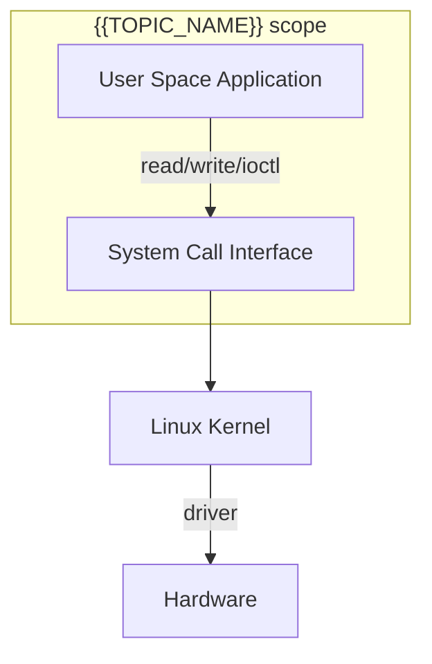
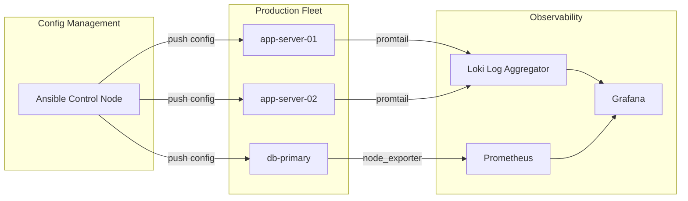
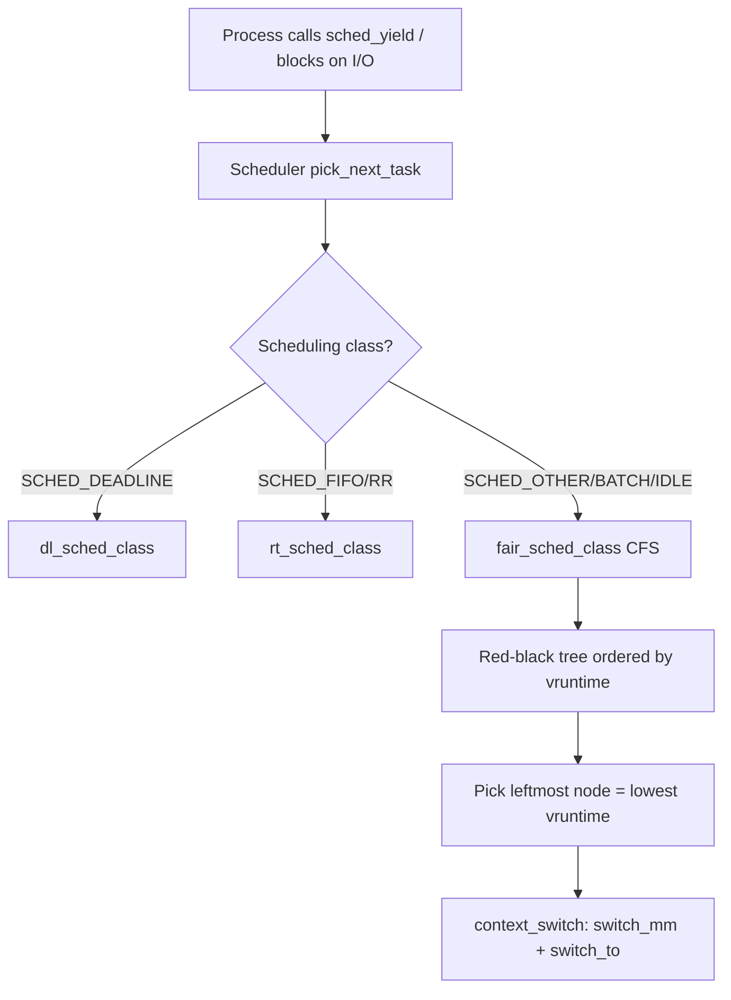
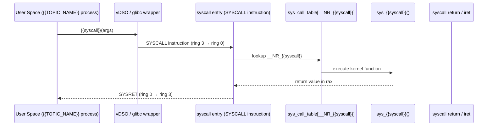
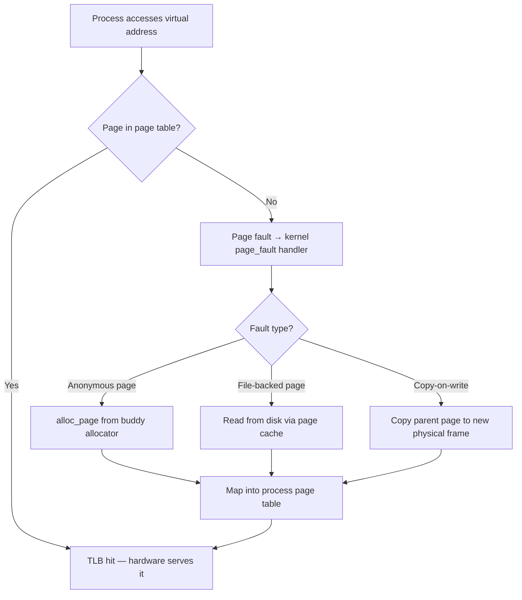

# Linux Roadmap — Universal Template

> This template guides content generation for **Linux** topics.
> Language: English | Code fence: ```bash (commands), ```text (config files)

## Universal Requirements
- 8 output files per topic: junior.md, middle.md, senior.md, professional.md, interview.md, tasks.md, find-bug.md, optimize.md
- Keep {{TOPIC_NAME}} placeholder throughout
- Include Mermaid diagrams in each template

---

# TEMPLATE 1 — `junior.md`

**Purpose:** Introduce {{TOPIC_NAME}} to someone new to Linux administration. Cover essential commands, file locations, and basic configuration. The reader should be able to use {{TOPIC_NAME}} confidently on a fresh server by the end.

---

## 1. What Is {{TOPIC_NAME}}?

> Provide a plain-English explanation (3–5 sentences). Describe what layer of the Linux system this concept belongs to (filesystem, networking, process management, security, etc.). Explain what goes wrong when this is misconfigured.

**Example definition block:**
```
{{TOPIC_NAME}} is the Linux mechanism that controls ...
It is managed through the files in {{/path/to/config}} and the command {{command}}.
Without proper {{TOPIC_NAME}} configuration, a system administrator would face ...
```

---

## 2. Core Concepts and Terminology

> List 6–8 key terms with one-sentence definitions. Use a table.

| Term | Definition |
|------|------------|
| Kernel | The core of the OS; manages hardware, memory, processes, and filesystems |
| Process | A running instance of a program, identified by a PID |
| Daemon | A background process (service) that runs without a controlling terminal |
| File descriptor | An integer handle that identifies an open file or socket for a process |
| Signal | An asynchronous notification sent to a process (e.g., SIGTERM, SIGKILL) |
| {{TOPIC_NAME}}-specific term | … |

---

## 3. Essential Commands

> Show the 8–12 most important commands for working with {{TOPIC_NAME}}. Include inline comments explaining what each flag does.

```bash
# Show current status of {{TOPIC_NAME}}
{{primary-command}} status

# Start / stop / restart a related service
systemctl start {{service-name}}
systemctl stop {{service-name}}
systemctl restart {{service-name}}

# Enable a service to start at boot
systemctl enable {{service-name}}

# View the last 50 lines of the system journal for this service
journalctl -u {{service-name}} -n 50 --no-pager

# Check open file descriptors / sockets
lsof -p {{pid}}

# Show process tree
pstree -p {{pid}}

# List all running processes with CPU/memory
ps aux | grep {{process-name}}
```

---

## 4. Key Configuration Files

> List and briefly describe the most important configuration files related to {{TOPIC_NAME}}.

```text
/etc/{{topic}}/{{topic}}.conf     — Main configuration file
/etc/{{topic}}/conf.d/            — Drop-in configuration snippets
/var/log/{{topic}}/{{topic}}.log  — Application log file
/var/run/{{topic}}.pid            — PID file (identifies the running daemon)
/etc/systemd/system/{{topic}}.service — systemd unit file
/proc/sys/{{subsystem}}/          — Kernel runtime parameters (sysctl)
```

**Reading a config file:**
```bash
# View the main config with line numbers
cat -n /etc/{{topic}}/{{topic}}.conf

# Validate config syntax before reloading (if the tool supports it)
{{command}} --test -c /etc/{{topic}}/{{topic}}.conf
```

---

## 5. Diagram — System Interaction

> Include a Mermaid diagram showing where {{TOPIC_NAME}} sits in the Linux system stack.



---

## 6. Configuration / Script Examples

> Provide a simple shell script a junior admin would write to set up or verify {{TOPIC_NAME}}.

```bash
#!/bin/bash
# setup-{{topic}}.sh — Install, configure, and verify {{TOPIC_NAME}}
# Usage: sudo bash setup-{{topic}}.sh

set -euo pipefail

SERVICE="{{service-name}}"
CONFIG="/etc/{{topic}}/{{topic}}.conf"

echo "=== Installing {{TOPIC_NAME}} ==="
apt-get update -q && apt-get install -y {{package-name}}

echo "=== Backing up default config ==="
cp "$CONFIG" "${CONFIG}.bak.$(date +%Y%m%d)"

echo "=== Applying configuration ==="
cat > "$CONFIG" << 'EOF'
# {{TOPIC_NAME}} configuration
# Generated by setup-{{topic}}.sh
{{key1}} = {{value1}}
{{key2}} = {{value2}}
EOF

echo "=== Starting and enabling service ==="
systemctl enable --now "$SERVICE"
systemctl status "$SERVICE" --no-pager

echo "=== Done. Verify with: journalctl -u $SERVICE -f ==="
```

---

## 7. Common Mistakes for Beginners

> List 5 frequent errors with explanation and fix.

- **Setting permissions to 777:** Never do `chmod 777 /path`; it grants write access to every user on the system. Use `chmod 644` for files and `chmod 755` for directories as a starting point.
- **Forgetting the shebang line:** A script without `#!/bin/bash` (or `#!/usr/bin/env bash`) may run under a different shell (e.g., `/bin/sh`) with different behavior.
- **Editing config without a backup:** Always `cp file file.bak` before editing critical config files.
- **Ignoring exit codes:** In shell scripts, use `set -euo pipefail` to abort on the first error.
- **Running everything as root:** Use `sudo` for individual commands; avoid interactive root shells for routine work.

---

## 8. Further Reading

- `man {{command}}` — built-in manual page
- `info {{command}}` — GNU info documentation (more detailed)
- `/usr/share/doc/{{package}}/` — installed package documentation
- [The Linux Documentation Project](https://tldp.org/)
- [Arch Wiki](https://wiki.archlinux.org/) — excellent for any distro

---

# TEMPLATE 2 — `middle.md`

**Purpose:** Help a practitioner with basic Linux experience work more effectively with {{TOPIC_NAME}}. Cover automation, diagnostic workflows, and configuration management patterns.

---

## 1. Recap and Production Context

> One paragraph grounding {{TOPIC_NAME}} in a production server environment. What operational risks exist? What patterns do experienced sysadmins use to manage it reliably?

---

## 2. Advanced Configuration Patterns

> Show 2–3 production-grade configuration examples with inline explanations.

**Pattern A — systemd unit file with hardening:**
```text
[Unit]
Description={{TOPIC_NAME}} service
After=network-online.target
Wants=network-online.target

[Service]
Type=simple
User={{service-user}}
Group={{service-group}}
ExecStart=/usr/bin/{{binary}} --config /etc/{{topic}}/{{topic}}.conf
ExecReload=/bin/kill -HUP $MAINPID
Restart=on-failure
RestartSec=5s

# Hardening
NoNewPrivileges=yes
ProtectSystem=strict
ProtectHome=yes
PrivateTmp=yes
ReadWritePaths=/var/lib/{{topic}} /var/log/{{topic}}

[Install]
WantedBy=multi-user.target
```

**Pattern B — logrotate configuration:**
```text
/var/log/{{topic}}/*.log {
    daily
    rotate 14
    compress
    delaycompress
    missingok
    notifempty
    sharedscripts
    postrotate
        systemctl reload {{service-name}} > /dev/null 2>&1 || true
    endscript
}
```

---

## 3. Troubleshooting and Incident Diagnosis

> Walk through the diagnostic ladder for {{TOPIC_NAME}} failures. Use a numbered runbook style.

```bash
# Step 1 — Check service health
systemctl status {{service-name}}

# Step 2 — Read recent journal entries (boot-to-now)
journalctl -u {{service-name}} --since "1 hour ago" --no-pager

# Step 3 — Check open file descriptors (FD leak?)
ls -la /proc/{{pid}}/fd | wc -l

# Step 4 — Inspect process memory maps
cat /proc/{{pid}}/status | grep -E 'VmRSS|VmSwap|Threads'

# Step 5 — Trace system calls in real time (low-level debugging)
strace -p {{pid}} -e trace=network,file -f 2>&1 | head -100

# Step 6 — Check kernel ring buffer for hardware/driver errors
dmesg --level=err,warn --since "1 hour ago"

# Step 7 — Audit recent file changes
find /etc/{{topic}} -newer /etc/{{topic}}/{{topic}}.conf.bak -ls
```

---

## 4. Automation with Shell and Ansible

> Show how to manage {{TOPIC_NAME}} at scale across multiple hosts.

```bash
#!/bin/bash
# bulk-config-push.sh — Update {{TOPIC_NAME}} config on a list of hosts
# Requires: ssh key-based auth, same config for all hosts

HOSTS_FILE="./hosts.txt"
CONFIG_SRC="./{{topic}}.conf"
REMOTE_PATH="/etc/{{topic}}/{{topic}}.conf"

while IFS= read -r host; do
    echo "Pushing config to $host..."
    scp "$CONFIG_SRC" "root@${host}:${REMOTE_PATH}"
    ssh "root@${host}" "systemctl reload {{service-name}} && echo OK"
done < "$HOSTS_FILE"
```

---

## 5. Diagram — Diagnostic Flow

```mermaid
flowchart TD
    A[Service not responding] --> B{systemctl status}
    B -- active/running --> C[Check application logs]
    B -- failed --> D[journalctl -xe]
    D --> E{Error message?}
    E -- config error --> F[Fix /etc/{{topic}}/{{topic}}.conf]
    E -- port conflict --> G[ss -tlnp | grep PORT]
    E -- permission denied --> H[Check file ownership and SELinux/AppArmor]
    C --> I{Log shows error?}
    I -- Yes --> J[Trace with strace or ltrace]
    I -- No --> K[Check network: ss, tcpdump]
    F --> L[systemctl restart {{service-name}}]
    G --> L
    H --> L
```

---

## 6. Error Handling and Incident Response

> Cover the top failure modes and their runbooks.

| Failure Mode | Symptom | Command to Diagnose | Fix |
|---|---|---|---|
| OOM kill | Process restarts, dmesg shows "Out of memory: Kill process" | `dmesg | grep -i oom` | Increase memory limits or fix memory leak |
| File descriptor exhaustion | "Too many open files" error | `cat /proc/{{pid}}/limits` | Raise `LimitNOFILE` in systemd unit |
| Zombie processes | `Z` state in `ps aux` | `ps aux | awk '$8=="Z"'` | Kill parent process or reap properly |
| Disk full | Write errors, log stops | `df -h && du -sh /var/log/*` | Rotate logs, expand volume |
| SELinux denial | Permission denied despite correct UNIX perms | `ausearch -m avc -ts recent` | `audit2allow` or set correct context |

---

## 7. Comparison with Alternative Tools / Approaches

| Dimension | Linux Native ({{TOPIC_NAME}}) | Containerized Equivalent | Cloud-Managed Service |
|---|---|---|---|
| Control | Full | Partial (host exposed) | Minimal |
| Debugging depth | Kernel-level (strace, eBPF) | Container-scoped | Log-based only |
| Automation | Ansible, Chef, Puppet | Kubernetes operators | Terraform |
| Portability | Distro-dependent | Image-portable | Provider-specific |
| Audit trail | auditd, journald | Container logs | CloudTrail / Stackdriver |

---

# TEMPLATE 3 — `senior.md`

**Purpose:** Target engineers who manage {{TOPIC_NAME}} at scale in production Linux environments. Cover hardening, kernel tuning, multi-host orchestration, and cost-aware infrastructure decisions.

---

## 1. Architecture Considerations

> Describe how {{TOPIC_NAME}} fits into a fleet of servers. Cover configuration management strategy, centralized logging, and HA patterns.



---

## 2. Security Hardening

> Provide a production hardening checklist for {{TOPIC_NAME}} on Linux.

```bash
# Disable unnecessary SUID binaries
find / -perm /4000 -type f 2>/dev/null | tee /tmp/suid-audit.txt

# Restrict core dumps (avoid memory disclosure)
echo "* hard core 0" >> /etc/security/limits.conf
echo "fs.suid_dumpable=0" >> /etc/sysctl.d/99-hardening.conf

# Enable and configure auditd rules for {{TOPIC_NAME}}
cat >> /etc/audit/rules.d/{{topic}}.rules << 'EOF'
# Monitor writes to {{TOPIC_NAME}} config
-w /etc/{{topic}}/ -p wa -k {{topic}}_config_change
# Monitor execution of {{TOPIC_NAME}} binary
-a always,exit -F path=/usr/bin/{{binary}} -F perm=x -k {{topic}}_exec
EOF
augenrules --load
```

```text
# /etc/security/limits.d/{{topic}}.conf
{{service-user}} soft nofile 65536
{{service-user}} hard nofile 131072
{{service-user}} soft nproc 4096
{{service-user}} hard nproc 8192
```

---

## 3. Kernel Tuning for {{TOPIC_NAME}}

```bash
# Apply kernel parameters relevant to {{TOPIC_NAME}} workloads
cat > /etc/sysctl.d/99-{{topic}}.conf << 'EOF'
# Network tuning (for high-throughput services)
net.core.somaxconn = 65535
net.ipv4.tcp_max_syn_backlog = 65535
net.core.netdev_max_backlog = 5000

# Memory management
vm.swappiness = 10
vm.dirty_ratio = 15
vm.dirty_background_ratio = 5

# File descriptor limits
fs.file-max = 2097152
fs.inotify.max_user_watches = 524288
EOF
sysctl --system
```

---

## 4. High Availability Patterns

> Describe HA configurations for {{TOPIC_NAME}}, including active-passive and active-active setups.

```bash
# Keepalived VIP configuration for active-passive HA
cat > /etc/keepalived/keepalived.conf << 'EOF'
vrrp_instance VI_1 {
    state MASTER
    interface eth0
    virtual_router_id 51
    priority 100
    advert_int 1
    authentication {
        auth_type PASS
        auth_pass {{vrrp-password}}
    }
    virtual_ipaddress {
        {{virtual-ip}}/24
    }
    track_script {
        chk_{{topic}}
    }
}
vrrp_script chk_{{topic}} {
    script "/usr/bin/systemctl is-active {{service-name}}"
    interval 2
    weight -20
}
EOF
```

---

## 5. Centralized Logging and Alerting

```bash
# rsyslog forwarding rule — ship {{TOPIC_NAME}} logs to central syslog
cat > /etc/rsyslog.d/30-{{topic}}.conf << 'EOF'
# Tag and forward {{TOPIC_NAME}} logs
if $programname == '{{process-name}}' then {
    action(type="omfwd"
           target="{{syslog-server}}"
           port="514"
           protocol="tcp"
           action.resumeRetryCount="100")
    stop
}
EOF
```

---

# TEMPLATE 4 — `professional.md`

# {{TOPIC_NAME}} — Infrastructure Internals

**Purpose:** Target kernel engineers and platform architects who need deep understanding of how Linux implements {{TOPIC_NAME}} at the kernel level: the kernel scheduler, syscall paths, eBPF instrumentation, procfs internals, and memory management subsystems.

---

## 1. Kernel Scheduler Internals

> Explain how the Linux CFS (Completely Fair Scheduler) and real-time schedulers interact with {{TOPIC_NAME}} processes. Cover scheduling classes, vruntime, and cgroup CPU accounting.



```bash
# Inspect scheduling policy and priority of a {{TOPIC_NAME}} process
chrt -p {{pid}}

# Set real-time priority (SCHED_FIFO) for latency-critical {{TOPIC_NAME}} work
chrt -f -p 50 {{pid}}

# Read per-process scheduler stats from procfs
cat /proc/{{pid}}/schedstat

# Read CFS bandwidth throttle statistics
cat /sys/fs/cgroup/cpu/{{cgroup-path}}/cpu.stat
```

---

## 2. Syscall Path for {{TOPIC_NAME}} Operations

> Trace the exact path from a userspace call into the kernel and back, including the context switch, system call table dispatch, and return path.



```bash
# Count syscalls made by a running {{TOPIC_NAME}} process
strace -cp {{pid}} -e trace={{syscall1}},{{syscall2}} -- sleep 10

# Audit syscall frequency with perf
perf stat -e syscalls:sys_enter_{{syscall}} -p {{pid}} sleep 5
```

---

## 3. eBPF Instrumentation of {{TOPIC_NAME}}

> Show how to attach eBPF programs to observe and trace {{TOPIC_NAME}} behavior without modifying the process or rebooting the kernel.

```bash
# Trace all open() calls by the {{TOPIC_NAME}} process (bpftrace)
bpftrace -e '
tracepoint:syscalls:sys_enter_openat
/pid == {{pid}}/
{
    printf("open: %s\n", str(args->filename));
}'

# Profile CPU flame graph for {{TOPIC_NAME}} (10 seconds at 99Hz)
perf record -F 99 -p {{pid}} -g -- sleep 10
perf script | stackcollapse-perf.pl | flamegraph.pl > {{topic}}-flamegraph.svg

# Trace TCP connect events initiated by {{TOPIC_NAME}}
bpftrace -e '
kprobe:tcp_connect
/pid == {{pid}}/
{
    printf("connect to %s:%d\n",
        ntop(AF_INET, ((struct sock *)arg0)->__sk_common.skc_daddr),
        ((struct sock *)arg0)->__sk_common.skc_dport);
}'
```

---

## 4. procfs Internals

> Explain the virtual filesystem entries most relevant to {{TOPIC_NAME}} and what data each exposes.

```bash
# Memory breakdown
cat /proc/{{pid}}/smaps_rollup    # Aggregated memory usage (PSS, RSS, swap)
cat /proc/{{pid}}/maps            # Virtual memory areas (VMAs) with permissions
cat /proc/{{pid}}/numa_maps       # NUMA node allocation per VMA

# File descriptor table
ls -la /proc/{{pid}}/fd           # All open FDs (symlinks to targets)
cat /proc/{{pid}}/fdinfo/{{fd}}   # File offset, flags for a specific FD

# Network state
cat /proc/{{pid}}/net/tcp         # TCP socket table (hex addresses)
cat /proc/{{pid}}/net/sockstat    # Summary of socket usage

# Cgroup membership
cat /proc/{{pid}}/cgroup          # Which cgroups this process belongs to

# Kernel limits applied to this process
cat /proc/{{pid}}/limits          # RLIMIT_* values (soft and hard)
```

---

## 5. Memory Management Subsystem

> Cover the kernel memory path relevant to {{TOPIC_NAME}}: page fault handling, huge pages, the slab allocator, and OOM scoring.



```bash
# Check OOM score for {{TOPIC_NAME}} process (higher = more likely to be killed)
cat /proc/{{pid}}/oom_score
cat /proc/{{pid}}/oom_score_adj

# Adjust OOM score (range: -1000 to 1000; -1000 = never kill)
echo -500 > /proc/{{pid}}/oom_score_adj

# Enable transparent huge pages for {{TOPIC_NAME}} workloads
echo always > /sys/kernel/mm/transparent_hugepage/enabled

# Check NUMA memory allocation stats
numastat -p {{pid}}
```

---

# TEMPLATE 5 — `interview.md`

**Purpose:** Prepare engineers for Linux-focused technical interviews covering {{TOPIC_NAME}} at all experience levels.

---

## Junior-Level Questions

**Q1: What is the difference between a process and a thread in Linux?**
> Expected answer: A process has its own virtual address space, file descriptor table, and credentials. Threads (created via `clone()` with `CLONE_VM`) share the address space and FD table of the parent. From the kernel's perspective, both are `task_struct` entries; threads just share resources with their siblings.

**Q2: How do you find which process is using a specific port?**
> Expected answer: `ss -tlnp | grep :{{port}}` or `lsof -i :{{port}}`. These show the PID and process name bound to the port.

**Q3: What is the purpose of `/etc/fstab`?**
> Expected answer: It defines filesystems to mount at boot, their mount points, type, options, and whether to include them in `dump`/`fsck` passes. Entries are processed by `mount -a` during the boot sequence.

---

## Mid-Level Questions

**Q4: Explain the difference between a hard link and a symbolic (soft) link.**
> Expected answer: A hard link is a directory entry pointing to the same inode (same data, same inode number). A symlink is a file whose contents are a path to another file (different inode). Hard links cannot span filesystems or link to directories; symlinks can.

**Q5: A process shows high CPU usage but `top` shows it is in `D` state. What does this mean and how do you investigate?**
> Expected answer: `D` (uninterruptible sleep) means the process is waiting for I/O and cannot be killed with signals. Investigate with `iostat -xz 1`, `iotop`, and `dmesg` for disk/NFS errors. The process is blocked in a kernel I/O path.

**Q6: How does `iptables` differ from `nftables`?**
> Expected answer: `iptables` uses a table/chain/rule model with separate tools per protocol (iptables, ip6tables, arptables, ebtables). `nftables` unifies all these in a single framework with a cleaner rule syntax, better performance (no linear rule scanning in some cases), and atomic ruleset updates.

---

## Senior-Level Questions

**Q7: Describe how Linux cgroups v2 improves resource management over cgroups v1.**
> Expected answer: cgroupsv2 introduces a unified hierarchy (one tree, all controllers), proper delegation for unprivileged containers, the "pressure stall information" (PSI) interface for resource pressure monitoring, and a memory controller that correctly accounts for both anonymous and page cache memory. cgroupsv1 had multiple parallel hierarchies causing inconsistencies.

**Q8: How would you diagnose a gradual memory leak in a long-running {{TOPIC_NAME}} service without restarting it?**
> Expected answer: Use `smaps_rollup` to track RSS growth over time, `/proc/{{pid}}/maps` to identify growing VMAs, `valgrind --leak-check=full` (if restart is acceptable), or `heaptrack`/`bpftrace` for live tracing. Compare PSS over time; if anonymous memory grows unboundedly, check `malloc` arenas with `malloc_info()` or `jemalloc` stats.

---

## System Design Question

**Q9: Design a secure, observable Linux fleet management system for 1,000 servers running {{TOPIC_NAME}}.**
> Talking points: Ansible/SaltStack for config management (idempotent, version-controlled), Hashicorp Vault for secrets distribution, centralized syslog (rsyslog → Loki), Prometheus + node_exporter for metrics, auditd + Falco for runtime security, read-only root filesystems where possible, SSH Certificate Authority instead of key distribution, regular CIS benchmark scanning (Lynis, OpenSCAP).

---

# TEMPLATE 6 — `tasks.md`

**Purpose:** Provide progressive hands-on exercises for mastering {{TOPIC_NAME}} on Linux, from basic command practice to production incident simulation.

---

## Task 1 — Initial Setup and Verification (Junior)

**Objective:** Install and verify {{TOPIC_NAME}} on a fresh Linux server.

```bash
# 1. Install the package
sudo apt-get update && sudo apt-get install -y {{package-name}}

# 2. Verify the binary is in PATH
which {{binary}} && {{binary}} --version

# 3. Start and enable the service
sudo systemctl enable --now {{service-name}}

# 4. Confirm the service is active
systemctl is-active {{service-name}}

# 5. Check listening ports
ss -tlnp | grep {{binary}}
```

**Acceptance criteria:** `systemctl is-active {{service-name}}` returns `active`.

---

## Task 2 — Write a Configuration and Reload (Junior/Middle)

**Objective:** Modify the configuration file and reload without downtime.

Steps:
1. Back up the current config: `cp /etc/{{topic}}/{{topic}}.conf /etc/{{topic}}/{{topic}}.conf.bak`
2. Edit the config to change `{{key}}` to `{{new-value}}`.
3. Validate: `{{binary}} -t -c /etc/{{topic}}/{{topic}}.conf`
4. Reload: `sudo systemctl reload {{service-name}}`
5. Confirm no downtime: check the service was never in `inactive` or `failed` state with `journalctl -u {{service-name}} --since "1 min ago"`.

---

## Task 3 — Write a Bash Monitoring Script (Middle)

**Objective:** Write a script that monitors {{TOPIC_NAME}} and sends an alert if it goes down.

```bash
#!/bin/bash
# monitor-{{topic}}.sh — Alert if {{TOPIC_NAME}} is not responding
# Cron: */1 * * * * /usr/local/bin/monitor-{{topic}}.sh

SERVICE="{{service-name}}"
ALERT_EMAIL="ops@example.com"
LOG="/var/log/{{topic}}-monitor.log"

if ! systemctl is-active --quiet "$SERVICE"; then
    echo "$(date): $SERVICE is DOWN — attempting restart" | tee -a "$LOG"
    systemctl restart "$SERVICE"
    echo "$(date): Restart attempted" | mail -s "ALERT: $SERVICE down on $(hostname)" "$ALERT_EMAIL"
else
    echo "$(date): $SERVICE OK" >> "$LOG"
fi
```

---

## Task 4 — Kernel Parameter Tuning (Senior)

**Objective:** Measure and tune kernel parameters that affect {{TOPIC_NAME}} performance.

```bash
# Record baseline metrics
vmstat 1 10 > /tmp/vmstat-before.txt
iostat -xz 1 10 > /tmp/iostat-before.txt

# Apply tuning
sudo sysctl -w vm.swappiness=10
sudo sysctl -w net.core.somaxconn=65535

# Run your load test here
# ...

# Record after metrics
vmstat 1 10 > /tmp/vmstat-after.txt
diff /tmp/vmstat-before.txt /tmp/vmstat-after.txt
```

---

## Task 5 — eBPF Trace a Live Process (Professional)

**Objective:** Use bpftrace to observe {{TOPIC_NAME}} system calls in real time without modifying the process.

```bash
# Trace file opens and their latency
sudo bpftrace -e '
kprobe:do_sys_openat2 /comm == "{{process-name}}"/ { @start[tid] = nsecs; }
kretprobe:do_sys_openat2 /comm == "{{process-name}}"/ {
    @latency_ns = hist(nsecs - @start[tid]);
    delete(@start[tid]);
}'

# Run for 30 seconds, then Ctrl+C to see histogram
```

---

# TEMPLATE 7 — `find-bug.md`

**Purpose:** Present realistic Linux configuration and script bugs for the reader to identify and fix. Each scenario models a common production mistake.

---

## Bug 1 — World-Writable File Permissions (777)

**Scenario:** A junior admin made a script executable quickly before a deadline. A security audit flags the server two weeks later.

**Buggy command:**
```bash
chmod 777 /usr/local/bin/{{topic}}-agent.sh
# BUG: World-writable — any user can overwrite this script
# If run by root via cron, this is a privilege escalation vector
```

**What to find:** `rwxrwxrwx` on an executable script run by a privileged user or cron allows any local user to replace the script content and escalate privileges.

**Fix:**
```bash
# Owned by root, executable by owner and group only
chown root:root /usr/local/bin/{{topic}}-agent.sh
chmod 755 /usr/local/bin/{{topic}}-agent.sh
# Or if only root needs to execute it:
chmod 700 /usr/local/bin/{{topic}}-agent.sh
```

**Detection command:**
```bash
find /usr/local/bin /etc/cron.d /etc/cron.daily -perm -o+w -type f 2>/dev/null
```

---

## Bug 2 — Missing Shebang Line

**Scenario:** A cron job silently produces wrong output. The script works when run manually as bash but fails in cron.

**Buggy script:**
```bash
# /usr/local/bin/{{topic}}-backup.sh
# BUG: No shebang — cron will execute this under /bin/sh
# which may not support bash arrays, [[ ]], or process substitution

DIRS=("/var/lib/{{topic}}" "/etc/{{topic}}")
for dir in "${DIRS[@]}"; do
    tar -czf "/backup/$(basename $dir).tar.gz" "$dir"
done
```

**What to find:** Without `#!/bin/bash`, the script is run by `/bin/sh` (usually dash on Debian/Ubuntu), which does not support bash arrays. The backup silently fails or produces garbage output.

**Fix:**
```bash
#!/bin/bash           # Add this as the very first line
# /usr/local/bin/{{topic}}-backup.sh
set -euo pipefail     # Also add: abort on error, undefined var, pipe failure
```

---

## Bug 3 — Zombie Process from Missing wait()

**Scenario:** A monitoring script spawns child processes but never reaps them. After weeks, the process table fills with `Z` state entries.

**Buggy script:**
```bash
#!/bin/bash
# BUG: Background jobs are never waited for — they become zombies
while true; do
    check_{{topic}}_health &   # Spawns child, never calls wait
    sleep 60
done
```

**What to find:** Background child processes complete but their exit status is never collected (`wait` not called). The kernel keeps their `task_struct` alive as a zombie until the parent collects them.

**Fix:**
```bash
#!/bin/bash
while true; do
    check_{{topic}}_health &
    wait $!   # Wait for the most recent background job to complete
    sleep 60
done
```

---

## Bug 4 — Blocking I/O in Signal Handler

**Scenario:** A service intermittently hangs for 30 seconds when receiving SIGHUP for config reload. Under high load it sometimes deadlocks.

**Buggy code concept:**
```bash
# BUG: Signal handler does blocking I/O — reads a config file inside the handler
# Signal handlers must be async-signal-safe; file I/O is not

trap 'reload_config_from_disk' SIGHUP   # reload_config_from_disk calls read()
```

**What to find:** POSIX requires signal handlers to only call async-signal-safe functions. File I/O (`read`, `open`, `fopen`) is not async-signal-safe. If the main loop was inside a `malloc()` call when the signal arrived, the handler's file read may call `malloc` again, deadlocking on the allocator mutex.

**Fix:** Set a flag in the signal handler; perform the actual reload in the main loop.

```bash
# Correct pattern: set flag, handle in main loop
RELOAD_REQUESTED=0
trap 'RELOAD_REQUESTED=1' SIGHUP

while true; do
    if [[ "$RELOAD_REQUESTED" -eq 1 ]]; then
        reload_config_from_disk
        RELOAD_REQUESTED=0
    fi
    do_work
done
```

---

# TEMPLATE 8 — `optimize.md`

**Purpose:** Guide Linux administrators through measuring and improving {{TOPIC_NAME}} performance, from process-level profiling to kernel tuning. All optimizations follow a before/after measurement discipline.

---

## 1. Baseline Measurement

> Capture all relevant metrics before making any changes.

```bash
# CPU and I/O overview
vmstat 1 30 | tee /tmp/baseline-vmstat.txt
iostat -xz 1 30 | tee /tmp/baseline-iostat.txt

# Process-specific resource usage
pidstat -u -r -d -p {{pid}} 1 30 | tee /tmp/baseline-pidstat.txt

# Memory breakdown
cat /proc/{{pid}}/smaps_rollup | tee /tmp/baseline-smaps.txt

# System-wide latency histogram (requires perf)
perf stat -p {{pid}} sleep 30 2>&1 | tee /tmp/baseline-perf.txt
```

**Baseline table (fill in before optimizing):**

| Metric | Before | After |
|--------|--------|-------|
| CPU utilization % | _% | _% |
| Memory RSS | _ MB | _ MB |
| Disk I/O wait % | _% | _% |
| Syscalls/sec | _ | _ |
| Context switches/sec | _ | _ |
| Monthly infra cost | $_ | $_ |
| Resource utilization % | _% | _% |

---

## 2. CPU Optimization

```bash
# Generate a CPU flame graph to identify hot functions
perf record -F 99 -p {{pid}} -g -- sleep 30
perf script | /opt/FlameGraph/stackcollapse-perf.pl | \
  /opt/FlameGraph/flamegraph.pl > /tmp/{{topic}}-cpu.svg

# Pin {{TOPIC_NAME}} process to specific CPU cores (reduce cache misses)
taskset -cp 0,1 {{pid}}

# Or use cgroup cpuset for permanent pinning
echo "0-1" > /sys/fs/cgroup/cpuset/{{topic}}/cpuset.cpus
echo {{pid}} > /sys/fs/cgroup/cpuset/{{topic}}/tasks
```

---

## 3. Memory Optimization

```bash
# Identify memory-hungry VMAs
cat /proc/{{pid}}/smaps | awk '/^[0-9a-f]/{vma=$0} /^Pss:/{print $2, vma}' \
  | sort -rn | head -20

# Enable huge pages for the process (reduces TLB pressure)
echo madvise > /sys/kernel/mm/transparent_hugepage/enabled
# In application code: madvise(addr, len, MADV_HUGEPAGE)

# Drop page cache if memory pressure is causing swapping
sync && echo 1 > /proc/sys/vm/drop_caches   # Use only in non-production diagnosis
```

---

## 4. I/O Optimization

```bash
# Identify the I/O scheduler used by the storage device
cat /sys/block/{{device}}/queue/scheduler

# Switch to deadline (better for databases) or none (NVMe)
echo deadline > /sys/block/{{device}}/queue/scheduler

# Use ionice to raise I/O priority for {{TOPIC_NAME}}
ionice -c 1 -n 0 -p {{pid}}   # Class 1 = real-time, priority 0 = highest

# Read-ahead tuning (increase for sequential workloads)
blockdev --setra 4096 /dev/{{device}}
```

---

## 5. Network Optimization

```bash
# Enable TCP BBR congestion control (better throughput on lossy networks)
echo "net.core.default_qdisc=fq" >> /etc/sysctl.d/99-{{topic}}.conf
echo "net.ipv4.tcp_congestion_control=bbr" >> /etc/sysctl.d/99-{{topic}}.conf
sysctl --system

# Increase socket buffer sizes for high-throughput {{TOPIC_NAME}} workloads
sysctl -w net.core.rmem_max=134217728
sysctl -w net.core.wmem_max=134217728
sysctl -w net.ipv4.tcp_rmem="4096 87380 134217728"
sysctl -w net.ipv4.tcp_wmem="4096 65536 134217728"
```

---

## 6. After Measurement and Sign-Off

```bash
# Re-run all baseline commands and compare
pidstat -u -r -d -p {{pid}} 1 30 | tee /tmp/after-pidstat.txt
diff /tmp/baseline-pidstat.txt /tmp/after-pidstat.txt

# Regression test — confirm no error rate increase
journalctl -u {{service-name}} --since "1 hour ago" | grep -c ERROR
```

> Sign-off checklist:
> - [ ] CPU utilization reduced by target %
> - [ ] Memory RSS stable (no growth trend)
> - [ ] I/O wait % below threshold
> - [ ] Flame graph hot path addressed
> - [ ] Kernel parameters persisted to `/etc/sysctl.d/`
> - [ ] No new errors in journal post-optimization
