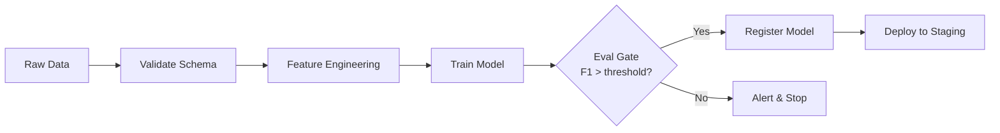
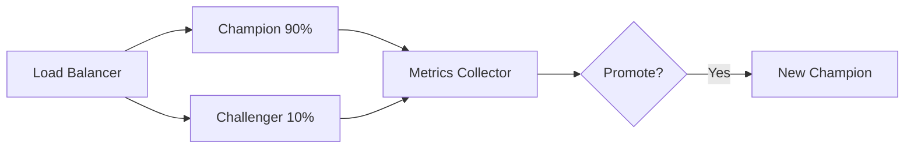
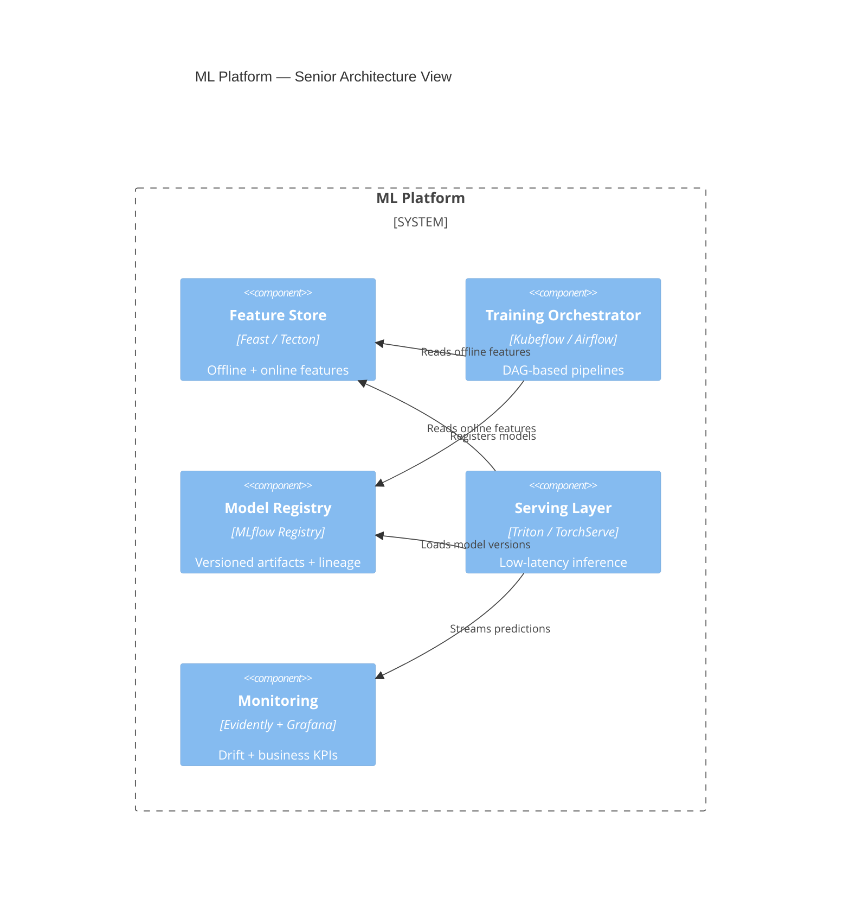
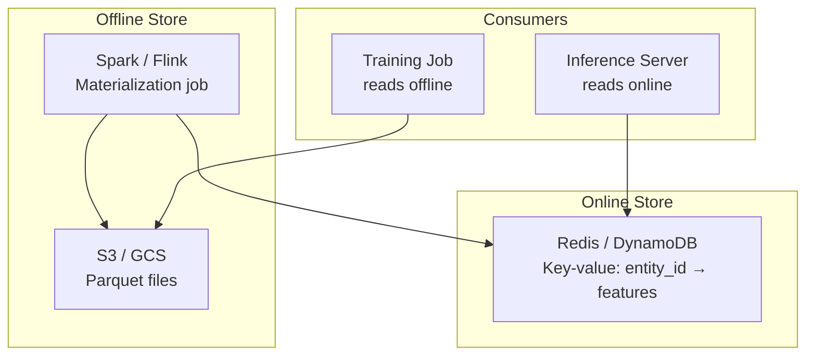
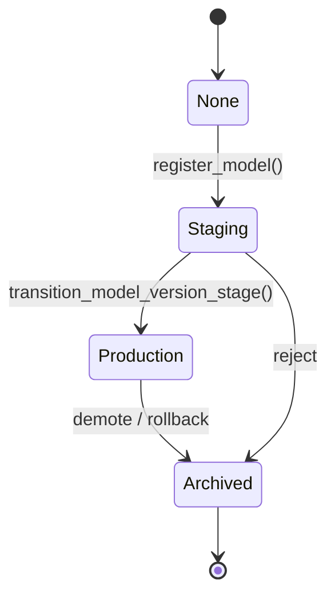
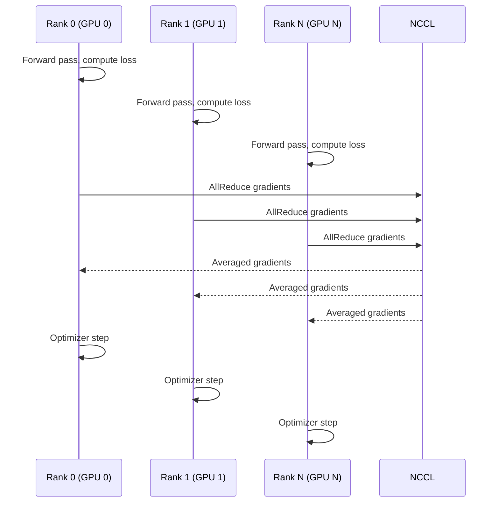

# MLOps Roadmap — Universal Template

> **A comprehensive template system for generating MLOps roadmap content across all skill levels.**

---

## Overview

| | Description |
|---|---|
| **Purpose** | Universal template for all MLOps roadmap topics |
| **Files per topic** | 8 files: `junior.md`, `middle.md`, `senior.md`, `professional.md`, `interview.md`, `tasks.md`, `find-bug.md`, `optimize.md` |
| **Language** | All content must be generated in **English** |
| **Table of Contents** | **Optional** — include only if relevant to the topic. For practice files (`tasks.md`, `find-bug.md`, `optimize.md`) it is NOT required |

### Topic Structure

```
XX-topic-name/
├── junior.md          ← "What?" and "How?"
├── middle.md          ← "Why?" and "When?"
├── senior.md          ← "How to optimize?" and "How to architect?"
├── professional.md    ← "Under the Hood" — ML platform and infrastructure internals
├── interview.md       ← Interview prep across all levels
├── tasks.md           ← Hands-on practice tasks
├── find-bug.md        ← Find and fix bugs in ML pipelines (10+ exercises)
└── optimize.md        ← Optimize slow/inefficient ML workloads (10+ exercises)
```

---

## Level Comparison Matrix

| Aspect | Junior | Middle | Senior | Professional |
|:------:|:------:|:------:|:------:|:------------:|
| **Depth** | Basic concepts, simple pipeline steps | Practical usage, CI/CD for ML | Architecture, platform design | Feature store internals, distributed training |
| **Code** | Simple training scripts | Production pipeline configs | Multi-stage orchestration | Distributed training coordination, serving infra |
| **Tricky Points** | Overfitting, missing validation splits | Training/serving skew, data drift | Model versioning, reproducibility | Distributed gradient sync, memory layout, GPU scheduling |
| **Focus** | "What?" and "How?" | "Why?" and "When?" | "How to scale and govern?" | "What happens inside the ML platform?" |

---
---

# TEMPLATE 1 — `junior.md`

<details open>
<summary><strong>Template Content</strong></summary>

# {{TOPIC_NAME}} — Junior Level

## Table of Contents

1. [Introduction](#introduction)
2. [Prerequisites](#prerequisites)
3. [Glossary](#glossary)
4. [Core Concepts](#core-concepts)
5. [Real-World Analogies](#real-world-analogies)
6. [Mental Models](#mental-models)
7. [Pros & Cons](#pros--cons)
8. [Use Cases](#use-cases)
9. [Query Examples](#query-examples)
10. [Error Handling](#error-handling)
11. [Security Considerations](#security-considerations)
12. [Performance Tips](#performance-tips)
13. [Best Practices](#best-practices)
14. [Edge Cases & Pitfalls](#edge-cases--pitfalls)
15. [Common Mistakes](#common-mistakes)
16. [Tricky Points](#tricky-points)
17. [Test](#test)
18. [Cheat Sheet](#cheat-sheet)
19. [Summary](#summary)
20. [What You Can Build](#what-you-can-build)
21. [Further Reading](#further-reading)

---

## Introduction

> Focus: "What is it?" and "How to use it?"

Brief explanation of what {{TOPIC_NAME}} is in the context of MLOps and why a beginner needs to know it.
Keep it simple — assume the reader knows basic Python and has trained at least one ML model, but is new to production ML workflows.

---

## Prerequisites

- **Required:** Basic Python — {{TOPIC_NAME}} configs and pipelines are primarily Python-driven
- **Required:** Familiarity with scikit-learn or PyTorch — understanding model training loops
- **Helpful but not required:** Basic Docker knowledge — many MLOps tools run as containers

---

## Glossary

| Term | Definition |
|------|-----------|
| **Pipeline** | A sequence of automated steps: data ingestion → training → evaluation → deployment |
| **Model Registry** | A versioned store for trained model artifacts and their metadata |
| **Feature Store** | A centralized repository for ML features shared across training and serving |
| **Data Drift** | When the statistical distribution of live data diverges from training data |
| **{{Term 5}}** | Simple, one-sentence definition |
| **{{Term 6}}** | Simple, one-sentence definition |
| **{{Term 7}}** | Simple, one-sentence definition |

---

## Core Concepts

### Concept 1: {{name}}

Simple explanation with analogy if helpful.

### Concept 2: {{name}}

...

> - Each concept explained in 3-5 sentences max.
> - Use bullet points for lists.
> - Include small code snippets inline where needed.

---

## Real-World Analogies

| Concept | Analogy |
|---------|--------|
| **ML Pipeline** | Like an assembly line — each station does one job; if one breaks, the whole line stops |
| **Model Registry** | Like a library catalog — every book (model) is catalogued with version, author, and shelf location |
| **Feature Store** | Like a shared ingredient pantry — a data scientist and an engineer both use the same pre-washed carrots |
| **{{Concept 4}}** | {{Analogy}} |

---

## Mental Models

**The intuition:** {{A simple mental model about how {{TOPIC_NAME}} fits into the broader ML lifecycle}}

**Why this model helps:** {{Why visualizing it this way prevents common production mistakes}}

---

## Pros & Cons

| Pros | Cons |
|------|------|
| Reproducible experiments | Steep initial setup cost |
| Automated retraining on drift | Requires dedicated infrastructure |
| Auditability and lineage tracking | Team must adopt new tooling and workflows |

### When to use:
- {{Scenario where this MLOps practice genuinely speeds up ML delivery}}

### When NOT to use:
- {{Scenario where a simpler ad-hoc approach is better — e.g., one-off research projects}}

---

## Use Cases

- **Continuous Training:** Automatically retrain when data drift is detected
- **A/B Model Deployment:** Route traffic between champion and challenger models
- **{{Use Case 3}}:** {{Brief description}}
- **{{Use Case 4}}:** {{Brief description}}

---

## Code Examples

```python
# {{TOPIC_NAME}} — minimal working example
import mlflow

mlflow.set_experiment("{{TOPIC_NAME}}-experiment")

with mlflow.start_run():
    # Train your model here
    accuracy = 0.92  # placeholder
    mlflow.log_metric("accuracy", accuracy)
    mlflow.sklearn.log_model(model, "model")
```

```yaml
# Example pipeline config (e.g., Kubeflow or ZenML)
pipeline:
  name: "{{topic_name}}_pipeline"
  steps:
    - name: ingest
      image: python:3.11
    - name: train
      image: python:3.11
    - name: evaluate
      image: python:3.11
```

---

## Error Handling

- Always validate input data schema before training begins
- Log training errors with full stack traces to your experiment tracker
- Use try/except around model serialization — corrupted artifacts are hard to debug later

---

## Security Considerations

- Do not log raw PII features to your experiment tracker
- Restrict write access to the model registry to CI/CD service accounts
- Scan model artifacts for dependency vulnerabilities before deployment

---

## Performance Tips

- Cache preprocessed feature datasets to avoid recomputing on every run
- Use columnar formats (Parquet, Arrow) for feature storage
- Profile your training script before scaling to a cluster

---

## Best Practices

- Pin library versions in `requirements.txt` for reproducibility
- Log all hyperparameters, not just the ones you tuned
- Tag every model with the Git commit SHA that produced it

---

## Edge Cases & Pitfalls

- **Class imbalance not handled before logging metrics** — accuracy looks high but recall is 0
- **Feature computed differently at train vs. serve time** — silent model degradation
- **{{Pitfall 3}}** — {{brief explanation}}

---

## Common Mistakes

- Forgetting to set a random seed — makes experiments non-reproducible
- Evaluating on training data — inflated metrics
- Not versioning data — can't reproduce a result from 3 months ago

---

## Tricky Points

- {{Tricky behavior 1 specific to {{TOPIC_NAME}}}}
- {{Tricky behavior 2}}

---

## Test

Short self-check questions (no answers — test your own understanding):

1. What is the difference between a model registry and a model store?
2. Name three things you should log to an experiment tracker.
3. What is training/serving skew and how does it manifest?
4. {{Question 4}}
5. {{Question 5}}

---

## Cheat Sheet

| Task | Command / Snippet |
|------|------------------|
| Start MLflow UI | `mlflow ui` |
| Log a parameter | `mlflow.log_param("lr", 0.01)` |
| Log a metric | `mlflow.log_metric("f1", 0.88)` |
| Register model | `mlflow.register_model(...)` |
| {{Task 5}} | {{snippet}} |

---

## Summary

{{TOPIC_NAME}} at the junior level is about understanding the core loop: data → features → train → evaluate → register → serve. Focus on reproducibility, logging, and not breaking the pipeline.

---

## What You Can Build

- A reproducible training script that logs to MLflow
- A simple Makefile-based pipeline: `make train && make evaluate && make push`
- {{Project 3}}

---

## Further Reading

- [MLflow Documentation](https://mlflow.org/docs/latest/index.html)
- [ZenML Getting Started](https://docs.zenml.io)
- [Chip Huyen — Designing Machine Learning Systems](https://www.oreilly.com/library/view/designing-machine-learning/9781098107956/)

</details>

---
---

# TEMPLATE 2 — `middle.md`

<details open>
<summary><strong>Template Content</strong></summary>

# {{TOPIC_NAME}} — Middle Level

## Table of Contents

1. [Introduction](#introduction)
2. [Prerequisites](#prerequisites)
3. [Deep Dive](#deep-dive)
4. [Architecture Patterns](#architecture-patterns)
5. [Comparison with Alternatives](#comparison-with-alternatives)
6. [Advanced Code Examples](#advanced-code-examples)
7. [Testing Strategy](#testing-strategy)
8. [Observability & Monitoring](#observability--monitoring)
9. [Security](#security)
10. [Performance & Scalability](#performance--scalability)
11. [Anti-Patterns](#anti-patterns)
12. [Tricky Points](#tricky-points)
13. [Cheat Sheet](#cheat-sheet)
14. [Summary](#summary)
15. [Further Reading](#further-reading)

---

## Introduction

> Focus: "Why does it work this way?" and "When should I choose this approach?"

{{TOPIC_NAME}} at the middle level is about understanding the design decisions behind MLOps tooling and being able to build and maintain a production ML pipeline end-to-end.

---

## Prerequisites

- Junior-level mastery of {{TOPIC_NAME}}
- Experience with at least one ML framework (PyTorch, TensorFlow, or scikit-learn) in production
- Familiarity with Docker and basic Kubernetes concepts
- CI/CD experience (GitHub Actions, GitLab CI, or similar)

---

## Deep Dive

### Why continuous training matters

{{Explanation of model decay, data drift, and the business cost of stale models}}

### CI/CD for ML — what's different from software CI/CD

{{Explanation of why ML pipelines need data validation, model evaluation gates, and rollback strategies that pure software CI/CD doesn't require}}

### Feature engineering at scale

{{Explanation of the challenges of computing features consistently across training and serving}}

---

## Architecture Patterns

### Pattern 1: Training Pipeline with Evaluation Gate



### Pattern 2: Champion/Challenger Deployment



### Pattern 3: {{Name}}

{{Description and diagram}}

---

## Comparison with Alternatives

| Tool / Approach | Strength | Weakness | Best For |
|----------------|----------|----------|----------|
| **MLflow** | Simple, self-hosted | Limited scheduling | Experiment tracking, registry |
| **Kubeflow Pipelines** | Kubernetes-native | Complex setup | Large-scale orchestration |
| **ZenML** | Framework-agnostic | Smaller ecosystem | Teams wanting abstraction |
| **Metaflow** | Data-scientist-friendly | Netflix-centric assumptions | Production at Airbnb/Netflix-like scale |
| **{{Alt 5}}** | {{Strength}} | {{Weakness}} | {{Best For}} |

---

## Advanced Code Examples

```python
# Training pipeline with evaluation gate
from zenml import pipeline, step
from zenml.integrations.mlflow.flavors import mlflow_experiment_tracker_flavor

@step
def validate_data(df) -> bool:
    # Check for drift using statistical tests
    from scipy.stats import ks_2samp
    ref = load_reference_distribution()
    stat, p = ks_2samp(df["feature_x"], ref)
    return p > 0.05  # fail pipeline if drift detected

@step
def train_model(df, validated: bool):
    if not validated:
        raise ValueError("Data validation failed — aborting training")
    # ... training logic

@pipeline
def {{topic_name}}_pipeline():
    df = ingest_data()
    ok = validate_data(df)
    model = train_model(df, ok)
    evaluate_model(model)
```

```yaml
# GitHub Actions — ML CI/CD
name: ml-ci
on:
  schedule:
    - cron: "0 2 * * *"   # nightly retraining
jobs:
  train:
    runs-on: ubuntu-latest
    steps:
      - uses: actions/checkout@v4
      - name: Run pipeline
        run: python pipeline/run.py --config config/prod.yaml
      - name: Evaluate and gate
        run: python pipeline/evaluate.py --threshold 0.85
```

---

## Testing Strategy

| Test Type | What to Test | Tool |
|-----------|-------------|------|
| **Unit** | Feature transformations, metric calculations | pytest |
| **Integration** | Full pipeline end-to-end on a tiny dataset | pytest + MLflow |
| **Data Validation** | Schema, null rates, distribution | Great Expectations, Pandera |
| **Model Quality Gate** | F1, AUC against baseline | Custom evaluation step |
| **Serving Smoke Test** | Single inference request returns expected schema | requests + pytest |

---

## Observability & Monitoring

- **Training metrics:** Loss curves, validation metrics logged per epoch
- **Data drift:** KL divergence or KS test on input features vs. reference window
- **Prediction drift:** Monitor output distribution shift over time
- **Infrastructure:** GPU utilization, memory, training job duration
- **Business KPIs:** Tie model performance to downstream business metrics

```python
# Minimal drift monitor
from evidently.report import Report
from evidently.metrics import DataDriftPreset

report = Report(metrics=[DataDriftPreset()])
report.run(reference_data=ref_df, current_data=live_df)
report.save_html("drift_report.html")
```

---

## Security

- Use IAM roles, not static credentials, for accessing training data stores
- Enforce model approval workflows before promoting to production
- Audit who registered or deployed which model version

---

## Performance & Scalability

- Use distributed training (PyTorch DDP) when single-GPU memory is insufficient
- Profile before scaling — `torch.profiler` reveals true bottlenecks
- Batch feature computation offline; never compute expensive features at serving time

---

## Anti-Patterns

| Anti-Pattern | Problem | Fix |
|-------------|---------|-----|
| **Notebook-only training** | Not reproducible, untestable | Convert to parameterized scripts |
| **Manual model promotion** | Human error, no audit trail | Enforce CI/CD promotion gate |
| **Features computed in notebook, reimplemented in app** | Training/serving skew | Use a shared feature function |
| **{{Anti-Pattern 4}}** | {{Problem}} | {{Fix}} |

---

## Tricky Points

- **Training/serving skew** is the #1 silent killer — the feature function in training diverges from the one in the serving app
- **Data leakage** through timestamp-naïve joins — always split data by time, not randomly, for time-series problems
- {{Tricky point 3}}

---

## Cheat Sheet

| Task | Command / Snippet |
|------|------------------|
| Run pipeline | `python pipeline/run.py` |
| Compare runs | `mlflow ui` → Experiments tab |
| Promote model | `mlflow.register_model(run_uri, "production")` |
| Check drift | `evidently` report on latest window |
| {{Task 5}} | {{snippet}} |

---

## Summary

At the middle level, {{TOPIC_NAME}} is about owning the full pipeline: validate data, train reproducibly, gate on quality, deploy safely, and monitor in production. Automate everything that can drift silently.

---

## Further Reading

- [Chip Huyen — ML Systems Design](https://huyenchip.com/mlops/)
- [Google MLOps Whitepaper](https://cloud.google.com/architecture/mlops-continuous-delivery-and-automation-pipelines-in-machine-learning)
- [Evidently AI Blog](https://www.evidentlyai.com/blog)

</details>

---
---

# TEMPLATE 3 — `senior.md`

<details open>
<summary><strong>Template Content</strong></summary>

# {{TOPIC_NAME}} — Senior Level

## Table of Contents

1. [Introduction](#introduction)
2. [Architecture Design](#architecture-design)
3. [System Design Decisions](#system-design-decisions)
4. [Advanced Patterns](#advanced-patterns)
5. [Performance Engineering](#performance-engineering)
6. [Reliability & Resilience](#reliability--resilience)
7. [Governance & Compliance](#governance--compliance)
8. [Code Examples](#code-examples)
9. [Tricky Points](#tricky-points)
10. [Summary](#summary)

---

## Introduction

> Focus: "How to architect?" and "How to scale and govern?"

At the senior level, {{TOPIC_NAME}} is about designing systems that are reliable at scale, governed for compliance, and fast enough to support frequent iteration.

---

## Architecture Design

### ML Platform Architecture



---

## System Design Decisions

### Decision 1: Shared vs. Siloed Feature Stores

**Trade-offs:**
- Shared: consistency between teams, harder to govern access
- Siloed: autonomy, but feature duplication and skew risk

**Recommendation:** {{Guidance based on org size and data sensitivity}}

### Decision 2: Online vs. Batch Inference

| Dimension | Online (Real-time) | Batch |
|-----------|--------------------|-------|
| Latency | < 100 ms | Minutes to hours |
| Throughput | Low-medium | Very high |
| Infrastructure | Persistent serving cluster | Ephemeral jobs |
| Use Case | Recommendation, fraud | Overnight scoring runs |

### Decision 3: {{Name}}

{{Description of trade-offs}}

---

## Advanced Patterns

### Multi-Model Serving with Traffic Splitting

```python
# Kubernetes Ingress annotation — canary 10%
metadata:
  annotations:
    nginx.ingress.kubernetes.io/canary: "true"
    nginx.ingress.kubernetes.io/canary-weight: "10"
```

### Shadow Mode Testing

```python
# Shadow mode: send real traffic to both models, only serve champion
def predict(features):
    champion_pred = champion_model.predict(features)
    # Fire-and-forget to challenger
    executor.submit(challenger_model.predict, features)
    return champion_pred
```

---

## Performance Engineering

- **Training:** Use gradient checkpointing to trade compute for memory
- **Data loading:** `torch.utils.data.DataLoader` with `num_workers > 0` and `pin_memory=True`
- **Inference:** TorchScript or ONNX export eliminates Python GIL overhead
- **Feature serving:** Redis for sub-millisecond online feature lookup

```python
# Profile training with PyTorch Profiler
with torch.profiler.profile(
    activities=[torch.profiler.ProfilerActivity.CPU,
                torch.profiler.ProfilerActivity.CUDA],
    record_shapes=True,
) as prof:
    train_one_epoch(model, loader)
print(prof.key_averages().table(sort_by="cuda_time_total", row_limit=10))
```

---

## Reliability & Resilience

- **Model fallback:** If serving P99 latency exceeds SLO, fall back to a lighter model or a rules-based system
- **Pipeline retries:** Idempotent pipeline steps with checkpointing allow safe reruns
- **Blue/green deployment:** Keep previous model version warm for instant rollback
- **Data quality circuit breaker:** Halt retraining if upstream data quality score drops below threshold

---

## Governance & Compliance

- **Model cards:** Auto-generate using training metadata (fairness metrics, data sources, intended use)
- **Lineage tracking:** Every prediction traceable to a model version, training dataset, and code commit
- **Access control:** RBAC on feature store, registry, and serving endpoints
- **Audit log:** Immutable log of all model promotions and rollbacks

---

## Code Examples

```python
# Auto-generate model card on registration
def register_with_card(run_id: str, model_name: str):
    client = mlflow.MlflowClient()
    run = client.get_run(run_id)
    metrics = run.data.metrics
    card = {
        "model_name": model_name,
        "training_data": run.data.tags.get("dataset_version"),
        "metrics": metrics,
        "git_sha": run.data.tags.get("mlflow.source.git.commit"),
        "intended_use": "{{Describe intended use}}",
    }
    client.set_model_version_tag(model_name, "1", "model_card", str(card))
```

---

## Tricky Points

- **Distributed training gradient sync** — NCCL communication overhead can dominate compute time on small models
- **Feature store TTL** — stale online features cause silent model degradation; monitor cache hit age
- {{Tricky point 3}}

---

## Summary

At the senior level, {{TOPIC_NAME}} is about designing trustworthy, scalable ML systems: a feature store that eliminates skew, a registry that enforces lineage, a serving layer that meets SLOs, and monitoring that catches problems before users do.

</details>

---
---

# TEMPLATE 4 — `professional.md`

<details open>
<summary><strong>Template Content</strong></summary>

# {{TOPIC_NAME}} — Professional Level: ML Platform and Infrastructure Internals

## Table of Contents

1. [Introduction](#introduction)
2. [Feature Store Architecture](#feature-store-architecture)
3. [Model Registry Internals](#model-registry-internals)
4. [Distributed Training Coordination](#distributed-training-coordination)
5. [Serving Infrastructure Internals](#serving-infrastructure-internals)
6. [Deep Code Examples](#deep-code-examples)
7. [Tricky Points](#tricky-points)
8. [Summary](#summary)

---

## Introduction

> Focus: "What happens inside the ML platform?" — feature store architecture, model registry, distributed training coordination, serving infrastructure.

This level assumes you have built and operated production ML platforms and want to understand the internals that govern correctness, latency, and scale.

---

## Feature Store Architecture

### Dual-Store Design: Offline + Online



**Why the split exists:**
- Offline store optimizes for throughput (batch reads of millions of rows)
- Online store optimizes for latency (single-row lookup < 5 ms)
- Materialization job must guarantee **point-in-time correctness** — only features with timestamp ≤ label timestamp are included

### Point-in-Time Correctness

```python
# Feast point-in-time join — prevents data leakage
from feast import FeatureStore

store = FeatureStore(repo_path=".")
training_df = store.get_historical_features(
    entity_df=entity_df_with_event_timestamps,
    features=["user_stats:purchase_count_30d", "user_stats:avg_order_value"],
).to_df()
# Feast performs a time-travel join:
# for each row in entity_df, selects feature values
# as of that row's event_timestamp
```

**Internal mechanism:** Feast executes a SQL `ASOF JOIN` (or equivalent Spark window function) that for each entity event timestamp finds the most recent feature row with feature_timestamp ≤ event_timestamp.

---

## Model Registry Internals

### Artifact Storage Layout

```
mlflow-artifacts/
└── {experiment_id}/
    └── {run_id}/
        ├── artifacts/
        │   ├── model/
        │   │   ├── MLmodel          ← flavor metadata (sklearn, pytorch, etc.)
        │   │   ├── model.pkl        ← serialized model
        │   │   └── requirements.txt
        │   └── metrics/
        └── meta.yaml
```

### State Machine for Model Versions



### Lineage Graph

Every registered model version carries:
- `run_id` → links to experiment run → parameters, metrics, code version
- `dataset_version` (custom tag) → links to the exact data snapshot
- `git_sha` (custom tag) → links to the exact code that produced it

Together these form a **lineage DAG**: `code + data → model → predictions`.

---

## Distributed Training Coordination

### PyTorch DDP Internals



**AllReduce algorithm:** Ring-AllReduce reduces communication from O(N) to O(1) bandwidth overhead per node — each node sends and receives exactly one full copy of the gradient tensor, regardless of cluster size.

```python
# DDP training loop skeleton
import torch
import torch.distributed as dist
from torch.nn.parallel import DistributedDataParallel as DDP

dist.init_process_group(backend="nccl")
rank = dist.get_rank()
device = torch.device(f"cuda:{rank}")

model = MyModel().to(device)
ddp_model = DDP(model, device_ids=[rank])

for batch in dataloader:
    optimizer.zero_grad()
    loss = ddp_model(batch)
    loss.backward()          # triggers AllReduce automatically
    optimizer.step()
```

### Gradient Accumulation for Memory-Constrained Training

```python
accumulation_steps = 8
optimizer.zero_grad()
for i, batch in enumerate(dataloader):
    loss = model(batch) / accumulation_steps
    loss.backward()
    if (i + 1) % accumulation_steps == 0:
        optimizer.step()
        optimizer.zero_grad()
```

---

## Serving Infrastructure Internals

### Triton Inference Server: Request Batching

Triton's **dynamic batching** accumulates requests within a configurable window (`preferred_batch_size`, `max_queue_delay_microseconds`) and fuses them into a single GPU kernel launch — dramatically improving GPU utilization for small requests.

```
# Triton model config
name: "{{topic_name}}_model"
backend: "pytorch_libtorch"
max_batch_size: 64
dynamic_batching {
  preferred_batch_size: [8, 16, 32]
  max_queue_delay_microseconds: 5000
}
```

### Latency Budget Decomposition

```
Total P99 latency = Network RTT
                  + Load balancer overhead
                  + Feature retrieval (Redis lookup)
                  + Model inference (GPU kernel)
                  + Post-processing
                  + Response serialization
```

Each component must be measured separately — `torch.profiler` for the GPU, `redis-cli --latency` for the cache, application-level tracing (OpenTelemetry) for the rest.

---

## Deep Code Examples

```python
# Custom MLflow model with built-in feature transformation
import mlflow.pyfunc

class TransformingModel(mlflow.pyfunc.PythonModel):
    def load_context(self, context):
        import joblib
        self.scaler = joblib.load(context.artifacts["scaler"])
        self.model = joblib.load(context.artifacts["model"])

    def predict(self, context, model_input):
        X = self.scaler.transform(model_input)
        return self.model.predict(X)

# Log with artifacts
mlflow.pyfunc.log_model(
    artifact_path="model",
    python_model=TransformingModel(),
    artifacts={
        "scaler": "artifacts/scaler.pkl",
        "model": "artifacts/model.pkl",
    },
)
```

```python
# Detect training/serving skew at registration time
def assert_no_skew(train_pipeline_hash: str, serve_pipeline_hash: str):
    if train_pipeline_hash != serve_pipeline_hash:
        raise RuntimeError(
            f"Skew detected: train pipeline {train_pipeline_hash} "
            f"!= serve pipeline {serve_pipeline_hash}. "
            "Register a new model that uses the shared feature module."
        )
```

---

## Tricky Points

- **NCCL deadlock** — mismatched `dist.barrier()` calls across ranks cause the entire job to hang with no useful error message; always wrap in a timeout
- **Feature TTL misconfiguration** — if Redis TTL is shorter than the retraining interval, the online store will serve stale or missing features silently
- **AllReduce on heterogeneous GPUs** — the slowest GPU determines the step time; one slow node poisons the entire cluster
- **Model deserialization attacks** — `pickle`-based model artifacts can execute arbitrary code; use `mlflow.models.verify_model` and restrict artifact write access
- **Gradient explosion in FP16** — use `torch.cuda.amp.GradScaler` with a loss scale; without it, small gradients underflow to zero

---

## Summary

At the professional level, {{TOPIC_NAME}} internals reveal why the abstractions are designed the way they are: the dual feature store eliminates skew at the cost of synchronization complexity; the model registry is a lineage DAG, not just a file store; DDP's Ring-AllReduce makes gradient sync scale linearly; and Triton's dynamic batcher converts request-per-user latency into batch throughput. Understanding these internals lets you debug the 1% of failures that don't fit the happy path.

</details>

---
---

# TEMPLATE 5 — `interview.md`

<details open>
<summary><strong>Template Content</strong></summary>

# {{TOPIC_NAME}} — Interview Preparation

## Junior Questions

**Q1: What is the difference between a model registry and an experiment tracker?**
> An experiment tracker logs runs (parameters, metrics, artifacts) during experimentation. A model registry is a curated store of promoted model versions with lifecycle stages (Staging, Production, Archived).

**Q2: What is training/serving skew?**
> When the feature computation logic used at training time differs from the logic used at serving time, producing silent model degradation in production.

**Q3: {{Question}}**
> {{Answer}}

**Q4: {{Question}}**
> {{Answer}}

**Q5: {{Question}}**
> {{Answer}}

---

## Middle Questions

**Q1: How would you design a data drift detection system?**
> {{Detailed answer covering statistical tests, reference windows, alerting thresholds, and automated retraining triggers}}

**Q2: What is a feature store and why does it need both an offline and online store?**
> {{Answer covering throughput vs. latency trade-off, materialization, point-in-time correctness}}

**Q3: How do you implement a model deployment with zero downtime?**
> {{Answer covering blue/green, canary, shadow mode, and rollback strategy}}

**Q4: {{Question}}**
> {{Answer}}

**Q5: {{Question}}**
> {{Answer}}

---

## Senior Questions

**Q1: Design an ML platform for a company with 50 data scientists and 200 models in production.**
> {{Answer covering feature store, registry, orchestration, monitoring, governance, compute cost}}

**Q2: How would you eliminate training/serving skew at the platform level?**
> {{Answer covering shared feature modules, hash-based skew detection, mandatory feature store usage}}

**Q3: Walk me through how you would debug a model that performs well offline but degrades in production.**
> {{Answer: check data drift, check feature skew, check label shift, shadow traffic, stratified error analysis}}

**Q4: {{Question}}**
> {{Answer}}

---

## Professional / System Design Questions

**Q1: Explain Ring-AllReduce and why it scales better than parameter-server distributed training.**
> {{Answer covering communication complexity O(1) vs O(N), bandwidth saturation, fault tolerance}}

**Q2: How does point-in-time correctness work in a feature store, and what goes wrong without it?**
> {{Answer covering ASOF joins, event timestamps, data leakage}}

**Q3: {{Question}}**
> {{Answer}}

---

## Behavioral / Situational Questions

- Tell me about a time a model you deployed caused a production incident. What went wrong and how did you respond?
- How do you convince a team to invest in MLOps tooling when they want to move fast?
- {{Question 3}}

</details>

---
---

# TEMPLATE 6 — `tasks.md`

<details open>
<summary><strong>Template Content</strong></summary>

# {{TOPIC_NAME}} — Hands-On Tasks

> Each task has a difficulty level: 🟢 Beginner · 🟡 Intermediate · 🔴 Advanced

---

## Task 1 — Set Up an Experiment Tracker 🟢

**Goal:** Log a training run (parameters, metrics, model artifact) to MLflow.

**Requirements:**
- Train a simple scikit-learn classifier on the Iris dataset
- Log `n_estimators`, `max_depth`, `accuracy`, `f1_score`
- Register the best model to the model registry

**Acceptance Criteria:**
- `mlflow ui` shows the run with all logged values
- Model appears in the registry with stage `None`

---

## Task 2 — Build a Reproducible Training Pipeline 🟢

**Goal:** Convert a notebook-based training workflow into a parameterized Python script.

**Requirements:**
- Accept `--config config.yaml` argument
- Pin all dependencies in `requirements.txt`
- Tag the run with the current Git commit SHA

---

## Task 3 — Data Validation Step 🟡

**Goal:** Add a schema and distribution validation step before training.

**Requirements:**
- Use Pandera or Great Expectations to validate the input DataFrame
- Halt the pipeline if validation fails
- Log validation results as an MLflow artifact

---

## Task 4 — CI/CD Pipeline for ML 🟡

**Goal:** Set up a GitHub Actions workflow that trains, evaluates, and conditionally registers a model.

**Requirements:**
- Trigger on push to `main`
- Fail the workflow if F1 < 0.80
- Post a summary comment to the PR with key metrics

---

## Task 5 — Feature Store Integration 🟡

**Goal:** Set up a minimal Feast feature store and use it for point-in-time correct training data.

**Requirements:**
- Define at least 2 feature views
- Materialize features to an offline store
- Use `get_historical_features` to build a training dataset

---

## Task 6 — Drift Detection Monitor 🔴

**Goal:** Build a drift monitor that alerts when input distribution shifts.

**Requirements:**
- Compute KS-test statistics on a rolling 7-day window
- Alert (log + email stub) when p-value < 0.05
- Visualize drift over time with Evidently

---

## Task 7 — Champion/Challenger Deployment 🔴

**Goal:** Deploy two model versions and split traffic 90/10.

**Requirements:**
- Use Kubernetes or a local NGINX proxy
- Log predictions from both models to the same table
- Write a promotion script that automatically promotes challenger if its metric exceeds champion's by 2%

---

## Task 8 — Distributed Training with DDP 🔴

**Goal:** Train a PyTorch model on 2+ GPUs using DistributedDataParallel.

**Requirements:**
- Correctly initialize the process group
- Use a `DistributedSampler`
- Profile with `torch.profiler` and report GPU utilization

---

## Task 9 — {{Topic-Specific Task}} 🟡

**Goal:** {{Description}}

**Requirements:**
- {{Requirement 1}}
- {{Requirement 2}}
- {{Requirement 3}}

---

## Task 10 — End-to-End ML Platform 🔴

**Goal:** Build a mini ML platform that covers the full lifecycle.

**Requirements:**
- Feature store (Feast or custom)
- Training pipeline with evaluation gate
- Model registry with promotion workflow
- Serving endpoint with drift monitoring
- Automated retraining trigger on drift

</details>

---
---

# TEMPLATE 7 — `find-bug.md`

<details open>
<summary><strong>Template Content</strong></summary>

# {{TOPIC_NAME}} — Find the Bug

> Each exercise contains broken code. Find the bug, explain why it's wrong, and write the fix.

---

## Exercise 1 — Training/Serving Skew

**Buggy Code:**

```python
# training.py
def compute_features(df):
    df["ratio"] = df["clicks"] / (df["impressions"] + 1)
    df["ratio"] = df["ratio"].fillna(0)
    return df

# serving.py
def compute_features(row: dict) -> dict:
    row["ratio"] = row["clicks"] / row["impressions"]  # BUG
    return row
```

**What's wrong?**
> {{Explain the bug: division by zero when impressions=0 in serving, and fillna(0) missing — the feature value will differ between training and serving}}

**Fix:**
```python
# serving.py — fixed
def compute_features(row: dict) -> dict:
    row["ratio"] = row["clicks"] / (row["impressions"] + 1)
    if row["ratio"] != row["ratio"]:  # NaN check
        row["ratio"] = 0.0
    return row
```

---

## Exercise 2 — Missing Model Versioning

**Buggy Code:**

```python
import joblib

def save_model(model):
    joblib.dump(model, "model.pkl")   # BUG: overwrites previous model

def load_model():
    return joblib.load("model.pkl")
```

**What's wrong?**
> {{Explain: every save overwrites the previous artifact; no version, no rollback path, no lineage}}

**Fix:**
```python
from datetime import datetime
import mlflow

def save_model(model, run_id: str):
    with mlflow.start_run(run_id=run_id):
        mlflow.sklearn.log_model(model, artifact_path="model")
```

---

## Exercise 3 — Data Leakage in Feature Pipeline

**Buggy Code:**

```python
from sklearn.preprocessing import StandardScaler
import pandas as pd

df = pd.read_csv("data.csv")
scaler = StandardScaler()
df["feature_scaled"] = scaler.fit_transform(df[["feature"]])  # BUG

X_train, X_test = train_test_split(df, test_size=0.2)
```

**What's wrong?**
> {{Explain: `fit_transform` is called on the full dataset BEFORE the train/test split — the scaler has seen test-set statistics, leaking information into training}}

**Fix:**
```python
X_train, X_test = train_test_split(df, test_size=0.2, random_state=42)
scaler = StandardScaler()
X_train["feature_scaled"] = scaler.fit_transform(X_train[["feature"]])
X_test["feature_scaled"] = scaler.transform(X_test[["feature"]])  # transform only
```

---

## Exercise 4 — Stale Model in Registry

**Buggy Code:**

```python
client = mlflow.MlflowClient()

def get_production_model():
    # BUG: always loads version "1" hardcoded
    return mlflow.sklearn.load_model("models:/MyModel/1")
```

**What's wrong?**
> {{Explain: hardcoded version bypasses the registry lifecycle; a newer Production version will never be loaded}}

**Fix:**
```python
def get_production_model():
    return mlflow.sklearn.load_model("models:/MyModel/Production")
```

---

## Exercise 5 — No Evaluation Gate Before Registration

**Buggy Code:**

```python
def run_pipeline():
    model = train_model(train_df)
    mlflow.sklearn.log_model(model, "model")
    # BUG: model is registered unconditionally
    mlflow.register_model(f"runs:/{run_id}/model", "ProductionModel")
```

**What's wrong?**
> {{Explain: a degraded model (due to bad data or code change) will be promoted without any quality check}}

**Fix:**
```python
def run_pipeline():
    model = train_model(train_df)
    metrics = evaluate_model(model, val_df)
    mlflow.sklearn.log_model(model, "model")
    if metrics["f1"] >= 0.85:
        mlflow.register_model(f"runs:/{run_id}/model", "ProductionModel")
    else:
        raise ValueError(f"Model quality too low: f1={metrics['f1']}")
```

---

## Exercise 6 — Wrong Distributed Sampler Usage

**Buggy Code:**

```python
# DDP training
dataloader = DataLoader(dataset, batch_size=32, shuffle=True)  # BUG
ddp_model = DDP(model, device_ids=[rank])
```

**What's wrong?**
> {{Explain: using `shuffle=True` without `DistributedSampler` means all ranks see the same data in the same order — no true distributed data parallelism}}

**Fix:**
```python
from torch.utils.data.distributed import DistributedSampler

sampler = DistributedSampler(dataset)
dataloader = DataLoader(dataset, batch_size=32, sampler=sampler)

for epoch in range(num_epochs):
    sampler.set_epoch(epoch)  # re-shuffle each epoch differently per rank
```

---

## Exercise 7 — Feature Timestamp Ignored (Data Leakage)

**Buggy Code:**

```python
# Joining features without respecting event time
training_df = labels_df.merge(features_df, on="user_id", how="left")  # BUG
```

**What's wrong?**
> {{Explain: this join uses features from any time, including the future relative to the label event — classic look-ahead bias}}

**Fix:**
```python
# Use Feast point-in-time join
training_df = store.get_historical_features(
    entity_df=labels_df,  # must contain event_timestamp column
    features=["user_stats:feature_x"],
).to_df()
```

---

## Exercise 8 — No Seed Set in Training

**Buggy Code:**

```python
def train_model(df):
    model = RandomForestClassifier(n_estimators=100)
    model.fit(X_train, y_train)
    return model
```

**What's wrong?**
> {{Explain: without a random seed, the model will produce different results on every run, making debugging, comparison, and audit impossible}}

**Fix:**
```python
model = RandomForestClassifier(n_estimators=100, random_state=42)
```

---

## Exercise 9 — Metrics Logged After Run Ends

**Buggy Code:**

```python
with mlflow.start_run() as run:
    model = train_model(X_train, y_train)

# BUG: logging outside the run context
mlflow.log_metric("accuracy", evaluate(model, X_test, y_test))
```

**What's wrong?**
> {{Explain: `mlflow.log_metric` outside the `with` block creates a NEW run or fails, depending on MLflow version — metrics are not associated with the training run}}

**Fix:**
```python
with mlflow.start_run() as run:
    model = train_model(X_train, y_train)
    accuracy = evaluate(model, X_test, y_test)
    mlflow.log_metric("accuracy", accuracy)
```

---

## Exercise 10 — {{Topic-Specific Bug}}

**Buggy Code:**

```python
# {{Description of buggy scenario}}
{{buggy code}}
```

**What's wrong?**
> {{Explanation}}

**Fix:**
```python
{{fixed code}}
```

</details>

---
---

# TEMPLATE 8 — `optimize.md`

<details open>
<summary><strong>Template Content</strong></summary>

# {{TOPIC_NAME}} — Optimize

> Each exercise presents slow or resource-inefficient ML code. Profile it, identify the bottleneck, and apply the fix.

---

## Exercise 1 — Slow Training: No GPU Pinned Memory

**Slow Code:**

```python
dataloader = DataLoader(dataset, batch_size=64, num_workers=0)
```

**Problem:** `num_workers=0` means data loading is synchronous and single-threaded, blocking GPU between batches.

**Optimized:**

```python
dataloader = DataLoader(
    dataset,
    batch_size=64,
    num_workers=4,          # parallel data loading
    pin_memory=True,        # faster CPU→GPU transfer
    persistent_workers=True # avoid worker respawn per epoch
)
```

**Speedup:** Typically 2–4× on I/O-bound workloads.

---

## Exercise 2 — Inference Latency: Python Loop Over Samples

**Slow Code:**

```python
predictions = []
for row in test_df.iterrows():
    pred = model.predict([row[1].values])
    predictions.append(pred[0])
```

**Problem:** Per-row prediction ignores vectorized model execution; Python loop overhead dominates.

**Optimized:**

```python
predictions = model.predict(test_df.values)  # single batched call
```

**Impact:** 100–1000× faster for scikit-learn models depending on batch size.

---

## Exercise 3 — High GPU Memory Usage: No Gradient Checkpointing

**Slow Code:**

```python
# Transformer with 24 layers — OOM on 40GB GPU
output = model(input_ids, attention_mask=attention_mask)
loss = criterion(output.logits, labels)
loss.backward()
```

**Problem:** All intermediate activations stored for backprop — memory grows linearly with depth.

**Optimized:**

```python
from torch.utils.checkpoint import checkpoint_sequential

output = checkpoint_sequential(model.layers, segments=6, input=embeddings)
loss = criterion(output, labels)
loss.backward()
# Recomputes activations on backward pass — trades compute for memory
```

---

## Exercise 4 — Slow Feature Computation: Repeated Pandas Apply

**Slow Code:**

```python
df["feature"] = df.apply(lambda row: expensive_fn(row["a"], row["b"]), axis=1)
```

**Problem:** `apply` with a Python lambda is row-wise Python — extremely slow for large DataFrames.

**Optimized:**

```python
# Vectorized with NumPy
df["feature"] = np.where(
    df["b"] != 0,
    df["a"] / df["b"],
    0.0
)
```

---

## Exercise 5 — GPU Underutilization: Small Batch Size

**Problem:** GPU utilization reports < 30% during training.

**Diagnosis:**

```python
# Check GPU utilization
# nvidia-smi -l 1
# Look for "GPU Util" column — should be > 80% during training
```

**Fix:**

```python
# Increase batch size until GPU memory is ~80% utilized
# Use gradient accumulation to maintain effective batch size

effective_batch = 256
micro_batch = 32
accumulation_steps = effective_batch // micro_batch

optimizer.zero_grad()
for i, batch in enumerate(loader):
    loss = model(batch) / accumulation_steps
    loss.backward()
    if (i + 1) % accumulation_steps == 0:
        optimizer.step()
        optimizer.zero_grad()
```

---

## Exercise 6 — Slow Inference: No ONNX Export

**Problem:** PyTorch eager mode inference includes Python dispatch overhead.

**Optimized:**

```python
import torch.onnx
import onnxruntime as ort

# Export once
torch.onnx.export(
    model,
    dummy_input,
    "model.onnx",
    opset_version=17,
    input_names=["input"],
    output_names=["output"],
    dynamic_axes={"input": {0: "batch_size"}},
)

# Serve with ONNX Runtime (2-5× faster than PyTorch eager)
session = ort.InferenceSession("model.onnx", providers=["CUDAExecutionProvider"])
output = session.run(None, {"input": input_array})
```

---

## Exercise 7 — Slow Pipeline: Recomputing Features on Every Run

**Problem:** Feature engineering step runs for 45 minutes on every pipeline execution.

**Fix:**

```python
import hashlib, os, joblib

def cached_features(df, cache_dir="feature_cache"):
    key = hashlib.md5(pd.util.hash_pandas_object(df).values).hexdigest()
    cache_path = f"{cache_dir}/{key}.pkl"
    if os.path.exists(cache_path):
        return joblib.load(cache_path)
    features = compute_features(df)
    joblib.dump(features, cache_path)
    return features
```

---

## Exercise 8 — High P99 Inference Latency: Synchronous Feature Retrieval

**Problem:** Online serving P99 = 450 ms; SLO = 100 ms.

**Diagnosis:**

```
Latency breakdown:
  Redis feature lookup:  380 ms  ← bottleneck
  Model inference:        40 ms
  Post-processing:        10 ms
  Network:                20 ms
```

**Fix:**

```python
# Batch all feature keys into one Redis pipeline call
pipe = redis_client.pipeline()
for key in feature_keys:
    pipe.hgetall(key)
results = pipe.execute()  # single round-trip instead of N round-trips
```

---

## Exercise 9 — Training Time: Mixed Precision Not Enabled

**Slow Code:**

```python
for batch in loader:
    output = model(batch["input"].float())
    loss = criterion(output, batch["label"].float())
    loss.backward()
    optimizer.step()
```

**Optimized:**

```python
from torch.cuda.amp import autocast, GradScaler

scaler = GradScaler()
for batch in loader:
    with autocast():
        output = model(batch["input"])
        loss = criterion(output, batch["label"])
    scaler.scale(loss).backward()
    scaler.step(optimizer)
    scaler.update()
# Typical speedup: 1.5-3× on Ampere+ GPUs
```

---

## Exercise 10 — {{Topic-Specific Optimization}}

**Slow Code:**

```python
# {{Description of inefficient code}}
{{slow code}}
```

**Problem:** {{Explanation of bottleneck}}

**Optimized:**

```python
{{optimized code}}
```

**Measurement:** Before: `{{baseline}}` · After: `{{improved}}`

</details>
