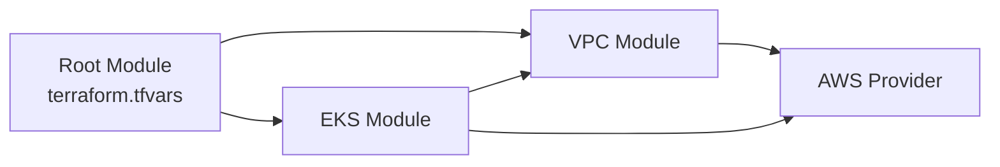
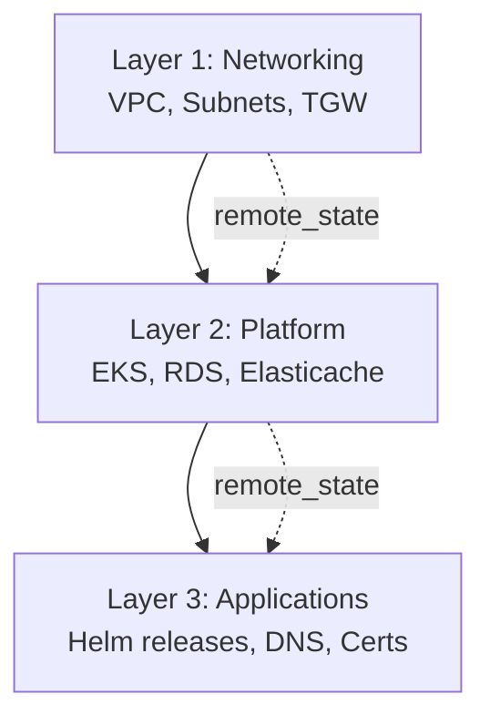
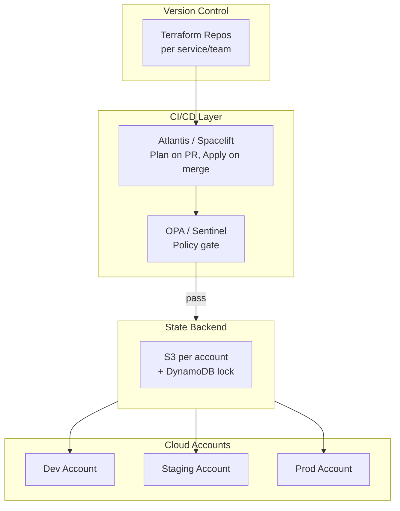
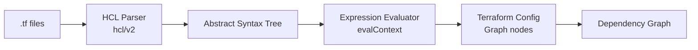
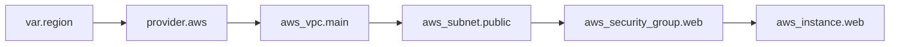
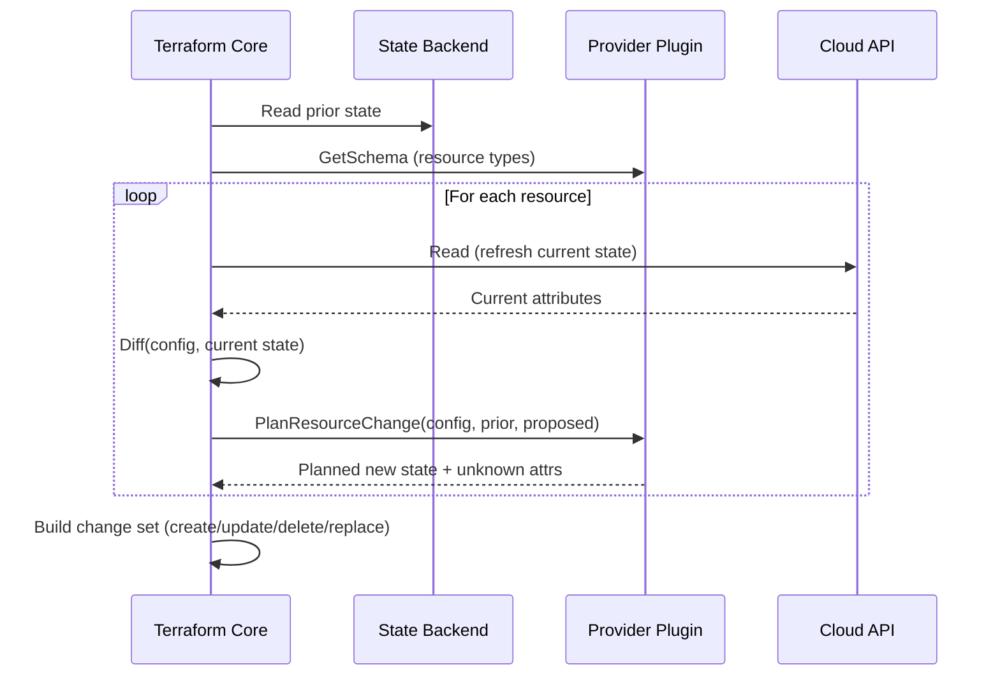
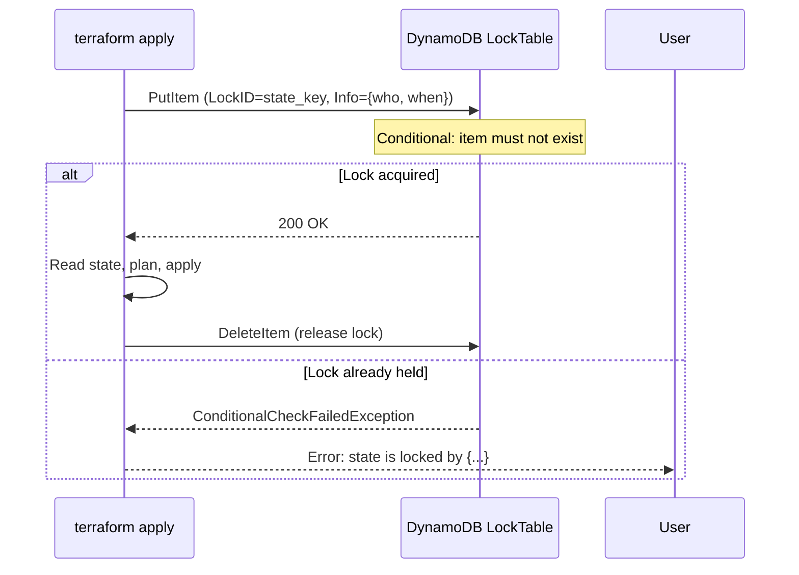
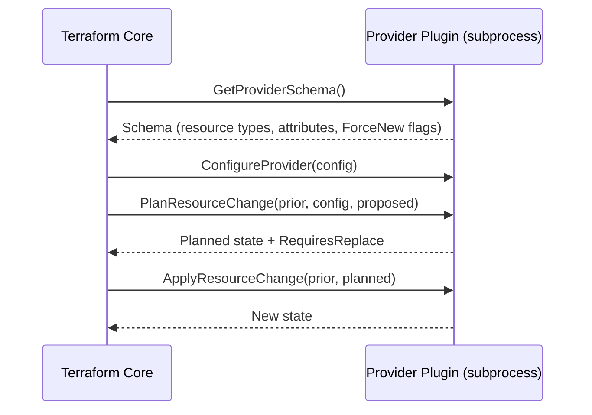
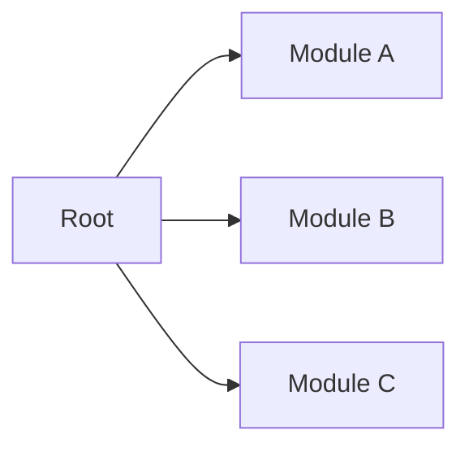

# Terraform Roadmap — Universal Template

> **A comprehensive template system for generating Terraform roadmap content across all skill levels.**

---

## Overview

| | Description |
|---|---|
| **Purpose** | Universal template for all Terraform roadmap topics |
| **Files per topic** | 8 files: `junior.md`, `middle.md`, `senior.md`, `professional.md`, `interview.md`, `tasks.md`, `find-bug.md`, `optimize.md` |
| **Language** | All content must be generated in **English** |
| **Table of Contents** | **Optional** — include only if relevant to the topic. For practice files (`tasks.md`, `find-bug.md`, `optimize.md`) it is NOT required |

### Topic Structure

```
XX-topic-name/
├── junior.md          ← "What?" and "How?"
├── middle.md          ← "Why?" and "When?"
├── senior.md          ← "How to optimize?" and "How to architect?"
├── professional.md    ← "Under the Hood" — Terraform engine internals
├── interview.md       ← Interview prep across all levels
├── tasks.md           ← Hands-on practice tasks
├── find-bug.md        ← Find and fix bugs in HCL configurations (10+ exercises)
└── optimize.md        ← Optimize slow/inefficient Terraform workflows (10+ exercises)
```

---

## Level Comparison Matrix

| Aspect | Junior | Middle | Senior | Professional |
|:------:|:------:|:------:|:------:|:------------:|
| **Depth** | Basic HCL, first resources | Modules, workspaces, remote state | Multi-account architecture, policy as code | HCL evaluation engine, state locking, provider protocol |
| **Code** | Single resource blocks | Reusable modules, variable validation | Terragrunt, sentinel policies, atlantis | Graph traversal, plan algorithm, provider plugin gRPC |
| **Tricky Points** | Syntax errors, missing dependencies | State drift, import, moved blocks | Circular deps, blast radius, credential rotation | Provider schema, eval context, plan/apply diff engine |
| **Focus** | "What?" and "How?" | "Why?" and "When?" | "How to govern and scale?" | "What happens inside `terraform plan`?" |

---
---

# TEMPLATE 1 — `junior.md`

<details open>
<summary><strong>Template Content</strong></summary>

# {{TOPIC_NAME}} — Junior Level

## Table of Contents

1. [Introduction](#introduction)
2. [Prerequisites](#prerequisites)
3. [Glossary](#glossary)
4. [Core Concepts](#core-concepts)
5. [Real-World Analogies](#real-world-analogies)
6. [Mental Models](#mental-models)
7. [Pros & Cons](#pros--cons)
8. [Use Cases](#use-cases)
9. [Code Examples](#code-examples)
10. [Error Handling](#error-handling)
11. [Security Considerations](#security-considerations)
12. [Performance Tips](#performance-tips)
13. [Best Practices](#best-practices)
14. [Edge Cases & Pitfalls](#edge-cases--pitfalls)
15. [Common Mistakes](#common-mistakes)
16. [Tricky Points](#tricky-points)
17. [Test](#test)
18. [Cheat Sheet](#cheat-sheet)
19. [Summary](#summary)
20. [What You Can Build](#what-you-can-build)
21. [Further Reading](#further-reading)

---

## Introduction

> Focus: "What is it?" and "How to use it?"

Brief explanation of what {{TOPIC_NAME}} is in the context of Terraform and why a beginner needs to know it.
Assume the reader has basic cloud knowledge (AWS/GCP/Azure) but has never written HCL.

---

## Prerequisites

- **Required:** Basic cloud concepts (VPC, compute, storage) — you need to know what resources you're declaring
- **Required:** Command-line basics — Terraform is a CLI tool
- **Helpful but not required:** Git — state and config should be version controlled

---

## Glossary

| Term | Definition |
|------|-----------|
| **HCL** | HashiCorp Configuration Language — the declarative syntax Terraform uses |
| **Resource** | A single piece of cloud infrastructure (e.g., an S3 bucket, a VM) |
| **Provider** | A plugin that maps HCL resources to a cloud API (aws, google, azurerm) |
| **State** | A JSON file that tracks what Terraform currently manages |
| **Plan** | A dry-run showing what changes Terraform will make |
| **Apply** | The operation that makes the planned changes real |
| **{{Term 7}}** | Simple, one-sentence definition |

---

## Core Concepts

### Concept 1: {{name}}

Simple explanation with analogy if helpful.

### Concept 2: {{name}}

...

> - Each concept explained in 3-5 sentences max.
> - Use bullet points for lists.
> - Include small HCL snippets inline where needed.

---

## Real-World Analogies

| Concept | Analogy |
|---------|--------|
| **Terraform Plan** | Like a building permit review — shows exactly what will be built before construction starts |
| **State File** | Like a home inspection report — documents the exact current state of every room |
| **Provider** | Like a contractor who knows the local building codes for each city (cloud) |
| **Module** | Like a prefab house kit — reusable design you can stamp out many times |

---

## Mental Models

**The intuition:** {{A simple mental model — e.g., "Think of Terraform as a diff engine between your desired config and the actual cloud state."}}

**Why this model helps:** {{Prevents confusion about why `plan` is important and why not editing state manually is critical}}

---

## Pros & Cons

| Pros | Cons |
|------|------|
| Declarative — describe desired state, not steps | State file must be kept in sync with reality |
| Multi-cloud (AWS, GCP, Azure, etc.) | Slow plan time on large state files |
| Large provider ecosystem | HCL is not a general-purpose language — logic is limited |
| Reproducible infrastructure | Destructive changes (replace) can surprise operators |

### When to use:
- {{Scenario where Terraform clearly wins — e.g., provisioning long-lived cloud infrastructure}}

### When NOT to use:
- {{Scenario where Terraform is overkill — e.g., ad-hoc scripting, or config management inside VMs}}

---

## Use Cases

- **Cloud Infrastructure Provisioning:** VPCs, subnets, VMs, databases, IAM
- **Multi-Environment Parity:** Same module, different `tfvars` for dev/staging/prod
- **{{Use Case 3}}:** {{Brief description}}
- **{{Use Case 4}}:** {{Brief description}}

---

## Code Examples

```hcl
# {{TOPIC_NAME}} — minimal working example
terraform {
  required_providers {
    aws = {
      source  = "hashicorp/aws"
      version = "~> 5.0"
    }
  }
}

provider "aws" {
  region = var.aws_region
}

resource "aws_s3_bucket" "example" {
  bucket = "{{topic-name}}-example-bucket"

  tags = {
    Environment = var.environment
    ManagedBy   = "terraform"
  }
}
```

```bash
# Initialize, plan, apply
terraform init
terraform plan -var-file=dev.tfvars
terraform apply -var-file=dev.tfvars
```

---

## Error Handling

- Run `terraform validate` before `plan` — catches syntax errors early
- Read error messages carefully: Terraform reports the resource address, not just the error
- Use `TF_LOG=DEBUG terraform plan` to diagnose provider API failures

---

## Security Considerations

- Never commit `terraform.tfstate` to Git — it contains secrets in plaintext
- Store state in a remote backend (S3 + DynamoDB, Terraform Cloud) with encryption
- Use least-privilege IAM credentials for the Terraform executor

---

## Performance Tips

- Use `-parallelism=N` (default 10) to control concurrent API calls
- Avoid putting all resources in one flat file — group by logical component
- Use `terraform plan -out=planfile` to skip re-planning on apply

---

## Best Practices

- Always pin provider versions: `version = "~> 5.0"` not `version = ">= 1.0"`
- Use `terraform fmt` and `terraform validate` in CI
- Tag every resource with `Environment` and `ManagedBy = "terraform"`

---

## Edge Cases & Pitfalls

- **`terraform destroy` in the wrong workspace** — deletes production if workspace is not verified
- **State file in local backend** — team members overwrite each other's state
- **{{Pitfall 3}}** — {{brief explanation}}

---

## Common Mistakes

- Forgetting `terraform init` after adding a new provider
- Using `count` for resources that need individual addressing — use `for_each` instead
- Not using `depends_on` when implicit dependency is insufficient

---

## Tricky Points

- {{Tricky behavior 1 specific to {{TOPIC_NAME}}}}
- {{Tricky behavior 2}}

---

## Test

1. What does `terraform plan` actually do under the hood?
2. What is the difference between `count` and `for_each`?
3. Why should you never manually edit the state file?
4. {{Question 4}}
5. {{Question 5}}

---

## Cheat Sheet

| Task | Command |
|------|---------|
| Initialize | `terraform init` |
| Preview changes | `terraform plan` |
| Apply changes | `terraform apply` |
| Destroy | `terraform destroy` |
| Format HCL | `terraform fmt -recursive` |
| Validate | `terraform validate` |
| Show state | `terraform state list` |

---

## Summary

{{TOPIC_NAME}} at the junior level is about understanding the core workflow: write HCL → `init` → `plan` → `apply`. Focus on reading plan output carefully, keeping state remote, and pinning providers.

---

## What You Can Build

- A VPC with public and private subnets on AWS
- An S3 bucket with lifecycle rules and versioning
- {{Project 3}}

---

## Further Reading

- [Terraform Documentation](https://developer.hashicorp.com/terraform/docs)
- [HashiCorp Learn — Get Started](https://developer.hashicorp.com/terraform/tutorials)
- [The Terraform Book — James Turnbull](https://terraformbook.com/)

</details>

---
---

# TEMPLATE 2 — `middle.md`

<details open>
<summary><strong>Template Content</strong></summary>

# {{TOPIC_NAME}} — Middle Level

## Table of Contents

1. [Introduction](#introduction)
2. [Prerequisites](#prerequisites)
3. [Deep Dive](#deep-dive)
4. [Architecture Patterns](#architecture-patterns)
5. [Comparison with Alternatives](#comparison-with-alternatives)
6. [Advanced Code Examples](#advanced-code-examples)
7. [Testing Strategy](#testing-strategy)
8. [Observability & Monitoring](#observability--monitoring)
9. [Security](#security)
10. [Performance & Scalability](#performance--scalability)
11. [Anti-Patterns](#anti-patterns)
12. [Tricky Points](#tricky-points)
13. [Cheat Sheet](#cheat-sheet)
14. [Summary](#summary)
15. [Further Reading](#further-reading)

---

## Introduction

> Focus: "Why does it work this way?" and "When should I choose this pattern?"

{{TOPIC_NAME}} at the middle level is about writing reusable, testable Terraform modules and managing state safely across multiple environments and teams.

---

## Prerequisites

- Junior-level mastery of {{TOPIC_NAME}}
- Experience running `plan`/`apply` in at least one cloud environment
- Familiarity with CI/CD concepts
- Basic Git branching strategy knowledge

---

## Deep Dive

### Why modules matter

{{Explanation of DRY infrastructure, interface contracts via variables/outputs, and encapsulation of complexity}}

### Remote state and state locking

{{Explanation of why local state is dangerous in teams, how S3+DynamoDB locking works, and what happens without it}}

### Workspaces vs. directory-per-environment

{{Trade-offs between `terraform workspace` and separate directories with separate state}}

---

## Architecture Patterns

### Pattern 1: Module with Interface



### Pattern 2: Layered State



### Pattern 3: {{Name}}

{{Description and diagram}}

---

## Comparison with Alternatives

| Tool | Strength | Weakness | Best For |
|------|----------|----------|----------|
| **Terraform** | Large provider ecosystem, mature | HCL limits expressiveness | General-purpose IaC |
| **Pulumi** | Real programming languages | Smaller ecosystem | Teams that prefer Python/TypeScript |
| **AWS CDK** | Native AWS, type-safe | AWS-only | AWS-first orgs |
| **Ansible** | Config management + IaC | Not idempotent for cloud resources | VM configuration, existing fleets |
| **{{Alt 5}}** | {{Strength}} | {{Weakness}} | {{Best For}} |

---

## Advanced Code Examples

```hcl
# Reusable VPC module with validation
variable "cidr_block" {
  type        = string
  description = "VPC CIDR block"
  validation {
    condition     = can(cidrhost(var.cidr_block, 0))
    error_message = "cidr_block must be a valid CIDR notation."
  }
}

variable "environment" {
  type = string
  validation {
    condition     = contains(["dev", "staging", "prod"], var.environment)
    error_message = "environment must be dev, staging, or prod."
  }
}

resource "aws_vpc" "main" {
  cidr_block           = var.cidr_block
  enable_dns_hostnames = true

  tags = {
    Name        = "${var.environment}-vpc"
    Environment = var.environment
  }
}

output "vpc_id" {
  value       = aws_vpc.main.id
  description = "The ID of the created VPC"
}
```

```hcl
# Remote state reference across layers
data "terraform_remote_state" "networking" {
  backend = "s3"
  config = {
    bucket = "my-tfstate"
    key    = "networking/terraform.tfstate"
    region = "us-east-1"
  }
}

resource "aws_eks_cluster" "main" {
  vpc_config {
    subnet_ids = data.terraform_remote_state.networking.outputs.private_subnet_ids
  }
}
```

```bash
# Targeted plan to limit blast radius
terraform plan -target=module.eks -out=eks.plan
terraform apply eks.plan
```

---

## Testing Strategy

| Test Type | What to Test | Tool |
|-----------|-------------|------|
| **Static Analysis** | HCL syntax, security misconfigs | `tflint`, `checkov`, `tfsec` |
| **Unit** | Module outputs given inputs | Terratest (Go) or pytest-terraform |
| **Integration** | Real resources created and destroyed | Terratest with `defer terraform.Destroy` |
| **Contract** | Module interface (variable types, outputs) | Terraform native `validation` blocks |
| **Policy** | Security and compliance rules | Sentinel, OPA + Conftest |

---

## Observability & Monitoring

- Use Terraform Cloud or Atlantis for audit trails of every `plan`/`apply`
- Emit `TF_LOG` output to a log aggregator in CI
- Track resource drift with scheduled `terraform plan` runs — alert on non-empty plans
- Tag all resources with `CreatedBy`, `CostCenter`, `Environment` for cloud cost visibility

---

## Security

- Use OIDC-based dynamic credentials (no stored secrets): GitHub Actions → AWS OIDC provider
- Enable S3 bucket versioning on the state backend — recover from accidental state corruption
- Use `terraform plan` + peer review before `apply` on production (Atlantis, Spacelift)

---

## Performance & Scalability

- Split large monolithic state files into layers — reduces plan time from minutes to seconds
- Use `-parallelism=20` carefully — higher values can hit cloud API rate limits
- Use `terraform plan -refresh=false` in CI to skip slow API state refresh when you know state is clean

---

## Anti-Patterns

| Anti-Pattern | Problem | Fix |
|-------------|---------|-----|
| **Monolithic state** | Slow plans, large blast radius | Split into networking/platform/app layers |
| **`count` for named resources** | Index shift destroys/recreates resources | Use `for_each` with string keys |
| **Hardcoded account IDs** | Not reusable across accounts | Use `data.aws_caller_identity.current.account_id` |
| **No provider version pin** | Breaking changes on `init` | `version = "~> 5.0"` in `required_providers` |

---

## Tricky Points

- **`for_each` with a set of strings** — order is non-deterministic; use `toset()` explicitly
- **`depends_on` on modules** — disables plan optimization; use only when absolutely necessary
- {{Tricky point 3}}

---

## Cheat Sheet

| Task | Command |
|------|---------|
| Plan with var file | `terraform plan -var-file=prod.tfvars` |
| Target a single resource | `terraform plan -target=aws_instance.web` |
| Import existing resource | `terraform import aws_s3_bucket.b my-bucket` |
| Move resource in state | `terraform state mv old_addr new_addr` |
| Remove from state | `terraform state rm resource_addr` |
| Refresh state | `terraform refresh` |

---

## Summary

At the middle level, {{TOPIC_NAME}} is about writing reusable modules with validated interfaces, managing state safely in remote backends, and automating plan/apply through CI/CD with appropriate gates.

---

## Further Reading

- [Terraform: Up & Running — Yevgeniy Brikman](https://www.terraformupandrunning.com/)
- [Atlantis — Terraform PR Automation](https://www.runatlantis.io/)
- [Checkov — Static Analysis for IaC](https://www.checkov.io/)

</details>

---
---

# TEMPLATE 3 — `senior.md`

<details open>
<summary><strong>Template Content</strong></summary>

# {{TOPIC_NAME}} — Senior Level

## Table of Contents

1. [Introduction](#introduction)
2. [Architecture Design](#architecture-design)
3. [System Design Decisions](#system-design-decisions)
4. [Advanced Patterns](#advanced-patterns)
5. [Performance Engineering](#performance-engineering)
6. [Reliability & Resilience](#reliability--resilience)
7. [Governance & Compliance](#governance--compliance)
8. [Code Examples](#code-examples)
9. [Tricky Points](#tricky-points)
10. [Summary](#summary)

---

## Introduction

> Focus: "How to architect?" and "How to govern at scale?"

At the senior level, {{TOPIC_NAME}} is about designing an IaC platform that supports dozens of teams, enforces policy, and minimizes blast radius — while keeping developer velocity high.

---

## Architecture Design

### Multi-Account IaC Platform



---

## System Design Decisions

### Decision 1: Monorepo vs. Polyrepo for Terraform

| | Monorepo | Polyrepo |
|--|----------|---------|
| Discovery | Easy — all infra in one place | Scattered across repos |
| Blast radius | High — one PR can touch everything | Low — scoped to one service |
| Module sharing | `//modules` directory | Published to Terraform Registry |

### Decision 2: Terragrunt vs. Native Terraform

{{Trade-offs: Terragrunt adds DRY config inheritance but requires another tool in the chain; native Terraform modules + `for_each` cover most use cases}}

### Decision 3: {{Name}}

{{Description of trade-offs}}

---

## Advanced Patterns

### Dynamic Provider Configuration

```hcl
# Deploy to multiple AWS accounts from one config
locals {
  accounts = {
    dev  = "111111111111"
    prod = "222222222222"
  }
}

provider "aws" {
  for_each = local.accounts
  alias    = each.key
  assume_role {
    role_arn = "arn:aws:iam::${each.value}:role/TerraformRole"
  }
}
```

### Policy as Code with OPA

```bash
# conftest — enforce tagging policy
conftest test plan.json --policy policies/
```

```hcl
# OPA policy: all resources must have Environment tag
deny[msg] {
  resource := input.resource_changes[_]
  resource.change.actions[_] == "create"
  not resource.change.after.tags.Environment
  msg := sprintf("Resource %v is missing the Environment tag", [resource.address])
}
```

---

## Performance Engineering

- **Split state** — each layer (networking, platform, app) has independent state; plans run in parallel across layers
- **Module registry caching** — use Terraform Cloud private registry or a local cache to avoid re-downloading modules on every CI run
- **`-refresh=false`** — skip API state refresh in CI when upstream state is known clean; saves 60-90 seconds on large states

---

## Reliability & Resilience

- **State locking** — DynamoDB lock table prevents concurrent `apply` from corrupting state
- **State versioning** — S3 bucket versioning enables point-in-time recovery
- **Drift detection** — scheduled `terraform plan` alerts on unmanaged changes (ClickOps)
- **Break-glass procedure** — document how to manually fix state after a failed mid-apply

---

## Governance & Compliance

- Enforce resource naming conventions via `tflint` rules
- Require all `apply` operations to produce a saved plan file (Atlantis + plan files)
- Use Sentinel or OPA to block deployments that violate security policies (no public S3, MFA-delete required)
- Generate a CMDB-compatible inventory from Terraform state using `terraform show -json`

---

## Code Examples

```hcl
# Drift detection — output to be monitored
locals {
  drift_check_timestamp = timestamp()
}

output "last_plan_timestamp" {
  value = local.drift_check_timestamp
}
```

```bash
# Automated drift detection in CI
terraform plan -detailed-exitcode -refresh-only
# Exit code 2 = drift detected
if [ $? -eq 2 ]; then
  echo "DRIFT DETECTED — opening incident"
  curl -X POST "$PAGERDUTY_WEBHOOK" -d '{"event":"drift"}'
fi
```

---

## Tricky Points

- **Cross-account assume_role + MFA** — Terraform cannot interactively prompt for MFA; use OIDC or hardware tokens with role chaining
- **`moved` block** — introduced in Terraform 1.1; use instead of `terraform state mv` to make refactors declarative and reviewable
- {{Tricky point 3}}

---

## Summary

At the senior level, {{TOPIC_NAME}} is about building a governed IaC platform: layered state boundaries, policy gates, automated drift detection, and multi-account support — all while keeping developer experience fast enough that teams don't reach for ClickOps.

</details>

---
---

# TEMPLATE 4 — `professional.md`

<details open>
<summary><strong>Template Content</strong></summary>

# {{TOPIC_NAME}} — Professional Level: Terraform Engine Internals

## Table of Contents

1. [Introduction](#introduction)
2. [HCL Evaluation Engine](#hcl-evaluation-engine)
3. [Dependency Graph Resolution](#dependency-graph-resolution)
4. [Plan Algorithm](#plan-algorithm)
5. [State Locking Mechanism](#state-locking-mechanism)
6. [Provider Plugin Protocol](#provider-plugin-protocol)
7. [Deep Code Examples](#deep-code-examples)
8. [Tricky Points](#tricky-points)
9. [Summary](#summary)

---

## Introduction

> Focus: "What happens inside `terraform plan`?" — HCL evaluation engine, state locking mechanism, provider plugin protocol, dependency graph resolution, plan algorithm.

This level is for practitioners who have hit edge cases in large deployments and need to understand the engine to reason about correctness, performance, and failure modes.

---

## HCL Evaluation Engine

### Parsing → Evaluation → Walk



### Evaluation Context

The HCL evaluator receives an `EvalContext` containing:
- **Input variables** (`var.*`)
- **Local values** (`local.*`) — lazily evaluated
- **Resource attributes** from the prior state (`resource_type.name.attr`)
- **Data source results** — evaluated during the refresh phase
- **Provider-defined functions** (Terraform 1.8+)

```hcl
# This expression is evaluated lazily during graph walk
locals {
  bucket_name = "${var.environment}-${data.aws_caller_identity.current.account_id}-assets"
}
```

**Unknown values:** When an attribute cannot be known until apply (e.g., a resource ID that doesn't exist yet), the evaluator substitutes a typed `cty.DynamicVal` unknown. This propagates through expressions — any expression depending on an unknown is itself unknown, causing downstream `plan` to show `(known after apply)`.

---

## Dependency Graph Resolution

### How the Graph is Built

Terraform constructs a directed acyclic graph (DAG) where:
- Each resource, data source, module, and variable is a **node**
- Each `depends_on`, implicit attribute reference, and `provider` is an **edge**



### Topological Sort and Parallel Walk

The graph is topologically sorted to determine evaluation order. Independent nodes are walked **in parallel** (up to `-parallelism` goroutines). This is why Terraform can create a VPC and an S3 bucket simultaneously but must create the subnet after the VPC.

### Cycle Detection

Terraform detects cycles during graph construction using Tarjan's strongly connected components algorithm. A circular reference (`A` references `B` which references `A`) produces:

```
Error: Cycle: aws_security_group.web, aws_instance.web
```

Fix: break the cycle by using `data` sources, `depends_on` restructuring, or splitting into separate modules.

---

## Plan Algorithm

### Three-Phase Plan



### Replace Logic

A resource is replaced (destroy + create) when a `ForceNew` attribute changes. `ForceNew` is declared in the provider schema — Terraform core does not decide this; the provider does.

```
# Plan output for a replace operation
  # aws_instance.web must be replaced
-/+ resource "aws_instance" "web" {
      ~ ami = "ami-old" -> "ami-new" # forces replacement
```

---

## State Locking Mechanism

### DynamoDB Lock Protocol



### Lock Info Structure

```json
{
  "ID": "abc123",
  "Operation": "OperationTypeApply",
  "Info": "",
  "Who": "user@hostname",
  "Version": "1.7.5",
  "Created": "2024-01-15T10:30:00Z",
  "Path": "s3://bucket/path/terraform.tfstate"
}
```

### Force-Unlock

```bash
terraform force-unlock LOCK_ID
# Only use after confirming no apply is running — corrupts state if misused
```

---

## Provider Plugin Protocol

### gRPC Interface

Terraform communicates with providers over a local gRPC socket. The protocol is defined in `terraform-plugin-go` (Go) and `terraform-plugin-framework`.



### Schema and ForceNew

Each provider declares which attributes require resource replacement if changed:

```go
// Inside provider source (Go)
"ami": {
    Type:     schema.TypeString,
    Required: true,
    ForceNew: true,  // changing AMI replaces the instance
},
```

Terraform core checks `RequiresReplace` from the provider's `PlanResourceChange` response — it does not have its own `ForceNew` logic.

---

## Deep Code Examples

```hcl
# Demonstrate unknown value propagation
resource "aws_vpc" "main" {
  cidr_block = "10.0.0.0/16"
}

resource "aws_subnet" "pub" {
  vpc_id = aws_vpc.main.id   # id is (known after apply) on first plan
  cidr_block = "10.0.1.0/24"
}

# Plan output:
# + aws_subnet.pub
#     vpc_id = (known after apply)
```

```bash
# Inspect the dependency graph
terraform graph | dot -Tsvg > graph.svg
# Requires graphviz: brew install graphviz

# Inspect provider schema
terraform providers schema -json | jq '.provider_schemas["registry.terraform.io/hashicorp/aws"].resource_schemas | keys'
```

```hcl
# moved block — refactor without destroying resources
moved {
  from = aws_instance.legacy_web
  to   = module.webserver.aws_instance.main
}
```

---

## Tricky Points

- **Missing provider version pin** — `terraform init` with no version constraint downloads the latest provider; a major version bump can silently break your configuration
- **State file drift** — if someone manually deletes a cloud resource, `terraform plan` will show it as a create; `terraform refresh` updates state to reality before the next plan
- **Circular dependency via `depends_on` on modules** — disables all parallel execution within both modules; use sparingly
- **`forget terraform destroy`** — a resource created outside a module's scope (e.g., during testing) is "orphaned" from state; it will never be destroyed unless explicitly imported and then destroyed
- **Provider re-initialization after version change** — changing `required_providers` without running `terraform init` causes a `Provider produced inconsistent result after apply` error
- **`cty` unknown propagation in `count`** — if `count = var.count` and `var.count` is unknown, the entire resource block is deferred to apply; this prevents `-target` from working on dependent resources

---

## Summary

Terraform's engine is a graph evaluator: it parses HCL into an AST, builds a DAG of dependencies, topologically sorts it, and walks it in parallel — substituting unknown values where attributes can't be resolved until apply. Providers are external gRPC processes that own the `ForceNew` and `ApplyResourceChange` logic; Terraform core is a coordinator, not a cloud API client. State locking is a conditional DynamoDB PutItem — correct only when used with a remote backend that supports it.

</details>

---
---

# TEMPLATE 5 — `interview.md`

<details open>
<summary><strong>Template Content</strong></summary>

# {{TOPIC_NAME}} — Interview Preparation

## Junior Questions

**Q1: What is the difference between `terraform plan` and `terraform apply`?**
> `plan` computes the diff between desired config and current state and shows what would change — without touching any real infrastructure. `apply` executes the planned changes.

**Q2: Why should you never store `terraform.tfstate` in Git?**
> State files contain sensitive values (passwords, private keys) in plaintext and create merge conflicts when multiple engineers apply concurrently.

**Q3: What is a Terraform provider?**
> A provider is a plugin (separate process) that translates HCL resource declarations into API calls for a specific cloud or service. The provider owns the CRUD logic; Terraform core owns the graph evaluation.

**Q4: {{Question}}**
> {{Answer}}

**Q5: {{Question}}**
> {{Answer}}

---

## Middle Questions

**Q1: What is the difference between `count` and `for_each`, and when do you use each?**
> `count` creates N copies indexed by integer; changing an element in the middle shifts all subsequent indices, causing unexpected destroys. `for_each` uses string keys, so adding or removing one element only affects that element. Use `for_each` whenever resources have meaningful names.

**Q2: How do you manage Terraform state for multiple environments (dev/staging/prod)?**
> Best practice: separate state file per environment, either via separate directories (one `backend` config each) or Terraform workspaces (simpler but shares the same module). Separate directories are preferred for production isolation.

**Q3: What is a `data` source and how does it differ from a `resource`?**
> A `data` source reads existing infrastructure (not managed by this Terraform config) and makes its attributes available. A `resource` declares infrastructure that Terraform will create, update, or destroy.

**Q4: {{Question}}**
> {{Answer}}

**Q5: {{Question}}**
> {{Answer}}

---

## Senior Questions

**Q1: How would you design a Terraform platform for 50 engineers across 5 AWS accounts?**
> {{Answer covering: layered state, per-account backends, OIDC credentials, Atlantis/Spacelift for PR automation, OPA for policy, module registry, tagging enforcement}}

**Q2: Explain how Terraform detects that a resource needs to be replaced vs. updated in-place.**
> The provider declares `ForceNew: true` on specific attributes in its schema. During `PlanResourceChange`, if a `ForceNew` attribute changes, the provider returns `RequiresReplace`. Terraform core then schedules a delete+create (or create+delete depending on `create_before_destroy`).

**Q3: How do you handle a situation where `terraform plan` is clean but production is drifting?**
> {{Answer: scheduled drift detection via `-refresh-only -detailed-exitcode`, alert on exit code 2, import or fix the drift, investigate root cause (ClickOps)}}

**Q4: {{Question}}**
> {{Answer}}

---

## Professional / System Design Questions

**Q1: Explain the Terraform dependency graph and how it enables parallel execution.**
> {{Answer covering: DAG, topological sort, Tarjan cycle detection, parallel walk with `-parallelism`, unknown value propagation}}

**Q2: How does state locking work internally with an S3+DynamoDB backend?**
> {{Answer covering: conditional PutItem, lock info JSON, force-unlock risks, what happens on crashed apply}}

**Q3: {{Question}}**
> {{Answer}}

---

## Behavioral / Situational Questions

- Tell me about a time a `terraform apply` caused an unintended deletion in production. What happened and what did you change afterwards?
- How do you convince an organization that currently does all infra via ClickOps to adopt Terraform?
- {{Question 3}}

</details>

---
---

# TEMPLATE 6 — `tasks.md`

<details open>
<summary><strong>Template Content</strong></summary>

# {{TOPIC_NAME}} — Hands-On Tasks

> Each task has a difficulty level: 🟢 Beginner · 🟡 Intermediate · 🔴 Advanced

---

## Task 1 — Provision Your First Resource 🟢

**Goal:** Create an S3 bucket with versioning and tags using Terraform.

**Requirements:**
- Use a `required_providers` block with a pinned AWS provider version
- Enable bucket versioning
- Add `Environment` and `ManagedBy = "terraform"` tags
- Store state locally (for this exercise only)

---

## Task 2 — Remote State Backend 🟢

**Goal:** Migrate local state to an S3 remote backend with DynamoDB locking.

**Requirements:**
- Create the S3 bucket and DynamoDB table manually (bootstrap problem)
- Configure the `backend "s3"` block
- Run `terraform init` to migrate state
- Verify state file appears in S3

---

## Task 3 — Write a Reusable Module 🟡

**Goal:** Extract a VPC configuration into a reusable module.

**Requirements:**
- Module accepts: `cidr_block`, `environment`, `az_count`
- Module outputs: `vpc_id`, `public_subnet_ids`, `private_subnet_ids`
- Add `validation` blocks for all variables
- Call the module from a root configuration

---

## Task 4 — CI/CD with Terraform 🟡

**Goal:** Set up GitHub Actions to run `terraform plan` on every PR.

**Requirements:**
- Use OIDC (not static access keys) for AWS authentication
- Post plan output as a PR comment
- Fail the workflow if `plan` returns errors
- Only `apply` on merge to `main`

---

## Task 5 — Import Existing Resources 🟡

**Goal:** Import manually created cloud resources into Terraform management.

**Requirements:**
- Create an S3 bucket manually via AWS Console
- Write the corresponding HCL resource block
- Run `terraform import` to bring it under management
- Run `terraform plan` and verify it shows no changes

---

## Task 6 — Policy as Code with Conftest 🔴

**Goal:** Enforce a tagging policy that blocks applies missing required tags.

**Requirements:**
- Write an OPA policy: all resources must have `Environment` and `CostCenter` tags
- Integrate `conftest` into GitHub Actions — fail PR if policy violations exist
- Test with a compliant and a non-compliant configuration

---

## Task 7 — Multi-Account Deployment 🔴

**Goal:** Deploy identical infrastructure to dev and prod AWS accounts from one configuration.

**Requirements:**
- Use `assume_role` with separate provider aliases per account
- Use `for_each` over an `accounts` map
- Separate state per account in separate S3 backends

---

## Task 8 — Drift Detection Pipeline 🔴

**Goal:** Build an automated drift detection system.

**Requirements:**
- Schedule a nightly GitHub Actions job
- Run `terraform plan -refresh-only -detailed-exitcode`
- Alert (Slack webhook stub) if exit code is 2
- Generate a drift report artifact

---

## Task 9 — {{Topic-Specific Task}} 🟡

**Goal:** {{Description}}

**Requirements:**
- {{Requirement 1}}
- {{Requirement 2}}
- {{Requirement 3}}

---

## Task 10 — Full IaC Platform Bootstrap 🔴

**Goal:** Bootstrap a complete IaC platform for a new organization.

**Requirements:**
- AWS Organizations + SCPs for account boundaries
- Terraform remote state per account
- Shared module registry (Terraform Cloud or S3-backed)
- Atlantis for PR automation
- OPA policies for security baseline

</details>

---
---

# TEMPLATE 7 — `find-bug.md`

<details open>
<summary><strong>Template Content</strong></summary>

# {{TOPIC_NAME}} — Find the Bug

> Each exercise contains broken HCL or a broken workflow. Find the bug, explain why it's wrong, and write the fix.

---

## Exercise 1 — Missing Provider Version Pin

**Buggy Code:**

```hcl
terraform {
  required_providers {
    aws = {
      source = "hashicorp/aws"
      # BUG: no version constraint
    }
  }
}
```

**What's wrong?**
> Without a version constraint, `terraform init` downloads the latest available provider version. A major version release (e.g., 4.x → 5.x) will silently break your configuration when a team member or CI runner re-initializes.

**Fix:**
```hcl
terraform {
  required_providers {
    aws = {
      source  = "hashicorp/aws"
      version = "~> 5.0"   # allow patch and minor, block major
    }
  }
}
```

---

## Exercise 2 — State File Drift: Manual Resource Deletion

**Scenario:** A team member manually deleted `aws_security_group.web` in the AWS Console. The next `terraform plan` shows:

```
No changes. Your infrastructure matches the configuration.
```

**What's wrong?**
> Terraform's state still shows the security group as existing. Without `terraform refresh` (or `-refresh=true`, which is the default), Terraform may use cached state from the last apply. In some backends and versions, `-refresh=false` in CI can mask this.

**Fix:**
```bash
terraform plan -refresh=true   # default — explicitly forces API check
# or detect drift with:
terraform plan -refresh-only -detailed-exitcode
```

---

## Exercise 3 — Circular Dependency

**Buggy Code:**

```hcl
resource "aws_security_group" "web" {
  name   = "web-sg"
  vpc_id = aws_vpc.main.id

  egress {
    security_groups = [aws_security_group.db.id]  # BUG
  }
}

resource "aws_security_group" "db" {
  name   = "db-sg"
  vpc_id = aws_vpc.main.id

  ingress {
    security_groups = [aws_security_group.web.id]  # BUG: cycle
  }
}
```

**What's wrong?**
> `web` references `db` and `db` references `web` — a cycle. Terraform will fail with `Error: Cycle`.

**Fix:**
```hcl
# Use aws_security_group_rule to break the cycle
resource "aws_security_group" "web" {
  name   = "web-sg"
  vpc_id = aws_vpc.main.id
}

resource "aws_security_group" "db" {
  name   = "db-sg"
  vpc_id = aws_vpc.main.id
}

resource "aws_security_group_rule" "web_to_db" {
  type                     = "egress"
  security_group_id        = aws_security_group.web.id
  source_security_group_id = aws_security_group.db.id
  protocol                 = "tcp"
  from_port                = 5432
  to_port                  = 5432
}
```

---

## Exercise 4 — Forgotten `terraform destroy` — Orphaned Resources

**Scenario:** A developer ran `terraform apply` in a test environment without storing state remotely. They deleted the repo. The cloud resources are still running and incurring cost, but no state file exists to track them.

**What's wrong?**
> Without the state file, `terraform destroy` cannot know what was created. Resources are orphaned.

**Fix:**
```bash
# Option 1: Import resources back into a new state
terraform import aws_instance.web i-0abc123def456789

# Option 2: Manually delete resources via AWS Console or CLI
aws ec2 terminate-instances --instance-ids i-0abc123def456789

# Prevention: always use remote state backend before apply
```

---

## Exercise 5 — Wrong `count` vs `for_each`

**Buggy Code:**

```hcl
variable "buckets" {
  default = ["assets", "logs", "backups"]
}

resource "aws_s3_bucket" "buckets" {
  count  = length(var.buckets)   # BUG
  bucket = var.buckets[count.index]
}
```

**What's wrong?**
> If `"logs"` is removed from the middle of the list, all buckets after index 1 shift — Terraform will destroy and recreate `backups` even though nothing changed about it.

**Fix:**
```hcl
resource "aws_s3_bucket" "buckets" {
  for_each = toset(var.buckets)
  bucket   = each.key
}
```

---

## Exercise 6 — Hardcoded Region

**Buggy Code:**

```hcl
provider "aws" {
  region = "us-east-1"   # BUG: hardcoded
}

resource "aws_s3_bucket" "assets" {
  bucket = "my-assets-bucket"
}
```

**What's wrong?**
> Hardcoded region makes the module non-reusable across regions and environments; any multi-region deployment silently creates all resources in `us-east-1`.

**Fix:**
```hcl
variable "aws_region" {
  type    = string
  default = "us-east-1"
}

provider "aws" {
  region = var.aws_region
}
```

---

## Exercise 7 — Missing `depends_on` for IAM Propagation

**Buggy Code:**

```hcl
resource "aws_iam_role_policy_attachment" "attach" {
  role       = aws_iam_role.lambda_role.name
  policy_arn = aws_iam_policy.lambda_policy.arn
}

resource "aws_lambda_function" "fn" {
  function_name = "my-fn"
  role          = aws_iam_role.lambda_role.arn
  # BUG: no depends_on — Lambda may deploy before policy attachment completes
}
```

**What's wrong?**
> Terraform sees no attribute reference from `aws_lambda_function.fn` to `aws_iam_role_policy_attachment.attach`, so it may create the Lambda before the policy is attached. AWS IAM propagation is eventually consistent — the Lambda will fail to execute.

**Fix:**
```hcl
resource "aws_lambda_function" "fn" {
  function_name = "my-fn"
  role          = aws_iam_role.lambda_role.arn

  depends_on = [aws_iam_role_policy_attachment.attach]
}
```

---

## Exercise 8 — No `create_before_destroy` on Zero-Downtime Resource Replace

**Buggy Code:**

```hcl
resource "aws_lb_target_group" "web" {
  name     = "web-tg"
  port     = 80
  protocol = "HTTP"
  vpc_id   = aws_vpc.main.id
  # BUG: changing port forces replace; default is destroy-then-create
}
```

**What's wrong?**
> If `port` changes (a `ForceNew` attribute), Terraform destroys the target group first. During the window between destroy and create, the load balancer has no target group — downtime.

**Fix:**
```hcl
resource "aws_lb_target_group" "web" {
  name     = "web-tg-${var.version}"  # unique name per version
  port     = 80
  protocol = "HTTP"
  vpc_id   = aws_vpc.main.id

  lifecycle {
    create_before_destroy = true
  }
}
```

---

## Exercise 9 — Sensitive Output Exposed

**Buggy Code:**

```hcl
output "db_password" {
  value = aws_db_instance.main.password   # BUG: plaintext in state and logs
}
```

**What's wrong?**
> Output values are stored in the state file in plaintext and printed to stdout during `apply`. Secrets must be marked sensitive.

**Fix:**
```hcl
output "db_password" {
  value     = aws_db_instance.main.password
  sensitive = true   # redacted in logs, still in state — use Vault for rotation
}
```

---

## Exercise 10 — {{Topic-Specific Bug}}

**Buggy Code:**

```hcl
# {{Description of buggy scenario}}
{{buggy hcl}}
```

**What's wrong?**
> {{Explanation}}

**Fix:**
```hcl
{{fixed hcl}}
```

</details>

---
---

# TEMPLATE 8 — `optimize.md`

<details open>
<summary><strong>Template Content</strong></summary>

# {{TOPIC_NAME}} — Optimize

> Each exercise presents a slow or resource-inefficient Terraform workflow. Diagnose the bottleneck and apply the fix.

---

## Exercise 1 — Slow Plan: Monolithic State File

**Problem:** `terraform plan` takes 8 minutes for a configuration managing 600 resources.

**Diagnosis:**
- All 600 resources are in a single state file
- Every plan refreshes all 600 resources from cloud APIs sequentially (rate-limited)

**Fix:**

```bash
# Split into layers with independent state files
# Layer 1: networking (30 resources)   → plan: 20 seconds
# Layer 2: platform (150 resources)    → plan: 90 seconds
# Layer 3: applications (420 resources) → plan: 3 minutes
# All three can plan in PARALLEL in CI
```

```hcl
# Layer 2: reference Layer 1 outputs via remote state
data "terraform_remote_state" "networking" {
  backend = "s3"
  config = {
    bucket = "tfstate"
    key    = "networking/terraform.tfstate"
    region = "us-east-1"
  }
}
```

---

## Exercise 2 — Slow Plan: API Throttling from High Parallelism

**Problem:** Plan fails intermittently with `ThrottlingException`.

```bash
# Current default
terraform plan   # parallelism=10 — hitting EC2 API rate limit
```

**Fix:**

```bash
# Reduce parallelism for API-heavy providers
terraform plan -parallelism=5

# Or add retry logic in provider config (AWS provider)
```

```hcl
provider "aws" {
  region = var.region
  retry_mode    = "adaptive"
  max_attempts  = 10
}
```

---

## Exercise 3 — Slow CI: Re-downloading Modules on Every Run

**Problem:** CI spends 3 minutes on `terraform init` downloading modules.

**Fix:**

```yaml
# GitHub Actions — cache .terraform directory
- name: Cache Terraform modules
  uses: actions/cache@v4
  with:
    path: .terraform
    key: terraform-${{ hashFiles('**/.terraform.lock.hcl') }}
    restore-keys: terraform-
```

---

## Exercise 4 — Slow Plan: Unnecessary Refresh

**Problem:** In a large CI pipeline, state is known to be clean (nothing runs between plan and apply), but `terraform plan` takes 2 minutes just on the refresh phase.

**Fix:**

```bash
# Skip refresh when state is known clean
terraform plan -refresh=false -out=plan.bin
terraform apply plan.bin

# Use -refresh-only separately for scheduled drift detection
terraform plan -refresh-only -detailed-exitcode
```

---

## Exercise 5 — Module Reuse: Copy-Pasted VPC Blocks

**Problem:** Three environments (dev, staging, prod) have three copies of identical VPC HCL — 300 lines each.

**Before:**
```hcl
# dev/main.tf — 300 lines of VPC config
# staging/main.tf — same 300 lines
# prod/main.tf — same 300 lines
# Total: 900 lines to maintain
```

**After:**
```hcl
# modules/vpc/main.tf — 300 lines, once
# dev/main.tf
module "vpc" {
  source      = "../modules/vpc"
  environment = "dev"
  cidr_block  = "10.0.0.0/16"
}
# staging and prod: 4 lines each
# Total: 312 lines to maintain
```

---

## Exercise 6 — Parallel Operations: Sequential Module Calls

**Problem:** Three independent modules are called sequentially — total plan time is the sum of all three.

**Before:**
```
Module A: 40s
Module B: 35s
Module C: 45s
Total: 120s
```

**Fix:**



Ensure modules have no artificial `depends_on` between them — Terraform will walk them in parallel automatically. Remove any unnecessary `depends_on` links:

```hcl
# Remove this if B doesn't truly depend on A
module "b" {
  source     = "./modules/b"
  # depends_on = [module.a]  # <- remove if not needed
}
```

**After:** Plan time = max(A, B, C) = 45s.

---

## Exercise 7 — Plan Output Size: Verbose Unchanged Resources

**Problem:** Plan output is 5000 lines — hard to review.

**Fix:**

```bash
# Show only changes, hide unchanged
terraform plan -compact-warnings

# For JSON output (e.g., in CI PR comments)
terraform show -json plan.bin | jq '
  .resource_changes[]
  | select(.change.actions != ["no-op"])
  | {address: .address, actions: .change.actions}
'
```

---

## Exercise 8 — Slow `terraform init` from Public Registry

**Problem:** `terraform init` in an air-gapped environment fails or takes 10+ minutes hitting the public registry.

**Fix:**

```hcl
# Mirror providers to a private registry or filesystem mirror
terraform {
  required_providers {
    aws = {
      source  = "registry.example.com/hashicorp/aws"  # internal mirror
      version = "~> 5.0"
    }
  }
}
```

```bash
# Create a local filesystem mirror
terraform providers mirror /path/to/mirror/dir
# Then in CI:
terraform init -plugin-dir=/path/to/mirror/dir
```

---

## Exercise 9 — Repeated `terraform import` for Existing Infrastructure

**Problem:** 50 existing S3 buckets need to be imported — running `terraform import` 50 times takes 30 minutes and is error-prone.

**Fix:**

```hcl
# Terraform 1.5+: import blocks in HCL
import {
  for_each = toset(var.existing_bucket_names)
  to       = aws_s3_bucket.imported[each.key]
  id       = each.key
}

resource "aws_s3_bucket" "imported" {
  for_each = toset(var.existing_bucket_names)
  bucket   = each.key
}
```

```bash
# Generate config automatically (Terraform 1.5+)
terraform plan -generate-config-out=generated.tf
```

---

## Exercise 10 — {{Topic-Specific Optimization}}

**Slow Workflow:**

```bash
# {{Description of inefficient workflow}}
{{slow command or config}}
```

**Problem:** {{Explanation of bottleneck}}

**Optimized:**

```bash
{{optimized command or config}}
```

**Measurement:** Before: `{{baseline}}` · After: `{{improved}}`

</details>
