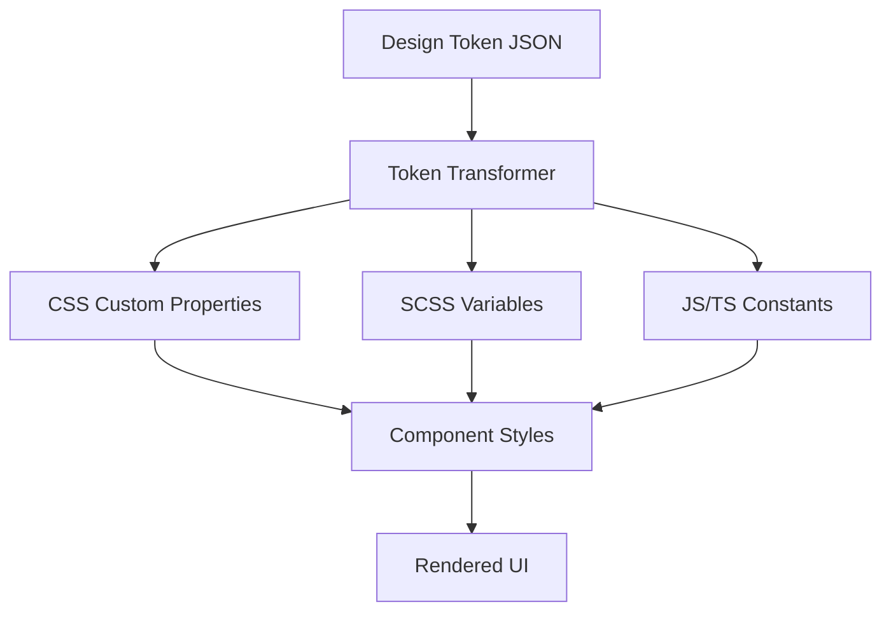
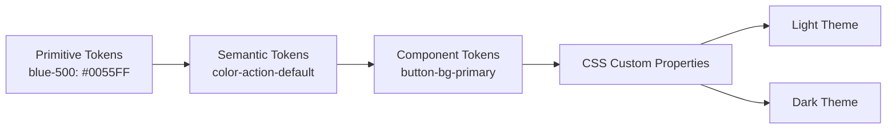
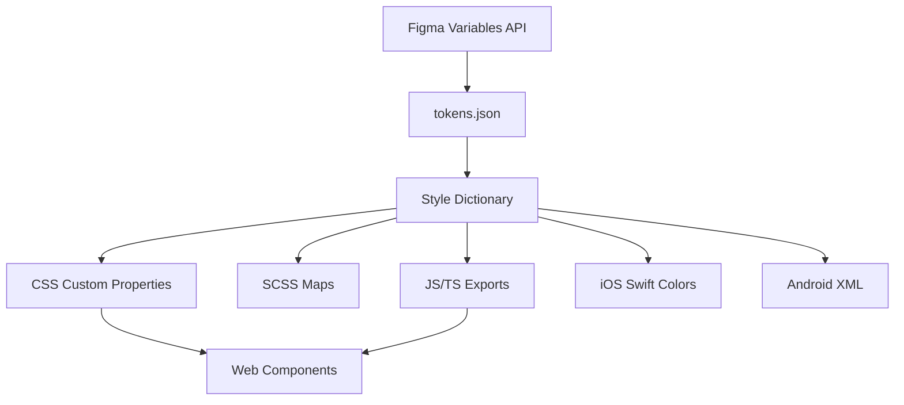
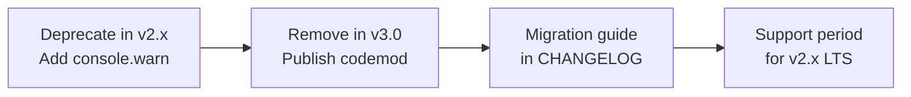
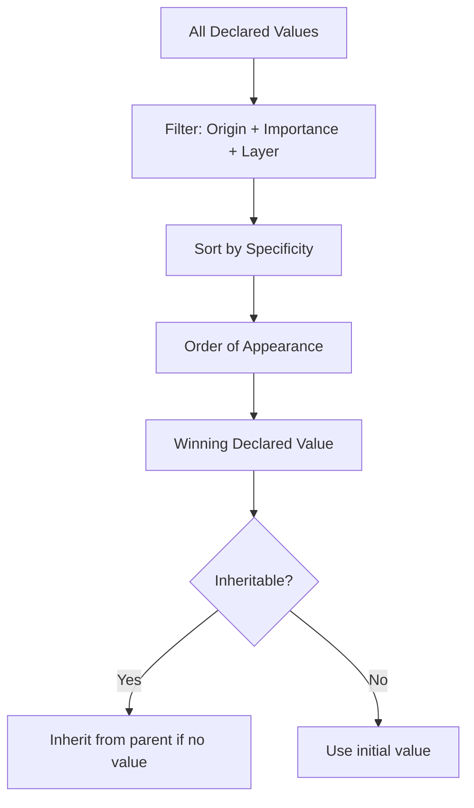

# Design System Roadmap — Universal Template

> Guides content generation for **Design System** topics.
> Primary code fences: `css` / `scss`, `tsx`, `json` (design tokens)

---

## Overview

| | Description |
|---|---|
| **Purpose** | Universal template for all Design System roadmap topics |
| **Files per topic** | 8 files: `junior.md`, `middle.md`, `senior.md`, `professional.md`, `interview.md`, `tasks.md`, `find-bug.md`, `optimize.md` |
| **Language** | All content must be generated in **English** |
| **Table of Contents** | **Optional** — include only if relevant to the topic. For practice files (`tasks.md`, `find-bug.md`, `optimize.md`) it is NOT required |

### Topic Structure

```
XX-topic-name/
├── junior.md          ← "What?" and "How?" — basic usage, tokens, components
├── middle.md          ← "Why?" and "When?" — patterns, trade-offs, tooling
├── senior.md          ← "How to scale?" — architecture, governance, design ops
├── professional.md    ← "Under the Hood" — CSS cascade, layout engine, CSS-in-JS runtime
├── interview.md       ← Interview prep across all levels
├── tasks.md           ← Hands-on practice tasks
├── find-bug.md        ← Find and fix design system bugs (10+ exercises)
└── optimize.md        ← Optimize slow/inefficient styles and components (10+ exercises)
```

---

## Level Comparison Matrix

| Aspect | Junior | Middle | Senior | Professional |
|:------:|:------:|:------:|:------:|:------------:|
| **Depth** | Token usage, component variants | Theming, accessibility, toolchain | Multi-brand, governance, design ops | CSS cascade algorithm, specificity engine, layout spec |
| **Code** | Basic CSS/SCSS, simple component | Production tokens, ARIA patterns | Scalable token architecture, CI | PostCSS AST, CSS-in-JS runtime internals |
| **Tricky Points** | Specificity conflicts, class naming | Dark mode, responsive tokens | Cross-team versioning, breaking changes | Cascade layers, containment, subgrid spec |
| **Focus** | "What?" and "How?" | "Why?" and "When?" | "How to govern?" | "What happens in the browser?" |

---

---

# TEMPLATE 1 — `junior.md`

<details open>
<summary><strong>Template Content</strong></summary>

# {{TOPIC_NAME}} — Junior Level

## Table of Contents

1. [Introduction](#introduction)
2. [Prerequisites](#prerequisites)
3. [Glossary](#glossary)
4. [Core Concepts](#core-concepts)
5. [Real-World Analogies](#real-world-analogies)
6. [Mental Models](#mental-models)
7. [Pros & Cons](#pros--cons)
8. [Use Cases](#use-cases)
9. [Code Examples](#code-examples)
10. [Error Handling and Error Boundaries](#error-handling-and-error-boundaries)
11. [Security Considerations](#security-considerations)
12. [Performance Tips](#performance-tips)
13. [Best Practices](#best-practices)
14. [Edge Cases & Pitfalls](#edge-cases--pitfalls)
15. [Common Mistakes](#common-mistakes)
16. [Tricky Points](#tricky-points)
17. [Test](#test)
18. [Tricky Questions](#tricky-questions)
19. [Cheat Sheet](#cheat-sheet)
20. [Summary](#summary)
21. [What You Can Build](#what-you-can-build)
22. [Further Reading](#further-reading)
23. [Diagrams & Visual Aids](#diagrams--visual-aids)

---

## Introduction

> Focus: "What is it?" and "How to use it?"

Brief explanation of what {{TOPIC_NAME}} is and why a junior frontend developer needs to know it.
Keep it simple — assume the reader knows HTML/CSS basics but is new to design systems.

---

## Prerequisites

- **Required:** CSS fundamentals (selectors, box model, cascade) — design systems extend these directly
- **Required:** Basic React or component-based thinking — components are the building blocks
- **Helpful but not required:** SCSS/Sass syntax — many design systems use it for variables and nesting

---

## Glossary

| Term | Definition |
|------|-----------|
| **Design Token** | A named value (color, spacing, font size) stored as a variable and shared across platforms |
| **Component** | A reusable UI building block with defined props, variants, and states |
| **Variant** | A distinct visual style of a component (e.g., primary vs. secondary button) |
| **Theme** | A collection of tokens that defines the visual identity of a product or brand |
| **Storybook** | A tool to develop and document UI components in isolation |
| **Atomic Design** | A methodology that organizes components from atoms → molecules → organisms → templates → pages |
| **Accessibility (a11y)** | Designing so that all users, including those with disabilities, can use the product |
| **CSS Custom Property** | A CSS variable declared with `--name: value` and consumed with `var(--name)` |

> 5–10 terms. Keep definitions beginner-friendly.

---

## Core Concepts

### Concept 1: Design Tokens

Design tokens are the smallest unit of a design system. They capture decisions like "the primary brand color is #0055FF" or "the base spacing unit is 8px". Tokens are stored once and referenced everywhere — in CSS variables, in JSON, or in native mobile code.

```json
{
  "color": {
    "brand": {
      "primary": { "value": "#0055FF", "type": "color" },
      "secondary": { "value": "#FF6B00", "type": "color" }
    }
  },
  "spacing": {
    "base": { "value": "8px", "type": "dimension" },
    "lg": { "value": "24px", "type": "dimension" }
  }
}
```

### Concept 2: Component Variants

Components accept props that switch their visual style. A `Button` might have `variant="primary"` and `variant="secondary"`. Keep variants explicit in both the token layer and the component API.

```tsx
// Button component with variants
interface ButtonProps {
  variant: 'primary' | 'secondary' | 'ghost';
  size: 'sm' | 'md' | 'lg';
  disabled?: boolean;
  children: React.ReactNode;
}

export const Button = ({ variant = 'primary', size = 'md', disabled, children }: ButtonProps) => (
  <button
    className={`btn btn--${variant} btn--${size}`}
    disabled={disabled}
  >
    {children}
  </button>
);
```

### Concept 3: Token Consumption in CSS

Once tokens are defined, they are consumed via CSS custom properties. This connects the design file to the browser.

```css
:root {
  --color-brand-primary: #0055ff;
  --color-brand-secondary: #ff6b00;
  --spacing-base: 8px;
  --spacing-lg: 24px;
  --font-size-body: 1rem;
  --border-radius-md: 6px;
}

.btn--primary {
  background-color: var(--color-brand-primary);
  padding: var(--spacing-base) var(--spacing-lg);
  border-radius: var(--border-radius-md);
  font-size: var(--font-size-body);
  color: #ffffff;
  border: none;
  cursor: pointer;
}
```

---

## Real-World Analogies

| Concept | Analogy |
|---------|--------|
| **Design Token** | A token is like a paint swatch card — you name the color once and reference it everywhere |
| **Component** | A component is like a LEGO brick — standard shape, works with any other brick |
| **Theme** | A theme is like a store's uniform — swap it and the whole brand identity changes |
| **Atomic Design** | Atoms → molecules → organisms mirrors how words → sentences → paragraphs build meaning |

---

## Mental Models

**The intuition:** Think of a design system as a shared dictionary for your team. Designers write the definitions (tokens), engineers implement the words (components), and everyone speaks the same language.

**Why this model helps:** When you understand that tokens are just named values, you stop hard-coding `#0055FF` and start asking "what is the semantic name for this color?" — which is the key mindset shift.

---

## Pros & Cons

| Pros | Cons |
|------|------|
| Consistent UI across the product | Upfront investment to build |
| Faster development (reuse components) | Can feel rigid if not designed flexibly |
| Easier accessibility audits | Requires team discipline to use correctly |
| Single source of truth for design decisions | Learning curve for new team members |

---

## Use Cases

- Building a button, input, or card component with consistent styling
- Applying a light/dark theme using a single token swap
- Prototyping quickly by composing existing components
- Ensuring accessible color contrast ratios across all pages

---

## Code Examples

### Basic SCSS component with tokens

```scss
// _tokens.scss
$color-primary: #0055ff;
$color-text: #1a1a2e;
$spacing-md: 16px;
$border-radius: 6px;

// _button.scss
.btn {
  display: inline-flex;
  align-items: center;
  justify-content: center;
  padding: $spacing-md * 0.5 $spacing-md;
  border-radius: $border-radius;
  font-weight: 600;
  cursor: pointer;
  transition: opacity 0.2s ease;

  &--primary {
    background-color: $color-primary;
    color: #fff;
    border: none;
  }

  &:disabled {
    opacity: 0.4;
    cursor: not-allowed;
  }
}
```

---

## Error Handling and Error Boundaries

- If a token value is missing, the CSS `var()` fallback syntax catches it: `var(--color-primary, #0055ff)`
- Wrap component trees in a React Error Boundary so a broken component doesn't crash the full page
- Validate token JSON schema in CI to catch malformed token values before they ship

---

## Security Considerations

- Never inject user input directly into inline styles — it can lead to CSS injection attacks
- Sanitize any dynamic class names generated from user data
- Use `Content-Security-Policy` headers to restrict style injection from external sources

---

## Performance Tips

- Use CSS custom properties (`var()`) rather than SCSS variables at the output level — they update at runtime without a rebuild
- Avoid deeply nested SCSS selectors that increase specificity and output size
- Co-locate component styles to enable CSS code-splitting

---

## Best Practices

- Always use semantic token names (`--color-action-primary`) not raw names (`--color-blue-500`)
- Document every component with usage examples in Storybook
- Keep components small and single-purpose (Single Responsibility Principle)
- Write snapshot tests for component variants to catch accidental visual regressions

---

## Edge Cases & Pitfalls

- CSS custom properties are case-sensitive — `--color-Primary` and `--color-primary` are different
- Inheritance of `color` and `font-size` can cause unexpected token overrides in nested components
- Missing `aria-label` on icon-only buttons passes visual review but fails accessibility audit

---

## Common Mistakes

- Hard-coding hex values instead of referencing tokens
- Creating a new component instead of adding a variant to an existing one
- Ignoring focus-visible styles for keyboard navigation
- Naming tokens after appearance (`--color-blue`) instead of purpose (`--color-action`)

---

## Tricky Points

- `var()` with an empty fallback (`var(--x,)`) is valid CSS and will silently use the initial value
- Custom properties do NOT work in media query breakpoint values — use SCSS variables for that
- Specificity of a class selector `.btn` is always (0,1,0) regardless of nesting depth in the source

---

## Test

```tsx
import { render, screen } from '@testing-library/react';
import { Button } from './Button';

test('renders primary button', () => {
  render(<Button variant="primary">Click me</Button>);
  expect(screen.getByRole('button', { name: /click me/i })).toBeInTheDocument();
});

test('disabled button has correct attribute', () => {
  render(<Button variant="primary" disabled>Submit</Button>);
  expect(screen.getByRole('button')).toBeDisabled();
});
```

---

## Tricky Questions

1. What is the difference between a design token and a CSS variable?
2. Why should token names be semantic rather than descriptive?
3. What happens when a `var()` references an undeclared custom property?
4. How does Atomic Design differ from a component library?

---

## Cheat Sheet

| Task | Snippet |
|------|---------|
| Declare token | `--color-primary: #0055ff;` |
| Use token | `color: var(--color-primary);` |
| Fallback value | `color: var(--color-primary, blue);` |
| SCSS token var | `$spacing-md: 16px;` |
| Component variant | `className={\`btn btn--${variant}\`}` |

---

## Summary

{{TOPIC_NAME}} at the junior level is about understanding tokens, consuming them in CSS/SCSS, and building reusable components with clear variant APIs. The core habit to build is: never hard-code design values — always reference a named token.

---

## What You Can Build

- A button component with primary, secondary, and ghost variants
- A color token set exported as CSS custom properties
- A simple card component consuming spacing and shadow tokens
- A Storybook story documenting each component variant

---

## Further Reading

- [Design Tokens W3C Community Group](https://www.w3.org/community/design-tokens/)
- [Storybook Docs](https://storybook.js.org/docs)
- [Atomic Design by Brad Frost](https://atomicdesign.bradfrost.com/)
- [WCAG 2.2 Color Contrast Guidelines](https://www.w3.org/TR/WCAG22/#contrast-minimum)

---

## Diagrams & Visual Aids



</details>

---

---

# TEMPLATE 2 — `middle.md`

<details open>
<summary><strong>Template Content</strong></summary>

# {{TOPIC_NAME}} — Middle Level

## Table of Contents

1. [Introduction](#introduction)
2. [Prerequisites](#prerequisites)
3. [Advanced Concepts](#advanced-concepts)
4. [Theming Patterns](#theming-patterns)
5. [Comparison with Alternative Approaches / Libraries](#comparison-with-alternative-approaches--libraries)
6. [Tooling](#tooling)
7. [Code Examples](#code-examples)
8. [Error Handling and Error Boundaries](#error-handling-and-error-boundaries)
9. [Performance Tips](#performance-tips)
10. [Best Practices](#best-practices)
11. [Testing Strategy](#testing-strategy)
12. [Tricky Points](#tricky-points)
13. [Cheat Sheet](#cheat-sheet)
14. [Summary](#summary)
15. [Diagrams & Visual Aids](#diagrams--visual-aids)

---

## Introduction

> Focus: "Why does this work this way?" and "When should I use this pattern?"

At the middle level, {{TOPIC_NAME}} is about understanding the trade-offs in theming strategies, building accessible components at scale, and integrating the design system into a real product development workflow.

---

## Prerequisites

- Junior-level knowledge of design tokens and CSS custom properties
- Experience building components in React with TypeScript
- Familiarity with Storybook and component documentation

---

## Advanced Concepts

### Multi-Tier Token Architecture

A flat token set works for small systems. At scale, a three-tier hierarchy prevents chaos:

```json
{
  "primitive": {
    "blue-500": { "value": "#0055FF" }
  },
  "semantic": {
    "color-action-default": { "$value": "{primitive.blue-500}" }
  },
  "component": {
    "button-bg-primary": { "$value": "{semantic.color-action-default}" }
  }
}
```

### Dark Mode via Token Swap

```css
:root {
  --color-surface: #ffffff;
  --color-text-primary: #1a1a2e;
}

[data-theme="dark"] {
  --color-surface: #0f0f1a;
  --color-text-primary: #e8e8f0;
}
```

```tsx
// ThemeProvider.tsx
export const ThemeProvider = ({ children }: { children: React.ReactNode }) => {
  const [theme, setTheme] = React.useState<'light' | 'dark'>('light');

  React.useEffect(() => {
    document.documentElement.setAttribute('data-theme', theme);
  }, [theme]);

  return (
    <ThemeContext.Provider value={{ theme, setTheme }}>
      {children}
    </ThemeContext.Provider>
  );
};
```

### Responsive Token Scaling

```scss
// Fluid spacing scale using clamp()
:root {
  --spacing-fluid-md: clamp(12px, 2vw, 24px);
  --font-size-heading: clamp(1.5rem, 4vw, 3rem);
}
```

---

## Theming Patterns

| Pattern | When to Use | Trade-off |
|---------|-------------|-----------|
| CSS custom property swap | Runtime theme switching | Requires CSS variable discipline |
| CSS-in-JS theme object | React-only, co-located styles | Bundle size, hydration cost |
| Multiple stylesheets | Build-time only, no JS | Fast, but no runtime switching |
| Data attribute on root | Works with any CSS methodology | Requires attribute management |

---

## Comparison with Alternative Approaches / Libraries

| Approach | Strengths | Weaknesses |
|----------|-----------|------------|
| **Vanilla CSS + Custom Props** | Zero runtime cost, universal | Verbose, no type safety |
| **Tailwind CSS** | Utility-first speed | Hard to enforce design tokens strictly |
| **Styled-components** | Scoped styles, dynamic props | Runtime overhead, hydration complexity |
| **CSS Modules** | Scoped by default, no runtime | No dynamic theming without extra setup |
| **Panda CSS / Vanilla Extract** | Zero-runtime, type-safe | Newer ecosystem, learning curve |

---

## Tooling

- **Style Dictionary** — transforms token JSON into CSS, SCSS, JS, iOS, Android outputs
- **Theo (Salesforce)** — alternative token transformer with pluggable formats
- **Storybook** — component isolation, addon-a11y for automated contrast checks
- **Chromatic** — visual regression testing in CI tied to Storybook
- **Design Lint (Figma plugin)** — flags components using off-token values in Figma

---

## Code Examples

### Style Dictionary configuration

```json
{
  "source": ["tokens/**/*.json"],
  "platforms": {
    "css": {
      "transformGroup": "css",
      "buildPath": "dist/",
      "files": [
        {
          "destination": "tokens.css",
          "format": "css/variables"
        }
      ]
    },
    "js": {
      "transformGroup": "js",
      "buildPath": "dist/",
      "files": [
        {
          "destination": "tokens.js",
          "format": "javascript/es6"
        }
      ]
    }
  }
}
```

### Accessible color contrast utility

```tsx
// Utility to select foreground color based on background luminance
function getContrastColor(hexBg: string): '#000000' | '#ffffff' {
  const r = parseInt(hexBg.slice(1, 3), 16) / 255;
  const g = parseInt(hexBg.slice(3, 5), 16) / 255;
  const b = parseInt(hexBg.slice(5, 7), 16) / 255;
  const luminance = 0.2126 * r + 0.7152 * g + 0.0722 * b;
  return luminance > 0.179 ? '#000000' : '#ffffff';
}
```

---

## Error Handling and Error Boundaries

- React Error Boundaries should wrap individual widget regions, not the whole app
- Use `onError` in the ErrorBoundary to log component name and token context to your monitoring service
- Define a `FallbackComponent` that uses only hardcoded base styles (no tokens) to ensure it always renders

```tsx
<ErrorBoundary FallbackComponent={BaseErrorFallback} onError={logToSentry}>
  <ComplexWidget />
</ErrorBoundary>
```

---

## Performance Tips

- Scope token overrides to components rather than re-declaring on `:root` to limit cascade recalculation
- Lazy-load theme stylesheets and inject via `<link rel="stylesheet">` only when needed
- Prefer `contain: style` on isolated component roots to limit style invalidation scope

---

## Best Practices

- Three-tier token architecture: primitive → semantic → component
- Keep the component API surface small — prefer composition over a large `variant` enum
- Version your design system package with semantic versioning and a CHANGELOG
- Automate accessibility audits in CI using `axe-core` or `@storybook/addon-a11y`

---

## Testing Strategy

- **Unit tests:** Component renders correct class names per variant
- **Visual regression:** Chromatic or Percy snapshots per Storybook story
- **Accessibility:** `axe-toMatchAccessibilityStandard()` in Jest or Playwright
- **Token validation:** JSON Schema validation of token files in CI

---

## Tricky Points

- CSS custom properties are resolved at computed-value time, not parse time — be careful with `calc()` involving tokens
- `prefers-color-scheme` and a manual toggle must be kept in sync; use a cookie or `localStorage` to persist
- Specificity wars happen when third-party CSS and design system CSS collide — use `@layer` to manage ordering

---

## Cheat Sheet

| Task | Tool / Pattern |
|------|---------------|
| Token transformation | Style Dictionary |
| Runtime dark mode | `[data-theme="dark"]` attribute swap |
| Visual regression | Chromatic + Storybook |
| Accessibility audit | `@storybook/addon-a11y` + `axe-core` |
| Fluid typography | `clamp(min, preferred, max)` |
| Layer specificity | `@layer base, components, utilities;` |

---

## Summary

At the middle level, {{TOPIC_NAME}} is about choosing the right theming strategy, building a multi-tier token architecture, and embedding automated quality checks (a11y, visual regression) into the development workflow.

---

## Diagrams & Visual Aids



</details>

---

---

# TEMPLATE 3 — `senior.md`

<details open>
<summary><strong>Template Content</strong></summary>

# {{TOPIC_NAME}} — Senior Level

## Table of Contents

1. [Introduction](#introduction)
2. [Architecture at Scale](#architecture-at-scale)
3. [Multi-Brand Theming](#multi-brand-theming)
4. [Governance Model](#governance-model)
5. [Design Ops Integration](#design-ops-integration)
6. [Performance at Scale](#performance-at-scale)
7. [Breaking Change Management](#breaking-change-management)
8. [Code Examples](#code-examples)
9. [Error Handling and Error Boundaries](#error-handling-and-error-boundaries)
10. [Metrics & Analytics](#metrics--analytics)
11. [Best Practices](#best-practices)
12. [Tricky Points](#tricky-points)
13. [Summary](#summary)
14. [Diagrams & Visual Aids](#diagrams--visual-aids)

---

## Introduction

> Focus: "How to architect for scale?" and "How to govern across teams?"

At the senior level, {{TOPIC_NAME}} is a product owned by a platform team, consumed by many product teams, and versioned like public API. Architecture decisions have long-term impact on developer experience, product consistency, and team velocity.

---

## Architecture at Scale

### Monorepo Package Structure

```
design-system/
├── packages/
│   ├── tokens/          ← Token source of truth
│   ├── foundations/     ← Typography, color, spacing CSS
│   ├── components/      ← React component library
│   ├── icons/           ← SVG icon system
│   └── docs/            ← Storybook documentation
├── tools/
│   ├── token-transformer/
│   └── codemods/        ← Automated migration scripts
└── apps/
    └── storybook/
```

### Token Pipeline at Scale



---

## Multi-Brand Theming

```scss
// Brand-specific overrides via CSS layers
@layer base {
  :root {
    --color-action: #0055ff; /* default brand */
  }
}

@layer brand-override {
  [data-brand="acme"] {
    --color-action: #e63946;
  }
  [data-brand="enterprise"] {
    --color-action: #2d6a4f;
  }
}
```

---

## Governance Model

| Role | Responsibility |
|------|---------------|
| **Design System Core Team** | Token architecture, breaking changes, documentation |
| **Contributing Teams** | Propose new components, submit PRs, write Storybook stories |
| **Design System Council** | Approve API changes, manage deprecation schedule |
| **Consumer Teams** | Consume stable APIs, report bugs, request features |

Key governance documents:
- Component RFC template (proposal → review → approved → implemented → deprecated)
- Token naming convention guide
- Deprecation policy (minimum 2 major versions notice)
- Contribution guide with PR checklist

---

## Design Ops Integration

- Sync Figma variables to token JSON via Figma REST API or Tokens Studio plugin
- Run Style Dictionary in CI on every token PR — fail the build on schema violations
- Publish Storybook to a shared URL (Chromatic) for design review before merge
- Embed `@storybook/addon-measure` and `addon-viewport` for design QA

---

## Performance at Scale

- Ship a CSS-only foundation layer — do not force JavaScript for basic layout/color
- Tree-shake component imports: `import { Button } from '@acme/components/button'` not barrel imports
- Set `sideEffects: false` in `package.json` to enable bundler tree-shaking
- Use `@layer` to allow consumer apps to override without specificity fights
- Measure CSS payload with `bundlesize` in CI — set a budget per package

---

## Breaking Change Management



- Never remove a token or component API in a minor/patch release
- Provide automated codemods (`jscodeshift`) for mechanical renames
- Keep a parallel `@deprecated` alias for at least one major version cycle

---

## Code Examples

### Automated token validation in CI

```tsx
// scripts/validate-tokens.ts
import Ajv from 'ajv';
import tokens from '../tokens/tokens.json';
import schema from '../tokens/schema.json';

const ajv = new Ajv();
const validate = ajv.compile(schema);

if (!validate(tokens)) {
  console.error('Token validation failed:', validate.errors);
  process.exit(1);
}
console.log('All tokens valid.');
```

### Component with full accessibility and token integration

```tsx
import * as React from 'react';
import styles from './Button.module.css';

type ButtonVariant = 'primary' | 'secondary' | 'ghost' | 'danger';
type ButtonSize = 'sm' | 'md' | 'lg';

interface ButtonProps extends React.ButtonHTMLAttributes<HTMLButtonElement> {
  variant?: ButtonVariant;
  size?: ButtonSize;
  loading?: boolean;
  iconLeft?: React.ReactNode;
}

export const Button = React.forwardRef<HTMLButtonElement, ButtonProps>(
  ({ variant = 'primary', size = 'md', loading, iconLeft, children, disabled, ...rest }, ref) => (
    <button
      ref={ref}
      className={`${styles.btn} ${styles[`btn--${variant}`]} ${styles[`btn--${size}`]}`}
      disabled={disabled || loading}
      aria-busy={loading}
      {...rest}
    >
      {iconLeft && <span className={styles.iconLeft} aria-hidden="true">{iconLeft}</span>}
      {children}
      {loading && <span className={styles.spinner} role="status" aria-label="Loading" />}
    </button>
  )
);

Button.displayName = 'Button';
```

---

## Error Handling and Error Boundaries

- At scale, maintain a `DesignSystemErrorBoundary` wrapper exported from the library with opinionated fallback UI
- Log boundary hits to a central observability platform with component name and version
- Differentiate between token-missing errors (runtime) and component prop errors (developer errors) in the logger

---

## Metrics & Analytics

Track design system health with these KPIs:

| Metric | Target | Tool |
|--------|--------|------|
| Component adoption rate | > 80% of product UI uses DS components | Custom usage scanner |
| Token coverage | 0 hard-coded values in product CSS | Stylelint custom rule |
| Accessibility pass rate | 100% of Storybook stories pass axe | Chromatic + axe-core |
| Bundle size per package | < 10 KB gzipped per component | bundlesize |
| Lighthouse Design Fidelity | — | Manual audit cadence |

---

## Best Practices

- Own the token source of truth in code, not in Figma — Figma is the mirror, not the master
- Enforce token usage with a custom Stylelint rule that bans raw hex values in product code
- Write codemods before you merge breaking changes so teams can migrate with one command
- Maintain a public roadmap for the design system — treat it as a product

---

## Tricky Points

- `@layer` ordering matters globally — if a consumer defines `@layer components` before importing the DS, ordering can invert
- CSS custom properties inside `@keyframes` behave unexpectedly in some engines — test animated tokens carefully
- Monorepo circular dependencies between `tokens` and `components` packages are a common source of build failures

---

## Summary

At the senior level, {{TOPIC_NAME}} requires owning a multi-package architecture, governing contribution workflows, managing breaking changes responsibly, and measuring adoption to prove system value.

</details>

---

---

# TEMPLATE 4 — `professional.md`

<details open>
<summary><strong>Template Content</strong></summary>

# {{TOPIC_NAME}} — Browser/Engine Internals

## Table of Contents

1. [Introduction](#introduction)
2. [CSS Cascade Algorithm](#css-cascade-algorithm)
3. [Specificity Calculation](#specificity-calculation)
4. [CSS-in-JS Runtime Internals](#css-in-js-runtime-internals)
5. [Layout Engine: Flexbox and Grid Spec Internals](#layout-engine-flexbox-and-grid-spec-internals)
6. [Custom Property Resolution Pipeline](#custom-property-resolution-pipeline)
7. [Browser DevTools and Debugging Techniques](#browser-devtools-and-debugging-techniques)
8. [Code Examples](#code-examples)
9. [Performance Analysis](#performance-analysis)
10. [Summary](#summary)
11. [Diagrams & Visual Aids](#diagrams--visual-aids)

---

## Introduction

> Focus: "What does the browser actually do with design system styles?"

At the professional level, you understand the CSS cascade algorithm, how style recalculation is triggered, how CSS-in-JS libraries inject and hydrate styles, and how Flexbox/Grid layout algorithms work per the W3C specification.

---

## CSS Cascade Algorithm

The browser resolves the final value of every CSS property through a strict pipeline:

1. **Collect** all declared values for the property on the element
2. **Filter by origin and importance:** user-agent < author < author `!important` < user `!important` (and `@layer` ordering modifies author-origin priority)
3. **Sort by specificity** within the same origin/layer/importance level
4. **Order of appearance** as the final tiebreaker
5. **Inherit or use initial value** if no declared value survives

```css
/* Layer ordering — lower layers lose to higher layers at same specificity */
@layer reset, base, components, utilities;

@layer base {
  .btn { color: blue; } /* specificity (0,1,0) in 'base' layer */
}

@layer utilities {
  .text-red { color: red; } /* specificity (0,1,0) in 'utilities' layer — wins */
}
```

---

## Specificity Calculation

Specificity is a tuple `(A, B, C)` where:
- **A** = number of ID selectors (`#id`)
- **B** = number of class selectors, attribute selectors, pseudo-classes
- **C** = number of type selectors and pseudo-elements

```css
/* Specificity examples */
#header .btn:hover          /* (1,2,0) */
.nav > .nav__item.active    /* (0,3,0) */
button.btn[type="submit"]   /* (0,2,1) */
:where(.btn)                /* (0,0,0) — :where() always zero specificity */
:is(.btn)                   /* inherits the highest specificity of its argument */
```

The `:where()` zero-specificity feature is critical for design system base styles that must be overridable.

---

## CSS-in-JS Runtime Internals

Libraries like `styled-components` v6 and `Emotion` insert styles via the CSSOM API at runtime:

```
1. Developer writes: styled.button`color: ${props => props.primary ? 'blue' : 'gray'};`
2. At render time: props are interpolated → CSS string is generated
3. A hash of the CSS string is computed → becomes the className
4. If className is new: CSSStyleSheet.insertRule() is called on the injected <style> tag
5. The element receives the hashed className
```

Hydration mismatch risk: if the server renders different prop values than the client, hashed classNames differ → style flash.

```tsx
// Emotion's createCache — controls injection target and nonce for CSP
import createCache from '@emotion/cache';

const cache = createCache({
  key: 'ds',
  nonce: window.__CSP_NONCE__,
  prepend: true, // insert before other styles
});
```

---

## Layout Engine: Flexbox and Grid Spec Internals

### Flexbox Resolution Steps (per CSS Flexbox Level 1 spec)

1. **Determine available space** — subtract padding/border from container
2. **Determine flex base size** — `flex-basis` value, or content size if `auto`
3. **Clamp to min/max** — apply `min-width`/`max-width` constraints
4. **Freeze inflexible items** — items with `flex-grow: 0` and `flex-shrink: 0`
5. **Distribute free space** — remaining space allocated by `flex-grow` ratio
6. **Shrink overflow** — negative free space distributed by `flex-shrink * base-size` ratio

```css
/* Common misunderstanding: min-width: auto on flex items */
.flex-container { display: flex; }
.flex-item {
  flex: 1;
  /* min-width: auto (default) can prevent item from shrinking below content size */
  min-width: 0; /* override to allow full shrinkage */
  overflow: hidden;
  text-overflow: ellipsis;
}
```

---

## Custom Property Resolution Pipeline

CSS custom properties are resolved as substitution values, not computed values:

1. **Syntax validation** is NOT performed on the custom property value itself
2. **Substitution** happens at used-value time, not parse time
3. **Invalid at computed-value time (IACVT):** if the substituted value is invalid for the receiving property, the property falls back to its **inherited value** (not the `var()` fallback)

```css
:root { --size: 20px; }
.element {
  /* This is valid CSS even though --size is a dimension */
  font-size: var(--size); /* resolves to 20px — OK */
  display: var(--size);  /* IACVT: display becomes 'inline' (inherited), NOT the fallback */
}
```

---

## Browser DevTools and Debugging Techniques

- **Computed panel:** Shows final resolved values including substituted `var()` results
- **Sources > CSS:** Identify which stylesheet and rule wins (grayed-out = overridden)
- **Layers panel (Chrome 99+):** Visualize `@layer` stack ordering
- **Rendering tab > Paint flashing:** Identify components triggering layout/paint on token change
- **Performance panel:** Record style recalculation cost when toggling theme; look for "Recalculate Style" events > 16ms

```css
/* Debug helper: outline all elements using a token */
* { outline: 1px solid var(--color-debug, transparent); }
```

---

## Code Examples

### Measuring style recalculation cost

```typescript
// Measure theme switch performance
const mark = (label: string) => performance.mark(label);
const measure = (name: string, a: string, b: string) => {
  performance.measure(name, a, b);
  const [entry] = performance.getEntriesByName(name);
  console.log(`${name}: ${entry.duration.toFixed(2)}ms`);
};

mark('theme-switch-start');
document.documentElement.setAttribute('data-theme', 'dark');
// Force style recalc
document.documentElement.getBoundingClientRect();
mark('theme-switch-end');
measure('Theme Switch Cost', 'theme-switch-start', 'theme-switch-end');
```

---

## Performance Analysis

| Scenario | Metric | Budget |
|----------|--------|--------|
| Theme switch (token swap) | Style recalculation | < 10ms |
| Initial CSS parse | Parse time (Lighthouse) | < 50ms |
| Component CSS per page | Total CSS payload | < 50 KB gzipped |
| CSS-in-JS hydration | TTI impact | < 200ms |
| LCP with design system | LCP score | < 2.5s |

---

## Summary

At the professional level, {{TOPIC_NAME}} means understanding the browser's cascade resolution algorithm, the specificity tuple, IACVT behavior of custom properties, CSS-in-JS injection via CSSOM, and the Flexbox/Grid layout algorithm steps. This knowledge enables you to debug obscure style conflicts, predict browser behavior, and make performance-informed architecture decisions.

---

## Diagrams & Visual Aids



</details>

---

---

# TEMPLATE 5 — `interview.md`

<details open>
<summary><strong>Template Content</strong></summary>

# {{TOPIC_NAME}} — Interview Preparation

## Junior Questions

**Q1: What is a design token and why do we use them?**
A design token is a named design decision (color, spacing, typography) stored as a variable. They ensure consistency across platforms and make updates easier — change the token once, update everywhere.

**Q2: What is the difference between `--color-blue-500` and `--color-action-primary` as token names?**
`--color-blue-500` describes appearance. `--color-action-primary` describes purpose. Semantic names survive rebranding — if the primary action color changes from blue to green, a semantic token name remains valid without renaming all references.

**Q3: What happens if a CSS custom property is not defined and you call `var(--undefined-token)`?**
The property uses its fallback value if provided (`var(--token, fallback)`), or the initial/inherited value if no fallback is given. The element does not throw an error.

**Q4: What is Storybook used for in a design system?**
Storybook develops and documents components in isolation, without running the full application. It allows designers and QA to review component states without a backend.

---

## Middle Questions

**Q5: Explain the three-tier token architecture.**
Primitive tokens (raw values like `blue-500: #0055ff`) → semantic tokens (`color-action-default` references the primitive) → component tokens (`button-bg-primary` references the semantic). This separation allows brand swaps at the primitive level and behavior swaps at the semantic level without touching component code.

**Q6: How do you implement dark mode in a design system without JavaScript?**
Use CSS media query `@media (prefers-color-scheme: dark)` to override semantic token values. No JavaScript is required for the default system preference. Add a `[data-theme]` attribute for manual override.

**Q7: What is `@layer` and how does it change specificity behavior?**
`@layer` groups CSS rules into named layers with explicit ordering. Rules in a later layer win over rules in an earlier layer regardless of specificity within each layer. This enables design systems to ship base styles in a low-priority layer that consumer apps can override with normal specificity.

**Q8: How would you detect hard-coded color values in a codebase automatically?**
Write a custom Stylelint rule or a regex-based CI check that flags any `color`, `background-color`, or `border-color` declaration using a raw hex, `rgb()`, or `hsl()` value instead of a `var(--token)` reference.

---

## Senior Questions

**Q9: How do you manage breaking changes in a design system consumed by 20 product teams?**
Follow semantic versioning strictly. Deprecate APIs with `console.warn` in the current major, provide a codemod script for mechanical migration, publish a migration guide in the CHANGELOG, and maintain LTS support for the previous major for at least 6 months.

**Q10: What metrics would you track to demonstrate design system ROI?**
Component adoption rate (% of product UI built with DS components), token coverage (% of style values referencing tokens), time-to-ship a new page (compared to pre-DS baseline), accessibility audit pass rate, and CSS payload size reduction.

**Q11: How do you synchronize Figma design tokens with the code token source of truth?**
Use the Figma Variables REST API or Tokens Studio plugin to export tokens to JSON on each Figma publish. A CI job diffs the exported JSON against the committed token file and opens a PR automatically. The code repository is the source of truth; Figma is the authoring interface.

---

## Professional Questions

**Q12: Explain the IACVT rule for CSS custom properties.**
"Invalid at Computed Value Time." If a custom property substitutes an invalid value for the receiving property (e.g., `display: var(--size)` where `--size: 20px`), the property falls back to its inherited value — not the `var()` fallback — because the fallback was already discarded at parse time. This is a frequent source of invisible bugs.

**Q13: How does `styled-components` inject styles at runtime and what are the hydration implications?**
On render, it hashes the interpolated CSS string, calls `CSSStyleSheet.insertRule()` if the class is new, and attaches the class to the element. During SSR, it serializes the style tags into HTML. On hydration, if server and client render different prop values, the hashes differ, causing a style flash. The fix is deterministic className generation seeded by render order.

**Q14: In the Flexbox algorithm, why does `min-width: auto` often prevent text truncation?**
`min-width: auto` resolves to the content's intrinsic minimum size for flex items — meaning the item cannot shrink below its longest unbreakable word. Setting `min-width: 0` removes this floor, allowing `overflow: hidden` and `text-overflow: ellipsis` to work as expected.

</details>

---

---

# TEMPLATE 6 — `tasks.md`

<details open>
<summary><strong>Template Content</strong></summary>

# {{TOPIC_NAME}} — Practice Tasks

## Junior Tasks

**Task 1:** Create a `tokens.css` file that defines at least 10 CSS custom properties covering color, spacing, typography, and border-radius. Then build a `Card` component that uses only those tokens — no hard-coded values.

**Task 2:** Build a `Button` component with three variants (`primary`, `secondary`, `ghost`) and two sizes (`sm`, `md`). Write a Storybook story for each combination.

**Task 3:** Given a flat color palette (`blue-100` through `blue-900`), create semantic token mappings for `color-action-default`, `color-action-hover`, `color-action-disabled`, `color-surface`, and `color-text-primary`.

**Task 4:** Add a `disabled` state to your `Button`. Ensure it has `opacity: 0.4`, `cursor: not-allowed`, and passes the WCAG AA minimum contrast ratio of 4.5:1 for the text.

---

## Middle Tasks

**Task 5:** Implement a dark mode toggle using a `[data-theme]` attribute. The toggle should persist the user preference to `localStorage` and respect `prefers-color-scheme` as the default.

**Task 6:** Set up Style Dictionary to transform a `tokens.json` file into CSS custom properties AND JavaScript ES6 exports. Add a CI script (`npm run validate:tokens`) that fails if the JSON is malformed.

**Task 7:** Write a custom Stylelint rule (or use `stylelint-no-restricted-syntax`) that errors when any CSS file in the `src/` directory contains a raw hex color value outside of the `tokens/` directory.

**Task 8:** Build an `InputField` component with label, helper text, and error state. Ensure all states meet WCAG AA contrast. Write `@testing-library/react` tests covering the error state and `aria-describedby` linkage.

---

## Senior Tasks

**Task 9:** Design a three-tier token architecture (primitive → semantic → component) for a product that must support two brands. Document the naming convention and write a JSON Schema to validate the token structure.

**Task 10:** Set up Chromatic visual regression testing for your Storybook. Configure it to run on every PR and block merges when a story has an unreviewed visual change.

**Task 11:** Write a `jscodeshift` codemod that renames all usages of a deprecated `--color-primary` token to `--color-action-primary` across all `.css`, `.scss`, and `.tsx` files in a repository.

**Task 12:** Measure the CSS payload of your design system using `bundlesize`. Set a budget of 15 KB gzipped for the foundation package and 5 KB gzipped per component. Integrate the check into CI.

</details>

---

---

# TEMPLATE 7 — `find-bug.md`

<details open>
<summary><strong>Template Content</strong></summary>

# {{TOPIC_NAME}} — Find the Bug

> Each exercise contains broken code. Find the bug, explain why it is a bug, and provide the corrected version.

---

## Exercise 1: CSS Specificity Conflict

```css
/* design-system/button.css */
.btn.btn--primary {
  background-color: var(--color-action-primary);
  color: #fff;
}

/* product/overrides.css — loaded after design-system */
.btn {
  background-color: var(--color-surface-neutral) !important;
}
```

**Bug:** The `!important` in the product override defeats the design system's token-based theming and breaks dark mode — `--color-surface-neutral` is always the neutral surface color, not a themed action color. The real bug is that the design system component has `.btn.btn--primary` (specificity (0,2,0)) but the product added `!important` to escape the cascade rather than using proper token override.

**Fix:** Use `@layer` in the design system to drop its specificity so product overrides win naturally without `!important`:

```css
@layer ds-components {
  .btn.btn--primary {
    background-color: var(--color-action-primary);
  }
}
/* Product override — wins over any rule in ds-components layer */
.btn {
  background-color: var(--color-surface-neutral);
}
```

---

## Exercise 2: Missing Dark Mode Token

```json
{
  "light": {
    "color-surface": "#ffffff",
    "color-text-primary": "#1a1a2e",
    "color-action-primary": "#0055ff"
  },
  "dark": {
    "color-surface": "#0f0f1a",
    "color-text-primary": "#e8e8f0"
  }
}
```

**Bug:** `color-action-primary` is missing from the `dark` theme. The button will use `#0055ff` (a light-theme blue) on the dark background, which may fail contrast ratio requirements and is not intentionally designed for dark mode.

**Fix:** Add `color-action-primary` to the dark token set with an adjusted value that meets WCAG AA on the dark surface:

```json
"dark": {
  "color-surface": "#0f0f1a",
  "color-text-primary": "#e8e8f0",
  "color-action-primary": "#5599ff"
}
```

---

## Exercise 3: Inaccessible Color Contrast Ratio

```css
:root {
  --color-text-muted: #aaaaaa;
  --color-surface: #ffffff;
}

.helper-text {
  color: var(--color-text-muted);
  background-color: var(--color-surface);
  font-size: 0.75rem;
}
```

**Bug:** `#aaaaaa` on `#ffffff` has a contrast ratio of approximately 2.32:1. WCAG AA requires 4.5:1 for normal text (< 18pt / 14pt bold). At `0.75rem` (12px), this text fails the minimum standard.

**Fix:** Darken the muted text token:

```css
:root {
  --color-text-muted: #767676; /* contrast ratio ~4.54:1 on white — passes WCAG AA */
  --color-surface: #ffffff;
}
```

---

## Exercise 4: Broken Responsive Breakpoint Using CSS Variable

```css
:root {
  --breakpoint-md: 768px;
}

@media (min-width: var(--breakpoint-md)) {
  .container {
    max-width: 1200px;
  }
}
```

**Bug:** CSS custom properties (`var()`) cannot be used inside media query conditions. The `@media (min-width: var(--breakpoint-md))` rule is invalid and the media query will never apply.

**Fix:** Use a SCSS variable or a hard-coded value for breakpoints:

```scss
$breakpoint-md: 768px;

@media (min-width: $breakpoint-md) {
  .container {
    max-width: 1200px;
  }
}
```

---

## Exercise 5: Token Name Describes Appearance, Not Purpose

```json
{
  "color-green": "#2d6a4f",
  "color-red": "#e63946"
}
```

**Bug:** Tokens named after colors will be semantically incorrect if the brand changes. If `color-green` is used for success states and the brand updates success to blue, you cannot change the token value without making the name a lie.

**Fix:**

```json
{
  "color-feedback-success": "#2d6a4f",
  "color-feedback-error": "#e63946"
}
```

---

## Exercise 6: IACVT — Invalid at Computed Value Time

```css
:root { --display-mode: flex; }
.container {
  display: var(--display-mode);
}
:root { --display-mode: 20px; } /* override — simulating a token collision */
```

**Bug:** When `--display-mode` resolves to `20px`, the `display` property receives an invalid value. Due to IACVT, it does not fall back to any explicit fallback — it falls back to the inherited value of `display` (which for most elements is `inline`). This is not obvious and can break layouts silently.

**Fix:** Use type-safe token naming and avoid reusing token variables across semantically incompatible properties.

---

## Exercise 7: Missing `min-width: 0` on Flex Item

```css
.card-row {
  display: flex;
  gap: 16px;
}
.card-row__title {
  flex: 1;
  overflow: hidden;
  text-overflow: ellipsis;
  white-space: nowrap;
}
```

**Bug:** The title text will not truncate even with `overflow: hidden` and `text-overflow: ellipsis`. Flex items have `min-width: auto` by default, which prevents shrinking below content intrinsic size.

**Fix:**

```css
.card-row__title {
  flex: 1;
  min-width: 0; /* allow shrinking below content size */
  overflow: hidden;
  text-overflow: ellipsis;
  white-space: nowrap;
}
```

---

## Exercise 8: Icon-Only Button Missing Accessible Label

```tsx
<button className="btn btn--icon" onClick={handleClose}>
  <CloseIcon />
</button>
```

**Bug:** The button has no accessible text. Screen readers will announce it as "button" with no description, failing WCAG 2.2 Success Criterion 4.1.2 (Name, Role, Value).

**Fix:**

```tsx
<button className="btn btn--icon" onClick={handleClose} aria-label="Close dialog">
  <CloseIcon aria-hidden="true" />
</button>
```

---

## Exercise 9: Hard-coded Colors Bypassing Token System

```scss
.badge {
  background-color: #e63946;
  color: #ffffff;
  border-radius: 4px;
}
```

**Bug:** Hard-coded values bypass the token system. If the error color token changes, this component will not update, causing inconsistency. It also cannot adapt to dark mode.

**Fix:**

```scss
.badge {
  background-color: var(--color-feedback-error);
  color: var(--color-feedback-error-foreground);
  border-radius: var(--border-radius-sm);
}
```

---

## Exercise 10: `!important` Overuse Causing Cascade Collapse

```css
.text-primary { color: var(--color-text-primary) !important; }
.text-muted   { color: var(--color-text-muted)   !important; }
.text-error   { color: var(--color-feedback-error) !important; }
```

**Bug:** Utility classes with `!important` create an inescapable specificity wall. Any component that needs to override text color contextually (e.g., inside a dark banner) cannot do so without adding its own `!important`, leading to escalating specificity wars.

**Fix:** Use `@layer utilities` so utility classes win over components naturally without `!important`:

```css
@layer utilities {
  .text-primary { color: var(--color-text-primary); }
  .text-muted   { color: var(--color-text-muted); }
  .text-error   { color: var(--color-feedback-error); }
}
```

</details>

---

---

# TEMPLATE 8 — `optimize.md`

<details open>
<summary><strong>Template Content</strong></summary>

# {{TOPIC_NAME}} — Optimize

> Each exercise presents slow, bloated, or inefficient design system code. Measure first, then optimize.

## Benchmark Baseline Metrics

| Metric | Before | Target | Tool |
|--------|--------|--------|------|
| Lighthouse Performance Score | < 70 | > 90 | Lighthouse CI |
| Total CSS bundle size | > 200 KB | < 50 KB gzipped | bundlesize |
| LCP (Largest Contentful Paint) | > 4s | < 2.5s | Lighthouse / WebPageTest |
| Style recalculation time (theme switch) | > 80ms | < 10ms | Chrome DevTools |
| Component JS bundle (per component) | > 30 KB | < 5 KB gzipped | bundlesize |

---

## Exercise 1: Reduce CSS Payload via Barrel Import Elimination

**Before:** Importing all components through a barrel import loads all component CSS even when unused.

```tsx
// Bad: entire component library CSS loaded on every page
import { Button, Input, Modal, Table, DatePicker } from '@acme/design-system';
```

**After:** Named per-component imports enable tree-shaking:

```tsx
import { Button } from '@acme/design-system/button';
import { Input } from '@acme/design-system/input';
```

Add `sideEffects: false` in `packages/components/package.json` and verify with bundler analysis. Expected: 60–80% CSS reduction on pages using 2–3 components.

---

## Exercise 2: Replace CSS-in-JS Runtime with Zero-Runtime Alternative

**Before:** Emotion runtime executes on every render cycle.

```tsx
import styled from '@emotion/styled';
const StyledButton = styled.button<{ primary?: boolean }>`
  background: ${p => p.primary ? 'var(--color-action-primary)' : 'transparent'};
`;
```

**After:** Vanilla Extract or CSS Modules — styles extracted at build time.

```css
/* button.css.ts (Vanilla Extract) */
import { styleVariants } from '@vanilla-extract/css';
export const buttonVariants = styleVariants({
  primary: { background: 'var(--color-action-primary)' },
  ghost:   { background: 'transparent' },
});
```

Expected Lighthouse TTI improvement: 150–400ms on first load.

---

## Exercise 3: Eliminate Deep SCSS Nesting to Reduce Selector Complexity

**Before:** Deep nesting outputs over-qualified selectors increasing both file size and specificity.

```scss
.card {
  .card__header {
    .card__header__title {
      .card__header__title--primary { font-weight: 700; }
    }
  }
}
/* Output: .card .card__header .card__header__title .card__header__title--primary */
```

**After:** Flat BEM structure, single-class selectors:

```scss
.card__title--primary { font-weight: 700; }
```

Expected: 30–50% reduction in generated CSS size, improved selector match performance.

---

## Exercise 4: Use `contain: style` to Scope Style Recalculation

**Before:** Toggling a token on a root element triggers full-page style recalculation.

**After:** Apply CSS containment to isolated widget regions:

```css
.dashboard-widget {
  contain: style layout;
}
```

Expected: Style recalculation scope reduced from full document to widget subtree. Measure with Chrome DevTools Performance panel — look for "Recalculate Style" event duration.

---

## Exercise 5: Lazy-Load Theme Stylesheets

**Before:** Both light and dark theme stylesheets are loaded on initial page load.

```html
<link rel="stylesheet" href="/themes/light.css">
<link rel="stylesheet" href="/themes/dark.css">
```

**After:** Only the active theme is loaded; the other is prefetched:

```html
<link rel="stylesheet" href="/themes/light.css" id="theme-stylesheet">
<link rel="prefetch" href="/themes/dark.css">
```

```javascript
document.getElementById('theme-stylesheet').href = `/themes/${newTheme}.css`;
```

Expected: 40–60 KB reduction in initial CSS payload, LCP improvement of 200–400ms on slow connections.

---

## Exercise 6: Replace `@import` Chains with `@use` in SCSS

**Before:** `@import` re-evaluates and duplicates output across files.

```scss
// component-a.scss
@import 'tokens';
// component-b.scss
@import 'tokens'; // tokens CSS output duplicated
```

**After:** Dart Sass `@use` with namespaces:

```scss
// component-a.scss
@use 'tokens' as t;
// component-b.scss
@use 'tokens' as t; // no duplication — @use is loaded once
```

Expected: Elimination of duplicate token declarations in the CSS output.

---

## Exercise 7: Optimize Font Loading to Improve LCP

**Before:** Design system loads a large variable font blocking render.

```html
<link rel="stylesheet" href="https://fonts.googleapis.com/css2?family=Inter:wght@100..900">
```

**After:** Self-host with `font-display: swap` and `size-adjust` to reduce CLS:

```css
@font-face {
  font-family: 'Inter';
  src: url('/fonts/inter-variable.woff2') format('woff2');
  font-weight: 100 900;
  font-display: swap;
  size-adjust: 100%;
}
```

Add `<link rel="preload" as="font">` for the woff2 file. Expected LCP improvement: 500ms–1s on 3G connections.

---

## Exercise 8: Token-Based Animation with `prefers-reduced-motion`

**Before:** All animations run unconditionally, including for users who have requested reduced motion.

```css
.btn { transition: all 0.3s ease; }
```

**After:** Token-based duration with motion preference guard:

```css
:root {
  --transition-duration: 0.3s;
}
@media (prefers-reduced-motion: reduce) {
  :root { --transition-duration: 0s; }
}
.btn {
  transition: background-color var(--transition-duration) ease,
              box-shadow var(--transition-duration) ease;
}
```

Removes `transition: all` (which re-triggers layout) and respects user accessibility preferences.

</details>

---

*End of Design System Universal Template*
