# Frontend Roadmap — Universal Template

> **A comprehensive template system for generating Frontend roadmap content across all skill levels.**

---

## Overview

| | Description |
|---|---|
| **Purpose** | Universal template for all Frontend roadmap topics |
| **Files per topic** | 9 files: `junior.md`, `middle.md`, `senior.md`, `professional.md`, `interview.md`, `tasks.md`, `find-bug.md`, `optimize.md`, `specification.md` |
| **Language** | All content must be generated in **English** |
| **Table of Contents** | **Optional** — include only if relevant to the topic. For theory/practice files (`tasks.md`, `find-bug.md`, `optimize.md`) it is NOT required |

### Topic Structure

```
XX-topic-name/
├── junior.md          ← "What?" and "How?"
├── middle.md          ← "Why?" and "When?"
├── senior.md          ← "How to optimize?" and "How to architect?"
├── professional.md    ← "Under the Hood" — browser engine, V8, rendering
├── interview.md       ← Interview prep across all levels
├── tasks.md           ← Hands-on practice tasks
├── find-bug.md        ← Find and fix bugs in code (10+ exercises)
├── optimize.md        ← Optimize slow/inefficient code (10+ exercises)
└── specification.md   ← Official spec / documentation deep-dive
```

---

## Level Comparison Matrix

| Aspect | Junior | Middle | Senior | Professional |
|:------:|:------:|:------:|:------:|:------------:|
| **Depth** | Basic HTML/CSS/JS, simple examples | Browser APIs, accessibility, performance | Architecture, Core Web Vitals, design systems | Rendering pipeline, V8 JIT, layout/paint/composite |
| **Code** | Basic components, DOM manipulation | Production patterns, TypeScript, testing | Performance budgets, bundle optimization | Assembly output, paint layers, reflow trees |
| **Tricky Points** | Specificity, event bubbling | Closure, `this`, async patterns | LCP/CLS/FID optimization | Compositor thread, V8 hidden classes, IC misses |
| **Focus** | "What?" and "How?" | "Why?" and "When?" | "How to improve?" | "What happens under the hood?" |

---
---

# TEMPLATE 1 — `junior.md`

<details open>
<summary><strong>Template Content</strong></summary>

# {{TOPIC_NAME}} — Junior Level

## Table of Contents

1. [Introduction](#introduction)
2. [Prerequisites](#prerequisites)
3. [Glossary](#glossary)
4. [Core Concepts](#core-concepts)
5. [Pros & Cons](#pros--cons)
6. [Use Cases](#use-cases)
7. [Code Examples](#code-examples)
8. [Coding Patterns](#coding-patterns)
9. [Clean Code](#clean-code)
10. [Product Use / Feature](#product-use--feature)
11. [Error Handling](#error-handling)
12. [Security Considerations](#security-considerations)
13. [Performance Tips](#performance-tips)
14. [Metrics & Analytics](#metrics--analytics)
15. [Best Practices](#best-practices)
16. [Edge Cases & Pitfalls](#edge-cases--pitfalls)
17. [Common Mistakes](#common-mistakes)
18. [Tricky Points](#tricky-points)
19. [Test](#test)
20. [Tricky Questions](#tricky-questions)
21. [Cheat Sheet](#cheat-sheet)
22. [Summary](#summary)
23. [What You Can Build](#what-you-can-build)
24. [Further Reading](#further-reading)
25. [Related Topics](#related-topics)
26. [Diagrams & Visual Aids](#diagrams--visual-aids)

---

## Introduction

> Focus: "What is it?" and "How to use it?"

Brief explanation of what {{TOPIC_NAME}} is and why a beginner frontend developer needs to know it.
Keep it simple — assume the reader knows basic HTML and CSS but is new to JavaScript and browser APIs.

---

## Prerequisites

What you should know before studying this topic:

- **Required:** {{concept 1}} — brief explanation of why
- **Required:** {{concept 2}} — brief explanation of why
- **Helpful but not required:** {{concept 3}}

---

## Glossary

| Term | Definition |
|------|-----------|
| **{{Term 1}}** | Simple, one-sentence definition |
| **{{Term 2}}** | Simple, one-sentence definition |
| **{{Term 3}}** | Simple, one-sentence definition |

---

## Core Concepts

### Concept 1: {{name}}

Simple explanation with analogy if helpful.

### Concept 2: {{name}}

...

---

## Real-World Analogies

| Concept | Analogy |
|---------|--------|
| **{{Concept 1}}** | {{Analogy — e.g., "The DOM is like a family tree — each element is related to its parent and children"}} |
| **{{Concept 2}}** | {{Analogy}} |

---

## Mental Models

**The intuition:** {{A simple mental model for understanding this frontend concept}}

**Why this model helps:** {{Why visualizing it this way prevents common mistakes}}

---

## Pros & Cons

| Pros | Cons |
|------|------|
| {{Advantage 1}} | {{Disadvantage 1}} |
| {{Advantage 2}} | {{Disadvantage 2}} |

### When to use:
- {{Scenario where this approach shines}}

### When NOT to use:
- {{Scenario where another approach is better}}

---

## Use Cases

- **Use Case 1:** Description
- **Use Case 2:** Description
- **Use Case 3:** Description

---

## Code Examples

### Example 1: {{title — HTML/CSS structure}}

```html
<!DOCTYPE html>
<html lang="en">
<head>
  <meta charset="UTF-8">
  <meta name="viewport" content="width=device-width, initial-scale=1.0">
  <title>{{TOPIC_NAME}} Example</title>
  <link rel="stylesheet" href="styles.css">
</head>
<body>
  <!-- Full working example with comments -->
  <div class="card" id="user-card">
    <h2 class="card__title">User Name</h2>
    <p class="card__description">User description goes here.</p>
    <button class="btn btn--primary" onclick="handleClick()">View Profile</button>
  </div>
  <script src="main.js"></script>
</body>
</html>
```

**What it does:** Brief explanation of what this markup creates.

### Example 2: {{title — CSS styles}}

```css
/* BEM naming convention */
.card {
  display: flex;
  flex-direction: column;
  padding: 1.5rem;
  border: 1px solid #e2e8f0;
  border-radius: 0.5rem;
  background-color: #fff;
}

.card__title {
  font-size: 1.25rem;
  font-weight: 600;
  margin: 0 0 0.5rem;
  color: #1a202c;
}

.btn--primary {
  padding: 0.5rem 1rem;
  background-color: #4299e1;
  color: white;
  border: none;
  border-radius: 0.25rem;
  cursor: pointer;
}

.btn--primary:hover {
  background-color: #3182ce;
}
```

### Example 3: {{title — JavaScript interaction}}

```javascript
// Add interactivity with vanilla JavaScript
const card = document.getElementById('user-card');
const button = card.querySelector('.btn--primary');

function handleClick() {
  // Update DOM
  const title = card.querySelector('.card__title');
  title.textContent = 'Profile Opened!';

  // Change button state
  button.disabled = true;
  button.textContent = 'Loading...';

  // Simulate async action
  setTimeout(() => {
    button.disabled = false;
    button.textContent = 'View Profile';
  }, 2000);
}
```

---

## Coding Patterns

### Pattern 1: {{Basic DOM manipulation pattern}}

**Intent:** {{One sentence — what problem does this pattern solve?}}
**When to use:** {{Simple scenario where this pattern applies}}

```javascript
// Pattern implementation — simple and well-commented
function updateElement(selector, content) {
  const element = document.querySelector(selector);
  if (!element) return; // guard: element might not exist
  element.textContent = content;
}
```

**Diagram:**

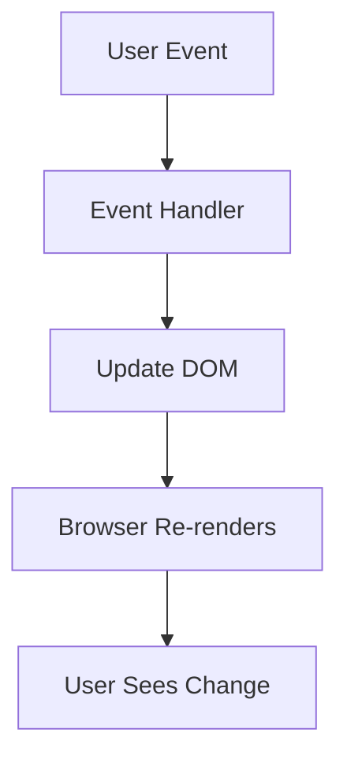

**Remember:** {{One key takeaway for junior developers}}

---

### Pattern 2: {{Event delegation pattern}}

**Intent:** Handle events on dynamic elements without attaching individual listeners

```javascript
// ❌ Attaching listener to each item (bad for dynamic lists)
document.querySelectorAll('.list-item').forEach(item => {
  item.addEventListener('click', handleItemClick);
});

// ✅ Event delegation — one listener on parent
document.querySelector('.list').addEventListener('click', (event) => {
  const item = event.target.closest('.list-item');
  if (item) handleItemClick(item);
});
```

**Diagram:**

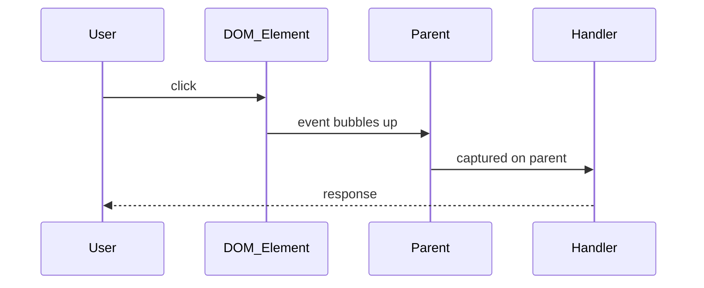

> Include 2 patterns at this level.

---

## Clean Code

### Naming Conventions

| Bad ❌ | Good ✅ | Why |
|--------|---------|-----|
| `<div class="d">` | `<div class="user-card">` | Semantic, self-describing class names |
| `function f(x)` | `function showModal(userId)` | Describes what the function does |
| `const b = true` | `const isMenuOpen = true` | Boolean prefix makes intent clear |

### Function Design

❌ Anti-pattern:
```javascript
// Bad — does too many things, side effects everywhere
function btn1() {
  document.getElementById('x').style.display = 'block';
  document.getElementById('y').innerHTML = 'Hello';
  fetch('/api').then(r => r.json()).then(d => {
    // ...
  });
}
```

✅ Better:
```javascript
// Good — single responsibility, descriptive names
function showWelcomeModal() {
  modal.classList.remove('hidden');
}

function updateGreeting(username) {
  greetingEl.textContent = `Hello, ${username}!`;
}

async function loadUserData(userId) {
  const response = await fetch(`/api/users/${userId}`);
  return response.json();
}
```

**Rule:** Functions should do one thing, and their name should tell you exactly what that thing is.

---

## Product Use / Feature

### 1. {{Product/Tool Name}}

- **How it uses {{TOPIC_NAME}}:** Brief description
- **Why it matters:** Practical impact

> 3-5 real products/tools.

---

## Error Handling

### Error 1: {{Common JS error}}

```javascript
// Code that produces this error
const element = document.querySelector('.non-existent');
element.textContent = 'Hello'; // TypeError: Cannot set properties of null
```

**Why it happens:** `querySelector` returns `null` if element doesn't exist.
**How to fix:**

```javascript
// Always check before using
const element = document.querySelector('.non-existent');
if (element) {
  element.textContent = 'Hello';
}
```

### Error Handling Pattern

```javascript
// Fetch with error handling
async function loadData(url) {
  try {
    const response = await fetch(url);

    if (!response.ok) {
      throw new Error(`HTTP error: ${response.status}`);
    }

    return await response.json();
  } catch (error) {
    console.error('Failed to load data:', error);
    showErrorMessage('Failed to load. Please try again.');
    return null;
  }
}
```

---

## Security Considerations

### 1. XSS via innerHTML

```javascript
// ❌ Insecure — user input as HTML
const userInput = '';
element.innerHTML = userInput;  // Executes the onerror handler!

// ✅ Secure — use textContent for user data
element.textContent = userInput;  // Renders as text, not HTML
```

**Risk:** Cross-site scripting (XSS) — attacker executes JS in victim's browser.
**Mitigation:** Never use `innerHTML` with untrusted data. Use `textContent` or `sanitize-html`.

---

## Performance Tips

### Tip 1: Minimize DOM queries in loops

```javascript
// ❌ Slow — queries DOM on every iteration
for (let i = 0; i < 1000; i++) {
  document.querySelector('.counter').textContent = i; // DOM query 1000 times!
}

// ✅ Faster — cache DOM reference outside loop
const counter = document.querySelector('.counter');
for (let i = 0; i < 1000; i++) {
  counter.textContent = i; // single cached reference
}
```

---

## Metrics & Analytics

| Metric | Why it matters | Tool |
|--------|---------------|------|
| **LCP (Largest Contentful Paint)** | Perceived load speed | Chrome DevTools, Lighthouse |
| **CLS (Cumulative Layout Shift)** | Visual stability | Chrome DevTools |
| **FID (First Input Delay)** | Interactivity | Chrome DevTools |
| **Bundle size (KB)** | Download time | webpack-bundle-analyzer |
| **Lighthouse score** | Overall performance grade | Lighthouse |

---

## Best Practices

- **Do this:** Explanation
- **Do this:** Explanation

---

## Edge Cases & Pitfalls

### Pitfall 1: Event listeners not removed

```javascript
// Bug — adds a new listener every time user clicks "subscribe"
subscribeBtn.addEventListener('click', () => {
  itemBtn.addEventListener('click', handleItemClick); // accumulates!
});
```

**What happens:** Each click on subscribe adds another listener — eventually runs N times.
**How to fix:** Remove old listeners before adding new ones, or use `{ once: true }`.

---

## Common Mistakes

### Mistake 1: Using `==` instead of `===`

```javascript
// ❌ Wrong — type coercion causes unexpected results
0 == false    // true
"" == false   // true
null == undefined // true

// ✅ Correct — strict equality
0 === false   // false
"" === false  // false
```

---

## Common Misconceptions

### Misconception 1: "CSS doesn't affect JavaScript performance"

**Reality:** Complex CSS selectors and frequent style changes trigger layout/paint — JavaScript can cause 100ms+ jank when it forces synchronous layout reads after style writes.

---

## Tricky Points

### Tricky Point 1: `this` in event handlers

```javascript
const obj = {
  name: 'Alice',
  greet: function() {
    button.addEventListener('click', function() {
      console.log(this.name); // undefined — `this` is the button!
    });
  }
};

// Fix: use arrow function (inherits `this` from outer scope)
const obj = {
  name: 'Alice',
  greet: function() {
    button.addEventListener('click', () => {
      console.log(this.name); // 'Alice' — arrow function preserves `this`
    });
  }
};
```

---

## Test

### Multiple Choice

**1. {{Question}}?**

- A) Option A
- B) Option B
- C) Option C
- D) Option D

<details>
<summary>Answer</summary>
**C)** — Explanation.
</details>

### True or False

**2. {{Statement}}**

<details>
<summary>Answer</summary>
**False** — Explanation.
</details>

### What's the Output?

**3. What does this code log?**

```javascript
console.log(1);
setTimeout(() => console.log(2), 0);
Promise.resolve().then(() => console.log(3));
console.log(4);
```

<details>
<summary>Answer</summary>
Output: `1`, `4`, `3`, `2`
Explanation: Sync code runs first (1, 4), then microtasks/Promises (3), then macrotasks/setTimeout (2).
</details>

---

## Tricky Questions

**1. What is event bubbling and how does `stopPropagation()` affect it?**

- A) Events bubble from parent to child; `stopPropagation()` prevents default
- B) Events bubble from child to parent; `stopPropagation()` stops further propagation
- C) Events only fire on the target element
- D) `stopPropagation()` prevents the event from firing at all

<details>
<summary>Answer</summary>
**B)** — Events bubble up the DOM from the target element toward the root. `stopPropagation()` prevents the event from reaching parent elements. `preventDefault()` prevents the browser's default action (e.g., form submission, link navigation).
</details>

---

## Cheat Sheet

| What | Syntax | Example |
|------|--------|---------|
| Select element | `document.querySelector(selector)` | `querySelector('.card')` |
| Change text | `el.textContent = value` | `el.textContent = 'Hello'` |
| Add class | `el.classList.add(name)` | `classList.add('active')` |
| Listen to event | `el.addEventListener(event, fn)` | `addEventListener('click', fn)` |
| Fetch data | `await fetch(url).then(r => r.json())` | `fetch('/api/users')` |

---

## Self-Assessment Checklist

### I can explain:
- [ ] What the DOM is and how it relates to HTML
- [ ] How event bubbling works
- [ ] The difference between `==` and `===`

### I can do:
- [ ] Build an interactive web page from scratch (HTML + CSS + JS)
- [ ] Handle user events and update the DOM
- [ ] Fetch data from an API and display it

---

## Summary

- Key point 1
- Key point 2

**Next step:** What to learn after this topic.

---

## What You Can Build

### Projects:
- **{{Project 1}}:** An interactive form with validation
- **{{Project 2}}:** A weather app using a public API
- **{{Project 3}}:** A to-do list with local storage

### Learning path:

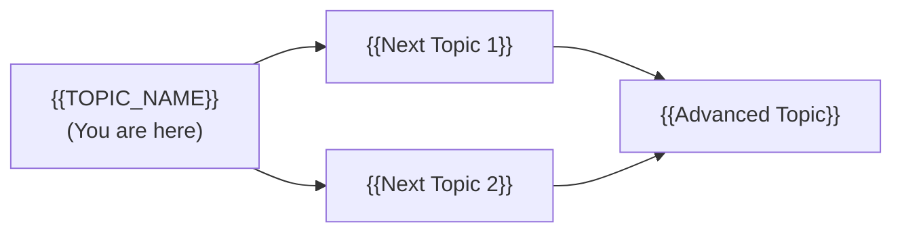

---

## Further Reading

- **MDN Web Docs:** [{{link title}}]({{url}})
- **Blog post:** [{{link title}}]({{url}})

---

## Related Topics

- **[{{Related Topic 1}}](../XX-related-topic/)** — how it connects
- **[{{Related Topic 2}}](../XX-related-topic/)** — how it connects

---

## Diagrams & Visual Aids

### Mind Map

```mermaid
mindmap
  root(({{TOPIC_NAME}}))
    HTML
      Semantic markup
      Accessibility
    CSS
      Selectors
      Box model
      Flexbox/Grid
    JavaScript
      DOM manipulation
      Events
      Async/Fetch
```

</details>

---
---

# TEMPLATE 2 — `middle.md`

<details open>
<summary><strong>Template Content</strong></summary>

# {{TOPIC_NAME}} — Middle Level

## Table of Contents

1. [Introduction](#introduction)
2. [Core Concepts](#core-concepts)
3. [Pros & Cons](#pros--cons)
4. [Use Cases](#use-cases)
5. [Code Examples](#code-examples)
6. [Coding Patterns](#coding-patterns)
7. [Clean Code](#clean-code)
8. [Product Use / Feature](#product-use--feature)
9. [Error Handling](#error-handling)
10. [Security Considerations](#security-considerations)
11. [Performance Optimization](#performance-optimization)
12. [Metrics & Analytics](#metrics--analytics)
13. [Debugging Guide](#debugging-guide)
14. [Best Practices](#best-practices)
15. [Edge Cases & Pitfalls](#edge-cases--pitfalls)
16. [Common Mistakes](#common-mistakes)
17. [Tricky Points](#tricky-points)
18. [Test](#test)
19. [Tricky Questions](#tricky-questions)
20. [Cheat Sheet](#cheat-sheet)
21. [Summary](#summary)
22. [What You Can Build](#what-you-can-build)
23. [Further Reading](#further-reading)
24. [Related Topics](#related-topics)
25. [Diagrams & Visual Aids](#diagrams--visual-aids)

---

## Introduction

> Focus: "Why?" and "When to use?"

Assumes the reader knows basic HTML/CSS/JS. This level covers:
- Browser APIs, accessibility standards, and performance
- TypeScript, modern JavaScript patterns
- Testing and production considerations

---

## Core Concepts

### Concept 1: {{Advanced concept — e.g., Virtual DOM, Web Workers}}

Detailed explanation with diagrams.

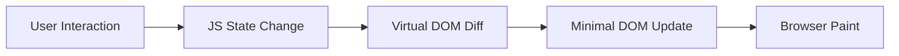

---

## Pros & Cons

| Pros | Cons |
|------|------|
| {{Advantage 1}} | {{Disadvantage 1}} |
| {{Advantage 2}} | {{Disadvantage 2}} |

### Comparison with alternatives:

| Approach | Pros | Cons | Best for |
|----------|------|------|----------|
| {{Approach A}} | {{pros}} | {{cons}} | {{scenario}} |
| {{Approach B}} | {{pros}} | {{cons}} | {{scenario}} |

---

## Code Examples

### Example 1: {{Production-ready JavaScript pattern}}

```typescript
// TypeScript with proper types
interface UserProfile {
  id: number;
  name: string;
  avatar: string;
  role: 'admin' | 'user' | 'viewer';
}

async function fetchUserProfile(userId: number): Promise<UserProfile | null> {
  try {
    const response = await fetch(`/api/users/${userId}`, {
      headers: { 'Authorization': `Bearer ${getToken()}` },
      signal: AbortSignal.timeout(5000), // 5s timeout
    });

    if (response.status === 404) return null;
    if (!response.ok) throw new Error(`HTTP ${response.status}`);

    return await response.json() as UserProfile;
  } catch (error) {
    if (error instanceof TypeError) {
      console.error('Network error:', error);
    }
    throw error;
  }
}
```

### Example 2: {{CSS — modern layout pattern}}

```css
/* CSS Grid for complex layouts */
.dashboard {
  display: grid;
  grid-template-columns: 250px 1fr;
  grid-template-rows: 64px 1fr;
  grid-template-areas:
    "sidebar header"
    "sidebar main";
  min-height: 100vh;
}

.dashboard__sidebar { grid-area: sidebar; }
.dashboard__header  { grid-area: header; }
.dashboard__main    { grid-area: main; overflow-y: auto; }

/* Responsive: stack on mobile */
@media (max-width: 768px) {
  .dashboard {
    grid-template-columns: 1fr;
    grid-template-areas:
      "header"
      "main";
  }
  .dashboard__sidebar { display: none; }
}
```

---

## Coding Patterns

### Pattern 1: {{Observer / Pub-Sub Pattern}}

**Category:** Behavioral / State Management
**Intent:** Decouple components via events
**When to use:** When multiple components need to react to state changes
**When NOT to use:** Simple parent-child data flow (use props)

**Structure diagram:**

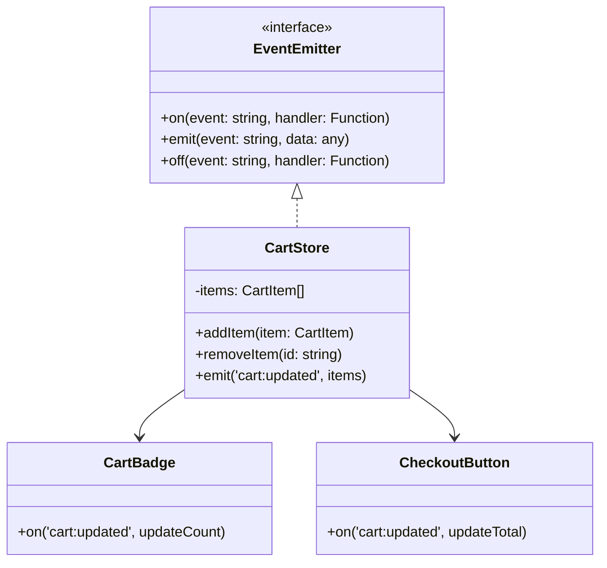

**Implementation:**

```javascript
class EventEmitter {
  #handlers = new Map();

  on(event, handler) {
    if (!this.#handlers.has(event)) this.#handlers.set(event, new Set());
    this.#handlers.get(event).add(handler);
    return () => this.off(event, handler); // returns unsubscribe fn
  }

  emit(event, data) {
    this.#handlers.get(event)?.forEach(h => h(data));
  }

  off(event, handler) {
    this.#handlers.get(event)?.delete(handler);
  }
}
```

---

### Pattern 2: {{Module Pattern}}

**Category:** Structural / Encapsulation
**Intent:** Encapsulate related state and behavior

**Flow diagram:**

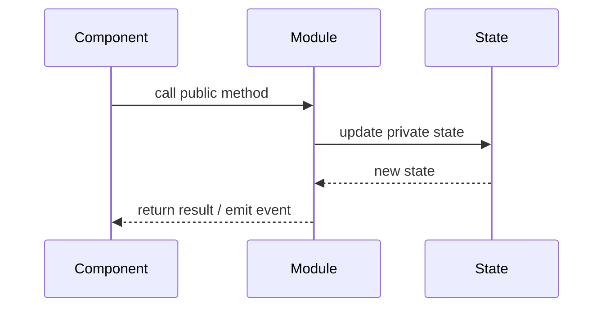

```javascript
// IIFE module pattern
const ThemeManager = (() => {
  let currentTheme = 'light'; // private

  function applyTheme(theme) {
    document.documentElement.setAttribute('data-theme', theme);
    localStorage.setItem('theme', theme);
    currentTheme = theme;
  }

  return {
    init() {
      const saved = localStorage.getItem('theme') || 'light';
      applyTheme(saved);
    },
    toggle() {
      applyTheme(currentTheme === 'light' ? 'dark' : 'light');
    },
    getTheme() { return currentTheme; },
  };
})();
```

---

### Pattern 3: {{Component Composition Pattern}}

**Intent:** Build complex UIs from small, reusable pieces

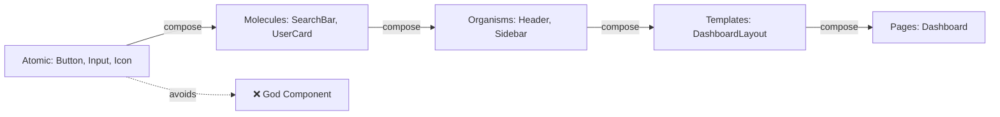

```javascript
// ❌ Non-idiomatic — god component
class Dashboard {
  renderHeader() { ... }
  renderSidebar() { ... }
  renderChart() { ... }
  handleResize() { ... }
  fetchData() { ... }
  // 500 lines...
}

// ✅ Composed from focused pieces
class Dashboard {
  constructor() {
    this.header   = new DashboardHeader();
    this.sidebar  = new DashboardSidebar();
    this.charts   = new ChartsPanel();
  }
  render() {
    return `${this.header.render()}${this.sidebar.render()}${this.charts.render()}`;
  }
}
```

---

## Clean Code

### Naming & Readability

```javascript
// ❌ Cryptic
const x = document.querySelectorAll('.i');
x.forEach(e => e.style.display = n ? 'block' : 'none');

// ✅ Self-documenting
const menuItems = document.querySelectorAll('.nav__item');
const isMenuOpen = true;
menuItems.forEach(item => item.style.display = isMenuOpen ? 'block' : 'none');
```

| Element | Rule | Example |
|---------|------|---------|
| CSS classes | BEM or descriptive | `.user-card__title`, `.btn--primary` |
| JS variables | Noun or noun phrase | `activeUsers`, `isLoading`, `menuItems` |
| Functions | Verb + noun | `toggleMenu`, `fetchUserData`, `renderCard` |
| Constants | UPPER_SNAKE or descriptive | `MAX_RETRY_COUNT`, `API_BASE_URL` |

---

## Product Use / Feature

### 1. {{Product/Tool Name}}

- **How it uses {{TOPIC_NAME}}:** Description with context
- **Scale:** Numbers, user impact

---

## Error Handling

### Pattern 1: Graceful degradation

```javascript
// Feature detection + graceful degradation
if ('IntersectionObserver' in window) {
  // Use modern lazy loading
  const observer = new IntersectionObserver(entries => {
    entries.forEach(entry => {
      if (entry.isIntersecting) {
        entry.target.src = entry.target.dataset.src;
        observer.unobserve(entry.target);
      }
    });
  });
  document.querySelectorAll('img[data-src]').forEach(img => observer.observe(img));
} else {
  // Fallback: load all images immediately
  document.querySelectorAll('img[data-src]').forEach(img => {
    img.src = img.dataset.src;
  });
}
```

---

## Security Considerations

### 1. Content Security Policy (CSP)

**Risk level:** High

```html
<!-- ❌ No CSP — any script can run -->
<script>alert(1)</script>  <!-- XSS works -->

<!-- ✅ CSP header prevents inline scripts -->
<!-- HTTP header: Content-Security-Policy: default-src 'self'; script-src 'self' -->
<!-- Now inline scripts are blocked by the browser -->
```

### Security Checklist

- [ ] CSP headers configured — prevent XSS
- [ ] `innerHTML` never used with user data — use `textContent`
- [ ] Sensitive data (tokens) in `sessionStorage` not `localStorage`
- [ ] `rel="noopener noreferrer"` on external links
- [ ] HTTPS enforced — no mixed content

---

## Performance Optimization

### Optimization 1: Debounce frequent events

```javascript
// ❌ Slow — fires on every keypress
searchInput.addEventListener('input', (e) => {
  fetchSearchResults(e.target.value); // API call on every keystroke!
});

// ✅ Fast — wait until user stops typing
function debounce(fn, delay) {
  let timer;
  return (...args) => {
    clearTimeout(timer);
    timer = setTimeout(() => fn(...args), delay);
  };
}

const debouncedSearch = debounce((value) => fetchSearchResults(value), 300);
searchInput.addEventListener('input', (e) => debouncedSearch(e.target.value));
```

### Performance Decision Matrix

| Scenario | Approach | Why |
|----------|----------|-----|
| Rapid user input | Debounce 300ms | Reduce API calls |
| Scroll / resize | Throttle 16ms | Prevent jank |
| Expensive renders | RequestAnimationFrame | Sync with browser paint |
| Large lists | Virtual scrolling | Render only visible items |

---

## Metrics & Analytics

### Core Web Vitals

| Metric | Description | Good | Poor | Tool |
|--------|-------------|------|------|------|
| **LCP** | Largest Contentful Paint — load speed | < 2.5s | > 4s | Lighthouse |
| **CLS** | Cumulative Layout Shift — stability | < 0.1 | > 0.25 | Chrome DevTools |
| **FID** | First Input Delay — interactivity | < 100ms | > 300ms | Chrome DevTools |
| **INP** | Interaction to Next Paint (replaces FID) | < 200ms | > 500ms | Chrome DevTools |

### Bundle Size Targets

| Asset | Target | Tool |
|-------|--------|------|
| JavaScript (initial) | < 170KB gzipped | webpack-bundle-analyzer |
| CSS (initial) | < 50KB gzipped | PurgeCSS |
| Images | WebP/AVIF format | Squoosh |
| Total page weight | < 1MB | Lighthouse |

---

## Debugging Guide

### Problem 1: Layout shift causing poor CLS score

**Symptoms:** Content jumps when images load; CLS > 0.1 in Lighthouse.

**Diagnostic steps:**
```html
<!-- Check: images without dimensions -->
  <!-- no width/height → layout shift! -->
```

**Root cause:** Browser doesn't know image size before it loads → reserves no space → content shifts when image arrives.
**Fix:** Always set `width` and `height` attributes, or use aspect-ratio CSS.

```html
<!-- Fixed: explicit dimensions prevent layout shift -->

```

---

## Best Practices

- **Practice 1:** Always add `width` and `height` to images to prevent CLS
- **Practice 2:** Load non-critical CSS asynchronously

---

## Edge Cases & Pitfalls

### Pitfall 1: Memory leak from unremoved event listeners

```javascript
// Component mounts and adds listener
function mountModal() {
  document.addEventListener('keydown', handleEscapeKey);
}

// Bug: unmounting doesn't remove the listener → accumulates on remount
function unmountModal() {
  // forgot to removeEventListener!
}

// Fix
function unmountModal() {
  document.removeEventListener('keydown', handleEscapeKey);
}
```

---

## Common Mistakes

### Mistake 1: Not using semantic HTML

```html
<!-- ❌ Div soup — no semantics, bad for accessibility and SEO -->
<div class="header">
  <div class="nav">
    <div class="nav-item">Home</div>
  </div>
</div>

<!-- ✅ Semantic HTML -->
<header>
  <nav aria-label="Main navigation">
    <ul>
      <li><a href="/">Home</a></li>
    </ul>
  </nav>
</header>
```

---

## Test

### Multiple Choice (harder)

**1. What is the Lighthouse performance score based on?**

- A) Only load time
- B) A weighted combination of LCP, FID/INP, CLS, TBT, and Speed Index
- C) Number of HTTP requests
- D) JavaScript bundle size

<details>
<summary>Answer</summary>
**B)** — Lighthouse calculates a composite score from multiple metrics: LCP (25%), TBT (30%), CLS (25%), Speed Index (10%), FCP (10%).
</details>

---

## Tricky Questions

**1. Why does `display: none` on a parent cause child elements to be removed from the accessibility tree?**

- A) It's a CSS bug
- B) `display: none` removes elements from rendering AND the accessibility tree; use `visibility: hidden` to hide visually while keeping accessible
- C) Screen readers always ignore `display: none`
- D) This only happens in Chrome

<details>
<summary>Answer</summary>
**B)** — `display: none` removes the element from both the layout and the accessibility tree (assistive technologies can't find it). Use `visibility: hidden` (hides visually, keeps in accessibility tree) or `aria-hidden="true"` (hides from AT, keeps in layout).
</details>

---

## Cheat Sheet

| Scenario | Pattern | Key consideration |
|----------|---------|-------------------|
| Rapid events | Debounce 300ms | Use `clearTimeout` approach |
| Scroll handler | Throttle with rAF | `requestAnimationFrame` |
| Image loading | `width` + `height` attributes | Prevents CLS |
| External links | `rel="noopener noreferrer"` | Security + privacy |
| Dynamic content | ARIA live regions | Screen reader announcements |

---

## Summary

- Core Web Vitals: LCP, CLS, FID/INP — measure user experience, not just load speed
- Debounce/throttle: essential for responsive UIs
- Semantic HTML: foundation of accessibility and SEO

**Next step:** Senior level — performance architecture, design systems, Core Web Vitals optimization.

---

## What You Can Build

### Production systems:
- **Accessible web app:** WCAG 2.1 AA compliant, keyboard navigable
- **Performance-optimized landing page:** Lighthouse score > 90

---

## Further Reading

- **MDN Web Docs:** [{{link title}}]({{url}})
- **web.dev:** [Core Web Vitals](https://web.dev/vitals/)

---

## Diagrams & Visual Aids

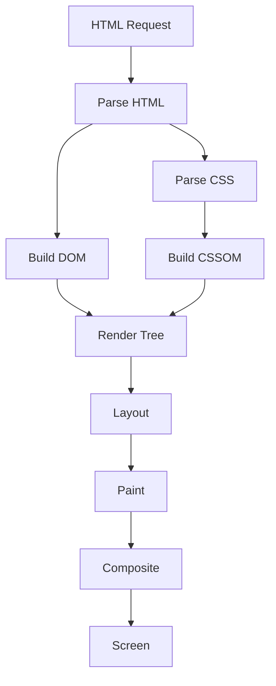

</details>

---
---

# TEMPLATE 3 — `senior.md`

<details open>
<summary><strong>Template Content</strong></summary>

# {{TOPIC_NAME}} — Senior Level

## Table of Contents

1. [Introduction](#introduction)
2. [Core Concepts](#core-concepts)
3. [Pros & Cons](#pros--cons)
4. [Use Cases](#use-cases)
5. [Code Examples](#code-examples)
6. [Coding Patterns](#coding-patterns)
7. [Clean Code](#clean-code)
8. [Best Practices](#best-practices)
9. [Product Use / Feature](#product-use--feature)
10. [Error Handling](#error-handling)
11. [Security Considerations](#security-considerations)
12. [Performance Optimization](#performance-optimization)
13. [Metrics & Analytics](#metrics--analytics)
14. [Debugging Guide](#debugging-guide)
15. [Edge Cases & Pitfalls](#edge-cases--pitfalls)
16. [Postmortems & System Failures](#postmortems--system-failures)
17. [Common Mistakes](#common-mistakes)
18. [Tricky Points](#tricky-points)
19. [Test](#test)
20. [Tricky Questions](#tricky-questions)
21. [Cheat Sheet](#cheat-sheet)
22. [Summary](#summary)
23. [What You Can Build](#what-you-can-build)
24. [Further Reading](#further-reading)
25. [Related Topics](#related-topics)
26. [Diagrams & Visual Aids](#diagrams--visual-aids)

---

## Introduction

> Focus: "How to optimize?" and "How to architect?"

For frontend developers who:
- Design component libraries and design systems
- Own Core Web Vitals and performance budgets
- Architect large-scale frontend applications
- Define accessibility standards for the team

---

## Core Concepts

### Concept 1: {{Architecture-level concept — design systems, micro-frontends}}

Deep dive with benchmark comparisons:

```javascript
// Benchmark: rendering performance
// Measuring time to render 10,000 list items

// Naive approach
console.time('naive');
items.forEach(item => {
  const li = document.createElement('li');
  li.textContent = item.name;
  list.appendChild(li);  // DOM mutation in loop — triggers reflow N times
});
console.timeEnd('naive'); // ~850ms

// Optimized: DocumentFragment
console.time('fragment');
const fragment = document.createDocumentFragment();
items.forEach(item => {
  const li = document.createElement('li');
  li.textContent = item.name;
  fragment.appendChild(li);
});
list.appendChild(fragment); // single DOM mutation
console.timeEnd('fragment'); // ~12ms
```

---

## Coding Patterns

### Pattern 1: {{Architectural pattern — e.g., Micro-Frontends}}

**Category:** Architectural / Team Scalability
**Intent:** Allow independent teams to own and deploy frontend slices
**Problem it solves:** Large monolithic frontend — deploy dependencies, slow releases

**Architecture diagram:**

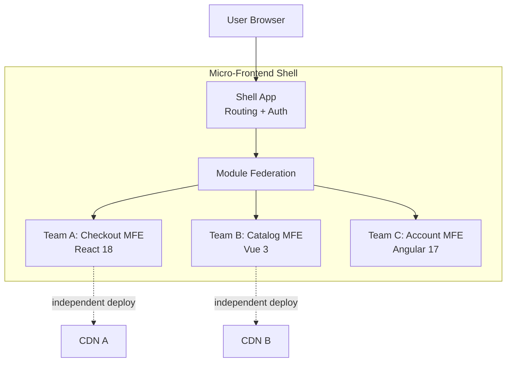

```javascript
// Webpack Module Federation config
// Shell app: webpack.config.js
module.exports = {
  plugins: [
    new ModuleFederationPlugin({
      name: 'shell',
      remotes: {
        checkout: 'checkout@https://checkout.example.com/remoteEntry.js',
        catalog:  'catalog@https://catalog.example.com/remoteEntry.js',
      },
    }),
  ],
};

// Dynamic import of remote component
const CheckoutApp = React.lazy(() => import('checkout/App'));
```

---

### Pattern 2: {{Performance Pattern — Virtual Scrolling}}

**Category:** Performance / Rendering
**Intent:** Render only visible items from a large list

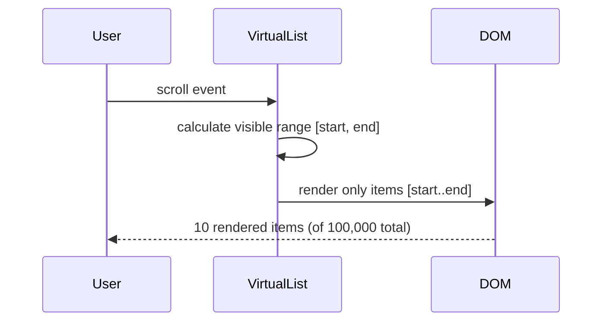

```javascript
class VirtualScroller {
  constructor({ container, items, itemHeight, renderItem }) {
    this.items = items;
    this.itemHeight = itemHeight;
    this.renderItem = renderItem;
    this.container = container;

    container.style.position = 'relative';
    container.style.height = `${items.length * itemHeight}px`;
    container.style.overflow = 'auto';

    container.addEventListener('scroll', this.#onScroll.bind(this));
    this.#render();
  }

  #onScroll() {
    this.#render();
  }

  #render() {
    const scrollTop = this.container.scrollTop;
    const containerHeight = this.container.clientHeight;

    const startIndex = Math.floor(scrollTop / this.itemHeight);
    const endIndex = Math.min(
      startIndex + Math.ceil(containerHeight / this.itemHeight) + 1,
      this.items.length
    );

    // Remove all previous items
    this.container.innerHTML = '';

    // Render only visible items
    for (let i = startIndex; i < endIndex; i++) {
      const el = this.renderItem(this.items[i]);
      el.style.position = 'absolute';
      el.style.top = `${i * this.itemHeight}px`;
      this.container.appendChild(el);
    }
  }
}
```

---

### Pattern 3: {{State Architecture — Flux/Redux Pattern}}

**Category:** State Management
**Intent:** Predictable, auditable state changes at scale

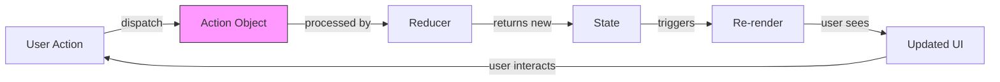

---

### Pattern 4: {{Accessibility Pattern — Focus Management}}

**Category:** Accessibility / UX
**Intent:** Ensure keyboard users can navigate complex interactive components

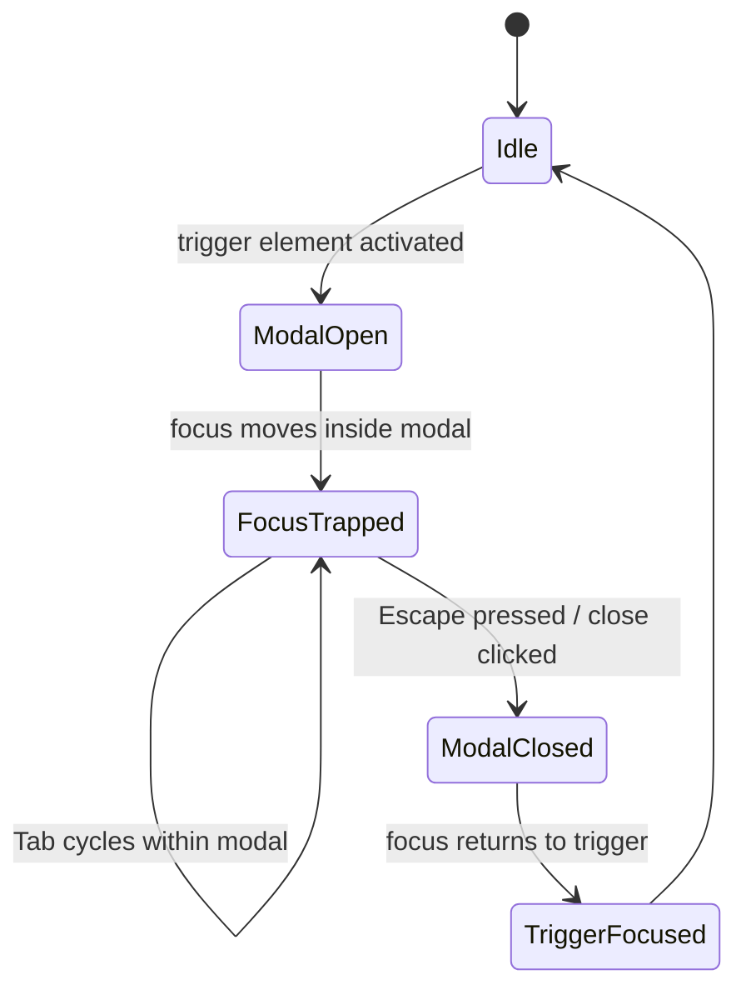

```javascript
function trapFocus(modal) {
  const focusable = modal.querySelectorAll(
    'button, [href], input, select, textarea, [tabindex]:not([tabindex="-1"])'
  );
  const first = focusable[0];
  const last  = focusable[focusable.length - 1];

  modal.addEventListener('keydown', (e) => {
    if (e.key !== 'Tab') return;

    if (e.shiftKey) {
      if (document.activeElement === first) { last.focus(); e.preventDefault(); }
    } else {
      if (document.activeElement === last) { first.focus(); e.preventDefault(); }
    }
  });

  first.focus(); // Move focus into modal on open
}
```

### Pattern Comparison Matrix

| Pattern | Use When | Avoid When | Complexity |
|---------|----------|------------|------------|
| Micro-Frontends | Multiple teams, independent deploys | Single team, small app | High |
| Virtual Scrolling | > 1000 items in a list | < 100 items | Medium |
| Flux/Redux | Shared state across many components | Local component state | Medium |
| Focus Management | Any interactive overlay/dialog | Simple static pages | Low |

---

## Clean Code

### Clean Architecture Boundaries

```javascript
// ❌ Layering violation — UI knows about data fetching details
function UserCard({ userId }) {
  const [user, setUser] = useState(null);
  useEffect(() => {
    fetch(`/api/users/${userId}`) // direct API call in component
      .then(r => r.json())
      .then(setUser);
  }, [userId]);
  return <div>{user?.name}</div>;
}

// ✅ Clean separation: component → hook → service
function UserCard({ userId }) {
  const { user, loading } = useUser(userId); // component knows nothing about fetching
  if (loading) return <Skeleton />;
  return <div>{user.name}</div>;
}

function useUser(userId) {
  return useQuery(['user', userId], () => userService.getById(userId));
}

const userService = {
  getById: (id) => fetch(`/api/users/${id}`).then(r => r.json()),
};
```

### Code Review Checklist (Senior)

- [ ] All images have `alt` text and `width`/`height` attributes
- [ ] Interactive elements reachable by keyboard
- [ ] Color contrast ratio ≥ 4.5:1 (WCAG AA)
- [ ] No `console.log` in production code
- [ ] Event listeners removed on component unmount
- [ ] No layout thrashing (reads before writes)
- [ ] Bundle size impact checked for new dependencies

---

## Best Practices

### Must Do ✅

1. **Set a performance budget and enforce it in CI**
   ```yaml
   # lighthouse-ci.config.yml
   collect:
     numberOfRuns: 3
   assert:
     assertions:
       first-contentful-paint:
         - warn
         - maxNumericValue: 2000
       largest-contentful-paint:
         - error
         - maxNumericValue: 2500
       cumulative-layout-shift:
         - error
         - maxNumericValue: 0.1
   ```

2. **Preload critical resources**
   ```html
   <!-- Preload LCP image — tells browser to fetch immediately -->
   <link rel="preload" href="/hero.webp" as="image" type="image/webp" />
   <!-- Preconnect to third-party domains -->
   <link rel="preconnect" href="https://fonts.googleapis.com" crossorigin />
   ```

3. **Use `will-change` sparingly — only for known animations**
   ```css
   /* ✅ Promotes element to GPU layer before animation */
   .animated-card { will-change: transform; }
   /* ❌ Overuse causes excessive GPU memory consumption */
   * { will-change: transform; }
   ```

### Never Do ❌

1. **Never render thousands of DOM nodes simultaneously** — use virtual scrolling
2. **Never import entire icon libraries** — import individual icons
   ```javascript
   // ❌ imports ALL icons (500KB+)
   import { ... } from '@fortawesome/free-solid-svg-icons';
   // ✅ imports only what you need
   import { faUser } from '@fortawesome/free-solid-svg-icons/faUser';
   ```
3. **Never block rendering with synchronous scripts in `<head>`**

### Production Checklist

- [ ] Lighthouse score > 90 on mobile
- [ ] LCP < 2.5s, CLS < 0.1, FID < 100ms
- [ ] All images: WebP/AVIF format, `width`/`height` attributes, `loading="lazy"`
- [ ] JavaScript bundle: code-split by route, tree-shaken
- [ ] Critical CSS inlined, non-critical CSS async-loaded
- [ ] WCAG 2.1 AA accessibility compliance verified
- [ ] CSP headers configured
- [ ] Error boundary catches render failures gracefully

---

## Product Use / Feature

### 1. {{Company/Product Name}}

- **Architecture:** How they implement {{TOPIC_NAME}} at scale
- **Scale:** Specific numbers (users, page views)
- **Lessons learned:** What they changed and why

---

## Performance Optimization

### Optimization 1: LCP image optimization

```html
<!-- Before: LCP image loads late -->


<!-- After: preloaded, correct format, no lazy loading -->
<link rel="preload" href="hero.webp" as="image" />
<picture>
  <source srcset="hero.avif" type="image/avif" />
  <source srcset="hero.webp" type="image/webp" />
  
</picture>
```

**Benchmark proof:**
```
Before: LCP 4.2s (hero.jpg — 480KB, discovered late)
After:  LCP 1.8s (hero.avif — 95KB, preloaded immediately)
```

---

## Metrics & Analytics

### SLO / SLA Definition

| SLI | SLO Target | Measurement | Consequence |
|-----|-----------|-------------|-------------|
| **LCP** | < 2.5s on mobile | Real User Monitoring | Alert |
| **CLS** | < 0.1 | RUM | Alert |
| **INP** | < 200ms | RUM | Alert |
| **Bundle size** | < 200KB gzipped | CI check | Build failure |
| **Lighthouse score** | > 85 | CI on every PR | PR blocked |

---

## Postmortems & System Failures

### The Font Loading CLS Incident

- **The goal:** Deploy a new brand font
- **The mistake:** Font loaded without `font-display: swap` — text was invisible for 2s, then caused a layout shift when font loaded
- **The impact:** CLS jumped from 0.05 to 0.42 — Google ranking dropped
- **The fix:** Added `font-display: swap`, preloaded font file, used `size-adjust` to prevent layout shift

**Key takeaway:** Web fonts are a hidden CLS risk. Always preload and use `font-display: optional` or `swap` with size-adjusted fallbacks.

---

## Test

### Architecture Questions

**1. Your LCP metric is 5s on mobile despite a fast server response. What could cause this?**

- A) Server-side rendering is too slow
- B) LCP image is not in the initial HTML (lazy-loaded by JS), not preloaded, wrong format
- C) Too much CSS
- D) Missing HTTP/2

<details>
<summary>Answer</summary>
**B)** — LCP measures when the largest element becomes visible. If the hero image is loaded by JavaScript or has `loading="lazy"`, the browser discovers it late. Fix: include `` in HTML (not JS), add `<link rel="preload">`, use WebP/AVIF format, add `fetchpriority="high"`.
</details>

---

## Tricky Questions

**1. Why does `will-change: transform` improve animation performance even before the animation starts?**

<details>
<summary>Answer</summary>
`will-change: transform` hints to the browser that this element will be transformed. The browser promotes it to its own compositor layer (GPU texture) in advance. When the animation runs, it's handled entirely by the GPU compositor thread — not the main thread. This means animation frames continue smoothly even when JavaScript or layout work is happening on the main thread.
</details>

---

## Cheat Sheet

### Architecture Decision Matrix

| Scenario | Recommended | Avoid | Why |
|----------|-------------|-------|-----|
| Hero image | preload + fetchpriority=high | lazy loading | LCP critical |
| Non-critical images | loading="lazy" | eager loading all | Bandwidth waste |
| Long list | Virtual scrolling | Render all items | DOM size / memory |
| Route chunks | React.lazy + Suspense | Single bundle | Initial load time |
| Animations | CSS transforms | JS position changes | Compositor thread |

### Core Web Vitals Quick Fix Matrix

| Bad Metric | Common Cause | Quick Fix |
|------------|--------------|-----------|
| LCP > 4s | Hero image discovered late | `<link rel="preload">` + `fetchpriority="high"` |
| CLS > 0.25 | Images without dimensions | Add `width`/`height` to `` |
| INP > 500ms | Long JS task blocks main thread | Break into smaller tasks with scheduler.yield |
| FCP > 3s | Render-blocking CSS/JS | async CSS, defer non-critical JS |

---

## Summary

- Performance: LCP, CLS, INP are the metrics that matter most to users and Google
- Architecture: design systems + component composition = maintainable at scale
- Accessibility: not optional — 15% of users rely on it, and it affects everyone

---

## What You Can Build

### Architect and lead:
- **Design System:** Reusable component library with accessibility and performance baked in
- **Micro-Frontend Platform:** Independent team deployment architecture

### Career impact:
- **Staff Frontend Engineer** — sets performance standards for the org
- **Frontend Architect** — owns Core Web Vitals across all products

---

## Further Reading

- **web.dev:** [Core Web Vitals](https://web.dev/vitals/)
- **Blog:** [Chrome Developers Performance](https://developer.chrome.com/docs/devtools/performance/)
- **MDN:** [Web Performance](https://developer.mozilla.org/en-US/docs/Web/Performance)

---

## Diagrams & Visual Aids

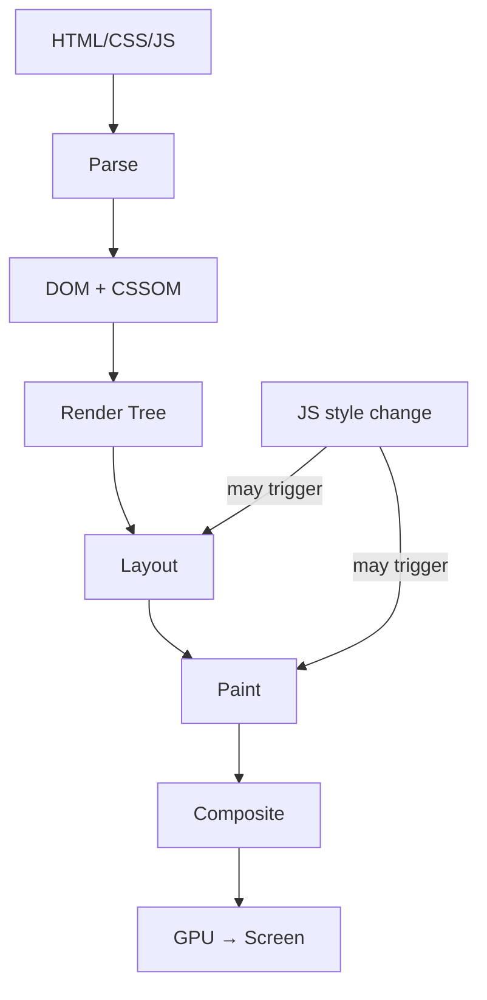

</details>

---
---

# TEMPLATE 4 — `professional.md`

<details open>
<summary><strong>Template Content</strong></summary>

# {{TOPIC_NAME}} — Browser Engine Internals

## Table of Contents

1. [Introduction](#introduction)
2. [Rendering Pipeline Deep Dive](#rendering-pipeline-deep-dive)
3. [V8 JIT Compilation Internals](#v8-jit-compilation-internals)
4. [Layout and Paint Internals](#layout-and-paint-internals)
5. [Compositor Thread and Layers](#compositor-thread-and-layers)
6. [Memory Layout](#memory-layout)
7. [Performance Internals](#performance-internals)
8. [Edge Cases at the Lowest Level](#edge-cases-at-the-lowest-level)
9. [Test](#test)
10. [Tricky Questions](#tricky-questions)
11. [Summary](#summary)
12. [Further Reading](#further-reading)
13. [Diagrams & Visual Aids](#diagrams--visual-aids)

---

## Introduction

> Focus: "What happens under the hood?"

This document explores what happens internally in the browser:
- The full rendering pipeline from HTML bytes to GPU pixels
- How V8 JIT compiles and optimizes JavaScript
- How layout, paint, and compositing work
- How the compositor thread achieves smooth 60fps animations

---

## Rendering Pipeline Deep Dive

### From URL to pixels — the complete pipeline:

```
1. Network: fetch HTML bytes → feed to parser incrementally
2. HTML Parser:
   - Tokenizer: bytes → tokens (StartTag, EndTag, Text, Comment)
   - Tree construction: tokens → DOM nodes
   - Pre-load scanner: looks ahead for resources to prefetch
3. CSS Parser: bytes → CSSOM (separate thread)
4. Script execution: blocks HTML parsing (unless async/defer)
5. Render Tree: DOM + CSSOM → visible nodes with computed styles
6. Layout (Reflow):
   - Box model calculation: position, width, height, margins
   - Produces "layout objects" with geometry
7. Layer Tree:
   - Determine which elements get their own compositor layer
   - Criteria: will-change, 3D transforms, video, canvas, opacity < 1
8. Paint:
   - Each layer gets a list of draw commands (not pixel data yet)
   - Commands: fillRect, drawText, drawImage...
9. Rasterization (Blink Renderer):
   - Convert draw commands to pixels using Skia (CPU) or Ganesh (GPU)
   - Done in a separate raster worker thread
10. Composite:
   - GPU combines all rasterized layers
   - Applies transforms, opacity at GPU speed
   - Outputs to screen buffer (vsync)
```

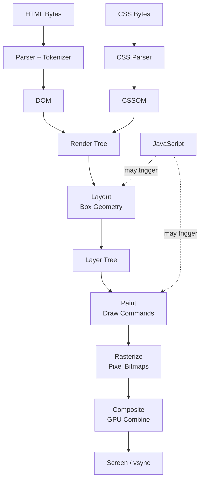

---

## V8 JIT Compilation Internals

### How V8 turns JavaScript into machine code:

```
V8 Compilation Pipeline:
Source Code (JS)
    │
    ▼ Parser
Abstract Syntax Tree (AST)
    │
    ▼ Ignition (Interpreter)
Bytecode
    │  (runs first time — warm up)
    ▼ Feedback: type information collected
    │  (function called 100+ times with same types)
    ▼ TurboFan (Optimizing JIT Compiler)
Optimized Machine Code
    │  (runs fast)
    ▼ Deoptimization trigger
    │  (type changes: number → string → revert)
    ▼ Ignition (back to bytecode)
```

### Hidden Classes (Shapes)

```javascript
// V8 creates "hidden classes" to optimize property access

// ❌ Different property order → different hidden class → no optimization
const user1 = {};
user1.name = 'Alice'; // shape S1: { name }
user1.age  = 25;      // shape S2: { name, age }

const user2 = {};
user2.age  = 30;      // shape S3: { age }
user2.name = 'Bob';   // shape S4: { age, name }
// user1 and user2 have DIFFERENT hidden classes → IC miss → no inline cache

// ✅ Same property order → same hidden class → fast IC hit
function User(name, age) {
  this.name = name;  // always added first
  this.age  = age;   // always added second
  // Same shape every time → V8 optimizes property access to pointer offsets
}

const u1 = new User('Alice', 25); // shape: { name, age }
const u2 = new User('Bob', 30);   // same shape → IC hit
```

### Inline Caches (IC)

```javascript
// V8's Inline Cache optimization

function getLength(arr) {
  return arr.length;  // V8 needs to look up 'length' property
}

// After 100 calls with Array: V8 specializes — stores the offset of Array.length
// Subsequent calls: direct memory read instead of property lookup
// Speedup: 10-100x vs polymorphic dispatch

// ⚠️ Deoptimization trigger
getLength([1, 2, 3]);     // Array → IC monomorphic (fast)
getLength('hello');       // String → IC polymorphic (slower)
getLength({ length: 5 }); // Object → IC megamorphic (slow — general lookup)
```

---

## Layout and Paint Internals

### What triggers layout (reflow):

```
Layout-triggering properties (expensive):
┌─────────────────────────────────────────────┐
│ Read these AFTER writing styles → Reflow:   │
│   offsetHeight, offsetWidth, offsetTop      │
│   scrollHeight, scrollWidth, scrollTop      │
│   clientHeight, clientWidth                 │
│   getBoundingClientRect()                   │
│   getComputedStyle()                        │
└─────────────────────────────────────────────┘

Properties that skip layout (cheap — compositor only):
┌─────────────────────────────────────────────┐
│ transform: translate/rotate/scale           │
│ opacity                                     │
│ filter                                      │
└─────────────────────────────────────────────┘
```

```javascript
// ❌ Layout thrashing: alternating reads and writes
const boxes = document.querySelectorAll('.box');

// Every iteration: write style → browser must flush pending work → read causes reflow
boxes.forEach(box => {
  box.style.width = box.offsetWidth + 10 + 'px';  // write then read!
});

// ✅ Batch: all reads first, then all writes
const widths = Array.from(boxes).map(box => box.offsetWidth); // read all
boxes.forEach((box, i) => {
  box.style.width = widths[i] + 10 + 'px';  // write all
});
```

### Paint profiling

```javascript
// Chrome DevTools: mark paint regions
// Open DevTools → More tools → Rendering → Paint flashing
// Green highlights = areas being repainted

// Programmatic paint measurement
const observer = new PerformanceObserver((list) => {
  list.getEntries().forEach(entry => {
    if (entry.entryType === 'paint') {
      console.log(`${entry.name}: ${entry.startTime.toFixed(1)}ms`);
      // "first-paint": 234.5ms
      // "first-contentful-paint": 567.8ms
    }
  });
});
observer.observe({ entryTypes: ['paint'] });
```

---

## Compositor Thread and Layers

### How layers enable 60fps animations:

```
Thread architecture:
┌─────────────────────────────────────────┐
│ Main Thread:                            │
│   JavaScript execution                  │
│   Style recalculation                  │
│   Layout                               │
│   Paint (draw command generation)      │
└─────────────────────────────────────────┘
         │ sends layers + draw commands
         ▼
┌─────────────────────────────────────────┐
│ Compositor Thread:                      │
│   Rasterization scheduling             │
│   Compositing layers                   │
│   Apply CSS transforms and opacity     │
│   Handle scroll (fast path)            │
│   Runs at 60fps EVEN IF main is busy   │
└─────────────────────────────────────────┘
         │ sends GPU commands
         ▼
┌─────────────────────────────────────────┐
│ GPU Process:                            │
│   Execute draw commands via OpenGL/DX  │
│   Output to display buffer             │
└─────────────────────────────────────────┘
```

```css
/* ❌ Left/top animation — main thread, triggers layout every frame */
@keyframes slide-bad {
  from { left: 0; }
  to   { left: 300px; }
}

/* ✅ Transform animation — compositor thread, NO layout/paint */
@keyframes slide-good {
  from { transform: translateX(0); }
  to   { transform: translateX(300px); }
}
/* transform and opacity are the only compositor-thread-safe properties */
```

### Layer promotion analysis

```javascript
// Check which elements are on separate compositor layers
// Chrome DevTools: More tools → Layers
// Or programmatically (Chromium internals):

// ✅ Correctly promoted (small, animated element)
// CSS: .spinner { will-change: transform; }
// Promotes to own layer → animation on compositor thread

// ❌ Incorrectly promoted (too many layers = GPU memory pressure)
// CSS: * { will-change: transform; }
// Thousands of layers → GPU OOM → worse than no promotion
```

---

## Memory Layout

### V8 heap for browser JavaScript:

```
V8 Heap in Browser Context:
┌─────────────────────────────────────────┐
│ New Space (Scavenger GC):       ~8MB    │
│   Short-lived objects                   │
│   DOM event handlers, request objects   │
│   Collected every ~100ms               │
├─────────────────────────────────────────┤
│ Old Space (Major GC):          ~1.5GB   │
│   DOM nodes (retained by JS refs)       │
│   Closures with long lifetimes          │
│   Cached data                          │
├─────────────────────────────────────────┤
│ Code Space:                    ~128MB   │
│   Compiled JS functions                 │
│   JIT-compiled machine code            │
└─────────────────────────────────────────┘

GPU Memory (separate from V8):
├── Canvas elements: full pixel data
├── WebGL textures: image data on GPU
├── Compositor layers: rasterized bitmaps
└── Video frames: decoded frames
```

---

## Performance Internals

### Benchmarks with profiling

```javascript
// Measure JavaScript performance with high-resolution timer
performance.mark('taskStart');
expensiveOperation();
performance.mark('taskEnd');
performance.measure('task', 'taskStart', 'taskEnd');

const [measure] = performance.getEntriesByName('task');
console.log(`Duration: ${measure.duration.toFixed(2)}ms`);

// Long Task API — detect tasks > 50ms (which cause INP issues)
const observer = new PerformanceObserver((list) => {
  list.getEntries().forEach(entry => {
    console.warn(`Long Task: ${entry.duration.toFixed(0)}ms at ${entry.startTime.toFixed(0)}ms`);
    // Any task > 50ms blocks the main thread and can cause poor INP
  });
});
observer.observe({ entryTypes: ['longtask'] });
```

**Internal performance characteristics:**
- V8 TurboFan: monomorphic functions compile 10-100x faster than polymorphic
- Compositor animations: 0 main thread cost (60fps guaranteed)
- Layout thrashing: 1 forced reflow per loop iteration = O(n) total
- Rasterization: off-main-thread (raster worker), but limited by GPU upload bandwidth

---

## Metrics & Analytics (Runtime Level)

```javascript
// Real User Monitoring with Web Vitals API
import { onLCP, onCLS, onINP, onFCP, onTTFB } from 'web-vitals';

function sendToAnalytics({ name, value, rating, id }) {
  fetch('/analytics', {
    method: 'POST',
    body: JSON.stringify({ metric: name, value, rating, id }),
    keepalive: true,  // ensures the request completes even if page unloads
  });
}

onLCP(sendToAnalytics);   // Largest Contentful Paint
onCLS(sendToAnalytics);   // Cumulative Layout Shift
onINP(sendToAnalytics);   // Interaction to Next Paint
onFCP(sendToAnalytics);   // First Contentful Paint
onTTFB(sendToAnalytics);  // Time to First Byte
```

---

## Edge Cases at the Lowest Level

### Edge Case 1: V8 deoptimization from dynamic typing

```javascript
// This function starts fast, then deoptimizes
function add(a, b) {
  return a + b;
}

// First 100 calls: a, b are always numbers → TurboFan optimizes to int/float add
add(1, 2);   // fast
add(3, 4);   // fast
// ...
add('hello', 'world'); // ← TYPE CHANGE → deoptimization!
// V8 discards machine code, falls back to interpreter
// Next 100 calls: polymorphic → TurboFan may re-optimize to polymorphic version
```

**Internal behavior:** Deoptimization throws away all compiled code and re-runs in Ignition interpreter — transient 10-100x slowdown.

### Edge Case 2: Scroll jank from non-passive event listener

```javascript
// ❌ Blocks compositor from scrolling — main thread runs first
window.addEventListener('touchstart', handler);
// Browser must wait for handler to complete before deciding whether to scroll

// ✅ Passive listener — tells browser scroll can proceed immediately
window.addEventListener('touchstart', handler, { passive: true });
// Browser scrolls immediately on compositor thread
// handler still runs on main thread, but doesn't block scroll
```

---

## Test

### Internal Knowledge Questions

**1. Why is animating `transform` better than animating `left`/`top` for performance?**

<details>
<summary>Answer</summary>
Animating `left`/`top` triggers layout (reflow) and paint on every frame — both run on the main thread. If JavaScript is running, these can be delayed, causing dropped frames. Animating `transform` and `opacity` triggers only compositing, which runs on the GPU compositor thread independently from the main thread. This means 60fps animation is maintained even when JavaScript is busy.
</details>

**2. What is layout thrashing and what causes it?**

<details>
<summary>Answer</summary>
Layout thrashing occurs when JavaScript alternates between reading layout properties (offsetHeight, getBoundingClientRect, etc.) and writing styles, within the same frame. Each read after a write forces the browser to flush pending style changes and recalculate layout synchronously (forced reflow). Fix: batch all reads before any writes using the read-write pattern.
</details>

---

## Tricky Questions

**1. You have a CSS animation using `transform` running at 60fps. A long JavaScript task (200ms) runs. Does the animation stutter?**

<details>
<summary>Answer</summary>
No — CSS `transform` and `opacity` animations run on the compositor thread, which is independent from the main thread. A 200ms JavaScript task blocks the main thread (and any `requestAnimationFrame` callbacks) but the compositor continues delivering frames at 60fps. This is why compositor-only animations are preferred for critical UI feedback.
</details>

---

## Self-Assessment Checklist

### I can explain internals:
- [ ] The complete rendering pipeline from HTML bytes to GPU pixels
- [ ] How V8's hidden classes and inline caches optimize property access
- [ ] Why `transform` animations run at 60fps even when JavaScript is busy
- [ ] What triggers layout reflow vs paint-only vs compositor-only changes

### I can analyze:
- [ ] Read a Chrome DevTools Performance profile and identify reflow bottlenecks
- [ ] Identify layout thrashing patterns in code
- [ ] Explain V8 deoptimization from a profiler output

---

## Summary

- Browser has 3 threads: main (JS + layout + paint), compositor, GPU
- `transform` and `opacity` → compositor only → always 60fps
- `left`/`top`/`width`/`height` → triggers layout → can drop frames
- V8 JIT: monomorphic functions run 10-100x faster — avoid type changes in hot paths
- Layout thrashing: alternate reads/writes = O(n) reflows per loop = jank

**Key takeaway:** Understanding the rendering pipeline lets you write code that keeps animations smooth and pages responsive at all times.

---

## Further Reading

- **Chromium docs:** [Life of a Pixel](https://www.chromium.org/developers/design-documents/compositor-thread-architecture/)
- **Chrome DevTools:** [Performance Analysis Reference](https://developer.chrome.com/docs/devtools/performance/reference/)
- **V8 blog:** [V8 Hidden Classes](https://v8.dev/docs/hidden-classes)
- **web.dev:** [Rendering performance](https://web.dev/rendering-performance/)

---

## Diagrams & Visual Aids

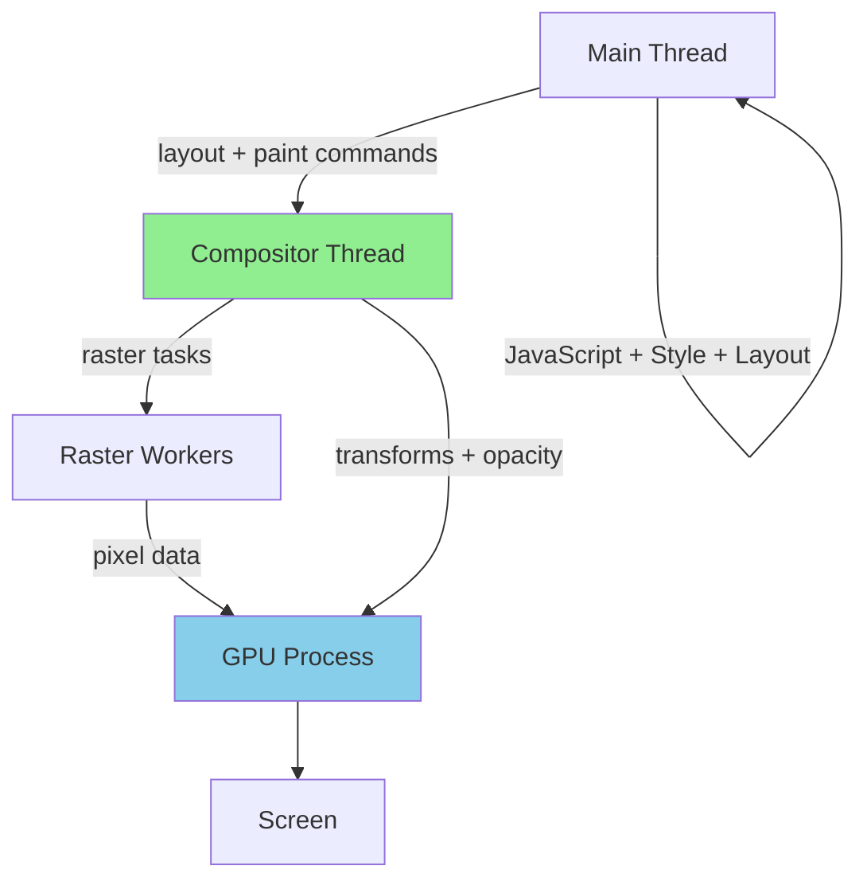

</details>

---
---

# TEMPLATE 5 — `interview.md`

<details open>
<summary><strong>Template Content</strong></summary>

# {{TOPIC_NAME}} — Interview Questions

## Table of Contents

1. [Junior Level](#junior-level)
2. [Middle Level](#middle-level)
3. [Senior Level](#senior-level)
4. [Scenario-Based Questions](#scenario-based-questions)
5. [FAQ](#faq)

---

## Junior Level

### 1. What is the difference between `id` and `class` in HTML/CSS?

**Answer:**
`id` is unique — only one element per page. `class` can be shared by multiple elements. Use `id` for unique elements (anchor links, form associations); use `class` for reusable styles.

---

### 2. What is the box model in CSS?

**Answer:**
Every HTML element is a box with content, padding, border, and margin. `box-sizing: border-box` makes `width` include padding and border (usually preferred). `box-sizing: content-box` (default) — width is just the content area.

---

### 3. {{Question about JavaScript events}}?

**Answer:**
...

---

> 5-7 junior questions.

---

## Middle Level

### 4. Explain event bubbling and event delegation.

**Answer:**
Events bubble from the target element up to the document root. Event delegation attaches one listener to a parent element instead of individual listeners on children — works because events bubble. More efficient for dynamic lists.

---

### 5. What are Core Web Vitals and why do they matter?

**Answer:**
LCP (Largest Contentful Paint): loading performance < 2.5s. CLS (Cumulative Layout Shift): visual stability < 0.1. INP (Interaction to Next Paint): responsiveness < 200ms. They directly affect Google search ranking and user experience.

---

> 4-6 middle questions.

---

## Senior Level

### 6. How would you improve the LCP of a landing page from 5s to under 2.5s?

**Answer:**
1. Add `<link rel="preload">` for the hero image
2. Convert hero to WebP/AVIF (typically 50-70% smaller)
3. Add `fetchpriority="high"` to hero ``
4. Remove render-blocking JavaScript (`async`/`defer`)
5. Inline critical CSS; async-load non-critical
6. Use CDN to reduce TTFB

---

### 7. {{Design system architecture question}}?

**Answer:**
...

---

> 4-6 senior questions.

---

## Scenario-Based Questions

### 8. Users report the page feels "janky" when scrolling through a long list. How do you investigate and fix it?

**Answer:**
1. Chrome DevTools → Performance → Record while scrolling → find dropped frames (red frames)
2. Check for layout thrashing in scroll handler (reads + writes in same frame)
3. Check if scroll handler is non-passive → add `{ passive: true }`
4. If rendering 1000+ DOM nodes → implement virtual scrolling
5. Check for CSS properties that trigger paint (box-shadow, etc.) on scroll

---

> 3-5 scenario questions.

---

## FAQ

### Q: What is the difference between `visibility: hidden` and `display: none`?

**A:** `display: none` removes the element from the layout (no space taken) and from the accessibility tree. `visibility: hidden` hides the element visually but it still takes up space and stays in the accessibility tree.

### Q: What do interviewers look for in frontend answers?

**A:**
- **Junior:** Knows HTML/CSS/JS basics, understands the DOM
- **Middle:** Understands browser APIs, accessibility, performance tools
- **Senior:** Can optimize Core Web Vitals, design component systems, explain rendering pipeline

</details>

---
---

# TEMPLATE 6 — `tasks.md`

<details open>
<summary><strong>Template Content</strong></summary>

# {{TOPIC_NAME}} — Practical Tasks

## Table of Contents

1. [Junior Tasks](#junior-tasks)
2. [Middle Tasks](#middle-tasks)
3. [Senior Tasks](#senior-tasks)
4. [Questions](#questions)
5. [Mini Projects](#mini-projects)
6. [Challenge](#challenge)

---

## Junior Tasks

### Task 1: Build an accessible form

**Type:** 💻 Code

**Goal:** Practice semantic HTML and form accessibility

**Instructions:**
1. Build a login form with email and password fields
2. Add proper `label` elements associated with inputs
3. Add error messages that appear inline on invalid submit
4. Make it keyboard navigable

**Starter code:**

```html
<!DOCTYPE html>
<html lang="en">
<head>
  <meta charset="UTF-8">
  <title>Login</title>
  <link rel="stylesheet" href="styles.css">
</head>
<body>
  <form id="login-form" novalidate>
    <!-- TODO: Add labeled inputs, submit button, error states -->
  </form>
  <script src="main.js"></script>
</body>
</html>
```

**Evaluation criteria:**
- [ ] Labels associated with inputs (`for`/`id` or wrapper)
- [ ] Error messages use `aria-describedby`
- [ ] Fully keyboard navigable
- [ ] Passes Lighthouse accessibility check

---

### Task 2: Design a responsive card layout

**Type:** 🎨 Design

**Goal:** CSS Grid responsive layout

**Deliverable:** CSS that creates a 3-column grid on desktop, 1-column on mobile

```css
/* TODO: Complete responsive card grid */
.card-grid {
  /* ... */
}

@media (max-width: 768px) {
  .card-grid {
    /* ... */
  }
}
```

---

## Middle Tasks

### Task 3: Implement infinite scroll with Intersection Observer

**Type:** 💻 Code

**Goal:** Load more items as user scrolls to bottom

**Requirements:**
- [ ] Use `IntersectionObserver` to detect when sentinel element is visible
- [ ] Fetch next page when sentinel intersects
- [ ] Show loading state while fetching
- [ ] Handle error state

---

## Senior Tasks

### Task 4: Optimize a Lighthouse score from 55 to > 90

**Type:** 💻 Code

**Goal:** Apply performance optimizations to a provided starter page

**Provided:** A slow HTML page with unoptimized assets, render-blocking resources

**Requirements:**
- [ ] LCP < 2.5s
- [ ] CLS < 0.1
- [ ] First Contentful Paint < 1.8s
- [ ] JavaScript bundle < 150KB gzipped
- [ ] All images in WebP format with width/height attributes
- [ ] Document all changes and their impact

---

## Questions

### 1. What does `defer` vs `async` do on a `<script>` tag?

**Answer:**
`async`: downloads script in parallel, executes immediately when downloaded (may interrupt HTML parsing). `defer`: downloads in parallel, executes after HTML parsing is complete, in order. Use `defer` for most scripts; `async` for independent analytics/ads.

---

## Mini Projects

### Project 1: Personal Portfolio with Lighthouse 90+ Score

**Goal:** Accessible, performant landing page

**Requirements:**
- [ ] Lighthouse performance score > 90 on mobile
- [ ] WCAG 2.1 AA compliance (Lighthouse accessibility > 95)
- [ ] LCP < 2.5s, CLS < 0.1
- [ ] Semantic HTML throughout
- [ ] Dark/light mode with system preference detection

**Difficulty:** Middle
**Estimated time:** 8 hours

---

## Challenge

### Achieve a Perfect 100 Lighthouse Score

**Problem:** Given a provided web page with Lighthouse score of 45, optimize it to score 100 on all four Lighthouse categories (Performance, Accessibility, Best Practices, SEO).

**Constraints:**
- Cannot change the page content/copy
- Cannot remove any functional features

**Scoring:**
- Each Lighthouse category (0-100): 25% weight
- Documentation of optimizations: bonus

</details>

---
---

# TEMPLATE 7 — `find-bug.md`

<details open>
<summary><strong>Template Content</strong></summary>

# {{TOPIC_NAME}} — Find the Bug

> **Practice finding and fixing bugs in frontend code related to {{TOPIC_NAME}}.**

---

## How to Use

1. Read the buggy code carefully
2. Try to find the bug **without** looking at the hint
3. Write the fix yourself before checking the solution
4. Understand **why** the bug happens

### Difficulty Levels

| Level | Description |
|:-----:|:-----------|
| 🟢 | **Easy** — CSS specificity, missing `alt`, broken event handler |
| 🟡 | **Medium** — Memory leaks, accessibility, async timing bugs |
| 🔴 | **Hard** — Layout thrashing, CLS, V8 deoptimization |

---

## Bug 1: Missing `alt` attribute 🟢

**What the code should do:** Display a product image with description

```html

<!-- Bug: no alt attribute -->
```

**Expected:** Accessible image with description
**Actual:** Screen readers say "image" — no context; Lighthouse fails accessibility

<details>
<summary>💡 Hint</summary>
Every `` needs an `alt` attribute — even decorative images (use `alt=""`).
</details>

<details>
<summary>🐛 Bug Explanation</summary>

**Bug:** Missing `alt` attribute on image
**Why it happens:** `alt` is required but not enforced by HTML parsers
**Impact:** Screen readers can't describe the image; Lighthouse -7 points

</details>

<details>
<summary>✅ Fixed Code</summary>

```html

<!-- For decorative images: alt="" tells screen readers to skip it -->

```

**What changed:** Added meaningful `alt` text describing the image content

</details>

---

## Bug 2: {{Bug title}} 🟢

**What the code should do:** {{Expected behavior}}

```html
<!-- Buggy HTML/CSS/JS -->
```

<details>
<summary>💡 Hint</summary>
...
</details>

<details>
<summary>🐛 Bug Explanation</summary>

**Bug:** ...
**Why it happens:** ...
**Impact:** ...

</details>

<details>
<summary>✅ Fixed Code</summary>

```html
<!-- Fixed code -->
```

</details>

---

## Bug 3: {{Bug title}} 🟢

```css
/* Buggy CSS */
```

<details>
<summary>💡 Hint</summary>
...
</details>

<details>
<summary>🐛 Bug Explanation</summary>

**Bug:** ...
**Why it happens:** ...
**Impact:** ...

</details>

<details>
<summary>✅ Fixed Code</summary>

```css
/* Fixed CSS */
```

</details>

---

## Bug 4: Memory leak from unremoved event listener 🟡

**What the code should do:** Show/hide modal on button click

```javascript
function showModal() {
  const modal = document.createElement('div');
  modal.classList.add('modal');
  document.body.appendChild(modal);

  // Bug: listener is on document, never removed when modal closes
  document.addEventListener('keydown', (e) => {
    if (e.key === 'Escape') {
      modal.remove();
    }
  });
}

// Each call to showModal adds another keydown listener — they accumulate!
```

<details>
<summary>💡 Hint</summary>
Event listeners attached to long-lived elements (document, window) must be explicitly removed.
</details>

<details>
<summary>🐛 Bug Explanation</summary>

**Bug:** `keydown` listener added on `document` but never removed when modal closes
**Why it happens:** `modal.remove()` removes the DOM node but not the event listener
**Impact:** Memory leak + N listeners fire after N modals opened

</details>

<details>
<summary>✅ Fixed Code</summary>

```javascript
function showModal() {
  const modal = document.createElement('div');
  modal.classList.add('modal');
  document.body.appendChild(modal);

  function handleKeydown(e) {
    if (e.key === 'Escape') {
      modal.remove();
      document.removeEventListener('keydown', handleKeydown);  // cleanup!
    }
  }
  document.addEventListener('keydown', handleKeydown);
}
```

**What changed:** Named function reference allows removal; removes listener when modal closes

</details>

---

## Bug 5: {{CLS from image without dimensions}} 🟡

```html
<!-- Buggy — causes CLS when image loads -->

```

<details>
<summary>💡 Hint</summary>
...
</details>

<details>
<summary>🐛 Bug Explanation</summary>

**Bug:** ...
**Why it happens:** ...
**Impact:** ...CLS score increases

</details>

<details>
<summary>✅ Fixed Code</summary>

```html
<!-- Fixed -->
```

</details>

---

## Bug 6: {{Blocking render with synchronous script}} 🟡

```html
<!-- Buggy — blocks HTML parsing -->
<head>
  <script src="analytics.js"></script>
</head>
```

<details>
<summary>💡 Hint</summary>
...
</details>

<details>
<summary>🐛 Bug Explanation</summary>

**Bug:** Synchronous script in `<head>` blocks HTML parsing until script downloads and executes
**Why it happens:** Default script loading is synchronous
**Impact:** FCP and LCP delayed by script download time

</details>

<details>
<summary>✅ Fixed Code</summary>

```html
<!-- Option 1: defer — download parallel, execute after HTML parsed -->
<script src="analytics.js" defer></script>
<!-- Option 2: async — download parallel, execute immediately when ready -->
<script src="analytics.js" async></script>
```

</details>

---

## Bug 7: {{XSS via innerHTML}} 🟡

```javascript
// Buggy — XSS vulnerability
function displayComment(userInput) {
  commentsDiv.innerHTML = `<p>${userInput}</p>`;  // danger!
}
```

<details>
<summary>💡 Hint</summary>
...
</details>

<details>
<summary>🐛 Bug Explanation</summary>

**Bug:** User input rendered as HTML — allows XSS
**Why it happens:** `innerHTML` parses content as HTML, including script tags and event handlers
**Impact:** Attacker can run JS in victim's browser, steal cookies/tokens

</details>

<details>
<summary>✅ Fixed Code</summary>

```javascript
function displayComment(userInput) {
  const p = document.createElement('p');
  p.textContent = userInput;  // renders as text, not HTML
  commentsDiv.appendChild(p);
}
```

</details>

---

## Bug 8: Layout thrashing in loop 🔴

**What the code should do:** Animate 100 elements expanding

```javascript
const items = document.querySelectorAll('.expandable');

items.forEach(item => {
  item.style.height = item.scrollHeight + 20 + 'px';
  // Write (style.height) then immediately read (scrollHeight) in next iteration
  // → forced reflow on every iteration!
});
```

**Expected:** Smooth expansion
**Actual:** 100 × forced reflow ≈ 500ms jank

<details>
<summary>💡 Hint</summary>

Can you separate all the "read" operations from all the "write" operations?

</details>

<details>
<summary>🐛 Bug Explanation</summary>

**Bug:** Reading `scrollHeight` (layout property) immediately after writing `style.height` causes forced reflow on every iteration
**Why it happens:** Browser must flush pending styles and recalculate layout before returning layout values
**Impact:** O(n) forced reflows = severe jank for large lists

</details>

<details>
<summary>✅ Fixed Code</summary>

```javascript
const items = document.querySelectorAll('.expandable');

// Read all heights first (single layout pass)
const heights = Array.from(items).map(item => item.scrollHeight);

// Then write all (single layout pass — browser batches)
items.forEach((item, i) => {
  item.style.height = heights[i] + 20 + 'px';
});
```

**What changed:** Separated reads from writes — 2 layout passes instead of 100

</details>

---

## Bug 9: {{Non-passive scroll listener causing jank}} 🔴

```javascript
// Buggy — blocks compositor thread
window.addEventListener('scroll', () => {
  // Does work on every scroll event
  const pos = window.scrollY;
  navBar.style.opacity = pos > 100 ? 1 : 0;
});
```

<details>
<summary>💡 Hint</summary>
...
</details>

<details>
<summary>🐛 Bug Explanation</summary>

**Bug:** Non-passive scroll listener blocks compositor from scrolling smoothly
**Why it happens:** Browser must wait for the handler to complete (in case it calls `preventDefault()`)
**Impact:** Scroll jank — CrUX "poor" INP on scroll interactions

</details>

<details>
<summary>✅ Fixed Code</summary>

```javascript
// Passive listener + requestAnimationFrame for smooth updates
let ticking = false;

window.addEventListener('scroll', () => {
  if (!ticking) {
    requestAnimationFrame(() => {
      const pos = window.scrollY;
      navBar.style.opacity = pos > 100 ? 1 : 0;
      ticking = false;
    });
    ticking = true;
  }
}, { passive: true });  // tells browser: we won't call preventDefault()
```

</details>

---

## Bug 10: {{V8 deoptimization from type mutation}} 🔴

```javascript
// Buggy — causes V8 deoptimization
function processItems(items) {
  return items.reduce((sum, item) => sum + item.value, 0);
}

// Called 10,000 times with numbers...
processItems([{value: 1}, {value: 2}]);  // V8 optimizes for number

// Then called with strings...
processItems([{value: '1'}, {value: '2'}]);  // DEOPTIMIZE → 10x slower
```

<details>
<summary>💡 Hint</summary>
V8 JIT optimizes for specific types. Changing types causes deoptimization.
</details>

<details>
<summary>🐛 Bug Explanation</summary>

**Bug:** Function called with different value types (number vs string) causes V8 deoptimization
**Why it happens:** V8 TurboFan compiles specialized machine code for number arithmetic. Passing strings makes the function "megamorphic" — V8 reverts to slower interpreted path
**Impact:** 10-100x slower in hot paths

</details>

<details>
<summary>✅ Fixed Code</summary>

```javascript
// Ensure consistent types — parse at the edge, not in the hot function
function processItems(items) {
  return items.reduce((sum, item) => sum + item.value, 0);
}

// Normalize data before processing — keep types consistent
const items = rawItems.map(item => ({
  ...item,
  value: Number(item.value),  // always number
}));
```

**What changed:** Types are consistent → V8 keeps the function monomorphic → stays optimized

</details>

---

## Score Card

| Bug | Difficulty | Found without hint? | Understood why? | Fixed correctly? |
|:---:|:---------:|:-------------------:|:---------------:|:----------------:|
| 1 | 🟢 | ☐ | ☐ | ☐ |
| 2 | 🟢 | ☐ | ☐ | ☐ |
| 3 | 🟢 | ☐ | ☐ | ☐ |
| 4 | 🟡 | ☐ | ☐ | ☐ |
| 5 | 🟡 | ☐ | ☐ | ☐ |
| 6 | 🟡 | ☐ | ☐ | ☐ |
| 7 | 🟡 | ☐ | ☐ | ☐ |
| 8 | 🔴 | ☐ | ☐ | ☐ |
| 9 | 🔴 | ☐ | ☐ | ☐ |
| 10 | 🔴 | ☐ | ☐ | ☐ |

</details>

---
---

# TEMPLATE 8 — `optimize.md`

<details open>
<summary><strong>Template Content</strong></summary>

# {{TOPIC_NAME}} — Optimize the Code

> **Practice optimizing slow, inefficient frontend code related to {{TOPIC_NAME}}.**

---

## How to Use

1. Read the slow code and understand what it does
2. Identify the performance bottleneck
3. Write your optimized version
4. Compare with the solution and benchmark results

### Difficulty Levels

| Level | Focus |
|:-----:|:------|
| 🟢 | **Easy** — Image optimization, caching, simple DOM fixes |
| 🟡 | **Medium** — LCP, CLS, debounce, bundle splitting |
| 🔴 | **Hard** — Layout thrashing, compositor layers, V8 optimization |

### Optimization Categories

| Category | Icon | Description |
|:--------:|:----:|:-----------|
| **LCP** | 🖼️ | Largest Contentful Paint improvement |
| **CLS** | 📐 | Cumulative Layout Shift reduction |
| **INP** | ⚡ | Interaction to Next Paint improvement |
| **Bundle** | 📦 | JavaScript / CSS bundle size reduction |

---

## Exercise 1: Fix hero image for LCP 🟢 🖼️

**What the code does:** Loads hero image on landing page.

**The problem:** Hero image is lazy-loaded and low priority — LCP is 5s.

```html
<!-- Slow: lazy load + no preload + old format + no dimensions -->

```

**Current benchmark:**
```
LCP: 5.2s (Lighthouse mobile)
Image size: 480KB (JPEG)
```

<details>
<summary>💡 Hint</summary>
The LCP image should be: preloaded, high priority, modern format, with dimensions.
</details>

<details>
<summary>⚡ Optimized Code</summary>

```html
<!-- Preload the image — browser starts downloading immediately -->
<link rel="preload" href="hero.avif" as="image" type="image/avif" />
<link rel="preload" href="hero.webp" as="image" type="image/webp" />

<!-- LCP image: no lazy loading, high fetch priority, explicit dimensions -->
<picture>
  <source srcset="hero.avif" type="image/avif" />
  <source srcset="hero.webp" type="image/webp" />
  
</picture>
```

**What changed:**
- `loading="lazy"` removed — LCP image must not be lazy
- `fetchpriority="high"` added — browser prioritizes this download
- `<link rel="preload">` added — browser starts before parsing ``
- AVIF/WebP format — 95KB vs 480KB JPEG

**Optimized benchmark:**
```
LCP: 1.6s
Image size: 95KB (AVIF)
```

**Improvement:** 3.3x faster LCP, 5x smaller image

</details>

---

## Exercise 2: Fix CLS from images without dimensions 🟢 📐

**What the code does:** Displays a product grid.

**The problem:** Images have no dimensions — browser reserves no space → layout shifts when images load.

```html
<!-- Slow: no dimensions → CLS = 0.35 -->
<div class="product-grid">
  
  
  
</div>
```

<details>
<summary>⚡ Optimized Code</summary>

```html
<!-- Fixed: explicit width/height prevent layout shift -->
<div class="product-grid">
  
  
  
</div>
```

```css
/* CSS alternative: maintain aspect ratio */
.product-image {
  aspect-ratio: 1 / 1; /* preserves space before image loads */
  width: 100%;
  object-fit: cover;
}
```

**Improvement:** CLS: 0.35 → 0.01

</details>

---

## Exercise 3: Debounce search input 🟢 ⚡

**What the code does:** Live search — fetches results on every keystroke.

**The problem:** API called on every keypress — 10+ requests per second.

```javascript
searchInput.addEventListener('input', async (e) => {
  const results = await fetch(`/api/search?q=${e.target.value}`).then(r => r.json());
  displayResults(results);
  // 100ms typing → 10 API calls per second!
});
```

<details>
<summary>⚡ Optimized Code</summary>

```javascript
function debounce(fn, delay) {
  let timerId;
  return (...args) => {
    clearTimeout(timerId);
    timerId = setTimeout(() => fn(...args), delay);
  };
}

const debouncedSearch = debounce(async (query) => {
  const results = await fetch(`/api/search?q=${query}`).then(r => r.json());
  displayResults(results);
}, 300);

searchInput.addEventListener('input', (e) => debouncedSearch(e.target.value));
```

**Improvement:** 10 API calls/second → 1 call per 300ms pause; 90% fewer requests

</details>

---

## Exercise 4: Code-split large routes 🟡 📦

**What the code does:** SPA with large admin dashboard.

**The problem:** 2.3MB JavaScript bundle loaded on every page — 8s on mobile.

```javascript
// Slow — all routes in one bundle
import Home    from './pages/Home';
import About   from './pages/About';
import Admin   from './pages/Admin';      // 1MB chart libraries
import Reports from './pages/Reports';   // 800KB data processing
```

<details>
<summary>⚡ Optimized Code</summary>

```javascript
import { lazy, Suspense } from 'react';

const Home    = lazy(() => import('./pages/Home'));
const About   = lazy(() => import('./pages/About'));
const Admin   = lazy(() => import('./pages/Admin'));
const Reports = lazy(() => import('./pages/Reports'));

function App() {
  return (
    <Suspense fallback={<PageSkeleton />}>
      <Routes>
        <Route path="/"       element={<Home />} />
        <Route path="/about"  element={<About />} />
        <Route path="/admin"  element={<Admin />} />
        <Route path="/reports" element={<Reports />} />
      </Routes>
    </Suspense>
  );
}
```

**Improvement:** Initial bundle: 200KB (was 2.3MB); Admin/Reports load only when visited

</details>

---

## Exercise 5: Replace JPEG with AVIF/WebP 🟡 🖼️

**What the code does:** Serves product images as JPEG.

**The problem:** JPEG format — large file sizes, slow LCP.

```html

```

<details>
<summary>⚡ Optimized Code</summary>

```html
<picture>
  <!-- AVIF: 50% smaller than WebP, 80% smaller than JPEG -->
  <source srcset="product.avif" type="image/avif" />
  <!-- WebP: 30% smaller than JPEG, wide browser support -->
  <source srcset="product.webp" type="image/webp" />
  <!-- JPEG fallback for old browsers -->
  
</picture>
```

**Improvement:** JPEG 120KB → AVIF 25KB → 5x faster image load

</details>

---

## Exercise 6: Optimize CSS for above-the-fold render 🟡 🖼️

**What the code does:** Loads one large CSS file for the entire app.

**The problem:** 150KB CSS blocks rendering — high FCP.

```html
<!-- Slow: all CSS blocks rendering -->
<link rel="stylesheet" href="app.css" />  <!-- 150KB — all pages, all components -->
```

<details>
<summary>⚡ Optimized Code</summary>

```html
<!-- Critical CSS inlined — renders immediately with no network request -->
<style>
  /* Only above-the-fold styles: header, hero, nav */
  body { margin: 0; font-family: sans-serif; }
  .header { ... }
  .hero { ... }
</style>

<!-- Non-critical CSS loaded asynchronously -->
<link rel="preload" href="app.css" as="style" onload="this.rel='stylesheet'" />
<noscript><link rel="stylesheet" href="app.css" /></noscript>
```

**Improvement:** FCP: 2.8s → 1.1s (no render-blocking CSS)

</details>

---

## Exercise 7: Fix layout thrashing in animation 🔴 ⚡

**What the code does:** Animates card expanding to its content height.

**The problem:** Reads layout height after writing style — forced reflow per card.

```javascript
const cards = document.querySelectorAll('.card');

cards.forEach(card => {
  card.style.height = '0px';
  card.addEventListener('click', () => {
    // Read height immediately after write → forced reflow!
    card.style.height = card.scrollHeight + 'px';
  });
});
```

<details>
<summary>💡 Hint</summary>
Can you read the height before setting it to 0?
</details>

<details>
<summary>⚡ Optimized Code</summary>

```javascript
const cards = document.querySelectorAll('.card');

// Read all heights BEFORE collapsing (avoid read-after-write)
const heights = Array.from(cards).map(card => card.scrollHeight);

cards.forEach((card, i) => {
  card.style.height = '0px';
  card.dataset.expandedHeight = heights[i]; // store for later

  card.addEventListener('click', () => {
    // Now just reading a data attribute — no layout computation needed!
    card.style.height = card.dataset.expandedHeight + 'px';
  });
});
```

**Improvement:** 0 forced reflows during click handling (was N reflows)

</details>

---

## Exercise 8: Promote animation to GPU layer 🔴 ⚡

**What the code does:** Animates a notification badge bouncing.

**The problem:** CSS `top` animation triggers layout on every frame.

```css
/* Slow — triggers layout + paint every frame */
@keyframes bounce-bad {
  0%   { top: 0; }
  50%  { top: -10px; }
  100% { top: 0; }
}

.notification-badge {
  position: relative;
  animation: bounce-bad 1s infinite;
}
```

<details>
<summary>⚡ Optimized Code</summary>

```css
/* Fast — compositor thread only, no layout/paint */
@keyframes bounce-good {
  0%   { transform: translateY(0); }
  50%  { transform: translateY(-10px); }
  100% { transform: translateY(0); }
}

.notification-badge {
  animation: bounce-good 1s infinite;
  will-change: transform;  /* promote to own layer before animation starts */
}
```

**Improvement:** Main thread cost: 0ms/frame (was 2ms/frame → 120ms/second for 60fps animation)

</details>

---

## Exercise 9: Virtualize long list rendering 🔴 ⚡

**What the code does:** Renders a list of 10,000 messages.

**The problem:** 10,000 DOM nodes → 3s initial render, 500MB memory, janky scroll.

```javascript
function renderMessages(messages) {
  const list = document.getElementById('message-list');
  messages.forEach(msg => {
    const li = document.createElement('li');
    li.textContent = msg.text;
    list.appendChild(li); // 10,000 DOM nodes!
  });
}
```

<details>
<summary>⚡ Optimized Code</summary>

```javascript
// Using a library like TanStack Virtual or implementing basic virtual scroll
import { useVirtualizer } from '@tanstack/react-virtual';

function MessageList({ messages }) {
  const parentRef = useRef(null);

  const virtualizer = useVirtualizer({
    count: messages.length,
    getScrollElement: () => parentRef.current,
    estimateSize: () => 50, // estimated row height
  });

  return (
    <div ref={parentRef} style={{ height: '600px', overflow: 'auto' }}>
      <div style={{ height: `${virtualizer.getTotalSize()}px`, position: 'relative' }}>
        {virtualizer.getVirtualItems().map((virtualItem) => (
          <div
            key={virtualItem.key}
            style={{
              position: 'absolute',
              top: 0,
              left: 0,
              width: '100%',
              transform: `translateY(${virtualItem.start}px)`,
            }}
          >
            {messages[virtualItem.index].text}
          </div>
        ))}
      </div>
    </div>
  );
}
```

**Improvement:** DOM nodes: 10,000 → ~12 visible; Initial render: 3s → 50ms; Memory: 500MB → 15MB

</details>

---

## Exercise 10: Font loading optimization for CLS and FCP 🔴 📐

**What the code does:** Loads a custom web font.

**The problem:** FOUT (Flash of Unstyled Text) causes CLS; font blocks FCP.

```html
<!-- Slow: font blocks rendering, FOUT causes CLS -->
<link href="https://fonts.googleapis.com/css2?family=Inter:wght@400;700" rel="stylesheet" />
```

<details>
<summary>⚡ Optimized Code</summary>

```html
<!-- Step 1: Preconnect to reduce DNS/TCP time -->
<link rel="preconnect" href="https://fonts.gstatic.com" crossorigin />

<!-- Step 2: Preload the specific font file -->
<link rel="preload" href="https://fonts.gstatic.com/s/inter/v13/UcC73FwrK3iLTeHuS_fvQtMwCp50KnMa1ZL7.woff2"
      as="font" type="font/woff2" crossorigin />

<!-- Step 3: font-display: optional — use fallback if font not cached, no CLS -->
<style>
  @font-face {
    font-family: 'Inter';
    src: url('inter.woff2') format('woff2');
    font-display: optional;  /* never causes FOUT or CLS */
    font-weight: 400 700;
  }

  /* size-adjust: match fallback font metrics to prevent CLS */
  @font-face {
    font-family: 'Inter-fallback';
    src: local('Arial');
    size-adjust: 107%;
    ascent-override: 90%;
    descent-override: 22%;
  }

  body {
    font-family: 'Inter', 'Inter-fallback', sans-serif;
  }
</style>
```

**Improvement:** CLS from fonts: 0.08 → 0.00; FCP improves as font no longer blocks render

</details>

---

## Score Card

| Exercise | Difficulty | Category | Found bottleneck? | Your improvement | Target |
|:--------:|:---------:|:--------:|:-----------------:|:----------------:|:------:|
| 1 | 🟢 | 🖼️ | ☐ | ___s LCP | < 2.5s |
| 2 | 🟢 | 📐 | ☐ | ___ CLS | < 0.1 |
| 3 | 🟢 | ⚡ | ☐ | ___% API calls | -90% |
| 4 | 🟡 | 📦 | ☐ | ___ KB | < 200KB |
| 5 | 🟡 | 🖼️ | ☐ | ___ KB | -80% |
| 6 | 🟡 | 🖼️ | ☐ | ___s FCP | < 1.8s |
| 7 | 🔴 | ⚡ | ☐ | ___ reflows | 0 |
| 8 | 🔴 | ⚡ | ☐ | ___ main ms/frame | 0ms |
| 9 | 🔴 | ⚡ | ☐ | ___ DOM nodes | ~12 |
| 10 | 🔴 | 📐 | ☐ | ___ CLS | 0.00 |

---

## Optimization Cheat Sheet

| Problem | Solution | Impact |
|:--------|:---------|:------:|
| High LCP (hero image) | Preload + fetchpriority=high + AVIF | Very High |
| High CLS (images) | Add width + height attributes | Very High |
| High CLS (fonts) | font-display: optional + size-adjust | High |
| Large bundle | Code splitting with React.lazy | Very High |
| JPEG images | Convert to AVIF/WebP | High |
| Render-blocking CSS | Inline critical CSS + async load rest | High |
| Layout thrashing | Batch reads before writes | High |
| Animating layout props | Switch to transform/opacity | Very High |
| Long DOM list | Virtual scrolling | Very High |
| Frequent events | Debounce (input) or Throttle (scroll) | Medium-High |

</details>
---
---

# TEMPLATE 9 — `specification.md`

> **Focus:** Official documentation deep-dive — API reference, component specs, browser/platform compatibility, and version compatibility.
>
> **Source:** Always cite the official documentation with direct section links.
> - React: https://react.dev/reference/react
> - TypeScript: https://www.typescriptlang.org/docs/handbook/
> - GraphQL: https://spec.graphql.org/October2021/
> - Frontend (HTML/CSS/JS): https://developer.mozilla.org/en-US/docs/Web
> - Design System: https://m3.material.io/ | https://atlassian.design/
> - Android: https://developer.android.com/docs
> - iOS: https://developer.apple.com/documentation/

<details open>
<summary><strong>Template Content</strong></summary>

# {{TOPIC_NAME}} — Specification

> **Official Documentation Reference**
>
> Source: [{{TOOL_NAME}} Official Docs]({{DOCS_URL}}) — {{SECTION}}

---

## Table of Contents

1. [Docs Reference](#docs-reference)
2. [API / Component Reference](#api--component-reference)
3. [Core Concepts & Rules](#core-concepts--rules)
4. [Props / Options Reference](#props--options-reference)
5. [Behavioral Specification](#behavioral-specification)
6. [Browser / Platform Compatibility](#browser--platform-compatibility)
7. [Edge Cases from Official Docs](#edge-cases-from-official-docs)
8. [Version & Deprecation History](#version--deprecation-history)
9. [Official Examples](#official-examples)
10. [Compliance Checklist](#compliance-checklist)
11. [Related Documentation](#related-documentation)

---

## 1. Docs Reference

| Property | Value |
|----------|-------|
| **Official Docs** | [{{TOOL_NAME}} Documentation]({{DOCS_URL}}) |
| **Relevant Section** | {{SECTION_NAME}} — {{SECTION_TITLE}} |
| **Version** | {{TOOL_VERSION}} |
| **Direct URL** | {{DOCS_URL}}/{{PATH}} |

---

## 2. API / Component Reference

> From: {{DOCS_URL}}/{{API_SECTION}}

### `{{COMPONENT_OR_HOOK_NAME}}`

**Signature:**
```typescript
{{FUNCTION_SIGNATURE}}
```

| Prop / Parameter | Type | Required | Default | Description |
|-----------------|------|----------|---------|-------------|
| `{{PROP_1}}` | `{{TYPE_1}}` | ✅ | — | {{DESC_1}} |
| `{{PROP_2}}` | `{{TYPE_2}}` | ❌ | `{{DEFAULT_2}}` | {{DESC_2}} |
| `{{PROP_3}}` | `{{TYPE_3}}` | ❌ | `{{DEFAULT_3}}` | {{DESC_3}} |

**Returns / Renders:** {{RETURN_DESC}}

---

## 3. Core Concepts & Rules

### Rule 1: {{RULE_NAME}}

> *Docs: [{{DOCS_URL}}/{{SECTION}}]({{DOCS_URL}}/{{SECTION}}) — "{{DOC_QUOTE}}"*

{{RULE_EXPLANATION}}

```tsx
// ✅ Correct — follows official guidance
{{VALID_EXAMPLE}}

// ❌ Incorrect — violates official guidance
{{INVALID_EXAMPLE}}
```

### Rule 2: {{RULE_NAME}}

> *Docs: [{{DOCS_URL}}/{{SECTION}}]({{DOCS_URL}}/{{SECTION}})*

{{RULE_EXPLANATION}}

```tsx
{{CODE_EXAMPLE}}
```

---

## 4. Props / Options Reference

| Prop | Type | Required | Default | Since | Description |
|------|------|----------|---------|-------|-------------|
| `{{PROP_1}}` | `{{TYPE_1}}` | ✅ | — | {{VERSION_1}} | {{DESC_1}} |
| `{{PROP_2}}` | `{{TYPE_2}}` | ❌ | `{{DEFAULT_2}}` | {{VERSION_2}} | {{DESC_2}} |
| `{{PROP_3}}` ⚠️ *deprecated* | `{{TYPE_3}}` | ❌ | `{{DEFAULT_3}}` | {{VERSION_3}} | {{DESC_3}} — Use `{{REPLACEMENT}}` instead |

---

## 5. Behavioral Specification

### Rendering / Execution Model

{{RENDERING_MODEL}}

### Performance Characteristics

{{PERFORMANCE_CHARACTERISTICS}}

### Side Effects & Lifecycle

{{LIFECYCLE_BEHAVIOR}}

---

## 6. Browser / Platform Compatibility

| Feature | Chrome | Firefox | Safari | Edge | iOS | Android | Notes |
|---------|--------|---------|--------|------|-----|---------|-------|
| {{FEAT_1}} | {{C_1}} | {{F_1}} | {{S_1}} | {{E_1}} | {{I_1}} | {{A_1}} | {{N_1}} |
| {{FEAT_2}} | {{C_2}} | {{F_2}} | {{S_2}} | {{E_2}} | {{I_2}} | {{A_2}} | {{N_2}} |

---

## 7. Edge Cases from Official Docs

| Edge Case | Official Behavior | Reference |
|-----------|-------------------|-----------|
| {{EDGE_1}} | {{BEHAVIOR_1}} | [Docs]({{URL_1}}) |
| {{EDGE_2}} | {{BEHAVIOR_2}} | [Docs]({{URL_2}}) |
| {{EDGE_3}} | {{BEHAVIOR_3}} | [Docs]({{URL_3}}) |

---

## 8. Version & Deprecation History

| Version | Change | Deprecated? | Migration |
|---------|--------|-------------|-----------|
| `{{VER_1}}` | {{CHANGE_1}} | ❌ | — |
| `{{VER_2}}` | {{CHANGE_2}} | ⚠️ | {{MIGRATION_2}} |
| `{{VER_3}}` | {{CHANGE_3}} | ✅ Removed | {{MIGRATION_3}} |

---

## 9. Official Examples

### Example from Docs: {{EXAMPLE_TITLE}}

> Source: [{{DOCS_URL}}/{{ANCHOR}}]({{DOCS_URL}}/{{ANCHOR}})

```tsx
{{OFFICIAL_EXAMPLE_CODE}}
```

**Result:**

```
{{EXPECTED_RESULT}}
```

---

## 10. Compliance Checklist

- [ ] Follows official recommended patterns for {{TOPIC_NAME}}
- [ ] Uses supported version ({{TOOL_VERSION}}+)
- [ ] No deprecated APIs used (or migration path documented)
- [ ] Handles all documented edge cases
- [ ] Browser/platform compatibility requirements met
- [ ] Accessibility guidelines from official docs followed

---

## 11. Related Documentation

| Topic | Doc Section | URL |
|-------|-------------|-----|
| {{RELATED_1}} | {{SECTION_1}} | [Link]({{URL_1}}) |
| {{RELATED_2}} | {{SECTION_2}} | [Link]({{URL_2}}) |
| {{RELATED_3}} | {{SECTION_3}} | [Link]({{URL_3}}) |

---

> **Content Rules for `specification.md`:**
> - Always link directly to the relevant doc section (not just the homepage)
> - Include browser/platform compatibility tables for applicable features
> - Document deprecated APIs with migration paths
> - Use official TypeScript types/signatures when available
> - Include accessibility requirements from official docs
> - Minimum 2 Core Rules, 3 Props/Options, 3 Edge Cases, 2 Official Examples

</details>
