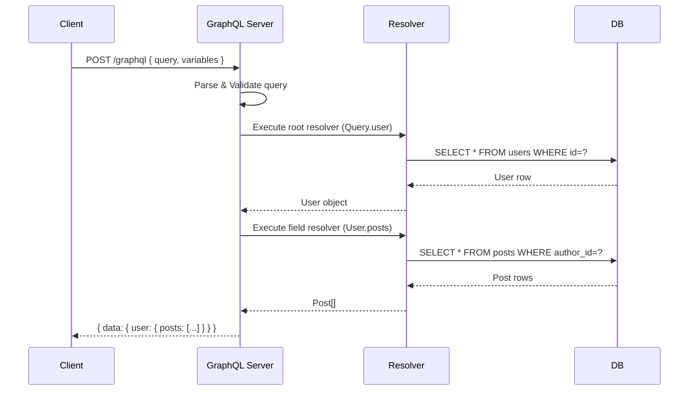
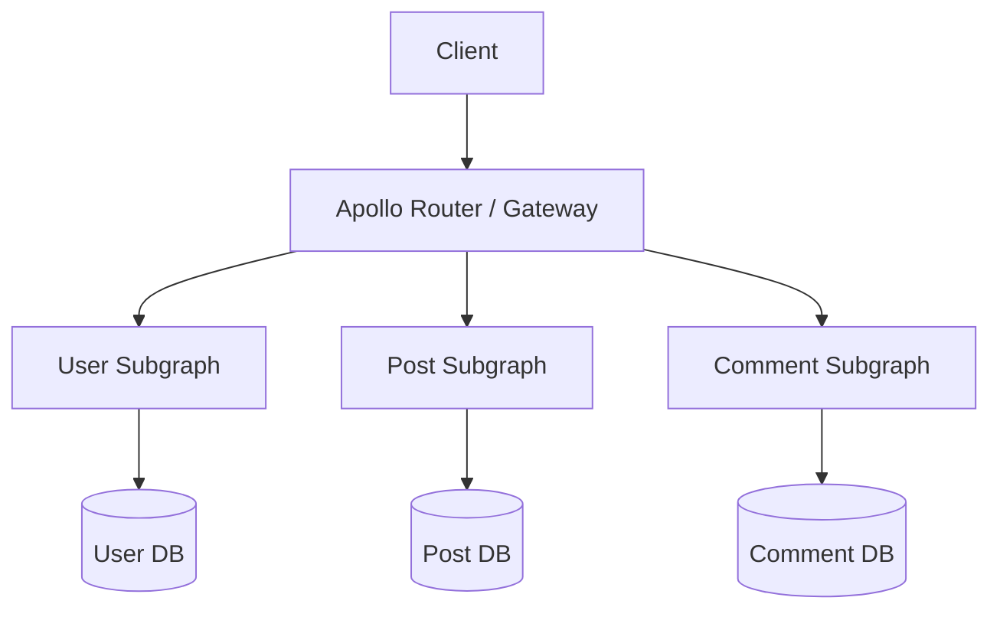
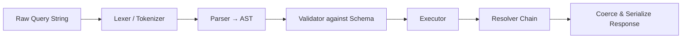
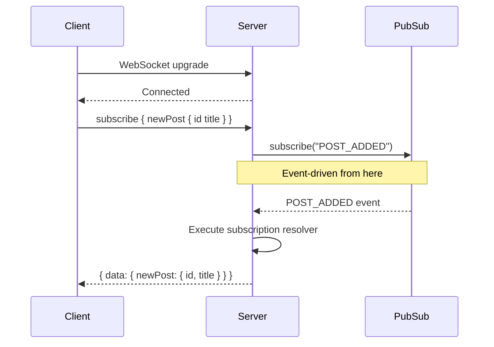
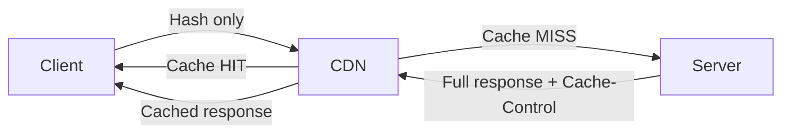

# GraphQL Roadmap — Universal Template

> Replace `{{TOPIC_NAME}}` with the specific GraphQL concept being documented.
> Each section below corresponds to one output file in the topic folder.

---

# TEMPLATE 1 — `junior.md`

## {{TOPIC_NAME}} — Junior Level

### What Is It?
Provide a plain-language explanation of `{{TOPIC_NAME}}` as it applies to GraphQL.
Focus on "what" and "why" before "how". Assume the reader knows JavaScript but is
new to GraphQL.

### Core Concept

```graphql
# Minimal example demonstrating {{TOPIC_NAME}}
type Query {
  hello: String
}
```

```typescript
// Resolver wired to the schema above
const resolvers = {
  Query: {
    hello: () => "Hello, GraphQL!",
  },
};
```

### Mental Model
- GraphQL is a **query language for your API**, not a database query language.
- Every request describes exactly what data is needed — no over-fetching.
- The server exposes a single endpoint; the client drives the shape of the response.
- `{{TOPIC_NAME}}` fits into the GraphQL mental model because: _[fill in]_.

### Key Terms
| Term | Definition |
|------|-----------|
| Schema | The contract between client and server describing all available types and operations |
| Resolver | A function that returns data for a specific field in the schema |
| Query | A read-only GraphQL operation |
| Mutation | A write GraphQL operation |
| Subscription | A real-time GraphQL operation over WebSocket |
| Scalar | A leaf type: `String`, `Int`, `Float`, `Boolean`, `ID` |

### Comparison with Alternatives
| Feature | GraphQL | REST | gRPC |
|---------|---------|------|------|
| Endpoint count | Single | Multiple | Multiple (methods) |
| Response shape | Client-driven | Server-driven | Server-driven |
| Type system | Built-in SDL | OpenAPI (optional) | Protobuf |
| Real-time | Subscriptions | SSE / WebSocket | Server streaming |
| Learning curve | Medium | Low | High |

### Common Mistakes at This Level
1. Fetching the entire graph when only a few fields are needed.
2. Forgetting that fields not in the query are **not** sent in the response.
3. Confusing `Query` (read) with `Mutation` (write).
4. Not handling `null` returns from resolvers gracefully on the client.

### Hands-On Exercise
Write a simple GraphQL schema that models a `Book` type with `id`, `title`, and `author`.
Add a `books` query that returns a list, and a `addBook` mutation. Test it with GraphiQL.

### Further Reading
- GraphQL official docs: https://graphql.org/learn/
- How to GraphQL: https://www.howtographql.com/
- `{{TOPIC_NAME}}` specific resource: _[fill in]_

---

# TEMPLATE 2 — `middle.md`

## {{TOPIC_NAME}} — Middle Level

### Prerequisites
- Comfortable writing schemas, resolvers, and basic queries/mutations.
- Familiarity with at least one server library (Apollo Server, Yoga, Mercurius).
- Understanding of Node.js async patterns (Promises, async/await).

### Deep Dive: {{TOPIC_NAME}}

```graphql
# Intermediate schema demonstrating {{TOPIC_NAME}}
type User {
  id: ID!
  name: String!
  posts: [Post!]!
}

type Post {
  id: ID!
  title: String!
  body: String!
  author: User!
}

type Query {
  user(id: ID!): User
  users(limit: Int = 10, offset: Int = 0): [User!]!
}

type Mutation {
  createPost(input: CreatePostInput!): Post!
}

input CreatePostInput {
  title: String!
  body: String!
  authorId: ID!
}
```

```typescript
import { ApolloServer } from "@apollo/server";
import { startStandaloneServer } from "@apollo/server/standalone";

const resolvers = {
  Query: {
    user: async (_: unknown, { id }: { id: string }, ctx: Context) => {
      return ctx.db.users.findById(id);
    },
    users: async (_: unknown, { limit, offset }: PaginationArgs, ctx: Context) => {
      return ctx.db.users.findAll({ limit, offset });
    },
  },
  User: {
    posts: async (parent: User, _: unknown, ctx: Context) => {
      return ctx.db.posts.findByAuthorId(parent.id);
    },
  },
  Mutation: {
    createPost: async (_: unknown, { input }: { input: CreatePostInput }, ctx: Context) => {
      return ctx.db.posts.create(input);
    },
  },
};
```

### Resolver Execution Flow



### Pagination Patterns
- **Offset-based**: Simple, but inconsistent with live data changes. Use `limit`/`offset`.
- **Cursor-based (Relay spec)**: Stable under inserts/deletes. Use `edges`, `node`, `cursor`, `pageInfo`.
- **Keyset pagination**: Database-efficient; cursor encodes last-seen primary key.

### Authentication & Authorization Patterns
```typescript
// Context injection pattern
const server = new ApolloServer({ typeDefs, resolvers });

const { url } = await startStandaloneServer(server, {
  context: async ({ req }) => {
    const token = req.headers.authorization?.replace("Bearer ", "");
    const user = token ? await verifyJwt(token) : null;
    return { user, db };
  },
});

// Field-level authorization
const resolvers = {
  Query: {
    adminData: (_: unknown, __: unknown, ctx: Context) => {
      if (!ctx.user?.isAdmin) throw new GraphQLError("Forbidden", {
        extensions: { code: "FORBIDDEN" },
      });
      return ctx.db.adminData.findAll();
    },
  },
};
```

### Error Handling
- Use `GraphQLError` with `extensions.code` for typed errors.
- Never expose raw database errors to clients.
- Partial errors: GraphQL can return `data` AND `errors` simultaneously.

### Common Mistakes at This Level
1. Implementing pagination as offset-only without thinking about cursor stability.
2. Returning HTTP 500 for all GraphQL errors instead of using `extensions.code`.
3. Not using `DataLoader` and generating N+1 queries (covered in `professional.md`).
4. Mixing business logic into resolvers instead of a service layer.

### Checklist
- [ ] Schema uses non-null (`!`) correctly — required fields are non-null.
- [ ] Mutations return the mutated object so the client can update its cache.
- [ ] Input types are used for mutation arguments, not individual scalar args.
- [ ] Errors include `extensions.code` for client error handling.

---

# TEMPLATE 3 — `senior.md`

## {{TOPIC_NAME}} — Senior Level

### Responsibilities at This Level
- Design the GraphQL schema as a product API contract, not just a data mirror.
- Own the federation/stitching strategy across multiple services.
- Set standards for resolver patterns, error handling, and caching.
- Mentor mid-level engineers on schema design decisions.

### Schema Design Principles

```graphql
# Domain-driven schema — NOT a database mirror
# Bad: exposing internal FK relationships
type Post {
  authorId: ID!       # exposes internal detail
}

# Good: graph-native relationship
type Post {
  author: User!       # client traverses the graph naturally
}

# Nullable vs non-null discipline
type SearchResult {
  items: [Item!]!     # list is always returned (may be empty), items inside are non-null
  totalCount: Int!
  pageInfo: PageInfo!
}
```

### Federation Architecture



```graphql
# User subgraph — defines the User entity
type User @key(fields: "id") {
  id: ID!
  name: String!
  email: String!
}

# Post subgraph — extends User with posts field
extend type User @key(fields: "id") {
  id: ID! @external
  posts: [Post!]!
}
```

### Caching Strategy
| Layer | Mechanism | Scope |
|-------|-----------|-------|
| CDN / HTTP | `Cache-Control` on persisted queries | Public, GET requests |
| Gateway | Response cache plugin (`@apollo/server-plugin-response-cache`) | Per operation |
| Resolver | `DataLoader` with memoization | Per request |
| Shared | Redis `cacheControl` directives | Cross-request |

```typescript
// Per-field cache hints
const typeDefs = gql`
  type Product @cacheControl(maxAge: 300) {
    id: ID!
    price: Float @cacheControl(maxAge: 60)   # prices change faster
    description: String @cacheControl(maxAge: 3600)
  }
`;
```

### Persisted Queries
```typescript
// Automatic Persisted Queries (APQ) — reduce request payload
// Client sends hash first; server responds with PersistedQueryNotFound
// Client retries with full query; server stores hash → query mapping
// Subsequent requests send only the hash
```

### Schema Versioning & Evolution
- **Never remove fields** — deprecate with `@deprecated(reason: "Use newField")`.
- **Additive changes** are safe: new types, new fields, new optional arguments.
- **Breaking changes** require a migration period and client coordination.
- Use schema registry (Apollo Studio, Confluent, custom) to track changes.

### Observability
```typescript
// Apollo Server plugin for tracing
import { ApolloServerPluginUsageReporting } from "@apollo/server/plugin/usageReporting";

const server = new ApolloServer({
  typeDefs,
  resolvers,
  plugins: [
    ApolloServerPluginUsageReporting({
      sendVariableValues: { exceptNames: ["password", "token"] },
    }),
  ],
});
```

### Senior Checklist
- [ ] Schema reviewed as a product API — not a 1-to-1 DB mirror.
- [ ] Federation plan documented: which subgraph owns which entities.
- [ ] `@deprecated` used on removed/renamed fields before deletion.
- [ ] APQ enabled in production to reduce bandwidth and enable CDN caching.
- [ ] Tracing and usage reporting configured for all production operations.

---

# TEMPLATE 4 — `professional.md`

## {{TOPIC_NAME}} — GraphQL Execution Engine Internals

### Overview
This section covers how the GraphQL execution engine works internally: the resolver
chain, the DataLoader batching pattern, and query normalization. Understanding these
internals allows engineers to diagnose performance issues, contribute to server
libraries, and design systems that scale.

### The Execution Pipeline



1. **Lexer**: Tokenizes the query string into GraphQL tokens.
2. **Parser**: Builds an Abstract Syntax Tree (AST) from tokens.
3. **Validator**: Checks the AST against the schema (field existence, type compatibility, fragment cycles, etc.).
4. **Executor**: Walks the AST, calls resolvers field by field, collects results.
5. **Coercion**: Ensures output types match schema definitions before serializing JSON.

### Resolver Chain Mechanics

```typescript
// graphql-js execution model (simplified)
// Each field resolver receives: (parent, args, context, info)
// "info" contains the AST path, return type, and schema reference

import { GraphQLResolveInfo } from "graphql";

const resolvers = {
  Query: {
    user: (
      _parent: undefined,
      args: { id: string },
      ctx: Context,
      info: GraphQLResolveInfo
    ) => {
      // info.path = { prev: undefined, key: "user", typename: "Query" }
      // info.returnType = GraphQLObjectType "User"
      // info.fieldNodes = selected sub-fields from AST
      console.log(info.fieldNodes[0].selectionSet?.selections);
      return ctx.db.users.findById(args.id);
    },
  },
};
```

- Resolvers execute **breadth-first** by default in `graphql-js`.
- Each level of the tree can run in parallel (Promise.all under the hood).
- A resolver returning `null` short-circuits all child resolvers for that branch.

### DataLoader: Batching and Caching

```typescript
import DataLoader from "dataloader";

// Key insight: DataLoader coalesces individual load() calls made within
// the same event-loop tick into a single batch function call.

const userLoader = new DataLoader<string, User>(async (ids: readonly string[]) => {
  // Called ONCE per tick with all accumulated IDs
  const users = await db.query(`SELECT * FROM users WHERE id = ANY($1)`, [ids]);
  // MUST return results in same order as input ids
  return ids.map((id) => users.find((u) => u.id === id) ?? new Error(`User ${id} not found`));
});

// Usage in resolver — appears sequential, executes as batch
const resolvers = {
  Post: {
    author: (post: Post, _: unknown, ctx: Context) => {
      return ctx.loaders.user.load(post.authorId); // batched automatically
    },
  },
};

// DataLoader also provides per-request memoization:
// ctx.loaders.user.load("42") called 3 times → only 1 DB call
```

### Query Normalization & Complexity

```typescript
// Query complexity scoring — prevent expensive queries
import { createComplexityRule, fieldExtensionsEstimator, simpleEstimator } from "graphql-query-complexity";
import { validate } from "graphql";

const complexityRule = createComplexityRule({
  estimators: [
    fieldExtensionsEstimator(),
    simpleEstimator({ defaultComplexity: 1 }),
  ],
  maximumComplexity: 1000,
  onComplete: (complexity: number) => {
    console.log("Query complexity:", complexity);
  },
});

// Validation step — reject before execution
const errors = validate(schema, documentAST, [complexityRule]);
if (errors.length > 0) throw errors[0];
```

### Query Normalization (APQ + Canonical Form)
- **APQ** (Automatic Persisted Queries): client sends SHA-256 hash; server stores
  `hash → document` mapping, skipping parse/validate on cache hit.
- **Canonical normalization**: remove insignificant whitespace, sort fields,
  inline fragments — so semantically identical queries produce the same hash.
- Used by Apollo Studio to deduplicate operation signatures for analytics.

### Subscription Internals



### Performance Benchmarks to Know
| Operation | Typical Baseline | Alarm Threshold |
|-----------|-----------------|----------------|
| Parse + Validate | < 1 ms | > 10 ms |
| Single resolver (in-memory) | < 0.1 ms | > 5 ms |
| DataLoader batch (DB round-trip) | ~5–20 ms | > 100 ms |
| Full query (10 fields, DB) | ~20–50 ms | > 200 ms |

---

# TEMPLATE 5 — `interview.md`

## {{TOPIC_NAME}} — Interview Questions

### Junior Interview Questions

**Q1: What is the difference between a Query and a Mutation in GraphQL?**
> A Query is a read-only operation; a Mutation is used for writes (create/update/delete).
> Both are sent via POST to the same endpoint, but semantic distinction matters for
> caching and optimistic UI.

**Q2: What is a resolver?**
> A function attached to a schema field that returns data for that field.
> It receives `(parent, args, context, info)` arguments.

**Q3: What does `!` mean in a GraphQL schema?**
> Non-null. `String!` means the field will never be `null`. `[Post!]!` means the
> list is non-null and every item inside is non-null.

**Q4: What is GraphiQL?**
> A browser-based IDE for exploring and testing GraphQL APIs. It reads the schema
> via introspection and provides autocomplete and documentation.

---

### Middle Interview Questions

**Q5: Explain the N+1 problem in GraphQL and how DataLoader solves it.**
> When a list query resolves N items and each item triggers an individual DB call for
> a related field, the result is 1 (list) + N (related) = N+1 queries. DataLoader
> batches all `load(id)` calls made in the same event-loop tick into a single batch
> query, reducing N+1 to 2 queries total.

**Q6: What are the trade-offs between cursor-based and offset-based pagination?**
> Offset pagination is simple but unstable — inserting a row shifts all offsets.
> Cursor pagination uses an opaque pointer to the last-seen item, making it stable
> under concurrent writes. Cursor is preferred for infinite scroll / feeds.

**Q7: How does GraphQL handle partial errors?**
> A response can include both `data` and `errors` fields simultaneously. A resolver
> throwing an error nulls that field and adds an entry to `errors`, but sibling fields
> still resolve normally.

---

### Senior Interview Questions

**Q8: How does Apollo Federation work? What is an entity?**
> Federation splits a schema across subgraphs. An entity is a type with a `@key`
> directive; the router can fetch it from its owning subgraph and stitch fields
> contributed by other subgraphs. The router uses a query plan to fan out to subgraphs
> and merge responses.

**Q9: How would you implement rate limiting at the GraphQL layer?**
> Use query complexity scoring (graphql-query-complexity) to assign a cost per field
> and reject queries exceeding a threshold. Combine with per-IP or per-user token
> buckets at the gateway level (Redis + sliding window).

**Q10: What is query depth limiting and why is it needed?**
> Deeply nested queries (user → friends → friends → friends...) can cause exponential
> resolver calls. Depth limiting rejects queries beyond a configured depth (typically
> 5–10) during validation, before execution begins.

---

### Professional / Deep-Dive Questions

**Q11: Walk through the graphql-js execution engine from raw string to JSON response.**
> Lex → Parse (AST) → Validate (type check against schema) → Execute (walk AST,
> call resolvers breadth-first, collect Promises) → Coerce (serialize output types)
> → JSON. DataLoader batches happen within the executor's Promise resolution cycle.

**Q12: How does APQ reduce server load? What are its failure modes?**
> APQ sends only a hash on the first known-cached query. On a cache miss the server
> returns `PersistedQueryNotFound`; the client retries with the full document. Failure
> mode: cache eviction under memory pressure causes repeated full-document round trips.
> Mitigation: persistent APQ storage (Redis) instead of in-memory.

---

# TEMPLATE 6 — `tasks.md`

## {{TOPIC_NAME}} — Practical Tasks

### Task 1 — Junior: Build a Books API
**Goal**: Implement a GraphQL server with `Book` and `Author` types.

**Requirements**:
- Schema: `Book { id, title, publishedYear, author: Author }`, `Author { id, name, books: [Book] }`
- Queries: `books`, `book(id)`, `authors`, `author(id)`
- Mutations: `addBook(input)`, `deleteBook(id)`
- Use in-memory array as data source (no DB required)
- Test all operations in GraphiQL

**Acceptance Criteria**:
- [ ] All queries return correctly shaped data
- [ ] `deleteBook` returns the deleted book or `null` if not found
- [ ] Schema enforces non-null on required fields

---

### Task 2 — Middle: Add Pagination and Auth
**Goal**: Extend the Books API with cursor pagination and JWT authentication.

**Requirements**:
- Replace `books` query with `booksConnection(first: Int, after: String)`
- Implement Relay cursor spec (`edges`, `node`, `cursor`, `pageInfo`)
- Add `login(email, password): AuthPayload` mutation returning a JWT
- Protect `addBook` and `deleteBook` mutations — throw `UNAUTHENTICATED` if no valid JWT
- Wire `context` to decode JWT from `Authorization` header

**Acceptance Criteria**:
- [ ] Pagination returns correct `hasNextPage` and `endCursor`
- [ ] Protected mutations fail with correct error code when unauthenticated
- [ ] JWT expiry is validated (expired token → error, not crash)

---

### Task 3 — Senior: Implement DataLoader and Subscriptions
**Goal**: Eliminate N+1 queries and add real-time updates.

**Requirements**:
- Add a PostgreSQL (or SQLite) backend replacing in-memory arrays
- Implement `AuthorLoader` using DataLoader; confirm via query logging that N+1 is eliminated
- Add `bookAdded: Book` subscription using PubSub
- Fire the subscription event from `addBook` mutation

**Acceptance Criteria**:
- [ ] Querying 20 books with authors produces exactly 2 SQL queries
- [ ] Subscription client receives event within 500 ms of mutation
- [ ] DataLoader cache is scoped per-request (new loader per context call)

---

### Task 4 — Professional: Query Complexity + APQ
**Goal**: Harden the API against abuse and optimize hot paths.

**Requirements**:
- Integrate `graphql-query-complexity` with `maximumComplexity: 500`
- Assign field-level complexity: `books` costs 10, `author` costs 5, scalars cost 1
- Enable Automatic Persisted Queries with Redis backend
- Write a benchmark: compare cold (no APQ) vs warm (APQ hit) request latency

**Acceptance Criteria**:
- [ ] Query exceeding complexity limit returns HTTP 400 with `QUERY_TOO_COMPLEX` code
- [ ] APQ warm hit is measurably faster than cold (document parse skipped)
- [ ] Benchmark results documented in a `BENCHMARK.md` file

---

# TEMPLATE 7 — `find-bug.md`

## {{TOPIC_NAME}} — Find the Bug

### Bug 1: N+1 Without DataLoader

```typescript
// BUGGY CODE — do NOT use this in production
const resolvers = {
  Query: {
    posts: async (_: unknown, __: unknown, ctx: Context) => {
      return ctx.db.posts.findAll(); // returns 100 posts
    },
  },
  Post: {
    author: async (post: Post, _: unknown, ctx: Context) => {
      // BUG: This fires a separate DB query FOR EACH post
      // 100 posts → 100 + 1 = 101 DB queries
      return ctx.db.users.findById(post.authorId);
    },
  },
};
```

**What is wrong?**
The `author` resolver calls `ctx.db.users.findById` individually for every `Post`
returned by the list query. With 100 posts, this generates 101 database round trips.

**Fix:**
```typescript
import DataLoader from "dataloader";

// Create loader once per request in context factory
const createContext = async ({ req }: { req: Request }) => ({
  db,
  loaders: {
    user: new DataLoader<string, User>(async (ids) => {
      const users = await db.query("SELECT * FROM users WHERE id = ANY($1)", [ids]);
      return ids.map((id) => users.find((u) => u.id === id)!);
    }),
  },
});

const resolvers = {
  Post: {
    author: (post: Post, _: unknown, ctx: Context) => {
      return ctx.loaders.user.load(post.authorId); // batched
    },
  },
};
```

---

### Bug 2: Missing Authorization on Resolver

```graphql
type Query {
  adminUsers: [User!]!
  publicPosts: [Post!]!
}
```

```typescript
// BUGGY CODE — adminUsers has no auth check
const resolvers = {
  Query: {
    adminUsers: async (_: unknown, __: unknown, ctx: Context) => {
      // BUG: Any authenticated (or even unauthenticated) user can call this
      return ctx.db.users.findAll(); // returns ALL users including PII
    },
    publicPosts: async (_: unknown, __: unknown, ctx: Context) => {
      return ctx.db.posts.findPublished();
    },
  },
};
```

**What is wrong?**
`adminUsers` returns all users without checking if the caller has admin privileges.
This is a **broken access control** vulnerability (OWASP Top 10 #1 for APIs).

**Fix:**
```typescript
import { GraphQLError } from "graphql";

const resolvers = {
  Query: {
    adminUsers: async (_: unknown, __: unknown, ctx: Context) => {
      if (!ctx.user) {
        throw new GraphQLError("Not authenticated", {
          extensions: { code: "UNAUTHENTICATED" },
        });
      }
      if (!ctx.user.roles.includes("ADMIN")) {
        throw new GraphQLError("Insufficient permissions", {
          extensions: { code: "FORBIDDEN" },
        });
      }
      return ctx.db.users.findAll();
    },
  },
};
```

---

### Bug 3: Shared DataLoader Across Requests

```typescript
// BUGGY CODE — loader created at module level
const userLoader = new DataLoader<string, User>(async (ids) => {
  return db.users.findByIds(ids as string[]);
});

const resolvers = {
  Post: {
    // BUG: All requests share one DataLoader instance
    // Memoization cache grows unbounded; stale data served across requests
    author: (post: Post) => userLoader.load(post.authorId),
  },
};
```

**Fix:** Create a new `DataLoader` instance inside the per-request context factory,
not at module scope. This ensures the memoization cache is request-scoped and stale
data cannot leak between users.

---

# TEMPLATE 8 — `optimize.md`

## {{TOPIC_NAME}} — Optimization Guide

### Optimization 1: Query Complexity Scoring

**Problem**: Clients can construct arbitrarily expensive queries, causing server
overload without any HTTP-level rate limiting catching it.

**Baseline metric**: Measure resolver execution time for progressively nested queries.

```typescript
import { createComplexityRule, simpleEstimator, fieldExtensionsEstimator } from "graphql-query-complexity";

// Step 1: Measure — log complexity of all incoming queries
const loggingComplexityRule = createComplexityRule({
  estimators: [simpleEstimator({ defaultComplexity: 1 })],
  maximumComplexity: Infinity, // observe only
  onComplete: (complexity) => metrics.histogram("graphql.query.complexity", complexity),
});

// Step 2: Enforce — after setting a threshold from observed P99
const enforcingComplexityRule = createComplexityRule({
  estimators: [
    fieldExtensionsEstimator(),
    simpleEstimator({ defaultComplexity: 1 }),
  ],
  maximumComplexity: 500,
});
```

**Expected improvement**: Eliminate the top 1% of queries that consume 40–60% of
resolver CPU time.

---

### Optimization 2: Response Size Reduction

**Problem**: Over-fetching — clients requesting more fields than they use inflates
response payload and increases serialization time.

**Approach**:
- Enable **query analysis** to identify frequently unused fields via field-level tracing.
- Use `@skip(if: Boolean)` and `@include(if: Boolean)` directives client-side.
- Move large blob fields (e.g., `body: String`) behind explicit opt-in sub-queries.

```graphql
# Client uses @include to conditionally fetch expensive fields
query GetPosts($withBody: Boolean!) {
  posts {
    id
    title
    body @include(if: $withBody)
  }
}
```

**Metric to track**: Average response size in bytes (target: < 50 KB for list queries).

---

### Optimization 3: DataLoader Batch Window Tuning

```typescript
// Default: DataLoader batches within a single event-loop tick
// For high-concurrency servers, increase batch size ceiling

const userLoader = new DataLoader<string, User>(
  async (ids) => db.users.findByIds(ids as string[]),
  {
    maxBatchSize: 500,       // cap batch size to avoid giant IN clauses
    cache: true,             // per-request memoization (default true)
    batchScheduleFn: (cb) => setTimeout(cb, 2), // extend window by 2 ms
  }
);
```

**Trade-off**: Extending the batch window reduces DB round trips but adds 2 ms latency
to every response. Only apply when DB connection overhead dominates.

---

### Optimization 4: APQ + CDN Caching



- Enable GET-based APQ so CDN can cache query responses.
- Set `Cache-Control: public, max-age=60` on safe (non-personalized) queries.
- Separate public and authenticated queries to distinct operation names for cache keying.

**Expected improvement**: CDN hit rate > 80% for public catalog queries → sub-5 ms
response times at the edge, server load reduction proportional to hit rate.

---

### Optimization Summary Table
| Technique | Effort | Impact | Key Metric |
|-----------|--------|--------|-----------|
| DataLoader batching | Low | High | DB queries per request |
| Query complexity limits | Low | Medium | P99 resolver CPU |
| APQ + CDN caching | Medium | High | Edge hit rate, TTFB |
| Response field trimming | Medium | Medium | Response size (bytes) |
| Persisted query whitelisting | High | High | Parse/validate CPU eliminated |
