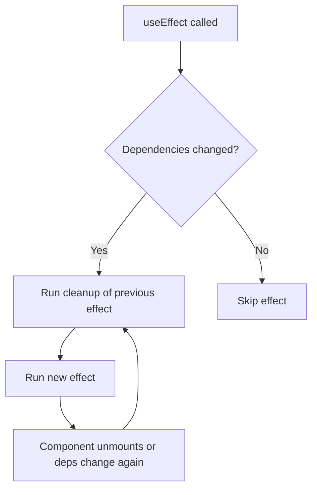
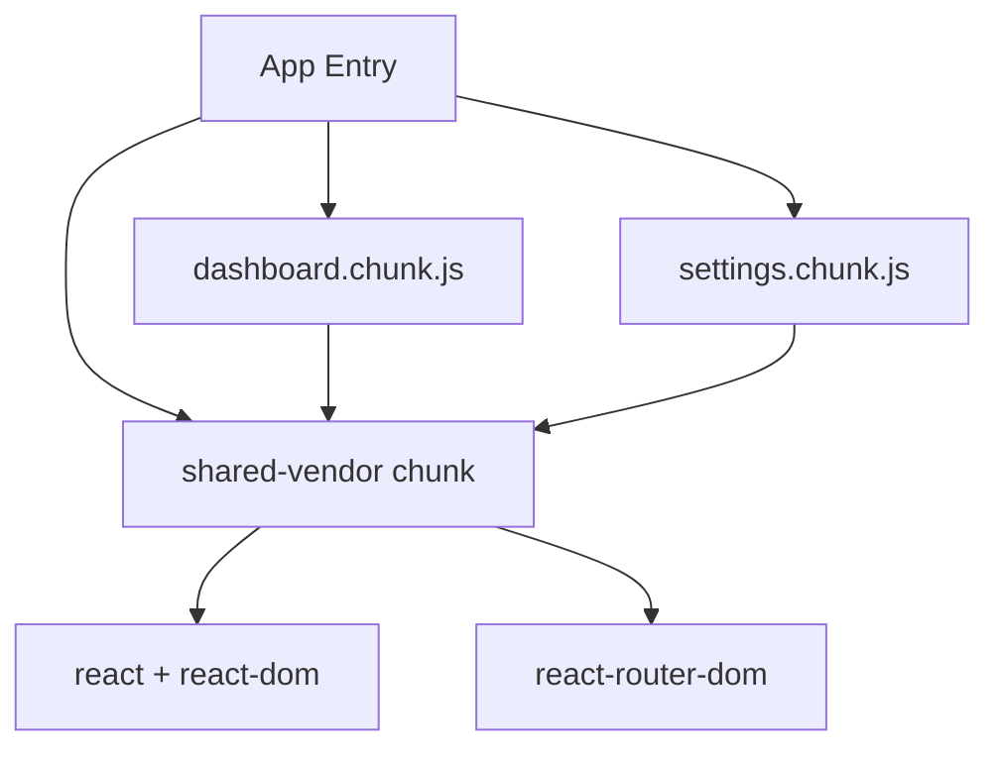
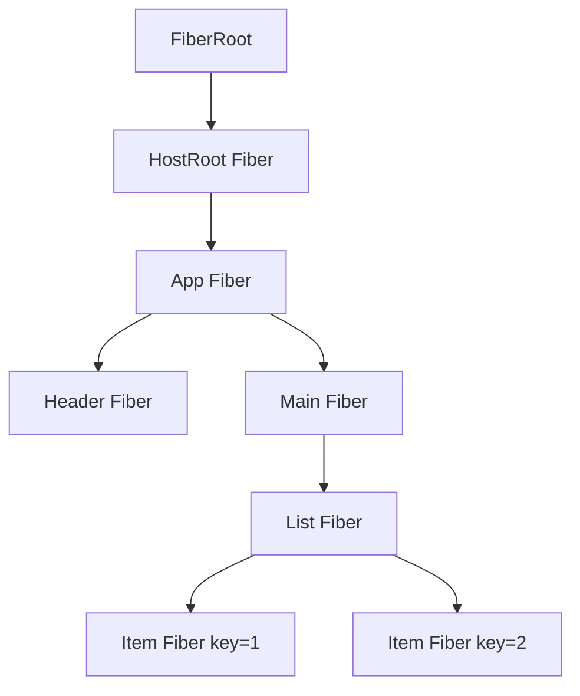
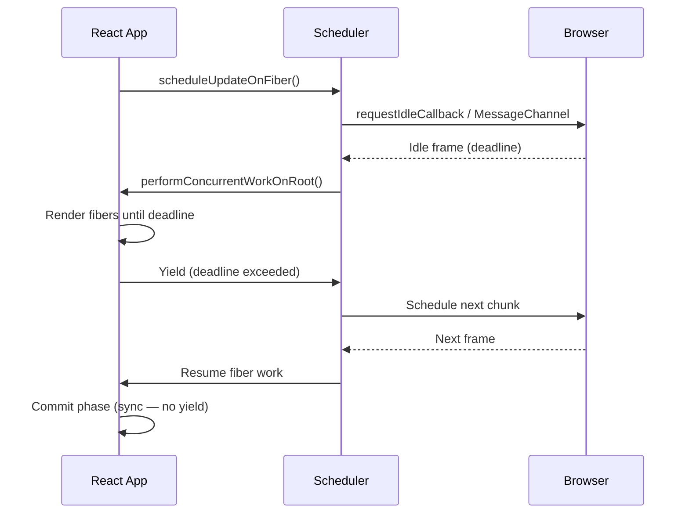
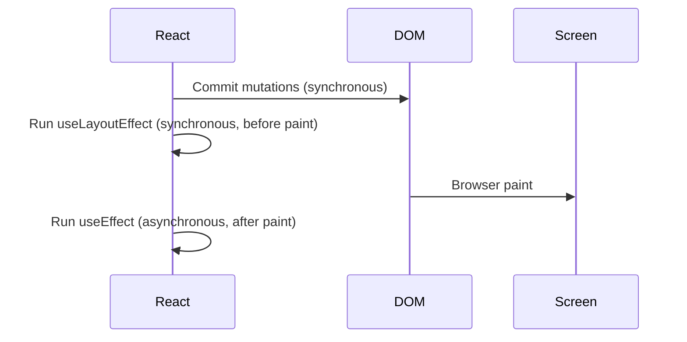
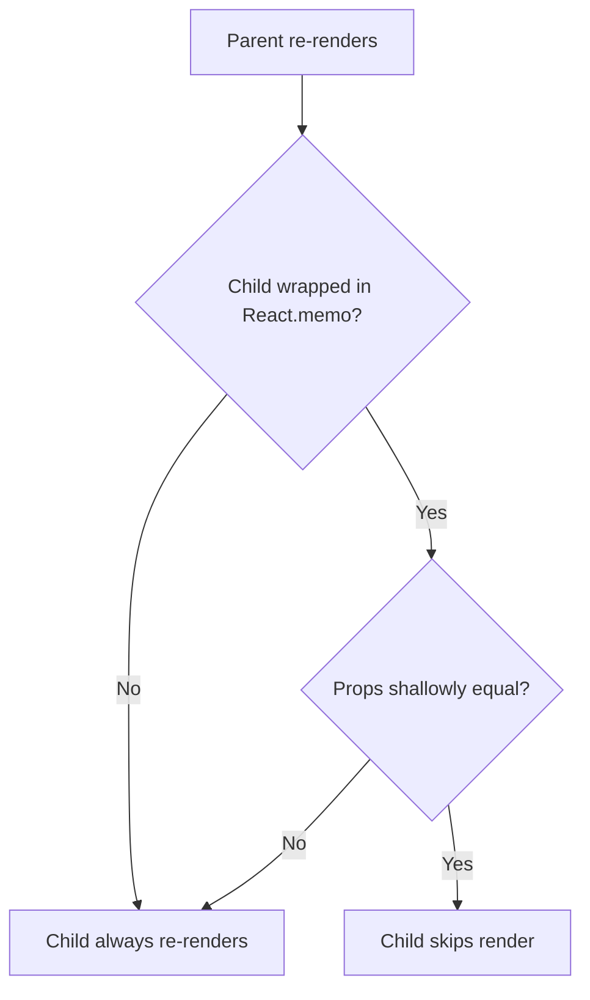

# React Roadmap — Universal Template

> Replace `{{TOPIC_NAME}}` with the specific React concept being documented.
> Each section below corresponds to one output file in the topic folder.

---

# TEMPLATE 1 — `junior.md`

## {{TOPIC_NAME}} — Junior Level

### What Is It?
Explain `{{TOPIC_NAME}}` in plain terms to someone who knows HTML, CSS, and basic
JavaScript but has never used React. Focus on the problem it solves before showing
any code.

### Core Concept

```tsx
// Minimal React component demonstrating {{TOPIC_NAME}}
import React from "react";

function Greeting({ name }: { name: string }) {
  return <h1>Hello, {name}!</h1>;
}

export default function App() {
  return <Greeting name="World" />;
}
```

### Mental Model
- React builds UIs as a **tree of components**. Each component is a function that
  returns JSX describing what the screen should look like.
- When state or props change, React re-renders the affected components.
- `{{TOPIC_NAME}}` relates to this model because: _[fill in]_.

### Key Terms
| Term | Definition |
|------|-----------|
| JSX | Syntax extension that looks like HTML inside JavaScript |
| Component | A function that accepts props and returns JSX |
| Props | Read-only data passed from parent to child component |
| State | Mutable data managed inside a component with `useState` |
| Hook | A function prefixed with `use` that adds React capabilities to function components |
| Virtual DOM | React's in-memory representation of the UI tree |

### Comparison with Alternatives
| Feature | React | Vue | Svelte | Angular |
|---------|-------|-----|--------|---------|
| Rendering model | Virtual DOM | Virtual DOM | Compile-time reactivity | Zone.js dirty checking |
| State management | Hooks + Context | Composition API / Options | Stores | RxJS / Signals |
| Template language | JSX | HTML templates | HTML templates | TypeScript templates |
| Bundle size | ~45 KB (prod) | ~33 KB | Near-zero runtime | ~150 KB+ |
| Learning curve | Medium | Low–Medium | Low | High |

### Common Mistakes at This Level
1. Mutating state directly instead of calling the setter from `useState`.
2. Forgetting that JSX expressions need `{}` for JavaScript values.
3. Using array index as `key` prop on dynamic lists.
4. Putting side effects directly in the render body instead of `useEffect`.

### Hands-On Exercise
Build a simple counter component. Add a button that increments the count, one that
decrements it, and one that resets it to zero. Display the current count. Then extract
the counter logic into a custom hook called `useCounter`.

### Further Reading
- React official docs: https://react.dev/
- React beta docs (hooks): https://react.dev/reference/react
- `{{TOPIC_NAME}}` specific resource: _[fill in]_

---

# TEMPLATE 2 — `middle.md`

## {{TOPIC_NAME}} — Middle Level

### Prerequisites
- Comfortable with function components, all common hooks, and context.
- Familiar with TypeScript generics at a basic level.
- Has built and deployed at least one React application.

### Deep Dive: {{TOPIC_NAME}}

```tsx
import React, { useState, useEffect, useCallback, useMemo, useRef } from "react";

interface User {
  id: string;
  name: string;
  email: string;
}

// Custom hook encapsulating async data fetching
function useUsers(page: number) {
  const [users, setUsers] = useState<User[]>([]);
  const [loading, setLoading] = useState(false);
  const [error, setError] = useState<Error | null>(null);

  useEffect(() => {
    let cancelled = false;
    setLoading(true);
    setError(null);

    fetch(`/api/users?page=${page}`)
      .then((r) => r.json())
      .then((data: User[]) => {
        if (!cancelled) setUsers(data);
      })
      .catch((err: Error) => {
        if (!cancelled) setError(err);
      })
      .finally(() => {
        if (!cancelled) setLoading(false);
      });

    return () => { cancelled = true; }; // cleanup prevents stale state
  }, [page]); // re-run when page changes

  return { users, loading, error };
}

// Memoized child component — skips re-render when props unchanged
const UserCard = React.memo(function UserCard({ user, onSelect }: {
  user: User;
  onSelect: (id: string) => void;
}) {
  return (
    <div onClick={() => onSelect(user.id)}>
      <strong>{user.name}</strong>
      <span>{user.email}</span>
    </div>
  );
});

export default function UserList() {
  const [page, setPage] = useState(1);
  const { users, loading, error } = useUsers(page);

  // useCallback prevents onSelect identity changing every render
  const handleSelect = useCallback((id: string) => {
    console.log("Selected:", id);
  }, []);

  // useMemo for expensive derived computation
  const sortedUsers = useMemo(
    () => [...users].sort((a, b) => a.name.localeCompare(b.name)),
    [users]
  );

  if (loading) return <p>Loading…</p>;
  if (error) return <p>Error: {error.message}</p>;

  return (
    <>
      {sortedUsers.map((u) => (
        <UserCard key={u.id} user={u} onSelect={handleSelect} />
      ))}
      <button onClick={() => setPage((p) => p + 1)}>Next Page</button>
    </>
  );
}
```

### Hook Dependency Rules


- Every value from the component scope used inside an effect **must** be in the deps array.
- Use the `exhaustive-deps` ESLint rule to catch missing dependencies automatically.
- When a dependency changes too often, move the logic up with `useReducer` or extract
  to a ref.

### Context vs Prop Drilling
| Scenario | Use |
|----------|-----|
| Data needed 2–3 levels deep | Props |
| Theme, locale, auth user | Context |
| Complex shared state | Zustand / Redux Toolkit |
| Server state (fetch/cache) | React Query / SWR |

### Error Boundaries

```tsx
import { Component, ErrorInfo, ReactNode } from "react";

class ErrorBoundary extends Component<
  { children: ReactNode; fallback: ReactNode },
  { hasError: boolean }
> {
  state = { hasError: false };

  static getDerivedStateFromError(): { hasError: boolean } {
    return { hasError: true };
  }

  componentDidCatch(error: Error, info: ErrorInfo) {
    console.error("Caught error:", error, info.componentStack);
  }

  render() {
    return this.state.hasError ? this.props.fallback : this.props.children;
  }
}
```

### Middle Checklist
- [ ] All custom hooks have a `use` prefix and are extractable to separate files.
- [ ] `useEffect` cleanup cancels async operations (abort controller or flag).
- [ ] `React.memo` is applied to expensive list items.
- [ ] Context providers are split by update frequency to avoid unnecessary re-renders.

---

# TEMPLATE 3 — `senior.md`

## {{TOPIC_NAME}} — Senior Level

### Responsibilities at This Level
- Own the component architecture across a large feature or product area.
- Define patterns for state management, data fetching, and code splitting.
- Drive performance budgets and review components for re-render regressions.
- Mentor mid-level engineers; lead React upgrade cycles.

### Advanced Patterns

```tsx
// Compound component pattern — flexible, composable API
import React, { createContext, useContext, useState } from "react";

const AccordionContext = createContext<{
  openId: string | null;
  toggle: (id: string) => void;
} | null>(null);

function Accordion({ children }: { children: React.ReactNode }) {
  const [openId, setOpenId] = useState<string | null>(null);
  const toggle = (id: string) => setOpenId((prev) => (prev === id ? null : id));
  return (
    <AccordionContext.Provider value={{ openId, toggle }}>
      <div>{children}</div>
    </AccordionContext.Provider>
  );
}

function AccordionItem({ id, title, children }: { id: string; title: string; children: React.ReactNode }) {
  const ctx = useContext(AccordionContext)!;
  const isOpen = ctx.openId === id;
  return (
    <div>
      <button onClick={() => ctx.toggle(id)}>{title}</button>
      {isOpen && <div>{children}</div>}
    </div>
  );
}

Accordion.Item = AccordionItem;
export { Accordion };
```

### Code Splitting & Lazy Loading

```tsx
import { lazy, Suspense } from "react";
import { Routes, Route } from "react-router-dom";

// Route-level code splitting — each route is a separate JS chunk
const Dashboard = lazy(() => import("./pages/Dashboard"));
const Settings = lazy(() => import("./pages/Settings"));

function App() {
  return (
    <Suspense fallback={<div>Loading…</div>}>
      <Routes>
        <Route path="/dashboard" element={<Dashboard />} />
        <Route path="/settings" element={<Settings />} />
      </Routes>
    </Suspense>
  );
}
```

### Concurrent Features: Transitions & Deferred Values

```tsx
import { useTransition, useDeferredValue, useState } from "react";

function SearchPage() {
  const [query, setQuery] = useState("");
  const [isPending, startTransition] = useTransition();

  // Mark search results update as non-urgent
  const handleChange = (e: React.ChangeEvent<HTMLInputElement>) => {
    setQuery(e.target.value); // urgent — update input immediately
    startTransition(() => {
      // non-urgent — React can interrupt this to handle more urgent updates
    });
  };

  const deferredQuery = useDeferredValue(query);
  // Pass deferredQuery to expensive list — it "lags" behind input
  return (
    <>
      <input onChange={handleChange} value={query} />
      {isPending && <span>Updating…</span>}
      <SearchResults query={deferredQuery} />
    </>
  );
}
```

### Bundle Architecture



### Senior Checklist
- [ ] Route-level lazy loading configured; initial JS bundle < 100 KB gzipped.
- [ ] Re-render profiling done with React DevTools Profiler; no unexpected cascades.
- [ ] Server Components used for data-heavy, non-interactive UI sections (Next.js).
- [ ] Error boundaries wrap all lazy-loaded routes and third-party widgets.
- [ ] `useTransition` applied to expensive state updates that should yield to input.

---

# TEMPLATE 4 — `professional.md`

## {{TOPIC_NAME}} — React Fiber Reconciliation Internals

### Overview
This section covers how React Fiber works under the hood: the virtual DOM diffing
algorithm, the Suspense boundary mechanism, and the cooperative scheduler that
enables concurrent rendering. Understanding these internals allows engineers to
diagnose subtle performance and correctness issues that cannot be explained by
the public API alone.

### Fiber Architecture



A **Fiber** is a plain JavaScript object representing one unit of work. It holds:
- `type` (function or string tag)
- `pendingProps` / `memoizedProps`
- `memoizedState` (linked list of hook states)
- `alternate` (the work-in-progress twin)
- `effectTag` (placement, update, deletion)

React maintains **two fiber trees** at all times:
1. **Current tree**: the tree currently rendered on screen.
2. **Work-in-progress tree**: the tree being built for the next render.

### The Reconciliation Algorithm

```tsx
// Conceptual pseudocode — not actual React source
function reconcileChildren(currentFiber: Fiber, newChildren: ReactElement[]) {
  // Phase 1 — diff by key within same type
  // Fast path: same key + same type → UPDATE (reuse DOM node)
  // Key mismatch or type change → DELETE old + CREATE new

  // Phase 2 — commit phase (synchronous, cannot be interrupted)
  // Apply all mutations to the real DOM in one pass
}
```

**Diffing rules**:
1. Elements of different types (e.g., `<div>` → `<span>`) always produce a full subtree teardown.
2. Same type: reconcile props, recurse into children.
3. Lists: match by `key` prop; missing key → fallback to index (unstable).

### Cooperative Scheduler



- React uses a **MessageChannel** (not `requestIdleCallback`) for low-latency scheduling.
- Work is split into 5 ms chunks by default (configurable via priority lanes).
- **Priority lanes**: SyncLane (highest), InputContinuousLane, DefaultLane, TransitionLane, IdleLane.
- `useTransition` and `useDeferredValue` demote updates to `TransitionLane`, allowing
  higher-priority updates to interrupt them.

### Suspense Mechanism

```tsx
// How Suspense works internally
// A component "suspends" by throwing a Promise
// React catches it at the nearest Suspense boundary
// When the Promise resolves, React replays the render

function DataComponent() {
  // React Query / SWR implement this pattern
  const resource = useQuery("key", fetchData);
  if (resource.isLoading) throw resource.promise; // throws Promise
  return <div>{resource.data.title}</div>;
}

// React catches the thrown Promise, shows fallback,
// and schedules a re-render when the Promise resolves
```

### useLayoutEffect vs useEffect Timing



Use `useLayoutEffect` only when you need to read layout (e.g., element dimensions)
before the browser paints. In all other cases, prefer `useEffect` to avoid blocking paint.

### Key Internals Facts for Code Review
- A `useState` setter called with the **same reference** bails out of re-render (Object.is comparison).
- A parent re-render always re-renders children unless they are wrapped in `React.memo`.
- `React.memo` performs a **shallow comparison** of props — nested objects always differ.
- Context consumers re-render whenever the context **value reference** changes, regardless of
  whether the consumed fields changed.

---

# TEMPLATE 5 — `interview.md`

## {{TOPIC_NAME}} — Interview Questions

### Junior Interview Questions

**Q1: What is the difference between state and props in React?**
> Props are read-only inputs passed from parent to child. State is internal mutable
> data managed by `useState`. A component re-renders when its state or props change.

**Q2: Why can't you mutate state directly?**
> React tracks state via the setter returned by `useState`. Direct mutation bypasses
> React's change detection — the component will not re-render and the UI goes stale.

**Q3: What is a key prop and why does it matter in lists?**
> React uses `key` to identify which list items changed between renders. Using array
> index as key causes subtle bugs when items are reordered or deleted: React associates
> the wrong state and DOM node with each item.

**Q4: What happens if you call a hook inside an `if` statement?**
> React stores hooks in a linked list ordered by call position. Conditional hooks break
> this order across renders, causing React to associate the wrong state with each hook.
> This is why the Rules of Hooks require top-level, unconditional hook calls.

---

### Middle Interview Questions

**Q5: What is a stale closure in `useEffect`, and how do you fix it?**
> A stale closure occurs when an effect captures an old value of a variable because
> that variable is not listed in the dependency array. The effect keeps referencing the
> snapshot taken at creation time. Fix: add the variable to the deps array, or use a
> ref (`useRef`) to hold the latest value without triggering re-renders.

**Q6: When should you use `useCallback` and `useMemo`?**
> `useCallback` memoizes a function reference — useful when passing callbacks to
> `React.memo`-wrapped children to prevent unnecessary re-renders. `useMemo` memoizes
> a computed value — useful for expensive calculations. Both add overhead; only apply
> after profiling confirms a re-render problem.

**Q7: What is React Context and what are its performance pitfalls?**
> Context provides a way to share values without prop drilling. The pitfall: every
> consumer re-renders when the context **value** changes reference. Mitigation: split
> contexts by update frequency, memoize the value object, or use a state library
> (Zustand, Jotai) which supports granular subscriptions.

---

### Senior Interview Questions

**Q8: Explain React Concurrent Mode. How does `useTransition` improve UX?**
> Concurrent Mode lets React interrupt, pause, and restart renders. `useTransition`
> marks a state update as non-urgent (TransitionLane). React can interrupt it if a
> higher-priority update arrives (e.g., user typing), then resume. The UI stays
> responsive during expensive renders.

**Q9: How does code splitting work with `React.lazy` and what are its limitations?**
> `React.lazy` returns a component that dynamically imports a chunk on first render.
> Limitations: only works with default exports, requires a `Suspense` boundary, and
> the chunk must be loaded before the component can render (no server-side rendering
> without a framework like Next.js handling hydration).

**Q10: How would you prevent a React app from re-rendering too frequently?**
> Profile first (React DevTools Profiler). Common fixes: `React.memo` on expensive
> leaf components, `useCallback`/`useMemo` for referentially stable values, split
> context, move state down closer to where it is used, virtualize long lists
> (react-window), and use server components for static content.

---

### Professional / Deep-Dive Questions

**Q11: Describe the two phases of React's reconciliation (render phase vs commit phase).**
> Render phase: React builds the work-in-progress fiber tree, calling component
> functions and computing diffs. This phase is **interruptible** in Concurrent Mode.
> Commit phase: React applies all DOM mutations synchronously in one pass, then fires
> `useLayoutEffect`. After paint, `useEffect` runs. The commit phase is never interrupted.

**Q12: How does Suspense work internally? What does "throwing a Promise" mean?**
> When a component is not ready to render (e.g., data not loaded), it throws a Promise.
> React catches the throw at the nearest Suspense boundary, shows the fallback, and
> subscribes to the Promise. When it resolves, React re-renders the subtree from the
> Suspense boundary. Libraries like React Query wrap this protocol behind `useSuspenseQuery`.

---

# TEMPLATE 6 — `tasks.md`

## {{TOPIC_NAME}} — Practical Tasks

### Task 1 — Junior: Build a Todo App
**Goal**: Implement a functional todo list using React hooks.

**Requirements**:
- `useState` to store the list of todos.
- Input field + button to add new todos.
- Each todo has a checkbox to mark as complete.
- Button to delete individual todos.
- Display count of remaining incomplete todos.

**Acceptance Criteria**:
- [ ] Adding a todo appends it to the list without duplicating existing items.
- [ ] Toggling complete changes the visual style (strikethrough).
- [ ] Deleting a todo removes it from state — not just from the display.
- [ ] No console errors in the browser.

---

### Task 2 — Middle: Data Fetching with Custom Hook
**Goal**: Implement a reusable data-fetching hook with loading, error, and abort states.

**Requirements**:
- `useFetch<T>(url: string)` returns `{ data, loading, error }`.
- Cancels the previous request when `url` changes (use `AbortController`).
- Retry logic: on network error, retry up to 3 times with exponential back-off.
- Test with a public API (e.g., JSONPlaceholder).

**Acceptance Criteria**:
- [ ] Changing the URL cancels the in-flight request (no stale state update).
- [ ] Loading state shows a spinner; error state shows a user-friendly message.
- [ ] TypeScript: hook is fully typed with generic `T`.
- [ ] Unit tests cover success, error, and abort scenarios.

---

### Task 3 — Senior: Virtualized List with React Window
**Goal**: Render a 100,000-item list without performance degradation.

**Requirements**:
- Use `react-window` `FixedSizeList` to virtualize rendering.
- Each row fetches additional detail on hover (debounced, 300 ms).
- Implement optimistic UI for a "favorite" toggle mutation.
- Measure and document initial render time and scroll FPS before/after virtualization.

**Acceptance Criteria**:
- [ ] Initial render time < 200 ms for 100,000 items.
- [ ] Scroll FPS stays above 50 during fast scroll.
- [ ] Optimistic update reverts correctly on API error.

---

### Task 4 — Professional: Lighthouse LCP Optimization
**Goal**: Achieve a Lighthouse LCP score of < 2.5 s on a simulated 4G mobile connection.

**Requirements**:
- Baseline: measure current LCP on a dashboard page with React Query.
- Apply: route-based code splitting, image lazy loading, font preloading.
- Add `useTransition` for the heaviest data-driven panel update.
- Use React Server Components (Next.js App Router) for the static header.

**Acceptance Criteria**:
- [ ] Lighthouse LCP < 2.5 s (Good) on Mobile, 4G throttling.
- [ ] JS bundle for the initial route < 120 KB gzipped.
- [ ] Re-render count for the main panel measured in React Profiler and reduced by >= 30%.

---

# TEMPLATE 7 — `find-bug.md`

## {{TOPIC_NAME}} — Find the Bug

### Bug 1: Stale Closure in useEffect

```tsx
// BUGGY CODE
function Timer() {
  const [count, setCount] = useState(0);

  useEffect(() => {
    const id = setInterval(() => {
      // BUG: count is captured at the time this effect runs (always 0)
      // The closure never updates as count changes
      setCount(count + 1);
    }, 1000);
    return () => clearInterval(id);
  }, []); // empty deps means effect never re-runs

  return <p>{count}</p>;
}
```

**What is wrong?**
`count` is captured at `0` when the effect first runs. Because deps array is empty,
the effect never re-creates the interval with the updated `count`. After 1 second the
count shows `1` and then never changes — `count + 1` is always `0 + 1`.

**Fix:**
```tsx
useEffect(() => {
  const id = setInterval(() => {
    // Functional update reads latest state without needing it as a dependency
    setCount((prev) => prev + 1);
  }, 1000);
  return () => clearInterval(id);
}, []); // safe now — no external values captured
```

---

### Bug 2: Missing Dependency in useEffect

```tsx
// BUGGY CODE
function UserProfile({ userId }: { userId: string }) {
  const [user, setUser] = useState<User | null>(null);

  useEffect(() => {
    // BUG: userId is used but not in the dependency array
    // If userId prop changes, this effect does NOT re-run
    fetch(`/api/users/${userId}`)
      .then((r) => r.json())
      .then(setUser);
  }, []); // should be [userId]

  return user ? <div>{user.name}</div> : <p>Loading…</p>;
}
```

**What is wrong?**
When the parent renders `<UserProfile userId="new-id">`, the effect does not re-fetch
because `[]` means "run once on mount." The component displays stale data for the
previous `userId`.

**Fix:** Change `[]` to `[userId]`. Also add an `AbortController` to cancel the
previous request when `userId` changes before the fetch completes.

---

### Bug 3: Index as Key Prop

```tsx
// BUGGY CODE
function TodoList({ todos }: { todos: Todo[] }) {
  return (
    <ul>
      {todos.map((todo, index) => (
        // BUG: using index as key — breaks when items are added/removed/reordered
        <TodoItem key={index} todo={todo} />
      ))}
    </ul>
  );
}
```

**What is wrong?**
When an item is deleted from the middle of the list, React reassigns indices — the
remaining items shift. React reuses the DOM nodes and their internal state for the
wrong items, causing input values, focus states, and animations to appear on the wrong
list item.

**Fix:** Use a stable, unique identifier as the key: `key={todo.id}`.

---

# TEMPLATE 8 — `optimize.md`

## {{TOPIC_NAME}} — Optimization Guide

### Optimization 1: Lighthouse LCP Improvement

**Goal**: Reduce Largest Contentful Paint from > 4 s to < 2.5 s.

**Diagnostic steps**:
1. Run `npx lighthouse http://localhost:3000 --view` (or Chrome DevTools Lighthouse tab).
2. Identify the LCP element (usually a hero image or H1 heading).
3. Check: is it rendered server-side? Is the resource preloaded?

**Fixes**:
```tsx
// 1. Preload critical image
// In Next.js: use <Image priority> or add <link rel="preload"> in <Head>
import Image from "next/image";
<Image src="/hero.jpg" alt="Hero" width={1200} height={600} priority />

// 2. Route-level code splitting — reduce JS blocking LCP render
const HeavyDashboard = React.lazy(() => import("./HeavyDashboard"));

// 3. Use React Server Components for static above-the-fold content
// (Next.js App Router — no JS sent to client for server components)
```

**Expected improvement**: Moving hero image to SSR + preload typically reduces LCP
by 1–2 s on mobile 4G.

---

### Optimization 2: Re-render Count Reduction

**Diagnostic**: React DevTools Profiler → record interaction → inspect "Why did this render?"



```tsx
// Problem: new object/array reference created every render
function Parent() {
  const config = { theme: "dark" }; // new reference every render
  return <ExpensiveChild config={config} />;
}

// Fix: memoize the reference
function Parent() {
  const config = useMemo(() => ({ theme: "dark" }), []); // stable reference
  return <ExpensiveChild config={config} />;
}
```

**Target metric**: No component in the critical render path re-renders more than once
per user interaction (measure with Profiler "Interactions" tab).

---

### Optimization 3: Bundle Size Reduction

```bash
# Analyze bundle with source-map-explorer
npx source-map-explorer 'build/static/js/*.js'

# Or with webpack-bundle-analyzer (if using webpack / CRA)
npx webpack-bundle-analyzer build/static/js/*.js.map
```

**Common large dependencies to replace**:
| Library | Size | Alternative |
|---------|------|-------------|
| moment.js | 67 KB | date-fns (tree-shakeable) |
| lodash | 70 KB | lodash-es + named imports |
| react-icons (all) | > 200 KB | @phosphor-icons (lazy) |
| chart.js (full) | 200 KB+ | Recharts or Visx (tree-shakeable) |

**Target**: Initial route JS bundle < 100 KB gzipped (critical resources only).

---

### Optimization Summary Table
| Technique | Effort | Impact | Key Metric |
|-----------|--------|--------|-----------|
| Route-level code splitting | Low | High | Initial bundle KB, LCP |
| `React.memo` + `useCallback` | Low | Medium | Re-render count |
| Virtualize long lists | Medium | High | Scroll FPS, memory |
| Server Components (Next.js) | High | High | JS to client, TTFB |
| Image optimization + priority | Low | High | LCP seconds |
| Bundle analysis + tree-shaking | Medium | Medium | Bundle KB |
