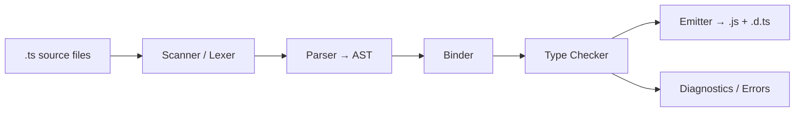
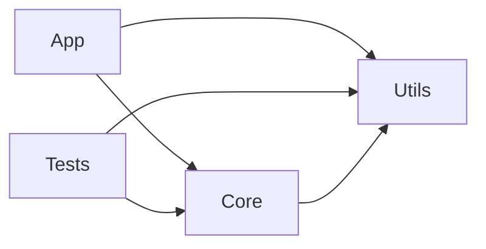

# TypeScript Roadmap — Universal Template

> Replace `{{TOPIC_NAME}}` with the specific TypeScript concept being documented.
> Each section below corresponds to one output file in the topic folder.

---

## Overview

| | Description |
|---|---|
| **Purpose** | Universal template for all TypeScript roadmap topics |
| **Files per topic** | 9 files: `junior.md`, `middle.md`, `senior.md`, `professional.md`, `interview.md`, `tasks.md`, `find-bug.md`, `optimize.md`, `specification.md` |
| **Language** | All content must be generated in **English** |
| **Table of Contents** | **Optional** — include only if relevant to the topic. For theory/practice files (`tasks.md`, `find-bug.md`, `optimize.md`) it is NOT required |

### Topic Structure

```
XX-topic-name/
├── junior.md          ← "What?" and "How?"
├── middle.md          ← "Why?" and "When?"
├── senior.md          ← "How to optimize?" and "How to architect?"
├── professional.md    ← "Under the Hood" — tsc pipeline, type checker, emit
├── interview.md       ← Interview prep across all levels
├── tasks.md           ← Hands-on practice tasks
├── find-bug.md        ← Find and fix bugs in code (10+ exercises)
├── optimize.md        ← Optimize slow/inefficient code (10+ exercises)
└── specification.md   ← Official spec / documentation deep-dive
```

---

# TEMPLATE 1 — `junior.md`

## {{TOPIC_NAME}} — Junior Level

### What Is It?
Describe `{{TOPIC_NAME}}` to someone who knows JavaScript but has never used TypeScript.
Emphasize that TypeScript is a **superset of JavaScript** — all valid JS is valid TS.
The type system exists only at compile time; it disappears at runtime.

### Core Concept

```typescript
// TypeScript adds optional static types to JavaScript
// This is valid JavaScript AND valid TypeScript
function add(a: number, b: number): number {
  return a + b;
}

// Type error caught at compile time — not at runtime
add("hello", 42); // Error: Argument of type 'string' is not assignable to parameter of type 'number'
```

### Mental Model
- TypeScript types are **erased** before execution — the runtime only sees plain JS.
- The compiler checks your types and reports errors; it does not change program behavior.
- `{{TOPIC_NAME}}` helps the compiler understand: _[fill in]_.

### Key Terms
| Term | Definition |
|------|-----------|
| Type annotation | `: string` — explicitly telling TypeScript the type of a variable or parameter |
| Type inference | TypeScript deducing the type without an explicit annotation |
| `interface` | A named structure describing the shape of an object |
| `type` alias | Another way to name a type (can represent unions, primitives, tuples, etc.) |
| `any` | Opt-out of type checking — avoid unless necessary |
| `unknown` | Safe alternative to `any` — must be narrowed before use |
| Union type | `string \| number` — a value that can be one of several types |

### Comparison with Alternatives
| Feature | TypeScript | JavaScript | Flow | Dart |
|---------|-----------|-----------|------|------|
| Type system | Structural, static | None | Structural, static | Nominal, static |
| Compilation | tsc → JS | None needed | flow-remove-types | dart compile |
| Ecosystem | Massive (@types/*) | Massive | Limited | Flutter-focused |
| Adoption | Very high | Universal | Declining | Growing |
| Learning curve | Medium | Low | Medium | Medium |

### Common Mistakes at This Level
1. Using `any` everywhere — this defeats the purpose of TypeScript.
2. Annotating everything explicitly when TypeScript can infer the type.
3. Confusing `interface` vs `type` (both work for most object shapes).
4. Not understanding that types do not exist at runtime — `typeof x === "MyInterface"` does not work.

### Hands-On Exercise
Convert a plain JavaScript file that defines a `User` object and a `greet(user)` function
into TypeScript. Add a `UserRole` union type (`"admin" | "editor" | "viewer"`), annotate
the function, and confirm the compiler catches a wrong argument type.

### Further Reading
- TypeScript handbook: https://www.typescriptlang.org/docs/handbook/intro.html
- TypeScript playground: https://www.typescriptlang.org/play
- `{{TOPIC_NAME}}` specific resource: _[fill in]_

---

# TEMPLATE 2 — `middle.md`

## {{TOPIC_NAME}} — Middle Level

### Prerequisites
- Comfortable with interfaces, type aliases, union types, and generics at a basic level.
- Has configured a `tsconfig.json` and understands `strict` mode.
- Builds real projects with TypeScript (React, Node.js, or similar).

### Deep Dive: {{TOPIC_NAME}}

```typescript
// Generics — write code that works across types without losing type information
function first<T>(arr: T[]): T | undefined {
  return arr[0];
}

const name = first(["Alice", "Bob"]); // TypeScript infers: string | undefined
const count = first([1, 2, 3]);       // number | undefined

// Generic constraints — T must have a .length property
function longest<T extends { length: number }>(a: T, b: T): T {
  return a.length >= b.length ? a : b;
}

longest("Alice", "Bob");       // OK — string has .length
longest([1, 2], [3]);          // OK — array has .length
longest(10, 20);               // Error — number has no .length
```

```typescript
// Utility types — transform existing types
interface User {
  id: string;
  name: string;
  email: string;
  password: string;
}

type PublicUser = Omit<User, "password">;          // remove sensitive field
type UserUpdate = Partial<Pick<User, "name" | "email">>; // partial update payload
type ReadonlyUser = Readonly<User>;                 // immutable snapshot

// Mapped types — transform every key of a type
type Optional<T> = {
  [K in keyof T]?: T[K];
};

// Conditional types
type IsString<T> = T extends string ? "yes" : "no";
type Test = IsString<"hello">; // "yes"
```

### Narrowing Patterns

```typescript
type Shape = { kind: "circle"; radius: number } | { kind: "square"; side: number };

function area(shape: Shape): number {
  // Discriminated union narrowing — TypeScript narrows inside each branch
  switch (shape.kind) {
    case "circle":
      return Math.PI * shape.radius ** 2; // shape is Circle here
    case "square":
      return shape.side ** 2;             // shape is Square here
  }
}

// Type guard function
function isError(value: unknown): value is Error {
  return value instanceof Error;
}

function handle(value: unknown) {
  if (isError(value)) {
    console.error(value.message); // narrowed to Error
  }
}
```

### tsconfig.json — Important Flags

```typescript
// tsconfig.json
{
  "compilerOptions": {
    "strict": true,           // enables all strict checks
    "noImplicitAny": true,    // error on inferred any
    "strictNullChecks": true, // null and undefined are not assignable everywhere
    "noUncheckedIndexedAccess": true, // arr[i] returns T | undefined
    "exactOptionalPropertyTypes": true, // optional ≠ can be explicitly undefined
    "moduleResolution": "bundler",      // modern resolution for Vite/esbuild
    "target": "ES2022",
    "lib": ["ES2022", "DOM"]
  }
}
```

### Middle Checklist
- [ ] `strict: true` enabled in `tsconfig.json`.
- [ ] No `any` without explicit `eslint-disable` comment and reason.
- [ ] Discriminated unions used for tagged variant types.
- [ ] Utility types (`Partial`, `Pick`, `Omit`, `Record`) used to derive types instead of duplicating.

---

# TEMPLATE 3 — `senior.md`

## {{TOPIC_NAME}} — Senior Level

### Responsibilities at This Level
- Define TypeScript architecture standards across a codebase or organization.
- Write complex generic utility types used by many teams.
- Set up CI type-checking, incremental builds, and project references.
- Review code for type safety regressions and unsafe patterns.

### Advanced Type-Level Programming

```typescript
// Template literal types — string manipulation at the type level
type EventName = "click" | "focus" | "blur";
type HandlerName = `on${Capitalize<EventName>}`; // "onClick" | "onFocus" | "onBlur"

// Infer keyword — extract parts of a type
type ReturnType<T> = T extends (...args: unknown[]) => infer R ? R : never;
type AsyncReturn<T> = T extends Promise<infer R> ? R : T;

// Recursive types — model deeply nested structures
type DeepReadonly<T> = {
  readonly [K in keyof T]: T[K] extends object ? DeepReadonly<T[K]> : T[K];
};

// Tuple manipulation
type Head<T extends unknown[]> = T extends [infer H, ...unknown[]] ? H : never;
type Tail<T extends unknown[]> = T extends [unknown, ...infer R] ? R : never;
type Head3 = Head<[string, number, boolean]>; // string
```

### Project References for Monorepos

```json
// packages/core/tsconfig.json
{
  "compilerOptions": {
    "composite": true,
    "declaration": true,
    "declarationMap": true,
    "outDir": "./dist"
  }
}

// packages/app/tsconfig.json
{
  "references": [{ "path": "../core" }],
  "compilerOptions": { "incremental": true }
}
```

```bash
# Build only what changed — orders of magnitude faster in large monorepos
tsc --build --incremental
```

### Declaration Files & Module Augmentation

```typescript
// Augment an existing module (e.g., add custom property to Express Request)
// types/express/index.d.ts
import "express";

declare module "express-serve-static-core" {
  interface Request {
    currentUser?: { id: string; roles: string[] };
  }
}

// Usage — TypeScript knows about req.currentUser
app.get("/me", (req, res) => {
  res.json(req.currentUser); // typed, no cast needed
});
```

### Branded / Nominal Types

```typescript
// Prevent mixing structurally identical types with different semantics
declare const __brand: unique symbol;
type Brand<T, B> = T & { [__brand]: B };

type UserId = Brand<string, "UserId">;
type PostId = Brand<string, "PostId">;

function getUser(id: UserId): User { /* ... */ return {} as User; }

const userId = "abc" as UserId;
const postId = "abc" as PostId;

getUser(userId); // OK
getUser(postId); // Error: PostId is not assignable to UserId
```

### Senior Checklist
- [ ] Project references configured for monorepo incremental builds.
- [ ] No `as` assertions without a narrowing guard or explicit comment.
- [ ] Branded types used for IDs and other structurally-identical-but-semantically-different strings.
- [ ] Declaration maps enabled for source-level debugging through `.d.ts` files.
- [ ] `tsc --noEmit` runs in CI to catch type errors independently of the build step.

---

# TEMPLATE 4 — `professional.md`

## {{TOPIC_NAME}} — TypeScript Type Checker Internals

### Overview
This section examines how the TypeScript compiler works internally: the `tsc` pipeline,
how type inference is computed, and the structural subtyping rules that make TypeScript's
type system sound (but intentionally unsound in a few places for practicality).
Understanding these internals enables engineers to diagnose slow builds, design
better generic libraries, and reason about edge cases the public docs do not cover.

### The tsc Pipeline



1. **Scanner**: Converts source characters into tokens.
2. **Parser**: Builds a typed AST (`SourceFile` → `Node` hierarchy).
3. **Binder**: Assigns symbols to declarations, builds the symbol table, determines
   control flow (used for narrowing analysis).
4. **Type Checker**: The heart of tsc. Resolves types, checks assignments,
   infers generic type arguments, and emits diagnostics.
5. **Emitter**: Strips type annotations and emits JavaScript + declaration files.

### Type Inference Algorithm

```typescript
// TypeScript uses a constraint-based inference algorithm
// Generic type arguments are inferred by unification

function identity<T>(value: T): T { return value; }

// Inference: T = string (from argument type)
const result = identity("hello"); // T inferred as string, result: string

// Contextual typing — inference flows from expected type to expression type
const nums: number[] = [1, 2, 3].map((x) => x * 2);
// map callback parameter x is inferred as number (from number[])
```

### Structural Subtyping

```typescript
// TypeScript uses structural (duck) typing, not nominal typing
// A type S is assignable to T if S has at least all of T's required members

interface Printable {
  print(): void;
}

// No explicit "implements" needed — structure matches
class Document {
  print() { console.log("Printing document"); }
  save() { console.log("Saving"); }
}

const p: Printable = new Document(); // OK — Document has .print()
```

**Key unsoundness trade-offs** (intentional):
- Covariant function parameters (for practical usability with `Array.forEach` etc.).
- `any` type disables all checks bidirectionally.
- Index signatures: `{ [key: string]: number }` allows any string key.

### Control Flow Analysis

```mermaid
flowchart TD
    A[let x: string | null] --> B{if x !== null}
    B -- true branch --> C[x: string]
    B -- false / else branch --> D[x: null]
    C --> E[x.toUpperCase() — OK]
    D --> F[must handle null]
```

```typescript
// tsc builds a control flow graph and narrows types at each node
function process(value: string | null | undefined): string {
  if (value == null) {
    return "default"; // null | undefined branch
  }
  // TypeScript knows value is string here
  return value.toUpperCase();
}
```

### Build Performance Internals

```typescript
// Factors that dominate tsc build time:
// 1. Number of files in the compilation unit
// 2. Complexity of generic instantiations (recursive generics are expensive)
// 3. Number of .d.ts files re-processed (node_modules)

// Mitigations:
// - "skipLibCheck": true  — skip type-checking node_modules .d.ts (FAST, some risk)
// - "incremental": true   — persist .tsbuildinfo and rebuild only changed files
// - Project references    — split large repo into independently-checkable packages
// - "isolatedModules": true — ensure each file can be transpiled independently (esbuild compat)
```

### Type Checking Time Profiling

```bash
# Emit trace data to analyze where type checking time is spent
tsc --generateTrace ./trace-output

# Open in Chrome DevTools Performance tab
# Or use: npx @typescript/analyze-trace ./trace-output
```

**Common hot spots**:
- Deeply recursive mapped/conditional types (`DeepPartial<T>` on large schemas).
- Circular type aliases (TypeScript has to detect and break the cycle).
- Overly broad union types (100+ members) being resolved on every assignment.

### Practical Implications for Library Authors

```typescript
// Prefer interface over type for public API objects —
// interface declarations are merged; they also produce better error messages
// and are generally faster to check due to caching in the checker.

// Type alias (slower for large object types — not cached the same way)
type Config = { timeout: number; retries: number };

// Interface (faster, mergeable)
interface Config {
  timeout: number;
  retries: number;
}

// Avoid inlining large generic instantiations in return positions —
// assign to a named type alias so the checker can cache the result
type Parsed<T> = { [K in keyof T]: Parse<T[K]> };
function parse<T>(input: T): Parsed<T> { /* ... */ return {} as Parsed<T>; }
```

---

# TEMPLATE 5 — `interview.md`

## {{TOPIC_NAME}} — Interview Questions

### Junior Interview Questions

**Q1: What is the difference between `interface` and `type` in TypeScript?**
> Both describe object shapes. `interface` supports declaration merging and is
> generally preferred for public APIs. `type` is more flexible — it can represent
> unions, intersections, primitives, and tuples. For plain object shapes, they are
> functionally equivalent.

**Q2: What does `strict: true` enable?**
> It enables a group of strict checks including `noImplicitAny`, `strictNullChecks`,
> `strictFunctionTypes`, and others. The most impactful is `strictNullChecks`, which
> makes `null` and `undefined` not assignable to other types by default.

**Q3: What is `unknown` and when should you use it instead of `any`?**
> `unknown` is the type-safe alternative to `any`. You cannot perform any operations
> on an `unknown` value without first narrowing it (via `typeof`, `instanceof`, or a
> type guard). Use `unknown` for values whose type you don't know at compile time
> (e.g., parsed JSON, function parameters from external systems).

---

### Middle Interview Questions

**Q4: Explain structural typing with an example.**
> TypeScript checks compatibility by structure (shape) not by name. A class `Dog` is
> assignable to an interface `Animal` as long as `Dog` has all the required members of
> `Animal`, even without an explicit `implements Animal` declaration.

**Q5: What is a discriminated union and why is it useful?**
> A discriminated union is a union type where each member has a literal "tag" field
> (`kind: "circle"` vs `kind: "square"`). TypeScript narrows the type inside switch/if
> statements based on the tag, eliminating the need for `as` casts. Exhaustiveness
> checking ensures all cases are handled.

**Q6: What is an unsafe `as` assertion? How would you detect it in a code review?**
> `as SomeType` overrides TypeScript's type inference without checking structural
> compatibility. It can hide real bugs: `const user = JSON.parse(raw) as User` —
> the runtime value may be missing fields that `User` declares as required. In review,
> flag any `as` on an `unknown` or `any` value that is not preceded by a runtime check.

---

### Senior Interview Questions

**Q7: How do TypeScript project references improve build performance in a monorepo?**
> Project references allow tsc to build packages independently with `composite: true`.
> Each package emits `.d.ts` files and a `.tsbuildinfo` incremental cache. Downstream
> packages type-check against the `.d.ts` files (fast) instead of re-processing all
> source files. Only changed packages and their dependents are rebuilt on each run.

**Q8: What is the difference between `Partial<T>`, `Required<T>`, and `DeepPartial<T>`?**
> `Partial<T>` makes all top-level properties optional. `Required<T>` makes all
> properties required. `DeepPartial<T>` is not a built-in — it must be implemented
> with a recursive mapped type and makes nested properties optional too. It is
> expensive for large types (increases type-checking time).

---

### Professional / Deep-Dive Questions

**Q9: Walk through the tsc pipeline from source file to JavaScript output.**
> Scanner → tokens; Parser → AST (SourceFile nodes); Binder → symbol table,
> control flow graph; Type Checker → resolve types, infer generics, validate
> assignments, emit diagnostics; Emitter → strip types, emit JS + `.d.ts`.
> The type checker is the most expensive phase; it is cached between `--watch` rebuilds.

**Q10: Why is TypeScript's type system intentionally unsound, and where?**
> Full soundness would block too many valid patterns. Known unsoundness: covariant
> method parameters (unlike strict function types), `any` propagation, index signature
> access always returning `T` (not `T | undefined` unless `noUncheckedIndexedAccess`),
> and `as` assertions bypassing checks. These are trade-offs for practical usability.

---

# TEMPLATE 6 — `tasks.md`

## {{TOPIC_NAME}} — Practical Tasks

### Task 1 — Junior: Type an Existing JS Module
**Goal**: Add TypeScript types to a plain JavaScript utility module.

**Requirements**:
- Start with a JS file containing `formatDate(date, format)`, `capitalize(str)`,
  and `chunk(arr, size)` functions.
- Add TypeScript annotations without changing any logic.
- Enable `strict: true` in `tsconfig.json`.
- Fix all resulting type errors without using `any`.

**Acceptance Criteria**:
- [ ] `tsc --noEmit` exits with code 0 (no errors).
- [ ] `formatDate` signature clearly distinguishes `Date` from `string` inputs.
- [ ] `chunk<T>(arr: T[], size: number): T[][]` is generic and type-safe.

---

### Task 2 — Middle: Generic API Client
**Goal**: Build a type-safe HTTP client wrapper using generics.

**Requirements**:
- `get<T>(url: string): Promise<T>` — typed response.
- `post<TBody, TResponse>(url: string, body: TBody): Promise<TResponse>`.
- Add a `ApiError` class with typed `statusCode` and `message`.
- Type the entire response and error path — no `any`.

**Acceptance Criteria**:
- [ ] Calling `get<User>("/api/user/1")` returns `Promise<User>` (fully typed at call site).
- [ ] `ApiError` is caught and narrowed with `instanceof` — no `as` cast needed.
- [ ] TypeScript infers `TBody` from the argument — no manual type argument needed.

---

### Task 3 — Senior: Strict Config Validation Library
**Goal**: Build a type-safe configuration validator using conditional types and branded types.

**Requirements**:
- Define a `Schema<T>` type that maps each field of `T` to a validator function.
- `validate<T>(schema: Schema<T>, raw: unknown): T` — throws on invalid input, returns typed `T`.
- Use branded types for `Email`, `Url`, and `PositiveInt`.
- Export accurate `.d.ts` files (project references setup).

**Acceptance Criteria**:
- [ ] `validate(schema, { email: "not-an-email" })` throws at runtime and shows a type error at compile time if the schema is wrong.
- [ ] `tsc --build` builds in < 5 s with incremental mode.
- [ ] Brand types prevent raw `string` from being passed where `Email` is expected.

---

### Task 4 — Professional: Build Time Optimization
**Goal**: Reduce `tsc` type-checking time by >= 40% on a large codebase.

**Requirements**:
- Run `tsc --generateTrace` before and after changes.
- Identify the top 3 expensive type instantiations using `@typescript/analyze-trace`.
- Refactor the most expensive generic types (e.g., replace deep recursive mapped types with simpler equivalents).
- Split the repo into 3+ project references.

**Acceptance Criteria**:
- [ ] Cold `tsc` run time reduced by >= 40% (documented with before/after numbers).
- [ ] `tsc --build --incremental` on a no-change run completes in < 2 s.
- [ ] No new type errors introduced by the refactor.

---

# TEMPLATE 7 — `find-bug.md`

## {{TOPIC_NAME}} — Find the Bug

### Bug 1: Unsafe `any` Cast Hiding a Bug

```typescript
// BUGGY CODE
async function fetchUser(id: string): Promise<User> {
  const response = await fetch(`/api/users/${id}`);
  const data = await response.json();
  // BUG: response.json() returns Promise<any>
  // The cast blindly asserts data is User — no runtime validation
  return data as User;
}

// Downstream code assumes fields exist
const user = await fetchUser("123");
console.log(user.email.toUpperCase()); // runtime crash if email is null or missing
```

**What is wrong?**
`response.json()` returns `any`. The `as User` assertion tells TypeScript "trust me"
but performs zero runtime validation. If the API returns `{ name: "Alice" }` without
an `email` field, `user.email.toUpperCase()` throws `TypeError: Cannot read properties of undefined`.

**Fix:**
```typescript
import { z } from "zod";

const UserSchema = z.object({
  id: z.string(),
  name: z.string(),
  email: z.string().email(),
});

type User = z.infer<typeof UserSchema>;

async function fetchUser(id: string): Promise<User> {
  const response = await fetch(`/api/users/${id}`);
  const data: unknown = await response.json();
  return UserSchema.parse(data); // throws ZodError with details if shape is wrong
}
```

---

### Bug 2: Wrong Generic Constraint

```typescript
// BUGGY CODE
function getProperty<T, K>(obj: T, key: K) {
  // BUG: K is not constrained to be a key of T
  // TypeScript cannot verify that obj[key] is valid
  return (obj as any)[key]; // forced to use any
}

const user = { name: "Alice", age: 30 };
getProperty(user, "nonexistent"); // no error — but returns undefined at runtime
```

**Fix:**
```typescript
function getProperty<T, K extends keyof T>(obj: T, key: K): T[K] {
  return obj[key]; // fully type-safe, no any needed
}

const user = { name: "Alice", age: 30 };
getProperty(user, "name");        // string
getProperty(user, "age");         // number
getProperty(user, "nonexistent"); // Error: not assignable to keyof typeof user
```

---

### Bug 3: `as` Assertion Hiding a Null Bug

```typescript
// BUGGY CODE
function findAdmin(users: User[]): User {
  // BUG: find() returns User | undefined
  // The cast hides the undefined case — TypeScript no longer warns
  return users.find((u) => u.role === "admin") as User;
}

const admin = findAdmin([]);
console.log(admin.email); // runtime crash: admin is undefined
```

**Fix:**
```typescript
function findAdmin(users: User[]): User {
  const admin = users.find((u) => u.role === "admin");
  if (!admin) {
    throw new Error("No admin user found in the provided list");
  }
  return admin; // narrowed to User — no cast needed
}
```

---

# TEMPLATE 8 — `optimize.md`

## {{TOPIC_NAME}} — Optimization Guide

### Optimization 1: Reduce Build Time with Incremental Compilation

**Problem**: Cold `tsc` run takes 45 s on a 200-file project.

```json
// tsconfig.json additions
{
  "compilerOptions": {
    "incremental": true,
    "tsBuildInfoFile": "./.tsbuildinfo",
    "skipLibCheck": true
  }
}
```

```bash
# Before: always full rebuild
tsc --noEmit   # 45 s

# After incremental: only rebuilds changed files
tsc --noEmit   # 45 s first run (cold)
tsc --noEmit   # 2 s subsequent runs (warm, no changes)
```

**Expected improvement**: Subsequent builds 10–20x faster. CI pipelines that cache
`.tsbuildinfo` benefit most.

---

### Optimization 2: Reduce Type-Checking Time with Project References



```bash
# Split into packages — each builds independently
tsc --build packages/utils     # check only utils
tsc --build packages/core      # check only core (uses utils .d.ts)
tsc --build packages/app       # check only app
tsc --build                    # build all in dependency order, incremental
```

**Expected improvement**: On a 500-file monorepo, project references reduce
full-rebuild type-check time from 60 s to ~15 s by parallelizing independent packages.

---

### Optimization 3: Fix Expensive Generic Instantiations

```typescript
// SLOW: deeply recursive type forces the checker to instantiate many times
type DeepPartial<T> = T extends object
  ? { [K in keyof T]?: DeepPartial<T[K]> }
  : T;

// Applied to a large schema with 50+ nested levels → thousands of instantiations

// FASTER: limit depth with a counter (TypeScript 4.5+ tail recursion)
type DeepPartial<T, Depth extends number = 5> =
  Depth extends 0 ? T :
  T extends object ? { [K in keyof T]?: DeepPartial<T[K], Prev[Depth]> } : T;

// Or: avoid recursion entirely for known schema shapes by using Zod inference
// (schema.parse validates at runtime; TypeScript only sees the inferred flat type)
```

**Diagnostic command**:
```bash
tsc --generateTrace ./trace && npx @typescript/analyze-trace ./trace
# Shows top 10 expensive type instantiations by time
```

---

### Optimization Summary Table
| Technique | Effort | Impact | Key Metric |
|-----------|--------|--------|-----------|
| `incremental: true` + tsBuildInfo | Very Low | High | Rebuild time (s) |
| `skipLibCheck: true` | Very Low | Medium | Cold build time |
| Project references | Medium | Very High | Parallel build, monorepo scale |
| Simplify recursive generics | Medium | High | Type-check time per file |
| `isolatedModules: true` + esbuild | Low | High | Transpile time (no type check) |
| Explicit return types on hot paths | Low | Low–Medium | Inference cost |
---
---

# TEMPLATE 9 — `specification.md`

> **Focus:** Official documentation deep-dive — API reference, component specs, browser/platform compatibility, and version compatibility.
>
> **Source:** Always cite the official documentation with direct section links.
> - React: https://react.dev/reference/react
> - TypeScript: https://www.typescriptlang.org/docs/handbook/
> - GraphQL: https://spec.graphql.org/October2021/
> - Frontend (HTML/CSS/JS): https://developer.mozilla.org/en-US/docs/Web
> - Design System: https://m3.material.io/ | https://atlassian.design/
> - Android: https://developer.android.com/docs
> - iOS: https://developer.apple.com/documentation/

<details open>
<summary><strong>Template Content</strong></summary>

# {{TOPIC_NAME}} — Specification

> **Official Documentation Reference**
>
> Source: [{{TOOL_NAME}} Official Docs]({{DOCS_URL}}) — {{SECTION}}

---

## Table of Contents

1. [Docs Reference](#docs-reference)
2. [API / Component Reference](#api--component-reference)
3. [Core Concepts & Rules](#core-concepts--rules)
4. [Props / Options Reference](#props--options-reference)
5. [Behavioral Specification](#behavioral-specification)
6. [Browser / Platform Compatibility](#browser--platform-compatibility)
7. [Edge Cases from Official Docs](#edge-cases-from-official-docs)
8. [Version & Deprecation History](#version--deprecation-history)
9. [Official Examples](#official-examples)
10. [Compliance Checklist](#compliance-checklist)
11. [Related Documentation](#related-documentation)

---

## 1. Docs Reference

| Property | Value |
|----------|-------|
| **Official Docs** | [{{TOOL_NAME}} Documentation]({{DOCS_URL}}) |
| **Relevant Section** | {{SECTION_NAME}} — {{SECTION_TITLE}} |
| **Version** | {{TOOL_VERSION}} |
| **Direct URL** | {{DOCS_URL}}/{{PATH}} |

---

## 2. API / Component Reference

> From: {{DOCS_URL}}/{{API_SECTION}}

### `{{COMPONENT_OR_HOOK_NAME}}`

**Signature:**
```typescript
{{FUNCTION_SIGNATURE}}
```

| Prop / Parameter | Type | Required | Default | Description |
|-----------------|------|----------|---------|-------------|
| `{{PROP_1}}` | `{{TYPE_1}}` | ✅ | — | {{DESC_1}} |
| `{{PROP_2}}` | `{{TYPE_2}}` | ❌ | `{{DEFAULT_2}}` | {{DESC_2}} |
| `{{PROP_3}}` | `{{TYPE_3}}` | ❌ | `{{DEFAULT_3}}` | {{DESC_3}} |

**Returns / Renders:** {{RETURN_DESC}}

---

## 3. Core Concepts & Rules

### Rule 1: {{RULE_NAME}}

> *Docs: [{{DOCS_URL}}/{{SECTION}}]({{DOCS_URL}}/{{SECTION}}) — "{{DOC_QUOTE}}"*

{{RULE_EXPLANATION}}

```tsx
// ✅ Correct — follows official guidance
{{VALID_EXAMPLE}}

// ❌ Incorrect — violates official guidance
{{INVALID_EXAMPLE}}
```

### Rule 2: {{RULE_NAME}}

> *Docs: [{{DOCS_URL}}/{{SECTION}}]({{DOCS_URL}}/{{SECTION}})*

{{RULE_EXPLANATION}}

```tsx
{{CODE_EXAMPLE}}
```

---

## 4. Props / Options Reference

| Prop | Type | Required | Default | Since | Description |
|------|------|----------|---------|-------|-------------|
| `{{PROP_1}}` | `{{TYPE_1}}` | ✅ | — | {{VERSION_1}} | {{DESC_1}} |
| `{{PROP_2}}` | `{{TYPE_2}}` | ❌ | `{{DEFAULT_2}}` | {{VERSION_2}} | {{DESC_2}} |
| `{{PROP_3}}` ⚠️ *deprecated* | `{{TYPE_3}}` | ❌ | `{{DEFAULT_3}}` | {{VERSION_3}} | {{DESC_3}} — Use `{{REPLACEMENT}}` instead |

---

## 5. Behavioral Specification

### Rendering / Execution Model

{{RENDERING_MODEL}}

### Performance Characteristics

{{PERFORMANCE_CHARACTERISTICS}}

### Side Effects & Lifecycle

{{LIFECYCLE_BEHAVIOR}}

---

## 6. Browser / Platform Compatibility

| Feature | Chrome | Firefox | Safari | Edge | iOS | Android | Notes |
|---------|--------|---------|--------|------|-----|---------|-------|
| {{FEAT_1}} | {{C_1}} | {{F_1}} | {{S_1}} | {{E_1}} | {{I_1}} | {{A_1}} | {{N_1}} |
| {{FEAT_2}} | {{C_2}} | {{F_2}} | {{S_2}} | {{E_2}} | {{I_2}} | {{A_2}} | {{N_2}} |

---

## 7. Edge Cases from Official Docs

| Edge Case | Official Behavior | Reference |
|-----------|-------------------|-----------|
| {{EDGE_1}} | {{BEHAVIOR_1}} | [Docs]({{URL_1}}) |
| {{EDGE_2}} | {{BEHAVIOR_2}} | [Docs]({{URL_2}}) |
| {{EDGE_3}} | {{BEHAVIOR_3}} | [Docs]({{URL_3}}) |

---

## 8. Version & Deprecation History

| Version | Change | Deprecated? | Migration |
|---------|--------|-------------|-----------|
| `{{VER_1}}` | {{CHANGE_1}} | ❌ | — |
| `{{VER_2}}` | {{CHANGE_2}} | ⚠️ | {{MIGRATION_2}} |
| `{{VER_3}}` | {{CHANGE_3}} | ✅ Removed | {{MIGRATION_3}} |

---

## 9. Official Examples

### Example from Docs: {{EXAMPLE_TITLE}}

> Source: [{{DOCS_URL}}/{{ANCHOR}}]({{DOCS_URL}}/{{ANCHOR}})

```tsx
{{OFFICIAL_EXAMPLE_CODE}}
```

**Result:**

```
{{EXPECTED_RESULT}}
```

---

## 10. Compliance Checklist

- [ ] Follows official recommended patterns for {{TOPIC_NAME}}
- [ ] Uses supported version ({{TOOL_VERSION}}+)
- [ ] No deprecated APIs used (or migration path documented)
- [ ] Handles all documented edge cases
- [ ] Browser/platform compatibility requirements met
- [ ] Accessibility guidelines from official docs followed

---

## 11. Related Documentation

| Topic | Doc Section | URL |
|-------|-------------|-----|
| {{RELATED_1}} | {{SECTION_1}} | [Link]({{URL_1}}) |
| {{RELATED_2}} | {{SECTION_2}} | [Link]({{URL_2}}) |
| {{RELATED_3}} | {{SECTION_3}} | [Link]({{URL_3}}) |

---

> **Content Rules for `specification.md`:**
> - Always link directly to the relevant doc section (not just the homepage)
> - Include browser/platform compatibility tables for applicable features
> - Document deprecated APIs with migration paths
> - Use official TypeScript types/signatures when available
> - Include accessibility requirements from official docs
> - Minimum 2 Core Rules, 3 Props/Options, 3 Edge Cases, 2 Official Examples

</details>
