# Android Roadmap — Universal Template

> **A comprehensive template system for generating Android roadmap content across all skill levels.**

---

## Overview

| | Description |
|---|---|
| **Purpose** | Universal template for all Android roadmap topics |
| **Files per topic** | 8 files: `junior.md`, `middle.md`, `senior.md`, `professional.md`, `interview.md`, `tasks.md`, `find-bug.md`, `optimize.md` |
| **Language** | All content must be generated in **English** |
| **Table of Contents** | **Optional** — include only if relevant to the topic. For theory/practice files (`tasks.md`, `find-bug.md`, `optimize.md`) it is NOT required |

### Topic Structure

```
XX-topic-name/
├── junior.md          ← "What?" and "How?"
├── middle.md          ← "Why?" and "When?"
├── senior.md          ← "How to optimize?" and "How to architect?"
├── professional.md    ← "Under the Hood" — ART, Dalvik, Binder, Zygote
├── interview.md       ← Interview prep across all levels
├── tasks.md           ← Hands-on practice tasks
├── find-bug.md        ← Find and fix bugs in code (10+ exercises)
└── optimize.md        ← Optimize slow/inefficient code (10+ exercises)
```

---

## Level Comparison Matrix

| Aspect | Junior | Middle | Senior | Professional |
|:------:|:------:|:------:|:------:|:------------:|
| **Depth** | Basic concepts, simple examples | Practical usage, real-world cases | Architecture, optimization | ART internals, Binder IPC, OS level |
| **Code** | Hello World level | Production-ready examples | Advanced patterns, benchmarks | Source code analysis, ART bytecode |
| **Tricky Points** | Syntax errors | Lifecycle pitfalls, memory leaks | Compiler internals | Dalvik bytecode, Zygote fork |
| **Focus** | "What?" and "How?" | "Why?" and "When?" | "How to improve?" | "What happens under the hood?" |

---
---

# TEMPLATE 1 — `junior.md`

<details open>
<summary><strong>Template Content</strong></summary>

# {{TOPIC_NAME}} — Junior Level

<!-- Table of Contents is OPTIONAL. Include only if the topic has many sections and it helps navigation. Remove this section entirely if not needed. -->

## Table of Contents

1. [Introduction](#introduction)
2. [Prerequisites](#prerequisites)
3. [Glossary](#glossary)
4. [Core Concepts](#core-concepts)
5. [Pros & Cons](#pros--cons)
6. [Use Cases](#use-cases)
7. [Code Examples](#code-examples)
8. [Coding Patterns](#coding-patterns)
9. [Clean Code](#clean-code)
10. [Product Use / Feature](#product-use--feature)
11. [Error Handling](#error-handling)
12. [Security Considerations](#security-considerations)
13. [Performance Tips](#performance-tips)
14. [Metrics & Analytics](#metrics--analytics)
15. [Best Practices](#best-practices)
16. [Edge Cases & Pitfalls](#edge-cases--pitfalls)
17. [Common Mistakes](#common-mistakes)
18. [Tricky Points](#tricky-points)
19. [Test](#test)
20. [Tricky Questions](#tricky-questions)
21. [Cheat Sheet](#cheat-sheet)
22. [Summary](#summary)
23. [What You Can Build](#what-you-can-build)
24. [Further Reading](#further-reading)
25. [Related Topics](#related-topics)
26. [Diagrams & Visual Aids](#diagrams--visual-aids)

---

## Introduction

> Focus: "What is it?" and "How to use it?"

Brief explanation of what {{TOPIC_NAME}} is and why a beginner needs to know it.
Keep it simple — assume the reader has basic programming knowledge but is new to Android development.

---

## Prerequisites

What you should know before studying this topic:

- **Required:** {{concept 1}} — brief explanation of why
- **Required:** {{concept 2}} — brief explanation of why
- **Helpful but not required:** {{concept 3}}

> List 2-4 prerequisites. Link to related roadmap topics if available.

---

## Glossary

Key terms used in this topic:

| Term | Definition |
|------|-----------|
| **{{Term 1}}** | Simple, one-sentence definition |
| **{{Term 2}}** | Simple, one-sentence definition |
| **{{Term 3}}** | Simple, one-sentence definition |

> 5-10 terms. Keep definitions beginner-friendly.

---

## Core Concepts

### Concept 1: {{name}}

Simple explanation with analogy if helpful.

### Concept 2: {{name}}

...

> **Rules:**
> - Each concept should be explained in 3-5 sentences max.
> - Use bullet points for lists.
> - Include small code snippets inline where needed.

---

## Real-World Analogies

Everyday analogies to help you understand {{TOPIC_NAME}} intuitively:

| Concept | Analogy |
|---------|--------|
| **{{Concept 1}}** | {{Analogy}} |
| **{{Concept 2}}** | {{Analogy}} |

---

## Mental Models

How to picture {{TOPIC_NAME}} in your head:

**The intuition:** {{A simple mental model}}

**Why this model helps:** {{Why visualizing it this way prevents common mistakes}}

---

## Pros & Cons

| Pros | Cons |
|------|------|
| {{Advantage 1}} | {{Disadvantage 1}} |
| {{Advantage 2}} | {{Disadvantage 2}} |
| {{Advantage 3}} | {{Disadvantage 3}} |

### When to use:
- {{Scenario where this approach shines}}

### When NOT to use:
- {{Scenario where another approach is better}}

---

## Use Cases

When and where you would use this in real projects:

- **Use Case 1:** Description
- **Use Case 2:** Description
- **Use Case 3:** Description

---

## Code Examples

### Example 1: {{title}}

```kotlin
// Full working example with comments
class MainActivity : AppCompatActivity() {
    override fun onCreate(savedInstanceState: Bundle?) {
        super.onCreate(savedInstanceState)
        setContentView(R.layout.activity_main)
        // TODO: fill in example
    }
}
```

**What it does:** Brief explanation of what happens.
**How to run:** Open in Android Studio and run on emulator or device.

### Example 2: {{title}}

```kotlin
// Another practical example
```

### Example 3: Layout (XML)

```xml
<!-- res/layout/activity_main.xml -->
<?xml version="1.0" encoding="utf-8"?>
<LinearLayout xmlns:android="http://schemas.android.com/apk/res/android"
    android:layout_width="match_parent"
    android:layout_height="match_parent"
    android:orientation="vertical">
    <!-- TODO: fill in example -->
</LinearLayout>
```

### Example 4: Build Config

```gradle
// app/build.gradle
android {
    compileSdk 34
    defaultConfig {
        minSdk 24
        targetSdk 34
    }
}
dependencies {
    // TODO: fill in dependencies
}
```

> **Rules:**
> - Every Kotlin example must be compilable.
> - Add comments explaining each important line.

---

## Coding Patterns

Common patterns beginners encounter when working with {{TOPIC_NAME}}:

### Pattern 1: {{Basic pattern name}}

**Intent:** {{One sentence — what problem does this pattern solve?}}
**When to use:** {{Simple scenario where this pattern applies}}

```kotlin
// Pattern implementation — keep it simple and well-commented
```

**Diagram:**

```mermaid
graph TD
    A[Input] --> B[{{TOPIC_NAME}} Pattern]
    B --> C[Output]
    B --> D[Side Effect / State Change]
```

**Remember:** {{One key takeaway for junior developers}}

---

### Pattern 2: {{Another basic pattern}}

**Intent:** {{What it solves}}

```kotlin
// Second pattern example
```

**Diagram:**

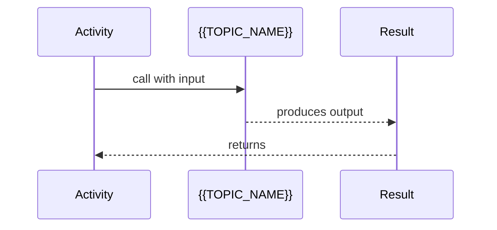

> Include 2 patterns at junior level. Keep diagrams simple.

---

## Clean Code

Basic clean code principles when working with {{TOPIC_NAME}}:

### Naming Conventions

| Bad ❌ | Good ✅ |
|--------|---------|
| `fun d(x: Int): Int` | `fun doubleValue(n: Int): Int` |
| `val t = getData()` | `val userList = getUsers()` |
| `var flag: Boolean` | `var isLoading: Boolean` |

### Design

❌ Anti-pattern: Functions doing too many things.
```kotlin
// ❌ Too long, does too many things
fun process(data: ByteArray) {
    // 80+ lines doing parse, validate, save, notify...
}
```

✅ Better: Single responsibility.
```kotlin
// ✅ Single responsibility
fun parseInput(data: ByteArray): Input { ... }
fun validateInput(input: Input): Boolean { ... }
fun saveInput(input: Input) { ... }
```

**Rules:**
- Variables: describe WHAT they hold (`userCount`, not `n`, `x`, `tmp`)
- Functions: describe WHAT they do (`calculateTotal`, not `calc`, `doStuff`)
- Booleans: use `is`, `has`, `can` prefix (`isValid`, `hasPermission`)

---

## Product Use / Feature

How this topic is used in real-world Android products:

### 1. {{Product/Tool Name}}

- **How it uses {{TOPIC_NAME}}:** Brief description
- **Why it matters:** Practical impact

### 2. {{Product/Tool Name}}

- **How it uses {{TOPIC_NAME}}:** Brief description
- **Why it matters:** Practical impact

---

## Error Handling

How to handle errors when working with {{TOPIC_NAME}}:

### Error 1: {{Common error message or type}}

```kotlin
// Code that produces this error
```

**Why it happens:** Simple explanation.
**How to fix:**

```kotlin
// Corrected code with proper error handling
```

### Error 2: {{Another common error}}

...

### Error Handling Pattern

```kotlin
// Recommended error handling pattern for this topic
try {
    val result = someFunction()
    // use result
} catch (e: SomeException) {
    // handle error appropriately
    Log.e("TAG", "Error occurred", e)
}
```

---

## Security Considerations

Security aspects to keep in mind when using {{TOPIC_NAME}}:

### 1. {{Security concern}}

```kotlin
// ❌ Insecure
...

// ✅ Secure
...
```

**Risk:** What could go wrong (data leak, injection, unauthorized access).
**Mitigation:** How to protect against it.

---

## Performance Tips

Basic performance considerations for {{TOPIC_NAME}}:

### Tip 1: {{Performance optimization}}

```kotlin
// ❌ Slow approach
...

// ✅ Faster approach
...
```

**Why it's faster:** Simple explanation.

---

## Metrics & Analytics

Key metrics to track when using {{TOPIC_NAME}}:

### What to Measure

| Metric | Why it matters | Tool |
|--------|---------------|------|
| **{{metric 1}}** | {{reason}} | Android Profiler |
| **{{metric 2}}** | {{reason}} | Logcat, Firebase |

---

## Best Practices

- **Do this:** Explanation
- **Do this:** Explanation
- **Do this:** Explanation

---

## Edge Cases & Pitfalls

### Pitfall 1: {{name}}

```kotlin
// Code that demonstrates the pitfall
```

**What happens:** Explanation of unexpected behavior.
**How to fix:** Corrected code or approach.

### Pitfall 2: {{name}}

...

---

## Common Mistakes

### Mistake 1: {{description}}

```kotlin
// ❌ Wrong way
...

// ✅ Correct way
...
```

### Mistake 2: {{description}}

...

---

## Common Misconceptions

### Misconception 1: "{{False belief}}"

**Reality:** {{What's actually true}}
**Why people think this:** {{Why this misconception is common}}

### Misconception 2: "{{Another false belief}}"

**Reality:** {{What's actually true}}

---

## Tricky Points

### Tricky Point 1: {{name}}

```kotlin
// Code that might surprise a junior
```

**Why it's tricky:** Explanation.
**Key takeaway:** One-line lesson.

---

## Test

### Multiple Choice

**1. {{Question}}?**

- A) Option A
- B) Option B
- C) Option C
- D) Option D

<details>
<summary>Answer</summary>
**C)** — Explanation why C is correct and why others are wrong.
</details>

**2. {{Question}}?**

...

### True or False

**3. {{Statement}}**

<details>
<summary>Answer</summary>
**False** — Explanation.
</details>

### What's the Output?

**4. What does this code print?**

```kotlin
// code snippet
```

<details>
<summary>Answer</summary>
Output: `...`
Explanation: ...
</details>

---

## "What If?" Scenarios

**What if {{Unexpected situation}}?**
- **You might think:** {{Intuitive but wrong answer}}
- **But actually:** {{Correct behavior and why}}

---

## Tricky Questions

**1. {{Confusing question}}?**

- A) {{Looks correct but wrong}}
- B) {{Correct answer}}
- C) {{Common misconception}}
- D) {{Partially correct}}

<details>
<summary>Answer</summary>
**B)** — Explanation of why the "obvious" answers are wrong.
</details>

---

## Cheat Sheet

| What | Syntax / Command | Example |
|------|-----------------|---------|
| {{Action 1}} | `{{syntax}}` | `{{example}}` |
| {{Action 2}} | `{{syntax}}` | `{{example}}` |

---

## Self-Assessment Checklist

### I can explain:
- [ ] What {{TOPIC_NAME}} is and why it exists
- [ ] When to use it and when NOT to use it
- [ ] {{Specific concept 1}} in my own words

### I can do:
- [ ] Write a basic example from scratch (without looking)
- [ ] Read and understand code that uses {{TOPIC_NAME}}
- [ ] Debug simple errors related to this topic

### I can answer:
- [ ] All multiple choice questions in this document
- [ ] "What's the output?" questions correctly

---

## Summary

- Key point 1
- Key point 2
- Key point 3

**Next step:** What to learn after this topic.

---

## What You Can Build

### Projects you can create:
- **{{Project 1}}:** Brief description — uses {{specific concept from this topic}}
- **{{Project 2}}:** Brief description — combines with {{other topic}}

### Learning path:

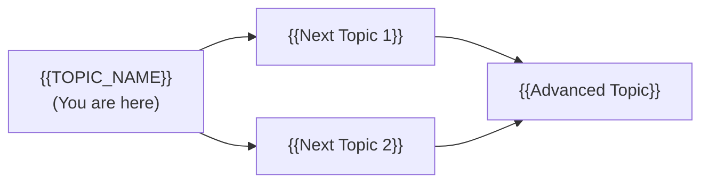

---

## Further Reading

- **Official docs:** [Android Developers](https://developer.android.com)
- **Blog post:** [{{link title}}]({{url}}) — brief description
- **Video:** [{{link title}}]({{url}}) — duration, what it covers

---

## Related Topics

- **[{{Related Topic 1}}](../XX-related-topic/)** — how it connects
- **[{{Related Topic 2}}](../XX-related-topic/)** — how it connects

---

## Diagrams & Visual Aids

> Include **at least 2-3 visual aids** per document.

### Mind Map

```mermaid
mindmap
  root(({{TOPIC_NAME}}))
    Core Concept 1
      Sub-concept A
      Sub-concept B
    Core Concept 2
      Sub-concept C
      Sub-concept D
    Related Topics
      {{Related 1}}
      {{Related 2}}
```

### Example — Flowchart

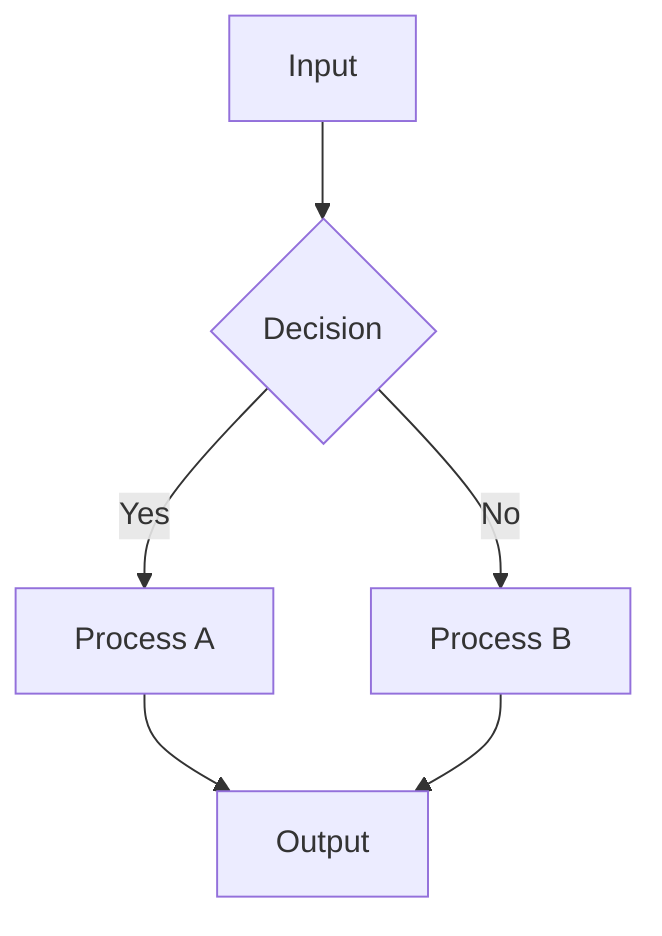

### Example — Android Memory Layout (ASCII)

```
+------------------+
|   Activity Stack |
|------------------|
| MainActivity     |  <- Top (visible)
| LoginActivity    |  <- Back stack
+------------------+
        |
        v
+------------------+
|   ViewModel      |
|------------------|
| liveData: X      |
| repository: ref  |
+------------------+
```

</details>

---
---

# TEMPLATE 2 — `middle.md`

<details open>
<summary><strong>Template Content</strong></summary>

# {{TOPIC_NAME}} — Middle Level

## Table of Contents

1. [Introduction](#introduction)
2. [Core Concepts](#core-concepts)
3. [Pros & Cons](#pros--cons)
4. [Use Cases](#use-cases)
5. [Code Examples](#code-examples)
6. [Coding Patterns](#coding-patterns)
7. [Clean Code](#clean-code)
8. [Product Use / Feature](#product-use--feature)
9. [Error Handling](#error-handling)
10. [Security Considerations](#security-considerations)
11. [Performance Optimization](#performance-optimization)
12. [Metrics & Analytics](#metrics--analytics)
13. [Debugging Guide](#debugging-guide)
14. [Best Practices](#best-practices)
15. [Edge Cases & Pitfalls](#edge-cases--pitfalls)
16. [Common Mistakes](#common-mistakes)
17. [Tricky Points](#tricky-points)
18. [Comparison with iOS / Other Platforms](#comparison-with-ios--other-platforms)
19. [Test](#test)
20. [Tricky Questions](#tricky-questions)
21. [Cheat Sheet](#cheat-sheet)
22. [Summary](#summary)
23. [What You Can Build](#what-you-can-build)
24. [Further Reading](#further-reading)
25. [Related Topics](#related-topics)
26. [Diagrams & Visual Aids](#diagrams--visual-aids)

---

## Introduction

> Focus: "Why?" and "When to use?"

Assumes the reader already knows the basics. This level covers:
- Deeper understanding of how {{TOPIC_NAME}} works
- Real-world application patterns (MVVM, Repository, Coroutines)
- Production considerations

---

## Core Concepts

### Concept 1: {{Advanced concept}}

Detailed explanation with diagrams (mermaid) where helpful.

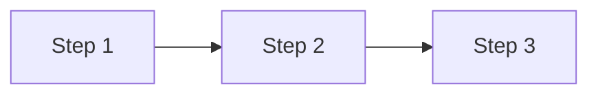

### Concept 2: {{Another concept}}

- How it relates to other Android features
- Internal behavior differences
- Performance implications

---

## Evolution & Historical Context

**Before {{TOPIC_NAME}}:**
- How developers solved this problem previously
- The pain points and limitations of the old approach

**How {{TOPIC_NAME}} changed things:**
- The architectural shift it introduced
- Why it became the standard

---

## Pros & Cons

| Pros | Cons |
|------|------|
| {{Advantage 1 with production context}} | {{Disadvantage 1 with impact analysis}} |
| {{Advantage 2}} | {{Disadvantage 2}} |

### Trade-off analysis:
- **{{Trade-off 1}}:** When {{advantage}} outweighs {{disadvantage}}

### Comparison with alternatives:

| Approach | Pros | Cons | Best for |
|----------|------|------|----------|
| {{Approach A}} | {{pros}} | {{cons}} | {{scenario}} |
| {{Approach B}} | {{pros}} | {{cons}} | {{scenario}} |

---

## Use Cases

- **Use Case 1:** {{Production scenario}}
- **Use Case 2:** {{Scaling scenario}}
- **Use Case 3:** {{Integration scenario}}

---

## Code Examples

### Example 1: {{Production-ready pattern}}

```kotlin
// Production-quality Kotlin code with error handling
class UserRepository(
    private val api: UserApi,
    private val db: UserDao
) {
    suspend fun getUser(id: String): Result<User> {
        return try {
            val user = api.fetchUser(id)
            db.insertUser(user)
            Result.success(user)
        } catch (e: Exception) {
            Result.failure(e)
        }
    }
}
```

**Why this pattern:** Explanation of design decisions.
**Trade-offs:** What you gain and what you sacrifice.

### Example 2: {{Comparison of approaches}}

```kotlin
// Approach A — Callbacks (legacy)
api.fetchUser(id, callback = { user -> ... })

// Approach B — Coroutines (preferred)
val user = api.fetchUser(id) // suspend fun
```

**When to use which:** Decision criteria.

---

## Coding Patterns

Design patterns and idiomatic patterns for {{TOPIC_NAME}} in production Android code:

### Pattern 1: {{Pattern name — e.g., Repository, ViewModel, Observer}}

**Category:** Architectural / Behavioral / Creational
**Intent:** {{What problem this pattern solves at the design level}}
**When to use:** {{Specific scenario}}
**When NOT to use:** {{Counter-indication}}

**Structure diagram:**

```mermaid
classDiagram
    class {{Interface}} {
        <<interface>>
        +{{method()}} {{ReturnType}}
    }
    class {{ConcreteA}} {
        +{{method()}} {{ReturnType}}
    }
    class {{Client}} {
        -{{Interface}} dep
        +use()
    }
    {{Interface}} <|.. {{ConcreteA}}
    {{Client}} --> {{Interface}}
```

**Implementation:**

```kotlin
// Pattern implementation with real {{TOPIC_NAME}} usage
```

**Trade-offs:**

| ✅ Pros | ❌ Cons |
|---------|---------|
| {{benefit 1}} | {{drawback 1}} |

---

### Pattern 2: {{Another pattern}}

**Intent:** {{What it solves}}

**Flow diagram:**

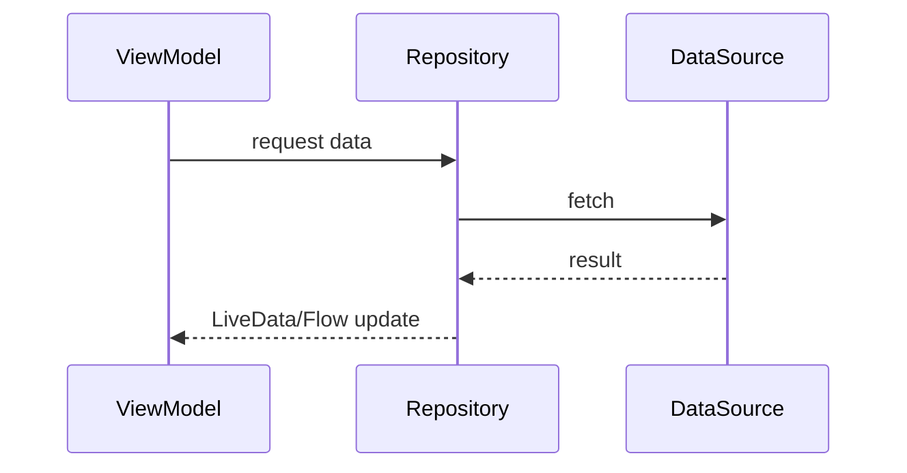

```kotlin
// Implementation
```

---

### Pattern 3: {{Idiomatic Kotlin / Android pattern}}

**Intent:** {{Language-specific idiom or best practice}}

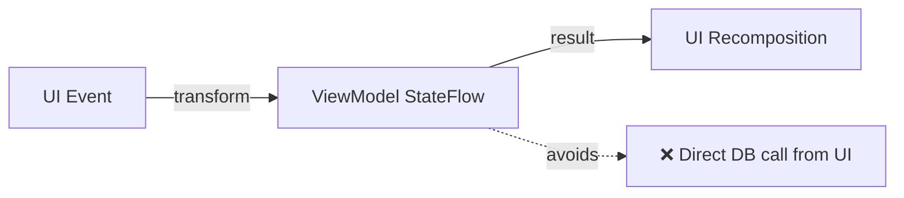

```kotlin
// ❌ Non-idiomatic
activity.database.query(...)

// ✅ Idiomatic MVVM pattern
viewModel.uiState.collect { state -> render(state) }
```

---

## Clean Code

Production-level clean code principles for {{TOPIC_NAME}}:

### Naming & Readability

| Element | Rule | Example |
|---------|------|---------|
| Functions | Verb + noun | `fetchUserByID`, `validateEmail` |
| Variables | Noun, describes content | `activeConnections`, `retryCount` |
| Booleans | `is/has/can` prefix | `isExpired`, `hasPermission` |

```kotlin
// ❌ Cryptic
fun proc(d: ByteArray, f: Boolean): ByteArray

// ✅ Self-documenting
fun compressData(input: ByteArray, includeHeader: Boolean): ByteArray
```

---

### SOLID in Practice

```kotlin
// ❌ One class doing everything
class UserManager { /* handles auth + DB + email + logging */ }

// ✅ Each type has one reason to change
interface UserRepository { fun findById(id: String): User? }
interface UserNotifier { fun sendWelcomeEmail(user: User) }
class UserAuthService(private val repo: UserRepository)
```

---

### DRY vs WET

```kotlin
// ❌ WET
fun validateEmail(s: String) = s.isNotEmpty() && s.contains("@")
fun validateUsername(s: String) = s.isNotEmpty() && s.contains("@")

// ✅ DRY
fun containsAt(s: String) = s.isNotEmpty() && s.contains("@")
```

---

## Product Use / Feature

### 1. {{Product/Tool Name}}

- **How it uses {{TOPIC_NAME}}:** Description with architectural context
- **Scale:** Numbers, traffic, data volume
- **Key insight:** What can be learned from their approach

---

## Error Handling

### Pattern 1: {{Error handling pattern}}

```kotlin
// Production error handling with context and recovery
suspend fun doSomething(): Result<Data> {
    return try {
        val result = riskyOperation()
        Result.success(result)
    } catch (e: IOException) {
        Result.failure(IOException("doSomething failed: ${e.message}", e))
    }
}
```

### Common Error Patterns

| Situation | Pattern | Example |
|-----------|---------|---------|
| Wrapping errors | `Result.failure(wrappedException)` | Add context |
| Coroutine cancellation | `CancellationException` | Never catch blindly |
| Network errors | `HttpException`, `IOException` | Handle separately |

---

## Security Considerations

### 1. {{Security concern}}

**Risk level:** High / Medium / Low

```kotlin
// ❌ Vulnerable code
...

// ✅ Secure code
...
```

### Security Checklist

- [ ] {{Check 1}} — why it matters
- [ ] {{Check 2}} — why it matters

---

## Performance Optimization

### Optimization 1: {{name}}

```kotlin
// ❌ Slow — excessive recomposition / main thread work
...

// ✅ Fast — background thread, cached result
...
```

**Benchmark results:**
```
Android Profiler: slow → 150ms frame time
Android Profiler: fast → 16ms frame time (60fps)
```

### Performance Decision Matrix

| Scenario | Approach | Why |
|----------|----------|-----|
| {{Low complexity UI}} | {{Simple approach}} | Readability > performance |
| {{Heavy computation}} | {{Coroutines + Dispatchers.IO}} | Offload from main thread |

---

## Metrics & Analytics

### Key Metrics

| Metric | Type | Description | Alert threshold |
|--------|------|-------------|-----------------|
| **{{metric 1}}** | Counter | {{what it counts}} | — |
| **{{metric 2}}** | Gauge | {{what it measures}} | > {{threshold}} |

### Android Profiler Instrumentation

```kotlin
// Use Android Profiler or custom trace
Debug.startMethodTracing("trace_name")
// ... code to profile ...
Debug.stopMethodTracing()
```

---

## Debugging Guide

### Problem 1: {{Common symptom}}

**Symptoms:** What you see (ANR, crash, memory leak, jank).

**Diagnostic steps:**
```bash
# ADB commands
adb shell dumpsys activity
adb logcat -s "TAG"
```

**Root cause:** Why this happens.
**Fix:** How to resolve it.

### Useful Tools

| Tool | Command | What it shows |
|------|---------|---------------|
| Android Profiler | In Android Studio | CPU, memory, network |
| LeakCanary | Dependency | Memory leaks |
| `systrace` | `python systrace.py` | Frame timing |

---

## Best Practices

- **Practice 1:** Explanation + code snippet
- **Practice 2:** Explanation + why it matters in production
- **Practice 3:** Explanation + common violation example

---

## Edge Cases & Pitfalls

### Pitfall 1: {{Production pitfall}}

```kotlin
// Code that causes issues in production
```

**Impact:** What goes wrong.
**Fix:** Corrected approach.

---

## Common Mistakes

### Mistake 1: {{Middle-level mistake}}

```kotlin
// ❌ Looks correct but has subtle issues
...

// ✅ Properly handles edge cases
...
```

---

## Common Misconceptions

### Misconception 1: "{{False belief}}"

**Reality:** {{What's actually true}}

**Evidence:**
```kotlin
// Code or benchmark that proves the misconception wrong
```

---

## Anti-Patterns

### Anti-Pattern 1: {{Name of anti-pattern}}

```kotlin
// ❌ The Anti-Pattern
...
```

**Why it's bad:** How it causes pain later.
**The refactoring:** What to use instead.

---

## Tricky Points

### Tricky Point 1: {{Subtle behavior}}

```kotlin
// Code with non-obvious behavior
```

**What actually happens:** Step-by-step explanation.

---

## Comparison with iOS / Other Platforms

| Aspect | Android (Kotlin) | iOS (Swift) | Flutter (Dart) |
|--------|:----------------:|:-----------:|:--------------:|
| {{Aspect 1}} | {{approach}} | {{approach}} | {{approach}} |
| {{Aspect 2}} | ... | ... | ... |

---

## Test

### Multiple Choice (harder)

**1. {{Question involving trade-offs or subtle behavior}}?**

- A) ...
- B) ...
- C) ...
- D) ...

<details>
<summary>Answer</summary>
**B)** — Detailed explanation with Android documentation reference if applicable.
</details>

### Code Analysis

**2. What happens when this code runs on a device with low memory?**

```kotlin
// code
```

<details>
<summary>Answer</summary>
Explanation of lifecycle / memory behavior.
</details>

---

## Tricky Questions

**1. {{Question that tests deep understanding}}?**

- A) {{Extremely convincing wrong answer}}
- D) {{Correct but counter-intuitive}}

<details>
<summary>Answer</summary>
**D)** — Deep explanation.
</details>

---

## Cheat Sheet

| Scenario | Pattern | Key consideration |
|----------|---------|-------------------|
| {{Scenario 1}} | `{{code pattern}}` | {{what to watch for}} |
| {{Scenario 2}} | `{{code pattern}}` | {{what to watch for}} |

---

## Summary

- Key insight 1
- Key insight 2
- Key insight 3

**Key difference from Junior:** What deeper understanding was gained.
**Next step:** What to explore at Senior level.

---

## What You Can Build

### Production systems:
- **{{System 1}}:** Description
- **{{System 2}}:** Description

### Learning path:

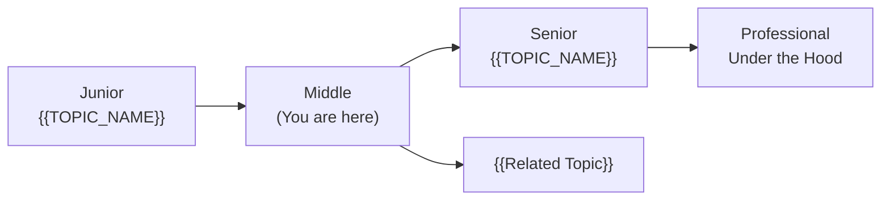

---

## Further Reading

- **Official docs:** [Android Developers](https://developer.android.com)
- **Blog post:** [{{link title}}]({{url}}) — what you'll learn
- **Conference talk:** [{{link title}}]({{url}}) — speaker, key takeaways

---

## Related Topics

- **[{{Related Topic 1}}](../XX-related-topic/)** — how it connects

---

## Diagrams & Visual Aids

### Example — Flowchart


### Example — MVVM Architecture (ASCII)

```
+------------------+     +------------------+     +------------------+
|    UI Layer      | --> |  ViewModel       | --> |  Repository      |
|  (Activity /     |     |  (StateFlow /    |     |  (Room / Retrofit|
|   Fragment /     |     |   LiveData)      |     |   / DataStore)   |
|   Compose)       |     +------------------+     +------------------+
+------------------+
```

</details>

---
---

# TEMPLATE 3 — `senior.md`

<details open>
<summary><strong>Template Content</strong></summary>

# {{TOPIC_NAME}} — Senior Level

## Table of Contents

1. [Introduction](#introduction)
2. [Core Concepts](#core-concepts)
3. [Pros & Cons](#pros--cons)
4. [Use Cases](#use-cases)
5. [Code Examples](#code-examples)
6. [Coding Patterns](#coding-patterns)
7. [Clean Code](#clean-code)
8. [Best Practices](#best-practices)
9. [Product Use / Feature](#product-use--feature)
10. [Error Handling](#error-handling)
11. [Security Considerations](#security-considerations)
12. [Performance Optimization](#performance-optimization)
13. [Metrics & Analytics](#metrics--analytics)
14. [Debugging Guide](#debugging-guide)
15. [Edge Cases & Pitfalls](#edge-cases--pitfalls)
16. [Postmortems & System Failures](#postmortems--system-failures)
17. [Common Mistakes](#common-mistakes)
18. [Tricky Points](#tricky-points)
19. [Comparison with Other Platforms](#comparison-with-other-platforms)
20. [Test](#test)
21. [Tricky Questions](#tricky-questions)
22. [Cheat Sheet](#cheat-sheet)
23. [Summary](#summary)
24. [What You Can Build](#what-you-can-build)
25. [Further Reading](#further-reading)
26. [Related Topics](#related-topics)
27. [Diagrams & Visual Aids](#diagrams--visual-aids)

---

## Introduction

> Focus: "How to optimize?" and "How to architect?"

For developers who:
- Design Android system architectures (Clean Architecture, MVI, etc.)
- Optimize performance-critical code paths
- Mentor junior/middle Android developers
- Review and improve large codebases

---

## Core Concepts

### Concept 1: {{Architecture-level concept}}

Deep dive with:
- Design patterns and when to apply them
- Performance characteristics
- Comparison with alternative approaches on other platforms

```kotlin
// Advanced pattern with detailed annotations
```

### Concept 2: {{Optimization concept}}

Benchmark comparisons:

```kotlin
@Test
fun benchmarkApproachA() { ... }

@Test
fun benchmarkApproachB() { ... }
```

Results:
```
Approach A: 1024 ms, 256 MB heap
Approach B: 205 ms, 32 MB heap
```

---

## Pros & Cons

### Strategic analysis for architectural decisions:

| Pros | Cons | Impact |
|------|------|--------|
| {{Advantage 1}} | {{Disadvantage 1}} | {{Impact on system architecture}} |
| {{Advantage 2}} | {{Disadvantage 2}} | {{Impact on team/maintenance}} |

### When Android's approach is the RIGHT choice:
- {{Scenario 1}}

### When Android's approach is the WRONG choice:
- {{Scenario 1}} — what to use instead

---

## Use Cases

- **Use Case 1:** {{System design scenario}} — e.g., "Designing offline-first architecture for 1M users"
- **Use Case 2:** {{Migration scenario}}
- **Use Case 3:** {{Optimization scenario}}

---

## Code Examples

### Example 1: {{Architecture pattern}}

```kotlin
// Full implementation of a production pattern
// With DI (Hilt), error handling, graceful shutdown
```

**Architecture decisions:** Why this structure.
**Alternatives considered:** What else could work.

### Example 2: {{Performance optimization}}

```kotlin
// Before optimization
...

// After optimization (with profiler evidence)
...
```

---

## Coding Patterns

Architectural and advanced patterns for {{TOPIC_NAME}} in production Android systems:

### Pattern 1: {{Architectural pattern — e.g., MVI, Clean Architecture, CQRS}}

**Category:** Architectural / Distributed / Resilience
**Intent:** {{The system-level problem this pattern solves}}
**Problem it solves:** {{Concrete scenario}}
**Trade-offs:** {{What you gain vs what complexity you add}}

**Architecture diagram:**

```mermaid
graph TD
    subgraph "{{Pattern Name}}"
        A[{{Component 1}}] -->|{{action}}| B[{{Component 2}}]
        B -->|{{action}}| C[{{Component 3}}]
        C -.->|async| D[{{Component 4}}]
    end
    E[User] -->|intent| A
    D -->|state| F[UI]
```

**Implementation:**

```kotlin
// Senior-level implementation
// Full pattern with error handling, observability, graceful degradation
```

**When this pattern wins:**
- {{Scenario 1 where it excels}}

**When to avoid:**
- {{Scenario where it adds unnecessary complexity}}

---

### Pattern 2: {{Concurrency / Performance pattern — e.g., Worker Pool, Flow operators}}

**Category:** Concurrency / Performance / Resource Management
**Intent:** {{What it optimizes}}

**Flow diagram:**

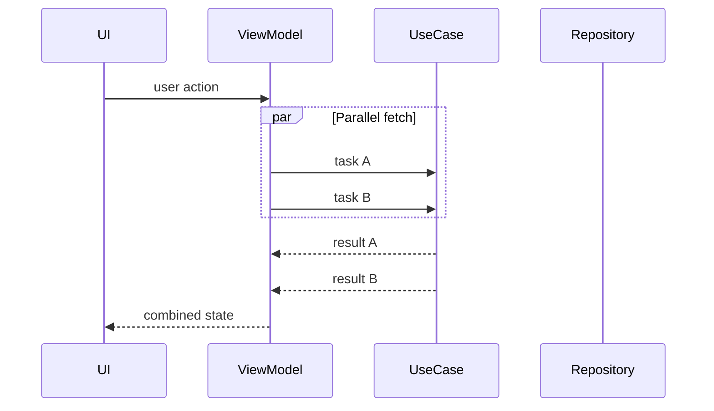

```kotlin
// Implementation with proper resource management
```

---

### Pattern 3: {{Resilience / Fault tolerance pattern — e.g., Circuit Breaker, Retry}}

**Category:** Resilience / Reliability
**Intent:** {{How it improves system reliability}}

**State diagram:**

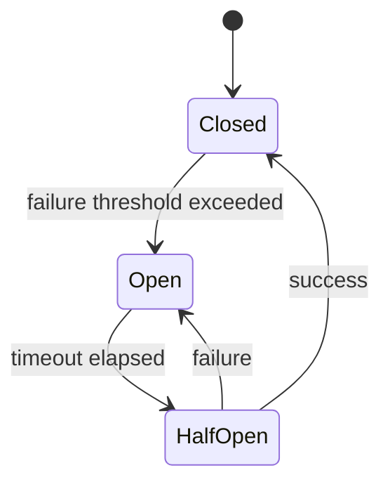

```kotlin
// Production implementation with metrics and observability
```

---

### Pattern 4: {{Data / Caching pattern}}

**Intent:** {{How it manages data flow}}

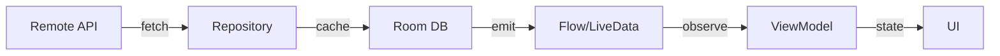

```kotlin
// Single source of truth pattern
```

---

### Pattern Comparison Matrix

| Pattern | Use When | Avoid When | Complexity |
|---------|----------|------------|------------|
| {{Pattern 1}} | {{condition}} | {{condition}} | Low/Med/High |
| {{Pattern 2}} | {{condition}} | {{condition}} | Low/Med/High |
| {{Pattern 3}} | {{condition}} | {{condition}} | Low/Med/High |
| {{Pattern 4}} | {{condition}} | {{condition}} | Low/Med/High |

---

## Clean Code

Senior-level clean code: architecture, maintainability, and team standards:

### Clean Architecture Boundaries

```kotlin
// ❌ Layering violation — business logic calls infrastructure
class OrderViewModel(val db: AppDatabase) // direct DB dependency

// ✅ Dependency inversion — depend on abstractions
interface OrderRepository { suspend fun save(order: Order) }
class OrderViewModel(val repo: OrderRepository)
```

**Dependency flow:**
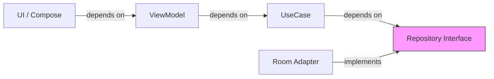

---

### Code Smells at Senior Level

| Smell | Symptom | Refactoring |
|-------|---------|-------------|
| **God ViewModel** | 500+ lines, handles everything | Split by feature/use case |
| **Primitive Obsession** | `String` for userId, `Int` for money | Wrap in value classes |
| **God Fragment** | Handles both UI and business logic | Move logic to ViewModel/UseCase |
| **Feature Envy** | Method uses another class's data more | Move method to that class |

---

### Code Review Checklist (Senior)

- [ ] No business logic in Activities/Fragments/Composables
- [ ] All public interfaces are documented
- [ ] No global mutable state (avoid companion object vars)
- [ ] Error messages include enough context to debug without a debugger
- [ ] No magic numbers/strings — all constants named
- [ ] Test coverage on all non-trivial paths

---

## Best Practices

### Must Do ✅

1. **{{Best practice 1}}** — why it matters in production
   ```kotlin
   // Example demonstrating the practice
   ```

2. **{{Best practice 2}}** — impact on maintainability/performance
   ```kotlin
   // Example
   ```

3. **{{Best practice 3}}**
   ```kotlin
   // Example
   ```

### Never Do ❌

1. **{{Anti-practice 1}}** — what goes wrong when ignored
   ```kotlin
   // ❌ What NOT to do
   // ✅ What to do instead
   ```

2. **{{Anti-practice 2}}**

3. **{{Anti-practice 3}}**

### Production Checklist

- [ ] {{TOPIC_NAME}} has proper error handling and logging
- [ ] All edge cases tested (null inputs, empty state, concurrent access)
- [ ] Performance profiled with Android Profiler under realistic load
- [ ] Security: no sensitive data in logs, inputs validated, keys in EncryptedSharedPreferences
- [ ] Graceful degradation when network fails
- [ ] ProGuard/R8 rules updated if needed

---

## Product Use / Feature

### 1. {{Company/Product Name}}

- **Architecture:** How they implement {{TOPIC_NAME}} at scale
- **Scale:** Specific numbers (DAU, events/sec, etc.)
- **Lessons learned:** What they changed and why

---

## Error Handling

### Strategy 1: {{Error handling architecture}}

```kotlin
// Domain-specific error hierarchy
sealed class AppError : Exception() {
    data class NetworkError(val code: Int, override val message: String) : AppError()
    data class DatabaseError(override val message: String) : AppError()
    object UnauthorizedError : AppError()
}
```

### Error Handling Architecture

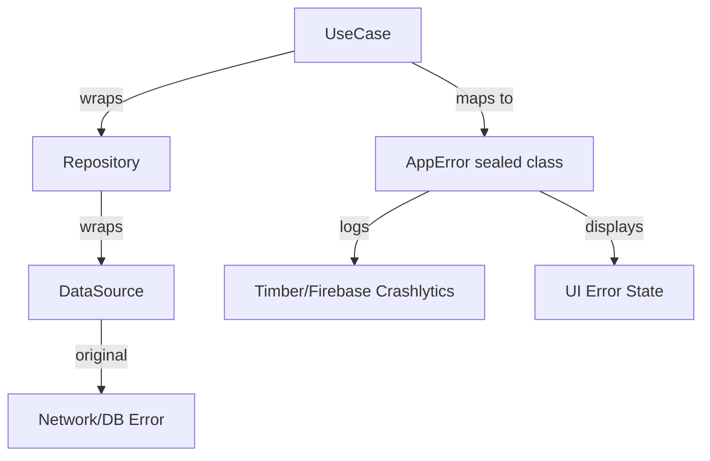

---

## Security Considerations

### 1. {{Critical security concern}}

**Risk level:** Critical
**OWASP category:** {{relevant OWASP Mobile category}}

```kotlin
// ❌ Vulnerable
...

// ✅ Secure
...
```

### Security Architecture Checklist

- [ ] **Input validation** — validate at system boundaries
- [ ] **Certificate pinning** — prevent MITM attacks
- [ ] **Root detection** — detect compromised devices
- [ ] **ProGuard/R8** — obfuscate sensitive code
- [ ] **Secrets management** — no hardcoded API keys

### Threat Model

| Threat | Likelihood | Impact | Mitigation |
|--------|:---------:|:------:|------------|
| {{Threat 1}} | High | Critical | {{mitigation}} |
| {{Threat 2}} | Medium | High | {{mitigation}} |

---

## Performance Optimization

### Optimization 1: {{name}}

```kotlin
// Before — profiling shows this is a bottleneck
fun slowFunction() { ... }

// After — 5x improvement
fun fastFunction() { ... }
```

**Profiling evidence:**
```bash
# Android Profiler → CPU → Record → Flame Chart
# systrace: python systrace.py --time=5 -o trace.html gfx view
```

**Benchmark proof:**
```
Before: 150ms frame time, 85% jank
After:  12ms frame time, 0% jank
```

### Performance Architecture

| Layer | Optimization | Impact | Cost |
|:-----:|:------------|:------:|:----:|
| **Algorithm** | {{approach}} | Highest | Requires redesign |
| **Memory** | {{approach}} | High | Moderate refactor |
| **Rendering** | Reduce overdraw | Medium | Low effort |
| **Network** | Batch requests | Varies | May need backend changes |

---

## Metrics & Analytics

### SLO / SLA Definition

| SLI | SLO Target | Measurement window |
|-----|-----------|-------------------|
| **App startup time** | < 2s cold start | Per release |
| **Frame rate** | > 99% frames at 60fps | 5 min rolling |
| **Crash-free rate** | > 99.9% | 30 days |

### Metrics Architecture

```
[Android App]
    │
    ├── Firebase Performance Monitoring
    │       ├── app_start_time
    │       ├── screen_render_time
    │       └── network_request_duration
    │
    └── Firebase Crashlytics
            └── crash_rate, ANR_rate
```

---

## Debugging Guide

### Problem 1: {{Production issue}}

**Symptoms:** What monitoring shows (ANR, OOM, jank).

**Diagnostic steps:**
```bash
adb shell dumpsys meminfo com.example.app
adb shell am bug-report
```

### Advanced Tools & Techniques

| Tool | Use case | When to use |
|------|----------|-------------|
| Android Profiler | CPU/memory profiling | Performance issues |
| `systrace` | Frame timing | UI jank |
| LeakCanary | Memory leak detection | OOM crashes |
| `simpleperf` | Native/JVM CPU profiling | Deep performance issues |

---

## Edge Cases & Pitfalls

### Pitfall 1: {{Scale pitfall}}

```kotlin
// Code that works fine until 10K items / background work / etc.
```

**At what scale it breaks:** Specific numbers.
**Root cause:** Why it fails.
**Solution:** Architecture-level fix.

---

## Postmortems & System Failures

### The {{App/Company}} Outage

- **The goal:** {{What they were trying to achieve}}
- **The mistake:** {{How they misused this topic/feature}}
- **The impact:** {{Crashes, ANRs, user data loss}}
- **The fix:** {{How they solved it permanently}}

**Key takeaway:** {{Architectural lesson learned}}

---

## Common Mistakes

### Mistake 1: {{Architectural anti-pattern}}

```kotlin
// ❌ Common but wrong architecture
...

// ✅ Better approach
...
```

---

## Tricky Points

### Tricky Point 1: {{Android spec subtlety}}

```kotlin
// Code that exploits a subtle Android behavior
```

**Reference:** Android documentation or source link.
**Why this matters:** Real-world impact.

---

## Comparison with Other Platforms

| Aspect | Android | iOS | React Native |
|--------|:-------:|:---:|:------------:|
| {{Aspect 1}} | {{approach}} | {{approach}} | {{approach}} |
| {{Aspect 2}} | ... | ... | ... |

---

## Test

### Architecture Questions

**1. You're designing {{system}}. Which approach is best and why?**

<details>
<summary>Answer</summary>
**C)** — Full architectural reasoning.
</details>

### Performance Analysis

**2. This function is causing 150ms frame drops. How would you optimize it?**

```kotlin
// code with performance issues
```

<details>
<summary>Answer</summary>
Step-by-step optimization.
</details>

---

## Tricky Questions

**1. {{Question that even experienced developers get wrong}}?**

<details>
<summary>Answer</summary>
Detailed explanation with Android documentation reference and profiler evidence.
</details>

---

## Cheat Sheet

### Architecture Decision Matrix

| Scenario | Recommended pattern | Avoid | Why |
|----------|-------------------|-------|-----|
| {{scenario 1}} | {{pattern}} | {{anti-pattern}} | {{reasoning}} |

### Performance Quick Wins

| Optimization | When to apply | Expected improvement |
|-------------|---------------|---------------------|
| `systrace` GPU overdraw | When frame drops | 2-3x render |
| `simpleperf` hot path | When CPU spikes | Identify bottleneck |

### Heuristics & Rules of Thumb

- **The 16ms Rule:** Any frame taking > 16ms causes jank — profile first, optimize second.
- **The ViewModel Rule:** If your ViewModel has > 300 lines, split it by use case.

---

## Summary

- Key architectural insight 1
- Key performance insight 2
- Key leadership insight 3

**Senior mindset:** Not just "how" but "when", "why", and "what are the trade-offs".

---

## What You Can Build

### Architect and lead:
- **{{System/Platform 1}}:** Large-scale Android app — applies {{architectural pattern}}

### Career impact:
- **Staff/Principal Android Engineer** — system design interviews require this depth
- **Tech Lead** — mentor others on {{TOPIC_NAME}} architectural decisions

---

## Further Reading

- **Android proposal:** [{{proposal title}}]({{url}})
- **Conference talk:** [Android Dev Summit — {{talk title}}]({{url}})
- **Source code:** [AOSP source](https://cs.android.com)

---

## Related Topics

- **[{{Related Topic 1}}](../XX-related-topic/)** — architectural connection
- **[{{Related Topic 2}}](../XX-related-topic/)** — performance connection

---

## Diagrams & Visual Aids

### Example — Clean Architecture Layers

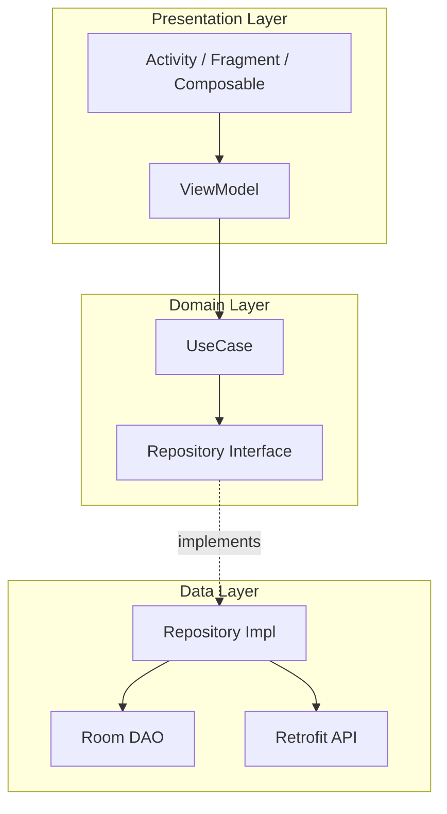

</details>

---
---

# TEMPLATE 4 — `professional.md`

<details open>
<summary><strong>Template Content</strong></summary>

# Android Runtime (ART) Internals

<!-- Table of Contents is OPTIONAL -->

## Table of Contents

1. [Introduction](#introduction)
2. [How It Works Internally](#how-it-works-internally)
3. [Runtime Deep Dive](#runtime-deep-dive)
4. [Compiler Perspective](#compiler-perspective)
5. [Memory Layout](#memory-layout)
6. [OS / Syscall Level](#os--syscall-level)
7. [Source Code Walkthrough](#source-code-walkthrough)
8. [Assembly / Bytecode Output Analysis](#assembly--bytecode-output-analysis)
9. [Performance Internals](#performance-internals)
10. [Edge Cases at the Lowest Level](#edge-cases-at-the-lowest-level)
11. [Test](#test)
12. [Tricky Questions](#tricky-questions)
13. [Summary](#summary)
14. [Further Reading](#further-reading)
15. [Diagrams & Visual Aids](#diagrams--visual-aids)

---

## Introduction

> Focus: "What happens under the hood?"

This document explores what Android does internally when you use {{TOPIC_NAME}}.
Topics covered:
- **Dalvik bytecode** — `.dex` format, opcode set, register-based VM
- **ART AOT/JIT** — `dex2oat` compilation, profile-guided optimization
- **Binder IPC** — kernel driver, transaction model, thread pool
- **Android boot process** — `init` → `Zygote` → `SystemServer` → App
- **Memory management** — Zygote fork, ART GC, low-memory killer (LMK)
- **GPU rendering** — RenderThread, HWUI, GPU overdraw

---

## How It Works Internally

Step-by-step breakdown of what happens when Android executes {{feature}}:

1. **Kotlin/Java source** → What you write
2. **`.class` bytecode** → JVM bytecode
3. **`.dex` bytecode** → Dalvik Executable (DEX format)
4. **ART compilation** → AOT via `dex2oat` or JIT at runtime
5. **Native execution** → Optimized machine code
6. **Runtime management** → ART GC, JIT cache, class loading

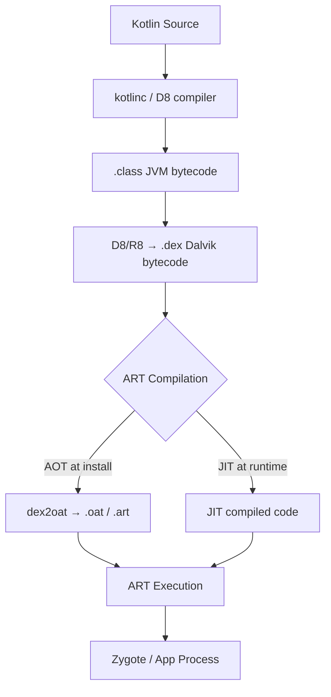

---

## Runtime Deep Dive

### Dalvik Bytecode — DEX Format

```
# View DEX bytecode with dexdump
dexdump -d classes.dex

# Or use baksmali
java -jar baksmali.jar d classes.dex -o out/
```

**DEX register-based VM** (unlike JVM which is stack-based):
```
# Dalvik opcodes example
invoke-virtual {v0, v1}, Ljava/lang/String;->concat(Ljava/lang/String;)Ljava/lang/String;
move-result-object v0
```

**Key DEX structures:**
```
DEX File Format:
+------------------+
| header_item      |  <- magic, checksum, file size
| string_ids[]     |  <- string pool
| type_ids[]       |  <- type descriptors
| proto_ids[]      |  <- method prototypes
| field_ids[]      |  <- field references
| method_ids[]     |  <- method references
| class_defs[]     |  <- class definitions
| data section     |  <- bytecode, annotations
+------------------+
```

### ART AOT/JIT — dex2oat

```bash
# AOT compilation at install time
dex2oat --dex-file=classes.dex --oat-file=classes.odex

# Profile-guided optimization (PGO)
# .prof files in /data/misc/profiles/cur/0/com.example.app/
```

**ART compilation tiers:**
1. **Interpreter** — first run, no compilation
2. **JIT** — hot methods compiled at runtime
3. **AOT** — profile-guided after first run
4. **Cloud profiles** — Google Play pre-compiles based on aggregate profiles

### Binder IPC

Binder is Android's primary IPC mechanism — a kernel driver at `/dev/binder`.

```
App Process         Binder Driver        System Service
    |                    |                     |
    |--- ioctl(BINDER_WRITE_READ) ----------->|
    |    [transaction data + fd]              |
    |                    |--- copy_from_user ->|
    |                    |--- copy_to_user  <--|
    |<-- ioctl returns  -|                     |
```

**Key Binder concepts:**
- Zero-copy via shared memory for large parcels
- Thread pool: 16 threads max per process
- Death notification for remote process monitoring

### Android Boot Process

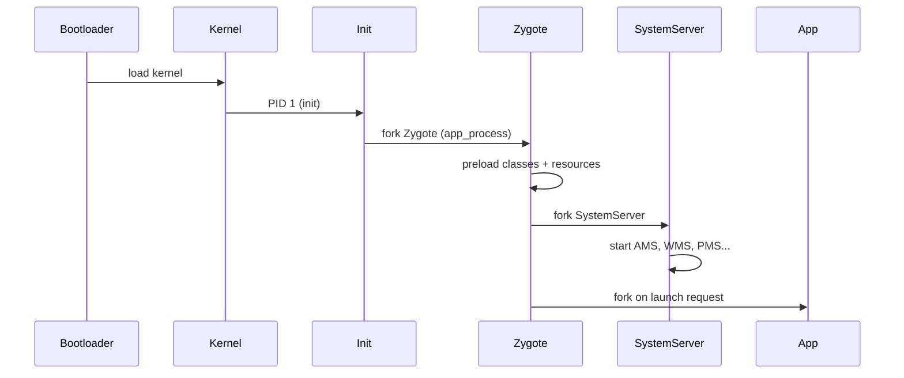

### Memory Management — Zygote Fork

```
Zygote Process:
+-------------------------------+
| Preloaded classes (80MB+)     |  <- shared across all apps via CoW
| Preloaded drawables           |
| System resources              |
+-------------------------------+

App Process (forked from Zygote):
+-------------------------------+
| Copy-on-Write pages          |  <- shared until modified
| App-specific heap            |  <- unique per app
| ART JIT code cache           |  <- unique per app
+-------------------------------+
```

**Low-Memory Killer (LMK):**
- Processes ranked by `oom_adj` score (0 = foreground, higher = killable)
- LMK kills highest `oom_adj` when memory threshold crossed
- `ActivityManager` updates `oom_adj` on lifecycle changes

---

## Compiler Perspective

What the Android toolchain does with this feature:

```bash
# View R8/D8 output
./gradlew assembleRelease
# classes.dex in app/build/outputs/apk/release/

# View optimized DEX
dexdump -d app-release.apk

# Check R8 optimization logs
-printusage build/outputs/mapping/release/usage.txt
```

**R8 optimizations applied:**
- Inlining of small methods
- Dead code elimination
- Class merging
- String constant folding

---

## Memory Layout

How ART manages object memory:

```
ART Heap Regions:
+------------------+
| Image Space      |  <- preloaded Zygote objects (read-only, shared)
+------------------+
| Zygote Space     |  <- objects allocated before first fork (read-only after fork)
+------------------+
| Allocation Space |  <- app heap (young generation)
+------------------+
| Large Object Sp. |  <- objects > 12KB allocated here
+------------------+
| Non-Moving Sp.   |  <- pinned objects (JNI, Class objects)
+------------------+
```

**ART GC — Concurrent Copying GC (since Android 8.0):**
```
Phases:
1. Initial pause (STW) — root scan
2. Concurrent mark — mark live objects (no STW)
3. Remark pause (STW) — catch missed objects
4. Concurrent sweep — reclaim dead objects
```

---

## OS / Syscall Level

What system calls are involved:

```bash
# Trace syscalls for an Android process
adb shell strace -f -p $(adb shell pidof com.example.app)

# Or use simpleperf
adb shell simpleperf record -p $(adb shell pidof com.example.app) --duration 10
```

**Key syscalls:**
- `mmap` — memory mapping for DEX/OAT files and shared regions
- `ioctl` — Binder IPC transactions
- `epoll_wait` — Looper/Handler message queue polling
- `futex` — mutex, synchronized blocks
- `clone` — process/thread creation (Zygote fork uses `clone`)

---

## Source Code Walkthrough

**ART source:** `art/runtime/`
```cpp
// art/runtime/runtime.cc — ART initialization
bool Runtime::Init(RuntimeArgumentMap&& runtime_options) {
    // heap_ setup, class linker, JIT compiler initialization
}

// art/runtime/gc/heap.cc — GC trigger
void Heap::CollectGarbage(bool clear_soft_references, GcCause cause) {
    // Select GC type, run collector
}
```

**Binder source:** `frameworks/native/libs/binder/`
```cpp
// IPCThreadState.cpp — transaction handling
status_t IPCThreadState::transact(int32_t handle, uint32_t code,
        const Parcel& data, Parcel* reply, uint32_t flags) {
    // writeTransactionData → talkWithDriver → ioctl(BINDER_WRITE_READ)
}
```

> Reference AOSP tag `android-14.0.0_r1` since internals change per release.

---

## Assembly / Bytecode Output Analysis

```bash
# View Dalvik bytecode (smali)
java -jar baksmali.jar d classes.dex -o smali_out/

# View ART compiled output (OAT)
oatdump --oat-file=/data/dalvik-cache/arm64/system@framework@boot.oat

# Android-specific profiling
adb shell simpleperf record --call-graph fp -p <pid> -- sleep 10
adb shell simpleperf report
```

**Sample smali bytecode:**
```smali
.method public onCreate(Landroid/os/Bundle;)V
    .registers 2
    invoke-super {p0, p1}, Landroid/app/Activity;->onCreate(Landroid/os/Bundle;)V
    const/high16 v0, 0x7f04
    invoke-virtual {p0, v0}, Lcom/example/MainActivity;->setContentView(I)V
    return-void
.end method
```

**What to look for:**
- Number of registers used (DEX is register-based)
- `invoke-virtual` vs `invoke-interface` (interface dispatch overhead)
- `new-instance` (heap allocation)
- `filled-new-array` (array allocation)

---

## Performance Internals

### Benchmarks with profiling

```kotlin
// Use Android Benchmark library
@RunWith(AndroidJUnit4::class)
class FeatureBenchmark {
    @get:Rule
    val benchmarkRule = BenchmarkRule()

    @Test
    fun benchmarkFeature() {
        benchmarkRule.measureRepeated {
            // benchmark code
        }
    }
}
```

```bash
./gradlew :benchmark:connectedAndroidTest -P android.testInstrumentationRunnerArguments.androidx.benchmark.suppressErrors=EMULATOR
```

**Internal performance characteristics:**
- ART JIT compilation threshold: ~10,000 calls for a method
- Binder transaction overhead: ~1-3ms per cross-process call
- Zygote fork time: ~50-100ms (shared pages = fast)
- GC concurrent copying pause: < 1ms (since Android 8.0)

---

## Metrics & Analytics (Runtime Level)

### ART Runtime Metrics

```kotlin
// Reading runtime memory stats
Debug.MemoryInfo memInfo = Debug.MemoryInfo()
Debug.getMemoryInfo(memInfo)
// memInfo.dalvikPss, memInfo.nativePss, memInfo.otherPss

// Heap stats
val runtime = Runtime.getRuntime()
val usedMem = runtime.totalMemory() - runtime.freeMemory()
val maxMem = runtime.maxMemory()

// GC stats via adb
// adb shell dumpsys meminfo com.example.app
```

### Key Runtime Metrics

| Metric | What it measures | Impact |
|--------|-----------------|--------|
| `dalvikPss` | ART managed heap | Affects LMK priority |
| `nativePss` | Native heap (JNI, NDK) | Crash risk if grows unbounded |
| GC pause time | Stop-the-world duration | Frame drops during GC |
| `oom_adj` | LMK kill priority | App survivability |

---

## Edge Cases at the Lowest Level

### Edge Case 1: Zygote CoW Memory Pressure

What happens internally when an app modifies a Zygote-shared page:

```kotlin
// Modifying a preloaded drawable triggers CoW
val bitmap = BitmapFactory.decodeResource(resources, R.drawable.large_image)
bitmap.setPixel(0, 0, Color.RED) // triggers copy-on-write → private dirty page
```

**Internal behavior:** Kernel marks the page private, increases app's PSS.
**Why it matters:** Unexpected memory growth, LMK kills.

### Edge Case 2: Binder Thread Exhaustion

```kotlin
// Making 16+ simultaneous Binder calls
repeat(20) {
    launch { contentResolver.query(...) } // each call uses a Binder thread
}
// Threads 17-20 block → potential ANR
```

---

## Test

### Internal Knowledge Questions

**1. What ART function is called when `new MyObject()` is executed?**

<details>
<summary>Answer</summary>
`art::AllocObjectFromCode()` → `Heap::AllocateInstrumented()` → region-specific allocator.
</details>

**2. What does this smali bytecode tell you?**

```smali
invoke-interface {v0, v1}, Ljava/util/List;->get(I)Ljava/lang/Object;
```

<details>
<summary>Answer</summary>
An interface method call (`get`) on a `List` object. Interface dispatch is slower than virtual dispatch because it requires an interface table (iftable) lookup. Prefer concrete types in hot paths.
</details>

---

## Tricky Questions

**1. Why does forking from Zygote make app startup faster, and what is the hidden memory cost?**

<details>
<summary>Answer</summary>
Zygote pre-loads ~80MB of classes and resources. Forked apps share these pages (CoW), so startup skips class loading. The hidden cost: if an app modifies any shared page, it becomes a private dirty page — increasing that app's PSS and LMK kill priority. Apps with heavy bitmap/resource modification can unexpectedly consume more memory than profiled.
</details>

---

## Self-Assessment Checklist

### I can explain internals:
- [ ] Dalvik bytecode format (DEX) and register-based VM model
- [ ] ART AOT/JIT compilation pipeline (dex2oat, profile-guided)
- [ ] Binder IPC transaction model and kernel driver
- [ ] Zygote fork, CoW memory sharing, LMK

### I can analyze:
- [ ] Read smali bytecode and identify performance hotspots
- [ ] Interpret Android Profiler flame charts and `simpleperf` output
- [ ] Identify GPU overdraw with GPU overdraw visualization
- [ ] Predict LMK behavior based on `oom_adj` values

### I can prove:
- [ ] Back claims with Android Benchmark Library results
- [ ] Reference AOSP source code
- [ ] Demonstrate internal behavior with `adb` and profiling tools

---

## Summary

- ART uses a register-based VM (unlike JVM's stack-based), AOT/JIT compilation for performance
- Binder IPC is the backbone of Android inter-process communication — every `startActivity`, `ContentResolver.query` goes through Binder
- Zygote fork enables fast app startup via CoW shared memory — but modifying shared pages increases private memory and LMK risk
- ART Concurrent Copying GC (Android 8+) achieves < 1ms GC pauses — understanding it prevents GC-induced jank

**Key takeaway:** Understanding ART and Binder internals helps you write faster, more memory-efficient Android apps and diagnose production issues that are invisible at the Kotlin level.

---

## Further Reading

- **AOSP source:** [art/runtime/](https://cs.android.com/android/platform/superproject/+/master:art/runtime/)
- **Design doc:** [ART AOT/JIT Overview](https://source.android.com/docs/core/runtime)
- **Conference talk:** [Android Dev Summit — ART Deep Dive](https://www.youtube.com/c/AndroidDevelopers)
- **Book:** "Android Internals" by Jonathan Levin — runtime chapter

---

## Diagrams & Visual Aids

### ART Compilation Pipeline

```mermaid
flowchart TD
    A[Kotlin/Java Source] --> B[D8 Compiler]
    B --> C[.dex Dalvik bytecode]
    C --> D{First Launch}
    D -->|Interpreted| E[ART Interpreter]
    E -->|Hot method| F[JIT Compiler]
    F -->|Profile saved| G[.prof file]
    G -->|Background dex2oat| H[.odex AOT code]
    H -->|Subsequent launches| I[Direct execution]
```

### Binder Transaction Model

```mermaid
sequenceDiagram
    participant Client as App Process
    participant Binder as Binder Kernel Driver
    participant Server as System Service
    Client->>Binder: ioctl(BINDER_WRITE_READ) + Parcel
    Binder->>Server: copy_to_user (zero-copy for large data)
    Server->>Server: process transaction
    Server->>Binder: ioctl(reply Parcel)
    Binder->>Client: copy_to_user
```

</details>

---
---

# TEMPLATE 5 — `interview.md`

<details open>
<summary><strong>Template Content</strong></summary>

# {{TOPIC_NAME}} — Interview Questions

## Table of Contents

1. [Junior Level](#junior-level)
2. [Middle Level](#middle-level)
3. [Senior Level](#senior-level)
4. [Scenario-Based Questions](#scenario-based-questions)
5. [FAQ](#faq)

---

## Junior Level

### 1. {{Basic conceptual question about Android/Kotlin}}?

**Answer:**
Clear, concise explanation that a junior should be able to give.

---

### 2. {{Another basic question}}?

**Answer:**
...

---

### 3. {{Practical basic question}}?

**Answer:**
...with Kotlin code example if needed.

```kotlin
// Example
```

---

> 5-7 junior questions. Test basic understanding of Android fundamentals (Activity lifecycle, Views, RecyclerView, basic Kotlin).

---

## Middle Level

### 4. {{Question about practical application — e.g., MVVM, Coroutines, Room}}?

**Answer:**
Detailed answer with real-world context.

```kotlin
// Code example if applicable
```

---

### 5. {{Question about trade-offs — e.g., LiveData vs StateFlow}}?

**Answer:**
...

---

### 6. {{Question about debugging/troubleshooting — e.g., memory leaks, ANRs}}?

**Answer:**
...

---

> 4-6 middle questions. Test practical experience with Android Jetpack, Coroutines, MVVM.

---

## Senior Level

### 7. {{Architecture/design question — e.g., Clean Architecture, multi-module}}?

**Answer:**
Comprehensive answer covering trade-offs, alternatives, and decision criteria.

---

### 8. {{Performance/optimization question — e.g., reducing overdraw, optimizing RecyclerView}}?

**Answer:**
...with Android Profiler or `systrace` examples.

---

### 9. {{System design question — e.g., offline-first architecture, push notifications}}?

**Answer:**
...

---

> 4-6 senior questions. Test deep understanding of architecture, performance, and leadership.

---

## Scenario-Based Questions

### 10. Your app is getting ANR reports from production. How do you approach this?

**Answer:**
Step-by-step approach:
1. Pull ANR traces: `adb pull /data/anr/traces.txt`
2. Identify the blocked thread and what it's waiting on
3. Reproduce with StrictMode enabled
4. Move blocking work off main thread (Dispatchers.IO)
5. Add timeout for all blocking operations

---

### 11. {{Production incident scenario — e.g., "Memory is growing unbounded in production"}}?

**Answer:**
...

---

> 3-5 scenario questions. Test problem-solving under realistic Android conditions.

---

## FAQ

### Q: What's the difference between `ViewModel` and plain class for state management?

**A:** ViewModel survives configuration changes (screen rotation) and is scoped to the lifecycle. It holds UI state and survives Activity recreation. A plain class would lose state on rotation.

### Q: When should you use `Flow` vs `LiveData`?

**A:** Key evaluation criteria:
- **Junior-level:** "LiveData is lifecycle-aware, Flow is more powerful"
- **Middle-level:** "StateFlow for UI state, SharedFlow for one-time events, LiveData for simple cases with LiveData observers"
- **Senior-level:** "Flow is the modern choice; it works in non-Android contexts (domain layer), supports backpressure, and has richer operators. LiveData should be limited to the UI layer if used at all."

### Q: What does a great answer to "explain Binder IPC" look like?

**A:** Key evaluation criteria:
- **Junior:** "It's how Android apps communicate with system services"
- **Middle:** "It's a kernel driver at `/dev/binder`, uses `ioctl` for transactions, supports zero-copy for large parcels"
- **Senior:** "Binder has a 16-thread-per-process pool limit, transactions are synchronous by default, and understanding its overhead is critical for diagnosing slow IPC (e.g., `ContentResolver.query` on the main thread)"

</details>

---
---

# TEMPLATE 6 — `tasks.md`

<details open>
<summary><strong>Template Content</strong></summary>

# {{TOPIC_NAME}} — Practical Tasks

## Table of Contents

1. [Junior Tasks](#junior-tasks)
2. [Middle Tasks](#middle-tasks)
3. [Senior Tasks](#senior-tasks)
4. [Questions](#questions)
5. [Mini Projects](#mini-projects)
6. [Challenge](#challenge)

---

## Junior Tasks

### Task 1: {{Simple coding task title}}

**Type:** 💻 Code

**Goal:** {{What skill this practices}}

**Instructions:**
1. Create a new Android project
2. ...
3. ...

**Starter code:**

```kotlin
// TODO: Complete this
class MainActivity : AppCompatActivity() {
    override fun onCreate(savedInstanceState: Bundle?) {
        super.onCreate(savedInstanceState)
        // TODO: implement
    }
}
```

**Expected output:**
```
Screen shows: ...
```

**Evaluation criteria:**
- [ ] Code compiles and runs on emulator
- [ ] Output matches expected
- [ ] {{Specific check}}

---

### Task 2: {{Layout design task}}

**Type:** 🎨 Design

**Goal:** {{What design skill this practices — e.g., XML layout, Jetpack Compose}}

**Instructions:**
1. ...

**Deliverable:** XML layout or Compose code

**Example format:**
```xml
<!-- expected layout structure -->
```

---

### Task 3: {{Another simple task}}

...

---

## Middle Tasks

### Task 4: {{Production-oriented coding task}}

**Type:** 💻 Code

**Goal:** {{What real-world skill this builds}}

**Scenario:** {{Brief context — e.g., "You're building a news app and need to..."}}

**Requirements:**
- [ ] {{Requirement 1}}
- [ ] {{Requirement 2}}
- [ ] Write unit tests using JUnit + MockK
- [ ] Handle errors properly with sealed class Result

**Hints:**
<details>
<summary>Hint 1</summary>
...
</details>
<details>
<summary>Hint 2</summary>
...
</details>

---

### Task 5: {{Architecture design task}}

**Type:** 🎨 Design

**Scenario:** {{Brief context}}

**Requirements:**
- [ ] Draw a Clean Architecture diagram for this feature
- [ ] Define data flow (UI → ViewModel → UseCase → Repository)
- [ ] Document trade-offs of your design

**Deliverable:**
- Architecture diagram (Mermaid or ASCII)
- Written explanation of design decisions

---

## Senior Tasks

### Task 6: {{Architecture/optimization task}}

**Type:** 💻 Code

**Scenario:** {{Complex real-world problem — e.g., "Your app with 1M users is experiencing OOM crashes..."}}

**Requirements:**
- [ ] Implement the solution
- [ ] Benchmark with Android Benchmark Library
- [ ] Document trade-offs
- [ ] Perform code review on provided code — find 3 improvements

**Provided code to review:**

```kotlin
// Sub-optimal code that needs improvement
```

---

### Task 7: {{Full system design task}}

**Type:** 🎨 Design

**Scenario:** {{Complex design problem — e.g., "Design an offline-first architecture for a chat app..."}}

**Requirements:**
- [ ] System architecture diagram
- [ ] Component interaction (sequence diagrams)
- [ ] Failure scenarios and recovery plan
- [ ] Capacity planning

---

## Questions

### 1. {{Conceptual question about Android architecture}}?

**Answer:**
Clear explanation.

---

### 2. {{Comparison question — e.g., Room vs SQLite direct}}?

**Answer:**
Trade-off analysis.

---

### 3. {{Why question — e.g., "Why does Jetpack Compose use a declarative model?"}}?

**Answer:**
In-depth explanation.

---

## Mini Projects

### Project 1: {{Larger project combining concepts}}

**Goal:** {{What this project teaches end-to-end}}

**Description:**
Build a {{description}} Android app that uses {{TOPIC_NAME}} concepts.

**Requirements:**
- [ ] MVVM architecture with Hilt DI
- [ ] Kotlin Coroutines + Flow for async work
- [ ] Room for local persistence
- [ ] Retrofit for network calls
- [ ] Tests with >80% coverage (JUnit + MockK + Espresso)
- [ ] README with architecture diagram

**Difficulty:** Junior / Middle / Senior

**Estimated time:** X hours

---

## Challenge

### {{Competitive/Hard challenge}}

**Problem:** {{Difficult problem statement}}

**Constraints:**
- App must start in < 1 second (cold start)
- Memory usage under 50MB at idle
- 0% ANR rate in Firebase

**Scoring:**
- Correctness: 50%
- Performance: 30%
- Code quality: 20%

</details>

---
---

# TEMPLATE 7 — `find-bug.md`

<details open>
<summary><strong>Template Content</strong></summary>

# {{TOPIC_NAME}} — Find the Bug

> **Practice finding and fixing bugs in Android/Kotlin code related to {{TOPIC_NAME}}.**
> Each exercise contains buggy code — your job is to find the bug, explain why it happens, and fix it.

---

## How to Use

1. Read the buggy code carefully
2. Try to find the bug **without** looking at the hint
3. Write the fix yourself before checking the solution
4. Understand **why** the bug happens — not just how to fix it

### Difficulty Levels

| Level | Description |
|:-----:|:-----------|
| 🟢 | **Easy** — Common beginner mistakes, lifecycle errors, null pointer exceptions |
| 🟡 | **Medium** — Logic errors, memory leaks, Coroutine scope issues |
| 🔴 | **Hard** — Race conditions, ANRs, ART-level edge cases |

---

## Bug 1: {{Bug title}} 🟢

**What the code should do:** {{Expected behavior}}

```kotlin
// Buggy code — realistic Android bug related to {{TOPIC_NAME}}
class MyActivity : AppCompatActivity() {
    // Bug here
}
```

**Expected output:**
```
...
```

**Actual output:**
```
...
```

<details>
<summary>💡 Hint</summary>

Look at {{specific area}} — what happens when {{condition}}?

</details>

<details>
<summary>🐛 Bug Explanation</summary>

**Bug:** {{What exactly is wrong}}
**Why it happens:** {{Root cause — reference to Android lifecycle/ART behavior}}
**Impact:** {{Crash, wrong output, memory leak, etc.}}

</details>

<details>
<summary>✅ Fixed Code</summary>

```kotlin
// Fixed code with comments explaining the fix
```

**What changed:** {{One-line summary of the fix}}

</details>

---

## Bug 2: {{Bug title}} 🟢

**What the code should do:** {{Expected behavior}}

```kotlin
// Buggy code
```

<details>
<summary>💡 Hint</summary>
...
</details>

<details>
<summary>🐛 Bug Explanation</summary>

**Bug:** ...
**Why it happens:** ...
**Impact:** ...

</details>

<details>
<summary>✅ Fixed Code</summary>

```kotlin
// Fixed code
```

**What changed:** ...

</details>

---

## Bug 3: {{Bug title}} 🟢

**What the code should do:** {{Expected behavior}}

```kotlin
// Buggy code
```

<details>
<summary>💡 Hint</summary>
...
</details>

<details>
<summary>🐛 Bug Explanation</summary>

**Bug:** ...
**Why it happens:** ...
**Impact:** ...

</details>

<details>
<summary>✅ Fixed Code</summary>

```kotlin
// Fixed code
```

**What changed:** ...

</details>

---

## Bug 4: {{Bug title}} 🟡

**What the code should do:** {{Expected behavior}}

```kotlin
// Buggy code — medium difficulty (e.g., memory leak, wrong Coroutine scope)
```

<details>
<summary>💡 Hint</summary>
...
</details>

<details>
<summary>🐛 Bug Explanation</summary>

**Bug:** ...
**Why it happens:** ...
**Impact:** ...

</details>

<details>
<summary>✅ Fixed Code</summary>

```kotlin
// Fixed code
```

**What changed:** ...

</details>

---

## Bug 5: {{Bug title}} 🟡

```kotlin
// Buggy code — involves {{TOPIC_NAME}} specific behavior
```

<details>
<summary>💡 Hint</summary>
...
</details>

<details>
<summary>🐛 Bug Explanation</summary>

**Bug:** ...
**Why it happens:** ...
**Impact:** ...

</details>

<details>
<summary>✅ Fixed Code</summary>

```kotlin
// Fixed code
```

**What changed:** ...

</details>

---

## Bug 6: {{Bug title}} 🟡

```kotlin
// Buggy code — real-world production pattern with a bug
```

<details>
<summary>💡 Hint</summary>
...
</details>

<details>
<summary>🐛 Bug Explanation</summary>

**Bug:** ...
**Why it happens:** ...
**Impact:** ...

</details>

<details>
<summary>✅ Fixed Code</summary>

```kotlin
// Fixed code
```

**What changed:** ...

</details>

---

## Bug 7: {{Bug title}} 🟡

```kotlin
// Buggy code — concurrency or lifecycle related
```

<details>
<summary>💡 Hint</summary>
...
</details>

<details>
<summary>🐛 Bug Explanation</summary>

**Bug:** ...
**Why it happens:** ...
**Impact:** ...

</details>

<details>
<summary>✅ Fixed Code</summary>

```kotlin
// Fixed code
```

**What changed:** ...

</details>

---

## Bug 8: {{Bug title}} 🔴

**What the code should do:** {{Expected behavior}}

```kotlin
// Buggy code — hard to spot
// Involves race condition or ART-level edge case
```

<details>
<summary>💡 Hint</summary>

Run with StrictMode enabled or think about {{specific Android runtime behavior}}.

</details>

<details>
<summary>🐛 Bug Explanation</summary>

**Bug:** ...
**Why it happens:** ...
**Impact:** ...
**Android doc reference:** {{link or quote if applicable}}

</details>

<details>
<summary>✅ Fixed Code</summary>

```kotlin
// Fixed code with detailed comments
```

**What changed:** ...
**Alternative fix:** {{Another valid approach if exists}}

</details>

---

## Bug 9: {{Bug title}} 🔴

```kotlin
// Buggy code — architecture-level bug
// Works in tests but fails in production (e.g., configuration change)
```

<details>
<summary>💡 Hint</summary>
...
</details>

<details>
<summary>🐛 Bug Explanation</summary>

**Bug:** ...
**Why it happens:** ...
**Impact:** ...
**How to detect:** {{tool — LeakCanary, Android Profiler, StrictMode}}

</details>

<details>
<summary>✅ Fixed Code</summary>

```kotlin
// Fixed code
```

**What changed:** ...

</details>

---

## Bug 10: {{Bug title}} 🔴

```kotlin
// Buggy code — the hardest one
// Multiple subtle issues or a single very tricky Android-specific bug
```

<details>
<summary>💡 Hint</summary>
...
</details>

<details>
<summary>🐛 Bug Explanation</summary>

**Bug:** ...
**Why it happens:** ...
**Impact:** ...

</details>

<details>
<summary>✅ Fixed Code</summary>

```kotlin
// Fixed code
```

**What changed:** ...

</details>

---

## Score Card

| Bug | Difficulty | Found without hint? | Understood why? | Fixed correctly? |
|:---:|:---------:|:-------------------:|:---------------:|:----------------:|
| 1 | 🟢 | ☐ | ☐ | ☐ |
| 2 | 🟢 | ☐ | ☐ | ☐ |
| 3 | 🟢 | ☐ | ☐ | ☐ |
| 4 | 🟡 | ☐ | ☐ | ☐ |
| 5 | 🟡 | ☐ | ☐ | ☐ |
| 6 | 🟡 | ☐ | ☐ | ☐ |
| 7 | 🟡 | ☐ | ☐ | ☐ |
| 8 | 🔴 | ☐ | ☐ | ☐ |
| 9 | 🔴 | ☐ | ☐ | ☐ |
| 10 | 🔴 | ☐ | ☐ | ☐ |

### Rating:
- **10/10 without hints** → Senior-level Android debugging skills
- **7-9/10** → Solid middle-level understanding
- **4-6/10** → Good junior, keep practicing
- **< 4/10** → Review the topic fundamentals first

</details>

---
---

# TEMPLATE 8 — `optimize.md`

<details open>
<summary><strong>Template Content</strong></summary>

# {{TOPIC_NAME}} — Optimize the Code

> **Practice optimizing slow, inefficient, or resource-heavy Android/Kotlin code related to {{TOPIC_NAME}}.**
> Each exercise contains working but suboptimal code — your job is to make it faster, leaner, or more efficient.

---

## How to Use

1. Read the slow code and understand what it does
2. Identify the performance bottleneck
3. Write your optimized version
4. Compare with the solution and benchmark results
5. Understand **why** the optimization works

### Difficulty Levels

| Level | Focus |
|:-----:|:------|
| 🟢 | **Easy** — Obvious inefficiencies, simple fixes |
| 🟡 | **Medium** — Algorithmic improvements, allocation reduction |
| 🔴 | **Hard** — Render optimization, zero-allocation patterns, ART-level tuning |

### Optimization Categories

| Category | Icon | Description |
|:--------:|:----:|:-----------|
| **Memory** | 📦 | Reduce allocations, reuse objects, avoid bitmap leaks |
| **CPU** | ⚡ | Better algorithms, fewer operations, cache efficiency |
| **Rendering** | 🎨 | Reduce overdraw, optimize Compose recomposition |
| **I/O** | 💾 | Batch operations, buffering, coroutine dispatcher |

---

## Exercise 1: {{Title}} 🟢 📦

**What the code does:** {{Brief description}}

**The problem:** {{What's slow/inefficient}}

```kotlin
// Slow version — works correctly but wastes resources
fun slowFunction() {
    // Inefficient Kotlin/Android code here
}
```

**Current benchmark:**
```
Android Profiler: 150ms CPU time, 45 MB allocations/s
```

<details>
<summary>💡 Hint</summary>

Think about {{specific optimization technique}} — what gets allocated on every call?

</details>

<details>
<summary>⚡ Optimized Code</summary>

```kotlin
// Fast version — same behavior, better performance
fun fastFunction() {
    // Optimized code with comments explaining each change
}
```

**What changed:**
- {{Change 1}} — why it helps
- {{Change 2}} — why it helps

**Optimized benchmark:**
```
Android Profiler: 12ms CPU time, 2 MB allocations/s
```

**Improvement:** 12x faster, 95% less allocations

</details>

<details>
<summary>📚 Learn More</summary>

**Why this works:** {{Detailed explanation}}
**When to apply:** {{Scenarios where this optimization matters}}
**When NOT to apply:** {{Scenarios where readability is more important}}

</details>

---

## Exercise 2: {{Title}} 🟢 ⚡

**What the code does:** {{Brief description}}

**The problem:** {{What's slow}}

```kotlin
// Slow version
```

<details>
<summary>💡 Hint</summary>
...
</details>

<details>
<summary>⚡ Optimized Code</summary>

```kotlin
// Fast version
```

**What changed:** ...
**Improvement:** ...

</details>

<details>
<summary>📚 Learn More</summary>
...
</details>

---

## Exercise 3: {{Title}} 🟢 🎨

**What the code does:** {{Brief description}}

**The problem:** {{Rendering inefficiency}}

```kotlin
// Slow Compose / View rendering
```

<details>
<summary>💡 Hint</summary>
...
</details>

<details>
<summary>⚡ Optimized Code</summary>

```kotlin
// Optimized rendering
```

**What changed:** ...
**Improvement:** ...

</details>

<details>
<summary>📚 Learn More</summary>
...
</details>

---

## Exercise 4: {{Title}} 🟡 📦

**What the code does:** {{Brief description}}

**The problem:** {{Allocation-heavy or algorithmically suboptimal}}

```kotlin
// Slow version
```

<details>
<summary>💡 Hint</summary>
...
</details>

<details>
<summary>⚡ Optimized Code</summary>

```kotlin
// Fast version
```

**What changed:** ...
**Improvement:** ...

</details>

<details>
<summary>📚 Learn More</summary>
...
</details>

---

## Exercise 5: {{Title}} 🟡 ⚡

```kotlin
// Slow version
```

<details>
<summary>💡 Hint</summary>
...
</details>

<details>
<summary>⚡ Optimized Code</summary>

```kotlin
// Fast version
```

**What changed:** ...
**Improvement:** ...

</details>

<details>
<summary>📚 Learn More</summary>
...
</details>

---

## Exercise 6: {{Title}} 🟡 💾

**What the code does:** {{Brief description}}

**The problem:** {{Coroutine dispatcher mismatch / I/O on main thread}}

```kotlin
// Slow version — blocking main thread or wrong dispatcher
```

<details>
<summary>💡 Hint</summary>
...
</details>

<details>
<summary>⚡ Optimized Code</summary>

```kotlin
// Fast version — correct dispatcher usage
```

**What changed:** ...
**Improvement:** ...

</details>

<details>
<summary>📚 Learn More</summary>
...
</details>

---

## Exercise 7: {{Title}} 🟡 🎨

**What the code does:** {{Brief description}}

**The problem:** {{Excessive Compose recomposition}}

```kotlin
// Slow version — triggers unnecessary recompositions
```

<details>
<summary>💡 Hint</summary>
...
</details>

<details>
<summary>⚡ Optimized Code</summary>

```kotlin
// Fast version — stable state, remember, derivedStateOf
```

**What changed:** ...
**Improvement:** ...

</details>

<details>
<summary>📚 Learn More</summary>
...
</details>

---

## Exercise 8: {{Title}} 🔴 📦

**What the code does:** {{Brief description}}

**The problem:** {{Deep optimization — Bitmap handling, object pooling, etc.}}

```kotlin
// Slow version — looks reasonable but has hidden performance issues
```

**Current benchmark:**
```
Android Profiler: GC events every 500ms, 200MB heap
```

**Profiling output:**
```
Android Profiler → Memory → Record allocations → shows: {{allocation hotspot}}
```

<details>
<summary>💡 Hint</summary>

Consider Bitmap recycling, `inBitmap` reuse, or object pool patterns.

</details>

<details>
<summary>⚡ Optimized Code</summary>

```kotlin
// Fast version — advanced optimization techniques
```

**What changed:**
- {{Change 1}} — detailed explanation
- {{Change 2}} — detailed explanation

**Optimized benchmark:**
```
Android Profiler: GC events every 10s, 45MB heap
```

**Improvement:** 4x less GC pressure, 75% less heap usage

</details>

<details>
<summary>📚 Learn More</summary>

**Advanced concept:** {{Explanation at ART memory manager level}}
**Android source reference:** {{Relevant AOSP code}}

</details>

---

## Exercise 9: {{Title}} 🔴 ⚡

```kotlin
// Slow version — works at small scale, fails at large scale
```

<details>
<summary>💡 Hint</summary>
...
</details>

<details>
<summary>⚡ Optimized Code</summary>

```kotlin
// Fast version
```

**What changed:** ...
**Improvement:** ...

</details>

<details>
<summary>📚 Learn More</summary>
...
</details>

---

## Exercise 10: {{Title}} 🔴 🎨

**What the code does:** {{Brief description}}

**The problem:** {{Complex rendering optimization — systrace shows GPU overdraw}}

```kotlin
// Slow version — the hardest optimization challenge
```

**Profiling:**
```
systrace output: 60% frames > 16ms, GPU overdraw 3x on home screen
```

<details>
<summary>💡 Hint</summary>
...
</details>

<details>
<summary>⚡ Optimized Code</summary>

```kotlin
// Fast version — completely restructured for rendering performance
```

**What changed:**
- {{Change 1}}
- {{Change 2}}
- {{Change 3}}

**Optimized profiling:**
```
systrace: 98% frames < 16ms, GPU overdraw 1x
```

**Improvement:** 60fps achieved

</details>

<details>
<summary>📚 Learn More</summary>
...
</details>

---

## Score Card

| Exercise | Difficulty | Category | Found bottleneck? | Your improvement | Target improvement |
|:--------:|:---------:|:--------:|:-----------------:|:----------------:|:-----------------:|
| 1 | 🟢 | 📦 | ☐ | ___ x | {{X}}x |
| 2 | 🟢 | ⚡ | ☐ | ___ x | {{X}}x |
| 3 | 🟢 | 🎨 | ☐ | ___ x | {{X}}x |
| 4 | 🟡 | 📦 | ☐ | ___ x | {{X}}x |
| 5 | 🟡 | ⚡ | ☐ | ___ x | {{X}}x |
| 6 | 🟡 | 💾 | ☐ | ___ x | {{X}}x |
| 7 | 🟡 | 🎨 | ☐ | ___ x | {{X}}x |
| 8 | 🔴 | 📦 | ☐ | ___ x | {{X}}x |
| 9 | 🔴 | ⚡ | ☐ | ___ x | {{X}}x |
| 10 | 🔴 | 🎨 | ☐ | ___ x | {{X}}x |

---

## Optimization Cheat Sheet

| Problem | Solution | Impact |
|:--------|:---------|:------:|
| Bitmap not recycled | `bitmap.recycle()` or use Glide/Coil | High |
| Main thread I/O | Move to `Dispatchers.IO` | High |
| Excessive recomposition | `remember`, `derivedStateOf`, stable types | High |
| RecyclerView rebinds all | `DiffUtil` + `ListAdapter` | Medium-High |
| String concat in loop | `StringBuilder` | Medium |
| Repeated object creation | Object pool or `remember` | Medium |
| GPU overdraw | Remove unnecessary backgrounds | Medium |
| Unoptimized images | `BitmapFactory.Options.inSampleSize` | High |
| Blocking coroutine | Use `withContext(Dispatchers.IO)` | High |
| GC pressure | Reduce allocations in hot paths | Medium |

</details>
