# iOS Roadmap — Universal Template

> **A comprehensive template system for generating iOS roadmap content across all skill levels.**

---

## Overview

| | Description |
|---|---|
| **Purpose** | Universal template for all iOS roadmap topics |
| **Files per topic** | 9 files: `junior.md`, `middle.md`, `senior.md`, `professional.md`, `interview.md`, `tasks.md`, `find-bug.md`, `optimize.md`, `specification.md` |
| **Language** | All content must be generated in **English** |
| **Table of Contents** | **Optional** — include only if relevant to the topic. For theory/practice files (`tasks.md`, `find-bug.md`, `optimize.md`) it is NOT required |

### Topic Structure

```
XX-topic-name/
├── junior.md          ← "What?" and "How?"
├── middle.md          ← "Why?" and "When?"
├── senior.md          ← "How to optimize?" and "How to architect?"
├── professional.md    ← "Under the Hood" — Swift runtime, Darwin XNU, Mach-O
├── interview.md       ← Interview prep across all levels
├── tasks.md           ← Hands-on practice tasks
├── find-bug.md        ← Find and fix bugs in code (10+ exercises)
├── optimize.md        ← Optimize slow/inefficient code (10+ exercises)
└── specification.md   ← Official spec / documentation deep-dive
```

---

## Level Comparison Matrix

| Aspect | Junior | Middle | Senior | Professional |
|:------:|:------:|:------:|:------:|:------------:|
| **Depth** | Basic concepts, simple examples | Practical usage, real-world cases | Architecture, optimization | Swift SIL/LLVM, Darwin XNU, Mach-O |
| **Code** | Hello World level | Production-ready examples | Advanced patterns, benchmarks | SIL output, Instruments profiling |
| **Tricky Points** | Syntax errors | ARC pitfalls, optionals | Compiler internals | Swift runtime source, Objective-C bridge |
| **Focus** | "What?" and "How?" | "Why?" and "When?" | "How to improve?" | "What happens under the hood?" |

---
---

# TEMPLATE 1 — `junior.md`

<details open>
<summary><strong>Template Content</strong></summary>

# {{TOPIC_NAME}} — Junior Level

<!-- Table of Contents is OPTIONAL -->

## Table of Contents

1. [Introduction](#introduction)
2. [Prerequisites](#prerequisites)
3. [Glossary](#glossary)
4. [Core Concepts](#core-concepts)
5. [Pros & Cons](#pros--cons)
6. [Use Cases](#use-cases)
7. [Code Examples](#code-examples)
8. [Coding Patterns](#coding-patterns)
9. [Clean Code](#clean-code)
10. [Product Use / Feature](#product-use--feature)
11. [Error Handling](#error-handling)
12. [Security Considerations](#security-considerations)
13. [Performance Tips](#performance-tips)
14. [Metrics & Analytics](#metrics--analytics)
15. [Best Practices](#best-practices)
16. [Edge Cases & Pitfalls](#edge-cases--pitfalls)
17. [Common Mistakes](#common-mistakes)
18. [Tricky Points](#tricky-points)
19. [Test](#test)
20. [Tricky Questions](#tricky-questions)
21. [Cheat Sheet](#cheat-sheet)
22. [Summary](#summary)
23. [What You Can Build](#what-you-can-build)
24. [Further Reading](#further-reading)
25. [Related Topics](#related-topics)
26. [Diagrams & Visual Aids](#diagrams--visual-aids)

---

## Introduction

> Focus: "What is it?" and "How to use it?"

Brief explanation of what {{TOPIC_NAME}} is and why a beginner needs to know it.
Keep it simple — assume the reader has basic programming knowledge but is new to iOS development with Swift.

---

## Prerequisites

What you should know before studying this topic:

- **Required:** {{concept 1}} — brief explanation of why
- **Required:** {{concept 2}} — brief explanation of why
- **Helpful but not required:** {{concept 3}}

> List 2-4 prerequisites. Link to related roadmap topics if available.

---

## Glossary

Key terms used in this topic:

| Term | Definition |
|------|-----------|
| **{{Term 1}}** | Simple, one-sentence definition |
| **{{Term 2}}** | Simple, one-sentence definition |
| **{{Term 3}}** | Simple, one-sentence definition |

> 5-10 terms. Keep definitions beginner-friendly.

---

## Core Concepts

### Concept 1: {{name}}

Simple explanation with analogy if helpful.

### Concept 2: {{name}}

...

> **Rules:**
> - Each concept should be explained in 3-5 sentences max.
> - Use bullet points for lists.
> - Include small code snippets inline where needed.

---

## Real-World Analogies

| Concept | Analogy |
|---------|--------|
| **{{Concept 1}}** | {{Analogy}} |
| **{{Concept 2}}** | {{Analogy}} |

---

## Mental Models

**The intuition:** {{A simple mental model}}

**Why this model helps:** {{Why visualizing it this way prevents common mistakes}}

---

## Pros & Cons

| Pros | Cons |
|------|------|
| {{Advantage 1}} | {{Disadvantage 1}} |
| {{Advantage 2}} | {{Disadvantage 2}} |
| {{Advantage 3}} | {{Disadvantage 3}} |

### When to use:
- {{Scenario where this approach shines}}

### When NOT to use:
- {{Scenario where another approach is better}}

---

## Use Cases

- **Use Case 1:** Description
- **Use Case 2:** Description
- **Use Case 3:** Description

---

## Code Examples

### Example 1: {{title}}

```swift
// Full working example with comments
import UIKit

class ViewController: UIViewController {
    override func viewDidLoad() {
        super.viewDidLoad()
        // TODO: fill in example
    }
}
```

**What it does:** Brief explanation of what happens.
**How to run:** Open in Xcode and run on Simulator.

### Example 2: {{title}}

```swift
// Another practical example
```

### Example 3: SwiftUI Example

```swift
import SwiftUI

struct ContentView: View {
    var body: some View {
        Text("Hello, World!")
    }
}
```

> **Rules:**
> - Every example must be compilable.
> - Add comments explaining each important line.

---

## Coding Patterns

Common patterns beginners encounter when working with {{TOPIC_NAME}}:

### Pattern 1: {{Basic pattern name}}

**Intent:** {{One sentence — what problem does this pattern solve?}}
**When to use:** {{Simple scenario where this pattern applies}}

```swift
// Pattern implementation — keep it simple and well-commented
```

**Diagram:**

```mermaid
graph TD
    A[Input] --> B[{{TOPIC_NAME}} Pattern]
    B --> C[Output]
    B --> D[Side Effect / State Change]
```

**Remember:** {{One key takeaway for junior developers}}

---

### Pattern 2: {{Another basic pattern}}

**Intent:** {{What it solves}}

```swift
// Second pattern example
```

**Diagram:**

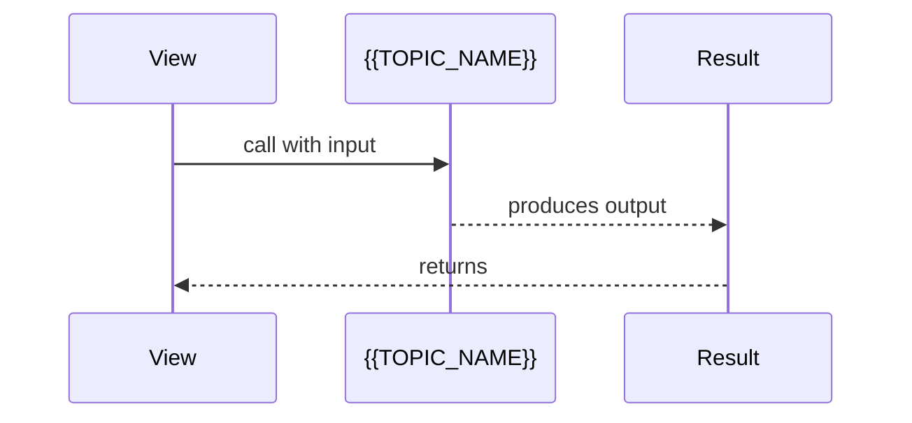

> Include 2 patterns at junior level. Keep diagrams simple.

---

## Clean Code

### Naming Conventions

| Bad ❌ | Good ✅ |
|--------|---------|
| `func d(_ x: Int) -> Int` | `func doubleValue(_ n: Int) -> Int` |
| `let t = getData()` | `let userList = getUsers()` |
| `var flag: Bool` | `var isLoading: Bool` |

### Design

❌ Anti-pattern: Functions doing too many things.
```swift
// ❌ Too long, does too many things
func process(data: Data) {
    // 80+ lines doing parse, validate, save, notify...
}
```

✅ Better: Single responsibility.
```swift
// ✅ Single responsibility
func parseInput(_ data: Data) throws -> Input { ... }
func validateInput(_ input: Input) throws { ... }
func saveInput(_ input: Input) throws { ... }
```

**Rules:**
- Variables: describe WHAT they hold (`userCount`, not `n`, `x`, `tmp`)
- Functions: describe WHAT they do (`calculateTotal`, not `calc`, `doStuff`)
- Booleans: use `is`, `has`, `can` prefix (`isValid`, `hasPermission`)

---

## Product Use / Feature

### 1. {{Product/Tool Name}}

- **How it uses {{TOPIC_NAME}}:** Brief description
- **Why it matters:** Practical impact

### 2. {{Product/Tool Name}}

- **How it uses {{TOPIC_NAME}}:** Brief description
- **Why it matters:** Practical impact

---

## Error Handling

### Error 1: {{Common error message or type}}

```swift
// Code that produces this error
```

**Why it happens:** Simple explanation.
**How to fix:**

```swift
// Corrected code with proper error handling
do {
    let result = try someFunction()
    // use result
} catch {
    print("Error occurred: \(error)")
}
```

### Error 2: {{Another common error}}

...

---

## Security Considerations

### 1. {{Security concern}}

```swift
// ❌ Insecure
...

// ✅ Secure
...
```

**Risk:** What could go wrong.
**Mitigation:** How to protect against it.

---

## Performance Tips

### Tip 1: {{Performance optimization}}

```swift
// ❌ Slow approach
...

// ✅ Faster approach
...
```

**Why it's faster:** Simple explanation.

---

## Metrics & Analytics

### What to Measure

| Metric | Why it matters | Tool |
|--------|---------------|------|
| **{{metric 1}}** | {{reason}} | Instruments |
| **{{metric 2}}** | {{reason}} | XCTest, Firebase |

---

## Best Practices

- **Do this:** Explanation
- **Do this:** Explanation
- **Do this:** Explanation

---

## Edge Cases & Pitfalls

### Pitfall 1: {{name}}

```swift
// Code that demonstrates the pitfall
```

**What happens:** Explanation.
**How to fix:** Corrected approach.

---

## Common Mistakes

### Mistake 1: {{description}}

```swift
// ❌ Wrong way
...

// ✅ Correct way
...
```

---

## Common Misconceptions

### Misconception 1: "{{False belief}}"

**Reality:** {{What's actually true}}
**Why people think this:** {{Why this misconception is common}}

---

## Tricky Points

### Tricky Point 1: {{name}}

```swift
// Code that might surprise a junior
```

**Why it's tricky:** Explanation.
**Key takeaway:** One-line lesson.

---

## Test

### Multiple Choice

**1. {{Question}}?**

- A) Option A
- B) Option B
- C) Option C
- D) Option D

<details>
<summary>Answer</summary>
**C)** — Explanation.
</details>

### True or False

**2. {{Statement}}**

<details>
<summary>Answer</summary>
**False** — Explanation.
</details>

### What's the Output?

**3. What does this code print?**

```swift
// code snippet
```

<details>
<summary>Answer</summary>
Output: `...`
Explanation: ...
</details>

---

## "What If?" Scenarios

**What if {{Unexpected situation}}?**
- **You might think:** {{Intuitive but wrong answer}}
- **But actually:** {{Correct behavior and why}}

---

## Tricky Questions

**1. {{Confusing question}}?**

- A) {{Looks correct but wrong}}
- B) {{Correct answer}}
- C) {{Common misconception}}
- D) {{Partially correct}}

<details>
<summary>Answer</summary>
**B)** — Explanation.
</details>

---

## Cheat Sheet

| What | Syntax / Command | Example |
|------|-----------------|---------|
| {{Action 1}} | `{{syntax}}` | `{{example}}` |
| {{Action 2}} | `{{syntax}}` | `{{example}}` |

---

## Self-Assessment Checklist

### I can explain:
- [ ] What {{TOPIC_NAME}} is and why it exists
- [ ] When to use it and when NOT to use it
- [ ] {{Specific concept 1}} in my own words

### I can do:
- [ ] Write a basic example from scratch (without looking)
- [ ] Read and understand code that uses {{TOPIC_NAME}}
- [ ] Debug simple errors related to this topic

---

## Summary

- Key point 1
- Key point 2
- Key point 3

**Next step:** What to learn after this topic.

---

## What You Can Build

### Projects you can create:
- **{{Project 1}}:** Brief description
- **{{Project 2}}:** Brief description

### Learning path:

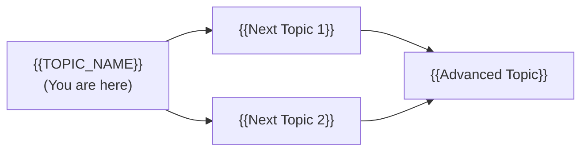

---

## Further Reading

- **Official docs:** [Apple Developer Documentation](https://developer.apple.com/documentation)
- **Blog post:** [{{link title}}]({{url}}) — brief description
- **Video:** [WWDC Session — {{link title}}]({{url}})

---

## Related Topics

- **[{{Related Topic 1}}](../XX-related-topic/)** — how it connects

---

## Diagrams & Visual Aids

### Mind Map

```mermaid
mindmap
  root(({{TOPIC_NAME}}))
    Core Concept 1
      Sub-concept A
      Sub-concept B
    Core Concept 2
      Sub-concept C
    Related Topics
      {{Related 1}}
```

### Example — iOS View Hierarchy (ASCII)

```
+------------------+
|   UIWindow       |
|------------------|
|   UIViewController|
|   +------------+ |
|   |   UIView   | |
|   | +--------+ | |
|   | | Subview| | |
|   | +--------+ | |
|   +------------+ |
+------------------+
```

</details>

---
---

# TEMPLATE 2 — `middle.md`

<details open>
<summary><strong>Template Content</strong></summary>

# {{TOPIC_NAME}} — Middle Level

## Table of Contents

1. [Introduction](#introduction)
2. [Core Concepts](#core-concepts)
3. [Pros & Cons](#pros--cons)
4. [Use Cases](#use-cases)
5. [Code Examples](#code-examples)
6. [Coding Patterns](#coding-patterns)
7. [Clean Code](#clean-code)
8. [Product Use / Feature](#product-use--feature)
9. [Error Handling](#error-handling)
10. [Security Considerations](#security-considerations)
11. [Performance Optimization](#performance-optimization)
12. [Metrics & Analytics](#metrics--analytics)
13. [Debugging Guide](#debugging-guide)
14. [Best Practices](#best-practices)
15. [Edge Cases & Pitfalls](#edge-cases--pitfalls)
16. [Common Mistakes](#common-mistakes)
17. [Tricky Points](#tricky-points)
18. [Comparison with Android / Other Platforms](#comparison-with-android--other-platforms)
19. [Test](#test)
20. [Tricky Questions](#tricky-questions)
21. [Cheat Sheet](#cheat-sheet)
22. [Summary](#summary)
23. [What You Can Build](#what-you-can-build)
24. [Further Reading](#further-reading)
25. [Related Topics](#related-topics)
26. [Diagrams & Visual Aids](#diagrams--visual-aids)

---

## Introduction

> Focus: "Why?" and "When to use?"

Assumes the reader already knows the basics. This level covers:
- Deeper understanding of how {{TOPIC_NAME}} works
- Real-world application patterns (MVVM, Combine, async/await)
- Production considerations

---

## Core Concepts

### Concept 1: {{Advanced concept}}


### Concept 2: {{Another concept}}

- How it relates to other iOS/Swift features
- Internal behavior differences
- Performance implications

---

## Evolution & Historical Context

**Before {{TOPIC_NAME}}:**
- How developers solved this previously
- Pain points of the old approach

**How {{TOPIC_NAME}} changed things:**
- The architectural shift it introduced
- Why it became the standard

---

## Pros & Cons

| Pros | Cons |
|------|------|
| {{Advantage 1}} | {{Disadvantage 1}} |
| {{Advantage 2}} | {{Disadvantage 2}} |

### Comparison with alternatives:

| Approach | Pros | Cons | Best for |
|----------|------|------|----------|
| {{Approach A}} | {{pros}} | {{cons}} | {{scenario}} |
| {{Approach B}} | {{pros}} | {{cons}} | {{scenario}} |

---

## Use Cases

- **Use Case 1:** {{Production scenario}}
- **Use Case 2:** {{Scaling scenario}}
- **Use Case 3:** {{Integration scenario}}

---

## Code Examples

### Example 1: {{Production-ready pattern}}

```swift
// Production-quality Swift code with error handling
class UserRepository {
    private let api: UserAPI
    private let store: UserStore

    init(api: UserAPI, store: UserStore) {
        self.api = api
        self.store = store
    }

    func getUser(id: String) async throws -> User {
        let user = try await api.fetchUser(id: id)
        try store.save(user)
        return user
    }
}
```

**Why this pattern:** Explanation.
**Trade-offs:** What you gain and what you sacrifice.

### Example 2: Combine vs async/await comparison

```swift
// Approach A — Combine
api.fetchUser(id: id)
    .sink(receiveCompletion: { _ in }, receiveValue: { user in ... })
    .store(in: &cancellables)

// Approach B — async/await (preferred in Swift 5.5+)
let user = try await api.fetchUser(id: id)
```

**When to use which:** Decision criteria.

---

## Coding Patterns

### Pattern 1: {{Pattern name — e.g., Repository, MVVM, Observer}}

**Category:** Architectural / Behavioral
**Intent:** {{What problem this pattern solves}}
**When to use:** {{Specific scenario}}
**When NOT to use:** {{Counter-indication}}

**Structure diagram:**

```mermaid
classDiagram
    class {{Protocol}} {
        <<protocol>>
        +{{method()}} {{ReturnType}}
    }
    class {{ConcreteA}} {
        +{{method()}} {{ReturnType}}
    }
    class {{Client}} {
        -{{Protocol}} dep
        +use()
    }
    {{Protocol}} <|.. {{ConcreteA}}
    {{Client}} --> {{Protocol}}
```

**Implementation:**

```swift
// Pattern implementation
```

---

### Pattern 2: {{Another pattern}}

**Intent:** {{What it solves}}

**Flow diagram:**

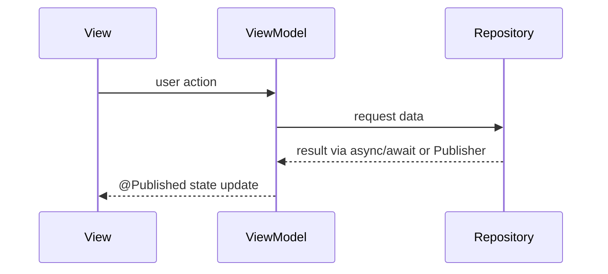

```swift
// Implementation
```

---

### Pattern 3: {{Idiomatic Swift pattern}}

**Intent:** {{Swift-specific idiom}}

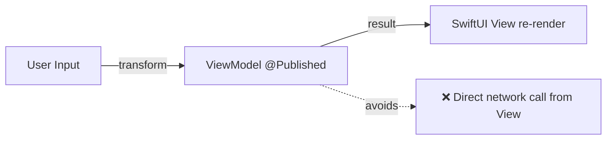

```swift
// ❌ Non-idiomatic
struct ContentView: View {
    var body: some View {
        Button("Load") { URLSession.shared.dataTask(...) }
    }
}

// ✅ Idiomatic MVVM
struct ContentView: View {
    @StateObject var viewModel = UserViewModel()
    var body: some View {
        Button("Load") { Task { await viewModel.loadUser() } }
    }
}
```

---

## Clean Code

### Naming & Readability

| Element | Rule | Example |
|---------|------|---------|
| Functions | Verb + noun | `fetchUser(byID:)`, `validateEmail(_:)` |
| Variables | Noun, describes content | `activeConnections`, `retryCount` |
| Booleans | `is/has/can` prefix | `isExpired`, `hasPermission` |

```swift
// ❌ Cryptic
func proc(_ d: Data, _ f: Bool) -> Data

// ✅ Self-documenting
func compressData(_ input: Data, includeHeader: Bool) -> Data
```

---

### SOLID in Practice

```swift
// ❌ One class doing everything
class UserManager { /* handles auth + network + keychain + notifications */ }

// ✅ Each type has one reason to change
protocol UserRepository { func findByID(_ id: String) async throws -> User }
protocol UserNotifier { func sendWelcomeEmail(to user: User) async throws }
class UserAuthService {
    private let repo: UserRepository
    init(repo: UserRepository) { self.repo = repo }
}
```

---

### DRY vs WET

```swift
// ❌ WET
func validateEmail(_ s: String) -> Bool { !s.isEmpty && s.contains("@") }
func validateUsername(_ s: String) -> Bool { !s.isEmpty && s.contains("@") }

// ✅ DRY
func containsAt(_ s: String) -> Bool { !s.isEmpty && s.contains("@") }
```

---

## Product Use / Feature

### 1. {{Product/Tool Name}}

- **How it uses {{TOPIC_NAME}}:** Description
- **Scale:** Numbers, traffic
- **Key insight:** What can be learned

---

## Error Handling

### Pattern 1: {{Error handling pattern}}

```swift
// Production error handling
func doSomething() async throws -> Data {
    do {
        return try await riskyOperation()
    } catch let error as URLError {
        throw AppError.network(underlying: error)
    }
}
```

### Common Error Patterns

| Situation | Pattern | Example |
|-----------|---------|---------|
| Throwing errors | `throw AppError.network(...)` | Domain-specific |
| Task cancellation | `try Task.checkCancellation()` | Async contexts |
| Result type | `Result<T, Error>` | Callback bridges |

---

## Security Considerations

### 1. {{Security concern}}

**Risk level:** High / Medium / Low

```swift
// ❌ Vulnerable
...

// ✅ Secure
...
```

### Security Checklist

- [ ] {{Check 1}} — why it matters
- [ ] No sensitive data in UserDefaults — use Keychain
- [ ] Certificate pinning enabled for production

---

## Performance Optimization

### Optimization 1: {{name}}

```swift
// ❌ Slow
...

// ✅ Fast
...
```

**Instruments evidence:**
```
Time Profiler: slow → 45ms, fast → 3ms
```

---

## Metrics & Analytics

### Key Metrics

| Metric | Type | Description | Alert threshold |
|--------|------|-------------|-----------------|
| **{{metric 1}}** | Counter | {{what it counts}} | — |
| **{{metric 2}}** | Gauge | {{what it measures}} | > {{threshold}} |

### Instruments Instrumentation

```swift
// XCTest performance measurement
func testPerformanceExample() throws {
    self.measure {
        // code to benchmark
    }
}
```

---

## Debugging Guide

### Problem 1: {{Common symptom}}

**Symptoms:** What you see (crash, memory leak, UI freeze).

**Diagnostic steps:**
```bash
# Instruments tools
# Product → Profile → Instruments → Time Profiler / Allocations / Leaks
```

### Useful Tools

| Tool | What it shows |
|------|---------------|
| Instruments Time Profiler | CPU hotspots |
| Instruments Allocations | Memory allocations |
| Instruments Energy Log | Battery drain |
| XCTest performance | Regression testing |

---

## Best Practices

- **Practice 1:** Explanation + code snippet
- **Practice 2:** Explanation + why it matters in production
- **Practice 3:** Explanation + common violation example

---

## Edge Cases & Pitfalls

### Pitfall 1: {{Production pitfall}}

```swift
// Code that causes issues in production
```

**Impact:** What goes wrong.
**Fix:** Corrected approach.

---

## Common Mistakes

### Mistake 1: {{Middle-level mistake}}

```swift
// ❌ Looks correct but has subtle issues
...

// ✅ Properly handles edge cases
...
```

---

## Common Misconceptions

### Misconception 1: "{{False belief}}"

**Reality:** {{What's actually true}}

**Evidence:**
```swift
// Code that proves the misconception wrong
```

---

## Anti-Patterns

### Anti-Pattern 1: {{Name}}

```swift
// ❌ The Anti-Pattern
...
```

**Why it's bad:** How it causes pain later.
**The refactoring:** What to use instead.

---

## Tricky Points

### Tricky Point 1: {{Subtle behavior}}

```swift
// Code with non-obvious behavior
```

**What actually happens:** Step-by-step explanation.

---

## Comparison with Android / Other Platforms

| Aspect | iOS (Swift) | Android (Kotlin) | Flutter (Dart) |
|--------|:-----------:|:----------------:|:--------------:|
| {{Aspect 1}} | {{approach}} | {{approach}} | {{approach}} |
| {{Aspect 2}} | ... | ... | ... |

---

## Test

### Multiple Choice (harder)

**1. {{Question involving trade-offs}}?**

<details>
<summary>Answer</summary>
**B)** — Detailed explanation.
</details>

### Code Analysis

**2. What happens when this code runs and the Task is cancelled?**

```swift
// async code
```

<details>
<summary>Answer</summary>
Explanation of Swift concurrency cancellation behavior.
</details>

---

## Tricky Questions

**1. {{Question that tests deep understanding}}?**

<details>
<summary>Answer</summary>
**D)** — Deep explanation with Swift spec reference.
</details>

---

## Cheat Sheet

| Scenario | Pattern | Key consideration |
|----------|---------|-------------------|
| {{Scenario 1}} | `{{code pattern}}` | {{what to watch for}} |

---

## Summary

- Key insight 1
- Key insight 2

**Next step:** What to explore at Senior level.

---

## What You Can Build

### Learning path:

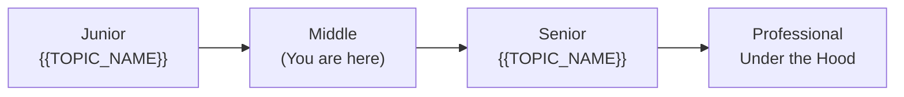

---

## Further Reading

- **Official docs:** [Apple Developer](https://developer.apple.com)
- **WWDC talk:** [{{title}}]({{url}})

---

## Diagrams & Visual Aids

### Example — MVVM Architecture

```mermaid
graph TD
    subgraph "Presentation"
        A[SwiftUI View] -->|@StateObject| B[ViewModel]
    end
    subgraph "Domain"
        B -->|calls| C[UseCase]
        C -->|uses| D[Repository Protocol]
    end
    subgraph "Data"
        E[Repository Impl] -->|implements| D
        E --> F[URLSession / Core Data]
    end
```

</details>

---
---

# TEMPLATE 3 — `senior.md`

<details open>
<summary><strong>Template Content</strong></summary>

# {{TOPIC_NAME}} — Senior Level

## Table of Contents

1. [Introduction](#introduction)
2. [Core Concepts](#core-concepts)
3. [Pros & Cons](#pros--cons)
4. [Use Cases](#use-cases)
5. [Code Examples](#code-examples)
6. [Coding Patterns](#coding-patterns)
7. [Clean Code](#clean-code)
8. [Best Practices](#best-practices)
9. [Product Use / Feature](#product-use--feature)
10. [Error Handling](#error-handling)
11. [Security Considerations](#security-considerations)
12. [Performance Optimization](#performance-optimization)
13. [Metrics & Analytics](#metrics--analytics)
14. [Debugging Guide](#debugging-guide)
15. [Edge Cases & Pitfalls](#edge-cases--pitfalls)
16. [Postmortems & System Failures](#postmortems--system-failures)
17. [Common Mistakes](#common-mistakes)
18. [Tricky Points](#tricky-points)
19. [Comparison with Other Platforms](#comparison-with-other-platforms)
20. [Test](#test)
21. [Tricky Questions](#tricky-questions)
22. [Cheat Sheet](#cheat-sheet)
23. [Summary](#summary)
24. [What You Can Build](#what-you-can-build)
25. [Further Reading](#further-reading)
26. [Related Topics](#related-topics)
27. [Diagrams & Visual Aids](#diagrams--visual-aids)

---

## Introduction

> Focus: "How to optimize?" and "How to architect?"

For developers who:
- Design iOS system architectures (TCA, Clean Architecture, VIPER)
- Optimize performance-critical code paths
- Mentor junior/middle iOS developers
- Review and improve large codebases

---

## Core Concepts

### Concept 1: {{Architecture-level concept}}

```swift
// Advanced pattern with detailed annotations
```

### Concept 2: {{Optimization concept}}

Benchmark comparisons:

```swift
// XCTest Benchmark
func benchmarkApproachA() {
    measure { ... }
}
func benchmarkApproachB() {
    measure { ... }
}
```

---

## Pros & Cons

| Pros | Cons | Impact |
|------|------|--------|
| {{Advantage 1}} | {{Disadvantage 1}} | {{Impact on architecture}} |
| {{Advantage 2}} | {{Disadvantage 2}} | {{Impact on team}} |

---

## Code Examples

### Example 1: {{Architecture pattern}}

```swift
// Full production pattern with DI, error handling, async/await
```

### Example 2: {{Performance optimization}}

```swift
// Before optimization
...

// After (with Instruments evidence)
...
```

---

## Coding Patterns

### Pattern 1: {{Architectural pattern — e.g., TCA, VIPER, Clean Architecture}}

**Category:** Architectural
**Intent:** {{System-level problem this solves}}
**Trade-offs:** {{Complexity vs benefit}}

**Architecture diagram:**

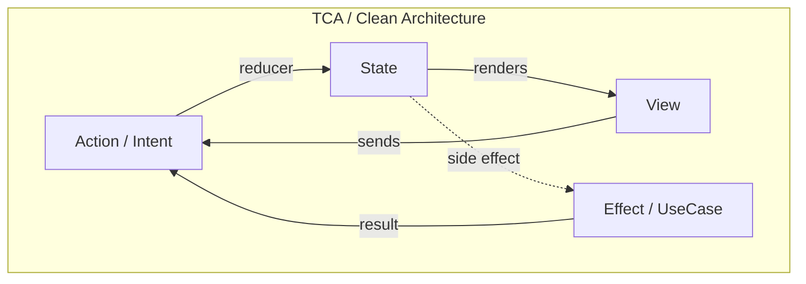

**Implementation:**

```swift
// Senior-level Swift implementation
```

---

### Pattern 2: {{Concurrency / Performance pattern}}

**Intent:** {{What it optimizes}}

**Flow diagram:**

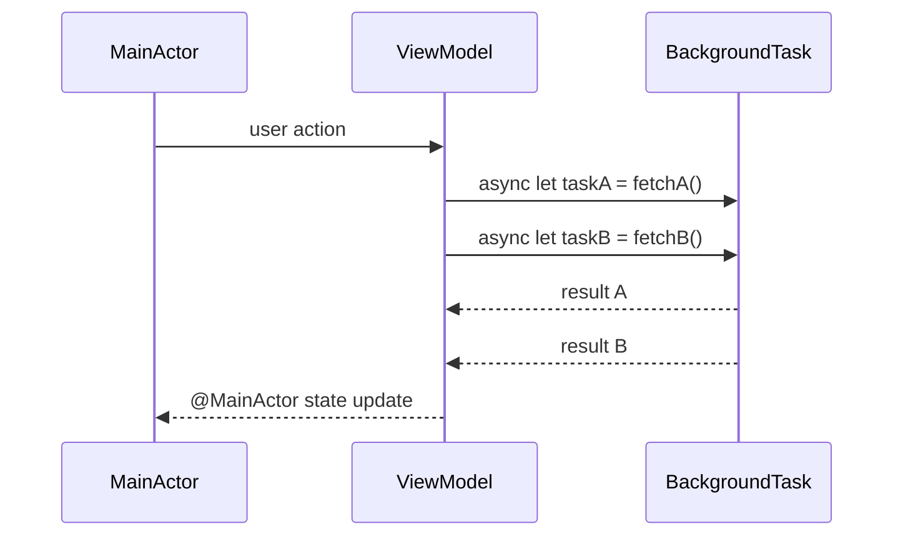

```swift
// Implementation with Swift actors
```

---

### Pattern 3: {{Resilience / Fault tolerance pattern}}

**State diagram:**

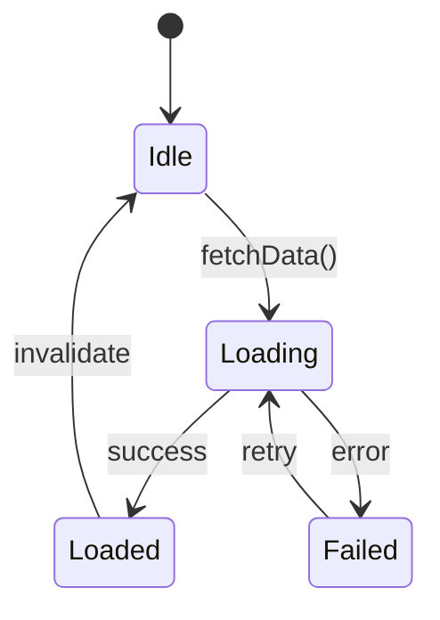

```swift
// Production implementation
```

---

### Pattern 4: {{Data / Caching pattern}}

```mermaid
graph LR
    A[Remote API] -->|fetch| B[Repository]
    B -->|cache| C[Core Data / SwiftData]
    C -->|emit| D[AsyncStream / Publisher]
    D -->|observe| E[ViewModel]
    E -->|@Published| F[SwiftUI View]
```

```swift
// Single source of truth with Core Data + async/await
```

---

### Pattern Comparison Matrix

| Pattern | Use When | Avoid When | Complexity |
|---------|----------|------------|------------|
| {{Pattern 1}} | {{condition}} | {{condition}} | Low/Med/High |
| {{Pattern 2}} | {{condition}} | {{condition}} | Low/Med/High |
| {{Pattern 3}} | {{condition}} | {{condition}} | Low/Med/High |
| {{Pattern 4}} | {{condition}} | {{condition}} | Low/Med/High |

---

## Clean Code

### Clean Architecture Boundaries

```swift
// ❌ Layering violation
class OrderViewModel {
    let context = PersistenceController.shared.container.viewContext // direct Core Data
}

// ✅ Dependency inversion
protocol OrderRepository { func save(_ order: Order) async throws }
class OrderViewModel {
    private let repo: OrderRepository
    init(repo: OrderRepository) { self.repo = repo }
}
```

**Dependency flow:**
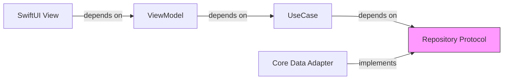

---

### Code Smells at Senior Level

| Smell | Symptom | Refactoring |
|-------|---------|-------------|
| **Massive ViewController** | 1000+ lines | Extract to ViewModel + UseCase |
| **Primitive Obsession** | `String` for email, `Double` for money | Wrap in value types |
| **God ViewModel** | Handles UI + business + networking | Split responsibilities |
| **Retain Cycles** | Memory growing unbounded | Use weak references |

---

### Code Review Checklist (Senior)

- [ ] No business logic in Views or ViewControllers
- [ ] No retain cycles (verify with Instruments Leaks)
- [ ] All async work properly cancelled on deinit
- [ ] `@MainActor` used correctly for UI updates
- [ ] No force unwrapping in production code

---

## Best Practices

### Must Do ✅

1. **{{Best practice 1}}** — why it matters in production
   ```swift
   // Example
   ```

2. **{{Best practice 2}}**
   ```swift
   // Example
   ```

3. **{{Best practice 3}}**
   ```swift
   // Example
   ```

### Never Do ❌

1. **{{Anti-practice 1}}**
   ```swift
   // ❌ What NOT to do
   // ✅ What to do instead
   ```

2. **{{Anti-practice 2}}**

### Production Checklist

- [ ] {{TOPIC_NAME}} has proper error handling and logging
- [ ] All edge cases tested (nil, empty, large data)
- [ ] Performance profiled with Instruments under realistic load
- [ ] Security: no sensitive data in logs, Keychain for secrets
- [ ] Graceful degradation when network fails
- [ ] Memory: no retain cycles, verified with Leaks instrument

---

## Product Use / Feature

### 1. {{Company/Product Name}}

- **Architecture:** How they implement {{TOPIC_NAME}} at scale
- **Scale:** Numbers (MAU, API calls/sec)
- **Lessons learned:** What they changed and why

---

## Error Handling

### Strategy 1: Domain error hierarchy

```swift
// Domain-specific error hierarchy
enum AppError: Error {
    case network(underlying: Error)
    case database(underlying: Error)
    case unauthorized
    case notFound(id: String)

    var userMessage: String {
        switch self {
        case .network: return "Connection error. Please try again."
        case .unauthorized: return "Session expired. Please log in."
        default: return "Something went wrong."
        }
    }
}
```

### Error Handling Architecture

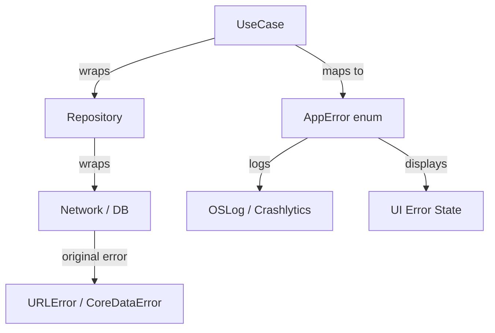

---

## Security Considerations

### 1. {{Critical security concern}}

**Risk level:** Critical
**OWASP Mobile category:** {{relevant category}}

```swift
// ❌ Vulnerable
...

// ✅ Secure
...
```

### Security Architecture Checklist

- [ ] Keychain for sensitive data (tokens, passwords)
- [ ] App Transport Security (ATS) enforced
- [ ] Certificate pinning for sensitive APIs
- [ ] Jailbreak detection for high-security apps
- [ ] Data Protection API for files

### Threat Model

| Threat | Likelihood | Impact | Mitigation |
|--------|:---------:|:------:|------------|
| {{Threat 1}} | High | Critical | {{mitigation}} |
| {{Threat 2}} | Medium | High | {{mitigation}} |

---

## Performance Optimization

### Optimization 1: {{name}}

```swift
// Before — Instruments Time Profiler shows bottleneck
func slowFunction() { ... }

// After — 5x improvement
func fastFunction() { ... }
```

**Instruments evidence:**
```
Time Profiler: slowFunction → 45% CPU in hot path
Allocations: 200 MB/s → 5 MB/s after optimization
```

### Performance Architecture

| Layer | Optimization | Impact |
|:-----:|:------------|:------:|
| **Algorithm** | Better data structure | Highest |
| **Memory** | Reduce ARC overhead | High |
| **Rendering** | Reduce view invalidations | Medium |
| **Network** | Request batching, caching | Varies |

---

## Metrics & Analytics

### SLO / SLA Definition

| SLI | SLO Target | Measurement |
|-----|-----------|-------------|
| **App launch time** | < 400ms (warm) | Instruments, MetricKit |
| **Frame rate** | > 99% at 60fps | Instruments |
| **Crash-free rate** | > 99.9% | Firebase/Crashlytics |

### Metrics Architecture

```
[iOS App]
    │
    ├── MetricKit → Apple aggregated performance data
    ├── Instruments Time Profiler → CPU flame chart
    ├── Instruments Allocations → memory allocations
    └── Firebase Crashlytics → crash_rate, ANR equivalent (hang rate)
```

---

## Debugging Guide

### Problem 1: {{Production issue}}

**Symptoms:** Crash logs, hang reports, memory warnings.

**Diagnostic steps:**
```bash
# Instruments command line
xcrun xctrace record --template "Time Profiler" --launch -- /path/to/app
```

### Advanced Tools

| Tool | Use case | When to use |
|------|----------|-------------|
| Instruments Time Profiler | CPU hotspots | Performance issues |
| Instruments Allocations | Memory growth | OOM crashes |
| Instruments Energy Log | Battery drain | Background efficiency |
| XCTest performance | Regression | CI integration |

---

## Edge Cases & Pitfalls

### Pitfall 1: {{Scale pitfall}}

```swift
// Code that works fine until large data sets / high concurrency
```

**At what scale it breaks:** Specific numbers.
**Root cause:** Why it fails.
**Solution:** Architecture fix.

---

## Postmortems & System Failures

### The {{App/Company}} Incident

- **The goal:** {{What they were trying to achieve}}
- **The mistake:** {{How they misused this feature}}
- **The impact:** {{Crashes, ANRs, data loss}}
- **The fix:** {{Permanent solution}}

**Key takeaway:** {{Architectural lesson}}

---

## Common Mistakes

### Mistake 1: {{Architectural anti-pattern}}

```swift
// ❌ Common but wrong
...

// ✅ Better approach
...
```

---

## Tricky Points

### Tricky Point 1: {{Swift spec subtlety}}

```swift
// Code that exploits a subtle Swift behavior
```

**Swift evolution reference:** [SE-XXXX](https://github.com/apple/swift-evolution)

---

## Comparison with Other Platforms

| Aspect | iOS (Swift) | Android (Kotlin) | Web (JS/TS) |
|--------|:-----------:|:----------------:|:-----------:|
| {{Aspect 1}} | {{approach}} | {{approach}} | {{approach}} |

---

## Test

### Architecture Questions

**1. You're designing {{system}}. Which approach is best?**

<details>
<summary>Answer</summary>
**C)** — Full architectural reasoning.
</details>

---

## Tricky Questions

**1. {{Question that even experienced developers get wrong}}?**

<details>
<summary>Answer</summary>
Detailed explanation with Swift spec reference and Instruments evidence.
</details>

---

## Cheat Sheet

### Architecture Decision Matrix

| Scenario | Recommended | Avoid | Why |
|----------|-------------|-------|-----|
| {{scenario 1}} | {{pattern}} | {{anti-pattern}} | {{reason}} |

### Heuristics & Rules of Thumb

- **The 400ms Rule:** App cold launch must complete in < 400ms or Apple may terminate in background.
- **The Actor Rule:** Mark any class accessing shared mutable state with `@MainActor` or a custom `actor`.

---

## Summary

- Key architectural insight 1
- Key performance insight 2

**Senior mindset:** Not just "how" but "when", "why", and "what are the trade-offs".

---

## What You Can Build

### Architect and lead:
- **{{System/Platform 1}}:** Large-scale iOS app architecture

### Career impact:
- **Staff iOS Engineer** — system design interviews require this depth
- **Tech Lead** — mentor others on architectural decisions

---

## Further Reading

- **Swift Evolution:** [github.com/apple/swift-evolution](https://github.com/apple/swift-evolution)
- **WWDC talks:** [developer.apple.com/videos](https://developer.apple.com/videos)

---

## Diagrams & Visual Aids

### Clean Architecture Layers

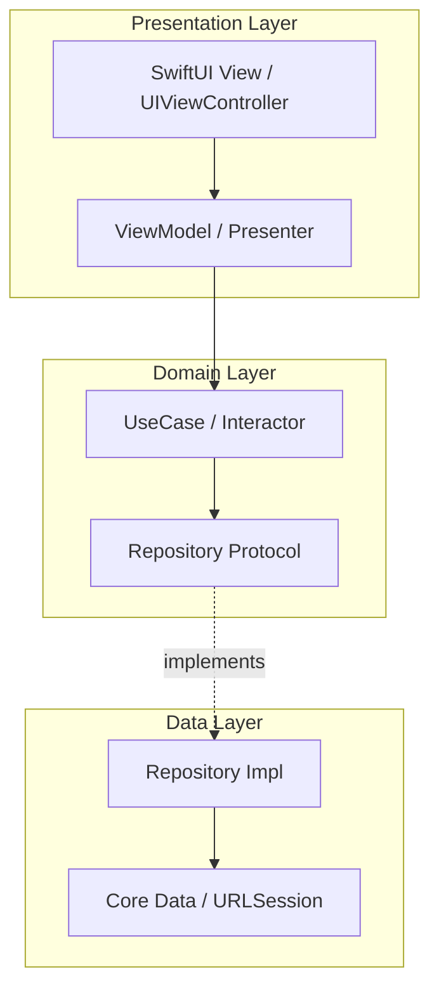

</details>

---
---

# TEMPLATE 4 — `professional.md`

<details open>
<summary><strong>Template Content</strong></summary>

# Swift Runtime and Darwin Internals

## Table of Contents

1. [Introduction](#introduction)
2. [How It Works Internally](#how-it-works-internally)
3. [Runtime Deep Dive](#runtime-deep-dive)
4. [Compiler Perspective](#compiler-perspective)
5. [Memory Layout](#memory-layout)
6. [OS / Syscall Level](#os--syscall-level)
7. [Source Code Walkthrough](#source-code-walkthrough)
8. [Assembly / SIL Output Analysis](#assembly--sil-output-analysis)
9. [Performance Internals](#performance-internals)
10. [Edge Cases at the Lowest Level](#edge-cases-at-the-lowest-level)
11. [Test](#test)
12. [Tricky Questions](#tricky-questions)
13. [Summary](#summary)
14. [Further Reading](#further-reading)
15. [Diagrams & Visual Aids](#diagrams--visual-aids)

---

## Introduction

> Focus: "What happens under the hood?"

This document explores what iOS/Swift does internally when you use {{TOPIC_NAME}}.
Topics covered:
- **Swift SIL/LLVM IR** — Swift Intermediate Language, optimization passes
- **Swift compiler pipeline** — Parsing → AST → SIL → LLVM IR → Machine code
- **Darwin XNU kernel** — Mach microkernel, BSD layer, IOKit
- **Mach-O binary format** — segments, sections, symbol table, dyld
- **Objective-C runtime** — message passing (`objc_msgSend`), method swizzling, ISA pointer
- **Instruments profiling** — Time Profiler flame chart, Allocations, Energy Log

---

## How It Works Internally

Step-by-step breakdown of what happens when Swift executes {{feature}}:

1. **Swift source** → What you write
2. **AST** → Abstract Syntax Tree after parsing and type checking
3. **SIL** (Swift Intermediate Language) → High-level IR, ARC optimization here
4. **LLVM IR** → Low-level IR, further optimizations
5. **Machine code** → ARM64/x86_64 binary
6. **Runtime** → Swift runtime + Objective-C runtime (where applicable)

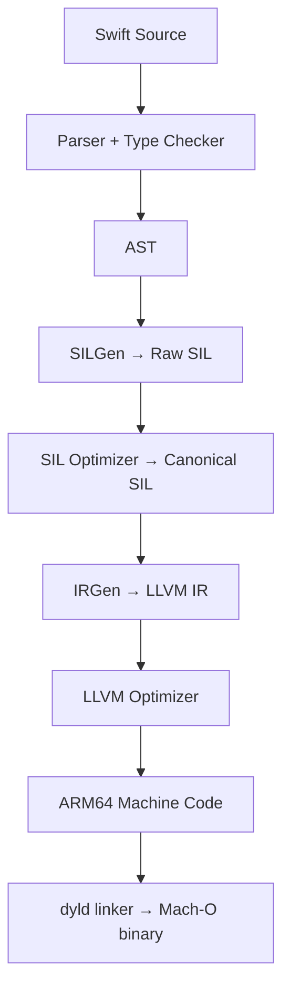

---

## Runtime Deep Dive

### Swift SIL — Swift Intermediate Language

```bash
# Emit SIL
swiftc -emit-sil main.swift | swift-demangle

# Emit canonical SIL (after ARC optimization)
swiftc -emit-sil -O main.swift | swift-demangle
```

**Key SIL instructions:**
```
// SIL for ARC
strong_retain %0 : $User
strong_release %0 : $User

// ARC optimization: retain/release pairs are eliminated in canonical SIL
// when the compiler proves ownership is unambiguous
```

**ARC optimization in SIL:**
```
Raw SIL:
  %1 = strong_retain %user    // retain
  ... use %user ...
  strong_release %user        // release

Canonical SIL (optimized):
  ... use %user ...           // retain/release eliminated
```

### Objective-C Runtime — Message Passing

Every Objective-C method call goes through `objc_msgSend`:

```
[object method:arg]
// becomes:
objc_msgSend(object, @selector(method:), arg)
```

**ISA pointer and method dispatch:**
```
Object layout:
+------------------+
| isa pointer      |  <- points to Class object
| instance vars... |
+------------------+

Class object:
+------------------+
| isa pointer      |  <- points to Metaclass
| superclass ptr   |
| method cache     |  <- hash table of SEL → IMP
| method list      |  <- fallback if not in cache
+------------------+
```

**Method swizzling mechanism:**
```swift
// Runtime method exchange
method_exchangeImplementations(
    class_getInstanceMethod(MyClass.self, #selector(original)),
    class_getInstanceMethod(MyClass.self, #selector(swizzled))
)
```

### Mach-O Binary Format

```bash
# Inspect Mach-O binary
otool -l MyApp.app/MyApp       # load commands
otool -L MyApp.app/MyApp       # linked libraries
nm -gU MyApp.app/MyApp         # exported symbols
```

**Mach-O structure:**
```
+------------------+
| Mach-O Header    |  <- magic, CPU type, file type
+------------------+
| Load Commands    |  <- LC_SEGMENT_64, LC_DYLD_INFO, LC_SYMTAB
+------------------+
| __TEXT segment   |  <- read-only: code, constants
|  __text section  |  <- executable machine code
|  __stubs section |  <- lazy binding stubs
+------------------+
| __DATA segment   |  <- read-write: globals, GOT
|  __data section  |  <- initialized globals
|  __bss section   |  <- uninitialized globals
+------------------+
| __LINKEDIT       |  <- symbol table, string table, code sig
+------------------+
```

### Darwin XNU Kernel

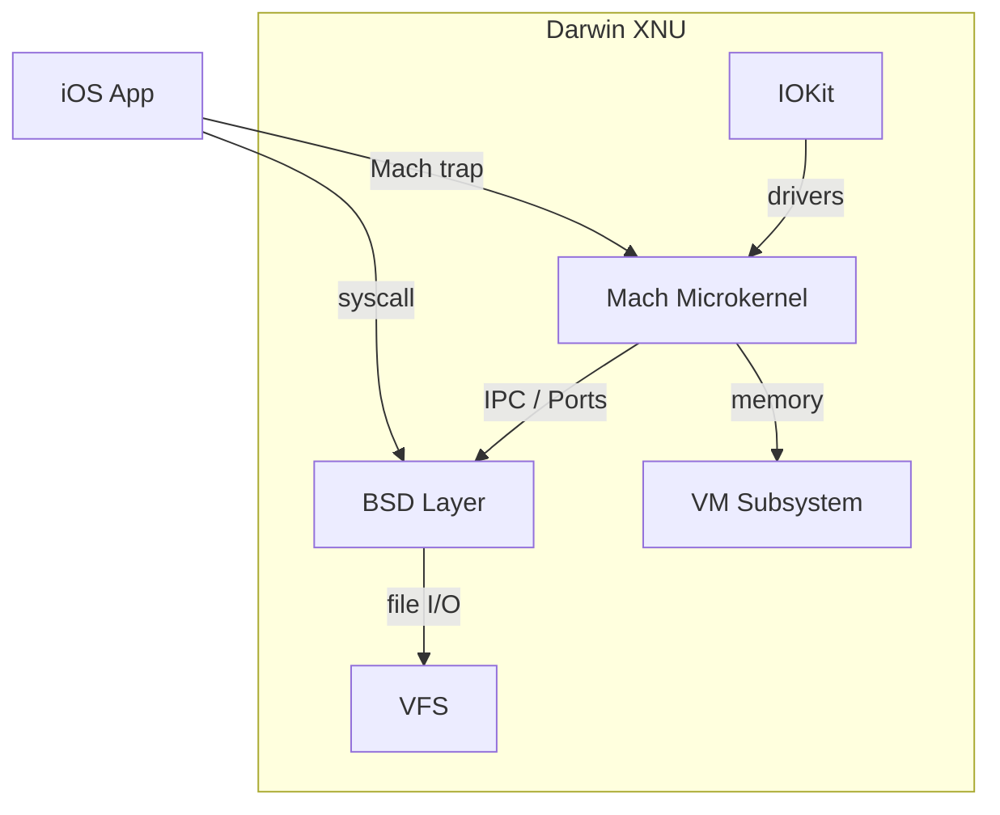

**Key XNU concepts:**
- Mach ports — IPC primitive (like file descriptors for processes)
- Mach traps — kernel entry points (`mach_msg`, `mach_port_allocate`)
- BSD syscalls — POSIX-compatible (`read`, `write`, `mmap`, `select`)
- `dispatch_queue` backed by GCD → `pthreads` → Mach threads

---

## Compiler Perspective

```bash
# View compiler optimization decisions
swiftc -O -whole-module-optimization main.swift -emit-sil | swift-demangle

# View generated assembly
swiftc -O main.swift -emit-assembly

# Check inlining decisions (print all specializations)
swiftc -O main.swift -Xfrontend -debug-constraints 2>&1 | head -100
```

**Swift compiler optimizations:**
- Generic specialization (eliminates runtime polymorphism)
- ARC optimization (eliminate retain/release pairs)
- Devirtualization (direct dispatch instead of vtable)
- Inlining (eliminate call overhead for small functions)

---

## Memory Layout

**Swift class vs struct layout:**
```
// Class (heap-allocated, reference type)
class Person {               Heap memory layout:
    var name: String         +------------------+
    var age: Int             | refcount (64-bit) |
}                            | metadata ptr     |
                             | name: String     |  (24 bytes: ptr+len+cap)
                             | age: Int         |  (8 bytes)
                             +------------------+

// Struct (stack-allocated when small, value type)
struct Point {               Stack layout:
    var x: Double            +------------------+
    var y: Double            | x: Double        |  8 bytes
}                            | y: Double        |  8 bytes
                             +------------------+
```

**Swift ARC reference counting:**
```
// Swift object header (2 words)
struct HeapObject {
    HeapMetadata *metadata;  // 8 bytes — type info, vtable
    RefCount refCount;       // 8 bytes — strong + unowned + weak counts packed
}
```

**Existential containers (protocol types):**
```
// Any / protocol type stored in existential container
protocol Drawable { func draw() }

// Existential container layout (3 words value buffer + 2 words metadata):
+------------------+
| value word 1     |  <- inline storage (small values) or pointer
| value word 2     |
| value word 3     |
+------------------+
| metadata ptr     |  <- type metadata (vtable)
| witness table ptr|  <- protocol conformance table
+------------------+
```

---

## OS / Syscall Level

```bash
# Trace syscalls on macOS/iOS simulator
dtruss -f -p <pid>

# List Mach ports
lsmp -p <pid>
```

**Key syscalls / Mach traps:**
- `mmap` — memory mapping for shared frameworks (dyld shared cache)
- `mach_msg` — XPC / Foundation inter-process communication
- `kevent` / `kqueue` — RunLoop, Dispatch I/O event notification
- `pthread_create` — thread creation (backing GCD queues)
- `vm_allocate` — allocate Mach virtual memory

---

## Source Code Walkthrough

**Swift runtime source:** [github.com/apple/swift](https://github.com/apple/swift/tree/main/stdlib/public/runtime)

```cpp
// stdlib/public/runtime/HeapObject.cpp — ARC retain
HeapObject *swift::swift_retain(HeapObject *object) {
    return _swift_retain_(object); // atomic increment refcount
}

// stdlib/public/runtime/HeapObject.cpp — ARC release
void swift::swift_release(HeapObject *object) {
    _swift_release_(object); // atomic decrement; destroy if 0
}
```

**Objective-C runtime source:** [github.com/apple/objc4](https://github.com/apple/objc4)

```cpp
// objc-msg-arm64.s — objc_msgSend (ARM64 assembly)
// 1. Load ISA from receiver
// 2. Check method cache (hash lookup)
// 3. Cache hit → jump to IMP directly
// 4. Cache miss → slow path: search method list → cache it
```

> Reference Swift tag `swift-5.10-RELEASE` since internals change per release.

---

## Assembly / SIL Output Analysis

```bash
# Emit assembly
swiftc -O main.swift -emit-assembly -o main.s

# Demangle Swift symbols
cat main.s | swift-demangle
```

**Sample SIL output:**
```sil
// strong_release eliminated by ARC optimization
sil @main.processUser : $@convention(thin) (@guaranteed User) -> () {
bb0(%0 : $User):
  // ARC: no retain/release needed — caller guarantees lifetime
  %1 = ref_element_addr %0 : $User, #User.name
  %2 = load [copy] %1 : $*String
  // ... use name ...
  destroy_value %2 : $String
  %ret = tuple ()
  return %ret : $()
}
```

**What to look for:**
- `strong_retain`/`strong_release` — ARC overhead in hot paths
- `witness_method` — protocol dispatch (slower than direct call)
- `apply [nothrow]` — function call without error handling overhead
- `alloc_stack` vs `alloc_ref` — stack vs heap allocation

---

## Performance Internals

### Benchmarks with profiling

```swift
// Instruments Time Profiler usage
// Product → Profile → Time Profiler → Record
// Look for: hottest frames, CPU usage by thread

// Energy Log
// Instruments → Energy Log → measure battery impact

// XCTest performance
func testPerformance() {
    let options = XCTMeasureOptions()
    options.iterationCount = 10
    measure(options: options) {
        // benchmark code
    }
}
```

**Internal performance characteristics:**
- Swift struct copy cost: O(n) for large structs (copy-on-write mitigates)
- Protocol dispatch via witness table: one extra pointer dereference vs direct call
- `objc_msgSend` cache hit: ~3ns; cache miss: ~100ns + method list scan
- ARC retain/release: atomic operation, ~3-5ns each (contended: much higher)
- dyld shared cache: frameworks pre-linked, no load time for system frameworks

---

## Metrics & Analytics (Runtime Level)

### Swift Runtime Metrics

```swift
// Memory stats via mach_task_basic_info
func memoryUsage() -> UInt64 {
    var info = mach_task_basic_info()
    var count = mach_msg_type_number_t(MemoryLayout<mach_task_basic_info>.size) / 4
    let result = withUnsafeMutablePointer(to: &info) {
        $0.withMemoryRebound(to: integer_t.self, capacity: 1) {
            task_info(mach_task_self_, task_flavor_t(MACH_TASK_BASIC_INFO), $0, &count)
        }
    }
    return result == KERN_SUCCESS ? info.resident_size : 0
}

// MetricKit — production performance metrics from Apple
import MetricKit
class MetricSubscriber: NSObject, MXMetricManagerSubscriber {
    func didReceive(_ payloads: [MXMetricPayload]) {
        payloads.forEach { payload in
            // payload.applicationLaunchMetrics, payload.cpuMetrics, etc.
        }
    }
}
```

### Key Runtime Metrics

| Metric | What it measures | Impact |
|--------|-----------------|--------|
| `resident_size` | Physical memory in use | OOM kill risk |
| `virtual_size` | Virtual address space | Fragmentation risk |
| ARC retain/release count | Object lifetime pressure | CPU overhead |
| dyld load time | App launch speed | User-visible startup |

---

## Edge Cases at the Lowest Level

### Edge Case 1: Existential vs Generic performance

```swift
// ❌ Existential box — dynamic dispatch, heap allocation
func draw(_ shape: Drawable) { shape.draw() }

// ✅ Generic — specialized at compile time, no boxing
func draw<T: Drawable>(_ shape: T) { shape.draw() }
```

**Internal behavior:** Existential allocates a 40-byte container on heap if value > 3 words. Generic is specialized per type — zero overhead.

### Edge Case 2: Objective-C retain in Swift

```swift
// Bridging Swift String to NSString causes:
// 1. Swift String → NSString bridge allocation
// 2. objc_retain on NSString
// 3. Extra ARC traffic
let swiftString: String = "hello"
let nsString: NSString = swiftString as NSString // bridge cost
```

---

## Test

### Internal Knowledge Questions

**1. What Swift runtime function is called when a class instance is created?**

<details>
<summary>Answer</summary>
`swift_allocObject()` → `malloc()` → returns `HeapObject*` with refcount=1 and metadata pointer set.
</details>

**2. What does this SIL output tell you?**

```sil
witness_method $T, #Drawable.draw : <τ_0_0 where τ_0_0 : Drawable> (τ_0_0) -> () -> ()
```

<details>
<summary>Answer</summary>
This is a protocol witness table dispatch — slower than direct call or vtable dispatch. For performance-critical code, use generics with `<T: Drawable>` to enable specialization and direct dispatch.
</details>

---

## Tricky Questions

**1. Why does using `any Drawable` (existential) allocate on the heap but `some Drawable` (opaque type) does not?**

<details>
<summary>Answer</summary>
`any Drawable` uses an existential container (5 words: 3-word value buffer + metadata + witness table). If the value exceeds 3 words (~24 bytes), it spills to the heap. `some Drawable` is a compile-time opaque type — the concrete type is known to the compiler at each call site, enabling specialization with zero boxing overhead. This is why Swift Evolution SE-0352 introduced `any` keyword to make the performance cost visible.
</details>

---

## Self-Assessment Checklist

### I can explain internals:
- [ ] Swift compiler pipeline (source → SIL → LLVM IR → machine code)
- [ ] ARC retain/release in SIL, and how the optimizer eliminates redundant pairs
- [ ] Objective-C runtime: ISA pointer, method cache, `objc_msgSend` dispatch
- [ ] Mach-O binary format: segments, sections, dyld shared cache
- [ ] Darwin XNU: Mach microkernel, Mach ports, BSD syscalls

### I can analyze:
- [ ] Read SIL output and identify ARC overhead
- [ ] Interpret Instruments Time Profiler flame charts
- [ ] Use Instruments Allocations to track memory growth
- [ ] Identify protocol boxing overhead via SIL

### I can prove:
- [ ] Back claims with XCTest performance results
- [ ] Reference Swift runtime source code
- [ ] Demonstrate behavior with `swiftc -emit-sil` and `swift-demangle`

---

## Summary

- Swift compiles through SIL where ARC optimization eliminates most retain/release pairs
- Objective-C runtime's `objc_msgSend` uses a per-class method cache for near-direct-call performance on cache hits
- Mach-O + dyld shared cache means system framework loading is near-instant (pre-linked at OS install time)
- Existential types (protocols) have boxing overhead; generics with specialization eliminate it

**Key takeaway:** Understanding Swift SIL, ARC optimization, and ObjC runtime dispatch helps you write faster, zero-overhead Swift code.

---

## Further Reading

- **Swift source:** [github.com/apple/swift/stdlib/public/runtime](https://github.com/apple/swift/tree/main/stdlib/public/runtime)
- **Design doc:** [Swift ARC Optimization](https://github.com/apple/swift/blob/main/docs/ARCOptimization.rst)
- **WWDC talk:** [WWDC 2022 — Visualize and optimize Swift concurrency](https://developer.apple.com/videos/play/wwdc2022/110350/)
- **Book:** "iOS and macOS Performance Tuning" — runtime chapter

---

## Diagrams & Visual Aids

### Swift Compilation Pipeline

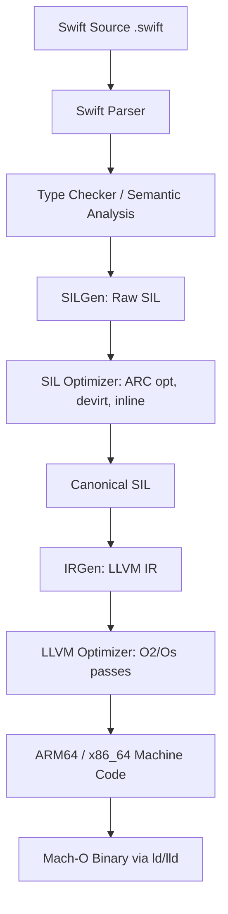

### ARC Memory Model

```mermaid
sequenceDiagram
    participant Code
    participant SwiftRuntime
    participant Heap
    Code->>SwiftRuntime: swift_allocObject()
    SwiftRuntime->>Heap: malloc(size)
    Heap-->>SwiftRuntime: pointer
    SwiftRuntime-->>Code: HeapObject* (refcount=1)
    Code->>SwiftRuntime: swift_retain() [optional]
    SwiftRuntime->>SwiftRuntime: atomic_increment(refcount)
    Code->>SwiftRuntime: swift_release()
    SwiftRuntime->>SwiftRuntime: atomic_decrement(refcount)
    SwiftRuntime->>Heap: free() [if refcount == 0]
```

</details>

---
---

# TEMPLATE 5 — `interview.md`

<details open>
<summary><strong>Template Content</strong></summary>

# {{TOPIC_NAME}} — Interview Questions

## Table of Contents

1. [Junior Level](#junior-level)
2. [Middle Level](#middle-level)
3. [Senior Level](#senior-level)
4. [Scenario-Based Questions](#scenario-based-questions)
5. [FAQ](#faq)

---

## Junior Level

### 1. {{Basic conceptual question about iOS/Swift}}?

**Answer:**
Clear, concise explanation.

---

### 2. {{Another basic question}}?

**Answer:**
...

---

### 3. {{Practical basic question}}?

**Answer:**
...with Swift code example.

```swift
// Example
```

---

> 5-7 junior questions. Test basic understanding (SwiftUI/UIKit basics, optionals, ARC basics, ViewControllers).

---

## Middle Level

### 4. {{Question about practical application — e.g., Combine, async/await, Core Data}}?

**Answer:**
Detailed answer with real-world context.

```swift
// Code example
```

---

### 5. {{Trade-off question — e.g., SwiftUI vs UIKit, Combine vs async/await}}?

**Answer:**
...

---

### 6. {{Debugging/troubleshooting question — e.g., retain cycles, performance issues}}?

**Answer:**
...

---

> 4-6 middle questions. Test practical experience with Swift concurrency, UIKit/SwiftUI lifecycle, ARC.

---

## Senior Level

### 7. {{Architecture/design question — e.g., TCA, Clean Architecture for iOS}}?

**Answer:**
Comprehensive answer with trade-offs.

---

### 8. {{Performance/optimization — e.g., reducing Time Profiler hotspots}}?

**Answer:**
...with Instruments examples.

---

### 9. {{System design — e.g., offline-first sync, push notification architecture}}?

**Answer:**
...

---

> 4-6 senior questions. Test architectural depth, performance awareness, and team leadership.

---

## Scenario-Based Questions

### 10. Your app is showing memory warnings and eventually gets killed. How do you investigate?

**Answer:**
1. Run Instruments → Allocations → record session
2. Look for abandoned objects growing without release
3. Check for retain cycles with Instruments → Leaks
4. Add `deinit` logging to suspect ViewModels/ViewControllers
5. Use `weak` captures in closures that reference `self`

---

### 11. {{Production incident — e.g., "App launch time increased from 300ms to 1.2s after a release"}}?

**Answer:**
...

---

## FAQ

### Q: What's the difference between `weak` and `unowned` in Swift?

**A:** Both prevent retain cycles. `weak` is optional — it becomes `nil` if the object is deallocated (safe for objects with different lifetimes). `unowned` is non-optional — it crashes if accessed after deallocation (use only when you're certain the referenced object outlives the reference).

### Q: When would you use `actor` vs `@MainActor`?

**A:** Key evaluation criteria:
- **Junior:** "`@MainActor` is for UI, `actor` is for thread safety"
- **Middle:** "`@MainActor` is a global actor that serializes access to the main thread; `actor` creates an isolated domain on a background executor"
- **Senior:** "Use `actor` to protect shared mutable state from data races. Use `@MainActor` specifically for UI state. Avoid `@MainActor` on entire ViewModels if most work is background — use `nonisolated` methods and jump to `@MainActor` only for UI updates"

</details>

---
---

# TEMPLATE 6 — `tasks.md`

<details open>
<summary><strong>Template Content</strong></summary>

# {{TOPIC_NAME}} — Practical Tasks

## Table of Contents

1. [Junior Tasks](#junior-tasks)
2. [Middle Tasks](#middle-tasks)
3. [Senior Tasks](#senior-tasks)
4. [Questions](#questions)
5. [Mini Projects](#mini-projects)
6. [Challenge](#challenge)

---

## Junior Tasks

### Task 1: {{Simple coding task}}

**Type:** 💻 Code

**Goal:** {{What skill this practices}}

**Instructions:**
1. Create a new Xcode project
2. ...

**Starter code:**

```swift
// TODO: Complete this
class ViewController: UIViewController {
    override func viewDidLoad() {
        super.viewDidLoad()
        // TODO: implement
    }
}
```

---

### Task 2: {{SwiftUI layout task}}

**Type:** 🎨 Design

**Goal:** {{What design skill this practices}}

**Deliverable:** SwiftUI View code

```swift
// expected structure
struct ContentView: View {
    var body: some View {
        // TODO
    }
}
```

---

## Middle Tasks

### Task 3: {{Production-oriented task}}

**Type:** 💻 Code

**Scenario:** {{Brief context}}

**Requirements:**
- [ ] Use async/await for networking
- [ ] Implement proper error handling with typed errors
- [ ] Write unit tests with XCTest + XCTestExpectation (or async tests)
- [ ] No force unwrapping

**Hints:**
<details>
<summary>Hint 1</summary>
...
</details>

---

### Task 4: {{Architecture design task}}

**Type:** 🎨 Design

**Requirements:**
- [ ] Draw MVVM architecture diagram for this feature
- [ ] Define data flow (View → ViewModel → UseCase → Repository)
- [ ] Document trade-offs

---

## Senior Tasks

### Task 5: {{Architecture/optimization task}}

**Type:** 💻 Code

**Scenario:** {{Complex problem}}

**Requirements:**
- [ ] Implement solution using appropriate architecture (TCA, Clean, MVVM)
- [ ] Profile with Instruments Time Profiler — document findings
- [ ] Benchmark with XCTest performance
- [ ] Review provided code — find 3 improvements

---

### Task 6: {{Full system design task}}

**Type:** 🎨 Design

**Scenario:** {{Complex design problem}}

**Deliverable:**
- Architecture diagram
- Sequence diagrams for key flows
- Failure mode analysis
- Written design document

---

## Questions

### 1. {{Conceptual question}}?

**Answer:**
...

### 2. {{Comparison question}}?

**Answer:**
...

---

## Mini Projects

### Project 1: {{Larger project}}

**Requirements:**
- [ ] MVVM architecture with dependency injection
- [ ] Swift Concurrency (async/await) for networking
- [ ] Core Data / SwiftData for persistence
- [ ] Tests with >80% coverage
- [ ] README with architecture diagram

**Difficulty:** Junior / Middle / Senior
**Estimated time:** X hours

---

## Challenge

### {{Hard challenge}}

**Constraints:**
- Cold launch < 400ms
- Memory < 50MB at idle
- 0 memory leaks (Instruments Leaks)

**Scoring:**
- Correctness: 50%
- Performance: 30%
- Code quality: 20%

</details>

---
---

# TEMPLATE 7 — `find-bug.md`

<details open>
<summary><strong>Template Content</strong></summary>

# {{TOPIC_NAME}} — Find the Bug

> **Practice finding and fixing bugs in iOS/Swift code related to {{TOPIC_NAME}}.**

---

## How to Use

1. Read the buggy code carefully
2. Try to find the bug **without** looking at the hint
3. Write the fix yourself before checking the solution
4. Understand **why** the bug happens

### Difficulty Levels

| Level | Description |
|:-----:|:-----------|
| 🟢 | **Easy** — Common beginner mistakes, force unwrap crashes, lifecycle errors |
| 🟡 | **Medium** — Retain cycles, async/await misuse, ARC pitfalls |
| 🔴 | **Hard** — Data races, Swift concurrency bugs, ObjC bridging edge cases |

---

## Bug 1: {{Bug title}} 🟢

**What the code should do:** {{Expected behavior}}

```swift
// Buggy code — realistic iOS bug related to {{TOPIC_NAME}}
class MyViewController: UIViewController {
    // Bug here
}
```

**Expected output:**
```
...
```

**Actual output:**
```
...
```

<details>
<summary>💡 Hint</summary>
Look at {{specific area}} — what happens when {{condition}}?
</details>

<details>
<summary>🐛 Bug Explanation</summary>

**Bug:** {{What exactly is wrong}}
**Why it happens:** {{Root cause}}
**Impact:** {{Crash, wrong output, memory leak, etc.}}

</details>

<details>
<summary>✅ Fixed Code</summary>

```swift
// Fixed code with comments
```

**What changed:** {{One-line summary}}

</details>

---

## Bug 2: {{Bug title}} 🟢

```swift
// Buggy code
```

<details>
<summary>💡 Hint</summary>
...
</details>

<details>
<summary>🐛 Bug Explanation</summary>

**Bug:** ...
**Why it happens:** ...
**Impact:** ...

</details>

<details>
<summary>✅ Fixed Code</summary>

```swift
// Fixed code
```

**What changed:** ...

</details>

---

## Bug 3: {{Bug title}} 🟢

```swift
// Buggy code
```

<details>
<summary>💡 Hint</summary>
...
</details>

<details>
<summary>🐛 Bug Explanation</summary>

**Bug:** ...
**Why it happens:** ...
**Impact:** ...

</details>

<details>
<summary>✅ Fixed Code</summary>

```swift
// Fixed code
```

**What changed:** ...

</details>

---

## Bug 4: {{Bug title}} 🟡

```swift
// Buggy code — retain cycle or async misuse
```

<details>
<summary>💡 Hint</summary>
...
</details>

<details>
<summary>🐛 Bug Explanation</summary>

**Bug:** ...
**Why it happens:** ...
**Impact:** ...

</details>

<details>
<summary>✅ Fixed Code</summary>

```swift
// Fixed code
```

**What changed:** ...

</details>

---

## Bug 5: {{Bug title}} 🟡

```swift
// Buggy code — {{TOPIC_NAME}} specific behavior
```

<details>
<summary>💡 Hint</summary>
...
</details>

<details>
<summary>🐛 Bug Explanation</summary>

**Bug:** ...
**Why it happens:** ...
**Impact:** ...

</details>

<details>
<summary>✅ Fixed Code</summary>

```swift
// Fixed code
```

**What changed:** ...

</details>

---

## Bug 6: {{Bug title}} 🟡

```swift
// Buggy code — production pattern with bug
```

<details>
<summary>💡 Hint</summary>
...
</details>

<details>
<summary>🐛 Bug Explanation</summary>

**Bug:** ...
**Why it happens:** ...
**Impact:** ...

</details>

<details>
<summary>✅ Fixed Code</summary>

```swift
// Fixed code
```

**What changed:** ...

</details>

---

## Bug 7: {{Bug title}} 🟡

```swift
// Buggy code — concurrency or ARC related
```

<details>
<summary>💡 Hint</summary>
...
</details>

<details>
<summary>🐛 Bug Explanation</summary>

**Bug:** ...
**Why it happens:** ...
**Impact:** ...

</details>

<details>
<summary>✅ Fixed Code</summary>

```swift
// Fixed code
```

**What changed:** ...

</details>

---

## Bug 8: {{Bug title}} 🔴

```swift
// Buggy code — data race or Swift Concurrency edge case
```

<details>
<summary>💡 Hint</summary>

Enable Thread Sanitizer in Xcode (Product → Scheme → Run → Diagnostics → Thread Sanitizer).

</details>

<details>
<summary>🐛 Bug Explanation</summary>

**Bug:** ...
**Why it happens:** ...
**Impact:** ...
**Swift spec reference:** {{SE proposal or documentation link}}

</details>

<details>
<summary>✅ Fixed Code</summary>

```swift
// Fixed code with detailed comments
```

**What changed:** ...
**Alternative fix:** {{Another valid approach}}

</details>

---

## Bug 9: {{Bug title}} 🔴

```swift
// Buggy code — works in debug, fails in release (optimization)
```

<details>
<summary>💡 Hint</summary>
...
</details>

<details>
<summary>🐛 Bug Explanation</summary>

**Bug:** ...
**Why it happens:** ...
**How to detect:** {{Instruments Leaks / Thread Sanitizer / Address Sanitizer}}

</details>

<details>
<summary>✅ Fixed Code</summary>

```swift
// Fixed code
```

**What changed:** ...

</details>

---

## Bug 10: {{Bug title}} 🔴

```swift
// Buggy code — ObjC bridging or runtime edge case
```

<details>
<summary>💡 Hint</summary>
...
</details>

<details>
<summary>🐛 Bug Explanation</summary>

**Bug:** ...
**Why it happens:** ...
**Impact:** ...

</details>

<details>
<summary>✅ Fixed Code</summary>

```swift
// Fixed code
```

**What changed:** ...

</details>

---

## Score Card

| Bug | Difficulty | Found without hint? | Understood why? | Fixed correctly? |
|:---:|:---------:|:-------------------:|:---------------:|:----------------:|
| 1 | 🟢 | ☐ | ☐ | ☐ |
| 2 | 🟢 | ☐ | ☐ | ☐ |
| 3 | 🟢 | ☐ | ☐ | ☐ |
| 4 | 🟡 | ☐ | ☐ | ☐ |
| 5 | 🟡 | ☐ | ☐ | ☐ |
| 6 | 🟡 | ☐ | ☐ | ☐ |
| 7 | 🟡 | ☐ | ☐ | ☐ |
| 8 | 🔴 | ☐ | ☐ | ☐ |
| 9 | 🔴 | ☐ | ☐ | ☐ |
| 10 | 🔴 | ☐ | ☐ | ☐ |

### Rating:
- **10/10 without hints** → Senior-level iOS debugging skills
- **7-9/10** → Solid middle-level understanding
- **4-6/10** → Good junior, keep practicing
- **< 4/10** → Review the topic fundamentals first

</details>

---
---

# TEMPLATE 8 — `optimize.md`

<details open>
<summary><strong>Template Content</strong></summary>

# {{TOPIC_NAME}} — Optimize the Code

> **Practice optimizing slow, inefficient, or resource-heavy iOS/Swift code.**

---

## How to Use

1. Read the slow code and understand what it does
2. Identify the performance bottleneck
3. Write your optimized version
4. Compare with the solution and benchmark results
5. Understand **why** the optimization works

### Difficulty Levels

| Level | Focus |
|:-----:|:------|
| 🟢 | **Easy** — Obvious inefficiencies, simple fixes |
| 🟡 | **Medium** — ARC reduction, algorithmic improvements |
| 🔴 | **Hard** — Zero-allocation patterns, SIL-level optimizations |

### Optimization Categories

| Category | Icon | Description |
|:--------:|:----:|:-----------|
| **Memory** | 📦 | Reduce ARC traffic, avoid boxing, reuse buffers |
| **CPU** | ⚡ | Better algorithms, generic specialization |
| **Rendering** | 🎨 | Reduce view invalidations, optimize SwiftUI redraws |
| **I/O** | 💾 | Batch operations, async, background queues |

---

## Exercise 1: {{Title}} 🟢 📦

**What the code does:** {{Brief description}}

**The problem:** {{What's slow/inefficient}}

```swift
// Slow version — works correctly but wastes resources
func slowFunction() {
    // Inefficient Swift code
}
```

**Current benchmark:**
```
XCTest measure: 0.45s average (10 iterations)
Instruments Allocations: 200MB/s
```

<details>
<summary>💡 Hint</summary>

Think about {{specific optimization}} — what ARC operations happen on every call?

</details>

<details>
<summary>⚡ Optimized Code</summary>

```swift
// Fast version — same behavior, better performance
func fastFunction() {
    // Optimized code with comments
}
```

**What changed:**
- {{Change 1}} — why it helps
- {{Change 2}} — why it helps

**Optimized benchmark:**
```
XCTest measure: 0.038s average (10 iterations)
Instruments Allocations: 5MB/s
```

**Improvement:** 12x faster, 97% less allocations

</details>

<details>
<summary>📚 Learn More</summary>

**Why this works:** {{Explanation}}
**When to apply:** {{Scenarios}}
**When NOT to apply:** {{Premature optimization warning}}

</details>

---

## Exercise 2: {{Title}} 🟢 ⚡

```swift
// Slow version
```

<details>
<summary>💡 Hint</summary>
...
</details>

<details>
<summary>⚡ Optimized Code</summary>

```swift
// Fast version
```

**Improvement:** ...

</details>

<details>
<summary>📚 Learn More</summary>
...
</details>

---

## Exercise 3: {{Title}} 🟢 🎨

**The problem:** {{SwiftUI rendering inefficiency}}

```swift
// Slow SwiftUI view — triggers too many re-renders
```

<details>
<summary>💡 Hint</summary>
...
</details>

<details>
<summary>⚡ Optimized Code</summary>

```swift
// Optimized SwiftUI — minimal re-renders
```

**Improvement:** ...

</details>

---

## Exercise 4: {{Title}} 🟡 📦

```swift
// Slow version — existential boxing overhead
```

<details>
<summary>💡 Hint</summary>
...
</details>

<details>
<summary>⚡ Optimized Code</summary>

```swift
// Fast version — generic specialization
```

**Improvement:** ...

</details>

---

## Exercise 5: {{Title}} 🟡 ⚡

```swift
// Slow version — O(n²) or unnecessary work
```

<details>
<summary>💡 Hint</summary>
...
</details>

<details>
<summary>⚡ Optimized Code</summary>

```swift
// Fast version
```

**Improvement:** ...

</details>

---

## Exercise 6: {{Title}} 🟡 💾

**The problem:** {{Blocking main thread or wrong queue}}

```swift
// Slow version — blocks main thread
```

<details>
<summary>💡 Hint</summary>
...
</details>

<details>
<summary>⚡ Optimized Code</summary>

```swift
// Fast version — async/await with proper actor isolation
```

**Improvement:** ...

</details>

---

## Exercise 7: {{Title}} 🟡 🎨

**The problem:** {{Expensive view invalidation cycle}}

```swift
// Slow version — causes full view hierarchy invalidation
```

<details>
<summary>💡 Hint</summary>
...
</details>

<details>
<summary>⚡ Optimized Code</summary>

```swift
// Optimized — targeted invalidation only
```

**Improvement:** ...

</details>

---

## Exercise 8: {{Title}} 🔴 📦

**The problem:** {{Deep ARC optimization needed}}

```swift
// Slow version — excessive retain/release in hot path
```

**Profiling:**
```
Instruments Time Profiler: 35% time in swift_retain/swift_release
```

<details>
<summary>💡 Hint</summary>

Use `withExtendedLifetime`, value types, or `_modify` accessors to reduce ARC traffic.

</details>

<details>
<summary>⚡ Optimized Code</summary>

```swift
// Fast version — zero extra retain/release in hot path
```

**What changed:**
- {{Change 1}} — SIL-level explanation
- {{Change 2}} — compiler hint

**Improvement:** 8x faster in hot path

</details>

<details>
<summary>📚 Learn More</summary>

**Advanced concept:** ARC optimizer in SIL canonical pass
**Swift source reference:** `stdlib/public/runtime/HeapObject.cpp`

</details>

---

## Exercise 9: {{Title}} 🔴 ⚡

```swift
// Slow version — protocol dispatch overhead
```

<details>
<summary>💡 Hint</summary>
...
</details>

<details>
<summary>⚡ Optimized Code</summary>

```swift
// Fast version — concrete type or @_specialize
```

**Improvement:** ...

</details>

---

## Exercise 10: {{Title}} 🔴 🎨

**The problem:** {{Complex Instruments-diagnosed rendering bottleneck}}

```swift
// Slow version
```

**Profiling:**
```
Instruments Time Profiler: 60% frames > 16ms on scroll
```

<details>
<summary>💡 Hint</summary>
...
</details>

<details>
<summary>⚡ Optimized Code</summary>

```swift
// Fast version — drawRect optimized, lazy loading
```

**What changed:**
- {{Change 1}}
- {{Change 2}}

**Optimized profiling:**
```
Instruments: 99% frames < 16ms (60fps maintained)
```

</details>

---

## Score Card

| Exercise | Difficulty | Category | Found bottleneck? | Your improvement | Target improvement |
|:--------:|:---------:|:--------:|:-----------------:|:----------------:|:-----------------:|
| 1 | 🟢 | 📦 | ☐ | ___ x | {{X}}x |
| 2 | 🟢 | ⚡ | ☐ | ___ x | {{X}}x |
| 3 | 🟢 | 🎨 | ☐ | ___ x | {{X}}x |
| 4 | 🟡 | 📦 | ☐ | ___ x | {{X}}x |
| 5 | 🟡 | ⚡ | ☐ | ___ x | {{X}}x |
| 6 | 🟡 | 💾 | ☐ | ___ x | {{X}}x |
| 7 | 🟡 | 🎨 | ☐ | ___ x | {{X}}x |
| 8 | 🔴 | 📦 | ☐ | ___ x | {{X}}x |
| 9 | 🔴 | ⚡ | ☐ | ___ x | {{X}}x |
| 10 | 🔴 | 🎨 | ☐ | ___ x | {{X}}x |

---

## Optimization Cheat Sheet

| Problem | Solution | Impact |
|:--------|:---------|:------:|
| Existential boxing overhead | Use generics `<T: Protocol>` | High |
| Main thread blocking | `async/await` with `Task { }` | High |
| Excessive recomposition | `@StateObject`, `EquatableView` | High |
| ARC in hot loop | Use `UnsafeRawPointer` or value types | Medium-High |
| String concat in loop | `String(unsafeUninitializedCapacity:...)` | Medium |
| Repeated object creation | `withExtendedLifetime` or pool | Medium |
| Unnecessary Image decoding | Decode off-screen, cache `UIImage` | High |
| Synchronous URLSession | `async let` parallel requests | High |
| GC-like ARC pressure | Reduce class usage, prefer structs | Medium |
| Protocol witness dispatch | `@_specialize` or concrete types | Medium |

</details>
---
---

# TEMPLATE 9 — `specification.md`

> **Focus:** Official documentation deep-dive — API reference, component specs, browser/platform compatibility, and version compatibility.
>
> **Source:** Always cite the official documentation with direct section links.
> - React: https://react.dev/reference/react
> - TypeScript: https://www.typescriptlang.org/docs/handbook/
> - GraphQL: https://spec.graphql.org/October2021/
> - Frontend (HTML/CSS/JS): https://developer.mozilla.org/en-US/docs/Web
> - Design System: https://m3.material.io/ | https://atlassian.design/
> - Android: https://developer.android.com/docs
> - iOS: https://developer.apple.com/documentation/

<details open>
<summary><strong>Template Content</strong></summary>

# {{TOPIC_NAME}} — Specification

> **Official Documentation Reference**
>
> Source: [{{TOOL_NAME}} Official Docs]({{DOCS_URL}}) — {{SECTION}}

---

## Table of Contents

1. [Docs Reference](#docs-reference)
2. [API / Component Reference](#api--component-reference)
3. [Core Concepts & Rules](#core-concepts--rules)
4. [Props / Options Reference](#props--options-reference)
5. [Behavioral Specification](#behavioral-specification)
6. [Browser / Platform Compatibility](#browser--platform-compatibility)
7. [Edge Cases from Official Docs](#edge-cases-from-official-docs)
8. [Version & Deprecation History](#version--deprecation-history)
9. [Official Examples](#official-examples)
10. [Compliance Checklist](#compliance-checklist)
11. [Related Documentation](#related-documentation)

---

## 1. Docs Reference

| Property | Value |
|----------|-------|
| **Official Docs** | [{{TOOL_NAME}} Documentation]({{DOCS_URL}}) |
| **Relevant Section** | {{SECTION_NAME}} — {{SECTION_TITLE}} |
| **Version** | {{TOOL_VERSION}} |
| **Direct URL** | {{DOCS_URL}}/{{PATH}} |

---

## 2. API / Component Reference

> From: {{DOCS_URL}}/{{API_SECTION}}

### `{{COMPONENT_OR_HOOK_NAME}}`

**Signature:**
```typescript
{{FUNCTION_SIGNATURE}}
```

| Prop / Parameter | Type | Required | Default | Description |
|-----------------|------|----------|---------|-------------|
| `{{PROP_1}}` | `{{TYPE_1}}` | ✅ | — | {{DESC_1}} |
| `{{PROP_2}}` | `{{TYPE_2}}` | ❌ | `{{DEFAULT_2}}` | {{DESC_2}} |
| `{{PROP_3}}` | `{{TYPE_3}}` | ❌ | `{{DEFAULT_3}}` | {{DESC_3}} |

**Returns / Renders:** {{RETURN_DESC}}

---

## 3. Core Concepts & Rules

### Rule 1: {{RULE_NAME}}

> *Docs: [{{DOCS_URL}}/{{SECTION}}]({{DOCS_URL}}/{{SECTION}}) — "{{DOC_QUOTE}}"*

{{RULE_EXPLANATION}}

```tsx
// ✅ Correct — follows official guidance
{{VALID_EXAMPLE}}

// ❌ Incorrect — violates official guidance
{{INVALID_EXAMPLE}}
```

### Rule 2: {{RULE_NAME}}

> *Docs: [{{DOCS_URL}}/{{SECTION}}]({{DOCS_URL}}/{{SECTION}})*

{{RULE_EXPLANATION}}

```tsx
{{CODE_EXAMPLE}}
```

---

## 4. Props / Options Reference

| Prop | Type | Required | Default | Since | Description |
|------|------|----------|---------|-------|-------------|
| `{{PROP_1}}` | `{{TYPE_1}}` | ✅ | — | {{VERSION_1}} | {{DESC_1}} |
| `{{PROP_2}}` | `{{TYPE_2}}` | ❌ | `{{DEFAULT_2}}` | {{VERSION_2}} | {{DESC_2}} |
| `{{PROP_3}}` ⚠️ *deprecated* | `{{TYPE_3}}` | ❌ | `{{DEFAULT_3}}` | {{VERSION_3}} | {{DESC_3}} — Use `{{REPLACEMENT}}` instead |

---

## 5. Behavioral Specification

### Rendering / Execution Model

{{RENDERING_MODEL}}

### Performance Characteristics

{{PERFORMANCE_CHARACTERISTICS}}

### Side Effects & Lifecycle

{{LIFECYCLE_BEHAVIOR}}

---

## 6. Browser / Platform Compatibility

| Feature | Chrome | Firefox | Safari | Edge | iOS | Android | Notes |
|---------|--------|---------|--------|------|-----|---------|-------|
| {{FEAT_1}} | {{C_1}} | {{F_1}} | {{S_1}} | {{E_1}} | {{I_1}} | {{A_1}} | {{N_1}} |
| {{FEAT_2}} | {{C_2}} | {{F_2}} | {{S_2}} | {{E_2}} | {{I_2}} | {{A_2}} | {{N_2}} |

---

## 7. Edge Cases from Official Docs

| Edge Case | Official Behavior | Reference |
|-----------|-------------------|-----------|
| {{EDGE_1}} | {{BEHAVIOR_1}} | [Docs]({{URL_1}}) |
| {{EDGE_2}} | {{BEHAVIOR_2}} | [Docs]({{URL_2}}) |
| {{EDGE_3}} | {{BEHAVIOR_3}} | [Docs]({{URL_3}}) |

---

## 8. Version & Deprecation History

| Version | Change | Deprecated? | Migration |
|---------|--------|-------------|-----------|
| `{{VER_1}}` | {{CHANGE_1}} | ❌ | — |
| `{{VER_2}}` | {{CHANGE_2}} | ⚠️ | {{MIGRATION_2}} |
| `{{VER_3}}` | {{CHANGE_3}} | ✅ Removed | {{MIGRATION_3}} |

---

## 9. Official Examples

### Example from Docs: {{EXAMPLE_TITLE}}

> Source: [{{DOCS_URL}}/{{ANCHOR}}]({{DOCS_URL}}/{{ANCHOR}})

```tsx
{{OFFICIAL_EXAMPLE_CODE}}
```

**Result:**

```
{{EXPECTED_RESULT}}
```

---

## 10. Compliance Checklist

- [ ] Follows official recommended patterns for {{TOPIC_NAME}}
- [ ] Uses supported version ({{TOOL_VERSION}}+)
- [ ] No deprecated APIs used (or migration path documented)
- [ ] Handles all documented edge cases
- [ ] Browser/platform compatibility requirements met
- [ ] Accessibility guidelines from official docs followed

---

## 11. Related Documentation

| Topic | Doc Section | URL |
|-------|-------------|-----|
| {{RELATED_1}} | {{SECTION_1}} | [Link]({{URL_1}}) |
| {{RELATED_2}} | {{SECTION_2}} | [Link]({{URL_2}}) |
| {{RELATED_3}} | {{SECTION_3}} | [Link]({{URL_3}}) |

---

> **Content Rules for `specification.md`:**
> - Always link directly to the relevant doc section (not just the homepage)
> - Include browser/platform compatibility tables for applicable features
> - Document deprecated APIs with migration paths
> - Use official TypeScript types/signatures when available
> - Include accessibility requirements from official docs
> - Minimum 2 Core Rules, 3 Props/Options, 3 Edge Cases, 2 Official Examples

</details>
