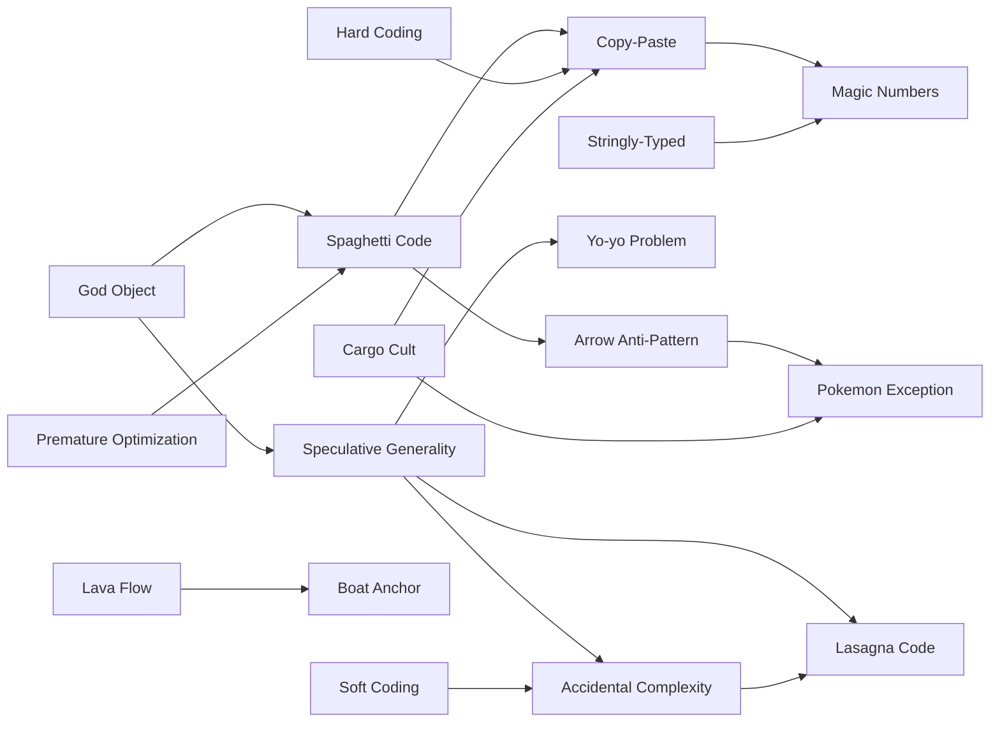

# Development Anti-Patterns

> *"There are two ways of constructing a software design: One way is to make it so simple that there are obviously no deficiencies, and the other way is to make it so complicated that there are no obvious deficiencies. The first method is far more difficult."* — C. A. R. Hoare

Development anti-patterns are **code-level** habits that individual developers introduce, often unintentionally, in day-to-day work. They live inside a single function, class, or module. You can usually spot one by reading one file.

This chapter groups **19 anti-patterns** into **3 categories** by the kind of mistake they represent.

---

## The Three Categories

| Category | What it signals | Anti-patterns |
|---|---|---|
| **Bad Structure** | Code has grown into a shape that resists change | 5 |
| **Bad Shortcuts** | Convenience taken now, paid back many times later | 6 |
| **Over-Engineering** | Effort spent solving problems you don't have | 8 |

Each category is delivered as an **8-file suite** (junior → professional + tasks/find-bug/optimize/interview), covering every anti-pattern in the category collectively.

---

## All 19 Development Anti-Patterns

### Bad Structure — code shaped to resist change

| Anti-pattern | Symptom | Primary cure |
|---|---|---|
| **God Object / God Class** | One class knows everything and does everything; thousands of lines, dozens of responsibilities | [Extract Class](../../refactoring/02-refactoring-techniques/README.md), [SRP](../../clean-code/09-classes/README.md) |
| **Spaghetti Code** | Control flow tangles across functions/files with no recognizable structure; reading top-to-bottom is impossible | [Extract Method](../../refactoring/01-code-smells/README.md), introduce clear modules |
| **Lava Flow** | Dead-but-fossilized code nobody dares delete because nobody understands it | Coverage analysis, git blame archaeology, then aggressive deletion |
| **Boat Anchor** | A piece of code, library, or system kept around "just in case" but never actually used | Delete it; the version is in git |
| **Arrow Anti-Pattern** | Deeply nested `if/else` blocks creating a "→" shape; the rightmost code is the real logic, the rest is gatekeeping | Guard clauses, early `return`, extract method, replace nested conditional with polymorphism |

### Bad Shortcuts — convenience that compounds

| Anti-pattern | Symptom | Primary cure |
|---|---|---|
| **Copy-Paste Programming** | The same logic appears in N places; a fix in one is forgotten in the others | [Extract Method / Function](../../clean-code/02-functions/README.md), [DRY principle](../../clean-code/README.md) |
| **Magic Numbers / Magic Strings** | Unexplained literals (`if (x > 86400)`, `if (status == "WTF")`) embedded in logic | Named constants, enum types, [meaningful names](../../clean-code/01-meaningful-names/README.md) |
| **Hard Coding** | Environment, credentials, paths, or business rules baked into source | Configuration, environment variables, [secrets management](../../../../Architecture/system-design/README.md) |
| **Cargo Cult Programming** | Code copied from a tutorial/StackOverflow/another project without understanding why | Read the docs; remove anything you can't justify |
| **Pokemon Exception Handling** | `catch (Exception e) { /* nothing */ }` or `except: pass` — "gotta catch 'em all" — every error becomes silence | Catch only what you can handle; rethrow with context; let unhandleable errors crash loudly; see [error-handling-patterns](../../clean-code/06-error-handling/README.md) |
| **Stringly-Typed Programming** | `String status`, `String role`, `String type` passed everywhere; the type system carries nothing; typos become runtime bugs | Enum types, domain types, value objects — let the compiler reject illegal states |

### Over-Engineering — solving problems you don't have

| Anti-pattern | Symptom | Primary cure |
|---|---|---|
| **Premature Optimization** | Hand-tuned loops, micro-benchmarks, custom data structures *before* profiling shows a bottleneck | Profile first; optimize where the data points |
| **Speculative Generality** | Abstract classes, hooks, and configuration "for the future" with exactly one current consumer | [Inline Class](../../refactoring/01-code-smells/README.md), YAGNI |
| **Gold Plating** | Features and polish added beyond what was asked for, on the author's own initiative | Smaller PRs scoped to the ticket |
| **Yo-yo Problem** | Reading code requires bouncing up and down a deep inheritance chain to find behavior | [Replace Inheritance with Delegation](../../refactoring/01-code-smells/README.md), [composition over inheritance](../../clean-code/README.md) |
| **Lasagna Code** | The inverse of Spaghetti — so many thin layers that following one call requires opening 8 files; each layer "adds" almost nothing | Collapse pass-through layers; keep abstractions that earn their place |
| **Accidental Complexity** | Difficulty that comes from the *implementation*, not the problem — frameworks, abstractions, and tooling the problem never asked for (Brooks, *No Silver Bullet*) | Distinguish essential vs accidental complexity; remove anything that doesn't serve the essential problem |
| **Soft Coding** | The opposite of Hard Coding taken too far — every value is configurable, every flow is data-driven, nothing decides anything; configuration becomes a worse programming language | Hard-code values that won't change; reserve configuration for things that actually vary |
| **Bikeshedding (Parkinson's Law of Triviality)** | Endless debate about superficial choices (naming, formatting) while real architectural questions go unanswered | Time-box trivial decisions; defer to a linter |

---

## How These Anti-Patterns Relate

Development anti-patterns rarely appear alone — they cluster.

Read these as **gravity wells**: a God Object attracts more code, which produces Spaghetti, which encourages Copy-Paste, and so on. The cure is rarely one refactoring — it's reversing the gravity by enforcing structural boundaries.

---

## Relationship to Code Smells

Many development anti-patterns and code smells overlap. The distinction:

- A **smell** is a local, syntactic observation: "this method is 400 lines."
- An **anti-pattern** is the recognized *shape* the smell creates and the wrong reasoning behind it.

| Anti-pattern | Closely related smell |
|---|---|
| God Object | Large Class |
| Spaghetti Code | Long Method + Feature Envy + Inappropriate Intimacy |
| Copy-Paste Programming | Duplicate Code |
| Magic Numbers | (No GoF/Fowler equivalent — it's a habit smell) |
| Speculative Generality | Speculative Generality (same name in both catalogs) |
| Yo-yo Problem | Refused Bequest + Parallel Inheritance Hierarchies |

> See [Code Smells](../../refactoring/01-code-smells/README.md) for the smell-level treatment.

---

## How to Read This Chapter

Each subcategory folder contains an **8-file suite**, identical to the [Design Patterns](../../design-patterns/README.md) and [Code Smells](../../refactoring/01-code-smells/README.md) sections:

| File | Focus | Audience |
|---|---|---|
| `junior.md` | "What does it look like?" "Why is it bad?" | Just learned the language |
| `middle.md` | "When does this creep in?" "What do I do instead?" | 1–3 yr experience |
| `senior.md` | "How did the codebase get here?" "How do I refactor safely at scale?" | 3–7 yr experience |
| `professional.md` | Performance, runtime, GC, and toolchain implications | 7+ yr / specialist |
| `interview.md` | 50+ Q&A across all levels | Job preparation |
| `tasks.md` | 10+ exercises with solutions | Practice |
| `find-bug.md` | 10+ snippets — spot the anti-pattern | Critical reading |
| `optimize.md` | 10+ flawed implementations to refactor | Cleanup practice |

**Recommended order:** `junior.md` → `middle.md` → `senior.md` → `professional.md` → practice files → `interview.md` for review.

Each file covers **all anti-patterns in the category collectively** — for example, `02-bad-shortcuts/middle.md` will discuss Copy-Paste, Magic Numbers, Hard Coding, and Cargo Cult together, drawing out how they reinforce each other.

---

## Categories at a Glance

```mermaid
graph TD
    DEV[Development Anti-Patterns - 19]
    DEV --> BS[Bad Structure - 5]
    DEV --> BSH[Bad Shortcuts - 6]
    DEV --> OE[Over-Engineering - 8]

    BS --> BS1[God Object]
    BS --> BS2[Spaghetti Code]
    BS --> BS3[Lava Flow]
    BS --> BS4[Boat Anchor]
    BS --> BS5[Arrow Anti-Pattern]

    BSH --> BSH1[Copy-Paste Programming]
    BSH --> BSH2[Magic Numbers / Strings]
    BSH --> BSH3[Hard Coding]
    BSH --> BSH4[Cargo Cult Programming]
    BSH --> BSH5[Pokemon Exception Handling]
    BSH --> BSH6[Stringly-Typed Programming]

    OE --> OE1[Premature Optimization]
    OE --> OE2[Speculative Generality]
    OE --> OE3[Gold Plating]
    OE --> OE4[Yo-yo Problem]
    OE --> OE5[Lasagna Code]
    OE --> OE6[Accidental Complexity]
    OE --> OE7[Soft Coding]
    OE --> OE8[Bikeshedding]
```

---

## Status

- ⬜ **Bad Structure** (God Object, Spaghetti Code, Lava Flow, Boat Anchor, Arrow Anti-Pattern) — 0/8 files
- ⬜ **Bad Shortcuts** (Copy-Paste, Magic Numbers, Hard Coding, Cargo Cult, Pokemon Exception Handling, Stringly-Typed) — 0/8 files
- ⬜ **Over-Engineering** (Premature Optimization, Speculative Generality, Gold Plating, Yo-yo, Lasagna Code, Accidental Complexity, Soft Coding, Bikeshedding) — 0/8 files

---

## References

- **AntiPatterns: Refactoring Software, Architectures, and Projects in Crisis** — Brown et al. (1998) — chapters on Development AntiPatterns.
- **Refactoring** — Martin Fowler (1999, 2nd ed. 2018) — the closest analog catalog at the smell level.
- **The Pragmatic Programmer** — Hunt & Thomas (1999, 20th anniv. ed. 2019) — DRY, YAGNI, broken windows.
- **c2 wiki — Anti-Pattern category** — [wiki.c2.com/?AntiPatternsCategory](https://wiki.c2.com/?AntiPatternsCategory)

---

## Project Context

This chapter is part of the [Anti-Patterns Roadmap](../README.md), itself part of the [Senior Project](../../../../../index.md).
