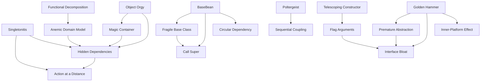

# Design Anti-Patterns

> *"There are only two hard things in computer science: cache invalidation and naming things. Everything else is design anti-patterns."* — adapted from Phil Karlton

Design anti-patterns are **class- and module-level** mistakes — the wrong shapes for OO structures, the wrong allocation of responsibilities, the wrong abstraction. You usually need to read two or more files to recognize one.

This chapter groups **20 anti-patterns** into **3 categories** by the design dimension they get wrong.

---

## The Three Categories

| Category | What it signals | Anti-patterns |
|---|---|---|
| **OO Misuse** | Object-orientation applied as procedure-with-classes | 11 |
| **Coupling & State** | Modules know or share too much | 5 |
| **Abstraction Failures** | The chosen abstraction fights the problem instead of fitting it | 4 |

Each category is delivered as an **8-file suite** (junior → professional + tasks/find-bug/optimize/interview), covering every anti-pattern in the category collectively.

---

## All 20 Design Anti-Patterns

### OO Misuse — OOP features applied wrongly

| Anti-pattern | Symptom | Primary cure |
|---|---|---|
| **Anemic Domain Model** | "Domain" objects are bags of getters/setters with no behavior; business logic lives in service classes | Move logic to the domain object — [Tell, don't ask](../../clean-code/05-objects-and-data-structures/README.md); see also [DDD](../../../../Architecture/ddd/README.md) |
| **BaseBean** | Classes inherit from a utility "Base" class to access helper methods, not for behavioral reuse | Replace inheritance with [composition / delegation](../../refactoring/01-code-smells/README.md); free-function utilities |
| **Constant Interface** | An interface defines only constants; classes "implement" it to import the names (Java idiom, but the shape appears elsewhere) | Static imports, enum types, or a plain `class Constants` |
| **Poltergeist** | A short-lived object that exists only to invoke methods on another object — appears, acts, vanishes, contributes no state | [Inline](../../refactoring/01-code-smells/README.md) the call site; remove the intermediate |
| **Object Orgy** | Objects expose internals so freely (public fields, `friend`-style access) that encapsulation is fiction | Tighten visibility; use [accessor methods, factory methods, immutability](../../clean-code/14-immutability/) |
| **Functional Decomposition** | OO project that is really a set of free functions wrapped in a class because the language requires one | Either embrace functions (Python, Go free functions) or rebuild around real objects with state |
| **Call Super** | A base class requires every subclass to call `super.method()` first/last; forgetting the call silently breaks invariants | Template Method ([Behavioral patterns](../../design-patterns/03-behavioral/README.md)) — the base handles control flow, the hook is a separate abstract method |
| **Magic Container** | `Map<String, Object>`, `dict[str, Any]`, or `Bundle` passed everywhere; type system bypassed; keys are stringly-typed and undocumented | Define a real type with named fields; let the compiler tell you what's missing |
| **Flag Arguments** | `setVisible(bool)`, `process(retry=true, async=false)` — a boolean parameter that flips behavior; the method is really two methods in one | Split into two methods (`process()` and `processAsync()`); or pass a strategy/enum, not a bool |
| **Telescoping Constructor** | `new Pizza(size)`, `new Pizza(size, crust)`, `new Pizza(size, crust, cheese)`, … — overload chain that grows quadratically | [Builder pattern](../../design-patterns/01-creational/03-builder/junior.md), named-argument syntax, fluent API |
| **Fragile Base Class** | A change to a base class silently breaks subclasses; the inheritance contract is undocumented and unenforced | Favor composition over inheritance; mark classes `final` by default; document inheritance contracts (template methods, protected hook methods only) |

### Coupling & State — modules that know or share too much

| Anti-pattern | Symptom | Primary cure |
|---|---|---|
| **Singletonitis** | Singletons everywhere — config, logger, DB, session, "manager" — all global, all hidden, all untestable | [Dependency injection](../../../../Backend/backend/README.md); reserve true singletons for genuinely process-wide resources |
| **Circular Dependency** | Module A imports B, B imports A; package graph has cycles | Introduce a third module both depend on; invert the dependency with an interface |
| **Action at a Distance** | One part of the program mysteriously changes the state of another via global variables or hidden side effects | Make state explicit (parameters, return values); favor [immutability](../../clean-code/14-immutability/) |
| **Hidden Dependencies** | A class secretly reads from globals, env vars, or filesystem; its signature lies about what it needs | Pass dependencies explicitly; document and inject |
| **Sequential Coupling** | Methods must be called in a specific order or the object misbehaves (`open()` then `read()` then `close()` — but no compiler enforcement) | [Builder pattern](../../design-patterns/01-creational/README.md), state-machine encoding, RAII / `with` / `defer` |

### Abstraction Failures — the wrong shape for the problem

| Anti-pattern | Symptom | Primary cure |
|---|---|---|
| **Golden Hammer** | Every problem solved with the same tool — same pattern, same framework, same data structure — because the author knows it well | Cultivate a wider toolkit; let the problem dictate the tool |
| **Inner-Platform Effect** | A configurable system grows until it is a worse, slower copy of the platform it's built on (custom rule engines, in-DB scripting languages) | Use the host platform; if you need extensibility, expose plugins, not a DSL |
| **Interface Bloat** | An interface has so many methods that no realistic implementer can support them all; "implementations" throw `UnsupportedOperationException` | [Interface Segregation Principle](../../clean-code/09-classes/README.md) — split into role interfaces |
| **Premature Abstraction** | An abstract base / strategy / factory introduced before there is a second concrete case; the abstraction shape is guessed and almost always wrong | Wait for **the rule of three** — extract an abstraction only after the third instance reveals the real shape |

---

## How These Anti-Patterns Relate

Design anti-patterns interact through three forces: **coupling**, **encapsulation**, and **abstraction level**.

Reading the graph: Singletonitis tends to produce Hidden Dependencies, which produce Action at a Distance — a single bad design choice cascades. The remedies cluster too — explicit DI tends to resolve all three.

---

## Relationship to Design Patterns

For every design anti-pattern, there is usually a design pattern (or principle) it inverts.

| Anti-pattern | Inverted pattern / principle |
|---|---|
| Anemic Domain Model | OO encapsulation; rich domain model |
| BaseBean | [Composition over inheritance](../../design-patterns/02-structural/README.md), Decorator |
| Singletonitis | [Dependency Injection](../../../../Backend/backend/README.md), Factory |
| Sequential Coupling | [Builder](../../design-patterns/01-creational/README.md), State |
| Interface Bloat | Interface Segregation Principle, role interfaces |
| Golden Hammer | Pattern catalogs themselves — match tool to problem |
| Inner-Platform Effect | Plugin pattern, escape hatch APIs |

> See [Design Patterns](../../design-patterns/README.md) for the positive counterparts; [SOLID](../../clean-code/09-classes/README.md) covers the underlying principles.

---

## How to Read This Chapter

Each subcategory folder contains an **8-file suite**:

| File | Focus | Audience |
|---|---|---|
| `junior.md` | "What does it look like?" "Why is it bad?" | Just learned the language |
| `middle.md` | "When does this design emerge?" "What do I do instead?" | 1–3 yr experience |
| `senior.md` | "How do I detect this in review?" "How do I migrate at scale?" | 3–7 yr experience |
| `professional.md` | Testability, performance, observability implications | 7+ yr / specialist |
| `interview.md` | 50+ Q&A across all levels | Job preparation |
| `tasks.md` | 10+ design exercises with solutions | Practice |
| `find-bug.md` | 10+ class/module snippets — spot the anti-pattern | Critical reading |
| `optimize.md` | 10+ flawed designs to redesign | Refactoring practice |

**Recommended order:** `junior.md` → `middle.md` → `senior.md` → `professional.md` → practice files → `interview.md` for review.

Each file covers **all anti-patterns in the category collectively** — `02-coupling-and-state/senior.md`, for example, will treat Singletonitis, Hidden Dependencies, and Action at a Distance as one coupled topic.

---

## Categories at a Glance

```mermaid
graph TD
    DA[Design Anti-Patterns - 20]
    DA --> OOM[OO Misuse - 11]
    DA --> CS[Coupling and State - 5]
    DA --> AF[Abstraction Failures - 4]

    OOM --> OOM1[Anemic Domain Model]
    OOM --> OOM2[BaseBean]
    OOM --> OOM3[Constant Interface]
    OOM --> OOM4[Poltergeist]
    OOM --> OOM5[Object Orgy]
    OOM --> OOM6[Functional Decomposition]
    OOM --> OOM7[Call Super]
    OOM --> OOM8[Magic Container]
    OOM --> OOM9[Flag Arguments]
    OOM --> OOM10[Telescoping Constructor]
    OOM --> OOM11[Fragile Base Class]

    CS --> CS1[Singletonitis]
    CS --> CS2[Circular Dependency]
    CS --> CS3[Action at a Distance]
    CS --> CS4[Hidden Dependencies]
    CS --> CS5[Sequential Coupling]

    AF --> AF1[Golden Hammer]
    AF --> AF2[Inner-Platform Effect]
    AF --> AF3[Interface Bloat]
    AF --> AF4[Premature Abstraction]
```

---

## Status

- ⬜ **OO Misuse** (Anemic Domain Model, BaseBean, Constant Interface, Poltergeist, Object Orgy, Functional Decomposition, Call Super, Magic Container, Flag Arguments, Telescoping Constructor, Fragile Base Class) — 0/8 files
- ⬜ **Coupling & State** (Singletonitis, Circular Dependency, Action at a Distance, Hidden Dependencies, Sequential Coupling) — 0/8 files
- ⬜ **Abstraction Failures** (Golden Hammer, Inner-Platform Effect, Interface Bloat, Premature Abstraction) — 0/8 files

---

## References

- **AntiPatterns: Refactoring Software, Architectures, and Projects in Crisis** — Brown et al. (1998) — Software Design AntiPatterns.
- **Patterns of Enterprise Application Architecture** — Martin Fowler (2002) — coined *Anemic Domain Model*.
- **Domain-Driven Design** — Eric Evans (2003) — the antidote to anemic models.
- **Clean Code** — Robert C. Martin (2008) — SRP, ISP, and many design principles violated by these anti-patterns.
- **Design Patterns** — Gamma, Helm, Johnson, Vlissides (1994) — the positive catalog.

---

## Project Context

This chapter is part of the [Anti-Patterns Roadmap](../README.md), itself part of the [Senior Project](../../../../../index.md).
