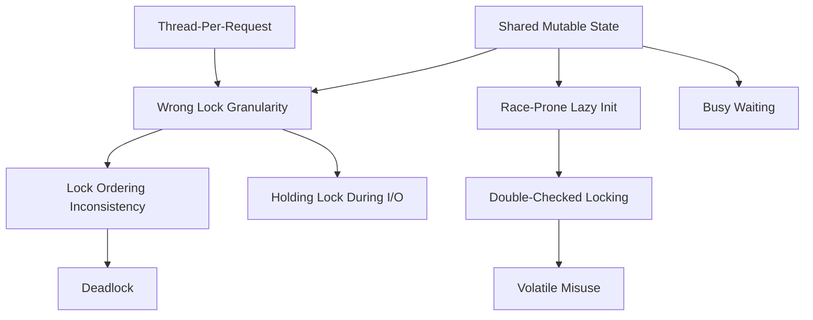
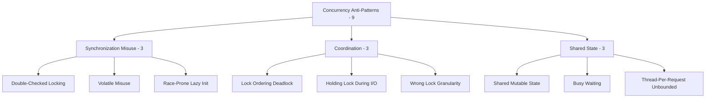

# Concurrency Anti-Patterns

> *"The single biggest problem in communication is the illusion that it has taken place."* — adapted to concurrency: the illusion that synchronization has taken place.

Concurrency anti-patterns are **multi-thread, multi-goroutine, multi-process** mistakes — coordinating mutable state across parallel execution. Symptoms are almost always intermittent: works on your machine, fails once in 10,000 runs in production. You cannot reproduce them with a unit test that doesn't itself encode the race.

> Looking for **async / Promise / await** anti-patterns (single-threaded event-loop world)? Those live in the next chapter: [Async Anti-Patterns](../04-async/README.md). The two chapters intentionally overlap on a few patterns (e.g., deadlocks have async analogues), but the failure modes are different enough to separate.

This chapter groups **9 anti-patterns** into **3 categories** by the axis of coordination they break.

---

## The Three Categories

| Category | What it signals | Anti-patterns |
|---|---|---|
| [Synchronization Misuse](01-synchronization/junior.md) | Locks and memory primitives used wrongly | 3 |
| [Coordination](02-coordination/junior.md) | Two or more lock holders fail to make progress together | 3 |
| [Shared State](03-shared-state/junior.md) | Mutable state crosses threads without protection or with the wrong protection | 3 |

Each category is delivered as an **8-file suite** covering every anti-pattern in the category collectively.

---

## All 9 Concurrency Anti-Patterns

### Synchronization Misuse — locks and memory primitives applied wrongly

| Anti-pattern | Symptom | Primary cure |
|---|---|---|
| **Double-Checked Locking** | Trying to skip a lock by checking a flag first; without correct memory barriers (`volatile`/`atomic`), the second thread sees a half-constructed object | Use language-provided lazy initialization (`sync.Once` in Go, `Lazy<T>` in C#, static initializer in Java); or always lock |
| **Volatile Misuse / Wrong Memory Ordering** | `volatile` used as if it provided mutual exclusion; or `atomic` operations chained without thinking about ordering | Use locks for mutual exclusion; use `atomic` only for genuinely independent operations; learn your platform's memory model |
| **Race-Prone Lazy Init** | `if (instance == null) instance = new X()` — two threads both observe `null`, both create instances, one is lost | `sync.Once`, double-checked locking *done correctly*, or eager init |

### Coordination — locks that don't make progress together

| Anti-pattern | Symptom | Primary cure |
|---|---|---|
| **Lock Ordering Inconsistency → Deadlock** | Thread A locks `(M1, M2)`; Thread B locks `(M2, M1)`; both wait forever | Define a global lock order and document it; or hold only one lock at a time; or use lock-free structures |
| **Holding a Lock During I/O / Long Operation** | A function takes a lock, then makes a network call or DB query; latency multiplied by contention multiplied by every caller | Copy the data, release the lock, then do the I/O; or restructure so no lock is needed across the I/O |
| **Wrong Lock Granularity** | Either one giant `synchronized` block around an entire object (kills throughput), or so many fine-grained locks that the locks themselves cost more than the work | Profile first; size locks to protect the smallest *consistent* unit of state |

### Shared State — mutable data crossing threads

| Anti-pattern | Symptom | Primary cure |
|---|---|---|
| **Shared Mutable State Without Protection** | Multiple goroutines/threads read and write the same variable without locks or channels; works 99% of the time, then corrupts | Pass-by-value, channels (Go), immutability ([clean-code/14-immutability](../../clean-code/14-immutability/)), or proper locking |
| **Busy Waiting / Spin Loop** | `while (!done) { /* nothing */ }` — burns 100% CPU waiting for a flag a coworker thread is supposed to flip | Use a condition variable, channel, semaphore, or `Future`/`Promise` — wake on the event, don't poll |
| **Thread-Per-Request without Bounds** | Spawning a new OS thread (or goroutine) for every incoming request; the OS scheduler drowns under contention or memory exhausts | Bounded worker pool, async I/O, semaphore-limited concurrency |

---

## How These Anti-Patterns Relate

The root cause is almost always **Shared Mutable State**. Every other anti-pattern is a failed attempt to coordinate access to it. The deeper cure is structural: eliminate shared mutability where you can, isolate where you cannot.

---

## A Note on Language Specifics

Concurrency primitives differ sharply across languages — but the anti-patterns recur with new names.

| Anti-pattern | Java | Go | Python | Rust |
|---|---|---|---|---|
| Double-Checked Locking | `volatile` + DCL idiom or `Holder` | `sync.Once` | `threading.Lock` + flag (rarely useful — GIL) | `OnceCell` / `LazyLock` |
| Shared Mutable State | unsynchronized fields | unsynchronized package vars | shared dict + threads | Refuses to compile without `Mutex`/`Arc` — Rust closes most of this category at compile time |
| Busy Waiting | `while(!done)` | `for !done {}` | `while not done: pass` | same |
| Lock Ordering Deadlock | `synchronized` on two monitors | two `sync.Mutex` | `threading.Lock` × 2 | same — `Mutex<T>` doesn't save you |

The 8-file suite uses **Java**, **Go**, and **Python** examples in parallel where the language has a real concurrency story; Rust appears as commentary on which anti-patterns its type system prevents.

---

## Categories at a Glance

---

## How to Read This Chapter

Each subcategory folder contains an **8-file suite**:

| File | Focus | Audience |
|---|---|---|
| `junior.md` | "What does the bug look like?" "Why is it hard to reproduce?" | First multi-threaded code |
| `middle.md` | "How do I detect it?" "What's the safer pattern?" | Has shipped concurrent code |
| `senior.md` | "How do I debug a deadlock in prod?" "How do I refactor a contended path?" | Owns concurrent systems |
| `professional.md` | Memory models, hardware ordering, lock-free data structures | Writes runtime / kernel / database code |
| `interview.md` | 50+ Q&A on concurrency anti-patterns | Job preparation |
| `tasks.md` | 10+ small concurrent programs to fix | Practice |
| `find-bug.md` | 10+ snippets — spot the race | Critical reading |
| `optimize.md` | 10+ implementations to make safe *and* fast | Performance practice |

---

## Status

- ⬜ **Synchronization Misuse** (Double-Checked Locking, Volatile Misuse, Race-Prone Lazy Init) — 0/8 files
- ⬜ **Coordination** (Lock Ordering Deadlock, Holding Lock During I/O, Wrong Lock Granularity) — 0/8 files
- ⬜ **Shared State** (Shared Mutable State, Busy Waiting, Thread-Per-Request Unbounded) — 0/8 files

---

## References

- **Java Concurrency in Practice** — Brian Goetz et al. (2006) — the canonical text on every anti-pattern in this chapter (Java-flavored but universal).
- **The Go Memory Model** — [go.dev/ref/mem](https://go.dev/ref/mem) — required reading before using `sync` or channels.
- **C++ Concurrency in Action** — Anthony Williams (2nd ed. 2019) — lock-free, memory ordering.
- **Effective Concurrency** column — Herb Sutter — decades of articles, each one teaching a single concurrency anti-pattern.
- **Programming Rust** — Blandy, Orendorff, Tindall (2nd ed. 2021) — chapter "Concurrency" shows how the type system closes most of these anti-patterns at compile time.

---

## Related Roadmaps

- [Concurrency Roadmap](../../concurrency/) — positive patterns and primitives
- [Distributed Systems](../../../../Backend/distributed-systems/README.md) — concurrency at the network scale
- [Async Anti-Patterns](../04-async/README.md) — the event-loop / Promise sibling chapter

---

## Project Context

This chapter is part of the [Coding Anti-Patterns Roadmap](../README.md), itself part of the [Senior Project](../../../../index.md).
