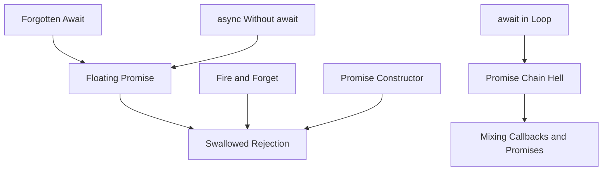
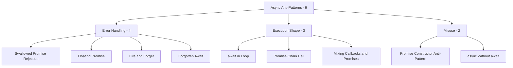

# Async Anti-Patterns

> *"Async functions don't run concurrently. `Promise.all` does. Remembering that is most of asynchronous programming."*

Async anti-patterns are **event-loop / Promise / async-await** mistakes — the single-threaded cooperative-multitasking world of JavaScript, modern Python (`asyncio`), C# (`async/await`), Rust (`tokio`), and Swift. The pitfalls are different from classical concurrency: there is no race on memory, but there is fire-and-forget, swallowed errors, accidental serialization, and "the function returned but the work didn't finish."

> Looking for **multi-thread** anti-patterns (locks, atomics, deadlocks)? See the previous chapter: [Concurrency Anti-Patterns](../03-concurrency/README.md). The two chapters share themes but the failure modes are different.

This chapter groups **9 anti-patterns** into **3 categories** by the dimension they corrupt.

---

## The Three Categories

| Category | What it signals | Anti-patterns |
|---|---|---|
| [Error Handling](01-error-handling/junior.md) | Errors fall on the floor instead of propagating | 4 |
| [Execution Shape](02-execution-shape/junior.md) | The async control flow runs differently than the code reads | 3 |
| [Misuse](03-misuse/junior.md) | Async machinery applied where it doesn't help | 2 |

Each category is delivered as an **8-file suite** covering every anti-pattern in the category collectively.

---

## All 9 Async Anti-Patterns

### Error Handling — errors that disappear silently

| Anti-pattern | Symptom | Primary cure |
|---|---|---|
| **Swallowed Promise Rejection** | `someAsync().then(handle)` — no `.catch()`. The rejection becomes an unhandled error event in the runtime, often invisible | Always `.catch()` (or use `try/catch` with `await`); install a runtime-level `unhandledRejection` handler |
| **Floating Promise** | A function calls `doAsync()` without `await` or `.then`/`.catch`; the Promise is created, runs, fails, nobody knows | `await` the result; if you genuinely don't want to wait, capture it (`void doAsync().catch(log)`) explicitly |
| **Fire and Forget (Without Logging)** | Triggering a background task with no observability — failures vanish in production | Spawn under a supervisor / task tracker; at minimum, log on failure; better: emit metrics |
| **Forgotten `await`** | `const user = getUser(id);` — `user` is now a `Promise<User>`, not a `User`. The next line dereferences `.name` on a Promise → `undefined` | Linter rule (`no-floating-promises`, `require-await`); types that prevent it (TypeScript's `Promise<T>` does not assign to `T`) |

### Execution Shape — code that runs differently than it reads

| Anti-pattern | Symptom | Primary cure |
|---|---|---|
| **`await` in a Loop** | `for (const url of urls) { await fetch(url) }` — N requests serialized when they could run in parallel | `Promise.all(urls.map(fetch))` for unbounded fan-out; `p-limit` / semaphore for bounded |
| **Promise Chain Hell / Callback Pyramid** | `.then(a => .then(b => .then(c => .then(d => …))))` — nested Promises mimic callback pyramid | `async/await`; flatten chains; extract intermediate steps |
| **Mixing Callbacks and Promises** | A function takes a callback *and* returns a Promise; or `Promise`-wraps a Node-style callback API by hand and gets it subtly wrong | Pick one model per API; use `util.promisify` (Node) or equivalent; never both |

### Misuse — async machinery applied where it doesn't help

| Anti-pattern | Symptom | Primary cure |
|---|---|---|
| **Promise Constructor Anti-Pattern** | `new Promise((resolve) => somePromiseFn().then(resolve))` — wrapping an existing Promise in a `new Promise` for no reason; errors get lost | Return the inner Promise directly; never wrap a Promise in `new Promise` |
| **`async` Without `await`** | A function marked `async` that contains no `await` and does only synchronous work; pays the cost of a microtask hop for no benefit | Drop the `async` keyword; return the value directly (return-type is auto-wrapped only if needed) |

---

## How These Anti-Patterns Relate

The root cause clusters into two:
1. **Error invisibility** — Promises that fail with no observer (Floating Promise, Swallowed Rejection, Fire-and-Forget, Promise Constructor anti-pattern).
2. **Reading code wrong** — code that looks synchronous but isn't, or looks parallel but isn't (Forgotten `await`, `await` in Loop, Promise Chain Hell).

---

## A Note on Language Specifics

Each ecosystem has its own dialect, but the anti-patterns transfer.

| Anti-pattern | JavaScript / TypeScript | Python (`asyncio`) | C# (`async/await`) | Rust (`tokio`) |
|---|---|---|---|---|
| Floating Promise | `doAsync()` (no await) | `coro()` returns a coroutine that never runs | `Task` returned and discarded | `Future` not awaited / `.await`ed |
| Forgotten Await | `Promise<T>` instead of `T` | `coroutine` object instead of value | warning CS4014 | type error — Rust catches at compile time |
| await in Loop | `for { await }` | `for ... : await` | same | `for ... { fut.await }` |
| Swallowed Rejection | `.then` without `.catch` | `await` without `try`; or `asyncio.create_task` without handler | `Task.Exception` ignored | `.unwrap()` on `Result` |
| Promise Constructor | `new Promise(r => p.then(r))` | wrapping a coroutine in another | wrapping `Task` in `Task.Run` | wrapping a `Future` |

The 8-file suite uses **JavaScript/TypeScript**, **Python**, and **C#** examples; Rust appears as commentary on what the type system prevents at compile time.

---

## Categories at a Glance

---

## How to Read This Chapter

Each subcategory folder contains an **8-file suite**:

| File | Focus | Audience |
|---|---|---|
| `junior.md` | "What does this code actually do?" "Why is the request slow?" | First async code |
| `middle.md` | "How do I parallelize correctly?" "How do I handle errors?" | Ships async services |
| `senior.md` | "How do I refactor a Promise chain at scale?" "How do I instrument async failures?" | Owns async-heavy systems |
| `professional.md` | Event-loop internals, microtask queue, structured concurrency | Runtime / framework authors |
| `interview.md` | 50+ Q&A on async anti-patterns | Job preparation |
| `tasks.md` | 10+ async programs to fix | Practice |
| `find-bug.md` | 10+ snippets — spot the async bug | Critical reading |
| `optimize.md` | 10+ implementations to make correct *and* parallel | Performance practice |

---

## Status

- ⬜ **Error Handling** (Swallowed Rejection, Floating Promise, Fire-and-Forget, Forgotten Await) — 0/8 files
- ⬜ **Execution Shape** (await in Loop, Promise Chain Hell, Mixing Callbacks and Promises) — 0/8 files
- ⬜ **Misuse** (Promise Constructor, async Without await) — 0/8 files

---

## References

- **JavaScript: The Definitive Guide** — David Flanagan (7th ed. 2020) — async / await chapter, errors and pitfalls.
- **You Don't Know JS: Async & Performance** — Kyle Simpson — deep dive on event loop and Promises.
- **PEP 3156** & **asyncio** docs — Python's async story, design rationale.
- **Async Programming in C#** — Stephen Cleary — the canonical guide; covers most of these anti-patterns by name.
- **Structured Concurrency** — Nathaniel J. Smith, *Notes on structured concurrency* (2018) — argues that fire-and-forget is an anti-pattern at the language level.
- **Tokio Tutorial** — [tokio.rs/tokio/tutorial](https://tokio.rs/tokio/tutorial) — async Rust, where the type system prevents most of these.

---

## Related Roadmaps

- [Concurrency Anti-Patterns](../03-concurrency/README.md) — multi-thread sibling chapter
- [Concurrency Roadmap](../../concurrency/) — positive patterns
- [Backend / Distributed Systems](../../../../Backend/distributed-systems/README.md) — fan-out, retry, timeout patterns at the network layer

---

## Project Context

This chapter is part of the [Coding Anti-Patterns Roadmap](../README.md), itself part of the [Senior Project](../../../../index.md).
